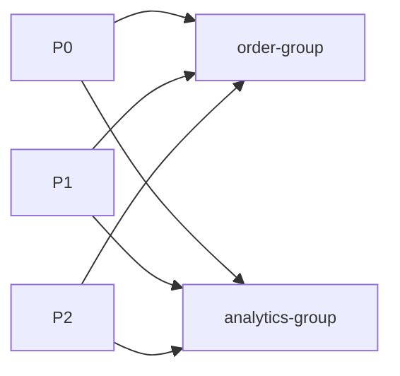
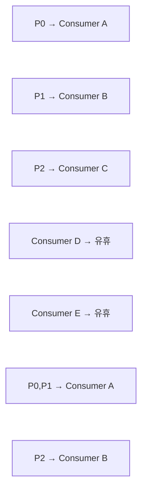
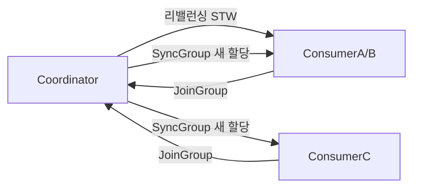
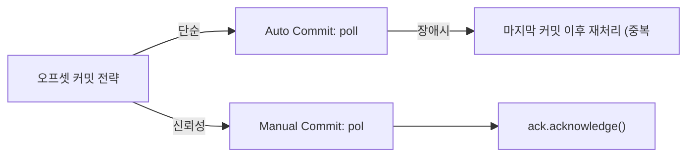
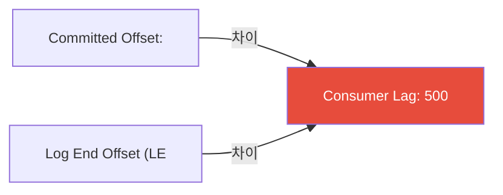
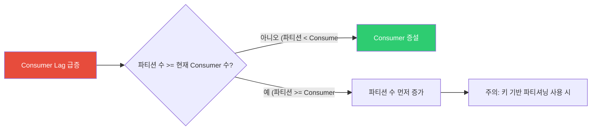
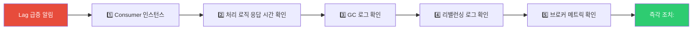

주문 이벤트 처리 속도가 발행 속도를 따라가지 못한다. 컨슈머 인스턴스를 한 대 더 띄우면 해결될까? 파티션이 3개인데 컨슈머가 이미 3개라면 4번째 컨슈머는 아무것도 하지 않고 대기만 한다. 컨슈머 그룹과 파티션 할당 원리를 모르면 장비를 늘려도 성능이 나아지지 않는다.

## 왜 이게 중요한가?

Consumer Lag(지연)이 쌓이면 실시간 처리 시스템이 배치 처리 시스템으로 전락한다. Consumer를 무조건 늘려도 파티션 수가 적으면 의미가 없고, 리밸런싱이 잦으면 증설 효과가 반감된다. 오프셋 커밋 전략을 잘못 선택하면 메시지 중복 또는 유실이 발생한다. 이 세 가지 원리를 이해하는 것이 Kafka Consumer 운영의 핵심이다.

## Consumer Group

### 비유로 이해하기

> Consumer Group은 콜센터 팀이다. 전화(메시지)가 들어오면 팀원(Consumer)이 나눠서 받는다. 한 팀원이 전화를 받는 동안 같은 팀의 다른 팀원은 그 전화를 받지 않는다. 다른 팀(Consumer Group)은 같은 전화를 독립적으로 받을 수 있다. 팀원이 너무 많으면 일부는 전화를 기다리며 대기한다 — 전화선(파티션) 수보다 팀원(Consumer) 수가 많아선 효율이 없다.

### Consumer Group이란?

여러 Consumer 인스턴스가 하나의 그룹으로 협력하여 토픽을 병렬 소비하는 단위다. 같은 그룹 내 Consumer들은 파티션을 나눠 가진다.



두 Consumer Group은 같은 토픽을 독립적으로 소비한다. order-processor 그룹의 소비 위치(오프셋)와 analytics 그룹의 소비 위치는 서로 무관하다.

### Consumer Group 핵심 원칙

파티션과 Consumer 수의 관계가 처리량을 결정한다.



핵심 규칙:
1. 한 파티션은 그룹 내 한 Consumer에만 할당된다
2. Consumer 수 > 파티션 수이면 일부 Consumer는 유휴 상태
3. Consumer 수 < 파티션 수이면 한 Consumer가 여러 파티션 담당
4. 다른 그룹 간에는 파티션을 공유하지 않고 독립 소비

---

## 파티션 할당 전략

### RangeAssignor (기본값)

토픽별로 파티션을 범위 단위로 할당한다. 여러 토픽을 구독할 때 특정 Consumer에 파티션이 집중되는 단점이 있다.

```
토픽 A (파티션 6개), 토픽 B (파티션 6개), Consumer 3개

토픽 A: P0,P1 → C1 / P2,P3 → C2 / P4,P5 → C3
토픽 B: P0,P1 → C1 / P2,P3 → C2 / P4,P5 → C3

결과: C1이 A-P0, A-P1, B-P0, B-P1 담당 (4개)
     → 파티션 수가 Consumer 수로 나눠지지 않으면 특정 Consumer에 집중
```

### RoundRobinAssignor

모든 토픽의 파티션을 Consumer에게 순차적으로 배분한다. 여러 토픽 구독 시 RangeAssignor보다 균등하다.

```
토픽 A (P0~P2), 토픽 B (P0~P2), Consumer 3개

순서: A-P0, A-P1, A-P2, B-P0, B-P1, B-P2

C1: A-P0, B-P0
C2: A-P1, B-P1
C3: A-P2, B-P2
```

### StickyAssignor

리밸런싱 후에도 기존 할당을 최대한 유지하여 이동을 최소화한다. 캐시를 활용하거나 처리 중인 상태가 있는 경우 이점이 크다.

```
리밸런싱 전: C1→{P0,P3}, C2→{P1,P4}, C3→{P2,P5}
C3 종료 후 리밸런싱:

RoundRobin: 전체 재배분 → C1,C2 할당이 바뀔 수 있음
Sticky:     C1→{P0,P3,P2} (기존 유지+P2 추가)
            C2→{P1,P4,P5} (기존 유지+P5 추가)
→ 캐시 재활용, 처리 중인 메시지 중단 최소화
```

### CooperativeStickyAssignor

Sticky와 같은 목표지만 리밸런싱 방식이 다르다. 전체 Consumer를 멈추지 않고 영향받는 파티션만 재할당하는 **점진적(Incremental) 리밸런싱**을 수행한다. 대규모 클러스터에서 리밸런싱으로 인한 중단을 최소화할 때 권장한다.

```java
// Consumer 설정
props.put(ConsumerConfig.PARTITION_ASSIGNMENT_STRATEGY_CONFIG,
    CooperativeStickyAssignor.class.getName());
```

---

## 리밸런싱

리밸런싱은 Consumer 그룹 내 파티션 할당을 재조정하는 과정이다. Consumer 추가/제거, 파티션 수 변경, 구독 토픽 변경 시 발생한다.

### Eager Rebalancing (기존 방식)



Eager 방식의 문제는 리밸런싱 동안 **전체 그룹이 소비를 중단**한다는 점이다. 대규모 그룹에서 수십 초의 지연이 발생할 수 있다.

### Cooperative (Incremental) Rebalancing

```
1. 리밸런싱 시작 → Consumer들이 현재 할당 정보와 함께 JoinGroup
2. Group Leader가 필요한 변경사항만 계산
3. 반납이 필요한 파티션을 가진 Consumer만 해당 파티션 반납
4. 다시 JoinGroup → 새 파티션 할당
5. 나머지 Consumer들은 계속 소비

장점: 영향받지 않는 파티션은 소비 중단 없음
     대규모 그룹에서 리밸런싱 시간 대폭 감소
```

### 리밸런싱 최소화 설정

```properties
# heartbeat 관련 (session timeout 내에 heartbeat 전송)
session.timeout.ms=45000        # Consumer 장애 감지 시간 (기본 45초)
heartbeat.interval.ms=3000      # heartbeat 전송 주기 (session의 1/3 권장)

# poll 관련
max.poll.interval.ms=300000     # poll() 호출 간격 최대 허용 시간 (기본 5분)
                                # 처리 시간이 이를 초과하면 Consumer 장애로 판단
max.poll.records=500            # poll() 1회 반환 레코드 최대 수

# static group membership (리밸런싱 회피)
group.instance.id=consumer-1    # Consumer에 고정 ID 부여
                                # 재시작 시 리밸런싱 없이 기존 파티션 재할당
```

### Static Group Membership

Consumer 재시작 시 `session.timeout.ms` 안에 복귀하면 리밸런싱 없이 기존 파티션을 그대로 재할당받는다. 롤링 배포 시 불필요한 리밸런싱을 방지하는 효과적인 방법이다.

```java
// Spring Kafka 설정
@Bean
public ConsumerFactory<String, String> consumerFactory() {
    Map<String, Object> props = new HashMap<>();
    props.put(ConsumerConfig.GROUP_ID_CONFIG, "order-processor");
    props.put(ConsumerConfig.GROUP_INSTANCE_ID_CONFIG, "consumer-pod-1"); // Pod 이름 등 고정값
    // ...
    return new DefaultKafkaConsumerFactory<>(props);
}
```

---

## Offset 관리

### Offset 저장 위치

Kafka 0.9 이후 Consumer Offset은 `__consumer_offsets` 내부 토픽에 저장된다. 외부 ZooKeeper에 저장하던 구조에서 Kafka 자체로 관리하도록 변경되어 ZooKeeper 의존성이 줄었다.

```
__consumer_offsets 토픽:
  Key: (group.id, topic, partition)
  Value: committed offset + metadata

예: ("order-processor", "orders", 0) → offset: 1500
```

### Auto Commit vs Manual Commit

오프셋 커밋 전략은 메시지 처리 보장 수준과 처리량 사이의 트레이드오프다.



**Manual Commit (Sync) — 권장 방식:**

```java
@KafkaListener(topics = "orders")
public void processOrder(ConsumerRecord<String, String> record,
                         Acknowledgment ack) {
    try {
        orderService.process(record.value());
        ack.acknowledge(); // 처리 완료 후 명시적 커밋
    } catch (Exception e) {
        // 커밋 안 함 → 재시작 시 재처리
        log.error("처리 실패", e);
        throw e;
    }
}

// ContainerFactory 설정
@Bean
public ConcurrentKafkaListenerContainerFactory<String, String> kafkaListenerContainerFactory() {
    ConcurrentKafkaListenerContainerFactory<String, String> factory =
        new ConcurrentKafkaListenerContainerFactory<>();
    factory.setAckMode(ContainerProperties.AckMode.MANUAL_IMMEDIATE);
    return factory;
}
```

**Async Commit — 처리량 우선 시:**

```java
consumer.commitAsync((offsets, exception) -> {
    if (exception != null) {
        log.error("Async commit failed for offsets {}", offsets, exception);
    }
});
// 장점: 처리량 높음 (블로킹 없음)
// 단점: 실패 시 재시도 순서 보장 어려움
```

### Offset 재설정

```bash
# 토픽의 처음부터 재처리
kafka-consumer-groups.sh --bootstrap-server kafka:9092 \
  --group order-processor \
  --topic orders \
  --reset-offsets \
  --to-earliest \
  --execute

# 특정 offset으로 이동
kafka-consumer-groups.sh --bootstrap-server kafka:9092 \
  --group order-processor \
  --topic orders \
  --reset-offsets \
  --to-offset 1000 \
  --execute

# 특정 시각 이후 메시지부터 재처리
kafka-consumer-groups.sh --bootstrap-server kafka:9092 \
  --group order-processor \
  --topic orders \
  --reset-offsets \
  --to-datetime 2026-05-01T00:00:00.000 \
  --execute
```

---

## Consumer Lag

### Consumer Lag이란?

Producer가 쓴 최신 오프셋(Log End Offset)과 Consumer가 처리한 오프셋(Committed Offset)의 차이다. Lag이 크면 Consumer가 실시간으로 처리하지 못하고 있다는 신호다.



### Consumer Lag 원인과 조치

| 원인 | 설명 | 조치 |
|------|------|------|
| **처리 속도 부족** | 메시지 증가 속도 > Consumer 처리 속도 | Consumer 증설, 로직 최적화 |
| **처리 로직 느림** | DB 쿼리, 외부 API 호출 등 병목 | 배치 처리, 캐싱, 비동기 처리 |
| **GC 일시 정지** | JVM GC로 인한 처리 중단 | GC 튜닝, 힙 조정 |
| **리밸런싱 빈발** | 잦은 Consumer 추가/제거 | Static membership, 리밸런싱 설정 조정 |
| **네트워크 지연** | Consumer-Broker 간 네트워크 문제 | 네트워크 점검, 브로커 근접 배포 |

### Lag 모니터링

```bash
# CLI로 Consumer Lag 확인
kafka-consumer-groups.sh --bootstrap-server kafka:9092 \
  --group order-processor \
  --describe

# 출력:
# GROUP           TOPIC  PARTITION  CURRENT-OFFSET  LOG-END-OFFSET  LAG
# order-processor orders 0          9500            10000           500
# order-processor orders 1          8000            8000            0
# order-processor orders 2          7500            7500            0
```

**Prometheus + Kafka Exporter**

```
kafka_consumergroup_lag{
  consumergroup="order-processor",
  topic="orders",
  partition="0"
} 500
```

---

## Consumer 증설 시 주의사항

### 파티션 수 먼저 확인

Consumer를 추가하기 전에 파티션 수가 충분한지 반드시 확인해야 한다. Consumer 수가 파티션 수를 초과하면 추가한 Consumer는 아무것도 처리하지 않는다.



### 증설 시 리밸런싱 영향 최소화

```
Consumer 3→4로 증가:
  리밸런싱 발생 (Eager: 전체 소비 일시 중단)
  CooperativeStickyAssignor 사용 시 영향 최소화

권장:
  1. CooperativeStickyAssignor 사용
  2. Static Group Membership으로 빠른 재참여 보장
  3. 트래픽 적은 시간대에 증설
```

---

## 장애 시나리오

### 시나리오 1: Consumer 처리 중 장애

```
상황: Consumer가 메시지 처리 중 크래시
      자동 커밋 활성화, 커밋 전 장애 발생

결과: 재시작 후 마지막 커밋 오프셋부터 재처리
      → 중복 처리 가능 (at-least-once)

방어:
  1. 멱등성 있는 소비자 로직 작성
  2. 처리 완료 후 수동 커밋 (MANUAL_IMMEDIATE)
  3. Transactional Outbox로 정확히-한번(exactly-once) 구현
```

### 시나리오 2: 독성 메시지 (Poison Pill)

특정 메시지를 처리할 때마다 예외가 발생하면 Consumer가 같은 메시지를 무한 재시도하며 Lag이 쌓인다.

```java
@Bean
public DefaultErrorHandler errorHandler(KafkaTemplate<String, String> template) {
    // DLT(Dead Letter Topic)로 전송
    DeadLetterPublishingRecoverer recoverer =
        new DeadLetterPublishingRecoverer(template,
            (r, e) -> new TopicPartition(r.topic() + ".DLT", r.partition()));

    // 3번 재시도 후 DLT로
    FixedBackOff backOff = new FixedBackOff(1000L, 3L);

    return new DefaultErrorHandler(recoverer, backOff);
}
```

DLT로 전송된 메시지는 별도 프로세스에서 원인을 분석하고 수동 재처리하거나 폐기한다.

### 시나리오 3: Consumer Group Lag 급증



---

## 모니터링 핵심 지표

| 분류 | 지표 | 의미 |
|------|------|------|
| Consumer 헬스 | `records_consumed_rate` | 초당 소비 메시지 수 |
| Consumer 헬스 | `records_lag_max` | 최대 Consumer Lag |
| 리밸런싱 | `rebalance_rate_per_second` | 리밸런싱 빈도 |
| 리밸런싱 | `last_rebalance_seconds_ago` | 마지막 리밸런싱 시간 |
| 처리 성능 | `commit_rate` | 오프셋 커밋 속도 |
| 처리 성능 | `fetch_throttle_time_avg` | fetch 쓰로틀링 시간 |

```yaml
# Grafana 대시보드용 주요 패널
- Consumer Lag per Partition (그룹별, 파티션별 Lag)
- Consumer Instance Count per Group
- Rebalancing Events Timeline
- Records Consumed Rate vs Records Produced Rate
```

---

## auto.commit을 끄면 정확히 한 번 처리된다는 착각

수동 커밋으로 전환하면 "이제 메시지가 정확히 한 번 처리된다"고 믿는 경우가 많다. 이는 틀렸다.

**함정 1: 수동 커밋도 at-least-once다**

```java
@KafkaListener(topics = "orders")
public void processOrder(ConsumerRecord<String, String> record, Acknowledgment ack) {
    orderService.process(record.value()); // 처리 완료
    // 여기서 컨슈머가 죽으면?
    ack.acknowledge();                    // 커밋 전 장애 → 재시작 후 같은 메시지 재소비
}
```

처리는 완료됐지만 커밋 전에 프로세스가 죽으면, 재시작 후 같은 메시지를 다시 처리한다. DB에 중복 주문이 생성된다. 수동 커밋은 유실을 막을 뿐, 중복을 막지 못한다.

**함정 2: commitSync()도 커밋 직전 죽으면 동일한 문제**

```java
// 이 코드도 at-least-once다
consumer.poll(Duration.ofMillis(100)).forEach(record -> {
    process(record);           // 처리 완료
    consumer.commitSync();     // 커밋 전 장애 → 재처리
});
// "처리+커밋"은 원자적이지 않다. 둘 사이에 항상 틈이 존재한다.
```

**함정 3: exactly-once는 Kafka 트랜잭션 API를 써도 어렵다**

```java
// Kafka Streams의 exactly-once는 Kafka→Kafka 파이프라인에서만 완전히 동작한다
// Kafka → 외부 DB 쓰기는 여전히 at-least-once
producer.initTransactions();
producer.beginTransaction();
producer.send("output-topic", result);
consumer.commitSync(offsets);  // Kafka 내부는 원자적
producer.commitTransaction();
// 하지만 DB INSERT는 이 트랜잭션 밖에 있다
```

**최종 방어선: 컨슈머 멱등성 설계**

```java
@Transactional
public void processOrder(String orderId, String payload) {
    // 중복 방어: UNIQUE constraint 또는 처리 여부 확인
    if (processedEventRepository.existsByEventId(orderId)) {
        log.info("이미 처리된 이벤트, 스킵: {}", orderId);
        return;
    }

    orderService.create(payload);

    // 처리 완료 기록 (DB UNIQUE constraint가 중복 방어선)
    processedEventRepository.save(new ProcessedEvent(orderId));
}
```

```sql
-- DB 레벨 방어선: 이 제약이 없으면 멱등성 보장 불가
CREATE TABLE processed_events (
    event_id VARCHAR(100) PRIMARY KEY,  -- UNIQUE constraint
    processed_at DATETIME
);
```

수동 커밋은 유실을 줄여주는 도구다. 중복을 막는 것은 애플리케이션의 멱등성 설계다. 이 두 가지를 혼동하면 중복 결제, 중복 주문 같은 실제 장애가 발생한다.

---

## 왜 Consumer 내부를 알아야 하는가?

Consumer Lag, Rebalancing, 중복 처리는 Kafka 운영에서 가장 자주 마주치는 문제다. `max.poll.interval.ms`, `session.timeout.ms`, `auto.offset.reset`의 의미를 모르면 장애 원인을 찾지 못하고 잘못된 설정으로 메시지를 유실하거나 무한 중복 처리에 빠진다.

---

## 실무에서 자주 하는 실수

**실수 1: enable.auto.commit=true + 처리 실패 무시**
자동 커밋은 `poll()` 호출 주기마다 오프셋을 커밋한다. 처리 중 예외가 발생해도 오프셋이 커밋되어 메시지가 유실된다. `enable.auto.commit=false`로 설정하고 처리 완료 후 수동으로 `commitSync()` 또는 `commitAsync()`를 호출해야 한다.

**실수 2: max.poll.interval.ms보다 긴 처리 시간**
기본값(5분)을 초과하면 Consumer가 죽은 것으로 판단해 Rebalancing이 발생한다. 오프셋 커밋 전에 파티션이 다른 Consumer에게 넘어가 메시지가 중복 처리된다. 처리 시간을 단축하거나 `max.poll.interval.ms`를 늘리되, 배치 크기(`max.poll.records`)를 줄여야 한다.

**실수 3: auto.offset.reset=latest로 신규 컨슈머 배포**
신규 Consumer Group을 `latest`로 시작하면 배포 전에 쌓인 메시지를 처리하지 못한다. `earliest`로 시작하거나, 처음 배포 시 `kafka-consumer-groups.sh --reset-offsets`로 명시적으로 오프셋을 지정해야 한다.

**실수 4: Rebalancing 중 처리 중인 메시지 손실**
Cooperative Sticky Assignor 없이 Eager Rebalancing에서는 리밸런싱 시작 시 모든 파티션 할당이 취소된다. 처리 중이던 메시지의 오프셋이 커밋되지 않으면 다른 Consumer가 같은 메시지를 다시 처리한다. `partition.assignment.strategy=CooperativeStickyAssignor`로 점진적 리밸런싱을 사용한다.

**실수 5: 하나의 Consumer Group으로 용도가 다른 처리를 묶음**
결제 이벤트를 하나의 Consumer Group에서 이메일 발송과 재고 차감을 함께 처리한다. 한쪽이 느려지면 전체 Lag이 쌓인다. 독립적인 처리는 별도 Consumer Group으로 분리해 서로 영향을 주지 않아야 한다.

---

## 면접 포인트

**Q1. Consumer Group의 동작 원리는?**
같은 Group ID의 Consumer들이 토픽 파티션을 나눠 갖는다. 각 파티션은 최대 하나의 Consumer에 할당된다. Consumer 수가 파티션 수를 초과하면 초과 Consumer는 유휴 상태가 된다. Consumer 추가/제거/장애 시 Group Coordinator가 Rebalancing을 트리거한다.

**Q2. at-least-once vs exactly-once 처리의 차이는?**
at-least-once: 처리 후 커밋 — 처리 중 장애 시 재처리로 중복 가능, 멱등성 처리 필요. exactly-once: Kafka 트랜잭션 API + `isolation.level=read_committed` — 프로듀서-컨슈머 양쪽에 트랜잭션 설정 필요, 성능 비용 증가. 대부분의 실무는 at-least-once + 멱등성 처리가 현실적이다.

**Q3. Consumer Lag을 어떻게 모니터링하는가?**
`kafka-consumer-groups.sh --describe`로 파티션별 오프셋과 Lag 확인. Prometheus + kafka_exporter로 `kafka_consumergroup_lag` 메트릭 수집. Lag이 지속적으로 증가하면 Consumer 처리 속도 < 프로듀서 생산 속도임을 의미 — Consumer 수를 파티션 수만큼 늘리거나 처리 로직을 최적화한다.

**Q4. Rebalancing이 자주 발생하는 원인과 해결책은?**
① Consumer GC pause가 `session.timeout.ms`(기본 45초)를 초과 → G1GC 튜닝, `session.timeout.ms` 증가 ② 처리 시간이 `max.poll.interval.ms` 초과 → 배치 크기 축소, 처리 시간 단축 ③ Consumer 재배포 빈번 → Rolling 배포 + Cooperative Assignor로 파티션 이동 최소화.

**Q5. Kafka Streams와 Consumer API의 차이는?**
Consumer API는 저수준으로 오프셋, 리밸런싱, 직렬화를 직접 관리한다. Kafka Streams는 Consumer/Producer를 추상화하고 stateful 처리(집계, 조인), exactly-once 처리, 내결함성 상태 저장소(RocksDB)를 기본 제공한다. 단순 이벤트 소비는 Consumer API, 스트림 처리가 필요하면 Kafka Streams 또는 Flink를 고려한다.
