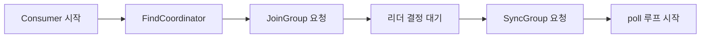
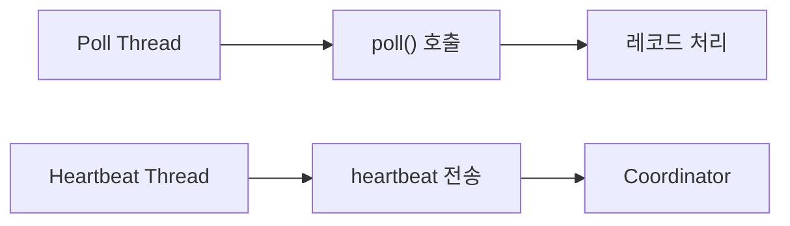
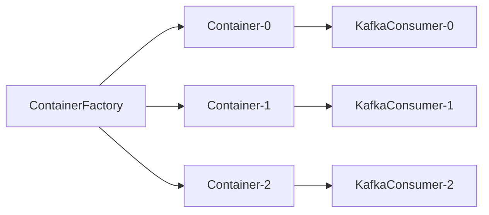

주문 이벤트 처리 속도가 발행 속도를 따라가지 못한다. 컨슈머 인스턴스를 한 대 더 띄우면 해결될까? 파티션이 3개인데 컨슈머가 이미 3개라면 4번째 컨슈머는 아무것도 하지 않고 대기만 한다. 더 심각한 문제는, 리밸런싱이 30초마다 일어나고 있다면 컨슈머를 아무리 늘려도 처리량이 오히려 줄어든다. Consumer Group Protocol, Rebalancing 메커니즘, Offset 내부 구조를 이해하지 못하면 장애가 터진 순간 원인조차 찾을 수 없다.

---

## 1. Consumer Group Protocol 내부 동작

### Group Coordinator 선택 원리

컨슈머 그룹이 브로커에 처음 연결될 때 가장 먼저 하는 일이 **Group Coordinator 찾기**다. 이 과정을 모르면 "브로커가 여러 대인데 왜 특정 브로커 하나가 과부하인가"를 설명할 수 없다.

Group Coordinator는 다음 수식으로 결정된다.

```
coordinatorPartition = hash(groupId) % __consumer_offsets.numPartitions
```

`__consumer_offsets` 토픽은 기본적으로 파티션이 50개다. `groupId`의 해시값을 50으로 나눈 나머지가 파티션 번호이고, 그 파티션의 **리더 브로커**가 해당 그룹의 Coordinator가 된다. 브로커가 3대라면 각 브로커가 약 16~17개의 Consumer Group을 담당한다.

```java
// Spring Kafka에서 group.id 설정
@Bean
public ConsumerFactory<String, String> consumerFactory() {
    Map<String, Object> props = new HashMap<>();
    props.put(ConsumerConfig.BOOTSTRAP_SERVERS_CONFIG, "kafka1:9092,kafka2:9092");
    props.put(ConsumerConfig.GROUP_ID_CONFIG, "order-processor");  // hash("order-processor") % 50 = N번 파티션
    props.put(ConsumerConfig.KEY_DESERIALIZER_CLASS_CONFIG, StringDeserializer.class);
    props.put(ConsumerConfig.VALUE_DESERIALIZER_CLASS_CONFIG, StringDeserializer.class);
    return new DefaultKafkaConsumerFactory<>(props);
}
```

컨슈머가 처음 시작되면 임의의 브로커에 `FindCoordinator` 요청을 보낸다. 그 브로커는 위 수식으로 계산한 코디네이터 브로커 주소를 반환한다. 이후 모든 그룹 관련 요청은 해당 코디네이터 브로커로만 간다.

### JoinGroup / SyncGroup 프로토콜 상세

Group Coordinator를 찾은 후의 흐름이 실제 그룹 참여 프로토콜이다. 이 프로토콜을 이해해야 리밸런싱이 왜 "멈춤"을 유발하는지 알 수 있다.



**1단계: JoinGroup 요청**

모든 컨슈머가 Coordinator에게 JoinGroup 요청을 보낸다. 요청에는 자신이 지원하는 파티션 할당 전략 목록(`partition.assignment.strategy`)이 포함된다. Coordinator는 모든 멤버의 JoinGroup 요청이 도착할 때까지 기다린 뒤(이 대기 시간이 `session.timeout.ms`와 연관), 가장 먼저 도착한 컨슈머를 **Group Leader**로 지정한다.

**2단계: Group Leader의 파티션 할당**

Coordinator는 JoinGroup 응답으로 Group Leader에게 전체 멤버 목록을 전달한다. Group Leader는 클라이언트 사이드에서 파티션 할당 연산을 수행한다. 이 설계가 핵심이다: **파티션 할당 로직이 브로커가 아닌 클라이언트에 있다.** 덕분에 브로커를 수정하지 않고 새로운 할당 전략을 플러그인 방식으로 추가할 수 있다.

**3단계: SyncGroup 요청**

Group Leader가 할당 결과를 SyncGroup 요청에 담아 Coordinator에게 전송한다. 나머지 컨슈머들도 빈 SyncGroup 요청을 보내며 대기한다. Coordinator는 각 컨슈머에게 자신에게 할당된 파티션 목록을 SyncGroup 응답으로 반환한다.

```java
// Spring Kafka @KafkaListener 선언 — 내부적으로 위 프로토콜을 수행
@Service
public class OrderConsumer {

    @KafkaListener(
        topics = "orders",
        groupId = "order-processor",
        containerFactory = "kafkaListenerContainerFactory"
    )
    public void consume(ConsumerRecord<String, String> record) {
        log.info("partition={}, offset={}, value={}",
            record.partition(), record.offset(), record.value());
    }
}
```

Spring Kafka의 `KafkaMessageListenerContainer`가 내부적으로 KafkaConsumer 클라이언트를 래핑하고, `poll()` 루프 안에서 위 프로토콜을 투명하게 처리한다.

---

## 2. Rebalancing: Stop-the-World와 그 해결

### Eager Rebalancing의 Stop-the-World 문제

기존 Eager Rebalancing은 **전체 그룹이 파티션을 반납하고 다시 할당받는** 방식이다. 컨슈머가 3개에서 4개로 늘어날 때 벌어지는 일을 보자.

```
시간 T0: C1(P0,P1), C2(P2,P3), C3(P4,P5) 정상 운영 중
시간 T1: C4 그룹 참여 → JoinGroup 요청 전송
시간 T2: Coordinator가 Rebalance 트리거
         C1, C2, C3 모두 파티션 반납 (소비 중단)
시간 T3: 모든 컨슈머 JoinGroup 요청 대기
시간 T4: Group Leader가 새 할당 계산
         C1→P0,P1 / C2→P2,P3 / C3→P4 / C4→P5
시간 T5: SyncGroup 완료 → 소비 재개
         T2~T5 구간: 전체 그룹 소비 중단 (수십 초 가능)
```

컨슈머 그룹이 100개의 파티션을 처리 중이라면, 리밸런싱 한 번에 수십 초의 처리 공백이 생긴다. 이 공백만큼 Consumer Lag이 쌓인다.

### Incremental Cooperative Rebalancing: 왜 다른가

CooperativeStickyAssignor는 리밸런싱을 **두 라운드**로 나눈다.

```
1라운드:
  C4가 JoinGroup → Coordinator가 변경 필요한 파티션 계산
  "P5는 C3에서 C4로 이동 필요"
  C3에게만 P5 반납 지시 → C3는 P5 반납, P4는 계속 소비
  C1, C2는 영향 없음 → 계속 소비

2라운드:
  C3이 P5 반납 완료 후 다시 JoinGroup
  C4에게 P5 할당
  소비 재개
```

```java
@Bean
public ConsumerFactory<String, String> consumerFactory() {
    Map<String, Object> props = new HashMap<>();
    props.put(ConsumerConfig.BOOTSTRAP_SERVERS_CONFIG, "kafka:9092");
    props.put(ConsumerConfig.GROUP_ID_CONFIG, "order-processor");
    // Incremental Cooperative Rebalancing 활성화
    props.put(ConsumerConfig.PARTITION_ASSIGNMENT_STRATEGY_CONFIG,
        CooperativeStickyAssignor.class.getName());
    props.put(ConsumerConfig.KEY_DESERIALIZER_CLASS_CONFIG, StringDeserializer.class);
    props.put(ConsumerConfig.VALUE_DESERIALIZER_CLASS_CONFIG, StringDeserializer.class);
    return new DefaultKafkaConsumerFactory<>(props);
}
```

Spring Kafka에서는 `ContainerProperties`를 통해 설정한다.

```java
@Bean
public ConcurrentKafkaListenerContainerFactory<String, String> kafkaListenerContainerFactory(
        ConsumerFactory<String, String> consumerFactory) {
    ConcurrentKafkaListenerContainerFactory<String, String> factory =
        new ConcurrentKafkaListenerContainerFactory<>();
    factory.setConsumerFactory(consumerFactory);
    factory.setConcurrency(3);  // 3개 스레드 (파티션 수와 맞출 것)
    return factory;
}
```

### Static Membership으로 불필요한 리밸런싱 차단

롤링 배포 시 컨슈머가 재시작될 때마다 리밸런싱이 발생한다. 파드가 10개라면 배포 한 번에 리밸런싱이 10회 발생한다. `group.instance.id`로 정적 멤버십을 설정하면 이를 막을 수 있다.

**동작 원리:** Coordinator는 `group.instance.id`를 기준으로 컨슈머를 식별한다. 컨슈머가 내려가도 `session.timeout.ms` 안에 같은 `group.instance.id`로 다시 연결하면 리밸런싱 없이 기존 파티션을 그대로 재할당한다.

```java
@Bean
public ConsumerFactory<String, String> consumerFactory(
        @Value("${POD_NAME:consumer-default}") String podName) {
    Map<String, Object> props = new HashMap<>();
    props.put(ConsumerConfig.GROUP_ID_CONFIG, "order-processor");
    // Kubernetes Pod 이름을 고정 ID로 사용
    // 같은 Pod 이름으로 재시작하면 리밸런싱 없이 복귀
    props.put(ConsumerConfig.GROUP_INSTANCE_ID_CONFIG, "order-processor-" + podName);
    props.put(ConsumerConfig.SESSION_TIMEOUT_MS_CONFIG, 60000); // 60초 안에 재연결하면 OK
    props.put(ConsumerConfig.PARTITION_ASSIGNMENT_STRATEGY_CONFIG,
        CooperativeStickyAssignor.class.getName());
    return new DefaultKafkaConsumerFactory<>(props);
}
```

Kubernetes 환경에서 `POD_NAME` 환경변수를 주입하면 파드가 재시작되어도 같은 이름으로 돌아와 리밸런싱을 건너뛴다. `session.timeout.ms`를 넉넉하게 설정해야 배포 시간이 길어도 리밸런싱이 트리거되지 않는다.

---

## 3. Poll 루프 내부: session.timeout.ms vs max.poll.interval.ms

이 두 설정을 혼동하면 시스템이 예상치 못한 순간에 리밸런싱을 일으킨다. 둘은 서로 다른 스레드가 담당한다.

### Heartbeat 스레드와 Poll 스레드는 분리되어 있다



KafkaConsumer 내부에는 두 개의 독립적인 타이머가 있다.

**Heartbeat Thread (session.timeout.ms):** 별도 백그라운드 스레드가 주기적으로 Coordinator에 heartbeat를 보낸다. `heartbeat.interval.ms`(기본 3초)마다 전송하고, Coordinator가 `session.timeout.ms`(기본 45초) 동안 heartbeat를 받지 못하면 해당 컨슈머가 죽었다고 판단해 리밸런싱을 트리거한다.

**Poll Thread (max.poll.interval.ms):** 애플리케이션이 `poll()`을 호출해야 레코드가 나온다. 두 번의 `poll()` 호출 사이 간격이 `max.poll.interval.ms`(기본 5분)를 초과하면, heartbeat가 정상이어도 컨슈머가 살아있다고 볼 수 없다고 판단한다. 컨슈머가 GC나 느린 처리 때문에 `poll()`을 호출하지 못하는 상황을 잡기 위함이다.

```java
@Bean
public ConsumerFactory<String, String> consumerFactory() {
    Map<String, Object> props = new HashMap<>();
    // Heartbeat 관련
    props.put(ConsumerConfig.SESSION_TIMEOUT_MS_CONFIG, 45000);      // 45초 안에 heartbeat 없으면 죽은 것으로 판단
    props.put(ConsumerConfig.HEARTBEAT_INTERVAL_MS_CONFIG, 3000);    // 3초마다 heartbeat 전송 (session의 1/3 이하 권장)

    // Poll 관련
    props.put(ConsumerConfig.MAX_POLL_INTERVAL_MS_CONFIG, 300000);   // 5분 안에 poll() 호출 안 하면 리밸런싱
    props.put(ConsumerConfig.MAX_POLL_RECORDS_CONFIG, 100);          // 한 번에 100개씩 가져옴 (처리 시간 예측 가능하게)
    return new DefaultKafkaConsumerFactory<>(props);
}
```

### 처리 시간이 긴 경우의 함정

Spring `@KafkaListener`는 메시지 처리가 완료된 후 다음 `poll()`을 호출한다. 메시지 하나 처리에 10초가 걸리고 `max.poll.records=500`이면 500개 처리에 5000초가 필요하다. 이는 `max.poll.interval.ms`를 훨씬 초과한다.

```java
@KafkaListener(topics = "orders", containerFactory = "batchListenerFactory")
public void consumeBatch(List<ConsumerRecord<String, String>> records) {
    // 처리 시간이 긴 경우: max.poll.records를 줄여야 함
    // 배치 처리로 묶어서 외부 API 호출 횟수 감소
    List<String> orderIds = records.stream()
        .map(ConsumerRecord::value)
        .collect(Collectors.toList());

    // 외부 API를 묶음 호출 (개별 호출보다 훨씬 빠름)
    orderService.processBatch(orderIds);
}

// 배치 리스너 팩토리
@Bean
public ConcurrentKafkaListenerContainerFactory<String, String> batchListenerFactory(
        ConsumerFactory<String, String> consumerFactory) {
    ConcurrentKafkaListenerContainerFactory<String, String> factory =
        new ConcurrentKafkaListenerContainerFactory<>();
    factory.setConsumerFactory(consumerFactory);
    factory.setBatchListener(true);  // 배치 모드 활성화
    return factory;
}
```

---

## 4. 파티션 할당 전략 내부 구조

### Range Assignor: 왜 불균형이 생기는가

Range는 토픽별로 파티션을 정렬 후 컨슈머 수로 나눠 연속된 범위를 할당한다.

```
토픽 A (6파티션), 토픽 B (6파티션), 컨슈머 4개

토픽 A 할당: [6 / 4 = 1.5 → 올림/내림]
  C1: P0, P1 (2개)
  C2: P2, P3 (2개)
  C3: P4     (1개)
  C4: P5     (1개)

토픽 B 할당 (동일 규칙 적용):
  C1: P0, P1 (2개)
  C2: P2, P3 (2개)
  C3: P4     (1개)
  C4: P5     (1개)

최종:
  C1 = 4개 파티션, C2 = 4개, C3 = 2개, C4 = 2개
  → C1, C2에 부하 집중
```

파티션 수가 컨슈머 수로 나누어 떨어지지 않으면 앞쪽 컨슈머들이 항상 더 많은 파티션을 갖게 된다. 구독하는 토픽이 많을수록 불균형이 누적된다.

### RoundRobin Assignor: 전체 파티션을 균등하게

모든 토픽의 파티션을 하나의 리스트로 만든 후 컨슈머에게 순차 배분한다.

```
파티션 목록(정렬): A-P0, A-P1, A-P2, A-P3, A-P4, A-P5,
                  B-P0, B-P1, B-P2, B-P3, B-P4, B-P5

컨슈머 4개:
  C1: A-P0, A-P4, B-P2  (라운드로빈)
  C2: A-P1, A-P5, B-P3
  C3: A-P2, B-P0, B-P4
  C4: A-P3, B-P1, B-P5

각 3개로 균등
```

단, 모든 컨슈머가 동일한 토픽을 구독할 때만 균등하다. 컨슈머마다 구독 토픽이 다르면 복잡도가 올라간다.

### Sticky Assignor: 이동 최소화의 수학

Sticky는 다음 두 가지를 동시에 만족하려 한다.

1. 파티션 수 균형 (RoundRobin과 동일 목표)
2. 리밸런싱 후 기존 할당 최대한 유지

```
리밸런싱 전: C1(P0,P1,P2), C2(P3,P4,P5)
C3가 새로 참여:

RoundRobin: 전체 재배분 → C1(P0,P3), C2(P1,P4), C3(P2,P5)
            C1: P2 반납, P3 새로 받음
            C2: P3 반납, P4 유지, P5→P4, P1 새로 받음

Sticky:     C1(P0,P1), C2(P3,P4), C3(P2,P5)
            C1: P2만 반납 (최소 이동)
            C2: P5만 반납 (최소 이동)
```

이동을 최소화하면 캐시 활용률이 높아지고, 처리 중이던 메시지 중단이 줄어든다.

### CooperativeSticky: Sticky + 점진적 리밸런싱

CooperativeSticky는 Sticky 알고리즘에 Incremental Cooperative 프로토콜을 결합한다. 이동이 필요한 파티션만 반납하고, 나머지는 소비를 계속한다. 대규모 클러스터 운영에서 **사실상 표준**이다.

```java
// Spring Kafka - 전략 설정 방법
@Bean
public Map<String, Object> consumerConfigs() {
    Map<String, Object> props = new HashMap<>();
    props.put(ConsumerConfig.PARTITION_ASSIGNMENT_STRATEGY_CONFIG,
        List.of(CooperativeStickyAssignor.class));
    // Eager → CooperativeStickyAssignor 마이그레이션 시:
    // 한 릴리즈에 [EagerAssignor, CooperativeStickyAssignor] 목록으로 설정 후
    // 다음 릴리즈에 CooperativeStickyAssignor 단독으로 전환
    return props;
}
```

---

## 5. Offset 관리: __consumer_offsets 내부 구조

### __consumer_offsets는 왜 Compacted Log인가

`__consumer_offsets`는 일반 토픽과 달리 **Log Compaction**이 활성화된 특수 토픽이다. 같은 Key(`groupId + topic + partition`)의 메시지가 여러 번 쓰이면, Compaction이 실행될 때 최신 값만 남기고 이전 값을 삭제한다.

```
__consumer_offsets에 기록되는 형태:

Key:   ("order-processor", "orders", 0)    ← groupId + topic + partition
Value: {offset: 1500, metadata: "", timestamp: ...}

시간이 지나면서:
offset 1200 → 1300 → 1400 → 1500 기록
Compaction 후: 1500만 남음

이유: Consumer Offset은 "현재 어디까지 읽었나"이므로
     최신 값만 의미 있다. Compaction으로 저장 공간 절약.
```

오프셋 조회는 Coordinator가 이 토픽을 읽어서 반환한다. 브로커 재시작 후에도 Compacted Log에서 최신 오프셋을 복원할 수 있다.

### Auto Commit vs Manual Commit: 왜 Auto가 위험한가

`enable.auto.commit=true`(기본값)이면 `auto.commit.interval.ms`(기본 5초)마다 백그라운드에서 오프셋을 커밋한다. 문제는 커밋이 처리 완료와 동기화되지 않는다는 점이다.

```
시간 T0: poll() → 메시지 1000~1100 가져옴
시간 T1: 메시지 1000~1050 처리 완료
시간 T2: auto.commit 발동 → offset 1100 커밋 (처리 여부 무관)
시간 T3: 메시지 1051 처리 중 예외 발생 → 컨슈머 크래시

재시작 후: offset 1100부터 재개
           1051~1100 메시지 유실됨 (처리 안 됐는데 커밋됨)
```

반면 Manual Commit은 처리 완료 후 명시적으로 커밋하므로 유실을 막는다.

```java
// Spring Kafka Manual Commit - MANUAL_IMMEDIATE 모드
@Bean
public ConcurrentKafkaListenerContainerFactory<String, String> kafkaListenerContainerFactory(
        ConsumerFactory<String, String> consumerFactory) {
    ConcurrentKafkaListenerContainerFactory<String, String> factory =
        new ConcurrentKafkaListenerContainerFactory<>();
    factory.setConsumerFactory(consumerFactory);
    // MANUAL_IMMEDIATE: ack.acknowledge() 호출 즉시 커밋
    // MANUAL: poll() 완료 시 커밋 (배치 처리에 적합)
    factory.getContainerProperties().setAckMode(ContainerProperties.AckMode.MANUAL_IMMEDIATE);
    return factory;
}

@Service
public class OrderConsumer {

    private final OrderService orderService;

    public OrderConsumer(OrderService orderService) {
        this.orderService = orderService;
    }

    @KafkaListener(topics = "orders", containerFactory = "kafkaListenerContainerFactory")
    public void processOrder(ConsumerRecord<String, String> record, Acknowledgment ack) {
        try {
            orderService.process(record.value());
            ack.acknowledge();  // 처리 완료 후에만 커밋
        } catch (RecoverableException e) {
            // 재시도 가능한 예외: 커밋하지 않음 → 재시작 시 재처리
            log.warn("일시적 오류, 재처리 예정: offset={}", record.offset(), e);
            throw e;
        } catch (NonRecoverableException e) {
            // 재처리해도 실패할 예외: DLT로 보내고 커밋
            deadLetterService.send(record);
            ack.acknowledge();  // DLT로 보냈으므로 커밋
        }
    }
}
```

### Sync vs Async Commit 트레이드오프

```java
// Sync Commit: 브로커 응답을 기다림
// 처리량 낮음, 안정성 높음
// 사용 시점: 정확성이 중요한 금융 트랜잭션
consumer.commitSync();

// Async Commit: 브로커 응답을 기다리지 않음
// 처리량 높음, 순서 역전 가능성 있음
// 사용 시점: 높은 처리량, 약간의 중복 허용 가능
consumer.commitAsync((offsets, exception) -> {
    if (exception != null) {
        // 재시도하면 안 됨: 나중에 보낸 커밋이 먼저 성공했을 수 있음
        // offset 1500이 실패했는데 재시도하면 이미 커밋된 1600을 1500으로 되돌릴 수 있음
        log.error("Async commit 실패 (재시도 금지): {}", offsets, exception);
    }
});

// 실전 패턴: 평소에는 async, 종료 시 sync
try {
    while (running) {
        records = consumer.poll(Duration.ofMillis(100));
        process(records);
        consumer.commitAsync();  // 평소: 처리량 우선
    }
} finally {
    consumer.commitSync();  // 종료 시: 마지막 오프셋 확실히 커밋
    consumer.close();
}
```

---

## 6. Consumer Lag 모니터링: Burrow 방식의 원리

### Lag 계산 공식

```
Consumer Lag = Log End Offset - Committed Offset

예:
  orders 파티션 0:
    Log End Offset    = 15000  (프로듀서가 마지막으로 쓴 위치)
    Committed Offset  = 14500  (컨슈머가 마지막으로 커밋한 위치)
    Lag               = 500
```

**Log End Offset**은 브로커에서 `listOffsets` API로 조회한다. `committed Offset`은 `__consumer_offsets`를 조회하거나 `OffsetFetchRequest`로 Coordinator에 요청한다.

### 왜 Lag 수치만으로 판단하면 안 되는가 (Burrow 철학)

LinkedIn이 만든 Burrow는 단순 Lag 수치가 아니라 **Lag 추세**로 컨슈머 상태를 판단한다. Lag이 100이어도 줄고 있으면 정상이고, Lag이 0이어도 컨슈머가 멈춰 있으면 비정상이다.

```
Burrow 판단 기준:

STOPPED: 컨슈머가 오프셋 커밋을 전혀 안 함 (죽음)
STALLED: 오프셋 커밋은 하지만 Lag이 계속 증가 (처리 속도 < 생산 속도)
OK:      Lag이 있어도 줄어들고 있음 (따라잡는 중)
```

```java
// Spring Actuator + Micrometer로 Lag 노출
@Component
public class KafkaLagMetrics {

    private final AdminClient adminClient;
    private final MeterRegistry meterRegistry;

    public KafkaLagMetrics(AdminClient adminClient, MeterRegistry meterRegistry) {
        this.adminClient = adminClient;
        this.meterRegistry = meterRegistry;
    }

    @Scheduled(fixedDelay = 10000)
    public void recordLag() {
        Map<TopicPartition, OffsetAndMetadata> committed =
            adminClient.listConsumerGroupOffsets("order-processor")
                .partitionsToOffsetAndMetadata()
                .getNow(Map.of());

        // Log End Offset 조회
        Map<TopicPartition, Long> endOffsets =
            adminClient.listOffsets(
                committed.keySet().stream()
                    .collect(Collectors.toMap(
                        tp -> tp,
                        tp -> OffsetSpec.latest()
                    ))
            ).all().getNow(Map.of())
            .entrySet().stream()
            .collect(Collectors.toMap(
                Map.Entry::getKey,
                e -> e.getValue().offset()
            ));

        // Lag 계산 후 Micrometer에 기록
        committed.forEach((tp, offsetAndMeta) -> {
            long lag = endOffsets.getOrDefault(tp, 0L) - offsetAndMeta.offset();
            Gauge.builder("kafka.consumer.lag", lag, l -> l)
                .tag("topic", tp.topic())
                .tag("partition", String.valueOf(tp.partition()))
                .tag("group", "order-processor")
                .register(meterRegistry);
        });
    }
}
```

### Prometheus 알림 규칙

```yaml
# kafka_consumer_lag Prometheus 알림
groups:
  - name: kafka-consumer
    rules:
      - alert: KafkaConsumerLagHigh
        expr: kafka_consumergroup_lag{group="order-processor"} > 10000
        for: 5m
        labels:
          severity: warning
        annotations:
          summary: "Consumer Lag 급증 (group={{ $labels.group }}, topic={{ $labels.topic }})"

      - alert: KafkaConsumerLagCritical
        expr: kafka_consumergroup_lag{group="order-processor"} > 100000
        for: 2m
        labels:
          severity: critical
        annotations:
          summary: "Consumer Lag 위험 수준"
```

---

## 7. 에러 핸들링: DLT와 RetryTopic

### DefaultErrorHandler와 DeadLetterPublishingRecoverer

Spring Kafka 2.8+ 에서 `DefaultErrorHandler`가 `SeekToCurrentErrorHandler`를 대체한다. 처리 실패 시 재시도하고, 재시도 횟수 초과 시 DLT(Dead Letter Topic)로 전송한다.

```java
@Configuration
public class KafkaErrorHandlerConfig {

    @Bean
    public DefaultErrorHandler errorHandler(
            KafkaTemplate<Object, Object> template) {

        // DLT 토픽: 원본 토픽명 + ".DLT"
        // 파티션: 원본 파티션과 동일 (메시지 순서 추적 가능)
        DeadLetterPublishingRecoverer recoverer =
            new DeadLetterPublishingRecoverer(template,
                (record, exception) -> {
                    log.error("메시지 처리 최종 실패. DLT 전송: topic={}, partition={}, offset={}, error={}",
                        record.topic(), record.partition(), record.offset(),
                        exception.getMessage());
                    // DLT 파티션을 원본과 동일하게 설정 (추적 편의)
                    return new TopicPartition(record.topic() + ".DLT", record.partition());
                });

        // ExponentialBackOff: 1초, 2초, 4초, 8초 (최대 3회)
        ExponentialBackOffWithMaxRetries backOff = new ExponentialBackOffWithMaxRetries(3);
        backOff.setInitialInterval(1000L);
        backOff.setMultiplier(2.0);
        backOff.setMaxInterval(10000L);

        DefaultErrorHandler errorHandler = new DefaultErrorHandler(recoverer, backOff);

        // 재시도 없이 즉시 DLT로 보낼 예외 목록
        // (재시도해도 절대 성공 못 할 예외들)
        errorHandler.addNotRetryableExceptions(
            JsonProcessingException.class,    // 역직렬화 실패
            IllegalArgumentException.class   // 비즈니스 검증 실패
        );

        return errorHandler;
    }

    @Bean
    public ConcurrentKafkaListenerContainerFactory<String, String> kafkaListenerContainerFactory(
            ConsumerFactory<String, String> consumerFactory,
            DefaultErrorHandler errorHandler) {
        ConcurrentKafkaListenerContainerFactory<String, String> factory =
            new ConcurrentKafkaListenerContainerFactory<>();
        factory.setConsumerFactory(consumerFactory);
        factory.setCommonErrorHandler(errorHandler);
        return factory;
    }
}
```

### Non-Blocking RetryTopic: 재시도를 별도 토픽으로

`DefaultErrorHandler`의 재시도는 블로킹 방식이다. 재시도 대기 중 파티션 소비가 멈춘다. Spring Kafka의 `@RetryableTopic`은 재시도를 별도 토픽에서 비동기로 처리한다.

```java
@Service
public class OrderConsumer {

    @RetryableTopic(
        attempts = "4",   // 최초 1회 + 재시도 3회
        backoff = @Backoff(delay = 1000, multiplier = 2.0, maxDelay = 10000),
        dltTopicSuffix = ".DLT",
        retryTopicSuffix = "-retry",
        // orders-retry-0 (1초 대기), orders-retry-1 (2초), orders-retry-2 (4초)
        topicSuffixingStrategy = TopicSuffixingStrategy.SUFFIX_WITH_INDEX_VALUE,
        include = {RetryableException.class}  // 이 예외만 재시도
    )
    @KafkaListener(topics = "orders")
    public void processOrder(ConsumerRecord<String, String> record) {
        try {
            orderService.process(record.value());
        } catch (ExternalServiceException e) {
            // 외부 서비스 오류: 재시도 대상
            throw new RetryableException("외부 서비스 일시 오류", e);
        }
    }

    // DLT 처리기 - 수동 확인 후 재처리 결정
    @DltHandler
    public void handleDlt(ConsumerRecord<String, String> record,
                          @Header(KafkaHeaders.RECEIVED_TOPIC) String topic) {
        log.error("DLT 메시지 수신: originalTopic={}, offset={}, value={}",
            topic.replace(".DLT", ""), record.offset(), record.value());
        // 알림 발송, 수동 처리 큐 등록 등
        alertService.sendDltAlert(record);
    }
}
```

`@RetryableTopic`을 사용하면 `orders`, `orders-retry-0`, `orders-retry-1`, `orders-retry-2`, `orders.DLT` 토픽이 자동으로 생성된다. 각 retry 토픽은 독립적인 컨슈머 그룹이 처리하므로 원본 토픽 소비에 영향을 주지 않는다.

### DLT 메시지 재처리 전략

```java
// DLT에 쌓인 메시지를 원본 토픽으로 재발행하는 관리 API
@RestController
@RequestMapping("/admin/kafka")
public class DltReplayController {

    private final KafkaTemplate<String, String> kafkaTemplate;
    private final KafkaConsumer<String, String> dltConsumer;

    @PostMapping("/dlt/replay")
    public ResponseEntity<String> replayDlt(
            @RequestParam String topic,
            @RequestParam(defaultValue = "0") int partition,
            @RequestParam long fromOffset,
            @RequestParam long toOffset) {

        String dltTopic = topic + ".DLT";
        TopicPartition tp = new TopicPartition(dltTopic, partition);
        dltConsumer.assign(List.of(tp));
        dltConsumer.seek(tp, fromOffset);

        int replayCount = 0;
        while (true) {
            ConsumerRecords<String, String> records = dltConsumer.poll(Duration.ofSeconds(1));
            if (records.isEmpty()) break;

            for (ConsumerRecord<String, String> record : records) {
                if (record.offset() > toOffset) break;
                // 원본 토픽으로 재발행
                kafkaTemplate.send(topic, record.key(), record.value());
                replayCount++;
            }
        }

        return ResponseEntity.ok("재처리 완료: " + replayCount + "건");
    }
}
```

---

## 8. Concurrency: 스레드 모델과 파티션 순서 보장

### ConcurrentKafkaListenerContainerFactory의 내부 구조

`concurrency=3`으로 설정하면 내부적으로 3개의 `KafkaMessageListenerContainer`가 생성된다. 각 컨테이너는 독립적인 스레드에서 KafkaConsumer를 운영한다. KafkaConsumer는 스레드 안전하지 않으므로 하나의 컨슈머는 반드시 하나의 스레드에서만 사용된다.



```java
@Bean
public ConcurrentKafkaListenerContainerFactory<String, String> kafkaListenerContainerFactory(
        ConsumerFactory<String, String> consumerFactory) {
    ConcurrentKafkaListenerContainerFactory<String, String> factory =
        new ConcurrentKafkaListenerContainerFactory<>();
    factory.setConsumerFactory(consumerFactory);
    // concurrency=3: 파티션이 6개라면 각 컨슈머가 2개 파티션씩 담당
    // concurrency > 파티션 수: 초과 컨슈머는 유휴 (낭비)
    // concurrency = 파티션 수: 최적 (각 컨슈머가 1개 파티션 전담)
    factory.setConcurrency(3);
    factory.getContainerProperties().setAckMode(ContainerProperties.AckMode.MANUAL_IMMEDIATE);
    return factory;
}
```

### 파티션 레벨 순서 보장: 왜 컨슈머 간 공유가 안 되는가

같은 키의 메시지는 같은 파티션에 들어간다. 하나의 파티션을 두 컨슈머가 동시에 읽으면 순서가 깨진다. 따라서 Kafka는 **파티션 당 하나의 컨슈머**를 강제한다.

```java
// 같은 orderId는 항상 같은 파티션으로 가고
// 같은 파티션은 항상 같은 컨슈머가 처리 → 주문 이벤트 순서 보장
@Service
public class OrderProducer {

    private final KafkaTemplate<String, String> kafkaTemplate;

    public void sendOrderEvent(String orderId, String event) {
        // Key = orderId: 같은 주문의 이벤트는 같은 파티션에 순서대로 쌓임
        kafkaTemplate.send("orders", orderId, event);
    }
}

// 컨슈머에서 같은 orderId의 이벤트는 항상 순서대로 처리됨
@KafkaListener(topics = "orders", groupId = "order-processor")
public void processOrder(ConsumerRecord<String, String> record) {
    String orderId = record.key();    // 같은 orderId → 같은 파티션 → 순서 보장
    String event = record.value();
    orderStateMachine.process(orderId, event);  // 상태 머신에 순서대로 적용
}
```

### 하나의 파티션 내에서 멀티 스레드 처리

파티션 레벨 순서 보장이 필요하면서 처리량도 높이고 싶을 때는, 파티션 안에서 Key별로 처리를 분리하는 패턴을 사용한다.

```java
@KafkaListener(topics = "orders", groupId = "order-processor")
public void processOrder(ConsumerRecord<String, String> record) {
    String orderId = record.key();

    // 같은 orderId는 같은 스레드에서 순서대로 처리 (순서 보장)
    // 다른 orderId는 다른 스레드에서 병렬 처리 (처리량 향상)
    orderProcessorThreadPool
        .getExecutorForKey(orderId)  // orderId 해시 기반으로 스레드 선택
        .submit(() -> orderService.process(orderId, record.value()));
    // 단, 이 경우 ack 처리를 신중하게 해야 함
    // 비동기 처리 완료 전에 ack하면 장애 시 유실 가능
}
```

---

## 9. 극한 시나리오

### 시나리오 1: Poison Pill로 Consumer Group 마비

**상황:** 역직렬화 불가능한 메시지가 파티션 0에 들어왔다. `@KafkaListener`가 예외를 던지고, 재시도 후에도 계속 실패한다. 해당 파티션의 오프셋이 전진하지 못하고, Lag이 무한히 쌓인다.

**무엇이 일어나는가:** Spring Kafka의 기본 동작은 예외 발생 시 같은 오프셋을 seek back해서 재처리를 시도한다. `DefaultErrorHandler` 없이는 이 루프가 영원히 반복된다.

```java
@Configuration
public class KafkaConfig {

    @Bean
    public DefaultErrorHandler poisonPillHandler(
            KafkaTemplate<Object, Object> template) {

        DeadLetterPublishingRecoverer recoverer =
            new DeadLetterPublishingRecoverer(template);

        // 즉시 DLT 전송 (재시도 없음)
        FixedBackOff noRetry = new FixedBackOff(0L, 0L);
        DefaultErrorHandler handler = new DefaultErrorHandler(recoverer, noRetry);

        // 역직렬화 실패는 재시도 의미 없음
        handler.addNotRetryableExceptions(
            DeserializationException.class,
            MessageConversionException.class
        );

        return handler;
    }

    @Bean
    public ConsumerFactory<String, String> consumerFactory() {
        Map<String, Object> props = new HashMap<>();
        // 역직렬화 실패 시 예외를 Consumer에 전달 (DLT로 보낼 수 있게)
        props.put(ConsumerConfig.VALUE_DESERIALIZER_CLASS_CONFIG,
            ErrorHandlingDeserializer.class);
        props.put(ErrorHandlingDeserializer.VALUE_DESERIALIZER_CLASS,
            JsonDeserializer.class.getName());
        return new DefaultKafkaConsumerFactory<>(props);
    }
}
```

### 시나리오 2: GC Pause로 인한 반복 리밸런싱

**상황:** 주문량 급증으로 힙 사용률이 90% 이상. Full GC가 30~60초 동안 일어난다. 이 시간 동안 heartbeat가 전송되지 않아 `session.timeout.ms`(45초) 초과 → 리밸런싱 발생. GC 완료 후 컨슈머 복귀 → 또 리밸런싱. 이 사이클이 반복되면서 Consumer Group이 실질적으로 소비를 못 한다.

```
GC Start → heartbeat 중단 → session timeout → 리밸런싱 시작
GC End   → 컨슈머 복귀 → JoinGroup → 리밸런싱
GC Start → ...반복...

결과: 리밸런싱이 소비보다 더 자주 발생
     Lag이 지수적으로 증가
```

**대응:**

```java
@Bean
public ConsumerFactory<String, String> consumerFactory() {
    Map<String, Object> props = new HashMap<>();
    // GC Pause 대응: session.timeout을 늘리고
    props.put(ConsumerConfig.SESSION_TIMEOUT_MS_CONFIG, 120000);  // 2분
    props.put(ConsumerConfig.HEARTBEAT_INTERVAL_MS_CONFIG, 10000); // 10초
    // 배치 크기 줄여서 GC 압력 감소
    props.put(ConsumerConfig.MAX_POLL_RECORDS_CONFIG, 50);
    // Static Membership: GC 완료 후 빠른 복귀
    props.put(ConsumerConfig.GROUP_INSTANCE_ID_CONFIG, "consumer-" + System.getenv("POD_NAME"));
    return new DefaultKafkaConsumerFactory<>(props);
}
```

JVM 설정도 병행해야 한다.

```bash
# G1GC 튜닝 (STW GC Pause 최소화)
-XX:+UseG1GC
-XX:MaxGCPauseMillis=200          # GC Pause 목표 200ms
-XX:G1HeapRegionSize=16m
-Xmx4g -Xms4g                    # 힙 크기 고정 (동적 조정 방지)
-XX:+HeapDumpOnOutOfMemoryError
```

### 시나리오 3: 브로커 롤링 재시작 중 오프셋 커밋 실패

**상황:** 클러스터 업그레이드로 브로커가 하나씩 재시작된다. `__consumer_offsets` 파티션 리더가 이동하는 순간, Coordinator가 잠시 불가하다. 이때 `commitSync()`가 `CommitFailedException`을 던진다.

```java
@KafkaListener(topics = "orders")
public void processOrder(ConsumerRecord<String, String> record, Acknowledgment ack) {
    try {
        orderService.process(record.value());
        // ack.acknowledge() 내부에서 commitSync() 호출
        // 브로커 재시작 중 CoordinatorNotAvailableException 발생 가능
        ack.acknowledge();
    } catch (Exception e) {
        // Spring Kafka가 RetriableCommitFailedException을 자동 재시도
        // 하지만 CommitFailedException(리밸런싱으로 파티션 박탈됨)은 재시도 불가
        if (e instanceof CommitFailedException) {
            log.warn("파티션 박탈됨. 이 메시지는 다른 컨슈머가 재처리할 것: offset={}", record.offset());
            // 처리 결과를 롤백해야 함 (DB에 이미 썼다면 보상 트랜잭션)
        }
        throw e;
    }
}
```

**핵심:** `CommitFailedException`은 파티션이 이미 다른 컨슈머에게 넘어갔음을 의미한다. 이 경우 처리 결과를 DB에 썼다면 보상 처리(rollback 또는 compensating transaction)가 필요하다.

### 시나리오 4: Consumer Lag 폭증 후 따라잡기 중 메모리 부족

**상황:** 6시간 동안 Consumer가 중단됐다. 재시작 후 밀린 Lag(수백만 건)을 처리하려고 `max.poll.records=500`으로 빠르게 처리하다가 메모리 부족으로 OOM 발생.

```java
// Lag 크기에 따라 동적으로 배치 크기 조정
@Component
public class AdaptivePollRecordsConfig {

    private final AdminClient adminClient;
    private final Environment env;

    @EventListener(ApplicationStartedEvent.class)
    public void adjustPollRecords() {
        long totalLag = calculateTotalLag("order-processor", "orders");

        int pollRecords;
        if (totalLag > 1_000_000) {
            // 대량 따라잡기: 메모리 절약 우선
            pollRecords = 50;
            log.warn("대량 Lag 감지 ({}건). 배치 크기 {} 적용", totalLag, pollRecords);
        } else if (totalLag > 100_000) {
            pollRecords = 200;
        } else {
            // 정상 상태: 처리량 우선
            pollRecords = 500;
        }

        // 환경 설정 동적 변경 (재시작 없이)
        // 실제로는 ConfigurableApplicationContext를 통해 변경하거나
        // 컨테이너 재시작으로 적용
        log.info("max.poll.records={} 적용", pollRecords);
    }

    private long calculateTotalLag(String groupId, String topic) {
        // AdminClient로 Lag 계산 (앞 섹션의 코드 참고)
        return 0L; // 실제 구현 생략
    }
}
```

---

## 10. 면접 포인트 5가지

<details>
<summary>펼쳐보기</summary>


### Q1. Group Coordinator는 어떻게 선택되는가?

**답:** `hash(groupId) % __consumer_offsets.numPartitions` 수식으로 파티션 번호를 결정하고, 그 파티션의 리더 브로커가 Coordinator가 된다. `__consumer_offsets`는 기본 50개 파티션이므로, 그룹 ID의 해시값을 50으로 나눈 나머지로 파티션을 결정한다.

**WHY가 중요한 이유:** 이 수식을 알면 "왜 특정 브로커에만 부하가 집중되는가"를 설명할 수 있다. 그룹 ID를 균등하게 분산시키거나, `__consumer_offsets` 파티션 수를 늘려야 한다. 또한 브로커 한 대가 죽으면 그 브로커가 담당하던 모든 그룹의 Coordinator가 바뀌고 일제히 리밸런싱이 발생한다.

### Q2. session.timeout.ms와 max.poll.interval.ms의 차이는?

**답:** `session.timeout.ms`는 Heartbeat Thread가 Coordinator에게 heartbeat를 보내지 못하는 최대 허용 시간이다. 이를 초과하면 브로커가 컨슈머가 죽었다고 판단한다. `max.poll.interval.ms`는 애플리케이션 스레드가 `poll()`을 호출하는 최대 간격이다. GC나 느린 처리로 `poll()`이 늦어지면, heartbeat는 정상이어도 리밸런싱이 발생한다.

**WHY가 중요한 이유:** "heartbeat는 보내고 있는데 리밸런싱이 왜 발생하나"라는 질문의 답이 여기 있다. 처리 로직이 무거울수록 `max.poll.records`를 줄이거나 `max.poll.interval.ms`를 늘려야 한다. 두 설정을 혼동해서 `session.timeout.ms`만 늘리면 처리 지연으로 인한 리밸런싱을 잡을 수 없다.

### Q3. Eager vs Cooperative Rebalancing의 차이와 운영 영향은?

**답:** Eager는 리밸런싱 시작 시 모든 파티션을 반납하고 처음부터 재할당한다. 리밸런싱 전체 시간 동안 그룹 소비가 멈춘다(Stop-the-World). Cooperative는 이동이 필요한 파티션만 단계적으로 반납하고 나머지는 계속 소비한다.

**WHY가 중요한 이유:** 파티션 100개, 컨슈머 20개 환경에서 컨슈머 하나가 재시작될 때 Eager면 전체 100개 파티션의 소비가 10~30초 멈춘다. Cooperative면 재시작된 컨슈머의 파티션(5개)만 잠깐 멈추고 나머지 95개는 계속 소비한다. 롤링 배포 시 Eager + 파드 20개라면 배포 내내 리밸런싱이 반복된다.

### Q4. at-least-once와 exactly-once의 실제 구현 차이는?

**답:** at-least-once는 처리 후 커밋이지만, 커밋 직전 크래시 시 재처리로 중복이 발생한다. 이를 멱등성(idempotency)으로 방어한다. exactly-once는 Kafka 트랜잭션 API(`producer.beginTransaction()`, `consumer.commitSync(offsets)`, `producer.commitTransaction()`)로 Producer 전송과 Offset 커밋을 원자적으로 묶는다. 단, Kafka→Kafka 파이프라인에서만 완전하다. Kafka→외부 DB 쓰기는 외부 DB가 2PC를 지원하지 않으면 exactly-once 불가능이다.

**WHY가 중요한 이유:** "수동 커밋으로 exactly-once 달성했다"는 착각이 중복 결제 같은 장애로 이어진다. 수동 커밋은 유실을 줄이는 것이지 중복을 막는 것이 아니다. 실무에서는 at-least-once + DB UNIQUE constraint + 처리 여부 테이블이 가장 현실적인 해법이다.

### Q5. Consumer Lag이 0인데 처리가 안 된다는 신고가 들어왔다. 어떻게 디버깅하는가?

**답:** Lag이 0이지만 처리가 안 된다면 다음 순서로 확인한다.

1. 컨슈머 그룹이 아예 오프셋 커밋을 안 하고 있는지 확인: Burrow의 STOPPED 상태, 또는 `committed offset`이 변하지 않음
2. 컨슈머가 살아는 있지만 처리 로직에서 예외를 던지고 DLT로 보내는 경우: Lag은 0(오프셋 진행)이지만 실제 처리는 DLT로 빠짐
3. 올바른 Consumer Group을 보고 있는지 확인: 다른 그룹이 소비하고 있거나, 그룹 이름이 바뀐 경우
4. `auto.offset.reset=latest`로 신규 그룹 시작: 이전 메시지가 없으므로 Lag이 0이지만 처리도 0

**WHY가 중요한 이유:** Lag = 0을 "정상"으로 해석하는 실수가 많다. Lag 수치뿐 아니라 Committed Offset의 변화 속도(오프셋 커밋 레이트)를 함께 모니터링해야 한다. 오프셋 커밋이 없으면 컨슈머가 죽었거나 처리를 못 하고 있는 것이다.

---

## 11. 운영 설정 레퍼런스

### Spring Kafka 전체 설정 예시

```java
@Configuration
@EnableKafka
public class KafkaConsumerConfig {

    @Value("${kafka.bootstrap-servers}")
    private String bootstrapServers;

    @Value("${kafka.consumer.group-id}")
    private String groupId;

    @Value("${POD_NAME:consumer-default}")
    private String podName;

    @Bean
    public ConsumerFactory<String, String> consumerFactory() {
        Map<String, Object> props = new HashMap<>();

        // 연결
        props.put(ConsumerConfig.BOOTSTRAP_SERVERS_CONFIG, bootstrapServers);
        props.put(ConsumerConfig.GROUP_ID_CONFIG, groupId);
        props.put(ConsumerConfig.GROUP_INSTANCE_ID_CONFIG, groupId + "-" + podName);

        // 역직렬화
        props.put(ConsumerConfig.KEY_DESERIALIZER_CLASS_CONFIG, StringDeserializer.class);
        props.put(ConsumerConfig.VALUE_DESERIALIZER_CLASS_CONFIG, ErrorHandlingDeserializer.class);
        props.put(ErrorHandlingDeserializer.VALUE_DESERIALIZER_CLASS, JsonDeserializer.class.getName());
        props.put(JsonDeserializer.TRUSTED_PACKAGES, "com.example.orders.dto");

        // 오프셋
        props.put(ConsumerConfig.ENABLE_AUTO_COMMIT_CONFIG, false);
        props.put(ConsumerConfig.AUTO_OFFSET_RESET_CONFIG, "earliest");

        // Poll 설정
        props.put(ConsumerConfig.MAX_POLL_RECORDS_CONFIG, 100);
        props.put(ConsumerConfig.MAX_POLL_INTERVAL_MS_CONFIG, 300000);  // 5분

        // Session / Heartbeat
        props.put(ConsumerConfig.SESSION_TIMEOUT_MS_CONFIG, 45000);     // 45초
        props.put(ConsumerConfig.HEARTBEAT_INTERVAL_MS_CONFIG, 3000);   // 3초

        // 파티션 할당 전략
        props.put(ConsumerConfig.PARTITION_ASSIGNMENT_STRATEGY_CONFIG,
            List.of(CooperativeStickyAssignor.class));

        // Fetch 성능
        props.put(ConsumerConfig.FETCH_MIN_BYTES_CONFIG, 1024);          // 최소 1KB 채워서 가져옴
        props.put(ConsumerConfig.FETCH_MAX_WAIT_MS_CONFIG, 500);         // 최대 500ms 대기
        props.put(ConsumerConfig.MAX_PARTITION_FETCH_BYTES_CONFIG, 1048576); // 파티션당 최대 1MB

        return new DefaultKafkaConsumerFactory<>(props);
    }

    @Bean
    public ConcurrentKafkaListenerContainerFactory<String, String> kafkaListenerContainerFactory(
            ConsumerFactory<String, String> consumerFactory,
            DefaultErrorHandler errorHandler) {
        ConcurrentKafkaListenerContainerFactory<String, String> factory =
            new ConcurrentKafkaListenerContainerFactory<>();
        factory.setConsumerFactory(consumerFactory);
        factory.setConcurrency(3);
        factory.getContainerProperties().setAckMode(ContainerProperties.AckMode.MANUAL_IMMEDIATE);
        factory.setCommonErrorHandler(errorHandler);

        // 리밸런싱 이벤트 리스너 (모니터링용)
        factory.getContainerProperties().setConsumerRebalanceListener(
            new ConsumerAwareRebalanceListener() {
                @Override
                public void onPartitionsRevokedBeforeCommit(Consumer<?, ?> consumer,
                        Collection<TopicPartition> partitions) {
                    log.warn("파티션 반납 시작: {}", partitions);
                }

                @Override
                public void onPartitionsAssigned(Consumer<?, ?> consumer,
                        Collection<TopicPartition> partitions) {
                    log.info("파티션 할당 완료: {}", partitions);
                }
            }
        );

        return factory;
    }

    @Bean
    public DefaultErrorHandler errorHandler(KafkaTemplate<Object, Object> template) {
        DeadLetterPublishingRecoverer recoverer =
            new DeadLetterPublishingRecoverer(template,
                (r, e) -> new TopicPartition(r.topic() + ".DLT", r.partition()));

        ExponentialBackOffWithMaxRetries backOff = new ExponentialBackOffWithMaxRetries(3);
        backOff.setInitialInterval(1000L);
        backOff.setMultiplier(2.0);

        DefaultErrorHandler handler = new DefaultErrorHandler(recoverer, backOff);
        handler.addNotRetryableExceptions(
            DeserializationException.class,
            JsonProcessingException.class
        );

        return handler;
    }
}
```

### 핵심 설정 요약표

| 설정 | 기본값 | 권장값 | 영향 |
|------|--------|--------|------|
| `enable.auto.commit` | true | false | 수동 커밋으로 유실 방지 |
| `max.poll.records` | 500 | 100~200 | 처리 시간 예측 가능성 |
| `max.poll.interval.ms` | 300000 | 처리 시간 × 2 | 리밸런싱 방지 |
| `session.timeout.ms` | 45000 | 45000~120000 | GC 대응 |
| `heartbeat.interval.ms` | 3000 | session의 1/3 | heartbeat 주기 |
| `group.instance.id` | 없음 | Pod 이름 | 정적 멤버십 |
| `partition.assignment.strategy` | Range | CooperativeSticky | 리밸런싱 영향 최소화 |
| `auto.offset.reset` | latest | earliest | 새 그룹 시작 위치 |

---

## 12. 실수와 함정

### 함정 1: 수동 커밋 = exactly-once라는 착각

수동 커밋은 처리 완료 후 커밋하므로 **유실을 줄인다.** 하지만 커밋 직전 크래시 시 재시작 후 같은 메시지를 재처리한다. 수동 커밋은 **at-least-once**다. exactly-once를 원하면 DB UNIQUE constraint와 처리 여부 테이블이 필요하다.

```java
// at-least-once (수동 커밋)
orderService.process(record.value());  // 처리 완료
// 여기서 죽으면 재처리 → 중복
ack.acknowledge();

// 멱등성으로 중복 방어
@Transactional
public void process(String eventId, String payload) {
    if (processedEventRepo.existsById(eventId)) return;  // 중복 방어
    orderRepo.save(Order.from(payload));
    processedEventRepo.save(new ProcessedEvent(eventId));
}
```

### 함정 2: concurrency > 파티션 수는 낭비

파티션이 6개인데 `concurrency=10`으로 설정하면 컨슈머 4개는 아무것도 하지 않고 메모리와 연결 자원만 소비한다.

```java
// 파티션 수와 concurrency를 일치시키거나 적게 설정
// 파티션 6개: concurrency=6 (각 컨슈머가 1개 파티션 전담, 최적)
// 파티션 6개: concurrency=3 (각 컨슈머가 2개 파티션 처리, 리소스 절약)
factory.setConcurrency(Math.min(desiredConcurrency, partitionCount));
```

### 함정 3: Eager → CooperativeSticky 전환 시 롤링 업데이트 주의

RangeAssignor 또는 StickyAssignor에서 CooperativeStickyAssignor로 바로 전환하면 리밸런싱 중 프로토콜 불일치 오류가 발생한다. 반드시 중간 단계가 필요하다.

```java
// 1단계 (현재 릴리즈): 기존 전략 + Cooperative 병행 설정
props.put(ConsumerConfig.PARTITION_ASSIGNMENT_STRATEGY_CONFIG,
    List.of(RangeAssignor.class, CooperativeStickyAssignor.class));

// 2단계 (다음 릴리즈): CooperativeSticky 단독 (모든 인스턴스가 1단계 완료 후)
props.put(ConsumerConfig.PARTITION_ASSIGNMENT_STRATEGY_CONFIG,
    List.of(CooperativeStickyAssignor.class));
```

### 함정 4: auto.offset.reset=latest로 신규 그룹 배포

새로운 Consumer Group을 `latest`로 배포하면 배포 이전에 쌓인 메시지를 전혀 처리하지 않는다. 배포 직전까지 발행된 주문 이벤트가 사라진다.

```bash
# 신규 그룹 배포 전: earliest로 오프셋 설정
kafka-consumer-groups.sh --bootstrap-server kafka:9092 \
  --group new-order-processor \
  --topic orders \
  --reset-offsets \
  --to-earliest \
  --execute

# 또는 특정 시각 이후부터 처리
kafka-consumer-groups.sh --bootstrap-server kafka:9092 \
  --group new-order-processor \
  --topic orders \
  --reset-offsets \
  --to-datetime 2026-05-13T09:00:00.000 \
  --execute
```

---

## 정리

Kafka Consumer의 복잡성은 분산 환경에서 **"누가 어떤 파티션을 처리하는가"**와 **"어디까지 처리했는가"**를 정확하고 효율적으로 관리하는 문제로 귀결된다.

Group Coordinator 선택 수식에서 시작해, JoinGroup/SyncGroup 프로토콜로 파티션을 배분하고, Heartbeat Thread와 Poll Thread가 독립적으로 살아있음을 증명하며, `__consumer_offsets`의 Compacted Log에 처리 위치를 기록한다. 이 흐름 전체를 이해해야 Lag 급증, 반복 리밸런싱, 메시지 중복 같은 운영 문제의 근본 원인을 찾고 수정할 수 있다.

CooperativeStickyAssignor + Static Membership + Manual Commit + DeadLetterPublishingRecoverer의 조합이 현재 시점에서 프로덕션 환경에 권장되는 기본 구성이다.

</details>
