## 들어가며

결제 완료 이벤트가 Kafka에 두 번 발행됐다. 컨슈머가 중복으로 처리해 고객에게 포인트가 두 배 적립됐다. 반대로 브로커 장애 순간에 발행된 메시지는 ACK 없이 사라졌고, 주문은 DB에만 남아 배달 시스템이 전혀 몰랐다. 이 두 시나리오는 Kafka를 쓰는 모든 팀이 반드시 이해하고 방어해야 할 극한 상황이다.

> **비유**: Kafka 장애는 우체국 화재와 같다. 편지가 불에 탔는지(유실), 복사본이 두 개 배달됐는지(중복), 어느 쪽이 더 나쁜지는 편지 내용(비즈니스 로직)에 달려 있다.

Kafka는 고가용성 분산 시스템이지만, 극한 상황에서는 예상치 못한 동작이 발생한다. 각 시나리오를 이해하고 방어 전략을 갖추는 것이 프로덕션 운영의 핵심이다.

---

## 시나리오 1: 브로커 장애 시 리더 선출과 데이터 유실

### 상황 설정

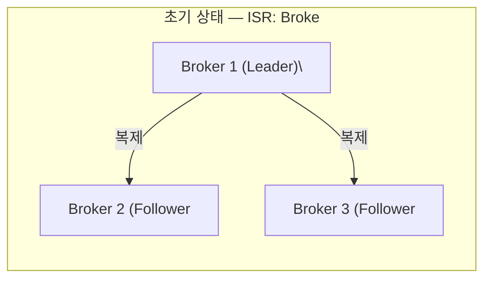

### 장애 발생과 데이터 유실 경로

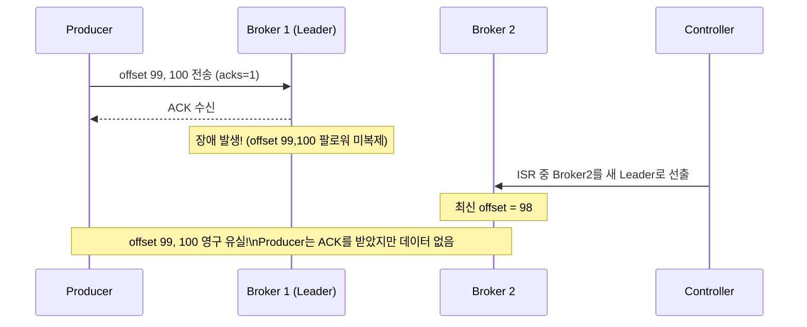

### acks=all 설정 시 시나리오

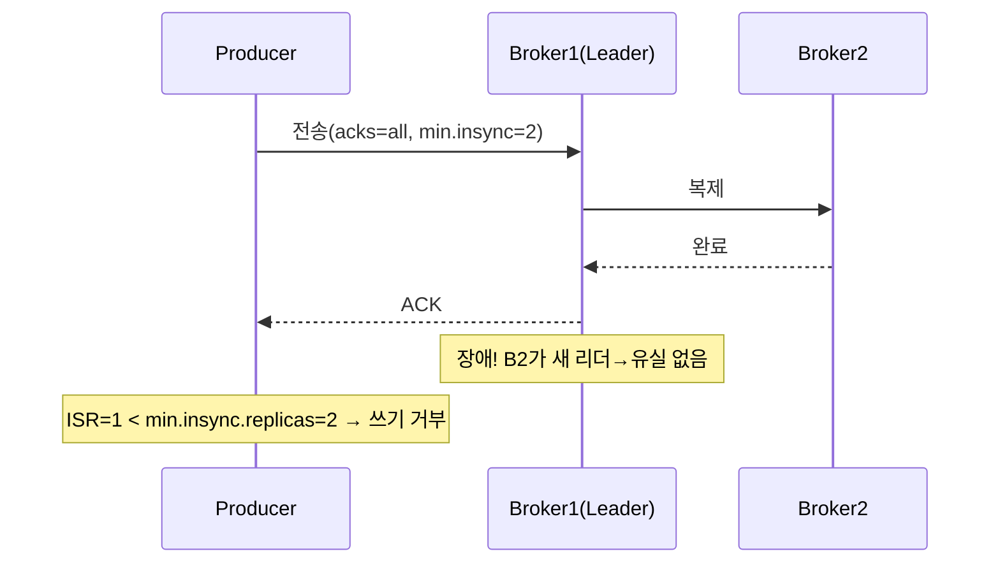

### Unclean Leader Election 위험

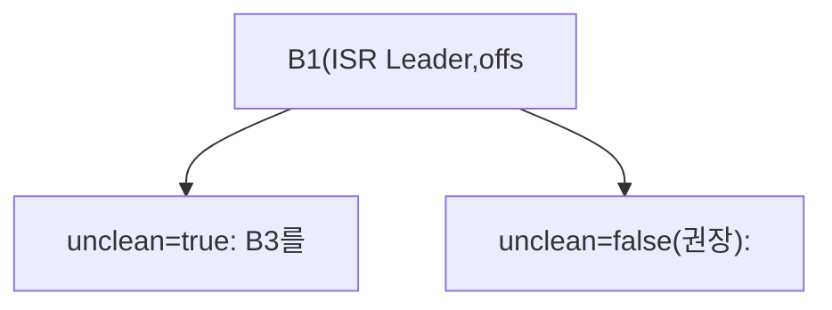

### 방어 전략

```java
// Producer 설정
props.put(ProducerConfig.ACKS_CONFIG, "all");
props.put(ProducerConfig.RETRIES_CONFIG, Integer.MAX_VALUE);
props.put(ProducerConfig.ENABLE_IDEMPOTENCE_CONFIG, true);

// 브로커 설정 (server.properties)
// min.insync.replicas=2        ← 최소 2개 ISR 동기화 보장
// unclean.leader.election.enable=false  ← ISR 외 선출 금지
// default.replication.factor=3          ← 복제 3개
```

---

## 시나리오 2: Consumer 리밸런싱 중 중복 처리

### 리밸런싱 타이밍 문제

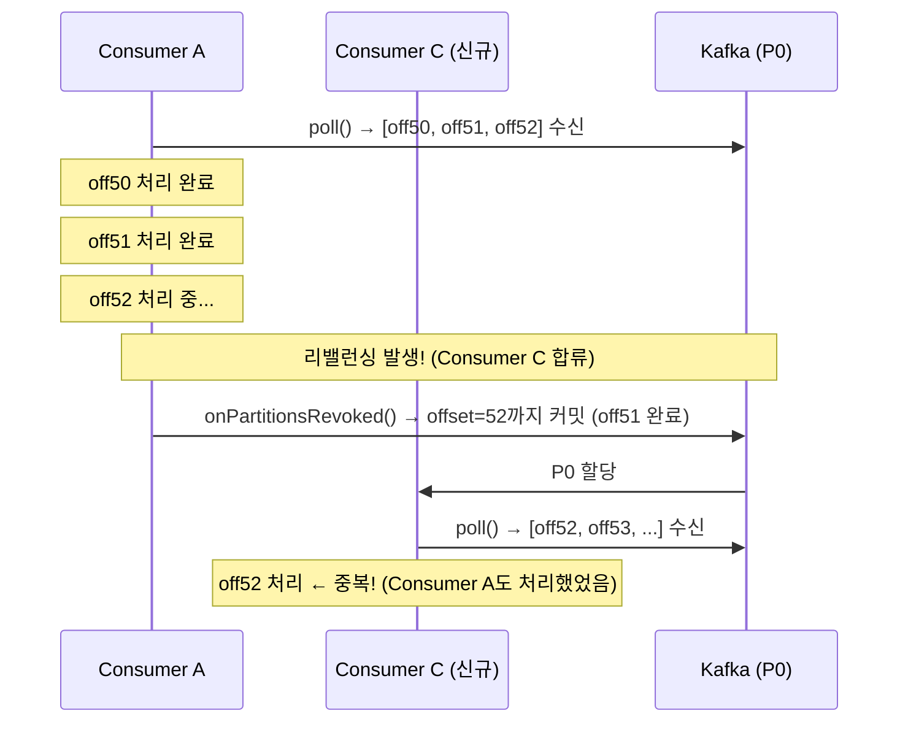

### 상세 타임라인

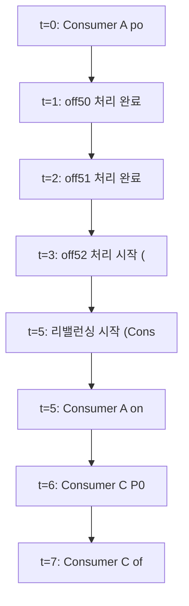

### 해결 방법 1: ConsumerRebalanceListener 활용

```java
@Service
public class SafeConsumerService {

    private final KafkaConsumer<String, OrderEvent> consumer;
    private final Map<TopicPartition, OffsetAndMetadata> pendingOffsets
        = new ConcurrentHashMap<>();

    public void startConsuming() {
        consumer.subscribe(List.of("order-events"), new ConsumerRebalanceListener() {

            @Override
            public void onPartitionsRevoked(Collection<TopicPartition> partitions) {
                // 리밸런싱 전: 처리 완료된 offset 즉시 커밋
                log.info("파티션 반환 전 커밋: {}", pendingOffsets);
                consumer.commitSync(pendingOffsets);
                pendingOffsets.clear();
            }

            @Override
            public void onPartitionsAssigned(Collection<TopicPartition> partitions) {
                log.info("새 파티션 할당: {}", partitions);
            }
        });

        while (true) {
            ConsumerRecords<String, OrderEvent> records =
                consumer.poll(Duration.ofMillis(100));

            for (ConsumerRecord<String, OrderEvent> record : records) {
                processOrder(record.value());
                // 처리 완료 offset 누적
                pendingOffsets.put(
                    new TopicPartition(record.topic(), record.partition()),
                    new OffsetAndMetadata(record.offset() + 1)
                );
            }

            consumer.commitAsync(pendingOffsets, (offsets, ex) -> {
                if (ex != null) log.error("비동기 커밋 실패", ex);
            });
        }
    }
}
```

### 해결 방법 2: 멱등성 처리 (Idempotent Consumer)

```java
@Service
public class IdempotentOrderService {

    private final OrderRepository orderRepository;
    private final ProcessedEventRepository processedEventRepo;

    @KafkaListener(topics = "order-events")
    @Transactional
    public void handleOrder(ConsumerRecord<String, OrderEvent> record) {
        String eventId = record.value().getEventId();

        // 이미 처리된 이벤트인지 확인
        if (processedEventRepo.existsByEventId(eventId)) {
            log.info("중복 이벤트 무시: {}", eventId);
            return;
        }

        // 처리
        orderRepository.save(record.value().toOrder());

        // 처리 완료 기록 (같은 트랜잭션)
        processedEventRepo.save(new ProcessedEvent(eventId));
        // → 처리 + 완료기록이 원자적으로 수행됨
    }
}
```

### 해결 방법 3: Cooperative Rebalancing

```java
// 리밸런싱 중 처리 중단을 최소화
props.put(ConsumerConfig.PARTITION_ASSIGNMENT_STRATEGY_CONFIG,
    CooperativeStickyAssignor.class.getName());
// → 이동하지 않는 파티션은 계속 처리
// → 중복 처리 시간 창이 줄어듦
```

---

## 시나리오 3: 파티션 수 변경 시 키 기반 라우팅 깨짐

### 문제 원리

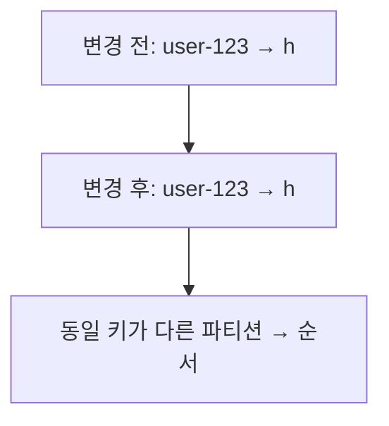

### 실제 영향

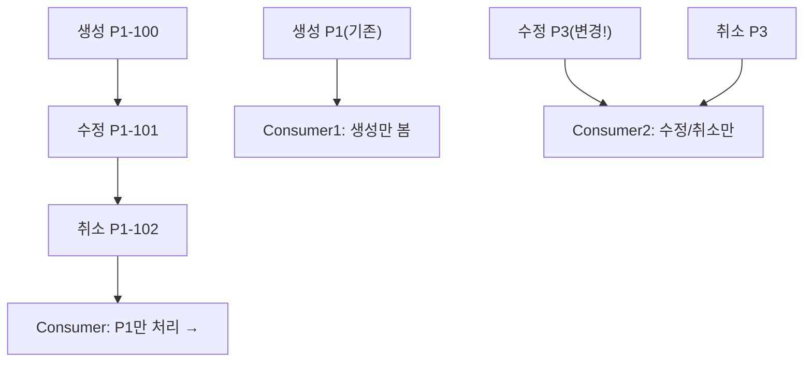

### 방어 전략

```java
// 전략 1: 충분히 큰 파티션 수로 처음부터 설계
// (파티션 줄이기는 불가, 늘리기만 가능)
// 예상 최대 처리량 기준으로 여유 있게 설정

// 전략 2: 파티션 변경 시 마이그레이션 계획
// Phase 1: 새 토픽 생성 (더 많은 파티션)
// Phase 2: 프로듀서를 새 토픽으로 전환
// Phase 3: 구 토픽 메시지 모두 소비 후 구 컨슈머 종료
// Phase 4: 구 토픽 삭제

// 전략 3: 커스텀 파티셔너로 파티션 수 변경 대응
public class StableHashPartitioner implements Partitioner {
    @Override
    public int partition(String topic, Object key, byte[] keyBytes,
                         Object value, byte[] valueBytes, Cluster cluster) {
        // 고정 해시 함수 사용 (파티션 수 변경 전후 동일 매핑 유지)
        // 단, 새 파티션으로의 라우팅은 의도적으로 제어
        int fixedPartitionCount = 4; // 논리적 파티션 수 고정
        int physicalPartitions = cluster.partitionCountForTopic(topic);
        int logicalPartition = Math.abs(murmur2(keyBytes)) % fixedPartitionCount;
        return logicalPartition % physicalPartitions;
    }
}
```

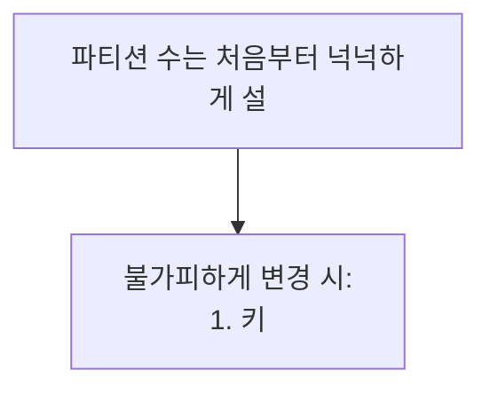

---

## 시나리오 4: 디스크 가득 참 시 동작

### 브로커 디스크 100% 상황

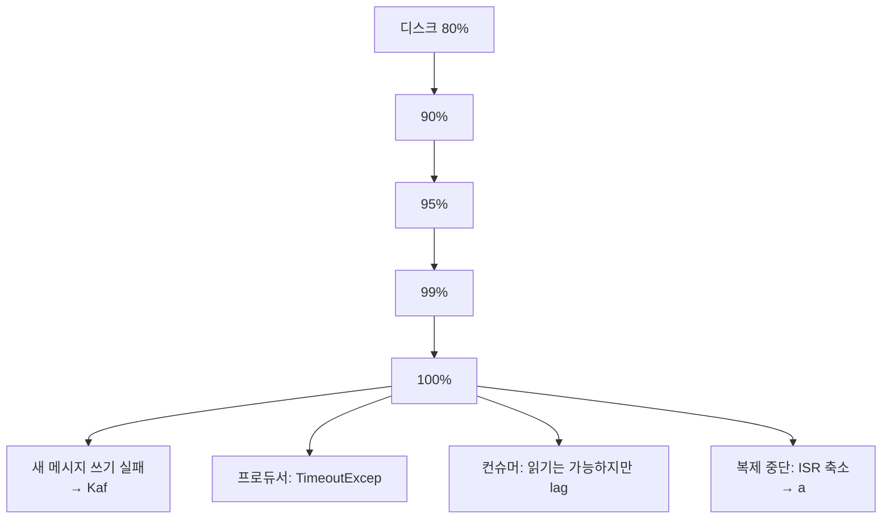

### 단계별 장애 확산

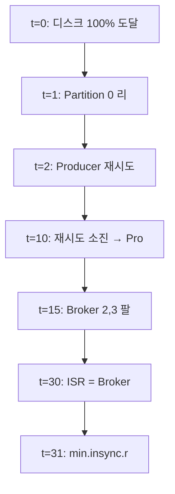

### 방어 전략

```yaml
# 모니터링 알림 설정 (Prometheus + AlertManager)
groups:
  - name: kafka_disk
    rules:
      - alert: KafkaDiskUsageHigh
        expr: (node_filesystem_size_bytes - node_filesystem_free_bytes)
              / node_filesystem_size_bytes > 0.80
        for: 5m
        labels:
          severity: warning
        annotations:
          summary: "Kafka 브로커 디스크 80% 초과"

      - alert: KafkaDiskUsageCritical
        expr: (node_filesystem_size_bytes - node_filesystem_free_bytes)
              / node_filesystem_size_bytes > 0.90
        for: 1m
        labels:
          severity: critical
```

```properties
# 브로커 설정: 디스크 보호
log.retention.bytes=107374182400   # 파티션당 최대 100GB
log.retention.hours=72             # 3일 보관
log.segment.bytes=536870912        # 세그먼트 500MB (빠른 삭제 단위)

# 디스크 임계값 도달 시 자동 조치
# log.cleaner.enable=true          # 로그 컴팩션 활성화
```

```java
// 디스크 부족 시 자동 보존 기간 단축 (운영 자동화)
@Scheduled(fixedDelay = 60000)
public void adjustRetentionPolicy() {
    double diskUsage = getDiskUsagePercent();
    if (diskUsage > 0.85) {
        adminClient.alterConfigs(Map.of(
            new ConfigResource(ConfigResource.Type.TOPIC, "order-events"),
            new Config(List.of(
                new ConfigEntry("retention.ms", "86400000") // 1일로 단축
            ))
        ));
        log.warn("디스크 {}% → 보존 기간 1일로 단축", diskUsage * 100);
    }
}
```

---

## 시나리오 5: ISR 축소 → Unclean Leader Election

### ISR 점진적 축소 시나리오

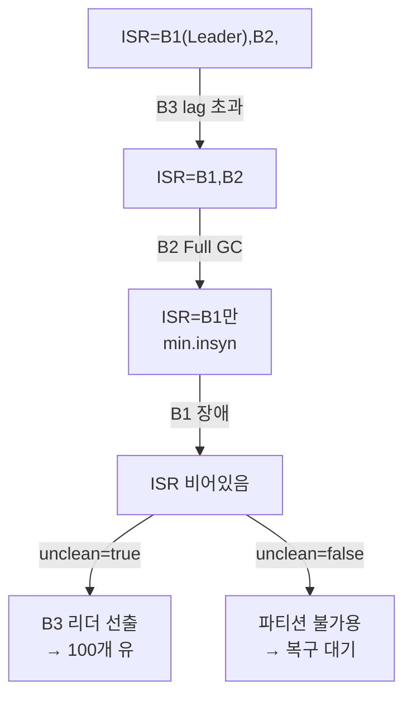

### ISR 모니터링

```bash
# ISR 상태 확인
kafka-topics.sh --bootstrap-server kafka1:9092 \
  --describe --topic order-events

# 출력 예시:
Topic: order-events  Partition: 0  Leader: 1  Replicas: 1,2,3  Isr: 1,2
#                                                                       ↑
#                                                               Broker 3 빠짐!
```

```java
// ISR 축소 감지 및 알림
@Scheduled(fixedDelay = 30000)
public void checkISRHealth() {
    DescribeTopicsResult result = adminClient.describeTopics(
        List.of("order-events", "payment-events")
    );

    result.all().get().forEach((topic, desc) -> {
        desc.partitions().forEach(partition -> {
            int replicaCount = partition.replicas().size();
            int isrCount = partition.isr().size();

            if (isrCount < replicaCount) {
                alertService.sendAlert(String.format(
                    "ISR 축소! 토픽=%s 파티션=%d ISR=%d/%d",
                    topic, partition.partition(), isrCount, replicaCount
                ));
            }
        });
    });
}
```

### 방어 전략

```
ISR 축소 방지:
1. 브로커 JVM GC 튜닝 (G1GC 사용, pause time 최소화)
2. 네트워크 대역폭 충분히 확보
3. 브로커간 복제 전용 네트워크 분리
4. replica.lag.time.max.ms 현실적으로 설정

설정 조합:
unclean.leader.election.enable=false  ← 데이터 우선
min.insync.replicas=2                 ← 최소 2개 보장
default.replication.factor=3         ← 여유 복제본
```

---

## 시나리오 6: Consumer Lag 폭증 시 대응

### Lag 발생 원인과 탐지

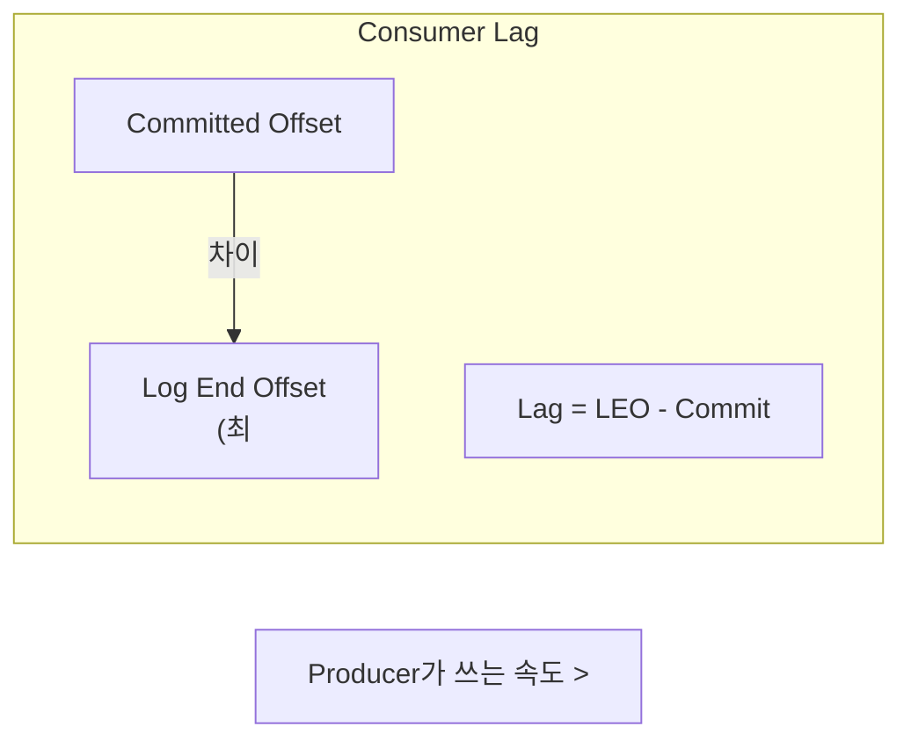

### Lag 폭증 원인별 분류

```mermaid
graph TD
    subgraph cause1["원인 1: Consumer 처리"]
    LAG["Lag 폭증 원인"] --> C1["Consumer 속도 저하: DB"]
    LAG --> C2["Producer 유입 급증: 트래"]
    LAG --> C3["Consumer 감소: 배포/OO"]
```

### Lag 모니터링 및 자동 스케일링

```java
// Lag 모니터링 서비스
@Service
public class KafkaLagMonitor {

    @Scheduled(fixedDelay = 10000)
    public void checkAndAlertLag() {
        Map<String, Map<TopicPartition, Long>> lagMap = calculateLag();

        lagMap.forEach((groupId, partitionLags) -> {
            long totalLag = partitionLags.values().stream()
                .mapToLong(Long::longValue).sum();

            // Prometheus 메트릭 노출
            meterRegistry.gauge("kafka.consumer.lag",
                Tags.of("group", groupId), totalLag);

            if (totalLag > 100_000) {
                log.warn("Consumer Group {} Lag 폭증: {}", groupId, totalLag);
                triggerAutoScaling(groupId, totalLag);
            }
        });
    }

    private Map<String, Map<TopicPartition, Long>> calculateLag() {
        // AdminClient로 Log End Offset 조회
        // ConsumerGroupDescription으로 Committed Offset 조회
        // 차이 계산
        ...
    }
}
```

```yaml
# Kubernetes HPA (Consumer Pod 자동 확장)
apiVersion: autoscaling/v2
kind: HorizontalPodAutoscaler
metadata:
  name: order-consumer-hpa
spec:
  scaleTargetRef:
    apiVersion: apps/v1
    kind: Deployment
    name: order-consumer
  minReplicas: 2
  maxReplicas: 10  # 파티션 수 이상으로 늘려도 의미 없음
  metrics:
    - type: External
      external:
        metric:
          name: kafka_consumer_group_lag
          selector:
            matchLabels:
              group: order-processing-group
        target:
          type: AverageValue
          averageValue: "10000"  # 평균 lag이 10000 초과 시 스케일아웃
```

### 긴급 대응 절차

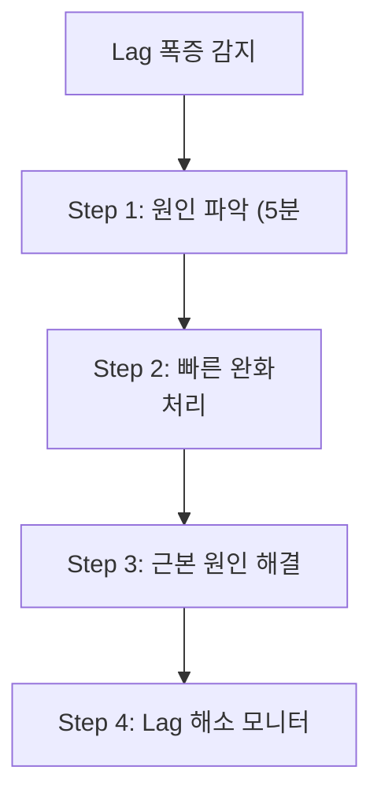

---

## 시나리오 7: 네트워크 파티션 시나리오

### Split-Brain 상황

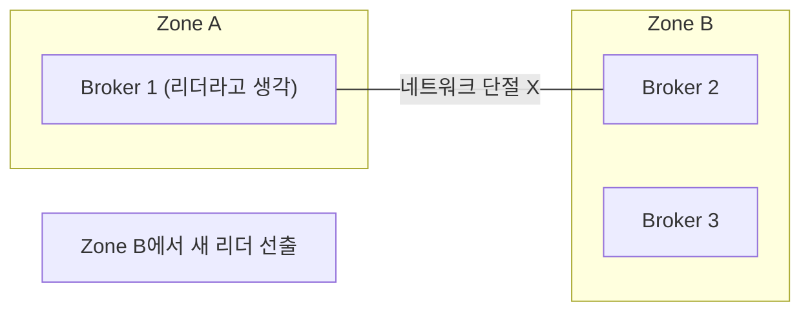

### Zombie Leader 문제

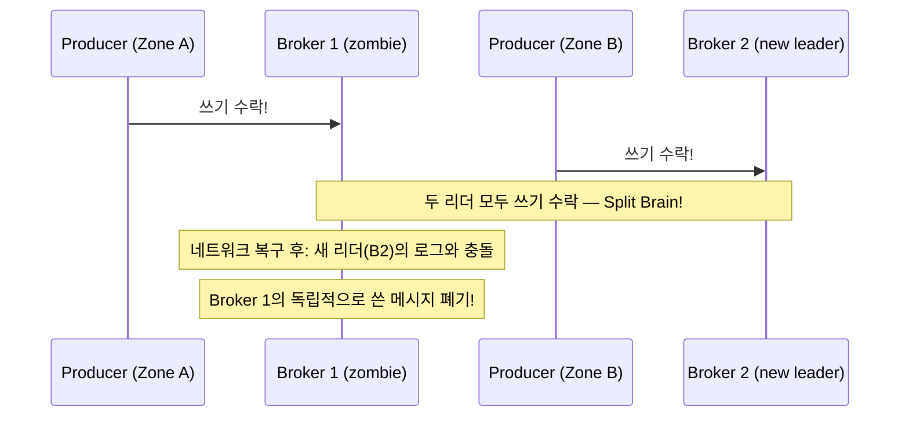

### Kafka의 방어 메커니즘

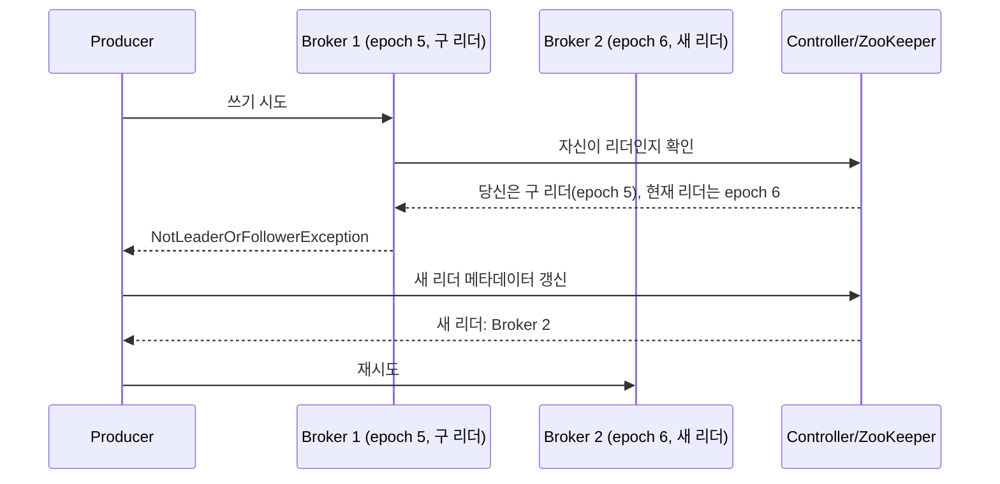

### 네트워크 파티션 시나리오별 영향

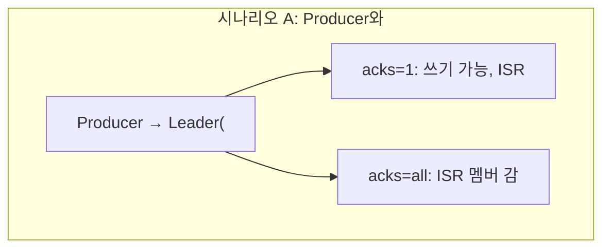

### 방어 전략

```properties
# 다중 AZ 배포 시 권장 설정

# 복제 설정
default.replication.factor=3      # AZ당 하나씩
min.insync.replicas=2             # 과반수

# 타임아웃 설정 (네트워크 복구 시간 고려)
replica.lag.time.max.ms=30000    # 30초
zookeeper.session.timeout.ms=18000
```

```java
// 클라이언트 메타데이터 갱신 설정
props.put(ProducerConfig.METADATA_MAX_AGE_CONFIG, 300000);    // 5분
props.put(ProducerConfig.RECONNECT_BACKOFF_MS_CONFIG, 50);
props.put(ProducerConfig.RECONNECT_BACKOFF_MAX_MS_CONFIG, 1000);
```

---

## 시나리오 8: Producer 타임아웃 + 재시도 시 중복

### 중복 발생 메커니즘

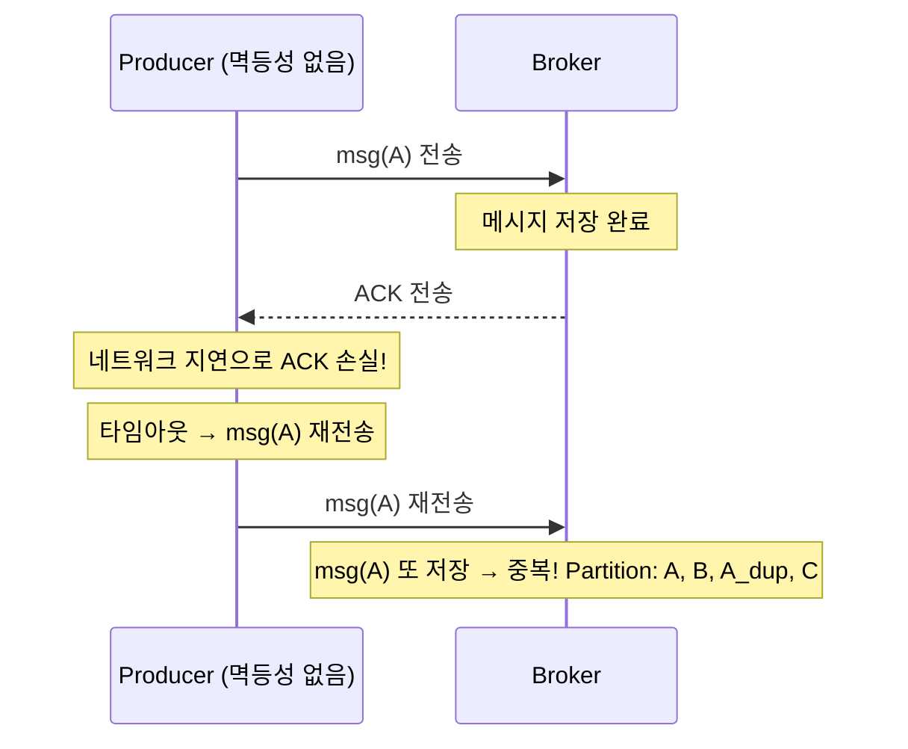

### 타임아웃 관련 설정들

```java
props.put(ProducerConfig.REQUEST_TIMEOUT_MS_CONFIG, 30000);    // 요청 타임아웃 30초
props.put(ProducerConfig.DELIVERY_TIMEOUT_MS_CONFIG, 120000);  // 전체 전달 타임아웃 2분
props.put(ProducerConfig.RETRIES_CONFIG, 3);                    // 재시도 3회
props.put(ProducerConfig.RETRY_BACKOFF_MS_CONFIG, 100);        // 재시도 간격 100ms

// 재시도로 인한 순서 역전 방지
props.put(ProducerConfig.MAX_IN_FLIGHT_REQUESTS_PER_CONNECTION, 5);
// → 멱등성 활성화 시: 최대 5개 동시 요청 허용 (순서 보장됨)
// → 멱등성 비활성화 시: 1로 설정해야 순서 보장
```

### 순서 역전 시나리오

```mermaid
sequenceDiagram
    participant P as Producer
    participant B as Broker
    Note over P,B: IN_FLIGHT=5, 멱등성 없음
    P->>B: msg1(실패)→msg2(성공)→msg1 재시도
    Note over B: [msg2,msg1] 순서역전!
    Note over P,B: IN_FLIGHT=1
    P->>B: msg1→msg2 순서대로
    Note over B: [msg1,msg2] 순서보장
```

### 완전한 해결: Idempotent Producer

```java
// 멱등성 활성화 시
props.put(ProducerConfig.ENABLE_IDEMPOTENCE_CONFIG, true);
// 자동으로:
// acks=all
// max.in.flight.requests.per.connection=5 (순서 보장하면서 성능도 유지)
// retries=Integer.MAX_VALUE

// 브로커는 PID + Sequence Number로 중복 감지:
// seq=1 저장 → seq=1 재수신 → "이미 처리됨" → 무시 (ACK 반환)
// seq=3 수신 후 seq=2 수신 → "seq 2 누락" → OutOfOrderSequenceException
```

### 재시도와 중복 처리 요약

```
상황별 권장 설정:

데이터 유실 절대 불허 (금융):
  acks=all
  enable.idempotence=true
  retries=MAX_INT
  transactional.id=unique-id  (EOS 필요 시)

고처리량 우선 (로그 수집):
  acks=1
  retries=3
  enable.idempotence=false
  compression.type=snappy

균형 (일반 서비스):
  acks=all
  enable.idempotence=true
  retries=10
  delivery.timeout.ms=120000
```

---


## 극한 시나리오

```
프로듀서 설정:
□ acks=all (데이터 무결성)
□ enable.idempotence=true (중복 방지)
□ retries=충분히 크게
□ delivery.timeout.ms > request.timeout.ms * retries

브로커 설정:
□ replication.factor >= 3
□ min.insync.replicas = replication.factor - 1
□ unclean.leader.election.enable=false
□ auto.leader.rebalance.enable=true
□ log.retention.bytes 설정 (디스크 보호)

컨슈머 설정:
□ enable.auto.commit=false (수동 커밋)
□ max.poll.interval.ms > 최대 처리 시간
□ CooperativeStickyAssignor 사용
□ ConsumerRebalanceListener 구현

토픽 설계:
□ 파티션 수를 처음부터 넉넉하게
□ 키 기반 순서 보장 요구사항 명확화
□ 컴팩션 vs 삭제 정책 결정

운영:
□ Consumer Lag 모니터링 및 알림
□ ISR 상태 모니터링
□ 디스크 사용량 80% 알림
□ 브로커 JVM 튜닝 (G1GC)
□ 네트워크 파티션 대비 다중 AZ 배포
```

---
## 시나리오별 빠른 참조

| 시나리오 | 핵심 위험 | 방어 방법 |
|----------|-----------|-----------|
| 브로커 장애 | 미복제 메시지 유실 | acks=all + min.insync.replicas=2 |
| 리밸런싱 중 중복 | offset 재처리 | ConsumerRebalanceListener + 멱등성 처리 |
| 파티션 수 변경 | 키 라우팅 깨짐 | 처음부터 충분한 파티션 수, 새 토픽 마이그레이션 |
| 디스크 풀 | 쓰기 완전 중단 | 80% 알림, 보존 기간 자동 조정 |
| ISR 축소 | Unclean 선출 위험 | unclean.leader.election=false, ISR 모니터링 |
| Consumer Lag 폭증 | 실시간성 파괴 | 자동 스케일링, Lag 알림 |
| 네트워크 파티션 | Split-Brain | Leader Epoch, 다중 AZ 배포 |
| 재시도 중복 | 메시지 중복 저장 | enable.idempotence=true |
