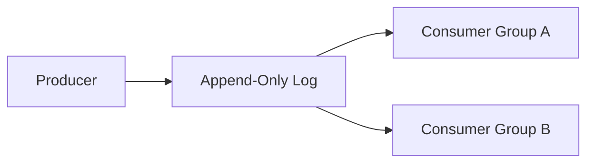
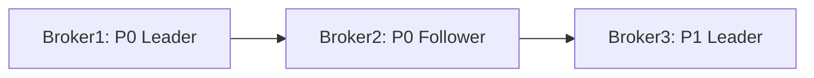
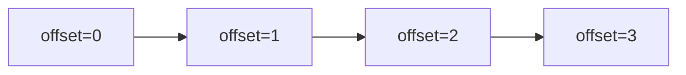
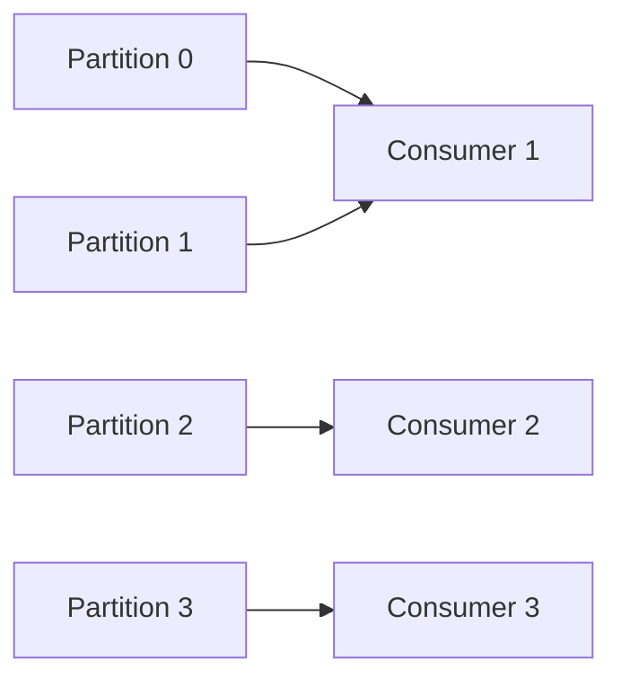
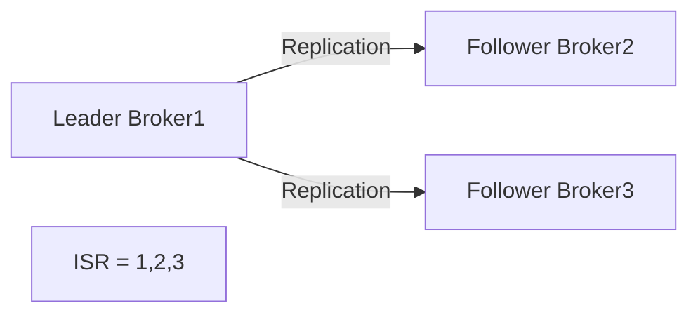
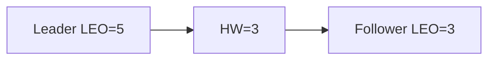
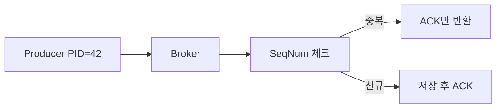
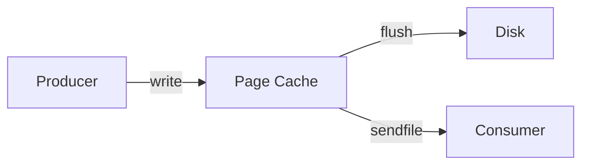
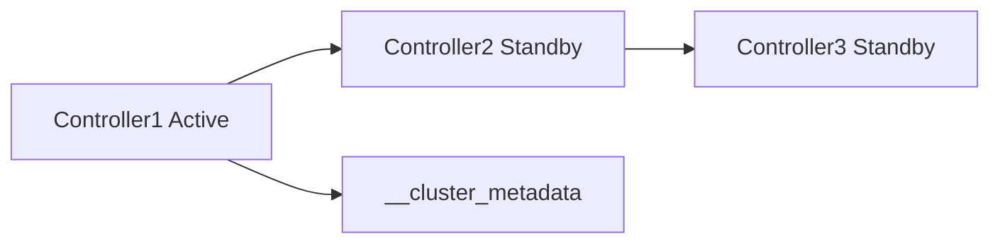

서비스가 성장하면서 주문, 결제, 배달, 통계, 알림 시스템이 서로 직접 API를 호출한다. 하나가 느려지면 전체가 느려지고, 하나가 죽으면 연쇄 장애가 난다. Kafka는 이 결합을 끊는다. 그런데 "어떻게" 끊는지, 그리고 "왜" 그 방법을 선택했는지를 아는 것이 시니어와 주니어의 차이다.

## 왜 이게 중요한가?

Kafka는 단순한 메시지 큐가 아니다. **메시지를 로그처럼 영속 저장**하는 설계 철학이 모든 것을 바꾼다. 소비한 메시지를 지우지 않으므로 여러 서비스가 독립적으로 같은 데이터를 다른 속도로 소비할 수 있고, 오류 발생 시 과거 데이터를 재처리할 수 있다.

`acks`, `min.insync.replicas`, `ISR` 같은 개념을 모르면 장애 상황에서 메시지 유실과 중복 사이에서 무방비 상태가 된다. 파티션 할당 전략의 내부 알고리즘을 모르면 리밸런싱 순간 수십 초간 메시지 처리가 멈추는 이유를 이해하지 못한다. Zero-Copy가 왜 빠른지 OS 레벨에서 이해하지 못하면 튜닝 포인트를 찾을 수 없다.

이 글은 "무엇인가"보다 **"왜 그렇게 동작하는가"**에 집중한다.

---

## Kafka란? — 로그가 모든 것을 바꾼다

Apache Kafka는 LinkedIn에서 처음 개발되어 2011년 오픈소스로 공개된 **분산 이벤트 스트리밍 플랫폼**이다. 핵심 통찰은 단순하다: **메시지를 삭제하지 말고 로그처럼 append하라.**

### 왜 로그 기반 설계인가?

전통적인 메시지 큐(RabbitMQ 등)는 소비자가 메시지를 꺼내면 큐에서 삭제한다. 이 방식의 문제는:

1. 소비자가 하나뿐이거나 같은 메시지를 두 시스템이 읽으려면 별도 큐가 필요하다
2. 처리 실패 시 재처리 로직이 복잡해진다 (DLQ 별도 구성)
3. 메시지 순서 보장이 어렵다 (경쟁 소비 모델)

Kafka는 로그 파일처럼 메시지를 파일 끝에 append하고, 각 소비자가 자신의 읽기 위치(Offset)를 독립적으로 관리한다. 덕분에:

- 여러 서비스(Consumer Group)가 같은 토픽을 독립적으로 소비 가능
- 오프셋을 과거로 되돌려 재처리 가능
- 순차 쓰기(Sequential I/O)로 HDD에서도 초당 수백 MB 처리 가능



### 전통적인 메시징 시스템 vs Kafka

| 구분 | 전통적 MQ (RabbitMQ) | Kafka |
|------|----------------------|-------|
| 메시지 보관 | 소비 후 즉시 삭제 | 디스크 보존 (설정 기간) |
| 소비 방식 | Push 기반 | Pull 기반 |
| 재처리 | 기본적으로 불가 | Offset 조정으로 재처리 가능 |
| 처리량 | 수만 TPS | 수백만 TPS |
| 순서 보장 | 큐 단위 | 파티션 단위 |
| 소비자 확장 | 큐 경쟁 소비 | Consumer Group 병렬 소비 |

> **비유**: Kafka는 수백만 권의 책을 보관하는 도서관이다. 책을 빌려가도(소비) 원본은 그대로 남는다. 독자(Consumer)마다 책갈피(Offset) 위치가 다르고, 어떤 독자는 3페이지를, 어떤 독자는 100페이지를 읽고 있어도 서로 방해하지 않는다.

---

## 핵심 구성요소 — 내부 동작까지

### Broker

Kafka 클러스터를 구성하는 개별 서버 노드다. 각 브로커는 고유한 `node.id`를 가지며, 파티션의 실제 데이터를 파일 시스템에 저장하고 클라이언트 요청을 처리한다.

**브로커가 하는 일:**

1. Producer로부터 메시지를 받아 파일 시스템에 append
2. Consumer의 Fetch 요청에 응답 — 이때 Zero-Copy(`sendfile()`) 사용
3. Follower 브로커가 보내는 Replication Fetch 요청 처리
4. 리더/팔로워 전환 (Controller 브로커로부터 지시 수신)



**왜 브로커는 메시지를 직접 메모리에 두지 않는가?** 브로커 재시작 시 메모리가 날아가면 메시지도 사라지기 때문이다. 파일 시스템에 기록하되, OS의 Page Cache를 통해 자주 읽히는 데이터는 메모리에 캐싱된다. Kafka는 이 OS 레벨의 캐싱을 의도적으로 활용한다.

### Topic

메시지를 분류하는 논리적 채널이다. 하나의 토픽은 N개의 파티션으로 구성된다.

실무에서는 `order-events`, `payment-events`, `delivery-events`처럼 비즈니스 도메인 단위로 분리한다. 마케팅팀은 `order-events`를, 결제팀은 `payment-events`를 각자 구독하면 서로 독립적으로 처리한다.

### Partition — 확장성과 순서 보장의 단위

파티션은 Kafka 확장성의 핵심이자, 순서 보장의 경계다.

**파티션이 왜 존재하는가?**

하나의 파일(로그)에 모든 메시지를 쓰면 단일 브로커, 단일 디스크가 병목이 된다. 파티션은 토픽의 로그를 N개로 쪼개어 N개의 브로커에 분산 저장하고, N개의 컨슈머가 병렬로 소비할 수 있게 한다.

**물리적 구조:**

```
/kafka-logs/order-events-0/          ← 파티션 0
    ├── 00000000000000000000.log      ← 세그먼트 파일 (실제 메시지)
    ├── 00000000000000000000.index    ← offset → file position 매핑
    ├── 00000000000000000000.timeindex← timestamp → offset 매핑
    └── 00000000000001000000.log      ← 다음 세그먼트 (offset 1000000부터)
```



**파티션 내 순서는 보장되지만, 파티션 간 순서는 보장되지 않는다.** 이것이 핵심이다. 동일 주문 ID의 이벤트 순서를 보장하려면 주문 ID를 메시지 키로 사용해야 한다. 같은 키는 항상 같은 파티션으로 라우팅된다(`hash(key) % 파티션수`).

**파티션 수 결정 기준:**
- 파티션 수 = 최대 병렬 소비 가능 컨슈머 수
- 일반적으로 브로커 수의 배수로 설정 (리더가 골고루 분산)
- 목표 처리량 / 단일 파티션 처리량으로 계산

> **실무 함정**: 파티션은 줄일 수 없다. 늘리는 순간 `hash(key) % 파티션수` 결과가 바뀌어 동일 키 메시지가 다른 파티션으로 가게 된다. 순서 보장이 일시적으로 깨진다. 초기 설계가 중요한 이유다.

### Producer — 배치와 파티셔닝

Producer는 단순히 메시지를 보내는 것이 아니다. 내부적으로 **RecordAccumulator**라는 버퍼를 두고, 메시지를 파티션별로 묶어 배치로 전송한다.

**파티션 결정 과정:**
1. 키가 있으면 `murmur2(key) % numPartitions` — 동일 키는 항상 같은 파티션
2. 키가 없으면 StickyPartitioner (기본값) — 하나의 파티션에 배치를 채울 때까지 몰아서 전송 후 다음 파티션으로

**왜 StickyPartitioner가 기본값인가?** 예전 RoundRobin 방식은 메시지 하나씩 다른 파티션으로 보내 배치가 전혀 형성되지 않았다. StickyPartitioner는 배치를 충분히 채운 뒤 파티션을 바꿔서 배치 효율을 극대화한다. 처리량이 최대 50% 향상된다.

```java
@Configuration
public class KafkaProducerConfig {

    @Bean
    public ProducerFactory<String, Object> producerFactory() {
        Map<String, Object> config = new HashMap<>();
        config.put(ProducerConfig.BOOTSTRAP_SERVERS_CONFIG, "kafka1:9092,kafka2:9092");
        config.put(ProducerConfig.KEY_SERIALIZER_CLASS_CONFIG, StringSerializer.class);
        config.put(ProducerConfig.VALUE_SERIALIZER_CLASS_CONFIG, JsonSerializer.class);

        // 안전성: ISR 전체 복제 확인
        config.put(ProducerConfig.ACKS_CONFIG, "all");
        // 멱등성 프로듀서 활성화 (PID + sequence number로 중복 방지)
        config.put(ProducerConfig.ENABLE_IDEMPOTENCE_CONFIG, true);
        // 재시도 (멱등성 활성화 시 순서 보장을 위해 max.in.flight=1 자동 적용)
        config.put(ProducerConfig.RETRIES_CONFIG, Integer.MAX_VALUE);

        // 배치 설정
        config.put(ProducerConfig.BATCH_SIZE_CONFIG, 32768);   // 32KB
        config.put(ProducerConfig.LINGER_MS_CONFIG, 10);       // 최대 10ms 대기
        config.put(ProducerConfig.BUFFER_MEMORY_CONFIG, 33554432); // 32MB RecordAccumulator

        // 압축 (배치 단위로 압축, 네트워크 + 디스크 절감)
        config.put(ProducerConfig.COMPRESSION_TYPE_CONFIG, "snappy");

        return new DefaultKafkaProducerFactory<>(config);
    }

    @Bean
    public KafkaTemplate<String, Object> kafkaTemplate() {
        return new KafkaTemplate<>(producerFactory());
    }
}
```

```java
@Service
@RequiredArgsConstructor
public class OrderProducer {

    private final KafkaTemplate<String, Object> kafkaTemplate;

    public CompletableFuture<SendResult<String, Object>> sendOrder(OrderEvent event) {
        // 키 = orderId → 동일 주문의 이벤트는 항상 같은 파티션 → 순서 보장
        return kafkaTemplate.send("order-events", event.getOrderId(), event)
            .completable()
            .whenComplete((result, ex) -> {
                if (ex != null) {
                    log.error("전송 실패: orderId={}", event.getOrderId(), ex);
                } else {
                    log.info("전송 성공: partition={}, offset={}",
                        result.getRecordMetadata().partition(),
                        result.getRecordMetadata().offset());
                }
            });
    }
}
```

### Consumer

Consumer는 Pull 방식으로 브로커에 Fetch 요청을 보낸다. **왜 Push가 아니라 Pull인가?** Push 방식은 브로커가 소비자 처리 속도를 모르는 채 계속 밀어 넣어 소비자를 압도할 수 있다. Pull 방식은 소비자가 준비됐을 때만 요청하므로 처리 속도에 맞게 자연스럽게 조절된다.

```java
@Service
public class OrderConsumer {

    @KafkaListener(
        topics = "order-events",
        groupId = "order-processing-group",
        containerFactory = "kafkaListenerContainerFactory"
    )
    public void handleOrder(
            ConsumerRecord<String, OrderEvent> record,
            Acknowledgment ack) {

        log.info("파티션={}, 오프셋={}", record.partition(), record.offset());

        try {
            processOrder(record.value());
            // 처리 완료 후 명시적 커밋 — 처리 전 커밋은 유실, 재처리 불가
            ack.acknowledge();
        } catch (RecoverableException e) {
            // 재처리 가능한 오류: 커밋 안 하고 나중에 재처리
            log.warn("재처리 예정: {}", e.getMessage());
        } catch (PoisonPillException e) {
            // 재처리 불가한 오류: DLT(Dead Letter Topic)으로 이동
            kafkaTemplate.send("order-events.DLT", record.key(), record.value());
            ack.acknowledge(); // DLT로 보냈으면 커밋해야 루프 안 돈다
        }
    }
}
```

### Consumer Group

동일한 `group.id`를 공유하는 컨슈머 집합이다. **파티션은 그룹 내 하나의 컨슈머에만 할당**된다. 왜 이 규칙이 있는가? 동일 파티션을 두 컨슈머가 동시에 읽으면 같은 메시지를 두 번 처리하게 되고, 파티션 내 순서 보장도 의미 없어진다.



다른 Consumer Group은 같은 토픽을 독립적으로 처음부터 소비한다(브로드캐스트 효과). 주문 이벤트를 결제팀, 물류팀, 분석팀이 각각 별도 group.id로 구독하면 세 팀 모두 모든 메시지를 독립적으로 소비한다.

**규칙:**
- 파티션 수 > 컨슈머 수: 일부 컨슈머가 여러 파티션 담당
- 파티션 수 = 컨슈머 수: 1:1 할당 (이상적)
- 파티션 수 < 컨슈머 수: 초과 컨슈머는 유휴 상태 (낭비)

---

## Offset — 상태 관리의 핵심

Offset은 파티션 내 메시지의 고유 위치 번호다. 0부터 시작하며 단조 증가한다. Kafka 0.9 이후 `__consumer_offsets` 내부 토픽에 저장된다.

```
__consumer_offsets 토픽 내용:
Key: [group_id, topic, partition]
Value: [committed_offset, metadata, timestamp]

예: "order-group" + "order-events" + 0 → offset: 1234
```

**왜 ZooKeeper가 아닌 Kafka 토픽에 저장하는가?** ZooKeeper는 소규모 메타데이터 저장에 적합하지만 초당 수십만 오프셋 커밋을 감당하기 어렵다. Kafka 자체의 로그 기반 저장이 훨씬 높은 쓰기 처리량을 제공한다.

### Offset 커밋 방식

**1. 자동 커밋** — 간단하지만 위험하다

```yaml
spring:
  kafka:
    consumer:
      enable-auto-commit: true
      auto-commit-interval: 5000   # 5초마다 자동 커밋
```

`poll()` 호출 시 이전 `poll()`에서 반환받은 오프셋이 커밋된다. 5초 주기 동안 처리하다 크래시하면 마지막 커밋 이후 메시지가 재처리된다(중복). `poll()` 직후 자동 커밋되고 처리 중 크래시하면 처리 안 된 메시지가 유실된다.

**2. 수동 커밋** — 처리 완료를 보장한다

```java
@KafkaListener(topics = "order-events", groupId = "order-group")
public void handleOrder(ConsumerRecord<String, OrderEvent> record,
                        Acknowledgment ack) {
    try {
        processOrder(record.value());
        ack.acknowledge();  // 처리 완료 후에만 커밋
    } catch (Exception e) {
        // 커밋 안 하면 재시작 시 재처리됨 (at-least-once)
        log.error("처리 실패, 재처리 예정", e);
    }
}
```

### Offset 리셋 전략

```yaml
spring:
  kafka:
    consumer:
      auto-offset-reset: earliest  # earliest | latest | none
```

| 전략 | 설명 | 사용 시나리오 |
|------|------|--------------|
| `earliest` | 가장 오래된 메시지부터 | 새 그룹, 전체 재처리 |
| `latest` | 가장 최신 메시지부터 | 현재 시점부터 소비 시작 |
| `none` | 오프셋 없으면 예외 발생 | 명시적 관리가 필요한 경우 |

---

## Partition Assignment Strategy — 내부 알고리즘까지

파티션 할당 전략은 Consumer Group 내에서 어떤 컨슈머가 어떤 파티션을 담당하는지 결정한다. 이것이 리밸런싱의 품질을 좌우하고, Stop-the-World 문제와 직결된다.

### 1. RangeAssignor (기본값 중 하나)

**알고리즘:** 토픽별로 독립적으로 파티션을 정렬한 뒤, 컨슈머를 사전순 정렬 후 파티션을 연속된 범위로 나눠준다.

```
토픽 A: 파티션 [0, 1, 2], 컨슈머 [C1, C2]
  C1 → P0, P1  (ceil(3/2) = 2개)
  C2 → P2      (나머지)

토픽 B: 파티션 [0, 1, 2], 컨슈머 [C1, C2]
  C1 → P0, P1
  C2 → P2
```

**왜 존재하는가?** 하나의 컨슈머가 여러 토픽의 같은 번호 파티션을 함께 담당하게 되어 데이터 로컬리티(locality)를 확보한다. 예를 들어 `user-events-P0`와 `payment-events-P0`를 같은 컨슈머가 처리하면 동일 사용자의 이벤트를 한 곳에서 조인하기 쉽다.

**단점:** 토픽이 여러 개일 때 C1에 파티션이 집중된다. 위 예에서 C1은 4개, C2는 2개를 담당 — 불균형 발생.

### 2. RoundRobinAssignor

**알고리즘:** 모든 토픽의 파티션을 하나의 리스트로 합쳐 정렬한 뒤, 컨슈머에게 라운드 로빈으로 하나씩 배정한다.

```
전체 파티션: [A-P0, A-P1, A-P2, B-P0, B-P1, B-P2]
컨슈머: [C1, C2]
  C1 → A-P0, A-P2, B-P1
  C2 → A-P1, B-P0, B-P2
```

**왜 존재하는가?** Range보다 균등한 분배를 제공한다. 각 컨슈머가 3개씩 담당한다.

**단점:** 컨슈머마다 구독 토픽이 다를 경우 불균형이 발생한다. C1이 토픽 A만, C2가 토픽 B만 구독하면 C2에게 A의 파티션이 할당되어 오류가 난다.

### 3. StickyAssignor

**알고리즘:** 초기 할당은 RoundRobin과 유사하게 균등하게 배분한다. 리밸런싱 발생 시 **기존 할당을 최대한 유지**하고 변경이 필요한 파티션만 재배치한다.

```
초기: C1→[P0,P3], C2→[P1,P4], C3→[P2,P5]
C2 탈퇴 후 리밸런싱:
  Eager: 모든 파티션 해제 후 재할당 — 처음부터 다시
  Sticky: C1→[P0,P3,P1], C3→[P2,P5,P4] — 기존 유지, 최소 이동
```

**왜 존재하는가?** 리밸런싱 시 컨슈머가 담당하던 파티션이 다른 컨슈머로 옮겨가면 해당 파티션의 처리가 잠시 중단된다. 이동하는 파티션 수를 최소화하면 영향 범위를 줄일 수 있다.

**단점:** 여전히 Eager 리밸런싱을 사용한다 — 리밸런싱 시작 시 모든 파티션이 해제되고(Stop-the-World), 재할당 완료 후 다시 시작한다.

### 4. CooperativeStickyAssignor — 왜 이게 최선인가

**알고리즘:** Incremental Cooperative Rebalancing 프로토콜을 사용한다. 리밸런싱을 두 라운드에 걸쳐 수행한다:

- **1라운드:** 이동이 필요한 파티션만 해제한다. 나머지는 계속 처리한다.
- **2라운드:** 해제된 파티션을 새 컨슈머에게 할당한다.

```
C1→[P0,P1,P2], C2→[P3,P4,P5], 새 C3 합류
  Eager(구방식):
    1. C1, C2 모든 파티션 해제 → 처리 중단
    2. C1→[P0,P1], C2→[P3,P4], C3→[P2,P5] 재할당
    → P0~P5 전부 잠시 처리 중단

  CooperativeSticky:
    1라운드: C1이 P2만 해제(계속 P0,P1 처리), C2가 P5만 해제(계속 P3,P4 처리)
    2라운드: C3→[P2,P5] 할당
    → P0,P1,P3,P4는 리밸런싱 중에도 처리 계속
```

**왜 이것이 훨씬 나은가?** Eager 리밸런싱은 리밸런싱 시작 시 모든 컨슈머가 모든 파티션을 포기하고 재할당을 기다린다. 컨슈머 수십 개, 파티션 수백 개면 리밸런싱 완료까지 수십 초가 걸리고, 그 동안 전체 처리가 멈춘다. CooperativeSticky는 영향받지 않는 파티션은 계속 처리한다.

```java
@Configuration
public class KafkaConsumerConfig {

    @Bean
    public ConsumerFactory<String, Object> consumerFactory() {
        Map<String, Object> config = new HashMap<>();
        config.put(ConsumerConfig.BOOTSTRAP_SERVERS_CONFIG, "kafka1:9092");
        config.put(ConsumerConfig.GROUP_ID_CONFIG, "order-processing-group");
        config.put(ConsumerConfig.KEY_DESERIALIZER_CLASS_CONFIG, StringDeserializer.class);
        config.put(ConsumerConfig.VALUE_DESERIALIZER_CLASS_CONFIG, JsonDeserializer.class);
        config.put(ConsumerConfig.ENABLE_AUTO_COMMIT_CONFIG, false);

        // CooperativeSticky 사용 — Stop-the-World 최소화
        config.put(ConsumerConfig.PARTITION_ASSIGNMENT_STRATEGY_CONFIG,
            CooperativeStickyAssignor.class.getName());

        // 세션 타임아웃: 브로커가 컨슈머 죽었다고 판단하는 시간
        config.put(ConsumerConfig.SESSION_TIMEOUT_MS_CONFIG, 45000);
        // 하트비트 주기: session.timeout보다 충분히 짧아야 함
        config.put(ConsumerConfig.HEARTBEAT_INTERVAL_MS_CONFIG, 3000);

        return new DefaultKafkaConsumerFactory<>(config);
    }

    @Bean
    public ConcurrentKafkaListenerContainerFactory<String, Object>
            kafkaListenerContainerFactory() {
        var factory = new ConcurrentKafkaListenerContainerFactory<String, Object>();
        factory.setConsumerFactory(consumerFactory());
        // 수동 커밋 모드
        factory.getContainerProperties().setAckMode(ContainerProperties.AckMode.MANUAL);
        // 파티션 수만큼 스레드 (병렬 처리)
        factory.setConcurrency(3);
        return factory;
    }
}
```

---

## Consumer Rebalancing — Stop-the-World 문제

리밸런싱은 Consumer Group 내 파티션-컨슈머 매핑이 변경되는 이벤트다. 다음 상황에서 발생한다:
- 새 컨슈머 합류
- 기존 컨슈머 정상 종료
- 컨슈머 크래시 (세션 타임아웃 초과)
- 토픽 파티션 수 변경

### Eager Rebalancing — 왜 문제인가

기존 Eager 방식의 흐름:

```
1. 컨슈머가 Join Group 요청을 GroupCoordinator 브로커에 전송
2. GroupCoordinator: "Rebalance 시작" 알림
3. 모든 컨슈머: 현재 보유한 파티션 전부 해제 (Stop-the-World 시작)
4. 모든 컨슈머: Join Group 요청 재전송
5. GroupCoordinator: 리더 컨슈머 선출
6. 리더 컨슈머: 파티션 할당 계산 후 SyncGroup 요청
7. GroupCoordinator: 할당 결과를 모든 컨슈머에게 전달
8. 모든 컨슈머: 새 파티션 처리 시작 (Stop-the-World 종료)
```

**문제:** 3단계에서 8단계까지 모든 파티션 처리가 완전히 중단된다. 수십 초에서 수 분이 걸릴 수 있다. 이를 **Stop-the-World(STW) 문제**라 한다.


### Incremental Cooperative Rebalancing — 해결책

CooperativeStickyAssignor가 사용하는 방식:

```
1라운드:
  컨슈머: Join Group 요청
  GroupCoordinator: 이동이 필요한 파티션 목록 전달
  컨슈머: 해당 파티션만 해제 (나머지는 계속 처리)
  컨슈머: Join Group 재요청

2라운드:
  GroupCoordinator: 해제된 파티션을 새 컨슈머에게 할당
  컨슈머: 새 파티션 처리 시작
```

영향받지 않는 파티션은 1라운드와 2라운드 사이에도 계속 처리된다. 처리 중단 범위가 이동 대상 파티션으로만 한정된다.

**GroupCoordinator는 누구인가?** 특정 Consumer Group의 오프셋을 관리하는 브로커다. `hash(group_id) % __consumer_offsets 파티션수`로 결정된다. 컨슈머는 GroupCoordinator에게 하트비트를 주기적으로 보내 살아있음을 알린다.

**session.timeout.ms vs heartbeat.interval.ms:**
- `session.timeout.ms`: 이 시간 동안 하트비트가 없으면 컨슈머가 죽었다고 판단 → 리밸런싱 트리거
- `heartbeat.interval.ms`: 하트비트 전송 주기. 일반적으로 session.timeout의 1/3 이하로 설정

---

## ISR (In-Sync Replicas) — 가용성과 내구성의 균형

ISR은 리더 파티션과 **동기화 상태가 최신인 팔로워 집합**이다. 리더 파티션의 LEO(Log End Offset)와의 차이가 `replica.lag.time.max.ms`(기본 30초) 이내인 팔로워만 ISR에 포함된다.

### ISR 동작 원리



**팔로워는 리더에게 어떻게 복제하는가?** 팔로워는 컨슈머처럼 리더에게 Fetch 요청을 보낸다. 리더는 팔로워의 Fetch 요청 오프셋을 보고 팔로워가 어디까지 따라왔는지 파악한다.

### ISR 축소(Shrink)와 확장(Expand)

**Shrink 조건:** 팔로워가 `replica.lag.time.max.ms` 동안 Fetch 요청을 보내지 않으면(네트워크 문제, GC 일시 정지, 과부하) 리더는 해당 팔로워를 ISR에서 제거한다. `unclean.leader.election.enable=false`이면 ISR에 없는 팔로워는 리더가 될 수 없다.

**Expand 조건:** ISR에서 제외된 팔로워가 다시 복제를 따라잡으면(`follower LEO >= leader HW`) ISR에 다시 포함된다. 이 과정이 자동으로 반복된다.

**왜 ISR이 중요한가?** 리더 장애 시 새 리더는 ISR 내에서만 선출된다. ISR에 속한 팔로워는 리더의 모든 committed 메시지를 보유하므로 데이터 유실 없이 리더를 이어받을 수 있다.

### HW (High Watermark)

컨슈머가 읽을 수 있는 최대 offset이다. **ISR의 모든 복제본이 복제 완료한 offset까지만** 컨슈머에게 노출된다.



**왜 HW가 필요한가?** 리더가 offset 5까지 썼지만 팔로워가 3까지만 복제한 상태에서, 컨슈머가 4, 5를 읽은 뒤 리더가 죽으면 새 리더(팔로워)에는 4, 5가 없다. 컨슈머는 이미 읽었는데 메시지가 세상에서 사라지는 상황이다. HW는 "모든 ISR이 공통으로 가진 안전한 범위"만 컨슈머에게 노출해 이 문제를 막는다.

---

## Producer Batching — linger.ms와 batch.size의 상호작용

프로듀서가 메시지를 바로 전송하지 않고 배치로 묶어 보내는 이유는 네트워크 왕복 비용(RTT)을 줄이고, 압축 효율을 높이기 위해서다.

### RecordAccumulator 내부 동작

RecordAccumulator는 파티션별로 **Deque<ProducerBatch>**를 유지한다. 각 ProducerBatch는 최대 `batch.size` 바이트의 메시지를 담을 수 있다.

```
RecordAccumulator:
  partition-0: [Batch1(28KB/32KB), Batch2(4KB/32KB←현재 쓰는 중)]
  partition-1: [Batch1(32KB/32KB←꽉 참), ]
  partition-2: [Batch1(12KB/32KB)]
```

**Sender 스레드가 배치를 전송하는 조건:**
1. `batch.size` 초과: 배치가 꽉 찼다 → 즉시 전송
2. `linger.ms` 초과: 배치가 덜 찼어도 설정 시간이 지나면 전송
3. `buffer.memory` 임박: 전체 버퍼가 가득 차면 `max.block.ms` 동안 대기 후 예외

**linger.ms=0 (기본값):** 메시지 하나씩 즉시 전송. 배치 효율 없음. 낮은 레이턴시.
**linger.ms=10:** 10ms 동안 메시지를 모아 한 번에 전송. 배치 효율 높음. 약간의 레이턴시.

**두 설정의 상호작용:**
- 트래픽이 충분히 높으면 linger.ms 만료 전에 batch.size가 채워져 즉시 전송된다. linger.ms는 트래픽이 낮을 때만 실제로 기다린다.
- 고처리량 환경: `batch.size=65536`(64KB), `linger.ms=10`
- 저레이턴시 환경: `batch.size=16384`(16KB), `linger.ms=0`

```java
// 처리량 최적화 설정
config.put(ProducerConfig.BATCH_SIZE_CONFIG, 65536);          // 64KB
config.put(ProducerConfig.LINGER_MS_CONFIG, 20);              // 20ms 최대 대기
config.put(ProducerConfig.COMPRESSION_TYPE_CONFIG, "lz4");    // 빠른 압축
config.put(ProducerConfig.BUFFER_MEMORY_CONFIG, 67108864);    // 64MB 버퍼
```

---

## Exactly-Once Semantics — PID/Epoch와 시퀀스 번호

Kafka의 기본 전달 보장은 **at-least-once**다. 재시도 시 메시지가 중복 저장될 수 있다. Exactly-Once를 달성하려면 **멱등성 프로듀서**와 **트랜잭션**이 필요하다.

### 멱등성 프로듀서 — Sequence Number 메커니즘

`enable.idempotence=true` 설정 시 브로커가 프로듀서에게 **PID(Producer ID)**를 부여한다. 프로듀서는 각 메시지에 `(PID, Partition, Sequence Number)`를 포함해 전송한다.

**왜 이것으로 중복을 막는가?** 브로커는 각 `(PID, Partition)` 조합에 대해 마지막으로 받은 Sequence Number를 기억한다. 동일 Sequence Number가 다시 오면 중복이므로 저장하지 않고 ACK만 반환한다. 재시도 시 같은 메시지를 보내도 브로커가 자동으로 필터링한다.

**Epoch의 역할:** 프로듀서가 죽고 새 인스턴스가 뜨면 같은 PID를 받더라도 Epoch가 증가한다. 이전 인스턴스가 좀비 상태로 메시지를 보내도 낮은 Epoch이므로 브로커가 거부한다. 좀비 프로듀서 문제를 해결한다.



### 트랜잭션 프로듀서 — Consume-Transform-Produce 패턴

여러 파티션에 메시지를 원자적으로 쓰거나, 컨슈머 오프셋 커밋과 메시지 쓰기를 하나의 트랜잭션으로 묶을 수 있다.

```java
@Configuration
public class KafkaTransactionalConfig {

    @Bean
    public ProducerFactory<String, Object> transactionalProducerFactory() {
        Map<String, Object> config = new HashMap<>();
        config.put(ProducerConfig.BOOTSTRAP_SERVERS_CONFIG, "kafka1:9092");
        config.put(ProducerConfig.ENABLE_IDEMPOTENCE_CONFIG, true);
        config.put(ProducerConfig.ACKS_CONFIG, "all");
        // 트랜잭션 ID: 프로듀서 인스턴스 식별자. 재시작 시 동일 ID로 복구
        config.put(ProducerConfig.TRANSACTIONAL_ID_CONFIG, "order-processor-1");
        return new DefaultKafkaProducerFactory<>(config);
    }
}
```

```java
@Service
@RequiredArgsConstructor
public class OrderTransactionalProcessor {

    private final KafkaTemplate<String, Object> kafkaTemplate;

    // Consume-Transform-Produce 패턴 (Exactly-Once)
    @Transactional
    public void processWithExactlyOnce(ConsumerRecord<String, OrderEvent> record) {
        kafkaTemplate.executeInTransaction(operations -> {
            // 1. 변환된 메시지를 다른 토픽에 쓰기
            operations.send("processed-orders", record.key(), transform(record.value()));

            // 2. 오프셋 커밋을 트랜잭션에 포함 (read-process-write 원자성 보장)
            // → 메시지 쓰기와 오프셋 커밋이 동시에 성공하거나 동시에 실패
            Map<TopicPartition, OffsetAndMetadata> offsets = Map.of(
                new TopicPartition(record.topic(), record.partition()),
                new OffsetAndMetadata(record.offset() + 1)
            );
            operations.sendOffsetsToTransaction(offsets, "order-processing-group");
            return true;
        });
    }
}
```

**트랜잭션 내부 메커니즘:**

1. `initTransactions()`: 브로커에서 TransactionCoordinator를 찾아 PID와 Epoch를 받는다
2. `beginTransaction()`: 클라이언트 로컬에서 트랜잭션 시작 표시
3. 메시지 전송: 각 파티션 리더에게 트랜잭션 메시지임을 표시해 전송
4. `commitTransaction()`: TransactionCoordinator에 커밋 요청 → 2PC(Two-Phase Commit)로 원자적 커밋
5. 컨슈머는 `isolation.level=read_committed`로 설정해야 커밋된 메시지만 읽는다

---

## Zero-Copy — sendfile() 시스템 콜과 DMA

Kafka가 수백만 TPS를 달성하는 핵심 기술 중 하나다. "왜 Kafka는 이렇게 빠른가"라는 질문에 Zero-Copy를 이해해야 정확히 답할 수 있다.

### 전통적인 파일 전송의 문제

브로커가 디스크의 메시지를 컨슈머 소켓으로 전송하는 전통적 방식:

```
1. 디스크 → (DMA) → 커널 버퍼 (Page Cache)
2. 커널 버퍼 → (CPU 복사) → 사용자 공간 버퍼 (JVM Heap)
3. 사용자 공간 버퍼 → (CPU 복사) → 소켓 송신 버퍼 (커널)
4. 소켓 송신 버퍼 → (DMA) → 네트워크 카드
```

**4단계, CPU 복사 2번, 컨텍스트 스위치 4회.** 대역폭이 넓어도 CPU 사이클을 낭비한다.

### Zero-Copy: sendfile() 시스템 콜

```
1. 디스크 → (DMA) → 커널 버퍼 (Page Cache)
2. 커널 버퍼 → (DMA) → 네트워크 카드
   (파일 디스크립터 → 소켓 디스크립터 직접 전달)
```

**CPU 복사 0번, 컨텍스트 스위치 2회.** 커널이 Page Cache의 데이터를 직접 NIC(Network Interface Card)의 DMA 버퍼로 전달한다. 사용자 공간(JVM)을 거치지 않는다.


**왜 이것이 Kafka에서 가능한가?** Kafka는 메시지를 디스크에서 읽어 "가공" 없이 그대로 네트워크로 보낸다. 메시지 포맷을 변환하거나 내용을 수정할 필요가 없다. 데이터가 불변(immutable)이기 때문에 가공 없이 바로 전달할 수 있다.

**제한:** SSL/TLS 암호화를 사용하면 데이터를 암호화해야 하므로 사용자 공간에서 처리가 필요하다. Zero-Copy의 이점이 줄어든다. SSL 환경에서는 `ssl.engine.factory.class`와 같은 최적화가 필요하다.

**Java NIO의 transferTo():**

```java
// Kafka 내부에서 이런 방식으로 동작 (단순화된 의사 코드)
FileChannel fileChannel = FileChannel.open(segmentPath);
SocketChannel socketChannel = consumerSocket.getChannel();

// transferTo()가 내부적으로 sendfile() 시스템 콜 사용
long transferred = fileChannel.transferTo(position, count, socketChannel);
// JVM Heap에 데이터를 올리지 않고 커널에서 직접 전달
```

---

## Page Cache — OS 레벨 캐싱 전략

Kafka는 자체 메모리 캐시를 두지 않는다. OS의 Page Cache를 의도적으로 활용한다.

### OS Page Cache란 무엇인가

OS는 디스크에서 읽은 데이터를 메모리에 캐싱한다(Page Cache). 같은 파일의 같은 위치를 다시 읽을 때 디스크 I/O 없이 메모리에서 바로 반환한다. 파일에 쓸 때도 먼저 Page Cache에 쓰고(dirty page), 나중에 OS가 백그라운드에서 디스크로 flush한다.

### Kafka가 자체 캐시를 두지 않는 이유

1. **JVM GC 문제 제거:** 대용량 메시지를 JVM Heap에 올리면 GC 압박이 심해진다. Page Cache는 JVM 외부에 있어 GC의 영향을 받지 않는다.
2. **재시작 후 즉시 워밍업:** JVM 프로세스를 재시작해도 OS의 Page Cache는 그대로다. 재시작 직후에도 캐시된 데이터를 즉시 제공할 수 있다.
3. **Zero-Copy 가능:** Page Cache에 있는 데이터를 sendfile()로 직접 네트워크로 전달할 수 있다. JVM Heap에 있으면 반드시 복사가 필요하다.
4. **OS의 최적화 활용:** OS는 Read-ahead(미리 읽기), Write-back(지연 쓰기) 등 다양한 I/O 최적화를 자동으로 적용한다.

**운영 시사점:** Kafka 브로커의 JVM 힙 크기를 작게 유지하고(6-8GB 이하), 나머지 메모리를 Page Cache에 할당하는 것이 최적이다. 32GB RAM 서버라면 JVM 6GB, Page Cache 26GB.



---

## Log Compaction — 톰스톤과 Log Cleaner

Log Compaction은 동일 키의 오래된 메시지를 제거하고 **최신 값만 유지**하는 정책이다. 이벤트 소싱의 상태 스냅샷을 Kafka에 저장할 때 사용한다.

### 왜 Log Compaction이 필요한가

사용자 프로필을 Kafka에 저장한다고 하자. `user-123`의 이름을 10번 바꾸면 10개의 메시지가 생긴다. 새 컨슈머가 "현재 상태"를 알고 싶을 때 10개를 모두 읽을 필요가 없다. Log Compaction은 같은 키의 최신 메시지만 남기고 나머지를 제거한다.

### 톰스톤(Tombstone) 레코드

키를 완전히 삭제하려면 Value가 `null`인 메시지를 전송한다. 이것이 Tombstone이다.

```java
// 사용자 삭제 이벤트: value=null로 전송 → 컴팩션 시 해당 키 완전 제거
kafkaTemplate.send("user-profiles", userId, null);
```

Tombstone은 일정 시간(`delete.retention.ms`, 기본 24시간) 동안 유지된 후 Log Cleaner가 삭제한다. 이 기간 동안 새로 참여한 컨슈머도 "이 키가 삭제됐다"는 사실을 알 수 있다.

### Log Cleaner 스레드 내부 동작

Kafka는 백그라운드에서 Log Cleaner 스레드를 실행한다. 각 파티션의 로그를 두 영역으로 구분한다:

```
[    clean     |   dirty   ]
(이미 컴팩션됨) (아직 안 됨)
                ↑
             cleaner point
```

**컴팩션 알고리즘:**

1. Dirty 구간을 스캔해 `{key → 최신 offset}` 해시맵 생성 (OffsetMap)
2. 전체 로그를 다시 스캔하며 OffsetMap의 최신 offset이 아닌 메시지 제거
3. Tombstone은 `delete.retention.ms` 이후 제거

**min.cleanable.dirty.ratio:** Dirty 비율이 이 값(기본 0.5, 즉 50%) 이상일 때만 컴팩션 시작. 너무 자주 컴팩션하면 I/O 부하가 크다.

```properties
# 토픽 설정: 컴팩션 모드
log.cleanup.policy=compact
log.min.cleanable.dirty.ratio=0.5
delete.retention.ms=86400000   # 톰스톤 보관 24시간
segment.ms=604800000           # 세그먼트 롤오버 7일
```

---

## Kafka 로그 구조 — Sequential I/O가 빠른 이유

### Append-Only Log

Kafka는 항상 파일 끝에만 이어 쓴다. 기존 메시지를 수정하거나 삭제하지 않는다.

**왜 Sequential I/O가 훨씬 빠른가?**

HDD의 경우 헤드가 물리적으로 이동해 원하는 위치를 찾아야 한다(seek time). 랜덤 위치에 쓸 때마다 헤드가 왔다 갔다 한다. Sequential write는 헤드를 한 방향으로만 이동한다. 7200rpm HDD에서 랜덤 쓰기는 100~200 IOPS인데, Sequential write는 초당 100MB 이상을 기록할 수 있다.

SSD는 seek time이 없지만, Sequential I/O는 여전히 Write Amplification(쓰기 증폭)을 줄여 수명을 연장한다.

### Segment와 Index 구조

```
order-events-0/
├── 00000000000000000000.log      (세그먼트 0: offset 0 ~ 999999)
├── 00000000000000000000.index    (희소 인덱스)
├── 00000000000000000000.timeindex
├── 00000000000001000000.log      (세그먼트 1: offset 1000000 ~)
└── 00000000000001000000.index
```

**.index 파일 (희소 인덱스, Sparse Index):**

```
offset  → file_position
0       → 0
100     → 4823
200     → 9648
300     → 14501
```

모든 offset을 인덱싱하면 인덱스 파일이 너무 커진다. 희소 인덱스는 일정 간격으로만 기록한다.

**특정 offset 조회 과정:**
1. `.index` 파일에서 이진 탐색으로 요청 offset보다 작은 최대값 찾기
2. 해당 `file_position`으로 `.log` 파일 seek
3. 순차 스캔으로 정확한 offset 위치 탾기

**왜 희소 인덱스인가?** 매 메시지마다 인덱스 항목을 쓰면 인덱스 파일도 커지고 인덱스 쓰기 자체가 성능 병목이 된다. 희소 인덱스 + 순차 스캔의 조합이 공간과 속도의 균형을 맞춘다. 이진 탐색으로 근사 위치를 찾고, 최대 몇 MB만 순차 스캔하면 된다.

---

## acks 설정과 트레이드오프

`acks`는 프로듀서가 메시지 전송 성공을 판단하는 기준이다.

### acks=0 (Fire and Forget)

브로커에서 어떤 응답도 기다리지 않는다. 전송 즉시 다음 메시지로 넘어간다. 브로커가 메시지를 받지 못해도 프로듀서는 알 수 없다. 메트릭 수집, 로그 집계처럼 일부 유실을 허용할 수 있는 경우에 사용한다.

### acks=1 (Leader ACK)

리더 브로커가 로컬 디스크에 기록한 후 ACK를 반환한다. 팔로워 복제는 기다리지 않는다. 리더가 ACK를 보낸 후, 팔로워가 복제하기 전에 리더 브로커가 죽으면 메시지가 유실된다.

### acks=all (ISR ACK)

리더가 ISR의 모든 팔로워로부터 복제 완료 확인을 받은 후 ACK를 반환한다. 금융 거래, 주문 처리 등 유실이 절대 허용되지 않는 경우에 사용한다.

**acks=all + min.insync.replicas 조합:**

```java
config.put(ProducerConfig.ACKS_CONFIG, "all");
// 브로커/토픽 설정:
// min.insync.replicas=2
// → ISR이 2개 미만이면 NotEnoughReplicasException
// → 리더 1대만 살아있으면 쓰기 거부 → 유실 방지
```

**왜 acks=all만으로는 부족한가?** ISR이 리더 1대로 축소된 상황에서 `acks=all`은 리더 혼자 ACK를 반환한다. 리더마저 죽으면 메시지가 사라진다. `min.insync.replicas=2`는 ISR이 2개 미만일 때 쓰기 자체를 거부해, 적어도 2개 브로커에 복제된 메시지만 "성공"으로 처리하게 강제한다.

---

## ZooKeeper vs KRaft

### ZooKeeper 모드 (Kafka 2.x까지)

ZooKeeper 클러스터가 브로커 목록, 파티션 리더, ACL 등 모든 클러스터 메타데이터를 관리한다.

**문제점:**
- 별도 ZooKeeper 클러스터 운영 부담 (보통 3~5대)
- 파티션 수 증가 시 ZooKeeper 메타데이터 부하 증가 (~200,000 파티션 한계)
- 컨트롤러 장애 시 ZooKeeper에서 새 컨트롤러 선출까지 수십 초 소요
- 두 시스템 동시 모니터링/운영 복잡도

### KRaft 모드 (Kafka 3.3+ Production Ready)

Kafka 자체적으로 Raft 합의 알고리즘을 구현해 메타데이터를 관리한다. `__cluster_metadata` 토픽에 저장된다. Kafka 4.0에서 ZooKeeper 지원이 완전히 제거됐다.



**KRaft의 장점:**

| 항목 | ZooKeeper | KRaft |
|------|-----------|-------|
| 운영 복잡도 | 두 시스템 | 하나의 시스템 |
| 지원 파티션 수 | ~200,000 | 수백만 |
| 컨트롤러 failover | 수십 초 | 수 초 |
| 메타데이터 일관성 | 최종적 일관성 | 강한 일관성 |

**왜 KRaft가 빠른가?** ZooKeeper 방식에서 컨트롤러는 ZooKeeper를 지속적으로 폴링해 변경을 감지했다. KRaft에서는 Raft 로그로 즉각 전파된다. 메타데이터 변경이 브로커에 반영되는 속도가 몇 배 빨라진다.

```properties
# KRaft 서버 설정 (server.properties)
process.roles=broker,controller
node.id=1
controller.quorum.voters=1@kafka1:9093,2@kafka2:9093,3@kafka3:9093
listeners=PLAINTEXT://:9092,CONTROLLER://:9093
log.dirs=/var/kafka/data
```

---

## 극한 시나리오

### 시나리오 1: 파티션 3개, 컨슈머 6개인데 Lag이 쌓인다

> **비유**: 고속도로 톨게이트가 3개인데 요금 징수원을 6명 배치했다. 3명은 할 일 없이 대기한다. 차가 밀린다고 징수원을 더 투입해도 톨게이트가 3개뿐이면 처리량은 동일하다.

```
상황: 파티션 3개, 컨슈머 6개 → 3개는 유휴(idle) 상태
      Lag이 계속 증가 → 컨슈머를 더 늘려도 효과 없음

메커니즘:
  Kafka는 파티션 하나를 그룹 내 컨슈머 하나에만 할당한다.
  (순서 보장과 중복 처리 방지를 위해)
  파티션 수 = 병렬 처리의 물리적 상한선이다.
  컨슈머가 아무리 많아도 파티션 수를 초과하면 초과분은 idle이다.

근거:
  ConsumerCoordinator가 파티션 할당 시 RangeAssignor/StickyAssignor 모두
  파티션 수 > 컨슈머 수일 때만 하나의 컨슈머에 복수 파티션을 배정한다.
  파티션 수 < 컨슈머 수이면 남는 컨슈머는 할당 없이 유휴 상태다.

해결:
  1. 파티션 수를 먼저 늘린다 (kafka-topics.sh --alter --partitions 12)
  2. 파티션 증가 후 컨슈머 증설
  3. 키 기반 파티셔닝 사용 시: 파티션 수 변경으로 hash(key) % 파티션수가 바뀐다.
     동일 키의 메시지가 다른 파티션으로 갈 수 있어 순서 보장이 일시 깨진다.
     트래픽 적은 시간대에 변경 후 키 재분배 영향 범위 확인 필수.
```

### 시나리오 2: acks=all인데 메시지가 유실됐다

> **비유**: "수신자 본인 서명" 조건을 걸었다. 수신 가능한 사람이 사장 1명(리더)뿐이면 사장 서명만으로 완료 처리된다. 사장이 서류를 들고 나가다 분실하면? `min.insync.replicas=2`는 "최소 2명이 서명해야 접수"라는 규칙이다. 사장 혼자 남으면 접수 자체를 거부해 분실을 원천 차단한다.

```
상황: acks=all 설정, 브로커 3대 중 2대 장애
      ISR = {Leader만 남음}
      리더에 쓰기 성공 (ACK 반환) → Leader도 장애 → 메시지 유실

메커니즘:
  acks=all은 "ISR의 모든 레플리카가 복제 완료"를 의미한다.
  ISR이 리더 하나로 축소되면 리더 자신만 확인하고 ACK를 반환한다.
  이 상태에서 리더마저 죽으면 메시지가 어디에도 남지 않는다.

  min.insync.replicas=2를 설정하면:
  ISR이 2개 미만일 때 NotEnoughReplicasException을 발생시켜 쓰기 거부
  → Producer가 에러를 받아 재시도하거나 장애 알림 가능

해결: acks=all + min.insync.replicas=2 조합 필수
  브로커 3대 기준: replication.factor=3, min.insync.replicas=2
  → 1대 장애: 정상 쓰기 (ISR=2이므로 조건 충족)
  → 2대 장애: 쓰기 거부 (ISR=1로 min.insync.replicas 미충족)
              가용성보다 내구성 우선 → 유실보다 쓰기 실패가 낫다
```

### 시나리오 3: 리밸런싱 중 수십 초간 메시지 처리가 멈춘다

```
상황: 컨슈머 3대, 파티션 30개, 새 컨슈머 추가 시 30~60초 처리 중단

원인:
  Eager 리밸런싱(RangeAssignor, RoundRobinAssignor, StickyAssignor):
  리밸런싱 시작 시 모든 컨슈머가 30개 파티션을 전부 해제
  → 새 할당 계산 완료까지 30개 파티션 모두 처리 중단
  → 컨슈머 수 늘고, 할당 계산 복잡할수록 중단 시간 증가

해결:
  partition.assignment.strategy=CooperativeStickyAssignor 변경
  → 이동 필요한 파티션만 해제 (예: 10개)
  → 나머지 20개는 리밸런싱 중에도 계속 처리
  → 처리 중단 범위가 최소화됨

  주의: 기존 Eager 전략에서 CooperativeSticky로 전환 시
  한 번의 Rolling Restart가 필요하다.
  중간 상태에서 혼재하면 리밸런싱이 무한 루프에 빠질 수 있다.
```

### 시나리오 4: 컨슈머 재시작 후 메시지 중복 처리

> **비유**: 시험 답안지를 작성하며 "여기까지 검토 완료" 체크(오프셋 커밋)를 5분마다 한다. 4분 59초에 강제 퇴실(크래시)당하면 마지막 체크 이후 답안은 기록에 없다. 다시 입실하면 마지막 체크 시점부터 다시 작성하게 된다(중복 처리).

```
상황: auto.commit=true, 처리 중 컨슈머 크래시
      자동 커밋 주기(5초) 직전 크래시 → 커밋 안 됨
      재시작 후 마지막 커밋 오프셋부터 재처리 → 중복

메커니즘:
  enable.auto.commit=true 시 poll() 호출 시점에
  이전 poll()에서 반환받은 오프셋을 자동 커밋한다.
  "처리 완료" 시점이 아니라 "poll() 호출 시점"에 커밋된다.

  반대 케이스: poll() 직후 자동 커밋 후 처리 중 크래시 →
  커밋은 됐지만 처리 안 된 메시지 유실

해결:
  1. enable.auto.commit=false
  2. 처리 완료 후 수동 커밋: ack.acknowledge()
  3. 비즈니스 로직에 멱등성 추가:
     - DB upsert: INSERT ... ON DUPLICATE KEY UPDATE
     - 메시지 ID 기반 중복 체크 테이블
     - 상태 기계: 이미 처리된 상태 전이 무시
```

### 시나리오 5: Log Compaction 후 특정 키가 사라졌다

```
상황: 사용자 프로필 토픽에 log.cleanup.policy=compact 설정
      user-123 키의 메시지를 컴팩션 후 조회하니 없다

원인 A: Tombstone 처리
  value=null인 Tombstone 메시지를 보낸 후 delete.retention.ms(기본 24시간) 경과
  Log Cleaner가 Tombstone까지 제거해 해당 키가 완전히 삭제됨
  → 의도된 동작일 수 있음 (사용자 삭제)

원인 B: Dirty Ratio 미달로 컴팩션이 안 됨
  min.cleanable.dirty.ratio=0.5 기본값
  Dirty 비율이 50% 미만이면 컴팩션 미실행 → 오래된 키도 남아있음

원인 C: Active Segment는 컴팩션 대상 아님
  현재 쓰고 있는 Active Segment는 Log Cleaner 대상 제외
  해당 키가 Active Segment에만 있으면 컴팩션 안 됨

해결:
  Tombstone 보관이 필요하면 delete.retention.ms를 충분히 늘린다
  컴팩션 빈도 조정: min.cleanable.dirty.ratio 낮추기 (0.1~0.3)
  segment.ms 줄여 Active Segment 롤오버 촉진
```

---

## 면접 포인트

**Q1. Kafka가 수백만 TPS를 달성하는 이유를 OS 레벨에서 설명하라.**

네 가지 메커니즘이 결합된다.

첫째, **Sequential I/O**다. 메시지를 파일 끝에만 append한다. HDD에서 랜덤 쓰기는 100~200 IOPS이지만 Sequential write는 초당 100MB 이상이다. 헤드 이동(seek)이 거의 없기 때문이다.

둘째, **Zero-Copy**다. 컨슈머에게 메시지를 전달할 때 `sendfile()` 시스템 콜을 사용한다. 전통적 방식은 디스크→커널→JVM→소켓 버퍼→네트워크로 CPU 복사가 2번 발생한다. sendfile()은 커널의 Page Cache에서 NIC로 DMA 전송해 CPU 복사가 0번이다. 컨텍스트 스위치도 4회→2회로 줄어든다.

셋째, **OS Page Cache 활용**이다. Kafka는 자체 캐시를 두지 않는다. OS가 자동으로 자주 읽히는 파일을 메모리에 캐싱한다. JVM GC 압박 없고, 브로커 재시작 후에도 캐시가 유지된다. Zero-Copy가 가능한 이유도 Page Cache 덕분이다.

넷째, **배치 압축**이다. Producer의 RecordAccumulator가 메시지를 파티션별로 묶어 배치로 전송한다. 배치 단위로 gzip/snappy/lz4 압축을 적용해 네트워크 전송량과 디스크 사용량을 줄인다.

---

**Q2. Partition Assignment Strategy 4가지의 내부 알고리즘과 각각 언제 써야 하는지 설명하라.**

**RangeAssignor:** 토픽별로 파티션을 정렬 후 컨슈머에게 연속 범위로 배정한다. 여러 토픽의 같은 번호 파티션이 같은 컨슈머에게 가서 데이터 로컬리티를 확보한다. 단, 파티션이 나누어 떨어지지 않으면 앞쪽 컨슈머에 집중된다. 여러 토픽의 동일 파티션 번호를 같은 컨슈머에서 처리해야 할 때 사용한다.

**RoundRobinAssignor:** 모든 파티션을 하나의 리스트로 합쳐 라운드 로빈으로 배정한다. 균등 분배에 유리하지만 컨슈머마다 구독 토픽이 다르면 문제가 생긴다.

**StickyAssignor:** 초기 할당은 균등하게, 리밸런싱 시 기존 할당을 최대한 유지한다. 이동하는 파티션 수를 최소화해 리밸런싱 영향을 줄인다. 하지만 여전히 Eager 방식이라 리밸런싱 시 모든 파티션이 일시 해제된다.

**CooperativeStickyAssignor:** StickyAssignor와 같은 할당 로직이지만 Incremental Cooperative Rebalancing 프로토콜을 사용한다. 이동이 필요한 파티션만 해제하고 나머지는 계속 처리한다. Stop-the-World 문제를 실질적으로 해결한다. 운영 환경에서 기본값으로 권장된다.

---

**Q3. Exactly-Once를 달성하기 위한 PID/Epoch 메커니즘을 설명하라.**

`enable.idempotence=true` 활성화 시 브로커가 프로듀서에게 PID(Producer ID)를 부여한다. 프로듀서는 각 메시지에 `(PID, Partition, Sequence Number)` 3-tuple을 포함해 전송한다. Sequence Number는 파티션별로 0부터 단조 증가한다.

브로커는 각 `(PID, Partition)` 조합에 대해 마지막으로 성공한 Sequence Number를 메모리에 유지한다. 동일 Sequence Number가 다시 오면 중복으로 판단해 저장하지 않고 ACK만 반환한다. 네트워크 오류로 ACK를 못 받아 프로듀서가 재시도해도 브로커가 자동으로 필터링한다.

Epoch는 좀비 프로듀서 문제를 해결한다. 프로듀서가 죽고 새 인스턴스가 뜨면 같은 PID를 받더라도 Epoch가 1 증가한다. 이전 인스턴스가 지연된 메시지를 보내도 낮은 Epoch이므로 브로커가 거부한다.

트랜잭션은 여기서 한 발 더 나아간다. `transactional.id` 설정 시 TransactionCoordinator가 `(transactional.id → PID, Epoch)` 매핑을 관리한다. 여러 파티션 쓰기와 오프셋 커밋을 하나의 원자적 단위로 묶어 Consume-Transform-Produce 패턴에서 Exactly-Once를 보장한다. 컨슈머는 `isolation.level=read_committed`로 설정해야 커밋된 메시지만 읽는다.

---

**Q4. Consumer Rebalancing의 Stop-the-World 문제와 CooperativeSticky가 이를 어떻게 해결하는지 설명하라.**

Eager 방식(RangeAssignor 등)에서 리밸런싱 발생 시 GroupCoordinator는 모든 컨슈머에게 "Rebalance 시작"을 알린다. 모든 컨슈머가 현재 보유한 파티션을 전부 해제하고 Join Group 요청을 다시 보낸다. 리더 컨슈머가 새 할당을 계산해 SyncGroup 요청을 보내고, GroupCoordinator가 할당 결과를 배포한 후에야 처리가 재개된다.

이 과정에서 모든 파티션이 "해제 → 재할당" 사이클을 거친다. 파티션이 많고 컨슈머가 많을수록, 네트워크 레이턴시가 있을수록 수십 초~수 분의 완전한 처리 중단이 발생한다.

CooperativeStickyAssignor는 Incremental Cooperative Rebalancing을 사용한다. 2라운드로 진행된다. 1라운드에서 "이동이 필요한 파티션"만 해제하고 나머지는 계속 처리한다. 컨슈머는 해제한 파티션 목록을 전달하며 Join Group을 재요청한다. 2라운드에서 해제된 파티션을 새 컨슈머에게 할당한다.

예를 들어 30개 파티션에서 새 컨슈머 합류 시 10개만 이동 필요하면, 20개는 리밸런싱 중에도 계속 처리된다. 처리 중단이 10개 파티션의 이동 시간(수 초)으로 한정된다.

---

**Q5. ISR shrink/expand 메커니즘과 unclean.leader.election의 트레이드오프를 설명하라.**

팔로워는 리더에게 Fetch 요청을 보내 메시지를 복제한다. 리더는 팔로워의 Fetch 요청에서 팔로워의 현재 LEO(Log End Offset)를 파악한다. 팔로워가 `replica.lag.time.max.ms`(기본 30초) 동안 Fetch 요청을 보내지 않거나(네트워크 단절, GC 일시 정지, 과부하), 복제가 현저히 뒤처지면 리더가 해당 팔로워를 ISR에서 제거한다(Shrink). ISR 변경은 ZooKeeper(또는 KRaft) 메타데이터에 기록된다.

팔로워가 복구되어 다시 Fetch 요청을 보내고, LEO가 리더의 HW(High Watermark) 이상을 따라잡으면 ISR에 다시 추가된다(Expand). 이 사이클이 자동으로 반복된다.

`unclean.leader.election.enable=false`(기본값)이면 ISR에 속하지 않은 팔로워는 리더가 될 수 없다. 리더 장애 시 ISR이 비어있으면 새 리더 선출이 안 되어 해당 파티션이 unavailable 상태가 된다. 가용성보다 내구성을 우선한다.

`unclean.leader.election.enable=true`로 설정하면 ISR 밖의 팔로워도 리더가 될 수 있다. 리더의 복제되지 않은 메시지가 유실될 수 있지만, 파티션이 available 상태를 유지한다. 내구성보다 가용성을 우선한다.

실무 권장: 금융, 주문 데이터는 `unclean.leader.election.enable=false`(내구성 우선). 로그 수집, 지표 데이터처럼 일부 유실을 허용하는 경우 `true` 고려 가능.
