서비스가 성장하면서 주문, 결제, 배달, 통계, 알림 시스템이 서로 직접 API를 호출한다. 하나가 느려지면 전체가 느려지고, 하나가 죽으면 연쇄 장애가 난다. Kafka는 이 결합을 끊는다.

## 왜 이게 중요한가?

Kafka는 단순한 메시지 큐가 아니다. **메시지를 로그처럼 영속 저장**하는 설계 철학이 모든 것을 바꾼다. 소비한 메시지를 지우지 않으므로 여러 서비스가 독립적으로 같은 데이터를 다른 속도로 소비할 수 있고, 오류 발생 시 과거 데이터를 재처리할 수 있다. `acks`, `min.insync.replicas`, `ISR` 같은 개념을 모르면 장애 상황에서 메시지 유실과 중복 사이에서 무방비 상태가 된다.

## Kafka란?

배달 앱을 운영한다고 상상해보자. 주문이 들어오면 결제 시스템, 가게 알림, 배달 기사 앱, 실시간 통계 대시보드가 동시에 이 정보를 받아야 한다. 전통적인 방식대로 각 시스템이 서로 직접 통신하면 시스템이 늘어날수록 연결이 기하급수적으로 복잡해진다. Kafka는 이 문제를 해결하는 **중앙 이벤트 허브**다.

Apache Kafka는 LinkedIn에서 처음 개발되어 2011년 오픈소스로 공개된 **분산 이벤트 스트리밍 플랫폼**이다. 초기에는 단순한 메시지 큐로 사용되었지만, 현재는 단순 메시징을 넘어 실시간 데이터 파이프라인, 스트림 처리, 이벤트 소싱의 핵심 인프라로 자리잡았다.

> **한 줄 비유**: Kafka는 대형 우체국이다. Producer(발신자)가 편지를 보내면 Topic(우편함 종류)별로 분류되고, Consumer(수신자)는 자기 우편함에서 편지를 꺼내 읽는다. 편지는 다 읽어도 버리지 않아서 나중에 다시 꺼내 읽을 수 있다.

### 전통적인 메시징 시스템 vs Kafka

| 구분 | 전통적인 메시지 큐 (RabbitMQ 등) | Kafka |
|------|----------------------------------|-------|
| **메시지 보관** | 소비 후 즉시 삭제 | 디스크에 보존 (설정 기간) |
| **소비 방식** | Push 기반 | Pull 기반 |
| **재처리** | 기본적으로 불가 | Offset 조정으로 재처리 가능 |
| **처리량** | 수만 TPS | 수백만 TPS |
| **순서 보장** | 큐 단위 | 파티션 단위 |
| **소비자 확장** | 큐 경쟁 소비 | Consumer Group으로 병렬 소비 |
| **주 용도** | 작업 큐, RPC | 이벤트 스트림, 로그 집계 |

Kafka의 핵심 설계 철학은 **"메시지를 로그처럼 취급"**하는 것이다. 메시지를 소비했다고 지우는 것이 아니라 로그 파일처럼 순서대로 append하고, 소비자가 자신의 위치(Offset)를 관리한다.

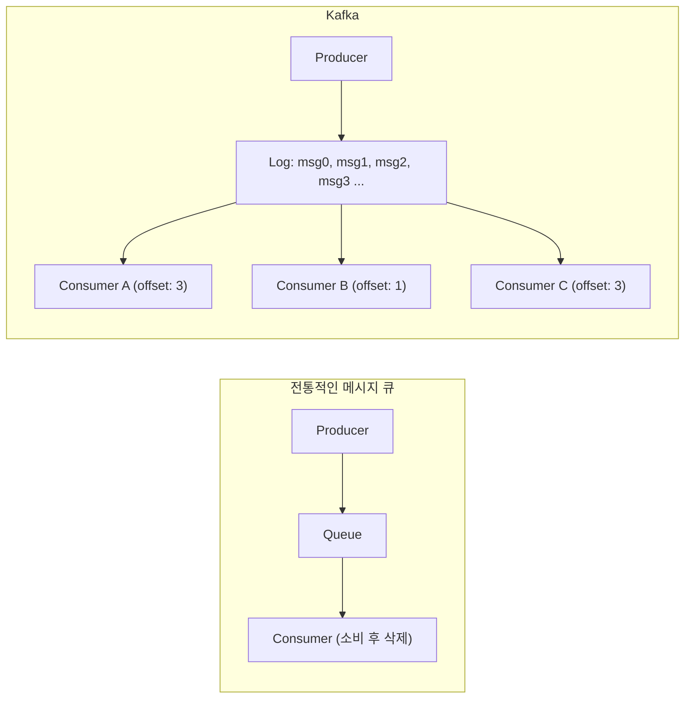

각 소비자가 독립적으로 자신의 위치를 관리한다.

---

## 핵심 구성요소

### Broker

Kafka 클러스터를 구성하는 **개별 서버 노드**다. 각 브로커는 고유한 ID를 가지며, 파티션의 데이터를 저장하고 클라이언트 요청을 처리한다.

> **비유**: 브로커는 우체국의 지점이다. 편지(메시지)를 보관하고, 발신자와 수신자의 요청을 처리한다. 여러 지점이 모여 하나의 우체국 네트워크(클러스터)를 이룬다.

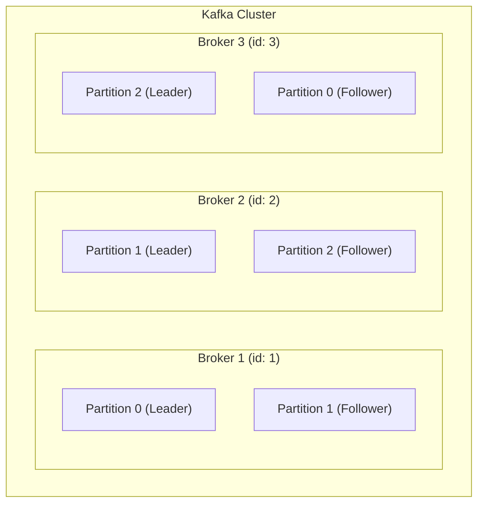

브로커의 주요 역할:
- 프로듀서로부터 메시지 수신 및 디스크 저장
- 컨슈머 요청에 메시지 전달
- 파티션 리더/팔로워 관리
- 다른 브로커와의 복제 조율

### Topic

메시지를 분류하는 **논리적 채널**이다. 데이터베이스의 테이블에 비유할 수 있다. 토픽 이름은 클러스터 내에서 유일해야 한다.

> **실무 예시**: 배달 앱이라면 `order-events`(주문), `payment-events`(결제), `delivery-events`(배달) 처럼 업무 단위로 토픽을 분리한다. 마케팅팀은 `order-events`를, 결제팀은 `payment-events`를 각자 구독하면 서로 독립적으로 데이터를 처리할 수 있다.

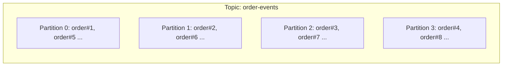

### Partition

토픽을 구성하는 **물리적 저장 단위**다. 파티션은 Kafka 확장성의 핵심이다.

> **비유**: 파티션은 은행 창구다. 창구(파티션)가 많을수록 동시에 처리할 수 있는 고객(메시지)이 많아진다. 단, 같은 창구에서 처리한 업무는 순서가 보장되지만, 다른 창구끼리는 순서를 알 수 없다.

**파티션의 특성:**
- 각 파티션은 순서가 보장된 **불변 로그(immutable log)**
- 파티션 내에서만 순서 보장 (토픽 전체 순서 보장 불가)
- 각 파티션은 하나의 브로커에만 Leader가 존재
- 여러 브로커에 Replica가 분산 저장됨

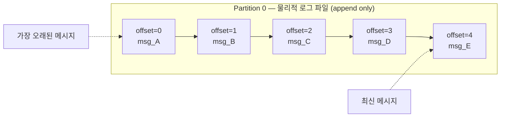

**파티션 수 결정 기준:**
- 목표 처리량 / 단일 파티션 처리량
- 컨슈머 병렬 처리 수 (파티션 수 = 최대 컨슈머 수)
- 일반적으로 브로커 수의 배수로 설정

> **실무 함정**: 파티션은 줄일 수 없고 늘리기만 가능하다. 처음에 너무 적게 설정하면 나중에 늘릴 때 키 기반 순서 보장이 깨진다. 트래픽 예측이 어렵다면 처음부터 넉넉하게 설정하는 것이 안전하다.

### Producer

토픽에 메시지를 **발행(publish)**하는 클라이언트다.

```java
// Spring Kafka Producer 예시
@Service
public class OrderProducer {

    private final KafkaTemplate<String, OrderEvent> kafkaTemplate;

    public void sendOrder(OrderEvent event) {
        // 키 지정 시 동일 키는 항상 같은 파티션으로
        kafkaTemplate.send("order-events", event.getOrderId(), event)
            .addCallback(
                result -> log.info("전송 성공: offset={}", result.getRecordMetadata().offset()),
                ex -> log.error("전송 실패", ex)
            );
    }
}
```

프로듀서의 파티션 결정 과정:
1. **키가 있는 경우**: `hash(key) % 파티션수` → 동일 키는 항상 같은 파티션
2. **키가 없는 경우**: RoundRobin 또는 Sticky Partitioner(기본값, 배치 효율 최적화)
3. **커스텀 Partitioner**: 직접 구현 가능

### Consumer

토픽에서 메시지를 **구독(consume)**하는 클라이언트다.

```java
// Spring Kafka Consumer 예시
@Service
public class OrderConsumer {

    @KafkaListener(topics = "order-events", groupId = "order-processing-group")
    public void handleOrder(ConsumerRecord<String, OrderEvent> record) {
        log.info("파티션={}, 오프셋={}, 메시지={}",
            record.partition(), record.offset(), record.value());
        processOrder(record.value());
    }
}
```

### Consumer Group

동일한 `group.id`를 공유하는 컨슈머들의 집합이다. **파티션은 그룹 내에서 하나의 컨슈머에게만 할당**된다.

> **비유**: Consumer Group은 팀 프로젝트다. 팀원(컨슈머)이 많을수록 업무(파티션)를 나눠서 빨리 끝낼 수 있다. 단 한 업무를 두 팀원이 동시에 담당하는 일은 없다. 다른 팀(다른 그룹)은 같은 자료(토픽)를 독립적으로 처음부터 읽을 수 있다.

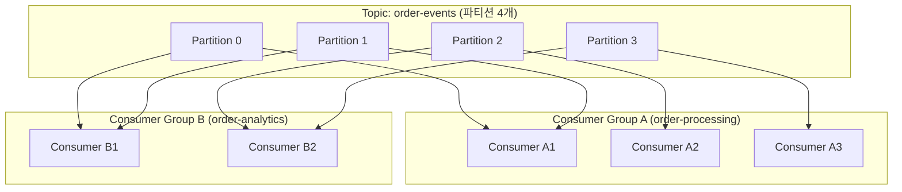

파티션 4개, 컨슈머 3개인 Group A에서는 A1이 2개 파티션을 담당하며, Group B는 같은 토픽을 독립적으로 소비한다(브로드캐스트 효과).

**중요한 규칙:**
- 파티션 수 > 컨슈머 수: 일부 컨슈머가 여러 파티션 담당
- 파티션 수 = 컨슈머 수: 1:1 할당 (이상적)
- 파티션 수 < 컨슈머 수: 일부 컨슈머는 유휴 상태 (낭비)

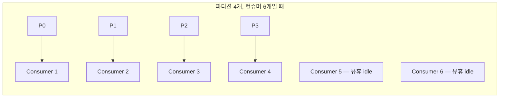

---

## Offset 개념과 관리

Offset은 파티션 내에서 메시지의 **고유 위치 번호**다. 0부터 시작하며 단조 증가한다.

> **비유**: Offset은 책의 페이지 번호다. 어디까지 읽었는지 책갈피(커밋된 offset)를 꽂아두면, 나중에 그 페이지부터 다시 읽을 수 있다. 책을 여러 명이 읽어도 각자 책갈피 위치가 다를 수 있다.

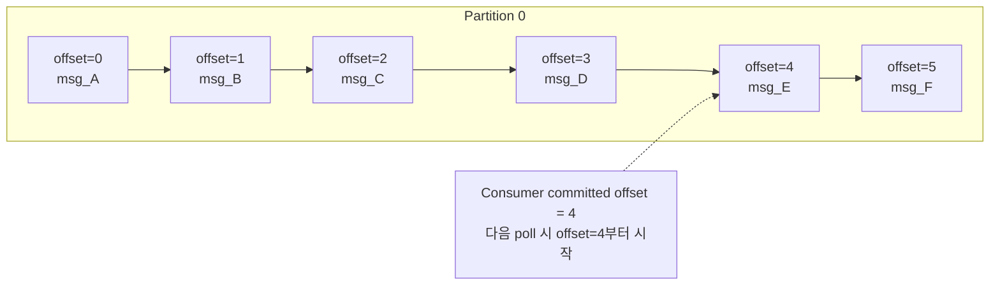

### Offset 커밋 방식

**1. 자동 커밋 (Auto Commit)**
```java
// application.yml
spring:
  kafka:
    consumer:
      enable-auto-commit: true
      auto-commit-interval: 5000  # 5초마다 자동 커밋
```
- 간단하지만 메시지 손실 또는 중복 처리 위험 있음
- `poll()` 호출 시 이전 poll에서 받은 오프셋 커밋

**2. 수동 커밋 (Manual Commit)**
```java
@KafkaListener(topics = "order-events", groupId = "order-group")
public void handleOrder(ConsumerRecord<String, OrderEvent> record,
                        Acknowledgment ack) {
    try {
        processOrder(record.value());
        ack.acknowledge();  // 처리 성공 후 명시적 커밋
    } catch (Exception e) {
        // 커밋하지 않으면 다음 poll 시 재처리
        log.error("처리 실패, 재처리 예정", e);
    }
}
```

### Offset 관리 위치

Kafka 0.9 이전: ZooKeeper에 저장
Kafka 0.9 이후: `__consumer_offsets` 내부 토픽에 저장

```
__consumer_offsets 토픽:
Key: [group_id, topic, partition]
Value: [offset, metadata, timestamp]

예시:
"order-group" + "order-events" + 0 → offset: 1234
"order-group" + "order-events" + 1 → offset: 1187
"order-group" + "order-events" + 2 → offset: 1203
```

### Offset 리셋 전략

```java
// application.yml
spring:
  kafka:
    consumer:
      auto-offset-reset: earliest  # earliest | latest | none
```

| 전략 | 설명 | 사용 시나리오 |
|------|------|--------------|
| `earliest` | 가장 오래된 메시지부터 | 새 그룹, 전체 재처리 |
| `latest` | 가장 최신 메시지부터 | 새 그룹, 현재부터 소비 |
| `none` | 오프셋 없으면 예외 | 명시적 관리 |

> **실무 예시**: 결제 서비스의 버그를 수정한 뒤 이틀 치 데이터를 재처리해야 한다면, `--to-datetime` 옵션으로 특정 시점으로 offset을 리셋하고 컨슈머를 재시작하면 된다. Kafka가 메시지를 보존하기 때문에 가능한 일이다.

---

## ZooKeeper vs KRaft

### ZooKeeper 모드 (전통적 방식)

Kafka 2.x까지의 전통적 구성으로, ZooKeeper가 클러스터 메타데이터를 관리한다.

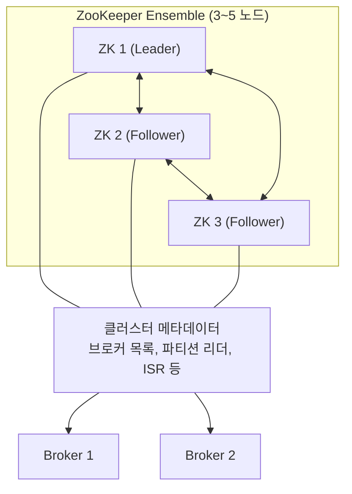

ZooKeeper가 관리하는 정보:
- 브로커 등록/해제
- 컨트롤러 선출
- 파티션 리더 정보
- ACL 설정

**ZooKeeper 방식의 단점:**
- 별도 ZooKeeper 클러스터 운영 부담
- 메타데이터 동기화 지연
- 파티션 수 증가 시 ZooKeeper 부하 증가
- 운영 복잡도 (두 시스템 동시 관리)

### KRaft 모드 (Kafka 3.x+)

Kafka 2.8에서 Early Access, 3.3에서 Production Ready로 발표된 **ZooKeeper 없는 모드**다. Kafka 4.0에서는 ZooKeeper 지원이 완전히 제거되었다.

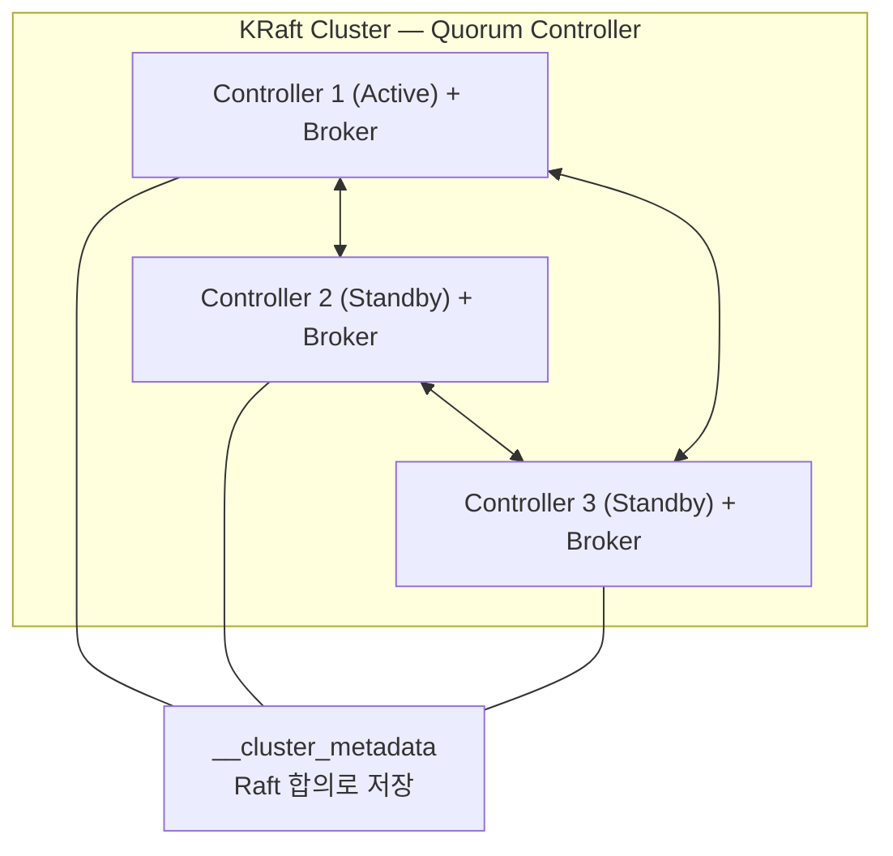

**KRaft의 장점:**

| 항목 | ZooKeeper | KRaft |
|------|-----------|-------|
| 운영 복잡도 | 두 시스템 | 하나의 시스템 |
| 지원 파티션 수 | ~200,000 | 수백만 |
| 컨트롤러 failover | 수십 초 | 수 초 |
| 메타데이터 일관성 | 최종적 일관성 | 강한 일관성 |
| 설정 | 복잡 | 단순 |

```properties
# KRaft 설정 예시 (server.properties)
process.roles=broker,controller
node.id=1
controller.quorum.voters=1@kafka1:9093,2@kafka2:9093,3@kafka3:9093
listeners=PLAINTEXT://:9092,CONTROLLER://:9093
```

---

## Kafka의 로그 구조

Kafka의 저장 구조는 **append-only log**를 기반으로 한다. 이것이 Kafka가 고성능을 달성하는 핵심 이유다.

### 물리적 파일 구조

```
/kafka-logs/
└── order-events-0/          ← 토픽명-파티션번호
    ├── 00000000000000000000.log    ← 실제 메시지 데이터 (segment)
    ├── 00000000000000000000.index  ← offset → 파일 위치 인덱스
    ├── 00000000000000000000.timeindex ← timestamp → offset 인덱스
    ├── 00000000000001000000.log    ← 다음 세그먼트 (1000000번 offset부터)
    ├── 00000000000001000000.index
    └── 00000000000001000000.timeindex
```

파일명의 숫자는 해당 세그먼트의 **첫 번째 offset**이다.

### Segment

파티션 로그는 여러 **세그먼트(Segment)**로 나뉜다.

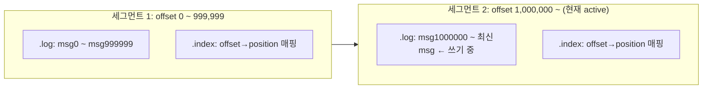

세그먼트 롤오버 조건:
- `log.segment.bytes`: 세그먼트 크기 초과 (기본 1GB)
- `log.roll.ms`: 최대 보관 시간 초과 (기본 7일)

### Append-Only 쓰기 성능

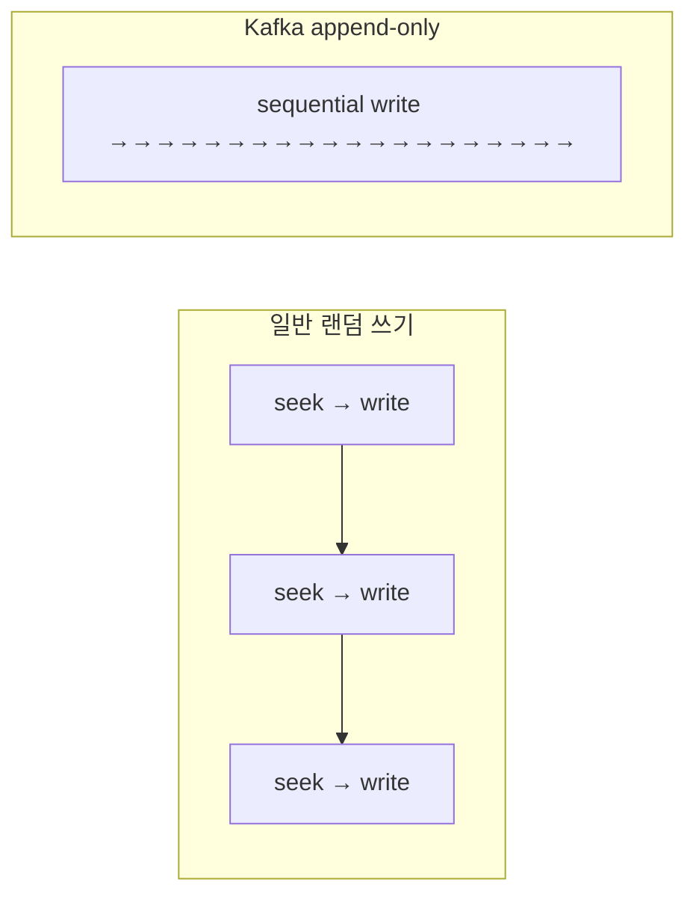

Kafka가 빠른 이유:
1. **Sequential I/O**: 순차 쓰기는 랜덤 쓰기보다 수십 배 빠름
2. **OS Page Cache 활용**: 커널이 자동으로 캐싱
3. **Zero-Copy**: `sendfile()` 시스템 콜로 커널 → 소켓 직접 전송 (데이터 복사 없음)
4. **배치 처리**: 여러 메시지를 묶어 한 번에 처리

> **왜 Kafka는 HDD에서도 빠른가?** 일반적으로 HDD의 랜덤 쓰기는 느리다. 하지만 Kafka는 항상 파일 끝에만 이어 쓰는 순차 쓰기를 사용하므로, SSD가 아닌 일반 HDD에서도 초당 수백 MB의 처리량을 낼 수 있다.

### Index를 통한 빠른 검색

```
.index 파일 (희소 인덱스, sparse index):
offset 0    → position 0
offset 100  → position 4800
offset 200  → position 9600
...

특정 offset 조회:
1. index에서 가장 가까운 작은 offset 찾기 (이진 탐색)
2. 해당 position으로 .log 파일 seek
3. 순차 스캔으로 정확한 메시지 위치 찾기
```

### 로그 보관 정책

```properties
# 시간 기반 (기본 7일)
log.retention.hours=168

# 크기 기반
log.retention.bytes=1073741824  # 1GB

# 세그먼트 크기
log.segment.bytes=1073741824    # 1GB
```

삭제 방식:
- `delete`: 보관 기간 지난 세그먼트 삭제 (기본값)
- `compact`: 동일 키의 오래된 메시지 제거, 최신 값만 유지 (로그 컴팩션)

---

## ISR (In-Sync Replicas)

ISR은 리더 파티션과 **동기화 상태가 최신인 팔로워 집합**이다.

> **비유**: 팀장(리더)이 업무 지시를 내렸을 때 즉각 따라온 팀원만 ISR이다. 회의에 빠지거나 연락이 안 되는 팀원은 ISR에서 빠진다. 팀장이 갑자기 자리를 비울 때는 ISR 안에서만 새 팀장을 선출한다.

### ISR 동작 원리

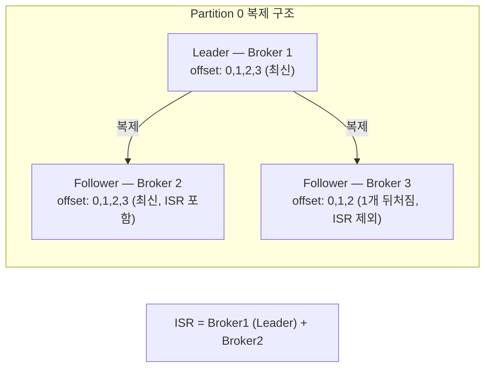

팔로워가 ISR에서 제외되는 조건:
- `replica.lag.time.max.ms` (기본 30초) 동안 리더에서 fetch 요청이 없거나
- 복제가 너무 뒤처진 경우

### HW (High Watermark)

**컨슈머가 읽을 수 있는 최대 offset**이다. ISR의 모든 복제본이 복제 완료한 offset까지만 컨슈머에게 노출된다.

> **비유**: HW는 댐의 수위 표시선이다. 물(메시지)은 실제로 더 많이 들어왔지만, 하류(컨슈머)에 보내도 안전한 수위까지만 방류한다. 복제가 완료되지 않은 메시지를 컨슈머가 읽었는데 리더가 죽으면, 새 리더에는 그 메시지가 없어 "이미 읽은 메시지가 세상에서 사라지는" 문제가 생긴다. HW가 이것을 막는 안전 수위선이다.

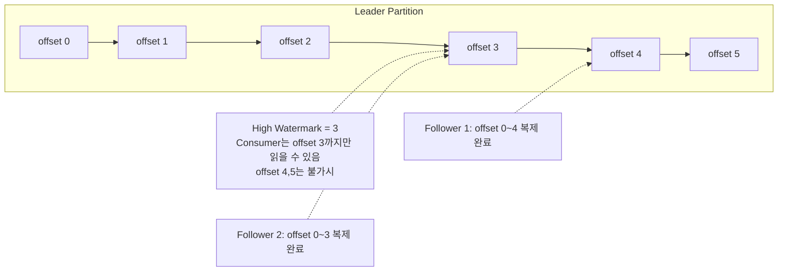

> **왜 HW가 필요한가?** 리더가 offset 5까지 썼지만 팔로워가 3까지만 복제했다고 하자. 컨슈머가 4, 5를 읽은 뒤 리더가 죽으면, 새 리더(팔로워)에는 4, 5가 없다. HW는 "모든 ISR이 가진 안전한 범위"만 컨슈머에게 보여줘서 이 문제를 방지한다.

---

## acks 설정과 트레이드오프

`acks`는 프로듀서가 메시지 전송 성공을 판단하는 기준이다.

> **비유**: acks는 택배 발송 확인 수준이다. `acks=0`은 택배를 문 앞에 놓고 가는 것(도착 확인 없음), `acks=1`은 경비실에 맡기는 것(건물까지 도착은 확인, 수신자 수령은 모름), `acks=all`은 수신자 본인이 서명하고 보관함에 넣을 때까지 확인하는 것(가장 느리지만 확실)이다.

### acks=0 (Fire and Forget)

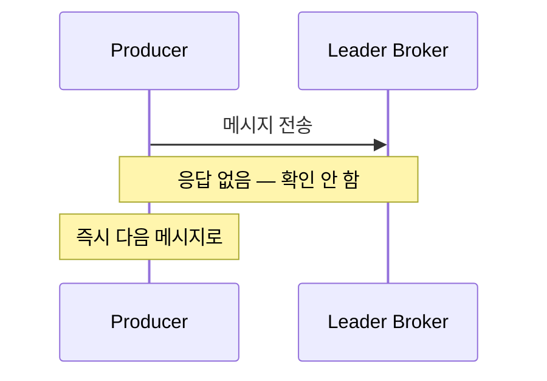

- **성능**: 최고 (응답 대기 없음)
- **안정성**: 최저 (브로커 장애 시 메시지 유실)
- **사용 사례**: 로그 수집, 메트릭 (일부 손실 허용)

### acks=1 (Leader Acknowledgment)

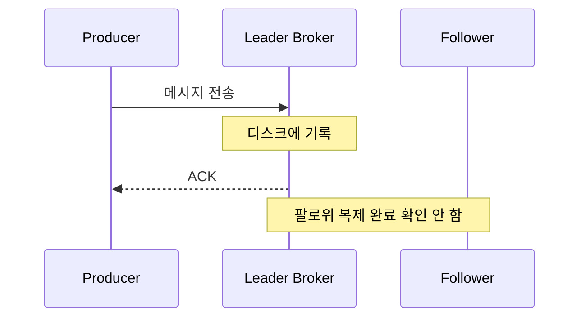

- **성능**: 중간
- **안정성**: 중간 (리더 기록 후 팔로워 복제 전 장애 시 유실)
- **사용 사례**: 일반적인 경우

### acks=all (또는 acks=-1, ISR Acknowledgment)

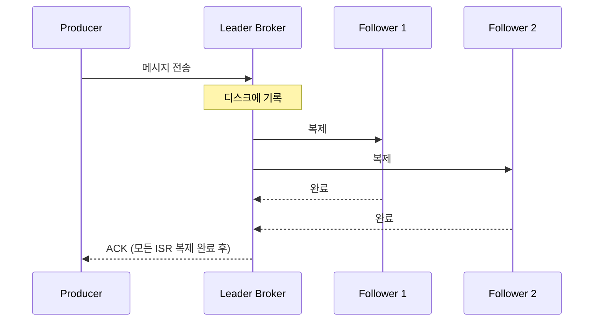

- **성능**: 가장 낮음 (모든 ISR 복제 대기)
- **안정성**: 최고 (ISR 전체 장애 없으면 유실 없음)
- **사용 사례**: 금융 거래, 주문 처리

```java
// Producer 설정
@Configuration
public class KafkaProducerConfig {

    @Bean
    public ProducerFactory<String, Object> producerFactory() {
        Map<String, Object> config = new HashMap<>();
        config.put(ProducerConfig.BOOTSTRAP_SERVERS_CONFIG, "kafka1:9092,kafka2:9092");
        config.put(ProducerConfig.ACKS_CONFIG, "all");                    // 안전성 최우선
        config.put(ProducerConfig.RETRIES_CONFIG, 3);                     // 재시도 3회
        config.put(ProducerConfig.ENABLE_IDEMPOTENCE_CONFIG, true);       // 멱등성 활성화
        config.put(ProducerConfig.MIN_INSYNC_REPLICAS_CONFIG, 2);        // 최소 2개 ISR 동기화
        config.put(ProducerConfig.COMPRESSION_TYPE_CONFIG, "snappy");     // 압축
        config.put(ProducerConfig.BATCH_SIZE_CONFIG, 16384);              // 배치 크기 16KB
        config.put(ProducerConfig.LINGER_MS_CONFIG, 5);                   // 최대 5ms 대기
        return new DefaultKafkaProducerFactory<>(config);
    }
}
```

### acks 설정 비교 요약

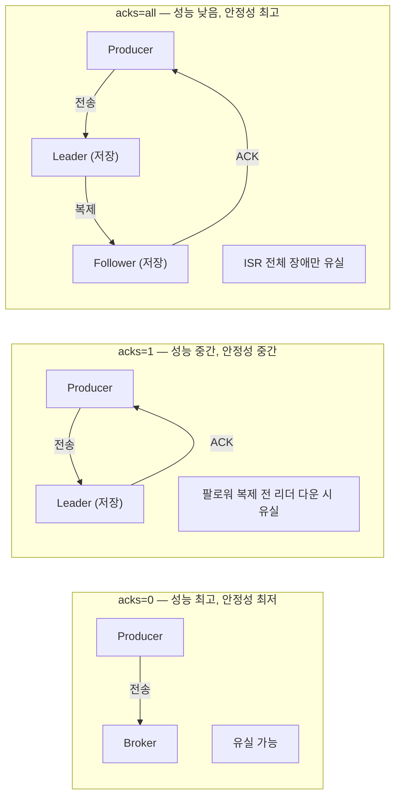

### min.insync.replicas와의 관계

`acks=all`만으로는 부족하다. ISR이 리더 하나만 남아도 `acks=all`은 성공한다.

```properties
# 브로커 설정
min.insync.replicas=2  # ISR이 2개 미만이면 쓰기 거부

# 조합의 의미:
# acks=all + min.insync.replicas=2
# → 리더 포함 최소 2개의 브로커에 복제 완료해야 ACK
# → ISR이 1개(리더만)이면 NotEnoughReplicasException 발생
```

> **실무 시나리오**: 브로커 3대 클러스터에서 `acks=all`만 설정하면 팔로워 2대가 모두 죽어도 리더 1대만 살아있으면 쓰기가 성공한다. `min.insync.replicas=2`를 추가하면 이 상황에서 쓰기가 거부되어, 2대 모두 죽었다는 사실을 즉시 알 수 있다.

---

<details class="extreme-scenario-details">
<summary class="extreme-scenario-summary">
<span class="extreme-scenario-icon">🔥</span>
<span class="extreme-scenario-label">극한 시나리오 — 클릭하여 펼치기</span>
<span class="extreme-scenario-toggle"></span>
</summary>
<div class="extreme-scenario-body">

<div class="extreme-scenario-content" markdown="1">

### 시나리오 1: 파티션 수보다 컨슈머가 많은데 Lag이 쌓인다

> **비유**: 고속도로 톨게이트가 3개(파티션)인데 요금 징수원을 6명(컨슈머) 배치했다. 3명은 할 일이 없이 대기한다. 차가 밀린다고 징수원을 더 투입해도 톨게이트가 3개뿐이면 처리량은 동일하다.

```
상황: 파티션 3개, 컨슈머 6개 → 3개는 유휴 상태
      Lag이 계속 증가 → 컨슈머를 더 늘려도 효과 없음

메커니즘:
  Kafka는 파티션 하나를 그룹 내 컨슈머 하나에만 할당한다 (순서 보장을 위해).
  파티션 수 = 병렬 처리의 물리적 상한선이다.
  컨슈머가 아무리 많아도 파티션 수를 초과하면 초과분은 idle 상태로 리소스만 낭비한다.

근거:
  KafkaConsumer.poll() 호출 시 ConsumerCoordinator가 파티션 할당을 수행하며,
  RangeAssignor/StickyAssignor 모두 파티션 수 > 컨슈머 수일 때만
  하나의 컨슈머에 복수 파티션을 배정한다.

해결:
  1. 파티션 수를 먼저 늘린 후 컨슈머 증설
  2. 키 기반 파티셔닝 사용 시, 파티션 증가 후 hash(key) % 파티션수 결과가
     달라지므로 동일 키의 순서 보장이 일시적으로 깨진다
  3. 트래픽이 적은 시간대에 파티션 증가, 키 재분배 영향이 허용 범위인지 사전 확인
```

### 시나리오 2: acks=all인데 메시지가 유실됐다

> **비유**: 중요 서류를 보낼 때 "수신자 본인 확인 후 서명"(acks=all) 조건을 걸었다. 그런데 수신 가능한 사람이 사장 1명(리더)뿐이면, 사장 서명만으로 완료 처리된다. 사장이 서류를 들고 퇴근하다 분실하면? `min.insync.replicas=2`는 "최소 2명이 서명해야 접수 완료"라는 규칙이다. 사장 혼자만 남으면 접수 자체를 거부해서 분실을 원천 차단한다.

```
상황: acks=all 설정, 브로커 3대 중 2대 장애
      ISR = {Leader만 남음}
      쓰기는 성공했는데 Leader도 장애 → 메시지 유실

메커니즘:
  acks=all은 "ISR에 포함된 모든 레플리카가 복제 완료"를 의미한다.
  ISR이 리더 하나로 축소되면 리더 자신만 확인하고 ACK를 반환한다.
  이 상태에서 리더마저 죽으면 메시지가 어디에도 남지 않는다.

  min.insync.replicas=2를 설정하면, ISR이 2개 미만일 때
  NotEnoughReplicasException을 발생시켜 쓰기 자체를 거부한다.
  → Producer는 에러를 받아 재시도하거나 장애 알림을 보낼 수 있다.

근거:
  Kafka 공식 문서 "acks=all guarantees that the record will not be lost
  as long as at least one in-sync replica remains alive."
  즉 ISR이 1개(리더만)면 리더 장애 시 유실이 설계상 허용된다.

해결: acks=all + min.insync.replicas=2 조합 필수
     브로커 3대 기준: replication.factor=3, min.insync.replicas=2
     → 1대 장애까지는 정상 쓰기, 2대 장애 시 쓰기 거부 (유실보다 가용성 포기)
```

### 시나리오 3: 컨슈머 재시작 후 메시지가 중복 처리됐다

> **비유**: 시험 답안지를 작성하면서 "여기까지 검토 완료"라는 체크(오프셋 커밋)를 5분마다 한다. 4분 59초에 갑자기 퇴실당하면(크래시), 마지막 체크 이후 작성한 답안은 기록에 없다. 다시 입실하면 마지막 체크 시점부터 다시 작성해야 하고, 이미 쓴 답안을 또 쓰게 된다(중복 처리).

```
상황: auto.commit=true, 처리 중 컨슈머 크래시
      자동 커밋 주기(5초) 직전에 크래시 → 커밋 안 됨
      재시작 후 마지막 커밋 오프셋부터 재처리 → 중복

메커니즘:
  enable.auto.commit=true일 때 KafkaConsumer.poll() 호출 시점에
  이전 poll()에서 반환받은 오프셋을 자동 커밋한다.
  즉 "메시지를 받았다"는 시점에 커밋하지 "처리 완료" 시점에 커밋하지 않는다.

  auto.commit.interval.ms=5000(기본값) 동안 메시지를 처리하다 크래시하면,
  마지막 자동 커밋 이후의 모든 메시지가 "처리 안 됨"으로 남아 재시작 시 재처리된다.

  반대로 poll() 직후 자동 커밋되고 처리 중 크래시하면,
  커밋은 됐지만 실제로는 처리 안 된 메시지가 유실된다.

근거:
  Kafka Consumer 설계 원칙: "at-least-once"가 기본.
  exactly-once를 원하면 트랜잭션 + 멱등성이 필요하다.

해결:
  1. enable.auto.commit=false로 변경
  2. 수동 커밋(ack.acknowledge())으로 처리 완료 후 커밋
  3. 컨슈머 비즈니스 로직에 멱등성 구현:
     - DB upsert (INSERT ON DUPLICATE KEY UPDATE)
     - 메시지 ID 기반 중복 체크 테이블
     - 상태 기계(state machine) 패턴으로 이미 처리된 상태 전이 무시
```

---
</div>
</div>
</details>

## 실무에서 자주 하는 실수

### 1. 파티션 수를 나중에 줄이려고 한 것

파티션은 **늘리기만 가능하고 줄일 수 없다.** 처음에 파티션을 100개로 설정했다가 "과하다"고 판단해 줄이려 하면, 토픽을 삭제하고 재생성해야 한다. 기존 데이터가 전부 사라진다. 초기 설계 시 예상 처리량의 2~3배 정도로 여유 있게 잡되, 수백 개까지 과도하게 늘리지 않는 것이 핵심이다.

### 2. acks=all만 설정하고 min.insync.replicas를 빠뜨린 것

`acks=all`을 설정하면 "완벽하게 안전하다"고 착각하기 쉽다. 하지만 ISR이 리더 하나로 축소되면 `acks=all`이라도 리더 한 곳에만 쓰고 ACK를 반환한다. **반드시 `min.insync.replicas=2` 이상을 함께 설정**해야 리더 단독 쓰기를 방지할 수 있다.

### 3. Consumer Group ID를 서비스 인스턴스마다 다르게 설정한 것

같은 서비스의 인스턴스들이 서로 다른 `group.id`를 사용하면 **각 인스턴스가 모든 메시지를 독립적으로 소비**한다. 파티션 분산 처리가 아니라 브로드캐스트가 되어, 하나의 주문 메시지를 3개 인스턴스가 각각 처리하는 사고가 발생한다. 같은 역할의 컨슈머는 반드시 같은 `group.id`를 사용해야 한다.

### 4. 메시지 키를 무작위로 설정한 것

"키를 설정하면 좋다"는 말에 UUID 같은 랜덤 키를 넣으면, 파티셔닝의 의미가 사라진다. 키의 목적은 **같은 엔티티의 이벤트를 같은 파티션에 모아 순서를 보장**하는 것이다. 주문 서비스라면 `orderId`, 사용자 서비스라면 `userId`처럼 비즈니스 엔티티 식별자를 키로 사용해야 한다.

### 5. log.retention.hours를 너무 짧게 설정한 것

보관 기간을 1시간으로 설정했더니 주말 동안 신규 컨슈머를 배포한 뒤 월요일에 확인하니 금요일 데이터가 이미 삭제되어 재처리가 불가능했다. 기본값 7일(168시간)을 기준으로, 디스크 용량과 재처리 필요성을 고려해 결정해야 한다.

---

## 정리

| 개념 | 핵심 한 줄 요약 |
|------|----------------|
| Broker | Kafka 클러스터의 물리적 서버 노드 |
| Topic | 메시지를 분류하는 논리적 채널 |
| Partition | 토픽의 물리적 저장 단위, 순서 보장 및 확장성의 핵심 |
| Producer | 메시지를 발행하는 클라이언트 |
| Consumer | 메시지를 구독하는 클라이언트 |
| Consumer Group | 파티션을 분담하여 병렬 소비하는 컨슈머 집합 |
| Offset | 파티션 내 메시지의 고유 위치 번호 |
| ISR | 리더와 동기화된 팔로워 집합 |
| acks | 프로듀서의 메시지 전송 확인 기준 |
| KRaft | ZooKeeper 없이 Kafka 자체 Raft 합의로 메타데이터 관리 |
