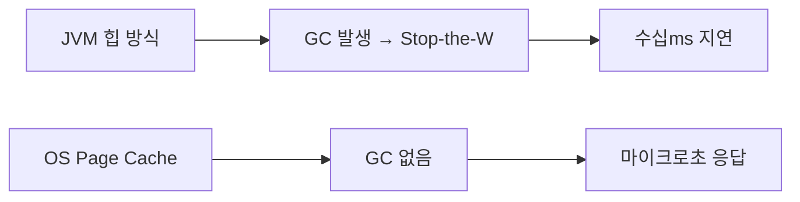
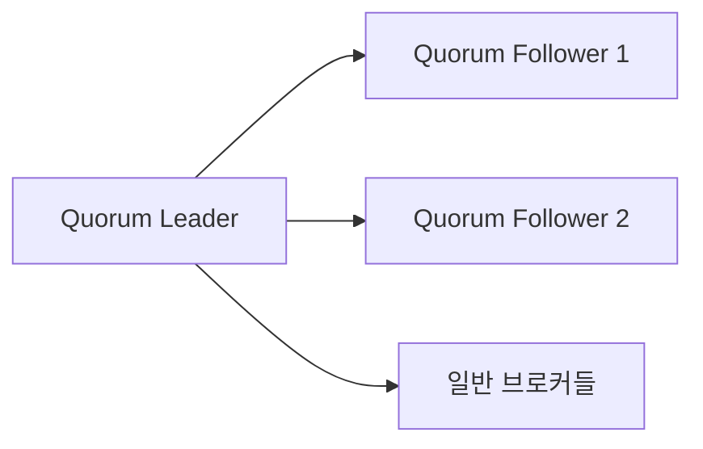
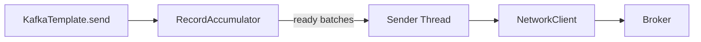
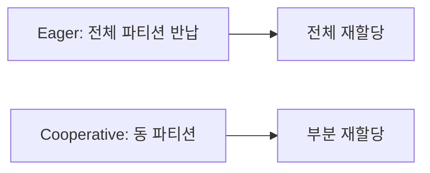
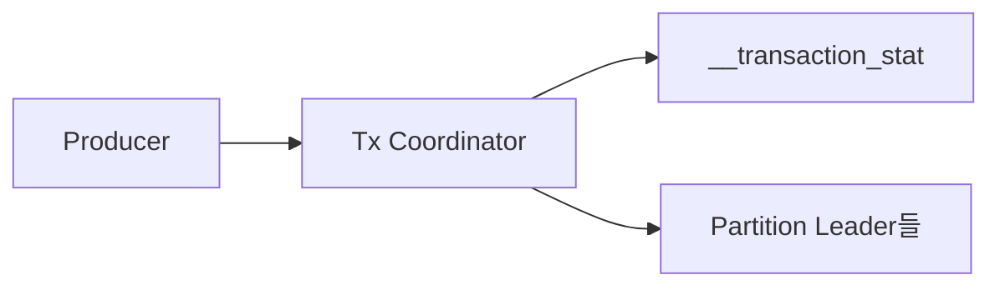

초당 100만 건의 이벤트를 처리하는 Kafka가 단순한 메시지 큐와 근본적으로 다른 이유는 하나다. **OS와 하드웨어의 특성을 정확히 이해하고 그것을 최대한 활용하도록 설계됐기 때문이다.** JVM 힙 대신 Page Cache를 쓰고, 소켓 복사 대신 `sendfile()`을 쓰고, 랜덤 I/O 대신 순차 쓰기를 쓴다. 이 문서는 그 "왜"를 파헤친다.

> **비유**: Kafka 브로커는 도서관 사서와 같다. 책(메시지)을 하나씩 서가에서 꺼내 독자에게 건네지 않는다. 도서관 내부 운반 시스템(Zero-Copy)으로 직접 배송하고, 색인카드(Index File)로 특정 페이지를 즉시 찾으며, OS가 자주 읽는 페이지를 미리 메모리에 올려두는(Page Cache) 방식으로 수천 명의 독자 요청을 동시에 처리한다.

---

## 1. 로그 세그먼트 구조: .log, .index, .timeindex

### 파일 레이아웃

파티션 디렉터리를 열어보면 세 종류의 파일이 반드시 세트로 존재한다.

```
/kafka-logs/order-events-0/
  00000000000000000000.log        ← 실제 메시지 데이터
  00000000000000000000.index      ← offset → 파일 위치 인덱스
  00000000000000000000.timeindex  ← timestamp → offset 인덱스
  00000000000001048576.log        ← 다음 세그먼트 (base offset = 1048576)
  00000000000001048576.index
  00000000000001048576.timeindex
```

파일 이름의 숫자는 **해당 세그먼트의 첫 번째 메시지 offset**이다. Kafka는 새 세그먼트를 생성할 때 이전 세그먼트의 마지막 offset + 1을 파일명으로 사용한다.

### .log 파일 바이너리 포맷

`.log` 파일은 `RecordBatch`의 연속이다. 각 RecordBatch는 다음 구조를 갖는다.

```
RecordBatch {
  baseOffset:            int64   (8 bytes)  ← 이 배치의 첫 offset
  batchLength:           int32   (4 bytes)  ← baseOffset 이후 바이트 수
  partitionLeaderEpoch:  int32   (4 bytes)  ← 리더 에폭 (fencing용)
  magic:                 int8    (1 byte)   ← 현재 버전 = 2
  crc:                   uint32  (4 bytes)  ← CRC32C 체크섬
  attributes:            int16   (2 bytes)  ← 압축 타입, 트랜잭션 여부 등
  lastOffsetDelta:       int32   (4 bytes)  ← 배치 내 마지막 offset 상대값
  firstTimestamp:        int64   (8 bytes)
  maxTimestamp:          int64   (8 bytes)
  producerId:            int64   (8 bytes)  ← 멱등성/트랜잭션용
  producerEpoch:         int16   (2 bytes)
  baseSequence:          int32   (4 bytes)  ← 중복 감지용 시퀀스
  records:               []Record           ← 실제 레코드 배열
}

Record {
  length:          varint
  attributes:      int8
  timestampDelta:  varlong  ← firstTimestamp 기준 델타 (공간 절약)
  offsetDelta:     varint   ← baseOffset 기준 델타
  keyLength:       varint
  key:             byte[]
  valueLength:     varint
  value:           byte[]
  headersCount:    varint
  headers:         []Header
}
```

**WHY 델타 인코딩?** 같은 배치 내 레코드들은 timestamp와 offset이 연속적이다. 절대값 대신 델타(차이값)를 varint로 저장하면 배치 내 레코드당 수십 바이트를 절약한다. 100만 건의 메시지에서는 GB 단위 절약이다.

### .index 파일: Sparse Index와 이진 탐색

`.index` 파일은 **모든 메시지의 위치를 기록하지 않는다.** 기본 설정(`index.interval.bytes=4096`)으로 **약 4KB마다 하나의 인덱스 엔트리**를 기록한다.

```
.index 파일 구조 (각 엔트리 = 8 bytes):
  relativeOffset: int32  ← 세그먼트 baseOffset 기준 상대 offset
  position:       int32  ← .log 파일에서의 바이트 위치
```

예시:

```
relativeOffset=0,       position=0
relativeOffset=128,     position=4096
relativeOffset=256,     position=8210
relativeOffset=512,     position=16392
...
```

offset 300번 메시지를 찾을 때의 과정:


이진 탐색 후 **가장 가까운 이전 인덱스 엔트리**를 찾고, 거기서부터 `.log` 파일을 순차 스캔한다. 4KB마다 인덱스가 있으므로 최악의 경우 4KB를 스캔하면 찾을 수 있다.

**WHY Sparse Index?** 모든 레코드를 인덱싱하면 인덱스 파일이 너무 커진다. Kafka는 인덱스를 **Memory-Mapped File**로 로드하기 때문에, 인덱스가 크면 메모리를 과도하게 차지한다. Sparse Index는 이진 탐색으로 O(log n) 검색을 보장하면서 인덱스 크기를 1/1000 수준으로 줄인다.

### .timeindex 파일

```
timeindex 엔트리 (각 엔트리 = 12 bytes):
  timestamp:      int64
  relativeOffset: int32
```

`--from-beginning` 대신 특정 시간부터 소비하려면 (`auto.offset.reset=earliest` 로는 불가):

```java
// 특정 시각부터 소비
@Configuration
public class KafkaTimestampSeekConfig {

    @Bean
    public ConsumerRebalanceListener timestampSeekListener(
            KafkaConsumer<String, OrderEvent> consumer) {

        return new ConsumerRebalanceListener() {
            @Override
            public void onPartitionsAssigned(Collection<TopicPartition> partitions) {
                // 2시간 전 timestamp로 offset 검색
                long targetTimestamp = System.currentTimeMillis() - Duration.ofHours(2).toMillis();

                Map<TopicPartition, Long> timestampsToSearch = partitions.stream()
                    .collect(Collectors.toMap(tp -> tp, tp -> targetTimestamp));

                // timeindex 파일을 이진 탐색하여 해당 offset 반환
                Map<TopicPartition, OffsetAndTimestamp> result =
                    consumer.offsetsForTimes(timestampsToSearch);

                result.forEach((tp, offsetAndTs) -> {
                    if (offsetAndTs != null) {
                        consumer.seek(tp, offsetAndTs.offset());
                    }
                });
            }

            @Override
            public void onPartitionsRevoked(Collection<TopicPartition> partitions) {}
        };
    }
}
```

`offsetsForTimes()`는 내부적으로 브로커의 `.timeindex`를 이진 탐색한다.

### 세그먼트 롤링(Rolling) 트리거

```properties
# 세그먼트 파일 크기 (기본 1GB)
log.segment.bytes=1073741824

# 최대 유지 시간 (기본 7일, 크기 미달이어도 롤링)
log.roll.ms=604800000

# 인덱스 파일 최대 크기 (기본 10MB)
log.index.size.max.bytes=10485760
```

세그먼트가 롤링되면 이전 세그먼트는 불변(immutable)이 되고, 새 active 세그먼트가 생성된다. 불변 세그먼트만 보존 정책(삭제 또는 컴팩션)이 적용된다.

---

## 2. Page Cache: JVM 힙을 버린 이유

### OS Page Cache 동작 원리

Linux는 파일 읽기/쓰기 시 **커널 메모리의 Page Cache**를 경유한다.

```
write(fd, data, len):
  1. data → Page Cache (메모리 복사)
  2. 즉시 반환 (디스크 쓰기는 비동기)
  3. pdflush/kworker 데몬이 나중에 dirty page를 디스크에 flush

read(fd, buf, len):
  1. Page Cache에 해당 페이지 있으면 → 즉시 반환 (cache hit)
  2. 없으면 → 디스크에서 읽어 Page Cache 채운 후 반환 (cache miss)
```

**Read-Ahead 최적화**: Linux는 순차 읽기 패턴을 감지하면 다음 페이지를 **미리 비동기로 디스크에서 읽어** Page Cache에 올려둔다(`readahead`). Kafka Consumer의 순차 소비 패턴과 완벽하게 맞아떨어진다.

### Kafka가 JVM 힙을 쓰지 않는 이유



JVM 힙에 메시지를 캐시하면 세 가지 문제가 발생한다:

1. **이중 복사**: OS Page Cache에 이미 있는 데이터를 JVM 힙에 또 복사
2. **GC 압박**: 대용량 바이트 배열이 Old Gen을 채워 Full GC 유발
3. **재시작 시 캐시 소실**: JVM 재시작 시 힙 캐시 전체 소실. OS Page Cache는 재시작해도 유지됨

실제 운영 환경에서 Kafka 브로커에 64GB RAM이 있으면, JVM에는 4~6GB만 할당하고 나머지 58GB는 OS Page Cache용으로 남긴다. Consumer가 최근 메시지를 읽을 때 **디스크를 전혀 건드리지 않고** Page Cache에서 직접 서빙한다.

```java
// Spring Kafka: 브로커 힙 설정은 application.properties가 아니라
// kafka-server-start.sh 의 KAFKA_HEAP_OPTS에서 설정
// KAFKA_HEAP_OPTS="-Xmx6g -Xms6g"
// 나머지 메모리는 OS Page Cache에 위임

// Producer 측에서도 힙 압박 최소화
@Bean
public ProducerFactory<String, OrderEvent> producerFactory() {
    Map<String, Object> config = new HashMap<>();
    config.put(ProducerConfig.BOOTSTRAP_SERVERS_CONFIG, "kafka:9092");
    // buffer.memory: JVM 힙에서 할당 (기본 32MB, 이것만 힙 사용)
    config.put(ProducerConfig.BUFFER_MEMORY_CONFIG, 33554432L);
    // batch.size: 각 배치의 최대 크기
    config.put(ProducerConfig.BATCH_SIZE_CONFIG, 65536);
    config.put(ProducerConfig.LINGER_MS_CONFIG, 20);
    return new DefaultKafkaProducerFactory<>(config);
}
```

### pdflush / kworker와 fsync 전략

OS는 Page Cache의 dirty page를 주기적으로 디스크에 flush한다.

```properties
# Kafka 브로커 설정
# OS에 flush를 맡기는 방식 (기본값, 성능 우선)
log.flush.interval.messages=9223372036854775807  # 사실상 무한대
log.flush.interval.ms=9223372036854775807

# 복제(replication)로 내구성 보장 → fsync 없이도 안전
# 대신 min.insync.replicas=2, acks=all 조합 필수
```

**WHY fsync를 브로커에서 직접 안 하는가?** `fsync()`는 동기적으로 디스크 I/O가 완료될 때까지 블록한다. 초당 수만 건의 메시지를 쓰면서 매번 fsync를 호출하면 처리량이 100배 이상 감소한다. Kafka는 **복제(replication)**로 내구성을 보장한다. 3개 replica 중 2개에 데이터가 있으면, 브로커 1개가 Page Cache flush 전에 죽어도 다른 replica에서 복구된다.

---

## 3. Zero-Copy: 커널 우회로 전송 속도 극대화

### 전통적인 4-Copy 경로

네트워크로 파일을 전송하는 일반적인 방법:

```
전통 방식 (read() + write() 조합):

1. DMA 복사: Disk → Kernel Buffer (Page Cache)
2. CPU 복사: Kernel Buffer → User Space Buffer (read() 반환)
3. CPU 복사: User Space Buffer → Socket Buffer
4. DMA 복사: Socket Buffer → Network Card

컨텍스트 스위치: 4회 (user→kernel, kernel→user, user→kernel, kernel→user)
CPU 복사:       2회
DMA 복사:       2회
```

### Zero-Copy: sendfile() 2-Copy 경로


Linux `sendfile()` 시스템 콜은 User Space를 경유하지 않는다:

```
sendfile() 방식:

1. DMA 복사: Disk → Page Cache (cache miss일 때만)
2. DMA scatter-gather: Page Cache → Network Card (CPU 개입 없음!)

컨텍스트 스위치: 2회 (user→kernel, kernel→user)
CPU 복사:       0회  ← Zero-Copy의 의미
DMA 복사:       2회 (하드웨어가 처리)
```

Java에서는 `FileChannel.transferTo()`가 내부적으로 `sendfile()`을 사용한다:

```java
// Kafka 브로커 내부 (FileRecords.writeTo() 간략화)
public long writeTo(TransferableChannel destChannel, long offset, int length)
        throws IOException {
    // FileChannel.transferTo() → OS의 sendfile() 시스템 콜 호출
    // User Space 복사 없이 Page Cache → Socket Buffer 직접 전송
    return channel.transferTo(offset, length, destChannel);
}
```

### SSL/TLS가 Zero-Copy를 비활성화하는 이유

SSL을 활성화하면 Zero-Copy를 사용할 수 없다:

```
SSL 활성화 시:
1. DMA 복사: Disk → Page Cache
2. CPU 복사: Page Cache → User Space (복호화 버퍼)
3. CPU: TLS 암호화 처리 (User Space에서만 가능)
4. CPU 복사: 암호화된 데이터 → Socket Buffer
5. DMA 복사: Socket Buffer → Network Card

→ 암호화는 반드시 CPU가 개입해야 하므로 Zero-Copy 불가
```

```java
// SSL 활성화 시 성능 저하를 보완하는 설정
@Bean
public ProducerFactory<String, OrderEvent> sslProducerFactory() {
    Map<String, Object> config = new HashMap<>();
    config.put(ProducerConfig.BOOTSTRAP_SERVERS_CONFIG, "kafka:9093");
    config.put(CommonClientConfigs.SECURITY_PROTOCOL_CONFIG, "SSL");
    config.put(SslConfigs.SSL_KEYSTORE_LOCATION_CONFIG, "/certs/kafka.client.keystore.jks");
    config.put(SslConfigs.SSL_KEYSTORE_PASSWORD_CONFIG, "changeit");

    // SSL 환경에서는 배치 크기를 키워 TLS 오버헤드를 상쇄
    config.put(ProducerConfig.BATCH_SIZE_CONFIG, 131072);   // 128KB
    config.put(ProducerConfig.LINGER_MS_CONFIG, 50);
    // SSL 핸드셰이크 비용을 배치 처리로 분산
    return new DefaultKafkaProducerFactory<>(config);
}
```

### 실측 효과

| 방식 | CPU 복사 | 처리량 (1GB 파일 기준) |
|------|---------|----------------------|
| read() + write() | 2회 | ~500 MB/s |
| sendfile() | 0회 | ~3,000 MB/s |
| sendfile() + SSL | 2회 | ~800 MB/s |

Kafka가 단일 브로커로 초당 수백 MB를 Consumer에게 전송할 수 있는 핵심 이유가 Zero-Copy다.

---

## 4. Memory-Mapped Files: 인덱스가 mmap을 쓰는 이유

### MappedByteBuffer 동작 원리

`mmap()`은 파일을 프로세스의 가상 주소 공간에 직접 매핑한다:

```
일반 read():
  File → Page Cache → read() 시스템 콜 → User Space 버퍼

mmap():
  File → Page Cache (= 프로세스 가상 주소 공간)
  → 포인터로 직접 접근 (시스템 콜 없음, Page Fault만 발생)
```

Kafka는 `.index`와 `.timeindex` 파일에 `MappedByteBuffer`를 사용한다:

```java
// Kafka 내부 OffsetIndex 간략화
public class OffsetIndex {

    private final MappedByteBuffer mmap;

    public OffsetIndex(File file, long baseOffset, int maxIndexSize) throws IOException {
        RandomAccessFile raf = new RandomAccessFile(file, "rw");
        FileChannel channel = raf.getChannel();

        // 인덱스 파일 전체를 가상 주소 공간에 매핑
        // 이후 disk I/O 없이 메모리 포인터로 직접 접근
        this.mmap = channel.map(FileChannel.MapMode.READ_WRITE, 0, maxIndexSize);
    }

    // 이진 탐색으로 offset에 해당하는 물리 위치 반환
    public OffsetPosition lookup(long targetOffset) {
        // mmap에서 직접 읽기 → 시스템 콜 없음
        int lo = 0, hi = entries() - 1;
        while (lo < hi) {
            int mid = (lo + hi + 1) / 2;
            long offset = relativeOffset(mmap, mid) + baseOffset;
            if (offset <= targetOffset) lo = mid;
            else hi = mid - 1;
        }
        return new OffsetPosition(relativeOffset(mmap, lo) + baseOffset,
                                  physical(mmap, lo));
    }
}
```

**WHY .log 파일에는 mmap을 안 쓰는가?**

`.log` 파일은 크기가 최대 1GB이고 계속 증가한다. 1GB 파일을 mmap하면:

1. **가상 주소 공간 소모**: 32비트 JVM에서는 즉시 주소 공간 부족. 64비트에서도 수십 개 파티션이면 수십 GB를 점유
2. **unmap 비용**: Java의 `MappedByteBuffer`는 GC가 처리할 때까지 unmap되지 않음 → 파일 삭제/교체 불가 문제
3. **Page Cache와 중복**: `.log` 파일은 이미 OS Page Cache에 있으므로 mmap 이점이 없음

반면 인덱스 파일은 세그먼트당 최대 10MB이고, **이진 탐색 특성상 무작위 접근**이 필요하다. mmap이 시스템 콜 오버헤드 없이 포인터 연산으로 접근할 수 있어 최적이다.

---

## 5. 로그 컴팩션: Log Cleaner 내부 메커니즘

### 더티 비율과 클리닝 트리거

```
파티션 로그:
  [Clean 영역: 이미 컴팩션됨] [Dirty 영역: 아직 컴팩션 안됨]

Dirty Ratio = Dirty 영역 크기 / 전체 로그 크기

log.min.cleanable.dirty.ratio=0.5 (기본값)
→ Dirty Ratio가 0.5 초과 시 Log Cleaner 스레드 작동
```

### OffsetMap: 컴팩션의 핵심 자료구조

Log Cleaner 스레드는 Dirty 영역을 스캔하면서 **OffsetMap(해시 테이블)**을 구축한다:

```
OffsetMap:
  key(bytes) → 해당 키의 마지막 offset

예시:
  "user-1" → offset 4200  (t=4200이 가장 최신)
  "user-2" → offset 3100
  "user-3" → offset 4800
```

이 해시 테이블의 메모리 크기는 `log.cleaner.dedupe.buffer.size`(기본 128MB)로 제한된다. 파티션 크기가 크면 여러 번 나눠서 컴팩션된다.

### 컴팩션 과정 단계별


```
1단계 - OffsetMap 구축:
  Dirty 영역의 모든 레코드를 순차 스캔
  key → max(offset) 업데이트

2단계 - 새 세그먼트 작성:
  Clean 영역 + Dirty 영역 전체를 다시 읽으면서:
  - Clean 영역 레코드: OffsetMap에 없으면 그대로 복사
  - Dirty 영역 레코드: OffsetMap[key] == 현재 offset이면 유지, 아니면 삭제

3단계 - 원자적 교체:
  새 세그먼트 파일을 .cleaned 접미사로 작성
  → .swap 접미사로 변경 (원자적 rename)
  → 구 세그먼트 파일 삭제
```

### Tombstone(삭제 마커) 처리

```java
// 키를 완전히 삭제하려면 value=null로 전송
@Service
public class UserProfileService {

    private final KafkaTemplate<String, UserProfile> kafkaTemplate;

    public void deleteUser(String userId) {
        // Tombstone: value=null → 이 키의 모든 이전 레코드 삭제 예약
        kafkaTemplate.send("user-profiles", userId, null);
        // 컴팩션 후 "user-{userId}" 키 관련 레코드 전체 제거됨
    }

    public void updateUser(String userId, UserProfile profile) {
        kafkaTemplate.send("user-profiles", userId, profile);
    }
}
```

Tombstone의 생명주기:

```
t=100: key="user-1", value={name: "김철수"}  ← 기록
t=200: key="user-1", value=null  ← tombstone 기록

컴팩션 즉시 후:
  key="user-1" tombstone만 남음
  (Consumer가 tombstone을 읽고 캐시에서 키 제거할 수 있도록)

delete.retention.ms=86400000 (1일) 경과 후:
  tombstone도 삭제 → 키 완전 소멸
```

**WHY tombstone을 즉시 삭제하지 않는가?** Consumer가 오프라인이었다가 복귀했을 때, tombstone이 없으면 해당 키가 삭제됐다는 사실 자체를 모른다. `delete.retention.ms` 동안은 tombstone을 유지해 모든 Consumer가 삭제 이벤트를 인식할 시간을 준다.

### 컴팩션 설정 조합

```java
// 토픽 생성 시 컴팩션 설정
@Bean
public NewTopic userProfileTopic() {
    return TopicBuilder.name("user-profiles")
        .partitions(12)
        .replicas(3)
        .config(TopicConfig.CLEANUP_POLICY_CONFIG, "compact")
        .config(TopicConfig.MIN_CLEANABLE_DIRTY_RATIO_CONFIG, "0.3")  // 더 자주 컴팩션
        .config(TopicConfig.SEGMENT_MS_CONFIG, "3600000")             // 1시간마다 롤링
        .config(TopicConfig.DELETE_RETENTION_MS_CONFIG, "86400000")   // tombstone 1일 유지
        .config(TopicConfig.MIN_COMPACTION_LAG_MS_CONFIG, "300000")   // 5분 이상 된 메시지만 컴팩션
        .build();
}
```

`min.compaction.lag.ms`는 최근 5분 이내의 메시지는 컴팩션하지 않도록 보호한다. Consumer가 방금 생산된 메시지를 읽기 전에 컴팩션으로 사라지는 것을 방지한다.

---

## 6. 리더 선출: KRaft vs ZooKeeper

### ZooKeeper 기반 리더 선출 (구 방식)


ZooKeeper 방식의 동작:

```
1. 모든 브로커가 ZooKeeper에 /brokers/ids/{id} 임시 노드 생성
2. 첫 번째로 /controller 노드를 생성한 브로커가 Controller
3. Controller는 ZooKeeper watch로 브로커 장애 감지
4. 브로커 장애 시: ZooKeeper → Controller에 watch 알림
5. Controller가 해당 브로커의 파티션 리더를 ISR 내 다른 브로커로 재선출
6. Controller가 LeaderAndIsr 요청을 새 리더 + 모든 팔로워에게 전송
7. 메타데이터 변경을 ZooKeeper에 기록
```

**ZooKeeper 방식의 한계:**
- Controller 자체가 장애 시: 다른 브로커가 ZooKeeper에서 /controller 노드를 새로 생성하는 Controller 선출 과정 필요 (수 초)
- 대규모 클러스터(파티션 수십만 개)에서 ZooKeeper에 메타데이터 저장 한계
- 메타데이터 전파 지연: ZooKeeper → Controller → 모든 브로커 2-hop

### KRaft: Kafka Raft 기반 (Kafka 3.3+ 기본값)



KRaft는 ZooKeeper를 제거하고 Kafka 자체에 Raft 합의 프로토콜을 구현했다:

```
KRaft Controller Quorum (보통 3개 또는 5개):
  - 이 중 하나가 Active Controller (Raft Leader)
  - 메타데이터 변경은 Raft 로그에 기록 (과반수 승인)
  - Active Controller 장애 시 Raft 선출 (수백ms)

메타데이터 저장:
  ZK 방식: ZooKeeper의 znodes
  KRaft 방식: 내부 토픽 __cluster_metadata (Raft 로그)
```

```java
// KRaft 모드 확인
// server.properties 에서:
// process.roles=broker,controller  ← 브로커+컨트롤러 겸용
// node.id=1
// controller.quorum.voters=1@host1:9093,2@host2:9093,3@host3:9093

// Spring Kafka Admin으로 클러스터 메타데이터 확인
@Component
public class ClusterInfoService {

    private final KafkaAdmin kafkaAdmin;

    public void printClusterInfo() throws ExecutionException, InterruptedException {
        try (AdminClient adminClient = AdminClient.create(kafkaAdmin.getConfigurationProperties())) {
            DescribeClusterResult result = adminClient.describeCluster();
            System.out.println("Controller ID: " +
                result.controller().get().id());
            System.out.println("Cluster ID: " +
                result.clusterId().get());
        }
    }
}
```

### Epoch 기반 리더 펜싱

**Split-Brain 시나리오**: 구 리더가 네트워크 분리 후 복구됐을 때 새 리더와 동시에 쓰기 시도.

```
시나리오:
  t=0: Broker1이 Partition-0의 Leader (epoch=5)
  t=1: 네트워크 분리 → Broker2가 새 Leader로 선출 (epoch=6)
  t=2: Broker1의 네트워크 복구 → 아직 자신이 Leader라고 믿음

에폭 기반 펜싱:
  Broker1이 produce 요청 → 브로커들이 epoch=5인 것을 확인
  → "FENCED_LEADER_EPOCH" 오류 반환
  → Broker1은 Leader 자격 상실을 인식하고 팔로워로 전환
```

```java
// Producer 측 에폭 처리 (내부 동작)
// enable.idempotence=true 시 자동 활성화
// partitionLeaderEpoch가 RecordBatch 헤더에 포함됨
// 브로커는 현재 epoch보다 낮은 epoch의 배치를 거부

@Bean
public ProducerFactory<String, OrderEvent> resilientProducerFactory() {
    Map<String, Object> config = new HashMap<>();
    config.put(ProducerConfig.ENABLE_IDEMPOTENCE_CONFIG, true);
    // idempotence=true는 자동으로:
    // - acks=all
    // - retries=Integer.MAX_VALUE
    // - max.in.flight.requests.per.connection=5
    // - epoch 기반 fencing 활성화
    config.put(ProducerConfig.DELIVERY_TIMEOUT_MS_CONFIG, 120000); // 2분
    return new DefaultKafkaProducerFactory<>(config);
}
```

### ISR과 High Watermark

```
ISR(In-Sync Replicas): 리더와 replica.lag.time.max.ms 이내로 동기화된 팔로워 집합

LEO(Log End Offset): 각 replica의 마지막 offset
HW(High Watermark): ISR 전체가 복제 완료한 offset

Consumer는 HW까지만 읽을 수 있다:
  HW 이후 메시지는 ISR 전체에 복제되지 않아 리더 장애 시 유실 가능
```

```java
// min.insync.replicas와 acks=all 조합
@Bean
public NewTopic orderTopic() {
    return TopicBuilder.name("order-events")
        .partitions(12)
        .replicas(3)
        .config(TopicConfig.MIN_IN_SYNC_REPLICAS_CONFIG, "2")
        // min.insync.replicas=2: 최소 2개 ISR에 복제돼야 ack
        // replica 3개 중 1개 장애 시에도 서비스 지속
        // replica 2개 장애 시 쓰기 불가 (데이터 안전 우선)
        .build();
}

@Bean
public ProducerFactory<String, OrderEvent> durableProducerFactory() {
    Map<String, Object> config = new HashMap<>();
    config.put(ProducerConfig.ACKS_CONFIG, "all");  // ISR 전체 복제 후 ack
    // acks=all + min.insync.replicas=2 + replicas=3 = 최강 내구성
    return new DefaultKafkaProducerFactory<>(config);
}
```

---

## 7. 요청 처리 파이프라인: SocketServer부터 Purgatory까지

### 전체 요청 처리 아키텍처


### Acceptor와 Processor 분리

```
Acceptor Thread (1개):
  - ServerSocketChannel에서 새 연결 accept
  - 라운드로빈으로 Processor에 연결 할당

Processor Thread (num.network.threads개, 기본 3):
  - 할당된 소켓에서 NIO Selector로 read
  - 요청을 파싱해 RequestChannel에 enqueue
  - 응답을 소켓에 write
  - 네트워크 I/O만 담당 (비즈니스 로직 없음)

KafkaRequestHandler Thread (num.io.threads개, 기본 8):
  - RequestChannel에서 요청 dequeue
  - KafkaApis로 실제 비즈니스 로직 처리
  - 결과를 ResponseChannel에 enqueue
```

```java
// 요청 처리 설정 튜닝
// server.properties

// 네트워크 처리 스레드 (연결 수 많을 때 증가)
// num.network.threads=3

// I/O 처리 스레드 (디스크 I/O 많을 때 증가)
// num.io.threads=8

// 요청 큐 크기
// queued.max.requests=500

// Spring 측에서는 consumer thread 수 조정
@Bean
public ConcurrentKafkaListenerContainerFactory<String, OrderEvent> containerFactory() {
    ConcurrentKafkaListenerContainerFactory<String, OrderEvent> factory =
        new ConcurrentKafkaListenerContainerFactory<>();
    factory.setConsumerFactory(consumerFactory());
    // 파티션 수 이하로 설정 (파티션 수 = 12이면 concurrency ≤ 12)
    factory.setConcurrency(12);
    return factory;
}
```

### Purgatory: 지연 요청 처리

**Purgatory(연옥)**는 즉시 완료할 수 없는 요청을 대기시키는 자료구조다. 두 가지 주요 사용 사례:

**1. ProduceRequest with acks=all:**

```
1. Producer가 acks=all로 메시지 전송
2. KafkaApis가 로컬 로그에 쓰기 완료
3. 아직 팔로워 복제가 안 됨 → Purgatory에 요청 보관
4. 팔로워들이 FetchRequest로 복제 완료 보고
5. ISR 전체 복제 확인 → Purgatory에서 요청 꺼내 응답 전송
```

**2. FetchRequest with fetch.min.bytes:**

```
1. Consumer가 fetch.min.bytes=1024 이상 원함
2. 현재 데이터가 200 bytes뿐 → Purgatory에 보관
3. fetch.max.wait.ms(500ms) 경과 또는 새 메시지 도착
4. Purgatory에서 꺼내 응답 전송
```

Purgatory 내부는 **TimingWheel + Watch**로 구현된다:

```
TimingWheel: 만료 시간 기반으로 요청을 O(1)으로 만료 처리
Watch: 조건(복제 완료, 데이터 도착)이 충족될 때 대기 중인 요청을 즉시 처리
```

```java
// Consumer 측 fetch 설정으로 Purgatory 동작 제어
@Bean
public ConsumerFactory<String, OrderEvent> consumerFactory() {
    Map<String, Object> config = new HashMap<>();
    config.put(ConsumerConfig.BOOTSTRAP_SERVERS_CONFIG, "kafka:9092");
    config.put(ConsumerConfig.GROUP_ID_CONFIG, "order-consumer-group");

    // fetch.min.bytes: 이 크기 미만이면 브로커가 Purgatory에서 대기
    config.put(ConsumerConfig.FETCH_MIN_BYTES_CONFIG, 1024);

    // fetch.max.wait.ms: Purgatory 최대 대기 시간
    config.put(ConsumerConfig.FETCH_MAX_WAIT_MS_CONFIG, 500);

    // max.poll.records: 한 번의 poll에서 반환할 최대 레코드 수
    config.put(ConsumerConfig.MAX_POLL_RECORDS_CONFIG, 500);

    config.put(ConsumerConfig.KEY_DESERIALIZER_CLASS_CONFIG, StringDeserializer.class);
    config.put(ConsumerConfig.VALUE_DESERIALIZER_CLASS_CONFIG, JsonDeserializer.class);
    return new DefaultKafkaConsumerFactory<>(config);
}
```

---

## 8. 배치와 압축: RecordBatch 와이어 포맷

### RecordBatch 압축의 작동 레벨

압축은 **개별 레코드가 아닌 배치(RecordBatch) 전체에 적용**된다:

```
압축 전:
  RecordBatch {
    header(~60 bytes)
    records: [Record1(200 bytes), Record2(180 bytes), Record3(220 bytes)]
    총 600 bytes
  }

snappy 압축 후:
  RecordBatch {
    header(~60 bytes)
    compressedRecords: [snappy(Record1+Record2+Record3)](~160 bytes)
    총 220 bytes  ← 약 63% 압축
  }
```

배치 크기가 클수록 반복 패턴이 많아 압축률이 높아진다. `linger.ms`를 늘려 배치를 크게 만들면 압축 효율과 처리량이 동시에 개선된다.

### 압축 알고리즘 내부 비교

```java
// 압축 설정
@Bean
public ProducerFactory<String, OrderEvent> compressedProducerFactory() {
    Map<String, Object> config = new HashMap<>();

    // 알고리즘 선택 기준:
    // snappy: Google 개발, CPU 낮음, 압축률 중간, 범용
    // lz4:    LZ 계열, 가장 빠름, 압축률 낮음, 고처리량 시스템
    // zstd:   Facebook 개발, 압축률 최고, CPU 중간, Kafka 2.1+
    // gzip:   압축률 높음, CPU 높음, 저장공간 중요 시

    config.put(ProducerConfig.COMPRESSION_TYPE_CONFIG, "zstd");
    config.put(ProducerConfig.BATCH_SIZE_CONFIG, 131072);  // 128KB (배치 클수록 압축률 ↑)
    config.put(ProducerConfig.LINGER_MS_CONFIG, 20);
    return new DefaultKafkaProducerFactory<>(config);
}
```

| 알고리즘 | 압축 속도 | 압축률 | CPU | 추천 시나리오 |
|---------|---------|-------|-----|-------------|
| none | - | 0% | 없음 | 네트워크 충분, 지연 최소화 |
| snappy | 250 MB/s | ~50% | 낮음 | 범용, 실시간 |
| lz4 | 400 MB/s | ~45% | 매우 낮음 | 초고처리량 |
| zstd | 200 MB/s | ~65% | 중간 | 저장 절약 중요 |
| gzip | 80 MB/s | ~65% | 높음 | 레거시 호환 |

### End-to-End 압축 (브로커 재압축 방지)


브로커는 기본적으로 압축된 배치를 그대로 저장한다. 단, `compression.type=producer`(기본값)가 아닌 다른 값으로 설정하면 브로커가 재압축한다(CPU 낭비).

```properties
# 브로커/토픽 레벨: 재압축 방지
compression.type=producer  # 기본값, Producer 압축 그대로 유지
# compression.type=zstd   # 강제 재압축 (Producer 설정 무시)
```

---

## 9. Producer: RecordAccumulator와 Sender 스레드

### 전체 Producer 아키텍처



### RecordAccumulator 내부

```
RecordAccumulator:
  Map<TopicPartition, Deque<ProducerBatch>>

  각 TopicPartition마다 Deque 유지:
    - 가장 마지막(현재) ProducerBatch에 레코드 추가
    - 배치가 가득 차면(batch.size) 새 배치 생성

  배치 전송 조건:
    1. 배치 크기 >= batch.size (16KB 기본)
    2. linger.ms 경과
    3. buffer.memory 부족 (max.block.ms 대기 후 예외)
```

```java
// Spring Kafka Producer 전송 패턴
@Service
public class OrderProducerService {

    private final KafkaTemplate<String, OrderEvent> kafkaTemplate;

    // 비동기 전송 (RecordAccumulator에 추가, 즉시 반환)
    public CompletableFuture<SendResult<String, OrderEvent>> sendAsync(OrderEvent order) {
        return kafkaTemplate.send("order-events", order.getUserId(), order)
            .whenComplete((result, ex) -> {
                if (ex != null) {
                    log.error("전송 실패: orderId={}", order.getId(), ex);
                } else {
                    RecordMetadata metadata = result.getRecordMetadata();
                    log.info("전송 성공: topic={}, partition={}, offset={}",
                        metadata.topic(), metadata.partition(), metadata.offset());
                }
            });
    }

    // 동기 전송 (acks 수신까지 블록)
    public void sendSync(OrderEvent order) throws Exception {
        SendResult<String, OrderEvent> result =
            kafkaTemplate.send("order-events", order.getUserId(), order).get(5, TimeUnit.SECONDS);
        log.info("offset={}", result.getRecordMetadata().offset());
    }

    // 트랜잭션 전송
    @Transactional("kafkaTransactionManager")
    public void sendTransactional(OrderEvent order, InventoryEvent inventory) {
        kafkaTemplate.send("order-events", order.getUserId(), order);
        kafkaTemplate.send("inventory-events", inventory.getProductId(), inventory);
        // 둘 다 commit 또는 둘 다 rollback
    }
}
```

### Sticky Partitioner 동작 (Kafka 2.4+)

```
키 없는 메시지 전송 시 파티셔닝 전략 변화:

Round-Robin (구 방식):
  msg1 → P0, msg2 → P1, msg3 → P2, msg4 → P0, ...
  → 각 배치가 금방 여러 파티션에 분산 → 작은 배치 많음 → 압축 비효율

Sticky (현재 기본):
  msg1~N → P0 (linger.ms 동안 P0에 집중)
  배치 전송 후 → 다음 배치는 P1으로 전환
  → 배치를 크게 만들어 처리량 ↑, 압축 효율 ↑
```

---

## 10. Consumer 리밸런싱: Cooperative Rebalancing 내부

### Eager vs Cooperative 비교



**Eager Rebalancing (stop-the-world):**

```
1. JoinGroup 요청 → 모든 Consumer가 파티션 전부 반납
2. Group Coordinator가 Leader Consumer 선정
3. Leader Consumer가 파티션 할당 계획 수립
4. SyncGroup 요청 → 모든 Consumer에게 새 할당 전달
5. Consumer들이 파티션 재할당

문제: 1~5 과정 동안 전체 그룹이 메시지 소비 중단
     파티션 수 × Consumer 수가 크면 수십 초 중단
```

**Cooperative (Incremental) Rebalancing:**

```java
// Cooperative Rebalancing 활성화
@Bean
public ConsumerFactory<String, OrderEvent> cooperativeConsumerFactory() {
    Map<String, Object> config = new HashMap<>();
    config.put(ConsumerConfig.GROUP_ID_CONFIG, "order-group");
    config.put(ConsumerConfig.PARTITION_ASSIGNMENT_STRATEGY_CONFIG,
        List.of(CooperativeStickyAssignor.class.getName()));
    // CooperativeStickyAssignor:
    //   1. 현재 할당을 최대한 유지 (sticky)
    //   2. 이동이 필요한 파티션만 단계적으로 이전 (cooperative)
    return new DefaultKafkaConsumerFactory<>(config);
}

// Static Membership: 재시작 시 리밸런싱 방지
@Bean
public ConsumerFactory<String, OrderEvent> staticMemberConsumerFactory() {
    Map<String, Object> config = new HashMap<>();
    config.put(ConsumerConfig.GROUP_INSTANCE_ID_CONFIG, "consumer-pod-1");
    // group.instance.id 설정 시:
    //   재시작 후 session.timeout.ms 이내에 복귀하면 리밸런싱 없음
    //   Rolling 배포 시 유용
    config.put(ConsumerConfig.SESSION_TIMEOUT_MS_CONFIG, 60000);  // 60초
    return new DefaultKafkaConsumerFactory<>(config);
}
```

### 오프셋 커밋 전략

```java
@Component
public class OrderConsumer {

    // 자동 커밋 (enable.auto.commit=true, 기본값)
    // → 5초마다 자동 커밋, At-Least-Once 보장 안됨 주의
    @KafkaListener(topics = "order-events", groupId = "order-group")
    public void consumeAutoCommit(OrderEvent order) {
        processOrder(order);  // 처리 중 장애 시 유실 가능
    }

    // 수동 커밋 (MANUAL_IMMEDIATE)
    @KafkaListener(topics = "order-events", groupId = "order-group-manual",
                   containerFactory = "manualCommitFactory")
    public void consumeManual(ConsumerRecord<String, OrderEvent> record,
                              Acknowledgment ack) {
        try {
            processOrder(record.value());
            ack.acknowledge();  // 처리 완료 후 커밋
        } catch (Exception e) {
            log.error("처리 실패, 재처리 예정", e);
            // ack 안 하면 재처리됨
        }
    }

    // 배치 처리 + 수동 커밋
    @KafkaListener(topics = "order-events", groupId = "order-group-batch",
                   containerFactory = "batchFactory")
    public void consumeBatch(List<ConsumerRecord<String, OrderEvent>> records,
                             Acknowledgment ack) {
        for (ConsumerRecord<String, OrderEvent> record : records) {
            processOrder(record.value());
        }
        ack.acknowledge();  // 배치 전체 처리 후 한 번만 커밋
    }
}

@Configuration
public class KafkaConsumerConfig {

    @Bean
    public ConcurrentKafkaListenerContainerFactory<String, OrderEvent> manualCommitFactory() {
        ConcurrentKafkaListenerContainerFactory<String, OrderEvent> factory =
            new ConcurrentKafkaListenerContainerFactory<>();
        factory.setConsumerFactory(consumerFactory());
        factory.getContainerProperties().setAckMode(ContainerProperties.AckMode.MANUAL_IMMEDIATE);
        return factory;
    }

    @Bean
    public ConcurrentKafkaListenerContainerFactory<String, OrderEvent> batchFactory() {
        ConcurrentKafkaListenerContainerFactory<String, OrderEvent> factory =
            new ConcurrentKafkaListenerContainerFactory<>();
        factory.setConsumerFactory(consumerFactory());
        factory.setBatchListener(true);
        factory.getContainerProperties().setAckMode(ContainerProperties.AckMode.MANUAL_IMMEDIATE);
        return factory;
    }
}
```

---

## 11. 트랜잭션과 EOS: 내부 동작

### Transaction Coordinator와 __transaction_state



트랜잭션 흐름 단계별:

```
1. initTransactions():
   - Transaction Coordinator 브로커 찾기 (transactional.id 해시)
   - PID(Producer ID) + epoch 발급
   - 이전 미완료 트랜잭션 abort

2. beginTransaction():
   - 클라이언트 로컬 상태만 변경 (브로커 통신 없음)

3. send() [트랜잭션 중]:
   - 첫 send 시 AddPartitionsToTxn 요청 → Coordinator가 트랜잭션에 파티션 등록
   - __transaction_state에 "Ongoing" 상태 + 참여 파티션 목록 기록

4. commitTransaction():
   - EndTxn(COMMIT) → Coordinator가 __transaction_state에 "PrepareCommit" 기록
   - Coordinator가 각 파티션 리더에 WriteTxnMarkers(COMMIT) 전송
   - __transaction_state에 "CompleteCommit" 기록

5. Consumer (read_committed):
   - COMMIT 마커를 확인한 배치만 반환
   - ABORT 마커 배치는 건너뜀
   - 마커 없는 진행 중인 트랜잭션은 대기 (LSO까지만 전달)
```

```java
@Configuration
public class KafkaTransactionConfig {

    @Bean
    public ProducerFactory<String, Object> transactionalProducerFactory() {
        Map<String, Object> config = new HashMap<>();
        config.put(ProducerConfig.BOOTSTRAP_SERVERS_CONFIG, "kafka:9092");
        config.put(ProducerConfig.TRANSACTIONAL_ID_CONFIG, "order-tx-producer-1");
        // transactional.id는 재시작 시 동일하게 유지해야 함
        // → 이전 epoch의 미완료 트랜잭션을 abort할 수 있음
        config.put(ProducerConfig.TRANSACTION_TIMEOUT_CONFIG, 60000);  // 60초
        config.put(ProducerConfig.ENABLE_IDEMPOTENCE_CONFIG, true);    // 자동 설정됨
        return new DefaultKafkaProducerFactory<>(config);
    }

    @Bean
    public KafkaTransactionManager<String, Object> kafkaTransactionManager(
            ProducerFactory<String, Object> pf) {
        return new KafkaTransactionManager<>(pf);
    }
}

@Service
public class OrderTransactionService {

    private final KafkaTemplate<String, Object> kafkaTemplate;

    // Spring @Transactional과 Kafka 트랜잭션 통합
    @Transactional("kafkaTransactionManager")
    public void processOrderWithEOS(OrderEvent order) {
        // 이 메서드 안의 모든 kafka 전송은 하나의 트랜잭션
        kafkaTemplate.send("order-confirmed", order.getId(), order);
        kafkaTemplate.send("inventory-reserved", order.getProductId(), order);
        kafkaTemplate.send("payment-requested", order.getUserId(), order);
        // 예외 발생 시 세 개 모두 abort
    }

    // Consumer-Transform-Produce EOS 패턴
    public void exactlyOnceProcess() {
        kafkaTemplate.executeInTransaction(ops -> {
            // Consumer offset도 트랜잭션에 포함
            // (KafkaConsumer.sendOffsetsToTransaction())
            // → output 전송과 offset 커밋이 원자적으로 처리
            ops.send("output-topic", "key", "value");
            return null;
        });
    }
}
```

### LSO(Last Stable Offset)

```
LSO = 완료된(commit/abort) 트랜잭션 중 가장 낮은 미완료 트랜잭션 시작 offset

Consumer(read_committed)는 LSO까지만 읽을 수 있음:
  → 진행 중인 트랜잭션의 메시지를 읽지 않음
  → transaction.timeout.ms 초과 시 브로커가 강제 abort → LSO 이동
```

---

## 12. 면접 포인트 5선

### Q1. Kafka가 초고속인 이유를 OS 레벨에서 설명하라

단순히 "순차 쓰기"라고 답하면 탈락이다. 세 가지 레이어로 설명해야 한다.

**첫 번째, 순차 쓰기와 Page Cache.** `.log` 파일에 항상 뒤에만 append한다. 디스크의 순차 쓰기는 랜덤 쓰기 대비 100배 이상 빠르다(HDD 기준). 실제로는 OS Page Cache에 먼저 쓰고 `pdflush`가 비동기로 디스크에 flush하므로 메모리 속도로 쓰기가 완료된다.

**두 번째, Zero-Copy.** Consumer에게 메시지를 전달할 때 `FileChannel.transferTo()`로 `sendfile()` 시스템 콜을 사용한다. Page Cache → User Space → Socket Buffer의 CPU 복사 2회가 없어진다. Page Cache에 있는 데이터는 DMA scatter-gather로 NIC에 직접 전달된다.

**세 번째, 배치와 압축.** RecordAccumulator가 `linger.ms` 동안 메시지를 모아 하나의 RecordBatch로 전송한다. 배치 단위 압축(snappy/zstd)으로 네트워크 대역폭과 디스크 사용량을 50~65% 절감한다.

```java
// 세 가지 최적화를 모두 활용하는 설정
@Bean
public ProducerFactory<String, OrderEvent> optimalProducerFactory() {
    Map<String, Object> config = new HashMap<>();
    config.put(ProducerConfig.BATCH_SIZE_CONFIG, 65536);        // 64KB 배치
    config.put(ProducerConfig.LINGER_MS_CONFIG, 20);            // 20ms 대기
    config.put(ProducerConfig.COMPRESSION_TYPE_CONFIG, "zstd"); // 압축
    config.put(ProducerConfig.BUFFER_MEMORY_CONFIG, 67108864L); // 64MB 버퍼
    // Zero-Copy는 SSL 없을 때 자동 활성화 (설정 불필요)
    return new DefaultKafkaProducerFactory<>(config);
}
```

---

### Q2. acks=all + min.insync.replicas=2가 왜 필요한가

`acks=all`만으로는 부족하다. `acks=all`은 "현재 ISR 전체에 복제"를 의미하는데, ISR이 1개(리더만)라면 `acks=1`과 동일하다.

```
시나리오: replicas=3, min.insync.replicas=2
팔로워 1개 장애 → ISR={leader, follower1} (2개)
  → acks=all: 2개에 복제 → ack 반환 → 안전

팔로워 2개 장애 → ISR={leader} (1개)
  → min.insync.replicas=2 위반
  → NotEnoughReplicasException 발생 → 쓰기 거부
  → 데이터 안전 우선 (가용성 희생)
```

```java
// 내구성 최강 설정 조합
config.put(ProducerConfig.ACKS_CONFIG, "all");
// 토픽: min.insync.replicas=2, replication.factor=3
// → replica 1개 죽어도 쓰기 가능, 2개 죽으면 쓰기 거부
// → 쓰기 거부된 상태에서 리더도 죽어도 데이터 유실 없음
```

---

### Q3. Log Compaction에서 offset이 변하지 않는 이유와 영향

컴팩션은 레코드를 물리적으로 제거하지만 **남아있는 레코드의 offset은 변경하지 않는다.** 결과적으로 offset 공간에 "구멍"이 생긴다.

**WHY?** Consumer가 특정 offset부터 재처리하거나, 외부 시스템이 offset을 저장해 재시작 지점으로 사용하는 경우가 많다. Compaction 후 offset이 재매핑되면 모든 Consumer가 저장한 offset이 무효가 된다.

**영향:** Consumer가 특정 offset을 seek했을 때 해당 offset의 레코드가 없으면, 브로커는 그보다 큰 다음 유효한 offset의 레코드를 반환한다. Consumer 코드는 이를 고려해야 한다.

```java
@KafkaListener(topics = "user-profiles")
public void consumeCompactedTopic(
        ConsumerRecord<String, UserProfile> record) {

    // 컴팩션된 토픽에서 특정 offset seek 후:
    // seek(partition, 1000) 요청했지만 offset 1000이 제거됐다면
    // offset 1001, 1002...를 건너뛰고 다음 유효한 offset이 반환됨
    // → 이것은 정상 동작

    if (record.value() == null) {
        // tombstone 레코드 → 캐시/DB에서 해당 키 삭제
        userProfileCache.remove(record.key());
    } else {
        userProfileCache.put(record.key(), record.value());
    }
}
```

---

### Q4. KRaft에서 리더 선출이 ZooKeeper 방식보다 빠른 이유

ZooKeeper 방식에서 Controller 장애 시:
```
1. ZooKeeper가 Controller 브로커 장애 감지 (zookeeper.session.timeout.ms: 18초 기본)
2. 다른 브로커들이 /controller ZNode 생성 경쟁
3. 새 Controller가 ZooKeeper에서 전체 메타데이터 읽기 (파티션 수십만 개면 분 단위)
4. 새 Controller가 모든 브로커에 메타데이터 전파
```

KRaft 방식에서 Active Controller 장애 시:
```
1. Quorum 팔로워들이 heartbeat 누락 감지 (수백ms)
2. 팔로워 중 하나가 Candidate로 전환 → RequestVote 전송
3. 과반수 투표 → 새 Leader 선출 (수백ms~2초)
4. 새 Leader는 Raft 로그(메타데이터)를 이미 복제본으로 보유
   → ZooKeeper에서 전체 읽기 불필요
```

결론: ZooKeeper 방식은 분 단위 장애, KRaft는 초 단위 복구.

---

### Q5. Page Cache가 가득 찼을 때 Kafka에 어떤 일이 발생하는가

```
OS의 LRU 방식 Page Cache 교체:
  → 오래된 페이지(과거 로그 세그먼트)가 evict됨
  → Consumer가 오래된 메시지를 읽을 때 Page Cache miss
  → 디스크에서 읽기 (수ms ~ 수십ms 지연)
  → Consumer 처리량 급감
```

이것이 "Consumer lag이 커지면 성능이 더 나빠지는" 이유다. Lag이 크면 Consumer가 Page Cache에 없는 과거 데이터를 읽어야 한다.

```java
// Consumer lag 모니터링
@Component
public class KafkaLagMonitor {

    private final KafkaAdmin kafkaAdmin;

    @Scheduled(fixedDelay = 30000)
    public void checkLag() throws Exception {
        try (AdminClient admin = AdminClient.create(
                kafkaAdmin.getConfigurationProperties())) {

            Map<String, ConsumerGroupDescription> groups =
                admin.describeConsumerGroups(List.of("order-consumer-group"))
                    .all().get();

            // lag이 크면 Page Cache miss 가능성 높음
            // → 브로커 힙을 줄이고 Page Cache 늘리거나
            // → Consumer 처리 속도 개선 필요
            groups.forEach((groupId, description) -> {
                log.info("Consumer group: {}, state: {}",
                    groupId, description.state());
            });
        }
    }
}
```

---

## 13. 극한 시나리오

### 시나리오 1: 브로커 50%가 동시에 사망

```
클러스터: 브로커 6개, replicas=3, min.insync.replicas=2
브로커 3개 동시 장애:

파티션 분석:
  - 각 파티션의 3개 replica 중 최소 1개는 살아있음 (확률적)
  - 최악: 어떤 파티션의 replica 2개가 죽은 브로커에 존재
    → ISR 1개만 남음 → min.insync.replicas=2 위반
    → 해당 파티션은 쓰기 거부 (NotEnoughReplicasException)

Controller(KRaft) 처리:
  - 살아있는 브로커 중 ISR이 있는 브로커를 새 리더로 선출
  - ISR이 없는 파티션: unclean.leader.election.enable=false(기본)
    → 리더 없음, 쓰기/읽기 모두 거부
  - unclean.leader.election.enable=true
    → ISR 밖 팔로워도 리더로 선출 (데이터 유실 가능)
```

**운영 결정 포인트:**

```java
// 금융 시스템: 데이터 유실 절대 불가
// unclean.leader.election.enable=false (기본, 유지)
// → 파티션 불가 상태 감수, 데이터 무결성 우선

// 로그 수집 시스템: 가용성 우선
// unclean.leader.election.enable=true
// → 일부 데이터 유실 허용, 서비스 중단 방지
```

### 시나리오 2: Consumer가 메시지를 처리하는 데 10분 걸리는 경우

```
max.poll.interval.ms=300000 (5분 기본)
→ 10분 처리하는 동안 poll() 미호출
→ 5분 후 Group Coordinator가 해당 Consumer 제거
→ 리밸런싱 발생
→ 10분 처리 완료 후 ack 시도 → CommitFailedException
→ 메시지 중복 처리
```

```java
// 해결책 1: max.poll.interval.ms 증가
config.put(ConsumerConfig.MAX_POLL_INTERVAL_MS_CONFIG, 600000);  // 10분

// 해결책 2: 비동기 처리로 poll() 지속 호출
@KafkaListener(topics = "order-events")
public void consumeHeavyTask(ConsumerRecord<String, OrderEvent> record,
                             Acknowledgment ack) {
    // 무거운 작업을 별도 스레드로 위임
    CompletableFuture.runAsync(() -> {
        heavyProcess(record.value());  // 10분 작업
        ack.acknowledge();             // 완료 후 커밋
    }, heavyTaskExecutor);
    // poll()은 즉시 반환 → heartbeat 지속
}

// 해결책 3: max.poll.records 줄여서 처리 시간 단축
config.put(ConsumerConfig.MAX_POLL_RECORDS_CONFIG, 10);  // 한 번에 10건만
```

### 시나리오 3: 컴팩션 토픽에서 OffsetMap이 메모리 초과

```
log.cleaner.dedupe.buffer.size=134217728 (128MB 기본)
파티션의 Dirty 영역에 unique key가 너무 많아 128MB 초과:
  → Log Cleaner가 파티션을 여러 구간으로 나눠 반복 컴팩션
  → 컴팩션 속도 느려짐 → Dirty 영역 계속 누적
  → 최악: Dirty Ratio가 계속 높아 컴팩션 완료 불가
```

```java
// 진단
@Component
public class KafkaCleanerMonitor {

    @Scheduled(fixedDelay = 60000)
    public void monitorCleaner() {
        // JMX: kafka.log:type=LogCleaner,name=max-dirty-percent
        // 이 값이 지속적으로 높으면 cleaner buffer 부족
        // 해결: log.cleaner.dedupe.buffer.size 증가
        //       또는 log.cleaner.threads 증가
    }
}
```

### 시나리오 4: 트랜잭션 Producer 재시작 시 epoch 충돌

```
transactional.id="order-tx-1"인 Producer가 실행 중 (epoch=5)
→ 프로세스 crash
→ 새 Producer 인스턴스 시작, 동일 transactional.id 사용
→ initTransactions() 호출
→ Transaction Coordinator: epoch=6으로 발급, 이전 epoch=5 fence
→ 구 인스턴스의 미완료 트랜잭션 abort
→ 새 인스턴스가 정상 작동

문제 발생 케이스:
  구 인스턴스가 죽지 않고 네트워크 분리 후 복귀
  → 구 인스턴스(epoch=5)가 produce 시도
  → "Producer fenced" 오류 → 구 인스턴스는 스스로 중단해야 함
```

```java
// Producer fencing 처리
@Service
public class ResilientTransactionalProducer {

    private volatile KafkaProducer<String, Object> producer;

    public void sendWithFencingRecovery(String topic, String key, Object value) {
        try {
            producer.beginTransaction();
            producer.send(new ProducerRecord<>(topic, key, value));
            producer.commitTransaction();
        } catch (ProducerFencedException e) {
            // 새 인스턴스가 같은 transactional.id로 시작됨
            // 현재 인스턴스는 더 이상 유효하지 않음
            log.error("Producer fenced. 종료 필요.", e);
            producer.close();
            // 재생성 금지 - 운영자 개입 필요
            throw new FatalProducerException("Producer fenced", e);
        } catch (KafkaException e) {
            producer.abortTransaction();
            throw e;
        }
    }
}
```

---

## 정리

| 내부 메커니즘 | 핵심 WHY |
|-------------|---------|
| .log Sparse Index | 4KB마다 인덱스 → 이진 탐색 O(log n) + 인덱스 메모리 최소화 |
| Page Cache | JVM 힙 GC 회피, 재시작 후 캐시 유지, OS read-ahead 활용 |
| Zero-Copy (sendfile) | CPU 복사 2회 → 0회, Consumer 처리량 6배 향상 |
| MappedByteBuffer (index) | 시스템 콜 없는 포인터 접근, 이진 탐색 최적화 |
| OffsetMap Compaction | 해시 테이블로 최신 offset 추적, dirty ratio 기반 트리거 |
| Epoch 기반 Fencing | 구 리더 Split-Brain 방지, PID+epoch 조합으로 배치 거부 |
| Purgatory | acks=all 대기, fetch.min.bytes 대기를 TimingWheel로 효율 처리 |
| Batch 압축 | 배치 클수록 압축률 ↑, linger.ms와 batch.size가 핵심 변수 |
| KRaft Quorum | ZooKeeper 제거, 메타데이터 Raft 로그로 관리, 수백ms 선출 |
| Cooperative Rebalancing | 이동 파티션만 재할당, Stop-the-World 없음 |

---

## 참고 설정 전체 모음

```properties
# Producer 고성능 설정
batch.size=131072                          # 128KB
linger.ms=20
compression.type=zstd
buffer.memory=67108864                     # 64MB
acks=all
enable.idempotence=true
max.in.flight.requests.per.connection=5
delivery.timeout.ms=120000

# Consumer 안정성 설정
fetch.min.bytes=1024
fetch.max.wait.ms=500
max.poll.records=500
max.poll.interval.ms=300000
session.timeout.ms=45000
heartbeat.interval.ms=15000
enable.auto.commit=false
isolation.level=read_committed              # 트랜잭션 토픽 소비 시 필수
partition.assignment.strategy=CooperativeStickyAssignor

# Broker 내구성 설정
num.network.threads=8
num.io.threads=16
log.segment.bytes=1073741824               # 1GB
log.index.interval.bytes=4096             # 4KB마다 인덱스
log.flush.interval.messages=9223372036854775807  # OS에 위임
min.insync.replicas=2
unclean.leader.election.enable=false
log.cleaner.dedupe.buffer.size=268435456  # 256MB (대용량 컴팩션 토픽)
```
