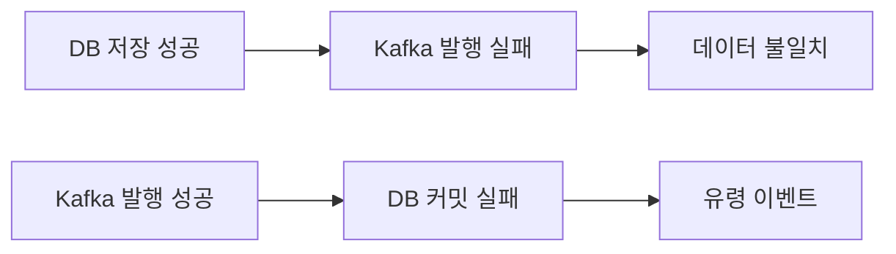
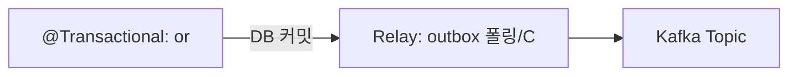
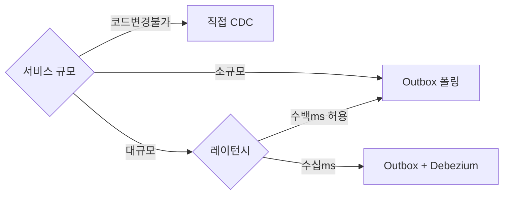
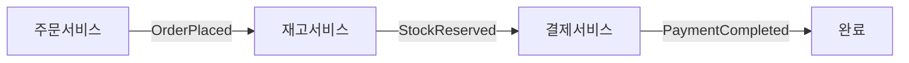

주문이 DB에 저장됐는데 Kafka 발행이 실패했다. 결제 서비스는 주문을 모른다. 반대로 Kafka 발행은 됐는데 DB 롤백이 됐다. 결제 서비스는 존재하지 않는 주문을 처리한다. 분산 트랜잭션 없이 이 문제를 해결하는 것이 Outbox 패턴이다.

## 왜 이게 중요한가?

마이크로서비스 환경에서 "DB 저장 성공 + 메시지 발행 성공"을 동시에 보장하는 것은 기본적으로 불가능하다. DB와 Kafka는 서로 다른 트랜잭션 경계를 갖기 때문이다. 이 문제를 무시하면 데이터 불일치가 발생하고, 2PC(분산 트랜잭션)로 해결하려 하면 성능 저하와 가용성 감소를 초래한다. Outbox 패턴은 단일 DB 트랜잭션만으로 이 문제를 해결하는 실용적인 방법이다.

## 비유로 이해하기

> Outbox 패턴은 편지를 바로 우체통에 넣는 대신, 먼저 책상 서랍(Outbox 테이블)에 넣어두는 것이다. 우편배달부(Message Relay)가 주기적으로 서랍을 열어 편지를 가져가 우체통에 넣는다. 서랍에 넣는 행위와 비즈니스 처리는 한 번에 이루어지므로 둘 다 성공하거나 둘 다 실패한다. 배달부가 잠깐 자리를 비워도 편지는 서랍에 안전하게 보관된다.

## 왜 Outbox 패턴이 필요한가

아래 코드처럼 작성하면 언제든지 데이터 불일치가 발생할 수 있다.

```java
// 위험한 패턴 — DB 커밋 후 Kafka 발행 실패 가능
@Transactional
public void placeOrder(Order order) {
    orderRepository.save(order);         // DB 저장 성공
    kafkaTemplate.send("orders", order); // 발행 실패 시 불일치 발생
}
```

이 코드에는 두 가지 실패 시나리오가 있다.



분산 트랜잭션(2PC)으로 해결하려 하면 성능 문제와 가용성 감소를 초래한다. Kafka는 XA 트랜잭션을 지원하지 않으므로 2PC 자체가 적용 불가능하다.

---

## Outbox 패턴 동작원리

### 핵심 아이디어

비즈니스 데이터와 발행할 이벤트를 **같은 DB 트랜잭션**으로 저장한다. 별도 프로세스가 Outbox 테이블을 읽어 Kafka로 발행한다.



### Outbox 테이블 스키마

```sql
CREATE TABLE outbox (
    id              UUID PRIMARY KEY DEFAULT gen_random_uuid(),
    aggregate_type  VARCHAR(255) NOT NULL,  -- 'Order', 'Payment' 등
    aggregate_id    VARCHAR(255) NOT NULL,  -- 엔티티 ID
    event_type      VARCHAR(255) NOT NULL,  -- 'OrderPlaced', 'OrderCancelled'
    payload         JSONB        NOT NULL,  -- 이벤트 본문
    created_at      TIMESTAMP    NOT NULL DEFAULT now(),
    status          VARCHAR(20)  NOT NULL DEFAULT 'PENDING', -- PENDING / SENT
    sent_at         TIMESTAMP
);

CREATE INDEX idx_outbox_status_created ON outbox(status, created_at);
```

### Spring + JPA 구현

비즈니스 로직과 Outbox 저장을 같은 `@Transactional` 메서드 안에 작성한다. 트랜잭션이 커밋되면 두 레코드가 원자적으로 반영된다.

```java
@Service
@RequiredArgsConstructor
public class OrderService {

    private final OrderRepository orderRepository;
    private final OutboxRepository outboxRepository;
    private final ObjectMapper objectMapper;

    @Transactional
    public void placeOrder(OrderCommand command) {
        // 1. 비즈니스 로직
        Order order = Order.create(command);
        orderRepository.save(order);

        // 2. 같은 트랜잭션 내 Outbox 저장
        OutboxEvent event = OutboxEvent.builder()
            .aggregateType("Order")
            .aggregateId(order.getId().toString())
            .eventType("OrderPlaced")
            .payload(objectMapper.writeValueAsString(new OrderPlacedEvent(order)))
            .build();
        outboxRepository.save(event);
        // 트랜잭션 커밋 시 두 INSERT가 원자적으로 반영됨
    }
}
```

### Message Relay (폴링 방식)

폴링 방식은 구현이 단순하지만 폴링 주기만큼 발행 지연이 발생한다.

```java
@Component
@RequiredArgsConstructor
public class OutboxMessageRelay {

    private final OutboxRepository outboxRepository;
    private final KafkaTemplate<String, String> kafkaTemplate;

    @Scheduled(fixedDelay = 1000) // 1초마다 폴링
    @Transactional
    public void relay() {
        List<OutboxEvent> pending = outboxRepository
            .findTop100ByStatusOrderByCreatedAtAsc("PENDING");

        for (OutboxEvent event : pending) {
            try {
                String topic = resolveTopicName(event.getAggregateType());
                kafkaTemplate.send(topic, event.getAggregateId(), event.getPayload())
                    .get(5, TimeUnit.SECONDS); // 동기 대기

                event.markSent();
                outboxRepository.save(event);
            } catch (Exception e) {
                log.error("Outbox relay failed for event {}", event.getId(), e);
                // 실패 시 PENDING 유지 → 다음 폴링에 재시도
            }
        }
    }
}
```

### 폴링 방식의 한계

| 문제 | 설명 |
|------|------|
| **지연** | 폴링 주기만큼 발행 지연 발생 |
| **DB 부하** | 주기적 SELECT/UPDATE로 DB 부하 증가 |
| **확장 어려움** | 다중 인스턴스 배포 시 중복 처리 위험 |

이를 해결하는 것이 **CDC(Change Data Capture)** 방식이다.

---

## CDC (Change Data Capture)

### CDC란?

DB의 변경 이력(binlog, WAL 등)을 실시간으로 캡처하여 다른 시스템에 전달하는 기술이다. 애플리케이션 코드 변경 없이 DB 레벨에서 변경사항을 스트리밍한다.

폴링 방식이 "주기적으로 서랍을 확인하는 우편배달부"라면, CDC는 "서랍에 편지가 들어오는 순간 바로 알림을 받는 실시간 감시"다.


### DB별 CDC 메커니즘

**MySQL — Binary Log (binlog)**

```
binlog 활성화 필요:
[mysqld]
log_bin = mysql-bin
binlog_format = ROW        # STATEMENT 아닌 ROW 필수
binlog_row_image = FULL    # 변경 전후 전체 행 기록
server_id = 1
```

**PostgreSQL — Write-Ahead Log (WAL)**

```sql
-- postgresql.conf:
-- wal_level = logical         (논리적 복제 활성화)
-- max_replication_slots = 10
-- max_wal_senders = 10

-- 논리적 복제 슬롯 생성:
SELECT pg_create_logical_replication_slot('debezium_slot', 'pgoutput');
```

---

## Debezium CDC 구현

### Debezium 아키텍처

Debezium은 Kafka Connect 위에서 동작하는 CDC 커넥터다. DB의 binlog/WAL을 읽어 Kafka 토픽으로 변환한다.


### Debezium Connector 설정 (MySQL)

```json
{
  "name": "order-outbox-connector",
  "config": {
    "connector.class": "io.debezium.connector.mysql.MySqlConnector",
    "database.hostname": "mysql",
    "database.port": "3306",
    "database.user": "debezium",
    "database.password": "dbz",
    "database.server.id": "184054",
    "database.server.name": "orderdb",
    "database.include.list": "orderservice",
    "table.include.list": "orderservice.outbox",
    "database.history.kafka.bootstrap.servers": "kafka:9092",
    "database.history.kafka.topic": "schema-changes.orderdb",

    "transforms": "outbox",
    "transforms.outbox.type": "io.debezium.transforms.outbox.EventRouter",
    "transforms.outbox.table.field.event.id": "id",
    "transforms.outbox.table.field.event.key": "aggregate_id",
    "transforms.outbox.table.field.event.type": "event_type",
    "transforms.outbox.table.field.event.payload": "payload",
    "transforms.outbox.route.by.field": "aggregate_type",
    "transforms.outbox.route.topic.replacement": "outbox.${routedByValue}"
  }
}
```

### EventRouter SMT (Single Message Transformation)

Debezium의 Outbox EventRouter SMT는 outbox 테이블의 INSERT 이벤트를 받아 `aggregate_type` 컬럼 값을 기반으로 자동으로 토픽을 라우팅한다.

```
outbox INSERT (aggregate_type='Order')
  → Kafka topic: outbox.Order

outbox INSERT (aggregate_type='Payment')
  → Kafka topic: outbox.Payment
```

코드 변경 없이 새로운 aggregate_type을 추가하면 자동으로 새 토픽으로 라우팅된다.

---

## Outbox vs CDC 비교

| 구분 | Outbox (폴링) | Outbox + CDC (Debezium) | 직접 CDC |
|------|--------------|------------------------|---------|
| **지연** | 폴링 주기 (수백ms~수초) | 수십ms | 수십ms |
| **DB 부하** | 추가 쿼리 부하 | binlog 읽기 (낮음) | binlog 읽기 |
| **코드 변경** | 필요 (Outbox 저장 로직) | 필요 (Outbox 저장 로직) | 불필요 |
| **이벤트 스키마** | 명시적 설계 가능 | 명시적 설계 가능 | DB 스키마 의존 |
| **멱등성** | 직접 구현 필요 | Kafka at-least-once | Kafka at-least-once |
| **운영 복잡도** | 낮음 | 중간 (Kafka Connect 필요) | 중간 |

### 언제 무엇을 선택할까



---

## 분산 트랜잭션과의 관계

### 2PC (Two-Phase Commit) 문제

2PC는 분산 시스템에서 원자적 커밋을 보장하지만 Kafka와는 사용할 수 없다.

```
Phase 1 (Prepare):
  Coordinator → DB: "커밋 준비됐나?"
  Coordinator → Kafka: "커밋 준비됐나?"

Phase 2 (Commit):
  Coordinator → DB: "커밋"
  Coordinator → Kafka: "커밋"

문제:
  - Coordinator 장애 시 시스템 전체 블로킹
  - Kafka는 2PC를 지원하지 않음 (XA 트랜잭션 미지원)
  - 성능 저하 (모든 참여자 대기)
```

### Saga 패턴과 Outbox

Outbox는 Saga 패턴과 자연스럽게 조합된다. 각 서비스가 자신의 트랜잭션을 완료하고 다음 서비스를 위한 이벤트를 Outbox에 저장한다.



보상 트랜잭션(Compensating Transaction)도 같은 방식으로 Outbox를 통해 발행한다.

---

## 실무 고려사항

### Outbox 테이블 정리 전략

Outbox 테이블은 지속적으로 쌓이므로 주기적 정리가 필요하다.

```sql
-- 24시간 이전 SENT 레코드 삭제
DELETE FROM outbox
WHERE status = 'SENT'
  AND sent_at < NOW() - INTERVAL '24 hours'
LIMIT 10000;
```

```java
@Scheduled(cron = "0 0 * * * *") // 매 시간
@Transactional
public void cleanupOutbox() {
    int deleted = outboxRepository.deleteByStatusAndSentAtBefore(
        "SENT",
        LocalDateTime.now().minusHours(24)
    );
    log.info("Outbox cleanup: {} records deleted", deleted);
}
```

### 멱등성 처리

Outbox 방식은 at-least-once 보장이다. 네트워크 오류로 같은 이벤트가 두 번 발행될 수 있으므로 Consumer는 반드시 멱등성을 구현해야 한다.

```java
@KafkaListener(topics = "outbox.Order")
@Transactional
public void handleOrderEvent(ConsumerRecord<String, String> record) {
    String eventId = record.headers()
        .lastHeader("debezium.event.id")
        .value().toString();

    // 이미 처리한 이벤트인지 확인
    if (processedEventRepository.existsByEventId(eventId)) {
        log.info("Duplicate event ignored: {}", eventId);
        return;
    }

    // 비즈니스 처리
    processOrder(record.value());

    // 처리 완료 기록
    processedEventRepository.save(new ProcessedEvent(eventId));
}
```

### 순서 보장

Outbox에서 같은 `aggregate_id`를 Kafka 메시지 키로 사용하면 같은 파티션으로 라우팅되어 순서가 보장된다.

```java
kafkaTemplate.send(
    topic,
    event.getAggregateId(),  // 파티셔닝 키 = aggregate_id → 같은 파티션 보장
    event.getPayload()
);
```

### 모니터링 지표

```
# Prometheus 메트릭 예시
outbox_pending_count         # 미발행 이벤트 수 (높으면 relay 문제)
outbox_relay_duration_ms     # 릴레이 처리 시간
outbox_relay_failure_total   # 릴레이 실패 횟수
debezium_connector_status    # CDC 커넥터 상태
```

```sql
-- Outbox lag 모니터링 쿼리
SELECT
    COUNT(*) AS pending_count,
    MIN(created_at) AS oldest_pending,
    EXTRACT(EPOCH FROM (NOW() - MIN(created_at))) AS lag_seconds
FROM outbox
WHERE status = 'PENDING';
```

---


## 극한 시나리오

### 시나리오 1: Message Relay 프로세스 장기 중단

Relay가 몇 시간 동안 멈추면 Outbox 테이블에 미발행 이벤트가 수천~수만 건 쌓인다.

```
방어:
outbox_pending_count 지표 모니터링 → 임계값 초과 시 알람
Relay 프로세스 재시작 후 순서 보장 확인
(created_at ASC 순서로 처리하면 순서 유지)
```

### 시나리오 2: Debezium Connector 장애 후 재시작 시 중복 발행

Debezium은 binlog 위치를 Kafka에 저장한다. 장애 후 재시작 시 마지막 저장된 위치부터 다시 읽으므로 일부 이벤트가 중복 발행될 수 있다.

```
방어:
Consumer에 멱등성 구현 필수 (processedEventRepository 패턴)
Debezium의 exactly-once 모드 활성화 (Kafka 트랜잭션 활용)
```

### 시나리오 3: Outbox 테이블 폭발적 증가로 DB 성능 저하

트래픽 급증 시 PENDING 레코드가 수십만 건 쌓이면 인덱스 스캔이 느려져 Relay 처리가 더 지연되는 악순환이 발생한다.

```
방어:
idx_outbox_status_created 인덱스 확인 (status, created_at 복합 인덱스)
Relay 배치 크기 증가 (findTop100 → findTop1000)
CDC 방식으로 전환 (폴링 DB 부하 제거)
Outbox 파티셔닝 (PostgreSQL 파티션 테이블로 오래된 데이터 분리)
```

---

## 왜 Outbox 패턴인가? (vs 직접 Kafka 발행 vs Dual Write)

| 방식 | 문제점 |
|------|--------|
| **Dual Write** (DB 저장 + Kafka 발행 동시) | DB 성공 후 Kafka 실패 시 이벤트 유실. Kafka 성공 후 DB 실패 시 중복 이벤트 |
| **직접 Kafka 발행** (DB 없이) | Kafka 장애 시 이벤트 유실, 재처리 불가 |
| **Outbox 패턴** | DB 트랜잭션 내에 Outbox 테이블에 이벤트 저장 → 별도 프로세스가 Kafka로 발행 → 원자성 보장 |

**핵심**: DB 트랜잭션과 Kafka 발행을 하나의 원자적 단위로 묶는 것이 Outbox의 목적이다. 이중 쓰기 문제 없이 at-least-once 보장이 가능하다.

---

## 실무에서 자주 하는 실수

**실수 1: Outbox 테이블을 폴링하면서 processed 컬럼만 업데이트**
폴링 주기마다 `SELECT * FROM outbox WHERE processed = false`를 실행한다. 대용량 Outbox에서 인덱스 없이 풀스캔이 발생한다. `created_at`과 `processed` 복합 인덱스를 추가하거나 CDC(Debezium)로 폴링 자체를 제거해야 한다.

**실수 2: Outbox 테이블에 오래된 레코드가 쌓임**
발행 완료된 레코드를 삭제하지 않아 Outbox 테이블이 수억 건으로 불어난다. 발행 확인 후 즉시 삭제하거나 파티셔닝으로 주기적 DROP PARTITION을 적용해야 한다.

**실수 3: CDC 커넥터 장애 시 모니터링 부재**
Debezium 커넥터가 멈춰도 DB와 Kafka 사이의 이벤트 전달이 중단된 것을 모른다. Kafka Connect 커넥터 상태, Outbox 테이블 미발행 레코드 수, Consumer Lag을 모니터링하고 알림을 설정해야 한다.

**실수 4: 동일 이벤트 중복 발행 시 downstream 멱등성 미확보**
Outbox 폴링 재시도나 Debezium 재시작으로 같은 이벤트가 여러 번 발행될 수 있다. Downstream Consumer가 멱등성(이미 처리한 이벤트 ID 추적)을 보장하지 않으면 중복 처리가 발생한다.

**실수 5: Saga 보상 트랜잭션에서 Outbox 미활용**
Saga의 각 스텝이 직접 Kafka에 발행한다. 스텝 실패 후 보상 이벤트를 발행하다 Kafka 장애가 나면 보상 자체가 실패한다. 보상 이벤트도 Outbox를 통해 발행해야 원자성이 보장된다.

---

## 면접 포인트

**Q1. Outbox 패턴이 필요한 이유를 두 문장으로 설명하면?**
DB 트랜잭션과 메시지 발행은 서로 다른 시스템이라 동시에 원자적으로 처리할 수 없다. Outbox 패턴은 이벤트를 DB 트랜잭션 내에 함께 저장하고 별도 프로세스가 발행함으로써 이중 쓰기 문제 없이 일관성을 보장한다.

**Q2. Debezium CDC와 Outbox 폴링의 차이는?**
폴링은 주기마다 DB에 SELECT를 실행해 미발행 레코드를 가져온다. 지연이 폴링 주기에 종속되고 DB에 부하가 발생한다. Debezium CDC는 DB의 변경 로그(binlog/WAL)를 실시간으로 읽어 Kafka로 스트리밍한다. 폴링 부하가 없고 지연이 수십 ms 수준이며 별도 Outbox 테이블 없이도 동작 가능하다.

**Q3. Outbox 패턴과 Saga 패턴의 관계는?**
Saga는 분산 트랜잭션을 로컬 트랜잭션의 연쇄로 처리하는 패턴이다. 각 Saga 스텝이 이벤트를 발행할 때 Outbox 패턴을 적용하면 스텝의 DB 변경과 이벤트 발행이 원자적으로 보장된다. Saga + Outbox는 분산 시스템의 데이터 일관성을 보장하는 검증된 조합이다.

**Q4. Transactional Outbox의 성능 오버헤드는?**
Outbox 테이블에 INSERT가 추가되므로 쓰기 트랜잭션마다 추가 I/O가 발생한다. 일반적으로 수십 ms 이하로 허용 가능한 수준이다. Outbox 테이블에 인덱스를 최소화하고 발행 완료 후 즉시 삭제해 테이블 크기를 유지하면 영향을 최소화할 수 있다.

**Q5. CDC 없이 Outbox를 구현하는 가장 단순한 방법은?**
스케줄러(Spring `@Scheduled`)가 주기적으로 `SELECT ... WHERE published = false LIMIT 100`을 실행해 미발행 이벤트를 Kafka로 발행하고 `published = true`로 업데이트한다. 단순하지만 폴링 지연, DB 부하, 다중 인스턴스 경쟁 조건(동시에 같은 레코드 처리)을 해결해야 한다. 다중 인스턴스는 `SELECT ... FOR UPDATE SKIP LOCKED`로 경쟁을 방지한다.
