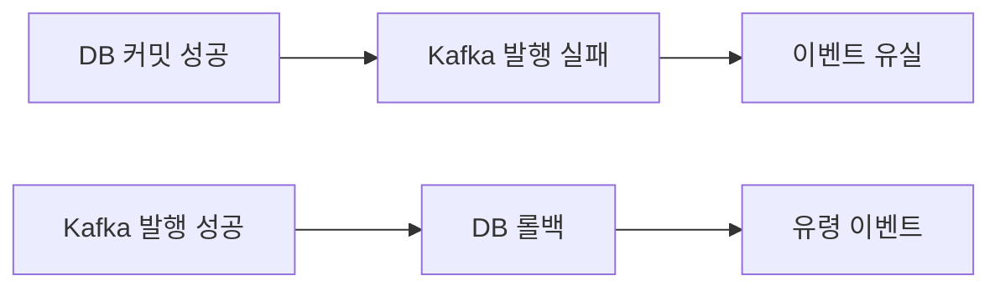
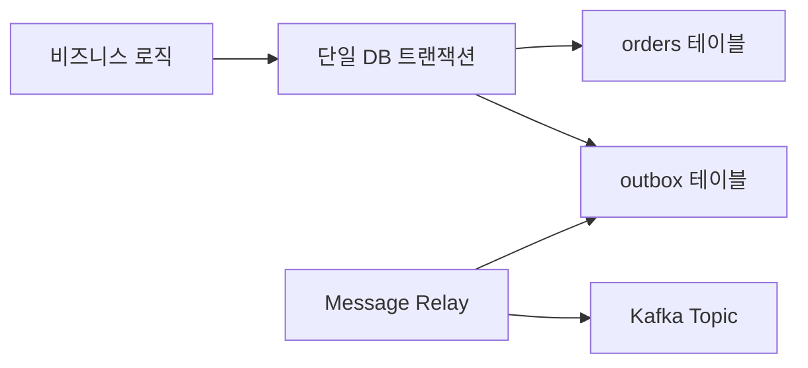
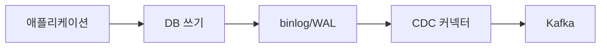
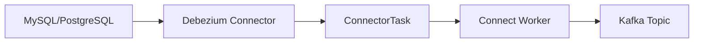
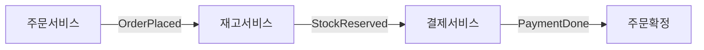
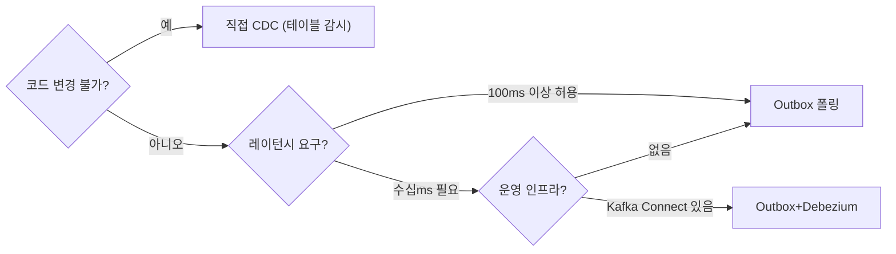

주문이 DB에 저장됐는데 Kafka 발행이 실패했다. 결제 서비스는 주문을 모른다. 반대로 Kafka는 이벤트를 받았는데 DB가 롤백됐다. 결제 서비스는 존재하지 않는 주문을 처리한다. 이 두 가지 공포 시나리오를 분산 트랜잭션 없이 해결하는 것이 Transactional Outbox 패턴이다. 이 글은 문제의 근원부터 Debezium 내부 동작, Saga 조합, Exactly-once 보장, 극한 시나리오까지 시니어 수준으로 완전히 해부한다.

---

## 1. Dual Write 문제 — 왜 DB와 Kafka를 동시에 믿을 수 없는가

### 1-1. 실패 시나리오 두 가지

아래 코드는 수많은 팀이 처음에 작성하는 코드다. 겉보기엔 문제 없어 보인다.

```java
// 위험한 패턴: Dual Write
@Service
@RequiredArgsConstructor
public class OrderService {

    private final OrderRepository orderRepository;
    private final KafkaTemplate<String, String> kafkaTemplate;
    private final ObjectMapper objectMapper;

    @Transactional
    public void placeOrder(OrderCommand command) {
        // Step 1: DB 저장
        Order order = Order.create(command);
        orderRepository.save(order);
        // 여기서 @Transactional 커밋 전 플러시

        // Step 2: Kafka 발행 — DB 트랜잭션 바깥 시스템
        String payload = objectMapper.writeValueAsString(order);
        kafkaTemplate.send("orders", order.getId().toString(), payload);
        // Kafka 브로커 네트워크 단절 → 예외 발생
        // → @Transactional rollback → DB도 취소
        // 그러나 Kafka에 이미 보낸 메시지는 취소 불가
    }
}
```

이 코드가 현실에서 어떻게 망가지는지 두 시나리오로 본다.



**시나리오 A: 이벤트 유실**

1. `orderRepository.save(order)` — DB 커밋 성공
2. `kafkaTemplate.send(...)` — Kafka 브로커 리더 선출 중, 타임아웃
3. 예외 전파 → `@Transactional` 롤백 시도
4. 그러나 DB는 이미 커밋됐으므로 롤백 불가 (JPA에서 `@Transactional`은 DB 커밋 후 Kafka 발행이면 롤백 대상이 DB 커밋이 아님)
5. 결과: DB에는 주문이 있지만 Kafka에는 이벤트 없음 → 결제 서비스 무통보

실제로는 `@Transactional` 내에서 `kafkaTemplate.send()`를 호출하면 Kafka 발행은 트랜잭션 바깥에서 일어난다. DB 트랜잭션이 커밋되면 JPA 영속성 컨텍스트가 플러시되고 그 이후에 Kafka 발행이 실행되기 때문이다.

**시나리오 B: 유령 이벤트**

1. `kafkaTemplate.send(...)` 성공 — Kafka에 이벤트 도달
2. DB 저장 직후 JVM 크래시 (OOM, kill -9)
3. DB 트랜잭션 롤백 → 주문 레코드 없음
4. 결과: Kafka에 `OrderPlaced` 이벤트가 있지만 DB에 주문 없음 → 결제 서비스가 존재하지 않는 주문을 결제 처리

### 1-2. 2PC로 해결할 수 없는 이유

직관적 해결책은 두 시스템을 2PC(Two-Phase Commit)로 묶는 것이다. 그러나 Kafka는 XA 트랜잭션을 지원하지 않는다.

```
Phase 1 (Prepare):
  코디네이터 → MySQL:  "커밋 준비됐나?"  → MySQL: "준비됨, 락 유지"
  코디네이터 → Kafka:  "커밋 준비됐나?"  → Kafka: XA 미지원 → 오류

결론: Kafka를 2PC에 포함시킬 수 없다
```

Kafka가 2PC를 지원하더라도 다음 문제가 남는다.

- 코디네이터 장애 시 모든 참여자가 Prepare 상태에서 블로킹
- 네트워크 분리(Partition) 상황에서 CAP theorem에 의해 가용성 포기 필요
- 수평 확장이 불가능한 구조 (코디네이터가 단일 장애점)

따라서 Kafka + DB 조합에서 2PC는 현실적 선택지가 아니다. 이 문제를 실용적으로 해결하는 것이 Transactional Outbox 패턴이다.

---

## 2. Transactional Outbox — 원자성 보장의 메커니즘

### 2-1. 핵심 아이디어

Outbox 패턴의 핵심은 단 하나다. **이벤트를 Kafka에 직접 보내지 말고, DB 트랜잭션 안에서 같은 DB에 저장한다.** 그리고 별도 프로세스(Message Relay)가 DB에서 읽어 Kafka로 발행한다.



이렇게 하면 무엇이 달라지는가?

- DB 트랜잭션이 커밋되면 주문 레코드와 Outbox 레코드가 동시에 존재 (원자성)
- DB 트랜잭션이 롤백되면 두 레코드 모두 사라짐 (원자성)
- Kafka 발행은 별도 프로세스가 담당 → 실패해도 Outbox 레코드가 남아있어 재시도 가능
- "DB 저장 성공 + Kafka 발행 실패"는 존재하지 않음 (Outbox 레코드가 PENDING 상태로 남아 재발행)

### 2-2. Outbox 테이블 스키마 설계

스키마 설계는 단순해 보이지만 각 컬럼에는 명확한 이유가 있다.

```sql
CREATE TABLE outbox_events (
    id              UUID         PRIMARY KEY DEFAULT gen_random_uuid(),
    -- UUID: 분산 환경에서 자동 채번 충돌 없음, Debezium 메시지 키로 활용

    aggregate_type  VARCHAR(100) NOT NULL,
    -- 예: 'Order', 'Payment', 'Inventory'
    -- Debezium EventRouter SMT가 이 값으로 Kafka 토픽을 라우팅

    aggregate_id    VARCHAR(100) NOT NULL,
    -- 예: 주문 ID, 결제 ID
    -- Kafka 파티셔닝 키로 사용 → 같은 집계 루트의 이벤트는 같은 파티션 보장

    event_type      VARCHAR(100) NOT NULL,
    -- 예: 'OrderPlaced', 'OrderCancelled', 'PaymentCompleted'
    -- Consumer가 어떤 핸들러를 실행할지 결정하는 디스패치 키

    payload         JSONB        NOT NULL,
    -- 이벤트 본문: Consumer가 처리에 필요한 모든 데이터 포함
    -- JSONB: JSON 유효성 검증 + GIN 인덱스 지원

    created_at      TIMESTAMPTZ  NOT NULL DEFAULT now(),
    -- 발행 순서 보장을 위한 정렬 기준

    status          VARCHAR(20)  NOT NULL DEFAULT 'PENDING',
    -- PENDING: 미발행 / SENT: 발행 완료
    -- CDC 방식(Debezium)에서는 이 컬럼 불필요, 삭제 방식으로 대체 가능

    sent_at         TIMESTAMPTZ,
    -- 발행 완료 시각: lag 모니터링 (sent_at - created_at)

    retry_count     INT          NOT NULL DEFAULT 0,
    -- 발행 재시도 횟수: 임계값 초과 시 DLQ 이동 또는 알림

    error_message   TEXT
    -- 마지막 발행 실패 이유: 운영자 디버깅용
);

-- 폴링 릴레이용 인덱스: status + created_at 순서로 PENDING 조회
CREATE INDEX idx_outbox_status_created
    ON outbox_events (status, created_at)
    WHERE status = 'PENDING';
    -- Partial Index: SENT 레코드는 인덱스에서 제외 → 인덱스 크기 최소화

-- aggregate_id 기준 조회용 (특정 집계 루트의 이벤트 추적)
CREATE INDEX idx_outbox_aggregate
    ON outbox_events (aggregate_type, aggregate_id, created_at);
```

`WHERE status = 'PENDING'` 부분 인덱스(Partial Index)는 매우 중요하다. SENT 레코드가 수백만 건 쌓여도 인덱스 크기는 PENDING 레코드 수에만 비례한다. 폴링 쿼리 성능이 테이블 전체 크기와 무관해진다.

### 2-3. Spring + JPA 구현 — 도메인 이벤트 방식

도메인 이벤트를 서비스 레이어에서 직접 생성하는 대신, 집계 루트(Aggregate Root)에서 발생시키는 패턴이 더 견고하다.

```java
// 집계 루트: 도메인 이벤트를 내부에서 발생
@Entity
@Table(name = "orders")
@Getter
public class Order extends AbstractAggregateRoot<Order> {

    @Id
    private UUID id;

    @Enumerated(EnumType.STRING)
    private OrderStatus status;

    private UUID customerId;
    private BigDecimal totalAmount;

    public static Order create(UUID customerId, BigDecimal amount) {
        Order order = new Order();
        order.id = UUID.randomUUID();
        order.customerId = customerId;
        order.totalAmount = amount;
        order.status = OrderStatus.PENDING;

        // 도메인 이벤트 등록: Spring Data가 save() 후 자동 발행
        order.registerEvent(new OrderPlacedDomainEvent(order));
        return order;
    }

    public void cancel(String reason) {
        if (this.status != OrderStatus.PENDING) {
            throw new IllegalStateException("Cannot cancel order in status: " + status);
        }
        this.status = OrderStatus.CANCELLED;
        this.registerEvent(new OrderCancelledDomainEvent(this, reason));
    }
}
```

```java
// 도메인 이벤트 클래스
public record OrderPlacedDomainEvent(
    UUID orderId,
    UUID customerId,
    BigDecimal totalAmount,
    Instant occurredAt
) {
    public OrderPlacedDomainEvent(Order order) {
        this(order.getId(), order.getCustomerId(),
             order.getTotalAmount(), Instant.now());
    }
}
```

```java
// Outbox 엔티티
@Entity
@Table(name = "outbox_events")
@Builder
@NoArgsConstructor
@AllArgsConstructor
@Getter
public class OutboxEvent {

    @Id
    private UUID id;

    private String aggregateType;
    private String aggregateId;
    private String eventType;

    @Column(columnDefinition = "jsonb")
    private String payload;

    @Builder.Default
    private String status = "PENDING";

    private Instant createdAt;
    private Instant sentAt;

    @Builder.Default
    private int retryCount = 0;

    private String errorMessage;

    public void markSent() {
        this.status = "SENT";
        this.sentAt = Instant.now();
    }

    public void markFailed(String error) {
        this.retryCount++;
        this.errorMessage = error;
        // status는 PENDING 유지 → 다음 폴링에 재시도
    }

    @PrePersist
    void onCreate() {
        this.id = UUID.randomUUID();
        this.createdAt = Instant.now();
    }
}
```

```java
// 도메인 이벤트를 받아 Outbox에 저장하는 핸들러
@Component
@RequiredArgsConstructor
@Slf4j
public class OrderEventOutboxHandler {

    private final OutboxEventRepository outboxRepository;
    private final ObjectMapper objectMapper;

    // Spring Data의 @DomainEvents 메커니즘이 save() 후 이 메서드를 호출
    // 핵심: 이 핸들러는 같은 @Transactional 범위 안에서 실행됨
    @TransactionalEventListener(phase = TransactionPhase.BEFORE_COMMIT)
    public void handle(OrderPlacedDomainEvent event) {
        // BEFORE_COMMIT: 아직 커밋 전이므로 이 INSERT도 같은 트랜잭션에 포함
        OutboxEvent outboxEvent = OutboxEvent.builder()
            .aggregateType("Order")
            .aggregateId(event.orderId().toString())
            .eventType("OrderPlaced")
            .payload(serialize(event))
            .build();

        outboxRepository.save(outboxEvent);
        log.debug("Outbox event saved: {} for order {}", outboxEvent.getId(), event.orderId());
    }

    @TransactionalEventListener(phase = TransactionPhase.BEFORE_COMMIT)
    public void handle(OrderCancelledDomainEvent event) {
        OutboxEvent outboxEvent = OutboxEvent.builder()
            .aggregateType("Order")
            .aggregateId(event.orderId().toString())
            .eventType("OrderCancelled")
            .payload(serialize(event))
            .build();
        outboxRepository.save(outboxEvent);
    }

    private String serialize(Object event) {
        try {
            return objectMapper.writeValueAsString(event);
        } catch (JsonProcessingException e) {
            throw new OutboxSerializationException("Failed to serialize event", e);
        }
    }
}
```

`BEFORE_COMMIT` 단계가 왜 중요한가? `AFTER_COMMIT`을 사용하면 트랜잭션이 이미 끝났으므로 Outbox INSERT가 별도 트랜잭션이 된다. 그러면 Outbox 저장 실패 시 비즈니스 데이터만 커밋되고 Outbox는 없는 상황이 발생한다. `BEFORE_COMMIT`을 사용해야 두 INSERT가 반드시 같은 트랜잭션에 속한다.

```java
// 서비스 레이어: 도메인 이벤트 발행은 save() 호출 시 자동
@Service
@RequiredArgsConstructor
@Transactional
public class OrderService {

    private final OrderRepository orderRepository;

    public UUID placeOrder(PlaceOrderRequest request) {
        Order order = Order.create(request.customerId(), request.totalAmount());
        orderRepository.save(order);
        // save() 내부에서 @DomainEvents 감지 →
        // OrderEventOutboxHandler.handle() 호출 (BEFORE_COMMIT) →
        // outbox_events 테이블에 INSERT →
        // 트랜잭션 커밋 → orders와 outbox_events 동시 반영
        return order.getId();
    }
}
```

### 2-4. Outbox 이벤트 구조 — aggregateType, aggregateId, eventType의 역할

각 필드가 시스템에서 하는 역할을 명확히 이해해야 한다.

```json
{
  "id": "550e8400-e29b-41d4-a716-446655440000",
  "aggregateType": "Order",
  "aggregateId": "order-12345",
  "eventType": "OrderPlaced",
  "payload": {
    "orderId": "order-12345",
    "customerId": "customer-789",
    "items": [
      {"productId": "prod-001", "quantity": 2, "price": 15000},
      {"productId": "prod-002", "quantity": 1, "price": 30000}
    ],
    "totalAmount": 60000,
    "currency": "KRW",
    "occurredAt": "2026-05-01T09:00:00Z",
    "schemaVersion": 1
  },
  "createdAt": "2026-05-01T09:00:00.123Z",
  "status": "PENDING"
}
```

- `aggregateType`: Debezium EventRouter SMT가 `outbox.Order` 토픽으로 라우팅하는 기준. Consumer가 어떤 집계 루트의 이벤트인지 필터링할 때도 사용
- `aggregateId`: Kafka 메시지 키로 사용 → 같은 주문의 이벤트는 항상 같은 파티션 → 파티션 내 순서 보장
- `eventType`: Consumer 핸들러 라우팅. Spring Kafka에서 `@KafkaListener`의 `filter`나 `@KafkaHandler` 멀티 메서드 선택에 사용
- `schemaVersion`: 페이로드 스키마 버전. Consumer가 버전별로 다른 역직렬화 로직 적용 가능

---

## 3. Message Relay (폴링 방식) — 구현과 한계

### 3-1. 기본 폴링 릴레이

```java
@Component
@RequiredArgsConstructor
@Slf4j
public class OutboxMessageRelay {

    private final OutboxEventRepository outboxRepository;
    private final KafkaTemplate<String, String> kafkaTemplate;
    private final OutboxTopicResolver topicResolver;
    private final MeterRegistry meterRegistry;

    private final Counter sentCounter;
    private final Counter failedCounter;

    @PostConstruct
    void initMetrics() {
        // Prometheus 메트릭 초기화
        // (필드 초기화 시 meterRegistry 미주입 상태 방지)
    }

    @Scheduled(fixedDelay = 500, initialDelay = 1000) // 0.5초 간격
    @Transactional
    public void relay() {
        List<OutboxEvent> pending = outboxRepository
            .findTop100ByStatusOrderByCreatedAtAsc("PENDING");

        if (pending.isEmpty()) return;

        log.debug("Processing {} outbox events", pending.size());

        for (OutboxEvent event : pending) {
            publishEvent(event);
        }
    }

    private void publishEvent(OutboxEvent event) {
        String topic = topicResolver.resolve(event.getAggregateType());

        try {
            // 동기 발행: 성공 확인 후 status 업데이트
            kafkaTemplate.send(topic, event.getAggregateId(), event.getPayload())
                .get(5, TimeUnit.SECONDS);

            event.markSent();
            outboxRepository.save(event);

            meterRegistry.counter("outbox.relay.sent").increment();

        } catch (TimeoutException e) {
            // Kafka 응답 타임아웃: 메시지는 발행됐을 수도, 안 됐을 수도 있음
            // PENDING 유지 → 재시도 시 중복 발행 가능성 → Consumer 멱등성 필수
            event.markFailed("Kafka timeout: " + e.getMessage());
            outboxRepository.save(event);
            log.warn("Outbox relay timeout for event {}", event.getId());

        } catch (ExecutionException e) {
            event.markFailed("Kafka error: " + e.getCause().getMessage());
            outboxRepository.save(event);
            log.error("Outbox relay failed for event {}", event.getId(), e);

            meterRegistry.counter("outbox.relay.failed").increment();
        }
    }
}
```

```java
// 토픽 이름 해석
@Component
public class OutboxTopicResolver {

    private static final Map<String, String> TOPIC_MAP = Map.of(
        "Order",    "outbox.order",
        "Payment",  "outbox.payment",
        "Inventory","outbox.inventory"
    );

    public String resolve(String aggregateType) {
        return TOPIC_MAP.getOrDefault(aggregateType,
            "outbox." + aggregateType.toLowerCase());
    }
}
```

### 3-2. 다중 인스턴스 환경 — SELECT FOR UPDATE SKIP LOCKED

Kubernetes에서 릴레이 인스턴스를 2개 이상 실행하면 같은 Outbox 레코드를 동시에 처리할 위험이 있다. `SELECT FOR UPDATE SKIP LOCKED`로 분산 락 없이 해결한다.

```java
// JPA Repository에 네이티브 쿼리로 구현
public interface OutboxEventRepository extends JpaRepository<OutboxEvent, UUID> {

    @Query(value = """
        SELECT * FROM outbox_events
        WHERE status = 'PENDING'
        ORDER BY created_at ASC
        LIMIT :limit
        FOR UPDATE SKIP LOCKED
        """, nativeQuery = true)
    List<OutboxEvent> findPendingEventsWithLock(@Param("limit") int limit);
}
```

`SKIP LOCKED`의 동작 원리는 다음과 같다.

- 인스턴스 A가 레코드 1~100에 행 락 획득
- 인스턴스 B가 같은 쿼리 실행 → 락이 걸린 1~100을 건너뜀 → 101~200 처리
- 두 인스턴스가 겹치지 않는 레코드를 처리

MySQL 5.7+, PostgreSQL 9.5+, Oracle 11g+에서 지원한다.

### 3-3. 폴링 방식의 구조적 한계

| 문제 | 원인 | 영향 |
|------|------|------|
| 발행 지연 | 폴링 주기(500ms)만큼 반드시 지연 | 실시간 시스템에 부적합 |
| DB 부하 | 이벤트 없어도 주기적 SELECT 실행 | 불필요한 I/O 발생 |
| 처리 효율 | 배치 단위로만 처리 (100건) | 갑작스런 트래픽 급증 대응 느림 |
| 운영 복잡도 | 릴레이 프로세스 별도 관리 필요 | 장애 포인트 증가 |

이 한계를 해결하는 것이 CDC(Change Data Capture) 방식이다.

---

## 4. CDC(Change Data Capture) — DB 변경 로그를 실시간으로 스트리밍

### 4-1. CDC의 핵심 원리

폴링은 "주기적으로 DB에 '새로운 거 있어?'라고 묻는 것"이다. CDC는 "DB가 변경될 때 자동으로 알려주는 것"이다. 이것이 가능한 이유는 거의 모든 관계형 DB가 복제(Replication)를 위해 변경 로그를 이미 기록하고 있기 때문이다.



CDC는 DB 복제 슬레이브처럼 동작한다. 마스터가 슬레이브에게 binlog를 스트리밍하는 것과 동일한 프로토콜로 데이터를 읽는다.

### 4-2. MySQL binlog 동작 원리

MySQL의 binlog는 본래 복제(Master → Slave)를 위한 메커니즘이다.

```sql
-- binlog 활성화 필수 설정 (my.cnf)
[mysqld]
log_bin          = mysql-bin
binlog_format    = ROW       -- STATEMENT 방식은 비결정적 SQL 문제 있음
                             -- ROW 방식: 변경된 행의 before/after 이미지 기록
binlog_row_image = FULL      -- 변경된 컬럼만 기록(MINIMAL)이 아닌 전체 행 기록
                             -- Debezium이 이전 상태(before)를 재구성하기 위해 필요
server_id        = 1         -- 복제 토폴로지에서 고유 식별자
expire_logs_days = 7         -- binlog 보존 기간
```

binlog에는 다음 이벤트들이 기록된다.

```
# binlog 내용 예시 (mysqlbinlog 출력)
# at 1234
#260501  9:00:01 server id 1  end_log_pos 1340
# Table_map: `orderservice`.`outbox_events` mapped to number 108

# at 1340
#260501  9:00:01 server id 1  end_log_pos 1450
# Write_rows: table id 108

### INSERT INTO `orderservice`.`outbox_events`
### SET
###   @1='550e8400-e29b-41d4-a716-446655440000'  (id)
###   @2='Order'                                  (aggregate_type)
###   @3='order-12345'                             (aggregate_id)
###   @4='OrderPlaced'                             (event_type)
###   @5='{"orderId":"order-12345",...}'           (payload)
###   @6='PENDING'                                 (status)
###   @7='2026-05-01 09:00:00'                    (created_at)
```

Debezium은 MySQL의 복제 슬레이브 프로토콜을 구현해 binlog 스트림을 수신한다. MySQL 입장에서는 Debezium이 일반 복제 슬레이브처럼 보인다.

### 4-3. PostgreSQL WAL 동작 원리

PostgreSQL은 WAL(Write-Ahead Log)을 사용한다. 모든 변경은 WAL에 먼저 기록된 후 데이터 파일에 반영된다 (Crash Recovery의 기반).

```sql
-- postgresql.conf
wal_level             = logical   -- physical: 블록 레벨 변경만 기록
                                  -- logical: 행 레벨 변경 기록 (복제에 사용)
max_replication_slots = 10        -- 동시 CDC 슬롯 수
max_wal_senders       = 10        -- WAL 스트리밍 연결 수

-- 논리적 복제 슬롯 생성
-- Debezium은 이 슬롯을 통해 WAL을 수신
SELECT pg_create_logical_replication_slot(
    'debezium_orderdb',  -- 슬롯 이름
    'pgoutput'           -- 출력 플러그인 (PostgreSQL 10+ 내장)
);

-- 슬롯 상태 확인
SELECT slot_name, plugin, confirmed_flush_lsn, pg_current_wal_lsn(),
       pg_size_pretty(pg_wal_lsn_diff(pg_current_wal_lsn(), confirmed_flush_lsn))
       AS replication_lag
FROM pg_replication_slots;
```

WAL의 `confirmed_flush_lsn`은 Debezium이 마지막으로 처리한 WAL 위치다. Debezium이 재시작되면 이 위치부터 다시 읽는다.

---

## 5. Debezium 아키텍처 — 내부 동작의 완전 해부

### 5-1. 컴포넌트 구조



각 컴포넌트의 역할은 다음과 같다.

**Kafka Connect Framework**

Debezium은 독립 실행 프로그램이 아니라 Kafka Connect 위에서 동작하는 플러그인이다. Kafka Connect는 Source Connector(외부 → Kafka)와 Sink Connector(Kafka → 외부)를 실행하는 프레임워크다.

**Connector**

Connector는 논리적 설정 단위다. "어떤 DB의 어떤 테이블을 어떤 Kafka 브로커로 스트리밍할 것인가"를 정의한다. Connector 자체는 실제 I/O를 수행하지 않는다.

**ConnectorTask**

실제 I/O를 수행하는 단위다. MySQL Connector의 경우 Task가 binlog를 읽고 Kafka Record를 생성한다. 대부분의 DB CDC Connector는 1개의 Task만 사용한다 (binlog는 순서가 중요하므로 병렬 처리 불가).

**Connect Worker**

Task를 실행하는 JVM 프로세스다. 여러 Connector의 Task를 멀티스레드로 실행한다.

**Offset Store**

Debezium이 처리한 binlog 위치(MySQL의 경우 binlog 파일명 + 위치, PostgreSQL의 경우 LSN)를 Kafka 토픽에 저장한다. 재시작 시 이 정보를 읽어 중단된 위치부터 재개한다.

### 5-2. MySQL Connector 설정 완전 해설

```json
{
  "name": "order-outbox-connector",
  "config": {
    "connector.class": "io.debezium.connector.mysql.MySqlConnector",

    "database.hostname": "mysql-primary",
    "database.port": "3306",
    "database.user": "debezium_user",
    "database.password": "secure_password",

    "database.server.id": "184054",
    // binlog 스트리밍 시 MySQL이 부여하는 슬레이브 ID
    // 복제 토폴로지 내에서 고유해야 함

    "topic.prefix": "orderdb",
    // 생성되는 Kafka 토픽 접두사: orderdb.orderservice.outbox_events

    "database.include.list": "orderservice",
    "table.include.list": "orderservice.outbox_events",
    // 특정 테이블만 CDC → binlog 파싱 오버헤드 최소화

    "database.history.kafka.bootstrap.servers": "kafka:9092",
    "database.history.kafka.topic": "dbhistory.orderdb",
    // DB 스키마 변경 이력 저장 토픽
    // 재시작 시 컬럼 타입 재구성에 필요

    "snapshot.mode": "initial",
    // initial: 첫 실행 시 기존 데이터 스냅샷 후 binlog 추적
    // never: 스냅샷 없이 현재 binlog 위치부터 시작
    // when_needed: 오프셋 없을 때만 스냅샷

    "snapshot.locking.mode": "minimal",
    // minimal: 스냅샷 시작 시 잠깐만 락, 이후 해제
    // none: 락 없음 (데이터 일관성 위험)

    "decimal.handling.mode": "string",
    // DECIMAL 타입을 문자열로 직렬화 → 부동소수점 정밀도 손실 방지

    "time.precision.mode": "connect",
    // 시각 타입을 Kafka Connect 표준 타입으로 변환

    "heartbeat.interval.ms": "5000",
    // 변경 없을 때도 5초마다 하트비트 → offset 주기적 커밋
    // 장기 idle 후 binlog purge된 경우 감지 가능

    "transforms": "outbox",
    "transforms.outbox.type":
        "io.debezium.transforms.outbox.EventRouter",
    "transforms.outbox.table.field.event.id":      "id",
    "transforms.outbox.table.field.event.key":     "aggregate_id",
    "transforms.outbox.table.field.event.type":    "event_type",
    "transforms.outbox.table.field.event.payload": "payload",
    "transforms.outbox.route.by.field":            "aggregate_type",
    "transforms.outbox.route.topic.replacement":   "outbox.${routedByValue}.events"
  }
}
```

### 5-3. PostgreSQL Connector 설정

```json
{
  "name": "order-outbox-pg-connector",
  "config": {
    "connector.class": "io.debezium.connector.postgresql.PostgresConnector",

    "database.hostname": "postgres-primary",
    "database.port": "5432",
    "database.user": "debezium_user",
    "database.password": "secure_password",
    "database.dbname": "orderservice",

    "topic.prefix": "orderdb",

    "plugin.name": "pgoutput",
    // pgoutput: PostgreSQL 10+ 내장 논리적 복제 플러그인
    // wal2json: 별도 설치 필요, JSON 출력
    // decoderbufs: Protobuf 출력 (성능 우수, 설치 복잡)

    "slot.name": "debezium_orderdb",
    // 복제 슬롯 이름: PostgreSQL이 이 슬롯의 소비자가 읽은 위치까지 WAL 보존

    "publication.name": "debezium_publication",
    // PostgreSQL 11+: 테이블별 변경 구독 대상 정의
    // Debezium이 자동 생성 (권한 필요) 또는 수동 생성

    "table.include.list": "public.outbox_events",

    "heartbeat.interval.ms": "10000",
    "heartbeat.action.query":
        "INSERT INTO public.debezium_heartbeat(ts) VALUES (now()) ON CONFLICT (id) DO UPDATE SET ts = now()",
    // PostgreSQL WAL 슬롯은 소비되지 않으면 무한 성장
    // 활성 변경이 없을 때 heartbeat 테이블에 INSERT → WAL 소비 유지

    "snapshot.mode": "exported",
    // exported: 일관된 스냅샷 (트랜잭션 스냅샷 내보내기 기반)
    // 장시간 공유 락 필요 없음

    "transforms": "outbox",
    "transforms.outbox.type":
        "io.debezium.transforms.outbox.EventRouter",
    "transforms.outbox.route.by.field": "aggregate_type",
    "transforms.outbox.route.topic.replacement": "outbox.${routedByValue}.events"
  }
}
```

### 5-4. Snapshot Mode 상세 — 왜 중요한가

Debezium을 처음 시작할 때 기존 데이터를 어떻게 처리할 것인가가 Snapshot Mode다.

```
snapshot.mode = initial (기본값)
│
├── 1단계: 스냅샷
│   ├── 테이블에 FLUSH TABLES WITH READ LOCK (MySQL) 또는
│   │   트랜잭션 스냅샷 (PostgreSQL)
│   ├── binlog 위치 기록 (스냅샷 기준점)
│   ├── 락 해제 (minimal 모드)
│   └── SELECT * FROM outbox_events → Kafka로 스트리밍
│
└── 2단계: 스트리밍
    └── 스냅샷 시점 binlog 위치부터 실시간 추적

snapshot.mode = never
└── 기존 데이터 무시, 현재 시점 binlog부터 추적
    (Outbox 패턴에서 SENT 처리된 기존 레코드는 재발행 불필요 → never 사용 가능)

snapshot.mode = schema_only
└── 스키마만 스냅샷, 데이터는 현재 시점부터
    (테이블 구조 파악 필요하나 기존 데이터 불필요 시)
```

Outbox 패턴에서 Debezium을 처음 도입할 때, 이미 `PENDING` 상태의 레코드가 있다면 `initial` 모드로 이를 스냅샷해서 발행할 수 있다. 이미 발행된(`SENT`) 레코드가 중복 발행되는 것을 막으려면 `table.include.list`로 필터링하거나 Consumer 멱등성으로 처리한다.

### 5-5. Debezium이 생성하는 Kafka 레코드 구조

SMT(EventRouter) 적용 전 원시 Debezium 레코드:

```json
{
  "schema": {...},
  "payload": {
    "before": null,
    "after": {
      "id": "550e8400-...",
      "aggregate_type": "Order",
      "aggregate_id": "order-12345",
      "event_type": "OrderPlaced",
      "payload": "{\"orderId\":\"order-12345\",...}",
      "status": "PENDING",
      "created_at": 1746086400000000
    },
    "source": {
      "version": "2.4.0.Final",
      "connector": "mysql",
      "name": "orderdb",
      "ts_ms": 1746086400123,
      "db": "orderservice",
      "table": "outbox_events",
      "server_id": 1,
      "file": "mysql-bin.000001",
      "pos": 1234
    },
    "op": "c",    // c=create, u=update, d=delete, r=read(snapshot)
    "ts_ms": 1746086400200
  }
}
```

EventRouter SMT 적용 후 Consumer가 받는 레코드:

```
Kafka 토픽: outbox.Order.events
메시지 키:  "order-12345"          (aggregate_id)
메시지 값:  {"orderId":"order-12345","customerId":"customer-789",...}
           (payload 필드의 값이 직접 메시지 값이 됨)
헤더:
  - id:          "550e8400-..."     (outbox event id, 중복 제거에 활용)
  - eventType:   "OrderPlaced"
  - aggregateId: "order-12345"
```

EventRouter SMT의 핵심 기능은 두 가지다.

1. `aggregate_type` 컬럼 값으로 토픽 라우팅 (`outbox.Order.events`, `outbox.Payment.events`)
2. Debezium 래퍼 제거 → `payload` 필드 내용만 메시지 값으로 추출

---

## 6. Debezium SMT(Single Message Transformation) 심층 분석

### 6-1. EventRouter SMT의 내부 동작

SMT는 Kafka Connect 파이프라인에서 메시지를 변환하는 컴포넌트다. Source Connector가 레코드를 생성한 직후, Kafka에 쓰기 전에 변환이 적용된다.

```java
// EventRouter SMT의 개념적 구현 (실제 Debezium 소스 단순화)
public class EventRouter<R extends ConnectRecord<R>>
    implements Transformation<R> {

    @Override
    public R apply(R record) {
        // 1. op = 'c' (INSERT)가 아니면 무시
        //    UPDATE, DELETE는 Outbox 패턴에서 의미 없음 (토픰릭 라우팅만 INSERT에)
        Struct value = (Struct) record.value();
        String op = value.getString("op");
        if (!"c".equals(op) && !"r".equals(op)) {
            return null; // 레코드 필터링 (무시)
        }

        // 2. after 필드 추출 (INSERT된 행의 값)
        Struct after = value.getStruct("after");

        // 3. 토픽 라우팅: aggregate_type 컬럼 값 읽기
        String routeValue = after.getString("aggregate_type"); // "Order"
        String targetTopic = "outbox." + routeValue + ".events"; // "outbox.Order.events"

        // 4. 메시지 키: aggregate_id
        String messageKey = after.getString("aggregate_id");   // "order-12345"

        // 5. 메시지 값: payload 필드 내용 (JSON 문자열)
        String messageValue = after.getString("payload");

        // 6. 헤더에 메타데이터 추가
        Headers headers = record.headers();
        headers.add("id",        after.getString("id"),         Schema.STRING_SCHEMA);
        headers.add("eventType", after.getString("event_type"), Schema.STRING_SCHEMA);

        // 7. 새 레코드 생성 (토픽 변경, 키/값 교체)
        return record.newRecord(
            targetTopic,          // 라우팅된 토픽
            null,                 // 파티션 (null = Kafka 파티셔너에 위임)
            Schema.STRING_SCHEMA, messageKey,
            Schema.STRING_SCHEMA, messageValue,
            record.timestamp(),
            headers
        );
    }
}
```

### 6-2. 커스텀 SMT — 추가 변환이 필요할 때

```java
// 커스텀 SMT: 페이로드에 타임스탬프 필드 추가
public class AddTimestampSmt<R extends ConnectRecord<R>>
    implements Transformation<R> {

    @Override
    public R apply(R record) {
        if (record.value() == null) return record;

        // payload에 처리 타임스탬프 삽입
        try {
            ObjectMapper mapper = new ObjectMapper();
            Map<String, Object> payload = mapper.readValue(
                record.value().toString(), Map.class);
            payload.put("_processedAt", Instant.now().toString());

            String enrichedPayload = mapper.writeValueAsString(payload);
            return record.newRecord(
                record.topic(), record.kafkaPartition(),
                record.keySchema(), record.key(),
                record.valueSchema(), enrichedPayload,
                record.timestamp()
            );
        } catch (Exception e) {
            throw new DataException("SMT failed", e);
        }
    }

    @Override public ConfigDef config() { return new ConfigDef(); }
    @Override public void close() {}
    @Override public void configure(Map<String, ?> configs) {}
}
```

```json
// Connector 설정에서 체이닝
{
  "transforms": "outbox,addTimestamp",
  "transforms.outbox.type": "io.debezium.transforms.outbox.EventRouter",
  "transforms.addTimestamp.type": "com.example.AddTimestampSmt"
}
```

---

## 7. Exactly-once 보장 — 멱등성 소비자와 중복 제거

### 7-1. Outbox 패턴은 At-least-once

Outbox + Debezium 조합은 at-least-once 의미론을 제공한다. 다음 상황에서 중복 발행이 발생한다.

- Debezium이 Kafka에 메시지 발행 후 Offset 저장 전 크래시 → 재시작 시 동일 binlog 위치부터 재처리 → 중복
- 폴링 릴레이가 `markSent()` 저장 전 크래시 → 재시작 시 PENDING 레코드 재발행 → 중복
- Kafka 브로커 리더 전환 시 일부 메시지 중복 (Producer idempotence 없을 때)

따라서 Consumer는 반드시 멱등성을 구현해야 한다.

### 7-2. 멱등성 소비자 구현

```sql
-- 처리 완료 이벤트 추적 테이블
CREATE TABLE processed_events (
    event_id    UUID         PRIMARY KEY,
    -- Outbox의 id 컬럼 값 (Debezium 헤더에서 추출)

    processed_at TIMESTAMPTZ NOT NULL DEFAULT now(),
    consumer_group VARCHAR(100) NOT NULL
    -- 소비자 그룹별로 별도 추적 (동일 이벤트를 여러 서비스가 소비)
);

-- 오래된 처리 기록 정리 인덱스 (TTL 구현용)
CREATE INDEX idx_processed_events_time
    ON processed_events (processed_at)
    WHERE processed_at < NOW() - INTERVAL '7 days';
```

```java
@Service
@RequiredArgsConstructor
@Slf4j
public class OrderEventConsumer {

    private final ProcessedEventRepository processedEventRepo;
    private final InventoryService inventoryService;
    private final ObjectMapper objectMapper;

    @KafkaListener(
        topics = "outbox.Order.events",
        groupId = "inventory-service",
        containerFactory = "kafkaListenerContainerFactory"
    )
    @Transactional  // processedEvent 저장과 비즈니스 처리를 같은 트랜잭션으로
    public void consume(ConsumerRecord<String, String> record) {
        // 1. 이벤트 ID 추출 (Debezium EventRouter가 헤더에 설정)
        String eventId = extractHeader(record, "id");

        // 2. 중복 체크 — 이미 처리한 이벤트인가?
        if (processedEventRepo.existsByEventIdAndConsumerGroup(
                eventId, "inventory-service")) {
            log.info("Duplicate event skipped: {}", eventId);
            return; // 조용히 무시: 이미 처리 완료
        }

        // 3. 이벤트 타입 확인
        String eventType = extractHeader(record, "eventType");

        // 4. 비즈니스 처리
        switch (eventType) {
            case "OrderPlaced" -> {
                OrderPlacedEvent event = objectMapper.readValue(
                    record.value(), OrderPlacedEvent.class);
                inventoryService.reserveStock(event);
            }
            case "OrderCancelled" -> {
                OrderCancelledEvent event = objectMapper.readValue(
                    record.value(), OrderCancelledEvent.class);
                inventoryService.releaseStock(event);
            }
            default -> log.warn("Unknown event type: {}", eventType);
        }

        // 5. 처리 완료 기록 — 같은 트랜잭션 내
        processedEventRepo.save(ProcessedEvent.of(eventId, "inventory-service"));
        // 이 저장이 롤백되면 비즈니스 처리도 롤백 → 다음 재시도 때 재처리 가능
    }

    private String extractHeader(ConsumerRecord<?, ?> record, String key) {
        Header header = record.headers().lastHeader(key);
        if (header == null) {
            throw new IllegalArgumentException("Missing header: " + key);
        }
        return new String(header.value(), StandardCharsets.UTF_8);
    }
}
```

### 7-3. 중복 제거 테이블 성능 최적화

처리 완료 테이블이 무한 성장하면 조회 성능이 저하된다. 두 가지 전략이 있다.

**전략 1: TTL 기반 삭제**

```java
@Scheduled(cron = "0 0 3 * * *") // 매일 새벽 3시
@Transactional
public void cleanupProcessedEvents() {
    int deleted = processedEventRepo
        .deleteByProcessedAtBefore(Instant.now().minus(7, ChronoUnit.DAYS));
    log.info("Cleaned up {} processed event records", deleted);
}
```

**전략 2: Redis TTL 기반 중복 제거 (고성능)**

```java
@Service
@RequiredArgsConstructor
public class RedisIdempotencyChecker {

    private final StringRedisTemplate redisTemplate;
    private static final Duration TTL = Duration.ofDays(7);

    // Redis SET NX (Not eXists): 이미 있으면 false, 새로 설정되면 true
    public boolean isNewEvent(String eventId) {
        Boolean result = redisTemplate.opsForValue()
            .setIfAbsent("processed:" + eventId, "1", TTL);
        return Boolean.TRUE.equals(result);
    }
}

// Consumer에서 사용
@KafkaListener(topics = "outbox.Order.events", groupId = "payment-service")
public void consume(ConsumerRecord<String, String> record) {
    String eventId = extractHeader(record, "id");

    if (!idempotencyChecker.isNewEvent(eventId)) {
        return; // 이미 처리됨
    }
    // 비즈니스 처리
}
```

Redis 방식은 DB 조회를 제거하지만 Redis 장애 시 중복 처리 가능성이 있다. 완전한 exactly-once 보장이 필요하면 DB 기반이 더 안전하다.

### 7-4. Kafka Producer 멱등성 설정

```java
@Configuration
public class KafkaProducerConfig {

    @Bean
    public ProducerFactory<String, String> producerFactory() {
        Map<String, Object> props = new HashMap<>();
        props.put(ProducerConfig.BOOTSTRAP_SERVERS_CONFIG, "kafka:9092");
        props.put(ProducerConfig.KEY_SERIALIZER_CLASS_CONFIG,
            StringSerializer.class);
        props.put(ProducerConfig.VALUE_SERIALIZER_CLASS_CONFIG,
            StringSerializer.class);

        // Producer 멱등성: 같은 메시지를 여러 번 보내도 브로커에 1번만 기록
        props.put(ProducerConfig.ENABLE_IDEMPOTENCE_CONFIG, true);
        // 멱등성 활성화 시 자동으로:
        // - acks=all (모든 ISR 복제 확인)
        // - retries=Integer.MAX_VALUE
        // - max.in.flight.requests.per.connection=5

        props.put(ProducerConfig.ACKS_CONFIG, "all");
        props.put(ProducerConfig.RETRIES_CONFIG, Integer.MAX_VALUE);

        return new DefaultKafkaProducerFactory<>(props);
    }
}
```

Producer 멱등성은 네트워크 재전송으로 인한 브로커 레벨 중복을 방지한다. 그러나 애플리케이션 재시작이나 릴레이 프로세스 크래시로 인한 중복은 Producer 멱등성으로 방지하지 못한다. Consumer 멱등성과 함께 사용해야 한다.

---

## 8. Saga 패턴과 Outbox — 분산 트랜잭션의 완전한 해결

### 8-1. Saga 오케스트레이션 + Outbox

Saga는 분산 트랜잭션을 로컬 트랜잭션의 연쇄로 처리한다. 각 스텝이 실패하면 이전 스텝을 취소하는 보상 트랜잭션이 실행된다. Outbox는 각 Saga 스텝의 이벤트 발행을 원자적으로 보장한다.



```java
// Saga Orchestrator: 중앙에서 각 서비스를 직접 지시
@Service
@RequiredArgsConstructor
@Slf4j
public class OrderSagaOrchestrator {

    private final SagaStateRepository sagaRepo;
    private final OutboxEventRepository outboxRepo;
    private final ObjectMapper mapper;

    // Step 1: 주문 생성 → 재고 예약 요청
    @Transactional
    public void startOrderSaga(OrderCommand command) {
        // 1-1. 주문 생성
        Order order = Order.create(command);
        orderRepository.save(order);

        // 1-2. Saga 상태 저장
        SagaState saga = SagaState.builder()
            .sagaId(UUID.randomUUID())
            .orderId(order.getId())
            .currentStep("RESERVE_STOCK")
            .status("IN_PROGRESS")
            .build();
        sagaRepo.save(saga);

        // 1-3. 재고 예약 명령 이벤트를 Outbox에 저장 (같은 트랜잭션)
        OutboxEvent event = OutboxEvent.builder()
            .aggregateType("Saga")
            .aggregateId(saga.getSagaId().toString())
            .eventType("ReserveStockCommand")
            .payload(mapper.writeValueAsString(new ReserveStockCommand(
                order.getId(),
                order.getItems(),
                saga.getSagaId()
            )))
            .build();
        outboxRepo.save(event);
        // 커밋: order + sagaState + outboxEvent 동시 반영
    }

    // Step 2: 재고 예약 완료 → 결제 요청
    @KafkaListener(topics = "outbox.Saga.events", groupId = "order-saga")
    @Transactional
    public void onStockReserved(ConsumerRecord<String, String> record) {
        if (!"StockReservedEvent".equals(extractHeader(record, "eventType"))) return;

        StockReservedEvent event = mapper.readValue(
            record.value(), StockReservedEvent.class);
        SagaState saga = sagaRepo.findById(event.sagaId()).orElseThrow();

        if (!"RESERVE_STOCK".equals(saga.getCurrentStep())) return; // 중복 방지

        // 2-1. Saga 상태 업데이트
        saga.setCurrentStep("PROCESS_PAYMENT");
        sagaRepo.save(saga);

        // 2-2. 결제 요청 명령 이벤트를 Outbox에 저장
        outboxRepo.save(OutboxEvent.builder()
            .aggregateType("Saga")
            .aggregateId(event.sagaId().toString())
            .eventType("ProcessPaymentCommand")
            .payload(mapper.writeValueAsString(new ProcessPaymentCommand(
                event.orderId(), event.totalAmount(), event.sagaId())))
            .build());
    }

    // 보상 트랜잭션: 결제 실패 → 재고 예약 취소
    @KafkaListener(topics = "outbox.Saga.events", groupId = "order-saga")
    @Transactional
    public void onPaymentFailed(ConsumerRecord<String, String> record) {
        if (!"PaymentFailedEvent".equals(extractHeader(record, "eventType"))) return;

        PaymentFailedEvent event = mapper.readValue(
            record.value(), PaymentFailedEvent.class);
        SagaState saga = sagaRepo.findById(event.sagaId()).orElseThrow();

        // 보상 트랜잭션: 재고 예약 취소 이벤트를 Outbox에
        saga.setStatus("COMPENSATING");
        sagaRepo.save(saga);

        outboxRepo.save(OutboxEvent.builder()
            .aggregateType("Saga")
            .aggregateId(event.sagaId().toString())
            .eventType("ReleaseStockCommand")  // 보상 명령
            .payload(mapper.writeValueAsString(new ReleaseStockCommand(
                event.orderId(), event.sagaId())))
            .build());

        log.warn("Saga {} compensating: payment failed for order {}",
            event.sagaId(), event.orderId());
    }
}
```

### 8-2. Saga 상태 테이블

```sql
CREATE TABLE saga_states (
    saga_id       UUID         PRIMARY KEY,
    order_id      UUID         NOT NULL,
    current_step  VARCHAR(100) NOT NULL,
    status        VARCHAR(50)  NOT NULL,  -- IN_PROGRESS, COMPLETED, COMPENSATING, FAILED
    created_at    TIMESTAMPTZ  NOT NULL DEFAULT now(),
    updated_at    TIMESTAMPTZ  NOT NULL DEFAULT now(),
    timeout_at    TIMESTAMPTZ,            -- Saga 전체 타임아웃 시각
    version       INT          NOT NULL DEFAULT 0  -- 낙관적 락
);
```

```java
// Saga 타임아웃 감지
@Scheduled(fixedDelay = 60_000) // 1분마다
@Transactional
public void detectSagaTimeouts() {
    List<SagaState> timedOut = sagaRepo
        .findByStatusAndTimeoutAtBefore("IN_PROGRESS", Instant.now());

    for (SagaState saga : timedOut) {
        log.error("Saga timeout detected: {}", saga.getSagaId());
        // 타임아웃 시 보상 트랜잭션 시작
        saga.setStatus("COMPENSATING");
        sagaRepo.save(saga);
        // 보상 이벤트 Outbox에 저장
        initiateCompensation(saga);
    }
}
```

---

## 9. 성능 최적화 — 파티셔닝, 아카이빙, 스냅샷

### 9-1. Outbox 테이블 파티셔닝 (PostgreSQL)

대용량 서비스에서 Outbox 테이블이 수억 건으로 성장하면 아카이빙 자체가 문제가 된다. `DELETE FROM outbox WHERE created_at < '...'`는 테이블 락과 인덱스 재구성을 일으킨다. 파티셔닝으로 `DROP PARTITION`을 사용하면 락 없이 즉시 삭제가 가능하다.

```sql
-- 월별 파티션 분할
CREATE TABLE outbox_events (
    id              UUID         NOT NULL,
    aggregate_type  VARCHAR(100) NOT NULL,
    aggregate_id    VARCHAR(100) NOT NULL,
    event_type      VARCHAR(100) NOT NULL,
    payload         JSONB        NOT NULL,
    status          VARCHAR(20)  NOT NULL DEFAULT 'PENDING',
    created_at      TIMESTAMPTZ  NOT NULL DEFAULT now(),
    sent_at         TIMESTAMPTZ
) PARTITION BY RANGE (created_at);

-- 월별 파티션 생성 (자동화 필요)
CREATE TABLE outbox_events_2026_05
    PARTITION OF outbox_events
    FOR VALUES FROM ('2026-05-01') TO ('2026-06-01');

CREATE TABLE outbox_events_2026_06
    PARTITION OF outbox_events
    FOR VALUES FROM ('2026-06-01') TO ('2026-07-01');

-- 각 파티션별 인덱스 (Partial Index 유지)
CREATE INDEX idx_outbox_2026_05_pending
    ON outbox_events_2026_05 (created_at)
    WHERE status = 'PENDING';
```

```java
// 이전 달 파티션 DROP (월초에 실행)
@Scheduled(cron = "0 0 1 1 * *") // 매월 1일 자정
public void dropOldPartition() {
    YearMonth twoMonthsAgo = YearMonth.now().minusMonths(2);
    String partitionName = String.format("outbox_events_%d_%02d",
        twoMonthsAgo.getYear(), twoMonthsAgo.getMonthValue());

    // 먼저 모든 레코드가 SENT인지 확인
    long pendingCount = jdbcTemplate.queryForObject(
        "SELECT COUNT(*) FROM " + partitionName + " WHERE status = 'PENDING'",
        Long.class);

    if (pendingCount > 0) {
        log.error("Cannot drop partition {}: {} PENDING records remain",
            partitionName, pendingCount);
        alertService.sendCriticalAlert("Outbox partition has pending events");
        return;
    }

    jdbcTemplate.execute("DROP TABLE IF EXISTS " + partitionName);
    log.info("Dropped partition: {}", partitionName);
}
```

### 9-2. Kafka 토픽 파티션 수 최적화

```java
@Configuration
public class KafkaTopicConfig {

    @Bean
    public NewTopic orderOutboxTopic() {
        return TopicBuilder.name("outbox.Order.events")
            .partitions(12)  // 처리량 목표: TPS / Consumer 처리 능력
                             // 예: 12,000 TPS / 1,000 TPS per consumer = 12 파티션
            .replicas(3)     // RF=3: 브로커 1개 장애 시에도 서비스 유지
            .config(TopicConfig.RETENTION_MS_CONFIG,
                    String.valueOf(Duration.ofDays(7).toMillis()))
            .config(TopicConfig.COMPRESSION_TYPE_CONFIG, "lz4")
            // lz4: 압축률과 처리 속도의 균형 (snappy보다 빠름, gzip보다 낮은 압축률)
            .config(TopicConfig.MIN_IN_SYNC_REPLICAS_CONFIG, "2")
            // acks=all 시 최소 2개 ISR에 복제 확인 후 응답
            .build();
    }
}
```

```java
// Consumer 파티션 할당 전략
@Configuration
public class KafkaConsumerConfig {

    @Bean
    public ConsumerFactory<String, String> consumerFactory() {
        Map<String, Object> props = new HashMap<>();
        props.put(ConsumerConfig.BOOTSTRAP_SERVERS_CONFIG, "kafka:9092");
        props.put(ConsumerConfig.GROUP_ID_CONFIG, "inventory-service");
        props.put(ConsumerConfig.AUTO_OFFSET_RESET_CONFIG, "earliest");

        // 파티션 할당 전략: CooperativeStickyAssignor
        // Rebalance 시 기존 파티션 유지 (Stop-the-world 방지)
        props.put(ConsumerConfig.PARTITION_ASSIGNMENT_STRATEGY_CONFIG,
            CooperativeStickyAssignor.class.getName());

        // 처리량 조절
        props.put(ConsumerConfig.MAX_POLL_RECORDS_CONFIG, 500);
        props.put(ConsumerConfig.FETCH_MIN_BYTES_CONFIG, 1024); // 1KB
        props.put(ConsumerConfig.FETCH_MAX_WAIT_MS_CONFIG, 500);

        return new DefaultKafkaConsumerFactory<>(props,
            new StringDeserializer(), new StringDeserializer());
    }
}
```

### 9-3. Outbox 폴링 성능 최적화

```java
// 배치 크기를 동적으로 조절하는 적응형 릴레이
@Component
@RequiredArgsConstructor
public class AdaptiveOutboxRelay {

    private final OutboxEventRepository outboxRepo;
    private final KafkaTemplate<String, String> kafkaTemplate;
    private int batchSize = 100;
    private static final int MIN_BATCH = 10;
    private static final int MAX_BATCH = 1000;

    @Scheduled(fixedDelay = 100) // 100ms 간격
    @Transactional
    public void relay() {
        List<OutboxEvent> events = outboxRepo
            .findPendingEventsWithLock(batchSize);

        if (events.isEmpty()) {
            // 처리할 이벤트 없으면 배치 크기 줄임
            batchSize = Math.max(MIN_BATCH, batchSize / 2);
            return;
        }

        // 배치 발행: 비동기 전송 후 일괄 확인
        List<CompletableFuture<SendResult<String, String>>> futures =
            new ArrayList<>();

        for (OutboxEvent event : events) {
            String topic = "outbox." + event.getAggregateType() + ".events";
            CompletableFuture<SendResult<String, String>> future =
                kafkaTemplate.send(topic, event.getAggregateId(),
                                   event.getPayload()).completable();
            futures.add(future);
        }

        // 전체 완료 대기
        try {
            CompletableFuture.allOf(futures.toArray(new CompletableFuture[0]))
                .get(10, TimeUnit.SECONDS);

            // 전체 성공 시 일괄 UPDATE
            List<UUID> sentIds = events.stream()
                .map(OutboxEvent::getId).collect(Collectors.toList());
            outboxRepo.markAllSent(sentIds);

            // 다음 배치 크기 증가 (최대 한계까지)
            batchSize = Math.min(MAX_BATCH, batchSize * 2);

        } catch (TimeoutException e) {
            log.warn("Batch publish timeout, reducing batch size");
            batchSize = Math.max(MIN_BATCH, batchSize / 2);
        }
    }
}
```

---

## 10. Outbox 폴링 vs CDC vs Kafka Transactions — 완전 비교

### 10-1. Kafka Transactions (Transactional Producer)

Kafka 0.11+에서 Kafka 트랜잭션을 지원한다. 이는 Kafka → Kafka 파이프라인(Kafka Streams)에서 exactly-once를 보장한다.

```java
@Configuration
public class KafkaTransactionalConfig {

    @Bean
    public ProducerFactory<String, String> transactionalProducerFactory() {
        Map<String, Object> props = new HashMap<>();
        props.put(ProducerConfig.BOOTSTRAP_SERVERS_CONFIG, "kafka:9092");
        props.put(ProducerConfig.TRANSACTIONAL_ID_CONFIG, "order-service-tx-1");
        // transactional.id: 고유해야 함, 같은 ID의 이전 트랜잭션 자동 abort

        return new DefaultKafkaProducerFactory<>(props,
            new StringSerializer(), new StringSerializer());
    }

    @Bean
    public KafkaTransactionManager<String, String> kafkaTransactionManager(
        ProducerFactory<String, String> pf) {
        return new KafkaTransactionManager<>(pf);
    }
}
```

```java
// Kafka 트랜잭션으로 DB + Kafka 원자성 시도
@Transactional("kafkaTransactionManager")
public void placeOrderWithKafkaTx(OrderCommand command) {
    Order order = Order.create(command);
    orderRepository.save(order);  // DB 저장 (별도 트랜잭션)

    kafkaTemplate.send("orders", order.getId().toString(),
        objectMapper.writeValueAsString(order));
    // Kafka 트랜잭션 커밋

    // 문제: DB 트랜잭션과 Kafka 트랜잭션은 서로 다른 트랜잭션
    // DB 커밋 후 Kafka 커밋 전 크래시 → Kafka에 메시지 없음
    // Kafka 커밋 후 DB 롤백 → 유령 이벤트
    // Kafka 트랜잭션은 DB-Kafka 간 원자성을 보장하지 않음
}
```

Kafka 트랜잭션은 Kafka 내부에서의 원자성(복수 토픽에 동시 발행)과 Consumer의 read-committed 격리 수준을 보장한다. DB와의 원자성은 보장하지 않는다. 이것이 Kafka 트랜잭션만으로 Dual Write 문제를 해결할 수 없는 이유다.

### 10-2. 세 가지 방식 완전 비교

| 구분 | Outbox 폴링 | Outbox + Debezium CDC | Kafka Transactions |
|------|-------------|----------------------|-------------------|
| **원자성 보장** | DB 트랜잭션 (강력) | DB 트랜잭션 (강력) | Kafka 내부만 (약함) |
| **발행 지연** | 폴링 주기 (100ms~1s) | 수십 ms (binlog 지연) | 동기 (즉각) |
| **DB 부하** | 주기적 SELECT 추가 | binlog 읽기 (최소) | 없음 |
| **코드 변경** | Outbox 저장 로직 필요 | Outbox 저장 로직 필요 | 없음 |
| **이벤트 스키마** | 자유롭게 설계 | 자유롭게 설계 | Kafka 메시지 구조 |
| **중복 발행** | 가능 (재시도) | 가능 (offset 재처리) | 불가능 (exactly-once) |
| **운영 복잡도** | 낮음 | 중간 (Kafka Connect) | 낮음 |
| **확장성** | SKIP LOCKED 필요 | 단일 Task (순서 보장) | Transactional ID별 |
| **DB 종류 제한** | 없음 | binlog/WAL 지원 DB | 없음 |
| **Kafka 외 시스템** | 가능 (HTTP 등) | 가능 | Kafka만 |

### 10-3. 선택 기준



---

## 11. 모니터링과 운영

### 11-1. 핵심 메트릭

```java
@Component
@RequiredArgsConstructor
public class OutboxMetrics {

    private final MeterRegistry registry;
    private final OutboxEventRepository outboxRepo;
    private final JdbcTemplate jdbcTemplate;

    // 30초마다 Pending 이벤트 수 측정
    @Scheduled(fixedDelay = 30_000)
    public void recordPendingCount() {
        long count = outboxRepo.countByStatus("PENDING");
        registry.gauge("outbox.pending.count", count);

        // 가장 오래된 Pending 이벤트의 경과 시간
        Instant oldestPending = outboxRepo.findOldestPendingCreatedAt();
        if (oldestPending != null) {
            long lagSeconds = Duration.between(oldestPending, Instant.now()).getSeconds();
            registry.gauge("outbox.lag.seconds", lagSeconds);

            if (lagSeconds > 300) { // 5분 이상 미발행
                log.error("CRITICAL: Outbox lag {}s exceeds threshold", lagSeconds);
            }
        }
    }
}
```

```yaml
# Prometheus Alert Rule
groups:
  - name: outbox
    rules:
      - alert: OutboxHighPendingCount
        expr: outbox_pending_count > 1000
        for: 2m
        labels:
          severity: warning
        annotations:
          summary: "Outbox has {{ $value }} pending events"

      - alert: OutboxLagCritical
        expr: outbox_lag_seconds > 300
        for: 1m
        labels:
          severity: critical
        annotations:
          summary: "Outbox lag is {{ $value }}s — relay may be down"

      - alert: DebeziumConnectorDown
        expr: debezium_connector_status != 1
        for: 30s
        labels:
          severity: critical
        annotations:
          summary: "Debezium connector is not running"
```

### 11-2. Debezium 커넥터 헬스체크

```java
@RestController
@RequiredArgsConstructor
public class DebeziumHealthController {

    private final WebClient webClient;

    @GetMapping("/actuator/debezium")
    public Mono<Map<String, Object>> debeziumHealth() {
        return webClient.get()
            .uri("http://kafka-connect:8083/connectors/order-outbox-connector/status")
            .retrieve()
            .bodyToMono(Map.class)
            .map(status -> {
                String connectorState = ((Map<?,?>) status.get("connector"))
                    .get("state").toString();
                boolean healthy = "RUNNING".equals(connectorState);
                return Map.of(
                    "status", healthy ? "UP" : "DOWN",
                    "connector", connectorState
                );
            })
            .onErrorReturn(Map.of("status", "UNKNOWN", "error", "Cannot reach Kafka Connect"));
    }
}
```

---

## 12. 극한 시나리오 — 시니어가 대비해야 하는 상황들

### 시나리오 1: Debezium Connector 재시작 후 binlog purge

**상황**: Debezium이 7일간 중단됐다. MySQL의 `expire_logs_days=7`로 binlog가 삭제됐다. 재시작 시 오프셋이 가리키는 binlog 파일이 없다.

```
오류: io.debezium.DebeziumException: The connector is trying to read
      binlog starting at position mysql-bin.000001:1234,
      but this binary log no longer exists.
```

**원인과 대응**:

```java
// 방어 1: binlog 보존 기간 연장 (Debezium 최대 중단 예상 시간의 2배)
// expire_logs_days=14  (Debezium 최대 7일 중단 허용 시)

// 방어 2: 커넥터 설정에 binlog purge 감지 후 스냅샷 재실행
{
  "snapshot.mode": "when_needed"
  // 오프셋이 가리키는 binlog 없을 때 자동 스냅샷 재실행
}

// 방어 3: Outbox 테이블의 PENDING 레코드를 스냅샷으로 재처리
// snapshot.mode=initial + table.include.list=outbox_events
// → PENDING 레코드를 다시 읽어 발행
// → Consumer 멱등성으로 이미 처리된 이벤트는 무시
```

### 시나리오 2: PostgreSQL WAL 슬롯 비대

**상황**: Debezium이 10시간 중단됐다. PostgreSQL이 복제 슬롯을 위해 WAL을 보존하면서 디스크가 98% 찼다.

```sql
-- WAL 슬롯 비대 확인
SELECT slot_name,
       pg_size_pretty(
           pg_wal_lsn_diff(pg_current_wal_lsn(), confirmed_flush_lsn)
       ) AS replication_lag_size
FROM pg_replication_slots;
-- 결과: debezium_orderdb | 47 GB  ← 위험

-- 긴급 조치: 슬롯 삭제 (Debezium 재시작 시 스냅샷부터 재시작 필요)
SELECT pg_drop_replication_slot('debezium_orderdb');
```

**예방**:

```sql
-- 슬롯 비대 모니터링
SELECT slot_name,
       pg_size_pretty(pg_wal_lsn_diff(pg_current_wal_lsn(), confirmed_flush_lsn))
FROM pg_replication_slots
WHERE pg_wal_lsn_diff(pg_current_wal_lsn(), confirmed_flush_lsn) > 10 * 1024 * 1024 * 1024;
-- 10GB 초과 시 알림
```

### 시나리오 3: Outbox 테이블 핫스팟으로 DB 병목

**상황**: Black Friday 트래픽 급증으로 초당 50,000건의 주문이 발생. Outbox INSERT가 DB 병목이 됨.

```
분석:
- outbox_events 테이블에 status='PENDING' 인덱스 유지 비용 폭증
- PENDING → SENT UPDATE 시 인덱스 재정렬 폭증
- 릴레이 SELECT 쿼리와 INSERT 간 락 경쟁

해결책 1: Debezium CDC로 전환 (폴링 릴레이 제거)
→ INSERT만 있고 UPDATE 없음 (CDC가 INSERT를 직접 감지)
→ status 컬럼 불필요 → 인덱스 제거 가능

해결책 2: INSERT 후 바로 DELETE 방식
→ 발행 완료 시 UPDATE 대신 DELETE → 인덱스 크기 최소화

해결책 3: 별도 쓰기 전용 DB 인스턴스
→ outbox_events를 별도 데이터베이스에 → 주문 DB 부하 분리
→ 단, 다른 DB이면 단일 트랜잭션 불가 → XA 트랜잭션 필요
→ 현실적으로 Debezium CDC 방식이 최선
```

### 시나리오 4: Saga 보상 트랜잭션 연쇄 실패

**상황**: 주문 → 재고 → 결제 순서의 Saga에서 결제 실패 후 재고 보상 이벤트 발행이 실패.

```java
// 문제: 보상 이벤트 발행 자체가 실패할 수 있음
// 방어: 보상 이벤트도 Outbox를 통해 발행

@Transactional
public void onPaymentFailed(PaymentFailedEvent event) {
    SagaState saga = sagaRepo.findById(event.sagaId()).orElseThrow();
    saga.setStatus("COMPENSATING");
    sagaRepo.save(saga);

    // 보상 이벤트를 Outbox에 저장 → 반드시 발행됨
    outboxRepo.save(OutboxEvent.builder()
        .aggregateType("Saga")
        .aggregateId(event.sagaId().toString())
        .eventType("ReleaseStockCommand")
        .payload(serialize(new ReleaseStockCommand(event.orderId())))
        .build());
    // 트랜잭션 커밋: sagaState(COMPENSATING) + outboxEvent 동시 반영
    // Outbox Relay가 반드시 보상 이벤트를 발행
}

// 추가: Saga 타임아웃 감시로 보상 실패도 재시도
@Scheduled(fixedDelay = 60_000)
public void recoverCompensatingSagas() {
    sagaRepo.findByStatusAndUpdatedAtBefore(
        "COMPENSATING",
        Instant.now().minus(5, ChronoUnit.MINUTES)
    ).forEach(saga -> {
        log.warn("Saga {} stuck in COMPENSATING — retrying", saga.getSagaId());
        retriggerCompensation(saga);
    });
}
```

### 시나리오 5: 중복 제거 테이블 성능 저하

**상황**: 하루 1,000만 이벤트를 처리하는 시스템에서 7일 보존 시 7,000만 건이 processed_events에 쌓임. 중복 체크 쿼리가 느려짐.

```sql
-- 문제 진단
EXPLAIN ANALYZE
SELECT EXISTS (
    SELECT 1 FROM processed_events
    WHERE event_id = '550e8400-...' AND consumer_group = 'inventory-service'
);
-- Seq Scan on processed_events (cost=0.00..890432.00 rows=1 ...)
-- ← PRIMARY KEY가 있음에도 파티션 없이 7000만 건 → 느림

-- 해결: 파티션 + UUID 인덱스 조합
CREATE TABLE processed_events (
    event_id       UUID         NOT NULL,
    consumer_group VARCHAR(100) NOT NULL,
    processed_at   TIMESTAMPTZ  NOT NULL DEFAULT now(),
    PRIMARY KEY (event_id, consumer_group, processed_at)
) PARTITION BY RANGE (processed_at);

-- 또는 Redis로 이전 (TTL 7일)
-- SET processed:550e8400 1 EX 604800 NX
-- NX: 이미 있으면 실패 → 원자적 중복 체크
```

---

## 13. 면접 포인트 5개 — 시니어 답변 가이드

### Q1. Dual Write 문제가 정확히 무엇이고, 왜 2PC로 해결할 수 없는가?

**수준 1 답변 (주니어)**: DB와 Kafka 발행 중 하나가 실패하면 불일치가 생긴다.

**시니어 답변**:

Dual Write 문제는 두 개의 독립적인 트랜잭션 경계(DB + Kafka)를 단일 원자적 동작으로 묶을 수 없는 근본적 문제다. 실패 시나리오는 두 가지다.

첫째, DB 커밋 후 Kafka 발행 전 JVM 크래시 → 이벤트 유실 (DB에는 데이터 있음). 둘째, Kafka 발행 후 DB 롤백 → 유령 이벤트 (Kafka에는 이벤트 있으나 DB에 데이터 없음).

2PC로 해결할 수 없는 이유는 Kafka가 XA 트랜잭션을 지원하지 않기 때문이다. Kafka의 Producer 트랜잭션은 Kafka 내부의 복수 토픽 간 원자성만 보장하며, DB와의 Cross-system 트랜잭션을 지원하지 않는다. 설령 XA를 지원하더라도 2PC는 코디네이터 SPOF, CAP 가용성 포기, 수평 확장 불가라는 구조적 한계가 있다.

Outbox 패턴은 이 문제를 우회한다. 이벤트를 Kafka에 직접 보내는 대신 같은 DB에 같은 트랜잭션으로 저장한다. DB의 단일 트랜잭션 원자성만 활용하므로 2PC 없이도 원자성을 보장한다.

---

### Q2. Debezium이 binlog를 읽는 메커니즘과 장애 복구 방식을 설명하라

**수준 1 답변 (주니어)**: Debezium이 MySQL binlog를 읽어서 Kafka로 보낸다.

**시니어 답변**:

Debezium은 MySQL의 복제 슬레이브 프로토콜을 구현해 binlog 스트림을 수신한다. `server_id`를 등록하고 `COM_BINLOG_DUMP` 명령으로 특정 binlog 파일+위치부터 스트리밍을 요청한다. MySQL 입장에서 Debezium은 일반 복제 슬레이브와 구분되지 않는다.

처리한 binlog 위치(파일명 + 바이트 오프셋)는 Kafka 토픽(`connect-offsets`)에 저장한다. 정확히는 Task가 레코드를 Kafka에 발행한 후 오프셋을 저장하므로 at-least-once 의미론이다.

장애 복구 시 Debezium은 `connect-offsets` 토픽에서 마지막으로 저장된 binlog 위치를 읽고 해당 위치부터 재처리를 시작한다. 발행-오프셋 저장 사이에 크래시가 났다면 이미 발행된 이벤트가 다시 발행된다. 이것이 Consumer 멱등성이 필수인 이유다.

극단적으로, 오프셋이 가리키는 binlog 파일이 purge됐을 경우 `snapshot.mode=when_needed`로 자동 재스냅샷하거나 운영자가 수동으로 슬롯을 재생성해야 한다. 이를 방지하기 위해 binlog 보존 기간을 Debezium 최대 중단 예상 시간의 2배 이상으로 설정한다.

---

### Q3. Outbox + Saga 조합에서 보상 트랜잭션의 원자성을 어떻게 보장하는가?

**수준 1 답변 (주니어)**: 각 단계가 실패하면 이전 단계를 취소하는 이벤트를 발행한다.

**시니어 답변**:

Saga에서 보상 트랜잭션이 원자성을 잃는 가장 흔한 실수는 보상 이벤트를 Kafka에 직접 발행하는 것이다. 보상 로직 실행 도중 크래시가 나면 Saga 상태(COMPENSATING)는 저장됐지만 보상 이벤트가 미발행된 상태가 된다.

해결책은 보상 이벤트도 Outbox를 통해 발행하는 것이다. 보상이 필요한 단계에서 로컬 트랜잭션 안에 (1) Saga 상태 업데이트 + (2) 보상 이벤트 Outbox 저장을 같이 수행한다. 트랜잭션이 커밋되면 Saga 상태와 Outbox 이벤트가 원자적으로 반영되고, Relay가 보상 이벤트를 반드시 발행한다.

추가로, Saga 타임아웃 모니터가 `COMPENSATING` 상태로 장기간 머무는 Saga를 감지해 보상 이벤트를 재트리거한다. 이를 통해 보상 이벤트 발행 자체가 실패하더라도 자동으로 재시도된다.

---

### Q4. Outbox 테이블이 수억 건으로 성장하면 어떻게 처리하는가?

**수준 1 답변 (주니어)**: 주기적으로 오래된 레코드를 DELETE한다.

**시니어 답변**:

`DELETE FROM outbox WHERE created_at < '...'`는 수억 건 테이블에서 치명적이다. 대량 DELETE는 테이블 락, 인덱스 재구성, undo 로그 증가를 일으켜 운영 중인 서비스에 영향을 준다.

PostgreSQL에서는 파티션 테이블로 전환하는 것이 정석이다. `PARTITION BY RANGE(created_at)`으로 월별 파티션을 만들면 `DROP TABLE outbox_2026_04`로 락 없이 즉각 삭제가 가능하다. Partial Index (`WHERE status = 'PENDING'`)를 파티션별로 생성하면 SENT 레코드가 수억 건이어도 PENDING 조회 성능이 유지된다.

Debezium CDC 방식에서는 INSERT 직후 CDC가 이벤트를 읽으므로 발행 완료 후 즉시 DELETE 방식을 사용할 수 있다. 발행 완료와 동시에 레코드가 사라지므로 테이블 크기가 항상 최소 상태를 유지한다.

가장 이상적인 구조는 Debezium CDC + INSERT-then-DELETE 조합이다. Outbox 테이블은 버퍼 역할만 하므로 항상 소량의 레코드만 존재하게 된다.

---

### Q5. exactly-once 보장을 위해 시스템 전체에서 무엇을 구현해야 하는가?

**수준 1 답변 (주니어)**: Consumer에서 중복 체크를 한다.

**시니어 답변**:

Exactly-once는 단일 컴포넌트로 달성할 수 없다. Producer, Broker, Consumer 세 레이어에서 각각의 역할이 있다.

**Producer 레이어**: `enable.idempotence=true`로 네트워크 재전송에 의한 브로커 레벨 중복을 제거한다. 이는 동일 Producer 세션 내에서만 유효하다.

**Broker 레이어**: `acks=all`, `min.insync.replicas=2`로 리더 장애 시 데이터 유실을 방지한다. 발행된 메시지는 반드시 ISR 전체에 복제된 후 응답한다.

**Consumer 레이어**: 가장 중요한 레이어다. 처리 완료 이벤트 ID를 DB에 저장하고 매 처리 전 중복 체크를 수행한다. 핵심은 "처리 완료 기록 저장"과 "비즈니스 로직 실행"을 같은 DB 트랜잭션으로 묶는 것이다. 그래야 비즈니스 로직 실행 후 크래시가 나도 재처리 시 중복 방지가 된다.

완전한 exactly-once가 필요한 금융 거래라면 Consumer DB에 처리 완료 테이블과 결과 테이블을 같은 트랜잭션으로 업데이트하는 "Transactional Idempotency" 패턴을 사용한다. 이 경우 Redis TTL 방식은 Redis 장애 시 중복 처리 가능성 때문에 적합하지 않다.

---

## 요약 — Outbox와 CDC의 본질

Outbox 패턴이 해결하는 것은 단순하다. **메시지 발행을 DB 트랜잭션의 일부로 만드는 것**이다. Kafka에 직접 발행하는 대신 DB에 저장하고, 별도 프로세스(폴링 릴레이 또는 Debezium)가 발행한다. DB의 ACID 트랜잭션이 메시지 발행의 원자성을 보장한다.

CDC(Debezium)는 폴링 릴레이의 단점(지연, DB 부하)을 제거한다. DB의 복제 메커니즘(binlog, WAL)을 직접 활용하므로 폴링 없이 실시간에 가까운 발행이 가능하다.

---

## 면접 포인트

### Q1. Kafka에 직접 발행하는 방식이 왜 원자성을 보장하지 못하는가?

비즈니스 로직 실행(DB 저장)과 Kafka 발행은 서로 다른 리소스다. DB 트랜잭션이 커밋 성공 후 Kafka 발행 전에 프로세스가 크래시하면 DB에는 저장되었지만 메시지는 발행되지 않는다. 반대로 Kafka 발행 성공 후 DB 커밋이 실패하면 메시지는 발행되었지만 DB에는 없다. 두 리소스를 하나의 원자적 단위로 묶는 2PC(XA 트랜잭션)는 이론적으로 가능하지만 Kafka는 XA를 공식 지원하지 않으며 성능 오버헤드도 크다. Outbox 패턴은 Kafka 발행을 DB 쓰기로 대체해 DB 트랜잭션의 ACID 보장 범위 안에 메시지 발행을 포함시킨다.

### Q2. Debezium CDC가 폴링 릴레이보다 우수한 이유는? MySQL binlog를 활용하는 원리는?

폴링 릴레이는 주기적으로 outbox 테이블을 SELECT해 미발행 레코드를 찾는다. DB에 주기적 폴링 부하가 발생하고 폴링 간격만큼 발행 지연이 생긴다. Debezium은 MySQL의 binlog를 CDC(Change Data Capture) 소스로 활용한다. MySQL 레플리케이션 슬레이브처럼 binlog 스트림에 연결해 INSERT/UPDATE/DELETE 이벤트를 실시간으로 수신한다. DB에 SELECT 부하가 없고 binlog 이벤트는 커밋 직후 발생하므로 지연이 수십 ms 수준이다. Debezium은 binlog 위치(offset)를 Kafka에 저장해 재시작 후에도 중단 지점부터 이어서 처리한다.

### Q3. Outbox 테이블에 쌓인 레코드를 DELETE로 정리할 때 주의할 점은?

발행 완료 레코드를 즉시 DELETE하면 발행 실패 감지가 어렵다. 발행 상태를 `PENDING → PUBLISHED`로 업데이트하고 일정 시간 후 배치로 삭제하는 방식이 안전하다. Debezium CDC 방식에서는 DELETE 이벤트 자체도 Kafka에 발행되므로, Tombstone 메시지(key만 있고 value=null)로 처리된다. Compacted 토픽에서는 이 Tombstone이 해당 키의 이전 메시지를 최종적으로 삭제하는 역할을 한다. 대량 배치 삭제 시 InnoDB 언두 로그 폭증을 막기 위해 청크 단위로 나눠서 삭제하고 각 청크 후 커밋한다.

### Q4. 컨슈머 중복 처리를 방지하는 멱등성 구현의 실용적 패턴은?

가장 강력한 패턴은 처리 완료 기록을 비즈니스 로직과 같은 DB 트랜잭션으로 저장하는 Transactional Idempotency다. `processed_messages(message_id PRIMARY KEY, processed_at)` 테이블에 메시지 ID를 저장하고 비즈니스 결과를 함께 커밋한다. 재처리 시 이미 처리된 메시지 ID가 있으면 UNIQUE 제약으로 INSERT가 실패한다. 트랜잭션이 롤백되어 중복 처리가 원천 차단된다. Redis TTL 방식(처리 ID를 Redis에 저장)은 Redis 장애 시 중복이 가능하므로 금융 거래에는 부적합하다. 멱등 키는 Kafka 메시지의 헤더나 페이로드에 포함시키고, 비즈니스 의미가 있는 주문 ID나 이벤트 ID를 사용한다.

### Q5. Outbox 패턴에서 발행 순서가 보장되어야 하는 경우 어떻게 설계하는가?

Kafka는 파티션 내에서만 순서를 보장한다. Outbox 레코드에 `aggregate_id`(예: 주문 ID)를 포함시키고 Kafka 메시지의 파티션 키로 사용한다. 같은 aggregate_id의 이벤트는 항상 같은 파티션에 배정되어 순서가 보장된다. Debezium은 binlog의 LSN(Log Sequence Number) 순으로 이벤트를 발행하므로 단일 테이블 내에서는 자연스럽게 순서가 유지된다. 폴링 릴레이 방식에서는 `created_at` + `id` 복합 정렬로 삽입 순서를 보존한다. 동시에 여러 폴링 워커가 실행되면 순서가 깨질 수 있으므로 단일 워커 또는 파티션별 워커로 제한해야 한다.

두 기술의 조합이 현재 분산 시스템에서 데이터 일관성을 보장하는 가장 실용적인 패턴이다. 2PC의 가용성 포기, Kafka Transactions의 Cross-system 한계를 우회하면서 at-least-once 보장과 Consumer 멱등성으로 사실상의 exactly-once를 달성한다.
