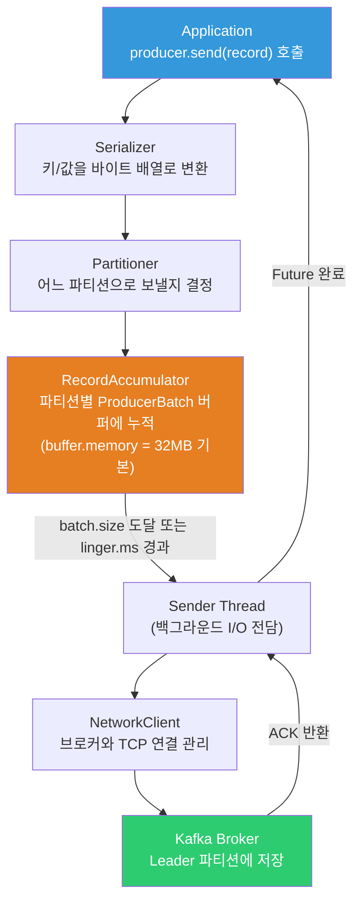
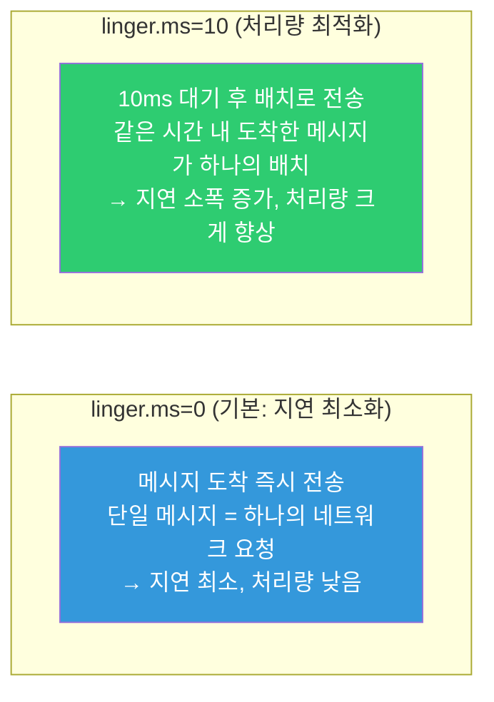
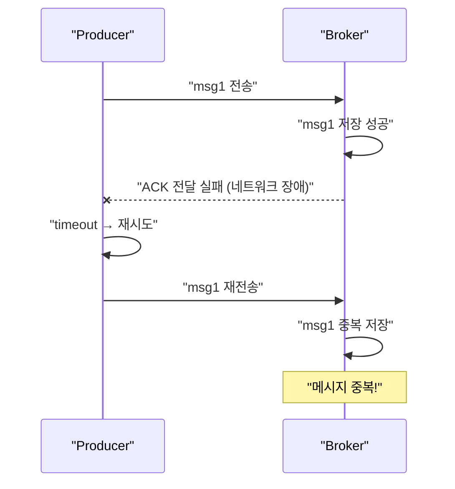
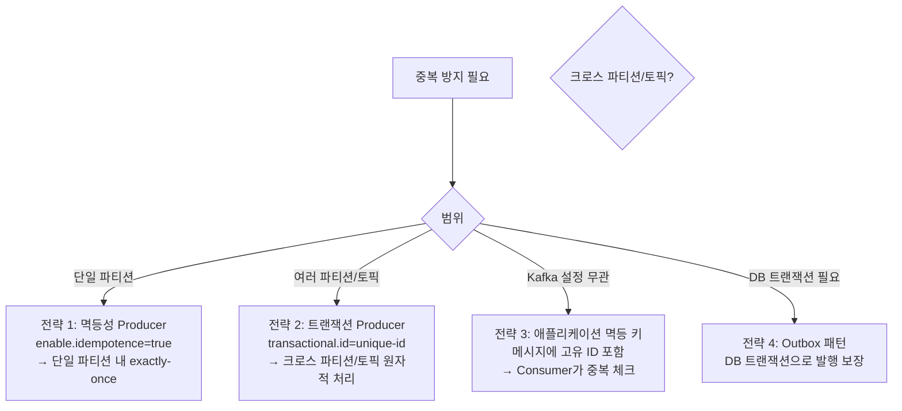

`kafkaTemplate.send("orders", event)` 한 줄이면 메시지가 전송된다고 생각하기 쉽다. 하지만 이 한 줄 뒤에는 직렬화, 파티셔닝, 배치 누적, 압축, 재시도, ACK 확인까지 수십 가지 동작이 숨어있다. acks 설정 하나 잘못 건드리면 메시지가 유실되거나 순서가 뒤집힌다.

## 왜 이게 중요한가?

Producer 설정은 **처리량**, **지연**, **내구성** 세 가지 목표 사이의 트레이드오프다. acks=0이면 처리량은 최대지만 메시지가 유실될 수 있다. acks=all이면 내구성은 최대지만 지연이 늘어난다. 이 트레이드오프를 이해하지 못하면 장애 발생 시 원인도, 해결책도 찾을 수 없다.

## 비유로 이해하기

> Producer는 택배 발송 창구 직원이다. 물건(메시지)을 받아 분류하고(파티셔닝), 박스에 담고(배치), 트럭에 싣는다(네트워크 전송). 물건이 제대로 도착했다는 확인서(ACK)를 받을 때까지 기록을 보관한다. 확인서를 아예 안 받으면 빠르지만 배달 분실을 모른다. 모든 창고에서 확인서를 받으면 확실하지만 시간이 걸린다.

## Producer 내부 아키텍처

### 전체 흐름

Producer가 `send(record)`를 호출하면 메시지는 즉시 네트워크로 나가지 않는다. RecordAccumulator라는 버퍼에 누적된 후 백그라운드 Sender 스레드가 일괄 전송한다.



### RecordAccumulator

Producer 스레드와 Sender 스레드 사이의 버퍼 역할을 한다. 각 TopicPartition마다 `Deque<ProducerBatch>`를 유지하여 메시지를 배치로 묶는다.

Producer 스레드는 배치에 메시지를 추가하고, Sender 스레드는 배치가 준비되면 꺼내서 전송한다. 이 분리 덕분에 애플리케이션 스레드가 네트워크 지연에 블로킹되지 않는다.

```
RecordAccumulator 내부:
orders-P0: [batch1: msg0,msg1,msg2] [batch2: msg3]
orders-P1: [batch1: msg4,msg5]
payments-P0: [batch1: msg6]
         ↑ Producer 스레드가 추가
         ↓ Sender 스레드가 가져가서 전송
```

**주요 설정:**

```properties
buffer.memory=33554432      # 전체 버퍼 메모리 (기본 32MB)
batch.size=16384            # 배치 최대 크기 (기본 16KB)
linger.ms=0                 # 배치 대기 시간 (기본 0ms, 즉시 전송)
max.block.ms=60000          # 버퍼 꽉 찼을 때 block 최대 시간
```

### Sender 스레드

RecordAccumulator에서 배치를 가져와 Kafka Broker로 전송하는 백그라운드 I/O 스레드다.

```
Sender 동작 사이클:
1. RecordAccumulator에서 전송 가능한 배치 수집
2. Metadata에서 각 파티션의 Leader 브로커 확인
3. 브로커별로 요청 묶기 (같은 브로커로 가는 배치 합산)
4. NetworkClient로 비동기 전송
5. 응답 수신 후 Future 완료 처리

in-flight 요청 수 제한:
max.in.flight.requests.per.connection=5  # 브로커당 동시 미확인 요청 수
```

---

## 배치와 압축

### 배치 전략

`linger.ms`와 `batch.size`는 처리량과 지연 사이의 핵심 튜닝 파라미터다.



처리량 최적화를 위한 권장 설정:

```properties
linger.ms=20
batch.size=131072       # 128KB
compression.type=snappy
buffer.memory=67108864  # 64MB
```

### 압축

Producer에서 압축하면 네트워크 전송량과 브로커 저장 공간을 줄일 수 있다. Broker는 압축 해제 없이 그대로 저장하고 Consumer가 해제한다. CPU 사용량이 늘어나는 대신 I/O가 줄어드는 트레이드오프다.

| 압축 알고리즘 | 압축률 | 속도 | CPU 사용 | 권장 상황 |
|--------------|--------|------|---------|-----------|
| none | 없음 | - | 없음 | 기본, 소량 데이터 |
| gzip | 높음 | 느림 | 높음 | 디스크 공간 최우선 |
| snappy | 중간 | 빠름 | 낮음 | 범용 (Google 권장) |
| lz4 | 중간 | 매우 빠름 | 낮음 | 처리량 최우선 |
| zstd | 높음 | 빠름 | 중간 | 고압축률+고성능 |

```properties
compression.type=snappy   # Producer 설정
```

---

## 파티셔닝

### 기본 파티셔닝 로직

키가 있는 메시지는 murmur2 해시로 파티션을 결정하므로 같은 키는 항상 같은 파티션으로 라우팅된다. 이것이 순서 보장의 근거다.

```java
// Kafka 2.4+ 기본 파티셔너: StickyPartitioner
// 키가 없는 메시지: 배치가 찰 때까지 같은 파티션에 Sticky
// 키가 있는 메시지: murmur2 해시 기반으로 파티션 결정

// 키 기반 파티셔닝 (순서 보장):
ProducerRecord<String, String> record =
    new ProducerRecord<>("orders", orderId, orderJson);
// orderId가 같으면 항상 같은 파티션 → 순서 보장
```

### 커스텀 파티셔너

VIP 주문을 전담 파티션과 Consumer로 처리하는 등 비즈니스 요구사항에 맞는 라우팅이 필요할 때 사용한다.

```java
public class OrderPriorityPartitioner implements Partitioner {

    @Override
    public int partition(String topic, Object key, byte[] keyBytes,
                         Object value, byte[] valueBytes, Cluster cluster) {
        int numPartitions = cluster.partitionCountForTopic(topic);

        // VIP 주문은 파티션 0으로 고정 (별도 Consumer가 전담 처리)
        if (value instanceof String && ((String) value).contains("\"vip\":true")) {
            return 0;
        }

        // 일반 주문은 나머지 파티션에 분산
        return (Utils.murmur2(keyBytes) & Integer.MAX_VALUE) % (numPartitions - 1) + 1;
    }

    @Override public void close() {}
    @Override public void configure(Map<String, ?> configs) {}
}

// 설정
props.put(ProducerConfig.PARTITIONER_CLASS_CONFIG,
    OrderPriorityPartitioner.class.getName());
```

---

## 멱등성 Producer

### 재시도로 인한 중복 문제

네트워크 장애로 ACK가 전달되지 않으면 Producer는 성공한 메시지를 재전송한다. 이로 인해 브로커에 같은 메시지가 두 번 저장될 수 있다.



### 멱등성 Producer 동작

`enable.idempotence=true` 설정 하나로 브로커가 중복 시퀀스를 감지하고 자동으로 제거한다.

```properties
enable.idempotence=true
# 자동으로 설정됨:
# acks=all
# max.in.flight.requests.per.connection=5 이하
# retries=Integer.MAX_VALUE
```

```
멱등성 메커니즘:
1. Producer 시작 시 PID (Producer ID) 발급받음
2. 각 메시지에 (PID, Sequence Number) 부여
3. Broker는 파티션별로 마지막 Sequence Number 추적
4. 중복 시퀀스가 오면 저장하지 않고 ack만 반환

Producer: (PID=42, Seq=5, msg1) 전송
Broker: 저장, 마지막 seq=5 기록
네트워크 장애 후 재시도: (PID=42, Seq=5, msg1) 재전송
Broker: seq=5 이미 처리됨 → 중복 무시, ack 반환
→ 중복 없이 exactly-once (파티션 내)
```

한계: 단일 파티션 내에서만 exactly-once 보장된다. 크로스 파티션 또는 크로스 토픽 exactly-once는 트랜잭션 Producer가 필요하다.

---

## 트랜잭션 Producer

### 트랜잭션이란?

여러 파티션 또는 여러 토픽에 걸쳐 원자적 쓰기를 보장한다. 주문, 재고, 알림 세 토픽에 동시 발행할 때 모두 성공하거나 모두 실패해야 하는 경우에 사용한다.

```java
// 트랜잭션 설정
props.put(ProducerConfig.TRANSACTIONAL_ID_CONFIG, "order-service-producer-1");
props.put(ProducerConfig.ENABLE_IDEMPOTENCE_CONFIG, true);

KafkaProducer<String, String> producer = new KafkaProducer<>(props);
producer.initTransactions(); // 트랜잭션 초기화

// 트랜잭션 사용
producer.beginTransaction();
try {
    producer.send(new ProducerRecord<>("orders", orderId, orderJson));
    producer.send(new ProducerRecord<>("inventory-reservations", orderId, reservationJson));
    producer.send(new ProducerRecord<>("notifications", orderId, notificationJson));

    producer.commitTransaction(); // 3개 토픽 모두 원자적 커밋
} catch (Exception e) {
    producer.abortTransaction(); // 3개 토픽 모두 롤백
    throw e;
}
```

### Consumer-Producer 트랜잭션 (Read-Process-Write)

Consumer에서 읽고, 처리하고, Producer로 쓰는 과정을 원자적으로 처리한다. Kafka Streams가 내부적으로 사용하는 패턴이다.

```java
producer.beginTransaction();
try {
    ConsumerRecords<String, String> records = consumer.poll(Duration.ofMillis(100));

    for (ConsumerRecord<String, String> record : records) {
        String result = processRecord(record);
        producer.send(new ProducerRecord<>("output-topic", record.key(), result));
    }

    // Consumer Offset 커밋을 트랜잭션에 포함
    Map<TopicPartition, OffsetAndMetadata> offsets = getOffsets(records);
    producer.sendOffsetsToTransaction(offsets, consumer.groupMetadata());

    producer.commitTransaction();
} catch (Exception e) {
    producer.abortTransaction();
}
```

### Isolation Level

```properties
# Consumer 설정
isolation.level=read_committed   # 커밋된 트랜잭션 메시지만 읽음 (기본: read_uncommitted)
```

`read_committed`를 사용하면 나중에 abort된 트랜잭션 메시지를 읽지 않는다. 처리량이 소폭 감소하지만 정확한 exactly-once 보장이 가능하다.

---

## Producer 행(Hang) 원인과 대응

### 원인 1: 버퍼 꽉 참

```
증상: producer.send()가 max.block.ms 동안 블로킹 후 BufferExhaustedException

원인:
  - Sender 스레드가 브로커에 전송하는 속도 < 메시지 생성 속도
  - 브로커 장애로 전송 불가 → 버퍼 지속 누적

해결:
  buffer.memory 증가 (기본 32MB → 64MB+)
  linger.ms 줄여 더 자주 전송
  브로커 장애 확인
  max.block.ms를 줄여 빠른 실패(fail-fast) 처리
```

### 원인 2: Metadata 조회 실패

```
증상: Producer 시작 시 또는 리더 변경 후 메시지 전송 지연/실패

원인:
  - 브로커 연결 불가 → Metadata 조회 실패
  - Leader 선출 중인 파티션에 쓰기 시도

설정:
  metadata.max.age.ms=300000      # Metadata 캐시 갱신 주기
  max.block.ms=60000              # Metadata 조회 대기 최대 시간
  request.timeout.ms=30000        # 요청 타임아웃
  reconnect.backoff.ms=50         # 재연결 시도 간격
  reconnect.backoff.max.ms=1000   # 재연결 최대 대기
```

### 원인 3: in-flight 요청 과다

```
증상: 처리량은 높은데 지연 증가

원인: 브로커가 요청 처리보다 느리게 응답
     → in-flight 요청 누적 → 버퍼 소진

해결:
  max.in.flight.requests.per.connection=1~5 (멱등성 활성화 시 5 이하 필수)
  acks=1로 변경 (내구성 트레이드오프)
```

---

## 재시도 중복 방지

### 재시도 설정

```properties
retries=2147483647                  # 사실상 무한 재시도
retry.backoff.ms=100                # 재시도 간격 (기본 100ms)
delivery.timeout.ms=120000          # 전체 전송 타임아웃 (기본 2분)
                                    # retries를 넘더라도 이 시간 내에만 재시도
```

### 재시도 중복 방지 전략



### 멱등성 + 트랜잭션 조합 설정

```java
@Configuration
public class KafkaProducerConfig {

    @Bean
    public ProducerFactory<String, String> producerFactory() {
        Map<String, Object> props = new HashMap<>();
        props.put(ProducerConfig.BOOTSTRAP_SERVERS_CONFIG, "kafka:9092");
        props.put(ProducerConfig.KEY_SERIALIZER_CLASS_CONFIG, StringSerializer.class);
        props.put(ProducerConfig.VALUE_SERIALIZER_CLASS_CONFIG, StringSerializer.class);

        // 멱등성
        props.put(ProducerConfig.ENABLE_IDEMPOTENCE_CONFIG, true);

        // 트랜잭션 (서비스 인스턴스별 고유 ID)
        String hostname = System.getenv("HOSTNAME");
        props.put(ProducerConfig.TRANSACTIONAL_ID_CONFIG, "order-svc-" + hostname);

        // 내구성
        props.put(ProducerConfig.ACKS_CONFIG, "all");
        props.put(ProducerConfig.RETRIES_CONFIG, Integer.MAX_VALUE);
        props.put(ProducerConfig.MAX_IN_FLIGHT_REQUESTS_PER_CONNECTION, 5);

        // 배치 성능
        props.put(ProducerConfig.LINGER_MS_CONFIG, 5);
        props.put(ProducerConfig.BATCH_SIZE_CONFIG, 65536);
        props.put(ProducerConfig.COMPRESSION_TYPE_CONFIG, "snappy");

        return new DefaultKafkaProducerFactory<>(props);
    }
}
```

---

## 성능 튜닝 요약

| 목표 | 설정 | 권장 값 |
|------|------|-----|
| 처리량 최대화 | `linger.ms` | 20~50 |
| 처리량 최대화 | `batch.size` | 65536~131072 |
| 처리량 최대화 | `compression.type` | snappy / lz4 |
| 처리량 최대화 | `buffer.memory` | 64MB+ |
| 지연 최소화 | `linger.ms` | 0~5 |
| 지연 최소화 | `batch.size` | 작게 |
| 내구성 최대화 | `acks` | all |
| 내구성 최대화 | `enable.idempotence` | true |
| 내구성 최대화 | `min.insync.replicas` | 2 |

처리량과 지연은 반비례 관계다. `linger.ms`를 늘리면 배치가 커져 처리량이 높아지지만 개별 메시지의 지연도 늘어난다.

---

<details class="extreme-scenario-details">
<summary class="extreme-scenario-summary">
<span class="extreme-scenario-icon">🔥</span>
<span class="extreme-scenario-label">극한 시나리오 — 클릭하여 펼치기</span>
<span class="extreme-scenario-toggle"></span>
</summary>
<div class="extreme-scenario-body">

<div class="extreme-scenario-content" markdown="1">

### 시나리오 1: ACK=ALL인데 브로커 1대 장애 발생 중 메시지 전송

ISR이 줄어들어 `min.insync.replicas` 조건을 충족하지 못하면 Producer에 `NotEnoughReplicasException`이 반환된다. 메시지가 손실되지는 않지만 전송이 거부된다.

```
상황: replication.factor=3, min.insync.replicas=2
      브로커 2대 장애 → ISR = {Leader만 남음}

결과: acks=all이면 min.insync.replicas=2 미충족
      → Producer에 NotEnoughReplicasException
      → 메시지 전송 실패 (유실 없음)

대응:
  retries 설정으로 자동 재시도
  브로커 복구 또는 다른 브로커 투입 후 ISR 복구 대기
```

### 시나리오 2: 트랜잭션 Producer 인스턴스가 두 개 동시에 같은 transactional.id 사용

새 인스턴스가 같은 `transactional.id`로 `initTransactions()`를 호출하면 이전 인스턴스의 트랜잭션이 강제 중단(Fence)된다. 이를 **Producer Fencing**이라 한다.

```
방어:
transactional.id를 서비스 인스턴스마다 고유하게 설정
(예: "order-svc-" + System.getenv("HOSTNAME"))
중복 실행 방지 로직 추가
```

### 시나리오 3: buffer.memory 소진으로 전체 서비스 블로킹

브로커 장애나 네트워크 지연이 길어지면 RecordAccumulator 버퍼가 가득 차 `producer.send()`가 `max.block.ms` 동안 블로킹된다. 서비스 스레드가 모두 Kafka 전송 대기 상태로 빠지면 서비스 전체가 멈출 수 있다.

```
방어:
max.block.ms를 짧게 설정 (빠른 실패)
비동기 전송 + 예외 처리로 Kafka 지연이 서비스를 블로킹하지 않도록 설계
Circuit Breaker 패턴 적용 (Kafka 연결 실패 시 fallback)
```
</div>
</div>
</details>

