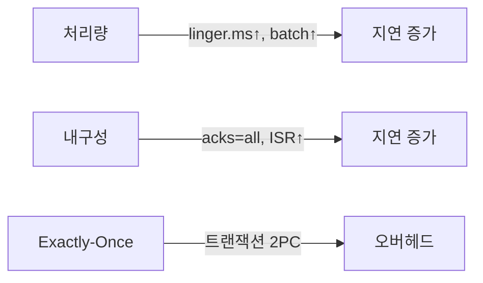

`kafkaTemplate.send("orders", event)` 한 줄이면 메시지가 전송된다고 생각하기 쉽다. 하지만 이 한 줄 뒤에는 **인터셉터 → 직렬화 → 파티셔닝 → RecordAccumulator 배치 누적 → Sender 스레드 → NetworkClient → 브로커 ISR 복제 → ACK** 까지 수십 가지 동작이 순서대로 실행된다. acks 설정 하나 잘못 건드리면 메시지가 유실되거나 순서가 뒤집히고, 트랜잭션 ID를 중복 사용하면 좀비 인스턴스가 시스템을 망가뜨린다.

이 글은 KafkaProducer 소스 코드 수준의 동작 원리를 이해하고, Spring Kafka 환경에서 올바르게 설정하는 방법을 다룬다.

---

## 1. Producer 내부 파이프라인 전체 흐름

### send() 호출부터 ACK까지

`KafkaTemplate.send()`는 내부적으로 `KafkaProducer.send()`를 호출한다. 이 호출은 즉시 네트워크로 나가지 않는다. 메시지는 파이프라인을 거쳐 버퍼에 누적된 후 별도 스레드가 전송한다.


각 단계가 왜 분리되어 있는지가 핵심이다. Application 스레드는 RecordAccumulator에 메시지를 넣는 순간 제어를 돌려받는다. 네트워크 I/O는 전적으로 Sender 스레드가 담당하므로 애플리케이션 스레드가 브로커 응답을 기다리며 블로킹되지 않는다.

### 단계별 동작 상세

**1단계 — Interceptor Chain**

`ProducerInterceptor.onSend()`가 순서대로 호출된다. 레코드를 변형(헤더 추가, 암호화)하거나 전송 전 메트릭을 수집할 수 있다. `onAcknowledgement()`는 브로커 ACK 후 호출된다.

**2단계 — Serializer**

키와 값을 `byte[]`로 변환한다. 이 시점에서 `null` 키/값 처리, 직렬화 실패 예외가 발생한다. 직렬화 실패는 재시도 대상이 아니다 — 재시도해도 같은 결과이기 때문이다.

**3단계 — Partitioner**

어느 파티션에 넣을지 결정한다. 파티션 결정은 Cluster 메타데이터를 참조한다. 메타데이터가 없거나 만료된 경우 Sender 스레드가 브로커에서 Metadata를 갱신한 후 파티션이 결정된다.

**4단계 — RecordAccumulator**

결정된 TopicPartition의 배치에 메시지를 추가한다. 배치가 꽉 찼거나 `linger.ms`가 경과하면 Sender 스레드가 해당 배치를 가져간다.

**5단계 — Sender Thread**

RecordAccumulator에서 전송 가능한 배치를 수집하고, NetworkClient를 통해 브로커에 ProduceRequest를 보낸다. 비동기 I/O를 사용하므로 단일 스레드로도 수백만 TPS를 처리할 수 있다.

---

## 2. RecordAccumulator 내부 구조

### 자료구조: 파티션별 ProducerBatch Deque

RecordAccumulator는 `ConcurrentMap<TopicPartition, Deque<ProducerBatch>>` 구조로 관리된다.

```
RecordAccumulator 내부 상태 예시:

  TopicPartition("orders", 0)
    → Deque: [ProducerBatch(used=14KB, max=16KB)] ← Sender가 아직 가져가지 않음
             [ProducerBatch(used=2KB,  max=16KB)] ← 현재 Producer가 쓰는 배치

  TopicPartition("orders", 1)
    → Deque: [ProducerBatch(used=16KB, max=16KB)] ← 꽉 참, Sender 대기
             [ProducerBatch(used=0KB,  max=16KB)] ← 방금 생성

  TopicPartition("payments", 0)
    → Deque: [ProducerBatch(used=8KB,  max=16KB)]
```

Producer 스레드는 Deque의 `tail`(마지막 배치)에 추가하고, Sender 스레드는 `head`(첫 번째 배치)에서 가져간다. 이 FIFO 구조 덕분에 파티션 내 메시지 순서가 보장된다.

### 메모리 풀 (BufferPool)

RecordAccumulator는 단순히 힙 메모리를 사용하지 않는다. `buffer.memory` 크기만큼의 **BufferPool**을 미리 확보하고 ProducerBatch 메모리를 재활용한다.

```
buffer.memory = 32MB (기본값)

BufferPool 동작:
  1. 새 ProducerBatch 생성 시 → 풀에서 batch.size(16KB) 블록 할당
  2. Sender가 전송 완료 후 → 블록을 풀에 반환 (GC 없음)
  3. 풀이 비어있으면 → max.block.ms 동안 블록 반환 대기
  4. max.block.ms 초과 → TimeoutException 발생

왜 BufferPool인가?
  - batch.size보다 큰 메시지는 개별 ByteBuffer 할당 (풀 미사용)
  - GC 압박 감소: 대부분의 메시지가 같은 ByteBuffer를 재사용
  - 풀 고갈이 곧 배압(Backpressure) 신호 → 프로듀서 속도 조절
```

### batch.size와 linger.ms의 상호작용

이 두 설정은 독립적으로 작동하는 것이 아니라 **OR 조건**으로 배치 전송을 트리거한다.

```
배치 전송 조건 (둘 중 하나라도 충족되면):
  Condition A: ProducerBatch.size >= batch.size
  Condition B: 배치 생성 후 경과 시간 >= linger.ms

Case 1: linger.ms=0 (기본값)
  → 메시지가 하나라도 들어오면 즉시 전송 (Condition B 항상 충족)
  → 배치 효과 없음, 처리량 낮음, 지연 낮음

Case 2: linger.ms=20, batch.size=16KB
  → 20ms 안에 16KB가 채워지면 즉시 전송 (Condition A 먼저 충족)
  → 20ms 안에 16KB가 안 채워지면 20ms 후 전송 (Condition B 충족)
  → 배치 효과 최대, 처리량 높음, 최소 지연 = linger.ms

실제 권장값 (고처리량 시나리오):
  linger.ms=10~50
  batch.size=65536 (64KB) 또는 131072 (128KB)
```

### Spring Kafka RecordAccumulator 설정

```java
@Configuration
public class KafkaProducerConfig {

    @Value("${kafka.bootstrap-servers}")
    private String bootstrapServers;

    @Bean
    public ProducerFactory<String, OrderEvent> producerFactory() {
        Map<String, Object> props = new HashMap<>();
        props.put(ProducerConfig.BOOTSTRAP_SERVERS_CONFIG, bootstrapServers);
        props.put(ProducerConfig.KEY_SERIALIZER_CLASS_CONFIG, StringSerializer.class);
        props.put(ProducerConfig.VALUE_SERIALIZER_CLASS_CONFIG,
                  JsonSerializer.class);

        // RecordAccumulator 튜닝
        props.put(ProducerConfig.BUFFER_MEMORY_CONFIG, 67_108_864L);  // 64MB
        props.put(ProducerConfig.BATCH_SIZE_CONFIG, 65_536);          // 64KB
        props.put(ProducerConfig.LINGER_MS_CONFIG, 20);               // 20ms
        props.put(ProducerConfig.MAX_BLOCK_MS_CONFIG, 5_000L);        // 5초 대기 후 실패

        return new DefaultKafkaProducerFactory<>(props);
    }

    @Bean
    public KafkaTemplate<String, OrderEvent> kafkaTemplate() {
        return new KafkaTemplate<>(producerFactory());
    }
}
```

---

## 3. Partitioner 내부 동작

### Sticky Partitioning — 왜 Round-Robin보다 나은가

Kafka 2.4 이전 기본 파티셔너는 라운드 로빈이었다. 키 없는 메시지를 P0 → P1 → P2 → P0 순으로 분산했는데, 이 방식의 문제는 배치 효율이다.

```
Round-Robin 문제:
  메시지 1 → P0 배치에 추가
  메시지 2 → P1 배치에 추가
  메시지 3 → P2 배치에 추가
  메시지 4 → P0 배치에 추가 (P0 배치: 2개)
  ...
  결과: 모든 파티션 배치가 조금씩만 채워짐
        batch.size=16KB인데 각 배치에 1~2개씩만 → 배치 효과 없음
        파티션 수만큼 작은 ProduceRequest 다수 발생
```

Kafka 2.4+의 StickyPartitioner는 다르다.

```
Sticky Partitioning 동작:
  1. 하나의 파티션을 "sticky" 파티션으로 선택
  2. 해당 파티션 배치가 꽉 차거나 linger.ms가 경과할 때까지 계속 추가
  3. 배치 전송 후 → 새 파티션 랜덤 선택 (이전과 다른 파티션 선호)

결과:
  P0 배치: 128개 메시지 (16KB 꽉 참) → 한 번에 전송
  → 파티션당 배치 크기 최대화
  → ProduceRequest 수 감소
  → 브로커 CPU 절약

장기 균형: 배치 단위로 파티션을 바꾸므로 시간 평균으로 균등 분산
           단기 불균형은 있지만 배치 효율이 훨씬 중요
```

### murmur2 해시: 키 기반 파티셔닝

키가 있는 메시지는 `Utils.murmur2(keyBytes) % numPartitions`로 파티션을 결정한다.

```java
// Kafka 내부 구현 (DefaultPartitioner.java)
// 키가 있는 경우 murmur2 해시 사용
int partition = Utils.toPositive(Utils.murmur2(keyBytes)) % numPartitions;
```

murmur2를 사용하는 이유:
- **결정론적(Deterministic)**: 같은 키는 항상 같은 해시값 → 같은 파티션
- **균등 분포**: murmur2는 충돌이 적고 분포가 균등
- **속도**: SHA-256보다 훨씬 빠름 (암호학적 보안 불필요)

주의: **파티션 수가 바뀌면** 같은 키가 다른 파티션으로 라우팅된다. 순서 보장이 깨지므로 파티션 수는 신중하게 설정해야 한다.

### 커스텀 파티셔너: Spring Kafka 적용

```java
// VIP 주문을 전담 파티션(0)으로 라우팅하는 커스텀 파티셔너
public class OrderPriorityPartitioner implements Partitioner {

    @Override
    public int partition(String topic, Object key, byte[] keyBytes,
                         Object value, byte[] valueBytes, Cluster cluster) {
        List<PartitionInfo> partitions = cluster.partitionsForTopic(topic);
        int numPartitions = partitions.size();

        if (numPartitions < 2) {
            return 0;
        }

        // VIP 주문은 파티션 0 (전담 Consumer 그룹이 처리)
        if (value instanceof OrderEvent order && order.isVip()) {
            return 0;
        }

        // 일반 주문: 파티션 1 이상에 murmur2 해시로 분산
        if (keyBytes != null) {
            return Utils.toPositive(Utils.murmur2(keyBytes)) % (numPartitions - 1) + 1;
        }

        // 키 없음: Sticky
        return Utils.toPositive(ThreadLocalRandom.current().nextInt()) % (numPartitions - 1) + 1;
    }

    @Override
    public void close() {}

    @Override
    public void configure(Map<String, ?> configs) {}
}
```

```java
// Spring Kafka ProducerFactory에 적용
props.put(ProducerConfig.PARTITIONER_CLASS_CONFIG,
          OrderPriorityPartitioner.class.getName());
```

---

## 4. acks 시맨틱 내부 동작

### acks=0: Fire and Forget

```
ProducerRecord 생성
  → RecordAccumulator 추가
  → Sender 스레드 전송
  → 브로커 응답 대기 없음
  → Future는 전송 직후 즉시 완료 처리

내부 동작:
  NetworkClient가 소켓 버퍼에 쓰는 순간 성공으로 간주
  브로커가 실제로 받았는지, 저장했는지 확인 없음

언제 유실되는가:
  - 네트워크 패킷 손실
  - 브로커 수신 버퍼 오버플로우
  - 브로커 프로세스 크래시
```

### acks=1: Leader만 확인

```
Leader 브로커가 로컬 로그에 쓴 후 ACK
  → Follower 복제는 ACK 전송 시점과 무관

유실 시나리오:
  1. Producer → Leader: 메시지 전송
  2. Leader → 로컬 로그 저장 (성공)
  3. Leader → Producer: ACK 전송 (성공)
  4. Leader → Follower: 복제 전에 Leader 크래시!
  5. Follower 중 하나가 새 Leader로 선출
  6. 새 Leader에는 해당 메시지가 없음 → 유실

결론: acks=1은 "Leader에 도달했음"을 보장하지
     "복제 완료"를 보장하지 않는다
```

### acks=all (acks=-1): ISR 전체 확인

```
Leader가 ISR의 모든 레플리카가 복제 완료한 후 ACK

ISR (In-Sync Replica) 정의:
  - replica.lag.time.max.ms 이내에 Leader를 따라가는 레플리카 집합
  - ISR은 동적으로 변함 (느린 Follower는 ISR에서 제외)

min.insync.replicas 관계:
  - acks=all이어도 ISR에 1개만 있으면 Leader만 확인하는 것과 동일!
  - min.insync.replicas=2 설정 시:
    ISR < 2이면 NotEnoughReplicasException 발생 (쓰기 거부)
    → 가용성 희생, 내구성 보장

권장 조합 (금융/결제):
  replication.factor=3
  min.insync.replicas=2
  acks=all
  → 브로커 1대 장애 시에도 쓰기 가능 + 내구성 보장
```

```java
// Spring Kafka 내구성 설정
props.put(ProducerConfig.ACKS_CONFIG, "all");

// 브로커 설정 (application.properties로 관리)
// min.insync.replicas=2  ← 토픽 또는 브로커 레벨 설정
```

### acks=all은 "모든 레플리카"가 아니다

면접에서 자주 나오는 함정이다.

```
replication.factor=3, min.insync.replicas=2 설정 시:

브로커 R0(Leader), R1, R2 중 R2가 느려서 ISR에서 제외된 상태:
  ISR = {R0, R1}

Producer send() with acks=all:
  R0(Leader) 저장 + R1 복제 완료 → ACK 반환
  R2는 복제 안 됐지만 ACK를 이미 반환함!
  → "acks=all" = "ISR 내 모든 레플리카 확인"
  → ISR 밖의 레플리카는 확인 대상 아님
```

---

## 5. Sender 스레드와 NetworkClient

### Sender 스레드 동작 사이클

Sender는 KafkaProducer 생성 시 데몬 스레드로 시작되어 `close()` 호출 전까지 계속 실행된다.

```
Sender 스레드 무한 루프 (단순화):

while (running) {
  // 1. 전송 가능한 배치 수집
  Map<Integer, List<ProducerBatch>> batches =
      accumulator.drain(cluster, readyNodes, maxSize, now);

  // 2. 브로커별로 ProduceRequest 묶기
  for (entry : batches.entrySet()) {
      int nodeId = entry.getKey();
      List<ProducerBatch> nodeBatches = entry.getValue();
      sendProduceRequest(nodeId, nodeBatches);
  }

  // 3. NetworkClient poll (응답 수신)
  client.poll(pollTimeout, now);

  // 4. 완료된 배치 처리 (Future 완료, 콜백 호출)
  handleResponses();
}
```

### InFlightRequests: 동시 미확인 요청 관리

```
max.in.flight.requests.per.connection=5 (기본값)

브로커 A로의 InFlight 슬롯: [req1] [req2] [req3] [req4] [req5]
                              ↑전송됨  ↑전송됨  ↑전송됨  (2개 빔)

슬롯이 꽉 차면 새 배치를 해당 브로커로 전송하지 않음
  → Sender가 대기
  → RecordAccumulator 계속 누적
  → buffer.memory 소진 위험

왜 5인가?
  - TCP 파이프라이닝 효과: 여러 요청을 동시에 in-flight로 유지해 RTT 대기 최소화
  - 1로 설정 시: 요청 → 대기 → ACK → 다음 요청 (RTT 직렬화, 처리량 급감)
  - 너무 크면: 재시도 시 순서 보장 어려움 (멱등성 없을 때)
```

### NetworkClient: 비동기 NIO 통신

```java
// NetworkClient 내부 (개념적 설명)
// Selector(NIO) 기반으로 여러 브로커 연결을 단일 스레드로 관리

클라이언트 연결 관리:
  - 브로커마다 하나의 TCP 연결 유지
  - connections.max.idle.ms 동안 유휴 연결 자동 종료
  - reconnect.backoff.ms: 재연결 간격 (지수 백오프 적용)

Metadata 갱신:
  - metadata.max.age.ms 마다 주기적 갱신
  - 리더 변경 감지 시 즉시 갱신
  - 메타데이터 없는 파티션의 배치는 전송 보류
```

---

## 6. 멱등성 Producer: PID와 Sequence Number

### 재시도로 인한 중복 — 왜 발생하는가

```
acks=all, retries=3 설정에서:

1. Producer → Broker: (msg, seq=5) 전송
2. Broker: 로컬 + ISR 복제 완료 (저장 성공)
3. Broker → Producer: ACK 발송
4. 네트워크 패킷 손실 → Producer에 ACK 미도달
5. delivery.timeout.ms 이내: Producer가 timeout으로 판단
6. Producer → Broker: (msg, seq=5) 재전송 (중복!)
7. Broker: 두 번 저장 → 중복 메시지 발생
```

### 멱등성 메커니즘: PID + Sequence Number

```
enable.idempotence=true 동작:

초기화:
  Producer 시작 시 브로커에 InitProducerId 요청
  → 브로커: PID(Producer ID) = 8473 발급
  → 파티션별 sequence number는 0으로 초기화

전송:
  Producer → Broker: (PID=8473, partition=0, seq=5, msg)
  Broker: 파티션 0에서 마지막 확인 seq = 4
           seq=5 = 4+1 → 정상 → 저장

재전송 (네트워크 오류 후):
  Producer → Broker: (PID=8473, partition=0, seq=5, msg)  ← 동일
  Broker: 파티션 0에서 마지막 확인 seq = 5 (이미 저장됨)
           seq=5 = 5 → 중복 → 저장 안 하고 ACK만 반환

Sequence 역전:
  Producer → Broker: (PID=8473, partition=0, seq=7, msg)
  Broker: 마지막 확인 seq = 5 → seq=7 ≠ 5+1
           OutOfOrderSequenceException 발생!
           → Producer 즉시 실패 처리
```

### OutOfOrderSequenceException이 발생하는 상황

```
max.in.flight.requests.per.connection > 5인 경우:
  멱등성 Producer라도 OutOfOrderSequenceException 발생 가능
  → Kafka 소스에서 max.in.flight.requests=5 강제 (멱등성 활성화 시)

세션 만료 (Producer 재시작):
  PID는 세션당 발급 → Producer 재시작 시 새 PID 발급
  이전 PID로 보낸 메시지와 seq 연속성 없음
  → 멱등성은 "단일 Producer 세션 내" exactly-once만 보장
  → 서비스 재시작 후 중복은 트랜잭션 Producer가 필요
```

### Spring Kafka 멱등성 설정

```java
@Configuration
public class IdempotentProducerConfig {

    @Bean
    public ProducerFactory<String, OrderEvent> idempotentProducerFactory() {
        Map<String, Object> props = new HashMap<>();
        props.put(ProducerConfig.BOOTSTRAP_SERVERS_CONFIG, "kafka:9092");
        props.put(ProducerConfig.KEY_SERIALIZER_CLASS_CONFIG, StringSerializer.class);
        props.put(ProducerConfig.VALUE_SERIALIZER_CLASS_CONFIG, JsonSerializer.class);

        // 멱등성 활성화 → 아래 3개 자동 설정됨:
        //   acks=all
        //   retries=Integer.MAX_VALUE
        //   max.in.flight.requests.per.connection=5
        props.put(ProducerConfig.ENABLE_IDEMPOTENCE_CONFIG, true);

        // 명시적으로도 설정 (가독성)
        props.put(ProducerConfig.ACKS_CONFIG, "all");
        props.put(ProducerConfig.MAX_IN_FLIGHT_REQUESTS_PER_CONNECTION, 5);
        props.put(ProducerConfig.DELIVERY_TIMEOUT_MS_CONFIG, 120_000);

        return new DefaultKafkaProducerFactory<>(props);
    }
}
```

---

## 7. 트랜잭션 Producer: 2PC와 Zombie Fencing

### 트랜잭션이 해결하는 문제

멱등성 Producer는 단일 파티션 내 중복을 막는다. 그런데 다음 상황을 보자:

```
주문 처리 시나리오:
  1. "orders" 토픽에 주문 이벤트 발행
  2. "inventory" 토픽에 재고 차감 이벤트 발행
  3. "notifications" 토픽에 알림 이벤트 발행

1번만 성공하고 2번에서 브로커 장애 발생 시:
  - 주문은 생성됨
  - 재고 차감 없음 → 데이터 불일치!
  - 알림 없음 → 사용자 경험 손상

해결책: 3개 토픽에 원자적으로 쓰기
  → 전부 성공 또는 전부 실패
```

### Transaction Coordinator와 __transaction_state

```
__transaction_state 토픽:
  - 브로커 내 특수 내부 토픽 (50 파티션)
  - transactional.id → 담당 Transaction Coordinator 결정
    (hash(transactional.id) % 50 → 해당 파티션의 Leader 브로커)
  - 트랜잭션 상태를 영속 저장
    (Ongoing / PrepareCommit / CompleteCommit / PrepareAbort 등)
```

### 2PC (Two-Phase Commit) 프로토콜

```
Phase 1: Prepare
  Producer → TC: BeginTransaction
  TC: __transaction_state에 "Ongoing" 기록

  Producer → 각 파티션 Leader 브로커:
    ProduceRequest (transactional.id 포함)
  각 파티션 Leader: AddPartitionsToTxn 기록
    (이 파티션이 트랜잭션에 참여함을 TC에 등록)

Phase 2: Commit (또는 Abort)
  Producer → TC: EndTransaction(commit=true)
  TC: __transaction_state에 "PrepareCommit" 기록 (포인트 오브 노 리턴)
  TC → 각 파티션 Leader: WriteTxnMarker (COMMIT 마커 쓰기)
  각 파티션 Leader: 마커 저장 완료 후 TC에 응답
  TC: __transaction_state에 "CompleteCommit" 기록

Consumer (read_committed):
  COMMIT 마커를 만나기 전까지는 해당 트랜잭션 메시지를 Consumer에게 노출 안 함
  → 트랜잭션이 abort되면 Consumer는 해당 메시지를 영원히 보지 못함
```

### Zombie Fencing: 같은 transactional.id 충돌 방지

```
문제 상황:
  Instance A: transactional.id="order-svc-1", epoch=0으로 트랜잭션 진행 중
  네트워크 파티션으로 A가 GC pause 또는 격리됨
  Instance B: 새 인스턴스, 같은 transactional.id="order-svc-1" 로 initTransactions()

Fencing 동작:
  B가 TC에 InitProducerId 요청
  TC: epoch를 0 → 1로 증가
      A의 진행 중 트랜잭션을 abort
      B에게 (PID=X, epoch=1) 발급

  A가 깨어나서 계속 전송 시도:
    A: epoch=0으로 ProduceRequest 전송
    브로커: epoch 확인 → 0 < 현재 epoch(1)
           ProducerFencedException 반환
    A: 즉시 실패 → 좀비 A는 더 이상 쓰기 불가

결론:
  transactional.id는 인스턴스별 고유값이어야 함
  그러나 재시작 후 같은 transactional.id를 사용해야 fencing이 동작함
  → Pod 이름, 호스트명 등을 사용하되 재시작 후 동일한 값 유지
```

### Spring Kafka 트랜잭션 전체 설정

```java
@Configuration
public class TransactionalKafkaConfig {

    @Value("${HOSTNAME:localhost}")
    private String hostname;

    @Bean
    public ProducerFactory<String, Object> transactionalProducerFactory() {
        Map<String, Object> props = new HashMap<>();
        props.put(ProducerConfig.BOOTSTRAP_SERVERS_CONFIG, "kafka:9092");
        props.put(ProducerConfig.KEY_SERIALIZER_CLASS_CONFIG, StringSerializer.class);
        props.put(ProducerConfig.VALUE_SERIALIZER_CLASS_CONFIG, JsonSerializer.class);

        // 트랜잭션 (멱등성 자동 포함)
        props.put(ProducerConfig.TRANSACTIONAL_ID_CONFIG, "order-svc-" + hostname);
        props.put(ProducerConfig.ENABLE_IDEMPOTENCE_CONFIG, true);
        props.put(ProducerConfig.ACKS_CONFIG, "all");
        props.put(ProducerConfig.MAX_IN_FLIGHT_REQUESTS_PER_CONNECTION, 5);

        // 트랜잭션 타임아웃 (브로커의 transaction.max.timeout.ms 이하여야 함)
        props.put(ProducerConfig.TRANSACTION_TIMEOUT_CONFIG, 60_000);

        DefaultKafkaProducerFactory<String, Object> factory =
            new DefaultKafkaProducerFactory<>(props);
        // Spring이 트랜잭션 Producer 풀 관리
        factory.setTransactionIdPrefix("order-svc-" + hostname + "-");
        return factory;
    }

    @Bean
    public KafkaTemplate<String, Object> kafkaTemplate() {
        return new KafkaTemplate<>(transactionalProducerFactory());
    }

    @Bean
    public KafkaTransactionManager<String, Object> kafkaTransactionManager() {
        return new KafkaTransactionManager<>(transactionalProducerFactory());
    }
}
```

```java
@Service
@Slf4j
public class OrderService {

    private final KafkaTemplate<String, Object> kafkaTemplate;
    private final OrderRepository orderRepository;

    // @Transactional 어노테이션으로 Kafka 트랜잭션 자동 관리
    @Transactional("kafkaTransactionManager")
    public void processOrder(Order order) {
        String orderId = order.getId();

        // 세 토픽에 원자적으로 발행
        kafkaTemplate.send("orders", orderId, new OrderCreatedEvent(order));
        kafkaTemplate.send("inventory", orderId, new InventoryReservedEvent(order));
        kafkaTemplate.send("notifications", orderId, new NotificationEvent(order));

        // 예외 발생 시 → @Transactional이 abortTransaction() 자동 호출
        // 정상 완료 시 → commitTransaction() 자동 호출
    }

    // DB 트랜잭션 + Kafka 트랜잭션 동시 관리 (ChainedTransactionManager)
    @Transactional("chainedTransactionManager")
    public void processOrderWithDb(Order order) {
        orderRepository.save(order);  // DB 트랜잭션
        kafkaTemplate.send("orders", order.getId(),
                           new OrderCreatedEvent(order));  // Kafka 트랜잭션
        // 둘 다 성공 또는 둘 다 롤백 (완벽한 원자성은 2PC 필요 → Outbox 패턴 권장)
    }
}
```

### Consumer-Producer Read-Process-Write 패턴

```java
@Service
public class OrderProcessingService {

    private final KafkaTemplate<String, Object> kafkaTemplate;
    private final KafkaConsumer<String, OrderEvent> consumer;

    // Kafka Streams 내부에서 사용하는 패턴
    // Consumer offset 커밋을 Kafka 트랜잭션에 포함시켜 exactly-once 달성
    public void processLoop() {
        while (true) {
            ConsumerRecords<String, OrderEvent> records =
                consumer.poll(Duration.ofMillis(100));

            if (records.isEmpty()) continue;

            kafkaTemplate.executeInTransaction(operations -> {
                for (ConsumerRecord<String, OrderEvent> record : records) {
                    // 처리 결과를 output 토픽에 발행
                    ProcessedOrder result = processOrder(record.value());
                    operations.send("processed-orders", record.key(), result);
                }

                // Consumer offset을 트랜잭션에 포함
                // → commit 성공 시에만 offset이 커밋됨
                // → abort 시 offset이 커밋되지 않아 재처리 가능
                Map<TopicPartition, OffsetAndMetadata> offsets =
                    buildOffsetMap(records);
                operations.sendOffsetsToTransaction(
                    offsets, consumer.groupMetadata());

                return true;
            });
        }
    }
}
```

---

## 8. Retries와 delivery.timeout.ms

### 타임아웃 계층 구조

재시도 관련 설정이 여러 개인데 이들의 관계를 모르면 의도하지 않은 동작이 발생한다.

```
delivery.timeout.ms = 120,000ms (기본 2분)
  │
  ├─ request.timeout.ms = 30,000ms (브로커 응답 대기)
  │    └─ 초과 시 TimeoutException → 재시도 트리거
  │
  └─ retry.backoff.ms = 100ms (재시도 간격)
       └─ 재시도 = (delivery.timeout.ms - linger.ms) / retry.backoff.ms 횟수 이내

retries 설정은 횟수 상한이지만:
  retries=Integer.MAX_VALUE여도
  delivery.timeout.ms 경과 시 TimeoutException으로 최종 실패
  → delivery.timeout.ms가 실질적 타임아웃

필수 관계:
  delivery.timeout.ms >= linger.ms + request.timeout.ms
  위 조건 미충족 시 Producer 시작 시 ConfigException 발생
```

### max.in.flight.requests와 순서 보장

```
멱등성 없을 때 (enable.idempotence=false):

  배치1(seq A) 전송 → in-flight
  배치2(seq B) 전송 → in-flight
  배치1 실패 → 재시도
  배치2 성공 (먼저 도착!)
  배치1 재시도 성공
  → 브로커 저장 순서: B, A (역전!)

  방지: max.in.flight.requests.per.connection=1
        → 동시에 1개만 in-flight → 순서 보장
        → 처리량 감소 (RTT 직렬화)

멱등성 있을 때 (enable.idempotence=true):
  브로커가 PID+seq로 순서 검증
  배치2가 먼저 도착하면 → seq 불연속 → 보류
  배치1 재시도 도착 → seq 연속 → 저장
  배치2 → seq 연속 → 저장
  → max.in.flight.requests.per.connection=5에서도 순서 보장
```

```java
// 재시도 설정 - 실무 권장
props.put(ProducerConfig.RETRIES_CONFIG, Integer.MAX_VALUE);
props.put(ProducerConfig.RETRY_BACKOFF_MS_CONFIG, 100);
props.put(ProducerConfig.DELIVERY_TIMEOUT_MS_CONFIG, 120_000);
props.put(ProducerConfig.REQUEST_TIMEOUT_MS_CONFIG, 30_000);
props.put(ProducerConfig.MAX_IN_FLIGHT_REQUESTS_PER_CONNECTION, 5);
// 멱등성 활성화 시 위 설정은 자동 적용되지만 명시적으로도 설정 권장
```

---

## 9. 압축: 배치 레벨 동작과 Codec 협상

### 압축은 배치 단위

메시지 하나씩 압축하는 게 아니다. ProducerBatch 전체를 압축한다.

```
압축 전 배치:
  [header][msg1: 1KB][msg2: 1KB][msg3: 1KB] = 3KB + 오버헤드

snappy 압축 후:
  [compressed_batch: ~1.2KB] ← 3개 메시지 합쳐서 압축

배치가 클수록 압축 효율 향상:
  메시지 1개: 압축 오버헤드 > 절감 효과 (역효과 가능)
  메시지 100개: 중복 패턴이 많아져 압축률 극대화

linger.ms를 늘리면:
  배치 크기 증가 → 압축률 향상 → 네트워크/스토리지 절감
  이것이 linger.ms 증가의 숨은 이점
```

### 압축 코덱 비교

| 알고리즘 | 압축률 | 속도 | CPU 사용 | 권장 상황 |
|----------|--------|------|---------|-----------|
| none | 0% | - | 없음 | 작은 메시지, 이진 데이터 |
| gzip | 60~70% | 느림 | 높음 | 스토리지 최우선 |
| snappy | 40~50% | 빠름 | 낮음 | 범용 (Google 권장) |
| lz4 | 40~50% | 매우 빠름 | 낮음 | 처리량 최우선 |
| zstd | 55~65% | 빠름 | 중간 | 높은 압축률 + 고성능 |

### 브로커-Producer 압축 협상

```
시나리오 1: Producer snappy, 브로커 허용
  → 브로커: 압축 해제 없이 그대로 저장 (가장 효율적)
  → Consumer: snappy 압축 해제 후 소비

시나리오 2: 브로커 compression.type=gzip 강제
  → Producer가 snappy로 보내도 브로커가 gzip으로 재압축
  → CPU 낭비: 해제(snappy) + 재압축(gzip)
  → 권장: 브로커 compression.type=producer (Producer 설정 따름)

시나리오 3: 토픽별 압축 설정
  → 토픽 설정: compression.type=lz4
  → 이 토픽에 쓰는 모든 메시지는 lz4로 저장
  → Producer 설정보다 토픽 설정이 우선
```

```java
// Producer 압축 설정
props.put(ProducerConfig.COMPRESSION_TYPE_CONFIG, "snappy");

// 배치 최적화와 함께 사용
props.put(ProducerConfig.LINGER_MS_CONFIG, 20);   // 배치 크기 키워 압축 효율 향상
props.put(ProducerConfig.BATCH_SIZE_CONFIG, 65_536);
```

---

## 10. Interceptor Chain

### ProducerInterceptor 인터페이스

```java
// Spring Kafka에서 인터셉터 구현
@Component
public class OrderTracingInterceptor implements ProducerInterceptor<String, Object> {

    private static final String TRACE_ID_HEADER = "X-Trace-Id";

    @Override
    public ProducerRecord<String, Object> onSend(ProducerRecord<String, Object> record) {
        // 전송 직전 호출 (Serializer 호출 전)
        // 헤더 추가, 레코드 변형 가능

        String traceId = MDC.get("traceId");
        if (traceId != null) {
            record.headers().add(TRACE_ID_HEADER,
                                 traceId.getBytes(StandardCharsets.UTF_8));
        }

        log.debug("Sending record to {}-{}: key={}", record.topic(),
                  record.partition(), record.key());
        return record;
    }

    @Override
    public void onAcknowledgement(RecordMetadata metadata, Exception exception) {
        // ACK 수신 후 호출 (Sender 스레드에서 실행됨 — 주의!)
        if (exception != null) {
            log.error("Send failed: topic={}, partition={}, offset={}",
                      metadata != null ? metadata.topic() : "unknown",
                      metadata != null ? metadata.partition() : -1,
                      metadata != null ? metadata.offset() : -1,
                      exception);
            // 메트릭 카운터 증가 등
        }
    }

    @Override
    public void close() {}

    @Override
    public void configure(Map<String, ?> configs) {}
}
```

```java
// Spring Kafka 인터셉터 등록
props.put(ProducerConfig.INTERCEPTOR_CLASSES_CONFIG,
          List.of(OrderTracingInterceptor.class.getName(),
                  AnotherInterceptor.class.getName()));
// 리스트 순서대로 onSend() 호출
// onAcknowledgement()는 역순으로 호출
```

---

## 11. KafkaTemplate 비동기 전송 패턴

### 콜백 기반 비동기 전송

```java
@Service
@Slf4j
public class OrderEventPublisher {

    private final KafkaTemplate<String, OrderEvent> kafkaTemplate;
    private final MeterRegistry meterRegistry;

    public CompletableFuture<SendResult<String, OrderEvent>> publishOrderCreated(
            Order order) {

        OrderEvent event = OrderEvent.builder()
            .orderId(order.getId())
            .userId(order.getUserId())
            .totalAmount(order.getTotalAmount())
            .timestamp(Instant.now())
            .build();

        // Spring Kafka 3.x: send()가 CompletableFuture 반환
        CompletableFuture<SendResult<String, OrderEvent>> future =
            kafkaTemplate.send("orders", order.getId(), event);

        future.whenComplete((result, ex) -> {
            if (ex != null) {
                log.error("Failed to send OrderCreatedEvent: orderId={}",
                          order.getId(), ex);
                meterRegistry.counter("kafka.send.failure",
                                      "topic", "orders").increment();
                // Dead Letter Queue로 fallback
                handleSendFailure(order, ex);
            } else {
                RecordMetadata metadata = result.getRecordMetadata();
                log.debug("OrderCreatedEvent sent: topic={}, partition={}, offset={}",
                          metadata.topic(), metadata.partition(), metadata.offset());
                meterRegistry.counter("kafka.send.success",
                                      "topic", "orders").increment();
            }
        });

        return future;
    }

    private void handleSendFailure(Order order, Throwable ex) {
        // 1. 인메모리 재시도 큐
        // 2. DB Outbox 패턴
        // 3. 알림 발송
        log.error("Sending to DLQ: orderId={}", order.getId(), ex);
    }
}
```

### 배치 전송과 flush()

```java
@Service
public class BulkOrderPublisher {

    private final KafkaTemplate<String, OrderEvent> kafkaTemplate;

    // 대량 전송: flush()로 배치 강제 전송
    public void publishBulk(List<Order> orders) {
        List<CompletableFuture<SendResult<String, OrderEvent>>> futures =
            new ArrayList<>();

        for (Order order : orders) {
            // send()는 비동기 — RecordAccumulator에 누적
            CompletableFuture<SendResult<String, OrderEvent>> future =
                kafkaTemplate.send("orders", order.getId(),
                                   OrderEvent.from(order));
            futures.add(future);
        }

        // flush(): linger.ms 대기 없이 버퍼에 있는 모든 배치 즉시 전송
        // → 모든 메시지가 브로커에 도달하기까지 블로킹
        kafkaTemplate.flush();

        // 모든 future 완료 확인
        CompletableFuture.allOf(futures.toArray(new CompletableFuture[0]))
            .join();

        log.info("Bulk published {} orders", orders.size());
    }
}
```

---

## 12. 성능 튜닝 설정 종합

### 시나리오별 설정

```java
@Configuration
public class KafkaProducerProfiles {

    // Profile 1: 고처리량 (로그, 지표, 이벤트 스트림)
    public Map<String, Object> highThroughputProps() {
        Map<String, Object> props = baseProps();
        props.put(ProducerConfig.ACKS_CONFIG, "1");           // 내구성 완화
        props.put(ProducerConfig.LINGER_MS_CONFIG, 50);       // 충분한 배치 대기
        props.put(ProducerConfig.BATCH_SIZE_CONFIG, 131_072); // 128KB
        props.put(ProducerConfig.COMPRESSION_TYPE_CONFIG, "lz4"); // 빠른 압축
        props.put(ProducerConfig.BUFFER_MEMORY_CONFIG, 134_217_728L); // 128MB
        props.put(ProducerConfig.MAX_IN_FLIGHT_REQUESTS_PER_CONNECTION, 5);
        return props;
    }

    // Profile 2: 저지연 (실시간 알림, 대시보드)
    public Map<String, Object> lowLatencyProps() {
        Map<String, Object> props = baseProps();
        props.put(ProducerConfig.ACKS_CONFIG, "1");
        props.put(ProducerConfig.LINGER_MS_CONFIG, 0);        // 즉시 전송
        props.put(ProducerConfig.BATCH_SIZE_CONFIG, 16_384);  // 16KB (기본)
        props.put(ProducerConfig.COMPRESSION_TYPE_CONFIG, "none");
        props.put(ProducerConfig.MAX_IN_FLIGHT_REQUESTS_PER_CONNECTION, 5);
        return props;
    }

    // Profile 3: 고내구성 (금융, 결제, 주문)
    public Map<String, Object> highDurabilityProps() {
        Map<String, Object> props = baseProps();
        props.put(ProducerConfig.ACKS_CONFIG, "all");
        props.put(ProducerConfig.ENABLE_IDEMPOTENCE_CONFIG, true);
        props.put(ProducerConfig.RETRIES_CONFIG, Integer.MAX_VALUE);
        props.put(ProducerConfig.MAX_IN_FLIGHT_REQUESTS_PER_CONNECTION, 5);
        props.put(ProducerConfig.LINGER_MS_CONFIG, 5);
        props.put(ProducerConfig.BATCH_SIZE_CONFIG, 65_536);
        props.put(ProducerConfig.COMPRESSION_TYPE_CONFIG, "snappy");
        props.put(ProducerConfig.DELIVERY_TIMEOUT_MS_CONFIG, 120_000);
        return props;
    }

    private Map<String, Object> baseProps() {
        Map<String, Object> props = new HashMap<>();
        props.put(ProducerConfig.BOOTSTRAP_SERVERS_CONFIG, "kafka:9092");
        props.put(ProducerConfig.KEY_SERIALIZER_CLASS_CONFIG, StringSerializer.class);
        props.put(ProducerConfig.VALUE_SERIALIZER_CLASS_CONFIG, JsonSerializer.class);
        return props;
    }
}
```

### 설정 요약 테이블

| 목표 | 설정 키 | 권장 값 | 이유 |
|------|---------|---------|------|
| 처리량 최대 | `linger.ms` | 20~50 | 배치 크기 극대화 |
| 처리량 최대 | `batch.size` | 65536~131072 | 배치당 메시지 수 증가 |
| 처리량 최대 | `compression.type` | lz4 / snappy | 네트워크 대역폭 절감 |
| 처리량 최대 | `buffer.memory` | 64MB~128MB | 배압 늦춤 |
| 지연 최소 | `linger.ms` | 0 | 즉시 전송 |
| 지연 최소 | `compression.type` | none | 압축 CPU 제거 |
| 내구성 최대 | `acks` | all | ISR 복제 확인 |
| 내구성 최대 | `enable.idempotence` | true | 중복 방지 |
| 순서 보장 | `max.in.flight` | 5 (멱등성) 또는 1 | 역전 방지 |
| Exactly-once | `transactional.id` | 인스턴스별 고유 | 원자적 멀티파티션 |

---

## 13. 극한 시나리오

### 시나리오 1: ISR이 1개로 줄어든 상태에서 acks=all 전송

```
초기 상태:
  replication.factor=3, min.insync.replicas=2
  ISR = {Leader(B0), B1, B2}

브로커 B1, B2 동시 장애:
  ISR = {B0(Leader만)} ← ISR 크기=1

Producer (acks=all) 전송 시:
  B0가 저장 → ISR 전체(B0만) 확인 완료 → ACK?

  아니다!
  min.insync.replicas=2 확인:
    현재 ISR 크기(1) < min.insync.replicas(2)
    → NotEnoughReplicasException 발생
    → Producer에 예외 반환 (메시지 유실 없음, 전송 거부)

  retries 설정이 있으면 자동 재시도
  delivery.timeout.ms 이내에 ISR 복구되면 성공
  복구 안 되면 TimeoutException → 애플리케이션 레벨 처리 필요

대응 코드:
```

```java
@Service
public class ResilientOrderPublisher {

    private final KafkaTemplate<String, OrderEvent> kafkaTemplate;

    public void publishWithFallback(Order order) {
        try {
            kafkaTemplate.send("orders", order.getId(), OrderEvent.from(order))
                .get(5, TimeUnit.SECONDS);  // 동기 대기 (중요 메시지)
        } catch (ExecutionException e) {
            if (e.getCause() instanceof NotEnoughReplicasException) {
                log.error("ISR 부족: 브로커 장애 가능성. orderId={}", order.getId());
                // Outbox 테이블에 저장 → 별도 재발행 프로세스
                saveToOutbox(order);
            } else {
                throw new OrderPublishException("Kafka 전송 실패", e);
            }
        }
    }
}
```

### 시나리오 2: Zombie Producer + Transactional.id 충돌

```
배포 시나리오:
  Pod A: order-svc, hostname=pod-abc, transactional.id="order-svc-pod-abc"
         트랜잭션 진행 중 (epoch=3)

  롤링 배포로 Pod B 시작:
  Pod B: order-svc, hostname=pod-abc (동일 Pod 이름 재사용!)
         initTransactions() → TC에 InitProducerId 요청
         TC: epoch 3 → 4로 증가, A의 트랜잭션 abort
         B: (PID=X, epoch=4) 발급

  Pod A (아직 살아있음):
         계속 커밋 시도 → epoch=3으로 ProduceRequest
         브로커: epoch 3 < 현재 epoch 4 → ProducerFencedException
         Pod A: 강제 종료됨 (Zombie Fencing 성공!)

문제: Kubernetes에서 Pod 이름이 달라지면?
  Pod A: order-svc-abc → transactional.id="order-svc-abc"
  Pod B: order-svc-xyz → transactional.id="order-svc-xyz"
  → 서로 다른 transactional.id → Fencing 동작 안 함!
  → A와 B가 동시에 같은 파티션에 쓸 수 있음 (중복 위험)

해결: StatefulSet + 고정 Pod 이름 사용
  또는 transactional.id를 hostname이 아닌 비즈니스 단위로 설정
  (예: Kafka Streams처럼 applicationId + taskId 조합)
```

### 시나리오 3: buffer.memory 소진으로 서비스 전체 블로킹

```
상황:
  브로커 장애 → Sender 스레드 전송 불가 → 배치 누적
  buffer.memory=32MB → 수 초 내 소진
  max.block.ms=60000 (60초)

결과:
  HTTP 요청 스레드들이 kafkaTemplate.send() 에서 60초 블로킹
  Tomcat 스레드 풀 (200개) 전부 Kafka 대기 상태
  → 신규 HTTP 요청 처리 불가 → 서비스 전체 멈춤!

단계별 확산:
  t=0: 브로커 장애
  t=1s: buffer.memory 소진 시작
  t=5s: 모든 producer.send() 블로킹
  t=30s: HTTP timeout 발생, 클라이언트 재시도 폭주
  t=60s: BufferExhaustedException + 타임아웃 → 서비스 불능

방어 설계:
```

```java
@Configuration
public class CircuitBreakerKafkaConfig {

    @Bean
    public ProducerFactory<String, Object> resilientProducerFactory() {
        Map<String, Object> props = new HashMap<>();
        // ... 기본 설정 ...

        // 핵심: max.block.ms를 짧게 (빠른 실패)
        props.put(ProducerConfig.MAX_BLOCK_MS_CONFIG, 1_000L); // 1초만 대기

        return new DefaultKafkaProducerFactory<>(props);
    }
}

@Service
public class SafeEventPublisher {

    private final KafkaTemplate<String, Object> kafkaTemplate;
    private final CircuitBreaker kafkaCircuitBreaker;  // Resilience4j

    public void safeSend(String topic, String key, Object event) {
        // Circuit Breaker로 Kafka 장애 격리
        kafkaCircuitBreaker.executeRunnable(() -> {
            try {
                kafkaTemplate.send(topic, key, event)
                    .get(2, TimeUnit.SECONDS);  // 응답 타임아웃
            } catch (TimeoutException | ExecutionException e) {
                // Circuit Breaker가 OPEN 상태로 전환
                throw new KafkaSendException("Kafka unavailable", e);
            }
        });
    }
}
```

### 시나리오 4: 파티션 수 변경 후 키 기반 순서 보장 붕괴

```
초기 상태:
  파티션 수=3
  orderId="user-123" → murmur2("user-123") % 3 = 1 → 파티션 1

  user-123의 이벤트 순서:
    ORDER_CREATED → 파티션 1
    PAYMENT_DONE  → 파티션 1
    SHIPPED       → 파티션 1
  → Consumer: 파티션 1에서 순서대로 처리 보장

파티션 수 증가 후 (3 → 6):
  orderId="user-123" → murmur2("user-123") % 6 = 4 → 파티션 4!

  파티션 1: ORDER_CREATED, PAYMENT_DONE (과거 이벤트)
  파티션 4: SHIPPED (새 이벤트)
  → Consumer A가 파티션 1, Consumer B가 파티션 4 처리
  → SHIPPED가 PAYMENT_DONE보다 먼저 처리될 수 있음 → 순서 붕괴!

대응:
  1. 파티션 수 변경 시 트래픽 전환 전 Consumer 오프셋 정렬
  2. 파티션 수를 처음부터 충분히 크게 설정 (줄이는 것은 불가능)
  3. 이벤트에 sequence_number 포함 → Consumer가 순서 재조립
  4. 파티션 수 변경 금지 정책 + 새 토픽으로 migration
```

---

## 14. 면접 포인트 5가지

### 면접 포인트 1: RecordAccumulator가 없으면 어떻게 되는가?

**질문:** RecordAccumulator를 제거하고 send() 호출 시 바로 네트워크 전송하면 안 되는가?

**답변:**

RecordAccumulator 없이 즉시 전송하면 세 가지 문제가 생긴다.

첫째, **처리량 급감**이다. 메시지 하나당 TCP 왕복이 발생한다. 브로커와의 RTT가 1ms라면 초당 최대 1000개 메시지만 처리된다. RecordAccumulator로 배치를 만들면 RTT당 수천 개를 처리할 수 있다.

둘째, **애플리케이션 스레드 블로킹**이다. send()를 호출한 HTTP 요청 스레드가 브로커 응답을 직접 기다려야 한다. 브로커 지연이 1ms에서 100ms로 늘어나면 처리량이 100배 감소한다.

셋째, **압축 효율 없음**이다. 압축은 배치 단위로 동작한다. 메시지 하나씩 압축하면 압축 오버헤드가 절감 효과를 초과할 수 있다.

RecordAccumulator는 생산자-소비자 패턴의 핵심이다. 애플리케이션 스레드(생산자)와 I/O 스레드(소비자)를 분리해 각자 최적 속도로 동작하게 한다.

---

### 면접 포인트 2: acks=all이어도 메시지가 유실될 수 있는 상황은?

**질문:** acks=all로 설정했는데 왜 메시지가 유실되는가?

**답변:**

세 가지 상황에서 acks=all이어도 유실이 발생한다.

**상황 1: unclean.leader.election=true**
ISR 밖의 레플리카(Out-of-sync)가 Leader로 선출될 수 있다. ISR이 전부 죽었을 때 가용성을 위해 뒤처진 Follower를 Leader로 선출한다. 이 새 Leader는 이전 Leader에 있던 최신 메시지를 갖고 있지 않다. acks=all로 확인받은 메시지도 유실된다.

방어: `unclean.leader.election.enable=false` (기본값, 변경 주의)

**상황 2: min.insync.replicas 미설정**
acks=all이어도 min.insync.replicas=1(기본값)이면 ISR에 레플리카가 1개만 있어도 ACK를 반환한다. Leader만 있는 상황에서 acks=1과 동일하다.

방어: min.insync.replicas=2 (replication.factor=3일 때)

**상황 3: Log Truncation**
LeaderEpoch 불일치로 Follower가 Leader로 승격 시 일부 메시지를 잘라낼 수 있다. Kafka 2.8 이전에 특정 상황에서 발생. Producer의 acks=all 확인을 받은 메시지도 영향받을 수 있다.

---

### 면접 포인트 3: enable.idempotence=true만으로 Exactly-Once가 되는가?

**질문:** enable.idempotence=true를 설정하면 Exactly-Once가 보장되는가?

**답변:**

아니다. enable.idempotence=true는 **"단일 Producer 세션 내, 단일 파티션 내"** exactly-once만 보장한다.

보장하지 않는 것들:

**서비스 재시작 후:** PID는 세션당 발급된다. 서비스가 재시작되면 새 PID를 받는다. 이전 세션에서 전송한 메시지와 새 세션의 메시지 사이에 중복이 발생할 수 있다. (전송 완료 후 ACK 수신 전에 서비스가 죽으면 재시작 후 재발행 → 중복)

**여러 파티션에 걸친 원자성:** 파티션 A에 쓰기 성공, 파티션 B에 쓰기 실패 시 부분 쓰기 발생.

**Consumer 오프셋과의 원자성:** 처리 후 결과 발행 + offset 커밋 사이에 크래시 시 재처리 발생.

완전한 Exactly-Once를 위해서는 transactional.id 설정 + Consumer의 isolation.level=read_committed 조합이 필요하다.

---

### 면접 포인트 4: Sticky Partitioner가 라운드 로빈보다 나은 이유를 배치 관점에서 설명하라

**질문:** 키 없는 메시지에서 Sticky Partitioner를 쓰는 이유는?

**답변:**

핵심은 **배치 효율**이다.

파티션이 3개인 상황에서 메시지 초당 300개가 들어온다고 가정하자.

Round-Robin 방식:
- 메시지 1 → P0, 메시지 2 → P1, 메시지 3 → P2 반복
- linger.ms=10ms 후: P0 배치에 ~10개, P1 배치에 ~10개, P2 배치에 ~10개
- 10개짜리 배치 3개 → ProduceRequest 3개 발생
- 각 배치 크기가 작아 압축 효율 낮음

Sticky 방식:
- 10ms 동안 모든 메시지 → P0 (100개)
- linger.ms 후: P0 배치에 100개
- 100개짜리 배치 1개 → ProduceRequest 1개 발생
- 큰 배치로 압축 효율 극대화
- 다음 10ms: P1로 전환, 그 다음: P2로 전환

결과: 시간 평균으로 균등 분산되면서 배치 효율은 Round-Robin의 10배. 브로커 CPU 감소, 네트워크 효율 향상, 처리량 증가.

---

### 면접 포인트 5: delivery.timeout.ms, request.timeout.ms, retries의 관계

**질문:** 재시도 관련 설정이 여러 개인데 어떻게 상호작용하는가?

**답변:**

세 설정은 계층 구조로 동작한다.

```
delivery.timeout.ms = 120초 (최외곽 타임아웃)
  └── 이 시간 안에 최종 성공/실패 결정

    request.timeout.ms = 30초 (단일 요청 타임아웃)
      └── 브로커 응답이 30초 내 안 오면 → TimeoutException
           → retries 설정이 남아있으면 재시도 트리거

      retry.backoff.ms = 100ms (재시도 간격)
        └── 재시도 전 대기 시간

      retries = Integer.MAX_VALUE (재시도 횟수 상한)
        └── 실제 횟수 상한: delivery.timeout.ms / (request.timeout.ms + retry.backoff.ms)
```

실제 최대 재시도 횟수 계산:
```
delivery.timeout.ms = 120,000ms
request.timeout.ms = 30,000ms
retry.backoff.ms = 100ms

최대 재시도 ≈ 120,000 / (30,000 + 100) ≈ 3.98 → 3회
```

따라서 `retries=Integer.MAX_VALUE`여도 실제로는 3~4회만 재시도한다. 더 많은 재시도가 필요하면 delivery.timeout.ms를 늘려야 한다.

또한 중요한 점: 멱등성 없이 retries > 0이고 max.in.flight.requests.per.connection > 1이면 재시도로 인한 메시지 순서 역전이 발생할 수 있다. enable.idempotence=true가 이 문제를 해결하면서 동시에 acks=all과 retries=MAX_VALUE를 강제한다.

---

## 15. 프로덕션 체크리스트

```java
// 프로덕션 완전 설정 예시
@Configuration
@Profile("production")
public class ProductionKafkaProducerConfig {

    @Bean
    public ProducerFactory<String, Object> producerFactory(
            @Value("${kafka.bootstrap-servers}") String bootstrapServers,
            @Value("${HOSTNAME:pod-0}") String hostname) {

        Map<String, Object> props = new HashMap<>();

        // 연결
        props.put(ProducerConfig.BOOTSTRAP_SERVERS_CONFIG, bootstrapServers);
        props.put(ProducerConfig.CLIENT_ID_CONFIG, "order-svc-" + hostname);

        // 직렬화
        props.put(ProducerConfig.KEY_SERIALIZER_CLASS_CONFIG,
                  StringSerializer.class);
        props.put(ProducerConfig.VALUE_SERIALIZER_CLASS_CONFIG,
                  JsonSerializer.class);

        // 내구성 (결제/주문 서비스)
        props.put(ProducerConfig.ACKS_CONFIG, "all");
        props.put(ProducerConfig.ENABLE_IDEMPOTENCE_CONFIG, true);

        // 트랜잭션 (멀티 파티션 원자성 필요 시)
        props.put(ProducerConfig.TRANSACTIONAL_ID_CONFIG, "order-svc-" + hostname);

        // 재시도
        props.put(ProducerConfig.RETRIES_CONFIG, Integer.MAX_VALUE);
        props.put(ProducerConfig.DELIVERY_TIMEOUT_MS_CONFIG, 120_000);
        props.put(ProducerConfig.REQUEST_TIMEOUT_MS_CONFIG, 30_000);
        props.put(ProducerConfig.RETRY_BACKOFF_MS_CONFIG, 100);
        props.put(ProducerConfig.MAX_IN_FLIGHT_REQUESTS_PER_CONNECTION, 5);

        // 배치 성능
        props.put(ProducerConfig.LINGER_MS_CONFIG, 10);
        props.put(ProducerConfig.BATCH_SIZE_CONFIG, 65_536);
        props.put(ProducerConfig.COMPRESSION_TYPE_CONFIG, "snappy");
        props.put(ProducerConfig.BUFFER_MEMORY_CONFIG, 67_108_864L); // 64MB

        // 빠른 실패 (블로킹 방지)
        props.put(ProducerConfig.MAX_BLOCK_MS_CONFIG, 5_000L);

        // 연결 관리
        props.put(ProducerConfig.RECONNECT_BACKOFF_MS_CONFIG, 50);
        props.put(ProducerConfig.RECONNECT_BACKOFF_MAX_MS_CONFIG, 5_000);
        props.put(ProducerConfig.CONNECTIONS_MAX_IDLE_MS_CONFIG, 540_000L);

        // 메타데이터
        props.put(ProducerConfig.METADATA_MAX_AGE_CONFIG, 300_000);
        props.put(ProducerConfig.METADATA_MAX_IDLE_CONFIG, 300_000L);

        // 인터셉터 (분산 추적)
        props.put(ProducerConfig.INTERCEPTOR_CLASSES_CONFIG,
                  List.of(OrderTracingInterceptor.class.getName()));

        DefaultKafkaProducerFactory<String, Object> factory =
            new DefaultKafkaProducerFactory<>(props);
        factory.setTransactionIdPrefix("order-svc-" + hostname + "-");

        return factory;
    }

    @Bean
    public KafkaTemplate<String, Object> kafkaTemplate(
            ProducerFactory<String, Object> producerFactory) {
        KafkaTemplate<String, Object> template =
            new KafkaTemplate<>(producerFactory);
        // 전송 기본 토픽 설정 가능
        return template;
    }

    @Bean
    public KafkaTransactionManager<String, Object> kafkaTransactionManager(
            ProducerFactory<String, Object> producerFactory) {
        return new KafkaTransactionManager<>(producerFactory);
    }
}
```

---

## 정리

Kafka Producer는 단순한 "메시지 발송기"가 아니다. 인터셉터 체인부터 RecordAccumulator 메모리 풀, Sticky 파티셔닝, Sender 스레드의 비동기 I/O, 멱등성 PID+Sequence, 트랜잭션 2PC까지 수십 가지 메커니즘이 조합되어 동작한다.

핵심 트레이드오프를 다시 정리하면:



이 트레이드오프를 이해하지 못하면 "메시지가 가끔 유실된다", "처리량이 예상보다 낮다", "트랜잭션 후 Consumer가 빈 메시지를 본다" 같은 문제의 원인을 찾을 수 없다. 설정 하나하나의 WHY를 이해하는 것이 Senior Engineer와 그렇지 않은 사람의 차이다.
