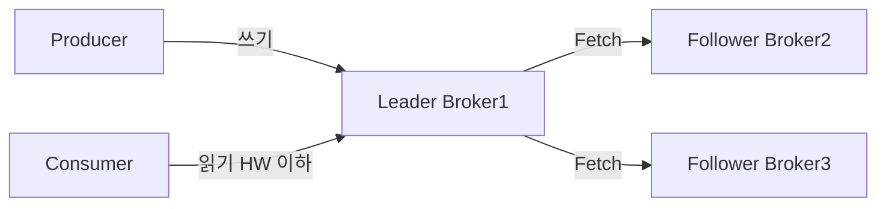
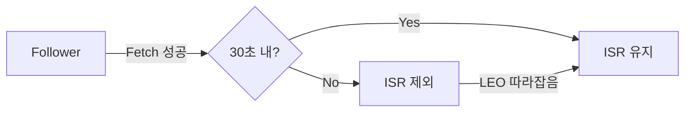
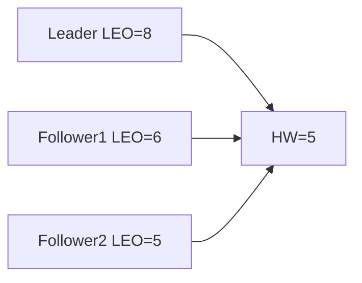
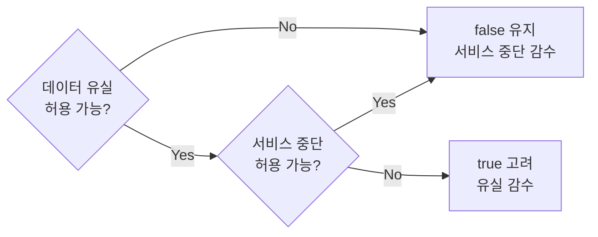
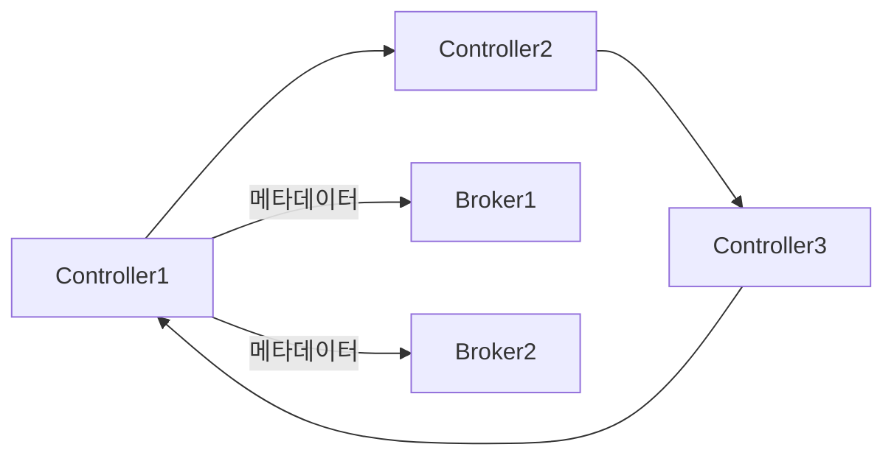

브로커 한 대가 새벽 3시에 갑자기 죽었다. 그 브로커가 리더를 맡던 파티션의 메시지는 어떻게 되는가? Kafka는 처음부터 이 질문에 답하기 위해 설계됐다. 단순히 "복제한다"가 아니라, 어떤 복제본이 신뢰할 수 있는지, 리더가 바뀔 때 로그 불일치를 어떻게 해소하는지, 그 모든 내부 프로토콜이 복잡하게 맞물려 있다. 이 글은 그 맞물림을 전부 해체한다.

## 왜 복제 내부 메커니즘을 알아야 하는가?

`acks=all`을 설정했으면 안전하다고 생각한다면 절반만 맞다. `min.insync.replicas=1`이면 리더 하나만 확인하면 되므로 사실상 `acks=1`이다. `unclean.leader.election.enable=true`면 ISR에 없는 레플리카가 리더가 돼 그동안 놓친 메시지를 모두 날린다. Leader Epoch를 모르면 Kafka 0.11 이전의 로그 발산(log divergence) 버그를 재현할 수 있다.

세 가지 설정값이 서로 어떻게 맞물리는지, 각 프로토콜이 왜 그렇게 설계됐는지를 이해해야 장애 상황에서 올바른 판단을 내릴 수 있다.

---

## 복제 구조 개요

Kafka 파티션은 하나의 리더(Leader)와 N개의 팔로워(Follower)로 구성된다. 프로듀서와 컨슈머는 오직 리더와만 통신한다. 팔로워는 리더에게 Fetch Request를 보내 주도적으로 데이터를 당겨간다(pull). 리더가 팔로워에게 밀어넣는(push) 구조가 아니다.



팔로워가 pull하는 이유는 리더가 각 팔로워의 처리 속도를 맞출 필요가 없기 때문이다. 느린 팔로워가 있어도 리더는 자기 속도로 쓰고, 팔로워는 자신의 속도로 따라온다. 리더는 팔로워가 보내는 Fetch Request의 offset을 보고 얼마나 뒤처졌는지만 추적한다.

---

## ISR (In-Sync Replicas) 메커니즘

### ISR이 무엇을 보장하는가

ISR은 리더와 "충분히 동기화된" 레플리카 집합이다. 리더가 죽었을 때 ISR에 있는 레플리카만 새 리더 후보가 된다. ISR 밖의 레플리카는 리더를 놓쳤다는 뜻이고, 그 레플리카가 리더가 되면 놓친 메시지가 영구 유실된다.

ISR의 본질은 "이 집합 중 어느 브로커가 리더가 돼도 컨슈머가 이미 읽은 메시지는 반드시 존재한다"는 보장이다.

### replica.lag.time.max.ms — 왜 오프셋 기반이 아닌가

Kafka 0.9 이전에는 `replica.lag.max.messages`라는 오프셋 기반 기준이 있었다. 팔로워가 리더보다 N개 이상 뒤처지면 ISR에서 제외됐다. 이 방식의 문제는 트래픽이 폭발적으로 증가하는 순간 모든 팔로워가 순간적으로 ISR에서 빠졌다가 다시 들어오는 "ISR 스래싱(thrashing)"이 발생한다는 것이다.

예를 들어 `replica.lag.max.messages=1000`으로 설정했는데 프로듀서가 갑자기 초당 5000개 메시지를 보내면, 팔로워가 아무리 열심히 복제해도 잠깐 1000개를 넘어서는 순간 ISR에서 제외된다. 팔로워가 따라잡으면 다시 들어오고, 또 제외되고, 반복된다. 이는 불필요한 리더 선출 알림을 유발하고 ZooKeeper에 부하를 준다.

**0.9부터 시간 기반으로 전환한 이유:** 오프셋 차이는 메시지 크기와 트래픽 패턴에 따라 의미가 달라지지만, 시간은 절대적이다. 팔로워가 `replica.lag.time.max.ms`(기본 30초) 내에 한 번이라도 리더에게 Fetch Request를 성공적으로 보냈다면 ISR을 유지한다. 팔로워가 30초 동안 아예 응답하지 않으면 그 브로커는 장애 상태로 간주한다.



### ISR 업데이트는 누가 하는가

리더 브로커가 ISR 변경을 감지하면 ZooKeeper(또는 KRaft에서는 Controller)에 변경을 기록한다. Controller가 이 변경을 감지해 전체 브로커에 메타데이터를 전파한다. 이 과정에서 ZooKeeper 기반 클러스터는 ZooKeeper 레이턴시에 영향을 받는다.

### Spring Kafka — ISR 상태 모니터링

```java
@Configuration
public class KafkaAdminConfig {

    @Bean
    public KafkaAdmin kafkaAdmin(KafkaProperties properties) {
        return new KafkaAdmin(properties.buildAdminProperties());
    }
}

@Service
@Slf4j
public class ISRMonitorService {

    private final AdminClient adminClient;

    public ISRMonitorService(KafkaProperties properties) {
        this.adminClient = AdminClient.create(properties.buildAdminProperties());
    }

    // ISR이 replication factor보다 작은 파티션만 추출
    public List<String> findUnderReplicatedPartitions(String topicName)
            throws ExecutionException, InterruptedException {

        DescribeTopicsResult result = adminClient.describeTopics(List.of(topicName));
        Map<String, TopicDescription> descriptions = result.all().get();

        return descriptions.values().stream()
            .flatMap(td -> td.partitions().stream())
            .filter(p -> p.isr().size() < p.replicas().size())
            .map(p -> topicName + "-" + p.partition()
                + " ISR=" + p.isr().size()
                + "/" + p.replicas().size())
            .collect(Collectors.toList());
    }

    // ISR 축소 감지 시 알림
    @Scheduled(fixedDelay = 60_000)
    public void checkISRHealth() throws ExecutionException, InterruptedException {
        List<String> underReplicated = findUnderReplicatedPartitions("orders");
        if (!underReplicated.isEmpty()) {
            log.error("[ISR ALERT] Under-replicated partitions detected: {}", underReplicated);
            // 알림 발송 로직 (Slack, PagerDuty 등)
        }
    }
}
```

---

## High Watermark (HW) — 컨슈머가 읽을 수 있는 경계

### HW가 존재하는 이유

High Watermark는 모든 ISR 레플리카에 복제 완료된 메시지의 가장 높은 오프셋이다. 컨슈머는 HW 이하의 메시지만 읽을 수 있다. 이 제약이 없으면 다음 시나리오가 발생한다.

> 컨슈머가 리더에서 offset 10을 읽었다. 그런데 offset 10은 아직 팔로워에 복제되지 않았다. 리더가 죽고 팔로워가 새 리더가 됐다. 새 리더의 최대 offset은 9다. 컨슈머는 "내가 읽은 offset 10이 없어졌다"는 불일치를 경험한다.

HW는 이 상황을 원천 차단한다. 컨슈머에게 노출된 메시지는 반드시 모든 ISR에 존재한다.

### LEO와 HW의 차이

- **LEO (Log End Offset):** 각 레플리카가 마지막으로 기록한 오프셋 + 1. 리더와 팔로워가 각각 독립적으로 갖는다.
- **HW (High Watermark):** ISR 전체에서 가장 낮은 LEO. 컨슈머 읽기 경계.



위 그림에서 HW=5인 이유는 가장 느린 Follower2의 LEO가 5이기 때문이다. 컨슈머는 offset 0~4까지만 읽을 수 있다.

### HW 업데이트 프로토콜 — 정확한 순서

HW가 언제 어떻게 업데이트되는지가 핵심이다. 이 순서를 모르면 리더 재시작 시 HW가 일시적으로 낮아지는 현상을 설명할 수 없다.

**1단계 — 팔로워 Fetch Request:**
팔로워가 현재 자신의 LEO를 포함해 Fetch Request를 리더에게 보낸다.

```
FetchRequest {
  topicPartition: "orders-0",
  fetchOffset: 5,        // 팔로워의 현재 LEO
  maxBytes: 10485760
}
```

**2단계 — 리더 응답 + HW 전달:**
리더는 팔로워에게 데이터를 응답하면서 현재 HW 값도 함께 전달한다.

```
FetchResponse {
  records: [offset 5, 6, 7],
  highWatermark: 4       // 리더가 아는 현재 HW
}
```

**3단계 — 팔로워 LEO 업데이트:**
팔로워는 받은 데이터를 로컬에 기록하고 자신의 LEO를 8로 올린다.

**4단계 — 다음 Fetch에서 리더가 HW 업데이트:**
팔로워가 다음 Fetch Request에 `fetchOffset=8`을 보내면, 리더는 "팔로워가 offset 7까지 복제 완료했다"는 사실을 알게 된다. 이때 비로소 리더의 HW가 올라간다.

**핵심 함의:** HW 업데이트는 최소 2번의 Fetch 사이클이 필요하다. 팔로워가 데이터를 받은 시점이 아니라, 다음 Fetch Request로 "나 받았음"을 리더에게 알려준 시점에 HW가 올라간다.

### Spring Kafka — HW 지연 관찰

```java
@Service
@Slf4j
public class HWLagMonitorService {

    private final AdminClient adminClient;
    private final KafkaConsumer<String, String> consumer;

    // 리더 LEO와 HW의 차이 = 아직 컨슈머에 노출 안 된 메시지 수
    public Map<TopicPartition, Long> getHWLag(String topic) {
        // ListOffsets로 LEO(latest) 조회
        Map<TopicPartition, OffsetSpec> latestQuery = new HashMap<>();
        Map<TopicPartition, OffsetSpec> hwQuery = new HashMap<>();

        // 실제로는 KafkaConsumer.endOffsets()가 HW를 반환한다
        // (리더의 LEO가 아닌 HW — 컨슈머가 읽을 수 있는 최대값)
        Map<TopicPartition, Long> hwOffsets = consumer.endOffsets(
            consumer.partitionsFor(topic).stream()
                .map(pi -> new TopicPartition(pi.topic(), pi.partition()))
                .collect(Collectors.toList())
        );

        log.info("HW offsets by partition: {}", hwOffsets);
        return hwOffsets;
    }
}
```

`KafkaConsumer.endOffsets()`가 실제로 반환하는 값이 HW임을 알아두는 것이 중요하다. 리더의 LEO(실제 마지막 쓰기 offset)가 아니다.

---

## Replication Protocol — Fetch Request 내부 동작

### 팔로워 Fetch 루프

팔로워는 내부적으로 `ReplicaFetcherThread`를 실행한다. 이 스레드가 무한 루프로 리더에게 Fetch Request를 보내고 데이터를 받아 로컬 로그에 기록한다.

```
while (true) {
    fetchOffset = localLEO                  // 내 현재 LEO부터 요청
    response = leader.fetch(fetchOffset)    // 리더에서 당겨옴
    localLog.append(response.records)       // 로컬에 기록
    localLEO += response.records.size()     // 내 LEO 업데이트
    localHW = min(response.highWatermark,   // HW 업데이트
                  localLEO)
    sleep(replica.fetch.wait.max.ms)        // 데이터 없으면 대기
}
```

`replica.fetch.wait.max.ms`(기본 500ms)는 리더에 새 데이터가 없을 때 팔로워가 기다리는 시간이다. Long polling 방식이다. 데이터가 오면 즉시 응답하고, 없으면 최대 500ms 후에 빈 응답을 보낸다. 이 값을 너무 낮추면 리더에 불필요한 요청이 많아지고, 너무 높이면 복제 지연이 증가한다.

### num.replica.fetchers — 병렬 복제의 핵심

`num.replica.fetchers`(기본 1)는 각 브로커에서 실행되는 복제 페치 스레드 수다. 기본값 1이면 하나의 스레드가 이 브로커가 팔로워인 모든 파티션을 순서대로 페치한다. 파티션이 많거나 메시지 크기가 크면 복제 지연이 심각해진다.

실무에서는 4~8로 설정한다. CPU 코어 수, 네트워크 대역폭, 파티션 수를 고려해 결정한다.

```properties
# 브로커 설정 (server.properties)
num.replica.fetchers=4                    # 기본 1 → 4로 증가
replica.fetch.min.bytes=1                 # 최소 fetch 바이트 (1이면 즉시 응답)
replica.fetch.max.bytes=10485760          # 최대 fetch 크기 (10MB)
replica.fetch.wait.max.ms=500             # 데이터 없을 때 대기 시간
replica.socket.receive.buffer.bytes=65536 # 소켓 수신 버퍼
```

### 오프셋 추적 — 리더가 팔로워를 어떻게 감시하는가

리더는 각 팔로워의 마지막 Fetch Request offset을 `RemoteLeaderEndPoint`에 기록한다. 팔로워가 마지막으로 요청한 offset과 현재 시각을 함께 저장해서 `replica.lag.time.max.ms` 초과 여부를 판단한다.

```java
// Kafka 내부 구조 (개념 설명용)
class PartitionState {
    Map<Int, ReplicaState> followerStates; // brokerId -> 상태

    class ReplicaState {
        long lastFetchLeaderLogEndOffset;  // 마지막 fetch에서 요청한 offset
        long lastFetchTimeMs;              // 마지막 fetch 시각
        long lastCaughtUpTimeMs;           // 마지막으로 LEO를 따라잡은 시각

        boolean isInSync(long lagTimeMs) {
            return System.currentTimeMillis() - lastCaughtUpTimeMs < lagTimeMs;
        }
    }
}
```

---

## Leader Epoch — 로그 발산 방지의 핵심

### 왜 Leader Epoch가 필요한가

Kafka 0.11 이전, HW만으로 일관성을 보장하던 시절에 다음 시나리오가 가능했다.

**A가 리더, B가 팔로워인 상황:**

1. A가 offset 0, 1, 2를 기록. HW=2.
2. B는 offset 0, 1까지 복제. HW를 A에서 응답으로 받기 전에 B가 재시작.
3. B 재시작 시 HW=1로 truncate (자신의 HW 기준). offset 1을 유지.
4. A 장애. B가 새 리더로 선출.
5. B는 offset 1까지만 있다. HW=1.
6. A가 재시작. A는 자신의 HW였던 2를 기준으로 truncate.
7. A의 offset 2가 사라졌는데 B도 offset 2가 없다 → offset 2 영구 유실.

또 다른 시나리오는 로그 발산(divergence)이다.

**B가 먼저 리더가 되고 새 메시지를 기록한 뒤 A가 재시작하면:**

- A의 offset 2: 메시지 M1 (옛날 리더 A가 기록한 것)
- B의 offset 2: 메시지 M2 (새 리더 B가 기록한 것)

같은 offset에 다른 내용. 로그 발산 상태.

### Leader Epoch 동작 원리

Leader Epoch는 리더 선출마다 단조 증가하는 정수 번호다. 각 브로커는 `leader-epoch-checkpoint` 파일에 `(epoch, startOffset)` 쌍을 기록한다.

```
# leader-epoch-checkpoint 예시
0 (epoch 0: Broker1이 리더, offset 0부터 시작)
1 (epoch 1: Broker2가 리더, offset 6부터 시작)
2 (epoch 2: Broker1이 다시 리더, offset 11부터 시작)
```

브로커가 재시작할 때 현재 리더에게 `OffsetsForLeaderEpochRequest`를 보낸다.

```
Request: "내 마지막 epoch는 0이었고, 그때 내 LEO는 5였다."
Response: "Epoch 0은 offset 5까지가 맞다." (혹은 "offset 3까지만이다.")
```

이 응답을 기반으로 자신의 로그를 안전하게 truncate한다. HW 기반이 아니라 Epoch 기반이므로 이전 리더가 기록한 메시지와 새 리더가 기록한 메시지를 정확히 구분할 수 있다.

### Leader Epoch 적용 시나리오

```
Epoch 0: Broker A 리더, offset 0~4 기록
  A의 LEO=5, B의 LEO=4
  A 장애 → B가 Epoch 1 리더로 선출

Epoch 1: Broker B 리더
  B가 offset 4에 새 메시지 기록 (자신의 LEO 기준으로)
  B의 LEO=5, Epoch 1

A 재시작:
  A → B: "Epoch 0에서 내 LEO는 5였다"
  B → A: "Epoch 0은 offset 4까지다" (B가 알고 있는 Epoch 0의 끝)
  A: offset 5를 truncate
  A: Epoch 1의 데이터를 B에서 페치해 동기화
```

HW 기반이었다면 A가 HW=3을 기준으로 offset 4, 5를 truncate했을 텐데, 실제로 offset 4는 B에서 유효한 데이터다. Leader Epoch 덕분에 정확한 truncate 포인트를 찾는다.

### Spring Kafka 환경에서의 함의

```java
@Configuration
public class ProducerConfig {

    @Bean
    public ProducerFactory<String, Object> producerFactory() {
        Map<String, Object> props = new HashMap<>();
        props.put(ProducerConfig.BOOTSTRAP_SERVERS_CONFIG, "kafka1:9092,kafka2:9092,kafka3:9092");
        props.put(ProducerConfig.ACKS_CONFIG, "all");
        // 멱등성 활성화 시 내부적으로 Producer Epoch 사용
        // Kafka의 Leader Epoch와 별개지만 같은 원리 (단조 증가 epoch로 중복/순서 보장)
        props.put(ProducerConfig.ENABLE_IDEMPOTENCE_CONFIG, true);
        props.put(ProducerConfig.MAX_IN_FLIGHT_REQUESTS_PER_CONNECTION, 5);
        props.put(ProducerConfig.RETRIES_CONFIG, Integer.MAX_VALUE);
        return new DefaultKafkaProducerFactory<>(props);
    }
}
```

`enable.idempotence=true`를 설정하면 프로듀서도 Epoch 개념을 사용한다. 브로커가 프로듀서에게 Epoch를 할당하고, 재시도 시 같은 Epoch+SequenceNumber를 보내면 중복으로 거부한다. Leader Epoch와는 다른 레이어지만 같은 "단조 증가 epoch으로 상태를 구분한다"는 원리다.

---

## Unclean Leader Election — 가용성 vs 내구성의 본질적 트레이드오프

### 무엇이 "unclean"인가

ISR이 완전히 비었을 때(리더 포함 모든 ISR이 다운), ISR에 없는 팔로워(out-of-sync replica)를 리더로 선출하는 것이다. out-of-sync 레플리카는 정의상 리더의 일부 메시지를 놓쳤다. 그 레플리카가 리더가 되는 순간, 놓쳤던 메시지들은 존재 자체가 지워진다.

### 왜 이 옵션이 존재하는가

ISR이 모두 다운되면 `unclean.leader.election.enable=false`(기본값) 상태에서 해당 파티션은 완전히 사용 불가 상태가 된다. 컨슈머도 읽지 못하고 프로듀서도 쓰지 못한다. ISR이 복구될 때까지 서비스 자체가 멈춘다.

일부 시스템에서는 이 상황이 데이터 유실보다 훨씬 나쁠 수 있다. 로그 집계 시스템이라면 몇 개 이벤트 유실보다 서비스 전체 중단이 더 큰 문제다.

### 실무 결정 프레임워크



| 시스템 유형 | unclean 설정 | 이유 |
|-------------|-------------|------|
| 금융 거래, 결제, 주문 | `false` | 메시지 유실은 감사/법적 문제. 중단이 낫다 |
| 재고, 재무 데이터 | `false` | 숫자 하나가 틀리면 전체 정합성 붕괴 |
| 로그 집계, 클릭스트림 | `true` 가능 | 일부 이벤트 유실은 통계적으로 허용 가능 |
| 메트릭, 모니터링 | `true` 가능 | 모니터링 다운이 더 위험 |
| 알림, 캐시 무효화 | 상황에 따라 | 중복 알림 vs 누락 알림 중 선택 |

### Spring Kafka — unclean election 감지

```java
@Service
@Slf4j
public class LeaderElectionMonitorService {

    private final AdminClient adminClient;

    // 파티션의 현재 리더가 preferred replica인지 확인
    // preferred replica: Replicas 목록의 첫 번째 브로커
    // unclean election 후 non-preferred 브로커가 리더일 수 있음
    public void checkPreferredLeaderBalance(String topic)
            throws ExecutionException, InterruptedException {

        DescribeTopicsResult result = adminClient.describeTopics(List.of(topic));
        Map<String, TopicDescription> descriptions = result.all().get();

        descriptions.values().forEach(td ->
            td.partitions().forEach(p -> {
                int leaderId = p.leader().id();
                int preferredLeaderId = p.replicas().get(0).id();
                if (leaderId != preferredLeaderId) {
                    log.warn("[LEADER IMBALANCE] Topic={}, Partition={}, "
                        + "Leader={}, Preferred={}. "
                        + "Possible unclean election occurred.",
                        td.name(), p.partition(), leaderId, preferredLeaderId);
                }
            })
        );
    }
}
```

---

## min.insync.replicas — acks=all의 실질적 보장

### acks=all만으로는 불충분한 이유

`acks=all`의 정의는 "ISR에 있는 모든 레플리카가 확인"이다. ISR이 리더 하나만 남으면 리더 하나만 확인하면 된다. 즉 `acks=all`이 항상 의미 있는 내구성을 보장하지는 않는다.

`min.insync.replicas`는 "ISR에 최소 N개가 있어야 쓰기를 허용한다"는 조건이다. 이 값을 통해 `acks=all`에 실질적인 의미를 부여한다.

### replication.factor - 1이 권장 값인 수학적 이유

`replication.factor=3`, `min.insync.replicas=2`가 표준 권장 설정인 이유:

- ISR이 3개일 때: 정상 운영. 브로커 1대 장애에도 ISR=2 유지.
- ISR이 2개일 때: min.insync=2 충족. 계속 쓰기 가능. 다만 여유가 없음.
- ISR이 1개일 때: min.insync=2 미충족. 쓰기 거부. `NotEnoughReplicasException`.

만약 `min.insync.replicas=3`으로 설정하면 브로커 1대만 다운돼도 ISR=2가 돼서 쓰기가 불가능해진다. 이는 가용성을 지나치게 낮춘다.

`replication.factor - 1`은 "브로커 한 대 장애는 허용하되, 두 대 이상 장애 시 안전을 위해 쓰기를 거부한다"는 균형점이다.

### NotEnoughReplicasException 처리

```java
@Service
@Slf4j
public class ResilientKafkaProducerService {

    private final KafkaTemplate<String, Object> kafkaTemplate;

    public void sendWithFallback(String topic, String key, Object message) {
        try {
            SendResult<String, Object> result = kafkaTemplate
                .send(topic, key, message)
                .get(5, TimeUnit.SECONDS);

            log.info("Sent to partition={}, offset={}",
                result.getRecordMetadata().partition(),
                result.getRecordMetadata().offset());

        } catch (ExecutionException e) {
            Throwable cause = e.getCause();

            if (cause instanceof NotEnoughReplicasException) {
                // ISR이 min.insync.replicas 미만
                // 이 순간 강제로 쓰면 내구성 보장 불가
                log.error("[CRITICAL] Not enough ISR replicas for topic={}. "
                    + "Writing to fallback store instead.", topic);
                // 폴백: DB, 로컬 큐, 다른 토픽 등
                fallbackStore.save(key, message);

            } else if (cause instanceof NotEnoughReplicasAfterAppendException) {
                // 리더에 쓰는 데 성공했지만 팔로워 복제 전 ISR 축소
                // 이 메시지는 유실 위험 있음
                log.error("[WARNING] Message appended but ISR shrunk. "
                    + "Possible data loss risk for key={}", key);

            } else {
                throw new KafkaSendException("Failed to send message", cause);
            }
        } catch (TimeoutException e) {
            log.error("Kafka send timeout for topic={}", topic);
            throw new KafkaSendException("Send timeout", e);
        } catch (InterruptedException e) {
            Thread.currentThread().interrupt();
            throw new KafkaSendException("Interrupted", e);
        }
    }
}
```

### 토픽별 min.insync.replicas 설정

```java
@Configuration
public class KafkaTopicConfig {

    @Bean
    public NewTopic ordersTopic() {
        // 중요 토픽: min.insync.replicas=2
        return TopicBuilder.name("orders")
            .partitions(6)
            .replicas(3)
            .config(TopicConfig.MIN_IN_SYNC_REPLICAS_CONFIG, "2")
            .build();
    }

    @Bean
    public NewTopic metricsTopic() {
        // 메트릭 토픽: 가용성 우선, min.insync.replicas=1
        return TopicBuilder.name("app.metrics")
            .partitions(3)
            .replicas(3)
            .config(TopicConfig.MIN_IN_SYNC_REPLICAS_CONFIG, "1")
            .build();
    }

    @Bean
    public NewTopic auditTopic() {
        // 감사 로그: 최고 내구성, min.insync.replicas=3
        // 단, 브로커 1대 장애 시 쓰기 불가 감수
        return TopicBuilder.name("audit.log")
            .partitions(3)
            .replicas(3)
            .config(TopicConfig.MIN_IN_SYNC_REPLICAS_CONFIG, "3")
            .config(TopicConfig.UNCLEAN_LEADER_ELECTION_ENABLE_CONFIG, "false")
            .build();
    }
}
```

---

## Preferred Replica Election — 리더 쏠림 방지

### 왜 리더가 특정 브로커에 쏠리는가

Kafka는 파티션 생성 시 Replicas 목록의 첫 번째 브로커를 "preferred leader"로 지정한다. 브로커가 재시작되거나 unclean election이 발생하면 비선호 브로커가 리더를 맡게 된다. 이런 상황이 쌓이면 특정 브로커에 리더가 몰려 부하 불균형이 생긴다.

**왜 리더 쏠림이 성능에 영향을 미치는가:**
- 프로듀서와 컨슈머는 리더와만 통신하므로, 리더가 많은 브로커에 요청이 집중된다.
- 복제 부하도 리더에 집중된다(팔로워가 리더에게 Fetch Request를 보내므로).
- 리더 브로커의 네트워크 대역폭, CPU, I/O가 먼저 포화된다.

### auto.leader.rebalance.enable

`auto.leader.rebalance.enable=true`(기본값)로 설정하면 Controller가 주기적으로 리더 분포를 확인해 불균형 시 preferred leader로 다시 선출한다. `leader.imbalance.check.interval.seconds`(기본 300초)마다 체크한다.

`leader.imbalance.per.broker.percentage`(기본 10%)를 초과하는 불균형이 감지되면 자동으로 preferred replica election을 트리거한다.

**주의:** 자동 리밸런싱은 리더 전환을 수반하므로 잠깐의 컨슈머 Lag이 발생할 수 있다. 트래픽 피크 시간에 리밸런싱이 트리거되지 않도록 `leader.imbalance.check.interval.seconds`를 야간으로 설정하거나, 자동을 끄고 수동으로 실행하는 것이 안전하다.

### Spring Kafka — 수동 리더 리밸런싱

```java
@Service
@Slf4j
public class LeaderRebalanceService {

    private final AdminClient adminClient;

    // 특정 토픽의 preferred replica election 트리거
    public void triggerPreferredLeaderElection(String topic)
            throws ExecutionException, InterruptedException {

        DescribeTopicsResult describeResult = adminClient.describeTopics(List.of(topic));
        Map<String, TopicDescription> descriptions = describeResult.all().get();

        Set<TopicPartition> partitions = descriptions.values().stream()
            .flatMap(td -> td.partitions().stream()
                .map(p -> new TopicPartition(td.name(), p.partition())))
            .collect(Collectors.toSet());

        ElectLeadersResult electResult = adminClient.electLeaders(
            ElectionType.PREFERRED,
            partitions
        );

        electResult.all().get();
        log.info("Preferred leader election completed for topic={}", topic);
    }

    // 리더 불균형 감지 후 리밸런싱
    @Scheduled(cron = "0 0 3 * * *") // 새벽 3시에 실행
    public void scheduledLeaderRebalance() {
        try {
            triggerPreferredLeaderElection("orders");
            triggerPreferredLeaderElection("payments");
        } catch (Exception e) {
            log.error("Leader rebalance failed", e);
        }
    }
}
```

---

## Rack-Aware Replication — 다중 AZ 환경에서의 레플리카 배치

### rack 설정이 없으면 생기는 문제

AZ(가용 영역) 구분 없이 레플리카를 배치하면 같은 AZ의 브로커에 리더와 팔로워가 함께 배치될 수 있다. 해당 AZ 전체 장애 시 ISR이 단번에 사라진다.

### broker.rack 설정

```properties
# broker1 server.properties (AZ-A)
broker.rack=ap-northeast-2a

# broker2 server.properties (AZ-B)
broker.rack=ap-northeast-2b

# broker3 server.properties (AZ-C)
broker.rack=ap-northeast-2c
```

`broker.rack`을 설정하면 Kafka Controller가 파티션 할당 시 서로 다른 rack에 레플리카를 분산시킨다. replication.factor=3이고 rack이 3개면 각 AZ에 하나씩 배치된다.

### replica.selector.class — 컨슈머 읽기 최적화

기본적으로 컨슈머는 리더에서만 읽는다. 리더가 다른 AZ에 있으면 크로스 AZ 트래픽 비용이 발생한다. Kafka 2.4부터 `RackAwareReplicaSelector`를 사용해 컨슈머가 같은 rack의 팔로워에서 읽게 할 수 있다.

```properties
# broker server.properties
replica.selector.class=org.apache.kafka.common.replica.RackAwareReplicaSelector
```

```properties
# 컨슈머 client.properties
client.rack=ap-northeast-2a  # 컨슈머가 있는 AZ
```

이 설정 시 컨슈머는 같은 AZ의 팔로워에서 읽는다. 단, HW 이하만 읽는 제약은 여전히 적용된다.

**Cross-AZ 레이턴시 고려사항:** 팔로워가 리더에서 복제하는 시간 + 컨슈머가 팔로워에서 읽는 시간. 리더에서 직접 읽는 것보다 레이턴시가 약간 높을 수 있지만, AZ 간 네트워크 비용 절감 효과가 크다.

### Spring Kafka — rack-aware consumer

```java
@Configuration
public class ConsumerConfig {

    @Value("${kafka.consumer.rack:}")
    private String consumerRack;

    @Bean
    public ConsumerFactory<String, Object> consumerFactory() {
        Map<String, Object> props = new HashMap<>();
        props.put(ConsumerConfig.BOOTSTRAP_SERVERS_CONFIG, "kafka1:9092,kafka2:9092,kafka3:9092");
        props.put(ConsumerConfig.GROUP_ID_CONFIG, "order-processor");
        props.put(ConsumerConfig.AUTO_OFFSET_RESET_CONFIG, "earliest");
        props.put(ConsumerConfig.ENABLE_AUTO_COMMIT_CONFIG, false);

        // rack-aware 읽기 설정 (같은 AZ 팔로워에서 읽기)
        if (!consumerRack.isEmpty()) {
            props.put("client.rack", consumerRack);
        }

        return new DefaultKafkaConsumerFactory<>(props,
            new StringDeserializer(),
            new JsonDeserializer<>(Object.class));
    }
}
```

```yaml
# application.yml (환경별 설정)
kafka:
  consumer:
    rack: ${AWS_AVAILABILITY_ZONE:}  # 환경 변수에서 AZ 자동 주입
```

---

## Controller Failover — KRaft vs ZooKeeper

### Controller의 역할

Kafka 클러스터에는 반드시 하나의 Controller 브로커가 존재한다. Controller는 다음을 담당한다.

- ISR 변경 감지 및 전파
- 리더 선출 결정
- 브로커 장애 감지
- 파티션 메타데이터 관리

Controller가 죽으면 새 Controller가 선출될 때까지 리더 선출이 불가능하다. ISR에 있는 모든 ISR 레플리카가 다운돼도 Controller가 없으면 새 리더를 뽑지 못한다.

### ZooKeeper 기반 Controller 선출

ZooKeeper 기반에서 Controller 선출은 ZooKeeper의 ephemeral znode를 이용한다. 모든 브로커가 `/controller` znode를 먼저 생성하려 경쟁한다. 성공한 브로커가 Controller가 된다. Controller 브로커가 죽으면 ephemeral znode가 사라지고, 나머지 브로커들이 다시 경쟁한다.

**ZooKeeper 기반의 한계:**
- ZooKeeper가 단일 장애점이 된다.
- 모든 메타데이터 변경이 ZooKeeper를 거쳐야 한다.
- 대규모 클러스터에서 ZooKeeper 레이턴시가 Controller 성능 병목이 된다.
- Controller 장애 복구 시간이 ZooKeeper 세션 타임아웃(기본 6초)에 의존한다.

### KRaft (Kafka without ZooKeeper)

KRaft는 Kafka 자체에 Raft 합의 알고리즘을 구현해 ZooKeeper 의존성을 제거한다. Kafka 3.3부터 프로덕션 사용 가능, Kafka 4.0에서 ZooKeeper 지원 제거.



KRaft에서 Controller는 별도의 voter 집합을 구성한다(또는 브로커 겸용 가능). Raft 리더가 Controller 역할을 하고, Raft로 메타데이터 일관성을 보장한다.

**KRaft의 장점:**
- ZooKeeper 제거로 운영 복잡도 감소
- 메타데이터 변경 레이턴시 감소 (Raft 내부 합의 vs ZooKeeper 왕복)
- Controller 장애 복구 속도 향상 (Raft election이 ZooKeeper ephemeral node보다 빠름)
- 파티션 수 확장성 향상 (ZooKeeper는 수만 파티션에서 병목 발생)

### Spring Kafka — KRaft 클러스터 연결

```java
@Configuration
public class KRaftKafkaConfig {

    // KRaft 클러스터는 브로커 연결 방식이 동일
    // bootstrap.servers만 변경하면 됨
    @Bean
    public KafkaAdmin kafkaAdmin() {
        Map<String, Object> configs = new HashMap<>();
        // KRaft에서 Controller는 별도 포트가 아닌 동일 bootstrap으로 접근
        configs.put(AdminClientConfig.BOOTSTRAP_SERVERS_CONFIG,
            "kafka1:9092,kafka2:9092,kafka3:9092");
        return new KafkaAdmin(configs);
    }

    // KRaft 클러스터 상태 확인
    @Bean
    public ApplicationRunner kraftStatusChecker(AdminClient adminClient) {
        return args -> {
            DescribeClusterResult cluster = adminClient.describeCluster();
            Node controller = cluster.controller().get();
            log.info("Current controller: brokerId={}, host={}",
                controller.id(), controller.host());
        };
    }
}
```

### 메타데이터 전파 — Controller가 브로커에 알리는 방식

Controller는 ISR 변경, 리더 선출 결과를 `LeaderAndIsrRequest`로 모든 관련 브로커에 전송한다. ZooKeeper 기반에서는 Watch 메커니즘으로 브로커가 변경을 감지하지만, KRaft에서는 Controller가 능동적으로 메타데이터를 Push한다.

```
Controller → Broker1 (LeaderAndIsrRequest):
  "orders-0의 새 리더는 Broker2, ISR은 {2,3}이다"

Controller → Broker2 (LeaderAndIsrRequest):
  "orders-0의 리더가 됐다. ISR={2,3}"

Controller → Broker3 (UpdateMetadataRequest):
  "orders-0의 리더는 Broker2"
```

---

## 완전한 설정 예시 — Spring Boot + Kafka

### application.yml

```yaml
spring:
  kafka:
    bootstrap-servers: kafka1:9092,kafka2:9092,kafka3:9092
    producer:
      acks: all
      retries: 2147483647
      properties:
        enable.idempotence: true
        max.in.flight.requests.per.connection: 5
        delivery.timeout.ms: 120000
        request.timeout.ms: 30000
        linger.ms: 5
        batch.size: 65536
    consumer:
      group-id: order-processor
      auto-offset-reset: earliest
      enable-auto-commit: false
      max-poll-records: 500
      properties:
        max.poll.interval.ms: 300000
        session.timeout.ms: 45000
        heartbeat.interval.ms: 15000
    listener:
      ack-mode: manual_immediate
      concurrency: 3
```

### Producer 설정 클래스

```java
@Configuration
@Slf4j
public class KafkaProducerConfig {

    @Bean
    public ProducerFactory<String, Object> producerFactory(KafkaProperties props) {
        DefaultKafkaProducerFactory<String, Object> factory =
            new DefaultKafkaProducerFactory<>(props.buildProducerProperties());

        // 프로듀서 인터셉터: 메시지 전송 결과 추적
        factory.addPostProcessor(producer -> {
            log.info("Producer created: {}", producer.metrics()
                .entrySet().stream()
                .filter(e -> e.getKey().name().equals("record-error-rate"))
                .findFirst()
                .map(e -> e.getValue().metricValue())
                .orElse("N/A"));
            return producer;
        });

        return factory;
    }

    @Bean
    public KafkaTemplate<String, Object> kafkaTemplate(
            ProducerFactory<String, Object> producerFactory) {

        KafkaTemplate<String, Object> template = new KafkaTemplate<>(producerFactory);

        // 전역 전송 결과 콜백
        template.setObservationEnabled(true);
        template.setProducerListener(new ProducerListener<>() {
            @Override
            public void onError(ProducerRecord<String, Object> record,
                                RecordMetadata metadata,
                                Exception exception) {
                if (exception instanceof NotEnoughReplicasException) {
                    log.error("[ISR CRITICAL] NotEnoughReplicas for topic={}, key={}",
                        record.topic(), record.key());
                } else {
                    log.error("Send failed for topic={}, key={}",
                        record.topic(), record.key(), exception);
                }
            }
        });

        return template;
    }
}
```

### Consumer 설정 클래스

```java
@Configuration
public class KafkaConsumerConfig {

    @Bean
    public ConcurrentKafkaListenerContainerFactory<String, Object>
            kafkaListenerContainerFactory(
                ConsumerFactory<String, Object> consumerFactory) {

        ConcurrentKafkaListenerContainerFactory<String, Object> factory =
            new ConcurrentKafkaListenerContainerFactory<>();

        factory.setConsumerFactory(consumerFactory);
        factory.setConcurrency(3);
        factory.getContainerProperties().setAckMode(
            ContainerProperties.AckMode.MANUAL_IMMEDIATE);

        // 리밸런싱 리스너: 파티션 할당/해제 추적
        factory.getContainerProperties().setConsumerRebalanceListener(
            new ConsumerAwareRebalanceListener() {
                @Override
                public void onPartitionsAssigned(Consumer<?, ?> consumer,
                                                  Collection<TopicPartition> partitions) {
                    log.info("Partitions assigned: {}", partitions);
                }

                @Override
                public void onPartitionsRevoked(Collection<TopicPartition> partitions) {
                    log.warn("Partitions revoked: {}. Flushing pending offsets.", partitions);
                }
            }
        );

        // 에러 핸들러: 복제 관련 에러 처리
        factory.setCommonErrorHandler(new DefaultErrorHandler(
            new DeadLetterPublishingRecoverer(/* kafkaTemplate */),
            new FixedBackOff(1000L, 3L)
        ));

        return factory;
    }
}
```

### Consumer 서비스

```java
@Service
@Slf4j
public class OrderConsumerService {

    @KafkaListener(
        topics = "orders",
        groupId = "order-processor",
        containerFactory = "kafkaListenerContainerFactory"
    )
    public void processOrder(
            @Payload OrderEvent event,
            @Header(KafkaHeaders.RECEIVED_PARTITION) int partition,
            @Header(KafkaHeaders.OFFSET) long offset,
            @Header(KafkaHeaders.RECEIVED_TOPIC) String topic,
            Acknowledgment acknowledgment) {

        log.info("Processing: topic={}, partition={}, offset={}, orderId={}",
            topic, partition, offset, event.getOrderId());

        try {
            orderService.process(event);
            // 처리 완료 후 수동 커밋 — 멱등성 처리 전제
            acknowledgment.acknowledge();

        } catch (DuplicateOrderException e) {
            // 멱등성: 이미 처리된 주문 → 커밋하고 넘어감
            log.warn("Duplicate order detected, skipping. orderId={}", event.getOrderId());
            acknowledgment.acknowledge();

        } catch (Exception e) {
            // 처리 실패 → nack, 재시도 또는 DLQ
            log.error("Order processing failed. orderId={}", event.getOrderId(), e);
            acknowledgment.nack(Duration.ofSeconds(5));
        }
    }
}
```

---

## 극한 시나리오

### 시나리오 1: 동시 다중 브로커 장애 + ISR 붕괴

**상황:** 운영 중 네트워크 스위치 장애로 AZ-B, AZ-C의 브로커 4대가 동시에 내려갔다. `min.insync.replicas=2`, `replication.factor=3`, `unclean.leader.election.enable=false`.

**타임라인:**

```
T+0s:  AZ-B, AZ-C 스위치 장애. Broker2~5 응답 없음.
T+5s:  replica.lag.time.max.ms 미충족 시작.
T+30s: Broker2~5가 ISR에서 제거됨. ISR={Broker1만 남음}
T+30s: Broker1이 홀로 리더. min.insync.replicas=2 미충족.
T+31s: 프로듀서 모든 쓰기 → NotEnoughReplicasException.
T+31s: 컨슈머는 기존 HW까지 계속 읽기 가능 (읽기는 차단 안 됨).
T+60s: 알림 시스템 "UnderReplicatedPartitions > 0" 발동.
T+90s: On-call 엔지니어 확인 시작.
```

**대응 방법:**

```java
// 1. 현재 ISR 상태 긴급 확인
public void emergencyISRCheck() throws Exception {
    adminClient.describeTopics(criticalTopics).all().get()
        .forEach((topic, desc) ->
            desc.partitions().forEach(p ->
                log.error("EMERGENCY CHECK: topic={}, partition={}, "
                    + "isr={}/{}, leader={}",
                    topic, p.partition(),
                    p.isr().size(), p.replicas().size(),
                    p.leader() != null ? p.leader().id() : "NONE")));
}

// 2. 쓰기 차단 중 메시지 로컬 버퍼링
// (Circuit Breaker 패턴 적용)
@CircuitBreaker(name = "kafka-producer",
    fallbackMethod = "bufferToLocalQueue")
public void sendToKafka(String topic, String key, Object message) {
    kafkaTemplate.send(topic, key, message).get(5, TimeUnit.SECONDS);
}

public void bufferToLocalQueue(String topic, String key,
                                Object message, Exception e) {
    log.warn("Kafka unavailable, buffering locally. topic={}", topic);
    localQueue.offer(new PendingMessage(topic, key, message));
}
```

**복구 후 처리:**

```java
// AZ 복구 후 로컬 버퍼 재전송
@Scheduled(fixedDelay = 10_000)
public void drainLocalBuffer() {
    if (isKafkaHealthy()) {
        PendingMessage msg;
        while ((msg = localQueue.poll()) != null) {
            sendToKafka(msg.topic(), msg.key(), msg.payload());
        }
    }
}
```

### 시나리오 2: Leader Epoch 불일치로 인한 로그 발산

**상황:** 브로커 재시작 후 `LogSegment`가 부분적으로 손상됐고, Leader Epoch checkpoint 파일도 일부 유실됐다.

**증상:**

```
[ERROR] Leader epoch validation failed for orders-0.
Expected epoch=5, found epoch=3 at offset 10042.
Log divergence detected. Initiating truncation to last stable epoch.
```

**Kafka 내부 복구 과정:**

```
1. 브로커 재시작 시 LogRecoveryPoint까지 로그 검증.
2. Leader Epoch checkpoint 읽기 실패 → epoch=0부터 재구성 시도.
3. 현재 리더에게 OffsetsForLeaderEpochRequest 전송.
4. 리더 응답: "epoch 3은 offset 9500까지 유효"
5. 로컬 로그를 offset 9500으로 truncate.
6. offset 9501부터 리더에서 재페치.
7. ISR 재합류.
```

**모니터링 포인트:**

```java
// JMX 메트릭 수집
@Bean
public MeterRegistryCustomizer<MeterRegistry> kafkaMetrics() {
    return registry -> {
        // 로그 truncation 횟수 추적
        Gauge.builder("kafka.log.truncations",
            this, obj -> getJmxMetric(
                "kafka.log:type=LogManager,name=LogTruncations"))
            .register(registry);

        // Leader Epoch 변경 빈도 (잦으면 불안정한 클러스터)
        Gauge.builder("kafka.controller.leader.elections",
            this, obj -> getJmxMetric(
                "kafka.controller:type=ControllerStats,name=LeaderElectionRateAndTimeMs"))
            .register(registry);
    };
}
```

### 시나리오 3: min.insync.replicas와 Transactional Producer 조합

**상황:** 트랜잭션 프로듀서 사용 중 ISR 축소로 `min.insync.replicas` 미충족.

```java
@Service
@Slf4j
public class TransactionalOrderService {

    @Autowired
    private KafkaTemplate<String, Object> kafkaTemplate;

    @Transactional("kafkaTransactionManager")
    public void processOrderWithTransaction(Order order) {
        try {
            // 트랜잭션 내에서 여러 토픽에 원자적 쓰기
            kafkaTemplate.send("orders", order.getId(), order);
            kafkaTemplate.send("inventory.reservations",
                order.getId(), new InventoryReservation(order));
            kafkaTemplate.send("payment.requests",
                order.getId(), new PaymentRequest(order));

            // min.insync.replicas 미충족 시 여기서 NotEnoughReplicasException
            // 트랜잭션 전체 롤백 → 세 토픽 모두 쓰기 취소
            // 컨슈머는 트랜잭션이 커밋된 메시지만 읽음 (isolation.level=read_committed)

        } catch (NotEnoughReplicasException e) {
            log.error("Transaction aborted due to ISR shortage. orderId={}",
                order.getId());
            // 트랜잭션 롤백 → 부분 쓰기 없음
            throw e;
        }
    }
}
```

트랜잭션 + `isolation.level=read_committed` 조합에서 ISR 장애는 트랜잭션 전체를 원자적으로 실패시킨다. 부분 커밋이 없으므로 데이터 정합성은 보장되지만, 클라이언트가 재시도 로직을 갖춰야 한다.

### 시나리오 4: Controller 장애 중 리더 선출 불가

**상황:** KRaft Controller 3대 중 2대가 동시에 다운. Raft 쿼럼(2/3) 미충족.

```
T+0s:  Controller2, Controller3 장애.
T+0s:  Controller1이 Raft leader이지만 follower 0개.
T+5s:  Raft election 시작. Controller1은 자신만 있으므로
       과반수(2/3) 확보 불가.
T+5s:  KRaft: no quorum. Controller 기능 정지.
T+5s:  기존 브로커는 기존 메타데이터로 운영 계속
       (이미 알고 있는 리더/ISR 정보는 유지).
T+5s:  신규 리더 선출 불가. 토픽 생성 불가.
T+5s:  기존 프로듀서/컨슈머는 브로커 직접 통신이므로 영향 없음.
       단, 브로커 장애 발생 시 리더 선출 불가 → 파티션 사용 불가.
```

**핵심 교훈:** Controller(ZooKeeper 기반이든 KRaft든) 장애는 기존 운영에는 즉각적인 영향이 없지만, 그 상태에서 브로커 장애가 추가로 발생하면 복구 불가 상태가 된다. Controller 고가용성은 별도로 확보해야 한다.

---

## 면접 포인트 5가지

<details>
<summary>펼쳐보기</summary>


### Q1. ISR 판단 기준이 오프셋 기반에서 시간 기반으로 바뀐 이유는?

**핵심 답변:** Kafka 0.9부터 `replica.lag.max.messages`(오프셋 기반)를 폐기하고 `replica.lag.time.max.ms`(시간 기반)로 전환했다. 이유는 두 가지다.

첫째, 오프셋 기반은 트래픽 폭발 시 ISR 스래싱이 발생한다. 프로듀서가 갑자기 초당 5000개 메시지를 보내면 팔로워가 정상적으로 복제하고 있어도 순간적으로 임계치를 초과해 ISR에서 빠진다. 이는 불필요한 리더 선출과 ZooKeeper 부하를 유발한다.

둘째, 오프셋 차이의 의미는 메시지 크기와 프로듀서 속도에 따라 달라진다. 메시지가 크면 100개 차이도 크고, 작으면 10000개 차이도 작다. 시간은 절대적이다. 30초 동안 응답이 없으면 그 브로커는 실제로 문제가 있다.

**심화:** 시간 기반도 GC pause 상황에서 오탐이 발생할 수 있다. JVM GC로 30초 이상 정지하면 ISR에서 제외된다. 이를 줄이려면 G1GC 또는 ZGC를 사용하고, `replica.lag.time.max.ms`를 충분히 설정해야 한다.

### Q2. High Watermark가 업데이트되는 정확한 시점은?

**핵심 답변:** HW는 리더가 팔로워의 Fetch Request offset을 보고 업데이트한다. 팔로워가 데이터를 받는 시점이 아니라, 다음 Fetch Request에서 "나는 이 offset까지 받았다"를 리더에게 알려주는 시점에 리더의 HW가 업데이트된다.

따라서 HW 업데이트는 최소 2번의 Fetch 사이클을 필요로 한다. 이 때문에 리더와 팔로워의 HW가 순간적으로 다를 수 있다. 이것이 Leader Epoch가 도입된 배경 중 하나다.

**함정 질문 대응:** "팔로워가 데이터 받으면 HW가 즉시 올라가지 않나요?" → 아니다. 팔로워가 데이터를 받고 자신의 LEO를 올린 뒤, 그 LEO 정보가 다음 Fetch Request로 리더에게 전달돼야 리더의 HW가 올라간다.

### Q3. Leader Epoch가 없었을 때 어떤 버그가 있었는가?

**핵심 답변:** Kafka 0.11 이전 HW 기반 truncation에서 두 가지 버그가 발생했다.

**버그 1 — 데이터 유실:** A가 리더, B가 팔로워인 상황에서 A가 offset 5를 기록하고 ack를 보냈다. B는 fetch했지만 HW를 응답으로 받기 전에 재시작했다. B는 자신의 HW였던 4를 기준으로 truncate한다. A가 장애나고 B가 리더가 됐다. A 재시작 시 B(리더)에게 물어봤더니 HW=4. A도 4로 truncate. offset 5 유실.

**버그 2 — 로그 발산:** A에 offset 5(메시지 M1), B가 리더 된 후 offset 5(메시지 M2) 기록. 같은 offset에 다른 내용. 이후 A가 복구돼도 어느 것이 진짜인지 알 수 없다.

Leader Epoch는 각 리더 시대의 로그 범위를 명확히 기록해 이 문제를 해결한다.

### Q4. min.insync.replicas 값을 replication.factor - 1로 설정하는 수학적 근거는?

**핵심 답변:** replication.factor=3, min.insync.replicas=2 설정의 의미:

- "브로커 1대 장애는 데이터 유실 없이 허용한다"
- "브로커 2대 장애 시 더 이상 쓰기를 허용하지 않는다"

replication.factor - 1 = 2가 최소 ISR 크기다. 브로커 1대(3-2=1대)가 다운돼도 ISR=2를 유지해 계속 쓸 수 있다. 브로커 2대가 다운되면 ISR=1이 돼 쓰기를 거부한다.

만약 min.insync.replicas=3(= replication.factor)으로 설정하면 브로커 1대만 다운돼도 ISR=2가 돼 쓰기 불가다. 고가용성이 지나치게 낮아진다. min.insync.replicas=1이면 acks=all이 무의미해진다. replication.factor - 1이 정확한 균형점이다.

### Q5. KRaft가 ZooKeeper 기반 Controller보다 나은 이유와 한계는?

**핵심 답변:**

**장점:**
1. 운영 복잡도 감소: ZooKeeper 클러스터 별도 운영 불필요.
2. 메타데이터 레이턴시 감소: Raft 내부 로그가 ZooKeeper 왕복보다 빠르다.
3. 확장성: ZooKeeper는 수만 파티션에서 메타데이터 전파 병목이 발생한다. KRaft는 수십만 파티션을 지원한다.
4. Controller 장애 복구: ZooKeeper ephemeral node 만료(기본 6초)를 기다릴 필요 없이 Raft election이 즉각 트리거된다.

**한계:**
1. ZooKeeper 기반 도구들(Kafka Manager, 일부 모니터링 툴)이 KRaft에서 동작하지 않을 수 있다.
2. KRaft Controller 쿼럼 장애 시 메타데이터 변경 불가(파티션 리더 선출 불가).
3. Kafka 3.3 이전 버전은 KRaft 프로덕션 미지원.
4. 마이그레이션(ZooKeeper → KRaft) 절차가 복잡하고 다운타임 없이 전환하려면 롤링 업그레이드 계획이 필요하다.

---

## 설정 체크리스트

### 프로듀서

```java
// Spring Kafka application.yml 대응 설정값
Map<String, Object> producerConfig = Map.of(
    // 내구성 3종 세트 — 이 세 개는 반드시 함께
    ProducerConfig.ACKS_CONFIG, "all",
    ProducerConfig.ENABLE_IDEMPOTENCE_CONFIG, true,
    ProducerConfig.RETRIES_CONFIG, Integer.MAX_VALUE,

    // 멱등성 활성화 시 max.in.flight 제약
    ProducerConfig.MAX_IN_FLIGHT_REQUESTS_PER_CONNECTION, 5,

    // 타임아웃 설정
    ProducerConfig.DELIVERY_TIMEOUT_MS_CONFIG, 120_000,
    ProducerConfig.REQUEST_TIMEOUT_MS_CONFIG, 30_000,

    // 배치 최적화
    ProducerConfig.LINGER_MS_CONFIG, 5,
    ProducerConfig.BATCH_SIZE_CONFIG, 65_536
);
```

### 브로커

```properties
# server.properties

# 복제 기본값
default.replication.factor=3
min.insync.replicas=2
unclean.leader.election.enable=false

# 복제 성능
num.replica.fetchers=4
replica.fetch.max.bytes=10485760
replica.lag.time.max.ms=30000

# 리더 밸런싱
auto.leader.rebalance.enable=true
leader.imbalance.per.broker.percentage=10
leader.imbalance.check.interval.seconds=300

# rack-aware (AZ 설정 필수)
broker.rack=ap-northeast-2a
replica.selector.class=org.apache.kafka.common.replica.RackAwareReplicaSelector
```

### 토픽별 설정

```java
@Bean
public NewTopic criticalTopic() {
    return TopicBuilder.name("payments")
        .partitions(6)
        .replicas(3)
        .config(TopicConfig.MIN_IN_SYNC_REPLICAS_CONFIG, "2")
        .config(TopicConfig.UNCLEAN_LEADER_ELECTION_ENABLE_CONFIG, "false")
        .config(TopicConfig.RETENTION_MS_CONFIG, "604800000") // 7일
        .build();
}
```

### 모니터링 알림 기준

| 메트릭 | 경고 임계값 | 위험 임계값 |
|--------|------------|------------|
| `UnderReplicatedPartitions` | > 0 | > 5 |
| `OfflinePartitionsCount` | > 0 | > 0 (즉시 대응) |
| `ActiveControllerCount` | != 1 | != 1 (즉시 대응) |
| `LeaderElectionRate` | > 1/분 | > 5/분 |
| `ISR Shrinks` | > 0 | 지속 증가 |
| `ReplicaLag` | > 10000 | > 50000 |

---

## 마무리 — 세 설정이 하나의 보장을 만든다

Kafka 복제의 내구성 보장은 단일 설정 하나가 아니라 세 설정의 조합에서 나온다.

- `acks=all`: 프로듀서가 "ISR 전체 확인"을 기다린다는 의지.
- `min.insync.replicas=2`: 그 ISR이 최소 2개 이상이어야 한다는 조건.
- `unclean.leader.election.enable=false`: ISR에 없는 레플리카를 절대 리더로 선출하지 않는다는 약속.

이 세 가지가 모두 맞아야 비로소 "메시지를 보냈다면 반드시 복구 가능하다"는 보장이 성립한다. 하나라도 빠지면 다른 두 개가 있어도 특정 장애 시나리오에서 데이터가 사라진다. Leader Epoch는 그 보장이 리더 교체 시에도 깨지지 않도록 로그 일관성을 지킨다.

복제 메커니즘을 이해하는 것은 Kafka 설정값 암기가 아니라, 분산 시스템에서 "신뢰할 수 있는 복제본"을 어떻게 정의하고 유지하는가에 대한 답을 이해하는 것이다.

</details>
