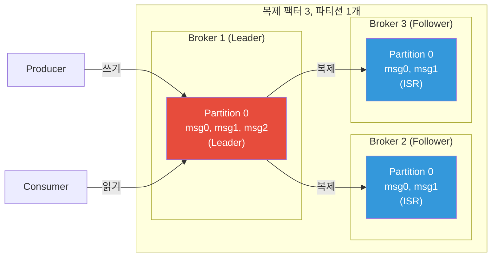
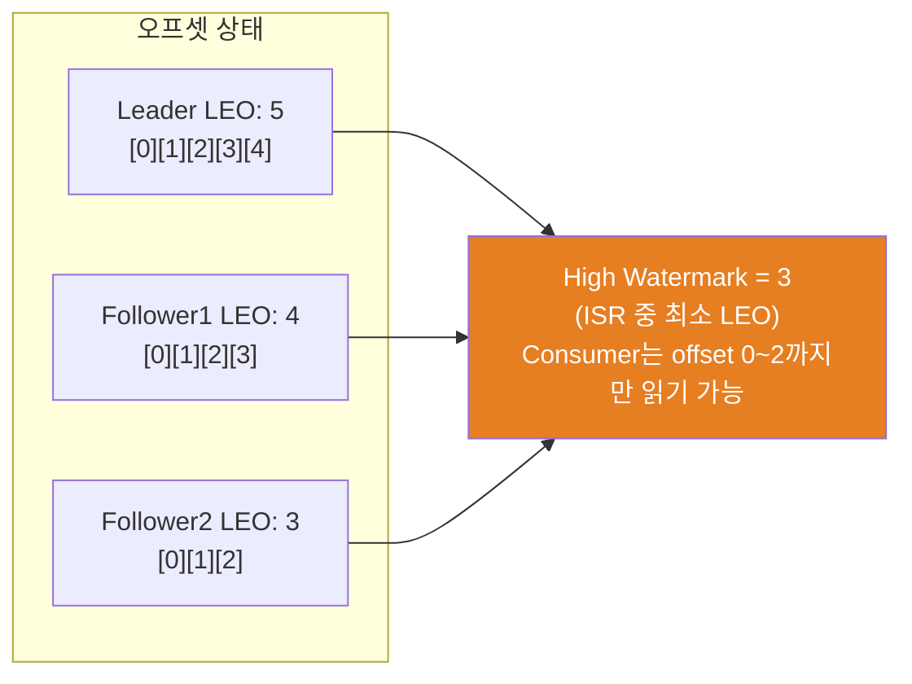
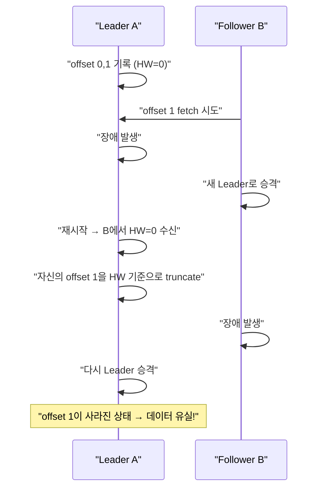
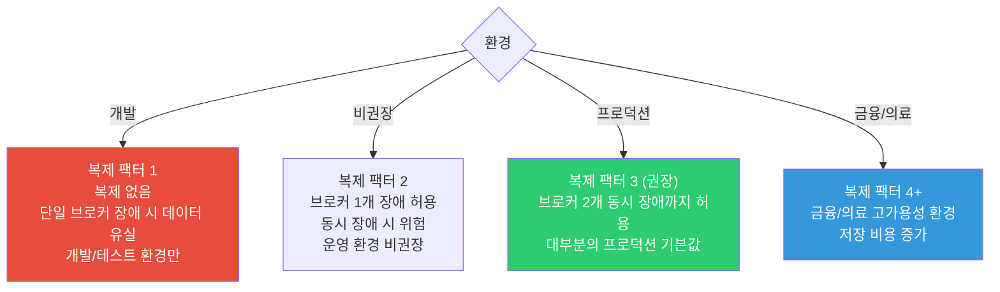
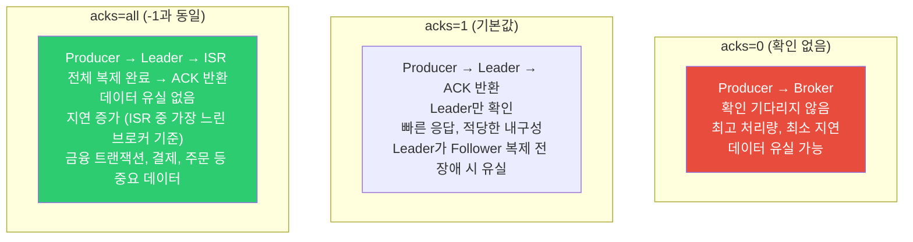
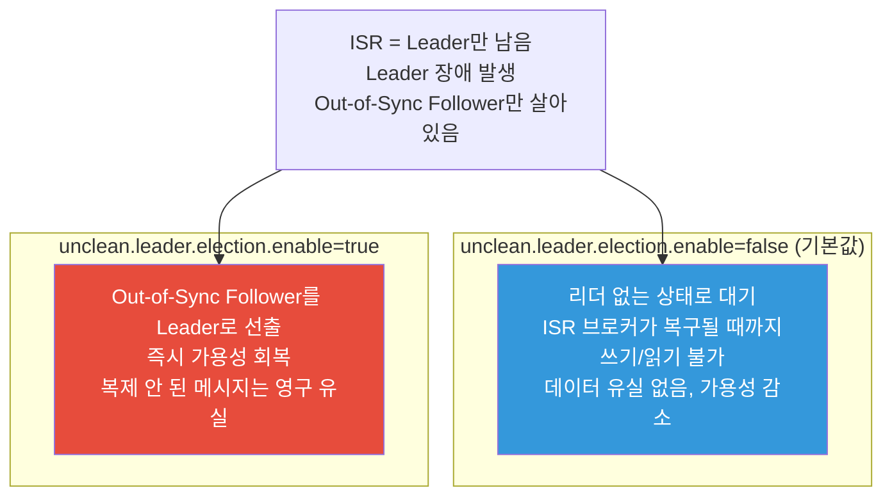
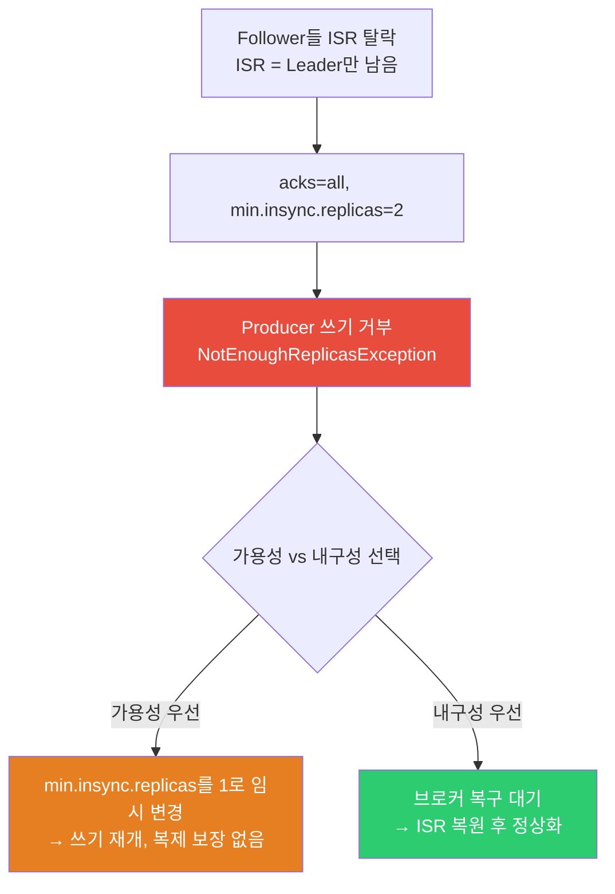

브로커 한 대가 갑자기 죽었다. 그 브로커에만 있던 메시지는 영영 사라지는가? Kafka는 처음부터 이 상황을 가정하고 설계됐다. 파티션을 여러 브로커에 복제해두고, 리더가 죽으면 팔로워 중 하나가 즉시 리더를 이어받는다.

## 왜 이게 중요한가?

데이터 복제 메커니즘을 모르면 두 가지 위험에 빠진다. 첫째, `acks=1`로 설정한 채 운영하다 리더 장애 시 메시지가 유실된다. 둘째, ISR이 줄어든 상황에서 `min.insync.replicas` 조건을 모르고 쓰기를 계속하면 가용성과 내구성 중 하나를 무심코 포기하게 된다. 복제 원리를 이해하면 이 설정들이 왜 그렇게 동작하는지 자연스럽게 이해된다.

## 비유로 이해하기

> 복제는 중요한 계약서를 원본 외에 사본 2부를 만들어 각기 다른 금고에 보관하는 것과 같다. 원본이 든 금고가 불에 타도 사본으로 업무를 이어갈 수 있다. ISR은 "사본이 원본과 동일하게 최신 상태인 금고"만 목록에 올리는 품질 관리 장치다. 사본이 뒤처지면 ISR 목록에서 제외되고, 따라잡으면 다시 등재된다.

## 복제의 목적

Kafka는 단일 브로커 장애에도 데이터를 잃지 않기 위해 파티션을 여러 브로커에 복제한다. 복제는 가용성과 내구성을 동시에 보장하는 핵심 메커니즘이다.



Producer와 Consumer는 Leader와만 통신한다. Follower는 Leader로부터 데이터를 fetch하여 동기화한다.

---

## ISR (In-Sync Replicas)

### ISR이란?

Leader와 동기화 상태를 유지하는 Follower 집합이다. ISR에 포함된 브로커만이 Leader 승격 후보가 된다. ISR 목록이 곧 "믿을 수 있는 복제본 목록"이다.

```
ISR = {Leader, Follower1, Follower2}
  → Leader 장애 시 Follower1 또는 Follower2가 새 Leader로 승격

ISR = {Leader만 남음}  (Follower들이 뒤처진 경우)
  → Leader 장애 시 데이터 유실 위험
  → unclean.leader.election.enable 설정에 따라 동작이 달라짐
```

### ISR 판단 기준

```mermaid
stateDiagram-v2
    [*] --> "ISR 포함"
    "ISR 포함" --> "ISR 제외 (Out-of-Sync)": "replica.lag.time.max.ms 내\nfetch 요청 없거나 너무 뒤처짐"
    "ISR 제외 (Out-of-Sync)" --> "ISR 포함": "Leader의 로그를 따라잡음"
```

`replica.lag.time.max.ms` (기본값: 30000ms = 30초) 이내에 Follower가 Leader의 메시지를 fetch해야 ISR을 유지한다.

### ISR 확인 방법

```bash
# 파티션 상태 확인
kafka-topics.sh --bootstrap-server kafka:9092 \
  --describe --topic orders

# 출력 예시:
Topic: orders  Partition: 0  Leader: 1  Replicas: 1,2,3  Isr: 1,2,3
Topic: orders  Partition: 1  Leader: 2  Replicas: 2,3,1  Isr: 2,3
# Partition 1의 Broker 1이 ISR에서 빠진 상태
```

---

## High Watermark (HW)

### High Watermark란?

모든 ISR 브로커에 복제 완료된 메시지의 최대 오프셋이다. Consumer는 HW 이하의 메시지만 읽을 수 있다. 아직 일부 Follower에만 복제된 메시지는 Consumer에게 노출되지 않는다.



### HW와 데이터 유실 방지

HW 덕분에 Leader가 갑자기 장애 나도 Consumer에게 이미 노출된 메시지는 반드시 다른 ISR에도 존재한다.

```
상황: Consumer가 offset 2까지 읽은 후 Leader(offset 4 기록) 장애

새 Leader로 Follower1 승격 (LEO: 3)
  → Consumer는 offset 2까지만 읽었으므로 문제없음
  → offset 3은 Follower1에 있으므로 다음 읽기 가능
  → offset 4는 유실 (HW=3이었으므로 Consumer에게 노출 안 됨)
```

---

## Leader Epoch

### Leader Epoch가 필요한 이유

Kafka 0.11 이전에는 HW만으로 복제 일관성을 보장했는데, 특정 장애 시나리오에서 데이터 불일치가 발생할 수 있었다.



### Leader Epoch 동작

각 Leader 선출마다 단조 증가하는 Epoch 번호를 부여한다. Follower는 HW가 아닌 Leader Epoch를 기준으로 로그 일관성을 확인하므로 위 시나리오의 데이터 유실을 방지한다.

```
Leader Epoch 0: Broker 1이 Leader (offset 0~5)
Leader Epoch 1: Broker 2가 새 Leader (offset 6~10)
Leader Epoch 2: Broker 1이 다시 Leader (offset 11~)

Broker 1이 재시작 시:
  "나의 마지막 Epoch는 0, offset 5였다"
  → 현재 Leader(Broker 2, Epoch 1)에게 질의
  → "Epoch 0은 offset 5까지" 확인
  → offset 5 이후를 안전하게 truncate
```

---

## 복제 팩터 설정

### 복제 팩터 선택 가이드



### 토픽 생성 시 복제 팩터 지정

```bash
kafka-topics.sh --bootstrap-server kafka:9092 \
  --create \
  --topic payments \
  --partitions 6 \
  --replication-factor 3

# min.insync.replicas 설정 (토픽 레벨)
kafka-configs.sh --bootstrap-server kafka:9092 \
  --entity-type topics \
  --entity-name payments \
  --alter \
  --add-config min.insync.replicas=2
```

---

## acks 설정

Producer의 `acks` 설정은 얼마나 많은 브로커의 확인을 기다릴지 결정한다. 이 설정이 내구성과 지연의 균형을 결정하는 핵심이다.



### min.insync.replicas와 조합

`acks=all`만으로는 충분하지 않다. ISR이 Leader 하나만 남은 경우에도 `acks=all`이 성공할 수 있기 때문이다. `min.insync.replicas`로 최소 복제 브로커 수를 강제한다.

```
acks=all + min.insync.replicas=2 (권장 프로덕션 설정)

의미: ISR 중 최소 2개 브로커에 복제 완료 후 ack
     ISR이 2개 미만이면 Producer에 NotEnoughReplicasException 반환

시나리오별 동작:
ISR = {Leader, F1, F2}: 정상, 복제 후 ack
ISR = {Leader, F1}:     min.insync=2이므로 정상
ISR = {Leader}:         min.insync=2 미충족 → 쓰기 거부
```

---

## Unclean Leader Election

### 개념

ISR에 포함되지 않은 Follower(Out-of-Sync)를 Leader로 선출하는 것이다. ISR이 모두 죽고 Out-of-Sync Follower만 살아있을 때 가용성과 내구성 중 하나를 선택해야 한다.



### 선택 기준

| 시스템 특성 | 권장 설정 |
|-------------|-----------|
| 금융, 주문, 결제 | `false` (데이터 유실 절대 불가) |
| 로그 집계, 메트릭 | `true` (가용성 우선) |
| 일반 서비스 이벤트 | `false` (기본값 유지) |

---

## 데이터 유실 시나리오와 방어

### 시나리오 1: acks=1 + Leader 장애

```
1. Producer가 offset 5를 Leader에 전송
2. Leader가 ack 반환 (Follower 복제 전)
3. Leader 장애, Follower가 Leader 승격 (Follower LEO: 4)
4. offset 5 유실 → Producer는 성공으로 알고 있음

방어: acks=all + min.insync.replicas=2
```

### 시나리오 2: 브로커 재시작 + 로그 손상

```
1. 브로커 비정상 종료 (kill -9)
2. 페이지 캐시에 있던 데이터 미플러시
3. 재시작 후 로그 일부 손상 또는 유실

방어: replication.factor=3으로 다른 브로커에서 복구
      (flush 설정은 성능 트레이드오프가 크므로 복제로 대체 권장)
```

### 시나리오 3: 네트워크 파티션 (Split Brain)

```
1. 네트워크 파티션으로 Broker1(Leader)이 Broker2,3과 단절
2. Broker2가 새 Leader로 선출
3. Broker1은 자신이 Leader라고 생각하고 메시지 계속 수신
4. "Split Brain" 상태

방어: ZooKeeper/KRaft의 epoch 기반 Leader 검증
      Broker1은 epoch 불일치로 Leader 권한 상실
      이후 Broker1이 클러스터에 재합류 시 불일치 로그 truncate
```

### 방어 설정 체크리스트

```properties
# Producer
acks=all
retries=2147483647
enable.idempotence=true
max.in.flight.requests.per.connection=5

# Broker
default.replication.factor=3
min.insync.replicas=2
unclean.leader.election.enable=false

# Topic (중요 토픽)
replication.factor=3
min.insync.replicas=2
```

---

## 복제 성능 튜닝

### Follower fetch 설정

```properties
# Broker 설정 (Follower의 fetch 동작)
num.replica.fetchers=4          # 병렬 fetch 스레드 수 (기본 1, 증가 권장)
replica.fetch.min.bytes=1       # 최소 fetch 바이트
replica.fetch.max.bytes=10485760 # 최대 fetch 바이트 (10MB)
replica.fetch.wait.max.ms=500   # fetch 대기 최대 시간
```

`num.replica.fetchers`를 1에서 4로 늘리면 복제 처리량이 크게 향상된다.

### 복제 지연 모니터링

```bash
# 복제 지연 파티션만 출력
kafka-topics.sh --bootstrap-server kafka:9092 \
  --describe --topic orders \
  --under-replicated-partitions

# Leader 없는 파티션 출력
kafka-topics.sh --bootstrap-server kafka:9092 \
  --describe --topic orders \
  --unavailable-partitions
```

`UnderReplicatedPartitions` 지표가 0보다 크면 즉시 원인을 파악해야 한다. 네트워크 문제, 브로커 과부하, 디스크 I/O 포화가 주요 원인이다.

---

<details class="extreme-scenario-details" ontoggle="if(this.open){var ad=this.querySelector('.extreme-scenario-ad');if(ad&&!ad.dataset.loaded){ad.dataset.loaded='1';(adsbygoogle=window.adsbygoogle||[]).push({});}}">
<summary class="extreme-scenario-summary">
<span class="extreme-scenario-icon">🔥</span>
<span class="extreme-scenario-label">극한 시나리오 — 클릭하여 펼치기</span>
<span class="extreme-scenario-toggle"></span>
</summary>
<div class="extreme-scenario-body">
<div class="extreme-scenario-ad" style="text-align:center; margin-bottom:1.5em;">
<ins class="adsbygoogle"
     style="display:block"
     data-ad-client="ca-pub-7225106491387870"
     data-ad-slot="0000000000"
     data-ad-format="auto"
     data-full-width-responsive="true"></ins>
</div>
<div class="extreme-scenario-content" markdown="1">

### 시나리오: ISR 축소 중 min.insync.replicas 위반

네트워크 지연이나 브로커 과부하로 Follower들이 ISR에서 탈락하면 쓰기가 거부된다. 이때 `min.insync.replicas`를 임시로 낮추거나 `unclean.leader.election`을 허용하는 결정이 필요하다.



금융/결제 시스템은 반드시 내구성을 우선해야 한다. 일시적 장애 허용보다 데이터 정확성이 더 중요하다.
</div>
</div>
</details>

