## 실생활 비유: 우체국이 아니라 방송국

Kafka를 우체국이라고 설명하는 책이 많은데, 그건 절반만 맞습니다. 우체국은 편지를 배달하면 사라집니다. Kafka는 다릅니다. 더 정확한 비유는 **라디오 방송국**입니다.

라디오 방송국(Producer)이 음악을 송출(메시지 발행)하면, 주파수(Topic)에 맞춰 놓은 수신기(Consumer) 누구나 들을 수 있습니다. 방송이 나가도 내용이 사라지지 않습니다. 늦게 튼 사람도 녹음(오프셋)을 되감아 처음부터 들을 수 있습니다. 이것이 Kafka가 기존 메시지 큐(RabbitMQ 등)와 근본적으로 다른 점입니다.

왜 이게 중요할까요? 주문 서비스가 "주문 생성" 이벤트를 보내면, **배송 서비스도, 알림 서비스도, 분석 서비스도** 각자 독립적으로 같은 메시지를 소비할 수 있습니다. 메시지를 여러 번 "복사"해서 보낼 필요가 없습니다. 이 구조가 MSA 이벤트 드리븐 아키텍처의 핵심입니다.

---

## 1. Kafka 핵심 개념 — 왜 이렇게 설계했나

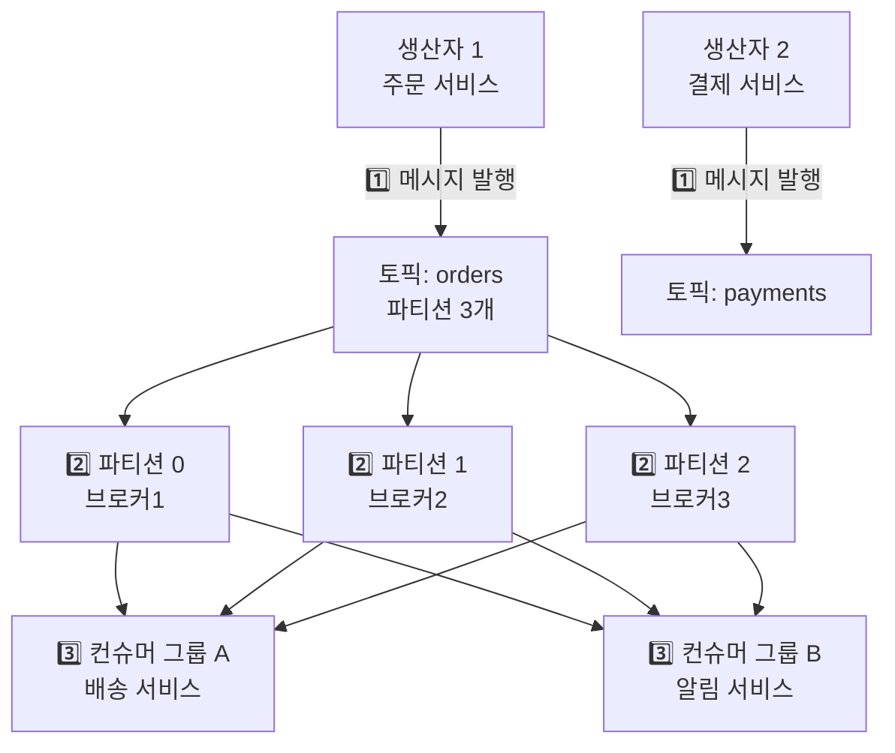

### 핵심 용어 — 단순 나열이 아닌 관계 이해

| 용어 | 설명 | 왜 필요한가 |
|------|------|------------|
| Broker | Kafka 서버 1대 | 데이터를 실제로 저장하는 주체. 여러 대를 묶어 클러스터 구성 |
| Topic | 메시지 분류 채널 | 주제별로 메시지를 분리해 컨슈머가 관심 있는 것만 구독 |
| Partition | 토픽의 물리적 분할 | **병렬 처리의 핵심.** 파티션 수 = 동시에 처리 가능한 컨슈머 수 |
| Producer | 메시지 생산자 | 메시지를 어느 파티션으로 보낼지 결정하는 권한 보유 |
| Consumer | 메시지 소비자 | 자신의 오프셋을 직접 관리. 실패 시 되돌아가기 가능 |
| Consumer Group | 소비자 그룹 | 같은 그룹은 파티션을 나눠 처리. 다른 그룹은 독립적 소비 |
| Offset | 파티션 내 메시지 위치 | "어디까지 읽었나" 기록. 이 덕분에 재처리 가능 |
| Zookeeper/KRaft | 클러스터 메타데이터 관리 | 리더 선출, 브로커 등록/탈퇴 조율 |

**파티션을 왜 나눌까요?** 파티션이 하나면 컨슈머도 하나만 붙을 수 있습니다. 초당 100만 건을 처리해야 하는데 컨슈머가 초당 10만 건밖에 못 처리하면? 파티션을 10개로 나누면 컨슈머 10개가 병렬로 처리해 초당 100만 건을 소화할 수 있습니다. **파티션 수가 곧 처리량의 상한선**입니다.

---

## 2. 파티션과 오프셋 — "어디까지 읽었나"의 정확한 의미

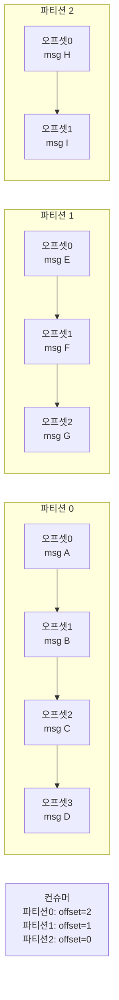

오프셋은 단순한 번호가 아닙니다. **"내가 여기까지 처리했다"는 책갈피**입니다. 컨슈머가 오프셋 2까지 처리했다고 커밋하면, 재시작 후에도 오프셋 3부터 이어서 처리합니다.

**중요한 특성을 제대로 이해해야 합니다:**

- **파티션 내에서는 순서 보장**: msg A → msg B → msg C는 절대 역전되지 않습니다. 왜냐하면 파티션은 append-only 로그이기 때문입니다.
- **파티션 간에는 순서 보장 안됨**: 파티션 0의 msg A와 파티션 1의 msg E 중 어느 것이 먼저 처리될지 알 수 없습니다. 이게 중요한 이유는, "같은 주문 ID의 이벤트는 반드시 순서대로 처리"해야 한다면 **같은 파티션에 넣어야** 하기 때문입니다. 이것이 파티션 키를 주문 ID로 설정하는 이유입니다.
- **메시지는 보관 기간(기본 7일) 동안 유지**: 컨슈머가 읽어도 메시지가 사라지지 않습니다. 7일 내라면 언제든 처음부터 다시 읽을 수 있습니다. 장애 복구, 신규 서비스 온보딩에 강력한 기능입니다.

이걸 잘못 이해하면 어떤 장애가 날까요? 주문 생성, 주문 결제, 주문 취소 이벤트가 각각 다른 파티션으로 분산되면, 취소 이벤트가 결제 이벤트보다 먼저 처리될 수 있습니다. 결과는 "취소가 됐는데 결제가 또 됨"입니다.

---

## 3. Producer 심화 — 메시지를 어떻게 보낼 것인가

### 파티션 선택 전략

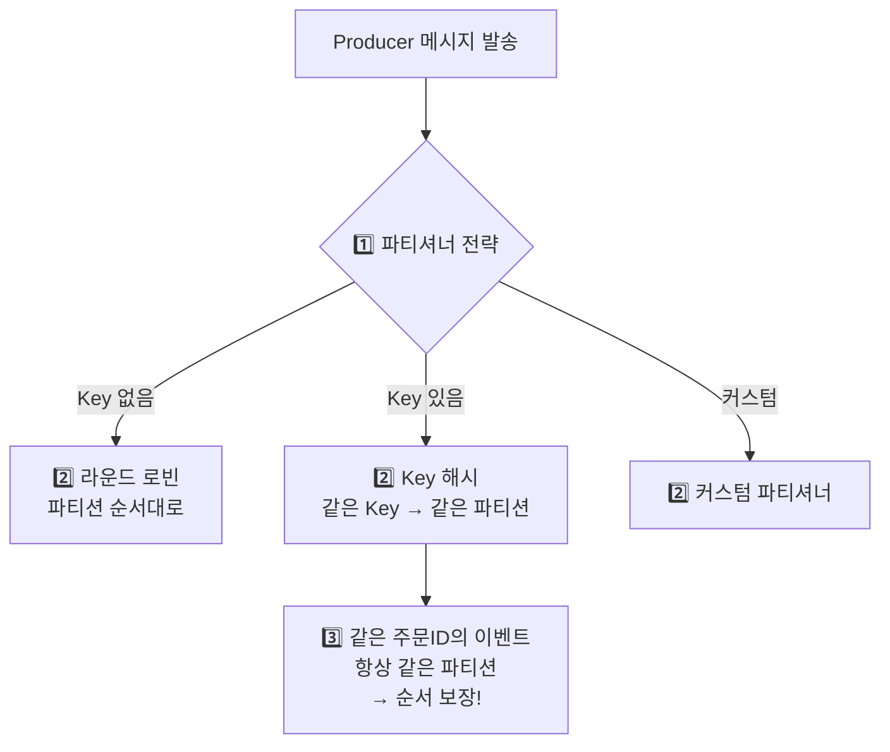

파티션 키를 주문 ID로 설정하면 `hash("order-123") % 파티션수 = 1`처럼 항상 같은 파티션으로 갑니다. 이것이 **"같은 주문에 대한 이벤트는 반드시 순서대로 처리"를 보장하는 유일한 방법**입니다.

```java
// Kafka Producer 설정
@Configuration
public class KafkaProducerConfig {

    @Bean
    public ProducerFactory<String, String> producerFactory() {
        Map<String, Object> configs = new HashMap<>();
        configs.put(ProducerConfig.BOOTSTRAP_SERVERS_CONFIG, "kafka1:9092,kafka2:9092,kafka3:9092");
        configs.put(ProducerConfig.KEY_SERIALIZER_CLASS_CONFIG, StringSerializer.class);
        configs.put(ProducerConfig.VALUE_SERIALIZER_CLASS_CONFIG, JsonSerializer.class);

        // 안정성 설정
        configs.put(ProducerConfig.ACKS_CONFIG, "all");           // 모든 레플리카 확인
        configs.put(ProducerConfig.RETRIES_CONFIG, Integer.MAX_VALUE);
        configs.put(ProducerConfig.MAX_IN_FLIGHT_REQUESTS_PER_CONNECTION, 5);
        configs.put(ProducerConfig.ENABLE_IDEMPOTENCE_CONFIG, true); // 멱등성

        // 성능 설정
        configs.put(ProducerConfig.BATCH_SIZE_CONFIG, 16384);     // 배치 크기 16KB
        configs.put(ProducerConfig.LINGER_MS_CONFIG, 5);          // 5ms 대기 후 배치 발송
        configs.put(ProducerConfig.COMPRESSION_TYPE_CONFIG, "snappy"); // 압축

        return new DefaultKafkaProducerFactory<>(configs);
    }
}

// 메시지 발행
@Service
public class OrderEventPublisher {

    private final KafkaTemplate<String, OrderEvent> kafkaTemplate;

    public void publishOrderCreated(Order order) {
        OrderEvent event = OrderEvent.from(order);

        ProducerRecord<String, OrderEvent> record = new ProducerRecord<>(
            "orders",
            order.getId(),  // 파티션 키: 주문ID → 같은 주문 이벤트는 항상 같은 파티션
            event
        );

        // 비동기 발행 + 콜백
        kafkaTemplate.send(record)
            .whenComplete((result, ex) -> {
                if (ex != null) {
                    log.error("발행 실패: {}", ex.getMessage());
                    // DLQ 처리 또는 재시도
                } else {
                    log.info("발행 성공: offset={}, partition={}",
                        result.getRecordMetadata().offset(),
                        result.getRecordMetadata().partition());
                }
            });
    }
}
```

### Producer acks 설정 — "전송 완료"의 기준이 뭔가

```
acks=0: 브로커 확인 없이 발송 (가장 빠름, 유실 가능)
acks=1: 리더만 확인 (중간)
acks=all: 모든 ISR 레플리카 확인 (가장 안전, 느림)
```

> **비유**: acks 설정은 소포 배송 보험 등급입니다. `acks=0`은 보험 없이 보내는 것(분실해도 보상 없음), `acks=1`은 중간 거점 도착까지만 추적하는 것(거점에서 최종 배달 중 분실 가능), `acks=all`은 수취인 서명까지 확인하는 등기 우편(가장 느리지만 분실 시 즉시 파악)입니다.

`acks=0`은 "불을 질러놓고 확인 안 하는 것"입니다. 브로커가 죽으면 메시지는 사라집니다. 로그성 데이터에는 괜찮지만, 주문/결제 데이터에 이걸 쓰면 돈이 사라집니다.

`acks=1`은 위험한 중간 지점입니다. 리더가 받았는데 팔로워에 복제되기 전에 리더가 죽으면? 새 리더로 페일오버되는 순간 메시지가 유실됩니다. "리더 확인했으니 안전하겠지"라고 방심하다가 장애 나는 패턴입니다.

`acks=all`이 금융, 주문 같은 중요 데이터의 유일한 선택지입니다. 모든 ISR 레플리카가 복제를 완료해야 성공으로 처리하기 때문에 브로커 장애가 나도 데이터가 보존됩니다.

---

## 4. Consumer 심화 — 파티션을 어떻게 나눠 처리하나

### 컨슈머 그룹과 파티션 배정

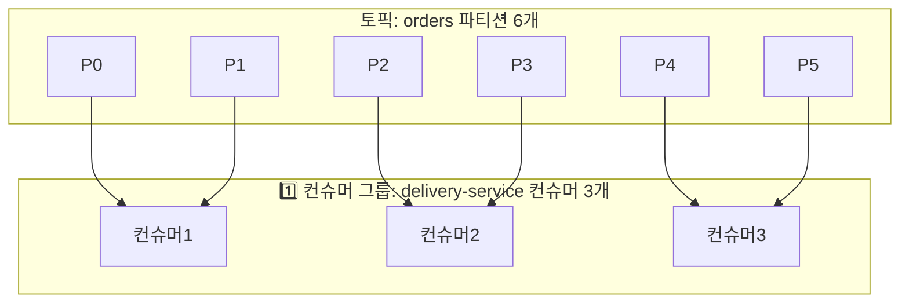

컨슈머 그룹은 **분산 처리 팀**입니다. 파티션 6개, 컨슈머 3개면 컨슈머 한 명이 파티션 2개씩 담당합니다. 처리량이 부족하면 컨슈머를 추가하면 됩니다. 파티션 6개에 컨슈머 6개면 1:1 매핑으로 최대 처리량이 나옵니다.

**컨슈머 수 > 파티션 수이면 일부 컨슈머는 놀게 됩니다!** 파티션 6개에 컨슈머 10개를 붙이면 4개는 아무 일도 안 합니다. 서버 비용 낭비입니다. 이유는 파티션 하나에 컨슈머가 여럿 붙으면 **순서 보장이 깨지기 때문**에 Kafka가 이를 허용하지 않습니다.

```java
// Consumer 설정
@Configuration
public class KafkaConsumerConfig {

    @Bean
    public ConsumerFactory<String, OrderEvent> consumerFactory() {
        Map<String, Object> configs = new HashMap<>();
        configs.put(ConsumerConfig.BOOTSTRAP_SERVERS_CONFIG, "kafka1:9092");
        configs.put(ConsumerConfig.GROUP_ID_CONFIG, "delivery-service");
        configs.put(ConsumerConfig.KEY_DESERIALIZER_CLASS_CONFIG, StringDeserializer.class);
        configs.put(ConsumerConfig.VALUE_DESERIALIZER_CLASS_CONFIG, JsonDeserializer.class);

        // 오프셋 자동 커밋 끄기 (수동 커밋으로 안전하게)
        // 왜? 자동 커밋은 처리 완료 전에 커밋할 수 있어 장애 시 메시지 유실
        configs.put(ConsumerConfig.ENABLE_AUTO_COMMIT_CONFIG, false);

        // 처음 구독 시 가장 처음부터 읽기
        configs.put(ConsumerConfig.AUTO_OFFSET_RESET_CONFIG, "earliest");

        // 배치 처리 설정
        configs.put(ConsumerConfig.MAX_POLL_RECORDS_CONFIG, 500);
        configs.put(ConsumerConfig.FETCH_MIN_BYTES_CONFIG, 1024);

        return new DefaultKafkaConsumerFactory<>(configs);
    }
}

// 메시지 처리
@Service
public class OrderEventConsumer {

    @KafkaListener(
        topics = "orders",
        groupId = "delivery-service",
        concurrency = "3"  // 스레드 3개 = 파티션당 1개 (파티션이 3개면 최적)
    )
    public void consume(
        ConsumerRecord<String, OrderEvent> record,
        Acknowledgment ack
    ) {
        try {
            log.info("메시지 수신: partition={}, offset={}, key={}",
                record.partition(), record.offset(), record.key());

            processOrder(record.value());

            // 처리 성공 후 수동 커밋
            // 왜 여기서 커밋? 처리 완료를 확인한 다음에만 "읽었다"고 기록
            ack.acknowledge();

        } catch (Exception e) {
            log.error("처리 실패: {}", e.getMessage());
            // 예외 던지면 오프셋 커밋 안 됨 → 재처리
            throw e;
        }
    }

    // 배치 처리 (성능 향상)
    @KafkaListener(topics = "orders", groupId = "analytics-service")
    public void consumeBatch(List<ConsumerRecord<String, OrderEvent>> records) {
        log.info("배치 처리: {}건", records.size());

        List<Order> orders = records.stream()
            .map(r -> convertToOrder(r.value()))
            .collect(Collectors.toList());

        orderRepository.saveAll(orders);
    }
}
```

---

## 5. 리밸런싱 (Rebalancing) — 조용한 서비스 중단의 원인

컨슈머가 추가/제거될 때 파티션 재배정이 일어납니다. 이게 왜 문제가 될까요?


리밸런싱 중에는 **모든 컨슈머가 잠시 멈춥니다.** 이것을 "Stop the World" 리밸런싱이라고 합니다. 1초~수십 초까지 메시지 처리가 중단될 수 있습니다. 초당 70만 건을 처리하는 채팅 시스템에서 이게 발생하면 메시지가 수십만 건 쌓입니다.

더 큰 문제는 리밸런싱 도중에 처리 중이던 메시지를 제대로 커밋하지 않으면 **중복 처리**가 발생합니다. 컨슈머1이 P0의 오프셋 5를 처리 중에 리밸런싱이 일어나서 P0가 컨슈머2로 넘어가면, 컨슈머2는 오프셋 5부터 다시 처리합니다.

```java
@Component
public class OrderConsumer implements ConsumerAwareRebalanceListener {

    @Override
    public void onPartitionsRevokedBeforeCommit(
        Consumer<?, ?> consumer,
        Collection<TopicPartition> partitions
    ) {
        // 리밸런싱 전 현재 처리 중인 메시지 커밋
        // 이걸 안 하면 파티션이 넘어갈 때 중복 처리 발생
        log.info("파티션 반환 전 커밋: {}", partitions);
        consumer.commitSync();
    }

    @Override
    public void onPartitionsAssigned(
        Consumer<?, ?> consumer,
        Collection<TopicPartition> partitions
    ) {
        log.info("새 파티션 배정: {}", partitions);
    }
}
```

---

## 6. ISR (In-Sync Replicas) — 복제의 실제 동작

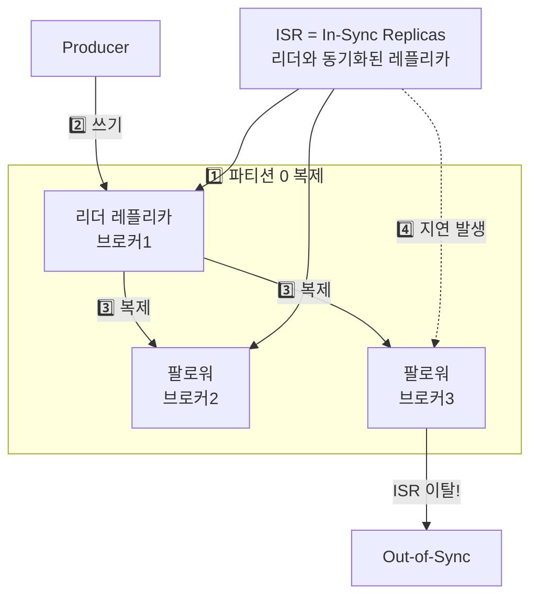

ISR은 "지금 리더와 동기화된 레플리카 목록"입니다. `acks=all`은 ISR 내 모든 레플리카가 쓰기를 완료해야 성공으로 처리합니다.

> **비유**: ISR은 마라톤 페이스메이커 그룹입니다. 선두 주자(리더)를 따라잡고 있는 주자들만 ISR에 남고, 뒤처진 주자는 탈락합니다. 선두가 갑자기 기권하면 ISR 안에서만 다음 선두를 뽑습니다. 뒤처진 주자에게 선두를 맡기면 기록(데이터)이 누락되기 때문입니다.

왜 ISR이 중요할까요? 팔로워2가 네트워크 문제로 복제가 느려지면 ISR에서 제거됩니다. 이 상태에서 `acks=all`이면 ISR(리더+팔로워1)만 확인하면 되므로 쓰기가 계속 가능합니다. 팔로워2가 복구되면 자동으로 재동기화 후 ISR에 재합류합니다.

이걸 잘못 설정하면 어떤 장애가 날까요? `min.insync.replicas=3`인데 브로커 1대가 죽으면 ISR이 2개뿐이라 `acks=all` 쓰기가 전부 실패합니다. 서비스 전체 장애입니다. 브로커 3대 클러스터에서 `min.insync.replicas=2`로 설정하는 게 브로커 1대 장애를 허용하면서 안전성을 유지하는 표준 설정입니다.

```
replica.lag.time.max.ms = 10000  # 10초 이상 복제 지연 시 ISR에서 제거

acks=all: ISR 내 모든 레플리카가 쓰기 확인해야 성공
min.insync.replicas = 2: 최소 2개 ISR이 있어야 쓰기 허용
```

---

## 7. 정확히 한 번 전송 (Exactly-Once Semantics) — 왜 어려운가

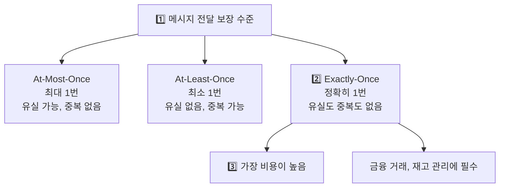

At-Least-Once가 왜 기본값인지부터 이해해야 합니다. 네트워크 오류로 브로커가 ACK를 못 보내면 Producer는 "실패했나?"라고 판단하고 재전송합니다. 실제로는 브로커에 이미 저장됐는데 중복이 생깁니다.

이걸 방지하는 게 멱등성(Idempotence)입니다. Producer에 `ENABLE_IDEMPOTENCE_CONFIG=true`를 설정하면 각 메시지에 시퀀스 번호가 붙어서, 브로커가 중복을 자동으로 감지하고 무시합니다.

Exactly-Once를 위해서는 여기서 한 발 더 나아가 **트랜잭션**이 필요합니다. "이 5개의 메시지를 원자적으로 발행하거나 아니면 전부 안 보내거나"를 보장합니다.

```java
// Producer 설정
configs.put(ProducerConfig.ENABLE_IDEMPOTENCE_CONFIG, true);
configs.put(ProducerConfig.TRANSACTIONAL_ID_CONFIG, "order-producer-1");

// 트랜잭셔널 발행
@Service
public class TransactionalProducer {

    public void sendWithTransaction(List<OrderEvent> events) {
        kafkaTemplate.executeInTransaction(operations -> {
            for (OrderEvent event : events) {
                operations.send("orders", event.getOrderId(), event);
            }
            return true;
        });
    }
}

// Consumer - 트랜잭션 커밋된 메시지만 읽기
// 이 설정 없으면 아직 롤백될 수도 있는 메시지를 읽어버림
configs.put(ConsumerConfig.ISOLATION_LEVEL_CONFIG, "read_committed");
```

---

## 8. 스키마 레지스트리 (Schema Registry) — 메시지 형식 계약

Producer와 Consumer 사이의 메시지 형식을 관리합니다. 이게 왜 필요할까요?

주문 서비스가 `totalAmount` 필드를 `int`에서 `long`으로 바꿨는데 결제 서비스가 아직 `int`로 파싱하면? **런타임에 역직렬화 오류**가 납니다. 스키마 레지스트리는 이런 "계약 위반"을 배포 전에 차단합니다.

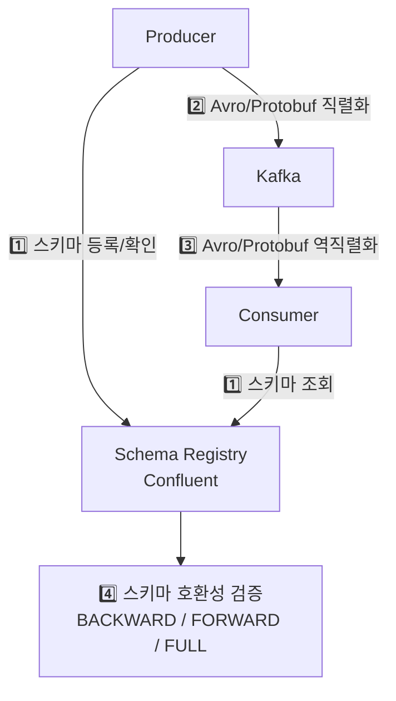

BACKWARD 호환성이란 "새 스키마로 이전 데이터를 읽을 수 있어야 한다"입니다. 필드 추가는 OK, 필드 삭제는 NG입니다. 이 규칙을 지키면 컨슈머를 먼저 배포하고 프로듀서를 나중에 배포해도 장애 없이 롤링 업데이트가 됩니다.

**Avro 스키마 예시:**
```json
{
  "type": "record",
  "name": "OrderEvent",
  "namespace": "com.example.events",
  "fields": [
    {"name": "orderId", "type": "string"},
    {"name": "userId", "type": "string"},
    {"name": "totalAmount", "type": "long"},
    {"name": "status", "type": {"type": "enum", "name": "OrderStatus",
      "symbols": ["CREATED", "PAID", "SHIPPED", "DELIVERED", "CANCELLED"]}},
    {"name": "createdAt", "type": "long", "logicalType": "timestamp-millis"},
    {"name": "items", "type": {"type": "array", "items": {
      "type": "record", "name": "OrderItem",
      "fields": [
        {"name": "productId", "type": "string"},
        {"name": "quantity", "type": "int"},
        {"name": "price", "type": "long"}
      ]
    }}}
  ]
}
```

---

## 9. Kafka Streams — Kafka 위에서 실시간 처리

Kafka Streams는 별도 시스템(Flink, Spark) 없이 Kafka 클러스터 안에서 실시간 스트림 처리를 수행합니다.

> **비유**: Kafka Streams는 공장의 컨베이어 벨트 위에 설치된 자동 검수기입니다. 제품(메시지)이 벨트를 타고 흘러가면서 불량품 걸러내기(filter), 포장 바꾸기(map), 수량 세기(aggregate)가 벨트 위에서 바로 일어납니다. 별도 검수 창고(Flink, Spark 클러스터)로 옮기지 않아도 됩니다.

```java
@Configuration
public class OrderStreamProcessor {

    @Bean
    public KStream<String, OrderEvent> processOrderStream(StreamsBuilder builder) {
        KStream<String, OrderEvent> orders = builder.stream("orders");

        // 1. 필터링: PAID 상태 주문만 (나머지는 버림)
        KStream<String, OrderEvent> paidOrders = orders
            .filter((key, value) -> value.getStatus() == OrderStatus.PAID);

        // 2. 변환: 배송 이벤트로 변환 (도메인 이벤트 분리)
        KStream<String, DeliveryEvent> deliveryEvents = paidOrders
            .mapValues(order -> DeliveryEvent.from(order));

        // 3. 배송 토픽으로 발행
        deliveryEvents.to("delivery-requests");

        // 4. 집계: 5분 윈도우 내 카테고리별 매출 합계
        // 왜 윈도우? 전체 합계는 무한히 커지지만 5분 단위면 실시간 대시보드 가능
        KTable<Windowed<String>, Long> revenueByWindow = orders
            .filter((k, v) -> v.getStatus() == OrderStatus.PAID)
            .groupBy((key, value) -> value.getCategoryId())
            .windowedBy(TimeWindows.ofSizeWithNoGrace(Duration.ofMinutes(5)))
            .aggregate(
                () -> 0L,
                (key, order, total) -> total + order.getTotalAmount(),
                Materialized.with(Serdes.String(), Serdes.Long())
            );

        // 5. 결과를 실시간 집계 토픽으로
        revenueByWindow.toStream()
            .map((windowedKey, revenue) -> KeyValue.pair(
                windowedKey.key(),
                new RevenueAggregate(windowedKey.key(), revenue, windowedKey.window())
            ))
            .to("revenue-aggregates");

        return orders;
    }
}
```

---

## 10. 데드 레터 큐 (DLQ) — 처리 실패한 메시지의 생명 보험

메시지를 처리하다 실패하면 어떻게 해야 할까요? 그냥 버리면 데이터 유실, 무한 재시도하면 서비스 마비입니다. DLQ는 "3번 시도해도 안 되면 격리 병동으로 보내자"는 접근입니다.

> **비유**: DLQ는 우체국의 반송 보관함입니다. 주소가 틀리거나 수취 거부된 편지(처리 실패 메시지)를 그냥 버리면 중요한 서류가 사라지고, 같은 주소로 무한 재배달하면 배달원(컨슈머)이 다른 편지를 배달하지 못합니다. 반송 보관함(DLQ)에 모아두면 나중에 관리자가 원인을 파악하고 재발송할 수 있습니다.

```java
@Service
public class ResilientConsumer {

    private final KafkaTemplate<String, String> kafkaTemplate;

    @KafkaListener(topics = "orders", groupId = "order-processor")
    public void consume(ConsumerRecord<String, OrderEvent> record, Acknowledgment ack) {
        int maxRetries = 3;

        for (int attempt = 1; attempt <= maxRetries; attempt++) {
            try {
                processOrder(record.value());
                ack.acknowledge();
                return;
            } catch (RetryableException e) {
                // 일시적 장애 (DB 연결 실패 등) → 재시도 가능
                if (attempt == maxRetries) {
                    sendToDLQ(record, e);
                    ack.acknowledge();  // DLQ로 보내고 원본 커밋
                } else {
                    log.warn("재시도 {}/{}회: {}", attempt, maxRetries, e.getMessage());
                    Thread.sleep(1000L * attempt);  // 지수 백오프
                }
            } catch (NonRetryableException e) {
                // 재시도해도 의미없는 에러 (잘못된 데이터 포맷 등)
                // 재시도하면 똑같이 실패하므로 즉시 DLQ로
                sendToDLQ(record, e);
                ack.acknowledge();
                return;
            }
        }
    }

    private void sendToDLQ(ConsumerRecord<String, OrderEvent> record, Exception e) {
        String dlqTopic = record.topic() + ".DLQ";
        ProducerRecord<String, String> dlqRecord = new ProducerRecord<>(
            dlqTopic,
            record.key(),
            record.value().toString()
        );
        // 에러 정보 헤더에 추가 → 나중에 왜 실패했는지 분석 가능
        dlqRecord.headers().add("error-message", e.getMessage().getBytes());
        dlqRecord.headers().add("original-topic", record.topic().getBytes());
        dlqRecord.headers().add("original-offset", String.valueOf(record.offset()).getBytes());

        kafkaTemplate.send(dlqRecord);
        log.error("DLQ로 이동: topic={}, offset={}", record.topic(), record.offset());
    }
}
```

DLQ 없이 무한 재시도하면 어떻게 될까요? 파싱 불가능한 잘못된 JSON 메시지가 하나 들어오면, 그 메시지에서 영원히 멈춥니다. 뒤에 쌓이는 정상 메시지들은 모두 처리되지 못합니다. 이걸 "poison pill(독약 메시지)"이라고 부릅니다.

---

## 11. Kafka 클러스터 설계

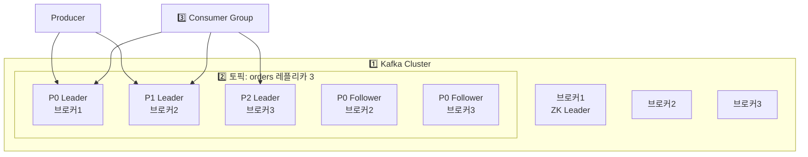

**클러스터 설정 권장값:**
```properties
# server.properties

# 데이터 보관 기간
log.retention.hours=168          # 7일 — 재처리 여유, 신규 컨슈머 온보딩
log.retention.bytes=1073741824   # 1GB — 디스크 용량 제어

# 복제 설정
default.replication.factor=3     # 레플리카 3개 — 브로커 2대 동시 장애까지 허용
min.insync.replicas=2            # 최소 2개 ISR — 브로커 1대 장애 허용하면서 내구성 유지

# 파티션당 리더 균형 — 특정 브로커에 리더 쏠림 방지
auto.leader.rebalance.enable=true
leader.imbalance.check.interval.seconds=300

# 성능
num.io.threads=16
num.network.threads=8
socket.send.buffer.bytes=102400
socket.receive.buffer.bytes=102400
```

---

## 12. 실전: 5000억건 금융 데이터 처리 사례

실제 금융사에서 Kafka로 초당 수백만 건의 거래 데이터를 처리하는 아키텍처입니다. 이 규모에서는 설계 결정 하나하나가 실제 운영 비용과 장애 빈도에 직결됩니다.

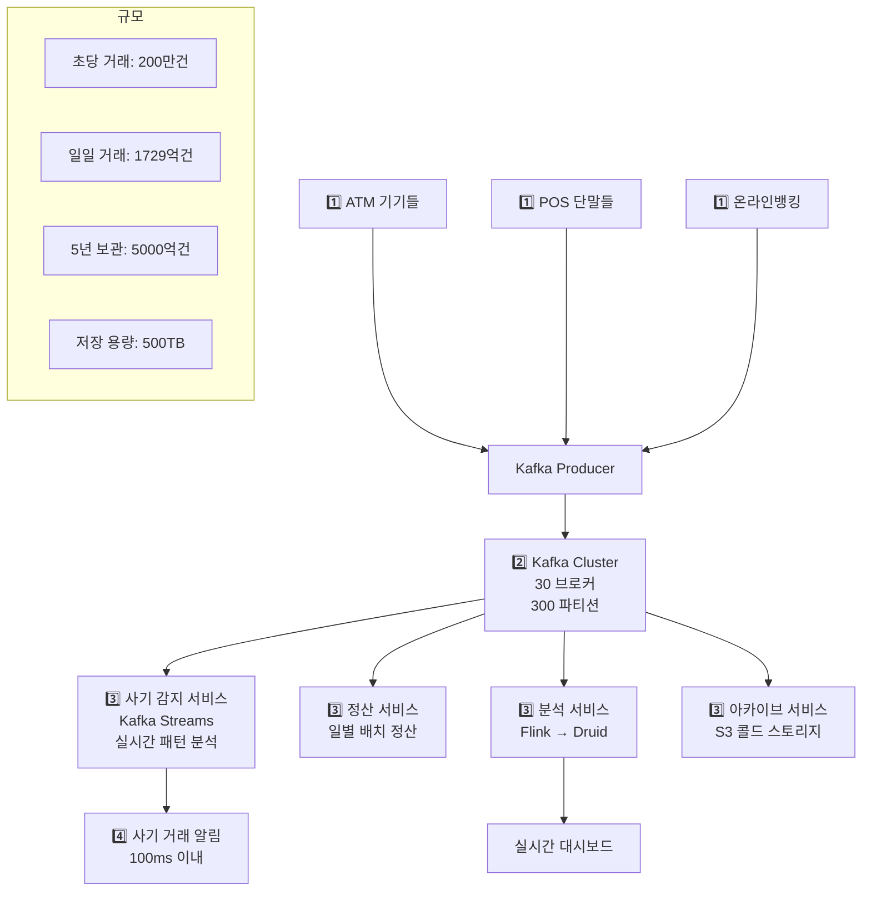

**성능 최적화 포인트:**
```
파티션 수 = 브로커 수 × 10 = 300개
  → 왜 10배? 브로커당 10개 파티션이 CPU/디스크 I/O 균형점

레플리카 수 = 3 (고가용성)
  → 브로커 2대 동시 장애까지 허용

보관 기간 = 7일 (이후 S3로 아카이브)
  → 7일 내 재처리 가능, 장기 보관은 S3로 비용 절감

압축 = LZ4 (빠른 압축/해제)
  → snappy보다 해제 속도 빠름, 금융 데이터는 텍스트 비율 높아 압축률 좋음

배치 크기 = 1MB
  → 개당 크기 작은 거래 데이터를 묶어서 보내 네트워크 오버헤드 감소

Consumer 처리량 = 파티션당 초당 1만건 × 300 = 초당 300만건
```

---

## 13. KRaft 모드 (Zookeeper 없는 Kafka)

Kafka 3.x부터 Zookeeper 없이 동작하는 KRaft 모드를 지원합니다. 왜 Zookeeper를 없앴을까요?

기존에는 Kafka 클러스터 운영에 Zookeeper 클러스터가 별도로 필요했습니다. 즉 3대 Kafka + 3대 Zookeeper = 최소 6대 서버입니다. Zookeeper 장애 시 Kafka 전체가 마비됩니다. 관리 포인트가 두 배입니다.

KRaft는 Kafka 브로커 중 일부가 Controller 역할을 겸직하면서 메타데이터를 직접 관리합니다. Raft 합의 알고리즘 기반이라 내결함성도 유지됩니다.

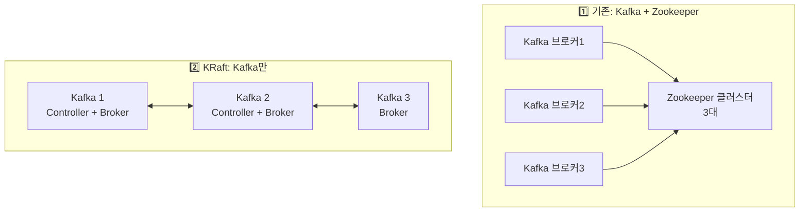

**KRaft 장점:**
- 관리 복잡도 감소 (Zookeeper 별도 운영 불필요)
- 파티션 수 제한 완화 (수백만 파티션 지원 — Zookeeper 기반은 수만 개가 한계)
- 빠른 컨트롤러 페일오버 (수분 → 수십 초)

---

<details class="extreme-scenario-details" ontoggle="if(this.open){var ad=this.querySelector('.extreme-scenario-ad');if(ad&&!ad.dataset.loaded){ad.dataset.loaded='1';(adsbygoogle=window.adsbygoogle||[]).push({});}}">
<summary class="extreme-scenario-summary">
<span class="extreme-scenario-icon">🔥</span>
<span class="extreme-scenario-label">극한 시나리오 — 클릭하여 펼치기</span>
<span class="extreme-scenario-toggle"></span>
</summary>
<div class="extreme-scenario-body">
<div class="extreme-scenario-ad" style="text-align:center; margin-bottom:1.5em;">
<ins class="adsbygoogle"
     style="display:block"
     data-ad-client="ca-pub-7225106491387870"
     data-ad-slot="0000000000"
     data-ad-format="auto"
     data-full-width-responsive="true"></ins>
</div>
<div class="extreme-scenario-content" markdown="1">

### 시나리오 1: 브로커 장애 — 리더 페일오버

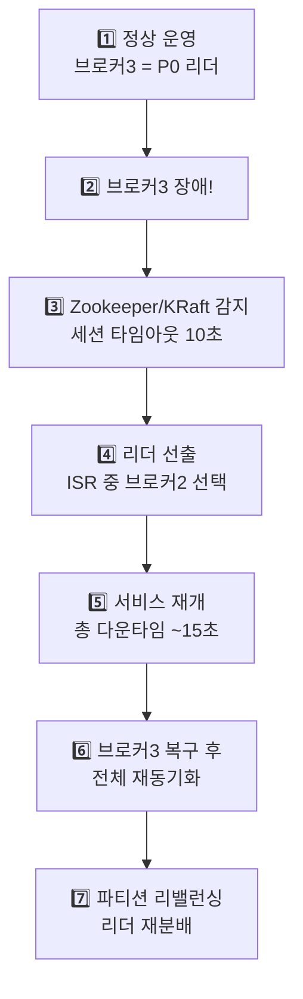

15초 다운타임이 짧아 보이지만, 이 동안 쓰기 요청은 에러를 반환합니다. 이게 허용 안 되는 시스템(결제, 주문)에서는 Producer 쪽에서 재시도 로직이 반드시 필요합니다.

`unclean.leader.election.enable=false`가 왜 중요한지 이해해야 합니다. ISR에 포함되지 않은 팔로워(즉, 최신 데이터가 없는 복제본)가 리더가 되면 최근 메시지가 유실됩니다. 금융 시스템에서 이건 돈이 사라지는 것과 같습니다. false로 설정하면 ISR 레플리카가 없을 때 리더 선출을 거부하고, 복구될 때까지 쓰기를 막습니다. 가용성보다 데이터 무결성 우선입니다.

**장애 복구 설정:**
```properties
# 빠른 장애 감지
zookeeper.session.timeout.ms=10000      # 10초
replica.lag.time.max.ms=10000           # 10초 지연 시 ISR 제거

# 언클린 리더 선출 (데이터 유실 vs 가용성)
unclean.leader.election.enable=false    # 금융: 데이터 무결성 우선
# unclean.leader.election.enable=true   # 일반: 가용성 우선 (약간의 메시지 유실 허용)
```

### 시나리오 2: Poison Pill — 하나의 메시지가 전체 파이프라인을 멈춘다

> **비유**: 컨베이어 벨트에 규격 외 부품이 하나 올라오면 자동 검수기가 계속 "불량" 판정을 내리며 멈춘다. 뒤에 쌓이는 정상 부품 수천 개가 전부 정체된다.

```
상황: JSON 파싱이 불가능한 메시지가 토픽에 하나 유입됨
      컨슈머가 이 메시지를 처리할 때마다 JsonParseException 발생
      재시도 → 다시 실패 → 재시도 무한 반복
      뒤에 쌓인 정상 메시지 수만 건이 처리되지 못함
      Consumer Lag이 폭증, 다운스트림 서비스 전체 지연

메커니즘:
  Kafka 컨슈머는 파티션 내에서 순서대로 처리한다.
  offset 1234에서 실패하면, 이 메시지를 넘기지 않는 한
  offset 1235 이후는 영원히 처리되지 않는다.

해결:
  1. DLQ 패턴: 3회 재시도 후 실패하면 별도 토픽(*.DLQ)으로 이동
  2. RetryableException vs NonRetryableException 구분:
     재시도해도 의미 없는 에러(잘못된 포맷)는 즉시 DLQ로
  3. Spring Kafka의 DeadLetterPublishingRecoverer + DefaultErrorHandler 활용
```

### 시나리오 3: 컨슈머 리밸런싱 폭풍 — 주기적 Stop-the-World

> **비유**: 축구 경기 중 5분마다 감독이 포지션을 재배치한다. 재배치하는 동안 모든 선수가 멈추고 지시를 기다린다. 상대팀(메시지)은 계속 공격하는데 아군은 움직이지 못한다.

```
상황: 컨슈머 처리 시간이 max.poll.interval.ms(기본 300초)를 초과
      Kafka가 해당 컨슈머를 "죽었다"고 판단 → 강제 리밸런싱
      리밸런싱 중 모든 컨슈머가 일시 정지 (Stop-the-World)
      처리 시간이 긴 메시지가 주기적으로 들어오면 리밸런싱이 반복

메커니즘:
  ConsumerCoordinator는 max.poll.interval.ms 내에 다음 poll()이
  호출되지 않으면 해당 컨슈머를 그룹에서 제거한다.
  파티션이 재배정되면서 처리 중이던 메시지의 오프셋이 커밋되지 않아
  중복 처리도 동시에 발생한다.

해결:
  1. max.poll.records를 줄여 한 번에 적게 가져오기
  2. max.poll.interval.ms를 처리 시간에 맞게 늘리기
  3. 무거운 처리는 별도 스레드풀로 비동기 처리 후 수동 커밋
  4. Static Group Membership(group.instance.id) 사용으로
     일시적 연결 끊김에 리밸런싱 방지
```

### 시나리오 4: 디스크 가득 참 — 브로커 무응답

> **비유**: 도서관 서고가 꽉 차서 새 책을 들일 수 없다. 반납(로그 삭제)은 정해진 시간(retention)에만 하는데, 새 책(메시지)은 계속 들어온다. 서고가 터지면 사서(브로커)가 업무를 중단한다.

```
상황: 브로커 디스크 사용률 100% 도달
      새 메시지 쓰기 실패, Producer에 TimeoutException 반환
      해당 브로커가 리더인 모든 파티션이 쓰기 불가
      ISR에서 제거되며 연쇄 장애로 확산

메커니즘:
  Kafka는 log.retention.hours/bytes 설정에 따라 오래된 세그먼트를
  주기적으로(log.retention.check.interval.ms, 기본 300초) 삭제한다.
  유입 속도가 삭제 속도보다 빠르거나, retention이 너무 길면 디스크가 찬다.

해결:
  1. log.retention.bytes로 파티션당 최대 크기 제한
  2. 디스크 사용률 80% 알림 설정 (Prometheus + Alertmanager)
  3. log.dirs를 여러 디스크에 분산 설정
  4. 압축(compression.type=lz4) 적용으로 저장 공간 절약
```

---
</div>
</div>
</details>

## 실무에서 자주 하는 실수

### 1. Consumer에서 auto.commit을 켠 채로 운영한 것

개발 환경에서는 편리하지만, 프로덕션에서 `enable.auto.commit=true`는 메시지 유실과 중복 처리의 원인입니다. poll() 호출 시점에 이전 배치를 자동 커밋하므로, 처리 중 장애가 나면 "커밋됐지만 처리 안 된" 메시지가 유실됩니다. **프로덕션에서는 반드시 수동 커밋**을 사용하고, 처리 완료 후 `ack.acknowledge()`를 호출해야 합니다.

### 2. Transactional ID 없이 Exactly-Once를 기대한 것

`enable.idempotence=true`만 설정하면 단일 Producer 세션 내에서 중복 방지가 됩니다. 하지만 Producer가 재시작되면 새 세션이므로 중복이 발생할 수 있습니다. 진정한 Exactly-Once를 위해서는 `transactional.id`를 설정하고, `kafkaTemplate.executeInTransaction()`으로 원자적 발행을 해야 합니다. Consumer 쪽에서도 `isolation.level=read_committed`를 설정해야 아직 커밋되지 않은 트랜잭션의 메시지를 읽지 않습니다.

### 3. 스키마 변경을 Schema Registry 없이 진행한 것

Producer가 필드를 추가/삭제/타입 변경하면서 Consumer에 알리지 않으면 런타임 역직렬화 에러가 발생합니다. 트래픽이 많은 시간대에 이 에러가 터지면 Consumer Lag이 폭증합니다. **Avro/Protobuf + Schema Registry**를 사용하면 호환되지 않는 스키마 변경을 배포 전에 차단할 수 있습니다.

### 4. Kafka Streams의 State Store를 백업하지 않은 것

Kafka Streams의 집계(aggregate), 조인(join)은 로컬 RocksDB(State Store)에 상태를 저장합니다. 컨테이너가 재시작되면 changelog 토픽에서 상태를 복원하는데, 상태가 크면 복원에 수십 분이 걸립니다. `num.standby.replicas=1`을 설정해 대기 복제본을 유지하면 페일오버 시 즉시 사용 가능합니다.

### 5. DLQ 토픽을 모니터링하지 않은 것

DLQ로 메시지를 보내놓고 아무도 확인하지 않으면, 처리 실패한 메시지가 조용히 쌓입니다. 결제 실패, 재고 차감 실패 같은 중요 메시지가 DLQ에 묻히면 비즈니스 손실로 이어집니다. **DLQ 토픽의 메시지 수를 Prometheus 메트릭으로 수집하고, 1건이라도 유입되면 Slack/PagerDuty 알림**을 보내야 합니다.

---

## 핵심 설계 결정 요약

| 설정 | 권장값 | 왜 이 값인가 |
|------|--------|------------|
| 파티션 수 | 브로커 수 × 10 | 병렬 처리 극대화, 브로커당 부하 균형 |
| 레플리카 수 | 3 | 브로커 2대 동시 장애 허용 |
| acks | all | 메시지 유실 원천 차단 |
| 압축 | snappy/lz4 | 처리량 vs CPU 균형, lz4가 해제 빠름 |
| 보관 기간 | 7일 | 재처리 여유, 신규 컨슈머 온보딩 시간 |
| 배치 크기 | 16KB~1MB | 크면 처리량 좋지만 지연 증가, 튜닝 필요 |
| 자동 커밋 | off | 처리 완료 전 커밋 방지, 수동으로 안전하게 |
