## 실생활 비유: 신문사 구독 서비스

Kafka는 거대한 **신문사 구독 시스템**과 같습니다.
- **신문사(Producer)**: 기사를 생산
- **신문(Topic)**: 특정 주제의 기사 모음 (스포츠, 경제, 정치)
- **구독자(Consumer)**: 원하는 신문을 구독
- **신문 보관소(Broker)**: 신문을 보관하고 배달

특징: 구독자가 신문을 읽어도 신문이 없어지지 않습니다. 나중에 다시 읽을 수 있습니다.

---

## 1. Kafka 핵심 개념

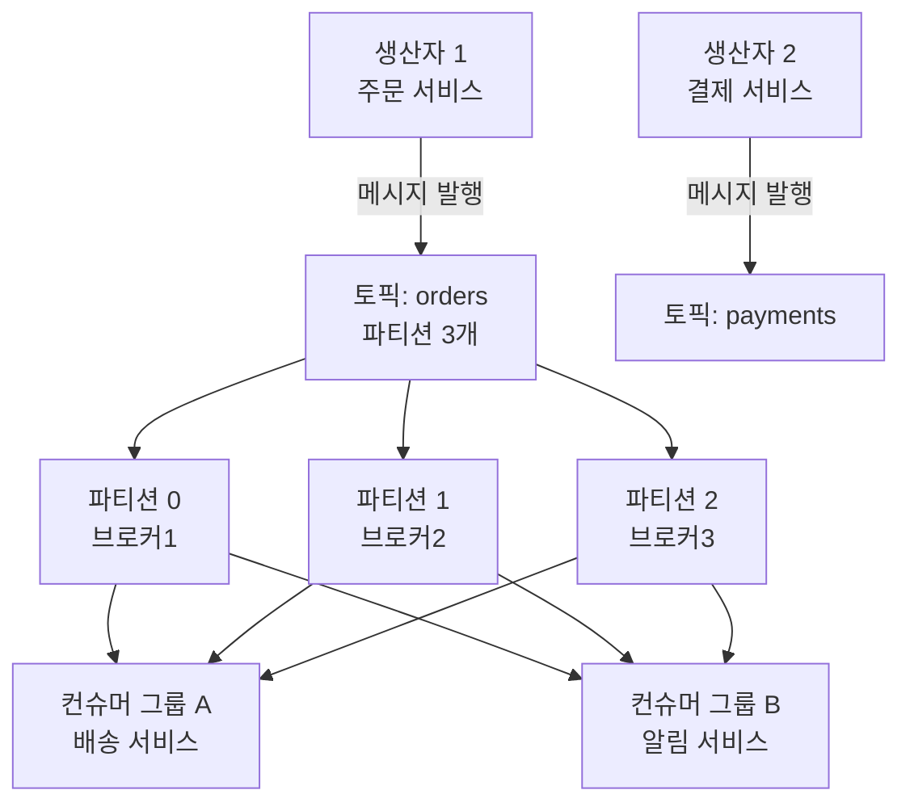

### 핵심 용어 정리

| 용어 | 설명 | 비유 |
|------|------|------|
| Broker | Kafka 서버 1대 | 우체국 지점 |
| Topic | 메시지 분류 채널 | 우편함 이름 |
| Partition | 토픽의 물리적 분할 | 우편함 서랍 |
| Producer | 메시지 생산자 | 편지 발송인 |
| Consumer | 메시지 소비자 | 편지 수신인 |
| Consumer Group | 소비자 그룹 | 같은 회사 팀 |
| Offset | 파티션 내 메시지 위치 | 편지 일련번호 |
| Zookeeper/KRaft | 클러스터 메타데이터 관리 | 우체국 본사 |

---

## 2. 파티션과 오프셋

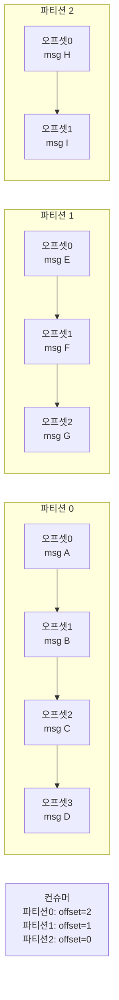

**중요한 특성:**
- 파티션 내에서는 순서 보장
- 파티션 간에는 순서 보장 안됨
- 메시지는 설정된 보관 기간(기본 7일) 동안 유지

---

## 3. Producer 심화

### 파티션 선택 전략

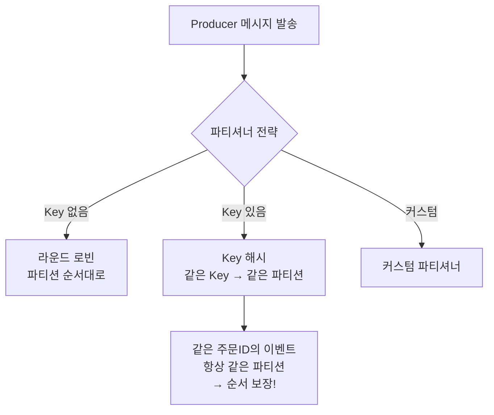

```java
// Kafka Producer 설정
@Configuration
public class KafkaProducerConfig {

    @Bean
    public ProducerFactory<String, String> producerFactory() {
        Map<String, Object> configs = new HashMap<>();
        configs.put(ProducerConfig.BOOTSTRAP_SERVERS_CONFIG, "kafka1:9092,kafka2:9092,kafka3:9092");
        configs.put(ProducerConfig.KEY_SERIALIZER_CLASS_CONFIG, StringSerializer.class);
        configs.put(ProducerConfig.VALUE_SERIALIZER_CLASS_CONFIG, JsonSerializer.class);

        // 안정성 설정
        configs.put(ProducerConfig.ACKS_CONFIG, "all");           // 모든 레플리카 확인
        configs.put(ProducerConfig.RETRIES_CONFIG, Integer.MAX_VALUE);
        configs.put(ProducerConfig.MAX_IN_FLIGHT_REQUESTS_PER_CONNECTION, 5);
        configs.put(ProducerConfig.ENABLE_IDEMPOTENCE_CONFIG, true); // 멱등성

        // 성능 설정
        configs.put(ProducerConfig.BATCH_SIZE_CONFIG, 16384);     // 배치 크기 16KB
        configs.put(ProducerConfig.LINGER_MS_CONFIG, 5);          // 5ms 대기 후 배치 발송
        configs.put(ProducerConfig.COMPRESSION_TYPE_CONFIG, "snappy"); // 압축

        return new DefaultKafkaProducerFactory<>(configs);
    }
}

// 메시지 발행
@Service
public class OrderEventPublisher {

    private final KafkaTemplate<String, OrderEvent> kafkaTemplate;

    public void publishOrderCreated(Order order) {
        OrderEvent event = OrderEvent.from(order);

        ProducerRecord<String, OrderEvent> record = new ProducerRecord<>(
            "orders",
            order.getId(),  // 파티션 키: 주문ID
            event
        );

        // 비동기 발행 + 콜백
        kafkaTemplate.send(record)
            .whenComplete((result, ex) -> {
                if (ex != null) {
                    log.error("발행 실패: {}", ex.getMessage());
                    // DLQ 처리 또는 재시도
                } else {
                    log.info("발행 성공: offset={}, partition={}",
                        result.getRecordMetadata().offset(),
                        result.getRecordMetadata().partition());
                }
            });
    }
}
```

### Producer acks 설정

```
acks=0: 브로커 확인 없이 발송 (가장 빠름, 유실 가능)
acks=1: 리더만 확인 (중간)
acks=all: 모든 ISR 레플리카 확인 (가장 안전, 느림)
```

---

## 4. Consumer 심화

### 컨슈머 그룹과 파티션 배정

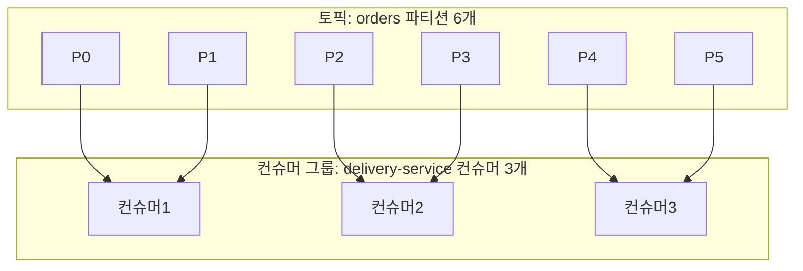

**중요**: 컨슈머 수 > 파티션 수이면 일부 컨슈머는 놀게 됩니다!

```java
// Consumer 설정
@Configuration
public class KafkaConsumerConfig {

    @Bean
    public ConsumerFactory<String, OrderEvent> consumerFactory() {
        Map<String, Object> configs = new HashMap<>();
        configs.put(ConsumerConfig.BOOTSTRAP_SERVERS_CONFIG, "kafka1:9092");
        configs.put(ConsumerConfig.GROUP_ID_CONFIG, "delivery-service");
        configs.put(ConsumerConfig.KEY_DESERIALIZER_CLASS_CONFIG, StringDeserializer.class);
        configs.put(ConsumerConfig.VALUE_DESERIALIZER_CLASS_CONFIG, JsonDeserializer.class);

        // 오프셋 자동 커밋 끄기 (수동 커밋으로 안전하게)
        configs.put(ConsumerConfig.ENABLE_AUTO_COMMIT_CONFIG, false);

        // 처음 구독 시 가장 처음부터 읽기
        configs.put(ConsumerConfig.AUTO_OFFSET_RESET_CONFIG, "earliest");

        // 배치 처리 설정
        configs.put(ConsumerConfig.MAX_POLL_RECORDS_CONFIG, 500);
        configs.put(ConsumerConfig.FETCH_MIN_BYTES_CONFIG, 1024);

        return new DefaultKafkaConsumerFactory<>(configs);
    }
}

// 메시지 처리
@Service
public class OrderEventConsumer {

    @KafkaListener(
        topics = "orders",
        groupId = "delivery-service",
        concurrency = "3"  // 3개 스레드 = 파티션당 1개
    )
    public void consume(
        ConsumerRecord<String, OrderEvent> record,
        Acknowledgment ack
    ) {
        try {
            log.info("메시지 수신: partition={}, offset={}, key={}",
                record.partition(), record.offset(), record.key());

            processOrder(record.value());

            // 처리 성공 후 수동 커밋
            ack.acknowledge();

        } catch (Exception e) {
            log.error("처리 실패: {}", e.getMessage());
            // 재시도 또는 DLQ로 보내기
            throw e;  // 예외 던지면 재처리
        }
    }

    // 배치 처리 (성능 향상)
    @KafkaListener(topics = "orders", groupId = "analytics-service")
    public void consumeBatch(List<ConsumerRecord<String, OrderEvent>> records) {
        log.info("배치 처리: {}건", records.size());

        List<Order> orders = records.stream()
            .map(r -> convertToOrder(r.value()))
            .collect(Collectors.toList());

        orderRepository.saveAll(orders);
    }
}
```

---

## 5. 리밸런싱 (Rebalancing)

컨슈머가 추가/제거될 때 파티션 재배정이 일어납니다.

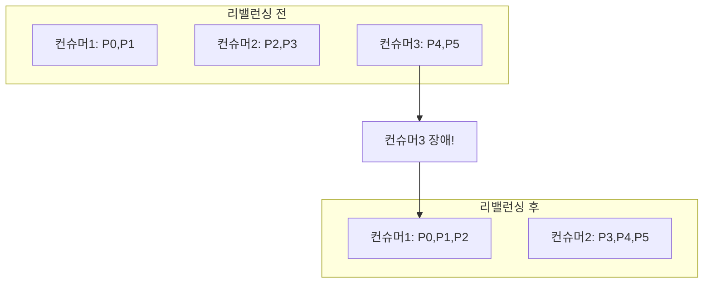

**리밸런싱 문제점과 해결:**
```java
@Component
public class OrderConsumer implements ConsumerAwareRebalanceListener {

    @Override
    public void onPartitionsRevokedBeforeCommit(
        Consumer<?, ?> consumer,
        Collection<TopicPartition> partitions
    ) {
        // 리밸런싱 전 현재 처리 중인 메시지 커밋
        log.info("파티션 반환 전 커밋: {}", partitions);
        consumer.commitSync();
    }

    @Override
    public void onPartitionsAssigned(
        Consumer<?, ?> consumer,
        Collection<TopicPartition> partitions
    ) {
        // 새 파티션 배정 후 처리할 위치 설정
        log.info("새 파티션 배정: {}", partitions);
    }
}
```

---

## 6. ISR (In-Sync Replicas)

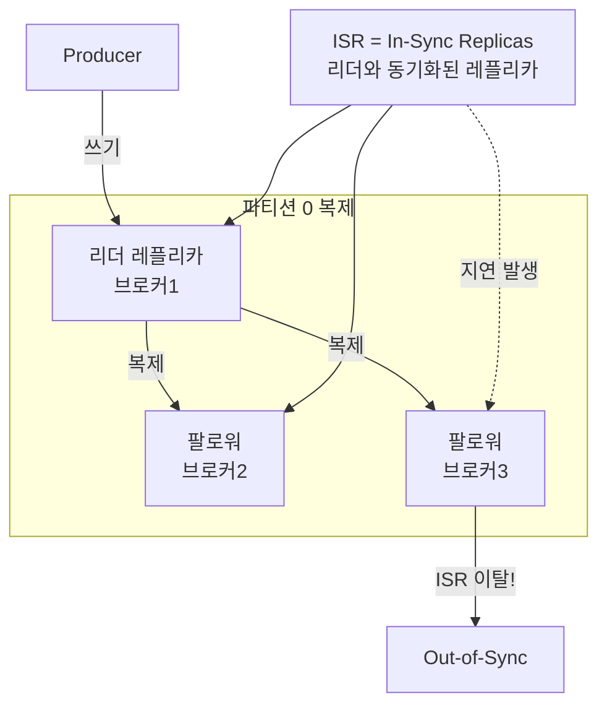

```
replica.lag.time.max.ms = 10000  # 10초 이상 복제 지연 시 ISR에서 제거

acks=all: ISR 내 모든 레플리카가 쓰기 확인해야 성공
min.insync.replicas = 2: 최소 2개 ISR이 있어야 쓰기 허용
```

---

## 7. 정확히 한 번 전송 (Exactly-Once Semantics)

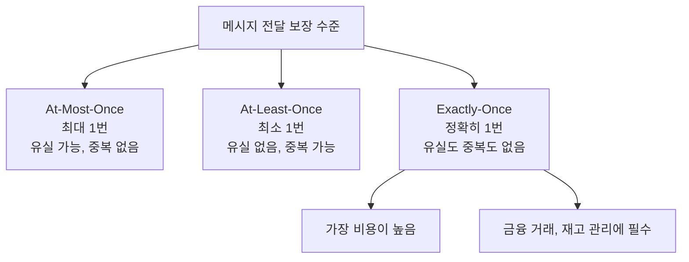

**Exactly-Once 설정:**
```java
// Producer 설정
configs.put(ProducerConfig.ENABLE_IDEMPOTENCE_CONFIG, true);
configs.put(ProducerConfig.TRANSACTIONAL_ID_CONFIG, "order-producer-1");

// 트랜잭셔널 발행
@Service
public class TransactionalProducer {

    public void sendWithTransaction(List<OrderEvent> events) {
        kafkaTemplate.executeInTransaction(operations -> {
            for (OrderEvent event : events) {
                operations.send("orders", event.getOrderId(), event);
            }
            return true;
        });
    }
}

// Consumer - 트랜잭션 커밋된 메시지만 읽기
configs.put(ConsumerConfig.ISOLATION_LEVEL_CONFIG, "read_committed");
```

---

## 8. 스키마 레지스트리 (Schema Registry)

Producer와 Consumer 사이의 메시지 형식을 관리합니다.

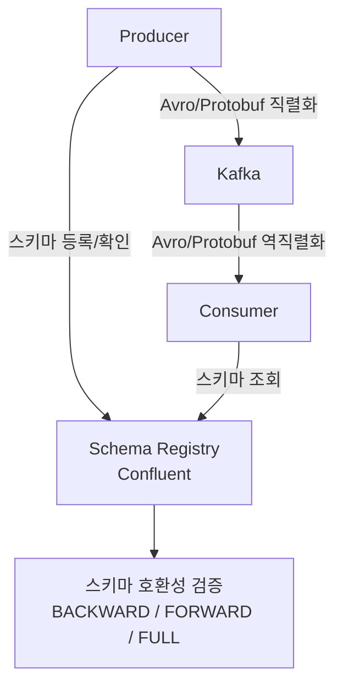

**Avro 스키마 예시:**
```json
{
  "type": "record",
  "name": "OrderEvent",
  "namespace": "com.example.events",
  "fields": [
    {"name": "orderId", "type": "string"},
    {"name": "userId", "type": "string"},
    {"name": "totalAmount", "type": "long"},
    {"name": "status", "type": {"type": "enum", "name": "OrderStatus",
      "symbols": ["CREATED", "PAID", "SHIPPED", "DELIVERED", "CANCELLED"]}},
    {"name": "createdAt", "type": "long", "logicalType": "timestamp-millis"},
    {"name": "items", "type": {"type": "array", "items": {
      "type": "record", "name": "OrderItem",
      "fields": [
        {"name": "productId", "type": "string"},
        {"name": "quantity", "type": "int"},
        {"name": "price", "type": "long"}
      ]
    }}}
  ]
}
```

---

## 9. Kafka Streams

Kafka 내에서 실시간 스트림 처리를 할 수 있습니다.

```java
@Configuration
public class OrderStreamProcessor {

    @Bean
    public KStream<String, OrderEvent> processOrderStream(StreamsBuilder builder) {
        KStream<String, OrderEvent> orders = builder.stream("orders");

        // 1. 필터링: PAID 상태 주문만
        KStream<String, OrderEvent> paidOrders = orders
            .filter((key, value) -> value.getStatus() == OrderStatus.PAID);

        // 2. 변환: 배송 이벤트로 변환
        KStream<String, DeliveryEvent> deliveryEvents = paidOrders
            .mapValues(order -> DeliveryEvent.from(order));

        // 3. 배송 토픽으로 발행
        deliveryEvents.to("delivery-requests");

        // 4. 집계: 5분 윈도우 내 매출 합계
        KTable<Windowed<String>, Long> revenueByWindow = orders
            .filter((k, v) -> v.getStatus() == OrderStatus.PAID)
            .groupBy((key, value) -> value.getCategoryId())
            .windowedBy(TimeWindows.ofSizeWithNoGrace(Duration.ofMinutes(5)))
            .aggregate(
                () -> 0L,
                (key, order, total) -> total + order.getTotalAmount(),
                Materialized.with(Serdes.String(), Serdes.Long())
            );

        // 5. 결과를 실시간 집계 토픽으로
        revenueByWindow.toStream()
            .map((windowedKey, revenue) -> KeyValue.pair(
                windowedKey.key(),
                new RevenueAggregate(windowedKey.key(), revenue, windowedKey.window())
            ))
            .to("revenue-aggregates");

        return orders;
    }
}
```

---

## 10. 데드 레터 큐 (DLQ)

처리 실패한 메시지를 별도 토픽으로 보냅니다.

```java
@Service
public class ResilientConsumer {

    private final KafkaTemplate<String, String> kafkaTemplate;

    @KafkaListener(topics = "orders", groupId = "order-processor")
    public void consume(ConsumerRecord<String, OrderEvent> record, Acknowledgment ack) {
        int maxRetries = 3;

        for (int attempt = 1; attempt <= maxRetries; attempt++) {
            try {
                processOrder(record.value());
                ack.acknowledge();
                return;
            } catch (RetryableException e) {
                if (attempt == maxRetries) {
                    sendToDLQ(record, e);
                    ack.acknowledge();  // DLQ로 보내고 원본 커밋
                } else {
                    log.warn("재시도 {}/{}회: {}", attempt, maxRetries, e.getMessage());
                    Thread.sleep(1000L * attempt);  // 지수 백오프
                }
            } catch (NonRetryableException e) {
                // 재시도해도 의미없는 에러 (잘못된 데이터 등)
                sendToDLQ(record, e);
                ack.acknowledge();
                return;
            }
        }
    }

    private void sendToDLQ(ConsumerRecord<String, OrderEvent> record, Exception e) {
        String dlqTopic = record.topic() + ".DLQ";
        ProducerRecord<String, String> dlqRecord = new ProducerRecord<>(
            dlqTopic,
            record.key(),
            record.value().toString()
        );
        // 에러 정보 헤더에 추가
        dlqRecord.headers().add("error-message", e.getMessage().getBytes());
        dlqRecord.headers().add("original-topic", record.topic().getBytes());
        dlqRecord.headers().add("original-offset", String.valueOf(record.offset()).getBytes());

        kafkaTemplate.send(dlqRecord);
        log.error("DLQ로 이동: topic={}, offset={}", record.topic(), record.offset());
    }
}
```

---

## 11. Kafka 클러스터 설계

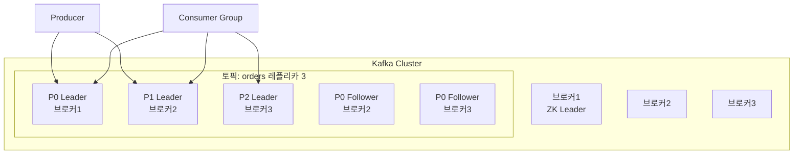

**클러스터 설정 권장값:**
```properties
# server.properties

# 데이터 보관 기간
log.retention.hours=168          # 7일
log.retention.bytes=1073741824   # 1GB

# 복제 설정
default.replication.factor=3     # 레플리카 3개
min.insync.replicas=2            # 최소 2개 ISR

# 파티션당 리더 균형
auto.leader.rebalance.enable=true
leader.imbalance.check.interval.seconds=300

# 성능
num.io.threads=16
num.network.threads=8
socket.send.buffer.bytes=102400
socket.receive.buffer.bytes=102400
```

---

## 12. 실전: 5000억건 금융 데이터 처리 사례

실제 금융사에서 Kafka로 초당 수백만 건의 거래 데이터를 처리하는 아키텍처:

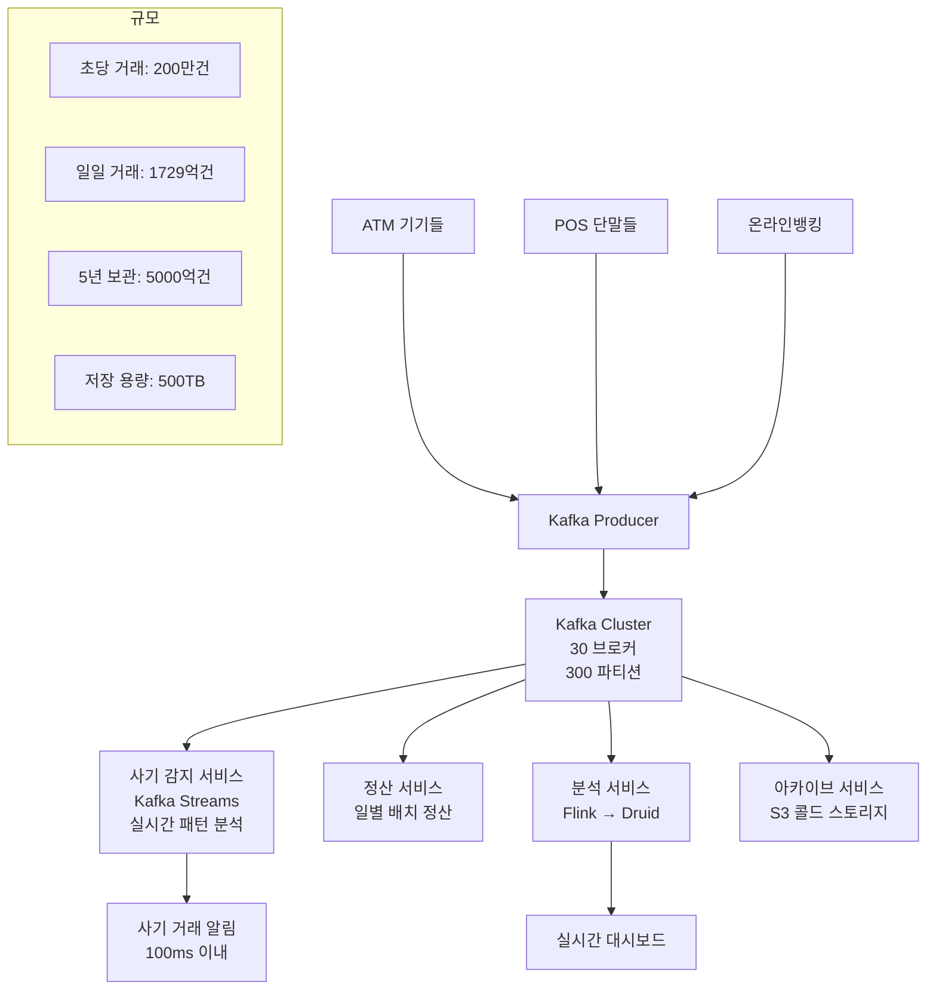

**성능 최적화 포인트:**
```
파티션 수 = 브로커 수 × 10 = 300개
레플리카 수 = 3 (고가용성)
보관 기간 = 7일 (이후 S3로 아카이브)
압축 = LZ4 (빠른 압축/해제)
배치 크기 = 1MB (처리량 극대화)
Consumer 처리량 = 파티션당 초당 1만건 × 300 = 초당 300만건
```

---

## 13. KRaft 모드 (Zookeeper 없는 Kafka)

Kafka 3.x부터 Zookeeper 없이 동작하는 KRaft 모드 지원:

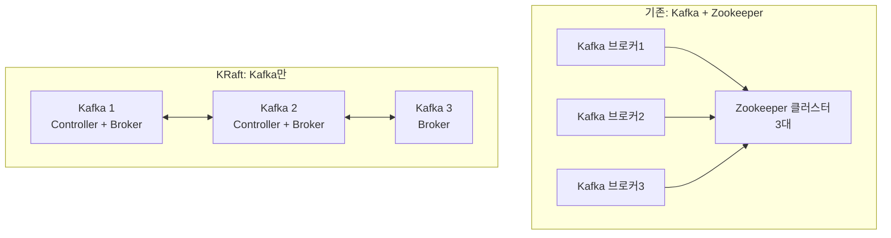

**KRaft 장점:**
- 관리 복잡도 감소 (Zookeeper 불필요)
- 파티션 수 제한 완화 (수백만 파티션 지원)
- 빠른 컨트롤러 페일오버

---

## 14. 극한 시나리오: Kafka 장애 복구

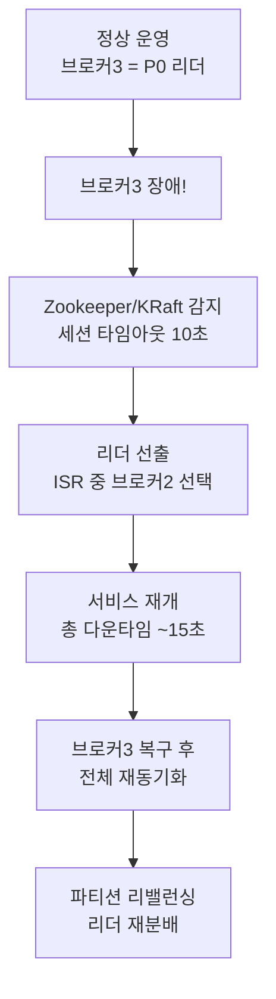

**장애 복구 설정:**
```properties
# 빠른 장애 감지
zookeeper.session.timeout.ms=10000      # 10초
replica.lag.time.max.ms=10000           # 10초 지연 시 ISR 제거

# 언클린 리더 선출 (데이터 유실 vs 가용성)
unclean.leader.election.enable=false    # 금융: 데이터 무결성 우선
# unclean.leader.election.enable=true   # 일반: 가용성 우선
```

---

## 핵심 설계 결정 요약

| 설정 | 권장값 | 이유 |
|------|--------|------|
| 파티션 수 | 브로커 수 × 10 | 병렬 처리 극대화 |
| 레플리카 수 | 3 | 2개 장애 허용 |
| acks | all | 데이터 유실 방지 |
| 압축 | snappy/lz4 | 처리량 vs CPU 균형 |
| 보관 기간 | 7일 | 재처리 여유 |
| 배치 크기 | 16KB~1MB | 처리량 향상 |
| 자동 커밋 | off | 수동 커밋으로 안전하게 |
