시니어 개발자가 처음 Kafka를 쓸 때는 "토픽에 넣고, 토픽에서 꺼낸다"로 시작합니다. 그런데 6개월이 지나면 질문이 달라집니다. "주문 완료 시 네 개 토픽에 동시에 넣어야 하는데, 하나가 실패하면 어떻게 되지?" "결제가 두 번 처리됐다. 왜지?" "배포할 때마다 수초씩 멈추는 이유가 뭔가?" 이 포스트는 그 질문들에 대한 답입니다. 비즈니스 현장에서 실제로 만나는 12가지 시나리오를 구체적인 상황, 코드, 트레이드오프와 함께 다룹니다.

---

## 1. 하나의 기능에서 여러 토픽으로 이벤트 발행

### 어떤 상황인가

이커머스 주문 완료 처리를 생각해봅시다. 주문이 완료되면 네 곳에 알려야 합니다. 결제 서비스(payment.order.completed), 재고 서비스(inventory.order.completed), 알림 서비스(notification.order.completed), 분석 서비스(analytics.order.completed). 각 토픽에 메시지를 보내야 하는데, 중간에 하나라도 실패하면 어떻게 될까요?

### 방법 A: 순차 전송 — 가장 단순하지만 부분 실패가 있다

```java
// 위험한 패턴: 재고 발행 후 알림 발행 실패 시 재고만 차감
@Transactional
public void completeOrder(Order order) {
    orderRepository.save(order);
    kafkaTemplate.send("payment.order.completed", order.getId(), order);
    kafkaTemplate.send("inventory.order.completed", order.getId(), order);
    kafkaTemplate.send("notification.order.completed", order.getId(), order); // 여기서 실패
    kafkaTemplate.send("analytics.order.completed", order.getId(), order);   // 실행 안 됨
}
```

3번째 발행에서 Kafka 브로커가 잠깐 불안정해서 실패했다고 가정합니다.

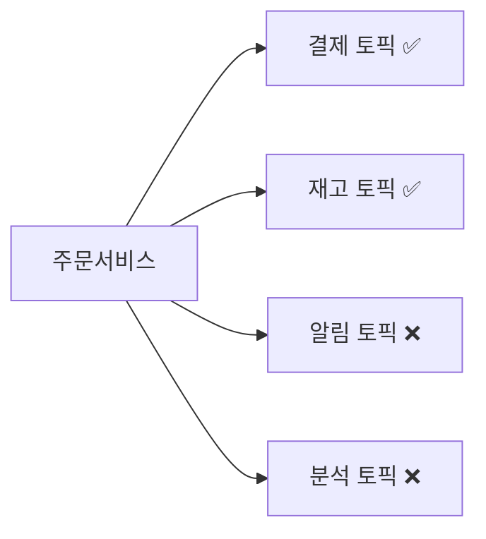

결제와 재고는 이미 처리 중인데 알림과 분석에는 이벤트가 없습니다. DB `@Transactional`은 DB 연산에만 적용되고, Kafka 발행은 **DB 트랜잭션 경계 바깥**에 있습니다.

### 방법 B: Kafka 트랜잭션 — 원자적 멀티 토픽 발행

Kafka 자체 트랜잭션을 쓰면 여러 토픽에 대한 발행을 하나의 원자 단위로 묶을 수 있습니다. 모두 성공하거나 모두 실패합니다.

```java
// application.yml
spring:
  kafka:
    producer:
      transaction-id-prefix: order-tx-
      acks: all
      enable-idempotence: true

// OrderService.java
@Autowired
private KafkaTemplate<String, Object> kafkaTemplate;

public void completeOrder(Order order) {
    orderRepository.save(order);

    kafkaTemplate.executeInTransaction(ops -> {
        ops.send("payment.order.completed",    order.getId(), order);
        ops.send("inventory.order.completed",  order.getId(), order);
        ops.send("notification.order.completed", order.getId(), order);
        ops.send("analytics.order.completed",  order.getId(), order);
        return true;
    });
}
```

단, Kafka 트랜잭션은 **Kafka 내부만 보장**합니다.

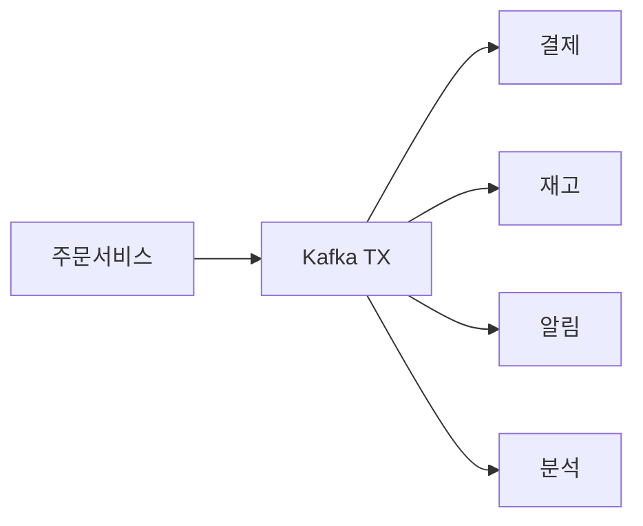

DB 저장과 Kafka 발행을 하나의 원자 단위로 묶지는 못합니다. DB가 커밋됐는데 Kafka 발행이 실패하면 여전히 불일치가 생깁니다.

### 방법 C: 팬아웃 패턴 — 단일 이벤트 + 하류 구독

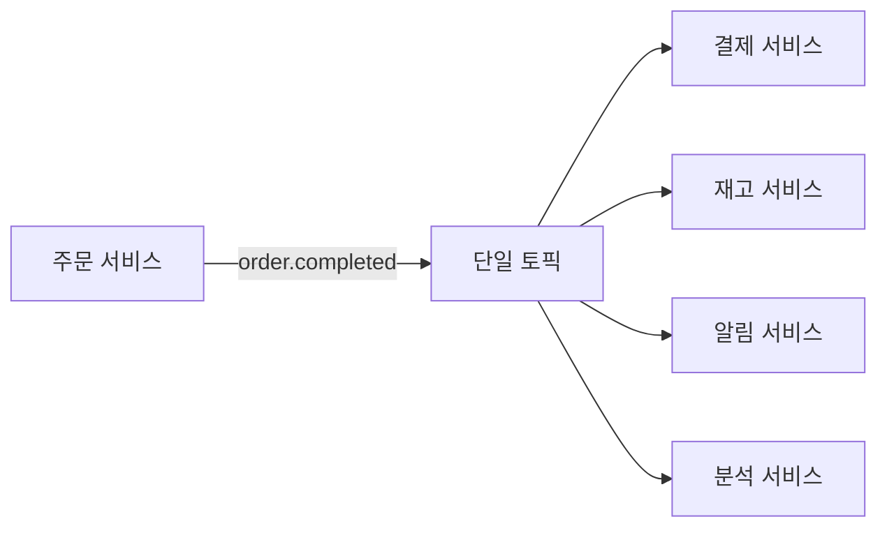

주문 서비스는 `order.completed` 토픽 하나에만 발행합니다. 결제, 재고, 알림, 분석 서비스가 각자 해당 토픽을 구독해서 처리합니다. 주문 서비스는 하류 서비스를 전혀 알 필요가 없습니다. 신규 서비스가 생겨도 주문 서비스 코드는 변경되지 않습니다.

이 패턴의 단점은 모든 하류 서비스가 전체 이벤트 페이로드를 처리해야 한다는 것입니다. 결제 서비스에 불필요한 배송지 정보가 섞여 들어옵니다. 이를 보완하는 게 **이벤트 라우터 패턴**입니다. 라우터 컨슈머가 `order.completed`를 소비해서 각 서비스에 맞게 변환 후 재발행합니다.

### 방법 D: Outbox 패턴 — DB와 이벤트의 완전한 일관성

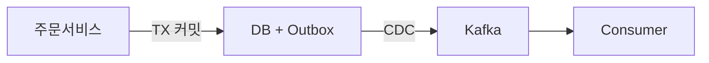

방법 B와 C 모두 DB와 Kafka 사이의 불일치 문제를 완전히 해결하지 못합니다. DB 트랜잭션 안에서 Outbox 테이블에 이벤트를 함께 저장하고, CDC(Debezium)가 Outbox 테이블의 변경을 감지해서 Kafka로 발행합니다.

```java
// 1. 비즈니스 로직과 Outbox를 같은 DB 트랜잭션으로
@Transactional
public void completeOrder(Order order) {
    orderRepository.save(order);  // 주문 저장
    outboxRepository.save(new OutboxEvent(
        "order.completed",        // 토픽
        order.getId(),            // 파티션 키
        objectMapper.writeValueAsString(order)  // 페이로드
    ));
    // DB 커밋 시 둘 다 저장되거나 둘 다 롤백 → 불일치 불가능
}

// 2. Debezium이 outbox 테이블 변경 감지 → Kafka 발행
// docker-compose.yml 또는 Kafka Connect 설정
// connector: io.debezium.connector.mysql.MySqlConnector
// transforms: outbox (io.debezium.transforms.outbox.EventRouter)
```

### 트레이드오프 비교

| 방법 | 구현 복잡도 | 일관성 | 처리량 | 적합한 경우 |
|------|-----------|--------|--------|------------|
| 순차 전송 | 낮음 | 부분 실패 가능 | 높음 | 멱등성 보장되는 시스템 |
| Kafka 트랜잭션 | 중간 | Kafka 내 원자적 | 20~30% 감소 | 멀티 토픽 정합성 필요 |
| 팬아웃 패턴 | 낮음 | 하류 서비스 책임 | 가장 높음 | 서비스 결합도 낮춰야 할 때 |
| Outbox + CDC | 높음 | 완전 보장 | 지연 수백ms | 금융, 결제 무결성 필수 |

### 그래서 뭘 써야 하는가?

```
Phase 1 (스타트업 초기): 팬아웃 패턴 (방법 C)
  → 단일 토픽에 발행하고 하류가 알아서 구독
  → 가장 단순하고 확장성 좋음

Phase 2 (서비스 성장): Kafka 트랜잭션 (방법 B)
  → 멀티 토픽 발행이 필요해지면 전환
  → 20~30% 오버헤드를 감당할 수 있을 때

Phase 3 (결제/금융): Outbox + CDC (방법 D)
  → DB와 이벤트의 100% 일관성이 필수일 때
  → Debezium 운영 부담을 감당할 팀이 있을 때
```

> **핵심**: "어떤 방법이 최선이냐"가 아니라 "현재 단계에서 감당 가능한 복잡도와 요구되는 일관성 수준이 얼마인가"로 결정한다. 대부분의 서비스는 팬아웃 패턴으로 시작해서 충분하다.

---

## 2. 메시지 순서 보장이 필요한 경우

### 어떤 상황인가

주문 서비스에서 하나의 주문이 세 단계를 거칩니다. ORDER_CREATED(주문 생성) → ORDER_PAID(결제 완료) → ORDER_SHIPPED(배송 시작). 배송 서비스는 반드시 이 순서대로 이벤트를 받아야 합니다. ORDER_SHIPPED를 먼저 처리하면 아직 결제도 안 된 주문이 배송 출발 상태가 됩니다.

### 파티션 키 설계가 핵심이다

Kafka는 **파티션 내에서만 순서를 보장**합니다. 따라서 같은 주문의 이벤트는 반드시 같은 파티션으로 가야 합니다. 이를 보장하는 방법이 `orderId`를 파티션 키로 쓰는 것입니다.

```java
// 순서 보장 발행: orderId를 키로 설정
kafkaTemplate.send("order.events", order.getId(), event);
// orderId가 같으면 항상 같은 파티션 → 순서 보장
```

파티셔너는 `hash(key) % partitionCount`로 파티션을 결정합니다. orderId가 `"order-12345"`이면 항상 같은 파티션 번호로 매핑됩니다. 브로커가 재시작되어도, 파티션 수가 변경되지 않는 한 같은 파티션입니다.

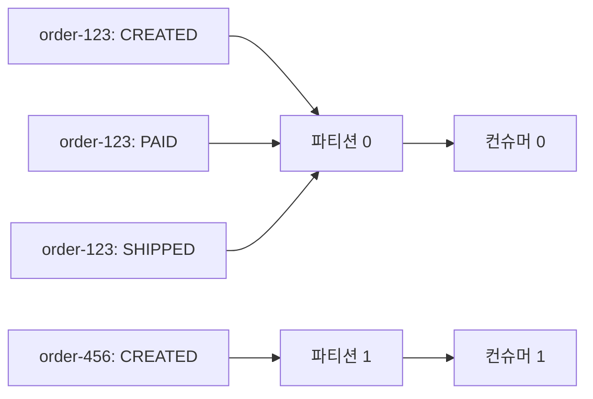

### 순서가 깨지는 케이스 — 재시도 시 역전

```java
// 위험한 설정: 재시도 + 동시 요청 허용
props.put(ProducerConfig.MAX_IN_FLIGHT_REQUESTS_PER_CONNECTION, 5);
props.put(ProducerConfig.RETRIES_CONFIG, 3);
// msg1 발송 → 실패 → 대기 중
// msg2 발송 → 성공
// msg1 재시도 → 성공
// 결과: msg2가 msg1보다 먼저 처리됨
```

메시지 1이 실패해서 재시도 대기 중일 때 메시지 2가 먼저 성공하면, 파티션에 기록되는 순서가 뒤집힙니다. 이를 막는 방법이 `enable.idempotence=true`입니다.

```java
// 안전한 설정
props.put(ProducerConfig.ENABLE_IDEMPOTENCE_CONFIG, true);
// 자동으로:
// - acks=all 로 강제
// - max.in.flight.requests.per.connection=5 이하로 강제
// - retries=Integer.MAX_VALUE 로 강제
// - 재시도 시 순서 역전 방지 (시퀀스 번호 기반 중복 제거)
```

`enable.idempotence=true`는 프로듀서에 시퀀스 번호를 부여하고, 브로커가 중복 쓰기를 감지하면 무시합니다. 재시도가 발생해도 순서와 중복 모두 안전합니다. `max.in.flight=5`는 왜 5가 맥시멈일까요? 브로커가 시퀀스 번호를 추적하는 버퍼 크기가 5이기 때문입니다. 6 이상이면 멱등성 보장이 깨집니다.

### 주의: 파티션 수를 나중에 늘리면 순서가 깨진다

파티션 수를 처음에 10개로 설정했다가 나중에 20개로 늘리면, 기존 orderId의 파티션 매핑이 바뀝니다. `hash("order-123") % 10 = 3`이었던 것이 `hash("order-123") % 20 = 13`이 됩니다. 기존 메시지는 파티션 3에 있고 신규 메시지는 파티션 13에 쌓입니다. 처음부터 파티션 수를 충분히 잡고, **운영 중에는 파티션 수를 변경하지 않는 것**이 원칙입니다.

---

## 3. 정확히 한 번 처리 (Exactly-Once)

### 어떤 상황인가

결제 서비스가 `payment.requested` 이벤트를 소비해서 실제 카드사 API를 호출합니다. 네트워크가 불안정해서 API 응답을 받지 못하면 컨슈머는 재시도합니다. 그런데 카드사 측에서는 이미 결제가 됐을 수 있습니다. 동일 결제가 두 번 처리되는 이중 청구 사고가 발생합니다.

Kafka는 기본적으로 `at-least-once` 전달을 보장합니다. 실패 시 재시도하므로 같은 메시지가 두 번 전달될 수 있습니다. "정확히 한 번"은 **처리 로직이 멱등성을 가져야** 완성됩니다.

### 방법 A: Consumer 멱등성 설계

```java
@KafkaListener(topics = "payment.requested")
public void processPayment(PaymentRequest request) {
    // 1. Redis로 중복 체크 (빠른 경로)
    String dedupKey = "payment:processed:" + request.getPaymentId();
    if (redisTemplate.hasKey(dedupKey)) {
        log.info("중복 메시지 무시: {}", request.getPaymentId());
        return;
    }

    // 2. DB unique constraint로 최종 방어
    try {
        paymentRepository.save(new Payment(request)); // paymentId에 unique index
        cardApiClient.charge(request);
        redisTemplate.opsForValue().set(dedupKey, "1", 24, TimeUnit.HOURS);
    } catch (DataIntegrityViolationException e) {
        log.warn("DB unique constraint로 중복 차단: {}", request.getPaymentId());
    }
}
```

Redis 체크가 빠른 경로고, DB unique constraint가 최후 방어선입니다. Redis가 장애 나도 DB가 막아줍니다. 단, 카드사 API 호출은 멱등 키를 별도로 관리해야 합니다. 외부 API의 멱등성은 해당 API가 지원해야 합니다.

### 방법 B: Kafka Transactions (Consume-Transform-Produce 패턴)

이벤트를 소비하고, 변환 처리 후, 다른 토픽으로 발행하는 파이프라인에서 정확히 한 번을 보장하려면 Kafka 트랜잭션을 씁니다.

```java
@Bean
public ConcurrentKafkaListenerContainerFactory<String, String> kafkaListenerContainerFactory() {
    var factory = new ConcurrentKafkaListenerContainerFactory<String, String>();
    factory.getContainerProperties()
           .setEosMode(ContainerProperties.EOSMode.V2); // Exactly-Once Semantics
    return factory;
}

@Transactional("kafkaTransactionManager")
@KafkaListener(topics = "payment.requested")
public void processAndPublish(PaymentRequest request) {
    // 소비 오프셋 커밋 + 결과 발행이 하나의 트랜잭션
    PaymentResult result = process(request);
    kafkaTemplate.send("payment.completed", result.getOrderId(), result);
    // 트랜잭션 커밋 시: 오프셋 커밋 + 발행이 원자적
    // 실패 시: 오프셋 롤백 → 재소비 → 동일 입력 → 동일 출력 (멱등)
}
```

`EOSMode.V2`는 Kafka 2.5+ 에서 지원하는 트랜잭션 프로토콜로, 컨슈머의 오프셋 커밋과 프로듀서의 발행을 하나의 트랜잭션으로 묶습니다.

### 왜 "정확히 한 번"이 근본적으로 어려운가

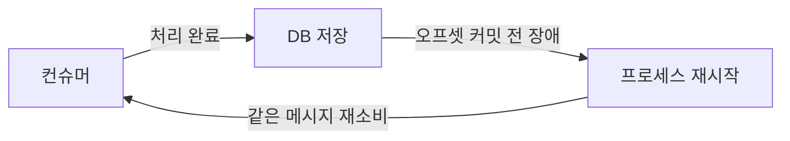

처리는 성공했는데 오프셋 커밋 전에 프로세스가 죽으면? 재시작 후 같은 메시지를 다시 소비합니다. 네트워크는 본질적으로 `at-least-once`입니다. "정확히 한 번"은 **처리 자체가 멱등**하거나 **Kafka 트랜잭션으로 오프셋 커밋과 발행을 원자화**할 때만 달성됩니다. 외부 API 호출(카드사, 문자 발송)이 포함되면 Kafka 트랜잭션만으로는 부족하고 반드시 비즈니스 레벨 멱등성 설계가 필요합니다.

---

## 4. 대용량 메시지 처리

### 어떤 상황인가

상품 카탈로그 서비스가 이미지 업로드 완료 이벤트를 발행합니다. 이벤트 페이로드에 이미지 메타데이터(EXIF 정보, 썸네일 base64, 원본 파일 정보)가 담겨 있어 2MB가 넘습니다. Kafka의 기본 메시지 크기 한도는 `1MB`입니다. 브로커 기본값인 `message.max.bytes=1048576`을 초과하면 `RecordTooLargeException`이 발생합니다.

### 방법 A: message.max.bytes 늘리기

```properties
# 브로커 server.properties
message.max.bytes=10485760       # 10MB
replica.fetch.max.bytes=10485760 # 복제 시에도 동일하게
# 컨슈머
fetch.max.bytes=10485760
max.partition.fetch.bytes=10485760
```

가장 단순하지만 문제가 있습니다. 브로커는 메시지를 메모리에 올려 처리합니다. 10MB 메시지가 초당 1000개 들어오면 브로커 메모리가 10GB 이상 필요합니다. 복제 트래픽도 메시지 크기에 비례해서 늘어납니다. 대용량 메시지 몇 개 때문에 전체 브로커 성능이 저하됩니다.

### 방법 B: Claim Check 패턴 — 현업 표준

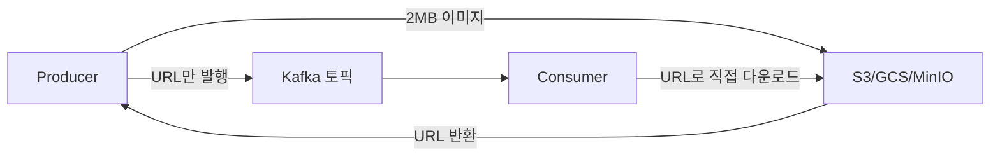

```java
// Producer: 파일은 S3에, 참조만 Kafka로
public void publishImageEvent(byte[] imageData, String orderId) {
    // 1. S3 업로드
    String s3Key = "images/" + orderId + "/" + UUID.randomUUID() + ".jpg";
    s3Client.putObject(PutObjectRequest.builder()
        .bucket("my-bucket").key(s3Key).build(),
        RequestBody.fromBytes(imageData));

    // 2. URL만 Kafka로 발행 (수십 바이트)
    ImageEvent event = ImageEvent.builder()
        .orderId(orderId)
        .s3Bucket("my-bucket")
        .s3Key(s3Key)
        .contentType("image/jpeg")
        .size(imageData.length)
        .build();

    kafkaTemplate.send("image.uploaded", orderId, event);
}

// Consumer: Kafka 메시지는 작게, 실제 데이터는 S3에서
@KafkaListener(topics = "image.uploaded")
public void processImage(ImageEvent event) {
    byte[] imageData = s3Client.getObjectAsBytes(
        GetObjectRequest.builder()
            .bucket(event.getS3Bucket())
            .key(event.getS3Key())
            .build()
    ).asByteArray();
    // 이미지 처리 로직
}
```

Kafka는 수십 바이트짜리 메타데이터만 처리하고, 실제 대용량 데이터는 S3에서 직접 가져옵니다. Kafka의 처리량이 데이터 크기와 무관해집니다. 단점은 S3 조회가 추가되므로 지연이 수십 ms 늘어납니다. S3 장애 시 처리 불가능합니다.

### 방법 C: 청크 분할 (비추천)

2MB 메시지를 256KB씩 8개로 쪼개서 발행하고 컨슈머에서 재조립하는 방법입니다. Confluent의 `kafka-chunking-serializer` 라이브러리가 이를 지원합니다. 하지만 재조립 로직의 복잡도, 청크 일부 실패 시 처리, 재조립 전까지의 메모리 유지 등 문제가 많아 실무에서는 Claim Check 패턴이 압도적으로 선호됩니다.

---

## 5. Dead Letter Queue (DLQ) 설계

### 어떤 상황인가

알림 서비스가 `notification.requested` 이벤트를 소비해서 SMS를 발송합니다. 특정 메시지의 전화번호 형식이 잘못돼서 파싱 예외가 발생합니다. 재시도해도 계속 실패합니다. 이 메시지가 파티션을 막고 있으면 뒤에 쌓인 정상 메시지들도 처리되지 않습니다. 소독이 안 된 메시지 하나가 전체 처리 파이프라인을 멈추는 **poison pill** 현상입니다.

### 재시도 전략: 점진적 지연 + DLQ

```java
// Spring Kafka 재시도 + DLQ 설정
@Bean
public DefaultErrorHandler errorHandler(KafkaOperations<String, Object> ops) {
    // 재시도 간격: 즉시 → 1초 → 5초 → 10초 (총 4회)
    ExponentialBackOffWithMaxRetries backOff = new ExponentialBackOffWithMaxRetries(4);
    backOff.setInitialInterval(1_000L);
    backOff.setMultiplier(5.0);
    backOff.setMaxInterval(10_000L);

    // DLQ로 보낼 토픽: {원본토픽}.DLT
    DeadLetterPublishingRecoverer recoverer = new DeadLetterPublishingRecoverer(ops,
        (record, ex) -> new TopicPartition(record.topic() + ".DLT", record.partition()));

    return new DefaultErrorHandler(recoverer, backOff);
}

@Bean
public ConcurrentKafkaListenerContainerFactory<String, Object> factory(
        ConsumerFactory<String, Object> cf,
        DefaultErrorHandler errorHandler) {
    var factory = new ConcurrentKafkaListenerContainerFactory<String, Object>();
    factory.setConsumerFactory(cf);
    factory.setCommonErrorHandler(errorHandler);
    return factory;
}
```

DLQ로 이동된 메시지에는 실패 원인, 원본 토픽, 파티션, 오프셋 정보가 헤더에 자동으로 첨부됩니다.

### DLQ 처리 흐름

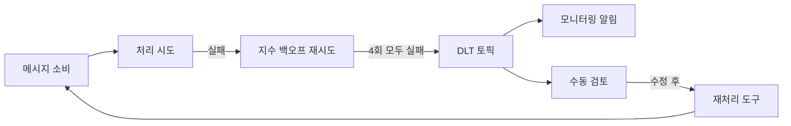

### DLQ 모니터링 + 수동 재처리 도구

```java
// DLQ 소비 + 수동 재처리
@KafkaListener(topics = "notification.requested.DLT")
public void monitorDlq(
        @Payload String payload,
        @Header(KafkaHeaders.RECEIVED_TOPIC) String topic,
        @Header("kafka_dlt-original-offset") long originalOffset,
        @Header("kafka_dlt-exception-message") String errorMsg) {

    log.error("DLQ 메시지 감지 | topic={} offset={} error={}", topic, originalOffset, errorMsg);
    alertService.sendSlack(
        String.format("DLQ 적재: %s (offset %d) — %s", topic, originalOffset, errorMsg));

    // 복구 가능한 오류라면 자동 재처리
    if (isRetryable(errorMsg)) {
        kafkaTemplate.send("notification.requested", payload);
    }
}
```

DLQ가 쌓이기 시작하면 단순히 "메시지가 실패했다"가 아니라 **비즈니스 로직 버그나 외부 API 장애의 신호**입니다. DLQ 모니터링은 프로덕션 알림의 1순위여야 합니다.

---

## 6. Consumer Group 리밸런싱 최소화

### 어떤 상황인가

결제 서비스를 배포합니다. Kubernetes에서 롤링 업데이트가 시작되면 기존 파드가 종료되고 새 파드가 뜹니다. 파드가 종료되면 컨슈머 그룹에서 탈퇴 이벤트가 발생하고, 새 파드가 뜨면 합류 이벤트가 발생합니다. **리밸런싱이 두 번** 일어나고, 각 리밸런싱 동안 수 초에서 수십 초간 처리가 완전히 중단됩니다.

### CooperativeStickyAssignor — 점진적 리밸런싱

기본 `RangeAssignor`는 리밸런싱 시 모든 파티션 할당을 철회하고 처음부터 다시 배분합니다. `CooperativeStickyAssignor`는 변경이 필요한 파티션만 재할당합니다.

```java
// Consumer 설정
props.put(ConsumerConfig.PARTITION_ASSIGNMENT_STRATEGY_CONFIG,
    CooperativeStickyAssignor.class.getName());
```

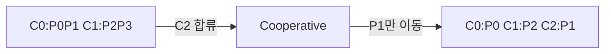

기존 할당자는 리밸런싱 중 모든 컨슈머가 멈춥니다. Cooperative는 이동이 필요 없는 파티션은 계속 처리하면서 필요한 것만 재할당합니다.

### static.group.instance.id — 롤링 배포 중 불필요한 리밸런싱 방지

```java
// 각 파드에 고정 ID 부여 (k8s: 파드 이름 활용)
props.put(ConsumerConfig.GROUP_INSTANCE_ID_CONFIG,
    System.getenv("HOSTNAME")); // payment-service-pod-0

props.put(ConsumerConfig.SESSION_TIMEOUT_MS_CONFIG, 45_000); // 45초
```

`GROUP_INSTANCE_ID`를 설정하면 컨슈머가 일시적으로 연결을 끊어도 `session.timeout.ms` 동안 그룹에 남아 있는 것으로 처리됩니다. 롤링 배포 시 기존 파드가 죽고 새 파드가 뜨는 시간이 45초 이내라면 리밸런싱이 발생하지 않습니다. 새 파드가 같은 `GROUP_INSTANCE_ID`로 합류하면 기존 파티션 할당을 그대로 이어받습니다.

주의: `session.timeout.ms`를 너무 길게 잡으면 실제 장애 발생 시 리밸런싱이 늦어집니다. 배포 소요 시간 + 10초 정도가 적절합니다.

---

## 7. 이벤트 스키마 진화

### 어떤 상황인가

`order.completed` 이벤트에 처음에는 `orderId`, `userId`, `amount` 세 개 필드만 있었습니다. 6개월 후 마케팅팀에서 `couponCode` 필드를 추가해달라고 합니다. 그런데 구독 중인 서비스가 다섯 개입니다. 모두 동시에 배포할 수는 없습니다. 신규 프로듀서가 `couponCode`를 추가한 메시지를 발행하는데, 구버전 컨슈머가 이 메시지를 처리할 수 있어야 합니다.

### 호환성 세 가지 유형

```
Forward Compatibility(전진 호환):  신버전 Producer → 구버전 Consumer 처리 가능
                                    (필드 추가 OK, 기존 필드 삭제 NG)
Backward Compatibility(후진 호환): 구버전 Producer → 신버전 Consumer 처리 가능
                                    (기존 필드 삭제 OK, 신규 필드 기본값 필요)
Full Compatibility(완전 호환):     양방향 모두 가능 — 가장 안전하나 제약 가장 큼
```

실무에서 가장 많이 쓰이는 것은 `BACKWARD` 호환성입니다. 프로듀서를 먼저 배포해도 기존 컨슈머가 처리할 수 있고, 이후 컨슈머를 배포하면 신규 필드도 활용할 수 있습니다.

### 방법 A: Avro + Schema Registry

```java
// 스키마 정의 (order_completed_v2.avsc)
{
  "type": "record",
  "name": "OrderCompleted",
  "namespace": "com.example.order",
  "fields": [
    {"name": "orderId",    "type": "string"},
    {"name": "userId",     "type": "string"},
    {"name": "amount",     "type": "double"},
    {"name": "couponCode", "type": ["null", "string"], "default": null} // 신규 필드: nullable + default
  ]
}

// application.yml
spring:
  kafka:
    producer:
      value-serializer: io.confluent.kafka.serializers.KafkaAvroSerializer
    properties:
      schema.registry.url: http://schema-registry:8081
      auto.register.schemas: false   # 운영에서는 수동 등록 필수
      use.latest.version: true
```

Schema Registry는 스키마를 중앙 저장하고, 발행 시 스키마 ID만 메시지에 포함합니다. 컨슈머가 스키마 ID로 Registry에서 스키마를 가져와 역직렬화합니다. `auto.register.schemas=false`로 설정해야 실수로 깨진 스키마가 등록되는 걸 막을 수 있습니다.

### 방법 B: JSON + 버전 필드

```json
{
  "schemaVersion": 2,
  "orderId": "order-123",
  "userId": "user-456",
  "amount": 50000,
  "couponCode": "SUMMER10"
}
```

```java
@KafkaListener(topics = "order.completed")
public void handle(OrderCompletedEvent event) {
    switch (event.getSchemaVersion()) {
        case 1 -> handleV1(event);
        case 2 -> handleV2(event);
        default -> log.warn("알 수 없는 스키마 버전: {}", event.getSchemaVersion());
    }
}
```

JSON 방식은 Schema Registry 인프라 없이 간단하게 시작할 수 있습니다. 단점은 스키마 버전 관리를 코드와 문서로만 해야 하고, 컴파일 타임 검증이 없습니다.

| 항목 | Avro + Schema Registry | JSON + 버전 필드 |
|------|----------------------|----------------|
| 메시지 크기 | 작음 (바이너리) | 큼 (텍스트) |
| 호환성 검증 | 자동 (Registry) | 수동 |
| 설정 복잡도 | 높음 | 낮음 |
| 가독성 | 낮음 | 높음 |
| 적합 상황 | 고처리량, 다수 팀 | 초기 단계, 소규모 |

---

## 8. 멀티 클러스터 복제

### 어떤 상황인가

결제 서비스가 서울 리전의 Kafka 클러스터에서 운영 중입니다. 재해 발생으로 서울 리전 전체가 다운되면 결제 처리가 불가능합니다. 부산 리전에 DR 클러스터를 두고, 서울 클러스터의 데이터를 실시간으로 복제해야 합니다.

### MirrorMaker 2 구성

```yaml
# mm2.properties
clusters = seoul, busan
seoul.bootstrap.servers = seoul-kafka:9092
busan.bootstrap.servers = busan-kafka:9092

# 서울 → 부산 방향 복제
seoul->busan.enabled = true
seoul->busan.topics = payment\..*, order\..*  # 정규식으로 선택

# 오프셋 동기화 (failover 시 재처리 방지)
sync.group.offsets.enabled = true
sync.group.offsets.interval.seconds = 30

# 복제된 토픽 이름: seoul.payment.completed (prefix 자동 추가)
replication.factor = 3
```

MirrorMaker 2는 오프셋까지 복제합니다. 서울이 다운됐을 때 부산으로 failover하면 마지막으로 커밋된 오프셋부터 이어서 처리할 수 있습니다.

### Active-Active vs Active-Passive

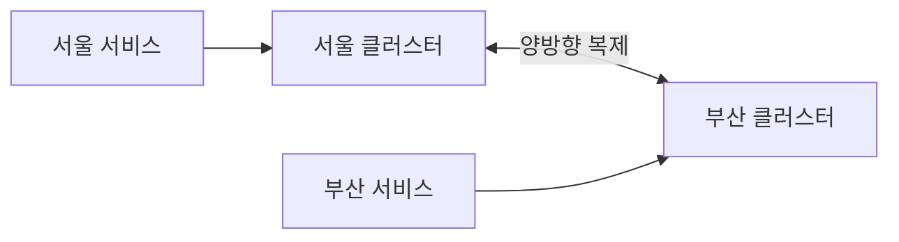

**Active-Active**: 두 클러스터 모두 트래픽을 처리하고 서로 복제합니다. 지연 없이 양 리전 서비스 가능. 단, 동일 메시지가 양쪽에서 처리되는 중복 처리 문제가 생깁니다. 루프 방지 로직이 필수입니다(MirrorMaker 2의 `provenance` 헤더 활용).

**Active-Passive**: 서울만 트래픽을 처리하고 부산은 복제만 받습니다. 장애 시 수동 또는 자동 failover합니다. 중복 처리 문제가 없지만, failover 동안 수십 초의 서비스 중단이 발생합니다.

결제같이 중복이 치명적인 시스템은 Active-Passive가 안전합니다. 로그 분석처럼 중복이 허용되는 시스템은 Active-Active가 효율적입니다.

---

## 9. 실시간 스트림 처리

### 어떤 상황인가

마케팅팀에서 요청합니다. "5분 단위로 카테고리별 매출 합산을 실시간으로 보여주세요." `order.completed` 이벤트가 초당 수백 건씩 들어오는데, 5분 윈도우로 집계해야 합니다. Consumer에서 직접 처리하면 어떻게 될까요?

```java
// 잘못된 접근: Consumer에서 직접 집계
Map<String, Long> salesByCategory = new ConcurrentHashMap<>();

@KafkaListener(topics = "order.completed")
public void aggregate(Order order) {
    salesByCategory.merge(order.getCategory(), order.getAmount(), Long::sum);
    // 문제 1: 재시작하면 집계가 초기화됨
    // 문제 2: 5분 윈도우 경계 처리가 없음
    // 문제 3: 컨슈머 여러 개면 각자 다른 집계 결과
    // 문제 4: 늦게 도착한 이벤트(late arrival) 처리 불가
}
```

### Kafka Streams로 제대로 구현

```java
@Bean
public KStream<String, Order> salesAggregation(StreamsBuilder builder) {
    KStream<String, Order> orders = builder.stream("order.completed",
        Consumed.with(Serdes.String(), orderSerde));

    orders
        .groupBy((key, order) -> order.getCategory(),
            Grouped.with(Serdes.String(), orderSerde))
        .windowedBy(TimeWindows.ofSizeWithNoGrace(Duration.ofMinutes(5)))
        .aggregate(
            () -> 0L,
            (category, order, total) -> total + order.getAmount(),
            Materialized.as("sales-by-category-store"))
        .toStream()
        .map((windowedKey, total) -> KeyValue.pair(
            windowedKey.key(),
            new SalesAggResult(windowedKey.key(), windowedKey.window().start(), total)))
        .to("sales.aggregated.5min", Produced.with(Serdes.String(), salesAggSerde));

    return orders;
}
```

Kafka Streams는 상태를 로컬 RocksDB에 저장하고 Kafka 변경 로그 토픽으로 백업합니다. 재시작해도 상태가 복원됩니다. 늦게 도착한 이벤트(late arrival)는 `withGracePeriod`로 허용 범위를 지정합니다.

### 기술 선택 기준

| 기술 | 특징 | 적합한 경우 |
|------|------|------------|
| Kafka Streams | 라이브러리, 별도 클러스터 없음 | 단일 서비스 내 집계, Java 기반 팀 |
| ksqlDB | SQL 문법, 빠른 프로토타이핑 | PoC, 분석팀 셀프서비스 |
| Apache Flink | 정확한 이벤트 타임, 고가용성 | 대규모 복잡 집계, 정확한 결과 |
| Spark Streaming | 마이크로 배치, 생태계 풍부 | 기존 Spark 팀, 배치 + 스트리밍 혼용 |

Kafka Streams는 별도 클러스터 없이 Java 의존성 하나만으로 동작합니다. 초당 수만 건 이하 처리에서는 Flink보다 단순하고 운영 비용이 낮습니다. Flink는 정확한 이벤트 시간 처리와 고가용성이 필요한 금융 수준의 집계에 적합합니다.

---

## 10. 모니터링 핵심 메트릭

### 어떤 상황인가

새벽 3시에 알림이 옵니다. "결제 서비스가 느려졌습니다." 장애 대응에서 가장 먼저 봐야 할 Kafka 지표가 무엇인지 모르면 원인 파악에 수십 분을 허비합니다.

### 반드시 모니터링해야 할 3가지

**1) Consumer Lag: 가장 중요한 지표**

Consumer Lag = 최신 오프셋 - 컨슈머가 처리한 오프셋. 처리량보다 발행량이 많으면 Lag이 쌓입니다. Lag이 쌓이면 실시간 처리가 불가능하고 결국 OOM이나 타임아웃으로 이어집니다.

```bash
# CLI로 확인
kafka-consumer-groups.sh --bootstrap-server kafka:9092 \
  --group payment-service --describe

# GROUP         TOPIC           PARTITION  CURRENT-OFFSET  LOG-END-OFFSET  LAG
# payment-svc   payment.req     0          12340           12890           550  ← 경보!
```

Lag이 갑자기 급증하면 세 가지를 확인합니다. 컨슈머 처리 속도가 느려졌나(외부 API 지연), 발행량이 갑자기 늘었나(트래픽 급증), 컨슈머 인스턴스 수가 줄었나(파드 다운).

**2) Under-Replicated Partitions: 브로커 이상 신호**

```bash
kafka-topics.sh --bootstrap-server kafka:9092 --describe --under-replicated-partitions
```

Under-Replicated Partition이 0이 아니면 브로커 하나 이상이 팔로워 복제를 따라잡지 못하는 상태입니다. 이 상태에서 리더 브로커가 죽으면 데이터 유실이 발생할 수 있습니다. 즉각 대응이 필요한 P0 경보입니다.

**3) Producer/Consumer Request Latency**

발행 응답 시간이 갑자기 늘면 브로커 디스크 I/O 포화 또는 GC 일시 정지가 원인인 경우가 많습니다.

### Prometheus + Grafana 연동

```yaml
# docker-compose.yml — kafka-exporter
kafka-exporter:
  image: danielqsj/kafka-exporter:latest
  command:
    - --kafka.server=kafka:9092
  ports:
    - "9308:9308"
```

```yaml
# prometheus.yml
scrape_configs:
  - job_name: kafka
    static_configs:
      - targets: ['kafka-exporter:9308']
```

```
# Grafana 알림 규칙 예시 (PromQL)
# Consumer Lag 1만 초과 시 경보
kafka_consumergroup_lag_sum{consumergroup="payment-service"} > 10000

# Under-Replicated Partition 1개 이상 시 경보
kafka_topic_partition_under_replicated_partition > 0
```

Burrow(LinkedIn 오픈소스)는 Lag을 단순 숫자가 아닌 **추세(증가 중/감소 중/정지)**로 판단합니다. Lag이 크더라도 감소 추세면 정상 처리 중이므로 알림을 억제합니다. 거짓 양성 알림을 줄이는 데 효과적입니다.

### Lag 급증 시 대응 플로우

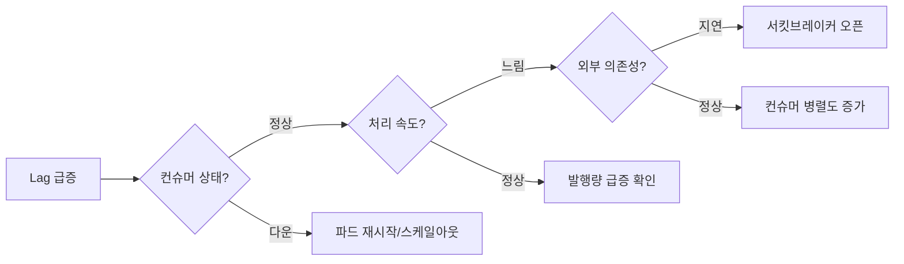

---

## 11. 토픽 설계 전략

### 어떤 상황인가

팀이 처음 Kafka를 도입할 때 토픽 설계를 대충 하면 나중에 큰 대가를 치릅니다. 토픽 이름 변경은 기존 컨슈머 마이그레이션을 요구하고, 파티션 수 변경은 순서 보장을 깨트립니다. **토픽 설계는 DB 스키마 설계만큼 신중**해야 합니다.

### 토픽 하나 vs 이벤트 타입별 토픽 분리

**토픽 하나에 여러 이벤트 타입 (비추천)**

```
order.events → OrderCreated, OrderPaid, OrderCancelled, OrderShipped 모두 섞임
```

컨슈머가 모든 이벤트를 받아서 타입 필터링을 직접 해야 합니다. 스키마 진화 시 여러 이벤트 타입을 한꺼번에 관리해야 합니다. 특정 이벤트만 재처리하거나 DLQ를 운영할 때 복잡해집니다.

**이벤트 타입별 토픽 분리 (권장)**

```
order.order.created
order.order.paid
order.order.cancelled
order.order.shipped
```

각 이벤트 타입의 처리량, 보관 기간, 파티션 수를 독립적으로 조정할 수 있습니다. `OrderCancelled`는 드물게 발행되므로 파티션 3개, `OrderPaid`는 자주 발행되므로 파티션 12개처럼 독립 설정이 가능합니다.

### 파티션 수 결정 공식

```
최소 파티션 수 = ceil(목표 처리량 / 컨슈머 1개의 처리량)

예시:
- 목표: 초당 10만 건
- 컨슈머 1개: 초당 1만 건 처리
- 최소 파티션 수: ceil(10만 / 1만) = 10개
- 여유분 고려: 12~15개 권장
```

파티션은 늘릴 수 있지만 줄일 수 없습니다. 처음부터 여유 있게 잡되, 너무 많이 잡으면 브로커 메모리와 파일 핸들러 수가 증가합니다. 파티션 하나당 리더 브로커에서 최소 2개의 파일(인덱스, 세그먼트)이 열립니다. 브로커 하나에 파티션이 1만 개를 넘으면 성능 저하가 시작됩니다.

### 토픽 네이밍 컨벤션

```
{도메인}.{엔티티}.{이벤트}
{도메인}.{엔티티}.{이벤트}.{환경}  # 멀티 환경 시

예시:
order.payment.completed        ← 주문 도메인, 결제 엔티티, 완료 이벤트
inventory.product.stock-low    ← 재고 도메인, 상품 엔티티, 재고부족 이벤트
user.account.password-changed  ← 사용자 도메인, 계정 엔티티, 패스워드변경 이벤트

내부 처리용:
order.payment.completed.retry  ← 재시도 토픽
order.payment.completed.DLT    ← DLQ 토픽
```

대소문자는 소문자 + 하이픈 또는 소문자 + 점 둘 중 하나로 통일합니다. 팀 내 컨벤션을 정하고 `topic-naming-policy`를 Schema Registry나 내부 문서로 강제합니다.

---

## 12. Kafka Connect 활용

### 어떤 상황인가

데이터 엔지니어링팀이 MySQL 주문 테이블의 모든 변경사항을 Kafka로 스트리밍하고 싶습니다. 그리고 Kafka의 이벤트를 Elasticsearch에 실시간으로 색인하고, S3에 일별로 아카이빙하고 싶습니다. 이 모든 것을 직접 Producer/Consumer로 구현하려면 수 주가 걸립니다. Kafka Connect는 이런 연동을 설정 파일 몇 줄로 처리합니다.

### Debezium CDC — DB 변경사항을 Kafka로

Debezium은 MySQL의 **바이너리 로그(binlog)**를 읽어 INSERT/UPDATE/DELETE를 Kafka 이벤트로 변환합니다. 애플리케이션 코드 수정 없이 DB 변경사항이 실시간으로 Kafka에 흐릅니다.

```json
// Debezium MySQL Source Connector 등록
POST /connectors
{
  "name": "mysql-orders-connector",
  "config": {
    "connector.class": "io.debezium.connector.mysql.MySqlConnector",
    "database.hostname": "mysql",
    "database.port": "3306",
    "database.user": "debezium",
    "database.password": "dbz",
    "database.server.name": "mysql-prod",
    "table.include.list": "shop.orders,shop.payments",
    "database.history.kafka.topic": "dbhistory.mysql",
    "transforms": "unwrap",
    "transforms.unwrap.type": "io.debezium.transforms.ExtractNewRecordState",
    "transforms.unwrap.drop.tombstones": "false"
  }
}
```

등록하면 `mysql-prod.shop.orders` 토픽이 자동 생성되고, orders 테이블의 모든 INSERT/UPDATE/DELETE가 실시간으로 흐릅니다.

### Elasticsearch Sink Connector — 검색 색인 자동화

```json
POST /connectors
{
  "name": "elasticsearch-orders-sink",
  "config": {
    "connector.class": "io.confluent.connect.elasticsearch.ElasticsearchSinkConnector",
    "connection.url": "http://elasticsearch:9200",
    "topics": "mysql-prod.shop.orders",
    "key.ignore": "false",
    "schema.ignore": "true",
    "transforms": "dropPrefix",
    "transforms.dropPrefix.type": "org.apache.kafka.connect.transforms.ReplaceField$Value",
    "transforms.dropPrefix.exclude": "__deleted"
  }
}
```

`order.completed` 이벤트가 Kafka에 발행되는 동시에 Elasticsearch에 자동으로 색인됩니다. 검색 서비스는 Elasticsearch를 조회하면 됩니다. 직접 컨슈머를 만들었다면 역직렬화, 인덱스 매핑 관리, 배치 처리, 장애 복구 로직을 모두 직접 구현해야 했습니다.

### 커넥터 vs 직접 Consumer: 언제 무엇을 쓰나

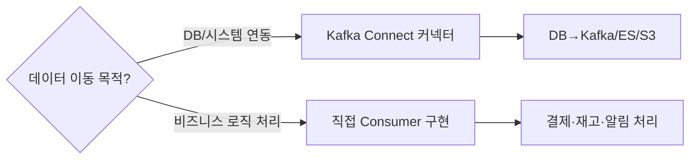

| 판단 기준 | Kafka Connect | 직접 Consumer |
|----------|--------------|--------------|
| 데이터 이동 (A→B) | 적합 | 과도함 |
| 비즈니스 로직 처리 | 부적합 | 적합 |
| 데이터 변환 | SMT로 단순 변환만 | 복잡한 변환 |
| 운영 관리 | REST API로 중앙 관리 | 개별 관리 |
| 장애 복구 | 내장 | 직접 구현 |

커넥터의 가장 큰 장점은 **운영입니다.** 여러 커넥터를 REST API 하나로 중앙 관리하고, 각 커넥터의 상태, Lag, 오류를 대시보드에서 확인할 수 있습니다. 비즈니스 로직이 섞인 복잡한 처리는 직접 Consumer를 구현하는 것이 코드 명확성과 테스트 용이성 면에서 유리합니다.

---

## 정리: 시나리오별 빠른 참조표

| 시나리오 | 핵심 해법 | 주의사항 |
|---------|----------|---------|
| 멀티 토픽 발행 | 팬아웃 패턴 + Outbox | DB-Kafka 불일치 반드시 고려 |
| 순서 보장 | orderId 파티션 키 + enable.idempotence | 파티션 수 변경 금지 |
| 정확히 한 번 | 비즈니스 멱등성 + DB unique + Redis dedup | 외부 API는 별도 멱등 키 |
| 대용량 메시지 | Claim Check 패턴 (S3) | S3 단일장애점 고려 |
| 실패 처리 | 지수 백오프 + DLQ | DLQ 모니터링 필수 |
| 배포 중 중단 | CooperativeStickyAssignor + static.group.instance.id | session.timeout 튜닝 |
| 스키마 진화 | Avro + Schema Registry (BACKWARD) | auto.register.schemas=false |
| DR 복제 | MirrorMaker 2 | Active-Active는 중복 방지 로직 필수 |
| 실시간 집계 | Kafka Streams / Flink | 상태 저장소 백업 확인 |
| 모니터링 | Consumer Lag + URP + Latency | Lag 추세 기반 알림 (Burrow) |
| 토픽 설계 | 이벤트 타입별 분리, {domain}.{entity}.{event} | 파티션 수 나중에 변경 불가 |
| 데이터 연동 | Kafka Connect (Debezium/Sink) | 비즈니스 로직은 직접 Consumer |

Kafka는 "일단 넣고 꺼내면 된다"에서 시작하지만, 프로덕션에서 살아남으려면 위 12가지 패턴이 몸에 배어야 합니다. 각 패턴은 독립적이지 않습니다. Outbox 패턴은 순서 보장과 결합하고, DLQ는 멱등성 설계와 연결됩니다. 하나씩 적용하면서 트레이드오프를 팀과 함께 결정하는 것이 가장 중요합니다.

---

## 실무에서 자주 하는 실수

1. **Consumer Group ID 중복** — 두 서비스가 같은 Group ID를 쓰면 메시지를 나눠 소비해 각 서비스가 전체 메시지를 받지 못한다. 서비스별로 고유한 Group ID를 부여하고, 같은 토픽을 독립적으로 구독해야 할 서비스는 별도 Group ID를 사용해야 한다.

2. **auto.offset.reset=latest로 인한 메시지 유실** — 신규 Consumer가 처음 시작하면 이전 메시지를 건너뛴다. 처음 배포 전에 earliest로 설정해 기존 메시지부터 처리하거나, 토픽 파티션 오프셋을 수동으로 지정해야 한다.

3. **enable.auto.commit=true와 수동 처리 혼용** — 자동 커밋은 메시지를 받은 즉시 커밋하므로 처리 도중 장애가 나면 메시지가 유실된다. 멱등성이 보장된 소비자라면 자동 커밋을 쓸 수 있지만, 정확한 처리 보장이 필요하면 수동 커밋(commitSync)을 사용해야 한다.

4. **파티션 수를 나중에 늘릴 때 키 기반 라우팅 깨짐** — 파티션 수를 늘리면 동일 키가 다른 파티션으로 라우팅돼 순서 보장이 깨진다. 처음 파티션 수를 충분히 크게 잡거나, 파티션 증가 시 전환 전략을 수립해야 한다.

5. **메시지 크기 제한 초과** — 기본 max.message.bytes(1MB)를 초과하는 페이로드를 보내면 ProducerException이 발생한다. 대용량 데이터는 S3/GCS에 저장하고 Kafka에는 참조 URL만 전달하는 Claim Check 패턴을 사용해야 한다.

---

## 면접 포인트

**Q1. Kafka에서 메시지 순서를 보장하는 방법은?**
A. 같은 키를 가진 메시지는 동일 파티션에 라우팅되므로 파티션 내 순서가 보장된다. 그러나 파티션 간 순서는 보장되지 않는다. 전체 토픽 수준의 순서가 필요하면 파티션을 1개로 제한해야 하지만 처리량이 감소한다. 실무에서는 주문 ID, 사용자 ID를 키로 써서 관련 이벤트를 같은 파티션에 모은다.

**Q2. Exactly-Once Semantics(EOS)를 어떻게 구현하나요?**
A. Producer에서 idempotent 설정(enable.idempotence=true)으로 재시도 시 중복 발행을 방지한다. Kafka Streams나 Kafka Transactions API를 쓰면 consume-transform-produce 사이클을 원자적으로 처리할 수 있다. 단, EOS는 성능 오버헤드가 있어 At-Least-Once + 소비자 측 멱등성 처리가 더 실용적인 경우가 많다.

**Q3. Consumer Lag이 급증할 때 어떻게 대응하나요?**
A. 우선 lag 원인을 파악한다. 소비 속도 부족이면 Consumer 인스턴스를 파티션 수만큼 수평 확장한다. 처리 로직이 느리면 비동기 처리나 배치 처리를 적용한다. 파티션 수 자체가 부족하면 파티션을 늘리고 Consumer를 함께 증가시킨다. Prometheus + Grafana로 consumer_lag 메트릭을 실시간 모니터링해야 한다.

**Q4. Dead Letter Queue(DLQ)를 Kafka에서 어떻게 구현하나요?**
A. 처리 실패 메시지를 별도 DLQ 토픽에 발행한다. 최대 재시도 횟수를 초과하거나 비즈니스 예외(역직렬화 실패, 유효성 오류)가 발생하면 원본 메시지와 오류 정보를 DLQ 토픽에 저장한다. DLQ는 별도 Consumer가 모니터링하고, 수동 검토 후 재처리하거나 폐기한다.

**Q5. Kafka와 RabbitMQ의 선택 기준은?**
A. Kafka는 높은 처리량, 메시지 영속성, 재처리(오프셋 리셋), 스트림 처리가 필요할 때 적합하다. RabbitMQ는 복잡한 라우팅(Exchange/Binding), 짧은 지연, 메시지 우선순위가 필요할 때 적합하다. 이벤트 스트리밍과 로그 수집에는 Kafka, 작업 큐와 RPC 패턴에는 RabbitMQ가 일반적인 선택이다.
