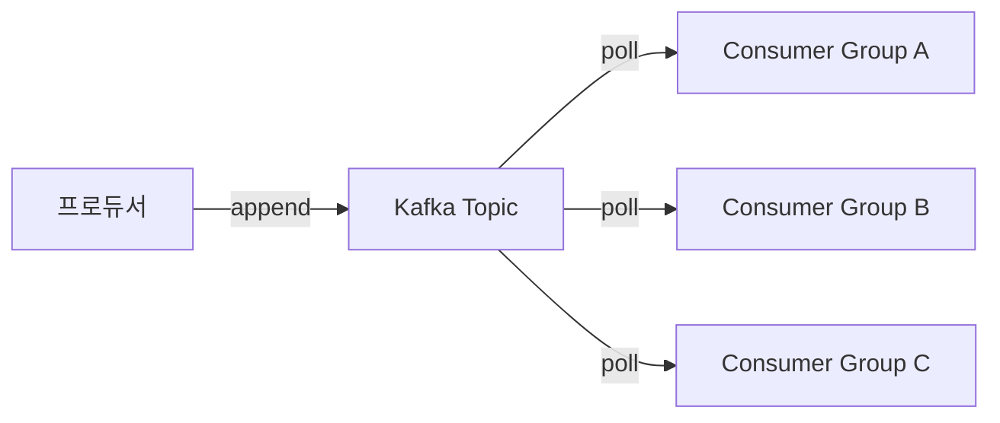
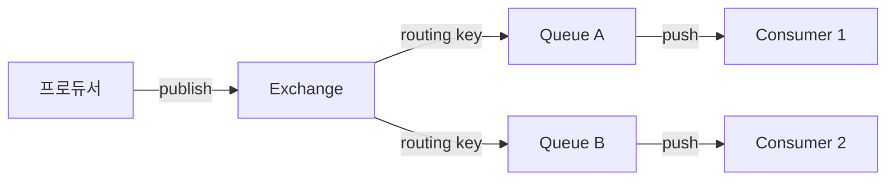

결제 시스템에서 이벤트를 발행한다. 재고 서비스, 알림 서비스, 정산 서비스가 이 이벤트를 구독한다. 메시지 브로커가 필요하다. Kafka와 RabbitMQ 중 무엇을 선택할 것인가? 이 질문에 "트래픽이 많으면 Kafka"라고 단순하게 답하는 것은 위험하다. 두 시스템은 **근본적으로 다른 문제를 풀기 위해 설계**되었다. 아키텍처의 차이를 이해해야 올바른 선택이 가능하다.

---

## 근본적 설계 철학의 차이

RabbitMQ는 2007년 Rabbit Technologies가 만든 **메시지 큐(Message Queue)** 브로커다. AMQP(Advanced Message Queuing Protocol) 표준을 구현했다. "메시지를 소비자에게 전달하고 삭제한다"는 전통적 큐 패러다임을 따른다.

Kafka는 2011년 LinkedIn이 내부 이벤트 스트리밍을 위해 만들어 오픈소스화했다. **분산 로그(Distributed Log)** 다. "메시지를 로그에 추가하고 소비자가 직접 읽어가게 한다"는 완전히 다른 패러다임이다.

> **비유**: RabbitMQ는 우체부다. 편지를 받아서 수신인에게 배달하고, 배달 완료 후 편지를 폐기한다. Kafka는 도서관이다. 책(이벤트)을 순서대로 보관하고, 누구든지 원하는 시점의 책을 읽을 수 있다. 책은 설정한 기간 동안 보존된다.

---

## 핵심 차이 한눈에 보기

| 항목 | Kafka | RabbitMQ |
|------|-------|----------|
| 패러다임 | 분산 로그 (이벤트 스트리밍) | 메시지 큐 (전통적 큐) |
| 메시지 보존 | 설정 기간 보존 (기본 7일) | 소비 즉시 삭제 |
| 재처리 | 오프셋 리셋으로 재처리 가능 | 불가 (Dead Letter Queue 이용) |
| 처리량 | 초당 수백만 메시지 | 초당 수만 메시지 |
| 레이턴시 | 수 ms~수십 ms | 수 ms 이하 (낮은 레이턴시) |
| 순서 보장 | 파티션 내 보장 | 큐 내 보장 |
| 라우팅 | 토픽 + 파티션 (단순) | Exchange + Binding (복잡) |
| 소비자 모델 | Pull (소비자가 가져감) | Push (브로커가 밀어냄) |
| 프로토콜 | Kafka 자체 프로토콜 | AMQP, STOMP, MQTT |
| 클러스터링 | 기본 내장 (Zookeeper/KRaft) | 미러링, 쿼럼 큐 |
| 운영 복잡도 | 높음 | 중간 |
| 관리 UI | Kafdrop, Confluent UI | 내장 관리 UI |

---

## 아키텍처 내부 구조

### Kafka의 로그 구조

```
Topic: order-events
  Partition 0: [offset 0][offset 1][offset 2]...[offset N]
  Partition 1: [offset 0][offset 1][offset 2]...[offset M]
  Partition 2: [offset 0][offset 1][offset 2]...[offset K]
```

각 파티션은 **추가만 가능한 불변 로그(Immutable Append-Only Log)**다. 메시지는 파티션 끝에 추가되고, 소비자는 자신의 **오프셋(offset)**을 관리하며 순서대로 읽는다. 읽었다고 메시지가 사라지지 않는다.



여러 컨슈머 그룹이 같은 토픽을 독립적으로 읽을 수 있다. 각 그룹이 자신의 오프셋을 갖는다.

### RabbitMQ의 큐 구조

```
Exchange (라우팅 규칙)
    ↓ Binding (라우팅 키 매핑)
Queue A → Consumer 1
Queue B → Consumer 2
Queue C → Consumer 3
```

메시지는 Exchange에서 Binding 규칙에 따라 Queue로 라우팅된다. 소비자가 메시지를 ACK하면 Queue에서 제거된다.



> **비유**: Kafka는 원형 컨베이어 벨트다. 물건(메시지)이 계속 벨트 위에 있고, 여러 작업자가 자기 위치에서 순서대로 집어간다. RabbitMQ는 분류 컨베이어 벨트다. 물건이 분류기(Exchange)를 거쳐 해당 박스(Queue)로 들어가고, 박스에서 꺼내면 없어진다.

---

## 처리량 — Kafka의 압도적 우위

### Kafka의 고처리량 비결

```java
// Kafka Producer 설정 — 고처리량 최적화
Properties props = new Properties();
props.put(ProducerConfig.BOOTSTRAP_SERVERS_CONFIG, "kafka:9092");
props.put(ProducerConfig.KEY_SERIALIZER_CLASS_CONFIG, StringSerializer.class);
props.put(ProducerConfig.VALUE_SERIALIZER_CLASS_CONFIG, StringSerializer.class);

// 배치 처리 — 메시지를 모아서 한 번에 전송
props.put(ProducerConfig.BATCH_SIZE_CONFIG, 65536);         // 64KB 배치
props.put(ProducerConfig.LINGER_MS_CONFIG, 5);              // 5ms 대기 후 배치 전송
props.put(ProducerConfig.BUFFER_MEMORY_CONFIG, 33554432);   // 32MB 버퍼

// 압축
props.put(ProducerConfig.COMPRESSION_TYPE_CONFIG, "lz4");   // LZ4 압축

KafkaProducer<String, String> producer = new KafkaProducer<>(props);

// 순차 전송 (비동기)
for (OrderEvent event : events) {
    producer.send(
        new ProducerRecord<>("order-events", event.getOrderId(), event.toJson()),
        (metadata, exception) -> {
            if (exception != null) log.error("전송 실패", exception);
        }
    );
}
producer.flush();
```

Kafka 고처리량의 핵심은 세 가지다:
1. **순차 디스크 쓰기** — 랜덤 I/O가 없어 HDD도 고속
2. **배치 처리** — 메시지를 묶어 네트워크 왕복 최소화
3. **Zero-Copy** — OS 커널 레벨에서 디스크→네트워크 직접 전송

```bash
# Kafka 처리량 측정
kafka-producer-perf-test.sh \
  --topic test-topic \
  --num-records 10000000 \
  --record-size 1024 \
  --throughput -1 \
  --producer-props bootstrap.servers=kafka:9092

# 결과 예시 (일반 환경)
# 10000000 records sent, 800000.0 records/sec (781.3 MB/sec)
```

### RabbitMQ의 처리량

```java
// RabbitMQ — Spring AMQP
@Component
public class OrderProducer {

    @Autowired
    private RabbitTemplate rabbitTemplate;

    public void publish(OrderEvent event) {
        rabbitTemplate.convertAndSend(
            "order-exchange",
            "order.created",
            event
        );
    }
}

// 처리량 향상을 위한 Publisher Confirms (비동기)
@Bean
public RabbitTemplate rabbitTemplate(ConnectionFactory connectionFactory) {
    RabbitTemplate template = new RabbitTemplate(connectionFactory);
    template.setConfirmCallback((correlationData, ack, cause) -> {
        if (!ack) log.error("메시지 전송 실패: {}", cause);
    });
    return template;
}
```

RabbitMQ는 단순 큐에서 초당 수만 건을 처리할 수 있다. 하지만 복잡한 라우팅, Persistent 메시지, 소비자 확인(ACK) 처리가 더해지면 처리량이 감소한다.

---

## 순서 보장

### Kafka의 파티션 내 순서 보장

```java
// 같은 키 → 같은 파티션 → 순서 보장
ProducerRecord<String, String> record = new ProducerRecord<>(
    "order-events",
    "order-1001",       // 파티션 키: 같은 주문 ID는 같은 파티션으로
    event.toJson()
);
producer.send(record);
```

Kafka는 **파티션 내에서만** 순서를 보장한다. 토픽 전체의 순서는 보장하지 않는다. 같은 `orderId`의 이벤트가 항상 같은 파티션에 들어가도록 키를 설계해야 한다.

```java
// 컨슈머 — 파티션 내 순서대로 수신
@KafkaListener(topics = "order-events", groupId = "inventory-service")
public void handleOrderEvent(
        ConsumerRecord<String, String> record) {
    log.info("파티션: {}, 오프셋: {}, 키: {}",
        record.partition(), record.offset(), record.key());

    // 같은 orderId는 항상 같은 순서로 도착
    processEvent(record.value());

    // 수동 오프셋 커밋 (at-least-once)
    // acknowledgment.acknowledge();
}
```

### RabbitMQ의 큐 내 순서 보장

```java
// RabbitMQ — 단일 컨슈머 시 큐 내 순서 보장
@RabbitListener(queues = "order-queue")
public void handleOrder(OrderEvent event, Channel channel,
                        @Header(AmqpHeaders.DELIVERY_TAG) long deliveryTag)
        throws IOException {
    try {
        processEvent(event);
        channel.basicAck(deliveryTag, false);  // 처리 완료 확인
    } catch (Exception e) {
        // 처리 실패 시 재큐잉
        channel.basicNack(deliveryTag, false, true);
    }
}
```

RabbitMQ는 큐 내에서 순서를 보장한다. 하지만 **여러 컨슈머가 하나의 큐를 처리하면 순서가 깨질 수 있다.** 재큐잉(requeue)된 메시지는 큐의 뒤가 아니라 앞에 위치할 수 있다.

---

## 라우팅 — RabbitMQ의 유연함

### RabbitMQ의 4가지 Exchange 타입

```java
// Spring AMQP — Exchange와 Binding 설정
@Configuration
public class RabbitConfig {

    // 1. Direct Exchange — 라우팅 키 정확히 일치
    @Bean
    public DirectExchange directExchange() {
        return new DirectExchange("order.direct");
    }

    // 2. Topic Exchange — 라우팅 키 패턴 매칭 (* = 단어 하나, # = 여러 단어)
    @Bean
    public TopicExchange topicExchange() {
        return new TopicExchange("order.topic");
    }

    // 3. Fanout Exchange — 모든 바인딩된 큐에 브로드캐스트
    @Bean
    public FanoutExchange fanoutExchange() {
        return new FanoutExchange("order.fanout");
    }

    // 4. Headers Exchange — 헤더 속성으로 라우팅
    @Bean
    public HeadersExchange headersExchange() {
        return new HeadersExchange("order.headers");
    }

    // Binding — Topic Exchange 패턴 매칭
    @Bean
    public Binding bindingKorea(Queue koreaQueue, TopicExchange topicExchange) {
        return BindingBuilder.bind(koreaQueue)
            .to(topicExchange)
            .with("order.korea.#");  // order.korea.로 시작하는 모든 키
    }

    @Bean
    public Binding bindingPremium(Queue premiumQueue, TopicExchange topicExchange) {
        return BindingBuilder.bind(premiumQueue)
            .to(topicExchange)
            .with("order.*.premium");  // order.{어떤것}.premium
    }
}
```

Topic Exchange로 `order.korea.premium` 메시지를 보내면 두 Queue 모두에 들어간다. 이런 복잡한 라우팅은 Kafka로 구현하기 어렵다.

### Kafka의 단순 라우팅

```java
// Kafka — 라우팅이 필요하면 별도 토픽을 만들거나
// 컨슈머 사이드에서 필터링
@KafkaListener(topics = "order-events", groupId = "korea-service")
public void handleAllOrders(ConsumerRecord<String, String> record) {
    OrderEvent event = parse(record.value());

    // 컨슈머가 직접 필터링
    if (!"KOREA".equals(event.getRegion())) return;

    processKoreaOrder(event);
}

// 또는 Kafka Streams로 토픽 라우팅
KStream<String, OrderEvent> orders = builder.stream("order-events");

orders.filter((key, value) -> "KOREA".equals(value.getRegion()))
      .to("order-events-korea");

orders.filter((key, value) -> value.isPremium())
      .to("order-events-premium");
```

Kafka에서 복잡한 라우팅은 **Kafka Streams나 토픽 분리**로 구현해야 한다. 브로커 레벨에서 라우팅 기능이 없다.

---

## 메시지 재처리 — Kafka의 강력한 차별점

### Kafka 오프셋 리셋으로 재처리

```bash
# 컨슈머 그룹을 처음부터 다시 읽기
kafka-consumer-groups.sh \
  --bootstrap-server kafka:9092 \
  --group inventory-service \
  --topic order-events \
  --reset-offsets \
  --to-earliest \
  --execute

# 특정 시점으로 되돌리기 (예: 1시간 전)
kafka-consumer-groups.sh \
  --bootstrap-server kafka:9092 \
  --group inventory-service \
  --topic order-events \
  --reset-offsets \
  --to-datetime 2026-05-17T10:00:00.000 \
  --execute

# 특정 오프셋으로
kafka-consumer-groups.sh \
  --bootstrap-server kafka:9092 \
  --group inventory-service \
  --topic order-events \
  --reset-offsets \
  --to-offset 5000 \
  --execute
```

버그를 수정하고 특정 시점부터 이벤트를 재처리하는 것이 **설정 변경 한 번**으로 가능하다. 이것이 이벤트 소싱(Event Sourcing)과 Kafka가 잘 맞는 이유다.

### RabbitMQ의 재처리 — Dead Letter Queue

```java
// RabbitMQ — Dead Letter Queue 설정
@Configuration
public class DLQConfig {

    @Bean
    public Queue orderQueue() {
        return QueueBuilder.durable("order-queue")
            .withArgument("x-dead-letter-exchange", "order-dlx")
            .withArgument("x-dead-letter-routing-key", "order.failed")
            .withArgument("x-message-ttl", 30000)  // 30초 TTL
            .build();
    }

    @Bean
    public Queue deadLetterQueue() {
        return QueueBuilder.durable("order-dlq").build();
    }
}

// 처리 실패 메시지가 DLQ로 이동
@RabbitListener(queues = "order-queue")
public void handleOrder(OrderEvent event, Channel channel,
                        @Header(AmqpHeaders.DELIVERY_TAG) long tag)
        throws IOException {
    try {
        processEvent(event);
        channel.basicAck(tag, false);
    } catch (Exception e) {
        // false = 재큐잉하지 않음 → DLQ로 이동
        channel.basicNack(tag, false, false);
    }
}

// DLQ에서 수동으로 재처리
@RabbitListener(queues = "order-dlq")
public void reprocessFailed(OrderEvent event) {
    // 수동 검토 후 재처리
}
```

RabbitMQ 재처리는 DLQ에서 수동으로 꺼내거나, 별도 로직으로 재발행해야 한다. 대규모 재처리는 어렵다.

---

## 소비자 모델 — Pull vs Push

### Kafka의 Pull 모델

```java
// Kafka 컨슈머 — 직접 폴링
KafkaConsumer<String, String> consumer = new KafkaConsumer<>(props);
consumer.subscribe(List.of("order-events"));

while (true) {
    // 소비자가 직접 브로커에서 가져옴
    ConsumerRecords<String, String> records = consumer.poll(Duration.ofMillis(100));

    for (ConsumerRecord<String, String> record : records) {
        process(record);
    }

    // 처리 완료 후 오프셋 커밋
    consumer.commitSync();
}
```

Pull 모델의 장점: 소비자가 **자신의 처리 속도에 맞게** 메시지를 가져온다. 느린 소비자가 브로커에 부하를 주지 않는다. 배치 처리가 자연스럽다.

단점: 메시지가 없을 때도 폴링해야 한다 (long-polling으로 완화).

### RabbitMQ의 Push 모델

```java
// RabbitMQ — 브로커가 메시지를 밀어냄
@RabbitListener(queues = "order-queue",
                concurrency = "3-10")  // 컨슈머 3~10개 자동 조절
public void handleOrder(OrderEvent event) {
    processEvent(event);
    // Spring이 자동으로 ACK 처리
}
```

Push 모델의 장점: 메시지 도착 즉시 처리 → **낮은 레이턴시**. 구현이 단순하다.

단점: 소비자가 느리면 브로커가 큐에 메시지를 쌓는다. 소비자 과부하 위험 (`prefetch` 설정으로 완화).

```java
// RabbitMQ prefetch — 한 번에 처리할 메시지 수 제한
@Bean
public SimpleRabbitListenerContainerFactory rabbitListenerContainerFactory(
        ConnectionFactory connectionFactory) {
    SimpleRabbitListenerContainerFactory factory = new SimpleRabbitListenerContainerFactory();
    factory.setConnectionFactory(connectionFactory);
    factory.setPrefetchCount(10);  // 한 번에 10개만 가져옴
    return factory;
}
```

---

## 메시지 보존과 내구성

### Kafka의 로그 보존 정책

```bash
# server.properties
log.retention.hours=168          # 7일 보존 (기본값)
log.retention.bytes=1073741824   # 1GB 초과 시 삭제
log.segment.bytes=1073741824     # 세그먼트 크기 1GB

# 특정 토픽에 다른 보존 정책 적용
kafka-topics.sh --bootstrap-server kafka:9092 \
  --alter --topic order-events \
  --config retention.ms=86400000      # 1일만 보존
```

```bash
# 컴팩션 정책 — 키의 최신 값만 보존 (이벤트 소싱에 유용)
kafka-topics.sh --bootstrap-server kafka:9092 \
  --create --topic user-state \
  --config cleanup.policy=compact
```

컴팩션 토픽에서 같은 키의 메시지가 여러 개 있으면, 최신 것만 유지된다. 사용자 상태를 이벤트로 관리할 때 유용하다.

### RabbitMQ의 메시지 영속성

```java
// Persistent 메시지 — 재시작 후에도 보존
rabbitTemplate.convertAndSend(
    "order-exchange",
    "order.created",
    event,
    message -> {
        message.getMessageProperties()
            .setDeliveryMode(MessageDeliveryMode.PERSISTENT);
        return message;
    }
);

// 큐를 Durable로 선언 (재시작 후에도 큐 유지)
@Bean
public Queue orderQueue() {
    return QueueBuilder.durable("order-queue").build();  // durable=true
}
```

RabbitMQ Durable + Persistent 조합으로 메시지를 디스크에 보존한다. 하지만 소비 완료된 메시지는 복구할 수 없다.

---

## 운영 복잡도

### Kafka 운영

```bash
# Kafka 클러스터 구성 요소 (KRaft 모드 — Zookeeper 없음, Kafka 3.3+)
# Controller 노드: 3개 (메타데이터 관리)
# Broker 노드: 최소 3개 (데이터 저장)

# 토픽 생성
kafka-topics.sh --bootstrap-server kafka:9092 \
  --create --topic order-events \
  --partitions 12 \            # 파티션 수 (컨슈머 병렬도 결정)
  --replication-factor 3       # 복제본 수 (노드 장애 허용)

# 컨슈머 그룹 모니터링
kafka-consumer-groups.sh --bootstrap-server kafka:9092 \
  --describe --group inventory-service

# GROUP           TOPIC         PARTITION  CURRENT-OFFSET  LOG-END-OFFSET  LAG
# inventory-svc   order-events  0          5000            5100            100
# inventory-svc   order-events  1          4800            4800            0
# LAG가 높으면 컨슈머가 따라가지 못하는 것
```

Kafka 운영에서 주요 모니터링 지표:
- **Consumer Lag**: 컨슈머가 얼마나 뒤처져 있는가
- **Under-Replicated Partitions**: 복제가 부족한 파티션
- **Broker Disk Usage**: 로그 보존으로 디스크 증가

```yaml
# docker-compose.yml — Kafka KRaft 모드
version: '3.8'
services:
  kafka:
    image: confluentinc/cp-kafka:7.6.0
    environment:
      KAFKA_PROCESS_ROLES: broker,controller
      KAFKA_NODE_ID: 1
      KAFKA_CONTROLLER_QUORUM_VOTERS: 1@kafka:9093
      KAFKA_LISTENERS: PLAINTEXT://kafka:9092,CONTROLLER://kafka:9093
      KAFKA_LOG_DIRS: /var/lib/kafka/data
      KAFKA_AUTO_CREATE_TOPICS_ENABLE: 'false'
```

### RabbitMQ 운영

```bash
# RabbitMQ 관리 명령
rabbitmqctl list_queues name messages consumers
rabbitmqctl list_exchanges
rabbitmqctl list_bindings

# 큐 상태 모니터링 (HTTP API)
curl -u admin:password http://rabbitmq:15672/api/queues/%2F/order-queue

# 클러스터 구성 (쿼럼 큐 — Raft 기반, RabbitMQ 3.8+)
rabbitmqctl join_cluster rabbit@node2
```

```yaml
# docker-compose.yml — RabbitMQ
services:
  rabbitmq:
    image: rabbitmq:3.13-management
    environment:
      RABBITMQ_DEFAULT_USER: admin
      RABBITMQ_DEFAULT_PASS: password
    ports:
      - "5672:5672"
      - "15672:15672"  # 관리 UI
```

RabbitMQ는 내장 관리 UI(`http://host:15672`)를 제공한다. 큐, Exchange, 바인딩, 커넥션을 웹에서 바로 확인하고 조작할 수 있다. Kafka 대비 **운영 편의성이 높다.**

---

## 비용과 인프라

### Kafka 인프라 비용

```
최소 프로덕션 클러스터:
- Broker 3대 × (8 CPU, 32GB RAM, 2TB SSD) = 상당한 비용
- Zookeeper (구버전) 또는 KRaft Controller 3대
- 네트워크 대역폭 (복제로 인한 3x 트래픽)

클라우드 관리형:
- AWS MSK (Managed Streaming for Kafka)
- Confluent Cloud (서버리스 티어 있음)
- Aiven for Kafka
```

### RabbitMQ 인프라 비용

```
최소 프로덕션 클러스터:
- 노드 3대 × (4 CPU, 8GB RAM, 500GB SSD) = 상대적으로 저렴
- 쿼럼 큐로 HA 구성

클라우드 관리형:
- AWS Amazon MQ (RabbitMQ 호환)
- CloudAMQP
- Aiven for RabbitMQ
```

메시지 처리량이 크지 않다면(초당 수천 건 미만) RabbitMQ가 훨씬 저렴하다.

---

## 사용 사례 비교

### Kafka가 적합한 사례

```
1. 이벤트 소싱 (Event Sourcing)
   - 모든 상태 변화를 이벤트로 기록
   - 언제든 특정 시점으로 재계산 가능

2. 실시간 스트림 처리
   - Kafka Streams, Apache Flink와 연동
   - 사용자 행동 분석, 실시간 대시보드

3. CDC (Change Data Capture)
   - Debezium으로 DB 변경을 Kafka에 스트리밍
   - 마이크로서비스 간 데이터 동기화

4. 로그 집중화
   - 애플리케이션 로그 → Kafka → Elasticsearch
   - LinkedIn이 만든 목적 그대로

5. 고처리량 데이터 파이프라인
   - ETL 파이프라인의 중간 버퍼
   - IoT 센서 데이터 수집
```

### RabbitMQ가 적합한 사례

```
1. 작업 큐 (Task Queue)
   - 이메일 발송, PDF 생성 같은 백그라운드 작업
   - 소비자가 ACK 후 메시지가 사라져야 하는 경우

2. 요청-응답 패턴
   - RPC over AMQP
   - 마이크로서비스 간 동기/비동기 혼합 통신

3. 복잡한 라우팅
   - 메시지 속성에 따른 동적 라우팅
   - 우선순위 큐

4. 낮은 레이턴시가 중요한 경우
   - 실시간 알림 (Push Notification)
   - 게임 서버 이벤트

5. 팀이 작고 운영 복잡도를 줄이고 싶은 경우
```

---

## Spring Boot 통합 코드 비교

### Kafka + Spring

```java
// Kafka 설정
@Configuration
public class KafkaConfig {

    @Bean
    public ProducerFactory<String, Object> producerFactory() {
        Map<String, Object> config = new HashMap<>();
        config.put(ProducerConfig.BOOTSTRAP_SERVERS_CONFIG, "kafka:9092");
        config.put(ProducerConfig.KEY_SERIALIZER_CLASS_CONFIG, StringSerializer.class);
        config.put(ProducerConfig.VALUE_SERIALIZER_CLASS_CONFIG, JsonSerializer.class);
        config.put(ProducerConfig.ACKS_CONFIG, "all");  // 모든 복제본 확인
        return new DefaultKafkaProducerFactory<>(config);
    }

    @Bean
    public KafkaTemplate<String, Object> kafkaTemplate() {
        return new KafkaTemplate<>(producerFactory());
    }
}

// 프로듀서
@Service
public class OrderEventPublisher {

    @Autowired
    private KafkaTemplate<String, Object> kafkaTemplate;

    public void publish(OrderCreatedEvent event) {
        kafkaTemplate.send("order-events", event.getOrderId(), event)
            .whenComplete((result, ex) -> {
                if (ex != null) {
                    log.error("Kafka 전송 실패: {}", event.getOrderId(), ex);
                } else {
                    log.info("Kafka 전송 완료: partition={}, offset={}",
                        result.getRecordMetadata().partition(),
                        result.getRecordMetadata().offset());
                }
            });
    }
}

// 컨슈머
@Service
public class InventoryEventConsumer {

    @KafkaListener(
        topics = "order-events",
        groupId = "inventory-service",
        concurrency = "3"  // 파티션 수만큼 병렬 처리
    )
    public void handleOrderCreated(
            @Payload OrderCreatedEvent event,
            @Header(KafkaHeaders.RECEIVED_PARTITION) int partition,
            @Header(KafkaHeaders.OFFSET) long offset) {

        log.info("수신: partition={}, offset={}", partition, offset);
        inventoryService.reserve(event);
    }
}
```

### RabbitMQ + Spring

```java
// RabbitMQ 설정
@Configuration
public class RabbitMQConfig {

    public static final String ORDER_EXCHANGE = "order-exchange";
    public static final String ORDER_QUEUE = "order-queue";
    public static final String ORDER_ROUTING_KEY = "order.created";

    @Bean
    public TopicExchange orderExchange() {
        return new TopicExchange(ORDER_EXCHANGE);
    }

    @Bean
    public Queue orderQueue() {
        return QueueBuilder.durable(ORDER_QUEUE)
            .withArgument("x-dead-letter-exchange", "order-dlx")
            .build();
    }

    @Bean
    public Binding orderBinding(Queue orderQueue, TopicExchange orderExchange) {
        return BindingBuilder.bind(orderQueue)
            .to(orderExchange)
            .with(ORDER_ROUTING_KEY);
    }

    @Bean
    public MessageConverter jsonMessageConverter() {
        return new Jackson2JsonMessageConverter();
    }
}

// 프로듀서
@Service
public class OrderEventPublisher {

    @Autowired
    private RabbitTemplate rabbitTemplate;

    public void publish(OrderCreatedEvent event) {
        rabbitTemplate.convertAndSend(
            RabbitMQConfig.ORDER_EXCHANGE,
            RabbitMQConfig.ORDER_ROUTING_KEY,
            event
        );
    }
}

// 컨슈머
@Service
public class InventoryEventConsumer {

    @RabbitListener(queues = RabbitMQConfig.ORDER_QUEUE)
    public void handleOrderCreated(OrderCreatedEvent event) {
        inventoryService.reserve(event);
        // Spring이 자동으로 ACK 처리 (정상 완료 시)
        // 예외 발생 시 자동 NACK → DLQ로 이동
    }
}
```

---

## 극한 시나리오

### 시나리오 1: 컨슈머 버그로 1억 건 재처리 필요

결제 서비스에서 수수료 계산 버그를 발견했다. 최근 30일 치 주문 이벤트 1억 건을 재처리해야 한다.

**Kafka 방식**:
```bash
# 30일 전 타임스탬프로 오프셋 리셋
kafka-consumer-groups.sh --bootstrap-server kafka:9092 \
  --group payment-service \
  --topic order-events \
  --reset-offsets \
  --to-datetime 2026-04-17T00:00:00.000 \
  --execute

# 버그 수정된 서비스 재시작
# 자동으로 해당 시점부터 재처리 시작
# 1억 건을 초당 100만 건으로 처리 → 100초 완료
```

30일 치 메시지가 Kafka에 보존되어 있어야 가능하다. `log.retention.days=30` 설정이 전제다.

**RabbitMQ 방식**: 소비된 메시지는 없다. 재처리하려면 DB에서 30일치 주문을 다시 조회해서 재발행해야 한다. 시간도 오래 걸리고 DB에 부하가 간다.

### 시나리오 2: Kafka 파티션 수 변경

운영 중인 Kafka 토픽의 파티션 수를 6개에서 12개로 늘려야 한다. 처리량이 2배 필요해졌다.

```bash
# 파티션 수 증가 (줄이는 것은 불가능)
kafka-topics.sh --bootstrap-server kafka:9092 \
  --alter --topic order-events \
  --partitions 12
```

파티션을 늘리면 **기존 메시지는 이전 파티션에 있고 새 메시지는 새 파티션 포함 12개에 분배**된다. 키 기반 파티셔닝을 쓴다면, 같은 키가 이전과 다른 파티션으로 갈 수 있다. 순서 보장이 일시적으로 깨질 수 있다. 이는 Kafka 운영에서 신중하게 다뤄야 하는 변경이다.

### 시나리오 3: RabbitMQ 스플릿 브레인 — 메시지 중복

3노드 RabbitMQ 클러스터에서 네트워크 파티션이 발생. 노드들이 서로 독립적으로 메시지를 받기 시작한다.

```bash
# partition-handling-strategy 설정
# rabbitmq.conf
cluster_partition_handling = pause_minority
# 소수 노드들은 스스로 멈춤 → 중복 방지

# 또는 autoheal
cluster_partition_handling = autoheal
# 가장 큰 파티션이 살아남고 나머지는 재시작
```

쿼럼 큐(Quorum Queue, Raft 기반)를 사용하면 스플릿 브레인 문제가 크게 줄어든다.

```java
// Quorum Queue 사용
@Bean
public Queue orderQueue() {
    return QueueBuilder.durable("order-queue")
        .quorum()  // Raft 기반 쿼럼 큐
        .build();
}
```

---

## 면접 포인트

### Q. Kafka와 RabbitMQ의 가장 근본적인 차이는 무엇인가요?

패러다임의 차이입니다. RabbitMQ는 메시지 큐로, 메시지를 소비자에게 전달하고 ACK 후 삭제합니다. 브로커가 메시지를 관리합니다. Kafka는 분산 로그로, 메시지가 설정된 기간 동안 보존됩니다. 소비자가 오프셋을 직접 관리하며 언제든 재처리가 가능합니다. 이 차이가 이벤트 소싱, 대규모 재처리, 멀티 컨슈머 그룹 등 다양한 기능의 기반이 됩니다.

### Q. Kafka에서 파티션 수를 결정하는 기준은?

컨슈머 병렬도가 주요 기준입니다. 파티션 수 = 컨슈머 그룹 내 최대 병렬 처리 수입니다. 파티션이 6개면 컨슈머 6개까지 병렬로 동작하고, 7번째부터는 대기합니다. 파티션 수는 늘릴 수 있지만 줄일 수 없으므로 초기에 넉넉하게 설정합니다. 처리량 목표 / 단일 파티션 처리량으로 계산하고, 순서 보장이 필요한 단위(예: 주문 ID)가 같은 파티션에 들어가도록 키를 설계합니다.

### Q. Kafka Consumer Lag이 증가하면 어떻게 대응하나요?

먼저 원인을 파악합니다. 처리 로직이 느린지, 파티션 수가 부족한지 확인합니다. 처리 로직 문제라면 최적화하거나 컨슈머 스케일아웃(파티션 수 범위 내)합니다. 파티션 수가 부족하면 파티션을 늘리고 컨슈머를 추가합니다. 일시적 피크라면 컨슈머 수를 일시적으로 늘립니다. Lag가 계속 증가하면 메시지 보존 기간 내에 해결해야 합니다. 초과하면 메시지를 영구적으로 잃습니다.

### Q. RabbitMQ Dead Letter Queue의 역할은?

처리에 실패한 메시지를 별도 큐(DLQ)로 보내는 메커니즘입니다. 컨슈머가 `basicNack`하거나 메시지 TTL이 만료되거나 큐가 가득 찬 경우 DLQ로 이동합니다. DLQ에 쌓인 메시지를 모니터링하여 처리 실패 패턴을 파악하고, 버그 수정 후 수동으로 재처리하거나 알림을 발생시킵니다. Kafka에서 동일한 패턴은 `retry topic`이나 오프셋 리셋으로 구현합니다.

### Q. Kafka at-least-once vs exactly-once는 어떻게 차별되나요?

at-least-once는 오프셋 커밋 전 장애 시 메시지를 중복 처리할 수 있지만 유실이 없습니다. exactly-once는 Kafka 트랜잭션 API(Producer Transaction + Consumer Offset을 같은 트랜잭션으로 처리)를 사용하여 중복도 유실도 없지만 성능 오버헤드가 있습니다. 실무에서는 대부분 at-least-once + 멱등성(Idempotent Consumer)으로 구현합니다. DB에 unique constraint를 걸거나 처리 여부를 체크하는 방식입니다.

---

## 결론 — 선택 기준 요약

**Kafka를 선택할 때:**
- 이벤트 소싱, 이벤트 재처리가 필요한 경우
- 초당 수십만 건 이상의 고처리량
- 여러 독립적인 컨슈머 그룹이 같은 이벤트를 소비하는 경우
- 실시간 스트림 처리 파이프라인
- 데이터 파이프라인, CDC, 로그 집중화

**RabbitMQ를 선택할 때:**
- 단순한 백그라운드 작업 큐 (이메일, 알림, 파일 처리)
- 복잡한 라우팅 규칙이 필요한 경우
- 낮은 레이턴시가 중요한 경우
- 팀이 작고 운영 단순성이 중요한 경우
- 초당 수천~수만 건의 중간 처리량

두 가지를 동시에 쓰는 것도 일반적이다. Kafka는 이벤트 스트림 백본으로, RabbitMQ는 단순 작업 큐로 역할을 나누어 각각의 강점을 활용하는 하이브리드 전략이 대규모 시스템에서 효과적이다.
