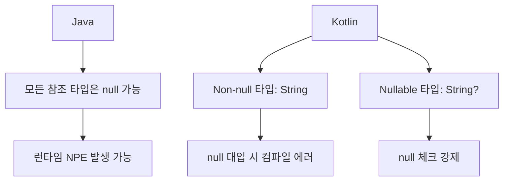
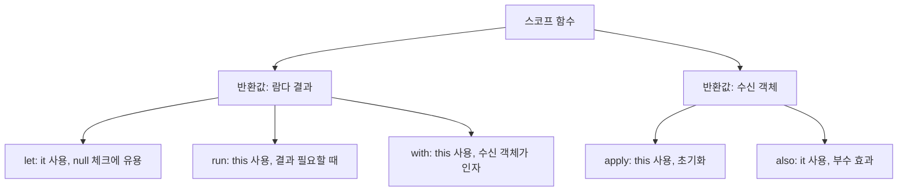
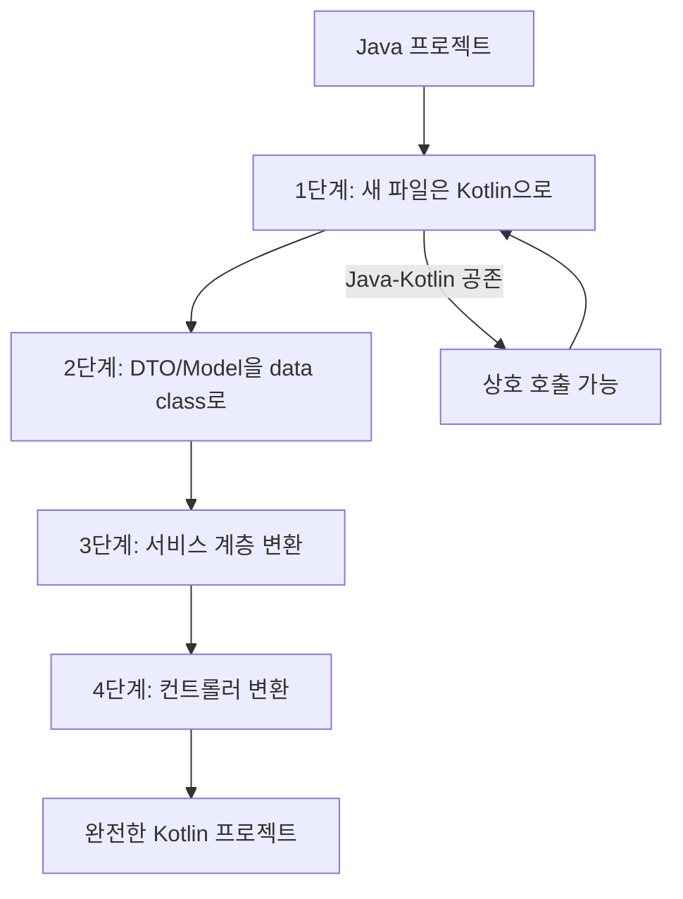

## 1. 비유 — 영어에서 독일어로

Java와 Kotlin은 같은 JVM 위에서 돌아가는 언어입니다. 영어와 독일어가 같은 알파벳을 쓰듯, 두 언어는 같은 바이트코드로 컴파일됩니다. Kotlin은 Java를 더 간결하고, 안전하고, 표현력 있게 만든 언어입니다. 기존 Java 코드와 100% 상호운용되므로 점진적 전환이 가능합니다.

---

## 2. 기본 문법 비교

### 2.1 변수 선언

```kotlin
// Java
final String name = "홍길동";
String mutableName = "홍길동";
int age = 30;

// Kotlin
val name: String = "홍길동"      // 불변 (Java final)
var mutableName: String = "홍길동" // 가변
val age = 30                      // 타입 추론
```

### 2.2 클래스 선언

```java
// Java — 보일러플레이트 코드 가득
public class Person {
    private final String name;
    private final int age;
    private String email;

    public Person(String name, int age, String email) {
        this.name = name;
        this.age = age;
        this.email = email;
    }

    public String getName() { return name; }
    public int getAge() { return age; }
    public String getEmail() { return email; }
    public void setEmail(String email) { this.email = email; }

    @Override
    public boolean equals(Object o) { ... }
    @Override
    public int hashCode() { ... }
    @Override
    public String toString() { ... }
}
```

```kotlin
// Kotlin — 한 줄로 동일한 기능
data class Person(
    val name: String,
    val age: Int,
    var email: String
)
// equals, hashCode, toString, copy() 자동 생성!

// 사용
val person = Person("홍길동", 30, "hong@example.com")
val older = person.copy(age = 31)         // 복사 + 변경
println(person)                            // Person(name=홍길동, age=30, email=hong@example.com)
```

---

## 3. Null Safety — Kotlin의 핵심 장점

### 3.1 NullPointerException 예방



```kotlin
// Non-null 타입
var name: String = "홍길동"
// name = null  // 컴파일 에러!

// Nullable 타입
var nullableName: String? = "홍길동"
nullableName = null  // OK

// null 체크 없이 사용하면 컴파일 에러
// println(nullableName.length)  // 에러!

// 안전 호출 연산자 ?.
println(nullableName?.length)   // null이면 null 반환

// Elvis 연산자 ?:
val length = nullableName?.length ?: 0  // null이면 0

// 스마트 캐스트
if (nullableName != null) {
    println(nullableName.length)  // null 체크 후 자동 non-null
}

// !! 연산자 (NPE 가능 — 확실할 때만)
val definitelyNotNull = nullableName!!.length  // null이면 NPE

// let으로 null 안전 블록 실행
nullableName?.let { name ->
    println("이름: $name, 길이: ${name.length}")
}
```

### 3.2 Java 코드 호환 — 플랫폼 타입

```kotlin
// Java 메서드의 반환값은 플랫폼 타입 (String!)
val javaResult = JavaClass.getSomething()  // String! — null 여부 불명확

// 명시적으로 처리
val safe: String? = JavaClass.getSomething()  // nullable로 처리 (안전)
val unsafe: String = JavaClass.getSomething() // non-null로 처리 (NPE 위험)
```

---

## 4. 데이터 클래스와 봉인 클래스

### 4.1 data class

```kotlin
data class Order(
    val id: Long,
    val memberId: Long,
    val items: List<OrderItem>,
    val status: OrderStatus = OrderStatus.PENDING
) {
    // 추가 메서드 가능
    val totalPrice: Int
        get() = items.sumOf { it.price * it.quantity }

    fun isCompleted() = status == OrderStatus.COMPLETED
}

// copy()로 불변 객체 변경
val originalOrder = Order(1L, 100L, emptyList())
val confirmedOrder = originalOrder.copy(status = OrderStatus.CONFIRMED)
```

### 4.2 sealed class — 대수적 데이터 타입

```kotlin
// 모든 하위 타입이 명확히 정의됨
sealed class Result<out T> {
    data class Success<T>(val value: T) : Result<T>()
    data class Failure(val error: Throwable) : Result<Nothing>()
    object Loading : Result<Nothing>()
}

// when은 else 없이 완전성 검사 가능
fun handleResult(result: Result<User>) {
    when (result) {
        is Result.Success -> showUser(result.value)
        is Result.Failure -> showError(result.error.message)
        Result.Loading -> showSpinner()
        // else 불필요 — 컴파일러가 완전성 검사
    }
}

// API 응답 처리 예시
sealed class ApiResponse<out T> {
    data class Success<T>(val data: T, val code: Int = 200) : ApiResponse<T>()
    data class Error(val message: String, val code: Int) : ApiResponse<Nothing>()
    object NetworkError : ApiResponse<Nothing>()
}
```

---

## 5. 확장 함수 (Extension Functions)

```kotlin
// 기존 클래스에 메서드 추가 — 상속 불필요
fun String.isValidEmail(): Boolean {
    return this.contains("@") && this.contains(".")
}

fun String.toKoreanWon(): String {
    return NumberFormat.getCurrencyInstance(Locale.KOREA).format(this.toLong())
}

// 사용
"user@example.com".isValidEmail()  // true
"10000".toKoreanWon()               // ₩10,000

// 컬렉션 확장
fun <T> List<T>.second(): T = this[1]
fun <T> List<T>.secondOrNull(): T? = if (size >= 2) this[1] else null

listOf(1, 2, 3).second()        // 2
listOf(1).secondOrNull()         // null

// Spring Repository 확장
fun <T, ID> JpaRepository<T, ID>.findByIdOrThrow(id: ID): T =
    findById(id).orElseThrow { EntityNotFoundException("ID $id not found") }

// 사용
val member = memberRepository.findByIdOrThrow(1L)  // 없으면 예외
```

---

## 6. 스코프 함수 (Scope Functions)

```kotlin
data class User(var name: String = "", var email: String = "", var age: Int = 0)

// let — null 체크 + 변환
val email: String? = getEmail()
val length = email?.let { it.length } ?: 0

// run — 블록 결과 반환
val result = run {
    val x = 10
    val y = 20
    x + y  // 30 반환
}

// with — 수신 객체로 여러 작업
val userStr = with(User("홍길동", "hong@example.com", 30)) {
    "이름: $name, 이메일: $email, 나이: $age"
}

// apply — 수신 객체 반환 (초기화/빌더 패턴)
val user = User().apply {
    name = "홍길동"
    email = "hong@example.com"
    age = 30
}  // User 반환

// also — 수신 객체 반환 (부수 효과)
val processedUser = createUser()
    .also { log.info("사용자 생성: {}", it.name) }
    .also { emailService.sendWelcome(it.email) }
```



---

## 7. 코루틴 기초

### 7.1 기존 비동기 방식의 문제

```java
// Java — 콜백 지옥
userService.findUser(userId, user -> {
    orderService.findOrders(user.getId(), orders -> {
        paymentService.processPayment(orders.get(0).getId(), payment -> {
            emailService.sendConfirmation(payment.getId(), result -> {
                // 여기까지 오면 이미 인덴트가 엄청남
            });
        });
    });
});
```

### 7.2 코루틴으로 해결

```kotlin
// Kotlin 코루틴 — 마치 동기 코드처럼 비동기 처리
suspend fun processOrder(userId: Long) {
    val user = userService.findUser(userId)      // 비동기지만 동기처럼
    val orders = orderService.findOrders(user.id)
    val payment = paymentService.processPayment(orders.first().id)
    emailService.sendConfirmation(payment.id)
    // 모두 비동기, 스레드 블로킹 없음
}
```

### 7.3 기본 코루틴 사용

```kotlin
// build.gradle
// implementation("org.jetbrains.kotlinx:kotlinx-coroutines-core:1.7.3")
// implementation("org.jetbrains.kotlinx:kotlinx-coroutines-reactor:1.7.3")

// 코루틴 시작
fun main() = runBlocking {  // 코루틴 블록 시작
    launch {                 // 새 코루틴 시작 (fire-and-forget)
        delay(1000)          // 스레드 블로킹 없이 일시 중단
        println("World!")
    }
    println("Hello,")
    // 출력: Hello, World!
}

// async/await — 결과가 필요할 때
suspend fun fetchData(): String = coroutineScope {
    val result1 = async { api1.fetch() }   // 병렬 실행
    val result2 = async { api2.fetch() }   // 병렬 실행
    "${result1.await()} + ${result2.await()}" // 둘 다 완료될 때까지 대기
}
```

---

## 8. Spring과 Kotlin

### 8.1 Spring Boot + Kotlin 설정

```kotlin
// build.gradle.kts
plugins {
    kotlin("jvm") version "1.9.20"
    kotlin("plugin.spring") version "1.9.20"   // all-open 처리
    kotlin("plugin.jpa") version "1.9.20"       // no-arg 처리
    id("org.springframework.boot") version "3.2.0"
}

dependencies {
    implementation("org.springframework.boot:spring-boot-starter-web")
    implementation("com.fasterxml.jackson.module:jackson-module-kotlin")
    implementation("org.jetbrains.kotlin:kotlin-reflect")
}
```

### 8.2 Kotlin 스타일 Spring 컨트롤러

```kotlin
@RestController
@RequestMapping("/api/orders")
class OrderController(
    private val orderService: OrderService  // 생성자 주입 (간결!)
) {

    @GetMapping("/{id}")
    fun getOrder(@PathVariable id: Long): ResponseEntity<OrderResponse> {
        val order = orderService.findById(id)
        return ResponseEntity.ok(OrderResponse.from(order))
    }

    @PostMapping
    fun createOrder(
        @RequestBody request: CreateOrderRequest,
        @AuthenticationPrincipal userDetails: CustomUserDetails
    ): ResponseEntity<CreateOrderResponse> {
        val orderId = orderService.createOrder(
            memberId = userDetails.id,
            itemId = request.itemId,
            quantity = request.quantity
        )
        return ResponseEntity.created(URI.create("/api/orders/$orderId"))
            .body(CreateOrderResponse(orderId))
    }
}

// DTO도 간결하게
data class CreateOrderRequest(
    val itemId: Long,
    @field:Min(1) val quantity: Int
)

data class CreateOrderResponse(val orderId: Long)
```

### 8.3 Kotlin JPA 엔티티

```kotlin
@Entity
@Table(name = "member")
class Member(
    @Column(nullable = false)
    var name: String,

    @Column(unique = true, nullable = false)
    val email: String,

    @Enumerated(EnumType.STRING)
    var status: MemberStatus = MemberStatus.ACTIVE
) {
    @Id
    @GeneratedValue(strategy = GenerationType.IDENTITY)
    val id: Long = 0L  // JPA가 관리

    @OneToMany(mappedBy = "member", cascade = [CascadeType.ALL])
    val orders: MutableList<Order> = mutableListOf()

    fun deactivate() {
        status = MemberStatus.INACTIVE
    }
}
```

---

## 9. 상호운용성

### 9.1 Java에서 Kotlin 호출

```kotlin
// Kotlin 코드
object StringUtils {
    @JvmStatic
    fun capitalizeWords(input: String): String =
        input.split(" ").joinToString(" ") { it.capitalize() }
}

data class ApiResult<T>(val data: T?, val error: String?) {
    companion object {
        @JvmStatic
        fun <T> success(data: T) = ApiResult(data, null)
        @JvmStatic
        fun <T> failure(error: String) = ApiResult<T>(null, error)
    }
}
```

```java
// Java에서 호출
String result = StringUtils.capitalizeWords("hello world");
ApiResult<User> apiResult = ApiResult.success(user);
```

### 9.2 점진적 마이그레이션 전략



---

## 10. 극한 시나리오 — 함수형 스타일

```kotlin
// 함수형 스타일로 비즈니스 로직
fun processOrders(orders: List<Order>): OrderSummary {
    return orders
        .filter { it.status == OrderStatus.COMPLETED }
        .groupBy { it.memberId }
        .mapValues { (_, memberOrders) ->
            MemberOrderStats(
                count = memberOrders.size,
                totalAmount = memberOrders.sumOf { it.totalPrice },
                lastOrderDate = memberOrders.maxOf { it.createdAt }
            )
        }
        .let { stats ->
            OrderSummary(
                totalOrders = orders.size,
                completedOrders = orders.count { it.status == OrderStatus.COMPLETED },
                memberStats = stats
            )
        }
}

// Result 타입으로 에러 처리
suspend fun fetchUserSafely(id: Long): Result<User> =
    runCatching { userService.findById(id) }

// 체이닝
val displayName = fetchUserSafely(userId)
    .map { it.name.uppercase() }
    .getOrElse { "Unknown" }
```

---

## 11. Java vs Kotlin 비교 요약

| 기능 | Java | Kotlin |
|------|------|--------|
| null 안전 | X (NPE 가능) | O (컴파일 타임 체크) |
| 데이터 클래스 | 수동 구현 | data class |
| 불변 선언 | final | val |
| 확장 함수 | X | O |
| 코루틴 | CompletableFuture | suspend fun |
| 스마트 캐스트 | X | O |
| 문자열 템플릿 | + 연산 | "$variable" |
| Default 파라미터 | 오버로딩 | fun f(x: Int = 0) |
| 싱글톤 | 수동 구현 | object |
| 봉인 클래스 | X | sealed class |
