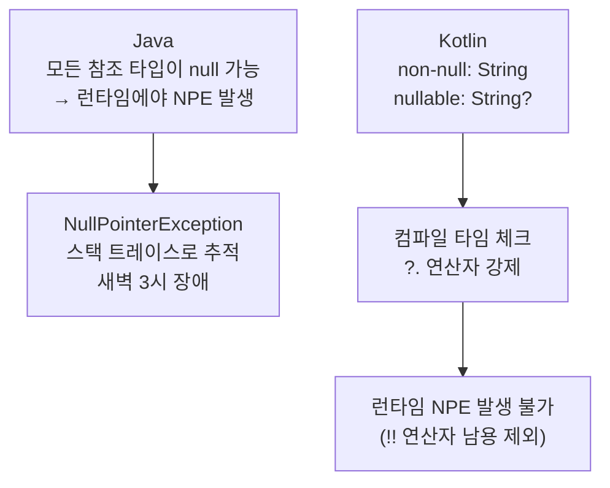
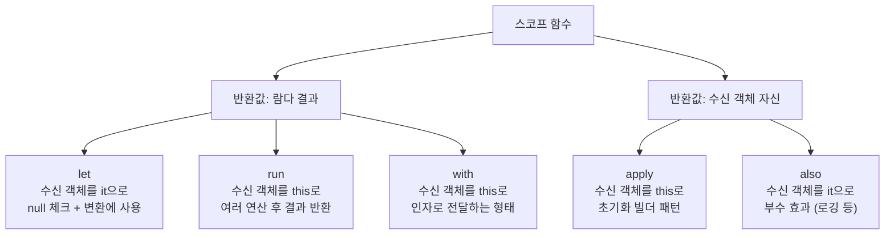
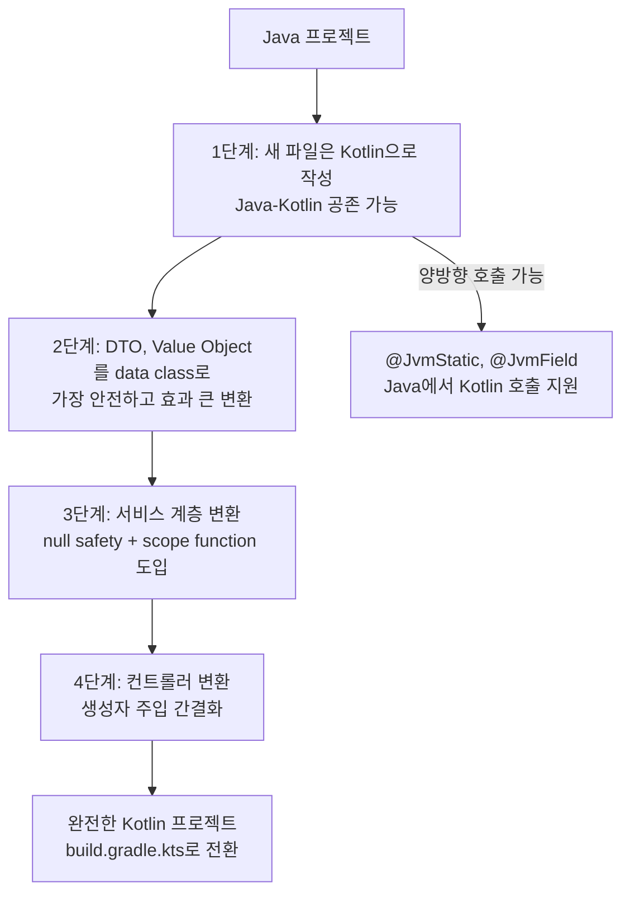

Java 프로젝트에서 NPE(NullPointerException)가 전체 런타임 에러의 40% 이상을 차지한다는 통계가 있다. Tony Hoare는 null을 설계한 것을 "10억 달러짜리 실수"라고 불렀다. Kotlin은 그 실수를 언어 레벨에서 바로잡은 언어다. **Kotlin은 Java의 단축 버전이 아니라, Java가 설계 단계에서 못 고친 결함들을 고친 언어다.**

## 비유 — 영어 계약서 vs 한국어 계약서

Java와 Kotlin은 같은 JVM 위에서 돌아간다. 영어 계약서와 한국어 계약서가 같은 법원에서 효력을 갖는 것처럼, 두 언어는 동일한 바이트코드로 컴파일된다. 그런데 한국어 계약서에는 "이 조항은 null일 수 없다"고 명시할 수 있고, 컴파일러가 그걸 강제 검토한다. 영어 계약서(Java)는 "아마 null이 아닐 거야"라고 믿고 서명한다.

---

## 변수 선언 — val과 var의 의미

```kotlin
val name: String = "홍길동"      // 불변 — Java의 final String
var mutableName: String = "홍길동" // 가변
val age = 30                      // 타입 추론 — Int로 자동 결정
```

`val`이 중요한 이유: 불변 변수는 멀티스레드 환경에서 동기화 없이 안전하게 공유된다. `var`로 선언한 변수가 여러 스레드에서 수정되면? 레이스 컨디션이 생긴다. Kotlin은 기본값을 불변(val)으로 유도하는 방식으로 동시성 버그를 설계 단계에서 줄인다.

---

## data class — 보일러플레이트 300줄의 종말

Java에서 단순한 데이터 객체 하나를 만들려면 생성자, getter/setter, equals, hashCode, toString을 직접 작성하거나 Lombok에 의존해야 한다.

```java
// Java — 실제로 이게 필요한 코드 전부
public class Person {
    private final String name;
    private final int age;
    private String email;

    public Person(String name, int age, String email) {
        this.name = name;
        this.age = age;
        this.email = email;
    }

    public String getName() { return name; }
    public int getAge() { return age; }
    public String getEmail() { return email; }
    public void setEmail(String email) { this.email = email; }

    @Override
    public boolean equals(Object o) {
        if (this == o) return true;
        if (!(o instanceof Person)) return false;
        Person p = (Person) o;
        return age == p.age && Objects.equals(name, p.name) && Objects.equals(email, p.email);
    }

    @Override
    public int hashCode() { return Objects.hash(name, age, email); }

    @Override
    public String toString() {
        return "Person{name='" + name + "', age=" + age + ", email='" + email + "'}";
    }
}
```

```kotlin
// Kotlin — 완전히 동일한 기능
data class Person(
    val name: String,
    val age: Int,
    var email: String
)
// equals, hashCode, toString, copy() 자동 생성
```

`data class`가 없으면? equals를 손으로 잘못 구현해서 Set에서 중복 제거가 안 되거나, hashCode가 equals와 일치하지 않아서 HashMap에서 조회가 안 되는 버그가 생긴다. Kotlin은 이걸 컴파일러가 보장한다.

`copy()`의 가치는 불변 객체를 다룰 때 특히 크다:

```kotlin
val original = Person("홍길동", 30, "hong@example.com")
// 나이만 바꾼 새 객체 — original은 변경 없음
val older = original.copy(age = 31)

// Order 상태 변경 패턴
val pendingOrder = Order(1L, 100L, emptyList(), OrderStatus.PENDING)
val confirmedOrder = pendingOrder.copy(status = OrderStatus.CONFIRMED)
// pendingOrder는 그대로 — 이벤트 소싱 패턴에서 핵심
```

---

## Null Safety — 컴파일러가 NPE를 막는 원리



Kotlin의 타입 시스템은 null 가능 여부를 타입에 인코딩한다. `String`은 null이 될 수 없고, `String?`는 될 수 있다. 컴파일러가 이걸 강제한다.

```kotlin
// Non-null 타입 — null 대입 자체가 컴파일 에러
var name: String = "홍길동"
// name = null  → 컴파일 에러: Null can not be a value of a non-null type String

// Nullable 타입 — 사용하려면 반드시 null 체크
var nullableName: String? = "홍길동"
nullableName = null  // OK

// 안전 호출 연산자 ?. — null이면 실행 자체를 건너뜀
println(nullableName?.length)       // null이면 null 출력, 아니면 길이 출력
nullableName?.uppercase()?.trim()   // 체이닝 가능

// Elvis 연산자 ?: — null일 때 기본값 지정
val length = nullableName?.length ?: 0      // null이면 0
val display = nullableName ?: "이름 없음"   // null이면 "이름 없음"

// 스마트 캐스트 — if 체크 후 자동으로 non-null로 인식
if (nullableName != null) {
    println(nullableName.length)  // null 체크 통과 → String으로 자동 캐스트
}

// let — null일 때 블록 자체를 건너뜀
nullableName?.let { name ->
    println("이름: $name, 길이: ${name.length}")
    emailService.send(name)  // null이면 이 블록 전체 실행 안 됨
}
```

`!!` 연산자는 "내가 null이 아님을 보장한다"는 선언이다. 틀리면 NPE가 발생한다. `!!`가 코드베이스에 많다면 Kotlin의 null safety를 Java처럼 쓰고 있다는 신호다.

```kotlin
// !! 남용 — Kotlin의 이점을 버리는 패턴
val name = user!!.profile!!.name!!  // user, profile, name 중 하나라도 null이면 NPE

// 올바른 패턴
val name = user?.profile?.name ?: "익명"
```

### Java 코드와 상호운용 시 주의점

```kotlin
// Java 메서드의 반환값은 타입을 알 수 없음 (플랫폼 타입 String!)
val javaResult = JavaService.findUser()  // String! — null 여부 모름

// 안전하게 처리하려면 명시적으로 nullable로 받아야 함
val safe: String? = JavaService.findUser()   // nullable로 처리 (권장)
val unsafe: String = JavaService.findUser()  // non-null 주장 (NPE 위험)
```

---

## sealed class — 컴파일러가 모든 경우를 강제

Java의 상속 구조는 "어떤 하위 클래스가 있는지" 컴파일러가 알 수 없다. 새 하위 클래스가 추가되면 switch 문에서 처리 누락이 발생해도 컴파일 에러가 안 난다.

```kotlin
// 모든 가능한 상태를 타입으로 정의
sealed class ApiResponse<out T> {
    data class Success<T>(val data: T, val statusCode: Int = 200) : ApiResponse<T>()
    data class Error(val message: String, val statusCode: Int) : ApiResponse<Nothing>()
    object NetworkError : ApiResponse<Nothing>()
    object Loading : ApiResponse<Nothing>()
}

// when이 else 없이 컴파일됨 — 새 하위 클래스 추가 시 컴파일 에러로 누락 방지
fun handleResponse(response: ApiResponse<User>) {
    when (response) {
        is ApiResponse.Success -> showUser(response.data)
        is ApiResponse.Error -> showError("${response.statusCode}: ${response.message}")
        ApiResponse.NetworkError -> showRetryButton()
        ApiResponse.Loading -> showSpinner()
        // else 불필요 — 컴파일러가 모든 경우를 알고 있음
    }
}
```

`sealed class` 없이 Java로 같은 걸 구현하면? 새 상태를 추가할 때 모든 when/switch 문을 찾아 수동으로 업데이트해야 한다. 하나라도 빠뜨리면 런타임에야 발견한다.

---

## 확장 함수 — 기존 클래스를 수정하지 않고 기능 추가

라이브러리 클래스나 Java 클래스를 상속할 수 없는 상황에서, 유틸리티 클래스(StringUtils, DateUtils)를 만들지 않고 기능을 추가할 수 있다.

```kotlin
// String 클래스에 이메일 검증 추가 — String 소스코드 건드리지 않고
fun String.isValidEmail(): Boolean {
    return this.contains("@") && this.contains(".")
}

fun String.toKoreanWon(): String {
    return NumberFormat.getCurrencyInstance(Locale.KOREA).format(this.toLong())
}

// 사용 — 마치 String의 원래 메서드처럼
"user@example.com".isValidEmail()  // true
"hello".isValidEmail()             // false
"10000".toKoreanWon()              // ₩10,000

// null-safe 확장 함수
fun String?.orEmpty(): String = this ?: ""
```

확장 함수 없이 Java 스타일로 작성하면:
```java
// Java
StringUtils.isValidEmail("user@example.com")  // 메서드가 앞에 와서 가독성 나쁨
```

Spring Data Repository 확장 — 실무에서 자주 쓰는 패턴:

```kotlin
// findById가 Optional<T>를 반환하는 게 불편할 때
fun <T, ID> JpaRepository<T, ID>.findByIdOrThrow(id: ID): T =
    findById(id).orElseThrow { EntityNotFoundException("Entity with id $id not found") }

// 사용
val member = memberRepository.findByIdOrThrow(1L)  // null이면 즉시 예외
// Optional.get(), orElseThrow() 보일러플레이트 없음
```

---

## 스코프 함수 — null 처리와 초기화 패턴

스코프 함수(let, run, apply, also, with)는 처음 보면 "이게 왜 필요하지?" 싶지만, 각각 명확한 용도가 있다.



```kotlin
// let — null 체크 후 변환할 때
val email: String? = getEmail()
val upperEmail = email?.let { it.trim().uppercase() } ?: "NO_EMAIL"
// email이 null이면 블록 실행 안 됨

// apply — 객체 초기화 (Builder 패턴 대체)
val user = User().apply {
    name = "홍길동"          // this.name = "홍길동"과 동일
    email = "hong@example.com"
    age = 30
}  // User 객체 반환

// also — 부수 효과 추가 (메서드 체이닝 중간에 로깅)
val processedUser = createUser()
    .also { log.info("사용자 생성됨: {}", it.name) }
    .also { auditService.record(it) }
// createUser()의 결과가 그대로 반환됨

// run — 여러 작업 후 결과값이 필요할 때
val orderSummary = run {
    val orders = orderRepository.findAll()
    val total = orders.sumOf { it.price }
    OrderSummary(count = orders.size, total = total)  // 마지막 표현식이 반환값
}
```

---

## Spring에서 Kotlin 실전 사용

### 컨트롤러 — Java 대비 차이

```kotlin
@RestController
@RequestMapping("/api/orders")
class OrderController(
    private val orderService: OrderService  // 생성자 주입 — @Autowired 불필요
) {

    @GetMapping("/{id}")
    fun getOrder(@PathVariable id: Long): ResponseEntity<OrderResponse> {
        val order = orderService.findById(id)
        return ResponseEntity.ok(OrderResponse.from(order))
    }

    @PostMapping
    fun createOrder(
        @RequestBody request: CreateOrderRequest,
        @AuthenticationPrincipal user: CustomUserDetails
    ): ResponseEntity<CreateOrderResponse> {
        val orderId = orderService.createOrder(
            memberId = user.id,      // named argument — 파라미터 순서 실수 방지
            itemId = request.itemId,
            quantity = request.quantity
        )
        return ResponseEntity
            .created(URI.create("/api/orders/$orderId"))
            .body(CreateOrderResponse(orderId))
    }
}

// DTO — data class로 한 줄
data class CreateOrderRequest(
    val itemId: Long,
    @field:Min(1) val quantity: Int  // Bean Validation — @field: 접두어 필요
)

data class CreateOrderResponse(val orderId: Long)
```

### JPA 엔티티 — 주의점

```kotlin
@Entity
@Table(name = "member")
class Member(
    @Column(nullable = false)
    var name: String,

    @Column(unique = true, nullable = false)
    val email: String,

    @Enumerated(EnumType.STRING)
    var status: MemberStatus = MemberStatus.ACTIVE  // 기본값
) {
    @Id
    @GeneratedValue(strategy = GenerationType.IDENTITY)
    val id: Long = 0L  // JPA가 관리 — 0L은 영속화 전 임시값

    @OneToMany(mappedBy = "member", cascade = [CascadeType.ALL])
    val orders: MutableList<Order> = mutableListOf()

    // 비즈니스 메서드
    fun deactivate() {
        status = MemberStatus.INACTIVE
    }
}
```

JPA 엔티티는 `data class`로 만들면 안 된다. `equals`와 `hashCode`가 id 기반으로 동작해야 하는데, data class는 모든 필드를 기준으로 동작하기 때문이다. 또한 프록시 객체 생성을 위해 no-arg 생성자가 필요하므로 `kotlin("plugin.jpa")` 플러그인이 필수다.

---

## 점진적 마이그레이션 전략



Java에서 Kotlin 코드를 호출할 때 추가 어노테이션이 필요한 경우:

```kotlin
// Kotlin 유틸리티 — Java에서 호출 가능하게
object StringUtils {
    @JvmStatic  // Java에서 StringUtils.capitalizeWords() 형태로 호출 가능
    fun capitalizeWords(input: String): String =
        input.split(" ").joinToString(" ") { word ->
            word.replaceFirstChar { it.uppercase() }
        }
}

data class ApiResult<T>(val data: T?, val error: String?) {
    companion object {
        @JvmStatic
        fun <T> success(data: T) = ApiResult(data, null)
        @JvmStatic
        fun <T> failure(error: String) = ApiResult<T>(null, error)
    }
}
```

```java
// Java에서 호출
String result = StringUtils.capitalizeWords("hello world");
ApiResult<User> ok = ApiResult.success(user);
```

---

## 함수형 스타일로 비즈니스 로직

```kotlin
// 주문 목록에서 완료된 주문의 회원별 통계 계산
fun processOrders(orders: List<Order>): OrderSummary {
    return orders
        .filter { it.status == OrderStatus.COMPLETED }    // 완료된 주문만
        .groupBy { it.memberId }                           // 회원별로 그룹화
        .mapValues { (_, memberOrders) ->
            MemberOrderStats(
                count = memberOrders.size,
                totalAmount = memberOrders.sumOf { it.totalPrice },
                lastOrderDate = memberOrders.maxOf { it.createdAt }
            )
        }
        .let { stats ->
            OrderSummary(
                totalOrders = orders.size,
                completedOrders = orders.count { it.status == OrderStatus.COMPLETED },
                memberStats = stats
            )
        }
}

// runCatching — try-catch 대신 Result 타입으로
suspend fun fetchUserSafely(id: Long): Result<User> =
    runCatching { userService.findById(id) }

// 체이닝으로 에러 처리
val displayName = fetchUserSafely(userId)
    .map { it.name.uppercase() }
    .recover { error ->
        log.warn("사용자 조회 실패: ${error.message}")
        "Unknown"
    }
    .getOrThrow()
```

---

## Java vs Kotlin 핵심 비교

| 기능 | Java | Kotlin | 이유 |
|------|------|--------|------|
| null 안전 | X (런타임 NPE) | O (컴파일 타임) | 타입 시스템에 nullable 인코딩 |
| 데이터 클래스 | 수동 또는 Lombok | `data class` | 컴파일러가 보일러플레이트 생성 |
| 불변 선언 | `final` | `val` | 기본값을 불변으로 유도 |
| 확장 함수 | 없음 | 있음 | 유틸리티 클래스 없이 기능 추가 |
| 스마트 캐스트 | 없음 (캐스트 필요) | 있음 | null/타입 체크 후 자동 캐스트 |
| 문자열 템플릿 | `+` 연산 | `"$variable"` | 가독성 |
| Default 파라미터 | 오버로딩 | `fun f(x: Int = 0)` | 오버로딩 없이 선택적 파라미터 |
| 싱글톤 | 수동 구현 | `object` | 컴파일러 보장 싱글톤 |
| sealed class | 없음 | `sealed class` | 컴파일러가 하위 타입 완전성 검사 |
| Coroutine | `CompletableFuture` | `suspend fun` | 동기 코드처럼 보이는 비동기 |
