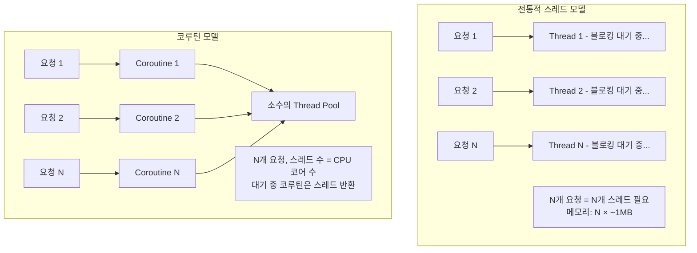
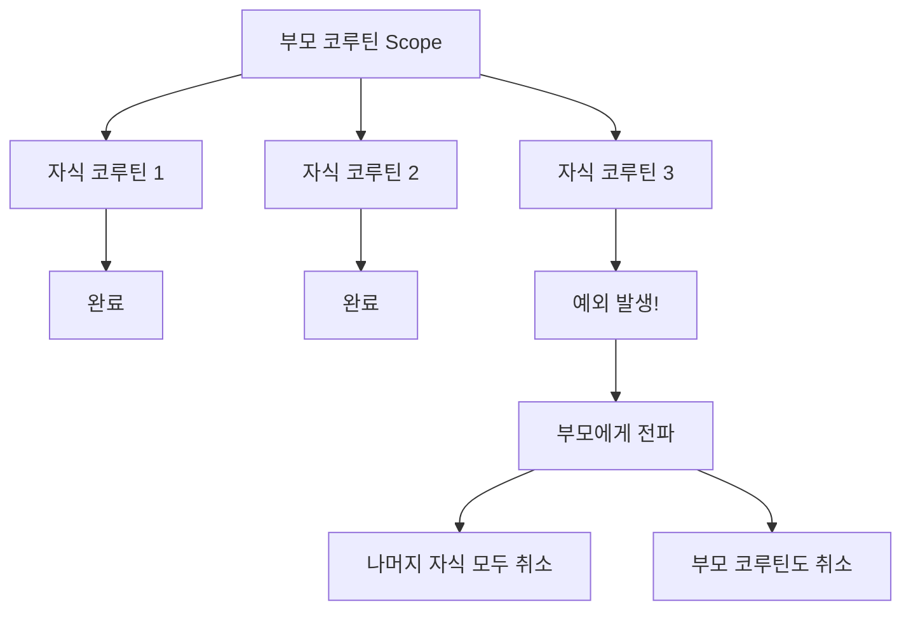
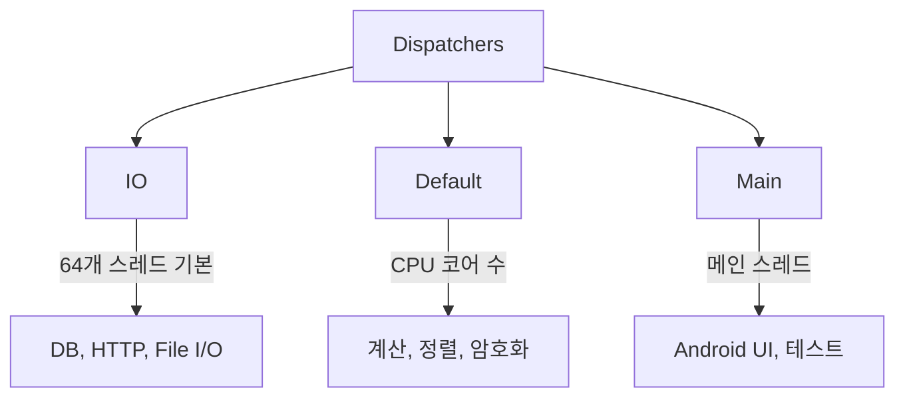
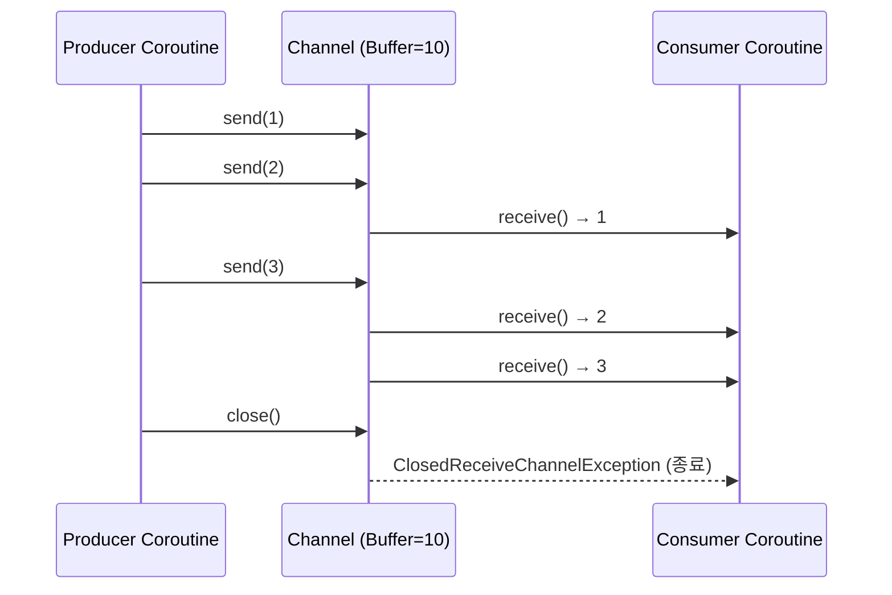
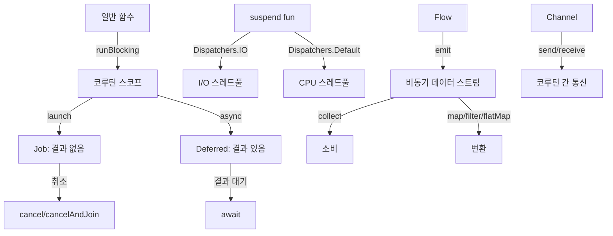

## 1. 비유 — 식당의 비동기 운영

서빙 직원 1명이 10개의 테이블을 담당한다고 상상해 보세요. 한 테이블에 주문을 받고 주방에 전달한 후, 음식이 나올 때까지 그 테이블 옆에서 기다리면 비효율적입니다. 실제로는 다른 테이블도 돌아다니다가, 음식이 준비됐다는 신호가 오면 그때 가서 서빙합니다.

코루틴이 바로 이 방식입니다. I/O 대기 중에 스레드를 블로킹하지 않고, 다른 코루틴이 스레드를 사용할 수 있게 합니다.

---

## 2. 동시성 모델 비교



---

## 3. 코루틴 기초

### 3.1 suspend 함수

```kotlin
// suspend 함수 — 일시 중단 가능한 함수
suspend fun fetchUser(id: Long): User {
    delay(1000)  // 1초 대기 (스레드 블로킹 없음)
    return userRepository.findById(id)
}

// 일반 함수에서 suspend 함수 직접 호출 불가
fun main() {
    // fetchUser(1L)  // 컴파일 에러!
}

// 코루틴 스코프 안에서만 호출 가능
fun main() = runBlocking {  // 코루틴 스코프 생성
    val user = fetchUser(1L)
    println(user)
}
```

### 3.2 코루틴 빌더

```kotlin
// 1. runBlocking — 코루틴과 일반 코드 연결 (테스트, main 함수)
fun main() = runBlocking {
    println("시작")
    delay(1000)
    println("1초 후")
}

// 2. launch — 결과 불필요한 비동기 작업 (fire-and-forget)
val scope = CoroutineScope(Dispatchers.Default)
val job: Job = scope.launch {
    delay(1000)
    println("작업 완료")
}
job.join()  // 완료 대기

// 3. async — 결과가 필요한 비동기 작업
val deferred: Deferred<String> = scope.async {
    delay(1000)
    "결과값"
}
val result = deferred.await()  // 결과 대기
println(result)  // "결과값"

// 4. coroutineScope — 스코프 생성 (자식이 모두 완료될 때까지 대기)
suspend fun fetchAll(): List<User> = coroutineScope {
    val users1 = async { fetchUsers("group1") }
    val users2 = async { fetchUsers("group2") }
    users1.await() + users2.await()
}
```

---

## 4. CoroutineScope와 구조적 동시성

### 4.1 구조적 동시성이란



```kotlin
// 구조적 동시성 보장
suspend fun fetchUserData(userId: Long): UserData = coroutineScope {
    // 병렬 실행
    val profile = async { profileService.fetchProfile(userId) }
    val orders = async { orderService.fetchOrders(userId) }
    val preferences = async { prefService.fetchPreferences(userId) }

    // 하나라도 실패하면 나머지도 취소됨
    UserData(
        profile = profile.await(),
        orders = orders.await(),
        preferences = preferences.await()
    )
}
```

### 4.2 Job 계층 구조

```kotlin
val parentJob = Job()
val scope = CoroutineScope(Dispatchers.Default + parentJob)

val child1 = scope.launch {
    delay(Long.MAX_VALUE)  // 무한 대기
    println("자식 1")
}

val child2 = scope.launch {
    delay(1000)
    println("자식 2")
}

// 부모 취소 → 자식 모두 취소
parentJob.cancel()
// child1, child2 모두 취소됨

// 자식이 부모를 취소하지 않게 하려면
val supervisorScope = CoroutineScope(SupervisorJob())
```

---

## 5. Dispatchers — 스레드 결정

```kotlin
// IO: 파일, DB, 네트워크 — 블로킹 I/O에 최적화 (스레드 수 많음)
withContext(Dispatchers.IO) {
    userRepository.findById(id)  // DB 호출
}

// Default: CPU 집중 작업 — 코어 수만큼 스레드
withContext(Dispatchers.Default) {
    heavyComputation()  // 이미지 처리, 암호화 등
}

// Main: UI 업데이트 (Android), 테스트
withContext(Dispatchers.Main) {
    updateUI()
}

// Unconfined: 특정 스레드에 고정 안 함 (거의 사용 안 함)

// 커스텀 Dispatcher
val customDispatcher = Executors.newFixedThreadPool(4).asCoroutineDispatcher()
```



---

## 6. 에러 처리

### 6.1 try-catch

```kotlin
suspend fun safeFetch(id: Long): User? {
    return try {
        userService.findById(id)
    } catch (e: UserNotFoundException) {
        log.warn("사용자 없음: $id")
        null
    } catch (e: DatabaseException) {
        log.error("DB 오류", e)
        throw e  // 재던짐
    }
}
```

### 6.2 CoroutineExceptionHandler

```kotlin
// launch에서 발생한 예외 처리
val exceptionHandler = CoroutineExceptionHandler { context, throwable ->
    log.error("코루틴 예외 발생: ${throwable.message}", throwable)
    alertService.sendAlert("시스템 오류: ${throwable.message}")
}

val scope = CoroutineScope(Dispatchers.Default + exceptionHandler)

scope.launch {
    // 여기서 예외 발생 시 exceptionHandler 실행
    processOrders()
}
```

### 6.3 SupervisorScope — 자식 실패가 형제에게 영향 없음

```kotlin
// 일반 coroutineScope — 하나 실패 시 모두 취소
coroutineScope {
    launch { riskyOperation1() }  // 실패 시
    launch { riskyOperation2() }  // 여기도 취소됨
}

// supervisorScope — 각자 독립
supervisorScope {
    val job1 = launch {
        try {
            riskyOperation1()  // 실패해도
        } catch (e: Exception) {
            log.error("Job 1 실패", e)
        }
    }
    val job2 = launch {
        riskyOperation2()  // 영향 없음
    }
}
```

---

## 7. Flow — 비동기 데이터 스트림

### 7.1 Flow 기초

```kotlin
// Flow — 비동기적으로 여러 값을 순서대로 방출
fun getNumbers(): Flow<Int> = flow {
    for (i in 1..10) {
        delay(100)  // 비동기 연산
        emit(i)     // 값 방출
    }
}

// 수집
runBlocking {
    getNumbers().collect { number ->
        println(number)  // 1, 2, 3, ..., 10
    }
}
```

### 7.2 Flow 연산자

```kotlin
val result = (1..100).asFlow()
    .filter { it % 2 == 0 }              // 짝수만
    .map { it * it }                      // 제곱
    .take(5)                              // 앞에서 5개만
    .onEach { println("처리: $it") }     // 부수 효과
    .catch { e -> println("에러: $e") }  // 에러 처리
    .collect { println("결과: $it") }
// 결과: 4, 16, 36, 64, 100

// 변환
val userFlow: Flow<User> = getUsers()
    .map { dto -> User.fromDto(dto) }
    .distinctUntilChanged()  // 중복 제거

// flatMapConcat — 각 원소에서 새 Flow 생성 (순서 보장)
val orderFlow: Flow<Order> = userFlow
    .flatMapConcat { user -> getOrdersFlow(user.id) }

// flatMapMerge — 병렬 실행
val orderFlow: Flow<Order> = userFlow
    .flatMapMerge(concurrency = 4) { user -> getOrdersFlow(user.id) }

// combine — 두 Flow 결합
val combined = flow1.combine(flow2) { v1, v2 -> "$v1, $v2" }
```

### 7.3 StateFlow와 SharedFlow

```kotlin
// StateFlow — 현재 상태를 보유 (항상 값 있음)
class OrderViewModel {
    private val _orderState = MutableStateFlow<List<Order>>(emptyList())
    val orderState: StateFlow<List<Order>> = _orderState.asStateFlow()

    fun loadOrders(memberId: Long) {
        viewModelScope.launch {
            val orders = orderService.findByMemberId(memberId)
            _orderState.value = orders
        }
    }
}

// SharedFlow — 이벤트 방출 (여러 구독자)
class EventBus {
    private val _events = MutableSharedFlow<AppEvent>()
    val events: SharedFlow<AppEvent> = _events.asSharedFlow()

    suspend fun emit(event: AppEvent) {
        _events.emit(event)
    }
}

// 구독
eventBus.events
    .filterIsInstance<OrderCreatedEvent>()
    .collect { event ->
        notificationService.sendPush(event.orderId)
    }
```

---

## 8. Channel — 코루틴 간 통신

```kotlin
// Channel — 생산자-소비자 패턴
val channel = Channel<Int>(capacity = 10)

// 생산자
launch {
    repeat(5) { i ->
        channel.send(i)
        println("전송: $i")
    }
    channel.close()  // 완료 신호
}

// 소비자
launch {
    for (item in channel) {
        println("수신: $item")
    }
}

// produce — Channel을 생성하는 코루틴 빌더
val numbers = produce<Int> {
    repeat(5) { send(it) }
}
numbers.consumeEach { println(it) }
```



---

## 9. 코루틴 취소

```kotlin
// 취소 가능한 코루틴
val job = launch {
    repeat(1000) { i ->
        if (!isActive) return@launch  // 취소 확인
        println("작업 $i")
        delay(100)  // 이 지점에서 CancellationException 발생 가능
    }
}

delay(500)
job.cancel()          // 취소 요청
job.join()            // 취소 완료 대기
// 또는
job.cancelAndJoin()   // 취소 + 대기

// withTimeout — 시간 제한
try {
    withTimeout(5000) {  // 5초 제한
        fetchData()
    }
} catch (e: TimeoutCancellationException) {
    println("타임아웃!")
}

// withTimeoutOrNull — null 반환
val result = withTimeoutOrNull(5000) {
    fetchData()
} ?: "기본값"

// 취소 불가능한 코드 (리소스 정리)
withContext(NonCancellable) {
    closeConnection()  // 취소됐어도 반드시 실행
}
```

---

## 10. Spring WebFlux 연동

### 10.1 Reactive → Coroutine 변환

```kotlin
// Spring WebFlux + Kotlin Coroutines
@RestController
@RequestMapping("/api/orders")
class OrderController(private val orderService: OrderService) {

    // suspend 함수로 비동기 처리 (WebFlux가 자동 변환)
    @GetMapping("/{id}")
    suspend fun getOrder(@PathVariable id: Long): OrderResponse {
        return orderService.findById(id)  // suspend fun
    }

    // Flow 반환 — Server-Sent Events
    @GetMapping("/stream", produces = [MediaType.TEXT_EVENT_STREAM_VALUE])
    fun streamOrders(): Flow<OrderResponse> = orderService.orderStream()

    @PostMapping
    suspend fun createOrder(@RequestBody request: CreateOrderRequest): ResponseEntity<OrderResponse> {
        val order = orderService.create(request)
        return ResponseEntity.created(URI.create("/api/orders/${order.id}"))
            .body(order)
    }
}

// Service
@Service
class OrderService(
    private val orderRepository: OrderRepository  // R2DBC (반응형 DB)
) {
    suspend fun findById(id: Long): OrderResponse {
        return orderRepository.findById(id)
            ?.let { OrderResponse.from(it) }
            ?: throw OrderNotFoundException(id)
    }

    fun orderStream(): Flow<OrderResponse> = orderRepository
        .findAll()
        .asFlow()
        .map { OrderResponse.from(it) }
}
```

### 10.2 Mono/Flux와 코루틴 변환

```kotlin
// Mono → suspend
suspend fun <T> Mono<T>.awaitSingle(): T = kotlinx.coroutines.reactor.awaitSingle()

// Flux → Flow
fun <T> Flux<T>.asFlow(): Flow<T> = kotlinx.coroutines.reactor.asFlow()

// 코루틴 → Mono
val mono: Mono<User> = mono { userService.findById(1L) }

// Flow → Flux
val flux: Flux<Order> = orderFlow.asFlux()
```

---

## 11. 극한 시나리오 — 동시 API 호출 최적화

```kotlin
@Service
class DashboardService(
    private val userService: UserService,
    private val orderService: OrderService,
    private val notificationService: NotificationService,
    private val statsService: StatsService
) {
    // 4개 API를 순차적으로 호출 — 느림 (합산 시간)
    suspend fun getDashboardSlow(userId: Long): Dashboard {
        val user = userService.findById(userId)           // 200ms
        val orders = orderService.findByMember(userId)    // 300ms
        val notifications = notificationService.find(userId) // 150ms
        val stats = statsService.findByMember(userId)     // 250ms
        // 총 900ms
        return Dashboard(user, orders, notifications, stats)
    }

    // 4개 API를 병렬로 호출 — 빠름 (최대 시간)
    suspend fun getDashboardFast(userId: Long): Dashboard = coroutineScope {
        val userDeferred = async { userService.findById(userId) }           // 200ms
        val ordersDeferred = async { orderService.findByMember(userId) }    // 300ms
        val notifDeferred = async { notificationService.find(userId) }      // 150ms
        val statsDeferred = async { statsService.findByMember(userId) }     // 250ms
        // 모두 병렬 실행
        // 총 300ms (가장 느린 것에 맞춤)

        Dashboard(
            user = userDeferred.await(),
            orders = ordersDeferred.await(),
            notifications = notifDeferred.await(),
            stats = statsDeferred.await()
        )
    }

    // 에러 허용 — 실패해도 나머지는 반환
    suspend fun getDashboardResilient(userId: Long): Dashboard = supervisorScope {
        val userDeferred = async {
            runCatching { userService.findById(userId) }.getOrNull()
        }
        val ordersDeferred = async {
            runCatching { orderService.findByMember(userId) }.getOrDefault(emptyList())
        }

        Dashboard(
            user = userDeferred.await(),
            orders = ordersDeferred.await()
        )
    }
}
```

---

## 12. 테스트

```kotlin
// kotlin-coroutines-test 라이브러리
class OrderServiceTest {

    @Test
    fun `주문 생성 테스트`() = runTest {  // TestCoroutineScope 사용
        val mockRepo = mockk<OrderRepository>()
        coEvery { mockRepo.save(any()) } returns Order(id = 1L)

        val service = OrderService(mockRepo)
        val result = service.createOrder(CreateOrderCommand(1L, 1L, 2))

        assertThat(result).isEqualTo(1L)
        coVerify { mockRepo.save(any()) }
    }

    @Test
    fun `Flow 테스트`() = runTest {
        val flow = flowOf(1, 2, 3, 4, 5)
            .filter { it % 2 == 0 }

        val results = flow.toList()
        assertThat(results).containsExactly(2, 4)
    }

    @Test
    fun `타임아웃 테스트`() = runTest {
        val testScheduler = testScheduler

        val job = launch {
            delay(5000)  // 5초 대기
        }

        testScheduler.advanceTimeBy(5001)  // 가상 시간 진행
        assertTrue(job.isCompleted)
    }
}
```

---

## 13. 코루틴 전체 흐름 정리



---

## 14. 요약

| 개념 | 설명 | 사용 케이스 |
|------|------|-----------|
| suspend fun | 일시 중단 가능 함수 | 비동기 작업 정의 |
| launch | 결과 없는 코루틴 시작 | 백그라운드 작업 |
| async/await | 결과 있는 비동기 | 병렬 데이터 로딩 |
| coroutineScope | 자식 완료 대기 | 여러 비동기 작업 조율 |
| supervisorScope | 자식 실패 독립 | 에러 허용 병렬 실행 |
| Dispatchers.IO | I/O 작업용 스레드 | DB, HTTP, 파일 |
| Dispatchers.Default | CPU 작업용 스레드 | 계산, 처리 |
| Flow | 비동기 데이터 스트림 | 실시간 데이터 |
| StateFlow | 현재 상태 보유 | UI 상태 관리 |
| Channel | 코루틴 간 통신 | 생산자-소비자 |
| withTimeout | 시간 제한 실행 | 외부 API 호출 |
