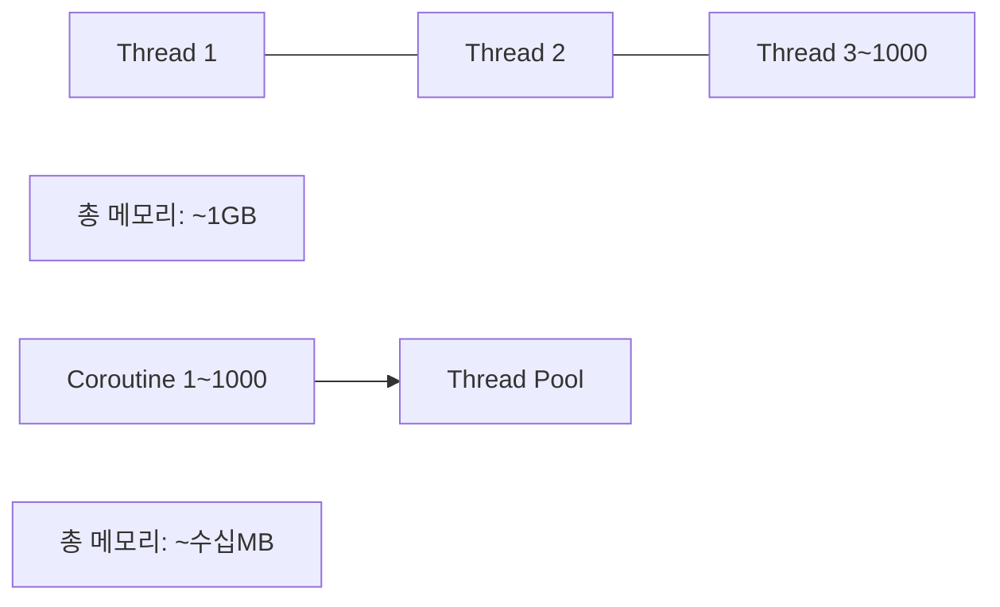
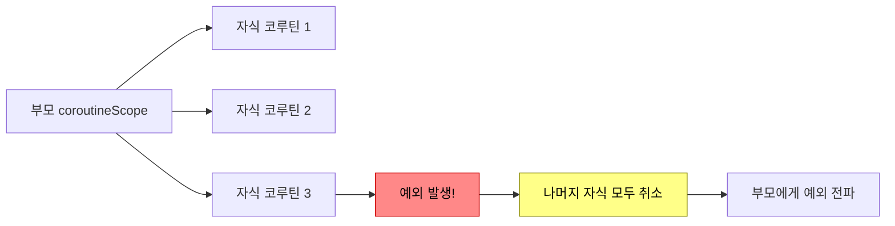
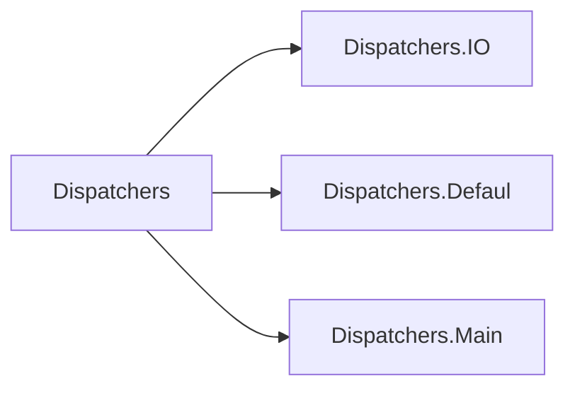

서버에 동시 요청이 10만 개 들어온다. 전통적인 스레드 모델로는 스레드 10만 개가 필요하고, 각 스레드가 1MB를 쓴다면 메모리만 100GB다. 실제 서버가 가진 CPU 코어는 8개뿐인데. 코루틴은 스레드 수십 개로 이 10만 개의 요청을 처리한다. **핵심은 "대기 중인 작업이 스레드를 붙잡고 있지 않는다"는 것이다.**

## 비유 — 서빙 직원 1명이 테이블 100개를 담당하는 방법

식당에서 서빙 직원이 10번 테이블에 주문을 받고 주방에 전달했다. 이제 음식이 나올 때까지 10~15분이 걸린다. **블로킹 스레드 방식**: 직원이 10번 테이블 옆에 서서 음식이 나올 때까지 기다린다. 100개 테이블을 담당하려면 직원 100명이 필요하다.

**코루틴 방식**: 주방에 주문을 전달한 직원은 즉시 다른 테이블로 이동한다. 주방에서 "10번 테이블 음식 나왔어요" 신호가 오면 그때 가서 서빙한다. 직원 5~10명이 테이블 100개를 처리한다.

`delay()`는 "음식이 나올 때까지 기다리되, 그 동안 스레드를 다른 코루틴이 쓸 수 있게 내려놓는 것"이다. `Thread.sleep()`은 직원이 테이블 옆에 서 있는 것이고, `delay()`는 주방 신호를 기다리면서 다른 테이블로 이동하는 것이다.

---

## 스레드 vs 코루틴 — 메모리와 성능 비교



왜 코루틴이 스레드보다 가볍나? 스레드는 OS 레벨에서 관리되고 컨텍스트 스위칭 비용이 크다. 코루틴은 JVM 힙에 있는 일반 객체다. 일시 중단(suspend)은 코루틴 상태를 힙에 저장하고 스레드를 반환하는 것 — OS가 개입하지 않는다.

---

## suspend 함수 — 일시 중단 가능한 함수

```kotlin
// suspend 키워드 = "이 함수는 실행 중 잠깐 멈출 수 있고,
//                    그 동안 스레드를 다른 코루틴이 쓸 수 있다"
suspend fun fetchUser(id: Long): User {
    delay(100)  // 100ms 대기 — 스레드 블로킹 없음
    return userRepository.findById(id)
}

// suspend 함수는 반드시 코루틴 스코프 안에서만 호출 가능
fun main() {
    // fetchUser(1L)  → 컴파일 에러: Suspend function 'fetchUser' should be called only from a coroutine
}

// 코루틴 스코프 안에서 호출
fun main() = runBlocking {
    val user = fetchUser(1L)  // 여기서 일시 중단되고 재개됨
    println(user.name)
}
```

`suspend` 함수를 일반 함수에서 호출할 수 없는 이유: suspend 함수는 내부적으로 연속(continuation) 객체를 파라미터로 받는다. 코루틴 컨텍스트가 없으면 재개할 방법이 없기 때문이다.

---

## 코루틴 빌더 — launch, async, runBlocking

```kotlin
// 1. runBlocking — 테스트와 main 함수에서만 사용
//    코루틴이 완료될 때까지 현재 스레드를 블로킹 (서버 코드에서는 금지)
fun main() = runBlocking {
    println("시작")
    delay(1000)
    println("1초 후")
}

// 2. launch — 결과가 필요 없는 비동기 작업
//    Job 반환 — 취소, 완료 대기 가능
val job: Job = scope.launch {
    sendPushNotification(userId)  // 결과 필요 없음
}
job.join()          // 완료 대기
job.cancel()        // 취소
job.cancelAndJoin() // 취소 + 완료 대기

// 3. async — 결과가 필요한 비동기 작업
//    Deferred<T> 반환 — await()로 결과 수신
val deferred: Deferred<User> = scope.async {
    userService.findById(1L)
}
val user = deferred.await()  // 완료될 때까지 일시 중단 (스레드 블로킹 아님)

// 4. coroutineScope — 여러 코루틴을 묶어서 처리
//    안의 모든 코루틴이 완료될 때까지 대기
//    하나라도 실패하면 나머지 취소 (구조적 동시성)
suspend fun fetchAll(userId: Long): UserDashboard = coroutineScope {
    val profile = async { profileService.fetch(userId) }
    val orders = async { orderService.fetch(userId) }
    UserDashboard(profile.await(), orders.await())  // 둘 다 완료될 때까지 대기
}
```

`launch` vs `async` 선택 기준: 결과값이 필요하면 `async`, 필요 없으면 `launch`. 하지만 `async`를 `await()` 없이 쓰면 예외가 무시된다는 함정이 있다.

---

## 구조적 동시성 — 자식이 부모를 초과할 수 없다

구조적 동시성 없이 코루틴을 쓰면 "코루틴 누수"가 발생한다. HTTP 요청이 취소됐는데 그 요청이 시작한 코루틴이 계속 실행되는 것이다.



```kotlin
// 구조적 동시성 보장 — coroutineScope 사용
suspend fun fetchUserData(userId: Long): UserData = coroutineScope {
    // 세 가지를 병렬로 가져옴
    val profile = async { profileService.fetchProfile(userId) }
    val orders = async { orderService.fetchOrders(userId) }
    val preferences = async { prefService.fetchPreferences(userId) }

    // 알림 조회가 실패하면 → 나머지(프로필, 주문)도 취소됨
    // 모두 성공하면 → UserData 구성
    UserData(
        profile = profile.await(),
        orders = orders.await(),
        preferences = preferences.await()
    )
}

// 자식 실패가 형제에게 영향 주지 않아야 할 때 — supervisorScope
suspend fun fetchUserDataResilient(userId: Long): UserData = supervisorScope {
    val profile = async {
        runCatching { profileService.fetchProfile(userId) }.getOrDefault(Profile.empty())
    }
    val orders = async {
        runCatching { orderService.fetchOrders(userId) }.getOrDefault(emptyList())
    }

    // 프로필 조회 실패해도 주문 조회는 계속
    UserData(
        profile = profile.await(),
        orders = orders.await()
    )
}
```

---

## Dispatchers — 어떤 스레드에서 실행할 것인가



```kotlin
suspend fun processOrder(orderId: Long): ProcessResult {
    // DB 조회 — I/O 작업이므로 Dispatchers.IO
    val order = withContext(Dispatchers.IO) {
        orderRepository.findById(orderId)
    }

    // 세금 계산 — CPU 집중이므로 Dispatchers.Default
    val tax = withContext(Dispatchers.Default) {
        taxCalculator.calculate(order)
    }

    // 다시 I/O로 — 결과 저장
    return withContext(Dispatchers.IO) {
        orderRepository.save(order.copy(tax = tax))
        ProcessResult.success(orderId)
    }
}
```

`Dispatchers.IO`에서 CPU 집중 작업을 하면? 다른 I/O 코루틴들이 스레드를 못 받아서 전체 처리량이 떨어진다. 올바른 Dispatcher를 선택하는 것이 성능에 직접 영향을 준다.

---

## 에러 처리

### try-catch — 기본

```kotlin
suspend fun safeFetch(id: Long): User? {
    return try {
        userService.findById(id)
    } catch (e: UserNotFoundException) {
        log.warn("사용자 없음: $id")
        null
    } catch (e: DatabaseException) {
        log.error("DB 오류", e)
        throw e  // 상위로 전파
    }
}
```

### CoroutineExceptionHandler — launch에서 발생한 예외

```kotlin
// launch는 try-catch로 잡을 수 없음 — CoroutineExceptionHandler 사용
val exceptionHandler = CoroutineExceptionHandler { _, throwable ->
    log.error("처리되지 않은 코루틴 예외: ${throwable.message}", throwable)
    alertService.notify("시스템 오류: ${throwable.message}")
}

val scope = CoroutineScope(Dispatchers.Default + exceptionHandler)

scope.launch {
    // 여기서 발생한 예외는 exceptionHandler가 처리
    processOrders()
}
```

왜 `launch`의 예외를 try-catch로 못 잡나? `launch`는 즉시 반환한다. 예외는 나중에 다른 스레드에서 발생한다. try-catch는 이미 끝난 상태다.

### CancellationException — 코루틴 취소는 예외가 아니다

```kotlin
val job = launch {
    try {
        delay(Long.MAX_VALUE)  // 무한 대기
    } catch (e: CancellationException) {
        // 취소 시 리소스 정리
        closeConnection()
        throw e  // CancellationException은 반드시 다시 던져야 함
    }
}

job.cancel()  // CancellationException을 코루틴에 주입
```

`CancellationException`을 삼키면(throw e 빼면) 코루틴이 취소됐는데도 계속 실행되는 문제가 생긴다.

---

## Flow — 비동기 데이터 스트림

`suspend` 함수는 값을 하나만 반환한다. 시간이 지남에 따라 여러 값이 나오는 스트림이 필요하면 `Flow`를 사용한다.

> **비유**: suspend 함수는 택배 1개 배달. Flow는 구독 서비스 — 매달 1일에 새 상품이 온다.

```kotlin
// Flow 생성 — emit으로 값을 하나씩 방출
fun getOrderUpdates(orderId: Long): Flow<OrderStatus> = flow {
    while (true) {
        val status = orderRepository.findStatus(orderId)
        emit(status)           // 값 방출
        delay(5000)            // 5초 대기 (폴링)
        if (status == OrderStatus.COMPLETED) break
    }
}

// Flow 수집
runBlocking {
    getOrderUpdates(1L)
        .collect { status ->
            println("주문 상태: $status")  // 상태 변경될 때마다 출력
        }
}
```

### Flow 연산자 — 컬렉션 API와 동일한 패턴

```kotlin
val result = (1..100).asFlow()
    .filter { it % 2 == 0 }               // 짝수만 통과
    .map { it * it }                       // 제곱
    .take(5)                               // 앞에서 5개만
    .onEach { log.debug("처리 중: $it") } // 부수 효과
    .catch { e -> log.error("에러", e) }  // 에러 처리 (downstream 계속 실행)
    .toList()
// 결과: [4, 16, 36, 64, 100]

// flatMapConcat — 각 원소에서 새 Flow를 순서대로 처리
val allOrders: Flow<Order> = userFlow
    .flatMapConcat { user -> orderService.getOrdersFlow(user.id) }

// flatMapMerge — 병렬 처리 (순서 보장 안 함)
val allOrders: Flow<Order> = userFlow
    .flatMapMerge(concurrency = 4) { user -> orderService.getOrdersFlow(user.id) }
```

### StateFlow와 SharedFlow

```kotlin
// StateFlow — 현재 상태를 항상 보유 (초기값 필수)
//             새 구독자가 즉시 현재 상태를 받음
class OrderViewModel {
    private val _state = MutableStateFlow<OrderState>(OrderState.Loading)
    val state: StateFlow<OrderState> = _state.asStateFlow()  // 외부에 읽기 전용 노출

    fun loadOrder(id: Long) {
        viewModelScope.launch {
            _state.value = OrderState.Loading
            _state.value = try {
                OrderState.Success(orderService.findById(id))
            } catch (e: Exception) {
                OrderState.Error(e.message ?: "알 수 없는 오류")
            }
        }
    }
}

// SharedFlow — 이벤트 방출 (이벤트 버스 패턴)
//              새 구독자는 과거 이벤트를 못 받음 (기본값)
class EventBus {
    private val _events = MutableSharedFlow<AppEvent>()
    val events: SharedFlow<AppEvent> = _events.asSharedFlow()

    suspend fun emit(event: AppEvent) = _events.emit(event)
}

// 구독
eventBus.events
    .filterIsInstance<OrderCreatedEvent>()
    .collect { event ->
        pushService.notify(event.userId, "주문 완료!")
    }
```

`StateFlow` vs `SharedFlow` 선택: 현재 상태가 필요하면 StateFlow (UI 상태, 설정값), 이벤트 스트림이면 SharedFlow (알림, 로그).

---

## 취소와 타임아웃

```kotlin
val job = launch {
    repeat(1000) { i ->
        // isActive 체크 — 취소 요청 시 루프 탈출
        if (!isActive) {
            log.info("코루틴 취소됨, 정리 중...")
            return@launch
        }
        processItem(i)
        delay(100)  // 이 지점에서도 취소 가능 (CancellationException)
    }
}

delay(500)
job.cancelAndJoin()  // 취소 요청 + 완료 대기

// withTimeout — 지정 시간 초과 시 TimeoutCancellationException
try {
    withTimeout(3000) {  // 3초 제한
        externalApiService.call()
    }
} catch (e: TimeoutCancellationException) {
    log.warn("외부 API 타임아웃")
    fallbackService.call()
}

// withTimeoutOrNull — 예외 대신 null 반환
val result = withTimeoutOrNull(3000) {
    externalApiService.call()
} ?: fallbackService.call()

// NonCancellable — 취소돼도 반드시 실행 (리소스 정리)
launch {
    val connection = acquireConnection()
    try {
        processWithConnection(connection)
    } finally {
        withContext(NonCancellable) {
            connection.close()  // 취소됐어도 반드시 닫음
        }
    }
}
```

---


## 극한 시나리오

4개의 외부 서비스를 호출해서 대시보드를 구성하는 API가 있다.

```kotlin
@Service
class DashboardService(
    private val userService: UserService,
    private val orderService: OrderService,
    private val notificationService: NotificationService,
    private val statsService: StatsService
) {

    // 순차 호출 — 합산 시간
    suspend fun getDashboardSlow(userId: Long): Dashboard {
        val user = userService.findById(userId)        // 200ms
        val orders = orderService.findByMember(userId) // 300ms
        val notifs = notificationService.find(userId)  // 150ms
        val stats = statsService.findByMember(userId)  // 250ms
        return Dashboard(user, orders, notifs, stats)
        // 총 900ms
    }

    // 병렬 호출 — 가장 느린 작업에 맞춤
    suspend fun getDashboardFast(userId: Long): Dashboard = coroutineScope {
        val userD = async { userService.findById(userId) }        // 200ms
        val ordersD = async { orderService.findByMember(userId) } // 300ms
        val notifsD = async { notificationService.find(userId) }  // 150ms
        val statsD = async { statsService.findByMember(userId) }  // 250ms
        // 4개가 동시에 실행됨
        Dashboard(userD.await(), ordersD.await(), notifsD.await(), statsD.await())
        // 총 300ms (가장 느린 주문 조회 기준)
    }

    // 일부 실패 허용 — 핵심 데이터만 필수
    suspend fun getDashboardResilient(userId: Long): Dashboard = supervisorScope {
        // 핵심 데이터 — 실패하면 전체 실패
        val user = async { userService.findById(userId) }
        val orders = async { orderService.findByMember(userId) }

        // 부가 데이터 — 실패해도 빈 값으로 대체
        val notifs = async {
            runCatching { notificationService.find(userId) }.getOrDefault(emptyList())
        }
        val stats = async {
            runCatching { statsService.findByMember(userId) }.getOrNull()
        }

        Dashboard(
            user = user.await(),        // 실패 시 예외 전파
            orders = orders.await(),    // 실패 시 예외 전파
            notifications = notifs.await(),  // 실패 시 빈 목록
            stats = stats.await()            // 실패 시 null
        )
    }
}
```

---
## Spring WebFlux + 코루틴

Spring WebFlux는 Reactive Streams(Mono/Flux) 기반이지만, 코루틴과 통합하면 훨씬 직관적인 코드가 된다.

```kotlin
@RestController
@RequestMapping("/api/orders")
class OrderController(private val orderService: OrderService) {

    // suspend 함수로 선언 — WebFlux가 자동으로 Mono로 변환
    @GetMapping("/{id}")
    suspend fun getOrder(@PathVariable id: Long): OrderResponse {
        return orderService.findById(id)
    }

    // Flow 반환 — Server-Sent Events 스트리밍
    @GetMapping("/stream", produces = [MediaType.TEXT_EVENT_STREAM_VALUE])
    fun streamOrders(): Flow<OrderResponse> = orderService.orderStream()

    @PostMapping
    suspend fun createOrder(@RequestBody req: CreateOrderRequest): ResponseEntity<OrderResponse> {
        val order = orderService.create(req)
        return ResponseEntity
            .created(URI.create("/api/orders/${order.id}"))
            .body(order)
    }
}

@Service
class OrderService(private val orderRepository: OrderRepository) {

    suspend fun findById(id: Long): OrderResponse {
        return orderRepository.findById(id)  // R2DBC — 코루틴과 통합
            ?.let { OrderResponse.from(it) }
            ?: throw OrderNotFoundException(id)
    }

    fun orderStream(): Flow<OrderResponse> = orderRepository
        .findAll()          // Flux<Order> 반환
        .asFlow()           // Flow<Order>로 변환
        .map { OrderResponse.from(it) }
}
```

---

## 코루틴 테스트

```kotlin
// kotlinx-coroutines-test 라이브러리
class OrderServiceTest {

    @Test
    fun `주문 생성 테스트`() = runTest {  // 가상 시간으로 테스트
        val mockRepo = mockk<OrderRepository>()
        coEvery { mockRepo.save(any()) } returns Order(id = 1L)  // coEvery — suspend 함수 mock

        val service = OrderService(mockRepo)
        val result = service.createOrder(CreateOrderCommand(1L, 1L, 2))

        assertThat(result.id).isEqualTo(1L)
        coVerify { mockRepo.save(any()) }  // coVerify — suspend 함수 호출 검증
    }

    @Test
    fun `5초 delay를 즉시 테스트`() = runTest {
        val job = launch {
            delay(5_000)  // 실제로 5초 기다리지 않음
            println("완료")
        }
        // testScheduler로 가상 시간 진행
        advanceTimeBy(5_001)
        assertTrue(job.isCompleted)
        // 실제 실행 시간: 수 밀리초
    }

    @Test
    fun `Flow 테스트`() = runTest {
        val flow = flowOf(1, 2, 3, 4, 5)
            .filter { it % 2 == 0 }

        val results = flow.toList()
        assertThat(results).containsExactly(2, 4)
    }
}
```

`runTest` 없이 `runBlocking`으로 delay가 있는 테스트를 작성하면? 테스트가 실제로 그 시간만큼 기다린다. `runTest`는 가상 시간을 사용해서 `delay(5000)`도 즉시 통과한다.

---

## 코루틴 전체 구조 정리

```mermaid
graph LR
    Normal["일반 함수"] -->|runBlocking| Scope["코루틴 스코프"..|launch| Job["Job"]
    ..|async| Deferred["Defer..|emit/collect| Consume["소비"]
```

---

## 정리

| 개념 | 설명 | 언제 사용 |
|------|------|----------|
| `suspend fun` | 일시 중단 가능 함수 | 비동기 작업 정의 |
| `launch` | 결과 없는 코루틴 | 알림 발송, 로깅 등 |
| `async/await` | 결과 있는 비동기 | 병렬 데이터 로딩 |
| `coroutineScope` | 자식 모두 완료 대기, 실패 전파 | 여러 비동기 작업 묶기 |
| `supervisorScope` | 자식 실패 독립 | 일부 실패 허용 |
| `Dispatchers.IO` | I/O 작업용 스레드풀 | DB, HTTP, 파일 |
| `Dispatchers.Default` | CPU 작업용 스레드풀 | 계산, 이미지 처리 |
| `Flow<T>` | 비동기 데이터 스트림 | 실시간 데이터, 폴링 |
| `StateFlow` | 현재 상태 보유 Flow | UI 상태 관리 |
| `SharedFlow` | 이벤트 방출 Flow | 이벤트 버스 패턴 |
| `withTimeout` | 시간 제한 실행 | 외부 API 타임아웃 |
| `withContext` | Dispatcher 전환 | I/O ↔ CPU 전환 |

---

## 왜 코루틴인가? (vs Thread vs RxJava vs WebFlux)

| 방식 | 동시성 모델 | 메모리 | 코드 복잡도 | 선택 기준 |
|------|-----------|--------|-----------|---------|
| **Thread** | OS 스레드 | 스레드당 ~1MB | 낮음 | 간단한 비동기, 소규모 |
| **ThreadPool** | 스레드 재사용 | 풀 크기 제한 | 낮음 | Spring MVC 기본 방식 |
| **RxJava** | Reactive, 콜백 체인 | 낮음 | 높음 (러닝커브) | Android, 레거시 반응형 |
| **Kotlin 코루틴** | 경량 코루틴 | 코루틴당 ~수KB | 낮음 (순차 스타일) | Kotlin 프로젝트, MSA |
| **WebFlux (Reactor)** | 반응형, Mono/Flux | 낮음 | 높음 | Java 프로젝트, 반응형 스트림 |

```
코루틴을 선택하는 이유:
1. 경량성: OS 스레드 1개 = 1MB 스택
            코루틴 1개 = 수KB → 수만 개 동시 실행 가능
2. 순차 스타일: 비동기 코드를 동기처럼 작성 (콜백 지옥 없음)
3. 구조화된 동시성: 코루틴 범위(scope)로 생명주기 관리
4. Kotlin 네이티브: suspend 함수로 자연스러운 통합

Thread 대비:
  스레드 10,000개 → JVM OOM 가능
  코루틴 10,000개 → 수십 MB 수준, 문제없음

RxJava 대비:
  RxJava: .flatMap().switchMap().observeOn() 체인 복잡
  코루틴: async { } + await() 순차 스타일로 동일 효과
```

---

## 실무에서 자주 하는 실수

#### 실수 1: GlobalScope 사용 (구조화된 동시성 위반)

```kotlin
// 나쁜 예 — GlobalScope는 애플리케이션 생명주기와 무관
fun processOrder(orderId: Long) {
    GlobalScope.launch {  // 취소 불가, 메모리 누수 위험
        sendNotification(orderId)
    }
}

// 좋은 예 — 적절한 scope 사용
class OrderService(private val scope: CoroutineScope) {
    fun processOrder(orderId: Long) {
        scope.launch {  // scope 취소 시 코루틴도 자동 취소
            sendNotification(orderId)
        }
    }
}

// Spring에서는 CoroutineScope를 Bean으로 등록
@Bean
fun applicationScope() = CoroutineScope(SupervisorJob() + Dispatchers.Default)
```

#### 실수 2: blocking 코드를 IO Dispatcher 없이 실행

```kotlin
// 나쁜 예 — DB 호출을 Default Dispatcher에서 실행
suspend fun getUser(id: Long): User = withContext(Dispatchers.Default) {
    userRepository.findById(id)  // Blocking I/O → Default 스레드 블로킹
}

// 좋은 예 — Blocking I/O는 반드시 IO Dispatcher 사용
suspend fun getUser(id: Long): User = withContext(Dispatchers.IO) {
    userRepository.findById(id)  // IO Dispatcher = 블로킹 전용 스레드풀
}

// Dispatcher 선택 기준:
// Dispatchers.Default: CPU 집약적 작업 (계산, 파싱)
// Dispatchers.IO: 블로킹 I/O (JDBC, 파일, 소켓)
// Dispatchers.Main: UI 업데이트 (Android)
```

#### 실수 3: async 예외 처리 누락

```kotlin
// 나쁜 예 — async에서 발생한 예외가 조용히 무시됨
val deferred = async { riskyOperation() }
// await() 호출 전까지 예외가 전파되지 않음

// 좋은 예 — 반드시 await() 또는 try-catch
try {
    val result = async { riskyOperation() }.await()
} catch (e: Exception) {
    log.error("작업 실패", e)
}

// 또는 SupervisorJob으로 자식 실패가 부모에 전파되지 않게
val result = supervisorScope {
    val a = async { operationA() }
    val b = async { operationB() }
    // a 실패해도 b는 계속 실행
    Pair(runCatching { a.await() }, runCatching { b.await() })
}
```

#### 실수 4: suspend 함수를 일반 스레드에서 호출

```kotlin
// 나쁜 예 — suspend 함수는 코루틴 컨텍스트 필요
fun main() {
    getUser(1L)  // 컴파일 에러: suspend 함수는 코루틴 내에서만 호출 가능
}

// 좋은 예 — runBlocking으로 코루틴 컨텍스트 생성
fun main() = runBlocking {
    val user = getUser(1L)  // OK
    println(user)
}
// 주의: runBlocking은 현재 스레드를 블로킹 → 프로덕션 코드에서는 지양
```

#### 실수 5: Flow 수집을 메인 스레드에서 하면서 UI 업데이트

```kotlin
// Flow 수집 시 적절한 컨텍스트 사용
userFlow
    .flowOn(Dispatchers.IO)      // 데이터 생성은 IO 스레드
    .map { it.toUiModel() }      // 변환
    .collect { uiModel ->
        updateUi(uiModel)         // 수집은 호출한 스레드(Main)
    }
```

---

## 면접 포인트

#### Q. 코루틴의 suspend 함수란 무엇인가요?

```kotlin
// suspend 함수: 실행을 일시 중단했다가 재개할 수 있는 함수
suspend fun fetchUser(id: Long): User {
    delay(100)  // 스레드를 블로킹하지 않고 100ms 대기
    return userRepository.findById(id)
}

// 일반 함수와의 차이:
// 일반 함수: 호출 → 완료까지 스레드 점유
// suspend 함수: 중단점에서 스레드 해방 → 다른 코루틴 실행 → 재개

// 컴파일 후: Continuation 객체로 변환 (CPS 변환)
// → 상태 머신으로 구현, 스택 프레임 대신 힙에 상태 저장
```

#### Q. launch와 async의 차이는?

```kotlin
// launch: 결과값 없음, Job 반환 (fire-and-forget)
val job: Job = launch {
    sendEmail()  // 결과가 필요 없는 작업
}
job.cancel()  // 취소 가능

// async: 결과값 있음, Deferred<T> 반환
val deferred: Deferred<User> = async {
    fetchUser(id)  // 결과가 필요한 작업
}
val user: User = deferred.await()  // 결과 대기

// 병렬 실행 패턴
val userDeferred = async { fetchUser(id) }
val orderDeferred = async { fetchOrders(id) }
val user = userDeferred.await()    // 병렬 실행 후 결과 수집
val orders = orderDeferred.await()
```

#### Q. 코루틴의 구조화된 동시성(Structured Concurrency)이란?

```
구조화된 동시성의 핵심:
1. 부모 코루틴이 취소되면 자식 코루틴도 모두 취소
2. 자식 코루틴이 모두 완료될 때까지 부모가 대기
3. 자식 코루틴의 예외가 부모로 전파

이점:
- 코루틴 누수(leak) 방지: scope가 닫히면 모든 코루틴 자동 정리
- 예외 전파 명확: 어디서 에러가 났는지 추적 가능
- 생명주기 관리 용이: HTTP 요청 취소 시 하위 DB 작업도 자동 취소

GlobalScope는 이 원칙을 위반 → 사용 지양
```
