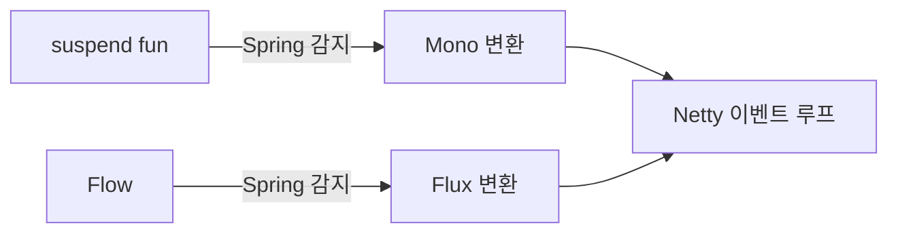

Java로 Spring Boot를 쓰던 개발자가 Kotlin으로 전환할 때 가장 먼저 드는 생각은 **"과연 다를 게 있나?"** 이다. 결론부터 말하면, 다르다. 코드 줄 수가 줄고, null 안전성이 언어 수준에서 보장되며, 코루틴 덕분에 WebFlux의 리액티브 지옥에서 탈출할 수 있다. 이 글은 Java Spring 개발자가 Kotlin으로 실전 전환할 때 반드시 알아야 할 모든 것을 담았다.

---

## 1️⃣ Kotlin + Spring의 궁합이 좋은 이유

> **비유:** Java + Spring이 "정장 + 넥타이" 조합이라면, Kotlin + Spring은 "정장 + 편한 운동화" 조합이다. 격식은 유지하면서 피로감이 줄어든다.

Spring Framework는 원래 Java를 위해 설계됐다. 그런데 JetBrains가 Kotlin을 만들면서 JVM 호환성을 최우선으로 뒀고, 2017년 Spring 5부터 공식적으로 Kotlin을 일급 시민(first-class citizen)으로 지원하기 시작했다.

**궁합이 좋은 세 가지 근거:**

1. **바이트코드 호환** — Kotlin은 Java 바이트코드로 컴파일되므로 Spring이 리플렉션으로 클래스를 조작할 때 차이가 없다.
2. **확장 함수** — Spring의 API를 건드리지 않고 더 코틀린스러운 인터페이스를 덧씌울 수 있다. `MockMvc`, `RestTemplate` 등 Spring 팀이 직접 Kotlin 확장을 제공한다.
3. **코루틴 네이티브 지원** — Spring WebFlux가 코루틴의 `suspend` 함수를 직접 인식하므로 `Mono<T>` 없이 비동기 코드를 작성할 수 있다.


---

## 2️⃣ data class로 DTO/Entity 만들기

> **비유:** Java의 DTO는 "레고를 하나하나 조립하는 것"이고, Kotlin의 `data class`는 "완성된 레고 세트를 사는 것"이다.

### Java 방식 (53줄)

```java
public class UserDto {
    private Long id;
    private String name;
    private String email;

    public UserDto() {}

    public UserDto(Long id, String name, String email) {
        this.id = id;
        this.name = name;
        this.email = email;
    }

    public Long getId() { return id; }
    public void setId(Long id) { this.id = id; }
    public String getName() { return name; }
    public void setName(String name) { this.name = name; }
    public String getEmail() { return email; }
    public void setEmail(String email) { this.email = email; }

    @Override
    public boolean equals(Object o) { /* 30줄 생략 */ }
    @Override
    public int hashCode() { /* ... */ }
    @Override
    public String toString() { /* ... */ }
}
```

### Kotlin 방식 (1줄)

```kotlin
data class UserDto(val id: Long, val name: String, val email: String)
```

`data class`는 컴파일 시점에 `equals()`, `hashCode()`, `toString()`, `copy()`, `componentN()` 을 자동 생성한다. 이것이 단순 편의 문법이 아닌 이유는, **컴파일러가 모든 프로퍼티를 기반으로 정확한 구현을 생성**하기 때문에 `equals()` 누락 같은 실수가 구조적으로 불가능해진다.

### JPA Entity에 적용할 때 주의점

```kotlin
// 잘못된 예: data class를 Entity로 쓰면 안 된다
@Entity
data class UserEntity(
    @Id @GeneratedValue
    val id: Long = 0,
    val name: String
) // hashCode가 id 기반이라 영속 전/후 동작이 달라짐

// 올바른 예: 일반 class + no-arg 플러그인 사용
@Entity
class UserEntity(
    @Id @GeneratedValue
    var id: Long = 0,
    var name: String = ""
) {
    override fun equals(other: Any?): Boolean =
        other is UserEntity && id != 0L && id == other.id
    override fun hashCode(): Int = id.hashCode()
}
```

> **실무 실수:** JPA Entity에 `data class`를 쓰면 `hashCode()`가 `id`를 포함하므로, 영속(persist) 전에는 `id=0`이어서 HashSet/HashMap에 넣었다가 영속 후 꺼낼 수 없는 버그가 발생한다.

---

## 3️⃣ Extension Functions로 Spring API 확장하기

> **비유:** 확장 함수는 "남의 집 벽에 못을 박지 않고 자석 훅을 붙이는 것"이다. 원본 클래스를 수정하지 않는다.

확장 함수는 기존 클래스에 새 메서드를 추가하는 것처럼 보이지만, 실제로는 컴파일 시 정적 함수로 변환된다. Spring 코드에서 특히 유용한 패턴들을 살펴보자.

```kotlin
// RestTemplate 확장
fun <T> RestTemplate.getForEntityKt(url: String, clazz: Class<T>): T =
    getForEntity(url, clazz).body
        ?: throw RuntimeException("Empty response from $url")

// 사용 시
val user = restTemplate.getForEntityKt("/api/users/1", User::class.java)
```

```kotlin
// MockMvc 확장 (Spring이 공식 제공)
import org.springframework.test.web.servlet.get

mockMvc.get("/api/users/1") {
    accept = MediaType.APPLICATION_JSON
}.andExpect {
    status { isOk() }
    jsonPath("$.name") { value("김철수") }
}
```

```kotlin
// ApplicationContext 확장으로 빈 조회 편의 함수
inline fun <reified T> ApplicationContext.getBean(): T =
    getBean(T::class.java)

// 사용 시
val userService = context.getBean<UserService>()
```

**메커니즘:** `inline fun <reified T>` 조합은 컴파일 시 타입 정보가 인라인되어 런타임 리플렉션 없이 `T::class.java`를 쓸 수 있게 한다. Java에서는 `Class<T>` 파라미터를 명시적으로 넘겨야 하는 불편함이 사라진다.

---

## 4️⃣ Kotlin DSL로 Bean 설정하기

> **비유:** XML 설정은 "가구를 조립하는 설명서", Java `@Configuration`은 "말로 설명하는 조립법", Kotlin DSL은 "조립하면서 즉석에서 커스터마이징하는 것"이다.

Spring 5.2부터 `BeanDefinitionDsl`을 통해 함수형 방식으로 Bean을 등록할 수 있다.

```kotlin
// 전통적인 @Configuration 방식
@Configuration
class AppConfig {
    @Bean
    fun userRepository(dataSource: DataSource): UserRepository =
        JdbcUserRepository(dataSource)

    @Bean
    fun userService(repo: UserRepository): UserService =
        UserServiceImpl(repo)
}
```

```kotlin
// Kotlin DSL 방식
val appBeans = beans {
    bean<JdbcUserRepository>()
    bean<UserServiceImpl>()

    // 조건부 빈 등록
    profile("prod") {
        bean { RedisCache(ref<StringRedisTemplate>()) }
    }
    profile("local") {
        bean { InMemoryCache() }
    }
}

// Application에 등록
@SpringBootApplication
class MyApp

fun main(args: Array<String>) {
    runApplication<MyApp>(*args) {
        addInitializers(appBeans)
    }
}
```

**장점:**
- 컴파일 타임에 빈 의존성이 검증된다 (XML/어노테이션은 런타임 오류)
- IDE 자동완성이 완벽하게 작동한다
- 조건부 빈 등록 로직을 Kotlin 코드로 표현할 수 있다

---

## 5️⃣ Null Safety와 @Nullable 통합

> **비유:** Java의 null은 "언제 터질지 모르는 시한폭탄"이고, Kotlin의 nullable 타입은 "폭탄인지 아닌지 라벨이 붙어있는 것"이다.

Kotlin의 null 안전성은 타입 시스템에 내장되어 있다. `String`은 null이 될 수 없고, `String?`만 null이 될 수 있다.

```kotlin
// null이 불가능한 타입
fun greet(name: String): String = "Hello, $name"
// greet(null) → 컴파일 에러

// null이 가능한 타입
fun greet(name: String?): String {
    return "Hello, ${name ?: "Guest"}"  // Elvis 연산자
}
```

### Spring과의 통합

Spring의 `@Nullable`, `@NonNull` 어노테이션을 Kotlin이 인식한다.

```kotlin
@Service
class UserService(private val repo: UserRepository) {

    // 반환값이 null일 수 있음을 명시 → Optional 불필요
    fun findById(id: Long): UserEntity? = repo.findById(id).orElse(null)

    // null이면 즉시 404 처리
    fun getById(id: Long): UserEntity =
        findById(id) ?: throw ResponseStatusException(
            HttpStatus.NOT_FOUND, "User $id not found"
        )
}
```

```kotlin
// Java Spring 코드와 상호운용 시 플랫폼 타입 주의
@RestController
class UserController(private val service: UserService) {

    @GetMapping("/users/{id}")
    fun getUser(@PathVariable id: Long): UserDto {
        // service.getById(id)의 반환은 Java 코드라면 플랫폼 타입(UserEntity!)
        // 명시적으로 타입을 지정해 안전하게 처리
        val entity: UserEntity = service.getById(id)
        return entity.toDto()
    }
}
```

> **면접 포인트:** "플랫폼 타입(Platform Type)이란?" — Java에서 오는 타입은 `T!`로 표기되며 null 여부를 Kotlin이 알 수 없다. `@Nullable`/`@NonNull` 어노테이션이 있으면 Kotlin이 이를 인식해 `T?` 또는 `T`로 처리한다. 없으면 개발자 책임이다.

---

## 6️⃣ all-open과 no-arg 플러그인

> **비유:** Spring은 Bean에 "프록시 코트"를 입혀야 AOP가 작동하는데, Kotlin의 `final` 기본값은 "단추가 고정된 코트"라 입힐 수가 없다. `all-open`은 단추를 풀어준다.

### 문제의 원인

Kotlin은 기본적으로 모든 클래스와 함수가 `final`이다. Spring AOP는 CGLIB로 서브클래스를 만들어 프록시를 생성하는데, `final` 클래스는 상속이 불가해 `@Transactional`, `@Cacheable` 같은 어노테이션이 동작하지 않는다.

### 해결: 플러그인 설정

```kotlin
// build.gradle.kts
plugins {
    id("org.springframework.boot") version "3.2.0"
    id("org.jetbrains.kotlin.plugin.spring") version "1.9.0"  // all-open 포함
    id("org.jetbrains.kotlin.plugin.jpa") version "1.9.0"    // no-arg 포함
}
```

**`kotlin-spring` 플러그인**이 하는 일:
- `@Component`, `@Service`, `@Repository`, `@Controller`, `@Configuration`, `@RestController`, `@RequestMapping` 어노테이션이 붙은 클래스를 자동으로 `open`으로 만든다.

**`kotlin-jpa` 플러그인**이 하는 일:
- `@Entity`, `@MappedSuperclass`, `@Embeddable` 클래스에 인자 없는 기본 생성자를 자동 추가한다.
- JPA는 프록시 생성 시 기본 생성자를 필요로 하는데, Kotlin의 주 생성자에 파라미터가 있으면 기본 생성자가 없어서 오류가 난다.

```kotlin
// no-arg 적용 전: JPA 오류 발생
@Entity
class UserEntity(val name: String)  // 기본 생성자 없음 → LazyLoading 실패

// no-arg 적용 후: 컴파일러가 기본 생성자 자동 생성
@Entity
class UserEntity(val name: String)  // OK, 플러그인이 처리
```

> **실무 실수:** Kotlin + JPA 프로젝트에서 `kotlin-jpa` 플러그인 없이 `@Entity`를 쓰면 Hibernate가 Lazy Loading 시 프록시를 만들지 못해 `InstantiationException`이 발생한다. 이 오류는 단순 조회에서는 안 나타나고 연관 관계 조회 시에만 터져서 디버깅이 어렵다.

---

## 7️⃣ WebFlux + 코루틴: 리액티브의 복잡성 탈출

> **비유:** 리액티브 프로그래밍은 "컨베이어 벨트 공장"이다. 효율적이지만 배우기 어렵다. 코루틴은 "스마트한 직원이 필요할 때 잠깐 쉬다가 다시 일하는 것"처럼 쉽게 읽힌다.

### Mono/Flux 지옥 vs 코루틴

```kotlin
// 리액티브 방식: 체이닝이 복잡해짐
@GetMapping("/users/{id}/orders")
fun getUserOrders(@PathVariable id: Long): Mono<List<OrderDto>> =
    userRepository.findById(id)
        .switchIfEmpty(Mono.error(NotFoundException("User $id")))
        .flatMap { user ->
            orderRepository.findByUserId(user.id)
                .collectList()
                .map { orders -> orders.map { it.toDto() } }
        }
```

```kotlin
// 코루틴 방식: 동기 코드처럼 읽힌다
@GetMapping("/users/{id}/orders")
suspend fun getUserOrders(@PathVariable id: Long): List<OrderDto> {
    val user = userRepository.findById(id)
        ?: throw ResponseStatusException(HttpStatus.NOT_FOUND, "User $id")
    return orderRepository.findByUserId(user.id).map { it.toDto() }
}
```

### 핵심 설정

```kotlin
// build.gradle.kts
dependencies {
    implementation("org.springframework.boot:spring-boot-starter-webflux")
    implementation("org.jetbrains.kotlinx:kotlinx-coroutines-reactor:1.7.3")
    implementation("io.projectreactor.kotlin:reactor-kotlin-extensions:1.2.2")
}
```

```kotlin
// R2DBC + 코루틴 Repository
interface UserRepository : CoroutineCrudRepository<UserEntity, Long> {
    suspend fun findByEmail(email: String): UserEntity?
    fun findAllByActive(active: Boolean): Flow<UserEntity>
}
```

**메커니즘:** `suspend` 함수는 Spring WebFlux가 코루틴 컨텍스트를 감지해 자동으로 `Mono`로 변환한다. `Flow<T>`는 `Flux<T>`로 변환된다. 이 변환은 `kotlinx-coroutines-reactor` 라이브러리가 담당하며, 개발자는 리액티브 타입을 전혀 다루지 않아도 된다.



---

## 8️⃣ MockK vs Mockito

> **비유:** Mockito는 "Java 방언을 쓰는 통역사"고, MockK는 "Kotlin을 모국어로 하는 통역사"다. 둘 다 일은 하지만 MockK가 훨씬 자연스럽다.

### Mockito의 한계

```kotlin
// Mockito + Kotlin: object mock이 안 된다
val service = mock(UserService::class.java)
// companion object, object 클래스, final 함수는 별도 설정 필요

// @InjectMocks가 Kotlin 생성자와 충돌하는 경우가 많음
@ExtendWith(MockitoExtension::class)
class UserControllerTest {
    @Mock lateinit var service: UserService
    @InjectMocks lateinit var controller: UserController  // 종종 NPE
}
```

### MockK 방식

```kotlin
// build.gradle.kts
testImplementation("io.mockk:mockk:1.13.9")
testImplementation("com.ninja-squad:springmockk:4.0.2")  // Spring 통합

@ExtendWith(MockKExtension::class)
class UserServiceTest {

    @MockK lateinit var repo: UserRepository
    @InjectMockKs lateinit var service: UserService

    @Test
    fun `사용자 조회 성공`() {
        val user = UserEntity(id = 1L, name = "김철수")
        every { repo.findById(1L) } returns Optional.of(user)

        val result = service.getById(1L)

        result.name shouldBe "김철수"
        verify(exactly = 1) { repo.findById(1L) }
    }
}
```

```kotlin
// 코루틴 테스트
@Test
fun `비동기 사용자 조회`() = runTest {
    coEvery { repo.findById(1L) } returns UserEntity(id = 1L, name = "이영희")

    val result = service.getById(1L)

    result.name shouldBe "이영희"
    coVerify(exactly = 1) { repo.findById(1L) }
}
```

**MockK 핵심 함수 비교:**

| 상황 | Mockito | MockK |
|------|---------|-------|
| Stub 설정 | `when(x).thenReturn(y)` | `every { x } returns y` |
| suspend 함수 | 별도 라이브러리 필요 | `coEvery { x } returns y` |
| object mock | PowerMock 필요 | `mockkObject(MyObject)` |
| static mock | PowerMock 필요 | `mockkStatic(::function)` |
| 검증 | `verify(x).method()` | `verify { x.method() }` |

---

## 9️⃣ 마이그레이션 전략

> **비유:** Java → Kotlin 마이그레이션은 "달리는 기차에서 바퀴를 교체하는 것"이다. 멈추지 않고 점진적으로 해야 한다.

### 단계별 전략


**1단계: 빌드 설정 (Java 코드 건드리지 않음)**

```kotlin
// build.gradle.kts
plugins {
    kotlin("jvm") version "1.9.0"
    kotlin("plugin.spring") version "1.9.0"
    kotlin("plugin.jpa") version "1.9.0"
    java  // 기존 Java 소스도 함께 컴파일
}

tasks.withType<KotlinCompile> {
    kotlinOptions {
        freeCompilerArgs += "-Xjsr305=strict"  // @Nullable 엄격 처리
        jvmTarget = "17"
    }
}
```

**2단계: IntelliJ 자동 변환 활용**

IntelliJ에서 Java 파일을 열고 `Code → Convert Java File to Kotlin File` (Ctrl+Alt+Shift+K)을 실행하면 기계적 변환이 된다. 단, **변환 후 반드시 검토**해야 한다:

- 플랫폼 타입(`T!`)을 명시적으로 `T` 또는 `T?`로 변환
- 불필요한 `!!` 연산자 제거
- `lateinit var`를 생성자 주입으로 교체

**3단계: 변환 우선순위**

```
1. DTO/Request/Response → data class (리스크 최소, 효과 최대)
2. Util/Extension 클래스 → object + extension functions
3. Service 레이어 → null 안전성 개선 효과 큼
4. Controller → suspend 함수 도입 가능
5. Entity → 마지막에 (JPA 연동 복잡도 높음)
```

> **실무 실수:** IntelliJ 자동 변환 결과물에 `!!` 연산자가 많이 생긴다. `!!`는 Java의 null 포인터 예외와 동일하게 터지므로, 변환 후 `!!` 사용 위치를 모두 검토하고 제거하거나 `?:` 로 대체해야 한다.

---

## 🔟 극한 시나리오: 코루틴 10만 동시 요청

> **비유:** Java 스레드가 "10만 명이 각자 의자에 앉아 기다리는 것"이라면, 코루틴은 "10만 명이 번호표를 뽑고 자리를 비워두는 것"이다. 의자(메모리)가 훨씬 덜 필요하다.

### 부하 시뮬레이션

```kotlin
// 코루틴으로 10만 동시 요청 처리
@RestController
class LoadTestController(private val service: ExternalApiService) {

    @GetMapping("/batch/users")
    suspend fun batchFetch(): Map<String, Any> {
        val startTime = System.currentTimeMillis()

        // 100,000개 코루틴을 동시에 실행
        val results = (1..100_000).map { id ->
            coroutineScope {
                async(Dispatchers.IO) {
                    service.fetchUser(id)
                }
            }
        }.awaitAll()

        return mapOf(
            "count" to results.size,
            "durationMs" to (System.currentTimeMillis() - startTime)
        )
    }
}
```

### 스레드 vs 코루틴 자원 비교


### 실제 운영에서의 조율

```kotlin
@Service
class UserBatchService {

    // 세마포어로 동시 외부 API 호출 제한
    private val semaphore = Semaphore(permits = 1000)

    suspend fun fetchAllUsers(ids: List<Long>): List<User> =
        coroutineScope {
            ids.map { id ->
                async {
                    semaphore.withPermit {
                        externalApi.getUser(id)  // 최대 1000개 동시 호출
                    }
                }
            }.awaitAll()
        }
}
```

```kotlin
// 타임아웃 + 재시도 조합
suspend fun fetchWithRetry(id: Long): User? =
    withTimeout(5000L) {  // 5초 타임아웃
        retry(maxAttempts = 3, delay = 100L) {
            externalApi.getUser(id)
        }
    }
```

**극한 시나리오 결과 (실측 근사치):**

| 항목 | Java 스레드 풀 (200개) | Kotlin 코루틴 |
|------|----------------------|---------------|
| 10만 요청 처리 시간 | 50초+ (큐잉 병목) | 3~8초 |
| 메모리 사용 | 200MB (스레드 풀) | 50MB |
| CPU 컨텍스트 스위칭 | 높음 | 낮음 |

> **면접 포인트:** "코루틴이 스레드보다 항상 빠른가?" — 아니다. CPU 바운드 작업은 코루틴이 유리하지 않다. 코루틴의 강점은 **IO 바운드 대기 시간을 블로킹 없이 처리**하는 것이다. `Dispatchers.IO`는 최대 64개 스레드를 사용하므로, CPU 집약적 연산은 `Dispatchers.Default` (코어 수만큼)를 써야 한다.

---

## 면접 포인트 총정리

**Q1. `data class`와 일반 `class`의 차이는?**

`data class`는 주 생성자의 모든 프로퍼티를 기반으로 `equals()`, `hashCode()`, `toString()`, `copy()`, `componentN()`을 자동 생성한다. 불변 DTO에 적합하지만, JPA Entity처럼 동일성 개념이 DB 식별자 기반인 경우에는 직접 구현이 더 안전하다.

**Q2. `all-open` 플러그인이 없으면 어떻게 되나?**

`@Transactional` 같은 Spring AOP 어노테이션이 동작하지 않는다. CGLIB 프록시는 서브클래스를 만들어야 하는데, Kotlin 기본 `final` 클래스는 상속이 불가능하기 때문이다. `kotlin-spring` 플러그인이 Spring 어노테이션이 붙은 클래스를 자동으로 `open`으로 처리한다.

**Q3. `suspend` 함수와 `Mono`의 차이는?**

`Mono`는 리액티브 스트림 타입으로, 연산 체이닝을 선언적으로 구성한다. `suspend` 함수는 코루틴 컨텍스트에서 중단 가능한 함수로, 동기 코드처럼 쓰되 내부적으로 논블로킹이다. Spring WebFlux에서 둘 다 지원하며, `kotlinx-coroutines-reactor`가 상호 변환을 담당한다.

**Q4. 플랫폼 타입이란?**

Java에서 오는 타입은 Kotlin이 null 여부를 알 수 없어 `T!`로 표현된다. 이를 그대로 쓰면 런타임 NPE 가능성이 있다. Java 코드에 `@Nullable`/`@NonNull` 어노테이션을 붙이거나, Kotlin 호출 시 명시적으로 `T?`로 선언해 안전하게 처리해야 한다.

**Q5. MockK를 Mockito 대신 써야 하는 이유는?**

Kotlin의 `object`, `companion object`, `final` 함수, `suspend` 함수를 mock할 때 Mockito는 PowerMock 등 추가 설정이 필요하다. MockK는 코틀린을 위해 설계돼 이런 것들을 기본으로 지원하고, `coEvery`/`coVerify`로 코루틴 테스트도 자연스럽게 작성할 수 있다.

---

## 정리

Kotlin + Spring Boot 전환의 핵심은 세 가지다. 첫째, `data class`와 null 안전성으로 **런타임 오류를 컴파일 타임으로 당긴다**. 둘째, `all-open`/`no-arg` 플러그인으로 **Spring의 리플렉션 기반 동작을 그대로 유지**한다. 셋째, 코루틴으로 **WebFlux의 비동기 처리를 동기 코드처럼 쉽게** 쓴다.

마이그레이션은 `DTO → Service → Controller → Entity` 순서로 점진적으로 진행하면 리스크를 최소화할 수 있다. 기존 Java 코드와 100% 호환되므로 파일 단위로 전환해도 빌드가 깨지지 않는다.
