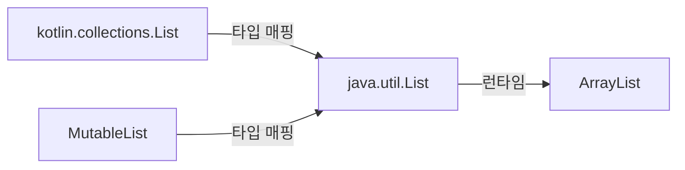
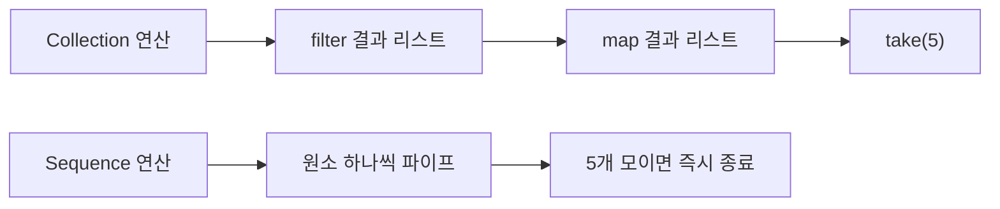
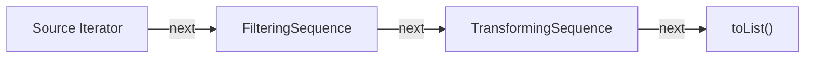

Java에서 컬렉션 처리 코드를 작성하면 for 루프, 임시 변수, null 체크가 뒤엉켜 20줄이 넘어가는 경우가 흔하다. Kotlin은 그 코드를 3줄로 줄이고, 타입 안전성과 null 안전성을 유지하면서 Java Stream보다 직관적인 API를 제공한다. **컬렉션 API를 이해하면 Kotlin 코드의 80%가 보인다.**

## 비유 — 공장 생산라인과 조립 방식

컬렉션 연산을 생산라인으로 이해하면 직관적이다. 원자재(데이터)가 들어오면 여러 공정(map, filter, groupBy)을 거쳐 완제품(결과 컬렉션)이 나온다. 이때 두 가지 방식이 있다.

**즉시 평가(Collection 연산)**: 각 공정마다 중간 창고(중간 컬렉션)에 반제품을 쌓아두고 다음 공정으로 넘긴다. 소규모 공장에서는 문제없지만, 10만 개 원자재를 처리하면 창고가 넘친다.

**지연 평가(Sequence)**: 원자재 하나가 전체 라인을 통과한 뒤 다음 원자재가 투입된다. 중간 창고가 필요 없다. 컨베이어 벨트 방식이다.

이 차이가 성능을 결정한다.

---

## 1. Kotlin 컬렉션 체계 — 불변과 가변의 분리

### 타입 계층

Kotlin 컬렉션의 가장 중요한 설계 결정은 **읽기 전용 인터페이스와 가변 인터페이스의 분리**다.

```kotlin
// 읽기 전용 — kotlin.collections.List
val readOnly: List<Int> = listOf(1, 2, 3)
// readOnly.add(4) — 컴파일 에러: add() 메서드가 없음

// 가변 — kotlin.collections.MutableList
val mutable: MutableList<Int> = mutableListOf(1, 2, 3)
mutable.add(4) // OK

// Set
val readOnlySet: Set<String> = setOf("a", "b", "c")
val mutableSet: MutableSet<String> = mutableSetOf("a", "b")

// Map
val readOnlyMap: Map<String, Int> = mapOf("one" to 1, "two" to 2)
val mutableMap: MutableMap<String, Int> = mutableMapOf("one" to 1)
```

### 생성 함수 한눈에 보기

| 읽기 전용 | 가변 | 특수 목적 |
|---|---|---|
| `listOf()` | `mutableListOf()` | `arrayListOf()` |
| `setOf()` | `mutableSetOf()` | `linkedSetOf()`, `sortedSetOf()` |
| `mapOf()` | `mutableMapOf()` | `linkedMapOf()`, `sortedMapOf()` |
| `emptyList()` | — | `buildList {}` |

`buildList`는 DSL 방식으로 불변 리스트를 만드는 패턴이다.

```kotlin
val numbers = buildList {
    add(1)
    addAll(listOf(2, 3))
    if (System.currentTimeMillis() % 2 == 0L) add(4)
} // 결과는 읽기 전용 List<Int>
```

---

## 2. Java Collections vs Kotlin Collections — 같은 객체, 다른 타입 시스템

### 내부는 동일하다

Kotlin의 `List<T>`는 런타임에 `java.util.ArrayList`다. 컴파일 후 바이트코드를 보면 실제로 동일한 JVM 클래스를 사용한다.

```kotlin
val list = listOf(1, 2, 3)
println(list.javaClass) // class java.util.Arrays$ArrayList

val mutableList = mutableListOf(1, 2, 3)
println(mutableList.javaClass) // class java.util.ArrayList
```

그렇다면 왜 `listOf()`로 만든 리스트에는 `add()`가 없는가?

### 컴파일러 레벨 트릭

Kotlin의 `kotlin.collections.List`는 `java.util.List`를 **래핑하지 않는다**. 대신 Kotlin 타입 시스템이 `kotlin.collections.List`에 변경 메서드를 노출하지 않도록 타입 매핑을 정의한다. 런타임 객체는 같지만, 컴파일러가 허용하는 메서드 집합이 다르다.



이 설계의 결과: `listOf()`로 만든 리스트를 Java 코드로 넘기면, Java 쪽에서는 `add()`를 호출할 수 있다. Kotlin의 불변 보장은 **컴파일 타임**에만 존재한다. 런타임 불변성이 필요하다면 `Collections.unmodifiableList()`를 써야 한다.

```kotlin
// Java 코드로 넘길 때 진짜 불변이 필요하다면
val truly = Collections.unmodifiableList(listOf(1, 2, 3))
```

---

## 3. 컬렉션 연산 — 함수형 API 완전 정복

### map과 filter

가장 기본적인 두 연산이다.

```kotlin
val numbers = listOf(1, 2, 3, 4, 5, 6, 7, 8, 9, 10)

// filter: 조건에 맞는 원소만 남김
val evens = numbers.filter { it % 2 == 0 }
// [2, 4, 6, 8, 10]

// map: 각 원소를 변환
val squares = numbers.map { it * it }
// [1, 4, 9, 16, 25, 36, 49, 64, 81, 100]

// 조합
val evenSquares = numbers.filter { it % 2 == 0 }.map { it * it }
// [4, 16, 36, 64, 100]

// mapNotNull: map + null 제거
val parsed = listOf("1", "abc", "3", "xyz").mapNotNull { it.toIntOrNull() }
// [1, 3]

// filterIsInstance: 타입 필터
val mixed: List<Any> = listOf(1, "hello", 2, "world", 3)
val strings = mixed.filterIsInstance<String>()
// ["hello", "world"]
```

### flatMap — 중첩 구조 펼치기

`flatMap`은 각 원소를 리스트로 변환한 뒤 결과를 하나의 리스트로 합친다. 2차원을 1차원으로 펼치는 연산이다.

```kotlin
data class Department(val name: String, val employees: List<String>)

val departments = listOf(
    Department("Engineering", listOf("Alice", "Bob", "Charlie")),
    Department("Marketing", listOf("David", "Eve")),
    Department("HR", listOf("Frank"))
)

// 모든 직원 목록 (부서 경계 제거)
val allEmployees = departments.flatMap { it.employees }
// ["Alice", "Bob", "Charlie", "David", "Eve", "Frank"]

// flatten: List<List<T>>를 List<T>로
val nested = listOf(listOf(1, 2), listOf(3, 4), listOf(5))
val flat = nested.flatten()
// [1, 2, 3, 4, 5]
```

### groupBy — 그룹핑

`groupBy`는 Map을 반환한다. SQL의 GROUP BY와 동일한 개념이다.

```kotlin
data class Order(val customerId: Int, val amount: Double, val status: String)

val orders = listOf(
    Order(1, 100.0, "PAID"),
    Order(2, 200.0, "PENDING"),
    Order(1, 150.0, "PAID"),
    Order(3, 300.0, "PAID"),
    Order(2, 50.0,  "CANCELLED")
)

// 고객별 주문 그룹
val byCustomer: Map<Int, List<Order>> = orders.groupBy { it.customerId }
// {1=[Order(1,100,PAID), Order(1,150,PAID)], 2=[...], 3=[...]}

// 상태별로 묶고, amount 합산
val amountByStatus: Map<String, Double> = orders
    .groupBy { it.status }
    .mapValues { (_, orders) -> orders.sumOf { it.amount } }
// {"PAID"=550.0, "PENDING"=200.0, "CANCELLED"=50.0}
```

### associate — 리스트를 Map으로

```kotlin
data class User(val id: Int, val name: String, val email: String)

val users = listOf(
    User(1, "Alice", "alice@example.com"),
    User(2, "Bob",   "bob@example.com"),
    User(3, "Charlie", "charlie@example.com")
)

// id → User 인덱스
val byId: Map<Int, User> = users.associateBy { it.id }
// {1=User(1,Alice,...), 2=User(2,Bob,...), ...}

// id → name 변환
val idToName: Map<Int, String> = users.associate { it.id to it.name }
// {1="Alice", 2="Bob", 3="Charlie"}

// name → email
val nameToEmail: Map<String, String> = users.associateBy(
    keySelector = { it.name },
    valueTransform = { it.email }
)
```

### zip — 두 컬렉션 결합

```kotlin
val names = listOf("Alice", "Bob", "Charlie")
val scores = listOf(85, 92, 78)

// Pair 리스트
val zipped: List<Pair<String, Int>> = names.zip(scores)
// [("Alice", 85), ("Bob", 92), ("Charlie", 78)]

// 변환 람다 포함
val results = names.zip(scores) { name, score -> "$name: $score" }
// ["Alice: 85", "Bob: 92", "Charlie: 78"]

// unzip: Pair 리스트를 두 리스트로 분리
val (nameList, scoreList) = zipped.unzip()
```

### windowed와 chunked — 슬라이딩 윈도우

이 두 함수는 시계열 데이터 처리나 배치 처리에서 핵심이다.

```kotlin
val prices = listOf(100, 102, 98, 105, 103, 107, 110)

// chunked: 겹치지 않는 덩어리로 분할
val batches = prices.chunked(3)
// [[100, 102, 98], [105, 103, 107], [110]]

// 배치별 평균
val batchAverages = prices.chunked(3) { it.average() }
// [100.0, 105.0, 110.0]

// windowed: 슬라이딩 윈도우 (이동 평균에 사용)
val ma3 = prices.windowed(size = 3, step = 1) { it.average() }
// [100.0, 101.67, 101.67, 105.0, 106.67]

// partialWindows=true: 크기가 작은 끝부분 윈도우 포함
val withPartial = prices.windowed(size = 3, partialWindows = true)
```

### 집계 연산

```kotlin
val numbers = listOf(3, 1, 4, 1, 5, 9, 2, 6)

println(numbers.sum())        // 31
println(numbers.average())    // 3.875
println(numbers.min())        // 1
println(numbers.max())        // 9
println(numbers.count())      // 8
println(numbers.count { it > 4 }) // 3

// fold: 초깃값이 있는 누산기
val product = numbers.fold(1L) { acc, n -> acc * n }

// reduce: 첫 원소가 초깃값
val sum = numbers.reduce { acc, n -> acc + n }

// sumOf: 변환 후 합산 (Long 반환으로 오버플로 방지)
data class Item(val price: Int, val qty: Int)
val items = listOf(Item(100, 3), Item(200, 2), Item(50, 10))
val total = items.sumOf { it.price.toLong() * it.qty }
// 1300
```

### 정렬

```kotlin
data class Person(val name: String, val age: Int, val score: Double)

val people = listOf(
    Person("Charlie", 30, 85.0),
    Person("Alice",   25, 92.0),
    Person("Bob",     25, 88.0)
)

// 단일 기준
val byAge = people.sortedBy { it.age }

// 역순
val byScoreDesc = people.sortedByDescending { it.score }

// 복합 기준: 나이 오름차순, 같은 나이면 점수 내림차순
val complex = people.sortedWith(
    compareBy<Person> { it.age }.thenByDescending { it.score }
)
// [Person(Bob,25,88), Person(Alice,25,92), Person(Charlie,30,85)]
// 주의: thenByDescending이 먼저 앨리스가 Bob보다 점수가 높으므로 Bob이 먼저
// → 실제: [Bob(25,88), Alice(25,92)] 아님, 내림차순이므로 [Alice(25,92), Bob(25,88)]
```

---

## 4. Sequence vs Collection — 즉시 평가 vs 지연 평가

### 평가 방식 비교



비유: 뷔페(Collection)와 코스 요리(Sequence)의 차이다. 뷔페는 모든 음식을 미리 접시에 다 담아 테이블에 올려놓는다. 코스 요리는 손님이 먹을 준비가 됐을 때 그 요리만 나온다. 손님이 5번째 코스에서 배가 불러 그만 먹겠다고 하면, 6번째 코스는 아예 만들지도 않는다. **Sequence의 `take(5)`가 바로 이것이다.** 50만 개 중간 리스트를 만들지 않고 5개만 처리하고 멈춘다.

### 즉시 평가의 문제

컬렉션 연산은 각 단계에서 즉시 결과 리스트를 만든다.

```kotlin
val result = (1..1_000_000)
    .filter { it % 2 == 0 }   // 50만 개짜리 중간 리스트 생성
    .map { it * it }           // 50만 개짜리 또 다른 중간 리스트 생성
    .take(5)                   // 그중 5개만 사용
```

100만 개 원소에서 짝수 제곱 5개만 필요한데, 50만 개짜리 리스트를 두 번 생성한다. 낭비다.

### Sequence — 지연 평가

```kotlin
val result = (1..1_000_000)
    .asSequence()              // Sequence로 전환
    .filter { it % 2 == 0 }   // 중간 연산 — 아직 아무것도 실행 안 함
    .map { it * it }           // 중간 연산 — 아직 아무것도 실행 안 함
    .take(5)                   // 중간 연산 — 아직 아무것도 실행 안 함
    .toList()                  // 최종 연산 — 여기서 실제로 실행됨
```

`toList()`가 호출되는 순간, 원소 하나하나가 파이프라인 전체를 통과하며 5개가 모이면 즉시 종료된다.

### 중간 연산과 최종 연산

| 구분 | 예시 | 동작 |
|---|---|---|
| 중간 연산 | `filter`, `map`, `flatMap`, `take`, `drop`, `distinct` | Sequence를 반환, 지연 실행 |
| 최종 연산 | `toList`, `toSet`, `count`, `first`, `last`, `sum`, `forEach` | 실제 실행을 시작, 값 반환 |

```kotlin
// 최종 연산 없으면 아무것도 실행되지 않음
val seq = sequenceOf(1, 2, 3, 4, 5)
    .filter { println("filter $it"); it % 2 == 0 }
    .map { println("map $it"); it * 10 }
// 출력 없음

seq.toList() // 여기서 출력 발생
// filter 1 / filter 2 / map 2 / filter 3 / filter 4 / map 4 / filter 5
```

출력 순서가 핵심이다. `filter 1 → filter 2 → map 2 → filter 3 → ...` 원소 단위로 파이프라인을 통과한다. 컬렉션이었다면 `filter 1 → filter 2 → ... → filter 5 → map 2 → map 4` 순이다.

---

## 5. Sequence의 내부 동작 — Iterator 체인

### 구조

Sequence는 내부적으로 Iterator 체인으로 구현된다.



각 중간 연산은 새로운 Sequence 객체를 반환하고, 이 객체는 이전 Sequence를 감싼다. 최종 연산이 `next()`를 호출하면 체인을 따라 원본 소스까지 전파된다.

```kotlin
// 직접 Sequence 생성 — 무한 시퀀스도 가능
val fibonacci = sequence {
    var a = 0L
    var b = 1L
    while (true) {
        yield(a)           // 값 생성 후 일시 정지
        val next = a + b
        a = b
        b = next
    }
}

// 무한 시퀀스에서 처음 10개만
val first10 = fibonacci.take(10).toList()
// [0, 1, 1, 2, 3, 5, 8, 13, 21, 34]

// 100 이하 피보나치
val under100 = fibonacci.takeWhile { it < 100 }.toList()
// [0, 1, 1, 2, 3, 5, 8, 13, 21, 34, 55, 89]
```

`sequence { }` 블록 안의 `yield`는 코루틴 기반으로 동작한다. 값을 `yield`하면 블록이 일시 중지되고, 소비자가 `next()`를 호출하면 재개된다.

### generateSequence

더 단순한 패턴은 `generateSequence`다.

```kotlin
// 파일 시스템 탐색
fun File.parents(): Sequence<File> =
    generateSequence(this.parentFile) { it.parentFile }

val file = File("/a/b/c/d.txt")
val allParents = file.parents().toList()
// [/a/b/c, /a/b, /a, /]

// 숫자 생성
val powers = generateSequence(1) { it * 2 }  // 1, 2, 4, 8, 16, ...
val under1000 = powers.takeWhile { it < 1000 }.toList()
// [1, 2, 4, 8, 16, 32, 64, 128, 256, 512]
```

---

## 6. Java Stream vs Kotlin Sequence 비교

Kotlin Sequence와 Java Stream은 지연 평가라는 핵심 개념을 공유하지만 API와 사용 방식이 다르다.

| 구분 | Java Stream | Kotlin Sequence |
|---|---|---|
| 생성 | `stream()`, `Stream.of()` | `asSequence()`, `sequenceOf()` |
| 병렬 | `parallelStream()` | 별도 지원 없음 (코루틴 Flow 사용) |
| 재사용 | 단 한 번만 소비 가능 | 여러 번 소비 가능 (소스가 재생성 가능한 경우) |
| null 처리 | `Optional<T>` | nullable 타입 직접 처리 |
| 원시 타입 | `IntStream`, `LongStream` 별도 존재 | 자동 박싱 (성능 차이 있음) |
| 수집 | `collect(Collectors.toList())` | `.toList()` |

```kotlin
// Java Stream
list.stream()
    .filter(x -> x > 0)
    .map(x -> x * 2)
    .collect(Collectors.toList())

// Kotlin Sequence — 더 간결
list.asSequence()
    .filter { it > 0 }
    .map { it * 2 }
    .toList()

// Kotlin Collection — 작은 데이터에는 이게 더 낫다
list.filter { it > 0 }.map { it * 2 }
```

Java Stream의 `Optional`을 Kotlin은 nullable 타입으로 자연스럽게 대체한다.

```kotlin
// Java: Optional<String>
val firstName: Optional<String> = users.stream()
    .filter(u -> u.isActive())
    .map(User::getName)
    .findFirst()

// Kotlin: String?
val firstName: String? = users.asSequence()
    .filter { it.isActive }
    .map { it.name }
    .firstOrNull()
```

---

## 7. 구조 분해와 Destructuring

구조 분해는 컬렉션 처리 코드를 읽기 쉽게 만드는 Kotlin의 핵심 문법이다.

### Pair와 Triple

```kotlin
// Pair 구조 분해
val (first, second) = Pair("hello", 42)
val (x, y) = 10 to 20  // to 는 Pair 생성 infix 함수

// Map.Entry 구조 분해
val map = mapOf("a" to 1, "b" to 2, "c" to 3)
for ((key, value) in map) {
    println("$key = $value")
}

// mapValues에서 구조 분해
val doubled = map.mapValues { (key, value) ->
    value * 2  // key는 사용 안 할 수도 있음
}

// 인덱스와 함께
val names = listOf("Alice", "Bob", "Charlie")
for ((index, name) in names.withIndex()) {
    println("$index: $name")
}
```

### 사용자 정의 타입의 구조 분해

`data class`는 자동으로 `componentN()` 함수를 생성한다.

```kotlin
data class Point(val x: Double, val y: Double, val z: Double)

val point = Point(1.0, 2.0, 3.0)
val (x, y, z) = point

// 특정 컴포넌트 무시
val (px, _, pz) = point  // y는 필요 없음

// 람다에서 구조 분해
val points = listOf(Point(1.0, 2.0, 3.0), Point(4.0, 5.0, 6.0))
val distances = points.map { (x, y, z) -> Math.sqrt(x*x + y*y + z*z) }
```

---

## 8. 실전 패턴 — 데이터 변환 파이프라인

### 로그 분석 파이프라인

실무에서 가장 흔한 패턴이다. 로그 파일을 파싱해 통계를 뽑는 케이스다.

```kotlin
data class LogEntry(
    val timestamp: Long,
    val level: String,
    val service: String,
    val message: String,
    val durationMs: Long?
)

fun analyzeLog(entries: List<LogEntry>): Map<String, ServiceStats> {
    return entries
        .filter { it.level in setOf("ERROR", "WARN", "INFO") }
        .filter { it.durationMs != null }
        .groupBy { it.service }
        .mapValues { (service, logs) ->
            val durations = logs.mapNotNull { it.durationMs }
            ServiceStats(
                service       = service,
                count         = logs.size,
                errorCount    = logs.count { it.level == "ERROR" },
                avgDurationMs = durations.average(),
                p99DurationMs = durations.sorted().let { sorted ->
                    sorted[(sorted.size * 0.99).toInt().coerceAtMost(sorted.size - 1)]
                }
            )
        }
}

data class ServiceStats(
    val service: String,
    val count: Int,
    val errorCount: Int,
    val avgDurationMs: Double,
    val p99DurationMs: Long
)
```

### 그래프 BFS — Sequence로 무한 탐색

```kotlin
data class Node(val id: Int, val neighbors: List<Int>)

fun bfsSequence(graph: Map<Int, Node>, start: Int): Sequence<Int> = sequence {
    val visited = mutableSetOf<Int>()
    val queue = ArrayDeque<Int>()
    queue.add(start)
    visited.add(start)

    while (queue.isNotEmpty()) {
        val current = queue.removeFirst()
        yield(current)

        graph[current]?.neighbors
            ?.filter { it !in visited }
            ?.forEach { neighbor ->
                visited.add(neighbor)
                queue.add(neighbor)
            }
    }
}

// 소비 측에서 필요한 만큼만 가져옴
val first5Nodes = bfsSequence(graph, startNode = 1).take(5).toList()
```

### 집계와 변환을 한 번에

```kotlin
data class Transaction(
    val id: String,
    val userId: Int,
    val amount: Double,
    val category: String,
    val date: LocalDate
)

fun monthlyReport(transactions: List<Transaction>): List<MonthlyUserReport> {
    return transactions
        .groupBy { it.userId }
        .flatMap { (userId, txns) ->
            txns
                .groupBy { it.date.withDayOfMonth(1) }  // 월 기준 그룹
                .map { (month, monthTxns) ->
                    MonthlyUserReport(
                        userId     = userId,
                        month      = month,
                        totalSpend = monthTxns.sumOf { it.amount },
                        txnCount   = monthTxns.size,
                        topCategory = monthTxns
                            .groupBy { it.category }
                            .maxByOrNull { (_, list) -> list.size }
                            ?.key ?: "unknown"
                    )
                }
        }
        .sortedWith(compareBy({ it.userId }, { it.month }))
}
```

---

## 9. 성능 함정 — 불필요한 중간 컬렉션과 대용량 처리

### 함정 1: 짧은 체인에 Sequence 오버헤드

Sequence 자체에도 객체 생성 비용이 있다. 소규모 컬렉션(수백 개 이하)에 Sequence를 쓰면 오히려 느리다.

```kotlin
// 나쁜 예: 10개짜리 리스트에 Sequence 사용
val result = smallList.asSequence().filter { it > 0 }.map { it * 2 }.toList()

// 좋은 예: 소규모는 컬렉션 연산 직접 사용
val result = smallList.filter { it > 0 }.map { it * 2 }
```

기준점: **원소 수 1,000개 이상**이거나 **체인이 3단계 이상**이면 Sequence를 고려한다. 실제 측정이 항상 우선이다.

### 함정 2: 컬렉션 연산의 중간 리스트 폭발

```kotlin
// 나쁜 예: filter + map 각각 전체 리스트 생성
val result = hugeList
    .filter { condition1(it) }  // 중간 리스트 1
    .filter { condition2(it) }  // 중간 리스트 2
    .map { transform(it) }      // 중간 리스트 3
    .take(10)                   // 마지막에야 10개 선택

// 좋은 예: Sequence로 전환
val result = hugeList
    .asSequence()
    .filter { condition1(it) }
    .filter { condition2(it) }
    .map { transform(it) }
    .take(10)
    .toList()
```

### 함정 3: 반복되는 count() 호출

```kotlin
val list = someExpensiveList()

// 나쁜 예: 같은 리스트를 두 번 순회
if (list.count() > 0 && list.count { it.isValid() } > 0) { ... }

// 좋은 예
if (list.isNotEmpty() && list.any { it.isValid() }) { ... }

// any()는 조건 만족하는 첫 번째 원소를 찾는 즉시 종료 (short-circuit)
```

### 함정 4: distinct()의 복잡도

```kotlin
// 나쁜 예: 대용량 리스트에서 distinct() 후 contains
val ids = transactions.map { it.userId }.distinct()  // O(n) + Set 생성
val isPresent = ids.contains(targetId)               // O(n)

// 좋은 예: Set으로 직접 수집
val idSet = transactions.mapTo(HashSet()) { it.userId }
val isPresent = idSet.contains(targetId)  // O(1)
```

### 함정 5: sorted()가 매번 정렬

```kotlin
// 나쁜 예: 루프 안에서 정렬
for (item in data) {
    val top5 = data.sortedByDescending { it.score }.take(5)  // 매 반복마다 정렬
}

// 좋은 예: 정렬은 한 번만
val top5 = data.sortedByDescending { it.score }.take(5)
for (item in top5) { ... }
```

---

## 10. 극한 시나리오 🔥

### 시나리오 1: 5GB CSV 파일 처리

메모리가 8GB인 서버에서 5GB CSV 파일의 특정 컬럼을 집계해야 한다.

```kotlin
// 잘못된 접근: 전체 파일을 List로 로드 → OutOfMemoryError
val allLines = File("huge.csv").readLines()  // 5GB를 메모리에 올림

// 올바른 접근: Sequence + useLines로 스트리밍
fun aggregateFromCsv(file: File): Map<String, Long> {
    val result = mutableMapOf<String, Long>()

    file.useLines { lines ->             // AutoCloseable — 자동 닫힘
        lines
            .drop(1)                     // 헤더 제거
            .map { it.split(",") }
            .filter { it.size >= 3 }
            .forEach { cols ->
                val category = cols[1].trim()
                val amount = cols[2].trim().toLongOrNull() ?: 0L
                result.merge(category, amount, Long::plus)
            }
    }

    return result
}
```

`useLines`는 내부적으로 `BufferedReader`를 사용하고, Sequence가 완전히 소비되거나 예외가 발생하면 파일을 자동으로 닫는다. 메모리에는 현재 처리 중인 한 줄만 올라간다.

### 시나리오 2: 무한 이벤트 스트림에서 윈도우 집계

실시간으로 들어오는 이벤트 스트림에서 슬라이딩 윈도우 평균을 계산해야 한다.

```kotlin
data class Event(val timestamp: Long, val value: Double)

fun processingPipeline(eventSource: Sequence<Event>): Sequence<Double> {
    return eventSource
        .windowed(size = 100, step = 10, partialWindows = false)
        .map { window -> window.map { it.value }.average() }
}

// 소비 측: 결과를 느리게 처리
processingPipeline(infiniteEventSource)
    .takeWhile { isRunning }
    .forEach { avg -> updateDashboard(avg) }
```

단, `windowed`가 100개 원소를 버퍼에 들고 있어야 하므로, Sequence라도 윈도우 크기만큼 메모리를 사용한다. 완전한 스트리밍은 Kotlin Flow나 Reactor가 필요하다.

### 시나리오 3: 깊이 중첩된 flatMap 체인의 타입 추론 한계

```kotlin
// 컴파일러가 타입 추론을 포기하는 케이스
val result = data
    .flatMap { it.subItems }
    .flatMap { it.details }
    .flatMap { it.attributes }
    .map { it.value }  // 여기서 타입 추론 실패 가능

// 해결: 중간에 타입 명시
val result = data
    .flatMap { it.subItems }
    .flatMap<SubItem, Detail> { it.details }  // 명시적 타입 파라미터
    .flatMap { it.attributes }
    .map { it.value }
```

타입 추론이 실패하면 컴파일 에러보다 느린 컴파일이나 IDE 지연으로 나타난다. 체인이 4단계 이상이면 중간 변수를 사용하는 게 실용적이다.

### 시나리오 4: groupBy 후 mapValues에서 ConcurrentModificationException

`groupBy`로 만든 Map의 값을 변경하는 과정에서 잘못된 패턴을 쓰면 문제가 생긴다.

```kotlin
// 위험한 패턴: groupBy 결과를 외부에서 변경
val groups = mutableList.groupBy { it.type }  // LinkedHashMap<String, List<T>>
groups.forEach { (_, list) ->
    (list as MutableList).removeIf { it.isExpired() }  // ClassCastException 가능
}

// 안전한 패턴: 새로운 Map 생성
val filtered = mutableList
    .filter { !it.isExpired() }
    .groupBy { it.type }
```

`groupBy`의 반환 타입은 `Map<K, List<V>>`이고, 내부 `List`는 `ArrayList`지만 타입 계약상 불변이다. 강제 캐스팅은 구현 세부사항에 의존하는 코드다.

---

## 면접 포인트

### Q. Kotlin의 List와 MutableList의 차이는 무엇인가? 런타임에서도 구분되는가?

`kotlin.collections.List`는 읽기 전용 인터페이스이고, `MutableList`는 변경 메서드를 포함한 인터페이스다. 그러나 **런타임에는 동일한 `java.util.ArrayList` 인스턴스**일 수 있다. Kotlin의 불변성은 컴파일 타임 타입 검사에서만 보장된다. Java 코드와 상호운용할 때 Java 측에서 `List`를 수정할 수 있으므로, 진정한 불변성이 필요하면 `Collections.unmodifiableList()` 또는 `List.copyOf()`(Java 10+)를 사용해야 한다.

### Q. Sequence와 Collection 연산의 성능 차이는 어떤 경우에 두드러지는가?

두 가지 조건이 갖춰질 때 차이가 크다. 첫째, 원소 수가 많아서 중간 리스트 생성 비용이 클 때. 둘째, `take`나 `first` 같은 short-circuit 연산이 체인 끝에 있을 때. 반대로 원소 수가 적거나 체인이 단순하면 Sequence 객체 생성 오버헤드 때문에 Collection 연산이 더 빠를 수 있다. 판단 기준은 항상 프로파일링이다.

### Q. flatMap과 map + flatten의 차이는?

기능적으로 동일하다. `flatMap { f(it) }`는 `map { f(it) }.flatten()`과 같은 결과를 낸다. 다만 `flatMap`은 중간 컬렉션(변환된 리스트들의 리스트)을 만들지 않으므로 약간 더 효율적이다. Sequence에서는 이 차이가 더 크다. 가독성 측면에서도 `flatMap`이 "변환 + 펼치기"를 단일 의도로 표현하므로 선호된다.

### Q. groupBy와 associate의 차이는?

`groupBy`는 하나의 키에 여러 원소가 매핑되는 `Map<K, List<V>>`를 반환한다. `associateBy`는 각 키에 단일 원소가 매핑되는 `Map<K, V>`를 반환하며, 키 충돌 시 마지막 원소가 남는다. 즉, `groupBy`는 "같은 키를 가진 원소들을 모아라", `associateBy`는 "원소를 키로 인덱싱하라"는 의도다. 중복 키가 있는 데이터에 `associateBy`를 쓰면 데이터 손실이 생긴다.

### Q. Sequence는 재사용이 가능한가?

소스에 따라 다르다. `sequenceOf()`나 컬렉션의 `asSequence()`는 매번 새로운 Iterator를 생성하므로 여러 번 소비할 수 있다. 그러나 `sequence { }` 블록이나 `generateSequence`로 만든 상태 기반 Sequence는 재사용 시 비결정적 동작을 할 수 있다. Java Stream과 달리 Kotlin Sequence는 "이미 소비된 Sequence"에 대한 예외를 던지지 않지만, 결과가 달라질 수 있다. 안전하게 재사용하려면 최종 연산 후 새로운 Sequence를 생성해야 한다.

### Q. windowed와 chunked의 차이는?

`chunked(n)`은 겹치지 않는 고정 크기 덩어리를 만든다. `windowed(size, step)`은 슬라이딩 윈도우로, `step < size`이면 윈도우가 겹친다. 이동 평균, 패턴 탐지처럼 인접한 원소들의 관계를 분석할 때는 `windowed`, 배치 처리나 페이지네이션처럼 데이터를 독립적인 덩어리로 나눌 때는 `chunked`를 사용한다.

### Q. 컬렉션의 fold와 reduce의 차이는?

`reduce`는 첫 번째 원소를 누산기의 초깃값으로 사용하므로 빈 컬렉션에서 `UnsupportedOperationException`을 던진다. `fold`는 초깃값을 명시적으로 지정하므로 빈 컬렉션에도 안전하고, 반환 타입이 원소 타입과 달라도 된다. 예를 들어 `List<String>`을 `fold("", String::plus)`로 하나의 String으로 합치는 것은 가능하지만, `reduce`로는 타입이 같아야 한다. 실무에서는 `fold`가 안전하고 유연하므로 선호된다.

---

## 요약

Kotlin 컬렉션 API는 세 가지 핵심 결정 위에 구축된다.

**첫째**, 읽기 전용과 가변 인터페이스 분리로 의도를 타입에 명시한다. `val list: List<T>`는 "이 리스트는 바뀌지 않는다"는 약속이다.

**둘째**, 풍부한 함수형 API(`map`, `filter`, `flatMap`, `groupBy`, `associate`, `windowed`, `chunked`)로 for 루프와 임시 변수 없이 데이터 변환 파이프라인을 선언적으로 표현한다.

**셋째**, Sequence로 전환하면 지연 평가가 활성화되어 대용량 데이터에서 불필요한 중간 컬렉션 생성을 제거한다. 언제 Sequence가 필요한지 판단하는 기준은 항상 측정이다.

Java Stream보다 간결하고, Optional 없이 nullable 타입으로 더 자연스럽게 null을 다루며, 무한 시퀀스를 `sequence { yield() }` 한 줄로 표현할 수 있다. 이 세 가지가 Kotlin 컬렉션을 배울 이유다.
