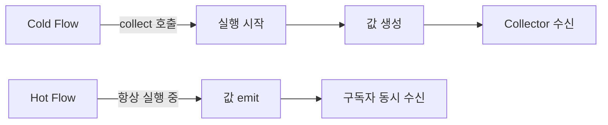
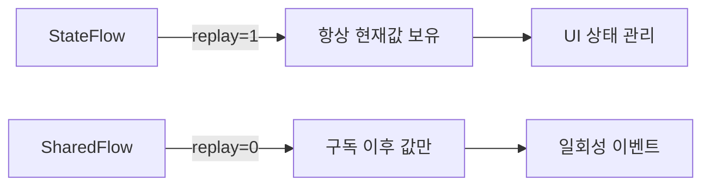

리액티브 프로그래밍의 핵심은 "값이 언제 올지 모를 때 그 흐름을 다루는 방식"이다. RxJava는 Observable로, Reactor는 Flux/Mono로 이를 구현했다. Kotlin은 코루틴 위에 Flow라는 더 단순하고 안전한 추상을 만들었다. 이 글은 Flow의 원리부터 극한 상황까지 전부 다룬다.

---

## 1. Flow vs RxJava vs Reactor — 왜 Flow인가

### 복잡도의 차이

수도꼭지에 비유해보자. RxJava는 수도꼭지에 온도조절 장치, 압력계, 필터, 경보기가 전부 달려있다. 강력하지만 처음 보는 사람은 어디를 돌려야 할지 모른다. Flow는 단순한 수도꼭지다. 코루틴이라는 배관만 연결되어 있으면 된다.

| 항목 | RxJava | Reactor | Kotlin Flow |
|---|---|---|---|
| 기반 | Observable 패턴 | Reactive Streams | 코루틴 + suspend |
| 스레드 관리 | Scheduler | Scheduler | Dispatcher |
| 에러 처리 | onErrorReturn 등 | onErrorReturn 등 | try/catch, catch 연산자 |
| backpressure | Flowable | Flux | buffer/conflate/collectLatest |
| 학습 곡선 | 높음 | 높음 | 코루틴을 알면 낮음 |
| null 안전성 | 직접 처리 | 직접 처리 | Kotlin 타입 시스템 |

### Flow가 코루틴 친화적인 이유

RxJava의 `Observable.subscribeOn(Schedulers.io())`와 Flow의 `flowOn(Dispatchers.IO)`는 같은 일을 하지만, Flow는 코루틴의 구조화된 동시성(structured concurrency)을 그대로 따른다. `CoroutineScope`가 취소되면 내부의 모든 Flow 수집도 함께 취소된다. RxJava에서는 이를 위해 `CompositeDisposable`을 별도로 관리해야 했다.

```kotlin
// RxJava — Disposable 수동 관리
val disposable = observable.subscribe { ... }
disposable.dispose() // 직접 해제해야 함

// Flow — Scope 취소로 자동 해제
val job = scope.launch {
    flow.collect { ... } // scope 취소 시 자동 정리
}
```

---

## 2. Cold Flow vs Hot Flow

### 냉수기와 라디오 방송

Cold Flow는 냉수기다. 컵(collector)을 갖다 댈 때마다 처음부터 물이 나온다. 각 구독자는 독립된 스트림을 받는다. Hot Flow는 라디오 방송이다. 지금 이 순간 송출 중인 신호를 받는 것이지, 지난 방송을 다시 들을 수는 없다.

```kotlin
// Cold Flow — 매 collect마다 새로 실행
val coldFlow = flow {
    println("스트림 시작")
    emit(1)
    emit(2)
}

// 두 번 collect하면 "스트림 시작"이 두 번 출력
coldFlow.collect { println(it) }
coldFlow.collect { println(it) }
```

```kotlin
// Hot Flow — SharedFlow
val hotFlow = MutableSharedFlow<Int>()

// 이미 emit된 값은 나중에 subscribe한 collector는 못 받음
hotFlow.emit(1) // 아무도 수집 안 함
hotFlow.collect { println(it) } // 이후 값부터 수신
```

### Cold/Hot 비교 다이어그램



---

## 3. Flow 빌더 완전 분석

### 각 빌더의 용도

빌더는 "어디서 값이 오는가"에 따라 달라진다.

**`flow { }`** — 가장 기본. suspend 람다 안에서 emit을 호출한다. 이미 suspend 환경이라 delay, 네트워크 호출 등을 직접 쓸 수 있다.

```kotlin
val timerFlow = flow {
    var count = 0
    while (true) {
        emit(count++)
        delay(1000)
    }
}
```

**`flowOf`** — 고정된 값 목록을 Flow로. 테스트나 간단한 시나리오에 쓴다.

```kotlin
val staticFlow = flowOf(1, 2, 3, 4, 5)
```

**`asFlow`** — Iterable, Sequence, Array를 Flow로 변환한다.

```kotlin
val listFlow = listOf("a", "b", "c").asFlow()
val rangeFlow = (1..100).asFlow()
```

**`channelFlow`** — 다른 코루틴에서 emit이 필요할 때. 내부에서 `launch`나 `async`를 쓸 수 있다. 일반 `flow { }` 안에서는 다른 코루틴 컨텍스트로 emit을 호출하면 예외가 발생한다.

```kotlin
val parallelFlow = channelFlow {
    launch { send(fetchFromApi1()) }
    launch { send(fetchFromApi2()) }
    // 두 결과를 동시에 fetch하고 먼저 오는 순서대로 emit
}
```

**`callbackFlow`** — 콜백 기반 API를 Flow로 래핑할 때. `awaitClose { }` 블록으로 리소스 정리를 보장한다.

```kotlin
fun locationFlow(client: LocationClient): Flow<Location> = callbackFlow {
    val callback = object : LocationCallback() {
        override fun onLocationResult(result: LocationResult) {
            trySend(result.lastLocation)
        }
    }
    client.requestUpdates(callback)
    awaitClose { client.removeUpdates(callback) } // collector 취소 시 자동 호출
}
```

`awaitClose`가 없으면 콜백이 영원히 살아있어 메모리 누수가 발생한다. 이것이 `callbackFlow`가 `channelFlow`와 다른 핵심 포인트다.

---

## 4. 중간 연산자

### 파이프라인 공장

중간 연산자는 컨베이어 벨트 위의 작업 스테이션이다. 원자재(upstream)가 들어오면 가공해서 다음 스테이션(downstream)으로 넘긴다. 아무도 `collect`를 호출하지 않으면 컨베이어 벨트 자체가 돌아가지 않는다 — Cold Flow의 본질이다.

```kotlin
(1..10).asFlow()
    .filter { it % 2 == 0 }          // 짝수만
    .map { it * it }                  // 제곱
    .onEach { println("처리: $it") } // 사이드 이펙트 (값 변환 없음)
    .collect { println("결과: $it") }
```

### transform — map과 filter를 동시에

`map`은 1:1 변환, `filter`는 통과/차단이다. `transform`은 하나의 입력에서 0개 이상의 값을 emit할 수 있다.

```kotlin
flow { emit(1); emit(2); emit(3) }
    .transform { value ->
        if (value > 1) {
            emit("$value-a")
            emit("$value-b")
        }
        // value == 1이면 아무것도 emit 안 함 (filter 효과)
    }
    .collect { println(it) }
// 출력: 2-a, 2-b, 3-a, 3-b
```

### catch — 예외를 스트림 안에서 처리

중간에 `catch`를 놓으면 upstream의 예외를 잡아 대체 값을 emit하거나 로깅할 수 있다. `catch` 이후의 연산자에서 발생한 예외는 잡지 못한다는 점이 중요하다.

```kotlin
flow {
    emit(1)
    throw RuntimeException("오류 발생")
    emit(3) // 실행 안 됨
}
.catch { e ->
    println("예외 처리: ${e.message}")
    emit(-1) // 대체 값
}
.collect { println(it) }
// 출력: 1, "예외 처리: 오류 발생", -1
```

### retry와 retryWhen

네트워크 요청처럼 일시적 실패가 있는 상황에서 자동 재시도를 구현한다.

```kotlin
apiFlow()
    .retry(3) { e -> e is IOException } // IOException이면 최대 3번 재시도
    .catch { e -> emit(fallbackData()) }
    .collect { updateUI(it) }
```

`retryWhen`은 재시도 횟수와 예외 타입을 모두 제어할 수 있고, `delay`를 이용한 exponential backoff도 구현 가능하다.

```kotlin
apiFlow()
    .retryWhen { cause, attempt ->
        if (cause is IOException && attempt < 3) {
            delay(2.0.pow(attempt.toInt()).toLong() * 1000)
            true // 재시도
        } else {
            false // 포기
        }
    }
```

---

## 5. 종단 연산자

### collect의 본질

종단 연산자는 Cold Flow를 "실행"시키는 트리거다. `collect`가 호출되어야 비로소 upstream 빌더 블록이 실행된다. 이것이 "lazy evaluation"이다.

```kotlin
// collect — 가장 기본, 모든 값을 순서대로 처리
flow.collect { value -> process(value) }

// toList — 전체를 List로 수집 (스트림이 유한해야 함)
val list = flow.toList()

// first — 첫 번째 값만 받고 스트림 취소
val first = flow.first()

// first { } — 조건을 만족하는 첫 번째 값
val firstEven = (1..100).asFlow().first { it % 2 == 0 }

// reduce — 누산 (RxJava의 scan/reduce와 동일)
val sum = (1..10).asFlow().reduce { acc, value -> acc + value }

// fold — 초기값이 있는 reduce
val product = (1..5).asFlow().fold(1L) { acc, value -> acc * value }
```

### launchIn — Fire-and-Forget 수집

`launchIn(scope)`은 `scope.launch { flow.collect { } }`의 축약이다. UI 레이어에서 ViewModel의 StateFlow를 구독할 때 자주 쓴다.

```kotlin
viewModel.uiState
    .onEach { state -> render(state) }
    .catch { e -> showError(e) }
    .launchIn(viewLifecycleOwner.lifecycleScope) // Lifecycle에 맞게 취소됨
```

`collect`를 직접 쓰면 `launch { }` 안에 넣어야 하고, 예외 처리를 위해 `try/catch`도 감싸야 한다. `launchIn`은 이 보일러플레이트를 줄여준다.

---

## 6. Flow의 내부 동작 — suspend + lambda 체인

### 가장 단순한 Flow 구현

Kotlin 표준 라이브러리의 Flow 인터페이스를 보면 놀랍도록 단순하다.

```kotlin
// 실제 kotlinx.coroutines의 Flow 인터페이스 (단순화)
interface Flow<out T> {
    suspend fun collect(collector: FlowCollector<T>)
}

interface FlowCollector<in T> {
    suspend fun emit(value: T)
}
```

`flow { }` 빌더가 만드는 것은 그저 이 `collect` 함수를 구현하는 객체다.

```kotlin
// flow { } 빌더의 내부 구현 (개념적 단순화)
fun <T> flow(block: suspend FlowCollector<T>.() -> Unit): Flow<T> {
    return object : Flow<T> {
        override suspend fun collect(collector: FlowCollector<T>) {
            block(collector) // 수집자에게 emit 권한을 넘김
        }
    }
}
```

### map 연산자가 실제로 하는 일

```kotlin
fun <T, R> Flow<T>.map(transform: suspend (T) -> R): Flow<R> = flow {
    collect { value ->
        emit(transform(value)) // upstream에서 받아 변환 후 downstream으로 emit
    }
}
```

`map`은 새로운 Flow 객체를 반환한다. 각 연산자는 중첩된 Flow를 만들고, `collect`를 호출하면 이 중첩 구조를 안쪽에서 바깥쪽으로 실행한다. 스택처럼 쌓인 람다들이 순서대로 펼쳐진다.

### 코루틴 컨텍스트 전파

Flow 내부의 suspend 호출은 collector의 코루틴 컨텍스트를 상속한다. 이것이 `flowOn`이 필요한 이유이기도 하다.

```kotlin
flow {
    println(currentCoroutineContext()) // collector의 컨텍스트
    emit(heavyComputation())
}.collect { ... }
```

---

## 7. flowOn vs launchIn — 디스패처 전환의 진짜 의미

### flowOn은 upstream만 바꾼다

전깃줄에 비유하면, `flowOn`은 발전소(upstream)가 어느 지역 전력망을 쓸지 바꾸는 것이다. 소비자(collector)의 전력망은 그대로다.

```kotlin
flow {
    // 이 블록은 Dispatchers.IO에서 실행
    emit(readFromDatabase())
}
.map { it.transform() }  // 이것도 Dispatchers.IO (flowOn 위에 있으므로)
.flowOn(Dispatchers.IO)  // ← 여기 위쪽(upstream)을 IO로 전환
.collect { value ->
    // 이 블록은 flowOn 영향을 받지 않음 (caller의 컨텍스트)
    updateUI(value)
}
```

`flowOn`은 위치가 중요하다. `flowOn` 아래에 있는 연산자(downstream)는 영향을 받지 않는다. 여러 개의 `flowOn`을 체인에 쓸 수도 있다.

```kotlin
flow { emit(loadData()) }
    .flowOn(Dispatchers.IO)          // DB 읽기는 IO
    .map { process(it) }
    .flowOn(Dispatchers.Default)     // CPU 처리는 Default
    .collect { updateUI(it) }        // UI는 Main (외부 컨텍스트)
```

### launchIn과 flowOn의 차이

`launchIn(scope)`는 collector를 scope의 컨텍스트에서 실행한다. upstream의 컨텍스트를 바꾸지 않는다. 디스패처를 전환하려면 `flowOn`을 써야 한다.

```kotlin
// 잘못된 패턴 — 전체가 Main에서 실행
heavyFlow
    .launchIn(mainScope) // Main 스레드에서 collect와 emit 모두 실행됨

// 올바른 패턴
heavyFlow
    .flowOn(Dispatchers.IO) // upstream을 IO로 옮김
    .onEach { updateUI(it) }
    .launchIn(mainScope)    // collect는 Main
```

---

## 8. Backpressure 전략 — 생산자가 소비자보다 빠를 때

### 물탱크와 수도꼭지

생산자가 초당 1000개의 이벤트를 쏟아내는데 소비자는 초당 10개밖에 처리 못한다면? 물탱크(buffer)가 없으면 넘친다. Kotlin Flow는 기본적으로 backpressure를 suspension으로 해결한다. 소비자가 처리하기 전까지 생산자의 emit이 suspend된다.

하지만 이 기본 동작이 항상 맞는 건 아니다.

### buffer — 생산자와 소비자를 분리

```kotlin
flow {
    repeat(1000) {
        emit(it)          // 빠르게 emit
        delay(10)
    }
}
.buffer(capacity = 64)   // 채널로 분리, 64개까지 미리 생산
.collect { value ->
    delay(100)            // 느린 소비
    process(value)
}
```

`buffer` 없이는 빠른 생산자가 느린 소비자를 기다린다. `buffer`는 둘을 별도 코루틴으로 분리해 채널로 연결한다. 생산자는 채널이 꽉 찰 때까지만 기다리면 된다.

### conflate — 중간 값은 버린다

UI 상태 업데이트처럼 "최신 값만 중요한" 경우에 쓴다. 소비자가 처리하는 동안 쌓인 값은 모두 버리고 가장 최근 값만 처리한다.

```kotlin
flow { repeat(1000) { emit(it); delay(1) } }
    .conflate()         // 중간 값 포기
    .collect {
        delay(100)      // 100ms 처리 중
        println(it)     // 0, 99, 199... (중간 값 skip)
    }
```

### collectLatest — 새 값이 오면 이전 처리를 취소

검색창 자동완성처럼 "입력이 바뀌면 이전 처리는 무효"인 경우에 쓴다.

```kotlin
searchQueryFlow
    .collectLatest { query ->
        // 새 query가 오면 이 블록 전체가 취소되고 새로 시작
        val results = api.search(query) // 이전 검색은 취소
        showResults(results)
    }
```

세 전략의 특성 비교:

| 전략 | 데이터 손실 | 처리 방식 | 사용 사례 |
|---|---|---|---|
| 기본 (suspension) | 없음 | 생산자가 대기 | 정확성이 중요할 때 |
| buffer | 없음 | 채널로 분리 | 처리량 향상 필요 시 |
| conflate | 중간 값 버림 | 최신 값만 | 센서 데이터, 위치 정보 |
| collectLatest | 이전 처리 취소 | 새 값 우선 | 검색, 실시간 필터 |

---

## 9. StateFlow와 SharedFlow

### StateFlow — 단 하나의 현재 상태

StateFlow는 항상 값을 갖는 Hot Flow다. 새 collector가 구독하면 즉시 현재 값을 받는다. ViewModel의 UI 상태 관리에 특화되어 있다.

```kotlin
class SearchViewModel : ViewModel() {
    private val _uiState = MutableStateFlow<SearchState>(SearchState.Idle)
    val uiState: StateFlow<SearchState> = _uiState.asStateFlow()

    fun search(query: String) {
        viewModelScope.launch {
            _uiState.value = SearchState.Loading
            try {
                val results = repository.search(query)
                _uiState.value = SearchState.Success(results)
            } catch (e: Exception) {
                _uiState.value = SearchState.Error(e.message)
            }
        }
    }
}
```

StateFlow는 `distinctUntilChanged`가 내장되어 있다. 같은 값을 연속으로 emit해도 collector는 한 번만 받는다.

### SharedFlow — 이벤트 버스 대체

SharedFlow는 replay 버퍼와 구독자 수를 세밀하게 제어할 수 있다. 일회성 이벤트(navigation, snackbar)에 적합하다.

```kotlin
class EventViewModel : ViewModel() {
    private val _events = MutableSharedFlow<UiEvent>(
        replay = 0,          // 새 구독자에게 이전 값 없음
        extraBufferCapacity = 1, // 구독자가 없어도 1개 버퍼
        onBufferOverflow = BufferOverflow.DROP_OLDEST
    )
    val events: SharedFlow<UiEvent> = _events.asSharedFlow()

    fun navigateTo(screen: Screen) {
        viewModelScope.launch {
            _events.emit(UiEvent.Navigate(screen))
        }
    }
}
```

### StateFlow vs SharedFlow



| 특성 | StateFlow | SharedFlow |
|---|---|---|
| 초기값 | 필수 | 없음 |
| replay 기본값 | 1 | 0 (설정 가능) |
| distinctUntilChanged | 내장 | 없음 |
| 사용 용도 | UI 상태 | 이벤트, 알림 |

---

## 10. Spring WebFlux + Flow 통합

### Reactor와 Flow의 변환

Spring WebFlux는 Reactor의 `Flux`/`Mono`를 기반으로 한다. Kotlin에서는 Flow와 Reactor 타입 간 자동 변환이 지원된다.

```kotlin
// build.gradle.kts
implementation("org.springframework.boot:spring-boot-starter-webflux")
implementation("io.projectreactor.kotlin:reactor-kotlin-extensions")
```

```kotlin
@RestController
class ProductController(private val repository: ProductRepository) {

    // Flow를 반환하면 WebFlux가 SSE(Server-Sent Events)로 스트리밍
    @GetMapping("/products/stream", produces = [MediaType.TEXT_EVENT_STREAM_VALUE])
    fun streamProducts(): Flow<Product> = repository.findAllAsFlow()

    // Flow → Flux 변환
    @GetMapping("/products")
    fun getProducts(): Flux<Product> = repository.findAllAsFlow().asFlux()

    // Flux → Flow 변환
    @GetMapping("/products/{id}/history")
    suspend fun getHistory(@PathVariable id: String): List<PriceHistory> {
        return reactorService.getHistoryFlux(id)
            .asFlow()
            .toList()
    }
}
```

### R2DBC와 Flow

Spring Data R2DBC는 코루틴 Flow를 네이티브 지원한다.

```kotlin
@Repository
interface ProductRepository : CoroutineCrudRepository<Product, Long> {
    fun findByCategory(category: String): Flow<Product> // 자동 구현
}

@Service
class ProductService(private val repo: ProductRepository) {
    fun getLowStockProducts(): Flow<Product> =
        repo.findByCategory("electronics")
            .filter { it.stock < 10 }
            .map { it.copy(urgent = true) }
}
```

### WebSocket 스트리밍

```kotlin
@Component
class PriceWebSocketHandler(private val priceService: PriceService) : WebSocketHandler {

    override fun handle(session: WebSocketSession): Mono<Void> {
        val prices: Flow<String> = priceService.getPriceUpdates()
            .map { price -> objectMapper.writeValueAsString(price) }

        return session.send(
            prices.map { session.textMessage(it) }.asFlux()
        )
    }
}
```

---

## 11. 극한 시나리오 🔥

### 시나리오 1: 메모리 누수 — callbackFlow에서 awaitClose를 빠뜨리다

가장 흔한 실수 중 하나다. GPS나 센서처럼 외부 콜백을 Flow로 래핑할 때 `awaitClose` 없이 만들면 collector가 취소되어도 콜백이 살아있다.

```kotlin
// 위험한 코드
fun badLocationFlow(client: LocationClient): Flow<Location> = channelFlow {
    client.requestUpdates { location ->
        trySend(location)
    }
    // awaitClose 없음 — collector 취소 후에도 콜백 계속 실행
}

// 안전한 코드
fun safeLocationFlow(client: LocationClient): Flow<Location> = callbackFlow {
    val callback = LocationCallback { location -> trySend(location) }
    client.requestUpdates(callback)
    awaitClose {
        client.removeUpdates(callback) // 반드시 정리
    }
}
```

### 시나리오 2: 취소 전파 — Flow 안의 예외가 취소를 삼키다

`CancellationException`을 `catch`로 잡아버리면 코루틴 취소 메커니즘이 망가진다. 구조화된 동시성에서 취소 신호가 전파되지 않아 부모 코루틴이 영원히 기다리게 된다.

```kotlin
// 매우 위험한 패턴
flow { emit(compute()) }
    .catch { e ->
        // CancellationException을 삼켜버림
        println("에러: $e") // 취소도 여기서 잡혀버림
        emit(defaultValue)
    }

// 올바른 패턴 — CancellationException은 반드시 재전파
flow { emit(compute()) }
    .catch { e ->
        if (e is CancellationException) throw e // 취소는 전파
        println("비즈니스 에러: $e")
        emit(defaultValue)
    }
```

### 시나리오 3: 예외 처리 함정 — collect 안의 예외는 catch가 못 잡는다

`catch` 연산자는 upstream 예외만 잡는다. `collect { }` 람다 안에서 던진 예외는 잡지 못한다.

```kotlin
// catch가 collect 예외를 못 잡는 예
flow { emit(1) }
    .catch { e -> println("잡힘: $e") } // 여기서는 못 잡음
    .collect { value ->
        throw RuntimeException("collect 내부 예외") // catch 바깥으로 전파
    }

// 해결법 1 — collect 안에서 직접 처리
flow { emit(1) }
    .catch { e -> println("upstream 에러: $e") }
    .collect { value ->
        try {
            process(value)
        } catch (e: Exception) {
            println("collect 에러: $e")
        }
    }

// 해결법 2 — onEach + catch + launchIn 패턴
flow { emit(1) }
    .onEach { value -> process(value) } // 여기서 예외 발생 시 catch가 잡음
    .catch { e -> println("잡힘: $e") }
    .launchIn(scope)
```

### 시나리오 4: SharedFlow 구독자가 없을 때 emit

`replay = 0`, `extraBufferCapacity = 0`인 SharedFlow에 구독자가 없을 때 `emit`을 호출하면 구독자가 생길 때까지 suspend된다. 서버 쪽에서 이벤트를 발행하는데 UI가 아직 구독하지 않았다면 이벤트가 유실되거나 emit이 블로킹된다.

```kotlin
// tryEmit으로 비블로킹 발행
class EventBus {
    private val _events = MutableSharedFlow<Event>(
        replay = 0,
        extraBufferCapacity = 64 // 구독자 없어도 64개 버퍼
    )

    fun post(event: Event) {
        val sent = _events.tryEmit(event) // 버퍼 꽉 차면 false 반환
        if (!sent) {
            log.warn("이벤트 버퍼 꽉 참, 드롭: $event")
        }
    }
}
```

### 시나리오 5: 무한 Flow에 toList 호출

유한 Flow인 줄 알고 `toList()`나 `reduce()`를 호출했는데 사실 무한 Flow라면? 코루틴이 영원히 실행되며 메모리가 고갈된다.

```kotlin
// 타임아웃으로 방어
val result = withTimeout(5000) {
    infiniteFlow.take(100).toList() // take로 개수 제한도 중요
}
```

---

## 면접 포인트

### Cold Flow와 Hot Flow의 차이는?

Cold Flow는 `collect`를 호출할 때마다 새로운 실행을 시작한다. 각 collector는 독립된 스트림을 받는다. `flow { }` 빌더로 만드는 대부분의 Flow가 여기 해당한다.

Hot Flow는 collector의 존재와 무관하게 실행 중이다. `SharedFlow`와 `StateFlow`가 대표적이다. 구독 이후에 emit된 값만 받을 수 있다(`replay` 설정에 따라 일부 이전 값도 가능).

실무 판단 기준: 데이터베이스 쿼리나 네트워크 요청처럼 각 소비자가 독립적으로 실행해야 하면 Cold, 여러 화면이 같은 상태를 공유해야 하면 Hot(StateFlow).

### flowOn과 launchIn의 차이는?

`flowOn(dispatcher)`은 해당 연산자 위쪽(upstream)의 실행 컨텍스트를 바꾼다. 아래쪽(downstream)과 collector에는 영향이 없다. 주로 I/O나 CPU 집약 작업을 메인 스레드에서 떼어낼 때 쓴다.

`launchIn(scope)`은 collector를 scope의 컨텍스트로 실행하는 편의 함수다. `scope.launch { flow.collect { } }`와 동일하다. upstream 컨텍스트는 변경하지 않는다.

혼동 포인트: `launchIn(ioScope)`로 IO 스코프에서 실행해도 upstream이 무거운 블로킹 코드라면 `flowOn(Dispatchers.IO)`도 필요하다.

### StateFlow와 LiveData의 차이는?

StateFlow는 코루틴 기반이라 Lifecycle 의존성이 없다. ViewModel에서 순수 Kotlin으로 사용할 수 있어 테스트가 쉽다. 초기값이 필수이고 `null`을 상태로 표현하려면 nullable 타입을 써야 한다.

LiveData는 Android Lifecycle을 자동으로 인식하고 비활성 상태일 때 자동으로 업데이트를 중지한다. 초기값이 없을 수 있다. Android View 레이어에 강하게 결합되어 있다.

현재 트렌드는 ViewModel에 StateFlow, View에서는 `repeatOnLifecycle`과 함께 collect하는 패턴이다.

### catch 연산자의 한계는?

`catch`는 upstream 예외만 처리한다. `collect { }` 람다 안에서 발생한 예외는 잡지 못하고 caller로 전파된다. 이를 피하려면 `onEach { }` 안에서 처리 로직을 작성하고 `catch`를 그 뒤에 배치하거나, `collect { }` 안에서 직접 `try/catch`를 쓴다.

또한 `CancellationException`은 절대로 `catch`에서 삼키면 안 된다. 코루틴 취소 메커니즘이 깨진다. 잡더라도 반드시 재전파(`throw e`)해야 한다.

### backpressure를 어떻게 처리하는가?

Flow의 기본 동작은 suspension 기반 backpressure다. 생산자가 emit을 호출하면 소비자가 처리를 완료할 때까지 suspend된다. 별도 채널 없이 자연스럽게 흐름이 조절된다.

더 세밀한 제어가 필요하면:
- `buffer(capacity)`: 생산자와 소비자를 채널로 분리해 비동기화
- `conflate()`: 처리 중 쌓인 값을 버리고 최신 값만 처리
- `collectLatest { }`: 새 값이 오면 이전 처리를 취소하고 새로 시작

선택 기준: 데이터 손실이 허용되지 않으면 buffer, UI 갱신처럼 최신 값이 중요하면 conflate, 이전 처리 결과가 무의미해지는 경우라면 collectLatest.

### channelFlow와 flow의 차이는?

`flow { }` 빌더 안에서는 다른 코루틴에서 emit을 호출할 수 없다. 이를 시도하면 `IllegalStateException: Flow invariant is violated`가 발생한다. Flow는 단일 코루틴에서 순차적으로 emit해야 한다는 불변식이 있다.

`channelFlow { }` 는 내부적으로 `ProducerScope`를 사용해 여러 코루틴에서 `send()`를 통해 값을 발행할 수 있다. 여러 데이터 소스를 병렬로 fetch해서 합치는 fan-in 패턴에 적합하다. 단, 채널을 사용하므로 기본 `flow`보다 오버헤드가 있다.

---

## 마치며

Flow는 코루틴 위에 세워진 단순하지만 강력한 스트림 추상이다. 핵심을 기억하면 된다: Cold Flow는 `collect` 호출로 시작하는 lazy 실행이고, `flowOn`은 upstream의 컨텍스트만 바꾸고, `catch`는 upstream 예외만 잡는다. StateFlow와 SharedFlow는 목적이 다르다 — 상태와 이벤트.

RxJava나 Reactor를 알고 있다면 Flow는 익숙한 개념을 코루틴 언어로 다시 표현한 것이다. 처음 접한다면 코루틴의 suspend/resume 메커니즘을 이해한 순간 Flow의 모든 동작이 자연스럽게 따라온다.
