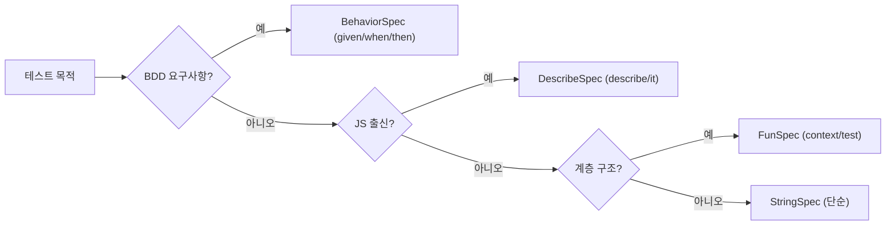
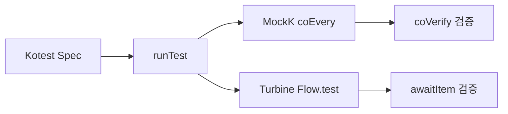

Java 개발자가 Kotlin으로 넘어올 때 마지막까지 Java 방식을 고집하는 영역이 있다. 바로 테스트다. JUnit 5와 Mockito는 익숙하고 문서도 많다. 그런데 막상 Kotlin 코드를 Mockito로 모킹하려 하면 `final class` 문제가 튀어나오고, 코루틴 테스트는 뭔가 어색하다. 이 글은 Kotlin 생태계의 테스트 도구인 Kotest와 MockK를 처음 접하는 개발자를 위해, 왜 이 도구들이 Kotlin에서 더 나은지, 어떻게 쓰는지를 하나씩 풀어낸다.

---

## 1️⃣ JUnit 5 + Kotlin — 기본 설정과 한계점

> **비유:** JUnit 5는 "오른손잡이용 가위"다. 왼손으로도 쓸 수는 있지만, 처음부터 왼손 전용 가위를 쓰면 훨씬 편하다.

### Gradle 설정

```kotlin
// build.gradle.kts
dependencies {
    testImplementation("org.junit.jupiter:junit-jupiter:5.10.0")
    testImplementation("org.mockito:mockito-core:5.5.0")
    testImplementation("org.mockito.kotlin:mockito-kotlin:5.1.0")
}

tasks.test {
    useJUnitPlatform()
}
```

JUnit 5는 Kotlin과 문법적으로 충돌하지 않는다. 어노테이션 기반이고 `@Test`만 붙이면 동작한다.

```kotlin
class UserServiceTest {

    @Test
    fun `사용자 이름이 비어있으면 예외를 던진다`() {
        val service = UserService()
        assertThrows<IllegalArgumentException> {
            service.createUser(name = "")
        }
    }
}
```

백틱(`` ` ``)으로 감싸는 테스트 이름이 Kotlin의 가장 큰 장점이다. `camelCase` 대신 자연어 문장으로 테스트를 명명할 수 있다.

### JUnit 5의 한계점

문제는 **구조화**다. 여러 조건을 계층적으로 표현하고 싶을 때 JUnit은 `@Nested`를 사용한다.

```kotlin
class OrderServiceTest {

    @Nested
    inner class `주문 생성` {

        @Nested
        inner class `재고가 있을 때` {

            @Test
            fun `주문이 성공한다`() { /* ... */ }
        }

        @Nested
        inner class `재고가 없을 때` {

            @Test
            fun `주문이 실패한다`() { /* ... */ }
        }
    }
}
```

`@Nested` + `inner class` 조합은 계층이 깊어질수록 클래스 선언 보일러플레이트가 누적된다. BDD 스타일(Given-When-Then)을 표현하려면 3단계 중첩이 기본이다. 이 지점에서 Kotest가 빛난다.

---

## 2️⃣ Kotest 소개 — Spec 스타일 선택의 자유

> **비유:** JUnit이 "정해진 메뉴만 있는 식당"이라면, Kotest는 "입맛에 맞게 재료를 고르는 뷔페"다. 팀 스타일, 도메인 특성에 따라 테스트 구조를 고를 수 있다.

### Gradle 설정

```kotlin
// build.gradle.kts
dependencies {
    testImplementation("io.kotest:kotest-runner-junit5:5.8.0")
    testImplementation("io.kotest:kotest-assertions-core:5.8.0")
    testImplementation("io.kotest:kotest-property:5.8.0")
}
```

Kotest는 JUnit 5 Platform 위에서 동작하므로 `useJUnitPlatform()`은 그대로 유지한다.

### StringSpec — 가장 단순한 형태

```kotlin
class CalculatorStringSpec : StringSpec({

    "1 더하기 1은 2다" {
        (1 + 1) shouldBe 2
    }

    "0으로 나누면 예외가 발생한다" {
        shouldThrow<ArithmeticException> { 10 / 0 }
    }
})
```

람다 블록 안에 문자열 키로 테스트를 등록한다. 구조는 평평하지만 읽기 쉽다.

### FunSpec — 함수 기반 구조화

```kotlin
class UserServiceFunSpec : FunSpec({

    context("사용자 생성") {
        test("유효한 이름으로 생성하면 ID가 반환된다") {
            val service = UserService()
            val id = service.createUser("Alice")
            id shouldBeGreaterThan 0L
        }

        test("빈 이름으로 생성하면 예외가 발생한다") {
            val service = UserService()
            shouldThrow<IllegalArgumentException> {
                service.createUser("")
            }
        }
    }
})
```

`context` 블록으로 그룹화하고 `test` 블록으로 개별 케이스를 정의한다. `@Nested` 없이 계층 구조를 자연스럽게 표현한다.

### BehaviorSpec — BDD 스타일

```kotlin
class PaymentBehaviorSpec : BehaviorSpec({

    given("결제 요청이 들어왔을 때") {
        `when`("잔액이 충분하면") {
            then("결제가 승인된다") {
                val wallet = Wallet(balance = 10_000)
                val result = wallet.pay(amount = 5_000)
                result shouldBe PaymentResult.APPROVED
            }
        }

        `when`("잔액이 부족하면") {
            then("결제가 거절된다") {
                val wallet = Wallet(balance = 1_000)
                val result = wallet.pay(amount = 5_000)
                result shouldBe PaymentResult.DECLINED
            }
        }
    }
})
```

Given-When-Then 구조가 코드에 그대로 드러난다. 비개발자도 읽을 수 있는 수준의 명세서가 된다. `when`은 Kotlin 예약어이므로 백틱으로 감싼다.

### DescribeSpec — RSpec / Jest 스타일

```kotlin
class ProductDescribeSpec : DescribeSpec({

    describe("ProductRepository") {
        describe("findById") {
            it("존재하는 ID면 상품을 반환한다") {
                val repo = InMemoryProductRepository()
                repo.save(Product(id = 1, name = "노트북"))
                repo.findById(1) shouldNotBe null
            }

            it("존재하지 않는 ID면 null을 반환한다") {
                val repo = InMemoryProductRepository()
                repo.findById(999) shouldBe null
            }
        }
    }
})
```

JavaScript 생태계(Jest, Jasmine)에 익숙한 개발자라면 가장 자연스럽게 느끼는 스타일이다.

### Spec 선택 흐름



### 어떤 Spec을 써야 하나

| Spec | 권장 상황 |
|---|---|
| StringSpec | 단순 유틸 함수, 단일 레이어 검증 |
| FunSpec | 일반적인 서비스/도메인 테스트 |
| BehaviorSpec | 비즈니스 요구사항이 복잡한 도메인 |
| DescribeSpec | 프론트엔드 출신 개발자, JS 경험자 |

팀이 하나의 스타일을 선택해 통일하는 것이 이상적이다. 혼재하면 가독성이 오히려 떨어진다.

---

## 3️⃣ Kotest Assertion — 읽기 좋은 검증

> **비유:** JUnit의 `assertEquals(expected, actual)`은 "형식 서류에 도장 찍는 느낌"이고, Kotest의 `actual shouldBe expected`는 "대화하듯 문장을 쓰는 느낌"이다.

### 기본 Matcher

```kotlin
// 동등성
result shouldBe 42
result shouldNotBe null

// 타입
result.shouldBeInstanceOf<String>()
result.shouldBeTypeOf<List<Int>>()

// 숫자 범위
price shouldBeGreaterThan 0
price shouldBeLessThanOrEqualTo 100_000

// 컬렉션
list shouldContain "apple"
list shouldContainAll listOf("apple", "banana")
list shouldHaveSize 3
list.shouldBeEmpty()
list.shouldNotBeEmpty()

// 문자열
name shouldStartWith "Kim"
email shouldEndWith "@example.com"
message shouldContain "error"
message shouldMatch Regex("\\d{4}-\\d{2}-\\d{2}")
```

왼쪽에서 오른쪽으로 읽으면 자연어 문장이 된다. `result shouldBe 42`는 "결과는 42여야 한다"로 읽힌다.

### 예외 검증

```kotlin
// 예외 타입 확인
shouldThrow<IllegalArgumentException> {
    service.createUser(name = "")
}

// 예외 메시지까지 확인
val ex = shouldThrow<IllegalArgumentException> {
    service.createUser(name = "")
}
ex.message shouldContain "이름은 비어있을 수 없습니다"
```

### Soft Assertion — 실패해도 계속 검증

```kotlin
assertSoftly {
    user.name shouldBe "Alice"
    user.email shouldBe "alice@example.com"
    user.age shouldBeGreaterThan 0
}
```

일반적으로 첫 번째 실패에서 테스트가 중단된다. `assertSoftly`는 모든 검증을 끝까지 실행한 뒤 모든 실패를 한꺼번에 보고한다. 여러 필드를 동시에 검증할 때 유용하다.

### 커스텀 Matcher

```kotlin
fun Assertion.Builder<Order>.shouldBeConfirmed() =
    prop(Order::status).shouldBe(OrderStatus.CONFIRMED)

// 사용
order.shouldBeConfirmed()
```

도메인 개념을 검증 코드에 직접 표현할 수 있다. `order.status shouldBe OrderStatus.CONFIRMED`보다 의미가 명확하다.

---

## 4️⃣ Kotest Property-Based Testing — 엣지케이스 자동 탐색

> **비유:** 일반 테스트가 "내가 생각한 몇 가지 경우를 검사하는 것"이라면, Property-Based Testing은 "컴퓨터가 수백 가지 경우를 무작위로 시도해 내 논리의 구멍을 찾는 것"이다.

### 기본 개념

Property-Based Testing은 **입력의 구체적인 값이 아니라 성질(property)을 명세**한다. Kotest의 `kotest-property` 모듈이 이를 지원한다.

```kotlin
class SortPropertyTest : FunSpec({

    test("정렬된 리스트의 크기는 원본과 같다") {
        forAll<List<Int>> { list ->
            list.sorted().size == list.size
        }
    }

    test("정렬된 리스트의 모든 원소는 다음 원소보다 작거나 같다") {
        forAll<List<Int>> { list ->
            val sorted = list.sorted()
            sorted.zipWithNext().all { (a, b) -> a <= b }
        }
    }
})
```

`forAll`은 기본적으로 1000번 무작위 입력을 생성해 각 케이스를 검증한다. 개발자가 미처 생각하지 못한 빈 리스트, 음수, Int.MAX_VALUE 같은 경계값도 자동으로 포함된다.

### 커스텀 Arb (Arbitrary)

실제 도메인 객체를 생성할 때는 `Arb`를 정의한다.

```kotlin
val arbEmail = Arb.string(minSize = 1, maxSize = 30)
    .map { local -> "$local@example.com" }

val arbUser = arbitrary {
    User(
        id = Arb.long(1L..Long.MAX_VALUE).bind(),
        name = Arb.string(minSize = 1, maxSize = 50).bind(),
        email = arbEmail.bind()
    )
}

test("사용자를 직렬화하면 역직렬화 후 동일하다") {
    forAll(arbUser) { user ->
        val json = Json.encodeToString(user)
        val decoded = Json.decodeFromString<User>(json)
        decoded == user
    }
}
```

`arbitrary { ... }` 블록 안에서 `.bind()`로 여러 `Arb`를 조합한다.

### Edge Case 자동 포함

Kotest Property는 **Shrinking**을 지원한다. 테스트가 실패하면 실패를 재현하는 가장 단순한 입력으로 자동으로 축소(shrink)한다.

```
Property test failed for inputs:
  Attempt 1: [-2147483648, 2147483647, 0]
  Shrinking...
  Minimal failure: [2147483647]
```

처음 실패한 복잡한 입력 대신, 근본 원인을 드러내는 최소 입력을 찾아준다.

---

## 5️⃣ MockK — Kotlin 네이티브 모킹

> **비유:** Mockito가 "Java 언어로 만들어진 번역기"라면, MockK는 "처음부터 Kotlin으로 설계된 통역사"다. 번역을 거치지 않으니 오해가 없다.

### Gradle 설정

```kotlin
testImplementation("io.mockk:mockk:1.13.8")
```

### 기본 사용법

```kotlin
class UserServiceMockKTest : FunSpec({

    val userRepository = mockk<UserRepository>()
    val userService = UserService(userRepository)

    test("ID로 사용자를 조회하면 repository를 호출한다") {
        val expected = User(id = 1L, name = "Alice")
        every { userRepository.findById(1L) } returns expected

        val result = userService.getUser(1L)

        result shouldBe expected
        verify { userRepository.findById(1L) }
    }
})
```

`every { ... } returns ...` 구문은 Kotlin DSL로 설계되어 IDE 자동완성이 완벽하게 동작한다.

### Slot — 캡처한 인자 검증

```kotlin
test("사용자 저장 시 올바른 객체가 전달된다") {
    val slot = slot<User>()
    every { userRepository.save(capture(slot)) } returns Unit

    userService.createUser("Bob")

    slot.captured.name shouldBe "Bob"
    slot.captured.id shouldBe 0L  // 저장 전 ID는 0
}
```

모킹된 메서드에 실제로 어떤 인자가 전달됐는지 캡처해서 검증한다.

### Answer — 동적 응답

```kotlin
every { userRepository.findById(any()) } answers {
    val id = firstArg<Long>()
    if (id > 0) User(id = id, name = "User$id")
    else throw EntityNotFoundException("존재하지 않는 사용자: $id")
}
```

`answers` 블록 안에서 인자를 꺼내 동적으로 응답을 만들 수 있다.

### verify 옵션

```kotlin
// 정확히 N번 호출됐는지
verify(exactly = 1) { userRepository.save(any()) }

// 한 번도 호출되지 않았는지
verify(exactly = 0) { userRepository.delete(any()) }

// 최소 N번 이상
verify(atLeast = 2) { eventPublisher.publish(any()) }

// 호출 순서까지 검증
verifyOrder {
    userRepository.findById(1L)
    userRepository.save(any())
}
```

### relaxed mock — 기본값 자동 반환

```kotlin
val mockService = mockk<EmailService>(relaxed = true)
// 모든 메서드가 기본값(0, false, null, 빈 컬렉션 등)을 반환
// 검증이 필요한 메서드만 every로 오버라이드
```

모든 메서드를 `every`로 정의하는 수고를 줄여준다. 관심 없는 협력 객체에 유용하다.

---

## 6️⃣ MockK vs Mockito — Kotlin에서 Mockito가 불편한 이유

> **비유:** Mockito로 Kotlin을 모킹하는 것은 "젓가락으로 피자를 먹는 것"이다. 못 먹는 건 아니지만, 처음부터 피자용 도구를 쓰는 게 낫다.

### 문제 1: Kotlin 클래스는 기본이 final

Java에서 클래스는 기본적으로 상속 가능하다. Mockito는 서브클래스를 동적으로 생성해서 모킹한다. 그런데 **Kotlin의 모든 클래스는 기본이 `final`**이다.

```kotlin
class UserRepository {  // final이 기본
    fun findById(id: Long): User? = TODO()
}

// Mockito로 시도하면:
val mock = mock(UserRepository::class.java)
// org.mockito.exceptions.base.MockitoException:
// Cannot mock/spy class UserRepository
// Mockito cannot mock this class: class UserRepository
// because it is final
```

해결책은 두 가지다:
1. `MockitoExtension` + `mockito-inline` 의존성 추가
2. `open` 키워드 추가 (프로덕션 코드를 테스트를 위해 변경하는 안티패턴)

MockK는 Java 에이전트나 `open` 없이 기본으로 `final` 클래스를 모킹한다.

```kotlin
// MockK — 별도 설정 없이 동작
val mock = mockk<UserRepository>()
```

### 문제 2: companion object 모킹

```kotlin
class OrderValidator {
    companion object {
        fun validate(order: Order): Boolean = order.amount > 0
    }
}

// Mockito는 companion object를 모킹할 수 없다

// MockK는 가능
mockkObject(OrderValidator.Companion)
every { OrderValidator.validate(any()) } returns true
```

### 문제 3: suspend 함수

Mockito는 `suspend` 함수의 마지막 인자인 `Continuation`을 인식하지 못한다.

```kotlin
interface UserRepository {
    suspend fun findById(id: Long): User?
}

// Mockito-kotlin은 우회책 필요
whenever(repo.findById(any())).thenReturn(user)  // 컴파일은 되지만 동작 불안정

// MockK — coEvery로 명확하게
coEvery { repo.findById(any()) } returns user
```

### 비교 요약

| 항목 | Mockito | MockK |
|---|---|---|
| final 클래스 모킹 | 별도 설정 필요 | 기본 지원 |
| companion object | 불가 | `mockkObject` |
| suspend 함수 | 불안정 | `coEvery` / `coVerify` |
| top-level 함수 | 불가 | `mockkStatic` |
| Kotlin DSL 친화성 | 낮음 | 높음 |
| Spring 통합 | 공식 지원 | `springmockk` |

---

## 7️⃣ 코루틴 테스트 — runTest, TestCoroutineScheduler, Turbine

> **비유:** 코루틴 테스트는 "빨리 감기가 되는 타임머신"이다. 실제로 1초를 기다리지 않고도 1초 후 동작을 검증할 수 있다.

### Gradle 설정

```kotlin
testImplementation("org.jetbrains.kotlinx:kotlinx-coroutines-test:1.7.3")
testImplementation("app.cash.turbine:turbine:1.0.0")
```

### runTest — 기본 코루틴 테스트

```kotlin
class OrderServiceCoroutineTest : FunSpec({

    test("비동기 주문 처리가 완료된다") {
        val service = OrderService()

        runTest {
            val result = service.processOrder(orderId = 1L)
            result.status shouldBe OrderStatus.COMPLETED
        }
    }
})
```

`runTest`는 `TestCoroutineScheduler`를 내장하고 있어 `delay()`를 실제로 기다리지 않는다. 1000ms `delay`가 있어도 테스트는 즉시 완료된다.

### advanceTimeBy — 시간 제어

```kotlin
test("5초 타임아웃 후 재시도가 발생한다") {
    val service = RetryService()
    var attemptCount = 0

    runTest {
        launch {
            service.executeWithRetry {
                attemptCount++
                throw IOException("연결 실패")
            }
        }

        advanceTimeBy(5_001)  // 5초 지연을 건너뜀
        runCurrent()

        attemptCount shouldBeGreaterThan 1
    }
}
```

`advanceTimeBy(millis)`로 가상의 시간을 앞당긴다. `delay` 기반 로직을 실시간 없이 검증한다.

### Turbine — Flow 테스트

Flow를 직접 `collect`해서 테스트하면 코드가 복잡해진다. Turbine은 Flow를 터빈처럼 하나씩 뽑아 검증하는 DSL을 제공한다.

```kotlin
test("주문 상태 변경 이벤트가 순서대로 발행된다") {
    val orderService = OrderService()

    orderService.orderStatusFlow(orderId = 1L).test {
        awaitItem() shouldBe OrderStatus.PENDING
        awaitItem() shouldBe OrderStatus.PROCESSING
        awaitItem() shouldBe OrderStatus.COMPLETED
        awaitComplete()
    }
}
```

```kotlin
test("에러 발생 시 Flow가 예외로 종료된다") {
    val service = FlakyService()

    service.dataFlow().test {
        awaitItem() shouldBe "first"
        awaitError().message shouldContain "네트워크 오류"
    }
}
```

`awaitItem()`, `awaitComplete()`, `awaitError()`, `cancelAndIgnoreRemainingEvents()` 등으로 Flow의 전체 생명주기를 검증한다.

### StateFlow / SharedFlow 테스트

```kotlin
test("상태 업데이트가 StateFlow에 반영된다") {
    val viewModel = OrderViewModel()

    viewModel.uiState.test {
        val initial = awaitItem()
        initial.isLoading shouldBe false

        viewModel.loadOrder(1L)
        val loading = awaitItem()
        loading.isLoading shouldBe true

        val loaded = awaitItem()
        loaded.isLoading shouldBe false
        loaded.order shouldNotBe null

        cancelAndIgnoreRemainingEvents()
    }
}
```

### coEvery / coVerify — suspend 함수 모킹

```kotlin
test("사용자 조회 시 suspend repository가 호출된다") {
    val repo = mockk<UserRepository>()
    val service = UserService(repo)

    coEvery { repo.findById(1L) } returns User(id = 1L, name = "Alice")

    runTest {
        val user = service.getUser(1L)
        user.name shouldBe "Alice"
    }

    coVerify { repo.findById(1L) }
}
```

`every`/`verify` 대신 `coEvery`/`coVerify`를 사용하면 suspend 함수도 정확하게 모킹된다.

---

## 8️⃣ Spring Boot Kotlin 테스트 통합

> **비유:** Spring Boot 테스트는 "무대 전체를 세팅하는 것"이다. 단위 테스트가 개별 배우를 연습시키는 거라면, 통합 테스트는 전체 공연을 리허설하는 것이다.

### springmockk — MockK + Spring 통합

```kotlin
// build.gradle.kts
testImplementation("com.ninja-squad:springmockk:4.0.2")
```

Spring Boot의 `@MockBean`은 Mockito를 사용한다. Kotlin에서는 `MockkBean`으로 교체한다.

```kotlin
@SpringBootTest
class UserControllerIntegrationTest : AnnotationSpec() {

    @Autowired
    private lateinit var mockMvc: MockMvc

    @MockkBean
    private lateinit var userService: UserService

    @Test
    fun `GET users-id 는 사용자를 반환한다`() {
        val user = User(id = 1L, name = "Alice")
        every { userService.getUser(1L) } returns user

        mockMvc.get("/users/1")
            .andExpect {
                status { isOk() }
                jsonPath("$.name") { value("Alice") }
            }
    }
}
```

### WebMvcTest + Kotest

```kotlin
@WebMvcTest(UserController::class)
class UserControllerSliceTest(
    @Autowired val mockMvc: MockMvc,
    @MockkBean val userService: UserService
) : FunSpec() {

    init {
        context("GET /users/{id}") {
            test("존재하는 사용자 ID면 200을 반환한다") {
                every { userService.getUser(1L) } returns User(1L, "Alice")

                mockMvc.get("/users/1")
                    .andExpect { status { isOk() } }
                    .andExpect { jsonPath("$.name") { value("Alice") } }
            }

            test("존재하지 않는 ID면 404를 반환한다") {
                every { userService.getUser(999L) } throws UserNotFoundException(999L)

                mockMvc.get("/users/999")
                    .andExpect { status { isNotFound() } }
            }
        }
    }
}
```

### TestContainers — 실제 DB 통합 테스트

```kotlin
@SpringBootTest
@Testcontainers
class UserRepositoryIntegrationTest : FunSpec() {

    companion object {
        @Container
        val postgres = PostgreSQLContainer<Nothing>("postgres:15").apply {
            withDatabaseName("testdb")
            withUsername("test")
            withPassword("test")
        }

        @DynamicPropertySource
        @JvmStatic
        fun properties(registry: DynamicPropertyRegistry) {
            registry.add("spring.datasource.url", postgres::getJdbcUrl)
            registry.add("spring.datasource.username", postgres::getUsername)
            registry.add("spring.datasource.password", postgres::getPassword)
        }
    }

    @Autowired
    lateinit var userRepository: UserRepository

    test("사용자 저장 후 조회하면 동일한 객체가 반환된다") {
        val saved = userRepository.save(User(name = "Bob", email = "bob@example.com"))
        val found = userRepository.findById(saved.id!!).get()

        found.name shouldBe "Bob"
        found.email shouldBe "bob@example.com"
    }
}
```

TestContainers는 실제 PostgreSQL 컨테이너를 테스트 중에 띄워서 H2 같은 인메모리 DB와의 방언 차이 문제를 없앤다.

### Kotest + Spring — 통합 설정

Kotest에서 Spring 컨텍스트를 재사용하려면 `SpringExtension`을 추가한다.

```kotlin
@SpringBootTest
class ServiceIntegrationTest : FunSpec() {

    override fun extensions() = listOf(SpringExtension)

    @Autowired
    lateinit var orderService: OrderService

    test("실제 컨텍스트에서 주문을 처리한다") {
        val result = orderService.processOrder(createTestOrder())
        result.status shouldBe OrderStatus.COMPLETED
    }
}
```

`SpringExtension`은 Kotest의 라이프사이클을 Spring의 컨텍스트 관리와 연결한다. 테스트 간 컨텍스트를 공유하므로 부팅 시간이 한 번으로 줄어든다.

---

## 9️⃣ 극한 시나리오

실제 운영 환경에서 테스트 전략이 흔들리는 상황을 살펴본다.

### 시나리오 1: 외부 API가 가끔씩 느릴 때

결제 API가 평소 100ms로 응답하다가 가끔 3초가 걸린다. 타임아웃 로직이 제대로 동작하는지 검증해야 한다.

```kotlin
test("외부 API가 타임아웃되면 fallback 값을 반환한다") {
    val mockApi = mockk<PaymentApi>()
    val service = PaymentService(mockApi, timeoutMs = 500)

    coEvery { mockApi.charge(any()) } coAnswers {
        delay(1_000)  // 1초 지연 — 타임아웃 유발
        PaymentResult.SUCCESS
    }

    runTest {
        val result = service.chargeWithTimeout(amount = 10_000)
        result shouldBe PaymentResult.TIMEOUT_FALLBACK
    }
}
```

`coAnswers`로 지연을 만들고, `runTest`의 가상 시간 제어로 실제 1초를 기다리지 않는다.

### 시나리오 2: 동시 요청이 쏟아질 때

100개의 요청이 동시에 들어왔을 때 재고 감소 로직에서 Race Condition이 발생하는지 검증한다.

```kotlin
test("100개 동시 주문에서 재고가 음수가 되지 않는다") {
    val inventory = ConcurrentInventory(stock = 50)

    runTest {
        val jobs = (1..100).map {
            launch {
                inventory.tryDecrement()
            }
        }
        jobs.joinAll()
    }

    inventory.current() shouldBeGreaterThanOrEqualTo 0
}
```

`runTest` 안에서 `launch`를 100개 띄우면 코루틴 스케줄러가 동시성 문제를 드러낸다. 실제 스레드 기반 테스트보다 재현이 안정적이다.

### 시나리오 3: Property Testing이 버그를 찾을 때

직접 작성한 직렬화 로직에 Edge Case가 있는지 검증한다.

```kotlin
test("모든 유효한 주문은 직렬화 후 역직렬화 시 동일하다") {
    val arbOrder = arbitrary {
        Order(
            id = Arb.long(1L..Long.MAX_VALUE).bind(),
            amount = Arb.int(1..10_000_000).bind(),
            items = Arb.list(Arb.string(1..20), 1..50).bind()
        )
    }

    forAll(arbOrder) { order ->
        val serialized = orderSerializer.serialize(order)
        val deserialized = orderSerializer.deserialize(serialized)
        order == deserialized
    }
}
```

이 테스트가 실패했다면, 예를 들어 `items`가 50개일 때 버퍼 오버플로가 발생하는 버그가 드러난다. Shrinking이 실패 최소 입력으로 줄여줘 디버깅이 쉬워진다.

### 시나리오 4: Flow가 예상치 못하게 종료될 때

WebSocket 연결이 끊겼을 때 Flow가 정상적으로 에러를 방출하고 재연결을 시도하는지 검증한다.

```kotlin
test("WebSocket 연결이 끊기면 에러 후 재연결 이벤트가 발생한다") {
    val connection = mockk<WebSocketConnection>()
    var connectCount = 0

    coEvery { connection.connect() } answers { connectCount++ }
    coEvery { connection.receive() } returnsMany listOf(
        "message1",
        "message2",
        throw IOException("연결 끊김"),
    )

    val client = ReconnectingWebSocketClient(connection)

    client.messageFlow().test {
        awaitItem() shouldBe "message1"
        awaitItem() shouldBe "message2"
        awaitError().message shouldContain "연결 끊김"
    }

    connectCount shouldBe 1
}
```

`returnsMany`로 여러 번 호출에 대한 응답 순서를 지정한다. 세 번째 호출에서 예외를 던지도록 설정해 Flow 종료 동작을 검증한다.

---

## 면접 포인트

### Q. Kotest와 JUnit 5의 가장 큰 차이점은 무엇인가?

JUnit 5는 어노테이션 기반으로 테스트 메서드를 식별한다. 계층 구조를 표현하려면 `@Nested` + `inner class`를 써야 하므로 클래스 보일러플레이트가 늘어난다. Kotest는 Spec 스타일을 선택할 수 있고, 람다 블록으로 계층을 표현하므로 클래스 없이 구조화된 테스트를 작성할 수 있다. FunSpec의 `context`/`test` 조합, BehaviorSpec의 `given`/`when`/`then` 조합이 대표적이다. 또한 Kotest는 풍부한 Matcher DSL, Property-Based Testing, 확장 포인트를 하나의 라이브러리로 제공한다.

### Q. MockK가 Mockito보다 Kotlin에서 유리한 이유 세 가지를 말하라.

첫째, Kotlin 클래스는 기본이 `final`인데 MockK는 추가 설정 없이 `final` 클래스를 모킹한다. Mockito는 `mockito-inline` 의존성 추가 또는 `open` 변경이 필요하다. 둘째, MockK는 `coEvery`/`coVerify`로 `suspend` 함수를 네이티브로 지원한다. Mockito는 `Continuation` 파라미터를 다루지 못해 불안정하다. 셋째, `companion object`나 `top-level` 함수를 `mockkObject`/`mockkStatic`으로 모킹할 수 있다. Mockito는 이를 지원하지 않는다.

### Q. runTest에서 delay()가 실제로 실행되지 않는 이유를 설명하라.

`runTest`는 내부적으로 `TestCoroutineScheduler`를 사용한다. 이 스케줄러는 코루틴에서 `delay()`가 호출될 때 실제 시스템 시간을 사용하지 않고 가상의 시간을 관리한다. `delay(1000)`이 호출되면 스케줄러는 "1000ms 후에 이 코루틴을 재개하라"고 등록하고, `runTest`가 블록을 끝낼 때 모든 미결 딜레이를 즉시 처리한다. 결과적으로 1000ms `delay`가 포함된 코드도 테스트는 즉시 완료된다. `advanceTimeBy()`로 가상 시간을 수동으로 앞당길 수도 있다.

### Q. Property-Based Testing은 언제 사용하는 게 적합한가?

순수 함수의 불변 조건(invariant)을 검증할 때 특히 유효하다. 예를 들어 "정렬 후 크기는 변하지 않는다", "직렬화→역직렬화 후 동일하다", "두 숫자를 더하면 순서에 무관하다(교환법칙)" 같은 성질이다. 개발자가 미처 생각하지 못한 경계값(빈 리스트, 음수, Long.MAX_VALUE, null 문자열 등)을 자동으로 탐색하므로 단순 예시 기반 테스트의 맹점을 보완한다. 단, 비즈니스 규칙이 복잡하게 얽혀 있어 성질을 명세하기 어려운 경우에는 적합하지 않다.

### Q. Turbine이 필요한 이유는 무엇인가?

Flow를 직접 `collect`해서 테스트하면 `toList()`로 전체를 모으거나 `Channel`을 직접 써야 한다. Flow가 무한 스트림이면 `toList()`는 영원히 블록된다. Turbine은 Flow를 구독하고 이벤트를 하나씩 꺼내는 `awaitItem()`, 완료를 기다리는 `awaitComplete()`, 에러를 기다리는 `awaitError()` API를 제공한다. 각 단계를 명시적으로 검증할 수 있어 "첫 번째 아이템은 X, 두 번째는 Y, 그 다음 에러가 발생한다"는 순서 의존적인 시나리오를 간결하게 표현할 수 있다.

### Q. @MockkBean과 @MockBean의 차이는 무엇인가?

`@MockBean`은 Spring Boot 공식 어노테이션으로 Mockito를 사용해 빈을 모킹한다. Kotlin 프로젝트에서는 `final` 클래스 문제와 `suspend` 함수 문제가 그대로 나타난다. `@MockkBean`은 `springmockk` 라이브러리가 제공하며 MockK를 사용해 빈을 교체한다. 사용법은 동일하지만 내부 동작이 MockK이므로 Kotlin의 `final` 클래스, `suspend` 함수, `companion object`를 모두 자연스럽게 처리한다. Kotlin + Spring 프로젝트에서는 `@MockkBean`을 기본 선택으로 삼는 것이 일반적이다.

### Q. Soft Assertion이 필요한 상황을 설명하라.

API 응답 객체처럼 여러 필드를 동시에 검증해야 하는 경우에 유용하다. 일반적인 검증은 첫 번째 실패에서 테스트가 중단된다. 응답 객체의 `name`, `email`, `age`, `status`를 모두 확인해야 하는데 `name`이 틀렸다면, 나머지 세 필드가 맞는지 틀린지 알 수 없다. `assertSoftly`를 사용하면 모든 검증을 끝까지 실행하고 실패한 항목을 한꺼번에 리포트한다. "이 중 3개가 틀렸다"는 정보는 디버깅 시간을 크게 줄여준다.

---

## 정리

Kotlin 테스트 생태계의 핵심은 세 가지로 요약된다.

첫째, **Kotest**는 JUnit 5의 구조적 한계를 극복하고 Kotlin 언어의 람다와 DSL을 최대한 활용해 읽기 좋은 테스트를 만든다.

둘째, **MockK**는 Kotlin의 `final` 클래스, `suspend` 함수, `companion object`를 자연스럽게 다룬다. Mockito의 회피 코드 없이 직관적인 모킹이 가능하다.

셋째, **Turbine + runTest**는 코루틴과 Flow 기반 코드를 실시간 대기 없이, 이벤트 순서까지 명확하게 검증한다.

세 도구는 독립적으로도 쓸 수 있지만, 함께 쓸 때 진가가 나온다. Kotest의 FunSpec 안에서 MockK로 모킹하고, `runTest`로 코루틴을 실행하며, Turbine으로 Flow를 검증하는 조합이 현재 Kotlin 생태계의 de facto 테스트 스택이다.


