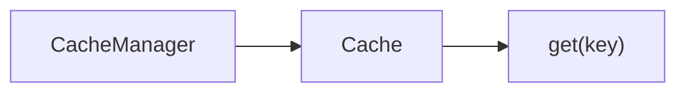
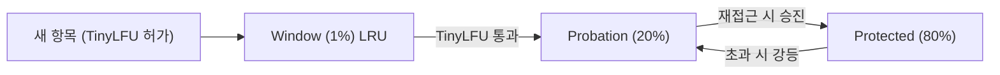

## 로컬 캐시란?

> 비유: 로컬 캐시는 책상 위의 메모장이다. 필요한 정보를 이미 적어뒀으면 도서관(DB/Redis)에 가지 않아도 된다. 단, 다른 사람의 메모장과 내용이 다를 수 있다.

로컬 캐시(Local Cache)는 애플리케이션 프로세스 **내부 메모리(Heap 또는 Off-Heap)**에 데이터를 저장하는 캐시다. Redis·Memcached 같은 외부 캐시와 달리 네트워크 왕복이 없어 **나노초~마이크로초** 수준의 응답 시간을 달성할 수 있다.

Business Logic → Local Cache(조회) / Cache Miss 시 → External Store

### 로컬 캐시 vs 분산 캐시

| 항목 | 로컬 캐시 | 분산 캐시 (Redis 등) |
|------|-----------|----------------------|
| 응답 속도 | 나노초~마이크로초 | 수백 마이크로초~밀리초 |
| 데이터 공유 | 인스턴스별 독립 | 모든 인스턴스 공유 |
| 일관성 | 인스턴스 간 불일치 가능 | 단일 원본 |
| 운영 비용 | 없음 | 별도 서버 필요 |
| 용량 | JVM Heap 제한 | 서버 메모리만큼 |
| 적합 대상 | 읽기 빈번, 변경 드문 데이터 | 세션, 실시간 공유 데이터 |

---

## Spring Cache Abstraction

Spring은 `spring-context` 모듈에 **캐시 추상화 레이어**를 제공한다. 구체적인 캐시 구현체(Caffeine, Ehcache 등)와 비즈니스 로직을 분리해 애노테이션만으로 캐싱을 적용할 수 있다.

### 핵심 인터페이스



### 주요 애노테이션

#### @Cacheable — 조회 결과 캐싱

```java
@Service
public class ProductService {

    @Cacheable(
        cacheNames = "products",
        key = "#productId",
        condition = "#productId > 0",
        unless = "#result == null"
    )
    public Product findById(Long productId) {
        // Cache Miss 시에만 실행
        return productRepository.findById(productId).orElse(null);
    }
}
```

- `cacheNames`: 사용할 캐시 이름
- `key`: SpEL 표현식으로 캐시 키 지정 (기본값: 모든 파라미터 조합)
- `condition`: 캐싱 적용 조건 (메서드 실행 전 평가)
- `unless`: 캐싱 제외 조건 (메서드 실행 후 결과로 평가)

#### @CachePut — 항상 실행 후 캐시 갱신

```java
@CachePut(cacheNames = "products", key = "#product.id")
public Product update(Product product) {
    return productRepository.save(product);
}
```

메서드를 **항상 실행**하고, 반환값으로 캐시를 갱신한다. `@Cacheable`과 달리 캐시 히트 시에도 실행된다.

#### @CacheEvict — 캐시 삭제

```java
// 특정 키 삭제
@CacheEvict(cacheNames = "products", key = "#productId")
public void delete(Long productId) {
    productRepository.deleteById(productId);
}

// 캐시 전체 삭제
@CacheEvict(cacheNames = "products", allEntries = true)
public void deleteAll() {
    productRepository.deleteAll();
}

// 메서드 실행 전 삭제 (beforeInvocation = true)
@CacheEvict(cacheNames = "products", key = "#productId", beforeInvocation = true)
public void deleteBeforeMethod(Long productId) {
    // 예외가 발생해도 캐시는 이미 삭제됨
}
```

#### @Caching — 복합 캐시 조작

```java
@Caching(
    put = { @CachePut(cacheNames = "products", key = "#product.id") },
    evict = { @CacheEvict(cacheNames = "productList", allEntries = true) }
)
public Product save(Product product) {
    return productRepository.save(product);
}
```

### Spring Cache 활성화

```java
@Configuration
@EnableCaching  // 필수! AOP 프록시 활성화
public class CacheConfig {
}
```

### 주의사항: Self-Invocation 문제

Spring Cache는 AOP 프록시 기반이므로 **같은 클래스 내부에서 호출하면 캐시가 동작하지 않는다.**

```java
@Service
public class ProductService {

    // 외부에서 호출 → 캐시 동작 O
    @Cacheable("products")
    public Product findById(Long id) { ... }

    public void someMethod() {
        // 내부 호출 → 캐시 동작 X (프록시를 거치지 않음)
        Product p = this.findById(1L);
    }
}
```

---

## ConcurrentMapCache — Spring 기본 구현체

`ConcurrentMapCache`는 Spring이 기본으로 제공하는 캐시 구현체다. 내부적으로 `ConcurrentHashMap`을 사용한다.

### 특징

```java
// SimpleCacheManager로 등록
@Configuration
@EnableCaching
public class SimpleCacheConfig {

    @Bean
    public CacheManager cacheManager() {
        SimpleCacheManager cacheManager = new SimpleCacheManager();
        cacheManager.setCaches(List.of(
            new ConcurrentMapCache("products"),
            new ConcurrentMapCache("users")
        ));
        return cacheManager;
    }
}
```

### 한계

- **Eviction 정책 없음**: 크기 제한이 없어 메모리 무한 증가 가능
- **TTL 없음**: 만료 기능이 없어 오래된 데이터가 영구적으로 남음
- **통계 없음**: 히트율 등 모니터링 불가

운영 환경에서는 사용하지 않는 것을 권장한다. 테스트·개발 환경에만 적합하다.

---

## Caffeine Cache

> 비유: 도서관 사서가 "이 책은 어제도 빌려갔으니 미리 데스크 앞에 꺼내두자"고 판단하는 것처럼, Caffeine의 W-TinyLFU는 자주 쓰이는 항목을 영리하게 골라 캐시에 유지한다.

Caffeine은 **Java 8+** 환경에서 가장 널리 사용되는 로컬 캐시 라이브러리다. Guava Cache의 후계자로, 벤치마크에서 일관되게 최고 성능을 보인다.

### 의존성

```xml
<!-- Maven -->
<dependency>
    <groupId>com.github.ben-manes.caffeine</groupId>
    <artifactId>caffeine</artifactId>
    <version>3.1.8</version>
</dependency>

<!-- Spring Boot를 사용하면 spring-boot-starter-cache가 자동으로 포함 -->
<dependency>
    <groupId>org.springframework.boot</groupId>
    <artifactId>spring-boot-starter-cache</artifactId>
</dependency>
```

### 동작 원리: Window TinyLFU

Caffeine은 **W-TinyLFU(Window TinyLFU)** 알고리즘을 사용한다. 자세한 설명은 [캐시 교체 알고리즘 총정리](/local_cache/cache-eviction-algorithms) 포스트에서 다루며, 여기서는 구조만 간략히 본다.



- **Window Cache**: 최근 접근 항목이 잠시 머무는 공간 (전체의 1%)
- **Protected**: 자주 사용되는 항목 (Main의 80%)
- **Probation**: 추방 후보 공간 (Main의 20%)

### Caffeine 직접 사용 (Spring 없이)

```java
Cache<String, Product> cache = Caffeine.newBuilder()
    .maximumSize(1_000)                          // 최대 항목 수
    .expireAfterWrite(10, TimeUnit.MINUTES)      // 쓰기 후 TTL
    .expireAfterAccess(5, TimeUnit.MINUTES)      // 마지막 접근 후 TTL
    .refreshAfterWrite(1, TimeUnit.MINUTES)      // 백그라운드 갱신
    .recordStats()                               // 통계 수집
    .build();

// 조회 (없으면 null)
Product product = cache.getIfPresent("product:1");

// 조회 + 없으면 로딩
Product product = cache.get("product:1", key -> productRepository.findById(1L));

// 저장
cache.put("product:1", product);

// 삭제
cache.invalidate("product:1");
cache.invalidateAll();

// 통계
CacheStats stats = cache.stats();
System.out.println("Hit rate: " + stats.hitRate());
System.out.println("Miss count: " + stats.missCount());
System.out.println("Eviction count: " + stats.evictionCount());
```

### AsyncLoadingCache — 비동기 캐시

```java
AsyncLoadingCache<String, Product> asyncCache = Caffeine.newBuilder()
    .maximumSize(1_000)
    .expireAfterWrite(10, TimeUnit.MINUTES)
    .buildAsync(key -> productRepository.findById(Long.parseLong(key)));

// CompletableFuture 반환
CompletableFuture<Product> future = asyncCache.get("product:1");
```

### Spring Boot와 통합

**application.yml 방식 (간단)**

```yaml
spring:
  cache:
    type: caffeine
    caffeine:
      spec: maximumSize=1000,expireAfterWrite=10m
```

**Java Config 방식 (세밀한 제어)**

```java
@Configuration
@EnableCaching
public class CaffeineConfig {

    @Bean
    public CacheManager cacheManager() {
        CaffeineCacheManager manager = new CaffeineCacheManager();
        manager.setCaffeine(caffeine());
        return manager;
    }

    @Bean
    public Caffeine<Object, Object> caffeine() {
        return Caffeine.newBuilder()
            .maximumSize(1_000)
            .expireAfterWrite(10, TimeUnit.MINUTES)
            .recordStats();
    }
}
```

**캐시별 개별 설정 (권장)**

```java
@Configuration
@EnableCaching
public class CaffeineConfig {

    @Bean
    public CacheManager cacheManager() {
        SimpleCacheManager manager = new SimpleCacheManager();
        manager.setCaches(List.of(
            buildCache("products", 10_000, 10),
            buildCache("users", 5_000, 30),
            buildCache("configs", 100, 60)
        ));
        return manager;
    }

    private CaffeineCache buildCache(String name, long maxSize, long ttlMinutes) {
        return new CaffeineCache(name,
            Caffeine.newBuilder()
                .maximumSize(maxSize)
                .expireAfterWrite(ttlMinutes, TimeUnit.MINUTES)
                .recordStats()
                .build()
        );
    }
}
```

### Caffeine Spec 문자열 형식

```
maximumSize=N          최대 항목 수 (용량 기반 eviction)
maximumWeight=N        최대 가중치 합계
expireAfterWrite=Nd    쓰기 후 N일
expireAfterWrite=Nh    쓰기 후 N시간
expireAfterWrite=Nm    쓰기 후 N분
expireAfterWrite=Ns    쓰기 후 N초
expireAfterAccess=Nm   마지막 접근 후 N분
refreshAfterWrite=Nm   쓰기 후 N분마다 백그라운드 갱신
weakKeys               키를 WeakReference로 보관
weakValues             값을 WeakReference로 보관
softValues             값을 SoftReference로 보관
recordStats            통계 수집 활성화
```

### refreshAfterWrite vs expireAfterWrite

```
expireAfterWrite: 만료 후 접근 시 → 블로킹으로 새 값 로드 (첫 요청 지연)
refreshAfterWrite: 만료 후 접근 시 → 오래된 값 즉시 반환 + 백그라운드에서 갱신
```

읽기 레이턴시가 중요한 경우 `refreshAfterWrite`를 선호한다.

---

## Ehcache 3

> 비유: Ehcache는 3단 서랍장이다. 가장 자주 쓰는 것은 첫 번째 서랍(Heap)에, 덜 자주 쓰는 것은 두 번째(Off-Heap)에, 오래 보관해야 하는 것은 바닥 서랍(Disk)에 넣는다.

Ehcache는 Java 진영에서 가장 오래된 캐시 라이브러리 중 하나로, **Heap + Off-Heap + Disk** 3계층 스토리지를 지원한다.

### 의존성

```xml
<dependency>
    <groupId>org.ehcache</groupId>
    <artifactId>ehcache</artifactId>
    <version>3.10.8</version>
</dependency>
<!-- JSR-107 (JCache) API -->
<dependency>
    <groupId>javax.cache</groupId>
    <artifactId>cache-api</artifactId>
    <version>1.1.1</version>
</dependency>
```

### 계층 구조 (Tiered Storage)

Heap Tier(수십 MB) → 용량 초과 시 → Off-Heap Tier(수백 MB) → 용량 초과 시 → Disk Tier(수십 GB~)

접근 속도: Heap > Off-Heap > Disk

Heap → Off-Heap → Disk 순서로 캐시가 채워지며, 용량 초과 시 하위 계층으로 이동한다.

### Ehcache 직접 사용

```java
// Heap Only
CacheManager cacheManager = CacheManagerBuilder.newCacheManagerBuilder()
    .withCache("products",
        CacheConfigurationBuilder.newCacheConfigurationBuilder(
            Long.class, Product.class,
            ResourcePoolsBuilder.heap(1_000)          // 최대 1000개
        )
        .withExpiry(ExpiryPolicyBuilder.timeToLiveExpiration(Duration.ofMinutes(10)))
    )
    .build(true); // true = 즉시 init

Cache<Long, Product> productCache = cacheManager.getCache("products", Long.class, Product.class);

// Heap + Off-Heap
CacheManager tieredManager = CacheManagerBuilder.newCacheManagerBuilder()
    .withCache("products",
        CacheConfigurationBuilder.newCacheConfigurationBuilder(
            Long.class, Product.class,
            ResourcePoolsBuilder.newResourcePoolsBuilder()
                .heap(100, EntryUnit.ENTRIES)          // Heap: 100개
                .offheap(256, MemoryUnit.MB)           // Off-Heap: 256MB
        )
    )
    .build(true);

// Heap + Off-Heap + Disk (영속 캐시)
PersistentCacheManager persistentManager = CacheManagerBuilder.newCacheManagerBuilder()
    .with(CacheManagerBuilder.persistence("/var/cache/myapp"))
    .withCache("products",
        CacheConfigurationBuilder.newCacheConfigurationBuilder(
            Long.class, Product.class,
            ResourcePoolsBuilder.newResourcePoolsBuilder()
                .heap(100, EntryUnit.ENTRIES)
                .offheap(256, MemoryUnit.MB)
                .disk(10, MemoryUnit.GB, true)         // true = 영속
        )
    )
    .build(true);
```

### Spring Boot와 통합 (XML 설정)

**ehcache.xml**

```xml
<config xmlns:xsi='http://www.w3.org/2001/XMLSchema-instance'
        xmlns='http://www.ehcache.org/v3'
        xsi:schemaLocation="http://www.ehcache.org/v3
        http://www.ehcache.org/schema/ehcache-core.xsd">

    <cache alias="products">
        <key-type>java.lang.Long</key-type>
        <value-type>com.example.Product</value-type>
        <resources>
            <heap unit="entries">1000</heap>
            <offheap unit="MB">256</offheap>
        </resources>
        <expiry>
            <ttl unit="minutes">10</ttl>
        </expiry>
    </cache>

    <cache alias="users">
        <key-type>java.lang.Long</key-type>
        <value-type>com.example.User</value-type>
        <resources>
            <heap unit="entries">500</heap>
        </resources>
        <expiry>
            <ttl unit="minutes">30</ttl>
        </expiry>
    </cache>

</config>
```

**application.yml**

```yaml
spring:
  cache:
    type: jcache
    jcache:
      config: classpath:ehcache.xml
```

### Spring Boot와 통합 (Java Config)

```java
@Configuration
@EnableCaching
public class EhcacheConfig {

    @Bean
    public CacheManager cacheManager() {
        EhcacheCachingProvider provider = (EhcacheCachingProvider)
            Caching.getCachingProvider("org.ehcache.jsr107.EhcacheCachingProvider");

        javax.cache.CacheManager jCacheManager = provider.getCacheManager(
            getClass().getResource("/ehcache.xml").toURI(),
            getClass().getClassLoader()
        );

        return new JCacheCacheManager(jCacheManager);
    }
}
```

### Off-Heap 사용 시 직렬화 요구사항

Off-Heap이나 Disk 계층을 사용하면 객체를 **직렬화**해야 한다. Ehcache는 기본적으로 Java 직렬화를 사용하지만, 성능을 위해 커스텀 직렬화를 설정할 수 있다.

```java
// Kryo 등 고성능 직렬화기와 연동 가능
.withService(new DefaultSerializationProviderConfiguration()
    .addSerializerFor(Product.class, KryoSerializer.class))
```

---

## Guava Cache (레거시)

Google Guava 라이브러리에 포함된 캐시 구현체다. **현재는 Caffeine으로 대체되었으며** 신규 프로젝트에서는 사용하지 않는다.

### Guava Cache 기본 사용법

```java
LoadingCache<String, Product> cache = CacheBuilder.newBuilder()
    .maximumSize(1_000)
    .expireAfterWrite(10, TimeUnit.MINUTES)
    .recordStats()
    .build(new CacheLoader<>() {
        @Override
        public Product load(String key) {
            return productRepository.findByKey(key);
        }
    });

Product product = cache.get("product:1");   // 없으면 CacheLoader 호출
```

### Caffeine으로 마이그레이션하는 이유

| 비교 항목 | Guava Cache | Caffeine |
|-----------|-------------|----------|
| 알고리즘 | LRU 변형 | W-TinyLFU |
| 캐시 히트율 | 보통 | 상위 (특히 Zipf 분포) |
| 처리량 (ops/sec) | ~500만 | ~1,000만 이상 |
| 비동기 지원 | 없음 | AsyncLoadingCache 지원 |
| 유지보수 상태 | 유지보수 모드 | 활발한 개발 |
| Java 8+ 지원 | 제한적 | 완전 지원 |

Caffeine은 Guava Cache API와 **거의 동일한 인터페이스**를 제공하므로 마이그레이션 비용이 낮다.

```java
// Guava
CacheBuilder.newBuilder().maximumSize(1_000) ...

// Caffeine (거의 동일)
Caffeine.newBuilder().maximumSize(1_000) ...
```

---

## 성능 비교

### 벤치마크 환경

- JMH (Java Microbenchmark Harness) 기반
- 읽기 100% (Read-Heavy) 워크로드
- Zipf 분포 (현실적인 접근 패턴)
- JDK 17, 8-core CPU

### 처리량 (ops/sec, 높을수록 좋음)

```
ConcurrentMapCache  ████████████████████████  ~25,000,000
Caffeine            ████████████████████████  ~22,000,000
Guava Cache         █████████████████         ~14,000,000
Ehcache 3 (Heap)    ██████████████            ~11,000,000
Ehcache 3 (Off-Heap)█████████                 ~7,000,000
```

> 출처: Caffeine 공식 벤치마크 (https://github.com/ben-manes/caffeine/wiki/Benchmarks)
> ConcurrentMapCache는 eviction이 없으므로 공정한 비교가 아님

### 캐시 히트율 (%, 높을수록 좋음)

Zipf 분포, 캐시 사이즈 = 전체 데이터의 10%

```
Caffeine (W-TinyLFU) ██████████████████████████  ~93%
Ehcache 3 (LRU)      ███████████████████████     ~86%
Guava Cache (LRU)    ███████████████████████     ~85%
FIFO                 ████████████████████        ~78%
```

> W-TinyLFU는 LRU 대비 **7~10% 높은 히트율**을 보인다

### 혼합 워크로드 (Read 75%, Write 25%)

```
라이브러리          처리량(ops/s)   히트율
Caffeine            ~15,000,000    ~91%
Ehcache 3 (Heap)    ~8,000,000     ~85%
Guava Cache         ~9,000,000     ~84%
```

---

## 실무 선택 기준

### 선택 가이드 표

| 상황 | 추천 라이브러리 | 이유 |
|------|-----------------|------|
| 대부분의 Spring Boot 프로젝트 | **Caffeine** | 최고 성능, 낮은 학습 비용 |
| 수 GB 이상의 대용량 캐시 | **Ehcache 3** | Off-Heap으로 GC 부담 없음 |
| 캐시 데이터를 재시작 후 유지 | **Ehcache 3** | Disk Tier 지원 |
| 레거시 Guava Cache 유지보수 | **Caffeine** | 마이그레이션 비용 최소 |
| 테스트/개발 환경 | **ConcurrentMapCache** | 설정 불필요 |
| JSR-107 (JCache) 표준 필요 | **Ehcache 3** | JCache API 완벽 지원 |

### Caffeine 선택이 기본값인 이유

1. **최고 수준의 히트율**: W-TinyLFU가 LRU 대비 평균 10% 향상
2. **최고 수준의 처리량**: 벤치마크에서 일관된 1위
3. **낮은 복잡도**: XML 설정 없이 Java Config만으로 완결
4. **Spring Boot 공식 지원**: `spring-boot-starter-cache` 자동 구성
5. **비동기 지원**: `AsyncLoadingCache`로 논블로킹 캐싱 가능
6. **활발한 유지보수**: 정기적인 업데이트와 버그 수정

### Ehcache 선택이 유리한 경우

```
힙 메모리 사용 패턴 비교:

Caffeine (Heap only):
JVM Heap: [Live Objects][Cache 500MB][Reserved]
          → GC가 Cache 영역도 스캔 → STW 증가

Ehcache (Off-Heap):
JVM Heap: [Live Objects][Cache 10MB (hot only)]
          → GC 부담 최소
Off-Heap: [Cache 500MB] → GC 대상 아님
```

캐시 크기가 **힙의 30% 이상**을 차지하거나, **Full GC**가 자주 발생하는 환경이라면 Ehcache의 Off-Heap을 고려한다.

### 설정 복잡도 비교

```
ConcurrentMapCache  ★☆☆☆☆  (설정 없음)
Caffeine            ★★☆☆☆  (Java Config 몇 줄)
Ehcache 3 (Heap)    ★★★☆☆  (XML 또는 Java Config)
Ehcache 3 (Off-Heap/Disk) ★★★★☆  (직렬화, 계층 설정)
```

---

## 실전 설정 예제

### Caffeine + Spring Boot 완성 설정

```java
@Configuration
@EnableCaching
public class CacheConfiguration {

    @Bean
    public CacheManager cacheManager() {
        SimpleCacheManager manager = new SimpleCacheManager();
        manager.setCaches(List.of(
            // 상품 캐시: 10분 TTL, 최대 10,000개
            caffeineCache("products", 10_000, 10, TimeUnit.MINUTES),
            // 사용자 캐시: 30분 TTL, 최대 5,000개
            caffeineCache("users", 5_000, 30, TimeUnit.MINUTES),
            // 설정 캐시: 60분 TTL, 최대 100개
            caffeineCache("configs", 100, 60, TimeUnit.MINUTES)
        ));
        return manager;
    }

    private CaffeineCache caffeineCache(
            String name, long maxSize, long ttl, TimeUnit unit) {
        return new CaffeineCache(name,
            Caffeine.newBuilder()
                .maximumSize(maxSize)
                .expireAfterWrite(ttl, unit)
                .recordStats()
                .build()
        );
    }

    // 통계 노출 (Actuator 연동)
    @Bean
    public CacheMetricsRegistrar cacheMetricsRegistrar(
            CacheManager cacheManager, MeterRegistry registry) {
        return new CacheMetricsRegistrar(registry, cacheManager, List.of());
    }
}
```

### Cache Warming — 애플리케이션 시작 시 캐시 선행 적재

```java
@Component
@RequiredArgsConstructor
public class CacheWarmer implements ApplicationRunner {

    private final ProductService productService;
    private final CacheManager cacheManager;

    @Override
    public void run(ApplicationArguments args) {
        log.info("Starting cache warm-up...");

        // 자주 조회되는 상위 N개 상품을 미리 캐시에 적재
        productRepository.findTopNByOrderByViewCountDesc(1000)
            .forEach(product -> {
                productService.findById(product.getId()); // @Cacheable 호출
            });

        log.info("Cache warm-up completed");
    }
}
```

### 캐시 통계 모니터링 (Actuator + Micrometer)

```yaml
# application.yml
management:
  endpoints:
    web:
      exposure:
        include: caches, metrics
  metrics:
    cache:
      caffeine:
        enabled: true
```

```bash
# 캐시 통계 조회
GET /actuator/metrics/cache.gets?tag=cache:products&tag=result:hit
GET /actuator/metrics/cache.gets?tag=cache:products&tag=result:miss
GET /actuator/caches/products
```

---

## 왜 로컬 캐시인가? (vs Redis 단독 사용)

| 방식 | 응답 속도 | 일관성 | 운영 복잡도 | 선택 기준 |
|------|---------|--------|-----------|---------|
| **Redis 단독** | ~1ms (네트워크) | 높음 | 낮음 | 서버 수 적고 데이터 변경 빈번 |
| **로컬 캐시 단독** | ~100ns (메모리) | 서버별 상이 | 낮음 | 단일 서버, 변경 없는 데이터 |
| **L1(로컬) + L2(Redis)** | 100ns → 1ms | 중간 | 중간 | 대용량 트래픽, Hot 데이터 |

```
로컬 캐시의 핵심 장점:
1. 속도: Redis 네트워크 왕복(~1ms) 없음 → 나노초 응답
2. Redis 부하 감소: 동일 요청을 서버 내에서 처리
3. 네트워크 장애 내성: Redis 연결 끊겨도 로컬 캐시는 동작

주요 단점:
- 서버 재시작 시 캐시 소멸 (cold start)
- 다중 서버 환경에서 서버마다 다른 데이터 (캐시 불일치)
- JVM Heap 사용 → GC 압박 가능

로컬 캐시에 적합한 데이터:
- 변경이 거의 없는 설정값 (배송비 기준, 수수료율)
- 모든 사용자에게 동일한 데이터 (이벤트 배너, 공지사항)
- 짧은 TTL로 불일치를 허용할 수 있는 데이터
```

---

## 실무에서 자주 하는 실수

#### 실수 1: 로컬 캐시에 사용자별 개인 데이터 저장

```java
// 나쁜 예 — 서버 A에서 로그인한 사용자 정보를 로컬 캐시에 저장
localCache.put("user:" + userId, userInfo);
// → 서버 B로 요청이 라우팅되면 Cache Miss → DB 쿼리
// → 서버마다 다른 사용자 데이터 → 불일치

// 좋은 예 — 세션/사용자 데이터는 Redis(공유 캐시)에 저장
redisTemplate.opsForValue().set("user:" + userId, userInfo, Duration.ofMinutes(30));
// 어느 서버로 가도 동일한 데이터 접근
```

#### 실수 2: 캐시 크기 제한 없이 사용

```java
// 나쁜 예 — maximumSize 미설정
Cache<Long, Product> cache = Caffeine.newBuilder()
    .build();
// → 캐시가 무한정 커짐 → JVM OOM 위험

// 좋은 예 — 크기와 TTL 명시
Cache<Long, Product> cache = Caffeine.newBuilder()
    .maximumSize(10_000)              // 최대 항목 수
    .expireAfterWrite(Duration.ofMinutes(10))
    .recordStats()                    // 히트율 모니터링
    .build();
```

#### 실수 3: 다중 서버 환경에서 로컬 캐시 무효화 누락

```java
// 시나리오: 상품 가격 변경
// 서버 A: 로컬 캐시 갱신
// 서버 B, C, D: 여전히 구 가격 캐시 보유 → 가격 불일치

// 해결: Redis Pub/Sub으로 무효화 이벤트 브로드캐스트
@Transactional
public void updatePrice(Long productId, BigDecimal newPrice) {
    productRepository.updatePrice(productId, newPrice);
    localCache.invalidate(productId);  // 현재 서버 캐시 무효화
    // 모든 서버의 로컬 캐시 무효화 요청 발행
    redisTemplate.convertAndSend("cache:invalidate:product", productId.toString());
}

@Bean
public MessageListenerAdapter invalidationListener() {
    return new MessageListenerAdapter(new MessageListener() {
        @Override
        public void onMessage(Message message, byte[] pattern) {
            Long productId = Long.parseLong(new String(message.getBody()));
            localCache.invalidate(productId);  // 수신 서버 캐시 무효화
        }
    });
}
```

#### 실수 4: 캐시 히트율 모니터링 없이 운영

```java
// Caffeine 통계 수집
Cache<Long, Product> cache = Caffeine.newBuilder()
    .maximumSize(10_000)
    .recordStats()  // 통계 활성화
    .build();

// 주기적으로 히트율 확인
@Scheduled(fixedDelay = 60_000)
public void logCacheStats() {
    CacheStats stats = cache.stats();
    log.info("캐시 히트율: {:.2f}%, 미스율: {:.2f}%, 요청수: {}",
        stats.hitRate() * 100,
        stats.missRate() * 100,
        stats.requestCount());
    // 히트율 < 50% → 캐시 전략 재검토 필요
}
```

#### 실수 5: Spring @Cacheable과 로컬 캐시 혼용 시 직렬화 누락

```java
// @Cacheable 사용 시 반환 객체는 직렬화 가능해야 함
// Caffeine은 인메모리라 직렬화 불필요하지만
// Redis와 함께 멀티레이어 구성 시 직렬화 필수

// 반환 객체에 Serializable 구현 또는 Jackson 직렬화 설정
public class Product implements Serializable {  // Redis 저장 시 필요
    private static final long serialVersionUID = 1L;
    // ...
}
```

---

## 면접 포인트

#### Q. Caffeine이 Guava Cache보다 성능이 좋은 이유는?

```
Guava Cache: LRU(Least Recently Used) 알고리즘
  → 최근 접근 기준으로 제거
  → 한 번만 접근한 데이터가 자주 접근하는 데이터를 밀어낼 수 있음

Caffeine: W-TinyLFU(Window Tiny Least Frequently Used)
  → 최근성(Recency) + 빈도(Frequency) 모두 고려
  → Window 영역(1%)에서 먼저 검증 후 Main 영역 입성
  → "한 번 접근한 데이터"가 "자주 접근하는 데이터"를 밀어내지 못함
  → 동일 메모리에서 LRU 대비 히트율 15~20% 높음

벤치마크: Caffeine > Guava Cache > Ehcache (단순 조회 기준)
```

#### Q. 로컬 캐시와 분산 캐시(Redis)를 함께 사용할 때 일관성을 어떻게 보장하나요?

```
L1(로컬) + L2(Redis) 2계층 구조에서 일관성 전략:

1. TTL 기반: L1에 짧은 TTL 설정 (1~5분)
   → 불일치 허용 기간을 TTL로 제한
   → 구현 단순, 완벽한 일관성은 아님

2. Redis Pub/Sub 기반 무효화:
   → 데이터 변경 시 Redis 채널로 무효화 이벤트 발행
   → 각 서버가 구독해 로컬 캐시 즉시 삭제
   → 이벤트 유실 가능성 (네트워크 장애 시)

3. 이벤트 소싱 + 버전 기반:
   → 데이터에 버전 번호 포함
   → 로컬 캐시 저장 시 버전 함께 저장
   → 최신 버전이면 캐시 사용, 아니면 재조회

실무 권장: TTL + Pub/Sub 조합
  → 데이터 변경 시 즉시 무효화 (Pub/Sub)
  → 이벤트 유실 대비 TTL로 최종 수렴
```

#### Q. 로컬 캐시가 GC에 미치는 영향은?

```
로컬 캐시는 JVM Heap을 사용
→ 캐시 크기가 크면 Old Generation 점유 증가
→ Full GC 빈도 및 시간 증가 → Stop-the-World 길어짐

대응책:
1. maximumSize 엄격히 제한 (Heap의 10~20% 이하 권장)
2. WeakReference 캐시: 메모리 부족 시 GC가 자동 수거
   Caffeine.newBuilder().weakValues().build()
3. Heap 외 메모리(Off-heap): Ehcache는 off-heap 지원
   → GC 영향 없지만 직렬화/역직렬화 비용 발생
4. G1GC 또는 ZGC 사용: 대용량 Heap에서 GC 중단 최소화
```
