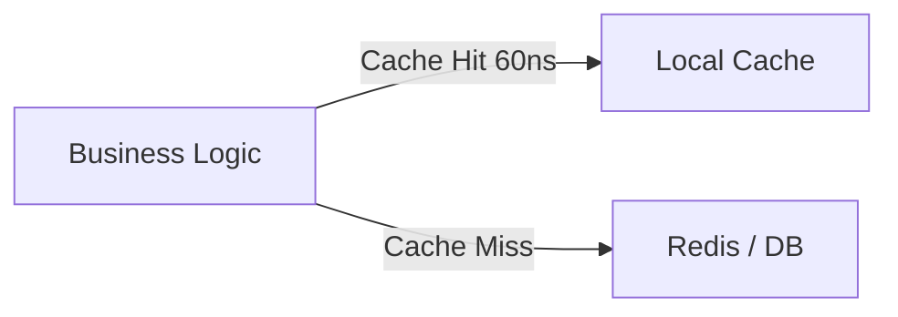
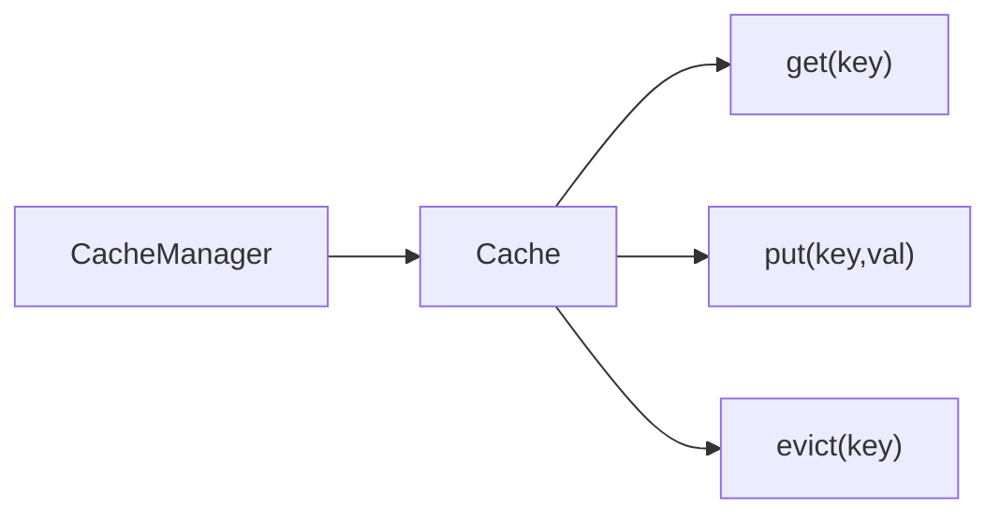
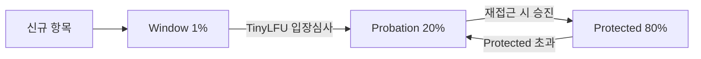
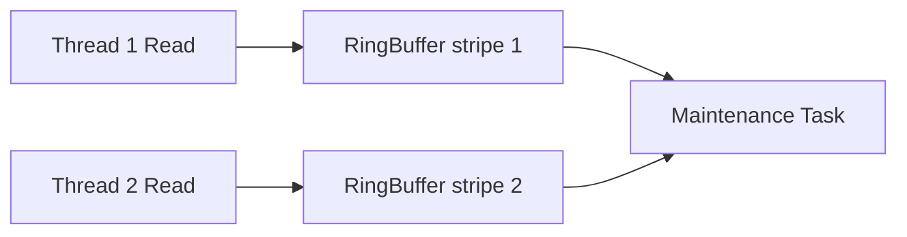
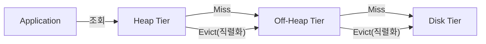

## 로컬 캐시란? — 메모리 계층과 속도의 본질

> 비유: 로컬 캐시는 책상 위의 메모장이다. 필요한 정보를 이미 적어뒀으면 도서관(DB/Redis)에 가지 않아도 된다. 단, 다른 사람의 메모장과 내용이 다를 수 있다. 그리고 메모장이 꽉 차면 오래된 메모를 지워야 한다 — 이때 **어떤 메모를 지울 것인가**가 캐시 알고리즘의 핵심이다.

로컬 캐시(Local Cache)는 애플리케이션 프로세스 **내부 메모리(Heap 또는 Off-Heap)**에 데이터를 저장하는 캐시다. Redis·Memcached 같은 외부 캐시와 달리 네트워크 왕복이 없어 **나노초~마이크로초** 수준의 응답 시간을 달성할 수 있다.

왜 이렇게 빠른가? CPU 메모리 계층 구조 때문이다:

```
L1 Cache  ~1ns    — CPU 코어 내부, 수십 KB
L2 Cache  ~4ns    — CPU 코어 내부, 수백 KB
L3 Cache  ~10ns   — CPU 공유, 수 MB
DRAM      ~60ns   — JVM Heap이 사용하는 물리 메모리
SSD       ~100μs  — 디스크 I/O
Redis     ~1ms    — 네트워크 왕복 포함
DB 쿼리   ~5ms    — 네트워크 + 디스크 I/O
```

JVM Heap에 저장하는 로컬 캐시는 DRAM 접근 속도(~60ns)가 상한이다. Redis 호출(~1ms) 대비 **4자리수** 차이다. 1,000번 조회 시 Redis는 1초, 로컬 캐시는 0.06ms다.



### 로컬 캐시 vs 분산 캐시

| 항목 | 로컬 캐시 | 분산 캐시 (Redis 등) |
|------|-----------|----------------------|
| 응답 속도 | 나노초~마이크로초 | 수백 마이크로초~밀리초 |
| 데이터 공유 | 인스턴스별 독립 | 모든 인스턴스 공유 |
| 일관성 | 인스턴스 간 불일치 가능 | 단일 원본 |
| 운영 비용 | 없음 | 별도 서버 필요 |
| 용량 | JVM Heap 제한 | 서버 메모리만큼 |
| GC 영향 | 있음 (Heap 사용 시) | 없음 |
| 네트워크 장애 내성 | 높음 | 낮음 |
| 적합 대상 | 읽기 빈번, 변경 드문 데이터 | 세션, 실시간 공유 데이터 |

---

## Spring Cache Abstraction — AOP 프록시의 내부 구조

Spring은 `spring-context` 모듈에 **캐시 추상화 레이어**를 제공한다. 구체적인 캐시 구현체(Caffeine, Ehcache 등)와 비즈니스 로직을 분리해 애노테이션만으로 캐싱을 적용할 수 있다.

### 핵심 인터페이스



- `CacheManager`: 캐시 저장소의 팩토리이자 레지스트리. `getCache(name)`으로 특정 캐시를 가져온다.
- `Cache`: 실제 데이터 저장/조회/삭제 인터페이스. Caffeine, Ehcache, Redis 등이 구현한다.

### AOP 프록시 동작 원리: CGLIB vs JDK Dynamic Proxy

`@EnableCaching`을 선언하면 Spring은 `CacheInterceptor`를 포함한 AOP 인프라를 초기화한다. 이때 **프록시 방식**이 두 가지다.

**JDK Dynamic Proxy**: 대상 클래스가 인터페이스를 구현할 때 사용. `java.lang.reflect.Proxy`가 런타임에 인터페이스를 구현하는 클래스를 생성한다. 인터페이스 메서드 호출만 인터셉트 가능하다.

**CGLIB Proxy**: 인터페이스 없이 클래스를 직접 상속해 서브클래스를 바이트코드 수준에서 생성한다. Spring Boot는 기본적으로 CGLIB을 사용한다(`proxyTargetClass=true`).

```java
// Spring이 내부적으로 생성하는 CGLIB 프록시 의사코드
public class ProductService$$EnhancerBySpringCGLIB extends ProductService {

    private CacheInterceptor cacheInterceptor;

    @Override
    public Product findById(Long productId) {
        // 1. 캐시 어드바이스 실행 전
        MethodInvocation invocation = createInvocation("findById", productId);

        // 2. CacheInterceptor.invoke() 호출
        //    → CacheManager에서 "products" 캐시 조회
        //    → 캐시 히트: 즉시 반환
        //    → 캐시 미스: super.findById(productId) 실행 후 캐시 저장
        return (Product) cacheInterceptor.invoke(invocation);
    }
}
```

호출 흐름을 구체적으로 보면:

```
클라이언트 → ProductService$$CGLIB.findById()
              → CacheInterceptor.invoke()
                → CacheAspectSupport.execute()
                  → CacheManager.getCache("products")
                  → cache.get(key)
                  → [캐시 히트] 반환
                  → [캐시 미스] super.findById() 호출 → cache.put(key, result)
```

### Self-Invocation 문제 — 왜 프록시를 우회하는가

Spring Cache는 AOP 프록시 기반이므로 **같은 클래스 내부에서 호출하면 캐시가 동작하지 않는다.**

```java
@Service
public class ProductService {

    // 외부에서 호출 → CGLIB 프록시 거침 → 캐시 동작 O
    @Cacheable("products")
    public Product findById(Long id) {
        return productRepository.findById(id).orElseThrow();
    }

    public Product findByIdWithSomeLogic(Long id) {
        // this.findById() → this는 실제 ProductService 객체 참조
        // → CGLIB 프록시를 거치지 않음 → 캐시 동작 X
        return this.findById(id);
    }
}
```

**왜 우회되는가?** `this.findById(id)`에서 `this`는 CGLIB 프록시가 아니라 원본 `ProductService` 인스턴스다. Spring IoC 컨테이너가 주입하는 빈은 프록시지만, 프록시 내부에서 `super.someMethod()`를 호출하면 원본 클래스의 메서드가 직접 실행된다.

**해결 방법:**

```java
@Service
@RequiredArgsConstructor
public class ProductService {

    // 방법 1: ApplicationContext에서 프록시 빈 직접 조회
    private final ApplicationContext applicationContext;

    public Product findByIdWithSomeLogic(Long id) {
        // 컨테이너에서 프록시 빈을 꺼내면 캐시 동작
        ProductService self = applicationContext.getBean(ProductService.class);
        return self.findById(id);
    }

    // 방법 2: 별도 클래스로 분리 (권장)
    // CacheableProductService.findById() → ProductService.findByIdInternal()
    // 계층을 분리하면 self-invocation 문제 원천 차단
}
```

### 주요 애노테이션 동작 원리

#### @Cacheable — 캐시 히트 우선 실행

```java
@Service
public class ProductService {

    /**
     * key SpEL: #productId → 파라미터 값 사용
     * condition: 메서드 실행 전 평가 (productId > 0이면 캐싱 시도)
     * unless: 메서드 실행 후 평가 (#result == null이면 캐싱 안 함)
     */
    @Cacheable(
        cacheNames = "products",
        key = "#productId",
        condition = "#productId > 0",
        unless = "#result == null"
    )
    public Product findById(Long productId) {
        // 캐시 미스 시에만 실행됨
        return productRepository.findById(productId).orElse(null);
    }
}
```

내부 동작 순서:
1. `condition` 평가 → false면 캐시 조회 자체를 건너뜀
2. `CacheManager.getCache("products").get(productId)` 호출
3. 히트: 캐시 값 즉시 반환
4. 미스: 원본 메서드 실행
5. `unless` 평가 → false이면 `cache.put(productId, result)` 실행

#### @CachePut — 항상 실행 후 캐시 갱신

```java
@CachePut(cacheNames = "products", key = "#product.id")
public Product update(Product product) {
    // 항상 실행됨 (캐시 히트여도)
    return productRepository.save(product);
}
```

`@Cacheable`과의 차이: 캐시 히트 여부와 관계없이 메서드를 항상 실행하고, 반환값으로 캐시를 갱신한다. 쓰기 작업 후 캐시 정합성 유지에 사용한다.

#### @CacheEvict — 캐시 삭제와 타이밍

```java
// 메서드 실행 후 삭제 (기본) — 메서드 성공 시 삭제
@CacheEvict(cacheNames = "products", key = "#productId")
public void delete(Long productId) {
    productRepository.deleteById(productId);
}

// 메서드 실행 전 삭제 — 예외 발생해도 캐시는 이미 삭제됨
@CacheEvict(cacheNames = "products", key = "#productId", beforeInvocation = true)
public void deleteWithForce(Long productId) {
    productRepository.deleteById(productId);
    // 예외 발생해도 캐시 삭제는 이미 완료
}

// 전체 삭제
@CacheEvict(cacheNames = "products", allEntries = true)
public void deleteAll() {
    productRepository.deleteAll();
}
```

`beforeInvocation = true`를 써야 하는 경우: 메서드 실행 중 예외가 발생해도 캐시를 반드시 무효화해야 할 때. 기본값(`false`)은 메서드 성공 후에만 삭제하므로 예외 발생 시 캐시가 남는다.

#### @Caching — 복합 캐시 조작

```java
@Caching(
    put = {
        @CachePut(cacheNames = "products", key = "#product.id"),
        @CachePut(cacheNames = "productsByName", key = "#product.name")
    },
    evict = {
        @CacheEvict(cacheNames = "productList", allEntries = true)
    }
)
public Product save(Product product) {
    return productRepository.save(product);
}
```

### Spring Cache 활성화

```java
@Configuration
@EnableCaching  // 필수: CacheInterceptor AOP 인프라 초기화
public class CacheConfig {
    // @EnableCaching은 내부적으로 CachingConfigurationSelector를 import하고
    // ProxyCachingConfiguration → BeanFactoryCacheOperationSourceAdvisor를 등록한다
}
```

---

## ConcurrentMapCache — Spring 기본 구현체

`ConcurrentMapCache`는 Spring이 기본으로 제공하는 캐시 구현체다. 내부적으로 `ConcurrentHashMap<Object, Object>`를 사용한다.

### 내부 구조와 한계

```java
// ConcurrentMapCache 핵심 구조 (Spring 소스 참고)
public class ConcurrentMapCache extends AbstractValueAdaptingCache {

    private final ConcurrentMap<Object, Object> store;

    // get: 단순 map.get() — O(1) 해시 조회
    @Override
    protected Object lookup(Object key) {
        return this.store.get(key);
    }

    // put: 단순 map.put() — 크기 제한 없음!
    @Override
    public void put(Object key, @Nullable Object value) {
        this.store.put(key, toStoreValue(value));
    }
}
```

`ConcurrentHashMap`은 세그먼트(버킷) 단위로 락을 잡아 동시성을 처리한다. 조회는 락 없이 가능하고, 쓰기는 해당 버킷만 락을 잡는다. 따라서 순수 처리량은 높지만:

- **Eviction 정책 없음**: 크기 제한이 없어 메모리 무한 증가 → JVM OOM 위험
- **TTL 없음**: 만료 기능이 없어 오래된 데이터가 영구 잔존
- **통계 없음**: 히트율 등 모니터링 불가

```java
// SimpleCacheManager로 등록
@Configuration
@EnableCaching
public class SimpleCacheConfig {

    @Bean
    public CacheManager cacheManager() {
        SimpleCacheManager cacheManager = new SimpleCacheManager();
        cacheManager.setCaches(List.of(
            new ConcurrentMapCache("products"),
            new ConcurrentMapCache("users")
        ));
        return cacheManager;
    }
}
```

운영 환경에서는 절대 사용하지 않는다. 테스트·개발 환경에서 의존성 없이 빠르게 캐시 레이어를 구성할 때만 적합하다.

---

## W-TinyLFU 알고리즘 심층 분석

Caffeine의 핵심이다. W-TinyLFU를 이해하지 않으면 Caffeine을 올바르게 운영할 수 없다.

### LRU의 근본적 문제: 스캔 오염과 일회성 접근

기존 LRU(Least Recently Used)는 **최근성**만 본다. 최근에 접근했으면 보호하고, 오래됐으면 제거한다.

문제는 두 가지다:

**스캔 오염(Scan Pollution)**: 배치 작업이 1억 개의 레코드를 순차 스캔하면, LRU는 이 모든 데이터를 "최근 접근"으로 분류해 캐시에 올린다. 그 결과 기존에 자주 사용하던 Hot 데이터가 전부 밀려난다. 배치가 끝난 후 캐시 히트율이 급락한다.

**일회성 접근 문제(One-Hit Wonder)**: 크롤러나 봇이 무수히 많은 서로 다른 URL을 한 번씩만 조회하면, LRU는 이것들을 캐시에 올려 기존 Hot 데이터를 밀어낸다.

### Count-Min Sketch: 빈도 추정의 핵심

W-TinyLFU는 각 항목의 접근 빈도를 추적해야 한다. 하지만 캐시 항목마다 카운터 하나씩 두면 캐시만큼의 추가 메모리가 필요하다. **Count-Min Sketch**는 이 문제를 확률적 자료구조로 해결한다.

아이디어: 다수의 해시 함수를 사용해 2차원 배열에 카운트를 기록하고, 추정 시 최솟값을 취한다.

```
4개의 해시 함수 × 16개 버킷 = Count-Min Sketch 구조

행(해시함수)  버킷 0  버킷 1  버킷 2  버킷 3  ...  버킷 15
hash1        [  3  ][  0  ][  7  ][  1  ]      [  2  ]
hash2        [  2  ][  5  ][  0  ][  4  ]      [  6  ]
hash3        [  8  ][  1  ][  3  ][  0  ]      [  1  ]
hash4        [  0  ][  2  ][  6  ][  3  ]      [  4  ]
```

항목 X의 빈도 추정: `min(hash1[h1(X)], hash2[h2(X)], hash3[h3(X)], hash4[h4(X)])`

최솟값을 취하는 이유: 해시 충돌로 같은 버킷에 다른 항목이 카운트를 더했을 수 있다. 모든 행의 값이 오버카운트될 수 있으므로, 최솟값이 가장 정확한 하한(lower bound) 추정이다.

### 4-bit 카운터: 메모리 극한 최적화

Caffeine의 `FrequencySketch`는 **4-bit 카운터**를 사용한다. 일반적인 int(32-bit)가 아니라 4비트만 써서 long 하나에 카운터 16개를 패킹한다.

```
long value: [c15][c14][c13][c12][c11][c10][c9][c8][c7][c6][c5][c4][c3][c2][c1][c0]
각 c: 4비트 → 최대값 15
```

왜 4비트인가? 실험적으로 15 이상의 빈도는 더 이상 의미 있는 차이를 만들지 않는다. Zipf 분포 환경에서 상위 Hot 항목들이 수천 번 접근해도 상대적 순서만 유지하면 되므로 15로 cap해도 충분하다. 메모리는 8배 절약된다.

```java
// FrequencySketch 내부 (Caffeine 소스 참고)
final class FrequencySketch<E> {

    // long[] table: 각 long에 4비트 카운터 16개가 패킹됨
    long[] table;
    int sampleSize;  // 리셋 임계값
    int size;        // 현재 기록된 총 이벤트 수

    // 빈도 증가
    public void increment(E e) {
        int hash = spread(e.hashCode());
        // 4개의 해시 함수로 4개 버킷 위치 계산
        // 각 위치의 4비트 카운터를 +1 (최대 15에서 포화)
        // ...
        if (++size == sampleSize) {
            reset(); // 주기적 리셋 (halving)
        }
    }

    // 빈도 조회
    public int frequency(E e) {
        // 4개 버킷의 4비트 카운터 중 최솟값 반환
    }
}
```

### Bloom Filter 리셋: 주기적 절반 감소(Halving)

Count-Min Sketch의 카운터는 계속 증가한다. 오래전에 자주 접근했지만 지금은 접근하지 않는 항목이 높은 빈도를 유지하면, 현재 Hot한 신규 항목이 밀려난다. **최신성(recency)을 반영해야 한다.**

Caffeine의 해결책은 **주기적 절반 감소(Periodic Halving)**다. `sampleSize`(캐시 크기의 10배)만큼 접근이 발생하면 모든 카운터를 2로 나눈다.

```java
// FrequencySketch.reset() 내부 로직 (의사코드)
void reset() {
    for (int i = 0; i < table.length; i++) {
        // 각 long의 4비트 카운터를 모두 >> 1 (절반으로)
        // 비트마스크를 사용해 각 4비트 필드를 독립적으로 처리
        table[i] = (table[i] >>> 1) & RESET_MASK;
    }
    size = (sampleSize >>> 1); // size도 절반으로
}
```

이 메커니즘이 "Bloom Filter와 유사하다"고 불리는 이유: 오래된 정보를 점진적으로 소거함으로써 최신 접근 패턴을 더 잘 반영한다. 완전한 리셋이 아니라 절반 감소이므로 기존 빈도 정보를 완전히 버리지 않는다.

### Window Cache → Probation → Protected: 3구역 구조



**Window Cache (전체의 1%)**: 새로 들어온 항목이 처음 머무는 곳. LRU 정책으로 관리된다. 이 구역의 목적은 완전히 새로운 항목에게 **진입 기회를 보장**하는 것이다. 아직 빈도 데이터가 없는 항목을 바로 TinyLFU로 심사하면 무조건 탈락하기 때문이다.

**Probation (Main Cache의 20%)**: Window에서 넘어온 항목 또는 Protected에서 강등된 항목이 머무는 "관찰 구역". Eviction의 1차 후보다.

**Protected (Main Cache의 80%)**: Probation에 있다가 한 번 더 접근된 항목이 승진하는 "안전 구역". Eviction으로부터 보호받는다.

### TinyLFU 입장 심사: Candidate vs Victim 비교

새 항목이 Window를 넘쳐 Main Cache에 진입하려 할 때, 이미 Probation에 있는 **Victim(희생자 후보)**와 빈도를 비교한다.

```
Candidate 빈도 = FrequencySketch.frequency(candidate)
Victim 빈도 = FrequencySketch.frequency(victim)

if (Candidate > Victim) → Candidate 입장, Victim 퇴출
if (Candidate <= Victim) → Candidate 퇴출, Victim 유지
```

이 비교가 LRU의 스캔 오염을 막는 이유: 스캔 중인 항목은 딱 한 번 접근되어 빈도가 낮다. 기존에 자주 사용되던 항목의 빈도가 높으므로 스캔 항목이 입장 심사에서 탈락한다. 기존 Hot 데이터가 보호된다.

### 수학적 보장: 왜 W-TinyLFU가 LRU보다 히트율이 높은가

LFU는 최적 정책(OPT)에 근접한 이론적 특성을 갖는다. Zipf 분포(현실적인 접근 패턴)에서 상위 k%의 항목이 전체 트래픽의 대부분을 차지한다. 빈도 기반 교체는 이 Hot 항목들을 캐시에 유지하는 확률이 LRU보다 높다.

실험적 수치: Zipf 분포, 캐시 크기 = 전체의 10%일 때:
- W-TinyLFU: ~93% 히트율
- LRU: ~86% 히트율
- FIFO: ~78% 히트율

---

## Caffeine 내부 구현: 동시성과 버퍼

### 왜 락 없이 고처리량이 가능한가: Read Buffer

Caffeine의 놀라운 점은 읽기 시 **락을 거의 사용하지 않는다**는 것이다. 그러나 W-TinyLFU는 읽기마다 FrequencySketch를 업데이트해야 한다. 이 두 가지가 어떻게 양립하는가?

**해답: Striped Ring Buffer (읽기 버퍼)**



각 읽기 이벤트를 즉시 FrequencySketch에 반영하지 않고, **스트라이프된 링 버퍼(Striped Ring Buffer)**에 쌓는다. 버퍼가 가득 차거나 일정 조건이 되면 **백그라운드 Maintenance 태스크**가 버퍼를 드레인해 FrequencySketch와 LRU 포인터를 일괄 업데이트한다.

스트라이핑(Striping): 스레드 ID를 해싱해 여러 버퍼 중 하나를 선택한다. 스레드들이 서로 다른 버퍼에 쓰므로 경합(contention)이 최소화된다.

```java
// Caffeine 내부 BoundedLocalCache (의사코드)
final class BoundedLocalCache<K, V> {

    // 읽기 버퍼: 스레드별 Ring Buffer (striped)
    final Buffer<Node<K, V>>[] readBuffer;

    // 쓰기 버퍼: MPSC Queue (Multiple Producer, Single Consumer)
    final MpscGrowableArrayQueue<Runnable> writeBuffer;

    V get(K key) {
        Node<K, V> node = data.get(key); // ConcurrentHashMap 조회 - 락 없음
        if (node != null) {
            // 읽기 이벤트를 버퍼에 비동기적으로 기록
            // 버퍼가 가득 찼으면 드롭 (일부 이벤트 손실은 허용)
            readBuffer[stripe(Thread.currentThread())].offer(node);

            // 드레인 필요 여부 확인 후 maintenance 스케줄링
            scheduleDrainBuffers();
        }
        return node == null ? null : node.value;
    }
}
```

**읽기 이벤트가 일부 드롭되어도 괜찮은 이유**: FrequencySketch는 **근사 알고리즘**이다. 정확한 카운트가 아니라 상대적 순서(어느 항목이 더 자주 접근되는가)만 알면 된다. 소수의 이벤트 손실은 히트율에 통계적으로 유의미한 영향을 주지 않는다.

### Write Buffer: MPSC Queue

쓰기(put, evict) 이벤트는 읽기보다 중요하다. 손실되면 캐시 상태가 실제와 달라진다. Caffeine은 **MPSC(Multiple Producer, Single Consumer) Queue**를 쓰기 버퍼로 사용한다. 여러 스레드가 동시에 쓰기 이벤트를 큐에 넣고, 단일 Maintenance 태스크가 소비한다.

### Maintenance 태스크 스케줄링

읽기/쓰기 버퍼를 드레인하고, TTL 만료 항목을 제거하고, W-TinyLFU 상태를 업데이트하는 **Maintenance 태스크**는 다음 조건에서 트리거된다:
- 쓰기 버퍼가 일정 크기(기본 16개) 초과
- 읽기 버퍼가 가득 참
- 타이머 기반 만료 확인 주기 도달

태스크는 **호출 스레드(caller thread)**에서 실행되거나, 공유 ForkJoinPool에서 실행된다. 전용 백그라운드 스레드를 두지 않아 스레드 오버헤드가 없다.

---

## Caffeine Cache — 실전 사용

> 비유: Caffeine의 W-TinyLFU는 도서관 사서가 "어제도 빌려간 책, 그제도 빌려간 책"을 데스크 앞에 꺼내두는 것이다. 어제 한 번만 빌린 책은 서가에 돌려보낸다.

### 의존성

```xml
<!-- Maven: Spring Boot는 BOM으로 버전 관리 -->
<dependency>
    <groupId>com.github.ben-manes.caffeine</groupId>
    <artifactId>caffeine</artifactId>
    <!-- Spring Boot BOM이 버전 관리, 직접 명시 불필요 -->
</dependency>

<dependency>
    <groupId>org.springframework.boot</groupId>
    <artifactId>spring-boot-starter-cache</artifactId>
</dependency>
```

### Caffeine 직접 사용 (Spring 없이)

```java
// 기본 캐시 (LoadingCache: 미스 시 자동 로딩)
LoadingCache<Long, Product> cache = Caffeine.newBuilder()
    .maximumSize(10_000)                          // 최대 항목 수 (항목 기반)
    .expireAfterWrite(10, TimeUnit.MINUTES)        // 쓰기 후 TTL
    .expireAfterAccess(5, TimeUnit.MINUTES)        // 마지막 접근 후 TTL
    .refreshAfterWrite(1, TimeUnit.MINUTES)        // 백그라운드 갱신
    .recordStats()                                 // 통계 수집
    .removalListener((key, value, cause) ->
        log.info("Removed: key={}, cause={}", key, cause)) // 퇴출 리스너
    .build(key -> productRepository.findById(key).orElseThrow());

// 조회 (없으면 null)
Product product = cache.getIfPresent(1L);

// 조회 + 없으면 CacheLoader 실행
Product product2 = cache.get(1L); // null 반환 안 함

// 조회 + 없으면 람다 실행 (per-call 로더)
Product product3 = cache.get(1L, key -> productRepository.findById(key).orElseThrow());

// 저장
cache.put(1L, product);

// 삭제
cache.invalidate(1L);
cache.invalidateAll(List.of(1L, 2L, 3L));
cache.invalidateAll();

// 통계
CacheStats stats = cache.stats();
log.info("히트율: {:.1f}%", stats.hitRate() * 100);
log.info("미스 횟수: {}", stats.missCount());
log.info("퇴출 횟수: {}", stats.evictionCount());
log.info("평균 로딩 시간: {}ns", (long) stats.averageLoadPenalty());
```

### 가중치 기반 크기 제한 (maximumWeight)

항목 개수가 아닌 **메모리 크기** 기준으로 제한할 때 사용한다.

```java
Cache<Long, byte[]> binaryCache = Caffeine.newBuilder()
    .maximumWeight(256 * 1024 * 1024L) // 256MB 총 가중치 제한
    .weigher((Long key, byte[] value) -> value.length) // 항목 가중치 = 바이트 수
    .expireAfterWrite(10, TimeUnit.MINUTES)
    .build();
```

### AsyncLoadingCache — 비동기 캐시

블로킹 없이 비동기 로딩이 필요할 때 사용한다.

```java
AsyncLoadingCache<Long, Product> asyncCache = Caffeine.newBuilder()
    .maximumSize(10_000)
    .expireAfterWrite(10, TimeUnit.MINUTES)
    .buildAsync(key ->
        // 비동기 로더: CompletableFuture 반환
        CompletableFuture.supplyAsync(
            () -> productRepository.findById(key).orElseThrow(),
            executor
        )
    );

// CompletableFuture<Product> 반환 — 블로킹 없음
CompletableFuture<Product> future = asyncCache.get(1L);
future.thenAccept(product -> log.info("로드 완료: {}", product.getName()));

// Spring WebFlux와 통합
public Mono<Product> findByIdReactive(Long id) {
    return Mono.fromFuture(asyncCache.get(id));
}
```

### refreshAfterWrite vs expireAfterWrite — 응답 시간 차이

```
expireAfterWrite 10m:
  0분: cache.put(key, value)
  10분: TTL 만료 → 다음 접근 시 캐시 미스
       → 로딩 완료까지 요청 블로킹 (latency spike)
       → 로딩 완료 후 cache.put()

refreshAfterWrite 1m:
  0분: cache.put(key, value)
  1분: 갱신 기한 도달 → 다음 접근 시 즉시 기존 값 반환
       → 백그라운드에서 새 값 비동기 로딩
       → 로딩 완료 후 cache.put()
       → 이후 요청부터 새 값 반환
```

읽기 레이턴시 SLA가 엄격한 서비스에서는 `refreshAfterWrite`를 사용한다. 최대 한 주기만큼 약간 오래된 데이터를 반환하는 것을 허용하는 대신, latency spike를 제거한다.

### Spring Boot 통합

**Java Config 방식 (권장: 캐시별 개별 설정)**

```java
@Configuration
@EnableCaching
public class CaffeineConfig {

    @Bean
    public CacheManager cacheManager() {
        SimpleCacheManager manager = new SimpleCacheManager();
        manager.setCaches(List.of(
            // 상품: 빈번 조회, 짧은 TTL
            buildCache("products", 10_000, Duration.ofMinutes(10)),
            // 사용자: 중간 빈도, 중간 TTL
            buildCache("users", 5_000, Duration.ofMinutes(30)),
            // 설정: 드문 조회, 긴 TTL
            buildCache("configs", 100, Duration.ofHours(1))
        ));
        return manager;
    }

    private CaffeineCache buildCache(String name, long maxSize, Duration ttl) {
        return new CaffeineCache(name,
            Caffeine.newBuilder()
                .maximumSize(maxSize)
                .expireAfterWrite(ttl)
                .recordStats()  // 반드시 활성화: 히트율 모니터링 필수
                .build()
        );
    }
}
```

**application.yml 방식 (전체 공통 설정)**

```yaml
spring:
  cache:
    type: caffeine
    caffeine:
      spec: maximumSize=1000,expireAfterWrite=10m,recordStats
```

**Caffeine Spec 전체 문자열 레퍼런스**

```
maximumSize=N              최대 항목 수
maximumWeight=N            최대 가중치 합계 (weigher와 함께 사용)
expireAfterWrite=Nd/h/m/s  쓰기 후 N일/시/분/초
expireAfterAccess=Nm       마지막 접근 후 N분 (슬라이딩 TTL)
refreshAfterWrite=Nm       쓰기 후 N분마다 백그라운드 갱신
weakKeys                   키를 WeakReference (GC 대상)
weakValues                 값을 WeakReference (GC 대상)
softValues                 값을 SoftReference (메모리 부족 시 GC)
recordStats                통계 수집 활성화
```

---

## Off-Heap 메모리: GC가 보지 못하는 메모리

### JVM 메모리 구조와 GC의 한계

JVM GC는 **Heap 내의 객체만** 추적한다. 구체적으로는 GC Root(스택 프레임, 스태틱 필드, JNI 참조)에서 시작해 참조 그래프를 따라 도달 가능한 객체를 "살아있는 객체"로 마킹한다. 이 마킹 단계가 Heap 크기에 비례해 오래 걸린다.

**Off-Heap(네이티브 메모리)**은 이 GC 스캔 범위 밖이다. JVM이 아닌 **OS가 직접 관리하는 메모리**다. GC는 Off-Heap의 존재를 모른다.

```
JVM 메모리 구조:

[  JVM Process  ]
├── Heap (GC 관리)
│   ├── Young Generation (Eden, S0, S1)
│   └── Old Generation
├── Metaspace (클래스 메타데이터, GC 관리)
├── Code Cache (JIT 컴파일 코드, GC 관리)
└── Off-Heap / Direct Memory (OS 관리, GC 대상 아님!)
    └── DirectByteBuffer가 가리키는 네이티브 메모리
```

### DirectByteBuffer 내부 구조

Java에서 Off-Heap 메모리에 접근하는 표준 방법은 `DirectByteBuffer`다.

```java
// DirectByteBuffer 할당
ByteBuffer buffer = ByteBuffer.allocateDirect(256 * 1024 * 1024); // 256MB

// 내부 동작:
// 1. sun.misc.Unsafe.allocateMemory(size) 호출
//    → OS에서 네이티브 메모리 할당
//    → 해당 메모리의 주소(포인터)를 long address 필드에 저장
// 2. Cleaner 객체 등록 (WeakReference 기반)
//    → DirectByteBuffer 객체가 GC될 때 Cleaner가 트리거됨
//    → Cleaner가 Unsafe.freeMemory(address) 호출해 네이티브 메모리 해제
```

**Cleaner 메커니즘**: `DirectByteBuffer`는 Heap 객체지만, 실제 데이터는 네이티브 메모리에 있다. Heap 객체가 GC될 때 `Cleaner`(PhantomReference 기반)가 감지해 `Unsafe.freeMemory()`를 호출한다. 이것이 Off-Heap 메모리 해제 메커니즘이다.

```
Heap의 DirectByteBuffer 객체
  └── long address = 0x7f3a40000000  // 네이티브 메모리 주소
  └── Cleaner(PhantomReference<DirectByteBuffer>)
            │
            └── GC가 DirectByteBuffer 회수 시
                → ReferenceQueue에 Cleaner 등록
                → Cleaner 스레드가 감지
                → Unsafe.freeMemory(address) 호출
                → 네이티브 메모리 해제
```

**주의**: `DirectByteBuffer` Heap 객체가 Young GC에서 살아남으면 Old Generation으로 이동한다. Old Generation의 GC 주기는 길다. 그 사이 네이티브 메모리는 해제되지 않는다. 대용량 DirectByteBuffer를 빠르게 생성/소멸하는 패턴은 네이티브 메모리 고갈로 이어진다. `-XX:MaxDirectMemorySize`로 상한을 설정해야 한다.

---

## Ehcache 3 — 계층형 스토리지 심층 분석

> 비유: Ehcache는 3단 서랍장이다. 손이 자주 가는 것은 첫 번째 서랍(Heap), 덜 쓰는 것은 두 번째(Off-Heap), 오래 보관해야 하는 것은 바닥 서랍(Disk). 서랍이 꽉 차면 위 서랍 항목을 아래로 내린다.

### 계층 구조와 데이터 흐름



**접근 속도**: Heap(~60ns) >> Off-Heap(~200ns, 역직렬화 포함) >> Disk(~100μs)

데이터는 **항상 최상위 계층에서 먼저 조회**된다. Heap Miss → Off-Heap Miss → Disk 조회 순서다.

### 계층 간 Eviction 상세 흐름

Heap이 가득 찰 때 일어나는 일:

1. Eviction Policy(기본: LRU)가 Heap에서 제거할 항목 선택
2. 해당 항목을 **직렬화**해 Off-Heap에 기록
3. Heap에서 해당 항목 제거

Off-Heap이 가득 찰 때:
1. Off-Heap에서 제거할 항목 선택
2. 직렬화(이미 되어 있음)해 Disk에 기록
3. Off-Heap에서 제거

Off-Heap 또는 Disk에서 데이터를 읽어올 때 (Heap Miss):
1. Off-Heap 또는 Disk에서 직렬화된 바이트 읽기
2. **역직렬화**해 Java 객체 생성
3. Heap에 적재 (Heap 공간 확보 후)
4. 반환

**직렬화가 성능 병목이 되는 이유**: Off-Heap/Disk에는 Java 객체를 그대로 저장할 수 없다. GC가 관리하는 Heap 포인터를 Off-Heap에 저장하면 GC가 해당 객체를 추적하지 못해 해제할 수 있기 때문이다. Off-Heap/Disk에는 반드시 **바이트 배열(직렬화된 형태)**로 저장해야 한다.

### 직렬화 성능 최적화

Ehcache 기본 직렬화는 Java 표준 직렬화(`ObjectOutputStream`)다. 느리고 크다. 고성능 직렬화기를 플러그인할 수 있다.

```java
// 의존성 추가
// <dependency>
//   <groupId>org.ehcache</groupId>
//   <artifactId>ehcache</artifactId>
//   <classifier>jakarta</classifier>
// </dependency>

@Configuration
@EnableCaching
public class EhcacheConfig {

    @Bean
    public javax.cache.CacheManager jCacheCacheManager() throws Exception {
        EhcacheCachingProvider provider = (EhcacheCachingProvider)
            Caching.getCachingProvider("org.ehcache.jsr107.EhcacheCachingProvider");

        // Off-Heap 사용 시 직렬화 필수: Product는 Serializable 구현 필요
        CacheConfiguration<Long, Product> config =
            CacheConfigurationBuilder.newCacheConfigurationBuilder(
                Long.class, Product.class,
                ResourcePoolsBuilder.newResourcePoolsBuilder()
                    .heap(1_000, EntryUnit.ENTRIES)
                    .offheap(512, MemoryUnit.MB)
            )
            .withExpiry(ExpiryPolicyBuilder.timeToLiveExpiration(Duration.ofMinutes(10)))
            .build();

        org.ehcache.config.Configuration ehcacheConfig =
            CacheManagerBuilder.newCacheManagerBuilder()
                .withCache("products", config)
                .asConfiguration();

        return provider.getCacheManager(ehcacheConfig);
    }

    @Bean
    public CacheManager cacheManager(javax.cache.CacheManager jCacheCacheManager) {
        return new JCacheCacheManager(jCacheCacheManager);
    }
}
```

### 3계층 풀 구성 (Heap + Off-Heap + Disk)

```java
PersistentCacheManager persistentManager = CacheManagerBuilder.newCacheManagerBuilder()
    .with(CacheManagerBuilder.persistence("/var/cache/myapp"))  // Disk 경로
    .withCache("products",
        CacheConfigurationBuilder.newCacheConfigurationBuilder(
            Long.class, Product.class,
            ResourcePoolsBuilder.newResourcePoolsBuilder()
                .heap(1_000, EntryUnit.ENTRIES)    // Heap: 1000개 항목
                .offheap(512, MemoryUnit.MB)        // Off-Heap: 512MB
                .disk(10, MemoryUnit.GB, true)      // Disk: 10GB, 영속(재시작 후 유지)
        )
        .withExpiry(ExpiryPolicyBuilder.timeToLiveExpiration(Duration.ofHours(1)))
    )
    .build(true);
```

**Disk Tier를 `true`(영속)로 설정하면**: JVM 재시작 후에도 Disk에 저장된 캐시 데이터가 유지된다. 웜업 비용이 큰 서비스(머신러닝 모델 피처, 대용량 설정 데이터)에 유용하다.

### XML 설정

```xml
<config xmlns:xsi='http://www.w3.org/2001/XMLSchema-instance'
        xmlns='http://www.ehcache.org/v3'
        xsi:schemaLocation="http://www.ehcache.org/v3
        http://www.ehcache.org/schema/ehcache-core.xsd">

    <cache alias="products">
        <key-type>java.lang.Long</key-type>
        <value-type>com.example.Product</value-type>
        <resources>
            <heap unit="entries">1000</heap>
            <offheap unit="MB">256</offheap>
        </resources>
        <expiry>
            <ttl unit="minutes">10</ttl>
        </expiry>
    </cache>

    <cache alias="users">
        <key-type>java.lang.Long</key-type>
        <value-type>com.example.User</value-type>
        <resources>
            <heap unit="entries">500</heap>
        </resources>
        <expiry>
            <ttl unit="minutes">30</ttl>
        </expiry>
    </cache>
</config>
```

```yaml
# application.yml
spring:
  cache:
    type: jcache
    jcache:
      config: classpath:ehcache.xml
```

---

## 캐시 워밍 전략: Lazy vs Eager

### 왜 Cache Warming이 필요한가

애플리케이션이 시작되면 로컬 캐시는 비어있다. 첫 요청들은 모두 Cache Miss로 DB나 Redis에 부하를 준다. 대규모 트래픽 환경에서는 이 **Cold Start 구간**에 DB가 과부하되거나 응답 시간이 급등할 수 있다.

### Lazy Loading (지연 로딩)

기본 `@Cacheable` 동작이다. 첫 요청이 들어왔을 때 캐시 미스가 발생하고 그때 로딩한다. 구현이 단순하나 Cold Start 구간의 응답 시간이 나쁘다.

### Eager Loading — ApplicationReadyEvent 타이밍

**ApplicationReadyEvent**는 Spring Boot 완전 초기화(Bean 생성, DB 연결, 포트 바인딩) 후 발생한다. 이 시점이 캐시 워밍의 올바른 타이밍이다.

왜 `@PostConstruct`나 `ApplicationRunner`가 아닌가?

- `@PostConstruct`: Bean 생성 직후 실행. 다른 Bean이 아직 준비 안 됐을 수 있다. DB 연결이 확립되지 않은 상태일 수 있다.
- `ApplicationRunner`: `ApplicationReadyEvent` 직전에 실행된다. 포트 바인딩은 완료됐지만, 실제 트래픽 수신은 `ApplicationReadyEvent` 이후다. 실용적으로 큰 차이는 없다.
- `ApplicationReadyEvent`: 완전 초기화 완료. 이 이벤트 핸들러 실행 중에는 외부 트래픽이 들어오지 않으므로 안전하게 워밍할 수 있다.

```java
@Component
@RequiredArgsConstructor
@Slf4j
public class CacheWarmer implements ApplicationListener<ApplicationReadyEvent> {

    private final ProductRepository productRepository;
    private final ProductService productService;

    @Override
    public void onApplicationEvent(ApplicationReadyEvent event) {
        log.info("Cache warming 시작...");
        long start = System.currentTimeMillis();

        try {
            warmProductCache();
            warmConfigCache();
        } catch (Exception e) {
            // 캐시 워밍 실패는 치명적이지 않음 — 로그만 남기고 계속 진행
            log.warn("Cache warming 부분 실패: {}", e.getMessage(), e);
        }

        log.info("Cache warming 완료: {}ms", System.currentTimeMillis() - start);
    }

    private void warmProductCache() {
        // 지난 30일 조회수 기준 상위 1000개 상품 사전 적재
        List<Long> hotProductIds = productRepository
            .findTopNIdsByViewCountLast30Days(1_000);

        // 병렬 로딩으로 워밍 시간 단축
        hotProductIds.parallelStream().forEach(id -> {
            try {
                productService.findById(id); // @Cacheable 호출 → 캐시에 적재
            } catch (Exception e) {
                log.warn("상품 ID {} 워밍 실패", id, e);
            }
        });

        log.info("상품 캐시 워밍 완료: {}개", hotProductIds.size());
    }

    private void warmConfigCache() {
        // 설정 데이터는 전체 로딩
        configService.findAll().forEach(config ->
            configService.findById(config.getId()) // @Cacheable 호출
        );
        log.info("설정 캐시 워밍 완료");
    }
}
```

### 스케줄 기반 재워밍

배포 후 점진적으로 캐시가 Hot해지는 것을 보완하기 위해 주기적 재워밍을 추가할 수 있다.

```java
@Component
@RequiredArgsConstructor
@Slf4j
public class ScheduledCacheRewarmer {

    private final CacheWarmer cacheWarmer;

    // 매일 새벽 3시 — 트래픽 최저점에 재워밍
    @Scheduled(cron = "0 0 3 * * *")
    public void rewarm() {
        log.info("정기 캐시 재워밍 시작");
        cacheWarmer.warmProductCache(); // 캐시 무효화 없이 덮어쓰기
    }
}
```

---

## 성능 비교

### 처리량 벤치마크 (Read-Heavy, Zipf 분포, JDK 17)

```
라이브러리                   처리량(ops/sec)     비고
ConcurrentMapCache      ~25,000,000      Eviction 없음 — 불공정 비교
Caffeine                ~22,000,000      W-TinyLFU, striped buffer
Guava Cache             ~14,000,000      LRU 변형, 단일 락
Ehcache 3 (Heap)        ~11,000,000      LRU, JCache 오버헤드
Ehcache 3 (Off-Heap)    ~7,000,000       직렬화/역직렬화 포함
```

### 캐시 히트율 (Zipf 분포, 캐시 = 데이터의 10%)

```
알고리즘                    히트율
W-TinyLFU (Caffeine)    ~93%
LRU (Ehcache, Guava)    ~86%
FIFO                    ~78%
```

W-TinyLFU가 LRU보다 7% 높은 히트율을 가지는 것은 실환경에서 큰 차이다. 캐시 서버 비용, DB 부하, 응답 시간 모두에 직접 영향을 준다.

### 혼합 워크로드 (Read 75%, Write 25%)

```
라이브러리           처리량(ops/s)   히트율
Caffeine           ~15,000,000    ~91%
Ehcache 3 (Heap)   ~8,000,000     ~85%
Guava Cache        ~9,000,000     ~84%
```

---

## 실무 선택 기준

### 선택 가이드

| 상황 | 추천 | 이유 |
|------|------|------|
| Spring Boot 신규 프로젝트 | Caffeine | 최고 히트율, 낮은 복잡도 |
| 캐시 크기가 Heap의 30% 초과 | Ehcache (Off-Heap) | GC 부담 없음 |
| 재시작 후 캐시 유지 필요 | Ehcache (Disk) | 영속 Disk Tier |
| Guava Cache 레거시 마이그레이션 | Caffeine | API 거의 동일 |
| 테스트/개발 환경 | ConcurrentMapCache | 설정 불필요 |
| JSR-107 표준 준수 필요 | Ehcache | JCache 완벽 구현 |

### Heap 사용량에 따른 선택

```
캐시 크기 < Heap의 10%:
  Caffeine → 단순, 고성능

캐시 크기 10~30% of Heap:
  Caffeine + G1GC 튜닝 → maximumSize 엄격히 설정

캐시 크기 > Heap의 30%:
  Ehcache Off-Heap → GC STW 증가 없음
  단, 직렬화 비용과 역직렬화 레이턴시 감수

캐시 크기 > 1GB 또는 재시작 후 유지 필요:
  Ehcache Off-Heap + Disk Tier
```

---

## 실전 설정 예제

### Caffeine + Spring Boot 완성 설정

```java
@Configuration
@EnableCaching
@RequiredArgsConstructor
public class CacheConfiguration {

    @Bean
    public CacheManager cacheManager() {
        SimpleCacheManager manager = new SimpleCacheManager();
        manager.setCaches(List.of(
            caffeineCache("products",  10_000, Duration.ofMinutes(10)),
            caffeineCache("users",      5_000, Duration.ofMinutes(30)),
            caffeineCache("configs",      100, Duration.ofHours(1))
        ));
        return manager;
    }

    private CaffeineCache caffeineCache(String name, long maxSize, Duration ttl) {
        return new CaffeineCache(name,
            Caffeine.newBuilder()
                .maximumSize(maxSize)
                .expireAfterWrite(ttl)
                .recordStats()  // 운영 환경에서 필수
                .removalListener((key, value, cause) -> {
                    if (cause.wasEvicted()) {
                        // Eviction은 캐시 크기 설정이 적합한지 모니터링 필요
                        log.debug("Evicted from {}: key={}, cause={}", name, key, cause);
                    }
                })
                .build()
        );
    }
}
```

### 캐시 통계 모니터링 (Actuator + Micrometer)

```yaml
# application.yml
management:
  endpoints:
    web:
      exposure:
        include: caches, metrics, health
  metrics:
    cache:
      caffeine:
        enabled: true
```

```java
// 커스텀 메트릭 등록
@Component
@RequiredArgsConstructor
public class CacheMetricsExporter {

    private final CacheManager cacheManager;
    private final MeterRegistry meterRegistry;

    @PostConstruct
    public void registerMetrics() {
        cacheManager.getCacheNames().forEach(cacheName -> {
            Cache cache = cacheManager.getCache(cacheName);
            if (cache instanceof CaffeineCache caffeineCache) {
                com.github.benmanes.caffeine.cache.Cache<Object, Object> nativeCache =
                    caffeineCache.getNativeCache();

                // Micrometer Caffeine 통합 (자동 등록)
                CaffeineCacheMetrics.monitor(meterRegistry, nativeCache, cacheName);
            }
        });
    }

    // 히트율 주기적 로깅 (운영 모니터링)
    @Scheduled(fixedDelay = 60_000)
    public void logCacheStats() {
        cacheManager.getCacheNames().forEach(cacheName -> {
            Cache cache = cacheManager.getCache(cacheName);
            if (cache instanceof CaffeineCache caffeineCache) {
                CacheStats stats = caffeineCache.getNativeCache().stats();
                log.info("[캐시 통계] name={}, hitRate={:.1f}%, evictions={}, size={}",
                    cacheName,
                    stats.hitRate() * 100,
                    stats.evictionCount(),
                    caffeineCache.getNativeCache().estimatedSize());

                // 히트율 < 50% → 캐시 크기 또는 TTL 재검토 신호
                if (stats.hitRate() < 0.5 && stats.requestCount() > 1000) {
                    log.warn("[캐시 경고] {} 히트율 저조: {:.1f}%", cacheName, stats.hitRate() * 100);
                }
            }
        });
    }
}
```

### Redis Pub/Sub 기반 다중 서버 캐시 무효화

```java
@Configuration
@RequiredArgsConstructor
public class CacheInvalidationConfig {

    private final CacheManager cacheManager;
    private final RedisTemplate<String, String> redisTemplate;

    private static final String CHANNEL = "cache:invalidate";

    // 무효화 이벤트 발행
    public void publishInvalidation(String cacheName, Object key) {
        String message = cacheName + ":" + key;
        redisTemplate.convertAndSend(CHANNEL, message);
    }

    // 무효화 이벤트 수신 (모든 서버에서 실행)
    @Bean
    public MessageListenerAdapter cacheInvalidationListener() {
        return new MessageListenerAdapter(
            (MessageListener) (message, pattern) -> {
                String body = new String(message.getBody());
                String[] parts = body.split(":", 2);
                if (parts.length == 2) {
                    Cache cache = cacheManager.getCache(parts[0]);
                    if (cache != null) {
                        cache.evict(parts[1]);
                        log.debug("캐시 무효화: {}:{}", parts[0], parts[1]);
                    }
                }
            }
        );
    }

    @Bean
    public RedisMessageListenerContainer listenerContainer(
            RedisConnectionFactory connectionFactory) {
        RedisMessageListenerContainer container = new RedisMessageListenerContainer();
        container.setConnectionFactory(connectionFactory);
        container.addMessageListener(
            cacheInvalidationListener(),
            new ChannelTopic(CHANNEL)
        );
        return container;
    }
}

// 서비스에서 사용
@Service
@RequiredArgsConstructor
public class ProductService {

    private final ProductRepository productRepository;
    private final CacheInvalidationConfig invalidationConfig;

    @CachePut(cacheNames = "products", key = "#product.id")
    @Transactional
    public Product update(Product product) {
        Product saved = productRepository.save(product);
        // 다른 서버의 로컬 캐시도 무효화
        invalidationConfig.publishInvalidation("products", product.getId().toString());
        return saved;
    }
}
```

---

## 실무에서 자주 하는 실수

### 실수 1: 사용자별 개인 데이터를 로컬 캐시에 저장

```java
// 나쁜 예 — 서버 A에서 로그인한 사용자 정보를 로컬 캐시에
@Cacheable("userSessions")
public UserInfo getSession(String sessionId) {
    return sessionStore.find(sessionId);
}
// → 서버 B로 라우팅되면 Cache Miss
// → 세션 데이터가 없으면 강제 로그아웃 처리될 수 있음

// 좋은 예 — 세션은 Redis(공유 저장소)에
// 로컬 캐시는 모든 서버에 동일한 데이터만 저장 (상품 정보, 공통 설정)
```

### 실수 2: maximumSize 미설정

```java
// 나쁜 예
Cache<Long, Product> cache = Caffeine.newBuilder().build();
// → 무한정 성장 → JVM OOM

// 좋은 예
Cache<Long, Product> cache = Caffeine.newBuilder()
    .maximumSize(10_000)              // 반드시 설정
    .expireAfterWrite(Duration.ofMinutes(10))
    .recordStats()
    .build();
```

### 실수 3: Self-Invocation으로 캐시 미작동

```java
// 나쁜 예
@Service
public class ProductService {
    @Cacheable("products")
    public Product findById(Long id) { ... }

    public List<Product> findByIds(List<Long> ids) {
        // this 호출 → 프록시 우회 → 캐시 미작동
        return ids.stream().map(this::findById).toList();
    }
}

// 좋은 예 — 클래스 분리
@Service
public class ProductService {
    private final ProductCacheService productCacheService; // 캐시 메서드를 별도 빈으로

    public List<Product> findByIds(List<Long> ids) {
        // 별도 빈 호출 → 프록시 거침 → 캐시 작동
        return ids.stream().map(productCacheService::findById).toList();
    }
}
```

### 실수 4: Off-Heap 사용 시 직렬화 누락

```java
// Ehcache Off-Heap 사용 시 value 클래스는 Serializable 필수
// 나쁜 예
public class Product { // Serializable 미구현
    private Long id;
    private String name;
    // ...
}

// 좋은 예
public class Product implements Serializable {
    private static final long serialVersionUID = 1L; // 버전 명시 필수
    private Long id;
    private String name;
    // Transient 필드: 직렬화에서 제외 (민감정보, 계산값)
    private transient BigDecimal calculatedDiscount;
}
```

### 실수 5: recordStats 없이 운영

```java
// 나쁜 예 — 히트율을 모르면 캐시가 효과 있는지 알 수 없음
Caffeine.newBuilder().maximumSize(1000).build();

// 좋은 예 — 항상 recordStats 활성화
Caffeine.newBuilder()
    .maximumSize(1000)
    .recordStats() // 운영 오버헤드 미미, 모니터링 필수
    .build();
// → Micrometer/Actuator로 히트율, 퇴출 수 실시간 확인
```

### 실수 6: TTL 없이 무기한 캐싱

```java
// 나쁜 예 — TTL 없음 → 데이터 변경 후 반영 안 됨
Caffeine.newBuilder().maximumSize(1000).build();

// 좋은 예 — 데이터 변경 주기에 맞는 TTL 설정
// 상품 정보(분 단위 변경): expireAfterWrite(5분)
// 공통 설정(일 단위 변경): expireAfterWrite(1시간)
// 실시간 재고(실시간): 로컬 캐시 부적합 → Redis
```

---

## Guava Cache (레거시)

Guava 라이브러리의 캐시 구현체. **현재는 Caffeine으로 대체됐으며** 신규 프로젝트에서는 사용하지 않는다.

```java
// Guava Cache
LoadingCache<Long, Product> cache = CacheBuilder.newBuilder()
    .maximumSize(1_000)
    .expireAfterWrite(10, TimeUnit.MINUTES)
    .recordStats()
    .build(new CacheLoader<>() {
        @Override
        public Product load(Long key) {
            return productRepository.findById(key).orElseThrow();
        }
    });

// Caffeine 마이그레이션: API 거의 동일
LoadingCache<Long, Product> caffeineCache = Caffeine.newBuilder()
    .maximumSize(1_000)
    .expireAfterWrite(10, TimeUnit.MINUTES)
    .recordStats()
    .build(key -> productRepository.findById(key).orElseThrow());
```

| 비교 항목 | Guava Cache | Caffeine |
|-----------|-------------|----------|
| 알고리즘 | LRU 변형 | W-TinyLFU |
| 히트율 (Zipf) | ~85% | ~93% |
| 처리량 | ~14M ops/s | ~22M ops/s |
| 비동기 지원 | 없음 | AsyncLoadingCache |
| 유지보수 상태 | 유지보수 모드 | 활발한 개발 |

---

## 극한 시나리오

### 시나리오 1: 대규모 배치가 캐시를 오염시키는 경우

**상황**: 매일 새벽 2시 전체 상품 재고 동기화 배치가 200만 개 상품을 순차 조회한다. 배치 완료 후 상품 캐시 히트율이 93% → 12%로 급락한다.

**원인 분석**: LRU 기반 캐시라면 배치의 순차 접근이 기존 Hot 데이터를 모두 밀어낸다. Caffeine(W-TinyLFU)도 배치 항목이 Window(1%)를 통해 Main Cache에 입장 심사를 받는다. 그러나 배치 항목 수(200만)가 캐시 크기(1만)보다 훨씬 크면 FrequencySketch의 Halving이 반복되어 기존 Hot 데이터의 카운터도 희석된다.

**해결책**:

```java
// 방법 1: 배치용 별도 캐시 우회 (캐시를 거치지 않는 배치 서비스)
@Service
public class BatchInventorySyncService {

    private final ProductRepository productRepository;
    // @Cacheable 메서드를 호출하지 않고 직접 Repository 사용
    // → 배치가 캐시에 영향을 주지 않음

    @Transactional(readOnly = true)
    public void syncAll() {
        productRepository.findAllInBatches(1000).forEach(batch -> {
            // 캐시 건너뜀 — 직접 처리
            processInventory(batch);
        });
    }
}

// 방법 2: 배치 조회 시 @Cacheable 조건 제외
@Cacheable(value = "products", condition = "!#isBatch")
public Product findById(Long id, boolean isBatch) {
    return productRepository.findById(id).orElseThrow();
}
```

### 시나리오 2: JVM GC STW로 캐시 서비스 응답 시간 급등

**상황**: 상품 캐시 크기 500MB, JVM Heap 1GB. Parallel GC 사용 중 Full GC 발생 시 3~5초 STW → 캐시 조회 응답 시간 급등 → 타임아웃 → 장애.

**원인**: 500MB 캐시가 Old Generation에 상주하면 Full GC 시 GC가 이 영역을 전부 스캔·마킹해야 한다. 스캔 시간이 GC STW 시간의 대부분이다.

**해결책**:

```java
// 방법 1: Ehcache Off-Heap으로 전환
// Heap: 핫 데이터 50MB만 유지
// Off-Heap: 500MB — GC 스캔 범위 밖

ResourcePoolsBuilder.newResourcePoolsBuilder()
    .heap(500, EntryUnit.ENTRIES)    // 핫 데이터 500개만 Heap에
    .offheap(500, MemoryUnit.MB)     // 나머지 Off-Heap

// 방법 2: ZGC 또는 G1GC로 교체
// JVM 옵션:
// -XX:+UseZGC             → STW < 1ms (대용량 Heap에서도)
// -XX:+UseG1GC            → Region 기반, 큰 Heap에서 Parallel보다 STW 짧음
// -Xms4g -Xmx4g           → Heap 고정으로 GC 주기 늘림
// -XX:MaxGCPauseMillis=200 → G1GC 목표 STW 시간

// 방법 3: Caffeine maximumSize 축소 + evictionWeight 조정
// 캐시 크기를 Heap의 10% 이하로 제한
```

### 시나리오 3: 다중 서버 환경에서 가격 불일치

**상황**: 10대 서버, 각 서버 로컬 캐시 TTL 10분. 상품 가격 긴급 변경 후 최대 10분간 일부 서버에서 구 가격 표시.

**원인**: TTL 기반만으로는 즉각 무효화 불가능. Redis Pub/Sub 없이는 다른 서버에 변경 사실을 알릴 방법이 없다.

**해결책 (TTL + Pub/Sub 조합)**:

```java
@Service
@RequiredArgsConstructor
@Transactional
public class PriceUpdateService {

    private final ProductRepository productRepository;
    private final CacheManager cacheManager;
    private final RedisTemplate<String, String> redisTemplate;

    public void updatePrice(Long productId, BigDecimal newPrice) {
        // 1. DB 업데이트
        productRepository.updatePrice(productId, newPrice);

        // 2. 현재 서버 캐시 즉시 무효화
        Objects.requireNonNull(cacheManager.getCache("products"))
            .evict(productId);

        // 3. Pub/Sub으로 다른 서버 캐시 무효화 이벤트 발행
        redisTemplate.convertAndSend(
            "cache:invalidate:products",
            productId.toString()
        );

        // 결과: 모든 서버가 즉시 무효화 → 다음 조회 시 DB에서 최신 가격 로딩
        // TTL은 Pub/Sub 실패 시 안전망으로 동작
    }
}
```

### 시나리오 4: Cache Stampede (Thundering Herd)

**상황**: 인기 상품 캐시 TTL이 동시에 만료되는 순간, 수천 개의 동시 요청이 Cache Miss → DB에 수천 개의 동일 쿼리 폭격.

**원인**: TTL 만료 후 첫 번째 요청이 캐시를 재워밍하기 전에 수천 개의 요청이 동시에 미스를 감지하고 DB로 향한다.

**해결책**:

```java
// 방법 1: Caffeine refreshAfterWrite — 오래된 값 반환하면서 백그라운드 갱신
Cache<Long, Product> cache = Caffeine.newBuilder()
    .maximumSize(10_000)
    .refreshAfterWrite(Duration.ofMinutes(9))  // 갱신 시점
    .expireAfterWrite(Duration.ofMinutes(10))  // 실제 만료는 1분 후
    // → 9분 후부터 접근 시 즉시 기존 값 반환 + 백그라운드 갱신
    // → 10분까지 단 한 번의 백그라운드 로딩만 발생
    .build(key -> productRepository.findById(key).orElseThrow());

// 방법 2: 분산 락 (Redisson) 기반 단일 로딩
@Component
@RequiredArgsConstructor
public class LockingCacheLoader {

    private final RedissonClient redissonClient;
    private final ProductRepository productRepository;
    private final Cache productCache;

    public Product getWithLock(Long productId) {
        Product cached = productCache.get(productId, Product.class);
        if (cached != null) return cached;

        // 분산 락: 첫 번째 스레드만 DB 조회, 나머지는 대기 후 캐시 히트
        RLock lock = redissonClient.getLock("lock:product:" + productId);
        try {
            lock.lock(5, TimeUnit.SECONDS);

            // 락 획득 후 다시 캐시 확인 (Double-Check)
            cached = productCache.get(productId, Product.class);
            if (cached != null) return cached;

            Product product = productRepository.findById(productId).orElseThrow();
            productCache.put(productId, product);
            return product;
        } finally {
            lock.unlock();
        }
    }
}
```

---

## 면접 포인트

### Q1. W-TinyLFU가 LRU보다 히트율이 높은 이유를 Count-Min Sketch까지 설명하라.

**LRU의 문제**: 최근성만 본다. 배치 스캔이나 크롤러의 일회성 접근이 기존 Hot 데이터를 밀어낸다.

**W-TinyLFU의 구조**:
- **FrequencySketch**: Count-Min Sketch + 4비트 카운터로 각 항목의 접근 빈도를 메모리 효율적으로 추정한다. 여러 해시 함수로 2D 배열에 기록하고 최솟값으로 추정해 해시 충돌 오버카운트를 방어한다.
- **Window Cache (1%)**: 신규 항목의 진입 버퍼. 빈도 데이터 없는 항목도 먼저 진입 기회를 얻는다.
- **입장 심사**: Window에서 넘어오는 Candidate의 빈도가 Probation의 Victim 빈도보다 낮으면 퇴출된다. 일회성 접근 항목이 자주 접근 항목을 밀어내지 못한다.
- **Halving**: 모든 카운터를 주기적으로 절반으로 줄여 최신 접근 패턴을 반영한다. 과거에 Hot했지만 지금은 Cold한 항목의 카운터가 자연 감소한다.

**결과**: Zipf 분포에서 LRU 대비 7~10% 높은 히트율.

### Q2. Spring @Cacheable의 Self-Invocation 문제가 발생하는 근본 원인과 해결책을 설명하라.

**근본 원인**: Spring Cache는 **CGLIB 바이트코드 프록시**로 구현된다. 외부에서 `productService.findById()`를 호출하면 CGLIB 프록시의 메서드가 실행되고, 프록시가 CacheInterceptor를 거쳐 캐시 로직을 실행한다.

그러나 같은 클래스 내 `this.findById()`는 CGLIB 서브클래스에서 `super.findById()`를 직접 호출하는 것과 같다. 프록시를 거치지 않으므로 CacheInterceptor가 개입할 수 없다.

**해결책**:
1. 캐시 대상 메서드를 **별도 빈(클래스)으로 분리** — 가장 권장
2. `ApplicationContext.getBean()`으로 프록시 빈 직접 조회
3. `AopContext.currentProxy()`를 사용해 현재 프록시 참조 획득 (단, `exposeProxy=true` 설정 필요)

### Q3. Ehcache Off-Heap이 GC에 영향을 주지 않는 메커니즘을 설명하라.

**GC가 Off-Heap을 모르는 이유**: JVM GC는 Heap 내의 객체 참조 그래프만 추적한다. `DirectByteBuffer`(Off-Heap 접근 객체)는 Heap에 존재하지만, 실제 데이터를 담은 네이티브 메모리는 GC 스캔 범위 밖이다.

**DirectByteBuffer 내부**: `sun.misc.Unsafe.allocateMemory()`로 OS에서 직접 메모리를 할당하고, 주소를 `long address` 필드에 저장한다. GC는 이 `long` 값을 포인터로 인식하지 않고 일반 숫자로 취급한다.

**해제 메커니즘**: `Cleaner`(PhantomReference 기반)가 `DirectByteBuffer` Heap 객체의 GC 시점을 감지해 `Unsafe.freeMemory(address)`를 호출한다.

**결과**: Heap에 있는 `DirectByteBuffer` 객체 자체는 GC가 관리하지만, 그 크기는 수십 바이트(포인터·크기 필드)뿐이다. 실제 데이터(수백 MB)는 GC 스캔 대상이 아니므로 GC 시간에 영향을 주지 않는다.

### Q4. Caffeine의 읽기 버퍼(Striped Ring Buffer)가 고처리량을 달성하는 원리를 설명하라.

**문제**: W-TinyLFU는 읽기마다 FrequencySketch를 업데이트해야 한다. 업데이트에 락이 필요하면 읽기 처리량이 락 경합으로 제한된다.

**해결책**: 읽기 이벤트를 **즉시 처리하지 않고 버퍼에 쌓는다**.

1. **스트라이핑(Striping)**: 스레드 ID를 해싱해 여러 Ring Buffer 중 하나를 선택한다. 스레드들이 서로 다른 버퍼에 쓰므로 경합이 최소화된다.
2. **Ring Buffer**: 고정 크기의 원형 배열. CAS(Compare-And-Swap) 연산으로 락 없이 삽입한다.
3. **비동기 드레인**: 버퍼가 가득 차거나 쓰기 이벤트 발생 시, Maintenance 태스크가 버퍼를 드레인해 FrequencySketch를 일괄 업데이트한다.
4. **이벤트 드롭 허용**: Ring Buffer가 가득 차면 새 이벤트를 드롭한다. FrequencySketch는 근사 알고리즘이므로 소수의 이벤트 손실은 히트율에 통계적으로 유의미하지 않다.

**결과**: 읽기 경로에서 사실상 락이 없어 멀티코어 환경에서 ~22M ops/s 처리량 달성.

### Q5. Cache Stampede를 Caffeine으로 방어하는 방법과 원리를 설명하라.

**Cache Stampede(Thundering Herd)**: TTL 만료 직후 수천 개의 동시 요청이 모두 Cache Miss → DB에 동일 쿼리 폭격 → DB 과부하.

**Caffeine의 refreshAfterWrite 방어 메커니즘**:

```
TTL: expireAfterWrite=10m, refreshAfterWrite=9m으로 설정

0~9분: 캐시 정상 서비스
9분~: 갱신 시점 도달
  → 다음 접근 스레드가 갱신 트리거
  → 기존 값을 즉시 반환 (latency 없음)
  → 백그라운드에서 단 한 번 로딩 실행
  → 로딩 완료 후 캐시 업데이트
10분: TTL 만료 전에 이미 새 값으로 교체됨

결과: TTL 만료가 발생하지 않음 → Stampede 방지
```

`refreshAfterWrite`가 Stampede를 막는 핵심: 캐시가 "만료"되는 것이 아니라 "갱신 대상"이 되므로, 기존 값을 계속 반환하면서 단 한 번의 백그라운드 로딩만 발생한다. 수천 개의 요청이 동시에 DB로 가는 상황 자체가 발생하지 않는다.
