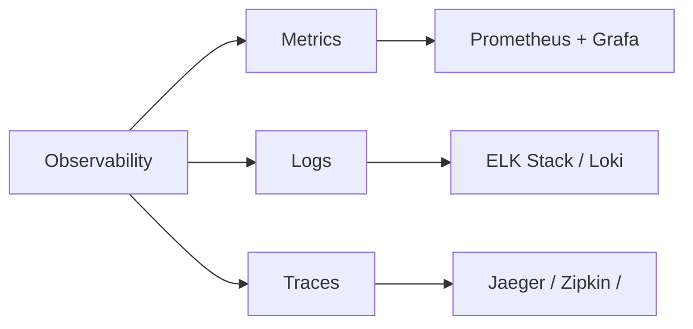
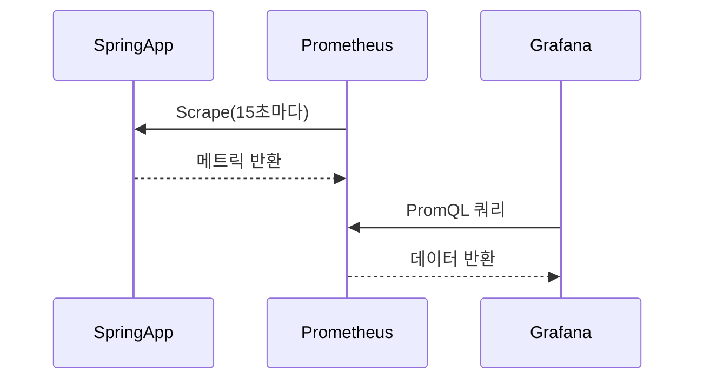

모니터링 시스템은 소프트웨어의 조종석이다. 시스템이 얼마나 잘 동작하고 있는지 측정하고(Metrics), 무슨 일이 일어났는지 기록하며(Logs), 요청이 어디를 거쳤는지 추적한다(Traces).

> **비유**: 비행기 조종석의 계기판과 같다. 고도계, 속도계, 연료계, 엔진 온도계 수십 개가 있고, 이상 징후가 발생하면 경보음이 울린다. 계기판 없이 비행하면 이미 추락 중에야 문제를 알게 된다.

---

## Observability 3대 요소



| 요소 | 핵심 질문 | 대표 도구 |
|------|---------|---------|
| Metrics | 지금 시스템이 얼마나 바쁜가? 느린가? | Prometheus, Datadog |
| Logs | 에러가 왜 발생했나? 무슨 일이 있었나? | ELK Stack, Loki |
| Traces | 어느 서비스에서 지연이 발생했나? | Jaeger, Zipkin, Tempo |

세 요소는 서로 보완한다. Metrics로 이상을 감지하고, Logs로 원인을 파악하며, Traces로 어느 서비스가 문제인지 추적한다.

---

## Prometheus + Grafana

가장 널리 쓰이는 오픈소스 메트릭 모니터링 스택이다.

### Prometheus 동작 원리

Prometheus는 **Pull 방식**으로 동작한다. 각 서비스가 메트릭 엔드포인트를 노출하면 Prometheus가 주기적으로 긁어간다(scrape). 서비스가 메트릭을 Push하는 방식(Datadog Agent)과 대비된다. Pull 방식은 Prometheus가 장애나도 서비스에는 영향이 없다는 장점이 있다.



### Prometheus 설정

```yaml
# prometheus.yml
global:
  scrape_interval: 15s
  evaluation_interval: 15s

rule_files:
  - "alert_rules.yml"

alerting:
  alertmanagers:
    - static_configs:
        - targets: ["alertmanager:9093"]

scrape_configs:
  - job_name: 'spring-app'
    metrics_path: '/actuator/prometheus'
    static_configs:
      - targets: ['app1:8080', 'app2:8080']

  # Kubernetes 환경: Pod 어노테이션 기반 자동 디스커버리
  - job_name: 'kubernetes-pods'
    kubernetes_sd_configs:
      - role: pod
    relabel_configs:
      - source_labels: [__meta_kubernetes_pod_annotation_prometheus_io_scrape]
        action: keep
        regex: true
      - source_labels: [__meta_kubernetes_pod_annotation_prometheus_io_path]
        action: replace
        target_label: __metrics_path__
```

### 알림 규칙


```yaml
# alert_rules.yml
groups:
  - name: application
    rules:
      - alert: HighErrorRate
        expr: |
          rate(http_server_requests_seconds_count{status=~"5.."}[5m])
          / rate(http_server_requests_seconds_count[5m]) > 0.01
        for: 2m          # 2분간 지속될 때만 알림 (일시적 스파이크 무시)
        labels:
          severity: critical
        annotations:
          summary: "에러율 1% 초과"
          description: "{{ $labels.job }} 에러율: {{ $value | humanizePercentage }}"

      - alert: HighLatency
        expr: |
          histogram_quantile(0.95,
            rate(http_server_requests_seconds_bucket[5m])
          ) > 2
        for: 5m
        labels:
          severity: warning
        annotations:
          summary: "P95 응답시간 2초 초과"

      - alert: PodCrashLooping
        expr: rate(kube_pod_container_status_restarts_total[15m]) > 0
        for: 5m
        labels:
          severity: critical
        annotations:
          summary: "Pod 재시작 감지: {{ $labels.pod }}"
```


### PromQL 주요 쿼리

```promql
# 초당 요청 수 (TPS)
rate(http_server_requests_seconds_count[5m])

# P95 응답시간 (상위 5% 느린 요청의 응답시간)
histogram_quantile(0.95, rate(http_server_requests_seconds_bucket[5m]))

# 에러율 (5xx 응답 비율)
rate(http_server_requests_seconds_count{status=~"5.."}[5m])
/ rate(http_server_requests_seconds_count[5m])

# JVM Heap 사용률
jvm_memory_used_bytes{area="heap"} / jvm_memory_max_bytes{area="heap"}

# DB 커넥션 풀 사용률
hikaricp_connections_active / hikaricp_connections_max

# CPU 사용률 (컨테이너)
rate(container_cpu_usage_seconds_total[5m]) * 100
```

---

## Spring Actuator + Micrometer

Spring Boot 애플리케이션의 메트릭을 Prometheus로 내보내는 설정이다. Micrometer는 메트릭 수집 추상화 계층으로, Prometheus 외에 Datadog, InfluxDB 등으로도 동일하게 전송할 수 있다.

```gradle
dependencies {
    implementation 'org.springframework.boot:spring-boot-starter-actuator'
    implementation 'io.micrometer:micrometer-registry-prometheus'
}
```

```yaml
management:
  endpoints:
    web:
      exposure:
        include: health, info, prometheus, metrics
  endpoint:
    health:
      show-details: always
      probes:
        enabled: true  # liveness, readiness 엔드포인트 분리 (K8s probe용)
  metrics:
    tags:
      application: ${spring.application.name}
      environment: ${spring.profiles.active}
    distribution:
      percentiles-histogram:
        http.server.requests: true  # 히스토그램 활성화 (P95 계산에 필요)
      slo:
        http.server.requests: 100ms, 500ms, 1s, 2s
```

### 커스텀 메트릭

```java
@Component
@RequiredArgsConstructor
public class OrderMetrics {

    private final MeterRegistry registry;

    @PostConstruct
    public void init() {
        // Counter: 단조증가 카운터 (주문 수, 에러 수)
        Counter.builder("order.created.total")
            .description("생성된 주문 수")
            .tag("type", "all")
            .register(registry);

        // Timer: 처리 시간 측정 (분포 포함)
        Timer.builder("order.processing.duration")
            .description("주문 처리 시간")
            .publishPercentiles(0.5, 0.95, 0.99)
            .register(registry);

        // Gauge: 현재 상태를 반영하는 값 (람다로 실시간 제공)
        // register(registry) 호출 시 람다가 주기적으로 호출됨
    }

    public void registerPendingOrdersGauge(OrderRepository repository) {
        Gauge.builder("order.pending.count", repository,
                r -> r.countByStatus(OrderStatus.PENDING))
            .description("처리 대기 중인 주문 수")
            .register(registry);
    }
}
```

Counter는 단조 증가만 하므로 `rate()`로 초당 변화량을 계산한다. Gauge는 현재값을 바로 사용한다.

---

## ELK Stack

**E**lasticsearch + **L**ogstash + **K**ibana. 로그 수집, 저장, 시각화 스택이다.

```mermaid
graph LR
    APP["Spring App"] -->|"JSON 로그"| FB["Filebeat"]
..|"전송"| LS["Logstash"]
..|"저장"| ES[("Elasticsea..|"쿼리"| KI["Kibana"]
```

### Spring Logback JSON 설정

로그를 JSON으로 출력하면 Elasticsearch에 구조화된 형태로 저장되어 `traceId`, `userId` 등으로 필터링이 가능하다.

```xml
<configuration>
    <appender name="JSON_CONSOLE" class="ch.qos.logback.core.ConsoleAppender">
        <encoder class="net.logstash.logback.encoder.LogstashEncoder">
            <includeMdcKeyName>traceId</includeMdcKeyName>
            <includeMdcKeyName>spanId</includeMdcKeyName>
            <includeMdcKeyName>userId</includeMdcKeyName>
            <customFields>{"application":"myapp","environment":"prod"}</customFields>
        </encoder>
    </appender>

    <root level="INFO">
        <appender-ref ref="JSON_CONSOLE"/>
    </root>
</configuration>
```

출력 결과:

```json
{
  "@timestamp": "2026-05-01T10:00:00.000Z",
  "level": "ERROR",
  "message": "주문 처리 실패",
  "logger": "com.example.OrderService",
  "traceId": "abc123def456",
  "spanId": "789xyz",
  "userId": "user-42",
  "application": "myapp",
  "environment": "prod",
  "exception": "com.example.OrderNotFoundException: Order not found: 12345"
}
```

`traceId`가 있으면 ELK에서 검색해 해당 요청이 거친 모든 서비스의 로그를 한 화면에서 조회할 수 있다.

### Logstash 파이프라인

```ruby
input {
  beats { port => 5044 }
}

filter {
  json { source => "message" }

  if [level] == "ERROR" {
    mutate { add_tag => ["error"] }
  }

  geoip { source => "clientIp" }  # IP 지역 정보 추가
}

output {
  elasticsearch {
    hosts => ["elasticsearch:9200"]
    index => "myapp-logs-%{+YYYY.MM.dd}"
    ilm_enabled => true
    ilm_rollover_alias => "myapp-logs"
    ilm_policy => "myapp-logs-policy"    # 오래된 인덱스 자동 삭제
  }
}
```

---

## Datadog

SaaS 형태의 통합 모니터링 플랫폼이다. Metrics/Logs/Traces를 하나의 플랫폼에서 제공한다.

**장점**:
- 설치가 매우 간단 (Agent 하나로 모든 것)
- UI/UX가 우수함
- APM(Application Performance Monitoring) 내장
- 이상 감지(Anomaly Detection) AI 내장

**단점**:
- 비용이 높음 (Host당 월 $15~$35)
- 데이터가 외부로 나감 (금융권 제약 가능성)

```java
// dd-java-agent 사용 — JVM 옵션만으로 자동 계측, 코드 변경 불필요
// -javaagent:/path/to/dd-java-agent.jar
// -Ddd.service=myapp
// -Ddd.env=production
// -Ddd.version=1.0.0
// -Ddd.logs.injection=true   // 로그에 traceId 자동 주입
```

---

## 4 Golden Signals (SRE 기준)

Google SRE에서 정의한 서비스 품질의 핵심 4가지 신호다. 이 네 가지를 모니터링하면 대부분의 장애를 조기에 감지할 수 있다.

| 신호 | 설명 | 예시 메트릭 |
|------|------|------------|
| Latency | 요청 처리 시간 | P50, P95, P99 응답시간 |
| Traffic | 요청량 | TPS (초당 트랜잭션 수) |
| Errors | 오류율 | 5xx 응답 비율 |
| Saturation | 자원 포화도 | CPU, 메모리, 커넥션 풀 |

### SLI / SLO / SLA

```
SLI (Service Level Indicator): 측정 지표
  예) 지난 30일간 가용성 = 성공 요청 수 / 전체 요청 수 = 99.95%

SLO (Service Level Objective): 내부 목표
  예) 가용성 >= 99.9%, P95 응답시간 <= 500ms

SLA (Service Level Agreement): 고객과의 계약
  예) 가용성 < 99.9% 시 서비스 크레딧 제공
```

SLO는 SLA보다 약간 엄격하게 설정해야 한다. SLO를 위반하지 않아야 SLA 위반을 방지할 수 있다.

### 알림 전략 (Alert Fatigue 방지)

```
P0 (즉시 대응, 24시간):
  - 서비스 완전 다운
  - 에러율 > 5%
  → PagerDuty / 전화

P1 (1시간 내 대응):
  - P95 응답시간 > 2초
  - DB 커넥션 풀 90% 이상
  → Slack #incidents

P2 (다음 근무일):
  - 디스크 80% 초과
  - 배포 실패
  → Slack #alerts
```

알림이 너무 많으면 중요한 알림도 무시하게 된다(Alert Fatigue). P0~P2로 분류해 각 수준에 맞는 채널과 대응 시간을 정해야 한다.

---


## 극한 시나리오

### 시나리오 1: 메트릭은 정상인데 사용자 불만 폭발

HTTP 200 응답률 99.9%이지만 결제 성공률이 60%인 경우다. 기술 메트릭만 보고 비즈니스 메트릭을 놓친 것이다.

```promql
# 기술 메트릭 (정상처럼 보임): HTTP 200 응답률 99.9%
rate(http_requests_total{status="200"}[5m]) / rate(http_requests_total[5m])

# 비즈니스 메트릭 (실제 문제): 결제 성공률 60%
rate(payment_success_total[5m]) / rate(payment_attempt_total[5m])
```

HTTP 200이어도 결제 로직 내부에서 비즈니스 실패가 발생할 수 있다. 비즈니스 메트릭을 반드시 커스텀 메트릭으로 추가해야 한다.

### 시나리오 2: 로그 스토리지 폭발 — 한 달 3TB

```
원인: 모든 요청에 DEBUG 로그 출력, 로그 보존 정책 없음

해결:
1. 로그 레벨 조정: 프로덕션은 WARN 이상만
2. 샘플링: 정상 요청의 1%만 DEBUG 로깅
3. ILM (Index Lifecycle Management):
   - 7일: Hot (자주 조회)
   - 30일: Cold (드물게 조회)
   - 30일 후: 삭제
4. 중요도별 보존 기간 분리:
   - ERROR 로그: 90일
   - INFO 로그: 7일
```

### 시나리오 3: Prometheus 스토리지 부족

기본 보존 기간(15일)과 스크레이프 간격(15초), 메트릭 수에 따라 스토리지가 빠르게 찬다.

```yaml
# prometheus 실행 시 보존 기간 및 스토리지 제한
--storage.tsdb.retention.time=30d
--storage.tsdb.retention.size=50GB
```

장기 저장이 필요하면 Thanos 또는 Cortex로 원격 스토리지에 적재한다.

### 시나리오 4: 알림 폭풍 (Alert Storm)

한 서비스 장애로 수십 개 알림이 동시에 발생하면 핵심 알림을 놓친다. Alertmanager의 그룹핑과 억제(Inhibit) 규칙으로 연쇄 알림을 방지한다.

```yaml
# alertmanager.yml — 같은 서비스 알림을 5분간 모아서 한 번에 발송
route:
  group_by: ['alertname', 'job']
  group_wait: 30s
  group_interval: 5m
  repeat_interval: 4h

inhibit_rules:
  # 서비스 다운 알림이 있으면 그 서비스의 레이턴시 알림은 억제
  - source_match:
      alertname: 'ServiceDown'
    target_match:
      alertname: 'HighLatency'
    equal: ['job']
```

---

## 왜 Prometheus + Grafana인가? (vs 대안 비교)

| 도구 | 특징 | 비용 | 선택 기준 |
|------|------|------|---------|
| **Prometheus + Grafana** | 오픈소스, Pull 방식, PromQL | 무료 (인프라 비용만) | 쿠버네티스 환경, 커스터마이징 중요할 때 |
| **Datadog** | SaaS, 에이전트 Push, 전방위 모니터링 | 호스트당 $23~+ /월 | 빠른 도입, 팀 규모 작을 때 |
| **New Relic** | APM 강점, 코드 레벨 분석 | 사용량 기반 | Java 애플리케이션 심층 분석 |
| **Grafana Cloud** | Prometheus + Loki + Tempo 통합 SaaS | 무료 티어 있음 | 자체 운영 부담 줄이면서 OSS 스택 유지 |
| **AWS CloudWatch** | AWS 네이티브, 별도 설치 불필요 | 메트릭당 과금 | AWS 단일 클라우드 환경 |

```
Prometheus를 선택하는 핵심 이유:
1. Pull 방식 → 서비스가 죽어도 Prometheus는 살아있음 (장애 격리)
2. PromQL → 유연한 집계 (rate, histogram_quantile, by 절)
3. Kubernetes 네이티브 (ServiceMonitor, PodMonitor CRD)
4. 오픈소스 생태계: Alertmanager, Thanos, Cortex

Datadog을 선택하는 경우:
- 팀이 작고 운영 부담을 줄이고 싶을 때
- APM + Logs + Metrics를 하나의 UI에서 보고 싶을 때
- 비용이 문제 없을 때
```

---

## 실무에서 자주 하는 실수

#### 실수 1: 모든 로그에 INFO 레벨 사용

```java
// 나쁜 예 — 정상 흐름에 INFO 남발
log.info("getUser 호출됨: userId={}", userId);
log.info("DB 조회 완료: {}", user);
log.info("응답 반환: {}", response);
// → 트래픽 많으면 초당 수천 줄 → ELK 스토리지 폭발

// 좋은 예 — 레벨 구분
log.debug("getUser 호출: userId={}", userId);     // 개발 환경에서만
log.warn("캐시 미스 빈번: {}회/분", missCount);    // 이상 징후
log.error("결제 처리 실패: orderId={}", orderId, e); // 반드시 알림
```

#### 실수 2: 알림 임계값을 너무 낮게 설정 (Alert Fatigue)

```yaml
# 나쁜 예 — 1초라도 에러 나면 알림
- alert: AnyError
  expr: rate(http_errors_total[1m]) > 0
  # → 새벽 3시에도 알림 → 담당자가 알림을 무시하기 시작

# 좋은 예 — 의미있는 임계값 + 지속 시간
- alert: HighErrorRate
  expr: rate(http_errors_total[5m]) / rate(http_requests_total[5m]) > 0.01
  for: 2m  # 2분간 지속될 때만 알림
  # → 일시적 스파이크 무시, 실제 장애만 감지
```

#### 실수 3: 메트릭 카디널리티 폭발

```java
// 나쁜 예 — userId를 레이블로 사용
Counter.builder("api.calls")
    .tag("userId", userId.toString())  // 사용자 100만명 → 레이블 100만개
    .register(registry);
// → Prometheus OOM

// 좋은 예 — 카디널리티 낮은 레이블만 사용
Counter.builder("api.calls")
    .tag("endpoint", "/api/orders")   // 엔드포인트 수십 개
    .tag("status", "200")             // 상태 코드 수십 개
    .register(registry);
```

#### 실수 4: 분산 추적 없이 MSA 운영

```
증상: "주문 API가 가끔 3초 걸리는데 어디가 문제인지 모르겠다"
원인: 각 서비스 로그를 따로 뒤져야 하고 연결할 방법이 없음

해결: Spring Sleuth + Zipkin 또는 OpenTelemetry 도입
  → 모든 서비스에 TraceId 자동 전파
  → 단일 TraceId로 전체 요청 흐름 추적
  → 어느 서비스에서 얼마나 걸렸는지 시각화
```

#### 실수 5: 로그에 민감정보 포함

```java
// 나쁜 예
log.info("결제 요청: cardNumber={}, cvv={}", cardNumber, cvv);
log.info("로그인: userId={}, password={}", userId, password);

// 좋은 예 — 마스킹 처리
log.info("결제 요청: cardNumber=****{}", cardNumber.substring(cardNumber.length()-4));
log.info("로그인 시도: userId={}", userId);  // 비밀번호 절대 로깅 금지
```

---

## 면접 포인트

#### Q. Prometheus의 Pull 방식과 Push 방식의 차이점은?

```
Pull 방식 (Prometheus):
  Prometheus가 각 서비스의 /metrics 엔드포인트를 주기적으로 호출
  장점: 서비스가 죽으면 scrape 실패로 즉시 감지
       Prometheus 장애가 서비스에 영향 없음
  단점: 방화벽 내부 서비스 scrape 어려움 (Pushgateway로 해결)

Push 방식 (Datadog, Graphite):
  각 서비스가 중앙 서버로 메트릭을 능동적으로 전송
  장점: 방화벽 뒤 서비스도 쉽게 수집
  단점: 에이전트 장애 시 메트릭 유실, 중앙 서버 부하 집중
```

#### Q. PromQL에서 rate()와 irate()의 차이는?

```
rate(metric[5m]):
  지정 기간(5분) 전체의 평균 증가율
  → 안정적, 트래픽 급증에 둔감
  → 대부분의 알림 규칙에 적합

irate(metric[5m]):
  마지막 두 샘플 간의 순간 증가율
  → 반응성 높음, 스파이크 감지에 유리
  → 그래프가 불안정해 보일 수 있음

실무 권장: 알림 규칙은 rate(), 실시간 대시보드는 irate()
```

#### Q. Grafana 대시보드에서 P95 응답시간은 어떻게 구하는가?

```promql
histogram_quantile(0.95,
  sum(rate(http_server_requests_seconds_bucket[5m])) by (le, uri)
)

핵심: histogram_quantile은 버킷(bucket) 메트릭에서만 동작
      _bucket suffix가 있어야 함 (Micrometer 자동 생성)
      le 레이블 = less than or equal (버킷 상한값)
      0.95 = P95, 0.99 = P99, 0.5 = P50(중앙값)
```

#### Q. 로그, 메트릭, 트레이스를 언제 각각 써야 하는가?

```
Metrics: 지금 시스템이 어떤 상태인가? (정량적)
  → "에러율 2%", "TPS 5000", "Heap 85%"
  → 알림 트리거에 사용

Logs: 무슨 일이 있었는가? (이벤트 기록)
  → "OrderId 123 결제 실패: 잔액 부족"
  → 원인 분석, 감사 로그

Traces: 어디서 느렸는가? (요청 흐름)
  → "Order → Payment(200ms) → Inventory(50ms)"
  → MSA 환경 병목 지점 파악

세 요소는 서로 보완: Metrics로 이상 감지 → Logs로 원인 파악 → Traces로 위치 특정
```
