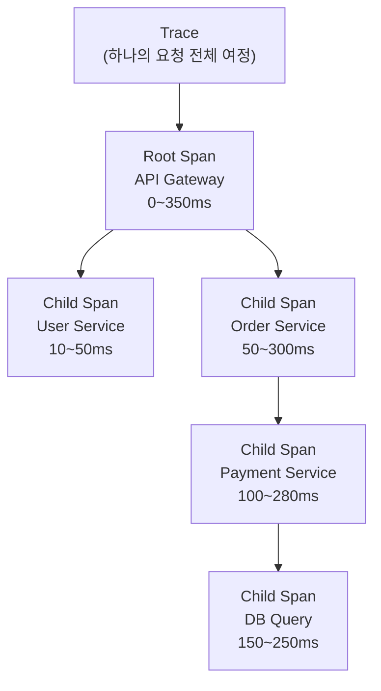
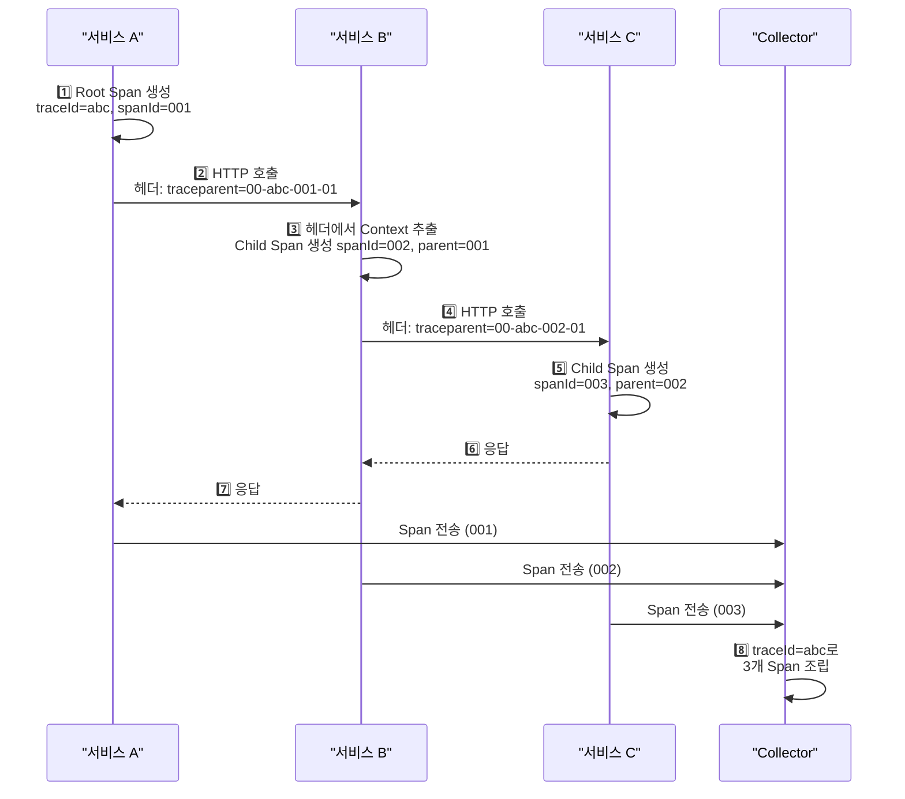
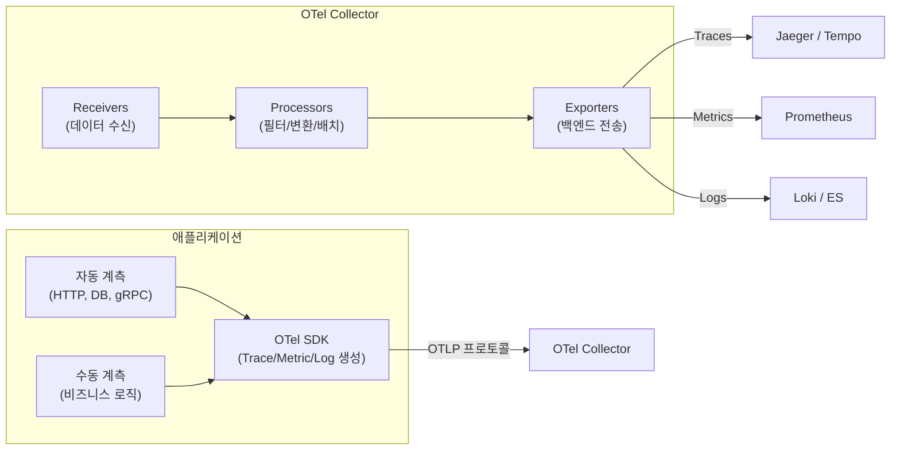
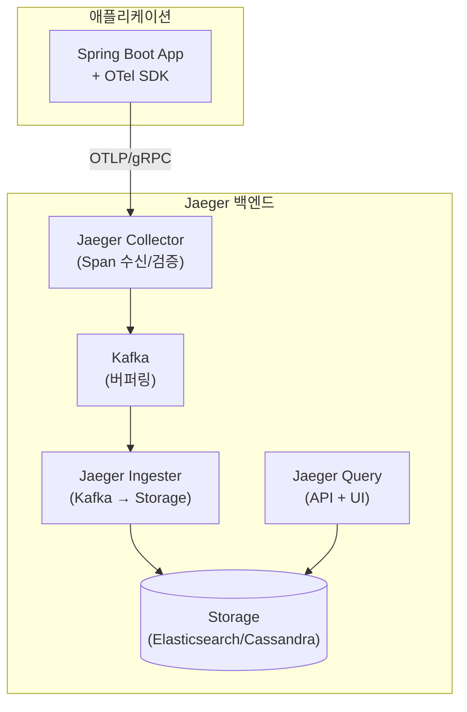
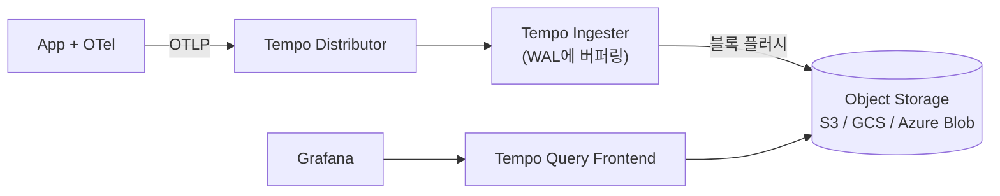
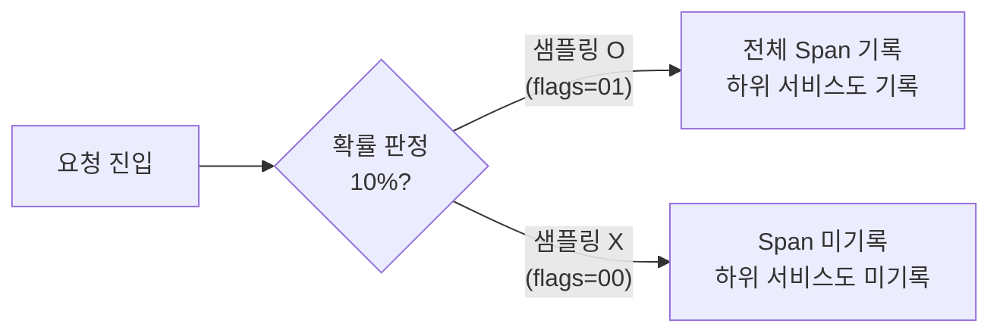
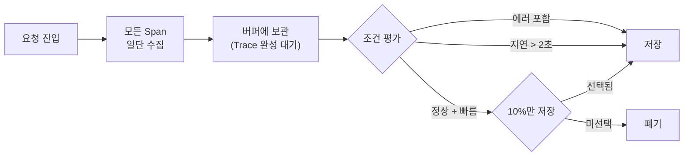

마이크로서비스 환경에서 하나의 요청이 수십 개 서비스를 거칠 때, 어디서 지연이 발생했는지 추적하는 기술이 **분산 트레이싱**이다.

> **비유:** 택배 배송 추적 시스템과 같다. 내가 보낸 택배가 집하장 → 허브 터미널 → 지역 배송소 → 배달원을 거치는데, 각 구간에서 언제 도착하고 언제 출발했는지 송장번호 하나로 전 구간을 추적한다. 분산 트레이싱은 **요청에 송장번호(Trace ID)를 붙여** 서비스 간 전파하면서 각 구간(Span)의 소요시간을 기록하는 것이다.

---

## 왜 분산 트레이싱이 필요한가?

모놀리식 시스템에서는 하나의 프로세스 안에서 메서드 호출 스택을 보면 병목을 찾을 수 있었다. 하지만 마이크로서비스에서는 요청이 HTTP, gRPC, 메시지 큐를 통해 여러 프로세스를 넘나든다. 로그만으로는 서비스 A의 로그와 서비스 B의 로그를 연결할 수 없다.

> **비유:** 범죄 수사에서 용의자의 동선을 추적하는 것과 같다. CCTV가 건물마다 따로 있으면 각 건물에서 "누가 몇 시에 왔다 갔다"는 알지만, **동일 인물의 전체 동선**을 파악하려면 모든 CCTV를 시간순으로 연결해야 한다. Trace ID가 바로 그 "동일 인물"을 식별하는 열쇠다.

분산 트레이싱이 해결하는 핵심 질문 세 가지:

1. **어디서 느린가?** — 서비스 A → B → C 중 B에서 2초 걸린다면 B의 Span이 이를 보여준다
2. **어디서 실패했나?** — 에러가 발생한 Span에 에러 태그가 붙어 즉시 식별 가능하다
3. **의존성 구조가 어떻게 되나?** — Trace 데이터를 모으면 서비스 간 호출 그래프(Service Map)를 자동 생성할 수 있다

---

## Trace, Span, Context — 핵심 개념

### 전체 구조



**Trace**는 하나의 요청이 시스템을 관통하는 전체 여정이다. 고유한 Trace ID를 갖는다. **Span**은 그 여정의 각 구간이다. 각 Span은 자신의 Span ID, 부모 Span ID, 시작/종료 시각, 태그(attributes), 이벤트(events)를 갖는다.

> **비유:** Trace는 서울에서 부산까지의 전체 여행이고, Span은 각 구간이다. "서울역 → KTX → 대전역"이 하나의 Span, "대전역 → KTX → 동대구역"이 또 하나의 Span이다. 각 구간에 소요시간, 좌석번호, 지연 여부 같은 메타데이터가 붙는다.

### Span의 내부 구조

하나의 Span은 다음 정보를 담는다:

| 필드 | 설명 | 예시 |
|------|------|------|
| Trace ID | 전체 요청의 고유 식별자 | `4bf92f3577b34da6a3ce929d0e0e4736` |
| Span ID | 이 구간의 고유 식별자 | `00f067aa0ba902b7` |
| Parent Span ID | 부모 구간 | `root` 또는 상위 Span ID |
| Operation Name | 수행한 작업 | `GET /api/orders` |
| Start / End Time | 시작/종료 시각 | 마이크로초 단위 |
| Status | 성공/실패 | `OK`, `ERROR` |
| Attributes | 키-값 메타데이터 | `http.method=GET`, `db.system=mysql` |
| Events | 구간 내 이벤트 | 예외 발생, 재시도 등 |

### Span Kind

Span은 역할에 따라 종류가 나뉜다. 이것은 호출 관계를 정확히 표현하기 위한 구분이다.

| Kind | 설명 | 예시 |
|------|------|------|
| CLIENT | 외부 서비스를 호출하는 쪽 | HTTP 클라이언트, gRPC 호출자 |
| SERVER | 외부로부터 요청을 받는 쪽 | HTTP 서버, gRPC 핸들러 |
| PRODUCER | 메시지를 보내는 쪽 | Kafka producer |
| CONSUMER | 메시지를 받는 쪽 | Kafka consumer |
| INTERNAL | 서비스 내부 작업 | DB 쿼리, 캐시 조회 |

> **비유:** 전화 통화를 생각해 보자. 전화를 거는 사람이 CLIENT, 받는 사람이 SERVER다. 편지를 보내는 사람이 PRODUCER, 받는 사람이 CONSUMER다. 혼잣말은 INTERNAL이다.

---

## Context Propagation — 트레이스의 핵심 메커니즘

분산 트레이싱에서 가장 중요한 것은 **Context Propagation(컨텍스트 전파)**이다. Trace ID와 Span ID를 서비스 간에 어떻게 전달할 것인가의 문제다.

서비스 A가 서비스 B를 호출할 때, A는 자신의 Trace ID와 현재 Span ID를 HTTP 헤더(또는 메시지 헤더)에 담아 보낸다. B는 이 헤더를 읽어 동일한 Trace에 자신의 Span을 연결한다.

> **비유:** 릴레이 경주에서 바톤을 넘기는 것과 같다. 바톤(Context)에는 "이 경주의 ID(Trace ID)"와 "이전 주자의 번호(Parent Span ID)"가 적혀 있다. 바톤을 제대로 넘기지 못하면 그 구간부터 추적이 끊긴다.



### W3C Trace Context (표준)

W3C Trace Context는 2020년에 W3C 권고안이 된 **업계 표준** 전파 포맷이다. OpenTelemetry의 기본 전파 방식이며, 모든 벤더가 지원한다.

HTTP 요청에 두 개의 헤더를 추가한다:

**`traceparent`** — 필수 헤더로, Trace ID와 Span ID를 담는다.

```
traceparent: 00-4bf92f3577b34da6a3ce929d0e0e4736-00f067aa0ba902b7-01
             │   │                                  │                 │
             │   │                                  │                 └─ flags (01=sampled)
             │   │                                  └─ parent-id (8바이트)
             │   └─ trace-id (16바이트)
             └─ version
```

각 필드의 의미를 자세히 살펴보자.

- **version**: 현재 항상 `00`이다. 향후 포맷이 변경될 경우를 대비한다.
- **trace-id**: 128비트(32자리 hex) 전역 고유 식별자. 전체 요청을 관통하는 하나의 ID다.
- **parent-id**: 64비트(16자리 hex). 직접 호출한 부모 Span의 ID다. 수신 측은 이것을 자기 Span의 parent로 설정한다.
- **flags**: `01`이면 이 Trace가 샘플링되었음을 의미한다. `00`이면 샘플링 안 됨.

**`tracestate`** — 선택 헤더로, 벤더별 추가 정보를 담는다.

```
tracestate: congo=t61rcWkgMzE,rojo=00f067aa0ba902b7
```

여러 벤더의 트레이싱 시스템이 공존할 때, 각 벤더가 자기만의 메타데이터를 이 헤더에 추가한다. 다른 벤더는 이해하지 못하는 값이라도 그대로 전달(passthrough)해야 한다.

> **비유:** 여권과 같다. `traceparent`는 여권의 기본 정보(이름, 여권번호, 국적)이고, `tracestate`는 각 나라의 입국 스탬프다. 미국 입국 스탬프를 일본이 이해하지 못해도 지우면 안 된다.

### B3 Propagation (Zipkin 레거시)

B3는 Zipkin에서 시작된 전파 포맷으로, 여전히 많은 시스템에서 사용된다. W3C 표준 이전에 사실상 표준이었다.

**Multi-header 방식** — 각 정보를 별도 헤더로 전달한다:

```
X-B3-TraceId: 463ac35c9f6413ad48485a3953bb6124
X-B3-SpanId: 0020000000000001
X-B3-ParentSpanId: 0010000000000000
X-B3-Sampled: 1
```

**Single-header 방식** — 하나의 헤더에 압축한다:

```
b3: 463ac35c9f6413ad48485a3953bb6124-0020000000000001-1-0010000000000000
    {TraceId}-{SpanId}-{Sampled}-{ParentSpanId}
```

### W3C vs B3 비교

| 항목 | W3C Trace Context | B3 Propagation |
|------|-------------------|----------------|
| 표준화 | W3C 권고안 (공식 표준) | Zipkin 커뮤니티 표준 |
| 헤더 수 | 2개 (traceparent, tracestate) | 4개 (multi) 또는 1개 (single) |
| Trace ID 크기 | 128비트 고정 | 64비트 또는 128비트 |
| 벤더 확장 | tracestate로 지원 | 미지원 |
| 권장 여부 | 신규 시스템에 권장 | 레거시 호환용 |

실무에서는 **W3C를 기본으로 사용하되, 레거시 시스템과 통신할 때 B3를 함께 전파**하는 Composite Propagator를 구성한다.

---

## OpenTelemetry — 관측성의 통합 표준

OpenTelemetry(OTel)는 CNCF 프로젝트로, Traces/Metrics/Logs를 수집하는 **벤더 중립 표준**이다. 과거에는 OpenTracing과 OpenCensus라는 두 프로젝트가 경쟁했는데, 2019년에 합쳐져 OpenTelemetry가 되었다.

> **비유:** 전기 콘센트 규격과 같다. 과거에는 나라마다 콘센트 모양이 달라 변환 어댑터가 필요했다. OpenTelemetry는 "모든 나라에서 쓸 수 있는 만능 콘센트 규격"이다. 한번 이 규격으로 계측(instrument)하면, Jaeger든 Datadog이든 Tempo든 어디로든 데이터를 보낼 수 있다.

### OTel 아키텍처



OTel의 핵심 구성요소는 세 가지다.

**OTel SDK**는 애플리케이션에 내장되어 Trace, Metric, Log를 생성한다. 자동 계측(auto-instrumentation)은 HTTP 클라이언트/서버, DB 드라이버, 메시지 큐 등을 코드 변경 없이 계측한다. 수동 계측(manual instrumentation)은 비즈니스 로직의 커스텀 Span을 만든다.

**OTLP(OpenTelemetry Protocol)**는 SDK와 Collector 간의 통신 프로토콜이다. gRPC와 HTTP/protobuf 두 가지 전송 방식을 지원한다. 바이너리 직렬화로 JSON보다 전송 효율이 높다.

**OTel Collector**는 데이터를 수신(Receivers) → 처리(Processors) → 전송(Exporters)하는 파이프라인이다. 애플리케이션과 백엔드 사이에 위치하여, 백엔드가 바뀌어도 애플리케이션 코드를 수정할 필요가 없다.

> **비유:** Collector는 우체국과 같다. 각 가정(서비스)에서 편지(Span)를 보내면, 우체국이 분류하고 묶어서(batch) 목적지(Jaeger, Datadog)로 보낸다. 우체국 없이 각 가정이 직접 배달하면 비효율적이다.

---

## Jaeger vs Tempo — 트레이싱 백엔드

### Jaeger 아키텍처

Jaeger는 Uber에서 개발한 오픈소스 분산 트레이싱 시스템이다. CNCF Graduated 프로젝트로, 프로덕션 검증이 잘 되어 있다.



Jaeger의 프로덕션 배포에서는 **Kafka를 버퍼로 사용**하는 것이 핵심이다. 트래픽이 폭증해도 Collector가 Kafka에 빠르게 쓰고, Ingester가 자신의 속도로 Storage에 적재한다. Kafka 없이 Collector가 직접 Elasticsearch에 쓰면, ES가 느려질 때 Collector까지 막혀 애플리케이션의 요청 처리에 영향을 줄 수 있다.

> **비유:** 뷔페 식당의 접시 반납 시스템과 같다. 손님(App)이 접시(Span)를 반납대(Collector)에 놓으면, 컨베이어 벨트(Kafka)가 세척실(Storage)로 운반한다. 컨베이어 벨트 없이 손님이 직접 세척실에 가져가면, 세척이 밀릴 때 손님들이 줄을 서서 식사를 못 한다.

### Grafana Tempo

Tempo는 Grafana Labs에서 만든 분산 트레이싱 백엔드다. Jaeger와의 가장 큰 차이점은 **인덱스 없이 오브젝트 스토리지에 직접 저장**한다는 것이다.



| 비교 항목 | Jaeger | Tempo |
|----------|--------|-------|
| 스토리지 | Elasticsearch / Cassandra | S3, GCS (오브젝트 스토리지) |
| 인덱싱 | 필요 (ES 인덱스) | 불필요 (Trace ID로 직접 조회) |
| 운영 비용 | ES 클러스터 운영 필요 | 오브젝트 스토리지만 (저렴) |
| 검색 | 서비스명, 태그로 검색 가능 | Trace ID 직접 조회 또는 TraceQL |
| 대시보드 | Jaeger UI (자체 내장) | Grafana 연동 필수 |
| 적합한 환경 | 다양한 검색이 필요한 경우 | 비용 효율이 중요한 대규모 환경 |

Tempo의 설계 철학은 "Trace ID만 알면 된다"이다. 보통 Metrics나 Logs에서 이상을 감지하면 해당 요청의 Trace ID를 얻을 수 있다. Grafana에서 메트릭 → 로그 → 트레이스로 연결(Exemplar)하면 Trace ID 검색만으로 충분하다.

> **비유:** Jaeger는 도서관 색인 카드 시스템이다. 제목, 저자, 주제로 검색할 수 있지만 색인 카드를 유지하는 비용이 든다. Tempo는 창고형 서점이다. ISBN(Trace ID)만 알면 바로 찾을 수 있고, 창고 임대료가 도서관보다 훨씬 싸다.

### 저장 전략 — 보존 기간과 비용

트레이싱 데이터는 양이 방대하므로 보존 전략이 중요하다.

**Jaeger + Elasticsearch**인 경우:

- Hot 노드: 최근 3일 (SSD, 빠른 검색)
- Warm 노드: 3~14일 (HDD)
- 삭제: 14일 이후 ILM으로 자동 삭제
- ES 인덱스를 날짜별로 생성하여(`jaeger-span-2026-05-03`) 삭제가 쉽도록 한다

**Tempo + S3**인 경우:

- S3 Lifecycle Rule로 30일 후 자동 삭제
- S3 비용이 저렴하므로 더 긴 보존도 가능
- Intelligent-Tiering으로 접근 빈도에 따라 자동 계층화

---

## Spring Boot + Micrometer Tracing 실전 구성

Spring Boot 3.x부터 Micrometer Tracing이 Spring Cloud Sleuth를 대체했다. Micrometer Tracing은 OpenTelemetry와 Brave(Zipkin) 두 가지 백엔드를 지원한다.

### 의존성 구성

OTel 백엔드를 사용하는 경우의 의존성을 살펴보자. `micrometer-tracing-bridge-otel`이 Micrometer의 Tracer 인터페이스를 OTel SDK에 연결하는 브릿지 역할을 한다. `opentelemetry-exporter-otlp`는 수집된 Span을 OTLP 프로토콜로 Collector에 전송한다.

```gradle
dependencies {
    // Micrometer Tracing — OTel 브릿지
    implementation 'io.micrometer:micrometer-tracing-bridge-otel'

    // OTLP Exporter — Collector로 Span 전송
    implementation 'io.opentelemetry:opentelemetry-exporter-otlp'

    // 자동 계측 — HTTP, DB, Kafka 등
    implementation 'io.opentelemetry:opentelemetry-spring-boot-starter'
}
```

**이 코드의 핵심:** `micrometer-tracing-bridge-otel`은 Spring의 관측 API(`Observation`)와 OTel SDK를 연결하는 접착제다. 이 하나의 의존성으로 Spring MVC, WebFlux, RestClient, JdbcTemplate 등이 자동으로 Span을 생성한다.

### application.yml 설정

설정의 각 항목이 왜 필요한지 살펴보자. `tracing.sampling.probability`는 전체 요청 중 몇 퍼센트를 트레이싱할지 결정한다. 1.0이면 모든 요청을 트레이싱하고, 0.1이면 10%만 트레이싱한다. 프로덕션에서 1.0을 쓰면 트레이싱 데이터가 폭증하므로 주의해야 한다.

`propagation.type`은 Context를 전파할 때 사용하는 헤더 형식을 지정한다. W3C가 표준이고, B3는 Zipkin 레거시 시스템과 통신할 때 추가한다.

```yaml
management:
  tracing:
    sampling:
      probability: 1.0        # 개발: 100%, 프로덕션: 0.1~0.5 권장
    propagation:
      type: w3c                # W3C Trace Context 사용
      # type: w3c, b3          # W3C + B3 동시 전파 (레거시 호환)

  otlp:
    tracing:
      endpoint: http://otel-collector:4318/v1/traces

logging:
  pattern:
    # 로그에 traceId, spanId 자동 포함 — ELK에서 Trace 연결 가능
    console: "%d{HH:mm:ss} [%X{traceId:-},%X{spanId:-}] %-5level %logger{36} - %msg%n"
```

**이 코드의 핵심:** `logging.pattern`에 `%X{traceId}`를 넣는 것이 중요하다. 이렇게 하면 로그에 Trace ID가 포함되어, ELK에서 로그를 보다가 Trace ID를 클릭해 Jaeger/Tempo로 바로 이동할 수 있다. Metrics → Logs → Traces 연결의 핵심이다.

### 수동 Span 생성

자동 계측은 HTTP, DB 호출 등 프레임워크 수준의 작업을 추적한다. 비즈니스 로직의 세부 구간을 추적하려면 수동으로 Span을 만들어야 한다.

`@Observed` 어노테이션은 가장 간편한 방법이다. Micrometer의 Observation API를 사용하여 메서드 단위로 Span을 자동 생성한다. 메서드 진입 시 Span이 시작되고, 메서드 종료(또는 예외 발생) 시 Span이 종료된다.

```java
@Service
@RequiredArgsConstructor
public class OrderService {

    private final Tracer tracer;          // Micrometer Tracer
    private final PaymentClient paymentClient;

    // 방법 1: @Observed 어노테이션 — 간편하지만 메서드 단위
    @Observed(name = "order.process",
              contextualName = "주문 처리",
              lowCardinalityKeyValues = {"order.type", "standard"})
    public Order processOrder(OrderRequest request) {
        Order order = createOrder(request);
        paymentClient.charge(order);
        return order;
    }

    // 방법 2: 수동 Span — 세밀한 제어 가능
    public Order processOrderManual(OrderRequest request) {
        Span newSpan = tracer.nextSpan().name("재고 확인");
        try (Tracer.SpanInScope ws = tracer.withSpan(newSpan.start())) {
            // Span 내부에 이벤트 기록
            newSpan.event("재고 조회 시작");
            int stock = inventoryService.checkStock(request.getProductId());
            newSpan.tag("stock.remaining", String.valueOf(stock));

            if (stock < request.getQuantity()) {
                newSpan.tag("error", "재고 부족");
                throw new InsufficientStockException();
            }

            newSpan.event("재고 차감 완료");
            return createOrder(request);
        } finally {
            newSpan.end();   // 반드시 종료해야 함
        }
    }
}
```

**이 코드의 핵심:** `try-finally`로 `newSpan.end()`를 반드시 호출해야 한다. 누락하면 Span이 영원히 열린 채로 남아 메모리 누수와 불완전한 Trace를 유발한다. `@Observed`를 쓰면 이 실수를 방지할 수 있지만, 세밀한 태그나 이벤트 기록이 필요할 때는 수동 방식이 필요하다.

### 비동기 컨텍스트 전파

비동기 처리(@Async, CompletableFuture)에서는 스레드가 바뀌므로 ThreadLocal에 저장된 Context가 유실된다. 이 문제를 해결하려면 Context를 명시적으로 전파해야 한다.

```java
@Configuration
public class TracingAsyncConfig {

    // TaskExecutor를 감싸서 비동기 스레드에도 Context 전파
    @Bean
    public TaskDecorator tracingTaskDecorator(Tracer tracer) {
        return runnable -> {
            // 현재 스레드의 Context를 캡처
            Span currentSpan = tracer.currentSpan();
            return () -> {
                try (Tracer.SpanInScope ws =
                         tracer.withSpan(currentSpan)) {
                    runnable.run();
                }
            };
        };
    }

    @Bean
    public TaskExecutor asyncExecutor(TaskDecorator tracingTaskDecorator) {
        ThreadPoolTaskExecutor executor = new ThreadPoolTaskExecutor();
        executor.setCorePoolSize(10);
        executor.setTaskDecorator(tracingTaskDecorator);
        executor.initialize();
        return executor;
    }
}
```

**이 코드의 핵심:** `TaskDecorator`가 현재 스레드의 Span을 캡처하여 비동기 스레드에 주입한다. 이렇게 하지 않으면 `@Async` 메서드에서 생성된 Span이 부모 Trace와 연결되지 않아, Trace가 중간에 끊어진 것처럼 보인다.

---

## 샘플링 전략 — 모든 것을 저장할 수 없다

트래픽이 높은 시스템에서 모든 요청을 트레이싱하면 스토리지 비용이 폭증한다. 초당 10,000 TPS인 서비스에서 모든 Trace를 저장하면, 하루에 수억 개의 Span이 생긴다. 따라서 **샘플링**이 필수다.

> **비유:** 공장의 품질 검사와 같다. 생산라인에서 모든 제품을 검사하면(100% 샘플링) 가장 정확하지만 검사 비용이 생산 비용을 초과한다. 100개 중 1개만 검사하면(1% 샘플링) 비용은 낮지만 불량품을 놓칠 수 있다. **중요한 것은 불량품(에러, 느린 요청)은 반드시 검사하는 것이다.**

### Head-based Sampling (사전 결정)

요청이 시스템에 진입하는 순간(Head)에 샘플링 여부를 결정한다. Root Span이 생성될 때 확률적으로 "이 Trace는 저장할 것인가?"를 결정하고, 그 결정이 하위 모든 서비스로 전파된다.



**장점:** 구현이 단순하다. 요청 진입 시 한 번만 결정하고, 모든 서비스가 그 결정을 따른다.

**단점:** 에러나 지연이 발생한 요청도 샘플링에서 제외될 수 있다. 90%를 버리면, 에러 요청의 90%도 버린다. 드물게 발생하는 장애를 놓칠 수 있다.

### Tail-based Sampling (사후 결정)

모든 Span을 일단 수집한 뒤, Trace가 완성되는 시점(Tail)에 저장 여부를 결정한다. "이 Trace에 에러가 있는가?", "지연이 2초를 초과하는가?"를 보고 결정할 수 있다.



**장점:** 에러, 지연 등 중요한 Trace를 100% 보존할 수 있다. 정상 요청만 샘플링으로 줄인다.

**단점:** 구현이 복잡하다. Trace가 완성될 때까지 모든 Span을 메모리에 버퍼링해야 하므로, Collector의 메모리 사용량이 크다. Trace 완성 판단을 위한 대기 시간(보통 30초~1분)도 필요하다.

### OTel Collector에서 Tail-based Sampling 설정

OTel Collector의 `tail_sampling` 프로세서로 구현한다. 이 설정은 Collector가 30초간 Span을 버퍼링한 뒤, 정책에 따라 저장 여부를 결정한다.

정책 간의 관계는 **OR**이다. 하나의 정책이라도 만족하면 저장한다. 에러가 있거나, 지연이 2초를 초과하거나, 정상이더라도 10%는 저장하는 식이다.

```yaml
# otel-collector-config.yaml
processors:
  tail_sampling:
    decision_wait: 30s          # Trace 완성 대기 시간
    num_traces: 100000          # 동시 버퍼링 Trace 수
    policies:
      # 정책 1: 에러가 있는 Trace는 100% 저장
      - name: errors-policy
        type: status_code
        status_code:
          status_codes: [ERROR]

      # 정책 2: 지연 2초 초과 Trace 100% 저장
      - name: latency-policy
        type: latency
        latency:
          threshold_ms: 2000

      # 정책 3: 정상 요청은 10%만 저장
      - name: probabilistic-policy
        type: probabilistic
        probabilistic:
          sampling_percentage: 10

service:
  pipelines:
    traces:
      receivers: [otlp]
      processors: [tail_sampling, batch]
      exporters: [otlp/jaeger]
```

**이 코드의 핵심:** `decision_wait: 30s`는 Trace의 마지막 Span이 도착할 때까지 기다리는 시간이다. 너무 짧으면 Trace가 불완전한 상태에서 판단하게 되고, 너무 길면 메모리 사용량이 급증한다. `num_traces: 100000`은 동시에 버퍼링할 수 있는 Trace 수의 상한이다. TPS × decision_wait보다 커야 한다.

### 실무 샘플링 가이드

| 환경 | 권장 전략 | 비율 | 이유 |
|------|----------|------|------|
| 개발/스테이징 | Head-based 100% | 1.0 | 디버깅 편의, 트래픽 적음 |
| 프로덕션 (< 1K TPS) | Head-based | 0.5 | 절반이면 충분, 비용 절감 |
| 프로덕션 (> 10K TPS) | Tail-based | 에러 100% + 정상 5% | 에러 보존 + 비용 균형 |
| 결제/인증 등 핵심 경로 | 항상 100% | 1.0 | 돈과 보안은 타협 불가 |

---

<details class="extreme-scenario-details" ontoggle="if(this.open){var ad=this.querySelector('.extreme-scenario-ad');if(ad&&!ad.dataset.loaded){ad.dataset.loaded='1';(adsbygoogle=window.adsbygoogle||[]).push({});}}">
<summary class="extreme-scenario-summary">
<span class="extreme-scenario-icon">🔥</span>
<span class="extreme-scenario-label">극한 시나리오 — 클릭하여 펼치기</span>
<span class="extreme-scenario-toggle"></span>
</summary>
<div class="extreme-scenario-body">
<div class="extreme-scenario-ad" style="text-align:center; margin-bottom:1.5em;">
<ins class="adsbygoogle"
     style="display:block"
     data-ad-client="ca-pub-7225106491387870"
     data-ad-slot="0000000000"
     data-ad-format="auto"
     data-full-width-responsive="true"></ins>
</div>
<div class="extreme-scenario-content" markdown="1">

### 시나리오 1: Trace ID가 중간에 끊어진다

마이크로서비스 A → B → C 중 B에서 Trace가 끊어져 C의 Span이 별도 Trace로 보인다.

**원인:** B 서비스가 HTTP 클라이언트를 직접 생성(`new HttpClient()`)하여 Context Propagation 인터셉터가 적용되지 않았다. Spring의 `RestTemplate`이나 `WebClient`를 빈으로 등록하면 자동으로 전파 인터셉터가 추가되지만, 직접 생성하면 누락된다.

**해결:** 모든 HTTP 클라이언트를 Spring 빈으로 관리하고, `RestClient.builder()`를 사용한다. 커스텀 HTTP 클라이언트가 불가피하면 `ObservationRegistry`를 수동 주입한다.

> **비유:** 릴레이 경주에서 공식 바톤 대신 주자가 호주머니에서 꺼낸 연필을 넘긴 것이다. 다음 주자는 연필에 적힌 메시지를 읽을 수 없다.

### 시나리오 2: Kafka를 거치면 Trace가 끊어진다

서비스 A가 Kafka에 메시지를 보내고, 서비스 B가 소비하는 구조에서 Trace가 끊어진다.

**원인:** Kafka 메시지 헤더에 Trace Context를 주입/추출하는 설정이 없다. HTTP와 달리 Kafka는 자동 전파가 보장되지 않는 경우가 있다.

**해결:** Spring Kafka의 `KafkaTemplate`과 `@KafkaListener`에 OTel 인터셉터를 설정한다. OTel Spring Boot Starter를 사용하면 자동으로 설정되지만, 수동 Kafka 설정 시에는 `TracingProducerInterceptor`와 `TracingConsumerInterceptor`를 명시적으로 등록해야 한다.

### 시나리오 3: Tail-based Sampling에서 Collector 메모리 부족

10K TPS 환경에서 `decision_wait=60s`로 설정하면, 60만 개의 Trace를 동시에 버퍼링해야 한다. 각 Trace에 평균 10개의 Span이 있으면 600만 개의 Span이 메모리에 쌓인다.

**해결:**
1. `decision_wait`를 30초로 줄인다 (대부분의 Trace는 30초 안에 완성된다)
2. `num_traces`에 상한을 설정하여 OOM을 방지한다
3. Collector를 수평 확장하되, **동일 Trace의 Span이 같은 Collector로 라우팅**되도록 Trace ID 기반 로드밸런싱을 적용한다
4. 로드밸런싱이 불가능하면 Head-based로 1차 필터링(30%) 후 Tail-based로 2차 필터링하는 2단계 전략을 사용한다

### 시나리오 4: 10만 TPS에서 트레이싱 오버헤드

트레이싱 자체가 애플리케이션 성능에 영향을 준다. Span 생성, Context 전파, 네트워크 전송 모두 CPU와 메모리를 소비한다.

**벤치마크 참고치:** OTel Java SDK 기준, Span 생성 오버헤드는 요청당 약 1~5μs이다. 요청 처리 시간이 10ms라면 0.01~0.05%의 오버헤드다. 하지만 Span 수가 많아지면(요청당 50개 이상) 오버헤드가 누적될 수 있다.

**최적화 전략:**
1. Head-based Sampling으로 1차 필터링하여 SDK 수준에서 Span 생성 자체를 줄인다
2. Batch 프로세서를 사용하여 네트워크 전송을 묶어서 처리한다 (매 Span마다 전송하지 않는다)
3. 불필요한 내부 Span을 제거한다 (모든 private 메서드에 Span을 만들 필요는 없다)

---
</div>
</div>
</details>

## 실무에서 자주 하는 실수

### 1. 모든 메서드에 Span을 만든다

비즈니스 로직의 모든 메서드에 `@Observed`를 붙이면 Trace가 수십 개의 Span으로 채워져 가독성이 떨어지고 오버헤드가 증가한다. Span은 **외부 호출 경계**(HTTP, DB, 큐)와 **핵심 비즈니스 로직**에만 만들어야 한다.

### 2. Span을 시작하고 end()를 호출하지 않는다

예외 발생 시 `span.end()`가 호출되지 않아 Span이 영원히 열린 채로 남는다. 반드시 `try-finally`로 감싸거나 `@Observed`를 사용한다.

### 3. 개발 환경에서 Sampling 100%로 두고 프로덕션에 그대로 배포한다

스테이징에서 잘 돌아가던 것이 프로덕션에서 스토리지 비용 폭발과 Collector 과부하를 일으킨다. 프로파일별로 샘플링 비율을 분리해야 한다.

### 4. Context Propagation을 검증하지 않는다

새 서비스를 추가할 때 Trace가 제대로 연결되는지 확인하지 않는다. 통합 테스트에서 Trace가 끊어지지 않는지 반드시 검증해야 한다. `InMemorySpanExporter`를 사용하면 테스트에서 Span을 검사할 수 있다.

### 5. Trace ID를 로그에 포함하지 않는다

Trace와 Log가 연결되지 않으면 관측성의 절반을 잃는 것이다. `logback.xml`에 `%X{traceId}`를 추가하는 것은 5초의 작업이지만, 장애 대응 시간을 수십 분 줄여준다.

---

## 면접 포인트

### Q1. "분산 트레이싱에서 Context Propagation이란 무엇이며, 왜 중요한가?"

**모범 답변:** Context Propagation은 Trace ID와 Span ID를 서비스 간 호출 시 HTTP 헤더(또는 메시지 헤더)에 담아 전달하는 메커니즘이다. 이것이 없으면 각 서비스의 Span이 독립적으로 존재하여 하나의 요청을 관통하는 전체 그림을 볼 수 없다. W3C Trace Context가 표준이며, `traceparent` 헤더에 Trace ID, Span ID, 샘플링 플래그를 담는다.

### Q2. "Head-based vs Tail-based Sampling의 차이와 트레이드오프는?"

**모범 답변:** Head-based는 요청 진입 시 확률적으로 결정하여 구현이 단순하지만, 에러 요청도 버릴 수 있다. Tail-based는 Trace 완성 후 조건(에러, 지연)으로 결정하여 중요한 Trace를 보존하지만, Collector가 모든 Span을 버퍼링해야 하므로 메모리 부담이 크다. 실무에서는 10K TPS 이상이면 Tail-based를 쓰되, Collector를 Trace ID 기반으로 로드밸런싱해야 한다.

### Q3. "OpenTelemetry Collector의 역할은 무엇인가?"

**모범 답변:** Collector는 애플리케이션과 트레이싱 백엔드 사이의 중간 계층이다. 수신(Receivers) → 처리(Processors) → 전송(Exporters) 파이프라인을 구성한다. 백엔드가 바뀌어도 애플리케이션 코드를 수정할 필요가 없고, 배치 처리, 샘플링, 필터링 등의 전처리를 수행할 수 있다.

### Q4. "Jaeger와 Tempo의 차이점은?"

**모범 답변:** Jaeger는 Elasticsearch/Cassandra에 인덱싱하여 서비스명, 태그 등으로 검색이 가능하지만 인덱스 운영 비용이 높다. Tempo는 S3 같은 오브젝트 스토리지에 인덱스 없이 저장하여 비용이 낮지만, Trace ID로만 직접 조회한다. Grafana의 Exemplar 기능으로 Metrics/Logs에서 Trace ID를 얻으면 Tempo만으로 충분하다.

### Q5. "Spring Boot 3에서 분산 트레이싱을 설정하는 방법은?"

**모범 답변:** Spring Boot 3는 Micrometer Tracing을 사용하며, `micrometer-tracing-bridge-otel` 의존성으로 OTel SDK와 연결한다. `application.yml`에서 샘플링 비율, 전파 방식, OTLP 엔드포인트를 설정한다. `@Observed` 어노테이션으로 커스텀 Span을 생성하고, `RestClient`, `WebClient` 등 Spring 빈을 통한 HTTP 호출은 자동으로 Context가 전파된다.

---

## 핵심 정리

| 개념 | 핵심 |
|------|------|
| Trace | 하나의 요청이 시스템을 관통하는 전체 여정 (송장번호) |
| Span | 여정의 각 구간 (서비스 호출, DB 쿼리 등) |
| Context Propagation | Trace ID를 서비스 간 헤더로 전달하는 메커니즘 |
| W3C Trace Context | `traceparent` 헤더를 사용하는 공식 표준 |
| OpenTelemetry | 벤더 중립적 관측성 표준 (CNCF) |
| Head-based Sampling | 진입 시 확률 결정, 단순하지만 에러 유실 가능 |
| Tail-based Sampling | 완성 후 조건 결정, 에러 보존하지만 메모리 부담 |
| Jaeger | 인덱싱 기반, 풍부한 검색 |
| Tempo | 오브젝트 스토리지, 저비용, Trace ID 직접 조회 |
