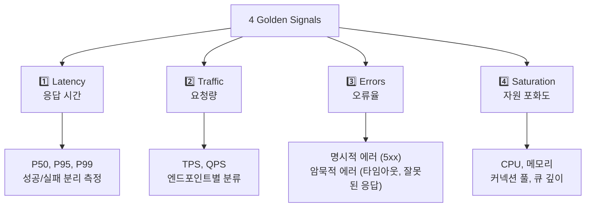
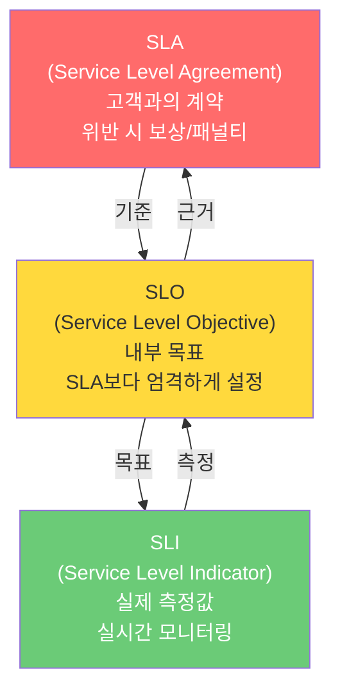
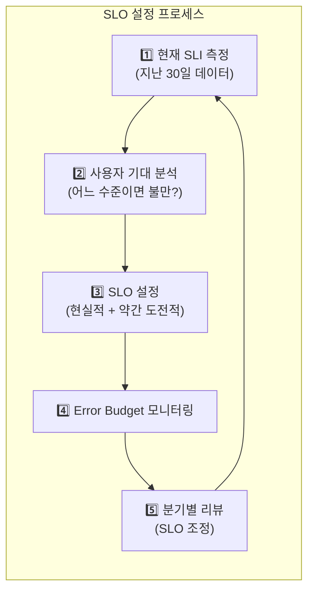
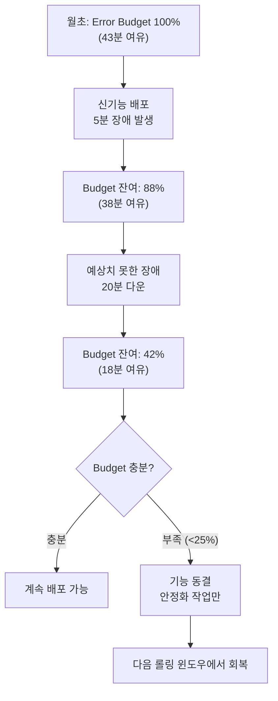
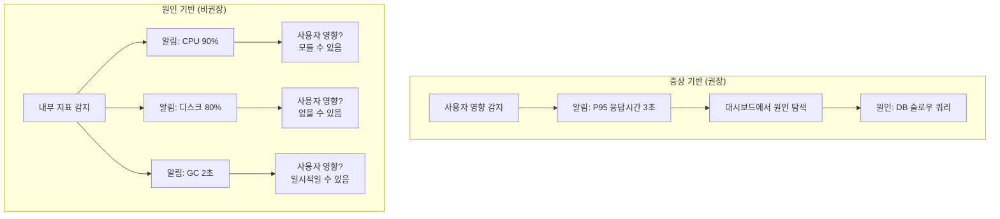
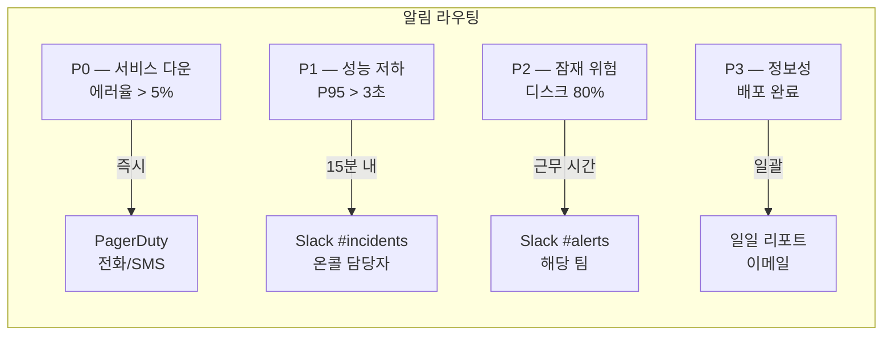
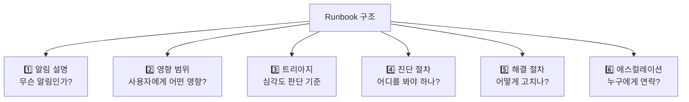
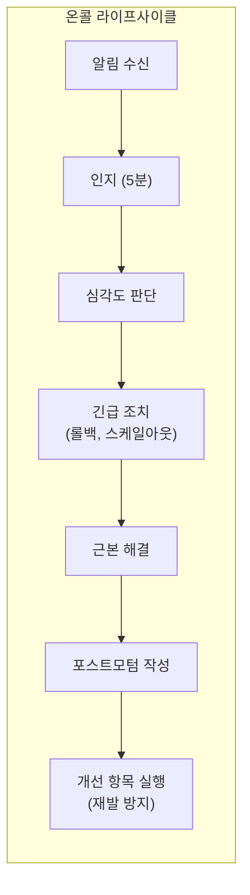

Google SRE가 정의한 **4대 골든 시그널**(Latency, Traffic, Errors, Saturation)을 중심으로 서비스 품질을 정량적으로 관리하는 방법론이다. "감으로 운영하는 시대"에서 "숫자로 증명하는 시대"로 전환하는 핵심 프레임워크다.

> **비유:** 자동차 계기판의 4대 핵심 게이지와 같다. 속도계(Traffic — 얼마나 많은 요청이 오는가), 엔진 온도계(Latency — 얼마나 빨리 처리하는가), 경고등(Errors — 뭐가 고장 났는가), 연료계(Saturation — 자원이 얼마나 남았는가). 이 네 가지만 정확히 보면 대부분의 문제를 조기에 감지할 수 있다.

---

## 왜 Golden Signals인가?

모니터링할 수 있는 메트릭은 수백 가지다. CPU, 메모리, 디스크 I/O, 네트워크 대역폭, GC 시간, 스레드 수, 커넥션 풀… 이 모든 것을 대시보드에 띄우면 **정보 과부하**로 정작 중요한 신호를 놓친다.

Google SRE 팀은 수년간의 운영 경험을 통해, **서비스 품질을 가장 잘 대변하는 4가지 신호**를 골라냈다. 이 4가지만 제대로 모니터링하면 대부분의 장애를 5분 이내에 감지할 수 있다.

> **비유:** 건강검진에서 수십 가지 항목을 검사하지만, 응급실에서는 **혈압, 맥박, 체온, 호흡수** 4가지(Vital Signs)만 먼저 확인한다. 이 4가지로 환자의 상태를 빠르게 판단하고, 이상이 있으면 정밀검사로 넘어간다. Golden Signals는 서비스의 Vital Signs다.

---

## 4대 골든 시그널 심화

### 전체 구조



### 1️⃣ Latency (응답 시간)

요청을 처리하는 데 걸리는 시간이다. 여기서 핵심은 **성공한 요청과 실패한 요청의 지연 시간을 분리**해야 한다는 것이다.

왜 분리해야 하는가? 에러 응답은 대개 매우 빠르다. DB에 연결도 하지 않고 바로 500을 반환하기 때문이다. 에러 응답의 빠른 지연 시간이 전체 평균을 끌어내려 "지연 시간이 정상"으로 보이게 만들 수 있다. 실제로는 성공 요청이 5초 걸리는데, 에러가 30%라서 평균이 3.5초로 나오는 상황이 발생한다.

> **비유:** 식당에서 주문을 받는 시간을 측정한다고 하자. 정상 주문은 15분 걸리는데, "품절입니다"라고 거절하는 경우는 10초 걸린다. 거절이 많아지면 **평균 서빙 시간이 오히려 줄어든다.** 식당이 더 빨라진 게 아니라 더 많이 거절하고 있는 것이다.

**측정 방법:**

평균(Average)은 쓰면 안 된다. 극단값에 의해 왜곡되기 때문이다. 99명이 100ms, 1명이 10초면 평균은 199ms인데 이는 아무 의미가 없다. 반드시 **백분위수(Percentile)**를 사용한다.

| 백분위수 | 의미 | 용도 |
|----------|------|------|
| P50 (중앙값) | 절반의 요청이 이보다 빠르다 | 일반 사용자 경험 |
| P95 | 95%의 요청이 이보다 빠르다 | SLO 설정 기준 |
| P99 | 99%의 요청이 이보다 빠르다 | 최악의 사용자 경험 |
| P99.9 | 1000명 중 999명이 이보다 빠르다 | 결제 등 핵심 경로 |

P95와 P99의 차이가 크다면(예: P95=200ms, P99=5s) **롱테일 지연**이 있다는 뜻이다. 대부분의 요청은 빠르지만, 소수의 요청이 극단적으로 느리다. 이런 요청의 원인을 분산 트레이싱으로 추적해야 한다.

```promql
# 성공 요청의 P95 응답시간 (실패 제외)
histogram_quantile(0.95,
  rate(http_server_requests_seconds_bucket{status!~"5.."}[5m])
)

# 실패 요청의 P95 응답시간 (분리 측정)
histogram_quantile(0.95,
  rate(http_server_requests_seconds_bucket{status=~"5.."}[5m])
)
```

**이 코드의 핵심:** `{status!~"5.."}` 필터로 성공 요청만 골라 P95를 계산한다. 에러의 빠른 응답이 정상 지연을 가리지 않도록 분리하는 것이 핵심이다.

### 2️⃣ Traffic (요청량)

시스템에 들어오는 요청의 양이다. 서비스 유형에 따라 측정 단위가 다르다.

| 서비스 유형 | 트래픽 측정 단위 | 예시 |
|------------|----------------|------|
| Web API | HTTP 요청/초 (TPS) | 초당 500 요청 |
| 스트리밍 | 세션 수, 대역폭 | 동시 1000 스트림 |
| 메시지 큐 | 메시지/초 | 초당 10K 메시지 |
| 데이터베이스 | 쿼리/초 (QPS) | 초당 2000 쿼리 |
| 배치 작업 | 처리 건수/분 | 분당 500건 |

Traffic은 그 자체로 문제를 나타내지 않지만, **다른 신호의 맥락**을 제공한다. "Latency가 3초로 증가했다"만으로는 원인을 알 수 없지만, "Traffic이 평소 대비 5배 증가하면서 Latency가 3초로 증가했다"면 용량 부족이 원인임을 알 수 있다.

> **비유:** 병원 응급실의 대기 시간이 2시간이라는 정보만으로는 원인을 모른다. 하지만 "교통사고가 나서 환자가 평소의 10배"라는 정보(Traffic)와 함께 보면 상황이 명확해진다.

```promql
# 엔드포인트별 TPS
sum by(uri) (rate(http_server_requests_seconds_count[5m]))

# 전체 트래픽 추이 (1시간 단위)
sum(increase(http_server_requests_seconds_count[1h]))
```

**이 코드의 핵심:** `sum by(uri)`로 엔드포인트별 트래픽을 분리한다. 전체 TPS가 정상이어도 특정 엔드포인트에 트래픽이 집중되면 해당 경로가 병목이 될 수 있다.

### 3️⃣ Errors (오류율)

실패한 요청의 비율이다. 오류는 두 가지로 나뉜다.

**명시적 오류(Explicit Errors):** HTTP 5xx 응답처럼 명확하게 실패를 반환하는 경우다. 이것은 측정이 쉽다.

**암묵적 오류(Implicit Errors):** HTTP 200을 반환했지만 내용이 잘못된 경우다. 예를 들어:
- 200 OK인데 응답 본문이 비어 있다
- 200 OK인데 결제가 실제로는 실패했다
- 200 OK인데 응답 시간이 SLO(2초)를 초과했다 (정책에 따라 에러로 간주)

> **비유:** 식당에서 "주문하신 음식입니다"라고 가져왔는데(200 OK), 열어보니 주문한 것과 다른 음식이 들어있다(암묵적 에러). 웨이터 입장에서는 "배달 완료"지만 고객 입장에서는 실패다.

암묵적 에러를 잡으려면 **비즈니스 메트릭**을 별도로 추적해야 한다.

```promql
# 명시적 에러율 (5xx / 전체)
sum(rate(http_server_requests_seconds_count{status=~"5.."}[5m]))
/ sum(rate(http_server_requests_seconds_count[5m]))

# 비즈니스 에러율 (결제 실패 / 결제 시도)
sum(rate(payment_failed_total[5m]))
/ sum(rate(payment_attempted_total[5m]))
```

**이 코드의 핵심:** HTTP 에러율과 비즈니스 에러율을 **둘 다** 모니터링해야 한다. HTTP 에러율이 0%여도 비즈니스 에러율이 40%일 수 있다. 기존 모니터링 도구 포스트의 극한 시나리오 1에서 다룬 것처럼, 기술 메트릭만 보면 놓치는 장애가 있다.

### 4️⃣ Saturation (포화도)

시스템 자원이 얼마나 가득 찼는지를 나타낸다. 대부분의 시스템은 **포화 상태에 가까워지면 급격히 성능이 저하**된다. CPU 80%까지는 괜찮다가 90%를 넘으면 응답 시간이 급격히 증가하는 비선형적 특성이 있다.

> **비유:** 고속도로 통행량과 같다. 수용량의 70%까지는 시속 100km로 달리지만, 90%가 되면 시속 30km로 떨어지고, 100%가 되면 완전히 멈춘다. **포화도가 70%일 때부터 대비**해야 100%에서 멈추는 것을 방지할 수 있다.

핵심 포화도 지표와 위험 임계값:

| 자원 | 경고 임계값 | 위험 임계값 | 왜 이 값인가 |
|------|-----------|-----------|-------------|
| CPU | 70% | 85% | 90% 넘으면 컨텍스트 스위칭 급증 |
| 메모리 | 75% | 90% | OOM Killer 발동 방지 |
| 디스크 | 75% | 90% | 로그, DB WAL 쓰기 실패 방지 |
| DB 커넥션 풀 | 80% | 95% | 풀 고갈 시 요청 대기/타임아웃 |
| 스레드 풀 | 70% | 85% | 스레드 고갈 시 요청 거부 |
| Kafka 컨슈머 랙 | 증가 추세 | 1분 이상 | 처리 속도 < 유입 속도 |

```promql
# DB 커넥션 풀 포화도 (HikariCP)
hikaricp_connections_active / hikaricp_connections_max

# JVM 힙 메모리 사용률
jvm_memory_used_bytes{area="heap"}
/ jvm_memory_max_bytes{area="heap"}

# 스레드 풀 포화도 (Tomcat)
tomcat_threads_busy_threads / tomcat_threads_config_max_threads
```

**이 코드의 핵심:** 포화도는 **비율**로 측정해야 한다. "커넥션 40개 사용 중"은 의미 없다. "커넥션 풀 50개 중 40개 사용 중(80%)"이어야 위험도를 판단할 수 있다.

---

## SLI / SLO / SLA — 서비스 품질의 계약 체계

### 세 개념의 관계



> **비유:** 학교 시험에 비유하면 이해가 쉽다.
> - **SLI**는 시험 점수 자체다 (82점)
> - **SLO**는 부모님과의 약속이다 ("이번 학기 평균 80점 이상 유지할게요")
> - **SLA**는 장학금 조건이다 ("평균 70점 미만이면 장학금 반환")
> - SLO(80점)를 SLA(70점)보다 높게 설정해야, SLO를 약간 못 채워도 SLA 위반은 피할 수 있다.

### SLI 설정 실전

SLI는 **사용자 경험과 직결되는 지표**여야 한다. 내부 시스템 메트릭(CPU 사용률)이 아니라 사용자가 체감하는 지표(응답 시간, 성공률)를 선택한다.

좋은 SLI는 0과 1 사이의 비율(또는 0%~100%)로 표현된다. "지난 30일 동안 성공적으로 처리된 요청의 비율"처럼 명확한 분자/분모가 있어야 한다.

| 서비스 유형 | SLI 예시 | 측정 방법 |
|------------|---------|----------|
| API 서버 | 가용성: 성공 응답 비율 | 200 응답 수 / 전체 요청 수 |
| API 서버 | 지연: P95 < 500ms인 요청 비율 | 500ms 이내 응답 수 / 전체 |
| 웹 프론트엔드 | 로딩 속도: LCP < 2.5초인 비율 | Web Vitals 측정 |
| 데이터 파이프라인 | 신선도: 30분 이내 처리된 비율 | 완료 시각 - 생성 시각 |
| 스토리지 | 내구성: 데이터 손실 없음 | 요청 대비 정상 응답 |

SLI를 정의할 때 가장 흔한 실수는 **서버 측 메트릭만 보는 것**이다. 서버에서 200 OK를 보냈지만 네트워크에서 패킷이 유실되면 사용자는 에러를 경험한다. 가능하면 **클라이언트 측 SLI**(RUM, Real User Monitoring)를 병행해야 한다.

> **비유:** 식당 리뷰 평점(클라이언트 SLI)과 주방 자체 품질 검사(서버 SLI)의 차이다. 주방에서 "완벽하게 요리했다"고 해도, 배달 중 음식이 쏟아졌으면 고객 평점은 1점이다.

### SLO 설정 실전

SLO는 "우리 서비스가 달성해야 할 목표"다. SLO를 설정할 때 가장 중요한 원칙은 **100%를 목표로 하지 않는 것**이다.

왜 99.99%가 아닌 99.9%인가? 99.99%와 99.9%의 차이는 0.09%에 불과해 보이지만, 허용되는 다운타임의 차이는 크다.

| SLO | 월간 허용 다운타임 | 연간 허용 다운타임 | 난이도 |
|-----|------------------|------------------|--------|
| 99% | 7시간 18분 | 3.65일 | 일반 |
| 99.9% | 43분 48초 | 8시간 46분 | 어려움 |
| 99.95% | 21분 54초 | 4시간 23분 | 매우 어려움 |
| 99.99% | 4분 23초 | 52분 34초 | 극한 (Google급) |

99.99%를 달성하려면 자동화된 장애 복구, 다중 리전 이중화, 무중단 배포가 모두 필요하다. 비용이 99.9%의 10배 이상 든다. 따라서 **서비스의 중요도에 맞는 적절한 수준**을 선택해야 한다.



실전 SLO 설정 예시를 보자. 핵심은 **모든 엔드포인트에 동일한 SLO를 적용하지 않는 것**이다. 결제 API는 99.99%가 필요하지만, 마이페이지 API는 99.9%면 충분하다.

```yaml
# SLO 정의 문서 (팀 공유용)
slos:
  - name: "결제 API 가용성"
    sli: "POST /api/payments 성공률"
    target: 99.99%
    window: 30d (rolling)
    rationale: "결제 실패 = 직접 매출 손실"

  - name: "결제 API 지연"
    sli: "POST /api/payments P95 응답시간 < 1초"
    target: 99.9%
    window: 30d (rolling)
    rationale: "결제 대기 3초 초과 시 이탈률 급증"

  - name: "상품 목록 API 가용성"
    sli: "GET /api/products 성공률"
    target: 99.9%
    window: 30d (rolling)
    rationale: "일시적 실패 시 재시도로 충분"
```

**이 설정의 핵심:** `window: 30d (rolling)`은 **30일 롤링 윈도우**를 의미한다. 달력 기준 1월 1일~31일이 아니라, 항상 "지난 30일"을 기준으로 한다. 이렇게 하면 월초에 장애가 나도 30일 뒤에 자연스럽게 빠져나간다.

### SLA와 SLO의 관계

SLA는 고객과의 법적 계약이므로, SLO보다 **여유 있게(낮게)** 설정한다.

```
SLO: 99.95% (내부 목표 — 더 엄격)
        ↑ 여유 구간 (0.05%)
SLA: 99.9%  (고객 계약 — 더 관대)
```

SLO를 위반했다면 아직 SLA는 안전하지만, 팀은 이미 경각심을 갖고 대응한다. SLO 없이 SLA만 있으면 "SLA 직전까지는 괜찮다"는 안이한 태도가 생긴다.

> **비유:** 자동차 연료 경고등이 연료가 10% 남았을 때 켜진다(SLO 위반). 실제로 차가 멈추는 것은 0%일 때다(SLA 위반). 경고등 없이 0%에서 갑자기 멈추면 고속도로 한복판에서 사고가 난다.

---

## Error Budget — 혁신과 안정의 균형

Error Budget(에러 예산)은 SRE의 가장 혁신적인 개념이다. "100%에서 SLO를 뺀 것"이 Error Budget이다.

SLO가 99.9%라면, Error Budget은 0.1%다. 30일 기준으로 0.1%는 약 43분이다. 즉, **한 달에 43분까지는 서비스가 불안정해도 괜찮다**는 뜻이다.

> **비유:** 학생의 용돈(Error Budget)과 같다. 한 달 용돈이 10만원(0.1%)이다. 이 돈으로 새 게임(신기능 배포)을 살 수도 있고, 친구들과 놀러 갈 수도 있다(리팩토링, 실험). 하지만 용돈을 다 쓰면 남은 달은 집에서 공부만 해야 한다(기능 동결, 안정화만). **용돈이 남아 있을 때 쓸 수 있는 것이지, 빚지면 안 된다.**

### Error Budget의 동작 원리



Error Budget이 중요한 이유는 **개발팀과 운영팀 간의 갈등을 해소**하기 때문이다.

개발팀은 빠르게 기능을 배포하고 싶고, 운영팀은 안정적으로 운영하고 싶다. 이 두 목표는 항상 충돌한다. Error Budget은 이 갈등을 **숫자로 해결**한다.

- Budget이 남아 있다 → "배포해도 됩니다. 약간의 장애는 예산 안에 있습니다."
- Budget을 다 썼다 → "이번 달은 배포 중단입니다. 안정화 작업만 합니다."

### Error Budget 정책 수립

조직에서 Error Budget을 운영하려면 명확한 정책이 필요하다. Budget 소진율에 따른 행동 기준을 미리 정해야 한다.

| Budget 잔여 | 상태 | 조치 |
|------------|------|------|
| 75~100% | 녹색 | 정상 배포, 실험 가능 |
| 50~75% | 황색 | 주의, 위험한 변경 자제 |
| 25~50% | 주황 | 배포 빈도 줄임, 카나리 배포 필수 |
| 0~25% | 적색 | 기능 동결, 안정화/자동화만 허용 |
| 0% 이하 (초과) | 비상 | 포스트모텀 필수, 경영진 보고 |

> **비유:** 국가의 재정 적자 경보와 같다. 재정이 건전하면(Budget 충분) 복지 정책(신기능)을 확대할 수 있다. 적자가 심해지면(Budget 소진) 긴축 재정(기능 동결)으로 전환한다. 적자가 GDP의 일정 비율을 넘으면(Budget 초과) IMF(경영진)에 보고해야 한다.

### Error Budget 계산 실전

30일 롤링 윈도우에서 SLO 99.9%의 Error Budget을 계산하는 과정을 보자.

전체 요청에서 실패 비율을 계산하고, SLO 목표와의 차이가 남은 Budget이다. PromQL로 표현하면 아래와 같다. 이 쿼리는 30일간의 성공률을 계산하여 SLO 목표(0.999)에서 뺀 것이 남은 Budget 비율이다.

```promql
# 30일간 에러 비율 (실제 SLI)
1 - (
  sum(increase(http_server_requests_seconds_count{status!~"5.."}[30d]))
  / sum(increase(http_server_requests_seconds_count[30d]))
)

# Error Budget 소진율 (%)
# (실제 에러율 / 허용 에러율) * 100
(
  1 - sum(increase(http_server_requests_seconds_count{status!~"5.."}[30d]))
      / sum(increase(http_server_requests_seconds_count[30d]))
)
/ (1 - 0.999) * 100
```

**이 코드의 핵심:** 두 번째 쿼리의 결과가 100%를 넘으면 Error Budget을 모두 소진한 것이다. 예를 들어 실제 에러율이 0.2%이고 허용 에러율(1-SLO)이 0.1%라면, 소진율은 200%로 Budget을 2배 초과한 상태다.

---

## Alerting 전략 — 증상 기반 vs 원인 기반

### 원인 기반 알림의 문제

전통적인 알림은 **원인(Cause)**에 초점을 맞춘다. "CPU 90% 초과", "디스크 80% 초과", "GC 시간 2초 초과" 같은 알림이다. 문제는 이런 알림이 **사용자에게 영향을 주지 않을 수도 있다**는 것이다.

CPU가 90%여도 응답 시간이 정상이면 사용자는 아무 문제를 느끼지 않는다. GC가 2초 걸려도 동시에 처리할 여유 스레드가 있으면 사용자 요청은 지연되지 않는다. 이런 "실제 영향 없는 알림"이 쌓이면 **Alert Fatigue(알림 피로)**가 발생하여, 정작 중요한 알림이 왔을 때 무시하게 된다.

> **비유:** 화재 경보기가 토스트 태울 때마다 울리면(원인 기반), 진짜 화재가 났을 때 "또 토스트겠지"하고 무시하게 된다. 경보기가 "실내 온도가 60도를 넘었습니다"(증상 기반)라고 알려주면, 토스트로는 울리지 않고 진짜 화재에만 울린다.

### 증상 기반 알림

증상(Symptom) 기반 알림은 **사용자가 실제로 영향을 받는 상황**에만 발생한다. "에러율 1% 초과", "P95 응답시간 2초 초과"처럼 Golden Signals를 기반으로 한다.



### 알림 설계 원칙

좋은 알림 시스템의 원칙은 다음과 같다:

**1. 모든 알림은 행동(action)을 요구해야 한다.** 알림을 받았는데 할 수 있는 일이 없다면, 그것은 알림이 아니라 소음이다. "CPU 90%"를 받고 "음, 알겠어"하고 넘기면 그 알림은 필요 없다.

**2. 알림은 긴급도에 따라 라우팅해야 한다.** 모든 알림을 Slack에 보내면, P0(서비스 다운)과 P2(디스크 경고)가 같은 채널에 섞여 P0을 놓친다.

**3. 알림에는 컨텍스트가 포함되어야 한다.** "에러율 높음"만으로는 부족하다. 어느 서비스, 어느 엔드포인트, 현재 값, 관련 대시보드 링크가 포함되어야 한다.



### 알림 규칙 실전 예시

좋은 알림 규칙의 핵심 요소를 살펴보자. `for` 절은 조건이 일정 시간 **지속**되어야 알림을 발생시킨다. 일시적 스파이크로 알림이 울리는 것을 방지한다.

`annotations`에 `runbook_url`을 포함하는 것이 매우 중요하다. 새벽 3시에 알림을 받은 온콜 엔지니어가 잠이 덜 깬 상태에서도 Runbook을 따라 문제를 해결할 수 있어야 한다.

```yaml
groups:
  - name: golden-signals
    rules:
      # 증상 기반: 사용자가 체감하는 문제
      - alert: HighErrorRate
        expr: |
          sum(rate(http_server_requests_seconds_count{status=~"5.."}[5m]))
          / sum(rate(http_server_requests_seconds_count[5m])) > 0.01
        for: 3m
        labels:
          severity: critical
          team: backend
        annotations:
          summary: "에러율 {{ $value | humanizePercentage }} (임계: 1%)"
          dashboard: "https://grafana.example.com/d/golden-signals"
          runbook_url: "https://wiki.example.com/runbooks/high-error-rate"

      # Error Budget 소진 속도 알림
      - alert: ErrorBudgetBurnRate
        expr: |
          (
            1 - sum(increase(http_server_requests_seconds_count{status!~"5.."}[1h]))
                / sum(increase(http_server_requests_seconds_count[1h]))
          ) / (1 - 0.999) > 14.4
        for: 5m
        labels:
          severity: critical
        annotations:
          summary: "Error Budget 소진 속도 14.4배 초과 (1시간 기준)"
          description: "이 속도면 24시간 안에 월간 Budget 전량 소진"
          runbook_url: "https://wiki.example.com/runbooks/error-budget-burn"
```

**이 코드의 핵심:** `ErrorBudgetBurnRate` 알림은 Google SRE 책에서 소개된 **Burn Rate** 기법이다. 14.4배는 "1시간의 에러율이 계속되면 24시간 안에 30일치 Budget을 전량 소진한다"는 의미다. 단순히 "Budget 50% 남음"보다 "이 속도면 내일 0%"가 더 긴급함을 잘 전달한다.

**Burn Rate 계산:** 30일 Budget을 1시간(1/720) 만에 소진하는 속도가 Burn Rate 1이다. 14.4배면 30일 ÷ 14.4 = 약 2.08일 = 약 50시간 만에 전량 소진된다. (계산: 14.4 × (1/720) × 30 = 0.6 → 하루에 Budget의 60% 소진 → 약 1.67일 만에 전량)

---

## Runbook 작성법

Runbook은 장애 발생 시 **누가 대응하더라도 동일한 품질로** 문제를 해결할 수 있도록 작성한 표준 운영 절차서다.

> **비유:** 비행기 비상 착륙 체크리스트와 같다. 조종사가 아무리 숙련되어도 비상 상황에서는 패닉에 빠질 수 있다. 체크리스트가 있으면 순서대로 따라가면 된다. "1. 엔진 정지 확인 → 2. 보조 전원 ON → 3. 관제탑 통보 → 4. 착륙 준비". Runbook은 장애 대응의 체크리스트다.

### Runbook 필수 구성요소

좋은 Runbook은 다음 6가지를 반드시 포함한다:



### Runbook 예시: HighErrorRate

실전에서 사용하는 Runbook의 구조를 보자. 새벽 3시에 알림을 받은 주니어 엔지니어가 이 문서만 보고 대응할 수 있어야 한다.

```markdown
# Runbook: HighErrorRate

## 알림 설명
서비스의 HTTP 5xx 에러율이 1%를 3분 이상 초과했을 때 발생한다.

## 사용자 영향
- 일부 사용자의 요청이 실패하고 있다
- 결제/주문 기능이 영향받을 수 있다

## 심각도 판단
| 에러율 | 심각도 | 조치 |
|--------|--------|------|
| 1~5%   | P1     | 15분 내 대응 |
| 5~20%  | P0     | 즉시 대응 |
| 20%+   | P0     | 즉시 대응 + 리더 호출 |

## 진단 절차 (순서대로)
1. Grafana 대시보드 확인: [링크]
   - 어떤 엔드포인트에서 에러가 발생하는가?
   - 언제부터 시작되었는가?
   - 최근 배포가 있었는가?

2. 에러 로그 확인: Kibana에서 traceId로 검색
   - 에러 메시지 패턴 확인
   - 특정 서버에 집중되는가?

3. 의존성 확인:
   - DB 커넥션 상태 확인
   - 외부 API 응답 확인
   - Kafka 컨슈머 랙 확인

## 해결 절차
### 배포가 원인인 경우
1. 최근 배포 확인: `kubectl rollout history deployment/myapp`
2. 롤백: `kubectl rollout undo deployment/myapp`
3. 에러율 정상화 확인 (5분 대기)

### DB 커넥션 부족인 경우
1. HikariCP 풀 상태 확인
2. 슬로우 쿼리 확인: `SHOW PROCESSLIST`
3. 장시간 트랜잭션 kill

### 외부 API 장애인 경우
1. Circuit Breaker 상태 확인
2. Fallback 동작 여부 확인
3. 외부 서비스 상태 페이지 확인

## 에스컬레이션
| 시간 | 연락 대상 |
|------|-----------|
| 즉시 | 온콜 담당자 (PagerDuty) |
| 15분 미해결 | 테크리드 |
| 30분 미해결 | 엔지니어링 매니저 |
| 1시간 미해결 | CTO |
```

**이 Runbook의 핵심:** 진단 절차가 **순서대로** 되어 있다. 가장 가능성 높은 원인(최근 배포)부터 확인하고, 점차 범위를 넓힌다. 또한 각 단계에서 **구체적인 명령어/링크**가 있어 "어떻게 확인하지?"라고 고민할 시간을 없앤다.

---

## 온콜 운영

### 온콜이란?

온콜(On-Call)은 근무 시간 외에도 장애 대응을 위해 **즉시 연락 가능한 상태를 유지하는 엔지니어**를 지정하는 제도다.

> **비유:** 병원의 당직 의사와 같다. 평소에는 정규 근무만 하지만, 당직일에는 야간에도 응급 환자가 오면 즉시 대응해야 한다. 항상 연락 가능하고, 30분 이내에 대응할 수 있어야 한다.

### 건강한 온콜 문화

좋은 온콜 시스템의 핵심 원칙을 살펴보자.

**1. 온콜 로테이션:** 한 사람이 계속 온콜을 맡으면 번아웃된다. 최소 4~6명이 교대해야 한다. 1주일 온콜 → 3~5주 비온콜이 건강한 비율이다.

**2. 대응 시간 보장:** P0 알림은 5분 이내 인지, 15분 이내 대응 시작이 기준이다. 이를 위해 온콜 기간에는 노트북과 인터넷 접속이 항상 가능해야 한다.

**3. 보상:** 온콜 수당, 대체 휴무, 심야 대응 시 다음 날 늦출근 등 명확한 보상이 있어야 한다. 보상 없는 온콜은 팀의 사기를 떨어뜨린다.

**4. 포스트모텀(Postmortem):** 장애가 발생하면 반드시 원인 분석 문서를 작성한다. 핵심은 **비난 금지(Blameless)**다. "누가 잘못했나"가 아니라 "시스템에 어떤 취약점이 있었나"에 집중한다.



### 포스트모텀 템플릿

```markdown
# 포스트모텀: [장애 제목]

## 요약
- 일시: 2026-05-03 14:00 ~ 14:45 (45분)
- 영향: 결제 서비스 50% 실패 (약 1,200명 영향)
- 심각도: P0
- 온콜 담당: 홍길동

## 타임라인
- 14:00 — DB 마이그레이션 스크립트 실행
- 14:05 — 에러율 알림 발생 (HighErrorRate)
- 14:07 — 온콜 담당자 인지
- 14:10 — DB 락 확인, 마이그레이션이 테이블 락 보유 중
- 14:15 — 마이그레이션 프로세스 kill
- 14:20 — 에러율 정상화 확인
- 14:45 — 완전 정상화 확인, 장애 종료 선언

## 근본 원인
대용량 테이블(1억 건)에 ALTER TABLE을 실행하면서
테이블 락이 45분간 유지됨. 락 대기로 커넥션 풀 고갈.

## 재발 방지 (Action Items)
1. [ ] DDL 변경 시 pt-online-schema-change 사용 의무화
2. [ ] 프로덕션 DDL 실행 전 DBA 리뷰 프로세스 추가
3. [ ] DB 커넥션 풀 포화도 알림 추가 (80% 임계)

## 교훈
- 스테이징 환경의 데이터 규모(1만 건)와 프로덕션(1억 건)의
  차이로 인해 락 시간을 과소 예측했다
- DDL 실행 영향도를 데이터 규모 기준으로 사전 검증해야 한다
```

---

<details class="extreme-scenario-details" ontoggle="if(this.open){var ad=this.querySelector('.extreme-scenario-ad');if(ad&&!ad.dataset.loaded){ad.dataset.loaded='1';(adsbygoogle=window.adsbygoogle||[]).push({});}}">
<summary class="extreme-scenario-summary">
<span class="extreme-scenario-icon">🔥</span>
<span class="extreme-scenario-label">극한 시나리오 — 클릭하여 펼치기</span>
<span class="extreme-scenario-toggle"></span>
</summary>
<div class="extreme-scenario-body">
<div class="extreme-scenario-ad" style="text-align:center; margin-bottom:1.5em;">
<ins class="adsbygoogle"
     style="display:block"
     data-ad-client="ca-pub-7225106491387870"
     data-ad-slot="0000000000"
     data-ad-format="auto"
     data-full-width-responsive="true"></ins>
</div>
<div class="extreme-scenario-content" markdown="1">

### 시나리오 1: SLO 99.9%인데 사용자 불만이 폭주한다

SLI가 99.92%로 SLO(99.9%)를 충족하고 있는데, 고객 불만 건수가 급증한다.

**원인 분석:** SLI를 서버 측 성공률로만 측정하고 있었다. 서버에서는 200 OK를 보냈지만, CDN 캐시 만료로 프론트엔드 정적 자원 로딩에 5초가 걸려 사용자 체감 성능이 크게 저하된 것이다.

**해결:** 서버 측 SLI 외에 **클라이언트 측 SLI**를 추가한다. Core Web Vitals(LCP, FID, CLS)를 측정하여 사용자 체감 성능을 SLO에 포함한다. SLI의 측정 지점을 서버에서 클라이언트로 옮기면 네트워크, CDN, 브라우저 렌더링까지 포함한 진짜 사용자 경험을 반영할 수 있다.

> **비유:** 식당이 "주방 출고 시간 3분 이내"(서버 SLI)를 달성했는데, 웨이터가 부족해서 음식이 테이블에 도착하는 데 20분 걸렸다(클라이언트 SLI). 주방 기준으로는 SLO 달성이지만, 고객 기준으로는 완전히 실패다.

### 시나리오 2: Error Budget을 하루 만에 전량 소진했다

새벽에 배포한 버전에 치명적 버그가 있어 4시간 동안 에러율이 30%였다. 30일치 Error Budget(43분)을 훨씬 초과했다.

**즉시 대응:**
1. 롤백 (즉시)
2. P0 포스트모텀 소집
3. 이번 달 남은 기간 동안 **기능 동결** 선언
4. 안정화 작업과 자동화만 허용

**재발 방지:**
1. 카나리 배포 의무화 (전체 배포 전 5% 트래픽으로 10분 관찰)
2. 배포 후 자동 에러율 체크 → 임계값 초과 시 자동 롤백
3. 심야 배포 금지 정책 (사람이 적을 때 문제 감지가 늦어진다)

### 시나리오 3: Alert Fatigue로 P0 알림을 놓쳤다

하루에 200개 알림이 오다 보니, 온콜 엔지니어가 알림을 무시하는 습관이 생겼다. 진짜 서비스 다운 알림(P0)도 30분간 방치됐다.

**원인:** 원인 기반 알림이 너무 많다. CPU 70%, 디스크 60%, GC 1초 같은 "사용자 영향 없는" 알림이 전체의 90%를 차지한다.

**해결:**
1. 모든 알림을 감사하여 "지난 30일간 action이 필요 없었던 알림"을 삭제한다
2. 원인 기반 알림을 대시보드 지표로 전환한다 (알림은 제거)
3. 증상 기반 알림만 남긴다 (에러율, 응답시간, 가용성)
4. P0 알림은 별도 채널(PagerDuty + 전화)로 격리한다
5. **알림 개수 SLO를 설정한다**: "주당 페이저 알림 5건 이하"

> **비유:** 양치기 소년 이야기와 정확히 같다. 거짓 경보가 반복되면 진짜 경보도 무시하게 된다. 해결책은 거짓 경보를 없애는 것이지, "무시하지 마세요"라고 교육하는 것이 아니다.

### 시나리오 4: 100K TPS 서비스의 SLO 모니터링

초당 10만 요청이 오는 서비스에서 SLI를 실시간으로 계산하면 Prometheus 쿼리가 무거워진다.

**해결:**
1. **Recording Rules**로 SLI를 사전 계산한다. 매번 쿼리하는 대신, 15초마다 결과를 새 시계열로 저장한다.
2. 30일 롤링 윈도우 대신 **다중 윈도우**를 사용한다 (1시간, 6시간, 1일, 30일). 짧은 윈도우로 급격한 변화를 감지하고, 긴 윈도우로 전체 추세를 본다.
3. Error Budget Burn Rate를 **두 개의 윈도우**로 동시 평가한다: 빠른 소진(1시간)과 느린 소진(6시간). 둘 다 임계값을 초과할 때만 알림을 보내 오탐을 줄인다.

```yaml
# Recording Rule: SLI를 사전 계산
groups:
  - name: sli-recording
    interval: 15s
    rules:
      - record: sli:availability:ratio_rate5m
        expr: |
          sum(rate(http_server_requests_seconds_count{status!~"5.."}[5m]))
          / sum(rate(http_server_requests_seconds_count[5m]))

      - record: sli:availability:ratio_rate30d
        expr: |
          sum(increase(http_server_requests_seconds_count{status!~"5.."}[30d]))
          / sum(increase(http_server_requests_seconds_count[30d]))
```

**이 코드의 핵심:** `record` 규칙으로 SLI를 사전 계산하면, 대시보드나 알림 규칙에서 이 시계열을 바로 참조할 수 있다. 매번 30일치 데이터를 집계하는 무거운 쿼리 대신, 미리 계산된 값을 읽기만 하면 된다.

---
</div>
</div>
</details>

## 실무에서 자주 하는 실수

### 1. SLO를 100%로 설정한다

"우리 서비스는 절대 장애가 없어야 한다"는 이상적이지만 비현실적이다. 100% SLO는 **모든 변경을 위험으로 간주**하게 만들어, 배포 속도가 극도로 느려지고 혁신이 멈춘다. Google조차 내부 서비스의 SLO를 99.99%로 설정한다.

### 2. SLO를 설정하고 Error Budget을 운영하지 않는다

SLO만 있고 Error Budget 정책이 없으면, SLO를 위반해도 "다음 달에 잘하면 되지"로 넘어간다. Budget 잔여량에 따른 **자동 행동 트리거**(배포 속도 조절, 기능 동결)가 없으면 SLO는 그냥 숫자에 불과하다.

### 3. 모든 서비스에 동일한 SLO를 적용한다

결제 서비스와 마케팅 배너 서비스에 같은 SLO(99.99%)를 적용하면, 배너 서비스에 과도한 엔지니어링 비용이 들고, 정작 결제 서비스에 집중하지 못한다. **비즈니스 중요도에 따라 차등 SLO**를 설정해야 한다.

### 4. 평균값으로 SLI를 측정한다

"평균 응답 시간 200ms"는 아무 의미 없다. 99%가 50ms이고 1%가 15초라면 평균은 200ms인데, 1%의 사용자는 극심한 지연을 겪는다. 반드시 **백분위수(P95, P99)**를 사용한다.

### 5. 알림에 Runbook 링크가 없다

"HighErrorRate" 알림이 왔는데 무엇을 해야 하는지 모른다. 코드를 뒤지고, 선배에게 전화하고, Slack을 검색하는 동안 장애 대응 시간이 30분 → 2시간으로 늘어난다. **모든 알림에는 Runbook URL이 있어야 한다.**

---

## 면접 포인트

### Q1. "4대 Golden Signals을 설명하고, 왜 이 4개인지 설명하시오."

**모범 답변:** Latency(응답 시간), Traffic(요청량), Errors(오류율), Saturation(자원 포화도). 이 4가지는 서비스 품질을 가장 포괄적으로 대변한다. Traffic은 부하의 양을, Latency는 성능을, Errors는 정확성을, Saturation은 용량을 나타낸다. 4개 중 어느 하나라도 이상이면 사용자 경험에 영향을 준다. 특히 Latency 측정 시 성공/실패 요청을 분리해야 한다.

### Q2. "SLI, SLO, SLA의 차이를 실제 예시와 함께 설명하시오."

**모범 답변:** SLI는 측정값(지난 30일 가용성 99.95%), SLO는 내부 목표(가용성 >= 99.9%), SLA는 고객 계약(가용성 < 99.5% 시 크레딧 제공). SLO는 SLA보다 엄격하게 설정하여 SLA 위반 전에 경고를 받는다. 결제 서비스는 SLO 99.99%, 마이페이지는 99.9%처럼 비즈니스 중요도에 따라 차등 설정한다.

### Q3. "Error Budget이란 무엇이며, 어떻게 운영하는가?"

**모범 답변:** 100% - SLO가 Error Budget이다. SLO 99.9%면 월 43분의 장애가 허용된다. Budget이 남아 있으면 신기능 배포와 실험이 가능하고, 소진되면 기능 동결하고 안정화 작업만 한다. 이를 통해 개발(혁신)과 운영(안정)의 갈등을 숫자로 해결한다. Burn Rate 알림으로 소진 속도를 모니터링한다.

### Q4. "증상 기반 알림과 원인 기반 알림의 차이는?"

**모범 답변:** 원인 기반은 "CPU 90%"처럼 내부 지표에 대한 알림이다. 사용자 영향이 없어도 울려서 Alert Fatigue를 유발한다. 증상 기반은 "에러율 1% 초과", "P95 응답시간 2초 초과"처럼 사용자가 체감하는 문제에 대한 알림이다. 증상 기반을 주력으로 하고, 원인 기반은 대시보드 지표로 활용한다.

### Q5. "Runbook에 반드시 포함되어야 할 요소는?"

**모범 답변:** 알림 설명, 사용자 영향 범위, 심각도 판단 기준, 진단 절차(순서대로, 구체적 명령어/링크 포함), 해결 절차(원인별 분류), 에스컬레이션 경로(시간별 연락 대상). 핵심은 새벽 3시에 주니어 엔지니어가 이 문서만 보고 대응할 수 있어야 한다는 것이다.

---

## 핵심 정리

| 개념 | 핵심 |
|------|------|
| 4 Golden Signals | Latency, Traffic, Errors, Saturation — 서비스의 Vital Signs |
| Latency | 반드시 백분위수(P95/P99), 성공/실패 분리 측정 |
| Errors | 명시적(5xx) + 암묵적(비즈니스 실패) 모두 추적 |
| Saturation | 비율로 측정, 70%부터 대비, 90%에서 급격한 성능 저하 |
| SLI | 사용자 체감 기반 측정 지표 (0~1 비율) |
| SLO | 내부 목표, SLA보다 엄격, 서비스별 차등 설정 |
| SLA | 고객 계약, 위반 시 보상/패널티 |
| Error Budget | 100% - SLO, 혁신과 안정의 균형 도구 |
| 증상 기반 알림 | 사용자 영향 기반, Alert Fatigue 방지 |
| Runbook | 장애 대응 표준 절차서, 누구나 따라할 수 있게 |
| 포스트모텀 | Blameless, 시스템 취약점 분석, 재발 방지 |
