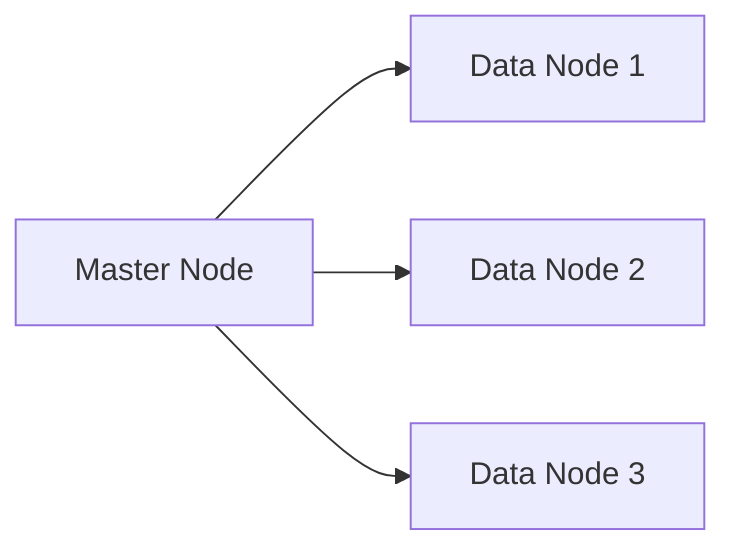
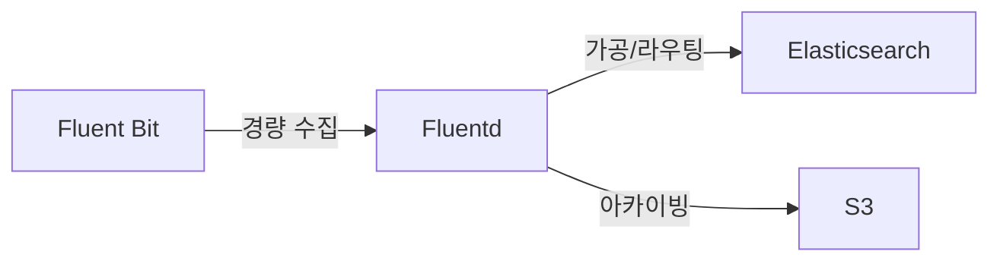
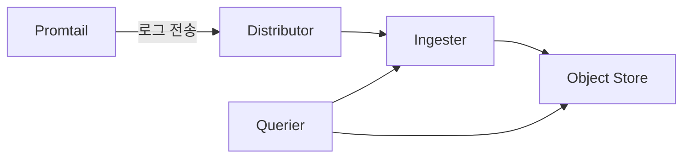
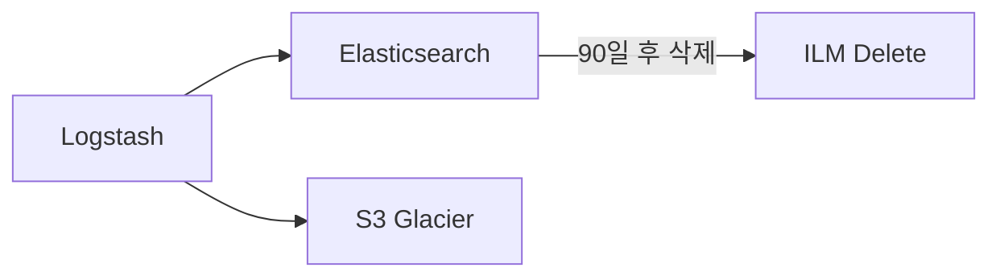

하루에 10억 줄의 로그가 쌓인다면 어떻게 될까. 파일에 그냥 쓰면 수 TB가 되고, 검색은 불가능해진다. 로그 파이프라인은 이 데이터를 실시간으로 수집하고, 가공하고, 저장해서 밀리초 단위로 검색 가능하게 만드는 시스템이다. ELK 스택부터 Loki까지, 파이프라인을 설계하는 모든 원리를 해부한다.

---

## 1. 왜 로그 파이프라인이 필요한가

단일 서버 시절에는 `tail -f /var/log/app.log`로 충분했다. 서버 한 대, 로그 파일 몇 개. 직접 SSH로 들어가면 됐다.

마이크로서비스 환경은 다르다.

- 서비스 50개, 인스턴스 각 10개 = 500개 서버에 로그가 분산
- 하나의 요청이 10개 서비스를 거침 — 어느 서버에 로그가 있는지 모름
- 컨테이너는 죽으면 로그도 사라짐
- 초당 수십만 줄 생성 — 파일로는 검색 불가

로그 파이프라인은 이 모든 곳의 로그를 **중앙으로 끌어모으고**, **검색 가능한 형태로** 저장한다. 도서관 사서가 전국 모든 책을 수집해서 색인을 붙이는 작업과 같다.

---

## 2. 로그 파이프라인의 기본 구조

모든 로그 파이프라인은 같은 세 단계로 구성된다.


- **수집**: 여러 소스(파일, stdout, syslog, 애플리케이션)에서 로그를 읽는다
- **가공**: 파싱, 필터링, 변환, 보강(enrich)
- **저장**: 검색 엔진(Elasticsearch) 또는 오브젝트 스토리지(S3 + Loki)
- **검색**: 인덱스 기반(ES) 또는 레이블 기반(Loki)

---

## 3. ELK 스택 — 가장 널리 쓰이는 구조

ELK는 Elasticsearch, Logstash, Kibana의 약자다. 여기에 Beats(Filebeat)가 추가되면 BELK 또는 ELK+Beats라고 부른다.


### 3-1. Elasticsearch — 검색 엔진의 핵심

Elasticsearch는 Apache Lucene 기반의 분산 검색 엔진이다. 로그를 저장하는 데이터베이스이자 검색 엔진 역할을 동시에 한다.

핵심 개념:

**인덱스(Index)**: 데이터를 저장하는 논리적 단위. RDB의 테이블에 해당한다. 로그는 보통 날짜별로 인덱스를 분리한다. `logs-2026.05.15`, `logs-2026.05.16` 형식.

**샤드(Shard)**: 인덱스를 물리적으로 쪼갠 단위. 인덱스 하나가 너무 크면 검색이 느려진다. 샤드로 나누면 여러 노드에 분산해서 병렬 검색이 가능하다.

```
인덱스: logs-2026.05.15
  Primary Shard 0 → Node 1
  Primary Shard 1 → Node 2
  Primary Shard 2 → Node 3
  Replica Shard 0 → Node 2  (Shard 0의 복제본)
  Replica Shard 1 → Node 3
  Replica Shard 2 → Node 1
```

**역인덱스(Inverted Index)**: 검색이 빠른 비결. 일반 인덱스는 문서 → 단어 매핑이지만, 역인덱스는 단어 → 문서 목록 매핑이다.

```
"ERROR" → [doc_id: 1, 4, 7, 12, ...]
"NullPointer" → [doc_id: 4, 12, ...]
"UserService" → [doc_id: 1, 4, ...]
```

"ERROR AND NullPointer" 검색 시 두 목록의 교집합만 찾으면 된다. 전체 문서를 스캔할 필요가 없다.

### 3-2. Elasticsearch 클러스터 구조



- **Master Node**: 클러스터 상태 관리, 샤드 할당 결정. 데이터를 직접 저장하지 않는다. 홀수로 3개 이상 구성 (Split-Brain 방지).
- **Data Node**: 실제 데이터 저장과 검색 처리. 가장 많은 리소스 필요.
- **Coordinating Node**: 검색 요청을 받아 각 샤드에 분산하고 결과를 합친다. 별도 역할 없이 모든 노드가 기본으로 수행.

### 3-3. 매핑(Mapping) — 스키마 설계

Elasticsearch는 기본적으로 동적 매핑을 지원한다. 새 필드가 들어오면 자동으로 타입을 추론해서 저장한다. 편리하지만 위험하다.

```json
PUT /logs-template
{
  "mappings": {
    "dynamic": "strict",
    "properties": {
      "@timestamp": { "type": "date" },
      "level": { "type": "keyword" },
      "service": { "type": "keyword" },
      "traceId": { "type": "keyword" },
      "message": {
        "type": "text",
        "analyzer": "standard"
      },
      "duration_ms": { "type": "long" },
      "http": {
        "properties": {
          "method": { "type": "keyword" },
          "status": { "type": "integer" },
          "path": { "type": "keyword" }
        }
      }
    }
  }
}
```

`keyword`는 정확한 일치 검색에 최적화, `text`는 전문(full-text) 검색용. 로그 레벨, 서비스 이름은 `keyword`, 에러 메시지는 `text`.

`dynamic: strict`를 설정하면 매핑에 없는 필드가 들어올 때 에러를 발생시킨다. 예상치 못한 필드가 인덱스를 오염시키는 것을 방지한다.

---

## 4. Logstash — 데이터 가공 파이프라인

Logstash는 입력(Input) → 필터(Filter) → 출력(Output) 파이프라인으로 로그를 가공한다.

### 4-1. 기본 파이프라인 구조

```ruby
# /etc/logstash/conf.d/app-logs.conf

input {
  beats {
    port => 5044
  }
}

filter {
  # JSON 로그 파싱
  if [fields][format] == "json" {
    json {
      source => "message"
      target => "parsed"
    }
    mutate {
      rename => { "[parsed][level]" => "level" }
      rename => { "[parsed][traceId]" => "trace_id" }
      rename => { "[parsed][message]" => "log_message" }
    }
  }

  # 날짜 파싱
  date {
    match => ["[parsed][timestamp]", "ISO8601"]
    target => "@timestamp"
  }

  # 불필요한 필드 제거
  mutate {
    remove_field => ["message", "parsed", "agent", "ecs"]
  }

  # GeoIP 보강 (IP → 국가/도시)
  geoip {
    source => "client_ip"
    target => "geoip"
  }
}

output {
  elasticsearch {
    hosts => ["es-node1:9200", "es-node2:9200"]
    index => "logs-%{[fields][service]}-%{+YYYY.MM.dd}"
    ilm_enabled => true
    ilm_policy => "logs-policy"
  }
}
```

### 4-2. Grok 패턴 — 비구조화 로그 파싱

```ruby
filter {
  grok {
    match => {
      "message" => "%{TIMESTAMP_ISO8601:timestamp} %{LOGLEVEL:level} \[%{DATA:service}\] %{GREEDYDATA:log_message}"
    }
    # 파싱 실패 시 태그 추가
    tag_on_failure => ["_grokparsefailure"]
  }
}
```

Grok은 정규식의 추상화다. `%{TIMESTAMP_ISO8601:timestamp}`는 ISO 8601 형식의 날짜를 `timestamp` 필드로 추출한다. 커스텀 패턴도 정의할 수 있다.

### 4-3. Logstash의 단점

- JVM 기반으로 메모리 사용량이 크다 (최소 512MB, 보통 1-2GB)
- 파이프라인 설정 복잡도가 높다
- 가벼운 환경에서는 오버스펙

이 단점 때문에 컨테이너 환경에서는 Fluent Bit으로 대체하는 경향이 있다.

---

## 5. Filebeat — 경량 로그 수집기

Filebeat는 파일 테일링(tailing)에 특화된 경량 에이전트다. Go로 작성되어 메모리 사용량이 50MB 이하다.

**비유**: 신문 배달부와 같다. 배달부(Filebeat)는 각 집(서버)에서 신문(로그 파일)을 집어들고 신문사 편집국(Logstash)으로 전달하는 역할만 한다. 배달부는 무거운 인쇄 장비를 들고 다니지 않는다. **어디까지 배달했는지 수첩(offset 레지스트리)에 기록**해두므로, 배달 중에 쓰러져도(재시작) 마지막 배달 지점부터 다시 시작한다.

```yaml
# filebeat.yml
filebeat.inputs:
  - type: log
    enabled: true
    paths:
      - /var/log/app/*.log
    fields:
      service: order-service
      format: json
    fields_under_root: true
    multiline:
      pattern: '^\d{4}-\d{2}-\d{2}'  # 날짜로 시작하는 줄이 새 이벤트 시작
      negate: true
      match: after

  # Docker 컨테이너 로그 수집
  - type: container
    paths:
      - /var/lib/docker/containers/*/*.log
    processors:
      - add_docker_metadata: ~

output.logstash:
  hosts: ["logstash:5044"]
  loadbalance: true

# 백프레셔 처리: Logstash 장애 시 파일에 오프셋 저장
filebeat.registry.path: /var/lib/filebeat/registry
```

Filebeat의 핵심 기능은 **오프셋(offset) 추적**이다. 파일의 어디까지 읽었는지 레지스트리에 기록한다. 에이전트가 재시작해도 읽지 않은 부분부터 재개한다. 로그 유실이 없다.

---

## 6. Fluentd와 Fluent Bit — 현대적 수집 레이어

### 6-1. Fluentd

Fluentd는 Ruby 기반의 범용 로그 수집기다. 플러그인 생태계가 방대하다. 500개 이상의 플러그인이 Kafka, S3, Elasticsearch, BigQuery 등 모든 목적지를 지원한다.

```xml
# fluent.conf
<source>
  @type tail
  path /var/log/app/*.log
  pos_file /var/log/fluentd/app.pos
  tag app.logs
  <parse>
    @type json
  </parse>
</source>

<filter app.logs>
  @type record_transformer
  <record>
    hostname "#{Socket.gethostname}"
    environment "#{ENV['APP_ENV']}"
  </record>
</filter>

<match app.logs>
  @type elasticsearch
  host elasticsearch
  port 9200
  index_name logs-${tag}-%Y%m%d
  <buffer time>
    timekey 1d
    timekey_wait 10m
    chunk_limit_size 10MB
    flush_interval 5s
  </buffer>
</match>
```

### 6-2. Fluent Bit

Fluent Bit는 Fluentd의 경량 버전이다. C로 작성되어 메모리 사용량이 450KB 수준이다. Kubernetes DaemonSet으로 각 노드에 배치하는 표준 패턴에 최적화되어 있다.

| 항목 | Fluentd | Fluent Bit |
|---|---|---|
| 언어 | Ruby + C | C |
| 메모리 | ~40MB | ~450KB |
| 플러그인 수 | 500+ | 70+ |
| 처리량 | 중간 | 높음 |
| 적합 환경 | 복잡한 가공 | 엣지/컨테이너 |

실전 패턴: **Fluent Bit(수집) → Fluentd(가공) → Elasticsearch(저장)**



Fluent Bit이 각 노드에서 수집하고, Fluentd가 집중 가공 처리를 담당한다.

---

## 7. Grafana Loki — 로그계의 Prometheus

### 7-1. Loki의 핵심 철학

Elasticsearch는 로그 전체를 색인한다. 모든 단어에 역인덱스를 만들기 때문에 검색이 빠르지만 **저장 비용이 높다**.

Loki는 다르다. **레이블만 색인하고, 로그 본문은 압축해서 그대로 저장한다.**

```
# Loki의 데이터 모델
{service="order-service", env="prod", level="error"} → [로그 스트림]
```

레이블이 같은 로그들이 하나의 스트림으로 묶여 압축 저장된다. 검색 시 레이블로 스트림을 먼저 좁히고, 그 안에서 grep 방식으로 텍스트를 스캔한다.

### 7-2. LogQL — Loki 쿼리 언어

```logql
# 기본: 레이블 선택 → 스트림 필터
{service="order-service", level="error"}

# 텍스트 필터 (grep)
{service="order-service"} |= "NullPointerException"

# 정규식 필터
{service="order-service"} |~ "timeout|connection refused"

# JSON 파싱 후 필드 필터
{service="order-service"} | json | duration_ms > 1000

# 메트릭 쿼리: 분당 에러 수
sum(rate({level="error"}[1m])) by (service)

# 패턴 파싱
{service="order-service"} | pattern `<_> <level> <_> <message>`
```

### 7-3. Loki 아키텍처



- **Promtail**: Prometheus처럼 타겟에서 로그를 수집. Kubernetes 환경에서 Pod 로그 자동 수집.
- **Distributor**: 수신된 로그를 레이블 기반으로 Ingester에 분산
- **Ingester**: 로그를 메모리에 버퍼링하다가 청크(chunk) 단위로 오브젝트 스토리지에 플러시
- **Querier**: 쿼리 실행, Ingester(최신)와 Object Store(히스토리)에서 데이터 수집

### 7-4. Elasticsearch vs Loki 선택 기준

| 항목 | Elasticsearch | Loki |
|---|---|---|
| 검색 방식 | 역인덱스 (빠름) | 레이블 + grep (레이블 카디널리티 의존) |
| 저장 비용 | 높음 (원본의 3-10배) | 낮음 (압축, 원본의 0.3-1배) |
| 스키마 | 인덱스 매핑 필요 | 레이블만 정의 |
| 쿼리 성능 | 임의 텍스트 검색 우수 | 레이블 좁힌 후 우수 |
| 운영 복잡도 | 높음 | 낮음 |
| Grafana 통합 | 가능 | 네이티브 |

비용이 중요하거나 이미 Grafana+Prometheus를 쓰는 환경이면 Loki. 풍부한 검색 기능과 Kibana의 시각화가 필요하면 Elasticsearch.

---

## 8. 구조화 로깅 — 검색 가능한 로그 설계

### 8-1. 왜 구조화 로깅인가

**비유**: 비구조화 로그는 일기장처럼 자유 형식으로 적은 메모다. "오늘 김철수씨가 3시에 왔다가 돈을 못 받고 갔다"는 나중에 검색하기 어렵다. 구조화 로그는 병원 차트처럼 **정해진 칸에 정해진 값**을 기록하는 것이다. "방문자: 김철수, 방문시각: 15:00, 결제여부: N"으로 기록하면 "결제 실패 방문자 목록"을 1초 만에 뽑을 수 있다.

비구조화 로그:
```
2026-05-15 13:42:01 ERROR 주문 처리 실패: user=kim123 orderId=ORD-456 error=timeout
```

구조화 로그(JSON):
```json
{
  "@timestamp": "2026-05-15T13:42:01.123Z",
  "level": "ERROR",
  "service": "order-service",
  "traceId": "abc123def456",
  "spanId": "7890abcd",
  "userId": "kim123",
  "orderId": "ORD-456",
  "errorType": "TimeoutException",
  "duration_ms": 5003,
  "message": "주문 처리 실패"
}
```

비구조화 로그는 Grok 파싱으로 필드를 추출해야 한다. 포맷이 바뀌면 파싱 규칙도 바꿔야 한다. 구조화 로그는 그냥 JSON으로 파싱하면 모든 필드가 바로 검색 가능하다.

### 8-2. Spring Boot 구조화 로깅 설정

```xml
<!-- logback-spring.xml -->
<configuration>
  <springProfile name="prod">
    <appender name="JSON" class="ch.qos.logback.core.ConsoleAppender">
      <encoder class="net.logstash.logback.encoder.LogstashEncoder">
        <includeMdcKeyName>traceId</includeMdcKeyName>
        <includeMdcKeyName>spanId</includeMdcKeyName>
        <includeMdcKeyName>userId</includeMdcKeyName>
        <customFields>{"service":"order-service","env":"prod"}</customFields>
      </encoder>
    </appender>
    <root level="INFO">
      <appender-ref ref="JSON" />
    </root>
  </springProfile>

  <springProfile name="local">
    <appender name="CONSOLE" class="ch.qos.logback.core.ConsoleAppender">
      <encoder>
        <pattern>%d{HH:mm:ss} %-5level [%X{traceId}] %logger{36} - %msg%n</pattern>
      </encoder>
    </appender>
    <root level="DEBUG">
      <appender-ref ref="CONSOLE" />
    </root>
  </springProfile>
</configuration>
```

```gradle
implementation 'net.logstash.logback:logstash-logback-encoder:7.4'
```

### 8-3. MDC — 요청 컨텍스트 자동 전파

MDC(Mapped Diagnostic Context)는 스레드 로컬 저장소에 컨텍스트를 담아 같은 스레드의 모든 로그에 자동으로 포함시킨다.

```java
@Component
public class LoggingFilter implements Filter {

    @Override
    public void doFilter(ServletRequest request, ServletResponse response,
                         FilterChain chain) throws IOException, ServletException {
        HttpServletRequest req = (HttpServletRequest) request;
        String traceId = Optional
            .ofNullable(req.getHeader("X-Trace-Id"))
            .orElse(UUID.randomUUID().toString());

        MDC.put("traceId", traceId);
        MDC.put("userId", extractUserId(req));
        MDC.put("requestPath", req.getRequestURI());

        try {
            chain.doFilter(request, response);
        } finally {
            MDC.clear();  // 반드시 정리
        }
    }
}
```

이제 같은 요청에서 발생한 모든 로그에 `traceId`가 자동으로 붙는다. Elasticsearch에서 `traceId: abc123`으로 검색하면 요청의 전체 흐름이 시간순으로 나온다.

### 8-4. 로그 레벨 전략

```
ERROR: 즉각 대응이 필요한 상황 (결제 실패, 데이터 손실 위험)
WARN:  비정상이지만 서비스 지속 가능 (재시도 성공, 설정 기본값 사용)
INFO:  정상 흐름의 중요 이벤트 (주문 생성, 사용자 로그인)
DEBUG: 개발/디버깅용 상세 정보 (함수 진입/리턴, 쿼리 결과)
TRACE: 극도로 상세한 정보 (모든 HTTP 헤더, 전체 페이로드)
```

운영 환경에서는 INFO 이상만 활성화한다. 특정 패키지나 서비스만 DEBUG로 올리는 런타임 레벨 변경도 지원한다.

```java
// Spring Boot Actuator로 런타임 레벨 변경
// POST /actuator/loggers/com.example.orderservice
// {"configuredLevel": "DEBUG"}
```

---

## 9. Index Lifecycle Management — 로그 보존 정책

로그는 시간이 지나면 가치가 줄어든다. 오래된 로그는 자동으로 압축하거나 삭제해야 한다. ILM(Index Lifecycle Management)이 이를 자동화한다.

**비유**: 냉장고 관리와 같다. 오늘 산 식재료(hot)는 가장 접근하기 좋은 앞칸에, 지난 주 것(warm)은 뒷칸으로 밀고, 한 달 된 것(cold)은 냉동칸에 넣고, 유통기한 지난 것(delete)은 버린다. **신선도에 따라 보관 위치와 방식을 자동으로 바꾸는 것**이 ILM이다. 비싼 SSD(hot)에는 최근 로그만, 저렴한 HDD(warm/cold)에는 오래된 로그를 보관해 비용을 최적화한다.

```json
PUT _ilm/policy/logs-policy
{
  "policy": {
    "phases": {
      "hot": {
        "min_age": "0ms",
        "actions": {
          "rollover": {
            "max_primary_shard_size": "50gb",
            "max_age": "1d"
          },
          "set_priority": { "priority": 100 }
        }
      },
      "warm": {
        "min_age": "7d",
        "actions": {
          "shrink": { "number_of_shards": 1 },
          "forcemerge": { "max_num_segments": 1 },
          "set_priority": { "priority": 50 }
        }
      },
      "cold": {
        "min_age": "30d",
        "actions": {
          "freeze": {},
          "set_priority": { "priority": 0 }
        }
      },
      "delete": {
        "min_age": "90d",
        "actions": {
          "delete": {}
        }
      }
    }
  }
}
```

- **hot**: 활발히 쓰이는 단계. SSD 노드에 저장. 자동 롤오버로 인덱스 크기 제한.
- **warm**: 쓰기 없음, 읽기 위주. 샤드 수 줄이고 세그먼트 병합. HDD 노드로 이동 가능.
- **cold**: 거의 검색 안 함. 동결(freeze)로 메모리 사용 최소화.
- **delete**: 보존 기간 종료 → 자동 삭제.

---

## 10. 로그 아카이빙 — 저비용 장기 보존

규제 요건으로 수년치 로그를 보관해야 하지만, Elasticsearch에 5년치 로그를 저장하는 것은 비용상 불가능하다.

실전 패턴: **ES(90일) + S3(5년)**



```ruby
# Logstash에서 동시에 ES와 S3에 저장
output {
  elasticsearch { ... }

  s3 {
    region => "ap-northeast-2"
    bucket => "company-logs-archive"
    prefix => "logs/%{+YYYY/MM/dd}/%{[fields][service]}"
    codec => "json_lines"
    size_file => 10485760   # 10MB마다 새 파일
    time_file => 60         # 60분마다 새 파일
    server_side_encryption => "aws:kms"
  }
}
```

S3 Glacier Instant Retrieval은 GB당 월 $0.004 수준이다. ES의 1/50 이하 비용으로 5년치 로그를 유지할 수 있다.

---

## 11. 극한 시나리오

### 시나리오 1: 로그 폭발 — 초당 100만 줄 유입

**상황**: 잘못된 배포로 무한 루프가 생기며 로그가 폭발적으로 증가. 초당 100만 줄, 초당 1GB. Logstash 큐 가득 참, Elasticsearch 색인 지연 폭증, 결국 ES 클러스터 전체 다운.

**즉각 대응**:

```bash
# 1. 문제 서비스 식별 및 배포 롤백
kubectl rollout undo deployment/order-service

# 2. ES 클러스터 색인 속도 제한 (ES가 살아있다면)
PUT _cluster/settings
{
  "transient": {
    "indices.recovery.max_bytes_per_sec": "50mb"
  }
}

# 3. Logstash 큐 강제 드롭 (손실 감수)
# 입력을 /dev/null로 라우팅
```

**사전 방어**:

```ruby
# Logstash - 서비스별 처리량 제한
filter {
  throttle {
    before_count => -1
    after_count => 1000     # 5초 내 1000개 초과 시 태그
    period => 5
    key => "%{[fields][service]}"
    add_tag => ["throttled"]
  }

  if "throttled" in [tags] {
    drop {}
  }
}
```

```yaml
# Filebeat - 하드웨어 리소스 제한
queue.mem:
  events: 4096
  flush.timeout: 5s

# 최대 전송 속도 제한
output.logstash:
  bulk_max_size: 2048
  worker: 1
```

### 시나리오 2: Elasticsearch 클러스터 전체 장애

**상황**: 데이터센터 전원 문제로 ES 클러스터 3개 노드 모두 비정상 종료. 복구 후 일부 샤드가 unassigned 상태. 로그 검색 불가.

**복구 순서**:

```bash
# 1. 클러스터 상태 확인
curl -s 'http://es:9200/_cluster/health?pretty'
curl -s 'http://es:9200/_cat/shards?v&h=index,shard,prirep,state,node'

# 2. Unassigned 샤드 강제 할당 (레플리카부터)
POST /_cluster/reroute?retry_failed=true

# 3. 데이터 손실이 있는 경우 레플리카 없는 샤드 강제 할당
POST /_cluster/reroute
{
  "commands": [{
    "allocate_stale_primary": {
      "index": "logs-2026.05.15",
      "shard": 0,
      "node": "data-node-1",
      "accept_data_loss": true
    }
  }]
}

# 4. 클러스터 복구 중 Logstash가 계속 쌓도록 파일 큐 활성화
```

**사전 방어**:

```yaml
# logstash.yml - 영속 큐 활성화
queue.type: persisted
queue.max_bytes: 4gb
queue.checkpoint.writes: 1024

# 경로는 ES 장애 시 버퍼 역할
path.queue: /data/logstash/queue
```

ES가 다운돼도 Logstash는 디스크에 계속 버퍼링한다. ES 복구 후 자동으로 밀린 로그를 전송한다.

### 시나리오 3: 디스크 부족 — 로그가 디스크를 가득 채움

**상황**: ILM 정책 설정 실수로 오래된 인덱스가 자동 삭제되지 않음. 데이터 노드 디스크 사용률 95%. ES가 flood stage 임계값에 도달해 인덱스를 read-only로 전환. 새 로그 색인 거부.

**즉각 대응**:

```bash
# 1. ES flood stage 해제 (공간 확보 전 임시)
PUT _cluster/settings
{
  "transient": {
    "cluster.routing.allocation.disk.watermark.flood_stage": "99%"
  }
}

# 2. read-only 블록 제거
PUT logs-*/_settings
{
  "index.blocks.read_only_allow_delete": null
}

# 3. 오래된 인덱스 즉시 삭제
DELETE logs-2026.03.*
DELETE logs-2026.02.*

# 4. ILM 강제 실행
POST logs-*/_ilm/retry

# 5. ILM 정책 수정 (delete phase 추가)
```

**사전 방어**:

```json
// Elasticsearch 워터마크 알림 설정
PUT _watcher/watch/disk-watermark-alert
{
  "trigger": { "schedule": { "interval": "5m" } },
  "input": {
    "http": {
      "request": { "url": "http://localhost:9200/_cat/allocation?v&format=json" }
    }
  },
  "condition": {
    "script": "return ctx.payload.hits.hits.any { it._source['disk.percent'].toFloat() > 80 }"
  },
  "actions": {
    "send_alert": { ... }
  }
}
```

---

## 면접 포인트

### Elasticsearch의 역인덱스(Inverted Index)가 무엇이고 왜 빠른가

<details>
<summary>답변 보기</summary>

역인덱스는 단어(term)에서 해당 단어가 포함된 문서 목록으로의 매핑이다. 일반 인덱스(문서 → 단어 목록)의 반대 방향이다.

예를 들어 "ERROR NullPointer" 검색 시:
1. "ERROR"를 포함한 문서 목록: [doc1, doc4, doc7, ...]
2. "NullPointer"를 포함한 문서 목록: [doc4, doc12, ...]
3. 두 목록의 교집합: [doc4, ...]

전체 문서를 스캔할 필요 없이, 미리 만들어진 역인덱스에서 목록을 가져와 교집합 연산만 하면 된다. 문서가 10억 개여도 역인덱스 조회는 O(1)에 가깝다.

텍스트 분석(Analysis) 과정: 원문 → 토크나이저(단어 분리) → 필터(소문자 변환, 불용어 제거, 어간 추출) → 역인덱스 저장. 이 과정이 쿼리 시에도 동일하게 적용된다.

</details>

### ELK 스택에서 Filebeat, Logstash, Elasticsearch 각각의 역할 분담

<details>
<summary>답변 보기</summary>

**Filebeat**: 각 서버의 로그 파일을 읽어서 Logstash나 Elasticsearch로 전달하는 경량 에이전트. Go 작성, 메모리 50MB 이하. 오프셋 추적으로 로그 유실 방지. 복잡한 가공은 하지 않는다.

**Logstash**: 중간 가공 레이어. Input → Filter → Output 파이프라인. Grok으로 비구조화 로그 파싱, 날짜 변환, 필드 추가/제거, GeoIP 보강, 여러 목적지로 라우팅. JVM 기반으로 무겁지만 처리 능력이 높다.

**Elasticsearch**: 저장과 검색. 역인덱스로 풀텍스트 검색, 집계(aggregation)로 통계 분석, ILM으로 수명 관리.

**Kibana**: Elasticsearch 위의 시각화 레이어. Discover(로그 탐색), Dashboard(집계 시각화), Lens(데이터 분석), Alerting.

분산 환경에서는 Filebeat(각 노드) → Logstash(중앙 가공) → Elasticsearch(저장) → Kibana(시각화) 구조가 표준이다.

</details>

### Loki가 Elasticsearch보다 저렴한 이유

<details>
<summary>답변 보기</summary>

Elasticsearch는 로그 본문의 모든 단어를 역인덱스로 저장한다. 원본 로그 1GB가 역인덱스와 함께 3-10GB로 부풀어 오른다. 인덱스를 메모리에 캐시해야 검색이 빠르므로 메모리도 많이 필요하다.

Loki는 레이블(service, level, env 등)만 색인한다. 로그 본문은 gzip/snappy로 압축해서 오브젝트 스토리지(S3, GCS)에 저장한다. 원본 1GB가 0.3-0.5GB로 줄어든다. 색인 구조가 없으므로 쓰기 비용도 낮다.

검색 시: 레이블로 스트림을 좁힌 후 grep 방식으로 스캔한다. 레이블을 잘 설계하면 전체 데이터의 0.1%만 스캔해도 원하는 로그를 찾을 수 있다.

단점: 임의의 텍스트 검색은 ES보다 느리다. 레이블 카디널리티가 높으면(userId를 레이블로 쓰는 등) 오히려 성능이 나빠진다. 레이블은 낮은 카디널리티(수십 종류)로 유지해야 한다.

</details>

### MDC(Mapped Diagnostic Context)의 원리와 멀티스레드 환경에서의 주의사항

<details>
<summary>답변 보기</summary>

MDC는 스레드 로컬(ThreadLocal) 저장소에 key-value 쌍을 저장하는 기능이다. 같은 스레드에서 실행되는 모든 로그 출력에 MDC의 값이 자동으로 포함된다.

HTTP 요청 필터에서 traceId를 MDC에 넣으면, 그 요청을 처리하는 동안 Service → Repository → 외부 API 호출 등 모든 레이어의 로그에 traceId가 자동으로 붙는다. 수동으로 로그마다 traceId를 전달할 필요가 없다.

멀티스레드 주의사항:
1. **반드시 정리**: finally 블록에서 `MDC.clear()` 필수. 스레드 풀 환경에서 스레드가 재사용되면 이전 요청의 MDC가 그대로 남아 다음 요청에 섞인다.
2. **비동기 전파 문제**: `@Async`, CompletableFuture, 새 스레드 생성 시 MDC가 전파되지 않는다. `MDC.getCopyOfContextMap()`으로 복사 후 새 스레드에서 `MDC.setContextMap()`으로 복원해야 한다.
3. **Virtual Thread**: Java 21의 가상 스레드는 수십만 개가 생성될 수 있어, 스레드 로컬 남용 시 메모리 문제 발생 가능.

</details>

### 로그 레벨을 어떻게 결정하고, 운영 중 레벨 변경은 어떻게 하는가

<details>
<summary>답변 보기</summary>

레벨 선택 기준:
- **ERROR**: 비즈니스 로직 실패, 데이터 무결성 문제, 즉각 대응이 필요한 모든 상황. 알림과 연결.
- **WARN**: 비정상적이지만 서비스는 계속됨. 재시도 성공, 폴백 사용, 설정 기본값 사용 등. 추세 모니터링 대상.
- **INFO**: 정상 흐름의 의미 있는 이벤트. 주문 생성, 결제 완료 등. 운영 감사 로그 역할.
- **DEBUG**: 개발 시 내부 상태 확인. 운영에서는 OFF.

운영 중 레벨 변경:
- Spring Boot Actuator: `POST /actuator/loggers/{logger-name}` 으로 런타임 변경. 재시작 없이 즉시 적용.
- Logback 파일 감시: `scan="true" scanPeriod="30 seconds"`로 설정파일 변경을 자동 감지.

주의: DEBUG 로그를 운영 환경에서 활성화하면 로그량이 10-100배 증가할 수 있다. 특정 패키지만, 단시간만 활성화하고 반드시 원복한다.

</details>

### ILM 정책에서 hot/warm/cold/delete 각 단계의 의미

<details>
<summary>답변 보기</summary>

ILM(Index Lifecycle Management)은 인덱스의 수명을 자동으로 관리한다. 로그의 접근 패턴에 맞게 단계별로 다른 스토리지와 설정을 적용한다.

**hot**: 현재 활발히 쓰이는 인덱스. 빠른 SSD에 저장, 높은 샤드 수로 쓰기 성능 극대화. 인덱스가 일정 크기(예: 50GB)나 기간(예: 1일)을 초과하면 자동 롤오버(새 인덱스 생성).

**warm**: 최근 7-30일 데이터. 새 문서 색인 없음, 검색 위주. 샤드 수를 1개로 줄이고(shrink) 세그먼트를 합쳐(forcemerge) 검색 효율 향상. HDD 노드로 이동 가능.

**cold**: 30-90일 데이터. 거의 검색 안 함. 인덱스를 동결(freeze)해서 메모리 사용 최소화. 쿼리 시 디스크에서 직접 읽어 느리지만 리소스 절약.

**delete**: 보존 기간 종료. 자동 삭제.

비용 최적화 관점: hot 노드는 고성능 SSD가 필요하지만 warm/cold는 저렴한 HDD로 충분하다. 단계별로 노드 타입을 분리하면 전체 스토리지 비용을 크게 줄일 수 있다.

</details>
