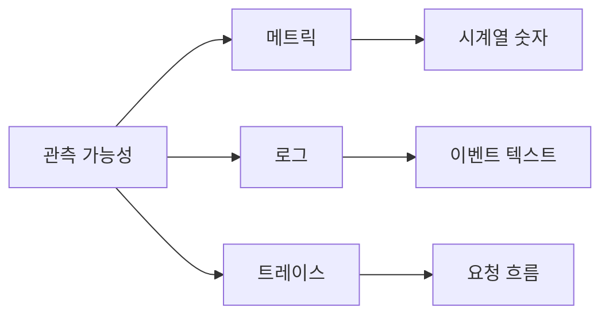
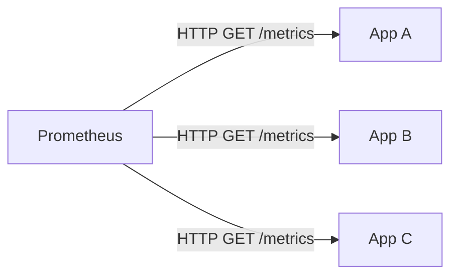
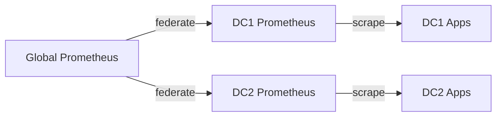
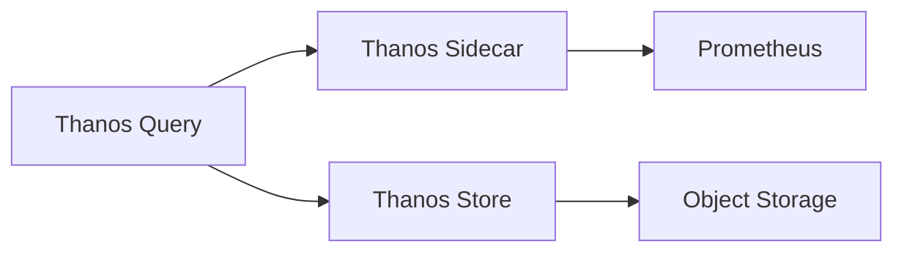

시스템이 지금 이 순간 무엇을 하고 있는지 알지 못한 채 운영하는 것은, 계기판 없이 비행기를 모는 것과 같다. Prometheus와 Grafana는 그 계기판을 만드는 도구다. 메트릭 수집, 저장, 시각화, 알림까지 이어지는 전체 파이프라인을 처음부터 끝까지 해부한다.

---

## 1. 왜 메트릭인가 — 로그·트레이스와의 차이

관측 가능성(Observability)은 세 기둥으로 구성된다.



- **메트릭**: "지금 초당 요청이 1200개다" — 숫자, 시계열, 압축 저장 가능
- **로그**: "2026-05-15 13:42:01 ERROR NullPointerException at line 42" — 이벤트, 텍스트, 용량 큼
- **트레이스**: 하나의 요청이 어떤 서비스를 어떤 순서로 거쳤는가 — 분산 추적

메트릭이 특별한 이유는 **저비용 고밀도**다. 초당 100만 요청이 들어와도 메트릭은 단 몇 개의 숫자만 증가시키면 된다. 로그는 100만 줄이 되지만, Counter 하나는 여전히 숫자 하나다.

---

## 2. Prometheus 아키텍처 — Pull 모델의 철학

### 2-1. Pull vs Push

대부분의 모니터링 시스템은 에이전트가 서버로 데이터를 **밀어넣는(Push)** 방식을 사용한다. Prometheus는 반대다. 서버가 직접 대상을 **가져온다(Pull)**.



Pull 모델의 장점:
- **네트워크 방향 제어**: 모니터링 서버만 방화벽 아웃바운드를 열면 된다.
- **중단 감지**: 스크랩이 실패하면 즉시 알 수 있다. Push 방식은 에이전트가 죽어도 서버는 모른다.
- **설정 중앙화**: 무엇을 수집할지 Prometheus 쪽에서 결정한다.

단점은 배치 작업처럼 수명이 짧은 프로세스는 스크랩 타이밍을 맞추기 어렵다는 것이다. 이를 위해 **Pushgateway**가 존재한다.

### 2-2. TSDB — 시계열 데이터베이스 내부

Prometheus는 자체 TSDB(Time Series Database)를 내장한다. 일반 RDB나 NoSQL과는 완전히 다른 설계다.

데이터 모델의 핵심: **메트릭 이름 + 레이블 집합 = 하나의 시계열**

```
http_requests_total{method="GET", status="200", path="/api/users"} 1523
http_requests_total{method="POST", status="500", path="/api/orders"} 7
```

같은 메트릭 이름이라도 레이블이 다르면 **별개의 시계열**이다. 위 예시에서 `http_requests_total`이라는 메트릭은 레이블 조합 수만큼의 시계열을 생성한다.

저장 구조는 **2시간 단위 블록(chunk)**으로 메모리에 쌓다가 압축해서 디스크에 내린다. WAL(Write-Ahead Log)로 충돌 복구를 보장한다.

```
data/
  01GXYZ.../          # 블록 디렉토리 (ULID 기반)
    chunks/
      000001          # 실제 시계열 데이터 (압축)
    index             # 레이블→시계열 역인덱스
    meta.json         # 블록 메타정보
    tombstones        # 삭제 표시
  wal/                # Write-Ahead Log
    00000001
    00000002
```

기본 보존 기간은 15일이다. `--storage.tsdb.retention.time=30d`로 조정한다.

---

## 3. 메트릭 4종 — 도구를 골라 쓰는 법

### 3-1. Counter — 단조 증가

한 번 올라가면 절대 내려가지 않는 값. 프로세스 재시작 시 0으로 리셋된다.

```java
// Micrometer
Counter requestCounter = Counter.builder("http.requests.total")
    .tag("method", "GET")
    .tag("status", "200")
    .register(registry);

requestCounter.increment();
```

Counter 자체를 쿼리하면 누적값이라 분석이 어렵다. `rate()`로 초당 변화율을 구한다.

```promql
# 5분 평균 초당 요청률
rate(http_requests_total{status="200"}[5m])
```

### 3-2. Gauge — 현재 상태

오르내리는 값. 메모리 사용량, 큐 깊이, 활성 연결 수 등.

```java
Gauge.builder("jvm.memory.used", runtime, r -> r.totalMemory() - r.freeMemory())
    .tag("area", "heap")
    .register(registry);
```

Gauge는 현재 스냅샷이므로 `rate()` 대신 바로 사용하거나 `delta()`를 쓴다.

### 3-3. Histogram — 분포 측정

요청 지연시간처럼 분포가 중요한 값. 미리 정의한 버킷에 관측값을 분류해 저장한다.

```java
Timer timer = Timer.builder("http.request.duration")
    .tag("path", "/api/orders")
    .publishPercentileHistogram()
    .sla(Duration.ofMillis(100), Duration.ofMillis(500), Duration.ofSeconds(1))
    .register(registry);

timer.record(() -> processRequest());
```

이 코드가 생성하는 메트릭:

```
http_request_duration_seconds_bucket{le="0.1"} 8432
http_request_duration_seconds_bucket{le="0.5"} 9891
http_request_duration_seconds_bucket{le="1.0"} 9998
http_request_duration_seconds_bucket{le="+Inf"} 10000
http_request_duration_seconds_count 10000
http_request_duration_seconds_sum 812.4
```

`histogram_quantile`로 백분위수를 계산한다:

```promql
# 99번째 백분위수 지연시간 (P99)
histogram_quantile(0.99, rate(http_request_duration_seconds_bucket[5m]))
```

### 3-4. Summary — 클라이언트 계산 백분위

Histogram과 달리 클라이언트 쪽에서 백분위수를 계산한다. 서버 부하는 낮지만 여러 인스턴스를 **집계할 수 없다**는 치명적 단점이 있다. 분산 환경에서는 Histogram을 선택해야 한다.

| 항목 | Histogram | Summary |
|---|---|---|
| 백분위 계산 | 서버(PromQL) | 클라이언트 |
| 인스턴스 집계 | 가능 | 불가 |
| 정확도 | 버킷 경계에 의존 | 높음 |
| 적합 환경 | 분산 시스템 | 단일 프로세스 |

---

## 4. Spring Boot + Micrometer 연동

Micrometer는 메트릭 수집의 파사드(Facade) 라이브러리다. Prometheus, Datadog, CloudWatch 등 다양한 백엔드에 동일한 API로 메트릭을 전송할 수 있다.

### 4-1. 의존성 추가

```gradle
implementation 'org.springframework.boot:spring-boot-starter-actuator'
implementation 'io.micrometer:micrometer-registry-prometheus'
```

### 4-2. 설정

```yaml
# application.yml
management:
  endpoints:
    web:
      exposure:
        include: health, info, prometheus, metrics
  endpoint:
    prometheus:
      enabled: true
  metrics:
    tags:
      application: ${spring.application.name}  # 모든 메트릭에 앱 이름 태그 추가
    distribution:
      percentiles-histogram:
        http.server.requests: true  # HTTP 요청에 히스토그램 활성화
      slo:
        http.server.requests: 50ms, 100ms, 200ms, 500ms
```

### 4-3. 커스텀 메트릭

```java
@Service
@RequiredArgsConstructor
public class OrderService {

    private final MeterRegistry registry;

    // 주문 처리 시간 측정
    public Order processOrder(OrderRequest request) {
        return Timer.builder("order.processing.duration")
            .tag("type", request.getType())
            .register(registry)
            .recordCallable(() -> doProcess(request));
    }

    // 대기 중인 주문 수 (Gauge)
    @PostConstruct
    void registerGauges() {
        Gauge.builder("order.queue.size", orderQueue, Queue::size)
            .description("현재 대기 중인 주문 수")
            .register(registry);
    }
}
```

`/actuator/prometheus`에 접근하면 Prometheus 포맷의 텍스트가 노출된다.

### 4-4. Prometheus 스크랩 설정

```yaml
# prometheus.yml
global:
  scrape_interval: 15s
  evaluation_interval: 15s

scrape_configs:
  - job_name: 'spring-app'
    metrics_path: '/actuator/prometheus'
    static_configs:
      - targets: ['app-server:8080']
    relabel_configs:
      - source_labels: [__address__]
        target_label: instance
```

---

## 5. PromQL 핵심 — 쿼리 언어 완전 정복

PromQL은 시계열 데이터를 위해 설계된 함수형 쿼리 언어다. SQL과 달리 시간 축이 내재되어 있다.

**비유**: 엑셀 함수와 비슷하다. 엑셀에서 `=SUM(A1:A10)`으로 셀 범위를 집계하듯, PromQL에서 `sum(rate(http_requests_total[5m]))`은 "지난 5분간의 시계열 데이터 범위를 집계"한다. 차이는 엑셀이 공간 범위를 다루는 반면 PromQL은 **시간 범위**를 다룬다는 점이다.

### 5-1. 선택자와 필터

```promql
# 기본 선택
http_requests_total

# 레이블 필터
http_requests_total{job="api-server", status="500"}

# 정규식 필터
http_requests_total{path=~"/api/.*", status!~"2.."}

# 범위 벡터 (5분간 데이터)
http_requests_total[5m]
```

### 5-2. rate vs increase

```promql
# rate: 초당 평균 변화율 (연속 함수로 처리, 부드럽게)
rate(http_requests_total[5m])

# increase: 구간 총 증가량 (= rate * 구간초)
increase(http_requests_total[1h])

# irate: 마지막 두 샘플의 순간 변화율 (급격한 스파이크 감지)
irate(http_requests_total[5m])
```

`rate`는 스크랩 누락에 강하고, `irate`는 반응이 빠르다. 대부분의 경우 `rate`가 적합하다.

### 5-3. 집계 연산자

```promql
# 전체 합산
sum(rate(http_requests_total[5m]))

# 상태 코드별 합산
sum by (status) (rate(http_requests_total[5m]))

# 특정 레이블 제외하고 집계
sum without (instance) (rate(http_requests_total[5m]))

# 상위 5개 인스턴스
topk(5, rate(http_requests_total[5m]))
```

### 5-4. 실용 쿼리 모음

```promql
# 에러율 (%)
sum(rate(http_requests_total{status=~"5.."}[5m])) /
sum(rate(http_requests_total[5m])) * 100

# JVM 힙 사용률 (%)
jvm_memory_used_bytes{area="heap"} /
jvm_memory_max_bytes{area="heap"} * 100

# 서비스 가용성 (업타임 비율)
avg_over_time(up{job="api-server"}[24h]) * 100

# P99 지연시간
histogram_quantile(0.99,
  sum by (le) (rate(http_request_duration_seconds_bucket[5m]))
)

# CPU 사용률
100 - (avg by (instance) (rate(node_cpu_seconds_total{mode="idle"}[5m])) * 100)
```

---

## 6. Grafana 대시보드 설계

### 6-1. 데이터 소스 연결

Grafana에서 Prometheus 데이터 소스를 추가한다.

```
Configuration → Data Sources → Add data source → Prometheus
URL: http://prometheus:9090
```

### 6-2. 대시보드 구조 설계 원칙

좋은 대시보드는 **USE 방법론**을 따른다.
- **U**tilization: 자원 사용률 (CPU, 메모리, 디스크)
- **S**aturation: 포화도 (큐 깊이, 대기 시간)
- **E**rrors: 오류율

혹은 웹 서비스에 특화된 **RED 방법론**:
- **R**ate: 요청률
- **E**rrors: 에러율
- **D**uration: 지연시간

### 6-3. 패널 구성 예시

```json
{
  "title": "HTTP 요청률 (초당)",
  "type": "timeseries",
  "targets": [
    {
      "expr": "sum by (status) (rate(http_requests_total[5m]))",
      "legendFormat": "{{status}}"
    }
  ],
  "fieldConfig": {
    "defaults": {
      "unit": "reqps",
      "thresholds": {
        "steps": [
          {"color": "green", "value": null},
          {"color": "yellow", "value": 800},
          {"color": "red", "value": 1000}
        ]
      }
    }
  }
}
```

### 6-4. 변수(Variable) 활용

인스턴스나 잡을 드롭다운으로 선택할 수 있게 만들면 대시보드 하나로 여러 환경을 커버한다.

```
Dashboard Settings → Variables → New Variable
Name: instance
Type: Query
Query: label_values(up{job="api-server"}, instance)
```

이후 쿼리에서 `$instance`로 참조한다:

```promql
rate(http_requests_total{instance="$instance"}[5m])
```

---

## 7. Alertmanager — 알림 라우팅과 억제

### 7-1. 알림 규칙 정의

알림 규칙은 Prometheus 설정에서 정의한다.

```yaml
# alert.rules.yml
groups:
  - name: api-alerts
    interval: 1m
    rules:
      - alert: HighErrorRate
        expr: |
          sum(rate(http_requests_total{status=~"5.."}[5m])) /
          sum(rate(http_requests_total[5m])) > 0.05
        for: 2m           # 2분 지속 시 발화
        labels:
          severity: critical
          team: backend
        annotations:
          summary: "에러율 {{ $value | humanizePercentage }} 초과"
          description: "{{ $labels.instance }} 인스턴스에서 5% 이상 에러 발생"

      - alert: HighP99Latency
        expr: |
          histogram_quantile(0.99,
            sum by (le) (rate(http_request_duration_seconds_bucket[5m]))
          ) > 1.0
        for: 5m
        labels:
          severity: warning
          team: backend
        annotations:
          summary: "P99 지연시간 {{ $value }}초 초과"
```

`for` 절이 중요하다. 조건이 참이 되는 즉시 발화하면 일시적 스파이크에도 알림이 울린다. `for: 2m`은 2분 동안 지속될 때만 알림을 보낸다.

### 7-2. Alertmanager 라우팅

```yaml
# alertmanager.yml
global:
  smtp_smarthost: 'smtp.company.com:587'
  slack_api_url: 'https://hooks.slack.com/services/...'

route:
  receiver: 'default'
  group_by: ['alertname', 'team']   # 그룹핑 기준
  group_wait: 30s                    # 첫 알림 대기 (같은 그룹 묶기)
  group_interval: 5m                 # 그룹 갱신 간격
  repeat_interval: 4h                # 재알림 간격

  routes:
    - match:
        severity: critical
      receiver: pagerduty
      continue: false

    - match:
        severity: warning
        team: backend
      receiver: slack-backend

receivers:
  - name: 'default'
    email_configs:
      - to: 'ops@company.com'

  - name: 'pagerduty'
    pagerduty_configs:
      - service_key: '<key>'

  - name: 'slack-backend'
    slack_configs:
      - channel: '#backend-alerts'
        text: '{{ range .Alerts }}{{ .Annotations.summary }}{{ end }}'
```

### 7-3. 억제(Inhibit) 규칙

인프라 전체가 다운됐을 때 수백 개의 앱 알림이 쏟아지는 상황을 막는다.

```yaml
inhibit_rules:
  # 클러스터 다운 알림이 있으면 개별 인스턴스 알림 억제
  - source_match:
      alertname: ClusterDown
      severity: critical
    target_match:
      severity: warning
    equal: ['cluster']

  # critical 이 있으면 동일 서비스의 warning 억제
  - source_match:
      severity: critical
    target_match:
      severity: warning
    equal: ['alertname', 'service']
```

### 7-4. Silence — 계획된 점검

배포나 점검 시간에 알림을 임시 차단할 수 있다.

```bash
# amtool로 silence 등록
amtool silence add \
  --alertmanager.url http://alertmanager:9093 \
  --author "kim" \
  --comment "정기 배포 점검" \
  --duration 1h \
  severity=warning team=backend
```

---

## 8. Recording Rules — 쿼리 성능 최적화

복잡한 PromQL을 매번 계산하면 대시보드 로딩이 느려진다. Recording Rules로 미리 계산해서 새 시계열로 저장한다.

**비유**: 요리사가 매일 아침 손님이 오기 전에 육수를 미리 끓여두는 것과 같다. 주문이 들어올 때마다 육수를 처음부터 끓이면 시간이 너무 걸린다. **Recording Rules는 자주 쓰는 복잡한 계산을 미리 해두는 "육수 스톡"**이다. 대시보드가 열릴 때마다 무거운 집계를 반복 계산하는 대신, 이미 준비된 결과를 바로 꺼낸다.

```yaml
groups:
  - name: api_aggregations
    interval: 1m
    rules:
      # 미리 계산된 에러율
      - record: job:http_error_rate:rate5m
        expr: |
          sum by (job) (rate(http_requests_total{status=~"5.."}[5m])) /
          sum by (job) (rate(http_requests_total[5m]))

      # 미리 계산된 P99
      - record: job:http_request_duration_p99:rate5m
        expr: |
          histogram_quantile(0.99,
            sum by (job, le) (rate(http_request_duration_seconds_bucket[5m]))
          )
```

대시보드에서는 이 규칙을 참조한다:

```promql
job:http_error_rate:rate5m{job="api-server"}
```

Recording Rules 네이밍 컨벤션: `level:metric:operations`

---

## 9. Federation과 확장 아키텍처

### 9-1. Federation

대규모 환경에서 단일 Prometheus는 한계에 부딪힌다. Federation으로 계층 구조를 만든다.

**비유**: 지역 신문사와 전국 신문사의 관계와 같다. 서울 지역 신문사(DC1 Prometheus)는 서울 소식만 수집하고, 부산 지역 신문사(DC2 Prometheus)는 부산 소식만 수집한다. 전국 신문사(Global Prometheus)는 각 지역사로부터 핵심 기사(집계된 메트릭)만 받아 전국 단위 뷰를 제공한다. **모든 원본 기사를 전국 신문사에 직접 보내면 트래픽이 폭증**하므로, 지역별로 먼저 추려서 올린다.

```yaml
# 상위 Prometheus 설정 — 하위에서 집계된 메트릭만 수집
scrape_configs:
  - job_name: 'federate'
    honor_labels: true
    metrics_path: '/federate'
    params:
      match[]:
        - '{job="api-server"}'
        - 'job:http_error_rate:rate5m'
    static_configs:
      - targets:
          - 'dc1-prometheus:9090'
          - 'dc2-prometheus:9090'
```



### 9-2. Thanos — 장기 보존과 글로벌 뷰

Thanos는 Prometheus 위에서 동작하는 오픈소스 확장이다.



핵심 컴포넌트:
- **Sidecar**: Prometheus 옆에 배치, 블록을 오브젝트 스토리지(S3 등)로 업로드
- **Store Gateway**: 오브젝트 스토리지의 히스토리 데이터를 쿼리 가능하게 노출
- **Query**: 여러 Prometheus와 Store를 통합해 단일 쿼리 엔드포인트 제공
- **Compactor**: 오브젝트 스토리지의 블록을 압축/다운샘플링

장점:
- 보존 기간 제한 없음 (스토리지 비용만)
- 여러 데이터센터의 메트릭을 단일 뷰로
- Prometheus HA (같은 타겟을 수집하는 두 인스턴스의 중복 제거)

---

## 10. 카디널리티 관리 — 가장 중요한 운영 원칙

**카디널리티(Cardinality)**는 하나의 메트릭이 가지는 고유 레이블 조합 수다. 카디널리티를 폭발시키면 Prometheus가 OOM으로 죽는다.

**비유**: 도서관 분류 시스템과 같다. "소설/비소설"처럼 큰 카테고리로 분류하면 책장 몇 개로 충분하다(낮은 카디널리티). 그런데 "저자 이름 + 출판 날짜 + ISBN"으로 각 책마다 고유 서랍을 만들면 책장이 책 수만큼 필요하다(카디널리티 폭발). Prometheus는 **레이블 조합마다 별도 시계열**을 저장하므로, UUID나 userId처럼 무한히 늘어나는 값을 레이블로 쓰면 메모리가 무한히 늘어난다.

### 10-1. 나쁜 예시

```java
// 절대 하지 말 것 — userId는 수백만 가지
Counter.builder("api.requests")
    .tag("userId", request.getUserId())   // 카디널리티 폭탄
    .tag("requestId", UUID.randomUUID())  // 더 나쁨
    .register(registry)
    .increment();
```

이 코드 하나가 Prometheus TSDB를 수억 개의 시계열로 채울 수 있다.

### 10-2. 좋은 예시

```java
// 범주화 — 카디널리티를 제한된 값으로
Counter.builder("api.requests")
    .tag("endpoint", classifyEndpoint(request.getPath()))  // /api/users, /api/orders 등
    .tag("status_class", statusClass(response.getStatus())) // 2xx, 4xx, 5xx
    .register(registry)
    .increment();
```

레이블 값은 항상 **유한한 집합**이어야 한다. 규칙:
- 레이블 하나의 고유값이 100개를 넘으면 설계를 재검토
- UUID, 사용자 ID, IP 주소는 레이블 금지
- 전체 카디널리티 = 각 레이블의 고유값 수의 **곱**

---

## 11. 극한 시나리오

### 시나리오 1: 카디널리티 폭발로 Prometheus OOM

**상황**: 새 배포 후 개발자가 `request_id` 레이블을 메트릭에 추가. 초당 1만 요청 * 24시간 = 8억 6400만 개의 시계열 생성. Prometheus 메모리 사용량이 수십 GB로 폭증하다 OOM Killed.

**진단**:
```bash
# 카디널리티 높은 메트릭 찾기
curl -s 'http://prometheus:9090/api/v1/label/__name__/values' | \
  python3 -c "
import sys, json
names = json.load(sys.stdin)['data']
print(f'Total metrics: {len(names)}')
"

# TSDB 상태 API
curl http://prometheus:9090/api/v1/status/tsdb | jq '.data.seriesCountByMetricName[:10]'
```

**대응**:
1. 즉시: Prometheus 재시작 전 문제 메트릭 삭제
   ```bash
   curl -X POST 'http://prometheus:9090/api/v1/admin/tsdb/delete_series' \
     --data 'match[]={__name__=~"bad_metric.*"}'
   ```
2. 단기: 해당 메트릭의 레이블 제거 후 재배포
3. 장기: 메트릭 리뷰 프로세스 도입 (PR에서 카디널리티 검토)

### 시나리오 2: TSDB 디스크 가득 참

**상황**: 로그 파이프라인 장애로 애플리케이션이 에러를 쏟아내고, 에러 관련 메트릭이 폭증. TSDB 디스크 사용량이 100%에 도달.

**대응 순서**:
```bash
# 1. 현재 디스크 상태
df -h /prometheus-data

# 2. 오래된 블록 강제 정리
curl -X POST http://prometheus:9090/api/v1/admin/tsdb/clean_tombstones

# 3. 보존 기간 임시 축소 (재시작 필요)
# --storage.tsdb.retention.time=7d 으로 변경

# 4. 컴팩션 강제 실행
curl -X POST http://prometheus:9090/api/v1/admin/tsdb/snapshot
```

### 시나리오 3: 알림 폭풍 (Alert Storm)

**상황**: 데이터센터 네트워크 장애로 300개 서비스 알림이 동시에 발화. 팀원들의 슬랙이 1분에 수백 개의 알림으로 마비.

**사전 방어** (이것이 핵심):

```yaml
# Alertmanager에서 그룹핑으로 폭풍 방지
route:
  group_by: ['alertname', 'datacenter']  # 데이터센터 단위로 묶음
  group_wait: 30s                         # 30초 기다려서 같은 그룹 알림 묶기
  group_interval: 5m                      # 5분마다 한 번만 발송

# Inhibit으로 상위 알림이 하위를 억제
inhibit_rules:
  - source_match:
      alertname: DatacenterDown
    target_match_re:
      alertname: '.+'
    equal: ['datacenter']
```

**사후 대응**: Silence로 복구 시간 동안 알림 차단, 원인 해결 후 해제.

---

## 면접 포인트

### Pull 모델과 Push 모델의 차이와 각각의 장단점을 설명하라

<details>
<summary>답변 보기</summary>

Pull 모델은 모니터링 서버(Prometheus)가 주기적으로 타겟의 `/metrics` 엔드포인트를 호출해 데이터를 가져온다. Push 모델은 에이전트가 서버로 데이터를 전송한다.

Pull 모델의 장점: 타겟이 다운됐을 때 스크랩 실패로 즉시 감지 가능, 네트워크 방향 제어 용이, 수집 설정 중앙화. 단점: 배치 작업처럼 수명이 짧은 프로세스 수집이 어려움(Pushgateway로 보완).

Push 모델의 장점: 방화벽 환경에서 유연함, 배치 작업 수집 용이. 단점: 에이전트 장애 감지 어려움, 클라이언트가 모니터링 서버 주소를 알아야 함.

</details>

### Histogram과 Summary의 차이점과 어느 상황에 어떤 것을 써야 하는가

<details>
<summary>답변 보기</summary>

Histogram은 미리 정의한 버킷에 관측값을 분류해 저장하고, 서버(PromQL)에서 `histogram_quantile`로 백분위수를 계산한다. Summary는 클라이언트에서 슬라이딩 윈도우로 백분위수를 직접 계산해 저장한다.

핵심 차이: Histogram은 여러 인스턴스의 데이터를 집계(sum)한 후 백분위수를 계산할 수 있지만, Summary는 각 인스턴스가 이미 계산한 값이라 집계가 불가능하다.

선택 기준: 분산 환경(여러 인스턴스)에서는 반드시 Histogram. 단일 프로세스이고 정확한 백분위수가 필요하면 Summary.

</details>

### 카디널리티 폭발이 왜 위험하고 어떻게 방지하는가

<details>
<summary>답변 보기</summary>

Prometheus는 각 고유 레이블 조합을 별도의 시계열로 저장한다. 카디널리티(고유 레이블 조합 수)가 높을수록 메모리와 디스크 사용량이 선형 이상으로 증가한다.

예를 들어 메트릭에 UUID를 레이블로 달면, 요청 하나당 시계열 하나가 생성된다. 초당 1만 요청이면 하루에 8억 6400만 개 시계열이 생긴다.

방지 방법:
1. 레이블 값을 유한한 범주로 제한 (userId → userType)
2. UUID, IP, requestId를 레이블로 사용 금지
3. `prometheus/tsdb` API로 카디널리티 모니터링
4. 코드 리뷰에서 메트릭 레이블 검토 프로세스

</details>

### Recording Rules의 목적과 네이밍 컨벤션

<details>
<summary>답변 보기</summary>

Recording Rules는 복잡하고 계산 비용이 높은 PromQL 표현식을 미리 계산해 새로운 시계열로 저장하는 기능이다. 대시보드 쿼리 성능을 향상시키고, 알림 평가 부하를 줄인다.

동일한 집계를 여러 대시보드에서 반복 계산하는 대신 한 번만 계산해 캐시처럼 활용한다.

네이밍 컨벤션은 `level:metric:operations` 형식이다:
- level: 집계 레벨 (job, instance, cluster)
- metric: 원본 메트릭 이름
- operations: 적용한 함수들 (rate5m, p99_rate5m)

예: `job:http_request_duration_p99:rate5m`

</details>

### Alertmanager의 그룹핑, 억제, Silence의 차이와 용도

<details>
<summary>답변 보기</summary>

**그룹핑(Grouping)**: 같은 레이블 값을 가진 알림들을 하나의 알림으로 묶어 발송한다. 알림 폭풍 방지가 주목적. `group_by`, `group_wait`, `group_interval`로 제어.

**억제(Inhibition)**: 특정 알림(source)이 발화 중일 때 다른 알림(target)을 자동으로 차단한다. 상위 장애(클러스터 다운)가 있을 때 하위 알림(개별 서비스 장애)을 억제하는 용도. 설정 파일에 정의.

**Silence**: 특정 기간 동안 특정 레이블 조건의 알림을 차단한다. 배포, 점검, 테스트 시 의도적으로 알림을 끄는 용도. Alertmanager UI나 amtool로 동적 관리.

핵심 차이: 그룹핑은 묶기, 억제는 인과관계 기반 차단, Silence는 시간 기반 차단.

</details>

### Thanos가 필요한 이유와 주요 컴포넌트

<details>
<summary>답변 보기</summary>

Prometheus는 단일 노드 기반으로 스케일 아웃과 장기 보존에 한계가 있다. 기본 보존 기간 15일을 넘기려면 디스크가 무한정 커져야 한다. 여러 데이터센터의 메트릭을 하나의 쿼리로 볼 수도 없다.

Thanos는 이 두 문제를 해결한다:

- **Sidecar**: Prometheus 옆에서 2시간 블록을 S3 등 오브젝트 스토리지에 업로드
- **Store Gateway**: 오브젝트 스토리지의 히스토리 데이터를 PromQL 쿼리 가능하게 노출
- **Query (Querier)**: 여러 Prometheus, Store, Sidecar를 통합한 단일 쿼리 엔드포인트. 중복 데이터 제거(deduplication)도 처리
- **Compactor**: 오브젝트 스토리지 블록을 시간 단위로 압축, 다운샘플링 (5m, 1h 해상도)
- **Ruler**: 전역 Recording Rules와 알림 규칙 실행

</details>
