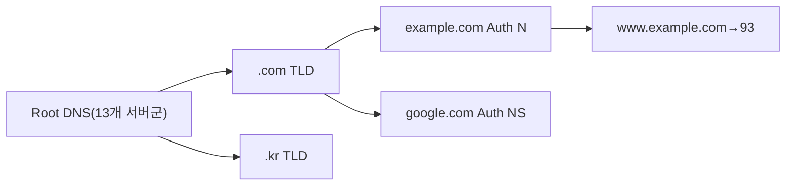
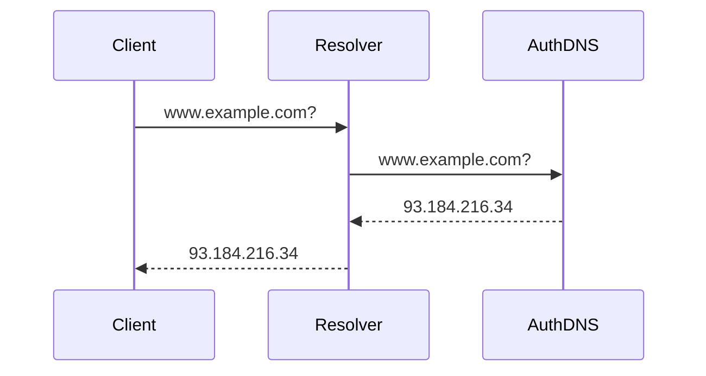
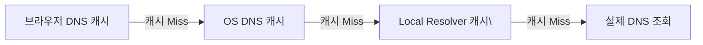
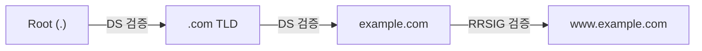

DNS(Domain Name System)는 사람이 읽을 수 있는 도메인 이름(`www.example.com`)을 컴퓨터가 사용하는 IP 주소(`93.184.216.34`)로 변환하는 분산 계층 데이터베이스 시스템이다.

> **비유**: 전화번호부와 같다. "김철수에게 전화해"라는 말을 실제 전화번호 010-1234-5678로 바꿔주는 것처럼, DNS는 `www.example.com`을 `93.184.216.34`로 변환해 실제 서버에 연결한다. 단, 이 전화번호부는 전 세계에 분산돼 있고 계층적으로 관리된다.

---

## DNS 계층 구조

DNS는 전 세계에 분산된 계층 구조를 이룬다. 어떤 단일 서버도 모든 도메인 정보를 갖지 않는다. 각 계층이 자신의 영역에 대한 권한을 가지고, 모르는 것은 하위 계층에 위임한다.



| 계층 | 이름 | 역할 | 예시 |
|------|------|------|------|
| Root | 루트 DNS | TLD 서버 주소를 알려줌 | 13개 클러스터 (a.root-servers.net 등) |
| TLD | 최상위 도메인 DNS | Authoritative 서버 주소를 알려줌 | .com, .org, .kr, .io |
| Authoritative | 권한 있는 DNS | 실제 레코드를 보유 | example.com의 실제 IP 반환 |
| Local/Recursive | 재귀 리졸버 | 클라이언트 대신 질의를 대행 | ISP DNS, 8.8.8.8, 1.1.1.1 |

---

## DNS 동작 원리

브라우저에 `www.example.com`을 입력했을 때 실제 IP를 얻기까지의 전체 흐름이다.

1️⃣ 클라이언트가 Local Resolver(재귀 리졸버)에 질의
2️⃣ Local Resolver가 Root → TLD → Authoritative 순으로 반복 질의
3️⃣ 최종 IP를 받아 클라이언트에 반환하고 TTL 동안 캐시 저장



### 재귀 질의 vs 반복 질의

**재귀 질의 (Recursive Query)**: 클라이언트가 Local Resolver에게 "최종 답을 찾아서 알려줘"라고 요청하는 방식이다. 클라이언트는 내부 과정을 모르고 결과만 받는다. 클라이언트↔Local Resolver 사이에 사용된다.

**반복 질의 (Iterative Query)**: 각 DNS 서버가 "모르면 저쪽에 물어봐"라는 힌트만 주고, Local Resolver가 직접 각 단계를 밟아 나가는 방식이다. Local Resolver↔각 DNS 서버 사이에 사용된다.

---

## DNS 레코드 타입

### A 레코드 — 도메인 → IPv4

```
www.example.com.  3600  IN  A  93.184.216.34
mail.example.com. 3600  IN  A  192.0.2.1
```

### AAAA 레코드 — 도메인 → IPv6

```
www.example.com.  3600  IN  AAAA  2606:2800:220:1:248:1893:25c8:1946
```

### CNAME 레코드 — 도메인 → 다른 도메인(별칭)

최종적으로 A/AAAA 레코드를 찾을 때까지 체인을 따라간다.

```
www.example.com.   3600  IN  CNAME  example.com.
blog.example.com.  3600  IN  CNAME  mysite.netlify.app.
```

CNAME 사용 시 주의사항:
- 루트 도메인(`@`, apex)에는 CNAME 사용 불가 → ALIAS/ANAME 레코드로 대체
- 체인이 길어지면 조회 지연 증가
- CNAME 대상 도메인에는 다른 레코드와 공존 불가

### MX 레코드 — 이메일 서버 지정

우선순위(낮을수록 높음)를 가지며, 높은 우선순위 서버가 실패하면 다음 순위로 시도한다.

```
example.com.  3600  IN  MX  10  mail1.example.com.
example.com.  3600  IN  MX  20  mail2.example.com.
```

### TXT 레코드 — 텍스트 정보 저장

도메인 소유권 확인, 이메일 인증(SPF/DKIM/DMARC), 보안 정책에 사용한다.

```
example.com.  IN  TXT  "v=spf1 include:_spf.google.com ~all"
_dmarc.example.com.  IN  TXT  "v=DMARC1; p=reject; rua=mailto:dmarc@example.com"
example.com.  IN  TXT  "google-site-verification=abc123..."
```

### NS 레코드 — 권한 있는 DNS 서버 지정

```
example.com.  3600  IN  NS  ns1.example.com.
example.com.  3600  IN  NS  ns2.example.com.
```

NS 레코드를 2개 이상 설정하는 것이 필수다. 하나만 있으면 해당 서버 장애 시 도메인 전체가 해석 불가 상태가 된다.

### PTR 레코드 — IP → 도메인 (역방향 조회)

```
34.216.184.93.in-addr.arpa.  IN  PTR  www.example.com.
```

이메일 서버 신뢰도 확인(스팸 방지)에 주로 사용한다.

### SOA 레코드 — 존(Zone) 시작 권한 정보

```
example.com.  IN  SOA  ns1.example.com.  admin.example.com. (
    2026050101  ; Serial (존 버전)
    3600        ; Refresh (Secondary 갱신 주기)
    900         ; Retry (갱신 실패 시 재시도 간격)
    604800      ; Expire (갱신 실패 시 Secondary 존 삭제 기간)
    3600        ; Minimum TTL
)
```

---

## DNS 캐싱

### 캐싱 레이어

각 DNS 응답에는 TTL(Time To Live)이 포함된다. TTL이 만료되기 전까지는 각 레이어에서 캐시된 값을 반환하고 실제 DNS 서버에 질의하지 않는다.



### TTL 설정 전략

| 상황 | TTL | 장점 | 단점 |
|------|-----|------|------|
| TTL 낮음 | 60~300초 | IP 변경 시 빠른 전파 | DNS 쿼리 빈번 → 부하/지연 증가 |
| TTL 높음 | 3600~86400초 | 캐싱 효율 높음, 부하 낮음 | IP 변경 시 전파까지 최대 TTL 소요 |

**마이그레이션 전략 (IP 변경 시)**:
1. 변경 전 TTL을 300초 이하로 낮추고 기존 TTL만큼 대기 (캐시 소진 대기)
2. IP 변경 적용 → 전 세계 빠른 전파
3. 안정화 후 TTL을 3600초로 복귀

### OS DNS 캐시 초기화

```bash
# Windows
ipconfig /flushdns

# macOS
sudo dscacheutil -flushcache; sudo killall -HUP mDNSResponder

# Linux (systemd-resolved)
sudo systemd-resolve --flush-caches
```

---

## DNSSEC — DNS 응답 무결성 보장

기존 DNS는 평문으로 응답을 전송한다. 공격자가 위조 응답을 삽입하면 사용자가 피싱 사이트로 유도될 수 있다. DNSSEC는 디지털 서명으로 이를 방지한다.



| 레코드 | 역할 |
|-------|------|
| RRSIG | 각 리소스 레코드에 대한 디지털 서명 |
| DNSKEY | 서명 검증에 사용하는 공개키 |
| DS | 상위 존이 하위 존의 DNSKEY를 신뢰함을 증명 |
| NSEC/NSEC3 | 존재하지 않는 레코드임을 증명 (음성 응답 보호) |

---

## DNS 관련 보안 기술

### DoH (DNS over HTTPS)

기존 DNS는 평문으로 쿼리를 전송해 중간자가 사용자의 접속 도메인을 볼 수 있다. DoH는 HTTPS로 DNS 쿼리를 암호화한다.

| 항목 | 내용 |
|------|------|
| 포트 | 443 |
| 지원 서버 | 8.8.8.8, 1.1.1.1, 9.9.9.9 |
| 설정 위치 | 브라우저(Firefox, Chrome) 또는 OS 레벨 |

### DoT (DNS over TLS)

DoH와 유사하지만 HTTP 없이 TLS만 사용한다. 포트 853을 사용하므로 네트워크 정책 적용이 쉽지만, 일부 방화벽에서 차단될 수 있다.

### SPF / DKIM / DMARC — 이메일 인증 3종 세트

| 기술 | 역할 |
|------|------|
| SPF | TXT 레코드에 허가된 이메일 발송 서버 목록 정의. 허가되지 않은 서버에서 발송된 이메일 차단 |
| DKIM | 이메일 서버가 보내는 메일에 디지털 서명 추가. DNS의 공개키로 서명 검증 |
| DMARC | SPF, DKIM 검증 실패 시 처리 정책 정의 (`p=none/quarantine/reject`) |

---


## 극한 시나리오

### 시나리오 1: DNS 서버 장애 — "서버를 찾을 수 없습니다"

```bash
# 현재 DNS vs Google DNS vs Cloudflare DNS 비교
nslookup www.example.com           # 현재 설정 DNS
nslookup www.example.com 8.8.8.8   # Google DNS 직접 조회
dig @1.1.1.1 www.example.com       # Cloudflare DNS 직접 조회
```

ISP DNS 장애 시 8.8.8.8이나 1.1.1.1로 변경하면 된다. Authoritative DNS 장애는 NS 레코드를 2개 이상 설정해 Secondary DNS가 자동으로 응답하도록 예방한다.

### 시나리오 2: DNS 전파 지연 — A는 새 IP, B는 구 IP

TTL이 남아있는 동안 리졸버마다 캐시 상태가 다르다. 전 세계 수천 개 리졸버가 각자 다른 TTL 만료 시점을 가지므로 동시에 전파되지 않는다.

```bash
# 전체 해석 경로를 단계별로 추적
dig +trace www.example.com
```

예방: 마이그레이션 24~48시간 전에 TTL을 300초로 낮춰 캐시 소진을 미리 유도한다.

### 시나리오 3: DNS 캐시 포이즈닝

공격자가 재귀 리졸버에 위조 DNS 응답을 주입해 캐시에 저장시키는 공격이다. 이후 모든 사용자가 위조된 IP로 연결된다.

```
방어:
1. DNSSEC 적용 — 서명 검증으로 위조 차단
2. DNS over HTTPS (DoH) — 쿼리 암호화
3. Source Port Randomization — 대부분 리졸버 기본 적용
```

### 시나리오 4: DNS 레코드 오설정

MX 레코드 오류 시 이메일 수신 불가, NS 레코드 오류 시 도메인 전체 해석 불가가 발생한다.

```bash
dig example.com MX              # MX 레코드 확인
dig example.com NS              # NS 레코드 확인
dig +trace example.com          # 전체 해석 경로 추적
```

온라인 도구:
- https://mxtoolbox.com — MX, SPF, DKIM, DMARC 확인
- https://dnschecker.org — 전 세계 DNS 전파 상태 확인

---
## 주요 진단 명령어

```bash
# 기본 조회
nslookup www.example.com
dig www.example.com

# 특정 DNS 서버로 직접 조회
dig @8.8.8.8 www.example.com
dig @1.1.1.1 example.com MX

# 레코드 타입별 조회
dig example.com A
dig example.com AAAA
dig example.com MX
dig example.com TXT
dig example.com NS

# 전체 해석 경로 추적 (Root → TLD → Authoritative)
dig +trace www.example.com

# 역방향 조회 (IP → 도메인)
dig -x 93.184.216.34

# DNSSEC 검증 포함 조회
dig +dnssec www.example.com
```

---

## 왜 DNS인가? (vs hosts 파일 vs 직접 IP)

| 방식 | 확장성 | 유지보수 | 장애 복구 | 적합 용도 |
|---|---|---|---|---|
| IP 직접 사용 | 불가 | 불가 | 수동 | 내부 임시 테스트 |
| hosts 파일 | 불가 (각 PC 수정) | 불가 | 수동 | 로컬 개발 환경 오버라이드 |
| 단일 DNS 서버 | 제한적 | 중앙 관리 | 단일 장애점 | 소규모 사내망 |
| 계층형 DNS (현재 방식) | 무제한 | 분산 관리 | 분산 복구 | 인터넷 전체 |

**hosts 파일이 DNS보다 우선순위가 높다.** 로컬에서 `127.0.0.1 api.example.com`을 hosts에 추가하면 실제 DNS 조회 없이 로컬로 라우팅된다. 개발 환경 Mock에 활용하지만, 배포 환경에서 실수로 남기면 장애 원인이 된다.

---

## 실무에서 자주 하는 실수

### 실수 1: TTL을 너무 길게 설정한 상태에서 마이그레이션

도메인 마이그레이션 시 TTL을 미리 줄이지 않으면, DNS 변경 후에도 오래된 캐시로 인해 일부 사용자가 구 서버로 접속한다.

```bash
# 마이그레이션 전 최소 48시간 전에 TTL을 줄여야 함
# 기존 TTL: 86400 (24시간)
# 변경 전 조치: TTL을 300 (5분)으로 낮추고 48시간 대기
# 그 후 A 레코드 변경 → 최대 5분 내 전파 완료

# 현재 TTL 확인
dig example.com A | grep -i ttl
```

**원칙**: 마이그레이션 예정 48시간 전 TTL을 300초 이하로 낮추고, 마이그레이션 완료 후 다시 높인다.

### 실수 2: CNAME을 Root 도메인(Apex)에 사용

`example.com` (Apex 도메인)에는 CNAME 레코드를 사용할 수 없다. RFC 표준상 Apex에는 A 레코드 또는 AAAA 레코드만 허용된다. CloudFront나 ALB처럼 IP가 변하는 서비스에 Apex를 연결하려면 Route 53의 **Alias 레코드**를 사용해야 한다.

```bash
# 잘못된 설정 (표준 DNS에서는 불가)
# example.com  CNAME  d1234.cloudfront.net

# 올바른 설정 (Route 53 Alias)
# example.com  A  ALIAS d1234.cloudfront.net
# Alias는 Route 53 전용 기능 — TTL 없음, 상태 확인 가능
```

### 실수 3: 내부 서비스에 공개 DNS를 사용

쿠버네티스 클러스터 내부 서비스나 VPC 내부 서비스 주소를 공개 DNS에 등록하면, 내부 IP가 외부에 노출된다. 또한 내부 DNS 조회가 공개 인터넷을 통해 나가므로 지연과 보안 위험이 생긴다.

```bash
# VPC 내부 서비스 DNS는 Route 53 Private Hosted Zone 사용
# internal.example.com → 10.0.1.50 (VPC 내부에서만 해석됨)

# K8s 내부 서비스는 CoreDNS가 처리
# my-service.my-namespace.svc.cluster.local
nslookup my-service.my-namespace.svc.cluster.local
```

---

## 면접 포인트

**Q1. DNS 조회 과정을 순서대로 설명하라.**

브라우저 캐시 → OS 캐시 → hosts 파일 → Recursive Resolver(ISP/8.8.8.8) → Root Name Server(`.`) → TLD Name Server(`.com`) → Authoritative Name Server(`example.com`) 순서로 조회한다. 각 단계에서 캐시가 있으면 즉시 반환한다. Recursive Resolver가 실제 재귀 조회를 수행하므로 클라이언트는 단순히 Recursive Resolver에게 물어보기만 한다.

**Q2. A 레코드와 CNAME의 차이는? 언제 각각을 쓰는가?**

A 레코드는 도메인을 직접 IPv4 주소로 매핑한다. CNAME은 도메인을 다른 도메인으로 별칭(alias) 처리하며, 최종적으로 A 레코드를 찾을 때까지 연쇄 조회가 발생한다. A 레코드는 Apex 도메인에 사용하고, CNAME은 서브도메인(`www`, `api`, `mail`)에 사용한다. CDN 엔드포인트나 SaaS 서비스 연결 시 CNAME을 주로 쓴다.

**Q3. TTL이 DNS 성능에 미치는 영향은?**

TTL이 길면(86400초) DNS 쿼리가 줄어 응답이 빠르고 DNS 서버 부하가 낮다. 하지만 IP 변경 시 전파가 오래 걸린다. TTL이 짧으면(60초) 변경이 빠르게 반영되지만 DNS 쿼리가 잦아진다. 일반 운영은 3600~86400초, 마이그레이션 직전은 60~300초가 권장이다.

**Q4. DNSSEC은 무엇을 해결하는가?**

DNS 응답이 위조되지 않았음을 검증한다. DNS Cache Poisoning(공격자가 가짜 A 레코드를 캐시에 주입) 방어가 핵심이다. 각 DNS 레코드에 디지털 서명을 추가하고, Resolver가 서명을 검증한다. DNSSEC은 암호화가 아니라 무결성 검증이다 — DNS 응답 내용은 평문으로 보인다.

**Q5. CDN 사용 시 DNS 전략은?**

일반적으로 `www.example.com CNAME d1234.cloudfront.net` 방식을 사용한다. CDN 엔드포인트 IP는 지역마다 다르고 자주 변경되므로 A 레코드로는 관리 불가능하다. Apex 도메인(`example.com`)을 CDN에 연결하려면 Route 53 Alias 또는 Cloudflare의 CNAME Flattening을 사용한다. 지역별 다른 CDN POP으로 라우팅하는 것은 CDN 자체의 Anycast 라우팅이 처리한다.
```
