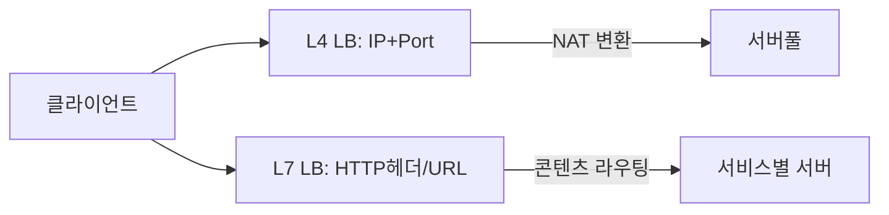
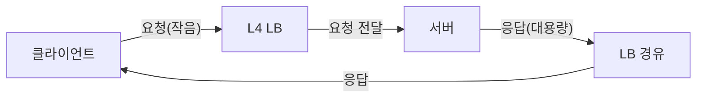
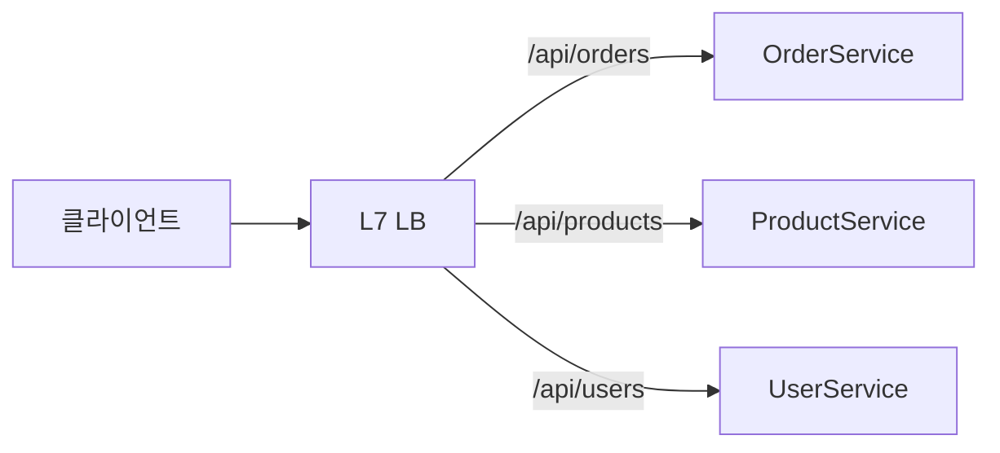
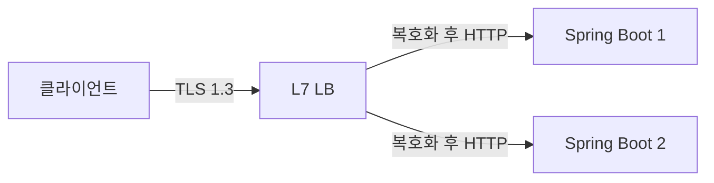
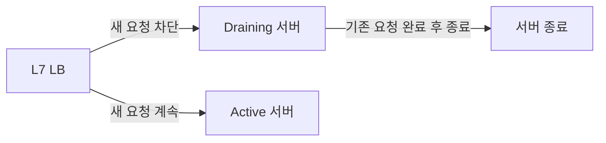
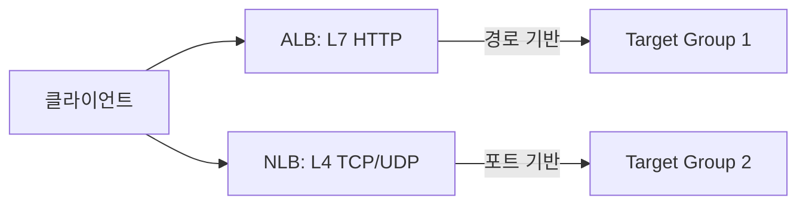
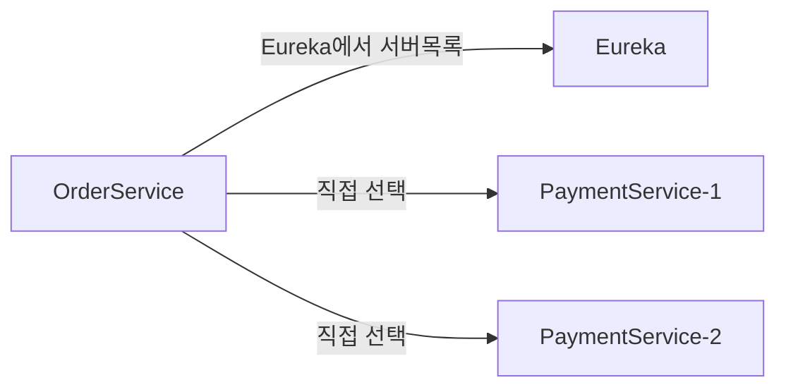
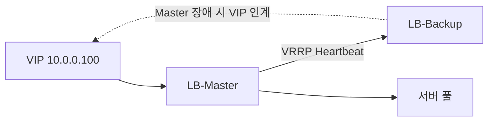
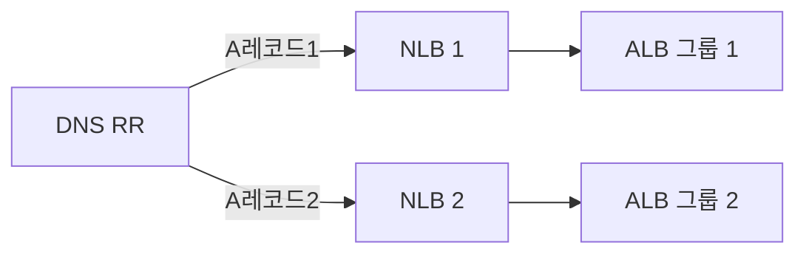
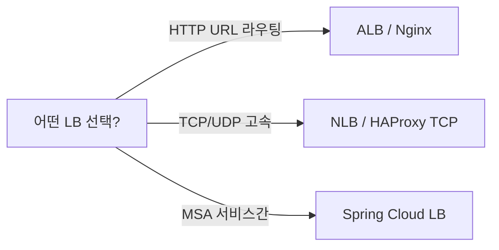

트래픽이 폭발하는 순간, 서버는 두 가지 방식으로 죽는다. **느리게 죽거나, 갑자기 죽거나.** 로드밸런서는 이 죽음을 막는 첫 번째 방어선이다. 단순히 요청을 나눠주는 장치가 아니라 **장애 격리, SSL 오프로드, 세션 지속성, 헬스 감시**까지 담당하는 인프라 핵심이다.

> **비유:** 대형 병원 응급실 트리아지(Triage) 간호사다. 환자가 몰려들면 증상 심각도를 평가해 응급실·일반 외래·경증 클리닉으로 분산시킨다. 특정 과가 포화 상태면 자동으로 다른 과로 돌리고, 의사가 쓰러지면 즉시 다른 의사에게 배정한다. 로드밸런서는 서버들의 트리아지 시스템이다.

---

## OSI 계층과 로드밸런서 — 왜 계층이 중요한가

로드밸런서가 **어느 계층까지 패킷을 들여다보느냐**가 성능과 기능의 트레이드오프를 결정한다.

- **L4(Transport):** IP + Port만 본다. 패킷 내용은 블랙박스. 마이크로초 단위 처리.
- **L7(Application):** HTTP 헤더, URL, 쿠키, 바디까지 파싱한다. 밀리초 단위지만 지능적 라우팅 가능.



계층이 높을수록 더 많은 정보를 파싱하므로 **CPU 사용량이 증가**한다. L4는 패킷 헤더만 수정하면 끝이지만, L7은 TLS 복호화 → HTTP 파싱 → 라우팅 결정 → 재암호화까지 해야 한다.

---

## L4 로드밸런서 내부 동작 원리

### NAT 기반 패킷 포워딩

L4 LB는 **TCP/UDP 패킷의 목적지 IP:Port를 바꿔치기**하는 NAT(Network Address Translation) 장치다.

```
클라이언트 → 로드밸런서 (VIP: 10.0.0.1:443)
        패킷: src=1.2.3.4:52000 dst=10.0.0.1:443

로드밸런서 → 서버 (Real IP: 10.0.1.5:443)
        패킷: src=10.0.0.1:52000 dst=10.0.1.5:443  ← dst IP만 변경

서버 → 로드밸런서 → 클라이언트
        패킷: src=10.0.1.5:443 dst=1.2.3.4:52000
        LB가 src IP를 VIP로 다시 바꿔서 클라이언트에 전달
```

이 과정에서 LB는 **연결 추적 테이블(Connection Tracking Table)** 을 유지한다. 클라이언트의 `(src_ip, src_port, dst_ip, dst_port)` 4-튜플을 키로, 선택된 서버 정보를 값으로 저장한다. 같은 연결의 패킷은 항상 같은 서버로 간다.

### DSR (Direct Server Return) — 왜 쓰는가

일반 NAT 방식은 응답 패킷도 LB를 경유한다. 대용량 응답(동영상 스트리밍, 파일 다운로드)에서 LB가 병목이 된다.



**DSR은 응답을 서버가 클라이언트에 직접 전달한다.** LB는 요청만 포워딩하고 응답 경로에서 제외된다.

```
DSR 동작:
1. 클라이언트 → LB (VIP: 10.0.0.1)
2. LB → 서버: MAC 주소만 변경 (IP는 그대로 VIP 유지)
3. 서버: Loopback에 VIP 바인딩 → 클라이언트에 직접 응답
4. 응답 패킷 src=10.0.0.1 (VIP) → LB 우회

효과: LB 트래픽 = 요청만 (전체의 1~5%)
      서버가 응답 처리 → LB 대역폭 95% 이상 절약
```

DSR은 **같은 네트워크 세그먼트(L2) 안에서만 동작**한다. 서버마다 loopback 인터페이스에 VIP를 ARP 응답 없이 바인딩해야 한다. 구성이 복잡하지만 고트래픽 미디어 서버, CDN 오리진에서 여전히 사용된다.

```bash
# 서버 DSR 설정 (Linux)
# Loopback에 VIP 바인딩, ARP 응답 비활성화
ip addr add 10.0.0.1/32 dev lo
echo 1 > /proc/sys/net/ipv4/conf/all/arp_ignore
echo 2 > /proc/sys/net/ipv4/conf/all/arp_announce
```

### L4 LB 특성 정리

| 항목 | 내용 |
|------|------|
| 동작 계층 | Transport Layer (TCP/UDP) |
| 라우팅 기준 | IP + Port |
| 패킷 내용 확인 | 불가 |
| SSL 처리 | Pass-through (서버가 처리) |
| 처리 속도 | 마이크로초 단위 |
| 연결 추적 | 4-튜플 기반 Connection Table |
| DSR 지원 | 가능 (응답 직접 전달) |
| 대표 제품 | AWS NLB, LVS, HAProxy TCP mode |
| 사용 예 | 게임 서버, DB 클러스터, 실시간 스트리밍 |

---

## L7 로드밸런서 내부 동작 원리

### 프록시로서의 L7 LB

L7 LB는 단순 포워더가 아니라 **풀 HTTP 프록시**다. 클라이언트와 별도의 TCP 연결을 맺고, 서버와도 별도의 TCP 연결을 맺는다.

```
클라이언트 ↔ [TCP Connection 1] ↔ L7 LB ↔ [TCP Connection 2] ↔ 서버

L7 LB가 하는 일:
1. 클라이언트 TLS Handshake 처리 (SSL 종료)
2. HTTP 요청 파싱 (헤더, URL, 쿠키)
3. 라우팅 결정 (어느 서버로?)
4. 서버 풀에서 연결 재사용 (keepalive)
5. 서버 응답 수신 후 클라이언트에 전달
```

이 구조 덕분에 L7 LB는 **HTTP 요청을 수정**할 수 있다. 헤더 추가/삭제, URL 재작성, 응답 캐싱 모두 가능하다. 반면 클라이언트와 서버 사이에 두 개의 TCP 연결이 있으므로 **지연 시간이 늘어난다.**

### 콘텐츠 기반 라우팅 (Java/Spring 예시)



Spring Boot 앱 예시:

```java
// OrderService — /api/orders 전용 서버
@RestController
@RequestMapping("/api/orders")
public class OrderController {

    @GetMapping("/{id}")
    public ResponseEntity<Order> getOrder(@PathVariable Long id) {
        // 이 서버에는 주문 관련 트래픽만 들어옴
        return ResponseEntity.ok(orderService.findById(id));
    }
}
```

Nginx에서 URL 경로로 각 Spring Boot 서버 풀에 라우팅:

```nginx
upstream order-servers {
    least_conn;
    server order1.internal:8080;
    server order2.internal:8080;
    keepalive 32;
}

upstream product-servers {
    least_conn;
    server product1.internal:8080;
    server product2.internal:8080;
    keepalive 32;
}

server {
    listen 443 ssl http2;
    server_name api.example.com;

    # URL 경로 기반 라우팅
    location /api/orders {
        proxy_pass http://order-servers;
        proxy_http_version 1.1;
        proxy_set_header Connection "";
        proxy_set_header Host $host;
        proxy_set_header X-Real-IP $remote_addr;
        proxy_set_header X-Forwarded-For $proxy_add_x_forwarded_for;
        proxy_set_header X-Forwarded-Proto https;
    }

    location /api/products {
        proxy_pass http://product-servers;
        proxy_http_version 1.1;
        proxy_set_header Connection "";
        proxy_set_header Host $host;
        proxy_set_header X-Real-IP $remote_addr;
    }

    # 헤더 기반 A/B 테스트 라우팅
    location /api/checkout {
        # X-AB-Group: beta 헤더가 있으면 새 버전으로
        proxy_pass http://checkout-stable;
        if ($http_x_ab_group = "beta") {
            proxy_pass http://checkout-beta;
        }
    }
}
```

### L7 LB 특성 정리

| 항목 | 내용 |
|------|------|
| 동작 계층 | Application Layer (HTTP/HTTPS) |
| 라우팅 기준 | URL, Host, Header, Cookie, Body |
| SSL 처리 | Termination (LB에서 복호화) |
| 처리 속도 | 밀리초 단위 (파싱 오버헤드) |
| 세션 지속성 | 쿠키 기반 (정확) |
| 헬스체크 | HTTP 응답 코드/바디 기반 |
| WAF 연동 | 가능 |
| 대표 제품 | Nginx, HAProxy, AWS ALB, Traefik |
| 사용 예 | 웹 앱, 마이크로서비스, API Gateway |

---

## L4 vs L7 실전 비교

| 항목 | L4 | L7 |
|------|----|----|
| 처리 속도 | 마이크로초 (NAT만) | 밀리초 (파싱 포함) |
| 라우팅 기준 | IP + Port | URL, 헤더, 쿠키 |
| SSL 종료 | 불가 (Pass-through) | 가능 (Termination) |
| 세션 지속성 | IP Hash (부정확) | 쿠키 기반 (정확) |
| 헬스체크 | TCP 연결 여부 | HTTP 상태코드 |
| 프로토콜 | TCP, UDP, TLS passthrough | HTTP, HTTPS, WebSocket |
| 마이크로서비스 | 부적합 | 적합 |
| 최대 처리량 | 수백만 RPS | ~100만 RPS |
| DSR 지원 | 가능 | 불가 |
| 비용 | 낮음 | 높음 |

**핵심 질문:** "패킷 내용을 봐야 하는가?" YES → L7, NO → L4

---

## 로드밸런싱 알고리즘 — 내부 메커니즘까지

### 1. Round Robin — 왜 가장 단순한가

요청을 서버 목록 순서대로 순환한다. 내부적으로 **원자적 카운터(atomic counter)** 를 사용한다.

```java
// Round Robin 내부 구현 원리
public class RoundRobinBalancer {
    private final List<Server> servers;
    private final AtomicInteger counter = new AtomicInteger(0);

    public Server select() {
        // 스레드 안전하게 카운터 증가 후 서버 수로 모듈로 연산
        int index = counter.getAndIncrement() % servers.size();
        return servers.get(Math.abs(index));
    }
}
```

```nginx
upstream backend {
    # 기본값이 Round Robin
    server server1:8080;
    server server2:8080;
    server server3:8080;
}
```

**적합:** 서버 스펙이 동일하고, 요청 처리 시간이 균일할 때.
**문제:** 처리 시간이 긴 요청(파일 업로드)과 짧은 요청(헬스체크)이 섞이면 처리 중인 연결 수를 무시하므로 특정 서버가 과부하된다.

### 2. Weighted Round Robin — 서버 스펙 차이 반영

서버에 가중치를 부여해 더 강한 서버가 더 많은 요청을 받는다.

```java
// Weighted Round Robin 내부 구현 (GCD 기반)
public class WeightedRoundRobinBalancer {
    private final List<Server> servers;
    // servers = [{server1, weight=5}, {server2, weight=3}, {server3, weight=2}]
    // 10번 요청 중 서버1이 5번, 서버2가 3번, 서버3이 2번

    private int currentIndex = -1;
    private int currentWeight = 0;
    private final int gcd;
    private final int maxWeight;

    public Server select() {
        while (true) {
            currentIndex = (currentIndex + 1) % servers.size();
            if (currentIndex == 0) {
                currentWeight -= gcd;
                if (currentWeight <= 0) {
                    currentWeight = maxWeight;
                }
            }
            if (servers.get(currentIndex).getWeight() >= currentWeight) {
                return servers.get(currentIndex);
            }
        }
        // NGINX의 smooth weighted round robin과 동일한 원리
    }
}
```

```nginx
upstream backend {
    server server1:8080 weight=5;  # CPU 32코어, 64GB RAM
    server server2:8080 weight=3;  # CPU 16코어, 32GB RAM
    server server3:8080 weight=2;  # CPU 8코어, 16GB RAM
}
```

Nginx는 **Smooth Weighted Round Robin** 알고리즘을 사용한다. 단순 가중치 배분이 아니라 요청을 고르게 분산해 한 서버에 연속으로 몰리지 않도록 한다.

### 3. Least Connections — 현재 부하 기반

현재 활성 연결 수가 가장 적은 서버를 선택한다.

```java
// Least Connections 내부 구현
public class LeastConnectionsBalancer {
    private final List<Server> servers;
    // 각 서버는 AtomicInteger로 활성 연결 수를 추적

    public Server select() {
        return servers.stream()
            .min(Comparator.comparingInt(Server::getActiveConnections))
            .orElseThrow();
        // 선택 후 server.incrementConnections()
        // 연결 종료 시 server.decrementConnections()
    }
}
```

```nginx
upstream backend {
    least_conn;
    server server1:8080;
    server server2:8080;
    server server3:8080;
}
```

**왜 Least Connections가 필요한가:** 파일 업로드 API와 일반 조회 API가 같은 서버 풀을 쓴다고 가정하자. 업로드 요청은 30초가 걸리고, 조회는 10ms다. Round Robin은 연결 수를 무시하므로 서버1이 업로드 10개를 처리 중이어도 새 요청을 계속 보낸다. Least Connections는 업로드로 바쁜 서버를 피한다.

**Least Connections + Weight 조합:**

```nginx
upstream backend {
    least_conn;
    server server1:8080 weight=3;  # 연결이 동수일 때 3배 확률로 선택
    server server2:8080 weight=1;
}
```

### 4. IP Hash — 세션 고정

클라이언트 IP의 해시값으로 항상 같은 서버에 매핑한다.

```java
// IP Hash 내부 구현
public class IpHashBalancer {
    private final List<Server> servers;

    public Server select(String clientIp) {
        // IP의 각 옥텟을 조합해 해시
        String[] parts = clientIp.split("\\.");
        long hash = (Long.parseLong(parts[0]) * 16777216L
                   + Long.parseLong(parts[1]) * 65536L
                   + Long.parseLong(parts[2]) * 256L
                   + Long.parseLong(parts[3])) % servers.size();
        return servers.get((int) hash);
        // 192.168.1.100 → 항상 동일한 서버 인덱스
    }
}
```

```nginx
upstream backend {
    ip_hash;
    server server1:8080;
    server server2:8080;
    server server3:8080;
}
```

**IP Hash의 치명적 문제:** 기업 NAT 환경에서 수천 명의 직원이 같은 공인 IP를 쓴다. 이 경우 수천 명이 모두 같은 서버로 몰린다. 또한 서버를 추가/삭제하면 해시 재배분으로 **기존 세션이 다른 서버로 이동**한다.

### 5. Consistent Hashing — 서버 변경 시 세션 유지

IP Hash의 재배분 문제를 해결한다. 서버를 가상 링(virtual ring)에 배치하고, 클라이언트 IP 해시값에서 시계 방향으로 가장 가까운 서버를 선택한다.

```java
// Consistent Hashing 구현 (Spring Cloud LoadBalancer에서도 활용)
public class ConsistentHashBalancer {
    // 가상 링: TreeMap으로 정렬된 해시 값 → 서버 매핑
    private final TreeMap<Long, Server> ring = new TreeMap<>();
    private static final int VIRTUAL_NODES = 150; // 서버당 가상 노드 수

    public void addServer(Server server) {
        for (int i = 0; i < VIRTUAL_NODES; i++) {
            // "server1-0", "server1-1" ... 형태로 가상 노드 생성
            long hash = hash(server.getId() + "-" + i);
            ring.put(hash, server);
        }
    }

    public void removeServer(Server server) {
        for (int i = 0; i < VIRTUAL_NODES; i++) {
            long hash = hash(server.getId() + "-" + i);
            ring.remove(hash);
        }
        // 제거 시 영향받는 클라이언트: 1/N (N = 서버 수)
        // 일반 IP Hash: 제거 시 영향받는 클라이언트: (N-1)/N
    }

    public Server select(String clientIp) {
        long hash = hash(clientIp);
        // 해시값보다 크거나 같은 첫 번째 가상 노드 찾기
        Map.Entry<Long, Server> entry = ring.ceilingEntry(hash);
        if (entry == null) {
            // 링을 한 바퀴 돌아 첫 번째 노드로
            entry = ring.firstEntry();
        }
        return entry.getValue();
    }

    private long hash(String key) {
        // MurmurHash 또는 MD5 사용
        MessageDigest md = MessageDigest.getInstance("MD5");
        byte[] digest = md.digest(key.getBytes());
        return ((long)(digest[3] & 0xFF) << 24)
             | ((long)(digest[2] & 0xFF) << 16)
             | ((long)(digest[1] & 0xFF) << 8)
             | (digest[0] & 0xFF);
    }
}
```

**서버 3대에서 4대로 증설 시 비교:**

```
일반 IP Hash:
  서버 추가 전: 클라이언트 A → 서버1, B → 서버2, C → 서버3
  서버 추가 후: 클라이언트 A → 서버2, B → 서버4, C → 서버1  ← 전체 재배분

Consistent Hashing:
  서버 추가 전: A → 서버1, B → 서버2, C → 서버3
  서버 추가 후: A → 서버1, B → 서버4(새 서버가 B 근처), C → 서버3  ← 1/4만 영향
```

Consistent Hashing은 **캐시 서버 풀, Kafka 파티션 할당, Redis Cluster**에서도 핵심 원리로 사용된다.

### 알고리즘 선택 가이드

| 상황 | 추천 알고리즘 |
|------|-------------|
| 서버 스펙 동일, 요청 처리 시간 균일 | Round Robin |
| 서버 스펙이 다름 | Weighted Round Robin |
| 요청 처리 시간이 들쑥날쑥 | Least Connections |
| 세션을 서버 메모리에 저장 | IP Hash 또는 Cookie 기반 |
| 서버 풀이 자주 변경됨 | Consistent Hashing |
| 세션 외부화 (Redis) | 어떤 알고리즘이든 무관 |

---

## SSL/TLS 종료 vs 패스스루 — 내부 메커니즘

### SSL Termination (종료)

L7 LB가 TLS Handshake를 처리하고, 백엔드와는 HTTP 평문으로 통신한다.



**왜 Termination이 유리한가:**
1. **인증서 관리 단순화:** 인증서를 LB 한 곳에만 배포. 서버 100대에 배포 불필요.
2. **CPU 오프로드:** TLS 핸드셰이크는 CPU 집약적. LB에서 집중 처리 (ASIC/하드웨어 가속 활용).
3. **HTTP/2 멀티플렉싱:** LB-서버 간 HTTP/1.1 keepalive로도 충분. 클라이언트는 HTTP/2 이용.
4. **로깅/모니터링:** 복호화된 평문 HTTP를 분석 가능.

```nginx
server {
    listen 443 ssl http2;
    ssl_certificate     /etc/nginx/ssl/cert.pem;
    ssl_certificate_key /etc/nginx/ssl/key.pem;

    # 강력한 암호화 스위트만 허용
    ssl_protocols TLSv1.2 TLSv1.3;
    ssl_ciphers ECDHE-ECDSA-AES128-GCM-SHA256:ECDHE-RSA-AES128-GCM-SHA256;
    ssl_prefer_server_ciphers off;  # TLS 1.3에서는 클라이언트 선호

    # HSTS: 1년간 HTTPS 강제
    add_header Strict-Transport-Security "max-age=31536000; includeSubDomains" always;

    # OCSP Stapling: 인증서 검증 응답을 미리 캐싱 (성능 개선)
    ssl_stapling on;
    ssl_stapling_verify on;

    location / {
        proxy_pass http://backend;  # 내부는 HTTP
        proxy_set_header X-Forwarded-Proto https;
        proxy_set_header X-Forwarded-For $proxy_add_x_forwarded_for;
    }
}
```

Spring Boot에서 원본 프로토콜 인식:

```java
// X-Forwarded-Proto 헤더를 읽어 HTTPS 리다이렉트 처리
@Configuration
public class SecurityConfig {

    @Bean
    public SecurityFilterChain filterChain(HttpSecurity http) throws Exception {
        http
            // LB에서 Termination했으므로 ForwardedHeaderFilter로 원본 프로토콜 복원
            .requiresChannel(channel -> channel
                .requestMatchers("/api/**").requiresSecure()
            );
        return http.build();
    }
}

// application.properties
// server.forward-headers-strategy=FRAMEWORK
// Spring이 X-Forwarded-Proto를 읽어 getScheme()이 "https"를 반환하게 함
```

### SSL Passthrough (패스스루)

L4 LB는 암호화된 패킷을 그대로 서버로 전달한다. LB는 내용을 모른다.

```
클라이언트 ──[암호화된 TLS]──▶ L4 LB ──[그대로 전달]──▶ 서버(TLS 처리)

특징:
- LB는 TLS 내용 불투명 (SNI 헤더로 도메인만 판단 가능)
- URL 기반 라우팅 불가
- 서버 각각이 인증서 보유 필요
- End-to-End 암호화 보장 (Zero Trust 환경에 적합)
```

**SNI(Server Name Indication) 기반 L4 라우팅:**

```nginx
# stream 모듈로 L4 SNI 라우팅 (TLS 내용 불투명하지만 SNI는 평문)
stream {
    map $ssl_preread_server_name $backend {
        api.example.com      api_backend;
        admin.example.com    admin_backend;
        default              default_backend;
    }

    upstream api_backend {
        server 10.0.1.1:443;
        server 10.0.1.2:443;
    }

    server {
        listen 443;
        ssl_preread on;  # TLS Handshake의 SNI만 읽음 (복호화 안 함)
        proxy_pass $backend;
    }
}
```

### mTLS (Mutual TLS) — 제로 트러스트 내부 통신

LB-서버 간 평문 HTTP가 부담스러운 Zero Trust 환경:

```java
// Spring Boot mTLS 설정
// application.yml
server:
  ssl:
    enabled: true
    key-store: classpath:keystore.p12
    key-store-password: ${SSL_KEY_STORE_PASSWORD}
    key-store-type: PKCS12
    trust-store: classpath:truststore.p12
    trust-store-password: ${SSL_TRUST_STORE_PASSWORD}
    client-auth: need  # 클라이언트 인증서 요구 (mTLS)
```

---

## 헬스체크 — Passive vs Active 내부 동작

### Passive 헬스체크 — 실제 요청 결과로 판단

Nginx 기본 방식이다. 실제 클라이언트 요청이 실패할 때만 감지한다.

```nginx
upstream backend {
    server app1:8080 max_fails=3 fail_timeout=30s;
    server app2:8080 max_fails=3 fail_timeout=30s;
    # 30초 윈도우 내 3번 실패 → 30초간 트래픽 제외
    # 30초 후 자동으로 복구 시도
}
```

**내부 동작:**
```
요청 1 → app1 → 502 응답 → fail_count[app1]++ (1회)
요청 2 → app1 → 502 응답 → fail_count[app1]++ (2회)
요청 3 → app1 → 502 응답 → fail_count[app1]++ (3회) → app1 제외
요청 4 → app2 (app1 대신)
...
30초 후 → app1 복구 시도, fail_count 초기화
```

**문제:** 실제 사용자 요청이 실패해야 감지됨. 3번 실패까지 사용자가 에러를 받는다.

### Active 헬스체크 — 주기적 직접 확인

HAProxy와 Nginx Plus가 지원한다. 실제 트래픽 없이도 서버 상태를 미리 파악한다.

```haproxy
backend api_backend
    option httpchk GET /actuator/health HTTP/1.1\r\nHost:\ api.internal
    http-check expect status 200
    http-check expect string "\"status\":\"UP\""

    # 10초마다 체크, 연속 2번 성공 시 복구, 연속 3번 실패 시 제외
    default-server inter 10s rise 2 fall 3 on-marked-down shutdown-sessions

    server app1 10.0.1.1:8080 check
    server app2 10.0.1.2:8080 check
    server app3 10.0.1.3:8080 check
```

Spring Boot Actuator 헬스체크 엔드포인트:

```java
// 커스텀 헬스 인디케이터
@Component
public class DatabaseHealthIndicator implements HealthIndicator {

    @Autowired
    private DataSource dataSource;

    @Override
    public Health health() {
        try (Connection conn = dataSource.getConnection()) {
            // DB 연결 가능 여부만 확인 (무거운 쿼리 금지)
            conn.isValid(1); // 1초 타임아웃
            return Health.up()
                .withDetail("db", "reachable")
                .build();
        } catch (Exception e) {
            return Health.down()
                .withDetail("error", e.getMessage())
                .build();
        }
    }
}
```

```yaml
# application.yml — Liveness와 Readiness 분리
management:
  endpoint:
    health:
      probes:
        enabled: true
  health:
    livenessstate:
      enabled: true
    readinessstate:
      enabled: true

# 엔드포인트:
# GET /actuator/health/liveness  → 프로세스 생존 여부 (LB 헬스체크용)
# GET /actuator/health/readiness → 트래픽 처리 가능 여부 (배포 시 활용)
```

| 항목 | Passive | Active |
|------|---------|--------|
| 감지 시점 | 실제 요청 실패 시 | 주기적 (사전 감지) |
| 사용자 영향 | 실패한 요청 수신 | 최소화 |
| 추가 트래픽 | 없음 | 헬스체크 요청 발생 |
| 지원 | Nginx (무료) | HAProxy, Nginx Plus |
| 감지 속도 | 느림 | 빠름 (interval 설정) |

---

## Connection Draining — 서버를 안전하게 제거하는 방법

서버를 갑자기 제거하면 **처리 중인 요청이 강제 종료**된다. 사용자가 에러를 받는다.

Connection Draining은 서버를 "종료 예정" 상태로 표시하고, **새 연결은 받지 않고 기존 연결이 완료될 때까지 기다린다.**



HAProxy Runtime API로 동적 드레이닝:

```bash
# HAProxy Runtime API로 서버를 드레이닝 상태로 전환
echo "set server api_backend/app1 state drain" | \
    socat /run/haproxy/admin.sock stdio

# 현재 연결 수 확인
echo "show servers state api_backend" | \
    socat /run/haproxy/admin.sock stdio

# 연결 수가 0이 되면 서버 제거
echo "set server api_backend/app1 state maint" | \
    socat /run/haproxy/admin.sock stdio
```

AWS ALB Connection Draining (Deregistration Delay):

```java
// AWS SDK로 Target Group에서 드레이닝 후 제거
@Service
public class DeploymentService {

    @Autowired
    private ElasticLoadBalancingV2Client elbClient;

    public void drainAndDeregister(String targetGroupArn, String instanceId) {
        // 1. 타겟을 드레이닝 상태로 변경 (ALB가 새 연결 차단)
        TargetDescription target = TargetDescription.builder()
            .id(instanceId)
            .port(8080)
            .build();

        elbClient.deregisterTargets(DeregisterTargetsRequest.builder()
            .targetGroupArn(targetGroupArn)
            .targets(target)
            .build());

        // 2. 드레이닝 완료까지 대기 (기본 300초)
        waitForDeregistration(targetGroupArn, instanceId);

        // 3. 이제 서버 안전하게 종료 가능
        stopServer(instanceId);
    }

    private void waitForDeregistration(String targetGroupArn, String instanceId) {
        // describe_target_health가 "unused" 상태가 될 때까지 폴링
        while (true) {
            DescribeTargetHealthResponse response = elbClient.describeTargetHealth(
                DescribeTargetHealthRequest.builder()
                    .targetGroupArn(targetGroupArn)
                    .build()
            );
            boolean drained = response.targetHealthDescriptions().stream()
                .filter(t -> t.target().id().equals(instanceId))
                .allMatch(t -> t.targetHealth().state() == TargetHealthStateEnum.UNUSED
                            || t.targetHealth().state() == TargetHealthStateEnum.DRAINING);

            if (drained) break;
            Thread.sleep(5000);
        }
    }
}
```

Spring Boot Graceful Shutdown (애플리케이션 레벨 드레이닝):

```yaml
# application.yml
server:
  shutdown: graceful  # 새 요청 거부 후 처리 중 요청 완료 대기

spring:
  lifecycle:
    timeout-per-shutdown-phase: 30s  # 최대 30초 대기
```

```java
// Graceful Shutdown 동작:
// 1. SIGTERM 수신
// 2. /actuator/health/readiness → DOWN 반환 (LB가 트래픽 제거)
// 3. 처리 중인 요청 30초 내 완료 대기
// 4. 완료 후 종료
```

---

## 세션 지속성 (Sticky Sessions) — 쿠키 vs Source IP

### 방법 1: Source IP Hash

```nginx
upstream backend {
    ip_hash;
    server server1:8080;
    server server2:8080;
}
```

**문제점:**
- NAT 뒤 수천 명 → 같은 서버로 집중
- 모바일 사용자: IP가 자주 바뀜 → 세션 끊김
- IPv6 주소: 해시 분포 불균일 가능성

### 방법 2: 쿠키 기반 (HAProxy)

HAProxy가 응답에 쿠키를 삽입하고, 이후 요청은 쿠키 값으로 서버를 결정한다.

```haproxy
backend web_backend
    balance roundrobin
    cookie SERVERID insert indirect nocache httponly secure samesite=strict
    # insert: LB가 쿠키 삽입
    # indirect: 서버는 이 쿠키를 보지 못함 (LB가 처리 후 제거)
    # nocache: 캐시에 저장 안 함
    server web1 10.0.1.1:8080 check cookie server1
    server web2 10.0.1.2:8080 check cookie server2
    server web3 10.0.1.3:8080 check cookie server3
```

동작 흐름:
```
1. 첫 요청 → LB → Round Robin으로 server2 선택
2. 응답에 쿠키 삽입: Set-Cookie: SERVERID=server2
3. 이후 요청: Cookie: SERVERID=server2 → 항상 server2로 라우팅
4. server2 장애 시: 쿠키 무효화, 새 서버로 재배정
```

### 방법 3: 세션 외부화 (권장 방식)

어떤 서버로 요청이 가도 동일한 세션 데이터를 공유한다. **Sticky Session이 필요 없어진다.**

```java
// Spring Session + Redis 설정
@Configuration
@EnableRedisIndexedHttpSession(
    maxInactiveIntervalInSeconds = 1800,  // 30분 만료
    redisNamespace = "spring:session"
)
public class HttpSessionConfig {

    @Bean
    public LettuceConnectionFactory redisConnectionFactory() {
        RedisClusterConfiguration clusterConfig =
            new RedisClusterConfiguration(List.of("redis1:6379", "redis2:6379", "redis3:6379"));
        return new LettuceConnectionFactory(clusterConfig);
    }
}
```

```java
// 어느 서버로 가든 동일한 세션 조회
@RestController
public class SessionController {

    @GetMapping("/api/me")
    public ResponseEntity<User> getMe(HttpSession session) {
        // session.getId() → Redis에서 조회
        // 서버1, 서버2, 서버3 어디로 요청이 와도 동일한 데이터
        User user = (User) session.getAttribute("user");
        return ResponseEntity.ok(user);
    }

    @PostMapping("/api/login")
    public ResponseEntity<Void> login(@RequestBody LoginRequest req,
                                       HttpSession session) {
        User user = authService.authenticate(req);
        session.setAttribute("user", user);
        // Redis에 자동 저장: HSET spring:session:{sessionId} user {userData}
        return ResponseEntity.ok().build();
    }
}
```

| 방식 | 정확도 | 장애 내성 | 확장성 | 구현 복잡도 |
|------|--------|-----------|--------|------------|
| Source IP Hash | 낮음 (NAT 문제) | 없음 | 나쁨 | 낮음 |
| 쿠키 기반 | 높음 | 없음 (서버 장애 시 세션 소실) | 보통 | 중간 |
| 세션 외부화 (Redis) | 불필요 | 높음 | 좋음 | 높음 |

---

## Keepalive 튜닝 — 왜 중요한가

### TCP 연결 재수립 비용

TCP 연결을 맺을 때마다 3-way Handshake가 필요하다. RTT가 1ms인 내부망에서도 연결당 최소 1ms 오버헤드가 발생한다. 초당 10,000 요청이면 이론상 10초가 핸드셰이크에 소비된다.

```
Keepalive 없음:
  요청1: [SYN] [SYN-ACK] [ACK] [HTTP Request] [HTTP Response] [FIN] [FIN-ACK]
  요청2: [SYN] [SYN-ACK] [ACK] [HTTP Request] [HTTP Response] [FIN] [FIN-ACK]
  → 매 요청마다 연결 수립/해제

Keepalive 있음:
  연결 수립: [SYN] [SYN-ACK] [ACK]
  요청1: [HTTP Request] [HTTP Response]
  요청2: [HTTP Request] [HTTP Response]  ← 연결 재사용
  요청N: [HTTP Request] [HTTP Response]
  연결 해제: [FIN] [FIN-ACK]
```

### Nginx Keepalive 최적화

```nginx
upstream backend {
    server app1:8080;
    server app2:8080;

    # LB → 서버 간 keepalive 연결 풀
    keepalive 32;           # 각 워커가 유지하는 idle 연결 수
    keepalive_requests 1000; # keepalive 연결당 최대 요청 수
    keepalive_timeout 60s;  # idle 연결 유지 시간
}

server {
    location / {
        proxy_pass http://backend;
        proxy_http_version 1.1;       # HTTP/1.1 필수 (1.0은 keepalive 기본 off)
        proxy_set_header Connection ""; # "Connection: keep-alive" 헤더 제거
                                        # (LB가 서버에 keepalive 관리를 위임)
    }

    # 클라이언트 ↔ Nginx 간 keepalive
    keepalive_timeout 65s;      # idle 연결 유지 시간
    keepalive_requests 1000;    # 연결당 최대 요청 (이후 FIN으로 닫고 재수립)
}
```

**`proxy_set_header Connection ""`이 왜 필요한가:** HTTP/1.1에서 `Connection: close`가 전달되면 서버가 요청 처리 후 연결을 닫는다. 빈 문자열로 덮어쓰면 서버가 keepalive를 유지한다.

### HAProxy Keepalive

```haproxy
defaults
    # 클라이언트 ↔ HAProxy
    timeout client 30s
    timeout http-keep-alive 10s  # keepalive idle 타임아웃

    # HAProxy ↔ 서버
    timeout connect 5s
    timeout server 30s
    option http-server-close      # 서버 응답 후 HAProxy→서버 연결 종료 (메모리 절약)
    option http-keep-alive        # 클라이언트→HAProxy 연결 유지

backend api_backend
    option http-keep-alive
    server app1 10.0.1.1:8080 check
```

### OS 레벨 TCP Keepalive

```bash
# 시스템 전체 TCP Keepalive 설정
# /etc/sysctl.conf
net.ipv4.tcp_keepalive_time = 60      # 60초 idle 후 keepalive probe 시작
net.ipv4.tcp_keepalive_intvl = 10     # 10초마다 probe
net.ipv4.tcp_keepalive_probes = 6     # 6번 실패 시 연결 종료

# TIME_WAIT 소켓 재사용 (많은 단명 연결 시)
net.ipv4.tcp_tw_reuse = 1
net.ipv4.tcp_fin_timeout = 15
```

---

## HAProxy vs Nginx vs AWS ALB/NLB 심층 비교

### HAProxy

C로 작성된 고성능 전용 LB. 단일 프로세스 이벤트 루프(epoll/kqueue) 아키텍처.

```haproxy
# /etc/haproxy/haproxy.cfg 완전한 예시

global
    maxconn 100000         # 최대 동시 연결
    nbthread 4             # 스레드 수 (CPU 코어 수)
    cpu-map auto:1/1-4 0-3 # CPU 고정 (NUMA 최적화)
    tune.ssl.default-dh-param 2048
    tune.bufsize 32768     # 버퍼 크기 (큰 헤더 대응)
    stats socket /run/haproxy/admin.sock mode 660 level admin expose-fd listeners

defaults
    mode http
    log global
    option httplog
    option dontlognull
    option forwardfor      # X-Forwarded-For 자동 삽입
    option http-server-close
    timeout connect 5s
    timeout client 30s
    timeout server 30s
    timeout http-request 10s  # 헤더 수신 완료 타임아웃
    timeout queue 5s           # 서버 모두 바쁠 때 큐 대기 시간

# 통계 페이지
listen stats
    bind *:8404
    stats enable
    stats uri /stats
    stats refresh 10s
    stats auth admin:password
    stats show-legends
    stats show-node

# L7 HTTP/HTTPS 프론트엔드
frontend https_front
    bind *:443 ssl crt /etc/ssl/private/cert.pem alpn h2,http/1.1
    bind *:80
    http-request redirect scheme https unless { ssl_fc }

    # 속도 제한 (DDoS 방어)
    stick-table type ip size 100k expire 30s store http_req_rate(10s)
    http-request track-sc0 src
    http-request deny deny_status 429 if { sc_http_req_rate(0) gt 100 }

    # 라우팅 ACL
    acl is_api     path_beg /api/
    acl is_ws      hdr(Upgrade) -i websocket
    acl is_static  path_end -i .jpg .png .gif .css .js .woff2

    use_backend ws_backend     if is_ws
    use_backend api_backend    if is_api
    use_backend static_backend if is_static
    default_backend web_backend

backend api_backend
    balance leastconn
    option httpchk GET /actuator/health HTTP/1.1\r\nHost:\ api.internal
    http-check expect status 200
    default-server inter 5s rise 2 fall 3 on-marked-down shutdown-sessions
    compression algo gzip
    compression type application/json text/plain

    server api1 10.0.1.1:8080 check weight 3
    server api2 10.0.1.2:8080 check weight 3
    server api3 10.0.1.3:8080 check weight 2

backend ws_backend
    balance source
    timeout tunnel 3600s   # WebSocket 1시간 유지
    server ws1 10.0.2.1:8080 check
    server ws2 10.0.2.2:8080 check

# L4 TCP 모드 (MySQL)
frontend mysql_front
    bind *:3306
    mode tcp
    default_backend mysql_backend

backend mysql_backend
    mode tcp
    balance leastconn
    option mysql-check user haproxy_check
    server db_master 10.0.4.1:3306 check
    server db_slave  10.0.4.2:3306 check backup
```

### Nginx

웹 서버 + 리버스 프록시 + LB의 복합 기능. 비동기 이벤트 기반.

```nginx
# /etc/nginx/nginx.conf 완전한 예시

worker_processes auto;           # CPU 코어 수 자동
worker_rlimit_nofile 65535;     # 파일 디스크립터 제한

events {
    worker_connections 65535;
    use epoll;
    multi_accept on;
    accept_mutex off;            # 최신 커널에서 성능 향상
}

http {
    # Rate Limiting (HAProxy와 달리 Nginx는 공유 메모리 사용)
    limit_req_zone $binary_remote_addr zone=api:10m rate=100r/s;
    limit_conn_zone $binary_remote_addr zone=conn:10m;

    upstream api_backend {
        zone upstream_api 64k;   # 공유 메모리 (상태 공유용)
        least_conn;
        keepalive 32;
        keepalive_requests 1000;

        server 10.0.1.1:8080 weight=3 max_fails=2 fail_timeout=10s;
        server 10.0.1.2:8080 weight=3 max_fails=2 fail_timeout=10s;
        server 10.0.1.3:8080 weight=2 max_fails=2 fail_timeout=10s;
    }

    upstream ws_backend {
        ip_hash;                 # WebSocket: 같은 서버로 고정
        server 10.0.2.1:8080;
        server 10.0.2.2:8080;
    }

    # 업스트림 응답 캐싱
    proxy_cache_path /var/cache/nginx levels=1:2 keys_zone=api_cache:10m
                     max_size=1g inactive=60m use_temp_path=off;

    server {
        listen 443 ssl http2;
        server_name api.example.com;

        ssl_certificate /etc/nginx/ssl/fullchain.pem;
        ssl_certificate_key /etc/nginx/ssl/privkey.pem;
        ssl_session_cache shared:SSL:10m;   # SSL 세션 캐시 (핸드셰이크 생략)
        ssl_session_timeout 10m;

        # 타임아웃 설정
        proxy_connect_timeout 3s;
        proxy_send_timeout    30s;
        proxy_read_timeout    30s;

        location /api/ {
            limit_req zone=api burst=200 nodelay;
            limit_conn conn 50;

            proxy_pass http://api_backend;
            proxy_http_version 1.1;
            proxy_set_header Connection "";
            proxy_set_header Host $host;
            proxy_set_header X-Real-IP $remote_addr;
            proxy_set_header X-Forwarded-For $proxy_add_x_forwarded_for;
            proxy_set_header X-Forwarded-Proto $scheme;

            # 장애 서버 자동 재시도 (멱등한 요청만)
            proxy_next_upstream error timeout http_502 http_503;
            proxy_next_upstream_tries 2;
            proxy_next_upstream_timeout 5s;

            # GET 응답 캐싱 (1분)
            proxy_cache api_cache;
            proxy_cache_methods GET HEAD;
            proxy_cache_valid 200 1m;
            proxy_cache_use_stale error timeout updating;
            add_header X-Cache-Status $upstream_cache_status;
        }

        location /ws/ {
            proxy_pass http://ws_backend;
            proxy_http_version 1.1;
            proxy_set_header Upgrade $http_upgrade;
            proxy_set_header Connection "upgrade";
            proxy_read_timeout 3600s;
        }

        # 헬스체크 로깅 제외
        location /actuator/health {
            proxy_pass http://api_backend;
            access_log off;
        }
    }
}
```

### AWS ALB vs NLB 심층 비교



```java
// AWS SDK로 ALB 리스너 규칙 관리
@Service
public class AlbRoutingService {

    @Autowired
    private ElasticLoadBalancingV2Client elbv2Client;

    // URL 경로 기반 라우팅 규칙 생성
    public void createPathBasedRule(String listenerArn,
                                     String targetGroupArn,
                                     String pathPattern) {
        elbv2Client.createRule(CreateRuleRequest.builder()
            .listenerArn(listenerArn)
            .priority(100)
            .conditions(List.of(
                RuleCondition.builder()
                    .field("path-pattern")
                    .pathPatternConfig(PathPatternConditionConfig.builder()
                        .values(pathPattern)  // "/api/orders/*"
                        .build())
                    .build()
            ))
            .actions(List.of(
                Action.builder()
                    .type(ActionTypeEnum.FORWARD)
                    .targetGroupArn(targetGroupArn)
                    .build()
            ))
            .build());
    }

    // 카나리 배포: 신버전에 10% 트래픽
    public void createCanaryRule(String listenerArn,
                                  String stableArn,
                                  String canaryArn) {
        elbv2Client.createRule(CreateRuleRequest.builder()
            .listenerArn(listenerArn)
            .priority(50)
            .conditions(List.of(
                RuleCondition.builder()
                    .field("path-pattern")
                    .pathPatternConfig(PathPatternConditionConfig.builder()
                        .values("/api/v2/*")
                        .build())
                    .build()
            ))
            .actions(List.of(
                Action.builder()
                    .type(ActionTypeEnum.FORWARD)
                    .forwardConfig(ForwardActionConfig.builder()
                        .targetGroups(List.of(
                            TargetGroupTuple.builder()
                                .targetGroupArn(stableArn)
                                .weight(90)  // 90% 기존 버전
                                .build(),
                            TargetGroupTuple.builder()
                                .targetGroupArn(canaryArn)
                                .weight(10)  // 10% 새 버전
                                .build()
                        ))
                        .build())
                    .build()
            ))
            .build());
    }
}
```

| 항목 | AWS ALB | AWS NLB |
|------|---------|---------|
| OSI 계층 | L7 (HTTP/HTTPS) | L4 (TCP/UDP/TLS) |
| 라우팅 기준 | URL, 헤더, 쿠키, 쿼리스트링 | IP + Port |
| 고정 IP | 불가 (DNS만) | Elastic IP 할당 가능 |
| WebSocket | 지원 | 지원 |
| gRPC | 지원 | 지원 |
| TLS Termination | 가능 | 가능 (TLS Passthrough도 가능) |
| 최대 처리량 | ~100만 RPS | 수백만 RPS |
| 클라이언트 IP 보존 | X-Forwarded-For | 직접 보존 |
| WAF 연동 | 가능 | 불가 |
| 고정 IP 필요 | 불필요 | 방화벽 화이트리스트 환경 |
| 요금 기준 | LCU(처리 단위) 기반 | NLCU 기반 |

NLB는 클라이언트 IP를 **그대로 보존**한다. ALB는 `X-Forwarded-For` 헤더에 원본 IP를 담는다.

```java
// Spring Boot에서 클라이언트 IP 추출
@Component
public class ClientIpExtractor {

    public String getClientIp(HttpServletRequest request) {
        // ALB 사용 시
        String forwardedFor = request.getHeader("X-Forwarded-For");
        if (forwardedFor != null && !forwardedFor.isEmpty()) {
            // "1.2.3.4, 10.0.0.1, 10.0.0.2" → 첫 번째가 실제 클라이언트 IP
            return forwardedFor.split(",")[0].trim();
        }
        // NLB 사용 시 (IP 직접 보존)
        return request.getRemoteAddr();
    }
}
```

---

## Spring Cloud LoadBalancer — 클라이언트 사이드 LB

서버 측 LB가 아닌 **클라이언트가 직접 서버 목록을 보유**하고 선택한다. Netflix Ribbon의 후계자.



### 기본 설정

```xml
<!-- pom.xml -->
<dependency>
    <groupId>org.springframework.cloud</groupId>
    <artifactId>spring-cloud-starter-loadbalancer</artifactId>
</dependency>
<dependency>
    <groupId>org.springframework.cloud</groupId>
    <artifactId>spring-cloud-starter-netflix-eureka-client</artifactId>
</dependency>
```

```java
// @LoadBalanced WebClient 설정
@Configuration
public class LoadBalancerConfig {

    @Bean
    @LoadBalanced  // Spring Cloud LoadBalancer 인터셉터 활성화
    public WebClient.Builder webClientBuilder() {
        return WebClient.builder();
    }
}

// 사용 시: 서비스 이름으로 호출 → Eureka에서 인스턴스 조회 → LB 선택
@Service
public class OrderService {

    private final WebClient webClient;

    public OrderService(WebClient.Builder builder) {
        // "payment-service"는 Eureka에 등록된 서비스 이름
        this.webClient = builder.baseUrl("http://payment-service").build();
    }

    public Mono<PaymentResult> processPayment(PaymentRequest request) {
        return webClient.post()
            .uri("/api/payments")
            .bodyValue(request)
            .retrieve()
            .bodyToMono(PaymentResult.class);
    }
}
```

### 커스텀 LB 전략

```java
// 커스텀 Round Robin 구현 (기본값)
@Configuration
@LoadBalancerClient(name = "payment-service",
                    configuration = PaymentLbConfig.class)
public class PaymentServiceConfig {}

public class PaymentLbConfig {

    @Bean
    public ReactorLoadBalancer<ServiceInstance> paymentLoadBalancer(
            Environment environment,
            LoadBalancerClientFactory loadBalancerClientFactory) {

        String name = environment.getProperty(LoadBalancerClientFactory.PROPERTY_NAME);
        return new RoundRobinLoadBalancer(
            loadBalancerClientFactory.getLazyProvider(name, ServiceInstanceListSupplier.class),
            name
        );
    }
}

// 커스텀 가중치 기반 LB
public class WeightedLoadBalancer implements ReactorServiceInstanceLoadBalancer {

    private final ObjectProvider<ServiceInstanceListSupplier> serviceInstanceListSupplierProvider;

    @Override
    public Mono<Response<ServiceInstance>> choose(Request request) {
        ServiceInstanceListSupplier supplier = serviceInstanceListSupplierProvider
            .getIfAvailable(NoopServiceInstanceListSupplier::new);

        return supplier.get(request).next()
            .map(this::selectByWeight);
    }

    private Response<ServiceInstance> selectByWeight(List<ServiceInstance> instances) {
        // 인스턴스 메타데이터에서 가중치 읽기
        // eureka.instance.metadata-map.weight=5
        int totalWeight = instances.stream()
            .mapToInt(i -> Integer.parseInt(
                i.getMetadata().getOrDefault("weight", "1")))
            .sum();

        int rand = ThreadLocalRandom.current().nextInt(totalWeight);
        int cumulative = 0;
        for (ServiceInstance instance : instances) {
            cumulative += Integer.parseInt(
                instance.getMetadata().getOrDefault("weight", "1"));
            if (rand < cumulative) {
                return new DefaultResponse(instance);
            }
        }
        return new DefaultResponse(instances.get(0));
    }
}
```

### Retry 설정

```java
// Spring Cloud LoadBalancer Retry
@Configuration
public class RetryConfig {

    @Bean
    public LoadBalancedRetryFactory retryFactory() {
        return new LoadBalancedRetryFactory() {
            @Override
            public BackOffPolicy createBackOffPolicy(String service) {
                // 지수 백오프: 100ms → 200ms → 400ms
                ExponentialBackOffPolicy policy = new ExponentialBackOffPolicy();
                policy.setInitialInterval(100);
                policy.setMultiplier(2.0);
                policy.setMaxInterval(1000);
                return policy;
            }
        };
    }
}
```

```yaml
# application.yml
spring:
  cloud:
    loadbalancer:
      retry:
        enabled: true
        max-retries-on-same-service-instance: 1  # 같은 서버 재시도 1회
        max-retries-on-next-service-instance: 2  # 다른 서버 2회
        retryable-status-codes: 502, 503, 504
      cache:
        ttl: 10s  # Eureka 서버 목록 캐시 갱신 주기
```

### 서버 사이드 LB vs 클라이언트 사이드 LB

| 항목 | 서버 사이드 LB | 클라이언트 사이드 LB |
|------|--------------|------------------|
| 장애 지점 | LB 자체가 SPOF | 없음 |
| 서비스 디스커버리 | LB가 관리 | 클라이언트가 관리 |
| 라우팅 결정 | LB | 클라이언트 |
| 구성 복잡도 | LB만 설정 | 각 클라이언트 설정 |
| 언어 독립성 | 독립 | 같은 언어 라이브러리 필요 |
| 네트워크 홉 | +1 (LB 경유) | 없음 (직접 통신) |

---

## 극한 시나리오 분석

### 시나리오 1: 로드밸런서 자체가 SPOF — VRRP 이중화

LB가 하나면 LB 자체가 단일 실패 지점이다. Keepalived + VRRP로 Active-Standby 이중화한다.



```bash
# /etc/keepalived/keepalived.conf (Master)
vrrp_script chk_haproxy {
    script "pidof haproxy"   # HAProxy 프로세스 생존 확인
    interval 2
    weight 2
}

vrrp_instance VI_1 {
    state MASTER
    interface eth0
    virtual_router_id 51
    priority 101             # Master가 더 높음
    advert_int 1

    authentication {
        auth_type PASS
        auth_pass MySecret123
    }

    virtual_ipaddress {
        10.0.0.100/24        # 가상 IP: 이 IP로 트래픽이 들어옴
    }

    track_script {
        chk_haproxy          # HAProxy 죽으면 priority 감소 → Backup이 VIP 인계
    }
}
```

**장애 시 동작:**
```
1. Master의 HAProxy 프로세스 종료
2. Keepalived: pidof haproxy 실패 → priority 101-2 = 99
3. Backup의 priority 100 > Master의 99
4. Backup이 VRRP Master로 전환 → Gratuitous ARP 전송
5. 네트워크 스위치가 VIP의 MAC 주소를 Backup으로 갱신
6. 서비스 복구: ~1-2초 내 페일오버
```

### 시나리오 2: 헬스체크 전파 폭풍 — Thundering Herd

서버 1대가 다운되면 그 서버로 가던 트래픽이 나머지 서버로 쏠린다. 나머지 서버가 과부하로 다운되면 연쇄 장애가 발생한다.

```
서버 A, B, C 각각 50% 부하로 운영 중
→ 서버 C 다운
→ A, B가 각각 C의 트래픽 50%씩 흡수
→ A, B 각각 75% 부하 (아슬아슬)
→ A 과부하로 다운
→ B 혼자 전체 트래픽 → 즉시 다운
→ 서비스 전체 장애
```

```haproxy
# 대응 1: 서킷 브레이커 — 일정 오류율 초과 시 요청 차단
backend api_backend
    # 30초 내 5번 실패 시 30초간 차단, 헬스체크로 복구 판단
    default-server inter 5s rise 2 fall 3 on-marked-down shutdown-sessions

# 대응 2: 큐잉으로 유입 제한
    timeout queue 3s
    maxconn 1000    # 서버당 최대 연결 수 제한
```

```java
// Spring + Resilience4j 서킷 브레이커
@Service
public class PaymentClient {

    @CircuitBreaker(
        name = "payment",
        fallbackMethod = "paymentFallback"
    )
    @RateLimiter(name = "payment")  // 초당 최대 호출 수 제한
    @Retry(name = "payment")
    public PaymentResult charge(PaymentRequest request) {
        return webClient.post()
            .uri("http://payment-service/api/charge")
            .bodyValue(request)
            .retrieve()
            .bodyToMono(PaymentResult.class)
            .block();
    }

    // 서킷 오픈 시 폴백
    public PaymentResult paymentFallback(PaymentRequest request, Exception ex) {
        // 큐에 저장 후 나중에 재처리
        paymentQueue.enqueue(request);
        return PaymentResult.pending(request.getOrderId());
    }
}
```

```yaml
# resilience4j 설정
resilience4j:
  circuitbreaker:
    instances:
      payment:
        sliding-window-size: 10
        failure-rate-threshold: 50       # 50% 이상 실패 시 오픈
        wait-duration-in-open-state: 30s # 30초 후 Half-Open 시도
        permitted-number-of-calls-in-half-open-state: 3
```

### 시나리오 3: 초당 100만 요청 — LB 자체 스케일아웃

단일 LB의 한계를 초과하면 **DNS Round Robin으로 LB 자체를 분산**한다.



```
NLB: 수백만 RPS (L4, 패킷 처리)
ALB: ~100만 RPS (L7, HTTP 파싱)

구성: DNS → NLB(들) → ALB → 서버
      NLB가 대역폭 집중기, ALB가 콘텐츠 라우터 역할

AWS에서는 NLB Target Group에 ALB를 등록 가능
```

### 시나리오 4: 배포 중 다운타임 0 — Rolling + Connection Draining

```java
// CI/CD 파이프라인에서 무중단 배포
@Service
public class ZeroDowntimeDeployer {

    @Autowired
    private ElasticLoadBalancingV2Client elbv2;

    @Autowired
    private AmazonEC2 ec2;

    public void deploy(String targetGroupArn, List<String> instanceIds,
                       String newAmiId) {
        for (String instanceId : instanceIds) {
            // 1. LB에서 인스턴스 드레이닝 시작
            deregisterWithDraining(targetGroupArn, instanceId);

            // 2. 새 AMI로 인스턴스 교체
            String newInstanceId = launchNewInstance(newAmiId);

            // 3. 새 인스턴스 헬스체크 통과 확인
            waitForHealthy(targetGroupArn, newInstanceId);

            // 4. 이전 인스턴스 종료
            terminateInstance(instanceId);

            // 최소 1대는 항상 서비스 중 → 다운타임 없음
        }
    }
}
```

---

## 면접 포인트 5개 — 심층 WHY 분석

<details>
<summary>펼쳐보기</summary>


### Q1. L4와 L7의 내부 처리 방식이 근본적으로 다른 이유는?

**핵심 차이: 프록시 vs NAT**

L4는 **NAT 기반**이다. 클라이언트와 서버 사이에 TCP 연결이 하나만 존재한다. LB는 패킷의 목적지 IP:Port만 변경해서 포워딩한다. TCP 상태 기계를 유지하지만 HTTP 프로토콜을 이해하지 못한다.

L7은 **풀 프록시**다. 클라이언트와 LB 사이에 TCP 연결 1개, LB와 서버 사이에 TCP 연결 1개, 총 2개의 독립적인 TCP 연결이 존재한다. LB는 HTTP를 완전히 파싱하고 새로운 HTTP 요청을 서버에 만들어 보낸다.

이 차이 때문에:
- L7만이 SSL Termination 가능 (LB가 TLS를 종료해야 HTTP를 파싱할 수 있음)
- L7만이 HTTP 헤더 수정/추가 가능
- L4는 IP:Port가 같으면 어떤 프로토콜이든 처리 가능 (HTTP, MQTT, gRPC 구분 없음)
- L4가 L7보다 지연이 낮은 이유: 연결 수립이 한 번, HTTP 파싱 없음

### Q2. Consistent Hashing이 일반 Hash보다 서버 추가/삭제에 유리한 이유는?

**일반 Hash의 문제:** `server = hash(clientIp) % N`. N이 변하면 모든 클라이언트의 서버 배정이 바뀐다. 캐시 서버라면 전체 캐시 미스가 발생한다.

**Consistent Hashing의 원리:** 서버를 가상 링(0~2³²)에 배치한다. 클라이언트 IP를 해시해서 링에 위치시키고, 시계 방향으로 가장 가까운 서버에 배정한다.

서버 1대 추가 시: 새 서버가 링의 특정 구간을 담당한다. **그 구간의 클라이언트만 이동**한다. 전체 중 1/N만 영향받는다.

Virtual Node를 많이 둘수록(150개 이상) 링의 분포가 균일해진다. 서버 스펙이 다르면 강한 서버에 더 많은 가상 노드를 배정해 더 많은 클라이언트를 담당하게 한다.

실무에서는 Redis Cluster, Kafka 파티션, Cassandra Token Ring이 이 원리를 사용한다.

### Q3. Connection Draining 없이 배포하면 무슨 일이 발생하는가?

배포 시 LB에서 인스턴스를 즉시 제거하면, **처리 중이던 HTTP 요청이 강제 종료**된다. 클라이언트는 `TCP RST` 또는 `502 Bad Gateway`를 받는다.

예시: 사용자가 결제 요청을 보냈고, 서버에서 PG사 API를 호출 중이었다면? 서버가 갑자기 종료되면 PG사 응답이 DB에 기록되지 않고 유실된다. 결제는 되었지만 주문은 안 된 상태가 발생한다.

Connection Draining은 `deregister` 신호 수신 후 새 연결을 받지 않고 처리 중인 요청이 완료될 때까지 대기한다. Spring Boot `server.shutdown=graceful`과 ALB Deregistration Delay(기본 300초)를 조합해야 한다.

**Grace Period 설정 기준:** `max_request_duration * 1.2` 정도로 잡는다. 파일 업로드가 최대 60초라면 72초. ALB 기본 300초는 너무 길어 배포 속도를 저하시킨다.

### Q4. Passive 헬스체크만 쓰면 어떤 문제가 생기는가?

Passive 방식은 실제 사용자 요청이 실패해야 감지된다. `max_fails=3`이면 **3개의 사용자 요청이 에러를 받은 뒤에야** 서버가 제거된다.

더 심각한 문제: 트래픽이 없는 시간대(새벽 3시)에 서버가 다운되었다면? 요청이 없으므로 실패가 카운트되지 않는다. 아침 9시에 트래픽이 몰릴 때 처음으로 실패를 감지한다. 그 사이 수백, 수천 개의 요청이 에러를 받는다.

Active 헬스체크는 트래픽 유무에 관계없이 5~10초마다 서버 상태를 확인한다. 새벽 3시에 서버가 다운되어도 10초 내에 감지하고 제거한다. HAProxy의 `option httpchk`가 이 역할을 한다.

Liveness(생존)와 Readiness(준비) 분리도 중요하다. DB 연결이 일시적으로 실패했을 때 Liveness는 통과(프로세스 살아있음)하지만 Readiness는 실패(트래픽 안 받음)해야 한다. LB는 Readiness 기반으로 트래픽을 제어한다.

### Q5. IP Hash의 세션 고정이 갑자기 깨지는 상황과 대응책은?

**상황 1: 서버 추가/제거**
IP Hash는 `hash(ip) % N`. N이 변하면 대부분의 클라이언트가 다른 서버로 재배정된다. 로그인한 사용자가 갑자기 로그아웃되거나, 장바구니가 비워진다.

**상황 2: NAT 환경**
기업의 직원 1000명이 같은 공인 IP를 쓰면 `hash(ip) % N`이 항상 같아 1000명이 같은 서버로 간다.

**상황 3: 모바일 네트워크**
LTE → WiFi 전환 시 IP가 바뀌어 세션이 끊긴다.

**근본 해결책: 세션 외부화**
세션 데이터를 Redis에 저장하면 어떤 서버로 요청이 가도 동일한 세션을 조회할 수 있다. IP Hash에 의존하지 않아도 된다. 서버 추가/제거, IP 변경과 무관하게 세션이 유지된다.

Spring Session + Redis를 사용하면 `@EnableRedisHttpSession` 어노테이션 하나로 기존 `HttpSession` 코드를 수정 없이 Redis로 전환할 수 있다.

---

## 실전 의사결정 가이드



| 상황 | 추천 솔루션 | 이유 |
|------|-----------|------|
| 웹 API 서비스 | Nginx + L7 | URL 라우팅, SSL Termination |
| 게임 UDP 서버 | AWS NLB | L4, 고정 IP, 초저지연 |
| DB 커넥션 풀 | HAProxy TCP mode | L4, MySQL/PostgreSQL 헬스체크 |
| 마이크로서비스 내부 | Spring Cloud LB | 네트워크 홉 없이 직접 통신 |
| 글로벌 서비스 | Route53 + ALB | 지역 기반 라우팅 + L7 |
| 카나리 배포 | ALB 가중치 라우팅 | 10% → 50% → 100% 점진적 전환 |
| 초고성능 (100만+ RPS) | NLB + ALB 조합 | NLB가 대용량 처리, ALB가 콘텐츠 라우팅 |
| Zero Trust 내부 통신 | SSL Passthrough | End-to-End 암호화 |

---

## 자주 하는 실수와 해결책

### 실수 1: WebSocket 연결이 60초마다 끊긴다

원인: Nginx 기본 `proxy_read_timeout 60s`. WebSocket은 메시지가 없으면 idle로 간주해 연결을 끊는다.

```nginx
location /ws/ {
    proxy_pass http://ws_backend;
    proxy_http_version 1.1;
    proxy_set_header Upgrade $http_upgrade;
    proxy_set_header Connection "upgrade";
    proxy_read_timeout 3600s;  # 1시간으로 늘리거나
    # 또는 클라이언트가 30초마다 ping 전송하도록 설정
}
```

### 실수 2: Health Check 엔드포인트가 서비스에 부하를 준다

HAProxy 기본 `inter 2s`로 10대 서버에 헬스체크하면 초당 5번 × 10대 = 50 RPS가 헬스체크 트래픽이다. `/health`에서 DB 조회를 하면 50 QPS가 DB에 추가된다.

```java
// 나쁜 예: 매 헬스체크마다 DB 조회
@GetMapping("/health")
public Health health() {
    userRepository.count(); // DB 부하!
    return Health.up().build();
}

// 좋은 예: Liveness는 즉시 응답, Readiness만 DB 확인
@GetMapping("/actuator/health/liveness")
public ResponseEntity<String> liveness() {
    return ResponseEntity.ok("UP");  // 즉시 200
}

// Spring Actuator가 자동 제공하는 /actuator/health/readiness 활용
// DB 커넥션 풀 상태만 확인 (무거운 쿼리 없이)
```

### 실수 3: X-Forwarded-For 헤더를 신뢰해 IP 스푸핑 당한다

```java
// 위험: 클라이언트가 X-Forwarded-For 헤더를 조작 가능
String ip = request.getHeader("X-Forwarded-For"); // "1.1.1.1, evil.ip"

// 안전: LB IP 대역에서 온 요청만 X-Forwarded-For 신뢰
// application.properties:
// server.forward-headers-strategy=NATIVE
// (신뢰된 프록시에서 온 헤더만 파싱)
```

```yaml
# Spring Boot 2.7+
server:
  forward-headers-strategy: FRAMEWORK
  # 또는 tomcat 설정으로 신뢰 IP 대역 지정
```

### 실수 4: ALB Deregistration Delay를 기본값(300초)으로 두면 배포가 5분이나 걸린다

```hcl
resource "aws_lb_target_group" "api" {
  name     = "api-tg"
  port     = 8080
  protocol = "HTTP"
  vpc_id   = var.vpc_id

  deregistration_delay = 30  # 기본 300초 → 30초로 단축
  # 전제: 요청 처리 시간이 최대 10초 이하여야 함

  health_check {
    path                = "/actuator/health/liveness"
    interval            = 5
    healthy_threshold   = 2
    unhealthy_threshold = 2
    timeout             = 3
  }
}
```

</details>
