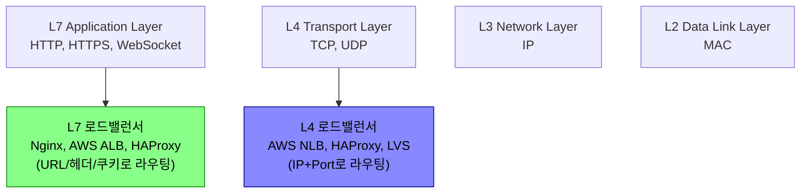
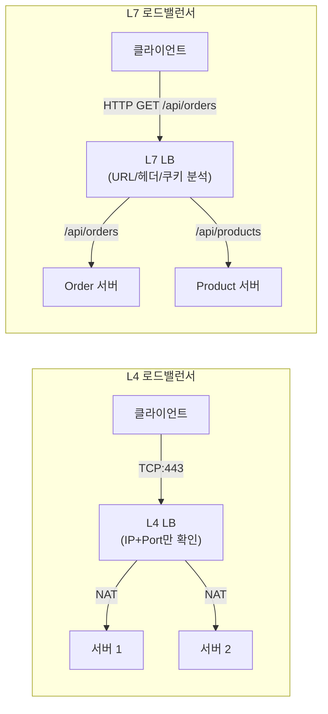
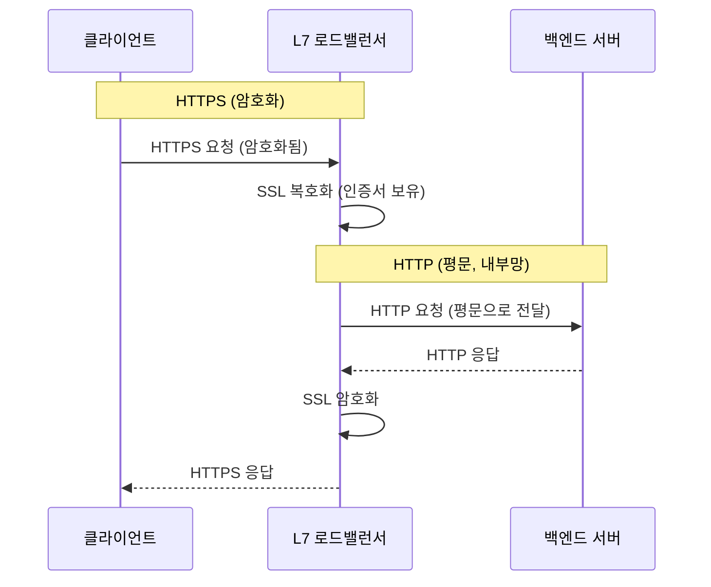
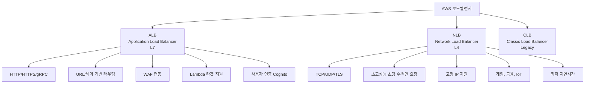
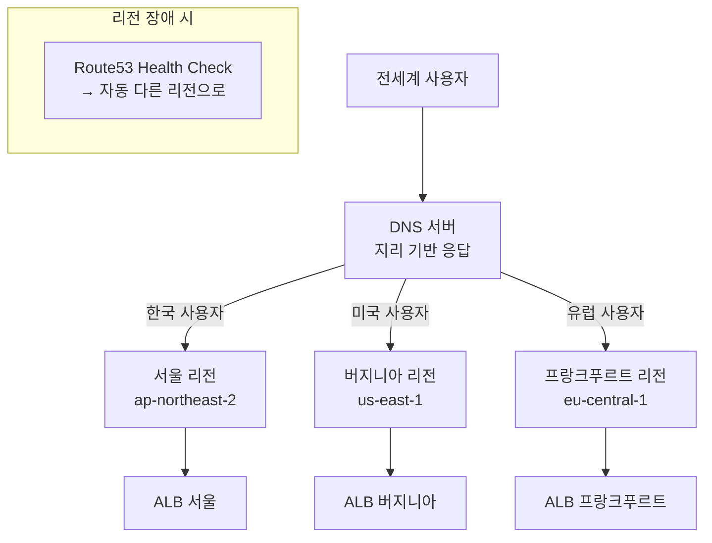
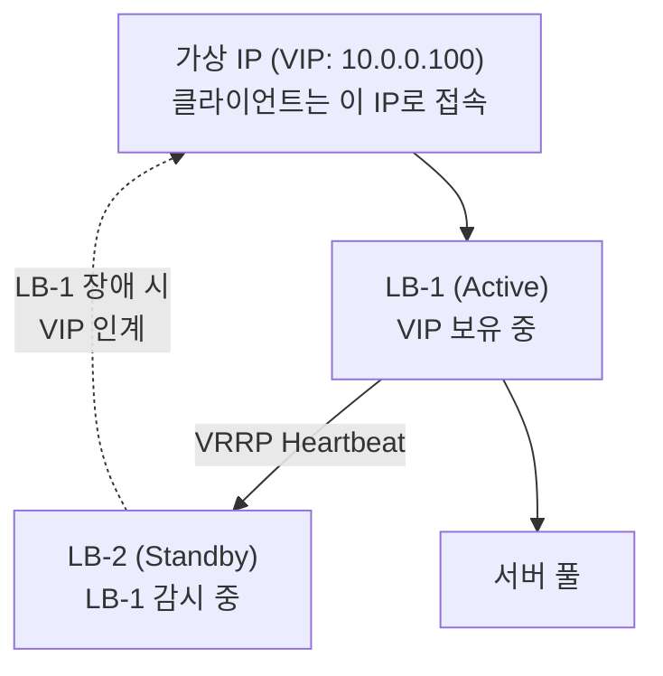
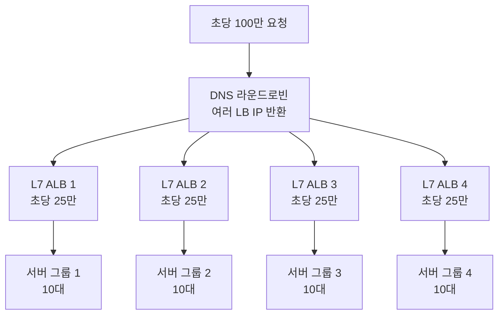
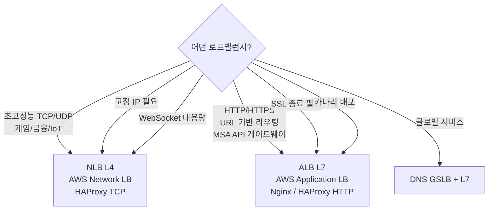

로드밸런서(Load Balancer)는 들어오는 네트워크 트래픽을 여러 서버에 분산시켜 **가용성과 성능을 높이는 장치**다. 서버 한 대가 모든 요청을 처리하면 과부하로 다운되지만, 여러 대로 분산하면 한 대가 죽어도 서비스가 유지된다.

> **비유:** 은행 창구 안내 직원과 같다. 고객이 몰려오면 "3번 창구 가세요", "5번 창구 가세요"라며 분산 안내한다. 어느 창구가 바쁜지 파악해서 균등하게 배분하고, 특정 업무(대출)는 전문 창구로 안내한다.

---

## OSI 계층과 로드밸런서

로드밸런서는 동작하는 OSI 계층에 따라 L4와 L7로 나뉜다. 높은 계층일수록 더 많은 정보를 보고 결정하지만, 그만큼 처리 비용이 높아진다.

> **비유:** L4 로드밸런서는 택배 봉투의 주소지만 보고 배달하는 단순 분류기다. 내용물이 뭔지 모른다. L7 로드밸런서는 내용물을 열어보는 스마트 분류기다. "이 소포는 냉동식품이니까 냉장 창고로", "이 서류는 법무팀으로"처럼 내용에 따라 지능적으로 분류한다.



---

## L4 로드밸런서

**TCP/UDP 계층(4계층)**에서 동작한다. 패킷의 IP 주소와 포트만 보고 라우팅하며, 패킷 내용(HTTP 헤더, URL)은 보지 않는다.

패킷이 도착하면 목적지 IP/포트를 서버 IP/포트로 변환(NAT)해 전달한다. 패킷 내용을 파싱하지 않으므로 처리 속도가 매우 빠르다.

**L4 동작 과정:**
```
1. 클라이언트 → 로드밸런서 TCP SYN
2. 로드밸런서: 목적지 IP:Port 확인 (패킷 열어보지 않음)
3. NAT(Network Address Translation)으로 목적지 IP 변경
4. 선택된 서버로 전달
5. 서버 응답도 로드밸런서를 거쳐 클라이언트로 전달

처리 속도: 마이크로초 단위 (패킷 분석 없음)
```

| 항목 | 내용 |
|------|------|
| 동작 계층 | Transport Layer (L4) |
| 라우팅 기준 | IP + Port |
| 패킷 내용 확인 | 불가 |
| SSL 종료 | 불가 (Pass-through) |
| 처리 속도 | 매우 빠름 |
| 사용 예 | 게임 서버, 실시간 스트리밍, DB 클러스터 |

---

## L7 로드밸런서

**Application 계층(7계층)**에서 동작한다. HTTP 헤더, URL 경로, 쿠키, 요청 본문까지 분석하여 라우팅한다. 콘텐츠 내용을 기반으로 어느 서버로 보낼지 결정할 수 있다.

| 항목 | 내용 |
|------|------|
| 동작 계층 | Application Layer (L7) |
| 라우팅 기준 | URL, Host, Header, Cookie |
| 콘텐츠 기반 라우팅 | 가능 |
| SSL 종료 | 가능 (TLS Termination) |
| 처리 속도 | L4보다 느림 |
| 사용 예 | 웹 서비스, 마이크로서비스, API Gateway |

```nginx
# Nginx L7 라우팅 예시 — URL 경로 기반으로 다른 서버로 분산
upstream order-service {
    server order1:8080;
    server order2:8080;
}

upstream product-service {
    server product1:8080;
    server product2:8080;
}

upstream static_servers {
    server static1.example.com:80;
    server static2.example.com:80;
}

upstream video_servers {
    server video1.example.com:8080;
    server video2.example.com:8080;
}

server {
    listen 80;
    server_name api.example.com;

    # URL 경로 기반 라우팅
    location /api/orders {
        proxy_pass http://order-service;
    }

    location /api/products {
        proxy_pass http://product-service;
    }

    # 정적 파일은 별도 서버 + 캐시 1일
    location ~* \.(jpg|jpeg|png|gif|css|js)$ {
        proxy_pass http://static_servers;
        proxy_cache_valid 200 1d;
    }

    # 동영상은 전용 서버 + 긴 타임아웃
    location /video/ {
        proxy_pass http://video_servers;
        proxy_read_timeout 300s;
    }

    # 헤더 기반 라우팅 (A/B 테스트)
    location /api/experiment {
        if ($http_x_user_segment = "beta") {
            proxy_pass http://beta-service;
        }
        proxy_pass http://stable-service;
    }
}
```

---

## L4 vs L7 비교



| 항목 | L4 | L7 |
|------|----|----|
| 속도 | 극히 빠름 (μs) | 상대적으로 느림 (ms) |
| 유연성 | 낮음 | 높음 |
| SSL 종료 | 서버에서 처리 (Pass-through) | LB에서 처리 가능 |
| 로깅 | IP/포트 수준 | HTTP 상세 로깅 가능 |
| 스티키 세션 | IP Hash 기반 | 쿠키 기반 (정확) |
| 헬스체크 | TCP 연결 | HTTP 응답 코드 |
| DDoS 방어 | 제한적 | WAF 연동 가능 |
| 비용 | 낮음 | 높음 |
| 마이크로서비스 | 부적합 | 적합 |

---

## 로드밸런싱 알고리즘

### Round Robin — 순서대로 분산

요청을 서버 목록 순서대로 순환하며 배분한다.

```nginx
upstream backend {
    server server1:8080;
    server server2:8080;
    server server3:8080;
    # 요청 1→서버1, 요청 2→서버2, 요청 3→서버3, 요청 4→서버1 반복
}
```

적합: 모든 서버 성능이 동일하고 요청 처리 시간이 비슷할 때.

### Weighted Round Robin — 성능 비례 분산

서버 성능에 비례하여 더 많은 요청을 배분한다.

```nginx
upstream backend {
    server server1:8080 weight=5;  # 5/8 트래픽 수신
    server server2:8080 weight=2;  # 2/8 트래픽 수신
    server server3:8080 weight=1;  # 1/8 트래픽 수신
}
```

적합: 서버 스펙이 다를 때 (고성능 서버에 더 많이 배분).

### Least Connections — 현재 가장 한가한 서버로

현재 활성 연결 수가 가장 적은 서버로 보낸다.

```nginx
upstream backend {
    least_conn;
    server server1:8080;
    server server2:8080;
    server server3:8080;
}
```

적합: 요청 처리 시간이 들쑥날쑥할 때 (파일 업로드, 응답 시간이 다양한 API). Round Robin은 처리 중인 연결 수를 무시하지만 Least Connections는 현재 부하를 반영한다.

### IP Hash — 같은 클라이언트는 항상 같은 서버로

클라이언트 IP를 해시하여 항상 동일한 서버로 보낸다.

```nginx
upstream backend {
    ip_hash;
    server server1:8080;
    server server2:8080;
    server server3:8080;
}
```

IP Hash의 내부 동작을 단순화하면 다음과 같다.

```python
def ip_hash_select(client_ip: str, servers: list) -> str:
    """같은 클라이언트 IP는 항상 같은 서버로"""
    hash_value = sum(int(octet) for octet in client_ip.split('.'))
    server_index = hash_value % len(servers)
    return servers[server_index]

# 192.168.1.100 → (192+168+1+100) % 3 = 461 % 3 = 2 → 서버3
# 192.168.1.101 → (192+168+1+101) % 3 = 462 % 3 = 0 → 서버1
```

적합: 세션 상태가 서버 메모리에 저장될 때(세션 지속성 필요). 단, NAT 뒤에 있는 경우 다수의 클라이언트가 같은 IP를 가져 한 서버에 몰릴 수 있다.

---

## SSL/TLS 종료 (Termination)

L7 로드밸런서에서 SSL을 종료하면 백엔드 서버는 암호화 부담 없이 HTTP 평문으로 통신한다. 인증서를 로드밸런서 한 곳에서만 관리하면 되므로 운영이 간편하다.



L4 로드밸런서는 SSL Passthrough 방식으로, IP:Port만 보고 전달할 뿐 SSL 내용을 모른다. 백엔드가 직접 복호화해야 한다.

```nginx
# SSL Termination: 클라이언트↔LB는 HTTPS, LB↔서버는 HTTP
server {
    listen 443 ssl;
    location / {
        proxy_pass http://api-servers;       # 내부는 HTTP
        proxy_set_header X-Forwarded-Proto https;  # 원래 프로토콜을 서버에 전달
    }
}
```

내부 네트워크가 신뢰 가능한 환경이면 평문 통신으로 충분하지만, Zero Trust 환경에서는 내부도 TLS(mTLS)로 암호화해야 한다.

---

## Nginx 실무 설정

```nginx
worker_processes auto;  # CPU 코어 수만큼 자동 설정

events {
    worker_connections 65535;  # 워커당 최대 연결 수
    use epoll;                 # Linux epoll 사용 (효율적 I/O 다중화)
    multi_accept on;
}

http {
    upstream api-servers {
        least_conn;
        keepalive 32;  # 업스트림과 keepalive 연결 유지 (매 요청마다 TCP 연결 재수립 방지)

        server app1:8080 weight=1 max_fails=3 fail_timeout=30s;
        server app2:8080 weight=1 max_fails=3 fail_timeout=30s;
        server app3:8080 weight=1 max_fails=3 fail_timeout=30s;
        # fail_timeout 동안 max_fails 실패 시 임시 제외
    }

    server {
        listen 80;
        listen 443 ssl http2;
        server_name api.example.com;

        ssl_certificate /etc/nginx/ssl/cert.pem;
        ssl_certificate_key /etc/nginx/ssl/key.pem;
        ssl_protocols TLSv1.2 TLSv1.3;

        # 요청 타임아웃
        proxy_connect_timeout 5s;
        proxy_send_timeout 60s;
        proxy_read_timeout 60s;

        location / {
            proxy_pass http://api-servers;
            proxy_http_version 1.1;
            proxy_set_header Connection "";       # keepalive를 위해 Connection 헤더 제거
            proxy_set_header Host $host;
            proxy_set_header X-Real-IP $remote_addr;
            proxy_set_header X-Forwarded-For $proxy_add_x_forwarded_for;
            proxy_set_header X-Forwarded-Proto $scheme;
        }

        # 헬스체크 엔드포인트는 로깅 제외
        location /health {
            proxy_pass http://api-servers;
            access_log off;
        }
    }
}
```

`X-Forwarded-For` 헤더는 실제 클라이언트 IP를 하위 서버에 전달한다. 이 헤더 없이는 모든 요청이 로드밸런서 IP에서 온 것처럼 보인다.

---

## HAProxy 실무 설정

HAProxy는 고성능 L4/L7 로드밸런서로, Nginx와 달리 L4(TCP) 모드와 L7(HTTP) 모드를 하나의 설정 파일에서 동시에 운영할 수 있다.

```haproxy
# /etc/haproxy/haproxy.cfg

global
    maxconn 50000
    log /dev/log local0
    stats socket /run/haproxy/admin.sock mode 660

defaults
    mode http
    timeout connect 5s
    timeout client  30s
    timeout server  30s
    option httplog
    option dontlognull

# L7 프론트엔드 (HTTP)
frontend http_front
    bind *:80
    bind *:443 ssl crt /etc/ssl/certs/cert.pem  # SSL 종료
    redirect scheme https if !{ ssl_fc }

    # URL 기반 라우팅
    acl is_api path_beg /api/
    acl is_static path_end .jpg .png .css .js
    acl is_admin path_beg /admin/

    use_backend api_backend if is_api
    use_backend static_backend if is_static
    use_backend admin_backend if is_admin
    default_backend web_backend

# 백엔드 그룹들
backend api_backend
    balance roundrobin
    option httpchk GET /health
    server api1 10.0.1.1:8080 check weight 3
    server api2 10.0.1.2:8080 check weight 3
    server api3 10.0.1.3:8080 check weight 2

backend static_backend
    balance leastconn
    server static1 10.0.2.1:80 check
    server static2 10.0.2.2:80 check

backend web_backend
    balance roundrobin
    cookie SERVERID insert indirect nocache
    server web1 10.0.3.1:8080 check cookie web1
    server web2 10.0.3.2:8080 check cookie web2

# L4 프론트엔드 (TCP - 데이터베이스)
frontend mysql_front
    bind *:3306
    mode tcp
    default_backend mysql_backend

backend mysql_backend
    mode tcp
    balance leastconn
    option mysql-check user haproxy
    server db1 10.0.4.1:3306 check
    server db2 10.0.4.2:3306 check backup  # 장애 시만 사용
```

HAProxy의 ACL(Access Control List) 기반 라우팅은 URL 경로, 확장자, 헤더 등 다양한 조건을 조합할 수 있어 복잡한 라우팅 규칙 구현에 유리하다.

---

## 헬스체크 (Health Check)

장애 서버를 자동으로 감지하고 트래픽에서 제외한다.

### Passive 헬스체크 — 실제 트래픽 응답으로 판단 (Nginx 기본)

```nginx
upstream backend {
    server server1:8080 max_fails=3 fail_timeout=30s;
    # 30초 내 3번 실패 → 30초 동안 트래픽에서 제외
}
```

실제 요청이 실패할 때만 감지하므로 장애 감지가 늦을 수 있다.

### Active 헬스체크 — 주기적으로 직접 확인 (HAProxy)

```haproxy
backend myapp
    option httpchk GET /actuator/health
    http-check expect status 200
    default-server inter 10s rise 2 fall 3
    # 10초마다 체크, 2번 성공 시 복구 판정, 3번 실패 시 제외

    server app1 192.168.1.10:8080 check
    server app2 192.168.1.11:8080 check
```

Active 헬스체크는 실제 요청이 없어도 서버 상태를 미리 파악한다.

### Active 헬스체크 — Nginx Plus

```nginx
upstream backend {
    server 10.0.1.1:8080;
    server 10.0.1.2:8080;
    server 10.0.1.3:8080;

    # Nginx Plus 전용 기능
    health_check interval=5s fails=3 passes=2 uri=/health;
    # 5초 간격 체크, 3번 실패 시 제외, 2번 성공 시 복구
}
```

---

## 세션 지속성 (Session Persistence)

사용자가 여러 번 요청해도 같은 서버로 연결되도록 보장한다. 세션 정보를 서버 메모리에 저장하는 경우 필요하다.

### 방법 1: IP Hash (Nginx) — 같은 IP → 같은 서버

NAT 뒤에 있으면 다수 클라이언트가 같은 서버로 몰리는 문제가 있다.

### 방법 2: 쿠키 기반 (Nginx) — sticky cookie

```nginx
upstream backend {
    sticky cookie srv_id expires=1h domain=.example.com path=/;
    server backend1.example.com;
    server backend2.example.com;
    server backend3.example.com;
}
```

Nginx Plus의 `sticky cookie` 지시어는 LB가 쿠키를 자동 삽입하여, 이후 요청에서 같은 서버로 라우팅한다.

### 방법 3: 쿠키 기반 (HAProxy) — 명시적 서버 식별

```haproxy
backend myapp
    cookie SERVER_ID insert indirect nocache
    server app1 192.168.1.10:8080 cookie app1
    server app2 192.168.1.11:8080 cookie app2
    # LB가 쿠키를 심고, 다음 요청 시 쿠키로 같은 서버로 라우팅
```

### 방법 4: 세션 외부화 (권장) — Stateless 서버 + Redis

```java
// Spring Session + Redis — 세션을 Redis에 저장해 어느 서버로 가도 동일한 세션 조회
@Configuration
@EnableRedisHttpSession(maxInactiveIntervalInSeconds = 1800)
public class SessionConfig {
    // 자동으로 모든 세션을 Redis에 저장
}
```

서버가 Stateless가 되므로 어떤 서버로 요청이 가도 Redis에서 동일한 세션을 조회할 수 있다. 서버 추가/제거가 자유롭고, 서버 장애 시에도 세션이 유지된다.

---

## AWS ALB vs NLB

AWS는 L7용 ALB(Application Load Balancer)와 L4용 NLB(Network Load Balancer)를 제공한다.



### ALB 라우팅 규칙 (Terraform)

ALB는 URL 경로, 헤더 등 L7 정보로 라우팅 규칙을 정의할 수 있다. 카나리 배포 시 가중치로 트래픽 비율을 조절한다.

```hcl
resource "aws_alb_listener_rule" "api_rule" {
  listener_arn = aws_alb_listener.https.arn
  priority     = 100

  action {
    type             = "forward"
    target_group_arn = aws_alb_target_group.api.arn
  }

  condition {
    path_pattern {
      values = ["/api/*"]
    }
  }
}

resource "aws_alb_listener_rule" "canary_rule" {
  listener_arn = aws_alb_listener.https.arn
  priority     = 50  # 높은 우선순위

  action {
    type = "forward"
    forward {
      target_group {
        arn    = aws_alb_target_group.production.arn
        weight = 90  # 90% 트래픽
      }
      target_group {
        arn    = aws_alb_target_group.canary.arn
        weight = 10  # 10% 카나리
      }
    }
  }

  condition {
    path_pattern {
      values = ["/api/v2/*"]
    }
  }
}
```

### NLB 설정 — 고정 IP (Terraform)

NLB는 고정 IP(Elastic IP)를 할당할 수 있어 방화벽 화이트리스트가 필요한 환경에 적합하다.

```hcl
resource "aws_lb" "nlb" {
  name               = "game-nlb"
  internal           = false
  load_balancer_type = "network"

  subnet_mapping {
    subnet_id     = aws_subnet.public_a.id
    allocation_id = aws_eip.nlb_a.id  # 고정 IP
  }

  subnet_mapping {
    subnet_id     = aws_subnet.public_b.id
    allocation_id = aws_eip.nlb_b.id
  }
}

resource "aws_lb_target_group" "game_udp" {
  name     = "game-udp"
  port     = 7777
  protocol = "UDP"  # UDP 게임 서버
  vpc_id   = aws_vpc.main.id

  health_check {
    protocol = "TCP"
    port     = 7777
  }
}
```

---

## 글로벌 로드밸런싱 (GSLB)

GSLB(Global Server Load Balancing)는 DNS 기반으로 전 세계 사용자를 가장 가까운 리전으로 라우팅한다. 리전 장애 시 자동으로 다른 리전으로 페일오버된다.



AWS Route53, Cloudflare, Akamai 등이 GSLB 기능을 제공한다. 지리 기반 라우팅, 가중치 라우팅, 레이턴시 기반 라우팅 등을 지원한다.

---

<details class="extreme-scenario-details">
<summary class="extreme-scenario-summary">
<span class="extreme-scenario-icon">🔥</span>
<span class="extreme-scenario-label">극한 시나리오 — 클릭하여 펼치기</span>
<span class="extreme-scenario-toggle"></span>
</summary>
<div class="extreme-scenario-body">

<div class="extreme-scenario-content" markdown="1">

### 시나리오 1: 서버 1대 장애 시 503 응답 급증

헬스체크 감지 전에 이미 다수 요청이 장애 서버로 라우팅된다. 빠른 감지 설정과 재시도로 대응한다.

```nginx
upstream backend {
    server app1:8080 max_fails=1 fail_timeout=10s;
    # 1번만 실패해도 10초 제외 (더 공격적인 감지)
}

# 멱등한 GET 요청에 대해서만 다음 서버로 재시도
proxy_next_upstream error timeout http_500 http_502 http_503;
proxy_next_upstream_tries 2;      # 최대 2개 서버 시도
proxy_next_upstream_timeout 5s;
```

### 시나리오 2: 로드밸런서 자체가 SPOF — Keepalived HA

로드밸런서가 하나면 그 자체가 단일 실패 지점(SPOF)이 된다. VRRP/Keepalived로 Active-Passive 이중화한다.



```bash
# /etc/keepalived/keepalived.conf

# Active 노드
vrrp_instance VI_1 {
    state MASTER
    interface eth0
    virtual_router_id 51
    priority 100        # Active가 더 높은 우선순위
    advert_int 1

    authentication {
        auth_type PASS
        auth_pass secretpassword
    }

    virtual_ipaddress {
        10.0.0.100/24  # 가상 IP - LB-1 장애 시 LB-2가 자동 인계
    }
}

# Standby 노드 (별도 서버)
vrrp_instance VI_1 {
    state BACKUP
    interface eth0
    virtual_router_id 51
    priority 90         # 낮은 우선순위
    advert_int 1

    authentication {
        auth_type PASS
        auth_pass secretpassword
    }

    virtual_ipaddress {
        10.0.0.100/24
    }
}
```

Active LB가 다운되면 Standby가 VIP를 인계받아 서비스가 중단 없이 계속된다.

### 시나리오 3: 특정 서버에 요청 쏠림 (Hot Spot)

IP Hash 사용 시 NAT 뒤에 다수 클라이언트가 있으면 한 서버에 트래픽이 집중된다. Least Connections로 전환하거나, 세션 외부화(Redis)로 변경해 IP Hash 의존성을 없앤다.

### 시나리오 4: 초당 100만 요청 처리

단일 로드밸런서의 한계를 넘는 트래픽은 DNS 라운드로빈으로 여러 LB에 분산한다.



ALB 한 대는 약 100만 RPS가 한계이고, NLB 한 대는 수백만 RPS를 처리할 수 있다. 초고성능이 필요하면 NLB를 앞단에 두고 뒤에 ALB를 배치하는 구성도 사용한다.

---
</div>
</div>
</details>

## 의사결정 가이드



| 상황 | 추천 |
|------|------|
| 웹 애플리케이션 | L7 (Nginx, ALB) |
| MSA API 라우팅 | L7 (ALB, Traefik) |
| 게임 서버 | L4 (NLB) |
| 데이터베이스 앞단 | L4 (HAProxy TCP) |
| 금융 거래 | L4 (초저지연) |
| 카나리 배포 | L7 (가중치 라우팅) |
| 글로벌 서비스 | DNS GSLB + L7 |
