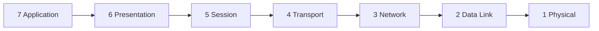
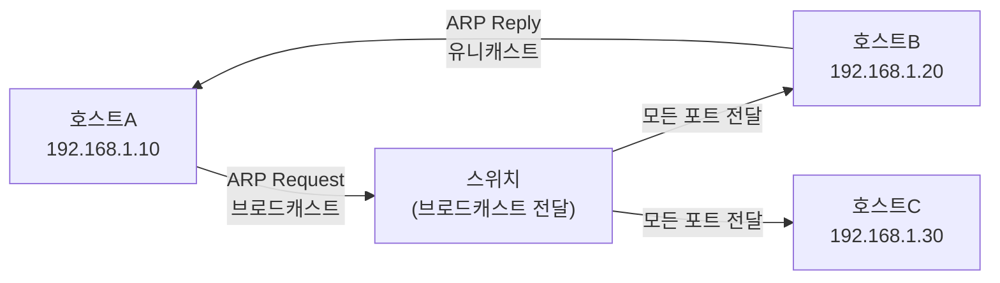
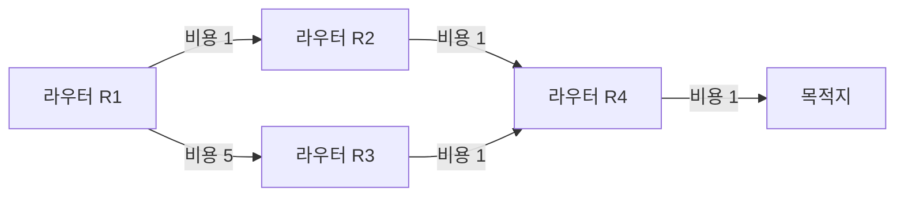
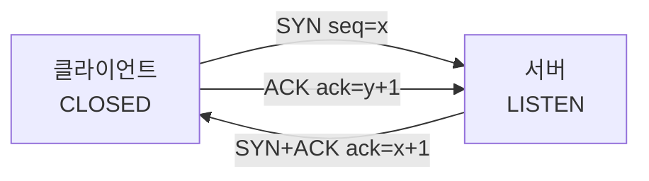
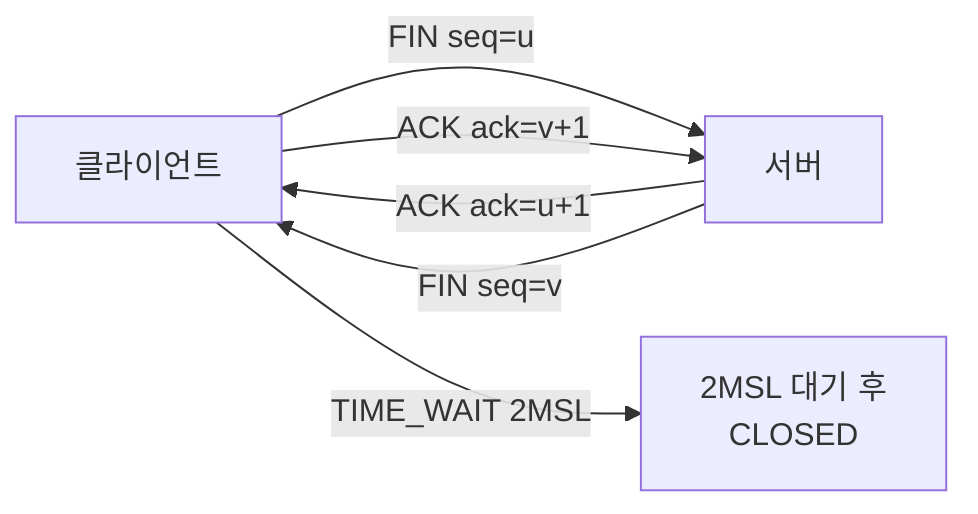
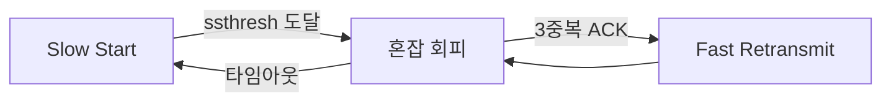
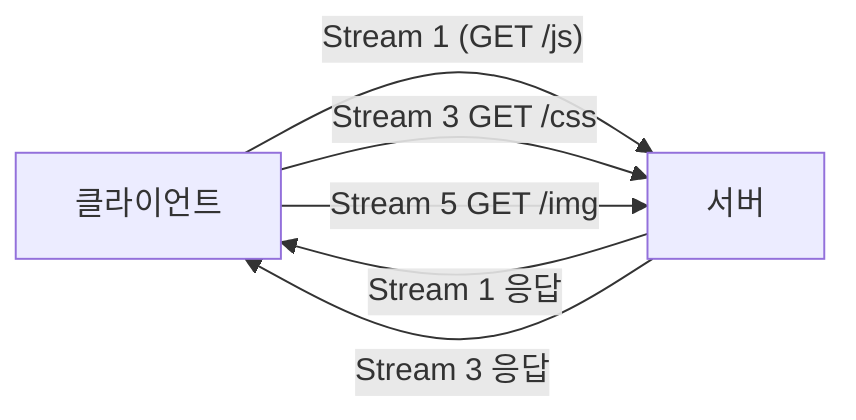
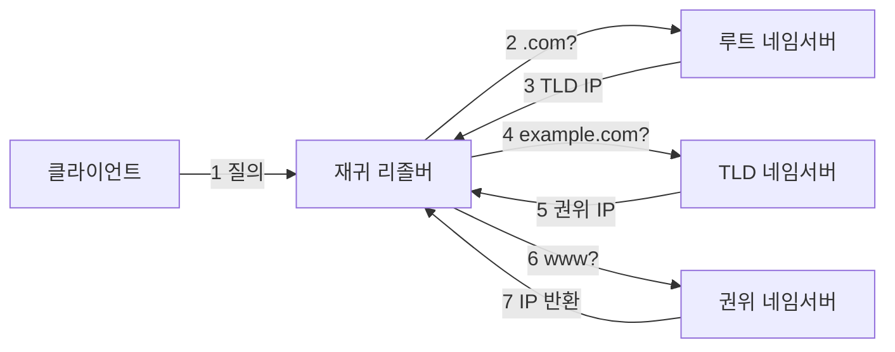
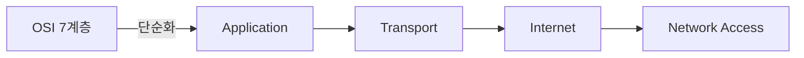

OSI 7계층을 "7·6·5·4·3·2·1 암기"로 끝내는 면접자와 "각 계층이 왜 존재하고 무엇을 해결하는가"를 설명하는 면접자는 결과가 다르다. 이 글은 후자를 위해 물리 신호 인코딩부터 HTTP/3 QUIC 내부 동작까지 WHY 중심으로 파고든다. Java/Spring 맥락에서 각 계층이 어디에 매핑되는지도 함께 짚는다.

> **비유**: 국제 택배를 보낸다고 하자. 물건을 박스에 넣고(Application), 언어를 번역하고(Presentation), 배송 번호를 붙여 대화를 추적하고(Session), 항공편을 예약해 분실 보상을 보장하고(Transport), 국가 간 경로를 찾고(Network), 트럭이 도시 내 도로를 달리고(Data Link), 바퀴가 실제 아스팔트를 구른다(Physical). 각 계층은 아래 계층이 어떻게 동작하는지 몰라도 된다. 이 **레이어드 추상화**가 OSI의 핵심이다.

---

## OSI 7계층 한눈에 보기



| 계층 | 이름 | PDU | 핵심 역할 | 대표 프로토콜 |
|------|------|-----|----------|-------------|
| 7 | Application | Message | 애플리케이션 서비스 | HTTP, DNS, SMTP, FTP |
| 6 | Presentation | Message | 인코딩·암호화·압축 | TLS, gzip, UTF-8 |
| 5 | Session | Message | 세션 수립·유지·종료 | TLS Session, RPC |
| 4 | Transport | Segment/Datagram | 종단 간 신뢰성·흐름 제어 | TCP, UDP |
| 3 | Network | Packet | 논리 주소·라우팅 | IP, ICMP, OSPF, BGP |
| 2 | Data Link | Frame | 물리 주소·오류 감지 | Ethernet, ARP, Wi-Fi |
| 1 | Physical | Bit | 비트→전기/광/무선 신호 | UTP, 광섬유, LTE |

---

## 1계층 — Physical Layer: 신호가 실제로 흐르는 방법

### 핵심 역할: 비트를 물리 신호로 변환

1계층은 0과 1의 비트열을 전압 변화, 빛의 점멸, 전파로 변환해 케이블이나 공기를 통해 전달한다. "단순히 신호를 보내는 것"처럼 보이지만, 신호 인코딩 방법에 따라 대역폭 효율·노이즈 내성·클럭 동기화가 완전히 달라진다.

### 왜 Manchester Encoding을 사용하는가?

초기 이더넷(10BASE-T)이 단순한 NRZ(Non-Return-to-Zero) 대신 Manchester Encoding을 선택한 이유는 **클럭 동기화** 문제 때문이다.

NRZ에서 긴 1 연속(111111...)은 전압이 변하지 않는다. 수신 측은 클럭이 없으면 "이것이 6개의 1인가, 7개의 1인가" 구분할 수 없다. 별도 클럭 선을 추가하면 배선 비용이 두 배가 된다.

Manchester Encoding은 **각 비트 중앙에서 반드시 전압이 전환**된다.
- 비트 값 1: 낮음→높음 전환 (상승 엣지)
- 비트 값 0: 높음→낮음 전환 (하강 엣지)

```
NRZ:        1  1  1  0  0  1
전압:      ‾‾‾‾‾‾‾‾‾_____‾‾‾

Manchester: 1     1     1     0     0     1
전압:      _‾  _‾  _‾  ‾_  ‾_  _‾
             ↑각 비트 중앙에서 반드시 전환 발생
```

장점: 수신 측은 전압 전환 패턴에서 클럭을 자동으로 추출(CDR: Clock Data Recovery)할 수 있다. 별도 클럭 배선 불필요.
단점: 하나의 비트를 표현하는 데 두 번의 신호 변화가 필요하므로 실제 데이터 전송률은 신호 변화율(Baud Rate)의 절반이다.

### Bit Rate vs Baud Rate — 왜 다른가?

**Baud Rate(보레이트)**: 초당 신호 변화 횟수. 물리적 채널 한계.
**Bit Rate(비트레이트)**: 초당 전송되는 비트 수.

하나의 신호 상태가 여러 비트를 나타낼 수 있다면 Bit Rate > Baud Rate가 된다.

| 인코딩 방식 | 신호 상태 수 | 신호당 비트 수 | 1200 Baud의 Bit Rate |
|------------|------------|--------------|---------------------|
| NRZ (2진) | 2 (0, 1) | 1 bit | 1,200 bps |
| Manchester | 2 | 1 bit (효율 50%) | 600 bps |
| QAM-16 | 16 | 4 bits | 4,800 bps |
| QAM-64 | 64 | 6 bits | 7,200 bps |

현대 광대역 통신(LTE, 케이블 모뎀)은 QAM-256, QAM-1024처럼 높은 변조 방식을 사용해 같은 Baud Rate에서 더 많은 비트를 전송한다. 단, 신호 대 잡음비(SNR)가 높아야 하므로 거리가 짧거나 신호 품질이 좋아야 한다.

### 물리 매체별 특성

| 매체 | 최대 대역폭 | 최대 거리 | 특성 | 사용처 |
|------|-----------|---------|------|-------|
| UTP Cat5e | 1 Gbps | 100m | 저렴, 전자기 간섭 취약 | 사무실 LAN |
| UTP Cat6a | 10 Gbps | 100m | 간섭 차폐 개선 | 데이터센터 ToR |
| 단일모드 광섬유 | 100 Gbps+ | 수십 km | 빛 하나의 경로, 손실 최소 | WAN, 장거리 백본 |
| 다중모드 광섬유 | 10 Gbps | 수백 m | 여러 빛 경로, 분산 발생 | 건물 내 백본 |
| Wi-Fi 6 (802.11ax) | 9.6 Gbps | ~30m | OFDMA, MU-MIMO | 무선 LAN |
| 5G | 20 Gbps | 수 km | mmWave/Sub-6GHz | 모바일, IoT |

### 클럭 동기화와 프리앰블

이더넷 프레임은 실제 데이터 앞에 **Preamble(7바이트, `10101010` 반복) + SFD(1바이트, `10101011`)**를 붙인다. 이 패턴이 존재하는 이유는:

1. 수신 NIC가 신호에서 클럭을 동기화할 시간을 준다(CDR 수렴).
2. SFD의 마지막 두 비트 `11`이 "지금부터 실제 프레임 시작"을 알린다.

이것이 없으면 수신 측은 프레임이 어디서 시작하는지 알 수 없다.

---

## 2계층 — Data Link Layer: 같은 네트워크 안에서 누가 누구에게

### MAC 주소: 왜 필요하고 어떻게 생겼는가

IP 주소는 논리 주소로, 네트워크 구성에 따라 바뀔 수 있다. 실제 하드웨어(NIC)를 식별하려면 변경되지 않는 물리 주소가 필요하다. 이것이 **MAC(Media Access Control) 주소**다.

```
MAC 주소 구조: 48비트 = 6바이트
AA:BB:CC:DD:EE:FF
└──────┘ └──────┘
  OUI       NIC
제조사 ID  고유 번호
(3바이트)  (3바이트)

IEEE가 OUI를 제조사에 할당
AA:BB:CC = 삼성, AA:CC:DD = Intel 등
```

**왜 MAC과 IP 두 가지를 모두 쓰는가?**

MAC 주소만으로는 전 세계 라우팅이 불가능하다. 48비트 주소 공간에서 계층적 집계(Aggregation)가 불가능하기 때문이다. IP 주소는 네트워크 번호 + 호스트 번호 구조로 계층적이어서 라우팅 테이블을 압축할 수 있다.

반대로 IP 주소만으로는 같은 LAN 내에서 프레임을 어느 포트로 보낼지 결정할 수 없다. 스위치는 IP를 보지 않는다(3계층 장비가 아니므로). MAC이 있어야 한다.

두 주소 체계는 서로 다른 문제를 해결한다: MAC은 **같은 네트워크 안의 물리 전달**, IP는 **네트워크 간 논리 경로 결정**.

### Ethernet 프레임 구조 (IEEE 802.3)

```
 0         1         2         3         4         5         6
 0123456789012345678901234567890123456789012345678901234567890123456789
┌─────────┬──────────────┬──────────────┬──────────┬─────────────┬─────┐
│Preamble │ Dst MAC(6B)  │ Src MAC(6B)  │EtherType │  Payload    │ FCS │
│  +SFD   │              │              │  (2B)    │ (46~1500B)  │(4B) │
│  (8B)   │              │              │          │             │     │
└─────────┴──────────────┴──────────────┴──────────┴─────────────┴─────┘

EtherType 주요 값:
  0x0800 = IPv4
  0x0806 = ARP
  0x86DD = IPv6
  0x8100 = VLAN (802.1Q)

FCS(Frame Check Sequence): CRC-32 오류 감지
  - 송신 측이 프레임 전체에 CRC 계산 후 FCS 필드에 기록
  - 수신 측이 동일 계산 후 불일치 시 프레임 폐기
  - WHY CRC? XOR 기반 다항식 연산으로 단순 체크섬보다
    버스트 오류 감지율이 높음 (32비트 CRC로 99.9999% 감지)
```

**최소 페이로드 46바이트의 이유**: CSMA/CD에서 충돌 감지를 위해 프레임이 네트워크 왕복 시간(RTT) 동안 선 위에 있어야 한다. 10Mbps 500m 이더넷에서 최소 전송 시간이 필요해 64바이트(헤더 18B + 페이로드 46B)를 최소 프레임 크기로 정했다.

### ARP 프로토콜 — IP를 알고 있는데 왜 MAC이 필요한가

3계층(IP)에서 목적지 IP로 패킷을 만들었다. 이 패킷을 2계층 프레임에 담으려면 목적지 MAC 주소가 필요하다. IP→MAC 변환을 수행하는 것이 **ARP(Address Resolution Protocol)**다.



**ARP 동작 상세**

```
1. A가 B(192.168.1.20)에게 패킷을 보내려 함
2. A의 ARP 캐시에 192.168.1.20 항목 없음
3. A가 ARP Request 브로드캐스트:
   - 목적지 MAC: FF:FF:FF:FF:FF:FF (브로드캐스트)
   - "192.168.1.20을 가진 호스트, 당신의 MAC은?"
4. 스위치가 모든 포트로 브로드캐스트 전달
5. 192.168.1.20인 B만 응답(ARP Reply, 유니캐스트):
   - "나야! MAC은 AA:BB:CC:11:22:33"
6. A가 ARP 캐시에 저장 (TTL: 리눅스 기본 60초, Windows 30초)
7. 이후 패킷은 ARP 캐시를 이용해 즉시 프레임 생성
```

**왜 ARP Reply는 유니캐스트인가?**

Request는 브로드캐스트여야 한다(목적지 MAC을 모르므로). Reply는 이미 Request에서 요청자의 MAC 주소를 알게 됐으므로 유니캐스트로 직접 전송한다. 불필요한 브로드캐스트 트래픽을 줄이기 위함이다.

**Gratuitous ARP**: IP 충돌 감지 및 ARP 캐시 업데이트 목적으로 자신의 IP에 대해 스스로 ARP Request를 보내는 것. VRRP(Virtual Router Redundancy Protocol)에서 게이트웨이 IP가 다른 장비로 이전될 때 전체 네트워크의 ARP 캐시를 즉시 갱신하는 데 사용한다.

**ARP 스푸핑 공격 원리**

```
정상: A → 게이트웨이(192.168.1.1, MAC: GW_MAC)
공격: 공격자가 "192.168.1.1의 MAC은 ATTACKER_MAC"이라는
      가짜 ARP Reply를 A에게 지속 전송
결과: A의 ARP 캐시 오염 → A의 패킷이 공격자에게 먼저 도달(MITM)

방어: 동적 ARP 검사(DAI) - DHCP Snooping 테이블과 대조
      정적 ARP 항목 수동 설정
      Port Security + 802.1X 인증
```

### 스위치의 MAC 주소 테이블 학습 메커니즘

스위치는 처음 전원을 켤 때 MAC 테이블이 비어있다. 학습은 **Flooding → Learning → Forwarding** 순서로 진행된다.

```
초기 상태: MAC 테이블 비어있음

1. 포트 1에서 A→B 프레임 수신
   - 출발지 MAC(A의 MAC)을 포트 1에 기록 [학습]
   - B의 MAC이 테이블에 없음 → 모든 포트로 Flooding

2. B가 응답, 포트 2에서 B→A 프레임 수신
   - 출발지 MAC(B의 MAC)을 포트 2에 기록 [학습]
   - A의 MAC이 포트 1에 있음 → 포트 1로만 전달 [포워딩]

3. 이후 A↔B 통신은 해당 포트로만 전달

MAC 테이블 항목은 일정 시간(기본 300초) 미사용 시 삭제
→ 호스트가 이동해도 새 위치를 자동으로 학습
```

**스위치 vs 허브**

허브는 수신한 신호를 모든 포트로 브로드캐스트한다. 100개 장비가 연결된 허브에서 모든 장비가 서로의 트래픽을 수신하고, 동시 전송 시 충돌이 발생해 CSMA/CD로 재전송해야 한다. 실효 대역폭은 명목 속도의 수십 % 이하로 떨어진다.

스위치는 학습된 MAC 테이블로 필요한 포트에만 전달하므로 각 포트가 전이중(Full-Duplex)으로 독립 동작하고 충돌이 없다.

### VLAN (Virtual LAN)

물리 스위치를 논리적으로 분리하는 기술이다. 이더넷 프레임에 802.1Q VLAN 태그(4바이트)를 추가해 같은 물리 스위치에 연결된 장비를 서로 다른 브로드캐스트 도메인으로 격리한다.

```
VLAN 태그 삽입 위치 (802.1Q):
[Dst MAC][Src MAC][0x8100][VLAN TAG(12bit VID)][EtherType][Payload][FCS]
                  ← TPID →  ←─── TCI(16bit) ───→

VLAN 10: 개발팀 네트워크 (같은 포트에서 논리 분리)
VLAN 20: 운영팀 네트워크
→ VLAN 10↔20 통신은 반드시 3계층 라우터/L3 스위치 통과
```

---

## 3계층 — Network Layer: 인터넷 규모의 주소와 경로

### IP 주소와 서브넷 마스크 — 왜 이렇게 설계됐나

IPv4 주소는 32비트다. `192.168.1.10`은 사람이 읽기 위한 표현이고, 내부는 `11000000.10101000.00000001.00001010`이다.

**서브넷 마스크가 필요한 이유**

IP 주소만으로는 "같은 네트워크인지 다른 네트워크인지"를 판단할 수 없다. 서브넷 마스크는 IP 주소를 **네트워크 번호**와 **호스트 번호**로 분리한다.

```
IP:   192.168.1.10  = 11000000.10101000.00000001.00001010
마스크: 255.255.255.0 = 11111111.11111111.11111111.00000000
AND:   192.168.1.0  = 11000000.10101000.00000001.00000000
                      ↑ 네트워크 번호(24비트) ↑ 호스트(8비트)

목적지 192.168.1.20과 AND:
       192.168.1.0  → 같은 네트워크! ARP로 직접 전달

목적지 10.0.0.1과 AND:
       10.0.0.0     → 다른 네트워크 → 게이트웨이로 전달
```

이 AND 연산이 호스트가 "직접 전달할 것인가, 게이트웨이로 보낼 것인가"를 결정하는 핵심이다.

### CIDR — Classful 주소 체계의 한계를 해결

초기 인터넷은 A/B/C 클래스 고정 방식이었다.
- A 클래스: /8 (1600만 호스트) → 대규모 기관만 받을 수 있어 낭비
- B 클래스: /16 (65534 호스트) → 중간 기관에 배정, 여전히 낭비
- C 클래스: /24 (254 호스트) → 너무 작아 기업에 여러 개 배정 필요

**CIDR(Classless Inter-Domain Routing)**은 임의의 비트 경계로 분리를 허용한다.

```
192.168.1.0/25 → 호스트 126개 (/24를 반으로 나눔)
192.168.1.0/26 → 호스트 62개
10.0.0.0/8     → 기업 내부 대규모 사설 네트워크

슈퍼넷 집계 예시:
  203.0.113.0/24
  203.0.114.0/24   → 203.0.112.0/22로 집계
  203.0.115.0/24     (4개 /24를 하나의 라우팅 항목으로)
  203.0.112.0/24
```

CIDR의 집계(Aggregation) 덕분에 전 세계 BGP 라우터가 수억 개 IP를 수십만 개의 라우팅 항목으로 압축해 처리할 수 있다.

### 라우팅 알고리즘 — 어떻게 경로를 결정하는가

**Distance Vector (거리 벡터) — RIP**

각 라우터가 "이웃에게 물어보는" 방식. 벨만-포드 알고리즘 기반.

```
라우터 A: "B를 통하면 C까지 3홉"
라우터 B: "D를 통하면 C까지 2홉"
→ A가 업데이트: "D 방향으로 3홉" → "B를 통해 D→ 2+1=3홉"

장점: 구성 단순, 메모리/CPU 절약
단점: Count-to-Infinity 문제
      링크 장애 시 잘못된 홉 수가 계속 증가하며 수렴 느림
      RIP 최대 홉 수: 15 (16=무한대로 처리)
      → 대규모 네트워크 부적합
```

**Link State (링크 상태) — OSPF**

각 라우터가 전체 네트워크 토폴로지를 파악하는 방식. 다익스트라 알고리즘 기반.



```
동작 원리:
1. 각 라우터가 이웃과 Hello 패킷 교환 → 인접 관계(Adjacency) 형성
2. LSA(Link State Advertisement)를 네트워크 전체에 Flood
3. 모든 라우터가 동일한 LSDB(Link State Database) 보유
4. 각 라우터가 자신을 루트로 SPF(Shortest Path First) 트리 계산
5. SPF 결과로 라우팅 테이블 생성

장점: 빠른 수렴, Count-to-Infinity 없음, 정확한 경로 계산
단점: 대규모 네트워크에서 LSDB 메모리 사용, SPF 연산 부하
     → Area 분리로 해결 (Area 0=백본, 다른 Area 계층적 연결)
```

**BGP (Border Gateway Protocol)**

인터넷 ISP 간 라우팅에 사용. Path Vector 방식(어떤 AS를 거치는지 경로 전체를 저장). 정책 기반 라우팅 가능(비용, 계약 관계 등).

### NAT 메커니즘 — 사설 IP가 인터넷에 나가는 법

집이나 회사의 사설 IP(10.x.x.x, 172.16-31.x.x, 192.168.x.x)는 인터넷에서 라우팅되지 않는다. NAT(Network Address Translation)이 사설 IP를 공인 IP로 변환한다.

```
내부: 192.168.1.10:54321 → 외부: 8.8.8.8:53 (DNS 요청)

NAT 테이블 (라우터에 유지):
┌─────────────────────┬────────────────────┐
│ 내부 주소:포트       │ 외부 포트           │
├─────────────────────┼────────────────────┤
│ 192.168.1.10:54321  │ 공인IP:60001       │
│ 192.168.1.11:54322  │ 공인IP:60002       │
└─────────────────────┴────────────────────┘

송신 시: 출발지 192.168.1.10:54321 → 공인IP:60001 변환
수신 시: 목적지 공인IP:60001 → 192.168.1.10:54321 역변환

결과: 수천 대의 사설 호스트가 하나의 공인 IP 공유 가능
문제: NAT은 연결 시작자가 내부여야 함 → 서버 운영 어려움
     → Port Forwarding(포트 포워딩)으로 해결
```

**왜 NAT가 IPv6 도입을 늦췄는가**

IPv4 고갈 문제를 NAT로 "해결"해버려 IPv6 전환 시급성이 낮아졌다. IPv6(128비트)는 NAT 없이도 전 세계 모든 장치에 공인 IP를 줄 수 있으나, NAT에 의존하는 수많은 애플리케이션/방화벽 규칙이 IPv6 전환의 걸림돌이 됐다.

### IP 헤더 구조와 TTL

```
IPv4 헤더 (최소 20바이트):
┌─────┬──────────┬──────────────────────────────────────┐
│Ver  │IHL       │DSCP/ECN    │Total Length              │
├─────┴──────────┼────────────┬─────────────────────────┤
│Identification  │Flags       │Fragment Offset           │
├────────────────┼────────────┴─────────────────────────┤
│TTL (8bit)      │Protocol    │Header Checksum           │
├────────────────┴────────────┴─────────────────────────┤
│Source IP Address (32bit)                               │
├────────────────────────────────────────────────────────┤
│Destination IP Address (32bit)                          │
└────────────────────────────────────────────────────────┘

TTL(Time To Live): 라우터를 거칠 때마다 -1
  → 0이 되면 라우터가 패킷 폐기 + ICMP Time Exceeded 송신
  → 무한 루프 방지 (라우팅 테이블 오류 시 패킷이 영원히 순환하는 것 방지)
  → traceroute는 TTL을 1, 2, 3...씩 늘려 각 홉 라우터의 ICMP를 수집

Protocol 필드:
  6  = TCP
  17 = UDP
  1  = ICMP
  → 수신 측이 페이로드를 어느 상위 프로토콜로 전달할지 결정
```

### MTU와 패킷 단편화(Fragmentation)

**MTU(Maximum Transmission Unit)**: 한 번에 전송 가능한 최대 IP 패킷 크기.
- 이더넷: 1500 바이트
- Wi-Fi: 2304 바이트 (실제로는 1500으로 맞춤)
- PPPoE: 1492 바이트 (8바이트 오버헤드)

IP 패킷이 MTU보다 크면 라우터가 분할(Fragment)하고, 수신 측이 재조립(Reassembly)한다.

```
원본 패킷: 4000 바이트
이더넷 MTU: 1500 바이트 → 3개로 분할

조각 1: 1500B (IP 헤더 + 1480B 데이터, More Fragments=1, Offset=0)
조각 2: 1500B (IP 헤더 + 1480B 데이터, More Fragments=1, Offset=185)
조각 3: 1040B (IP 헤더 + 1020B 데이터, More Fragments=0, Offset=370)
```

**IPv4 단편화의 문제**: 라우터가 분할하면 수신 측만 재조립 가능하다. 하나의 조각이라도 손실되면 전체 재조립 실패로 IP 계층이 전체 패킷을 폐기한다. TCP는 재전송하지만 손실 조각 하나 때문에 여러 조각이 불필요하게 재전송된다.

**IPv6의 해결책**: 라우터가 단편화하지 않는다. 출발지 호스트가 Path MTU Discovery(PMTUD)로 경로의 최소 MTU를 먼저 파악하고 그 크기로 패킷을 만든다. 라우터는 단편화 없이 ICMP "Packet Too Big"을 반환한다.

---

## 4계층 — Transport Layer: 신뢰성, 흐름, 혼잡의 엔지니어링

### TCP vs UDP: 언제 무엇을 선택하는가

| 특성 | TCP | UDP |
|------|-----|-----|
| 연결 방식 | 연결 지향 (3-way handshake) | 비연결 |
| 신뢰성 | 보장 (ACK + 재전송) | 미보장 |
| 순서 보장 | 시퀀스 번호로 보장 | 미보장 |
| 흐름 제어 | Sliding Window | 없음 |
| 혼잡 제어 | Slow Start, AIMD, Fast Retransmit | 없음 |
| 헤더 크기 | 최소 20바이트 (옵션 포함 최대 60B) | 8바이트 고정 |
| 지연 | 핸드셰이크 + 재전송 오버헤드 | 최소 지연 |
| 용도 | HTTP, HTTPS, FTP, SSH, SMTP | DNS, DHCP, 스트리밍, 게임, VoIP |

**UDP가 실시간 게임·스트리밍에 적합한 이유**

오래된 패킷이 재전송돼서 도착하는 것보다 손실이 낫다. 30fps 게임에서 33ms 전의 위치 데이터가 재전송돼 늦게 도착하면 화면이 튄다. UDP로 손실을 허용하고 애플리케이션 계층에서 자체 보간(interpolation)하는 것이 더 낫다.

**Java에서 TCP vs UDP**

```java
// TCP 서버 소켓 (4계층 연결 지향)
ServerSocket serverSocket = new ServerSocket(8080);
Socket clientSocket = serverSocket.accept(); // 3-way handshake 완료 후 반환
InputStream in = clientSocket.getInputStream();
OutputStream out = clientSocket.getOutputStream();

// UDP 소켓 (비연결, 데이터그램 단위)
DatagramSocket udpSocket = new DatagramSocket(9090);
byte[] buffer = new byte[1024];
DatagramPacket packet = new DatagramPacket(buffer, buffer.length);
udpSocket.receive(packet); // 연결 없이 바로 수신

// Spring에서는 서블릿 컨테이너(Tomcat)가 TCP 소켓을 관리
// @RestController, @GetMapping은 7계층 HTTP 메시지를 다루는 것
// 개발자가 TCP 소켓을 직접 다루지 않는다
```

### TCP 헤더 구조

```
TCP 헤더 (최소 20바이트):
┌──────────────────────────┬──────────────────────────┐
│ Source Port (16bit)      │ Destination Port (16bit) │
├──────────────────────────┴──────────────────────────┤
│ Sequence Number (32bit)                              │
├──────────────────────────────────────────────────────┤
│ Acknowledgment Number (32bit)                        │
├────────┬───────┬─┬─┬─┬─┬─┬─┬──────────────────────┤
│Hdr Len │Reserve│U│A│P│R│S│F│ Window Size (16bit)   │
│(4bit)  │(4bit) │R│C│S│S│Y│I│                       │
│        │       │G│K│H│T│N│N│                       │
├────────┴───────┴─┴─┴─┴─┴─┴─┴──────────────────────┤
│ Checksum (16bit)         │ Urgent Pointer (16bit)   │
├──────────────────────────┴──────────────────────────┤
│ Options (가변, IHL-20 바이트)                        │
└──────────────────────────────────────────────────────┘

핵심 필드:
- Sequence Number: 이 세그먼트의 첫 바이트 번호
- Acknowledgment Number: "이 번호까지 수신 완료, 다음 이 번호를 달라"
- Window Size: 수신 버퍼 여유 공간 → 흐름 제어의 핵심
- SYN/ACK/FIN/RST: 연결 제어 플래그
```

### TCP 3-way Handshake — 왜 3번인가



**각 단계의 WHY**

```
1단계: 클라이언트 → 서버 SYN(seq=x)
   WHY: "나는 x부터 시퀀스를 시작할 것이다. 연결 가능한가?"
   ISN(Initial Sequence Number)이 랜덤인 이유:
     - 이전 연결의 지연 패킷과 구분하기 위해
     - 공격자가 시퀀스 번호를 예측해 세션을 가로채는 것 방지

2단계: 서버 → 클라이언트 SYN+ACK(seq=y, ack=x+1)
   WHY SYN: "나는 y부터 시퀀스를 시작할 것이다 (서버도 연결 요청)"
   WHY ACK=x+1: "x까지 받았다. x+1번을 달라" (클라이언트 SYN 확인)
   이 단계가 분리된 이유: 서버도 자신의 ISN을 알려야 양방향 통신 가능

3단계: 클라이언트 → 서버 ACK(ack=y+1)
   WHY: "y까지 받았다. y+1번을 달라" (서버 SYN 확인)
   이 단계가 필요한 이유:
     - 서버가 클라이언트의 수신 능력을 확인
     - 이 ACK 없이는 서버가 "SYN+ACK가 도달했는가?" 모름

왜 2-way가 안 되는가?
   - 1,2단계만으로는 클라이언트가 서버 데이터를 수신 가능한지 서버가 모름
   - 3단계 ACK로 서버는 클라이언트의 수신 능력 확인
   - 양방향 통신 개시 의사 + 능력 모두 확인 → 3-way 필요
```

**SYN Flood 공격**

공격자가 위조된 출발지 IP로 SYN만 무수히 보낸다. 서버는 SYN+ACK를 보내고 3단계 ACK를 기다리며 SYN_RCVD 상태를 유지한다. 이 "반개방 연결(Half-open)" 큐가 가득 차 정상 연결 불가.

방어: SYN Cookie — 서버가 SYN 큐에 상태를 저장하지 않고, 시퀀스 번호에 암호화된 쿠키를 인코딩. ACK가 오면 쿠키 검증 후 연결 수립. 큐 없이 방어 가능.

### TCP 4-way Handshake와 TIME_WAIT — 왜 2MSL을 기다리는가



**4-way인 이유**: TCP는 전이중(Full-Duplex) 연결이므로 각 방향이 독립적으로 종료된다. 클라이언트의 FIN+ACK와 서버의 FIN+ACK가 각각 필요하다. 서버는 클라이언트 FIN 수신 후 아직 보낼 데이터가 남을 수 있으므로 ACK와 FIN을 분리해 전송한다(CLOSE_WAIT 상태에서 데이터 전송 완료 후 FIN).

**TIME_WAIT의 이유 — 두 가지**

```
이유 1: 마지막 ACK 손실 대비
  클라이언트의 마지막 ACK(4단계)가 손실됐다면
  서버는 FIN을 재전송 → 클라이언트가 ACK를 다시 보내야 함
  CLOSED 상태라면 RST로 응답 → 서버가 오류 처리
  TIME_WAIT(2MSL) 동안 FIN이 오면 재ACK 전송 가능

이유 2: 지연 패킷 격리
  MSL(Maximum Segment Lifetime): 패킷이 네트워크에서 살 수 있는 최대 시간 (보통 30~60초)
  2MSL = 왕복 최대 지연 → 이 시간이 지나면 이전 연결의 패킷이 모두 소멸
  같은 4-tuple(src IP, src port, dst IP, dst port)로 새 연결을 맺을 때
  이전 연결의 지연 패킷이 새 연결을 오염시키지 않음

실무 문제: 서버 재시작 후 TIME_WAIT 포트가 가득 차
  → SO_REUSEADDR 옵션으로 TIME_WAIT 포트 재사용
  → 서버에서 먼저 FIN을 보내지 않도록 설계 (클라이언트가 먼저 종료)
```

**Java Spring 서버에서 TIME_WAIT 관리**

```java
// Tomcat 커넥션 풀에서 TIME_WAIT를 줄이는 설정
// application.properties
server.tomcat.connection-timeout=5000
server.tomcat.keep-alive-timeout=30000
server.tomcat.max-keep-alive-requests=100

// 의도적으로 서버가 먼저 연결을 끊지 않도록 설계
// → HTTP Keep-Alive로 연결 재사용 → 4-way 핸드셰이크 횟수 감소
```

### TCP 흐름 제어 — Sliding Window

**문제**: 송신자가 너무 빠르게 보내면 수신자 버퍼가 넘친다.
**해결**: 수신자가 자신의 버퍼 여유 공간(rwnd: receive window)을 TCP 헤더에 알려준다.

```
초기: 수신 버퍼 16KB

송신자 → 수신자: 세그먼트 전송 (rwnd에 따라 ACK 없이 연속 전송 가능)

[보낼 수 있는 양 = min(rwnd, cwnd)]
 rwnd: 수신자 버퍼 여유 (흐름 제어)
 cwnd: 혼잡 윈도우 (혼잡 제어)

슬라이딩 윈도우 동작:
  전송 가능 창: [ACK 받은 마지막 바이트 + 1 ... 마지막 전송 바이트 + rwnd]
  ACK 수신 → 창이 오른쪽으로 슬라이드 → 새 데이터 전송 가능

Zero Window:
  수신자 버퍼 가득 참 → rwnd=0 → 송신 일시 중단
  수신자가 버퍼 비우면 Window Update 전송 → 송신 재개
  Window Update 손실 시 교착상태 → TCP가 주기적으로 Window Probe 전송
```

### TCP 혼잡 제어 — 네트워크를 보호하는 알고리즘

흐름 제어는 수신자 보호. 혼잡 제어는 **네트워크(라우터 버퍼) 보호**. 수신자가 아무리 빠르게 받을 수 있어도, 중간 라우터 버퍼가 넘치면 패킷이 드롭된다.



**Slow Start**

```
초기: cwnd = 1 MSS (Maximum Segment Size, 보통 1460 바이트)
매 RTT마다 cwnd *= 2 (지수 증가)

RTT 1: cwnd = 1 → 1 세그먼트 전송
RTT 2: cwnd = 2 → 2 세그먼트 전송
RTT 3: cwnd = 4 → 4 세그먼트 전송
...

이름이 "Slow"인 이유: 초기에 1개부터 시작해 "천천히" 시작하지만
실제 증가는 지수적으로 빠름
ssthresh(Slow Start Threshold)에 도달 시 선형 증가 전환
```

**AIMD (Additive Increase Multiplicative Decrease)**

```
혼잡 회피 단계:
  매 RTT: cwnd += 1 MSS (선형 증가)
  패킷 손실(타임아웃) 감지 시:
    ssthresh = cwnd / 2
    cwnd = 1 (Slow Start 재시작)

왜 Additive Increase인가:
  선형으로 늘려야 네트워크 용량에 부드럽게 수렴
  지수 증가 계속하면 오버슈트 반복

왜 Multiplicative Decrease인가:
  타임아웃은 심각한 혼잡 신호 → 공격적으로 줄여야 빠른 회복
  선형으로 줄이면 혼잡 상황이 오래 지속
```

**Fast Retransmit + Fast Recovery**

```
3중복 ACK 감지: "ACK 5, ACK 5, ACK 5" → 세그먼트 6 손실 강한 신호
  (타임아웃이 아니므로 네트워크가 완전히 막힌 것은 아님)

Fast Retransmit:
  타임아웃 기다리지 않고 즉시 세그먼트 6 재전송

Fast Recovery (Reno):
  ssthresh = cwnd / 2
  cwnd = ssthresh + 3 (중복 ACK 3개 → 3 세그먼트 수신 완료 의미)
  Slow Start 생략 → 혼잡 회피 바로 진입

CUBIC (Linux 기본):
  3중복 ACK 후 더 공격적인 회복 곡선
  고대역폭·고지연 네트워크(BDP: Bandwidth-Delay Product)에서 유리

BBR (Google):
  패킷 손실 대신 RTT 측정으로 혼잡 감지
  YouTube, GCP에서 대규모 사용
  손실 기반 제어보다 높은 처리량 + 낮은 큐잉 지연
```

**Java에서 TCP 파라미터 조정**

```java
// ServerSocket 소켓 옵션
ServerSocket serverSocket = new ServerSocket();
serverSocket.setReceiveBufferSize(256 * 1024); // rwnd 초기값 힌트
serverSocket.setReuseAddress(true);             // TIME_WAIT 포트 재사용

Socket socket = new Socket();
socket.setTcpNoDelay(true);    // Nagle 알고리즘 비활성화 (소량 패킷 즉시 전송)
                                // WHY: Nagle은 소량 데이터를 모아 전송 → 지연 발생
                                // 실시간 게임, 채팅에서는 Nagle 비활성화 필요
socket.setSendBufferSize(256 * 1024);  // 송신 버퍼 (cwnd 제한 없을 때 사용)
socket.setKeepAlive(true);     // TCP 레벨 Keep-Alive (응용 계층과 다름)

// Spring WebFlux/Netty 설정
// application.properties에서:
// server.netty.connection-timeout=5s
// → Netty가 내부적으로 ServerBootstrap.option(SO_RCVBUF, ...)로 매핑
```

### 포트 번호와 소켓 4-tuple

TCP 연결은 **{출발지 IP, 출발지 포트, 목적지 IP, 목적지 포트}** 4개로 고유하게 식별된다.

```
서버 IP: 10.0.0.1, 포트: 8080 (고정)

클라이언트 A: {1.2.3.4:50001 → 10.0.0.1:8080} ← 연결 1
클라이언트 A: {1.2.3.4:50002 → 10.0.0.1:8080} ← 연결 2 (다른 에페머럴 포트)
클라이언트 B: {5.6.7.8:50001 → 10.0.0.1:8080} ← 연결 3 (다른 출발지 IP)

→ 서버 포트 8080 하나로 수천 개의 클라이언트를 동시 처리 가능
→ 각 연결이 독립된 소켓 → 독립된 send/receive 버퍼
```

**Ephemeral Port 고갈 문제**

클라이언트가 같은 서버에 초당 수만 개의 단기 연결을 맺으면, 동적 포트(49152~65535, 약 16000개)가 TIME_WAIT 상태로 묶여 포트 고갈이 발생한다.

```bash
# 리눅스에서 에페머럴 포트 범위 확인/확장
sysctl net.ipv4.ip_local_port_range
# 기본: 32768 60999 (약 28000개)
# 변경: echo "1024 65535" > /proc/sys/net/ipv4/ip_local_port_range

# TIME_WAIT 재사용 허용
sysctl net.ipv4.tcp_tw_reuse  # 1로 설정
```

---

## 5계층 — Session Layer: 대화의 생명주기

### 왜 실제 구현에서 5계층이 사라졌나

OSI 5계층의 세션 관리 기능은 현대 인터넷에서 4계층(TCP 연결)과 7계층(애플리케이션 프로토콜)이 흡수했다.

| OSI 세션 기능 | 실제 구현 위치 |
|-------------|--------------|
| 세션 수립 | TCP 3-way handshake (4계층) |
| 세션 식별 | HTTP Cookie/Session ID (7계층) |
| 동기화·체크포인트 | 애플리케이션 로직 (7계층) |
| 반이중/전이중 제어 | TCP 레벨 처리 (4계층) |

**TLS 세션 재개(Session Resumption)**

TLS 핸드셰이크는 1.5~2 RTT의 오버헤드가 있다. 이를 줄이기 위해 세션 재개 기능이 있다.

```
TLS 1.2 Session ID:
1. 첫 연결: 전체 TLS 핸드셰이크 → 서버가 Session ID 발급
2. 재연결: 클라이언트가 Session ID 제시 → 서버가 캐시에서 세션 복원
3. 핸드셰이크 생략 → 1 RTT로 재연결

TLS 1.3 Session Ticket (PSK: Pre-Shared Key):
1. 첫 연결 후 서버가 암호화된 Session Ticket 발급 (서버가 상태 저장 안 함)
2. 재연결: 클라이언트가 Ticket 제시 → 0-RTT 또는 1-RTT 재연결
3. 0-RTT (Early Data): 재연결 시 첫 번째 요청을 핸드셰이크와 함께 전송
   단점: Replay Attack 위험 → 멱등 요청(GET)에만 사용 권장

Spring Security + TLS 설정 (application.properties):
server.ssl.enabled=true
server.ssl.key-store=classpath:keystore.p12
server.ssl.key-store-type=PKCS12
server.ssl.protocol=TLS
server.ssl.enabled-protocols=TLSv1.3,TLSv1.2
```

---

## 6계층 — Presentation Layer: 데이터의 언어

### 왜 6계층이 TLS의 개념적 위치인가

TLS는 실제로 4계층(TCP) 위에서 동작하고, 7계층 애플리케이션이 사용한다. 하지만 OSI 개념상으로는 6계층이다: 데이터를 **암호화(Encryption)**, **인코딩(Encoding)**, **압축(Compression)**하는 것이 6계층 역할이기 때문이다.

### 주요 6계층 기능

**인코딩/디코딩**

```
문자 인코딩: ASCII → UTF-8 → UTF-16
  - ASCII: 128자 (7비트) → 영어만 표현
  - UTF-8: 가변 1~4바이트, 하위 호환 ASCII, 인터넷 표준
  - UTF-16: 2~4바이트, Java 내부 char 타입이 UTF-16 사용

// Java String은 내부적으로 UTF-16
String s = "한글";
byte[] utf8 = s.getBytes(StandardCharsets.UTF_8);   // [ED, 95, 9C, EA, B8, 80]
byte[] utf16 = s.getBytes(StandardCharsets.UTF_16); // [FE, FF, D5, 5C, AE, 00, ...]

직렬화 포맷:
  JSON: 텍스트, 가독성 좋음, 크기 큼
  Protobuf: 바이너리, 크기 작음, 스키마 필요
  Avro/Thrift: 바이너리, 스키마 포함
  MessagePack: 바이너리 JSON (JSON보다 30~60% 작음)
```

**압축**

```
gzip (DEFLATE 알고리즘):
  - HTTP에서 Content-Encoding: gzip
  - 텍스트 데이터 60~70% 압축 가능
  - Spring Boot: server.compression.enabled=true

Brotli (Google):
  - gzip보다 20~26% 추가 압축
  - HTTP/2, HTTPS에서 주로 사용
  - Accept-Encoding: br

// Spring에서 HTTP 응답 압축
@Configuration
public class CompressionConfig {
    // application.properties로 관리
    // server.compression.enabled=true
    // server.compression.mime-types=text/html,application/json
    // server.compression.min-response-size=1024
}
```

**TLS 암호화 메커니즘 개요**

```
TLS 1.3 핸드셰이크:
1. ClientHello: 지원 암호 스위트, 키 공유(ECDHE) 파라미터
2. ServerHello: 선택된 암호 스위트, 서버 키 공유
   (이 시점에 양측이 마스터 시크릿 계산 가능)
3. 서버: 인증서 + Finished
4. 클라이언트: Finished
→ 전체 1-RTT (이전 TLS 1.2: 2-RTT)

대칭키 암호화: AES-256-GCM (속도 우선)
키 교환: ECDHE (Forward Secrecy — 서버 개인키 탈취돼도 과거 세션 해독 불가)
인증: RSA 또는 ECDSA 서명
해시: SHA-384

// Java에서 TLS 확인
SSLSocket sslSocket = (SSLSocket) SSLSocketFactory.getDefault()
    .createSocket("example.com", 443);
sslSocket.startHandshake();
SSLSession session = sslSocket.getSession();
System.out.println("Protocol: " + session.getProtocol());        // TLSv1.3
System.out.println("CipherSuite: " + session.getCipherSuite());  // TLS_AES_256_GCM_SHA384
```

---

## 7계층 — Application Layer: 사용자와 만나는 최상위

### HTTP/1.1 vs HTTP/2 vs HTTP/3: 진화의 WHY

**HTTP/1.1의 한계**

```
HTTP/1.1 특성:
- 기본: 요청-응답이 순차적 (pipelining은 표준이지만 구현 문제로 비활성화)
- Keep-Alive로 TCP 연결 재사용 가능
- 브라우저당 도메인 6~8개 병렬 연결로 한계 우회

Head-of-Line Blocking (HOL):
  요청 A(큰 파일) + 요청 B(작은 파일)
  A의 응답이 늦으면 B도 기다려야 함 (순차 처리)

해결 시도: 도메인 샤딩 (cdn1.example.com, cdn2.example.com)
  → DNS 조회, TCP 연결 오버헤드 증가 → 미봉책
```

**HTTP/2의 해결책**



```
HTTP/2 핵심 기능:

1. 멀티플렉싱 (Multiplexing):
   하나의 TCP 연결에서 여러 스트림 동시 처리
   각 스트림 독립 → HOL Blocking 해결 (애플리케이션 계층에서)

2. 헤더 압축 (HPACK):
   반복되는 HTTP 헤더를 인덱스 테이블로 대체
   헤더 크기 85~88% 감소

3. 서버 푸시 (Server Push):
   클라이언트 요청 없이 서버가 리소스 미리 전송
   (실제로는 복잡성 대비 효과 낮아 HTTP/3에서 제거)

4. 바이너리 프레이밍:
   텍스트 대신 바이너리 프레임 → 파싱 효율 향상

한계: 여전히 TCP 위에서 동작
  TCP 레벨 HOL Blocking은 남아있음
  (하나의 TCP 세그먼트 손실 시 해당 연결의 모든 스트림 블로킹)
```

**HTTP/3 + QUIC: UDP 위의 신뢰성**

```
왜 UDP인가:
  TCP의 HOL Blocking은 TCP 프로토콜 자체의 한계
  TCP를 수정하면 모든 OS 커널을 업데이트해야 함 → 불가능
  → UDP 위에 새 프로토콜(QUIC) 구현 → 사용자 공간에서 업데이트 가능

QUIC 핵심 특성:

1. 스트림별 독립 신뢰성:
   패킷 손실이 해당 스트림만 영향 (다른 스트림은 계속 진행)
   TCP HOL Blocking 완전 해결

2. 0-RTT 연결:
   이전 연결 정보(TLS Session Ticket) 있으면
   핸드셰이크 없이 첫 패킷부터 데이터 전송
   새 서버: 1-RTT (TLS 1.3 통합)

3. 연결 마이그레이션:
   Connection ID로 연결 식별 (IP:Port 4-tuple 아님)
   Wi-Fi → 5G 전환 시 연결 끊기지 않음
   TCP는 IP 변경 시 연결 끊고 재연결 필요

4. TLS 1.3 내장:
   QUIC = 전송 + 보안 통합
   TLS 협상이 QUIC 핸드셰이크와 함께 진행

성능 데이터:
  Google: HTTP/3 사용 시 검색 지연 8% 감소, YouTube 재버퍼링 15% 감소
  Cloudflare: 고패킷손실 환경에서 HTTP/2 대비 최대 400% 성능 향상
```

### DNS 해석 — 재귀적(Recursive) vs 반복적(Iterative)

DNS는 도메인 이름을 IP 주소로 변환하는 분산 데이터베이스다.



```
재귀 리졸버(Recursive Resolver): ISP 또는 8.8.8.8(Google), 1.1.1.1(Cloudflare)
  - 클라이언트를 대신해 전체 질의 수행
  - 결과 캐시 → 동일 질의 반복 시 즉시 응답

반복적(Iterative) 질의: 루트→TLD→권위 각 단계에서 리졸버가 직접 다음 서버 질의
  - 클라이언트가 각 단계를 직접 수행하면 너무 느림
  - 재귀 리졸버가 클라이언트 대신 반복 질의를 처리

캐싱 계층:
  1. 브라우저 DNS 캐시 (Chrome: chrome://net-internals/#dns)
  2. OS DNS 캐시 (Windows: ipconfig /flushdns)
  3. 재귀 리졸버 캐시 (TTL 기반)
  4. 권위 네임서버

TTL(Time-To-Live): DNS 레코드 캐시 유효 시간
  배포 전: TTL 낮춤 (300초) → 변경 빠른 전파
  안정 시: TTL 높임 (86400초) → 쿼리 부하 감소
```

**DNS 레코드 타입**

| 타입 | 설명 | 예시 |
|------|------|------|
| A | 도메인 → IPv4 | example.com → 93.184.216.34 |
| AAAA | 도메인 → IPv6 | example.com → 2606:2800::1 |
| CNAME | 도메인 → 도메인 | www → example.com |
| MX | 메일 서버 | example.com → mail.example.com |
| TXT | 텍스트 (SPF, DKIM 등) | "v=spf1 include:..." |
| NS | 권위 네임서버 | example.com → ns1.example.com |
| SRV | 서비스 위치 | _http._tcp → host:port (K8s에서 활용) |

### WebSocket — HTTP에서 양방향 통신으로 업그레이드

HTTP는 클라이언트가 요청해야 서버가 응답한다. 서버가 클라이언트에게 먼저 데이터를 보낼 수 없다. WebSocket은 HTTP 업그레이드를 통해 **전이중 양방향 채널**을 연다.

```
HTTP → WebSocket 업그레이드 과정:

1. 클라이언트 HTTP 업그레이드 요청:
GET /ws HTTP/1.1
Host: example.com
Upgrade: websocket
Connection: Upgrade
Sec-WebSocket-Key: dGhlIHNhbXBsZSBub25jZQ==
Sec-WebSocket-Version: 13

2. 서버 101 응답 (Switching Protocols):
HTTP/1.1 101 Switching Protocols
Upgrade: websocket
Connection: Upgrade
Sec-WebSocket-Accept: s3pPLMBiTxaQ9kYGzzhZRbK+xOo=

3. 이 시점부터 TCP 연결이 WebSocket 프레임 전송에 사용됨
   HTTP 프로토콜은 더 이상 사용 안 함

Sec-WebSocket-Accept 계산:
  Base64(SHA-1(Sec-WebSocket-Key + "258EAFA5-E914-47DA-95CA-C5AB0DC85B11"))
  → 서버가 WebSocket을 진정으로 이해함을 증명 (프록시 통과 방지)
```

**Spring WebSocket 구현**

```java
@Configuration
@EnableWebSocket
public class WebSocketConfig implements WebSocketConfigurer {

    @Override
    public void registerWebSocketHandlers(WebSocketHandlerRegistry registry) {
        registry.addHandler(chatHandler(), "/ws/chat")
                .setAllowedOrigins("*");
    }

    @Bean
    public WebSocketHandler chatHandler() {
        return new ChatWebSocketHandler();
    }
}

@Component
public class ChatWebSocketHandler extends TextWebSocketHandler {

    private final CopyOnWriteArraySet<WebSocketSession> sessions
        = new CopyOnWriteArraySet<>();

    @Override
    public void afterConnectionEstablished(WebSocketSession session) {
        // 클라이언트가 WebSocket 연결 수립 완료
        // 내부적으로: HTTP 업그레이드 → TCP 연결 유지 → WebSocket 프레임
        sessions.add(session);
    }

    @Override
    protected void handleTextMessage(WebSocketSession session,
                                     TextMessage message) throws Exception {
        // 클라이언트 → 서버 메시지 수신
        // 서버 → 모든 클라이언트 브로드캐스트
        for (WebSocketSession s : sessions) {
            if (s.isOpen()) {
                s.sendMessage(message); // 서버가 먼저 메시지 전송 가능
            }
        }
    }

    @Override
    public void afterConnectionClosed(WebSocketSession session,
                                      CloseStatus status) {
        sessions.remove(session);
        // 내부적으로: WebSocket Close Frame → TCP 4-way handshake
    }
}
```

### Spring이 OSI 어느 계층에 위치하는가

```
OSI 7계층 → Spring/Java 매핑:

7계층 (Application):
  @RestController, @Service, @Repository
  HTTP 메시지 파싱, JSON 직렬화
  Spring MVC DispatcherServlet
  JPA/Hibernate (애플리케이션 데이터 처리)

6계층 (Presentation):
  Jackson (JSON ↔ Java 객체 변환)
  Spring Security TLS 종료
  Content-Encoding: gzip (서블릿 필터)

5계층 (Session):
  HttpSession, Spring Session
  TLS Session 재개 (서블릿 컨테이너 처리)

4계층 (Transport):
  Tomcat/Netty의 TCP 소켓 관리
  개발자는 직접 접근하지 않음

3계층 (Network):
  OS 네트워크 스택
  Spring에서 RestTemplate/WebClient 사용 시
  OS가 IP 라우팅 처리

2계층 (Data Link):
  NIC 드라이버 (JVM 외부)

1계층 (Physical):
  물리 하드웨어 (JVM 외부)
```

---

## 캡슐화(Encapsulation)와 역캡슐화(Decapsulation)

### PDU가 만들어지는 과정

```
Java Spring 서버가 HTTP 응답을 클라이언트에게 보낼 때:

7계층: HTTP Response 생성
  HTTP/1.1 200 OK
  Content-Type: application/json
  Content-Length: 42
  {"status":"ok","data":"hello"}

6계층: TLS 암호화 (HTTPS인 경우)
  [TLS Record][암호화된 HTTP 데이터]

4계층: TCP 세그먼트 생성
  [TCP Header: src=8080, dst=54321, seq=1001, ack=501][TLS Record]

3계층: IP 패킷 생성
  [IP Header: src=10.0.0.1, dst=203.0.113.5, TTL=64][TCP Segment]

2계층: Ethernet 프레임 생성
  [Preamble+SFD][Dst MAC: GW_MAC][Src MAC: NIC_MAC][0x0800][IP Packet][FCS]

1계층: 비트를 전기 신호로 변환
  10111001... → NIC가 전압 변화로 변환 → UTP 케이블로 전송
```

### 라우터를 통과할 때의 변화

```
호스트 A(192.168.1.10) → 라우터 → 인터넷 → 서버(93.184.216.34)

A의 NIC에서 출발:
  2계층: [Dst=라우터MAC][Src=A_MAC][IP 패킷]
  3계층: [Src IP=192.168.1.10][Dst IP=93.184.216.34]

라우터에서 처리:
  1. 2계층 프레임 수신 → FCS 검증
  2. 2계층 헤더 제거 (역캡슐화)
  3. 3계층 IP 헤더 확인:
     - TTL: 64 → 63 (감소)
     - Header Checksum 재계산
     - 라우팅 테이블 조회: 93.184.216.34 → 다음 홉 결정
  4. 새 2계층 프레임 생성 (재캡슐화):
     [Dst=다음홉라우터MAC][Src=라우터출구MAC][IP 패킷(TTL=63)]
  5. 출구 인터페이스로 전송

서버 도착:
  1계층 → 2계층(MAC 확인) → 3계층(IP 확인) → 4계층(TCP 처리)
  → 5/6계층(TLS 복호화) → 7계층(HTTP 요청 파싱) → Spring DispatcherServlet
```

### MTU와 점보 프레임

```
표준 이더넷 MTU: 1500 바이트
점보 프레임: 9000 바이트 (데이터센터 내부에서 사용)

점보 프레임의 이점:
  - 같은 데이터를 더 적은 프레임으로 전송 → 헤더 오버헤드 감소
  - CPU 인터럽트 횟수 감소 (프레임 수 감소)
  - 데이터센터 내 서버 간 고대역폭 전송에 유리

조건: 경로의 모든 장비가 점보 프레임 지원해야 함
  → 인터넷 경유 시 사용 불가 (표준 MTU로 단편화 또는 거부)
```

---

## TCP/IP 4계층과 OSI 7계층 매핑



| TCP/IP 계층 | OSI 계층 | 주요 프로토콜 | Java/Spring 위치 |
|------------|---------|------------|----------------|
| Application | 7·6·5 | HTTP, TLS, DNS, SMTP | Spring MVC, Jackson, Spring Security |
| Transport | 4 | TCP, UDP | Tomcat/Netty 소켓 레이어 |
| Internet | 3 | IP, ICMP, ARP | OS 커널 네트워크 스택 |
| Network Access | 2·1 | Ethernet, Wi-Fi | NIC 드라이버, 펌웨어 |

**왜 TCP/IP가 실제 표준인가**

OSI 7계층은 1984년 ISO가 제정했지만, 이미 TCP/IP가 ARPANET에서 실증됐다. OSI는 설계가 너무 이상적이고 구현이 복잡했다. TCP/IP는 단순하고 실용적이며 이미 널리 배포됐다. 결국 인터넷은 TCP/IP로 구축되고, OSI는 개념적 참조 모델로만 사용된다.

---

## 실제 시나리오: Spring REST API 호출 전 과정

```java
// 클라이언트 (Spring RestTemplate)
RestTemplate restTemplate = new RestTemplate();
ResponseEntity<String> response = restTemplate.getForEntity(
    "https://api.example.com/orders/123", String.class
);
```

이 한 줄이 실행될 때 내부에서 일어나는 일:

```
1. [7계층] Spring이 HTTP GET 요청 생성
   GET /orders/123 HTTP/1.1
   Host: api.example.com
   Accept: application/json

2. [7계층 → DNS] api.example.com → IP 변환
   OS DNS 캐시 확인 → 없으면 재귀 리졸버 질의
   결과: 203.0.113.50

3. [5/6계층] TLS 핸드셰이크 (HTTPS)
   이전 Session Ticket 있으면 0-RTT 또는 1-RTT
   없으면 TLS 1.3 전체 핸드셰이크 (1 RTT)

4. [4계층] TCP 3-way Handshake
   클라이언트 에페머럴 포트: 54000
   서버 포트: 443
   SYN → SYN+ACK → ACK

5. [4계층] TCP 세그먼트 생성
   src_port=54000, dst_port=443, seq=1000

6. [3계층] IP 패킷 생성
   src=192.168.1.10, dst=203.0.113.50, TTL=64
   서브넷 마스크 확인 → 다른 네트워크 → 게이트웨이로

7. [3계층 → 2계층] ARP로 게이트웨이 MAC 조회
   ARP 캐시에 있으면 즉시 사용

8. [2계층] Ethernet 프레임 생성
   [dst=GW_MAC][src=MY_MAC][0x0800][IP 패킷][FCS]

9. [1계층] 전기 신호로 변환 → 케이블 전송

10. [경로 중간] 라우터들이 3계층에서 라우팅 결정
    TTL 감소, 2계층 재캡슐화 반복

11. [서버 수신] 역캡슐화
    1계층 신호 → 2계층 프레임(FCS 검증) → 3계층 패킷
    → 4계층 TCP 세그먼트(ACK 전송) → TLS 복호화
    → 7계층 HTTP 파싱 → Spring DispatcherServlet 처리

12. [응답] 동일 과정 역방향으로 응답 전송

13. [4계층] HTTP Keep-Alive → TCP 연결 유지 (다음 요청 재사용)
    또는 연결 종료 → 4-way Handshake → 클라이언트 TIME_WAIT
```

---

## 계층별 장비와 네트워크 구성

| 계층 | 장비 | 처리 정보 | 장점 | 단점 |
|------|------|---------|------|------|
| 1계층 | 허브, 리피터 | 신호(전압) | 단순·저렴 | 모든 포트 브로드캐스트, 충돌 |
| 2계층 | 스위치, 브리지 | MAC 주소 | MAC 테이블로 효율 전달 | 브로드캐스트 도메인 분리 안 됨 |
| 3계층 | 라우터, L3 스위치 | IP 주소 | 네트워크 간 라우팅, 브로드캐스트 격리 | 처리 오버헤드 |
| 4계층 | L4 로드밸런서 | TCP/UDP 포트 | 고성능 트래픽 분산 | HTTP 헤더 불가 |
| 7계층 | L7 로드밸런서, 리버스 프록시 | HTTP 헤더, URL | URL 기반 라우팅, SSL 종료 | 높은 처리 오버헤드 |

**Spring Cloud Gateway (L7 로드밸런서 예시)**

```java
@Configuration
public class GatewayConfig {
    @Bean
    public RouteLocator routes(RouteLocatorBuilder builder) {
        return builder.routes()
            // URL 경로 기반 라우팅 (7계층 정보 사용)
            .route("order-service", r -> r
                .path("/api/orders/**")
                .uri("lb://order-service"))
            .route("product-service", r -> r
                .path("/api/products/**")
                .uri("lb://product-service"))
            // 헤더 기반 라우팅
            .route("v2-api", r -> r
                .path("/api/**")
                .and().header("X-API-Version", "2")
                .uri("lb://v2-service"))
            .build();
    }
}
// L4 로드밸런서는 /api/orders와 /api/products를 구분 불가
// L7이기 때문에 URL, 헤더, 쿠키 기반 라우팅 가능
```

---

## 주요 프로토콜 심층 분석

### ICMP: 네트워크 진단의 근간

ICMP는 IP의 "오류 보고 및 진단" 프로토콜로, IP 헤더의 Protocol=1로 캡슐화된다.

```
주요 ICMP 메시지:
Type 0: Echo Reply (ping 응답)
Type 3: Destination Unreachable
  Code 0: 네트워크 도달 불가
  Code 1: 호스트 도달 불가
  Code 3: 포트 도달 불가
  Code 4: Fragmentation Needed (IPv4 PMTUD에서 사용)
Type 8: Echo Request (ping 요청)
Type 11: Time Exceeded (TTL=0, traceroute에서 사용)

traceroute 동작 원리:
  1. TTL=1 UDP 패킷 전송 → 첫 라우터에서 Time Exceeded 수신
  2. TTL=2 UDP 패킷 전송 → 두 번째 라우터에서 Time Exceeded 수신
  ...
  N. 목적지 서버에서 Port Unreachable 수신 (존재하지 않는 포트 사용)
  → 경로의 각 홉 IP와 지연 시간 파악
```

### DHCP: IP 주소 자동 할당의 전 과정

```
DHCP 4단계 (DORA):

1. Discover (브로드캐스트):
   클라이언트 → 255.255.255.255:67
   "IP 주소 줄 DHCP 서버 있어?"
   출발지 IP: 0.0.0.0 (아직 IP 없음)

2. Offer:
   DHCP 서버 → 클라이언트 MAC (유니캐스트)
   "192.168.1.100을 임대 기간 24시간으로 제안"

3. Request (브로드캐스트):
   클라이언트 → 모든 DHCP 서버에게
   "192.168.1.100 주소를 [특정 서버]로부터 받겠습니다"
   브로드캐스트 이유: 여러 DHCP 서버가 Offer했을 수 있음 → 선택 안 된 서버에 알림

4. Acknowledge:
   DHCP 서버 → 클라이언트
   "확인. 192.168.1.100, 서브넷 255.255.255.0,
    게이트웨이 192.168.1.1, DNS 8.8.8.8, 임대 기간 86400초"

임대 갱신:
  임대 기간 50%에서 갱신 시도 (Request → Acknowledge)
  87.5%에서 다른 DHCP 서버에 브로드캐스트 시도
  100%에서 IP 반납 → Discover 재시작
```

---

## 면접 포인트 5개 — WHY와 극한 시나리오

<details>
<summary>펼쳐보기</summary>


### Q1. TCP의 3-way Handshake는 왜 2-way가 아닌가? SYN Flood는 어떻게 방어하는가?

**답**: 2-way(SYN + SYN-ACK)로는 클라이언트의 수신 능력을 서버가 확인할 수 없다. 서버가 SYN-ACK를 보냈어도 클라이언트가 수신했는지 알 수 없으므로, 클라이언트의 ACK(3단계)로 양방향 통신 가능성을 검증해야 한다.

또한 ISN(Initial Sequence Number) 교환의 관점에서: 1단계는 클라이언트의 ISN(x)을, 2단계는 서버의 ISN(y)을, 3단계는 클라이언트가 서버 ISN을 확인(ack=y+1)한다. 이 3단계가 완료돼야 양측이 서로의 시퀀스 번호를 알고 신뢰성 있는 전송이 가능하다.

**SYN Flood 방어**: `SYN Cookie`가 핵심이다. 서버가 SYN 큐에 상태를 저장하지 않고, 시퀀스 번호에 `Hash(src IP, dst IP, src port, dst port, 타임스탬프, 비밀키)`를 인코딩한다. ACK가 도달하면 쿠키를 역산해 검증한다. 큐 없이 SYN Flood 방어 가능. 리눅스에서 `sysctl net.ipv4.tcp_syncookies=1`로 활성화.

**극한 시나리오**: 글로벌 서비스에서 SYN Cookie만으로는 부족하다. AWS Shield Advanced는 BGP 애니캐스트로 공격 트래픽을 분산 흡수하고, CloudFront Edge에서 SYN Proxy를 수행해 실제 서버에는 검증된 연결만 전달한다.

---

### Q2. TIME_WAIT이 서버 성능에 미치는 영향과 해결책은?

**답**: TIME_WAIT 상태는 2MSL(60~120초) 동안 포트를 점유한다. 초당 수천 개의 짧은 연결을 처리하는 서버에서 에페머럴 포트(약 28000개)가 TIME_WAIT로 소진될 수 있다.

**중요한 반전**: TIME_WAIT 문제는 주로 **클라이언트** 측에서 발생한다. 서버는 포트 8080 하나를 계속 사용하므로 서버 측 포트 고갈은 없다. 서버가 먼저 FIN을 보내면(active closer) 서버가 TIME_WAIT에 진입해 문제가 된다.

**해결책**:
1. HTTP Keep-Alive로 TCP 연결 재사용 → 4-way Handshake 횟수 감소
2. 서버가 아닌 클라이언트가 먼저 연결 종료하도록 설계
3. `SO_REUSEADDR` 소켓 옵션: TIME_WAIT 포트 재사용 허용
4. 리눅스: `tcp_tw_reuse=1` (타임스탬프 검증으로 안전하게 재사용)
5. 연결 풀 사용 (HikariCP, Apache HttpClient 커넥션 풀)

```java
// Spring Boot에서 연결 풀 설정
@Bean
public RestTemplate restTemplate() {
    HttpComponentsClientHttpRequestFactory factory =
        new HttpComponentsClientHttpRequestFactory();
    // 최대 커넥션 수 설정 → 같은 TCP 연결 재사용
    CloseableHttpClient client = HttpClients.custom()
        .setMaxConnTotal(200)
        .setMaxConnPerRoute(50)
        .build();
    factory.setHttpClient(client);
    return new RestTemplate(factory);
}
```

**극한 시나리오**: 마이크로서비스 환경에서 Order Service가 Product Service를 초당 10,000번 호출한다면? 각 호출마다 TCP 연결을 새로 맺으면 에페머럴 포트 고갈이 발생한다. gRPC(HTTP/2 기반)를 사용하면 하나의 TCP 연결로 다중 요청을 멀티플렉싱해 이 문제를 해결한다.

---

### Q3. HTTP/2 멀티플렉싱이 TCP HOL Blocking을 해결하지 못하는 이유는?

**답**: HTTP/2는 애플리케이션 계층(7계층)의 HOL Blocking은 해결했지만, 4계층 TCP의 HOL Blocking은 해결하지 못했다.

```
HTTP/1.1 HOL:
  TCP 연결 1: [요청A(큰 파일)] → A 완료 전까지 B 불가
  TCP 연결 2: [요청B(작은 파일)]
  → 브라우저가 6~8개 TCP 연결로 우회

HTTP/2 HOL 해결(7계층):
  하나의 TCP 연결에서 스트림 1, 3, 5 동시 진행
  스트림 1이 느려도 스트림 3, 5는 계속 처리

그러나 TCP 계층 HOL는 남아있음:
  TCP 세그먼트 손실 → OS 커널이 재전송 대기
  그 동안 해당 TCP 연결의 모든 스트림(1, 3, 5 모두) 블로킹
  패킷 손실률 2%에서 HTTP/2가 HTTP/1.1보다 느릴 수 있음

HTTP/3 QUIC의 해결:
  UDP 위에서 스트림별 독립 신뢰성 구현
  스트림 1 패킷 손실 → 스트림 1만 재전송 대기
  스트림 3, 5는 계속 진행
  → 고패킷손실 환경(모바일, Wi-Fi)에서 압도적 유리
```

---

### Q4. 라우팅 알고리즘 Distance Vector와 Link State의 차이와 Count-to-Infinity 문제란?

**답**: Distance Vector(벨만-포드)는 이웃 라우터에게 "나는 X까지 N홉"이라고 알린다. 이웃은 자신의 홉 수를 더해 경로를 계산한다. 전체 토폴로지를 모르고 이웃 정보만으로 계산하므로 구현이 단순하지만 수렴이 느리다.

**Count-to-Infinity 상세**:

```
토폴로지: A — B — C

정상: A→C = 2홉 (A→B→C)

C가 다운됨:
B: "C가 죽었다, 무한대"
B가 업데이트 전에 A가 먼저 광고:
A: "나는 B를 통해 C까지 2홉" (이전 정보)
B: "그럼 A를 통해 가면 C까지 3홉!" (A의 정보 + 1)
A: "B를 통해 가면 4홉" (B의 정보 + 1)
B: "5홉" → ... → 16홉(무한대) 될 때까지 반복

해결책:
  Split Horizon: B가 A에게 배운 경로를 A에게 다시 광고하지 않음
  Poison Reverse: 무한대 값으로 즉시 알림
  Hold-down Timer: 경로 다운 후 일정 시간 업데이트 무시
```

Link State(OSPF)는 모든 라우터가 전체 토폴로지를 공유하고 독립적으로 SPF를 계산한다. 링크 장애 시 LSA Flood로 즉시 전파되고, SPF 재계산으로 빠르게 수렴한다. Count-to-Infinity 없음.

**극한 시나리오**: 대규모 OSPF 네트워크에서 링크 flapping(반복 업/다운)이 발생하면? 매번 LSA Flood + SPF 재계산으로 CPU 폭주. 해결: SPF 지연 타이머(exponential backoff), 링크 damping으로 flapping 링크 억제.

---

### Q5. 혼잡 제어 Slow Start → AIMD → Fast Recovery 흐름에서 Google BBR이 왜 등장했는가?

**답**: 기존 TCP Reno/CUBIC은 **패킷 손실**을 혼잡 신호로 사용한다. 이 방식의 근본적 한계:

```
문제 1: 버퍼블로트(Bufferbloat)
  라우터 버퍼가 커짐 → 패킷이 버퍼에 쌓이다 손실됨
  손실 감지까지 수백 ms 지연 → 지연 시간 급증

문제 2: 손실 = 혼잡이 아닐 수 있음
  무선 네트워크에서 패킷 손실은 전파 간섭 원인도 많음
  혼잡이 아닌데 cwnd를 줄임 → 불필요한 성능 저하

문제 3: 고BDP 링크에서 파이프 채우기 어려움
  BDP = 10Gbps × 100ms = 125MB
  손실 후 Slow Start→AIMD로 125MB까지 채우는 데 많은 RTT 필요
```

**BBR (Bottleneck Bandwidth and RTT)**:

```
아이디어: 손실 대신 "배달률(delivery rate)"과 RTT로 최적 전송률 계산

pacing_gain = BtlBw × min_RTT
  BtlBw: 최근 측정된 최대 배달률
  min_RTT: 최근 측정된 최소 RTT (버퍼 없을 때 RTT)

동작:
  1. Startup: 배달률 측정하며 급격히 증가
  2. Drain: 큐에 쌓인 패킷 소진
  3. Probe BW: 주기적으로 BtlBw 탐색
  4. Probe RTT: 주기적으로 min_RTT 갱신

결과:
  버퍼 채우지 않음 → 낮은 큐잉 지연
  손실 없이 최적 전송률 유지
  YouTube: BBR 도입으로 재버퍼링 51% 감소
  고패킷손실 환경에서 CUBIC보다 3,800배 높은 처리량 (Google 논문)
```

**Spring WebFlux + Netty에서 혼잡 제어 영향**

```java
// WebFlux는 논블로킹 I/O로 TCP 흐름 제어 압박을 최소화
// 동기 Spring MVC: 스레드가 TCP 버퍼 가득 찰 때 블로킹 → 스레드 고갈
// WebFlux: Reactor의 Backpressure로 애플리케이션 계층에서도 속도 조절

Flux<Order> orders = orderRepository.findAll()
    .limitRate(100)  // 한 번에 100개씩만 요청 → TCP 버퍼 압박 방지
    .map(this::process);

// Netty 채널 설정 (TCP 수신 버퍼 힌트)
// 내부적으로 SO_RCVBUF → OS가 rwnd 크기 결정에 참고
serverBootstrap.childOption(ChannelOption.SO_RCVBUF, 256 * 1024);
```

---

## 극한 시나리오: 글로벌 서비스 장애 추적

**시나리오**: 서울에서 미국 서버로 접속 시 특정 사용자만 502 오류 발생

```
계층별 디버깅 순서:

1계층 확인: 물리 연결
  ping 구글(8.8.8.8) → 응답 없음이면 1/2/3계층 문제
  응답 있으면 1계층 이상 없음

2계층 확인: 스위치/ARP
  arp -a → 게이트웨이 MAC이 올바른가? (ARP 스푸핑 의심)

3계층 확인: IP/라우팅
  traceroute api.example.com
  → 특정 홉에서 지연 급증 시 그 라우터 구간 문제
  ping api.example.com → 응답 없으면 방화벽 또는 라우팅 문제

4계층 확인: TCP
  telnet api.example.com 443 → TCP 연결 성공 여부
  netstat -an → ESTABLISHED vs TIME_WAIT 비율

6/7계층 확인: TLS/HTTP
  curl -v https://api.example.com/health
  openssl s_client -connect api.example.com:443
  → TLS 버전, 인증서 만료, 핸드셰이크 오류 확인

Spring Actuator 계층 매핑:
  /actuator/health → 7계층 애플리케이션 상태
  /actuator/metrics/http.server.requests → HTTP 요청 지연
  JVM 스레드 덤프 → Tomcat 스레드 고갈 (4계층 연결 급증 시 발생)

502 Bad Gateway 원인:
  Nginx(L7 로드밸런서)가 Spring 서버에 TCP 연결 실패
  → Spring 서버가 TIME_WAIT 포트 고갈 (4계층)
  → Spring 서버 OOM으로 프로세스 죽음 (7계층)
  → 방화벽 규칙 변경 (3/4계층)
  계층별로 좁혀가며 원인 특정
```

---

## 요약: 계층별 핵심 WHY

| 계층 | 해결하는 문제 | 핵심 WHY |
|------|------------|---------|
| 1 Physical | 비트를 어떻게 신호로? | Manchester Encoding → 클럭 동기화 자동화 |
| 2 Data Link | 같은 LAN에서 누구에게? | MAC 주소 + 스위치 학습 → 충돌 없는 효율 전달 |
| 3 Network | 다른 네트워크로 어떻게? | IP + CIDR → 계층적 집계로 수억 주소 압축 |
| 4 Transport | 신뢰성·속도 어떻게 균형? | TCP = 신뢰성, UDP = 속도, 혼잡 제어 = 네트워크 보호 |
| 5 Session | 대화를 어떻게 추적? | TCP 연결 + HTTP 세션 ID로 분담 |
| 6 Presentation | 다른 시스템이 어떻게 이해? | 인코딩·암호화·압축의 표준화 |
| 7 Application | 사용자 서비스를 어떻게? | HTTP/2 멀티플렉싱, HTTP/3 HOL 해결, DNS 분산 조회 |

OSI 7계층은 단순한 암기 도구가 아니다. 각 계층이 독립적으로 진화할 수 있는 추상화 경계다. 1계층에서 광섬유가 구리를 대체해도 2계층 이상은 변하지 않는다. 4계층에서 QUIC이 TCP를 대체하려 해도 3계층 이하는 동일하다. 이 독립성이 인터넷이 수십 년간 하위 호환성을 유지하며 진화할 수 있었던 근본 이유다.

</details>
