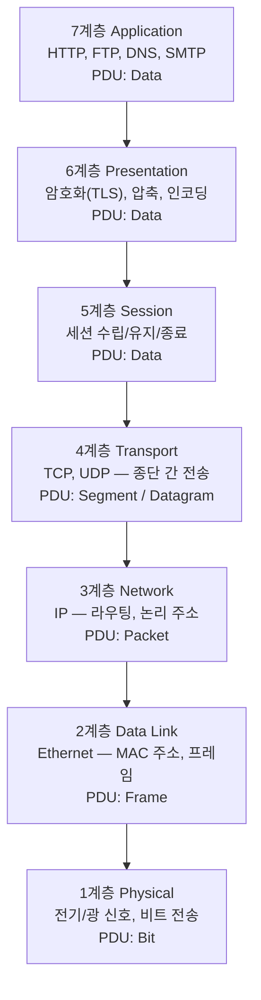
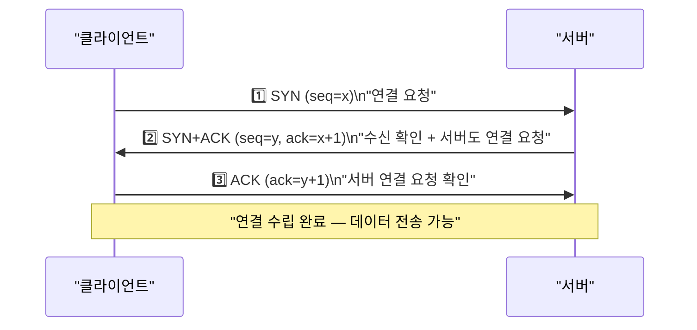
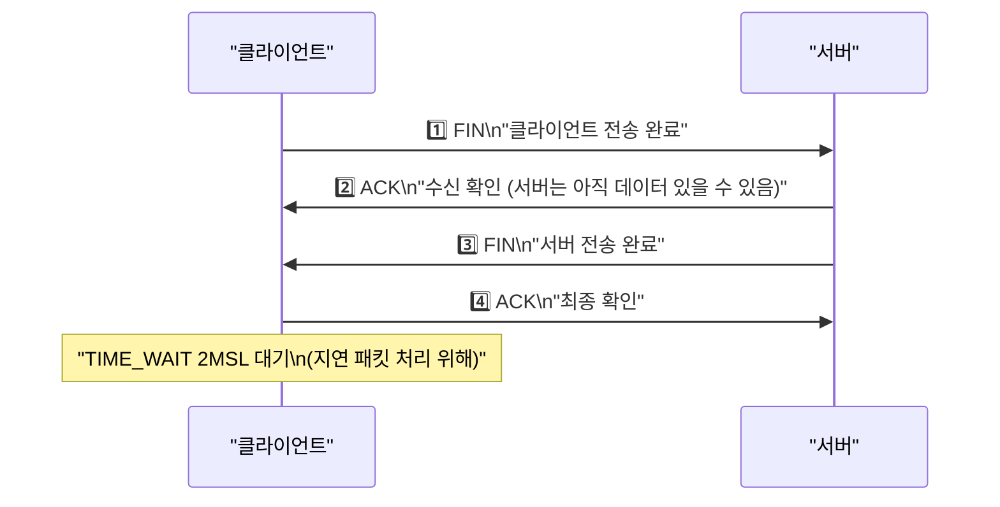
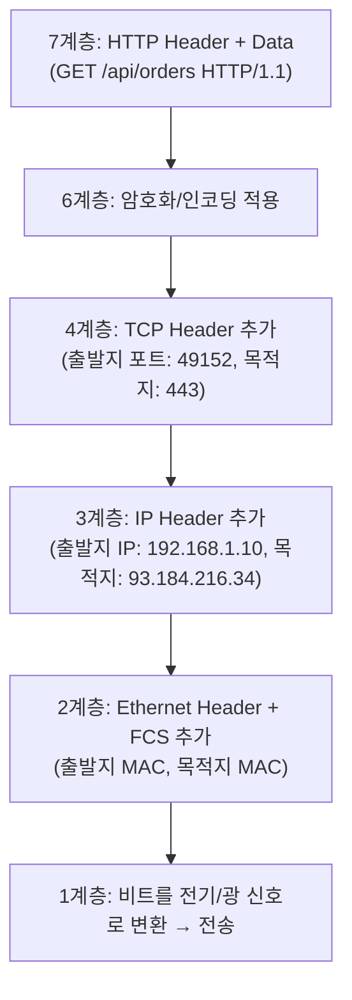
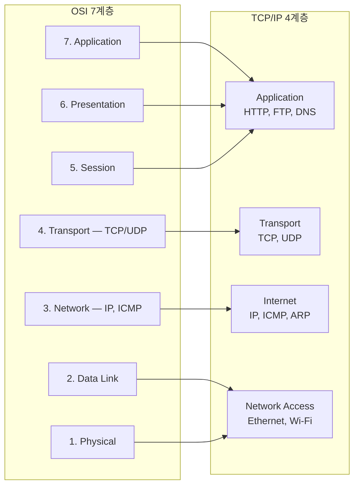
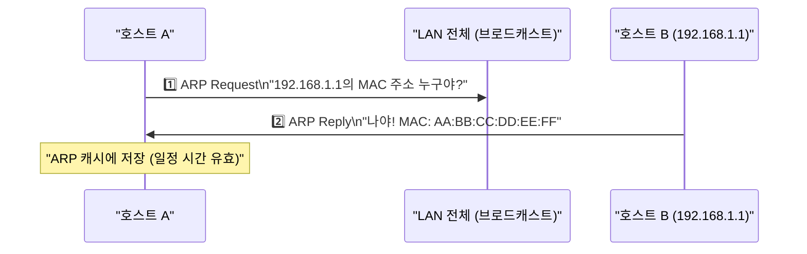

OSI(Open Systems Interconnection) 7계층 모델은 ISO가 1984년에 제정한 네트워크 통신 표준 모델이다. 서로 다른 제조사의 네트워크 장비와 소프트웨어가 상호 운용될 수 있도록 통신 과정을 7개 계층으로 나눠 정의한다.

> **비유**: 편지를 보내는 것과 같다. 글을 쓰고(응용), 언어를 맞추고(표현), 대화 순서를 정하고(세션), 우체국이 배달을 보장하고(전송), 주소로 경로를 찾고(네트워크), 집배원이 동네를 돌고(데이터링크), 실제 오토바이로 달린다(물리). 각 단계는 독립적으로 교체 가능하다.

---

## OSI 7계층 한눈에 보기



| 계층 | 이름 | 역할 |
|------|------|------|
| 7 | Application | 애플리케이션 서비스 제공 (HTTP, FTP, DNS, SMTP) |
| 6 | Presentation | 데이터 형식 변환, 암호화, 압축 |
| 5 | Session | 세션 연결 관리, 동기화 |
| 4 | Transport | 종단 간 신뢰성 있는 데이터 전송 (TCP, UDP) |
| 3 | Network | 논리 주소(IP) 기반 라우팅 |
| 2 | Data Link | 물리 주소(MAC) 기반 인접 노드 전송 |
| 1 | Physical | 비트를 물리 신호로 변환, 전기/광 신호 전송 |

---

## 각 계층 상세

### 7계층 — Application Layer (응용 계층)

사용자가 직접 상호작용하는 계층이다. 네트워크 서비스를 애플리케이션에 제공한다.

| 프로토콜 | 포트 | 설명 |
|---------|------|------|
| HTTP | 80 | 웹 브라우징 |
| HTTPS | 443 | TLS 암호화 HTTP |
| FTP | 20, 21 | 파일 전송 |
| SMTP | 25 | 이메일 전송 |
| DNS | 53 | 도메인 이름 해석 |
| SSH | 22 | 보안 원격 접속 |
| DHCP | 67, 68 | IP 자동 할당 |

---

### 6계층 — Presentation Layer (표현 계층)

데이터의 형식(Format)을 정의하고 변환하는 계층이다.

- 데이터 인코딩/디코딩 (ASCII ↔ EBCDIC, UTF-8 변환)
- 데이터 암호화/복호화 (TLS/SSL 협상)
- 데이터 압축/해제 (gzip, deflate)
- 직렬화 형식 (JSON, XML, ASN.1)

현대 TCP/IP 구현에서는 5계층과 6계층의 기능이 애플리케이션 계층에 흡수되는 경우가 많다.

---

### 5계층 — Session Layer (세션 계층)

애플리케이션 간 세션(논리적 연결)을 관리하는 계층이다.

- 세션 수립, 유지, 종료
- 동기화 (대용량 전송 중 체크포인트 설정)
- 반이중(Half-duplex), 전이중(Full-duplex) 통신 제어

---

### 4계층 — Transport Layer (전송 계층)

프로세스 간(종단 간) 신뢰성 있는 데이터 전송을 담당한다. 포트 번호로 어떤 애플리케이션인지 식별한다.

**TCP vs UDP 비교**

| 특성 | TCP | UDP |
|------|-----|-----|
| 연결 방식 | 연결 지향 (3-way handshake) | 비연결 |
| 신뢰성 | 보장 (ACK, 재전송) | 미보장 |
| 순서 보장 | 보장 | 미보장 |
| 흐름 제어 | 있음 | 없음 |
| 혼잡 제어 | 있음 | 없음 |
| 헤더 크기 | 20~60 bytes | 8 bytes |
| 용도 | HTTP, FTP, SSH | DNS, 스트리밍, 게임, VoIP |

**TCP 3-way Handshake (연결 수립)**

3번의 메시지 교환으로 양쪽이 서로 데이터를 보내고 받을 준비가 됐음을 확인한다.



**TCP 4-way Handshake (연결 종료)**

FIN 전송 후 서버가 아직 보낼 데이터가 있을 수 있으므로 FIN과 ACK를 분리해 4단계로 처리한다.



TIME_WAIT 상태에서 2MSL(Maximum Segment Lifetime)을 대기하는 이유는 마지막 ACK가 손실됐을 때 서버가 재전송하는 FIN을 받아 처리하기 위해서다.

**포트 번호 범위**

| 범위 | 이름 | 설명 |
|------|------|------|
| 0 ~ 1023 | Well-Known Ports | 시스템 예약 (HTTP: 80, HTTPS: 443) |
| 1024 ~ 49151 | Registered Ports | 애플리케이션 등록 포트 |
| 49152 ~ 65535 | Dynamic Ports | 클라이언트 임시 포트 (Ephemeral Port) |

---

### 3계층 — Network Layer (네트워크 계층)

논리 주소(IP 주소)를 기반으로 서로 다른 네트워크 간 데이터를 전송(라우팅)한다.

- IP 주소 할당 및 관리
- 라우팅 (최적 경로 결정)
- 패킷 분할(Fragmentation) 및 재조립
- TTL 기반 루프 방지 (라우터를 거칠 때마다 TTL -1, 0이 되면 패킷 폐기)

| 프로토콜 | 역할 |
|---------|------|
| IP (IPv4/IPv6) | 논리 주소 지정, 패킷 전달 |
| ICMP | 오류 보고, 네트워크 진단 (ping) |
| ARP | IP → MAC 주소 변환 |
| OSPF, BGP, RIP | 라우팅 프로토콜 |

---

### 2계층 — Data Link Layer (데이터 링크 계층)

같은 네트워크(LAN) 내에서 물리 주소(MAC 주소)를 기반으로 인접 노드 간 데이터를 전송한다.

- MAC 주소 기반 프레임 주소 지정
- 오류 감지 (CRC/FCS)
- 매체 접근 제어 (CSMA/CD, CSMA/CA)

**Ethernet 프레임 구조**

| Preamble (8B) | 목적지 MAC (6B) | 출발지 MAC (6B) | EtherType (2B) | Data (46~1500B) | FCS (4B) |
|--------------|----------------|----------------|---------------|-----------------|---------|

EtherType: `0x0800`=IPv4, `0x0806`=ARP, `0x86DD`=IPv6

---

### 1계층 — Physical Layer (물리 계층)

비트(0과 1)를 전기, 광, 무선 신호로 변환하여 물리 매체로 전송한다.

| 매체 | 특성 | 예시 |
|------|------|------|
| 꼬임쌍선 (UTP) | 저렴, 전자기 간섭 취약 | Cat5e, Cat6, Cat6a |
| 동축 케이블 | 간섭 강함, 고대역 | 케이블 TV |
| 광섬유 | 고속, 장거리, 간섭 없음 | 단일모드(SM), 다중모드(MM) |
| 무선 | 이동성, 간섭 취약 | Wi-Fi, 블루투스, LTE |

---

## 캡슐화 (Encapsulation) — 데이터 전송 원리

송신 측에서 상위 계층에서 하위 계층으로 내려가면서 각 계층의 헤더를 추가하는 과정이다. 수신 측은 역순으로 헤더를 제거하며 상위 계층으로 전달한다.



---

## 실제 시나리오: 브라우저가 웹 서버에 HTTPS 요청

```
1. [7계층] 브라우저가 HTTP GET 요청 생성

2. [6계층] TLS 암호화 적용 (HTTPS인 경우)

3. [5계층] TLS 세션 수립

4. [4계층] TCP 세그먼트 생성
   - 출발지 포트: 49152 (임시 포트)
   - 목적지 포트: 443 (HTTPS)
   - 3-way handshake로 연결 수립

5. [3계층] IP 패킷 생성
   - 출발지 IP: 192.168.1.10
   - 목적지 IP: 93.184.216.34 (DNS로 해석된 서버 IP)
   - 라우팅 테이블 조회로 다음 홉 결정

6. [2계층] Ethernet 프레임 생성
   - 출발지 MAC: 클라이언트 NIC MAC
   - 목적지 MAC: 게이트웨이 라우터 MAC (ARP로 조회)

7. [1계층] 비트를 전기 신호로 변환 → NIC가 전송

--- 네트워크 중간 ---
8. [라우터] 2/1계층 프레임 제거 → 3계층 IP 확인 → 새 프레임으로 다음 홉 전송

--- 서버 도착 ---
9. [서버] 1→7계층 역캡슐화 → HTTP 요청 처리
```

---

## TCP/IP 4계층과 OSI 7계층 매핑



실제 인터넷은 TCP/IP 4계층 모델로 동작한다. OSI 7계층은 개념적 참조 모델로, 네트워크 문제를 계층별로 나눠 진단하는 데 사용된다.

---

## 핵심 프로토콜: ARP와 ICMP

### ARP — IP 주소 → MAC 주소 변환

3계층 IP를 2계층 MAC 주소로 변환하는 프로토콜이다. 같은 네트워크 내에서 패킷을 전달하려면 상대의 MAC 주소가 필요하다.



```bash
arp -a  # ARP 캐시 확인
```

### ICMP — 네트워크 오류 보고 및 진단

| 도구 | 동작 원리 |
|------|----------|
| ping | ICMP Echo Request 전송 → Echo Reply로 응답 확인. 서버까지 연결 가능 여부와 지연 시간 확인 |
| traceroute | TTL을 1씩 증가시키며 각 홉의 라우터 경로 추적. TTL=0 패킷 수신 시 라우터가 ICMP Time Exceeded 반환 |

---

## 계층별 네트워크 장비

| 계층 | 장비 | 동작 방식 |
|------|------|----------|
| 1계층 | 허브, 리피터 | 신호를 모든 포트로 브로드캐스트 |
| 2계층 | 스위치, 브리지 | MAC 주소 테이블로 해당 포트에만 전달 |
| 3계층 | 라우터 | 라우팅 테이블로 최적 경로 전달 |
| 4계층 | L4 로드밸런서 | TCP/UDP 포트 기반 분산 |
| 7계층 | L7 로드밸런서, 프록시 | HTTP 헤더/URL 기반 분산 |

스위치는 MAC 주소 테이블을 학습해 필요한 포트에만 프레임을 전달한다. 허브는 모든 포트로 브로드캐스트해 불필요한 트래픽을 유발하므로 현재는 스위치로 대체됐다.

---

## PDU 명칭 정리

| 계층 | PDU 명칭 |
|------|---------|
| 7, 6, 5계층 | Message / Data |
| 4계층 | Segment (TCP) / Datagram (UDP) |
| 3계층 | Packet |
| 2계층 | Frame |
| 1계층 | Bit |

PDU 명칭은 네트워크 문제를 진단할 때 어느 계층의 문제인지 식별하는 데 사용된다. "프레임 손실"이면 2계층 문제, "패킷 드롭"이면 3계층 문제다.
