## 실생활 비유: 택배 분류 센터

L4 로드밸런서는 **주소지만 보고 배달하는 단순 택배 분류기**입니다. 편지 봉투에 "서울시 강남구"라고만 쓰여있으면 강남 지점으로 보냅니다. 내용물이 뭔지 모릅니다.

L7 로드밸런서는 **내용물을 열어보는 스마트 분류기**입니다. "이 소포는 냉동식품이니까 냉장 창고로", "이 서류는 법무팀으로"처럼 내용에 따라 지능적으로 분류합니다.

---

## 1. OSI 7계층 복습

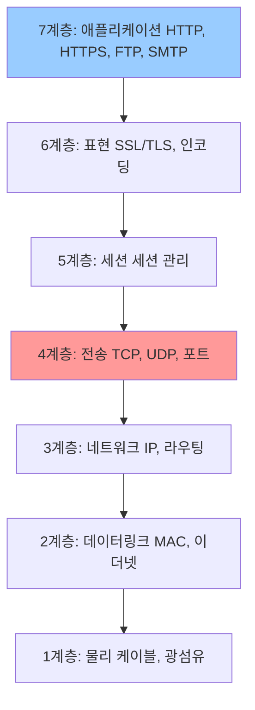

| 계층 | 이름 | 프로토콜 | 주소 단위 |
|------|------|---------|---------|
| L7 | 애플리케이션 | HTTP, HTTPS, gRPC | URL, 헤더, 쿠키 |
| L4 | 전송 | TCP, UDP | IP:Port |
| L3 | 네트워크 | IP | IP 주소 |

---

## 2. L4 로드밸런서

### 동작 원리

L4 로드밸런서는 **IP 주소와 포트 번호**만 보고 트래픽을 분산합니다. 패킷 내용(HTTP 헤더, URL 경로 등)을 분석하지 않습니다.

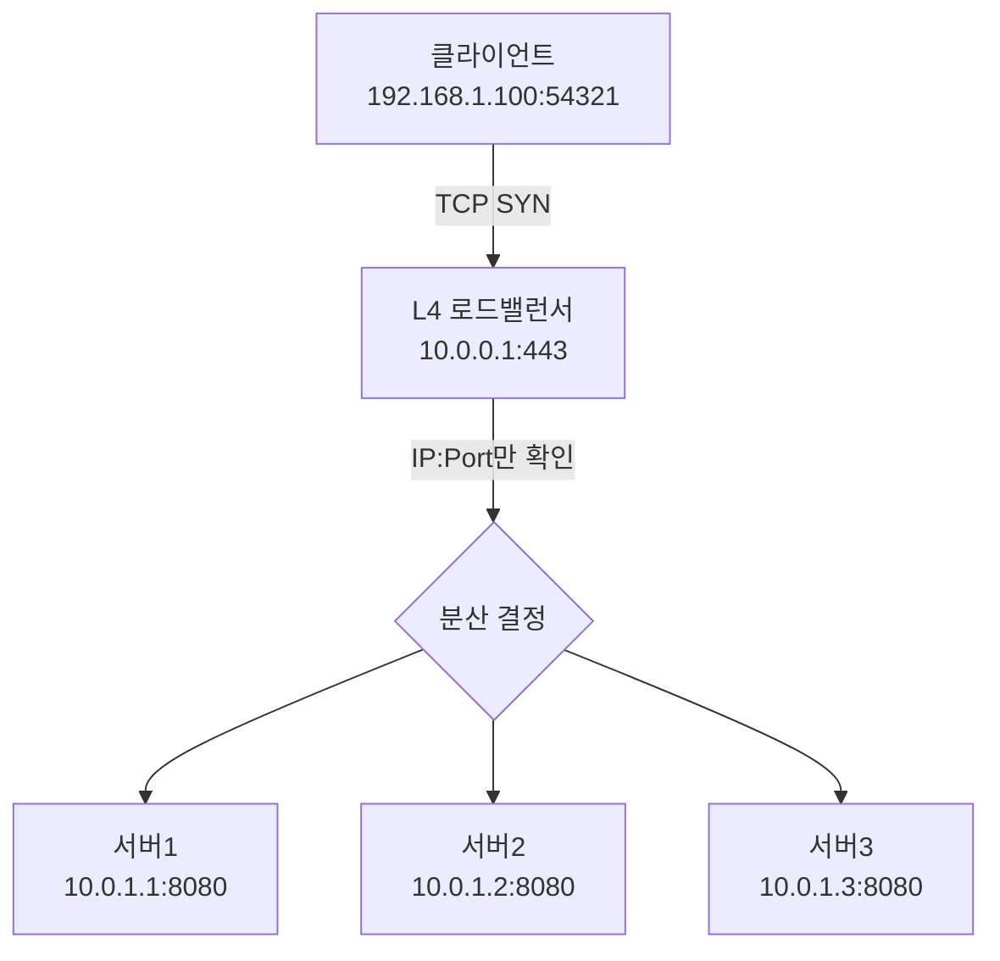

**L4 동작 과정:**
```
1. 클라이언트 → 로드밸런서 TCP SYN
2. 로드밸런서: 목적지 IP:Port 확인 (패킷 열어보지 않음)
3. NAT(Network Address Translation)으로 목적지 IP 변경
4. 선택된 서버로 전달
5. 서버 응답도 로드밸런서를 거쳐 클라이언트로 전달

처리 속도: 마이크로초 단위 (패킷 분석 없음)
```

### L4 로드밸런서 알고리즘

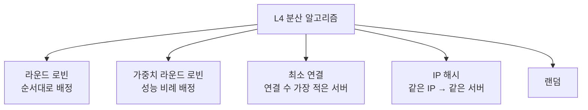

**IP Hash 상세:**
```python
def ip_hash_select(client_ip: str, servers: list) -> str:
    """같은 클라이언트 IP는 항상 같은 서버로"""
    hash_value = sum(int(octet) for octet in client_ip.split('.'))
    server_index = hash_value % len(servers)
    return servers[server_index]

# 192.168.1.100 → (192+168+1+100) % 3 = 461 % 3 = 2 → 서버3
# 192.168.1.101 → (192+168+1+101) % 3 = 462 % 3 = 0 → 서버1
```

---

## 3. L7 로드밸런서

### 동작 원리

L7 로드밸런서는 **HTTP 헤더, URL 경로, 쿠키, 메서드** 등 애플리케이션 계층 정보를 분석하여 라우팅합니다.

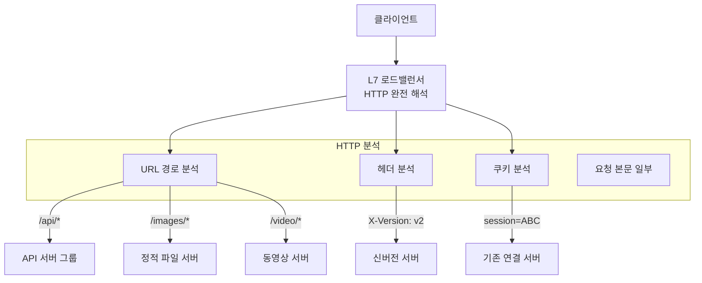

**L7 라우팅 규칙 예시 (Nginx):**
```nginx
http {
    upstream api_servers {
        server api1.example.com:8080 weight=3;
        server api2.example.com:8080 weight=2;
        server api3.example.com:8080 weight=1;
    }

    upstream static_servers {
        server static1.example.com:80;
        server static2.example.com:80;
    }

    upstream video_servers {
        server video1.example.com:8080;
        server video2.example.com:8080;
    }

    server {
        listen 443 ssl;

        # URL 경로 기반 라우팅
        location /api/ {
            proxy_pass http://api_servers;
        }

        location ~* \.(jpg|jpeg|png|gif|css|js)$ {
            proxy_pass http://static_servers;
            proxy_cache_valid 200 1d;
        }

        location /video/ {
            proxy_pass http://video_servers;
            proxy_read_timeout 300s;
        }

        # 헤더 기반 라우팅 (카나리 배포)
        location /api/ {
            if ($http_x_canary = "true") {
                proxy_pass http://canary_servers;
                break;
            }
            proxy_pass http://api_servers;
        }
    }
}
```

---

## 4. L4 vs L7 상세 비교

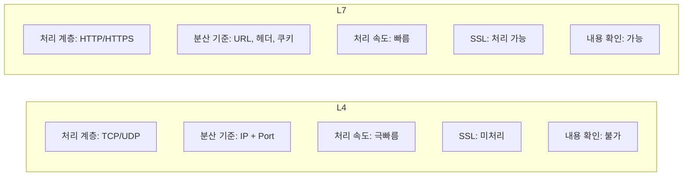

| 특성 | L4 (NLB) | L7 (ALB) |
|------|---------|---------|
| 동작 계층 | Transport (TCP/UDP) | Application (HTTP) |
| 분산 기준 | IP, Port | URL, Header, Cookie, Method |
| 처리 속도 | 극히 빠름 (μs) | 빠름 (ms) |
| SSL 종료 | 불가 (Pass-through) | 가능 |
| 스티키 세션 | IP Hash 기반 | 쿠키 기반 (정확) |
| WebSocket | O | O |
| gRPC | O | O (ALB는 gRPC 지원) |
| 헬스체크 | TCP 연결 | HTTP 응답 코드 |
| DDoS 방어 | 제한적 | WAF 연동 가능 |
| 비용 | 낮음 | 높음 |
| 용도 | 게임, 금융, IoT | 웹 앱, REST API, MSA |

---

## 5. SSL/TLS 종료 (Termination)

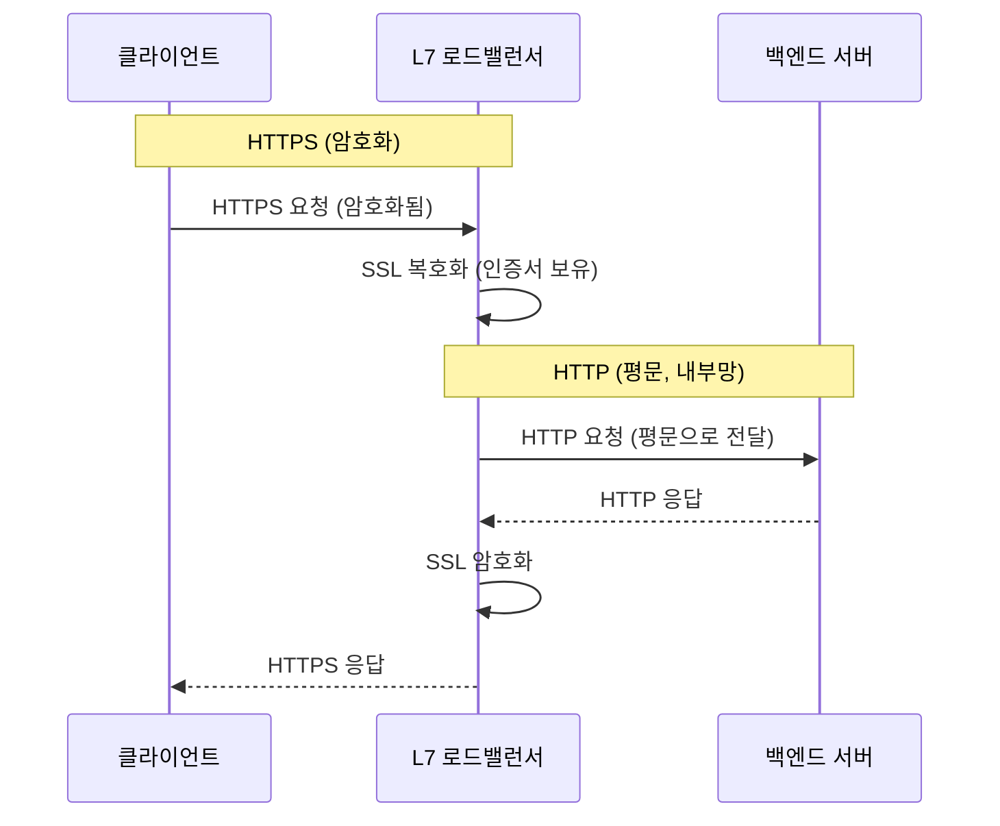

**SSL 종료의 장점:**
- 백엔드 서버가 SSL 처리 부담 없음
- 인증서를 로드밸런서 한 곳에서만 관리
- 백엔드 서버들 간 암호화 필요 없음 (내부망 신뢰)

**SSL Passthrough (L4):**
```
클라이언트 → L4 LB → 서버
                ↑
        IP:Port만 보고 전달
        SSL 내용 모름, 백엔드가 직접 복호화
```

---

## 6. 헬스체크 (Health Check)

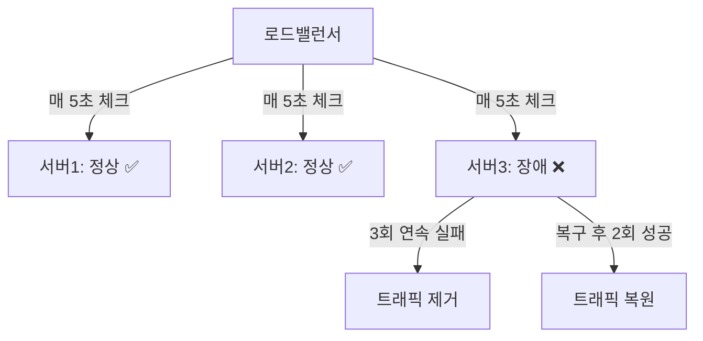

**L4 헬스체크:**
```
TCP Connect 방식:
로드밸런서가 서버 IP:Port에 TCP 연결 시도
연결 성공 → 정상
연결 실패 / 타임아웃 → 비정상
```

**L7 헬스체크 (더 정확):**
```
HTTP GET /health HTTP/1.1
Host: server1.internal

응답 200 OK → 정상
응답 500, 503, 타임아웃 → 비정상
```

```nginx
# Nginx upstream 헬스체크
upstream backend {
    server 10.0.1.1:8080;
    server 10.0.1.2:8080;
    server 10.0.1.3:8080;

    # Nginx Plus 기능
    health_check interval=5s fails=3 passes=2 uri=/health;
}
```

---

## 7. 스티키 세션 (Sticky Session)

> 로그인 상태 등 세션 정보가 특정 서버에 저장된 경우, 같은 사용자는 같은 서버로 연결되어야 합니다.

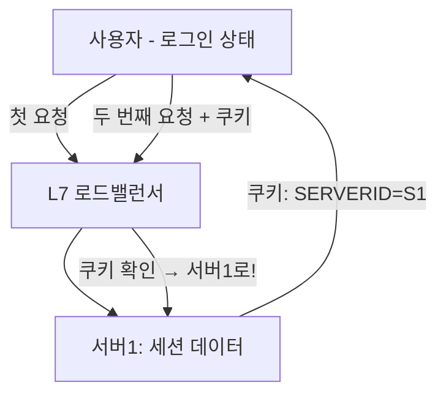

**쿠키 기반 스티키 세션 (Nginx):**
```nginx
upstream backend {
    sticky cookie srv_id expires=1h domain=.example.com path=/;
    server backend1.example.com;
    server backend2.example.com;
    server backend3.example.com;
}
```

> **권장 사항**: 스티키 세션보다 **외부 세션 저장소(Redis)**를 사용하는 것이 확장성에 유리합니다.

---

## 8. HAProxy 설정 예시

HAProxy는 고성능 L4/L7 로드밸런서입니다.

```
# /etc/haproxy/haproxy.cfg

global
    maxconn 50000
    log /dev/log local0
    stats socket /run/haproxy/admin.sock mode 660

defaults
    mode http
    timeout connect 5s
    timeout client  30s
    timeout server  30s
    option httplog
    option dontlognull

# L7 프론트엔드 (HTTP)
frontend http_front
    bind *:80
    bind *:443 ssl crt /etc/ssl/certs/cert.pem  # SSL 종료
    redirect scheme https if !{ ssl_fc }

    # URL 기반 라우팅
    acl is_api path_beg /api/
    acl is_static path_end .jpg .png .css .js
    acl is_admin path_beg /admin/

    use_backend api_backend if is_api
    use_backend static_backend if is_static
    use_backend admin_backend if is_admin
    default_backend web_backend

# 백엔드 그룹들
backend api_backend
    balance roundrobin
    option httpchk GET /health
    server api1 10.0.1.1:8080 check weight 3
    server api2 10.0.1.2:8080 check weight 3
    server api3 10.0.1.3:8080 check weight 2

backend static_backend
    balance leastconn
    server static1 10.0.2.1:80 check
    server static2 10.0.2.2:80 check

backend web_backend
    balance roundrobin
    cookie SERVERID insert indirect nocache
    server web1 10.0.3.1:8080 check cookie web1
    server web2 10.0.3.2:8080 check cookie web2

# L4 프론트엔드 (TCP - 데이터베이스)
frontend mysql_front
    bind *:3306
    mode tcp
    default_backend mysql_backend

backend mysql_backend
    mode tcp
    balance leastconn
    option mysql-check user haproxy
    server db1 10.0.4.1:3306 check
    server db2 10.0.4.2:3306 check backup  # 장애 시만 사용
```

---

## 9. AWS ALB vs NLB

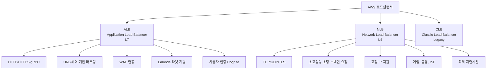

**ALB 라우팅 규칙 (Terraform):**
```hcl
resource "aws_alb_listener_rule" "api_rule" {
  listener_arn = aws_alb_listener.https.arn
  priority     = 100

  action {
    type             = "forward"
    target_group_arn = aws_alb_target_group.api.arn
  }

  condition {
    path_pattern {
      values = ["/api/*"]
    }
  }
}

resource "aws_alb_listener_rule" "canary_rule" {
  listener_arn = aws_alb_listener.https.arn
  priority     = 50  # 높은 우선순위

  action {
    type = "forward"
    forward {
      target_group {
        arn    = aws_alb_target_group.production.arn
        weight = 90  # 90% 트래픽
      }
      target_group {
        arn    = aws_alb_target_group.canary.arn
        weight = 10  # 10% 카나리
      }
    }
  }

  condition {
    path_pattern {
      values = ["/api/v2/*"]
    }
  }
}
```

**NLB 설정 (고정 IP):**
```hcl
resource "aws_lb" "nlb" {
  name               = "game-nlb"
  internal           = false
  load_balancer_type = "network"

  subnet_mapping {
    subnet_id     = aws_subnet.public_a.id
    allocation_id = aws_eip.nlb_a.id  # 고정 IP
  }

  subnet_mapping {
    subnet_id     = aws_subnet.public_b.id
    allocation_id = aws_eip.nlb_b.id
  }
}

resource "aws_lb_target_group" "game_udp" {
  name     = "game-udp"
  port     = 7777
  protocol = "UDP"  # UDP 게임 서버
  vpc_id   = aws_vpc.main.id

  health_check {
    protocol = "TCP"
    port     = 7777
  }
}
```

---

## 10. 글로벌 로드밸런싱 (GSLB)

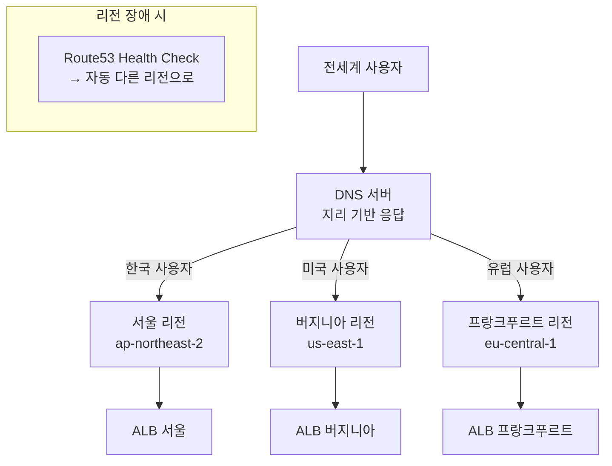

---

## 11. 로드밸런서 고가용성

```mermaid
graph TD
    VIP["Virtual IP: 10.0.0.1"]
    VIP --> Active["Active LB<br>실제 처리"]
    Active -.-->|Heartbeat| Standby["Standby LB<br>대기"]

    Active -->|"장애!"| Failover["VRRP/Keepalived<br>VIP 이전"]
    Failover --> Standby
    Standby -->|"새 Active"| Continue["서비스 계속"]
```

**Keepalived 설정 (L4 HA):**
```bash
# /etc/keepalived/keepalived.conf
# Active 노드
vrrp_instance VI_1 {
    state MASTER
    interface eth0
    virtual_router_id 51
    priority 100        # Active가 더 높은 우선순위
    advert_int 1

    authentication {
        auth_type PASS
        auth_pass secretpassword
    }

    virtual_ipaddress {
        10.0.0.1/24    # 가상 IP (VIP)
    }
}

# Standby 노드
vrrp_instance VI_1 {
    state BACKUP
    interface eth0
    virtual_router_id 51
    priority 90         # 낮은 우선순위
    advert_int 1
    # ... 나머지 동일
}
```

---

## 12. 극한 시나리오: 초당 100만 요청 처리

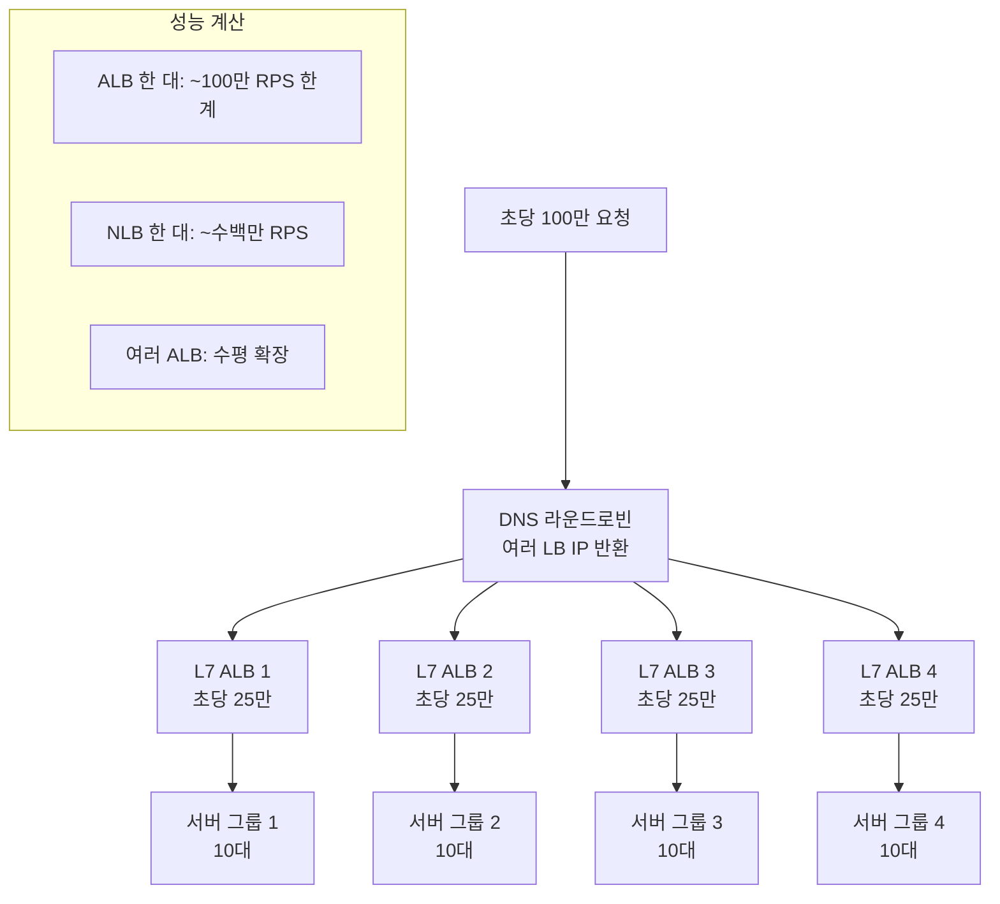

---

## 핵심 정리

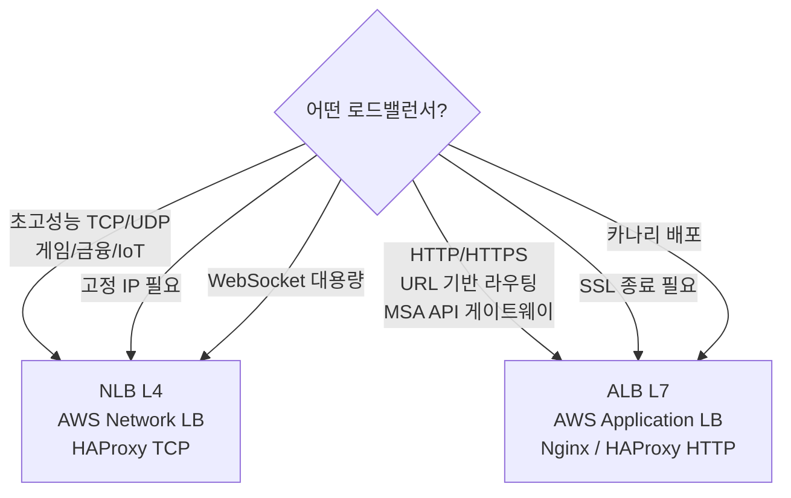

| 상황 | 추천 |
|------|------|
| 웹 애플리케이션 | L7 (Nginx, ALB) |
| MSA API 라우팅 | L7 (ALB, Traefik) |
| 게임 서버 | L4 (NLB) |
| 데이터베이스 앞단 | L4 (HAProxy TCP) |
| 금융 거래 | L4 (초저지연) |
| 카나리 배포 | L7 (가중치 라우팅) |
| 글로벌 서비스 | DNS GSLB + L7 |
