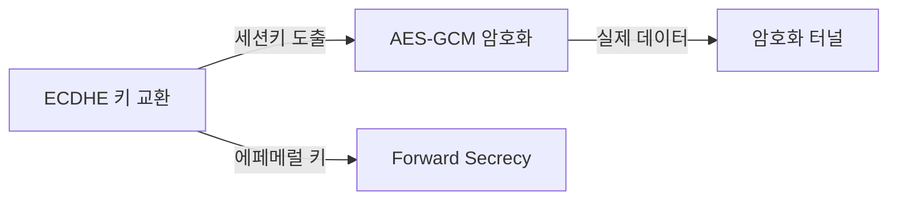
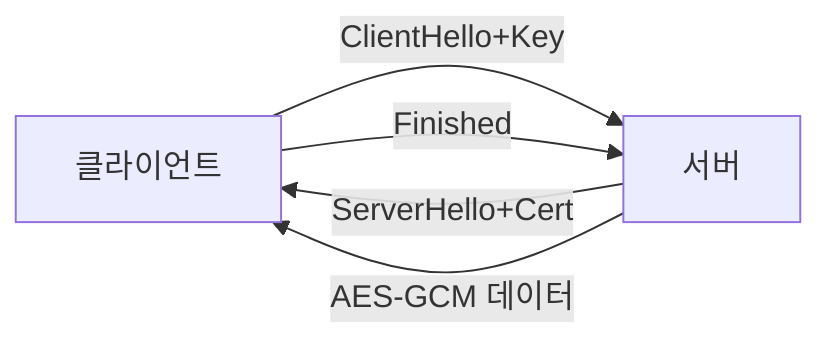
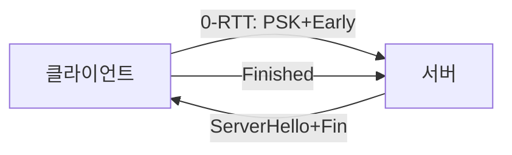
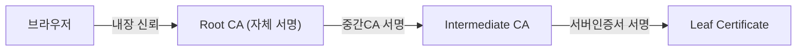
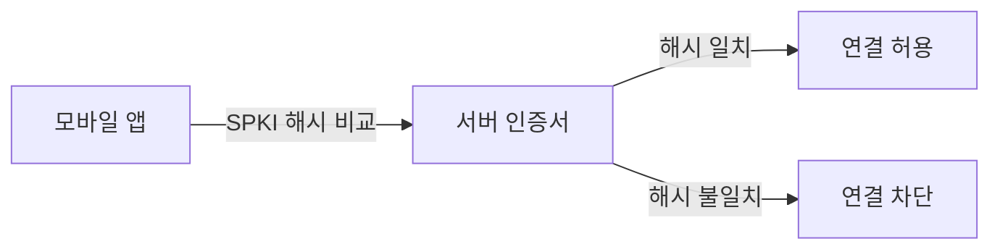
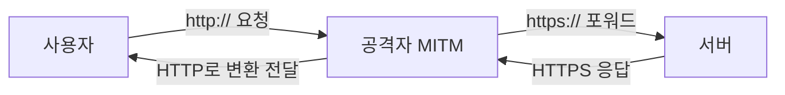
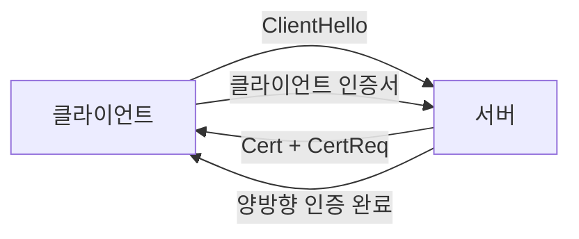
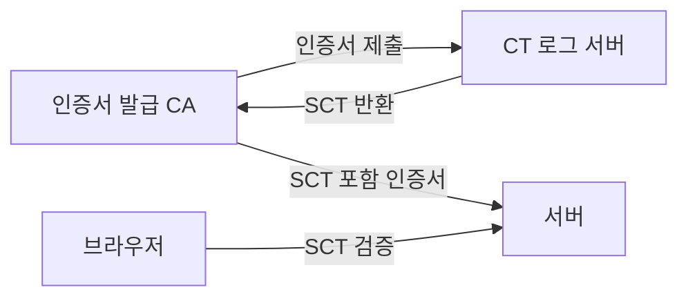
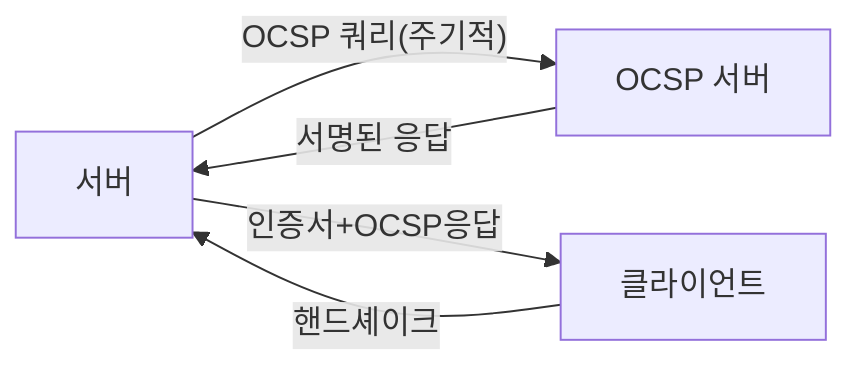
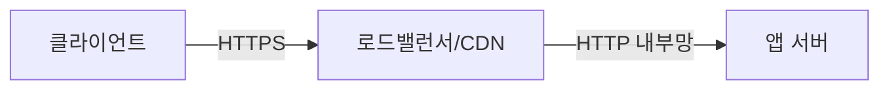

브라우저 주소창의 자물쇠 아이콘은 단순한 장식이 아니다. 그 뒤에는 수십 년간 발전해온 암호학 프로토콜, 수천 개의 CA와 수억 개의 인증서, 그리고 수없이 반복된 해킹 사고를 통해 다듬어진 신뢰 체계가 존재한다. 시니어 개발자 면접에서 "TLS 핸드셰이크를 설명해주세요"라는 질문이 나오면 많은 지원자가 1-RTT, Forward Secrecy 정도까지 답하다 멈춘다. 이 글은 거기서 더 파고든다.

> **비유:** HTTP는 엽서다. 배달부, 우체국 직원, 창고 작업자가 모두 내용을 읽을 수 있다. HTTPS는 수신자의 자물쇠로만 열리는 금고다. 금고 열쇠를 교환하는 의식이 TLS 핸드셰이크이고, 그 금고를 만든 사람이 신뢰할 수 있는 제조사(CA)인지 확인하는 절차가 인증서 체인이다. 배달부가 가짜 금고를 교체해 끼우는 공격이 MITM이고, 이를 막는 추가 봉인이 Certificate Pinning과 CT 로그다.

---

## 1. HTTP vs HTTPS — 왜 평문이 위험한가

HTTP는 1991년 설계된 평문 텍스트 프로토콜이다. TCP 위에서 그대로 동작하기 때문에 같은 네트워크(공용 Wi-Fi, ISP, 기업 프록시)의 누구나 패킷을 캡처해 읽고 수정할 수 있다.

**공격 예시 — ARP Spoofing + Wireshark:**

같은 서브넷에서 ARP 스푸핑으로 게이트웨이인 척 트래픽을 받아 Wireshark로 덤프하면, HTTP 로그인 폼의 `username=admin&password=secret`이 그대로 보인다. 2013년 에드워드 스노든이 폭로한 NSA PRISM 프로그램도 이 원리와 크게 다르지 않다.

HTTPS = HTTP + TLS다. 포트 443에서 TLS 레이어가 암호화 터널을 먼저 수립하고, 그 터널 안에서 HTTP 요청과 응답이 오간다. TCP 패킷을 캡처해도 암호화된 바이너리만 보인다.

| 항목 | HTTP | HTTPS |
|------|------|-------|
| 기본 포트 | 80 | 443 |
| 기밀성(Confidentiality) | 없음 | AES-GCM 암호화 |
| 무결성(Integrity) | 없음 | HMAC/AEAD로 위변조 감지 |
| 인증(Authentication) | 없음 | X.509 인증서로 서버 신원 확인 |
| 부인방지(Non-repudiation) | 없음 | 디지털 서명 |
| SEO | 불리 | Google 랭킹 우대 |
| HTTP/2, HTTP/3 | 이론상 가능하나 브라우저 미지원 | 필수(실질적으로) |

---

## 2. 암호화 기초 — 대칭키, 비대칭키, 그리고 하이브리드

### 2-1. 대칭키 암호화

같은 키로 암호화하고 복호화한다. 속도가 빠르다. 문제는 키 교환이다. 인터넷에서 처음 만나는 상대방과 어떻게 공통 비밀 키를 만드나? 키를 담은 메시지 자체를 암호화해야 하는데, 그 암호화에도 같은 키가 필요하다. 닭이 먼저냐 달걀이 먼저냐다.

- 알고리즘: AES-128, AES-256, ChaCha20
- 실제 데이터 암호화에 사용 (빠른 속도 필요)

### 2-2. 비대칭키 암호화

공개키(Public Key)와 개인키(Private Key) 쌍을 사용한다. 공개키로 암호화한 데이터는 개인키로만 복호화할 수 있다. 반대로 개인키로 서명하면 공개키로 검증할 수 있다.

- 알고리즘: RSA-2048/4096, ECDSA P-256, Ed25519
- 키 교환과 디지털 서명에 사용
- RSA는 1024비트 소인수분해 난이도에 기반, ECDSA는 타원곡선 이산로그 문제에 기반

키 교환 문제를 해결한다. 서버가 공개키를 누구에게나 공개하고, 클라이언트가 세션 키를 서버 공개키로 암호화해서 보내면 서버만 개인키로 복호화할 수 있다. 하지만 이 방식(RSA 키 교환)은 Forward Secrecy가 없다는 치명적 문제가 있다.

### 2-3. TLS의 전략 — 하이브리드 + ECDHE

TLS는 비대칭키로 세션 키를 교환하고, 실제 데이터는 대칭키로 암호화한다. 더 중요한 것은 ECDHE(Elliptic Curve Diffie-Hellman Ephemeral)를 사용해 키 교환 자체에서 Forward Secrecy를 확보한다는 점이다.



---

## 3. TLS 1.3 핸드셰이크 완전 해부 — 1-RTT가 왜 가능한가

### 3-1. TLS 1.2의 2-RTT 핸드셰이크 구조와 문제점

TLS 1.2 핸드셰이크는 다음 순서로 진행된다.

**1차 왕복 (RTT 1):**
- 클라이언트 → 서버: ClientHello (TLS 버전, 암호화 스위트 목록, 클라이언트 난수)
- 서버 → 클라이언트: ServerHello (선택된 암호화 스위트, 서버 난수) + Certificate + ServerHelloDone

**2차 왕복 (RTT 2):**
- 클라이언트 → 서버: ClientKeyExchange (Pre-Master Secret을 서버 공개키로 암호화) + ChangeCipherSpec + Finished
- 서버 → 클라이언트: ChangeCipherSpec + Finished

TCP 연결(1-RTT)까지 합하면 HTTPS 첫 요청에 최소 3-RTT가 소요된다. 100ms 레이턴시 환경에서는 데이터 전송 시작 전에만 300ms가 사라진다.

**TLS 1.2의 근본 문제:**

1. RSA 키 교환 허용 — Pre-Master Secret이 서버 공개키로 암호화되므로, 나중에 서버 개인키가 탈취되면 과거 녹화된 트래픽 전체를 복호화할 수 있다. Forward Secrecy 없음.
2. 많은 취약한 암호화 스위트 허용 — RC4, 3DES, NULL, EXPORT grade cipher
3. ServerHello와 Certificate가 평문으로 전송 — 서버 인증서가 암호화되지 않음
4. ChangeCipherSpec이라는 별도 메시지 — 프로토콜 복잡도

### 3-2. TLS 1.3의 1-RTT — 어떻게 한 왕복을 줄였나

TLS 1.3은 핸드셰이크 구조를 근본적으로 재설계했다.

**핵심 아이디어:** 클라이언트가 ClientHello를 보낼 때 지원하는 키 공유 파라미터(ECDHE의 클라이언트 키 공유값)를 함께 전송한다. 서버가 지원하는 그룹(x25519, P-256 등)을 미리 예측(Guessing)해서 첫 메시지에 키 교환 파라미터를 동봉하는 것이다.



**1차 왕복 (RTT 1):**
- 클라이언트 → 서버: ClientHello + supported_versions + supported_groups + key_share (x25519 공개키)

**서버 처리:**
- 서버는 ClientHello를 받자마자 키 교환에 필요한 모든 정보를 가진다
- 서버 ECDHE 키쌍 생성 + 클라이언트 키 공유값으로 Pre-Master Secret 계산
- HKDF로 Handshake Secret, Master Secret, Application Key 전부 도출
- ServerHello + Certificate (이미 Handshake Key로 암호화!) + CertificateVerify + Finished를 한 번에 전송

**2차 왕복:**
- 클라이언트 → 서버: Finished (Certificate Request가 있으면 클라이언트 인증서 포함)
- 이 시점부터 Application Data 전송 가능

TLS 1.2 대비 1-RTT가 줄어든 이유는 두 가지다. 첫째, 클라이언트가 첫 메시지에 키 교환 파라미터를 포함해 서버가 즉시 세션 키를 도출할 수 있다. 둘째, ChangeCipherSpec 별도 메시지가 제거되고 Finished 메시지 앞뒤로 암호화 전환이 묵시적으로 처리된다.

### 3-3. TLS 1.3에서 인증서가 암호화되는 이유

TLS 1.2에서는 Certificate 메시지가 평문으로 전송됐다. 네트워크 감시자가 핸드셰이크를 캡처하면 서버가 어떤 인증서를 사용하는지(어떤 도메인인지) 알 수 있었다. TLS 1.3에서는 ServerHello 이후 모든 메시지가 Handshake Key로 암호화된다. Certificate도 마찬가지다. 이는 서버 신원 자체가 중간 관찰자로부터 보호된다는 의미다(물론 SNI 확장에서 서버 이름이 노출되는 문제는 ECH/Encrypted Client Hello로 별도 해결 중).

### 3-4. 0-RTT 재연결 — Early Data와 Replay Attack

TLS 1.3의 0-RTT는 이전 세션의 PSK(Pre-Shared Key, 세션 티켓에서 복원)를 사용해 핸드셰이크 없이 첫 번째 요청을 보낼 수 있다.



**Replay Attack 위험 — 왜 0-RTT는 위험한가:**

공격자가 0-RTT Early Data 패킷을 캡처해 서버에 여러 번 재전송하면, 서버는 이를 새로운 요청으로 처리할 수 있다. 예를 들어 `POST /transfer?amount=1000000`이 0-RTT로 전송되면 공격자가 같은 패킷을 100번 재전송해 100번 이체가 발생할 수 있다.

TLS 1.3 스펙(RFC 8446)은 이를 명시적으로 경고한다. 0-RTT는 멱등성(Idempotent)이 보장되는 요청에만 사용해야 한다. 서버는 `Early-Data: 1` 헤더를 확인해 Replay에 취약한 0-RTT 요청을 구분하고, 비멱등 작업은 처리를 거부하거나 1-RTT 완료 후 재처리해야 한다.

Spring Boot에서 0-RTT Early Data 처리:

```java
@RestController
public class TransferController {

    // 0-RTT Early Data는 GET/HEAD 같은 안전한 메서드에만 허용
    @GetMapping("/balance")
    public ResponseEntity<Balance> getBalance(
            HttpServletRequest request) {

        // Early-Data 헤더가 있으면 0-RTT 요청임
        String earlyData = request.getHeader("Early-Data");
        if ("1".equals(earlyData)) {
            // 읽기 전용 작업만 허용
            return ResponseEntity.ok(balanceService.getBalance());
        }
        return ResponseEntity.ok(balanceService.getBalance());
    }

    // POST는 0-RTT에서 거부
    @PostMapping("/transfer")
    public ResponseEntity<?> transfer(
            HttpServletRequest request,
            @RequestBody TransferRequest req) {

        String earlyData = request.getHeader("Early-Data");
        if ("1".equals(earlyData)) {
            // 425 Too Early — RFC 8470
            return ResponseEntity.status(425).build();
        }
        return ResponseEntity.ok(transferService.transfer(req));
    }
}
```

### 3-5. TLS 1.2 vs TLS 1.3 비교

| 항목 | TLS 1.2 | TLS 1.3 |
|------|---------|---------|
| 핸드셰이크 RTT | 2-RTT | 1-RTT |
| 재연결 | 1-RTT (Session Ticket) | 0-RTT (Early Data) |
| 키 교환 알고리즘 | RSA, DH, ECDH, ECDHE | ECDHE, PSK 전용 |
| Forward Secrecy | 선택 사항 | 필수 (ECDHE 강제) |
| 인증서 전송 | 평문 | Handshake Key로 암호화 |
| 제거된 기능 | 해당 없음 | RC4, DES, 3DES, MD5, SHA-1, RSA 키교환, CBC 대부분 |
| 암호화 스위트 수 | 수십 개 | 5개로 제한 |
| 0-RTT | 없음 | 있음 (Replay 위험 주의) |

---

## 4. 암호화 스위트 협상 — 왜 ECDHE와 AES-GCM인가

암호화 스위트(Cipher Suite)는 핸드셰이크에서 사용할 알고리즘들의 조합이다. TLS 1.3에서는 5개만 허용된다.

```
TLS_AES_128_GCM_SHA256
TLS_AES_256_GCM_SHA384
TLS_CHACHA20_POLY1305_SHA256
TLS_AES_128_CCM_SHA256
TLS_AES_128_CCM_8_SHA256
```

TLS 1.2 형식과 달리 키 교환 알고리즘이 스위트에서 분리됐다. TLS 1.2 스위트는 `TLS_ECDHE_RSA_WITH_AES_256_GCM_SHA384` 형태로 키 교환 + 인증 + 암호화 + MAC을 모두 명시했다.

### 4-1. ECDHE — 왜 에페메럴(Ephemeral)인가

ECDHE의 E는 Ephemeral, 즉 "일시적"이다. 세션마다 새로운 임시 ECDH 키쌍을 생성한다. 이것이 Forward Secrecy의 메커니즘이다.

**ECDHE 키 교환 흐름:**

1. 서버는 장기 개인키(인증서의 ECDSA 키)와 별도로, 임시 ECDHE 키쌍을 생성한다
2. 클라이언트도 임시 ECDHE 키쌍을 생성한다
3. 양측이 ECDH 공식 `shared_secret = client_priv * server_pub = server_priv * client_pub`으로 같은 공유 비밀을 도출한다
4. 세션이 끝나면 임시 키를 폐기한다

결과: 서버의 장기 개인키가 3년 뒤에 탈취되어도, 3년 전 세션의 임시 ECDHE 키는 이미 폐기됐으므로 과거 트래픽을 복호화할 수 없다. 이것이 Forward Secrecy다.

반면 RSA 키 교환(TLS 1.2에서 허용)은 에페메럴이 아니다. 클라이언트가 Pre-Master Secret을 서버 장기 공개키로 암호화해 보내므로, 장기 개인키가 탈취되면 과거 녹화 트래픽 전체가 복호화된다. NSA가 인터넷 트래픽을 대량 녹화하고 나중에 개인키가 확보되면 복호화할 수 있다는 시나리오가 바로 이것이다.

Java에서 지원하는 ECDHE 그룹 확인:

```java
import javax.net.ssl.SSLContext;
import javax.net.ssl.SSLParameters;

public class EcdheGroupCheck {
    public static void main(String[] args) throws Exception {
        SSLContext ctx = SSLContext.getInstance("TLSv1.3");
        ctx.init(null, null, null);

        SSLParameters params = ctx.getSupportedSSLParameters();
        // 지원하는 named groups (x25519, secp256r1 등)
        for (String group : params.getNamedGroups()) {
            System.out.println("Supported group: " + group);
        }
    }
}
```

### 4-2. AES-GCM — AEAD가 왜 필요한가

AES-GCM(Galois/Counter Mode)은 AEAD(Authenticated Encryption with Associated Data) 알고리즘이다.

**이전 방식의 문제 — Padding Oracle Attack:**

TLS 1.2에서 CBC(Cipher Block Chaining) 모드는 암호화와 MAC이 분리됐다. "암호화 후 MAC(Encrypt-then-MAC)"이 아닌 "MAC 후 암호화(MAC-then-Encrypt)"를 사용한 경우, Padding Oracle Attack에 취약했다. 공격자가 패딩 오류 응답과 정상 응답의 타이밍 차이를 이용해 평문을 복원하는 공격이다(POODLE, LUCKY13 등).

**AES-GCM의 해결:**

AES-GCM은 암호화와 인증을 단일 패스(Single Pass)로 처리한다.

- Counter Mode로 블록 암호화 (병렬 처리 가능, CBC 불가)
- Galois Field 연산으로 128비트 인증 태그 생성
- 암호문과 인증 태그를 함께 전송
- 복호화 시 인증 태그 검증 실패하면 데이터 자체를 폐기 (Padding Oracle 불가)

ChaCha20-Poly1305는 AES 하드웨어 가속이 없는 모바일/임베디드 환경에서 AES-GCM 대비 성능이 빠르다. AES-NI 명령어를 지원하는 x86 서버에서는 AES-GCM이 더 빠르다.

### 4-3. SHA-256 — 핸드셰이크의 어디에 쓰이나

TLS 1.3 스위트의 SHA-256/SHA-384는 HKDF(HMAC-based Key Derivation Function)에서 사용된다. ECDHE 공유 비밀에서 여러 키(Handshake Key, Application Key, Resumption Key 등)를 파생할 때 HKDF-Extract와 HKDF-Expand 과정에 SHA-256이 해시 함수로 쓰인다. 실제 데이터 무결성 검증에도 AEAD 내부의 GCM 태그가 담당하므로, 별도 HMAC-SHA-256이 붙지 않는다.

---

## 5. 인증서 체인 — 왜 Root CA가 직접 서명하지 않나

### 5-1. 신뢰의 계층 구조

"내가 google.com이다"라는 자기 서명 인증서는 누구나 만들 수 있다. 신뢰를 확립하려면 제3자가 서명해야 한다. 그 제3자도 신뢰받아야 하므로 체인이 형성된다.



**Root CA가 직접 서명하지 않는 이유:**

Root CA의 개인키는 오프라인 HSM(Hardware Security Module)에 보관된다. 인터넷에 연결된 상태로 두면 탈취 위험이 있다. 대신 Intermediate CA를 Root CA가 서명해두고, Intermediate CA를 온라인 상태로 운영해 실제 인증서를 발급한다. Intermediate CA가 침해되더라도 Root CA를 교체하지 않고 해당 Intermediate CA만 폐기(Revoke)할 수 있다.

2011년 DigiNotar 해킹 사건: 네덜란드 CA DigiNotar가 침해되어 *.google.com을 포함한 500개 이상의 가짜 인증서가 발급됐다. DigiNotar의 Root CA는 신뢰 목록에서 제거됐고, 회사는 파산했다. Intermediate CA 구조의 중요성을 보여주는 사례다.

### 5-2. 인증서 검증 과정

브라우저가 서버 인증서를 받으면 다음 순서로 검증한다.

1. **서명 검증**: 서버 인증서가 Intermediate CA의 개인키로 서명됐는지 Intermediate CA 공개키로 확인
2. **Intermediate 서명 검증**: Intermediate CA 인증서가 Root CA 개인키로 서명됐는지 Root CA 공개키로 확인
3. **Root CA 신뢰**: 브라우저/OS에 내장된 신뢰 루트 목록(Trust Store)에 해당 Root CA가 있는지 확인
4. **유효기간 확인**: NotBefore, NotAfter 필드
5. **폐기 확인**: CRL 또는 OCSP로 인증서가 폐기됐는지 확인
6. **도메인 일치 확인**: CN 또는 SAN(Subject Alternative Name) 필드가 요청한 도메인과 일치하는지

**Java에서 TrustManager 커스터마이징:**

```java
import javax.net.ssl.*;
import java.security.*;
import java.security.cert.*;

public class CustomTrustManagerExample {

    // 특정 CA만 신뢰하는 커스텀 TrustManager
    public static SSLContext buildCustomSSLContext(
            String trustStorePath,
            String trustStorePassword) throws Exception {

        // 1. 신뢰할 인증서를 담은 TrustStore 로드
        KeyStore trustStore = KeyStore.getInstance("PKCS12");
        try (var is = new java.io.FileInputStream(trustStorePath)) {
            trustStore.load(is, trustStorePassword.toCharArray());
        }

        // 2. TrustManagerFactory 초기화
        TrustManagerFactory tmf = TrustManagerFactory.getInstance(
            TrustManagerFactory.getDefaultAlgorithm()); // PKIX
        tmf.init(trustStore);

        // 3. SSLContext 구성
        SSLContext sslContext = SSLContext.getInstance("TLSv1.3");
        sslContext.init(null, tmf.getTrustManagers(), new SecureRandom());

        return sslContext;
    }

    // 커스텀 X509TrustManager — 인증서 체인 직접 검증
    static class StrictTrustManager implements X509TrustManager {
        private final X509TrustManager delegate;

        StrictTrustManager(X509TrustManager delegate) {
            this.delegate = delegate;
        }

        @Override
        public void checkServerTrusted(
                X509Certificate[] chain, String authType)
                throws CertificateException {

            // 체인 길이 검증 (Root + Intermediate + Leaf = 최소 2)
            if (chain == null || chain.length < 2) {
                throw new CertificateException(
                    "인증서 체인이 불완전합니다: " +
                    (chain == null ? "null" : chain.length));
            }

            // 표준 PKIX 검증 위임
            delegate.checkServerTrusted(chain, authType);
        }

        @Override
        public void checkClientTrusted(
                X509Certificate[] chain, String authType)
                throws CertificateException {
            delegate.checkClientTrusted(chain, authType);
        }

        @Override
        public X509Certificate[] getAcceptedIssuers() {
            return delegate.getAcceptedIssuers();
        }
    }
}
```

### 5-3. Certificate Pinning — CA 침해 대응

일반 TLS 검증은 신뢰된 CA가 서명했으면 모두 수락한다. 하지만 공격자가 신뢰된 CA를 침해하거나, 기업 프록시가 자체 CA로 재서명하면 MITM이 가능하다.

Certificate Pinning은 특정 공개키 해시(SPKI Hash)를 앱에 하드코딩해두고, 핸드셰이크에서 받은 인증서의 SPKI Hash가 일치하지 않으면 연결을 차단한다.



**Java OkHttp Certificate Pinning:**

```java
import okhttp3.*;
import java.util.concurrent.TimeUnit;

public class PinnedHttpClient {

    public static OkHttpClient buildPinnedClient() {
        // SPKI 핀: sha256/로 시작하는 Base64 인코딩된 해시
        // openssl s_client -connect api.example.com:443 | \
        //   openssl x509 -pubkey -noout | \
        //   openssl pkey -pubin -outform der | \
        //   openssl dgst -sha256 -binary | base64
        CertificatePinner pinner = new CertificatePinner.Builder()
            .add("api.example.com",
                "sha256/AAAAAAAAAAAAAAAAAAAAAAAAAAAAAAAAAAAAAAAAAAA=",  // 현재 인증서
                "sha256/BBBBBBBBBBBBBBBBBBBBBBBBBBBBBBBBBBBBBBBBBBB="   // 백업 핀
            )
            .build();

        return new OkHttpClient.Builder()
            .certificatePinner(pinner)
            .connectTimeout(30, TimeUnit.SECONDS)
            .build();
    }
}
```

**Spring RestTemplate Certificate Pinning:**

```java
import org.apache.hc.client5.http.impl.classic.CloseableHttpClient;
import org.apache.hc.client5.http.impl.classic.HttpClients;
import org.apache.hc.client5.http.ssl.SSLConnectionSocketFactory;
import org.springframework.http.client.HttpComponentsClientHttpRequestFactory;
import org.springframework.web.client.RestTemplate;

import javax.net.ssl.*;
import java.security.*;
import java.security.cert.*;
import java.util.Base64;

public class PinnedRestTemplate {

    private static final String PINNED_SPKI_HASH =
        "AAAAAAAAAAAAAAAAAAAAAAAAAAAAAAAAAAAAAAAAAAA=";

    public static RestTemplate build() throws Exception {
        TrustManager[] pinningTrustManagers = {
            new X509TrustManager() {
                @Override
                public void checkServerTrusted(
                        X509Certificate[] chain, String authType)
                        throws CertificateException {

                    // 1. 표준 PKIX 검증 먼저
                    validateChain(chain, authType);

                    // 2. SPKI 핀 검증
                    boolean pinned = false;
                    for (X509Certificate cert : chain) {
                        try {
                            byte[] spkiBytes = cert.getPublicKey().getEncoded();
                            MessageDigest sha256 = MessageDigest.getInstance("SHA-256");
                            String hash = Base64.getEncoder()
                                .encodeToString(sha256.digest(spkiBytes));
                            if (PINNED_SPKI_HASH.equals(hash)) {
                                pinned = true;
                                break;
                            }
                        } catch (NoSuchAlgorithmException e) {
                            throw new CertificateException("SHA-256 불가", e);
                        }
                    }

                    if (!pinned) {
                        throw new CertificateException(
                            "인증서 핀 검증 실패: 알 수 없는 공개키");
                    }
                }

                private void validateChain(
                        X509Certificate[] chain, String authType)
                        throws CertificateException {
                    try {
                        TrustManagerFactory tmf = TrustManagerFactory.getInstance(
                            TrustManagerFactory.getDefaultAlgorithm());
                        tmf.init((KeyStore) null);
                        for (TrustManager tm : tmf.getTrustManagers()) {
                            if (tm instanceof X509TrustManager x509tm) {
                                x509tm.checkServerTrusted(chain, authType);
                                return;
                            }
                        }
                    } catch (Exception e) {
                        throw new CertificateException("PKIX 검증 실패", e);
                    }
                }

                @Override
                public void checkClientTrusted(
                        X509Certificate[] chain, String authType) {}

                @Override
                public X509Certificate[] getAcceptedIssuers() {
                    return new X509Certificate[0];
                }
            }
        };

        SSLContext sslContext = SSLContext.getInstance("TLSv1.3");
        sslContext.init(null, pinningTrustManagers, new SecureRandom());

        CloseableHttpClient httpClient = HttpClients.custom()
            .setConnectionManager(
                org.apache.hc.client5.http.impl.io.PoolingHttpClientConnectionManagerBuilder
                    .create()
                    .setSSLSocketFactory(new SSLConnectionSocketFactory(sslContext))
                    .build()
            )
            .build();

        return new RestTemplate(
            new HttpComponentsClientHttpRequestFactory(httpClient));
    }
}
```

**핀닝 주의사항:** 인증서를 갱신하면 핀이 달라진다. 반드시 현재 핀과 백업 핀(다음 인증서 또는 Intermediate CA 핀)을 함께 설정해야 한다. HPKP(HTTP Public Key Pinning) 헤더는 잘못 설정 시 사이트 전체 접근 불가 위험으로 Chrome 68에서 deprecated됐다. 현재는 앱 레벨 핀닝이 권장된다.

---

## 6. HSTS — SSL Stripping 공격을 막는 방법

### 6-1. SSL Stripping 공격 메커니즘

사용자가 브라우저에 `example.com`을 입력하면, 브라우저는 먼저 `http://example.com`으로 요청을 보낸다. 서버가 `301 Moved Permanently → https://example.com`으로 리다이렉트한다. 이 첫 번째 HTTP 요청이 문제다.



Moxie Marlinspike가 2009년 Black Hat에서 발표한 sslstrip 도구는 이 리다이렉트를 가로채 사용자에게는 HTTP 페이지를, 서버와는 HTTPS로 통신하는 프록시 역할을 한다. 사용자 브라우저에 자물쇠가 없지만 많은 사용자가 눈치채지 못한다.

### 6-2. HSTS 동작 원리

HSTS(HTTP Strict Transport Security)는 브라우저에 "이 도메인은 항상 HTTPS로만 접속하라"고 선언하는 응답 헤더다.

```http
Strict-Transport-Security: max-age=31536000; includeSubDomains; preload
```

브라우저가 이 헤더를 받으면 `max-age` 기간(1년) 동안 해당 도메인의 모든 요청을 자동으로 HTTPS로 변환한다. 사용자가 `http://example.com`을 입력해도 브라우저가 네트워크 요청을 보내기 전에 `https://example.com`으로 내부 변환한다. 공격자가 가로챌 첫 번째 HTTP 요청 자체가 사라진다.

**왜 HSTS만으로 완벽하지 않나:**

첫 방문(또는 max-age 만료 후)에는 HSTS 정책이 없으므로 여전히 HTTP 요청이 나간다. 이를 해결하는 것이 HSTS Preload다.

### 6-3. HSTS Preload List

Chrome, Firefox, Safari 등의 브라우저 소스코드에 하드코딩된 HSTS 도메인 목록이다. 사용자가 해당 도메인을 처음 방문하기도 전에 브라우저가 HTTPS를 강제한다.

`hstspreload.org`에서 등록 신청 가능. 조건:
- `max-age` 최소 31536000초(1년)
- `includeSubDomains` 포함
- `preload` 포함
- 모든 서브도메인이 HTTPS 접속 가능해야 함

**주의:** preload 등록 후 HTTP로 돌아가려면 Chrome 소스코드에서 제거 후 배포까지 몇 달이 걸린다. 서브도메인 중 HTTPS를 지원하지 않는 것이 하나라도 있으면 등록 불가.

**Spring Security HSTS 설정:**

```java
@Configuration
@EnableWebSecurity
public class HstsSecurityConfig {

    @Bean
    public SecurityFilterChain filterChain(HttpSecurity http)
            throws Exception {
        http
            // 모든 요청을 HTTPS로 강제
            .requiresChannel(channel ->
                channel.anyRequest().requiresSecure()
            )
            .headers(headers -> headers
                .httpStrictTransportSecurity(hsts -> hsts
                    .maxAgeInSeconds(31536000)
                    .includeSubDomains(true)
                    .preload(true)
                )
            );
        return http.build();
    }
}
```

Spring Boot application.yml에서 HSTS:

```yaml
server:
  port: 8443
  ssl:
    enabled: true
    key-store: classpath:keystore.p12
    key-store-password: ${SSL_KEYSTORE_PASSWORD}
    key-store-type: PKCS12
    key-alias: server
    enabled-protocols: TLSv1.2,TLSv1.3
    ciphers:
      - TLS_AES_256_GCM_SHA384
      - TLS_CHACHA20_POLY1305_SHA256
      - TLS_AES_128_GCM_SHA256
      - TLS_ECDHE_RSA_WITH_AES_256_GCM_SHA384
      - TLS_ECDHE_RSA_WITH_AES_128_GCM_SHA256
```

---

## 7. mTLS — 서버와 클라이언트 상호 인증

### 7-1. 일반 TLS vs mTLS

일반 TLS에서는 클라이언트만 서버를 검증한다. 서버는 어떤 클라이언트가 접속해도 받아들인다(물론 애플리케이션 레벨 인증이 별도로 있지만 TLS 레벨에서는 그렇다). mTLS는 서버도 클라이언트 인증서를 검증하는 양방향 인증이다.



**mTLS가 필요한 이유:**

JWT, API Key 같은 애플리케이션 레벨 인증은 탈취되면 공격자가 재사용할 수 있다. mTLS에서 클라이언트 인증서의 개인키는 클라이언트 디바이스/서비스에만 존재한다. 개인키 없이는 핸드셰이크 자체가 불가능하므로, 인증서(공개키)만 탈취해도 연결할 수 없다.

**mTLS 사용 사례:**
- 마이크로서비스 간 통신 (Istio, Linkerd 서비스 메시에서 자동 mTLS)
- 기업 내부 API 인증 (VPN 없는 Zero Trust)
- IoT 디바이스 인증 (디바이스별 고유 인증서)
- B2B API 파트너 연동

### 7-2. Spring Security X.509 mTLS 설정

**1단계: 클라이언트 인증서 발급**

```bash
# CA 키 생성
openssl genrsa -out ca.key 4096
openssl req -x509 -new -nodes -key ca.key -sha256 \
  -days 3650 -out ca.crt \
  -subj "/CN=Internal CA/O=MyCompany"

# 클라이언트 키 및 CSR 생성
openssl genrsa -out client.key 2048
openssl req -new -key client.key -out client.csr \
  -subj "/CN=service-a/O=MyCompany"

# CA로 클라이언트 인증서 서명
openssl x509 -req -in client.csr -CA ca.crt \
  -CAkey ca.key -CAcreateserial \
  -out client.crt -days 365 -sha256

# 클라이언트 PKCS12 생성 (Java용)
openssl pkcs12 -export \
  -in client.crt -inkey client.key \
  -out client.p12 -name client \
  -passout pass:clientpass
```

**2단계: Spring Boot 서버 application.yml**

```yaml
server:
  port: 8443
  ssl:
    enabled: true
    key-store: classpath:server-keystore.p12
    key-store-password: ${SERVER_KEYSTORE_PASSWORD}
    key-store-type: PKCS12
    # 클라이언트 인증서 검증용 TrustStore
    trust-store: classpath:ca-truststore.p12
    trust-store-password: ${TRUSTSTORE_PASSWORD}
    trust-store-type: PKCS12
    # need: 클라이언트 인증서 필수, want: 선택, none: 비활성화
    client-auth: need
```

**3단계: Spring Security X.509 인증 설정**

```java
@Configuration
@EnableWebSecurity
public class MtlsSecurityConfig {

    @Bean
    public SecurityFilterChain filterChain(HttpSecurity http)
            throws Exception {
        http
            .x509(x509 -> x509
                // 인증서의 CN에서 사용자명 추출
                .subjectPrincipalRegex("CN=(.*?)(?:,|$)")
                .userDetailsService(mtlsUserDetailsService())
            )
            .authorizeHttpRequests(auth -> auth
                .requestMatchers("/api/internal/**").authenticated()
                .anyRequest().permitAll()
            )
            .csrf(csrf -> csrf.disable()); // mTLS 환경에서 CSRF 불필요
        return http.build();
    }

    @Bean
    public UserDetailsService mtlsUserDetailsService() {
        // 실무에서는 DB 또는 LDAP에서 조회
        return username -> {
            // CN이 "service-a"인 클라이언트만 허용
            if ("service-a".equals(username) ||
                "service-b".equals(username)) {
                return User.withUsername(username)
                    .password("") // 인증서 기반, 패스워드 불필요
                    .roles("SERVICE")
                    .build();
            }
            throw new UsernameNotFoundException(
                "알 수 없는 서비스: " + username);
        };
    }
}
```

**4단계: Spring RestTemplate mTLS 클라이언트**

```java
@Configuration
public class MtlsClientConfig {

    @Value("${client.keystore.path}")
    private String keystorePath;

    @Value("${client.keystore.password}")
    private String keystorePassword;

    @Value("${client.truststore.path}")
    private String truststorePath;

    @Value("${client.truststore.password}")
    private String truststorePassword;

    @Bean
    public RestTemplate mtlsRestTemplate() throws Exception {
        // KeyStore: 클라이언트 개인키 + 인증서
        KeyStore keyStore = KeyStore.getInstance("PKCS12");
        try (var is = new java.io.FileInputStream(keystorePath)) {
            keyStore.load(is, keystorePassword.toCharArray());
        }

        // TrustStore: 서버 CA 인증서
        KeyStore trustStore = KeyStore.getInstance("PKCS12");
        try (var is = new java.io.FileInputStream(truststorePath)) {
            trustStore.load(is, truststorePassword.toCharArray());
        }

        KeyManagerFactory kmf = KeyManagerFactory.getInstance(
            KeyManagerFactory.getDefaultAlgorithm());
        kmf.init(keyStore, keystorePassword.toCharArray());

        TrustManagerFactory tmf = TrustManagerFactory.getInstance(
            TrustManagerFactory.getDefaultAlgorithm());
        tmf.init(trustStore);

        SSLContext sslContext = SSLContext.getInstance("TLSv1.3");
        sslContext.init(
            kmf.getKeyManagers(),
            tmf.getTrustManagers(),
            new SecureRandom());

        CloseableHttpClient httpClient = HttpClients.custom()
            .setConnectionManager(
                PoolingHttpClientConnectionManagerBuilder.create()
                    .setSSLSocketFactory(
                        new SSLConnectionSocketFactory(sslContext))
                    .build()
            )
            .build();

        return new RestTemplate(
            new HttpComponentsClientHttpRequestFactory(httpClient));
    }
}
```

---

## 8. Certificate Transparency — CA 침해를 공개 감사로 감지

### 8-1. CT가 왜 필요한가

TLS 신뢰 모델의 약점: 브라우저 Trust Store에 포함된 CA(전 세계 수백 개)는 어떤 도메인에 대해서도 유효한 인증서를 발급할 수 있다. 하나의 CA가 침해되거나 내부자가 악의적으로 행동하면, 그 CA가 `*.google.com`이나 `*.bank.com` 인증서를 발급해도 기술적으로는 유효하다. 피해자는 이를 실시간으로 탐지할 방법이 없다.

2011년 DigiNotar, 2012년 Trustwave, 2015년 CNNIC(중국 CA), 2017년 Symantec — 모두 무단 인증서 발급이 뒤늦게 발견된 사례다.



### 8-2. CT 동작 원리

**SCT(Signed Certificate Timestamp):**

CA는 인증서를 발급하기 전에 CT 로그 서버에 인증서를 제출한다. CT 로그 서버는 해당 인증서를 불변 로그(Append-only Merkle Tree)에 추가하고 SCT를 반환한다. SCT는 "이 인증서가 이 타임스탬프에 로그에 기록됐다"는 서명이다.

브라우저(특히 Chrome, 2018년부터 필수)는 서버 인증서에 유효한 SCT가 최소 2개 포함됐는지 확인한다. SCT가 없으면 `NET::ERR_CERTIFICATE_TRANSPARENCY_REQUIRED` 오류가 발생한다.

SCT 전달 방법 3가지:
1. 인증서 자체에 포함 (X.509 확장 필드)
2. TLS 핸드셰이크의 확장 필드
3. OCSP Stapling 응답에 포함

**CT 로그의 불변성:**

CT 로그는 Merkle Tree 구조로 구현된다. 새 인증서가 추가될 때마다 트리의 루트 해시가 바뀐다. 이전 루트 해시는 공개적으로 감사(Gossip)된다. 로그 서버가 기존 항목을 몰래 삭제하거나 수정하면 루트 해시가 달라지므로 탐지할 수 있다.

**도메인 소유자 모니터링:**

`crt.sh`에서 자신의 도메인에 발급된 모든 인증서를 조회할 수 있다. 예상하지 않은 CA가 자신의 도메인 인증서를 발급했다면 CA 침해 또는 DNS 하이재킹의 징후다.

```bash
# crt.sh API로 도메인 인증서 목록 조회
curl -s "https://crt.sh/?q=example.com&output=json" | \
  jq '.[].issuer_ca_id, .[].common_name' | head -20
```

---

## 9. OCSP Stapling — 인증서 폐기 확인의 진화

### 9-1. CRL의 문제 — 왜 느리고 비효율적인가

인증서가 유출되거나 CA가 잘못 발급한 경우, CA는 해당 인증서를 폐기한다. 클라이언트는 이를 어떻게 알 수 있나?

**CRL(Certificate Revocation List) 방식:**

CA가 폐기된 인증서 목록을 주기적으로 파일로 배포한다. 클라이언트가 이 파일을 다운로드해 인증서 시리얼 번호가 목록에 있는지 확인한다. 문제:
- CRL 파일이 수 MB에 달할 수 있음
- 배포 주기가 수 시간~수 일이라 실시간성 없음
- CRL 서버 다운 시 처리 방법 불명확 (Soft-fail: 무시, Hard-fail: 접속 차단)

**OCSP(Online Certificate Status Protocol) 방식:**

CRL 대신 CA의 OCSP 서버에 실시간으로 특정 인증서의 폐기 여부를 쿼리한다. CRL보다 빠르지만 두 가지 문제가 있다.

1. **성능**: 브라우저가 서버에 접속할 때마다 CA의 OCSP 서버에 추가 요청을 보낸다. 핸드셰이크 레이턴시가 증가한다.

2. **프라이버시**: 브라우저가 CA에게 "나는 지금 example.com에 접속하고 있어"라고 알린다. CA가 사용자의 브라우징 기록을 수집할 수 있다.

### 9-2. OCSP Stapling — 양쪽 문제를 동시에 해결

OCSP Stapling은 서버가 미리 OCSP 서버에 자신의 인증서 상태를 쿼리하고, 그 서명된 응답(OCSP Response)을 TLS 핸드셰이크에 "스테이플(Staple)"처럼 붙여서 클라이언트에게 제공한다.

**성능 문제 해결:** 클라이언트가 CA에 따로 요청할 필요 없음. OCSP Response는 서버가 몇 시간마다 갱신한다.

**프라이버시 문제 해결:** 클라이언트가 CA에게 직접 쿼리하지 않으므로 CA가 클라이언트 브라우징 기록을 알 수 없다.



**Nginx OCSP Stapling 설정:**

```nginx
server {
    listen 443 ssl;
    ssl_certificate     /etc/ssl/fullchain.pem;
    ssl_certificate_key /etc/ssl/privkey.pem;
    ssl_trusted_certificate /etc/ssl/chain.pem; # Intermediate CA 포함

    # OCSP Stapling 활성화
    ssl_stapling on;
    ssl_stapling_verify on;

    # OCSP 서버 조회용 DNS 리졸버
    resolver 8.8.8.8 8.8.4.4 valid=300s;
    resolver_timeout 5s;
}
```

**Spring Boot에서 OCSP Stapling 확인:**

```bash
# OCSP Stapling 응답 확인
openssl s_client -connect example.com:443 -status 2>/dev/null | \
  grep -A 20 "OCSP Response"

# OCSP 상태: good(정상), revoked(폐기), unknown
# This Update: 응답 생성 시간
# Next Update: 다음 갱신 시간 (보통 수 시간 후)
```

**OCSP Must-Staple 확장:**

인증서 발급 시 `Must-Staple` 확장을 요청하면, 이 인증서를 제공할 때 OCSP Response가 없으면 브라우저가 연결을 차단한다. 서버 설정 오류로 Stapling이 비활성화된 경우도 Soft-fail로 연결이 허용되는 것을 방지한다.

---

## 10. Java/Spring TLS 심층 설정

### 10-1. SSLContext, KeyStore, TrustManager 아키텍처

Java TLS 스택의 핵심 컴포넌트:

```
SSLContext
├── KeyManager (내 인증서 + 개인키)
│   └── KeyManagerFactory ← KeyStore (내 인증서 보관소)
└── TrustManager (신뢰할 CA 목록)
    └── TrustManagerFactory ← TrustStore (신뢰 CA 보관소)
```

```java
import javax.net.ssl.*;
import java.security.*;
import java.security.cert.X509Certificate;

public class TlsContextBuilder {

    /**
     * 완전한 SSLContext 구성 예제
     * - KeyStore: 서버/클라이언트 인증서 + 개인키
     * - TrustStore: 신뢰할 CA 목록 (JDK cacerts 또는 커스텀)
     */
    public static SSLContext build(
            String keyStorePath, String keyStorePassword,
            String trustStorePath, String trustStorePassword)
            throws Exception {

        // KeyStore: PKCS12 또는 JKS 포맷
        KeyStore keyStore = KeyStore.getInstance("PKCS12");
        try (var is = new java.io.FileInputStream(keyStorePath)) {
            keyStore.load(is, keyStorePassword.toCharArray());
        }

        // KeyManagerFactory: 내 인증서를 클라이언트/서버에 제공
        KeyManagerFactory kmf = KeyManagerFactory.getInstance(
            KeyManagerFactory.getDefaultAlgorithm()); // SunX509
        kmf.init(keyStore, keyStorePassword.toCharArray());

        // TrustStore: 상대방 인증서 검증에 사용할 CA
        KeyStore trustStore = KeyStore.getInstance("PKCS12");
        try (var is = new java.io.FileInputStream(trustStorePath)) {
            trustStore.load(is, trustStorePassword.toCharArray());
        }

        // TrustManagerFactory: X.509 경로 검증(PKIX) 담당
        TrustManagerFactory tmf = TrustManagerFactory.getInstance(
            TrustManagerFactory.getDefaultAlgorithm()); // PKIX
        tmf.init(trustStore);

        // SSLContext: TLS 버전 명시
        SSLContext ctx = SSLContext.getInstance("TLSv1.3");
        ctx.init(
            kmf.getKeyManagers(),
            tmf.getTrustManagers(),
            new SecureRandom()
        );

        return ctx;
    }

    // 개발용: 모든 인증서 신뢰 (절대 프로덕션 사용 금지)
    public static SSLContext buildInsecureForDev() throws Exception {
        TrustManager[] trustAll = {
            new X509TrustManager() {
                @Override
                public void checkClientTrusted(
                        X509Certificate[] chain, String authType) {}
                @Override
                public void checkServerTrusted(
                        X509Certificate[] chain, String authType) {}
                @Override
                public X509Certificate[] getAcceptedIssuers() {
                    return new X509Certificate[0];
                }
            }
        };
        SSLContext ctx = SSLContext.getInstance("TLSv1.3");
        ctx.init(null, trustAll, new SecureRandom());
        return ctx;
        // !! 절대 프로덕션 사용 금지 — 모든 MITM 공격에 취약 !!
    }
}
```

### 10-2. Spring Boot SSL 전체 설정

```java
// HTTP → HTTPS 리다이렉트 + TLS 설정
@Configuration
public class TlsConfig implements WebServerFactoryCustomizer<
        TomcatServletWebServerFactory> {

    @Override
    public void customize(TomcatServletWebServerFactory factory) {
        // HTTP 커넥터 추가 (8080 → 8443 리다이렉트)
        factory.addAdditionalTomcatConnectors(httpConnector());
    }

    private Connector httpConnector() {
        Connector connector = new Connector(
            "org.apache.coyote.http11.Http11NioProtocol");
        connector.setScheme("http");
        connector.setPort(8080);
        connector.setSecure(false);
        connector.setRedirectPort(8443);
        return connector;
    }
}
```

```yaml
# application.yml 전체 TLS 설정
server:
  port: 8443
  ssl:
    enabled: true
    key-store: classpath:keystore.p12
    key-store-password: ${SSL_KEYSTORE_PASSWORD}
    key-store-type: PKCS12
    key-alias: server

    # TLS 버전 제한 (1.2 이상만)
    enabled-protocols: TLSv1.2,TLSv1.3

    # 권장 암호화 스위트 (약한 스위트 제외)
    ciphers:
      - TLS_AES_256_GCM_SHA384          # TLS 1.3
      - TLS_CHACHA20_POLY1305_SHA256    # TLS 1.3 (모바일 친화)
      - TLS_AES_128_GCM_SHA256          # TLS 1.3
      - TLS_ECDHE_RSA_WITH_AES_256_GCM_SHA384   # TLS 1.2
      - TLS_ECDHE_RSA_WITH_AES_128_GCM_SHA256   # TLS 1.2
      - TLS_ECDHE_ECDSA_WITH_AES_256_GCM_SHA384 # TLS 1.2 ECDSA

    # mTLS 활성화 시
    # client-auth: need
    # trust-store: classpath:ca-truststore.p12
    # trust-store-password: ${TRUSTSTORE_PASSWORD}
```

### 10-3. Spring WebClient (WebFlux) TLS 설정

```java
@Configuration
public class WebClientTlsConfig {

    @Bean
    public WebClient secureWebClient() throws Exception {
        SSLContext sslContext = TlsContextBuilder.build(
            "/path/to/keystore.p12", "keypass",
            "/path/to/truststore.p12", "trustpass"
        );

        SslContext nettySslContext = SslContextBuilder
            .forClient()
            .sslProvider(SslProvider.JDK)
            .trustManager(InsecureTrustManagerFactory.INSTANCE) // 예시
            .protocols("TLSv1.3", "TLSv1.2")
            .build();

        HttpClient httpClient = HttpClient.create()
            .secure(spec -> spec.sslContext(nettySslContext));

        return WebClient.builder()
            .clientConnector(
                new ReactorClientHttpConnector(httpClient))
            .build();
    }
}
```

### 10-4. keytool로 개발용 인증서 관리

```bash
# 개발용 자체 서명 인증서 + 키스토어 생성
keytool -genkeypair \
  -alias server \
  -keyalg RSA \
  -keysize 2048 \
  -sigalg SHA256withRSA \
  -dname "CN=localhost,O=Dev,C=KR" \
  -validity 365 \
  -storetype PKCS12 \
  -keystore server-keystore.p12 \
  -storepass changeit

# 인증서 내보내기 (상대방 TrustStore에 등록용)
keytool -exportcert \
  -alias server \
  -keystore server-keystore.p12 \
  -storepass changeit \
  -file server.crt \
  -rfc

# 인증서를 TrustStore에 등록
keytool -importcert \
  -alias server-ca \
  -keystore client-truststore.p12 \
  -storepass changeit \
  -file server.crt \
  -noprompt

# 키스토어 내용 확인
keytool -list -v \
  -keystore server-keystore.p12 \
  -storepass changeit \
  -storetype PKCS12

# Let's Encrypt PEM → PKCS12 변환
openssl pkcs12 -export \
  -in fullchain.pem \
  -inkey privkey.pem \
  -out keystore.p12 \
  -name server \
  -passout pass:${SSL_KEYSTORE_PASSWORD}
```

---

## 11. TLS 성능 최적화 — Session Resumption과 Connection Coalescing

### 11-1. TLS Session Resumption — 핸드셰이크 비용 재사용

매 TLS 연결마다 풀 핸드셰이크를 수행하면 CPU(ECDHE 키 생성, 서명 검증)와 레이턴시 비용이 크다. Session Resumption은 이전 핸드셰이크의 세션 정보를 재사용해 빠르게 재연결한다.

**방식 1: Session ID (서버 측 저장)**

서버가 세션 ID를 클라이언트에게 전달하고, 세션 상태를 메모리에 저장한다. 클라이언트가 다음 연결에서 같은 세션 ID를 제시하면 서버가 저장된 세션을 재사용해 풀 핸드셰이크를 건너뛴다.

단점: 서버가 상태를 유지해야 한다. 로드밸런서 환경에서 세션 스티키니스 또는 중앙 세션 저장소가 필요하다.

**방식 2: Session Ticket (클라이언트 측 저장)**

서버가 세션 상태를 암호화한 "티켓"을 클라이언트에게 발급한다. 클라이언트가 다음 연결에서 티켓을 제시하면 서버가 복호화해 세션을 복원한다. 서버는 상태를 저장하지 않는다.

단점: 티켓 암호화 키(Session Ticket Key)가 탈취되면 과거 세션이 복호화될 수 있다. 주기적으로 티켓 키를 교체해야 한다(이를 위반하면 Forward Secrecy가 깨진다).

```nginx
# Nginx Session Resumption 설정
ssl_session_cache   shared:SSL:50m;   # 50MB, 약 200,000 세션
ssl_session_timeout 4h;               # 세션 유지 시간

# Session Ticket 키는 주기적으로 교체
ssl_session_tickets on;
# ssl_session_ticket_key /etc/nginx/session_ticket.key;
```

**TLS 1.3의 PSK Resumption:**

TLS 1.3에서는 Session ID와 Session Ticket 대신 PSK(Pre-Shared Key) 메커니즘을 사용한다. 이전 세션 종료 시 서버가 NewSessionTicket 메시지로 PSK와 만료 시간을 전달하고, 클라이언트가 다음 핸드셰이크의 `pre_shared_key` 확장에 포함해 1-RTT 또는 0-RTT로 재연결한다.

### 11-2. Connection Coalescing — HTTP/2에서 연결 재사용

HTTP/2는 같은 IP 주소를 가리키는 여러 호스트네임에 대해 하나의 TLS 연결을 재사용할 수 있다. 예를 들어 `api.example.com`과 `static.example.com`이 같은 IP를 가리키고, 서버 인증서에 두 도메인이 SAN으로 포함돼 있으면, 브라우저가 두 번째 연결을 기존 TLS 세션에서 처리한다.

이를 통해 TLS 핸드셰이크 횟수를 줄이고 TCP Head-of-Line Blocking을 완화한다.

### 11-3. 대규모 환경의 TLS 핸드셰이크 최적화

RSA-2048 핸드셰이크는 CPU 집약적이다. 1 코어 기준 초당 300~500회 처리가 한계다. 10만 동시 연결 환경에서 병목이 된다.

**최적화 전략:**

1. **ECDHE로 전환**: RSA 대비 10배 이상 빠름. x25519(Curve25519)가 P-256보다 빠름
2. **TLS 1.3 사용**: 1-RTT로 레이턴시 감소
3. **Session Resumption**: 재연결 핸드셰이크 비용 제거
4. **AES-NI 하드웨어 가속**: Intel AES-NI 명령어 활용 (JVM 자동 감지)
5. **SSL Termination**: 로드밸런서(AWS ALB, Nginx, HAProxy)에서 TLS 종료, 내부는 HTTP

```java
// JVM SSL 디버깅 (핸드셰이크 상세 로그)
// 실행 시: -Djavax.net.debug=ssl:handshake

System.setProperty("javax.net.debug", "ssl:handshake");

// TLS 세션 재사용 확인
SSLSocket socket = (SSLSocket) sslContext.getSocketFactory()
    .createSocket("example.com", 443);
socket.startHandshake();
SSLSession session = socket.getSession();

System.out.println("Session ID: " +
    java.util.Arrays.toString(session.getId()));
System.out.println("Session reused: " + session.isValid());
System.out.println("Cipher suite: " + session.getCipherSuite());
System.out.println("Protocol: " + session.getProtocol());
```

---

## 12. SSL Termination 아키텍처 — 어디서 TLS를 종료할 것인가

### 12-1. 세 가지 아키텍처

**1. Edge Termination (엣지 종료)**



장점: 앱 서버 CPU 부담 제거, 인증서 중앙 관리, 하드웨어 가속(HSM) 활용.
단점: 내부 네트워크가 평문. 내부자 위협 또는 내부망 침해 시 평문 노출.

**2. Re-encryption (재암호화)**

클라이언트 → LB: HTTPS, LB → 앱 서버: HTTPS (다른 인증서).
내부 인증서는 자체 서명이나 내부 CA로 발급. 성능 비용이 높지만 내부망도 암호화.

**3. Pass-through (패스스루)**

LB가 TLS를 종료하지 않고 TCP를 그대로 앱 서버에 전달. SNI 기반으로 라우팅.
앱 서버가 TLS를 직접 처리. 인증서 관리가 분산됨.

### 12-2. 제로 트러스트와 mTLS 메시

현대 마이크로서비스 환경에서는 내부망도 신뢰하지 않는다(Zero Trust). Istio, Linkerd 같은 서비스 메시는 사이드카 프록시가 자동으로 서비스 간 mTLS를 처리한다. 개발자가 인증서를 직접 관리하지 않아도 된다.

```yaml
# Istio PeerAuthentication: 네임스페이스 전체 mTLS 강제
apiVersion: security.istio.io/v1beta1
kind: PeerAuthentication
metadata:
  name: default
  namespace: production
spec:
  mtls:
    mode: STRICT  # PERMISSIVE: 선택, STRICT: 필수
```

---

## 13. 극한 시나리오

### 시나리오 1: 인증서 만료 — 서비스 전면 중단

새벽 3시, 모든 모바일 앱이 API 호출에 실패한다. 인증서 만료가 원인이다.

```bash
# 즉시 만료일 확인
echo | openssl s_client -connect api.example.com:443 2>/dev/null | \
  openssl x509 -noout -dates

# Let's Encrypt 긴급 갱신
certbot renew --force-renewal

# Nginx 인증서 리로드 (무중단)
nginx -s reload

# Spring Boot는 재시작 필요 (핫리로드 설정 없는 경우)
# Tomcat 10.1+ NIO2 커넥터는 SSLHostConfig 갱신 지원
```

**예방 체계:**

```bash
# 만료 30일 전 알림 스크립트 (크론)
#!/bin/bash
DOMAIN="api.example.com"
DAYS_WARN=30

EXPIRY_DATE=$(echo | openssl s_client \
  -connect ${DOMAIN}:443 2>/dev/null | \
  openssl x509 -noout -enddate | cut -d= -f2)

EXPIRY_EPOCH=$(date -d "${EXPIRY_DATE}" +%s 2>/dev/null || \
  date -j -f "%b %d %T %Y %Z" "${EXPIRY_DATE}" +%s)
NOW_EPOCH=$(date +%s)
DAYS_LEFT=$(( (EXPIRY_EPOCH - NOW_EPOCH) / 86400 ))

if [ ${DAYS_LEFT} -lt ${DAYS_WARN} ]; then
  curl -X POST "${SLACK_WEBHOOK}" \
    -d "{\"text\":\"인증서 경고: ${DOMAIN} ${DAYS_LEFT}일 후 만료\"}"
fi
```

### 시나리오 2: 기업 프록시 MITM — 자물쇠가 있어도 감청 중

대기업 보안 솔루션(Zscaler, Cisco Umbrella 등)은 직원 트래픽 검사를 위해 TLS 재암호화를 수행한다. 직원 PC에 프록시 CA 인증서를 설치해두면, 프록시가 서버 인증서 대신 자체 서명 인증서를 제공해도 브라우저는 자물쇠를 표시한다. 기술적으로 합법적 MITM이다.

탐지 방법:

```bash
# 실제 발급 CA 확인
openssl s_client -connect example.com:443 2>/dev/null | \
  openssl x509 -noout -issuer

# 예상: issuer=CN=Let's Encrypt Authority X3,O=Let's Encrypt,C=US
# 프록시: issuer=CN=Zscaler Intermediate CA,O=Zscaler Inc.
```

Certificate Pinning이 있는 앱은 이 프록시를 탐지하고 연결을 차단한다.

### 시나리오 3: CA 키 침해 — 광범위한 가짜 인증서 발급

공격자가 Intermediate CA 개인키를 탈취해 `*.mybank.com` 인증서를 발급한다. CT 로그 없다면 도메인 소유자는 이를 알 수 없다.

CT 로그가 있다면:
1. 모든 CA는 인증서 발급 시 CT 로그에 제출 의무
2. `crt.sh`에서 `mybank.com` 검색 시 새 인증서가 즉시 노출
3. 도메인 소유자가 CAA(Certification Authority Authorization) DNS 레코드로 허용된 CA를 명시해두면, 허가되지 않은 CA의 발급이 정책 위반임을 드러냄

```bash
# CAA 레코드 설정 (허용 CA 제한)
# DNS TXT 레코드:
# mybank.com. CAA 0 issue "letsencrypt.org"
# mybank.com. CAA 0 issue "digicert.com"
# mybank.com. CAA 0 issuewild ";"  <- 와일드카드 금지

dig CAA mybank.com
```

### 시나리오 4: TLS 1.2 다운그레이드 공격

공격자가 ClientHello를 수정해 TLS 1.3을 지우고 TLS 1.2만 남긴다. TLS 1.3이 협상되지 않으면 Forward Secrecy가 없는 RSA 키 교환으로 폴백할 위험이 있다.

TLS 1.3 방어 메커니즘:
- ServerHello의 Random 필드 마지막 8바이트에 다운그레이드 Sentinel 값 삽입
- TLS 1.3 클라이언트가 TLS 1.2 ServerHello를 받으면 Sentinel을 확인해 다운그레이드 공격 탐지

Spring Boot에서 TLS 1.2 이하 완전 비활성화:

```yaml
server:
  ssl:
    enabled-protocols: TLSv1.3   # TLS 1.3만 허용
```

또는 JVM 전체에서 비활성화:

```bash
# JVM 시작 옵션
-Djdk.tls.disabledAlgorithms=SSLv3,TLSv1,TLSv1.1,RC4,DES,MD5withRSA
```

---

## 14. 면접 포인트 5개 — 깊이 있는 WHY 답변

### Q1. TLS 1.3이 TLS 1.2보다 빠른 근본 이유는?

**표면 답변:** 2-RTT에서 1-RTT로 줄었고 0-RTT가 추가됐다.

**깊이 있는 답변:**

TLS 1.3이 1-RTT를 달성한 메커니즘은 클라이언트가 ClientHello에 `key_share` 확장을 포함해 미리 ECDHE 키 공유값을 보내는 것이다. 서버는 ClientHello를 받는 즉시 세션 키를 도출할 수 있고, 첫 응답(ServerHello + Certificate + Finished)을 바로 암호화해서 보낸다.

TLS 1.2에서는 KeyExchange가 별도 메시지로 분리됐다. 서버가 ServerHello를 보낸 후 클라이언트가 ClientKeyExchange를 보내야 비로소 서버가 Pre-Master Secret을 갖는다. 이 추가 왕복이 2-RTT의 원인이다.

추가로, TLS 1.3은 Certificate와 CertificateVerify도 Handshake Key로 암호화해 전송한다. 암호화 여부가 레이턴시에 직접 영향을 주진 않지만, 프로토콜 단순화(ChangeCipherSpec 제거)로 파싱 오버헤드가 줄었다.

0-RTT의 레이턴시 이득은 PSK(이전 세션 티켓)를 클라이언트가 보관하고 있을 때다. 서버 응답 전에 첫 번째 HTTP 요청을 Early Data로 전송하므로, RTT가 0인 것처럼 동작한다. 단, Replay Attack 위험 때문에 멱등성 요청(GET/HEAD)에만 적용해야 한다.

### Q2. Forward Secrecy가 없으면 실제로 어떤 위험이 있나?

**표면 답변:** 개인키가 탈취되면 과거 트래픽을 복호화할 수 있다.

**깊이 있는 답변:**

NSA 및 각국 정보기관이 인터넷 백본에서 암호화된 TLS 트래픽을 대량으로 기록하는 "수집 후 복호화(Harvest Now, Decrypt Later)" 전략을 사용한다는 것이 스노든 문서를 통해 확인됐다.

RSA 키 교환(Forward Secrecy 없음)을 사용하는 서버는: 공격자가 암호화된 패킷을 5년치 저장해두고, 5년 후 어떤 경로로든 서버 개인키를 획득하면(직접 침해, 법원 명령, 직원 매수 등) 5년치 트래픽을 전부 복호화할 수 있다.

ECDHE(Forward Secrecy)를 사용하는 서버는: 세션마다 임시 ECDHE 키쌍을 생성하고 세션 종료 후 폐기한다. 서버의 장기 개인키(ECDSA 인증서 키)는 ECDHE 세션 키 도출에 관여하지 않는다. 5년 후 개인키를 획득해도 그 개인키로는 과거 세션 키를 계산할 수 없다.

TLS 1.3은 ECDHE와 PSK(이전 세션 기반) 키 교환만 허용하고 RSA 키 교환을 완전히 제거했다. 이로써 Forward Secrecy가 TLS 1.3의 기본값이 됐다.

### Q3. OCSP Stapling이 없으면 실제로 어떤 문제가 생기나?

**표면 답변:** 클라이언트가 CA에 직접 OCSP 쿼리를 보내야 하므로 느리고 프라이버시 문제가 있다.

**깊이 있는 답변:**

**레이턴시 문제:** 브라우저가 TLS 핸드셰이크 중 CA의 OCSP 서버에 HTTP 요청을 보낸다. CA 서버가 지리적으로 멀거나 부하가 높으면 수백 ms가 추가될 수 있다. 더 심각한 건 CA의 OCSP 서버가 다운됐을 때다. 브라우저가 Soft-fail 정책(OCSP 응답 없으면 연결 허용)을 택하면 보안 효과가 사라지고, Hard-fail(응답 없으면 차단)을 택하면 모든 사용자가 사이트 접속 불가 상태가 된다. 이 딜레마를 OCSP는 해결하지 못한다.

**프라이버시 문제:** 클라이언트가 CA에게 어떤 인증서의 상태를 묻는다는 것은, CA가 "사용자 A가 지금 mybank.com에 접속하고 있다"는 정보를 수집할 수 있음을 의미한다. Cloudflare 등의 조사에 따르면 이 정보는 실제로 활용 가능한 브라우징 히스토리다.

OCSP Stapling은 서버가 주기적으로 CA OCSP 서버에 쿼리해 서명된 응답을 캐시한다. 클라이언트는 TLS 핸드셰이크에 포함된 OCSP 응답을 받으므로 CA에 직접 쿼리할 필요가 없다. CA가 다운돼도 캐시된 응답(보통 4시간 유효)으로 서비스가 지속된다.

### Q4. mTLS에서 클라이언트 인증서가 JWT보다 강한 이유는?

**표면 답변:** 개인키가 클라이언트에 있어 탈취해도 사용하기 어렵다.

**깊이 있는 답변:**

JWT는 Signed Token이다. 공격자가 JWT를 탈취하면 만료 전까지 어디서든 재사용할 수 있다. 탈취 사실을 즉시 감지하기도 어렵다(짧은 만료 시간이 완화책이지만 근본 해결이 아니다).

mTLS 클라이언트 인증서는 TLS 핸드셰이크에서 CertificateVerify 메시지로 검증된다. 서버가 클라이언트에게 서명할 데이터(핸드셰이크 메시지 해시)를 제시하고, 클라이언트가 자신의 개인키로 서명해 제공한다. 공격자가 클라이언트 공개키(인증서)만 가지고 있으면 이 서명을 만들 수 없다. 개인키 없이는 핸드셰이크 자체가 불가능하다.

추가로 mTLS는 네트워크 레이어(TLS)에서 인증하므로, 애플리케이션이 Authorization 헤더를 파싱하기도 전에 인증되지 않은 연결이 차단된다. JWT는 HTTP 레이어에서 처리되므로 그보다 늦다.

마이크로서비스 환경에서 Istio가 sidecar proxy 레벨에서 mTLS를 처리하면, 서비스 코드가 인증 로직 없이도 서비스 간 신원 검증이 이루어진다.

### Q5. Certificate Transparency가 기존 CRL/OCSP 시스템과 다른 근본적 차이는?

**표면 답변:** CT는 발급된 인증서를 공개 로그에 기록해 감사 가능하게 한다.

**깊이 있는 답변:**

CRL과 OCSP는 "이미 발급된 인증서를 폐기"하는 메커니즘이다. 문제는 폐기하려면 먼저 잘못된 인증서가 발급됐다는 것을 알아야 한다는 점이다. DigiNotar 사건에서 *.google.com 가짜 인증서가 발급된 후 이란에서 Google 사용자를 감청하는 데 수 주가 걸린 것이 알려졌다. 피해자(Google)가 모르는 동안은 CRL/OCSP도 도움이 안 됐다.

CT는 이 탐지 문제를 해결한다. CT 로그는 Append-only Merkle Tree다. 어떤 CA도 인증서를 CT 로그에 제출하지 않고 발급할 수 없다(Chrome이 SCT 없는 인증서를 거부하므로). 따라서 모든 인증서가 공개 감사 가능한 상태가 된다.

도메인 소유자는 CT 로그를 실시간 모니터링해(crt.sh RSS, Cert Spotter API 등) 자신의 도메인에 예상치 못한 CA가 인증서를 발급했는지 즉시 알 수 있다. DigiNotar 시나리오라면 공격자가 *.google.com 인증서를 CT에 제출한 순간 Google이 알림을 받는다.

CT의 불변성(Merkle Tree 루트 해시 공개 감사)은 로그 서버 운영자조차 기존 항목을 삭제하거나 수정할 수 없게 보장한다. 이는 CRL 서버와 달리 로그 자체의 무결성을 수학적으로 증명한다.

---

## 15. 진단 명령어 모음

```bash
# 인증서 전체 정보 확인
openssl s_client -connect example.com:443 2>/dev/null | \
  openssl x509 -noout -text | head -60

# 만료일만 확인
openssl s_client -connect example.com:443 2>/dev/null | \
  openssl x509 -noout -dates

# 인증서 체인 전체 출력 (Root, Intermediate, Leaf 순)
openssl s_client -connect example.com:443 -showcerts 2>/dev/null

# 사용 중인 TLS 버전과 암호화 스위트 확인
openssl s_client -connect example.com:443 2>/dev/null | \
  grep -E "Protocol|Cipher"

# TLS 1.3만 강제 테스트
openssl s_client -connect example.com:443 -tls1_3 2>/dev/null | \
  grep -E "Protocol|Cipher|Session-ID"

# TLS 1.2 지원 여부 (서버가 TLS 1.2를 수락하는지 확인)
openssl s_client -connect example.com:443 -tls1_2 2>/dev/null | \
  grep "Cipher"

# OCSP Stapling 응답 확인
openssl s_client -connect example.com:443 -status 2>/dev/null | \
  grep -A 20 "OCSP Response"

# HSTS 헤더 확인
curl -sI https://example.com | grep -i strict-transport

# CT SCT 정보 확인
openssl s_client -connect example.com:443 2>/dev/null | \
  openssl x509 -noout -text | grep -A 5 "CT Precertificate"

# 인증서 Subject Alternative Names 확인
openssl s_client -connect example.com:443 2>/dev/null | \
  openssl x509 -noout -ext subjectAltName

# 인증서 발급자 체인 확인 (MITM 프록시 탐지)
openssl s_client -connect example.com:443 2>/dev/null | \
  openssl x509 -noout -issuer -subject

# SSL Labs API를 통한 자동 등급 확인
curl -s "https://api.ssllabs.com/api/v3/analyze?\
host=example.com&startNew=on" | jq '.status,.grade'

# 만료 N일 이내 인증서 일괄 스캔 (내부 서비스 모니터링용)
for host in api.example.com auth.example.com admin.example.com; do
  DAYS=$(echo | openssl s_client -connect ${host}:443 2>/dev/null | \
    openssl x509 -noout -enddate | cut -d= -f2 | \
    xargs -I{} sh -c 'echo $(( ($(date -d "{}" +%s) - $(date +%s)) / 86400 ))')
  echo "${host}: ${DAYS}일 남음"
done
```

**온라인 도구:**

| 도구 | 용도 |
|------|------|
| `ssllabs.com/ssltest` | TLS 설정 종합 등급 (A~F) |
| `crt.sh` | CT 로그 기반 인증서 발급 내역 조회 |
| `hstspreload.org` | HSTS Preload 등록 및 상태 확인 |
| `badssl.com` | 의도적으로 잘못된 TLS 설정 테스트 |
| `observatory.mozilla.org` | Mozilla HTTP Observatory 보안 검사 |

---

## 16. 실무 체크리스트

### 서버 설정
- TLS 1.2 이상만 허용 (TLS 1.0/1.1 비활성화)
- 취약 암호화 스위트 제거 (RC4, 3DES, NULL, EXPORT)
- ECDHE 기반 키 교환 필수 (Forward Secrecy)
- AES-GCM 또는 ChaCha20-Poly1305 (AEAD) 사용
- OCSP Stapling 활성화
- HSTS 헤더 설정 (max-age 최소 180일)
- 인증서 체인 완전 전송 (Intermediate CA 포함)

### 운영
- 인증서 만료 30일 전 알림 설정
- SSL Labs 정기 등급 검사 (A 이상 유지)
- CT 로그 모니터링 (crt.sh 또는 Cert Spotter)
- Session Ticket Key 주기적 교체 (Forward Secrecy 유지)

### 개발
- 개발 환경에서도 TLS 비활성화 금지 (`trustAll` X509TrustManager 절대 커밋 금지)
- `javax.net.ssl.SSLContext` 직접 생성 시 TLS 버전 명시
- RestTemplate/WebClient에 커스텀 SSLContext 적용 시 코드 리뷰 필수
- 0-RTT Early Data 사용 시 POST/PUT 등 비멱등 요청 제외
