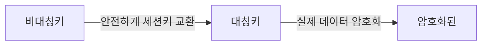
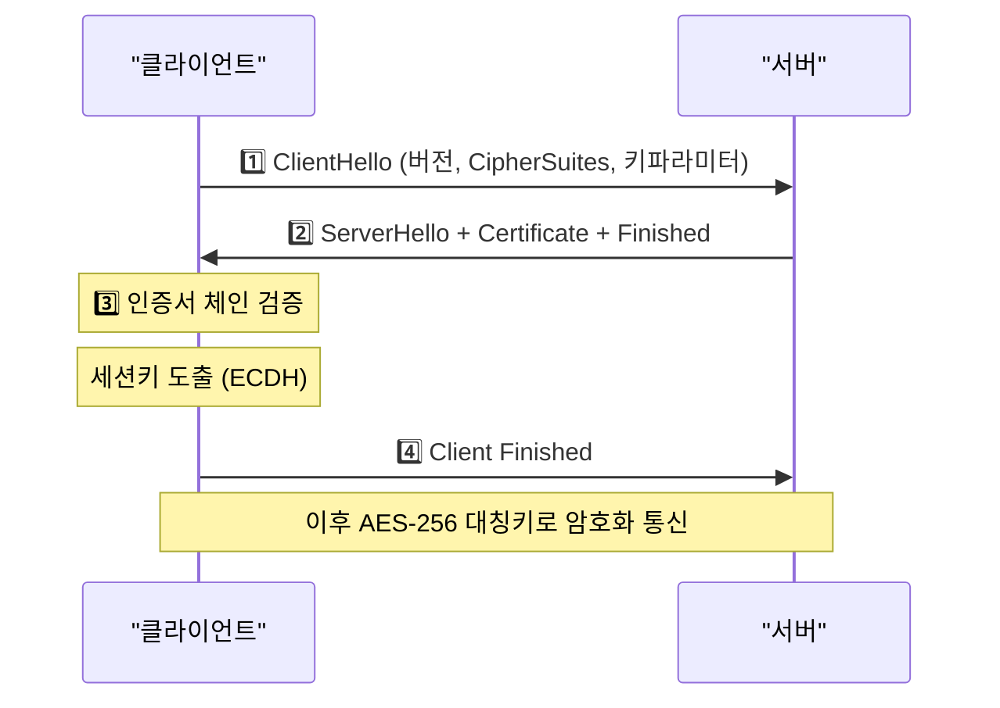
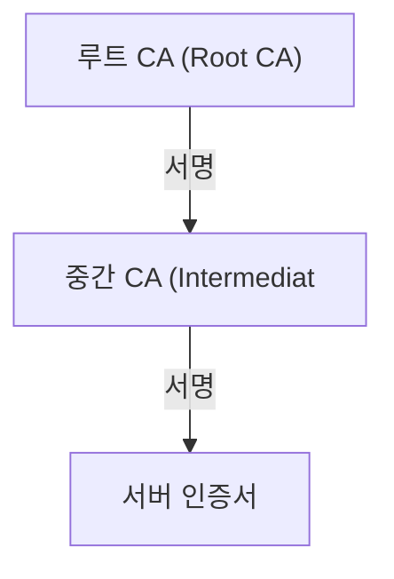
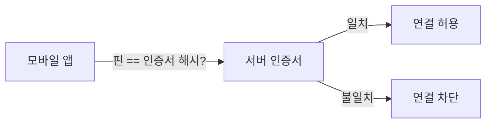
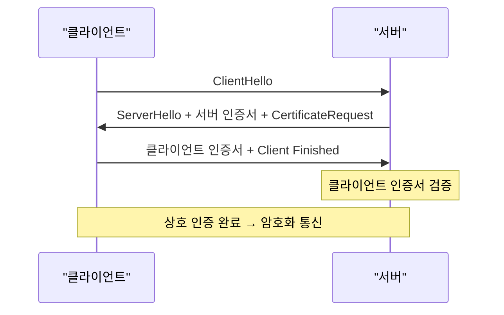
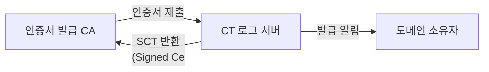
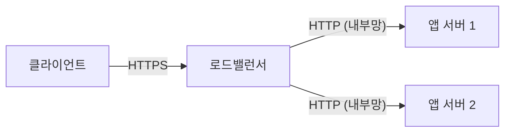

브라우저 주소창 왼쪽의 자물쇠 아이콘은 단순한 장식이 아니다. 클라이언트와 서버가 암호화된 터널을 수립했고, 서버 신원이 검증됐으며, 전송 중 데이터가 위·변조되지 않았음을 의미한다. 이 모든 과정이 TLS(Transport Layer Security) 프로토콜 위에서 동작한다.

> **비유:** HTTP는 엽서(내용이 다 보임)이고, HTTPS는 잠긴 금고 안에 넣은 편지다. 배달부(중간 라우터)가 봉투를 들고 있어도 내용을 읽을 수 없고, 발신자가 실제 본인인지 도장(인증서)으로 확인까지 된다.

---

## HTTP vs HTTPS

HTTP(HyperText Transfer Protocol)는 1991년에 설계된 평문 텍스트 기반 프로토콜이다. 요청과 응답이 그대로 전송되기 때문에 같은 네트워크의 누구나 패킷을 캡처해 내용을 읽을 수 있다.

HTTPS = HTTP + TLS다. 포트 443에서 TLS 레이어가 암호화 터널을 만들고, 그 안에서 HTTP 통신이 이루어진다.

| 항목 | HTTP | HTTPS |
|------|------|-------|
| 기본 포트 | 80 | 443 |
| 암호화 | 없음 | TLS로 암호화 |
| 무결성 | 보장 안 됨 | MAC으로 보장 |
| 인증 | 없음 | 인증서로 서버 신원 확인 |
| SEO | 불리 | Google 랭킹 우대 |
| 브라우저 표시 | "안전하지 않음" | 자물쇠 아이콘 |

---

## 대칭키 vs 비대칭키

TLS를 이해하려면 두 가지 암호화 방식을 먼저 알아야 한다.

### 대칭키 암호화

암호화와 복호화에 동일한 키를 사용한다. 속도가 빠르지만 키 배포 문제가 있다 — 처음 만나는 상대방에게 "이 키로 암호화하자"는 메시지 자체를 안전하게 전달할 방법이 없다.

> **비유:** 두 사람이 같은 자물쇠 열쇠를 가지고 있다. 금고를 잠그고 열 수 있지만, 처음 만날 때 어떻게 열쇠를 안전하게 교환하느냐가 문제다.

- 알고리즘: AES-256, AES-128, ChaCha20
- 사용 목적: 실제 데이터 암호화 (빠른 속도 필요)

### 비대칭키 암호화

공개키(Public Key)와 개인키(Private Key) 쌍을 사용한다. 공개키로 암호화한 것은 개인키로만 복호화할 수 있다. 속도가 느리지만 키 배포 문제를 해결한다.

> **비유:** 누구나 편지를 넣을 수 있는 우편함(공개키)이 있고, 열쇠(개인키)는 주인만 가지고 있다. 누구나 편지를 넣을 수 있지만 꺼낼 수 있는 사람은 주인뿐이다.

- 알고리즘: RSA-2048, RSA-4096, ECDSA, Ed25519
- 사용 목적: 키 교환, 디지털 서명

### TLS의 전략: 두 방식을 혼합

TLS는 비대칭키로 세션 키(대칭키)를 안전하게 교환하고, 이후 실제 데이터는 빠른 대칭키로 암호화한다. 비대칭키의 안전성과 대칭키의 속도를 모두 취하는 전략이다.



---

## TLS 1.3 Handshake

TLS 1.2까지는 Handshake에 2-RTT(Round Trip Time)가 필요했다. TLS 1.3은 이를 1-RTT로 줄였고, 재연결 시 0-RTT도 지원한다.

1️⃣ **ClientHello**: 클라이언트가 지원하는 TLS 버전, 암호화 스위트(Cipher Suite), 클라이언트 난수, 키 공유 파라미터를 서버에 전송한다.

2️⃣ **ServerHello + Certificate + Finished**: 서버가 선택한 암호화 스위트, 서버 난수, 키 공유 파라미터, 인증서, 서버 Finished 메시지를 한 번에 전송한다. TLS 1.3에서는 이 모든 것이 하나의 왕복에 묶인다.

3️⃣ **클라이언트 인증서 검증**: 수신한 인증서를 CA 체인으로 검증하고, 서버가 개인키를 실제로 보유하고 있는지 확인한다.

4️⃣ **Client Finished**: 클라이언트가 Finished를 전송하면 Handshake가 완료되고 암호화 통신이 시작된다.



### TLS 1.2 vs TLS 1.3 비교

| 항목 | TLS 1.2 | TLS 1.3 |
|------|---------|---------|
| Handshake RTT | 2-RTT | 1-RTT |
| 재연결 | 1-RTT (Session Ticket) | 0-RTT (Early Data) |
| 키 교환 | RSA, DH, ECDH | ECDH만 허용 |
| Forward Secrecy | 선택 | 필수 |
| 취약 암호화 스위트 | RC4, DES 등 허용 | 완전히 제거 |
| 인증서 암호화 | 평문 | 암호화됨 |

> **실무 포인트:** TLS 1.0, 1.1은 2020년 브라우저 지원이 종료됐다. 서버 설정에서 반드시 TLS 1.2 이상만 허용해야 한다.

---

## 인증서 체인 (Certificate Chain)

서버 인증서 하나로 신뢰를 증명하는 것은 불가능하다. "내가 google.com이야"라는 자기 서명 인증서는 누구나 만들 수 있기 때문이다. 브라우저는 인증서 체인을 통해 신뢰할 수 있는 루트 CA까지 연결되는지 검증한다.



1️⃣ **서버 인증서**: 도메인 소유자가 CA에 요청해 발급받은 인증서다. 공개키, 도메인 이름, 유효기간, 발급한 CA 정보가 포함된다.

2️⃣ **중간 CA 인증서**: 루트 CA가 직접 서명하지 않고 중간 CA를 거친다. 루트 CA의 개인키를 오프라인에 보관해 보안을 강화하기 위해서다.

3️⃣ **루트 CA**: 브라우저와 OS에 사전 내장된 최상위 신뢰 기관이다. Let's Encrypt, DigiCert, GlobalSign 등이 있다.

브라우저는 서버 인증서 → 중간 CA → 루트 CA 순으로 서명을 검증한다. 체인 중 하나라도 신뢰할 수 없으면 "보안 연결 실패" 경고가 표시된다.

### 인증서 종류

| 종류 | 검증 수준 | 발급 속도 | 주소창 표시 |
|------|----------|----------|------------|
| DV (Domain Validation) | 도메인 소유권만 확인 | 즉시~수분 | 자물쇠 |
| OV (Organization Validation) | 기업 실체 확인 | 수일 | 자물쇠 |
| EV (Extended Validation) | 엄격한 기업 심사 | 수주 | 자물쇠 + 기업명 (구형) |
| Wildcard | `*.example.com` 커버 | DV/OV 수준 | 자물쇠 |
| SAN | 여러 도메인 하나의 인증서에 포함 | DV/OV 수준 | 자물쇠 |

---

## Certificate Pinning

일반적인 TLS 검증은 신뢰할 수 있는 CA가 서명한 인증서면 모두 수락한다. 그런데 공격자가 신뢰된 CA를 침해하거나 가짜 인증서를 발급받으면 중간자 공격이 가능하다.

Certificate Pinning은 앱이나 클라이언트가 특정 공개키 또는 인증서 해시를 미리 저장해두고, 해당 값과 일치하는 경우에만 연결을 허용하는 방식이다.

> **비유:** "은행 창구 직원 얼굴을 미리 사진으로 알고 있어서, 다른 사람이 은행 직원증을 들고 와도 연결을 거부한다."



**HTTP Public Key Pinning (HPKP)** 헤더로 구현됐으나, 잘못 설정 시 사이트 접근 불가 위험으로 Chrome 68에서 deprecated됐다. 현재는 앱 레벨 핀닝 또는 Certificate Transparency(CT)로 대체된다.

---

## mTLS (Mutual TLS)

일반 TLS는 클라이언트가 서버만 검증한다. mTLS는 서버도 클라이언트 인증서를 검증하는 양방향 인증 방식이다.

> **비유:** 일반 TLS는 은행이 신분증을 확인하는 것이고, mTLS는 은행과 고객이 서로 신분증을 확인하는 것이다.



**mTLS 사용 사례:**
- 마이크로서비스 간 통신 (Istio, Linkerd 서비스 메시)
- 기업 내부 API 인증
- IoT 디바이스 인증
- Zero Trust 네트워크

```yaml
# Nginx mTLS 설정 예시
ssl_client_certificate /etc/ssl/ca.crt;
ssl_verify_client on;
ssl_verify_depth 2;
```

---

## HSTS (HTTP Strict Transport Security)

HTTPS 사이트라도 사용자가 `http://example.com`으로 접속하면 서버가 HTTPS로 리다이렉트하기 전까지 평문 HTTP 요청이 한 번 나간다. 이 순간 공격자가 SSLstrip 공격으로 HTTPS 리다이렉트를 가로챌 수 있다.

HSTS는 브라우저에 "이 도메인은 항상 HTTPS로만 접속하라"고 명령하는 HTTP 응답 헤더다. 한 번 설정되면 브라우저가 스스로 `http://`를 `https://`로 변환하고 서버에 요청을 보낸다.

```http
Strict-Transport-Security: max-age=31536000; includeSubDomains; preload
```

| 파라미터 | 의미 |
|---------|------|
| `max-age` | HSTS 정책 유효기간(초). 31536000 = 1년 |
| `includeSubDomains` | 모든 서브도메인에도 적용 |
| `preload` | 브라우저 내장 HSTS 목록(Preload List)에 등록 요청 |

**HSTS Preload List**: Chrome, Firefox, Safari 등의 브라우저에 사전 내장된 HSTS 도메인 목록이다. 최초 방문 전부터 HTTPS 강제 적용된다. `hstspreload.org`에서 등록할 수 있다.

> **주의:** HSTS preload 등록 후 HTTP로 돌아가려면 브라우저 캐시 만료까지(최대 1년) 접속 불가 상태가 될 수 있다. 테스트 후 신중하게 적용해야 한다.

---

## Certificate Transparency (CT)

2011년 DigiCert의 경쟁사인 DigiNotar가 해킹돼 *.google.com 인증서가 무단 발급됐다. 사용자는 이를 감지할 방법이 없었다. CT는 이런 사고를 방지하기 위해 모든 인증서 발급 내역을 공개 로그에 기록하는 시스템이다.



1️⃣ CA가 인증서를 발급하면 CT 로그 서버에 제출한다.
2️⃣ CT 로그 서버는 SCT(Signed Certificate Timestamp)를 반환하고, 인증서에 포함된다.
3️⃣ 브라우저는 서버 인증서에 유효한 SCT가 포함됐는지 검증한다.
4️⃣ 도메인 소유자는 자신의 도메인에 발급된 모든 인증서를 모니터링할 수 있다.

Chrome은 2018년부터 CT를 필수로 요구한다. SCT 없는 인증서는 `NET::ERR_CERTIFICATE_TRANSPARENCY_REQUIRED` 오류를 낸다.

---

## Let's Encrypt / ACME 프로토콜

Let's Encrypt는 비영리 CA로, 무료로 DV 인증서를 자동 발급한다. 2015년 이전까지 HTTPS 인증서는 연 수만 원에서 수십만 원이 드는 유료 서비스였다. Let's Encrypt가 무료화하면서 HTTPS 전환이 폭발적으로 증가했다.

**ACME(Automatic Certificate Management Environment)** 프로토콜은 도메인 소유권을 자동으로 증명하고 인증서를 발급·갱신하는 표준 프로토콜이다(RFC 8555).

### 도메인 소유권 증명 방식

**HTTP-01 Challenge**: ACME 서버가 지정한 토큰 파일을 `http://도메인/.well-known/acme-challenge/` 경로에 배치하면 서버가 HTTP로 접근해 확인한다.

**DNS-01 Challenge**: 도메인 DNS에 TXT 레코드를 추가해 소유권을 증명한다. 와일드카드 인증서(`*.example.com`) 발급 시 유일하게 사용 가능한 방식이다.

**TLS-ALPN-01 Challenge**: 443 포트에서 TLS 핸드셰이크로 소유권을 증명한다.

### Certbot으로 인증서 발급

```bash
# Nginx용 인증서 발급 및 자동 설정
certbot --nginx -d example.com -d www.example.com

# Standalone 방식 (별도 웹서버 없이)
certbot certonly --standalone -d example.com

# DNS-01 Challenge (와일드카드)
certbot certonly --manual --preferred-challenges dns \
  -d "*.example.com" -d example.com

# 갱신 테스트 (실제 갱신 없이 시뮬레이션)
certbot renew --dry-run

# 자동 갱신 cron 등록 (90일 유효기간, 30일 전 자동 갱신)
echo "0 0,12 * * * certbot renew --quiet" | crontab -
```

Let's Encrypt 인증서는 90일 유효기간을 갖는다. 짧은 유효기간이 자동 갱신을 유도하고, 침해된 인증서의 노출 시간을 줄인다.

---

## Spring Boot TLS 설정

### application.yml 기본 설정

```yaml
server:
  port: 8443
  ssl:
    enabled: true
    key-store: classpath:keystore.p12
    key-store-password: changeit
    key-store-type: PKCS12
    key-alias: tomcat
    protocol: TLS
    enabled-protocols: TLSv1.2,TLSv1.3
    ciphers:
      - TLS_AES_256_GCM_SHA384
      - TLS_CHACHA20_POLY1305_SHA256
      - TLS_AES_128_GCM_SHA256
```

### 인증서 생성 및 적용

```bash
# 개발용 자체 서명 인증서 생성
keytool -genkeypair \
  -alias tomcat \
  -keyalg RSA \
  -keysize 2048 \
  -storetype PKCS12 \
  -keystore keystore.p12 \
  -validity 365 \
  -storepass changeit

# Let's Encrypt PEM → PKCS12 변환
openssl pkcs12 -export \
  -in fullchain.pem \
  -inkey privkey.pem \
  -out keystore.p12 \
  -name tomcat \
  -passout pass:changeit
```

### HTTP를 HTTPS로 리다이렉트

```java
@Configuration
public class HttpsRedirectConfig {

    @Bean
    public ServletWebServerFactory servletContainer() {
        TomcatServletWebServerFactory tomcat =
            new TomcatServletWebServerFactory() {
                @Override
                protected void postProcessContext(Context context) {
                    SecurityConstraint constraint = new SecurityConstraint();
                    constraint.setUserConstraint("CONFIDENTIAL");
                    SecurityCollection collection = new SecurityCollection();
                    collection.addPattern("/*");
                    constraint.addCollection(collection);
                    context.addConstraint(constraint);
                }
            };
        tomcat.addAdditionalTomcatConnectors(httpConnector());
        return tomcat;
    }

    private Connector httpConnector() {
        Connector connector = new Connector("org.apache.coyote.http11.Http11NioProtocol");
        connector.setScheme("http");
        connector.setPort(8080);
        connector.setSecure(false);
        connector.setRedirectPort(8443);
        return connector;
    }
}
```

### HSTS 헤더 추가 (Spring Security)

```java
@Configuration
@EnableWebSecurity
public class SecurityConfig {

    @Bean
    public SecurityFilterChain filterChain(HttpSecurity http) throws Exception {
        http
            .requiresChannel(channel ->
                channel.anyRequest().requiresSecure()
            )
            .headers(headers ->
                headers.httpStrictTransportSecurity(hsts ->
                    hsts.includeSubDomains(true)
                        .maxAgeInSeconds(31536000)
                        .preload(true)
                )
            );
        return http.build();
    }
}
```

---

## 극한 시나리오

### 시나리오 1: SSL Termination — 로드밸런서에서 TLS 종료

트래픽이 많아지면 각 애플리케이션 서버에서 TLS Handshake를 처리하는 CPU 비용이 급증한다. SSL Termination은 TLS를 로드밸런서나 API Gateway에서 종료하고, 내부 네트워크는 HTTP로 통신하는 아키텍처다.



**장점**: 앱 서버의 TLS 처리 CPU 부담 제거, 인증서 관리 중앙화, 하드웨어 가속(HSM) 활용 가능.

**위험**: 내부 네트워크가 신뢰할 수 없는 환경이면 평문 노출. 제로 트러스트 환경에서는 내부도 mTLS로 암호화해야 한다(SSL Pass-through 또는 Re-encryption).

Nginx SSL Termination 설정:

```nginx
upstream backend {
    server app1:8080;
    server app2:8080;
}

server {
    listen 443 ssl;
    ssl_certificate     /etc/ssl/fullchain.pem;
    ssl_certificate_key /etc/ssl/privkey.pem;
    ssl_protocols       TLSv1.2 TLSv1.3;

    location / {
        proxy_pass http://backend;
        proxy_set_header X-Forwarded-Proto https;
        proxy_set_header X-Real-IP $remote_addr;
    }
}
```

### 시나리오 2: 10만 TLS Handshake — 핸드셰이크 폭풍

대규모 트래픽에서 TLS Handshake가 병목이 된다. RSA-2048 Handshake는 CPU 집약적이다. 1코어가 초당 처리 가능한 RSA Handshake는 약 300~500회에 불과하다.

**해결 전략:**

1️⃣ **ECDHE로 전환**: RSA 대비 10배 이상 빠른 키 교환. `prime256v1` 또는 `x25519` 사용.

2️⃣ **TLS Session Resumption**: 이전 Handshake 세션을 재사용해 비대칭키 연산을 건너뛴다.

```nginx
# Session Cache: 10MB = 약 40,000 세션
ssl_session_cache shared:SSL:10m;
ssl_session_timeout 10m;

# TLS 1.3 Session Ticket (0-RTT)
ssl_session_tickets on;
```

3️⃣ **TLS 1.3 0-RTT Early Data**: 재연결 시 첫 번째 요청을 Handshake와 함께 전송.

4️⃣ **하드웨어 가속**: Intel QAT, AWS CloudHSM, 또는 NGINX Plus의 SSL 가속 활용.

5️⃣ **OCSP Stapling**: 인증서 폐기 확인을 클라이언트가 CA에 직접 요청하는 대신 서버가 미리 가져와 응답에 포함.

```nginx
ssl_stapling on;
ssl_stapling_verify on;
resolver 8.8.8.8 8.8.4.4 valid=300s;
```

### 시나리오 3: 인증서 만료 — 서비스 중단

Let's Encrypt 자동 갱신이 실패해 인증서가 만료되면 모든 브라우저에서 접속이 불가능해진다.

```bash
# 만료일 확인
echo | openssl s_client -connect example.com:443 2>/dev/null \
  | openssl x509 -noout -dates

# 만료 30일 이전 알림 스크립트
EXPIRY=$(echo | openssl s_client -connect example.com:443 2>/dev/null \
  | openssl x509 -noout -enddate | cut -d= -f2)
EXPIRY_EPOCH=$(date -d "$EXPIRY" +%s)
NOW_EPOCH=$(date +%s)
DAYS=$(( ($EXPIRY_EPOCH - $NOW_EPOCH) / 86400 ))
if [ $DAYS -lt 30 ]; then
    echo "WARNING: Certificate expires in $DAYS days" | mail -s "CERT ALERT" ops@example.com
fi
```

**예방 체크리스트:**
- certbot 자동 갱신 cron 등록 확인
- 갱신 실패 알림(이메일/Slack) 설정
- 인증서 만료 모니터링 서비스 등록 (UptimeRobot, Datadog)
- 갱신 후 Nginx/Tomcat reload 자동화

### 시나리오 4: 중간자 공격 — MITM with Rogue CA

공격자가 기업 프록시(Zscaler, Cisco Umbrella 등)를 통해 트래픽을 가로채는 경우, 프록시가 자체 인증서로 재서명한다. 클라이언트는 프록시의 CA를 신뢰하도록 설정돼 있어 자물쇠가 표시되지만 실제로는 평문이 프록시에 노출된다.

탐지 방법:
```bash
# 실제 서버 인증서 직접 확인
openssl s_client -connect example.com:443 -showcerts 2>/dev/null \
  | openssl x509 -noout -issuer -subject
```

발급자(Issuer)가 예상한 CA(DigiCert, Let's Encrypt 등)가 아니면 중간 프록시가 존재한다.

---

## 면접 포인트

**Q. HTTPS가 HTTP보다 느린가?**

TLS 1.3에서 1-RTT Handshake와 0-RTT 재연결이 도입되면서 성능 차이가 극히 작아졌다. 오히려 HTTP/2와 HTTP/3는 HTTPS 위에서만 동작하며, 멀티플렉싱으로 HTTP/1.1 대비 훨씬 빠르다. 현재는 "HTTPS가 느리다"는 말이 성립하지 않는다.

**Q. TLS와 SSL의 차이는?**

SSL 3.0은 1996년 치명적 취약점(POODLE)으로 폐기됐다. TLS 1.0은 SSL 3.1의 이름을 바꾼 것이다. 현재 모든 "SSL 인증서"는 실제로 TLS를 사용한다. SSL이라는 말은 레거시 용어로 남아있을 뿐이다.

**Q. Perfect Forward Secrecy란?**

서버의 개인키가 탈취됐을 때, 과거에 녹화된 트래픽을 복호화할 수 없도록 보장하는 성질이다. TLS 1.3은 ECDHE 키 교환을 필수로 사용하므로 PFS가 기본 보장된다. TLS 1.2에서 RSA 키 교환을 사용하면 PFS가 없다.

**Q. 인증서 Pinning의 문제점은?**

인증서 갱신 시 핀이 구버전 앱에 하드코딩되어 있으면 연결이 차단된다. 핀은 최소 2개(현재 + 백업)를 준비해야 하고, 앱 배포 주기와 인증서 갱신 주기를 맞춰야 한다. 이 복잡성 때문에 HPKP가 deprecated됐다.

**Q. 0-RTT의 위험성은?**

TLS 1.3의 0-RTT Early Data는 재연결 시 첫 요청이 Handshake와 함께 전송되는데, 재전송 공격(Replay Attack)에 취약하다. GET 요청은 일반적으로 안전하지만, 상태를 변경하는 POST 요청에는 사용해서는 안 된다. 서버는 `Early-Data` 헤더를 확인해 멱등성을 보장해야 한다.

**Q. 자물쇠가 있으면 사이트가 안전한가?**

자물쇠는 "전송 구간이 암호화됐고 인증서가 유효하다"는 의미다. 사이트 자체가 악성(피싱, XSS, SQLi 등)이어도 자물쇠는 표시된다. HTTPS는 전송 보안이지, 애플리케이션 보안을 보장하지 않는다.

---

## 주요 진단 명령어

```bash
# 인증서 정보 확인
openssl s_client -connect example.com:443 2>/dev/null \
  | openssl x509 -noout -text

# 만료일 확인
openssl s_client -connect example.com:443 2>/dev/null \
  | openssl x509 -noout -dates

# TLS 버전 및 암호화 스위트 확인
openssl s_client -connect example.com:443 -tls1_3 2>/dev/null \
  | grep "Protocol\|Cipher"

# TLS 1.2 강제 테스트
curl -v --tlsv1.2 --tls-max 1.2 https://example.com

# 인증서 체인 전체 출력
openssl s_client -connect example.com:443 -showcerts

# OCSP 응답 확인
openssl s_client -connect example.com:443 -status 2>/dev/null \
  | grep -A 17 "OCSP Response"

# HSTS 헤더 확인
curl -I https://example.com | grep -i strict-transport
```

온라인 도구:
- `https://www.ssllabs.com/ssltest/` — TLS 설정 등급 평가 (A~F)
- `https://crt.sh` — CT 로그 기반 인증서 발급 내역 조회
- `https://hstspreload.org` — HSTS Preload 등록 및 확인
