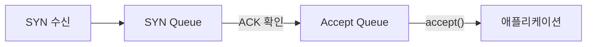
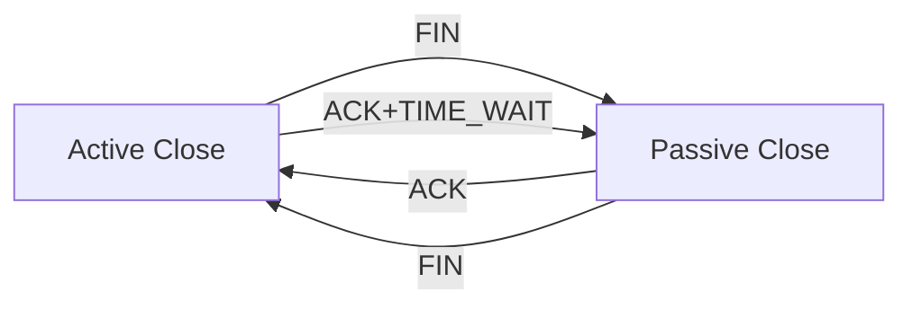
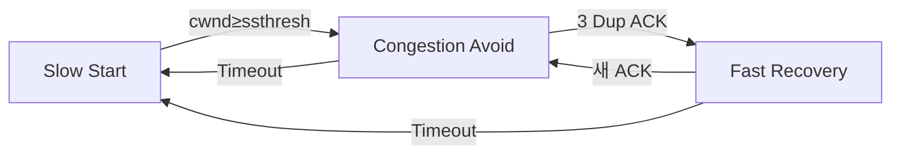
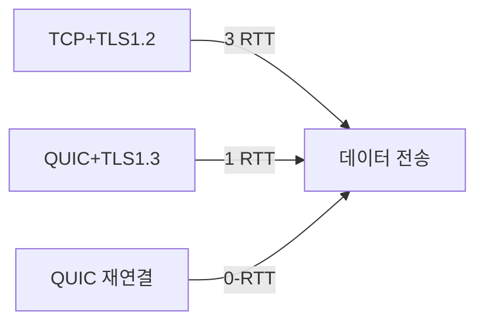
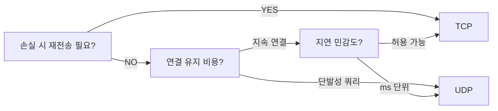

전송 계층(Transport Layer)의 두 프로토콜인 TCP와 UDP는 인터넷의 근간이다. 단순히 "TCP는 신뢰성, UDP는 속도"라는 수준을 넘어, 내부 메커니즘이 왜 그렇게 설계됐는지를 이해해야 장애 상황에서 원인을 정확히 진단하고, 서비스에 맞는 프로토콜을 선택하며, 커널 파라미터를 올바르게 튜닝할 수 있다.

> **비유:** TCP는 국제 등기 우편이다. 발송 전 수신자 확인(3-Way Handshake), 분실 시 재발송(재전송), 순서 보장(Sequence Number), 수신 확인증(ACK), 배달 속도를 우체국 용량에 맞게 조절(혼잡 제어)까지 전부 처리한다. UDP는 전단지 배포다. 최대한 빠르게 뿌리되 누가 받았는지 확인하지 않는다. 정확도보다 속도가 중요한 상황에 최적이다.

---

## 1. TCP vs UDP 핵심 비교

| 항목 | TCP | UDP |
|------|-----|-----|
| 연결 방식 | 연결 지향 (3-Way Handshake) | 비연결 (Connectionless) |
| 신뢰성 | 순서 보장, 재전송, 중복 제거 | 보장 없음 |
| 흐름 제어 | Sliding Window (rwnd) | 없음 |
| 혼잡 제어 | Slow Start, AIMD, CUBIC, BBR | 없음 |
| 헤더 크기 | 20~60 bytes | 8 bytes (고정) |
| 전이중 | 지원 | 지원 |
| 멀티캐스트 | 지원 안 함 | 지원 |
| 주요 용도 | HTTP, HTTPS, FTP, SSH, DB | DNS, 게임, 스트리밍, VoIP, QUIC |

TCP의 오버헤드가 큰 이유는 신뢰성 메커니즘이 모두 헤더와 상태 머신으로 구현되기 때문이다. 신뢰성은 공짜가 아니다. 연결당 소켓 버퍼(기본 128KB~4MB), 상태 변수(cwnd, ssthresh, rwnd, RTT 추정값) 등 메모리와 CPU를 소비한다.

---

## 2. TCP 헤더 — 모든 필드의 존재 이유

```
 0                   1                   2                   3
 0 1 2 3 4 5 6 7 8 9 0 1 2 3 4 5 6 7 8 9 0 1 2 3 4 5 6 7 8 9 0 1
+-+-+-+-+-+-+-+-+-+-+-+-+-+-+-+-+-+-+-+-+-+-+-+-+-+-+-+-+-+-+-+-+
|          Source Port          |       Destination Port        |
+-+-+-+-+-+-+-+-+-+-+-+-+-+-+-+-+-+-+-+-+-+-+-+-+-+-+-+-+-+-+-+-+
|                        Sequence Number                        |
+-+-+-+-+-+-+-+-+-+-+-+-+-+-+-+-+-+-+-+-+-+-+-+-+-+-+-+-+-+-+-+-+
|                    Acknowledgment Number                      |
+-+-+-+-+-+-+-+-+-+-+-+-+-+-+-+-+-+-+-+-+-+-+-+-+-+-+-+-+-+-+-+-+
|  Data |       |C|E|U|A|P|R|S|F|                               |
| Offset|Reservd|W|C|R|C|S|S|Y|I|            Window            |
|       |       |R|E|G|K|H|T|N|N|                               |
+-+-+-+-+-+-+-+-+-+-+-+-+-+-+-+-+-+-+-+-+-+-+-+-+-+-+-+-+-+-+-+-+
|           Checksum            |         Urgent Pointer        |
+-+-+-+-+-+-+-+-+-+-+-+-+-+-+-+-+-+-+-+-+-+-+-+-+-+-+-+-+-+-+-+-+
|                    Options (0~40 bytes)                       |
+-+-+-+-+-+-+-+-+-+-+-+-+-+-+-+-+-+-+-+-+-+-+-+-+-+-+-+-+-+-+-+-+
```

### 2-1. Sequence Number — 바이트 단위 인덱스

32비트 필드로 전송하는 데이터의 첫 바이트 위치를 나타낸다. 패킷이 여러 경로로 분산돼 순서가 바뀌어 도착해도 수신자가 올바른 순서로 재조립할 수 있는 근거가 된다. 또한 중복 패킷을 탐지해 폐기한다. 32비트이므로 최대 4GB까지 표현 가능하고, 초과 시 0으로 wrap-around된다.

**ISN(Initial Sequence Number) 난수화 이유:** 연결마다 0부터 시작하면 공격자가 seq를 예측해 위조 패킷을 삽입할 수 있다(TCP Hijacking). ISN을 예측 불가능한 난수로 설정하면 위조 패킷이 정상 seq 범위에 들어올 확률이 2^32분의 1로 낮아진다. 또한 이전 연결의 잔존 패킷이 새 연결에 혼입되는 것도 방지한다.

### 2-2. Acknowledgment Number — "여기까지 받았다"

수신자가 다음에 받고 싶은 바이트 번호다. 누적(Cumulative) ACK 방식이라 seq=100, length=50 세그먼트를 받으면 ACK=150을 반환한다. 이 방식은 ACK 자체가 유실돼도 다음 ACK가 그 이전 ACK의 역할까지 대체한다.

### 2-3. Flags — 연결 상태 제어의 핵심

| 플래그 | 이름 | 역할 |
|--------|------|------|
| SYN | Synchronize | 연결 수립 요청. ISN 교환 |
| ACK | Acknowledgment | ACK Number 필드가 유효함을 표시 |
| FIN | Finish | 이 방향의 데이터 전송 종료 |
| RST | Reset | 즉시 연결 강제 종료 (비정상 상황) |
| PSH | Push | 수신 버퍼를 비워 애플리케이션에 즉시 전달 요청 |
| URG | Urgent | Urgent Pointer 필드가 유효함. Telnet 인터럽트 등에 사용 |
| ECE | ECN-Echo | 혼잡 통지 (Explicit Congestion Notification) |
| CWR | Congestion Window Reduced | ECN 수신 후 cwnd를 줄였음을 상대에게 알림 |

**RST vs FIN의 차이:** FIN은 "내 할 말 다 했다, 상대는 계속 보내도 된다"는 half-close다. RST는 "연결을 즉시 파기한다, 버퍼의 데이터도 버린다"는 강제 종료다. RST를 받은 쪽은 연결 상태를 즉시 해제하며 애플리케이션에 Connection Reset 에러를 전달한다.

**PSH의 역할:** 스트리밍 프로토콜에서 중요하다. TCP는 수신 버퍼에 데이터를 쌓다가 애플리케이션이 read()를 호출할 때 전달한다. PSH 플래그가 설정되면 커널은 버퍼를 flush해 즉시 애플리케이션 레이어로 올린다. SSH 터미널 키 입력처럼 즉각 처리가 필요한 상황에 사용된다.

### 2-4. Window Size — 흐름 제어의 근거

수신자의 수신 버퍼 여유 공간을 bytes 단위로 표현한다. 16비트(최대 65535 bytes)이지만, Window Scale 옵션(RFC 7323)을 통해 최대 1GB(2^30)까지 확장 가능하다. Window Scale은 3-Way Handshake 시 협상하며, 실제 Window는 헤더의 값을 Scale factor만큼 왼쪽 shift한 값이다.

### 2-5. Checksum — 데이터 무결성 검증

TCP 체크섬은 TCP 헤더와 데이터 전체를 커버한다. IP 헤더의 의사 헤더(source IP, dest IP, protocol, TCP length)도 포함해 IP 레이어 오류까지 탐지한다. 1의 보수(one's complement) 방식으로 계산한다. UDP 체크섬은 선택이지만 TCP는 필수다.

---

## 3. 3-Way Handshake — 연결 수립의 내부 메커니즘

TCP 연결 수립은 단순히 "연결한다"는 의미 이상이다. 양측의 ISN 교환, 수신 버퍼 크기 협상, Window Scale과 SACK(Selective Acknowledgment) 등 옵션 협상이 모두 이 과정에서 이뤄진다.

> **비유:** 양측 모두 귀가 들리는지 확인하는 과정이다. "거기 들려요?"(SYN) → "네, 들려요. 여기도 들려요?"(SYN-ACK) → "네, 들립니다."(ACK). 3번이 필요한 이유는 이 확인이 쌍방향이어야 하기 때문이다. 2번으로는 서버→클라이언트 방향의 수신 능력을 클라이언트가 확인했는지 서버가 알 수 없다.


**1단계 SYN:** 클라이언트가 ISN(x)을 난수로 생성해 SYN 패킷을 전송한다. 이 시점에 클라이언트 상태는 SYN_SENT가 된다.

**2단계 SYN-ACK:** 서버가 자신의 ISN(y)을 생성하고 ack=x+1로 클라이언트 ISN 확인을 포함해 응답한다. 서버 상태는 SYN_RCVD. 포트가 닫혀 있으면 RST+ACK를 반환한다. 방화벽이 포트를 차단하면 응답 자체가 없다(클라이언트는 타임아웃 후 Connection refused 또는 Connection timed out을 보고한다).

**3단계 ACK:** 클라이언트가 ack=y+1로 서버 ISN을 확인한다. 양측 모두 ESTABLISHED 상태로 전환된다. 이 ACK부터 데이터를 함께 실어 보낼 수 있다(Piggybacking).

### 3-1. SYN Queue vs Accept Queue — 두 큐의 역할



서버 커널에는 두 개의 큐가 존재한다.

**SYN Queue (Incomplete Queue):** SYN을 받고 SYN-ACK를 보냈지만 아직 최종 ACK가 오지 않은 반완성 연결을 저장한다. 크기는 `net.ipv4.tcp_max_syn_backlog`로 제어한다(기본 128~1024). SYN Flood 공격의 표적이 바로 이 큐다.

**Accept Queue (Complete Queue):** 3-Way Handshake가 완전히 완료된 연결을 저장한다. 애플리케이션이 `accept()` 시스템 콜을 호출할 때까지 여기서 대기한다. 크기는 `listen()` 시스템 콜의 backlog 파라미터와 `net.core.somaxconn`의 최솟값으로 결정된다. Accept Queue가 가득 차면 새 연결 SYN을 무시하거나 RST를 반환한다.

```java
// Java: ServerSocket의 backlog가 Accept Queue 크기
// 기본값 50은 고트래픽 서버에서 너무 작다
ServerSocket serverSocket = new ServerSocket(8080, 1024);
// backlog=1024로 설정. 단, OS의 somaxconn 이하로 제한됨

// 확인 명령: ss -lnt | grep :8080
// Recv-Q = 현재 Accept Queue에 쌓인 연결 수
// Send-Q = Accept Queue 최대 크기 (backlog)
// Recv-Q == Send-Q이면 포화 상태 → 연결 거부 발생 중
```

### 3-2. SYN Flood 공격과 SYN Cookie

SYN Flood는 공격자가 위조된 출발지 IP로 SYN만 대량 전송하고 ACK를 보내지 않아 서버의 SYN Queue를 가득 채우는 DoS 공격이다. SYN Queue가 포화되면 정상 SYN도 처리되지 않는다.

**SYN Cookie 메커니즘:** SYN Queue에 상태를 저장하지 않고, ISN을 요청 정보(src IP, src port, dst IP, dst port, timestamp)의 암호화 해시로 생성한다. 서버는 SYN-ACK를 보내고 상태를 버린다. 클라이언트가 ACK를 보내면 ACK Number(= ISN+1)를 역산해 유효성을 검증한 후 연결을 수립한다. 진짜 클라이언트만 올바른 ACK를 보낼 수 있으므로 위조 IP는 필터링된다.

```bash
# SYN Cookie 활성화 확인 (1이면 활성)
sysctl net.ipv4.tcp_syncookies

# SYN Backlog 크기 설정
sysctl -w net.ipv4.tcp_max_syn_backlog=4096

# Accept Queue 최대 크기 (systemd 기본값 4096)
sysctl -w net.core.somaxconn=4096

# 실시간 SYN_RECV 상태 소켓 수 확인 (급증하면 SYN Flood 의심)
ss -ant | grep SYN_RECV | wc -l
```

**SYN Cookie의 한계:** SACK, Window Scale 등 TCP 옵션 협상 정보를 ISN에 저장할 공간이 제한적이라 일부 최적화가 비활성화된다. 따라서 정상 상황에서는 꺼두고, 공격 탐지 시 자동 활성화되는 것이 이상적이다.

---

## 4. Java로 보는 TCP 연결 수립

```java
import java.net.*;
import java.io.*;

// ===== 서버 =====
public class TcpServer {
    public static void main(String[] args) throws IOException {
        // listen() backlog=256: Accept Queue 크기
        // OS의 net.core.somaxconn보다 클 수 없음
        ServerSocket serverSocket = new ServerSocket(8080, 256);
        System.out.println("Listening on 8080, backlog=256");

        while (true) {
            // accept()는 Accept Queue에서 완성된 연결을 꺼냄
            // 3-Way Handshake는 커널이 이미 완료한 상태
            Socket clientSocket = serverSocket.accept();

            // 소켓 옵션 설정 (accept 이후에도 설정 가능)
            clientSocket.setTcpNoDelay(true);      // Nagle 비활성화
            clientSocket.setSoTimeout(30_000);     // read() 30초 타임아웃
            clientSocket.setKeepAlive(true);       // SO_KEEPALIVE 활성화

            // 소켓 버퍼 크기 (기본은 OS 설정 따름)
            clientSocket.setReceiveBufferSize(256 * 1024);  // 256KB
            clientSocket.setSendBufferSize(256 * 1024);

            new Thread(() -> handle(clientSocket)).start();
        }
    }

    static void handle(Socket s) {
        try (s;
             BufferedReader in = new BufferedReader(
                 new InputStreamReader(s.getInputStream()));
             PrintWriter out = new PrintWriter(s.getOutputStream(), true)) {

            String line;
            while ((line = in.readLine()) != null) {
                out.println("Echo: " + line);
            }
            // readLine()이 null 반환 = 상대방이 FIN 전송 (half-close)
        } catch (SocketException e) {
            // "Connection reset" = RST 수신
            // "Broken pipe" = 상대방 소켓이 닫힌 후 write 시도
            System.err.println("Connection error: " + e.getMessage());
        } catch (IOException e) {
            e.printStackTrace();
        }
    }
}

// ===== 클라이언트 =====
public class TcpClient {
    public static void main(String[] args) throws IOException {
        // connect() 내부에서 3-Way Handshake 수행
        // SYN 전송 → SYN-ACK 수신 → ACK 전송 완료 후 반환
        Socket socket = new Socket();
        socket.setTcpNoDelay(true);

        // connect 타임아웃: SYN 전송 후 SYN-ACK 대기 최대 시간
        socket.connect(new InetSocketAddress("localhost", 8080), 5_000);

        try (socket;
             PrintWriter out = new PrintWriter(socket.getOutputStream(), true);
             BufferedReader in = new BufferedReader(
                 new InputStreamReader(socket.getInputStream()))) {

            out.println("Hello");
            System.out.println(in.readLine());
        }
        // try-with-resources 종료 시 FIN 전송 (4-Way Termination 시작)
    }
}
```

---

## 5. 4-Way Termination — 연결 종료의 내부 메커니즘

TCP 연결은 단방향이 아닌 전이중(Full-Duplex)이다. 따라서 각 방향을 독립적으로 닫아야 하고 최소 4단계가 필요하다. 3-Way Handshake에서 SYN과 SYN-ACK를 합칠 수 있었던 것은 서버가 SYN 수신 직후 연결 의사가 있었기 때문이다. FIN은 "내 쪽 전송이 끝났다"는 선언이지만, 상대방은 아직 보낼 데이터가 있을 수 있어 즉시 FIN을 보낼 수 없다.

> **비유:** 양자 전화 통화를 끊는 과정이다. A가 "저는 할 말 다 했어요"(FIN) → B가 "알겠어요"(ACK) → B가 남은 말을 마저 한 뒤 "저도 다 했어요"(FIN) → A가 "알겠습니다"(ACK). 중간에 B가 할 말이 더 있으면 ACK와 FIN 사이에 시간이 걸린다.



### 5-1. Half-Close — 한쪽만 닫기

FIN을 보낸 쪽은 더 이상 데이터를 보낼 수 없지만 수신은 가능하다. 이를 Half-Close라 한다. Java에서 `socket.shutdownOutput()`으로 FIN만 전송하고 입력 스트림은 열어 둘 수 있다.

```java
// Half-Close 예시: 요청 전송 완료 후 FIN 전송, 응답은 계속 수신
Socket socket = new Socket("localhost", 8080);
OutputStream out = socket.getOutputStream();
out.write("request data".getBytes());
out.flush();

// FIN 전송 (출력 스트림만 닫음)
// 서버는 EOF를 감지해 응답을 보내기 시작
socket.shutdownOutput();

// 응답 수신은 계속 가능
InputStream in = socket.getInputStream();
byte[] buf = in.readAllBytes();  // 서버 응답 전체 수신

socket.close();  // 최종 종료
```

### 5-2. TIME_WAIT — 왜 2MSL을 기다리는가

마지막 ACK를 보낸 Active Close 측이 즉시 소켓을 해제하지 않고 2MSL(Maximum Segment Lifetime, Linux 기본 60초) 동안 대기한다. 이 상태를 TIME_WAIT라 한다.

**이유 1 — 마지막 ACK 유실 보호:**
마지막 ACK(4번째 패킷)가 유실되면 Passive Close 측(서버)은 FIN을 재전송한다. Active Close 측이 이미 소켓을 해제했다면 RST로 응답해 서버가 비정상 종료된다. TIME_WAIT 동안 살아있으면 재전송된 FIN에 ACK를 다시 보낼 수 있다.

**이유 2 — 패킷 혼입 방지:**
같은 4-튜플(src IP, src port, dst IP, dst port)로 새 연결이 맺어졌을 때, 이전 연결의 지연 패킷이 도착하면 새 연결의 데이터로 오해할 수 있다. MSL은 패킷이 네트워크에서 살 수 있는 최대 시간이고, 2MSL 후면 양방향 모든 패킷이 소멸했음을 보장한다.

### 5-3. TIME_WAIT 과다와 대응

서버가 Active Close를 주도하면(HTTP keep-alive 만료, 서버 측 timeout) 서버에 TIME_WAIT 소켓이 쌓인다. 초당 1000개 연결이 처리되면 60초 동안 60,000개 TIME_WAIT 소켓이 상주한다. 로컬 포트가 고갈되면 새 연결을 맺지 못한다.

```bash
# TIME_WAIT 현황 확인
ss -s | grep -i time
netstat -an | grep TIME_WAIT | wc -l

# 아웃바운드 연결의 TIME_WAIT 소켓 포트 재사용 허용
# (타임스탬프가 더 최신인 연결만 허용 - 안전)
sysctl -w net.ipv4.tcp_tw_reuse=1

# TIME_WAIT 소켓 최대 버킷 수 (초과 시 강제 파기 - 위험)
sysctl net.ipv4.tcp_max_tw_buckets  # 기본 18000~262144

# 로컬 포트 범위 확장
sysctl -w net.ipv4.ip_local_port_range="1024 65535"
```

**tcp_tw_recycle 경고:** 과거에 사용되던 `tcp_tw_recycle=1`은 NAT 환경에서 같은 NAT IP 뒤의 서로 다른 클라이언트 패킷을 같은 호스트로 오해해 연결을 거부하는 버그가 있다. Linux 4.12부터 제거됐다.

### 5-4. FIN_WAIT 상태와 SO_LINGER

**FIN_WAIT_2:** Active Close 측이 FIN을 보내고 ACK를 받았지만 상대방 FIN이 오지 않은 상태. 상대방 애플리케이션이 데이터를 보내는 중일 수 있다. `net.ipv4.tcp_fin_timeout`(기본 60초)이 지나면 강제 종료된다.

**CLOSE_WAIT:** Passive Close 측이 FIN을 받고 ACK를 보냈지만, 애플리케이션이 아직 소켓을 닫지 않은 상태. 애플리케이션 버그로 `socket.close()`를 호출하지 않으면 CLOSE_WAIT가 무한정 쌓인다. 이 상태는 커널이 자동으로 정리하지 않는다.

```java
// SO_LINGER: close() 호출 시 동작 제어
Socket socket = new Socket("localhost", 8080);

// linger=true, timeout=0: close() 즉시 RST 전송 (TIME_WAIT 스킵)
// 장점: 포트 즉시 해제 / 단점: 상대방에게 비정상 종료로 보임
socket.setSoLinger(true, 0);

// linger=true, timeout=5: 최대 5초 대기 후 강제 종료
socket.setSoLinger(true, 5);

// linger=false (기본): close() 즉시 반환, 커널이 나머지 전송 처리
socket.setSoLinger(false, 0);
socket.close();
```

---

## 6. 흐름 제어 — Sliding Window의 내부 동작

흐름 제어는 수신자가 처리할 수 없을 만큼 빠르게 데이터가 오지 않도록 조절한다. 수신 버퍼가 넘치면 데이터가 유실되고 재전송이 발생해 결국 처리량이 더 낮아진다.

> **비유:** 수도꼭지와 욕조다. 수신자는 욕조 용량을 실시간으로 알려주고, 송신자는 욕조가 차면 수도꼭지를 잠근다. 욕조에서 물이 빠지면(애플리케이션이 데이터를 읽으면) 다시 수도꼭지를 연다.

### 6-1. 수신 윈도우(rwnd)의 동작

수신자는 모든 ACK 패킷의 Window 필드에 자신의 수신 버퍼 여유 공간을 실어 보낸다. 송신자는 미확인 전송 데이터 합계가 rwnd를 초과하지 않도록 제한한다.

```
송신자가 보낼 수 있는 최대량 = min(cwnd, rwnd) - (보냈지만 ACK 못 받은 데이터)
```

수신 버퍼가 64KB인데 애플리케이션이 느리게 read()를 호출하면 rwnd가 점점 줄어들다 0이 된다.

### 6-2. Zero Window와 Persist Timer

rwnd=0이 되면 송신자는 전송을 완전히 중단한다. 이 상태에서 수신자가 버퍼를 비워 rwnd>0이 됐을 때 보내는 Window Update ACK가 유실되면 양측이 서로를 기다리는 교착 상태에 빠진다.

**해결책 — Persist Timer:** 송신자는 rwnd=0을 받은 후 Persist Timer를 시작한다. 타이머가 만료되면 1 byte짜리 Window Probe를 전송한다. 수신자가 현재 rwnd를 포함한 ACK를 반환하면 송신이 재개된다. Probe는 ACK 없이 지수 백오프로 반복된다.

### 6-3. Silly Window Syndrome — 작은 윈도우 문제

수신자 애플리케이션이 극도로 느리게 버퍼를 비우면(예: 2 bytes씩 read) rwnd가 2 bytes가 되고, 송신자가 2 bytes짜리 TCP 패킷(헤더 40 bytes + 데이터 2 bytes)을 보내는 상황이 발생한다. 효율이 5%다.

**Clark's Solution (수신자 측):** rwnd가 MSS 미만이거나 수신 버퍼의 절반 미만이면 rwnd=0을 광고하다가 충분히 비워지면 한번에 통보한다.

**Nagle Algorithm (송신자 측):** 다음 절에서 상세 설명.

```java
// Java NIO: 수신 버퍼 크기 설정
import java.nio.channels.*;
import java.net.*;

ServerSocketChannel serverChannel = ServerSocketChannel.open();
serverChannel.setOption(StandardSocketOptions.SO_RCVBUF, 256 * 1024);
serverChannel.setOption(StandardSocketOptions.SO_REUSEADDR, true);
serverChannel.bind(new InetSocketAddress(8080), 256);

SocketChannel clientChannel = serverChannel.accept();
clientChannel.setOption(StandardSocketOptions.TCP_NODELAY, true);
clientChannel.setOption(StandardSocketOptions.SO_KEEPALIVE, true);

// 현재 수신 버퍼 크기 확인
int rcvBuf = clientChannel.getOption(StandardSocketOptions.SO_RCVBUF);
System.out.println("Receive buffer: " + rcvBuf + " bytes");
```

---

## 7. Nagle 알고리즘과 Delayed ACK

### 7-1. Nagle 알고리즘 — 왜 존재하는가

1984년 John Nagle이 제안했다. 당시 네트워크에서 1 byte짜리 Telnet 입력이 40 bytes 헤더를 달고 전송되면서 "작은 패킷 문제(Small Packet Problem)"가 발생했다. 패킷 수가 폭발적으로 증가해 라우터가 혼잡해졌다.

**Nagle 전송 규칙:** 다음 두 조건 중 하나가 만족될 때만 전송한다.
1. 버퍼에 쌓인 데이터가 MSS 이상
2. 현재 미확인(in-flight) 데이터가 없음

두 조건이 모두 아니면 ACK를 기다리며 버퍼링한다.

### 7-2. Delayed ACK — ACK를 모아서 보내는 이유

수신자가 패킷마다 ACK를 즉시 보내면 ACK 트래픽이 데이터 트래픽만큼 발생한다. Delayed ACK는 최대 200ms 대기 후 ACK를 전송하거나, 전송할 데이터가 생기면 데이터에 ACK를 피기백한다. ACK 패킷 수를 약 50% 줄인다.

### 7-3. Nagle + Delayed ACK 상호작용이 만드는 200ms 지연

두 알고리즘이 동시에 동작하면 최악의 경우 200ms 지연이 발생한다.

```
상황: 클라이언트가 HTTP 요청을 두 패킷으로 분할 전송

① 클라이언트: 첫 번째 큰 패킷 전송 (MSS 크기)
② 클라이언트: 두 번째 작은 패킷은 Nagle로 버퍼링 (첫 패킷 ACK 대기 중)
③ 서버: 첫 패킷 수신 → Delayed ACK 시작 (최대 200ms 대기)
④ 서버: 200ms 후 ACK 전송
⑤ 클라이언트: ACK 수신 → 두 번째 작은 패킷 전송
⑥ 서버: 두 번째 패킷 수신 후 처리 완료

총 지연: 200ms (Delayed ACK 대기)
```

**해결책:** `TCP_NODELAY`로 Nagle을 비활성화하면 두 번째 패킷이 즉시 전송된다.

```java
// Nagle 비활성화가 필요한 상황
// 1. SSH, Telnet: 키 입력마다 즉시 전송 필요
// 2. 온라인 게임: 입력 지연 최소화
// 3. 금융 주문: 마이크로초 단위 지연 민감
// 4. HTTP 요청이 여러 write()로 분할되는 경우

Socket socket = new Socket();
socket.setTcpNoDelay(true);  // TCP_NODELAY = Nagle 비활성화
socket.connect(new InetSocketAddress("localhost", 8080), 5000);

// NIO 방식
SocketChannel channel = SocketChannel.open();
channel.setOption(StandardSocketOptions.TCP_NODELAY, true);
channel.connect(new InetSocketAddress("localhost", 8080));
```

---

## 8. 혼잡 제어 — 네트워크 전체를 보호하는 메커니즘

흐름 제어가 수신자를 보호한다면, 혼잡 제어는 네트워크 중간 경로(라우터, 스위치)를 보호한다. 네트워크가 처리할 수 있는 양보다 많은 데이터를 보내면 라우터 큐가 넘쳐 패킷이 드롭된다. 모든 송신자가 동시에 최대 속도로 보내면 네트워크 붕괴가 발생한다(Congestion Collapse, 1980년대에 실제로 발생했고 처리량이 1/1000로 감소했다).

> **비유:** 고속도로 진입로의 신호등이다. 본선이 정체 없이 흐를 때는 진입 신호가 빠르게 켜지고, 정체가 시작되면 진입 간격이 길어진다. 모든 차가 동시에 진입하면 본선이 마비되므로 각 진입로에서 스스로 속도를 조절한다.

핵심 변수: **cwnd(Congestion Window)**. 송신자가 ACK 없이 in-flight 상태로 유지할 수 있는 최대 데이터량. 수신자의 rwnd와 함께 실제 전송량을 결정한다.

```
실제 전송 가능량 = min(cwnd, rwnd)
```

### 8-1. Slow Start — 지수 증가로 용량 탐색

연결 초기에는 네트워크 용량을 모른다. cwnd=1 MSS(최대 세그먼트 크기, 보통 1460 bytes)에서 시작해 ACK를 받을 때마다 1 MSS를 cwnd에 추가한다. ACK는 RTT당 cwnd개만큼 돌아오므로 RTT당 cwnd가 2배씩 증가하는 지수 성장이다.

```
RTT 1: cwnd=1 → 1 패킷 전송 → 1 ACK → cwnd=2
RTT 2: cwnd=2 → 2 패킷 전송 → 2 ACK → cwnd=4
RTT 3: cwnd=4 → 4 패킷 전송 → 4 ACK → cwnd=8
RTT 4: cwnd=8 → 8 패킷 전송 → 8 ACK → cwnd=16
```

이름이 "Slow"인 이유는 당시 대안인 "한번에 전체 전송"보다 느리게 시작하기 때문이다. 실제로는 지수 증가로 매우 빠르다.

**ssthresh(Slow Start Threshold):** cwnd가 이 값에 도달하면 Congestion Avoidance 단계로 전환한다. 초기값은 보통 수신자 rwnd(또는 임의의 큰 값)이고, 혼잡이 감지될 때마다 갱신된다.

### 8-2. Congestion Avoidance — 선형 증가(AIMD)

cwnd >= ssthresh 이후에는 RTT당 1 MSS씩만 증가한다(Additive Increase). 패킷 손실이 감지되면 cwnd를 줄인다(Multiplicative Decrease). 이 비대칭 증감이 AIMD다.

```
손실 감지 방법 1 - Timeout: 재전송 타이머 만료
  → ssthresh = cwnd / 2
  → cwnd = 1 MSS (Slow Start 재시작, 가장 가혹한 반응)

손실 감지 방법 2 - 3 Duplicate ACK: 동일 ACK 3회 수신
  → ssthresh = cwnd / 2
  → cwnd = ssthresh (Fast Recovery, Slow Start 건너뜀)
```

Timeout은 3 Dup ACK보다 훨씬 심각한 상황으로 판단한다. 3 Dup ACK는 수신자가 이후 패킷을 받고 있다는 증거라 네트워크 연결은 살아있다.

### 8-3. Fast Retransmit — 타임아웃 전 즉시 재전송

수신자가 seq=500 세그먼트를 받고 seq=600 기대 중에 seq=700이 도착하면 seq=600에 대한 Duplicate ACK를 보낸다. 순서에 맞지 않는 패킷이 올 때마다 동일 ACK를 보낸다. 송신자가 동일 ACK를 3번 받으면(3 Dup ACK) 타임아웃 없이 즉시 재전송한다. 타임아웃은 RTO(재전송 타임아웃, 수백 ms~수 초)를 기다려야 하지만 Fast Retransmit은 1 RTT 이내에 재전송된다.

### 8-4. Fast Recovery — cwnd를 1까지 떨어뜨리지 않는 이유

3 Dup ACK 후 cwnd=1로 떨어뜨리면 Slow Start부터 다시 시작해야 한다. 3 Dup ACK가 온 상황은 네트워크가 완전히 마비된 것이 아니라(이후 패킷들이 도착하고 있으므로) 일시적 혼잡이다. Fast Recovery는 cwnd를 ssthresh(= cwnd/2)로만 감소시키고 Congestion Avoidance로 직접 진입한다.



### 8-5. CUBIC vs BBR — 현대 혼잡 제어 알고리즘

**CUBIC (Linux 기본):**
손실 이전 최대 cwnd를 목표점으로, 3차 함수(Cubic)로 cwnd를 증가시킨다. 손실 직전에는 천천히, 손실 직후에는 빠르게 회복하고, 목표에 가까워지면 다시 천천히 증가한다. AIMD의 "손실 후 절반 감소"보다 고대역폭 고지연 환경(BDP가 큰 경우)에서 처리량이 높다.

```
CUBIC cwnd 함수:
W(t) = C(t - K)³ + W_max

W_max: 혼잡 직전 최대 cwnd
K: cwnd가 W_max에 도달하는 예상 시간
C: 스케일링 상수 (0.4)
```

**BBR (Bottleneck Bandwidth and RTprop):**
Google이 2016년 개발. 기존 알고리즘이 패킷 손실을 혼잡의 신호로 사용하는 것과 달리, BBR은 **병목 대역폭(BtlBw)**과 **최소 RTT(RTprop)**를 직접 측정해 혼잡을 예측한다.

패킷 손실이 발생하기 전에 속도를 조절하므로:
- 버퍼 사용량이 낮아 RTT가 낮다
- 손실 기반 알고리즘보다 패킷 손실률이 높은 환경(LTE, 위성)에서 우수
- 고지연 경로(RTT > 100ms 인터내셔널 링크)에서 CUBIC 대비 처리량 대폭 향상

```
BBR 동작 주기:
Startup → Drain → ProbeBW → ProbeRTT

Startup: Slow Start와 유사, 병목 대역폭 측정 중 지수 증가
Drain: Startup에서 쌓인 버퍼 비우기
ProbeBW: BtlBw를 주기적으로 재측정하며 안정적 전송
ProbeRTT: 10초마다 cwnd를 4 패킷으로 낮춰 최소 RTT 측정
```

| 항목 | Reno | CUBIC | BBR |
|------|------|-------|-----|
| 혼잡 신호 | 패킷 손실 | 패킷 손실 | RTT + 대역폭 측정 |
| cwnd 증가 | AIMD 선형 | 3차 함수 | BDP 기반 |
| 손실 후 반응 | cwnd/2 + Slow Start | cwnd*0.7 | 느린 속도로 변화 |
| 고지연 경로 | 취약 | 보통 | 우수 |
| 패킷 손실 환경 | 취약 | 보통 | 우수 |
| Linux 기본 | 구형 | 현재 기본 | 옵트인 |

```bash
# 현재 혼잡 제어 알고리즘 확인
sysctl net.ipv4.tcp_congestion_control

# 사용 가능한 알고리즘 목록
sysctl net.ipv4.tcp_available_congestion_control

# BBR 활성화 (커널 4.9 이상)
sysctl -w net.ipv4.tcp_congestion_control=bbr
# /etc/sysctl.conf에 영구 설정
echo "net.ipv4.tcp_congestion_control=bbr" >> /etc/sysctl.conf
```

---

## 9. TCP Keepalive — 좀비 연결 탐지

TCP Keepalive와 애플리케이션 레벨 Heartbeat는 목적이 같지만 동작 방식과 한계가 다르다.

### 9-1. TCP Keepalive (SO_KEEPALIVE)

OS가 주기적으로 빈 탐침 패킷을 전송해 연결 생존 여부를 확인한다. 상대방이 응답하지 않으면 여러 번 재시도 후 ETIMEDOUT 에러를 반환한다.

```bash
# Linux 기본값
sysctl net.ipv4.tcp_keepalive_time    # 유휴 후 첫 탐침까지 대기: 7200초(2시간)
sysctl net.ipv4.tcp_keepalive_intvl   # 탐침 간격: 75초
sysctl net.ipv4.tcp_keepalive_probes  # 탐침 횟수: 9번

# 연결 종료 판정: 7200 + 75 * 9 = 7875초 ≈ 2시간 11분
# 이 시간 동안 방화벽/NAT은 연결을 이미 제거했을 수 있다
```

**TCP Keepalive의 한계:**
- OS 레벨 파라미터라 애플리케이션마다 다른 간격 설정 불가 (Java에서는 소켓 옵션으로 개별 설정 가능)
- 애플리케이션 레이어 상태를 확인하지 못한다. 서버 프로세스가 응답 불가(데드락, OOM)인데 OS는 살아서 탐침에 응답할 수 있다
- 중간 방화벽, 로드밸런서의 idle timeout(보통 30~300초)보다 훨씬 긴 기본값

```java
// Java: TCP Keepalive 소켓별 설정
Socket socket = new Socket();
socket.setKeepAlive(true);  // SO_KEEPALIVE 활성화
// 개별 파라미터(time, intvl, probes)는 Java 11+에서 SO_KEEPALIVE 옵션을 통해 설정 가능

// Java 11+에서는 ExtendedSocketOptions 사용
import jdk.net.ExtendedSocketOptions;

Socket socket = new Socket();
socket.setOption(ExtendedSocketOptions.TCP_KEEPIDLE, 60);    // 60초 유휴 후 탐침
socket.setOption(ExtendedSocketOptions.TCP_KEEPINTERVAL, 10); // 10초 간격
socket.setOption(ExtendedSocketOptions.TCP_KEEPCOUNT, 3);    // 3번 시도
```

### 9-2. 애플리케이션 레벨 Heartbeat가 더 나은 이유

| 항목 | TCP Keepalive | App Heartbeat |
|------|--------------|---------------|
| 레이어 | OS/커널 | 애플리케이션 |
| 감지 대상 | 네트워크 단절 | 네트워크 단절 + 앱 응답 불가 |
| 설정 단위 | OS 전역 (또는 소켓별) | 연결별 자유 설정 |
| 방화벽 우회 | 불가 (TCP 탐침 차단 가능) | 가능 (데이터 레벨) |
| 응답 내용 | 빈 ACK | 커스텀 상태 정보 |
| 지연 탐지 | 불가 | 가능 (RTT 측정) |

```java
// 애플리케이션 레벨 Heartbeat 구현
import java.net.*;
import java.io.*;
import java.util.concurrent.*;

public class HeartbeatConnection {
    private final Socket socket;
    private final PrintWriter out;
    private final BufferedReader in;
    private final ScheduledExecutorService scheduler;
    private volatile long lastPongTime = System.currentTimeMillis();

    public HeartbeatConnection(String host, int port) throws IOException {
        this.socket = new Socket();
        this.socket.setTcpNoDelay(true);
        this.socket.connect(new InetSocketAddress(host, port), 5000);
        this.out = new PrintWriter(socket.getOutputStream(), true);
        this.in = new BufferedReader(
            new InputStreamReader(socket.getInputStream()));
        this.scheduler = Executors.newScheduledThreadPool(1);

        startHeartbeat();
    }

    private void startHeartbeat() {
        // 5초마다 PING 전송
        scheduler.scheduleAtFixedRate(() -> {
            out.println("PING");
            // 15초 이상 PONG 미수신 시 연결 끊김 판정
            if (System.currentTimeMillis() - lastPongTime > 15_000) {
                System.err.println("Heartbeat timeout - connection dead");
                reconnect();
            }
        }, 5, 5, TimeUnit.SECONDS);

        // PONG 수신 스레드
        new Thread(() -> {
            try {
                String line;
                while ((line = in.readLine()) != null) {
                    if ("PONG".equals(line)) {
                        lastPongTime = System.currentTimeMillis();
                    } else {
                        handleMessage(line);
                    }
                }
            } catch (IOException e) {
                System.err.println("Connection lost: " + e.getMessage());
            }
        }).start();
    }

    private void reconnect() { /* 재연결 로직 */ }
    private void handleMessage(String msg) { /* 메시지 처리 */ }
}
```

---

## 10. UDP — 비연결의 철학

UDP는 TCP의 열화 버전이 아니다. 신뢰성 메커니즘의 오버헤드가 애플리케이션의 요구사항에 맞지 않을 때를 위해 설계된 별도의 프로토콜이다.

> **비유:** 라디오 방송이다. 방송국은 전파를 내보내고 누가 들었는지 확인하지 않는다. 일부 청취자가 잡음으로 못 들어도 방송은 계속된다. 중요한 것은 끊김 없는 실시간성이다. 재방송(재전송)은 이미 지나간 내용이라 의미가 없다.

### 10-1. UDP 헤더 — 8 bytes의 단순함

```
 0      7 8     15 16    23 24    31
+--------+--------+--------+--------+
|   Source Port   | Dest Port       |
+--------+--------+--------+--------+
|   Length        | Checksum        |
+--------+--------+--------+--------+
|          Data Octets ...
```

Length: 헤더를 포함한 UDP 데이터그램 전체 길이. 최소 8 bytes(헤더만).

Checksum: UDP에서 선택적이었으나 IPv6에서는 필수다. TCP와 달리 단순 오류 탐지만 하며 수정 기능은 없다. 체크섬 오류인 패킷은 조용히 폐기된다.

**비연결이 저지연을 만드는 이유:**
- 연결 수립 없음: 첫 패킷을 즉시 보낼 수 있다 (TCP는 최소 1 RTT 핸드셰이크)
- 상태 유지 없음: 커널 메모리 소비 최소 (TCP는 소켓당 ~4KB 상태)
- 재전송 없음: 손실된 패킷은 그냥 사라짐 (TCP는 손실 감지 + 재전송으로 RTT 추가)
- 순서 보장 없음: 수신 큐잉과 재조립 불필요 (TCP는 out-of-order 버퍼 필요)

### 10-2. UDP 멀티캐스트 — TCP가 못 하는 것

UDP는 하나의 패킷으로 여러 수신자에게 동시 전달하는 멀티캐스트를 지원한다. 224.0.0.0~239.255.255.255 범위의 멀티캐스트 주소를 사용한다. TCP는 단대단(Point-to-Point) 연결이라 멀티캐스트가 구조적으로 불가능하다.

```java
import java.net.*;

// UDP 멀티캐스트 송신자
public class MulticastSender {
    public static void main(String[] args) throws Exception {
        MulticastSocket socket = new MulticastSocket();
        socket.setTimeToLive(64);  // TTL: 패킷이 통과할 수 있는 라우터 수

        InetAddress group = InetAddress.getByName("239.0.0.1");
        byte[] data = "Multicast message".getBytes();
        DatagramPacket packet = new DatagramPacket(
            data, data.length, group, 9999);

        // 하나의 패킷으로 그룹에 가입한 모든 수신자에게 전달
        socket.send(packet);
        socket.close();
    }
}

// UDP 멀티캐스트 수신자
public class MulticastReceiver {
    public static void main(String[] args) throws Exception {
        MulticastSocket socket = new MulticastSocket(9999);
        InetAddress group = InetAddress.getByName("239.0.0.1");

        // 멀티캐스트 그룹 가입 (IGMP로 라우터에 통보)
        socket.joinGroup(group);

        byte[] buf = new byte[1024];
        DatagramPacket packet = new DatagramPacket(buf, buf.length);
        socket.receive(packet);  // 블로킹, 패킷 수신 대기

        String received = new String(packet.getData(), 0, packet.getLength());
        System.out.println("Received: " + received);

        socket.leaveGroup(group);
        socket.close();
    }
}
```

### 10-3. Java DatagramSocket — UDP 기본 API

```java
import java.net.*;

// UDP 서버: 에코 서버
public class UdpEchoServer {
    public static void main(String[] args) throws Exception {
        DatagramSocket socket = new DatagramSocket(9090);

        // UDP 수신 버퍼 크기 증가 (고속 스트림에서 패킷 드롭 방지)
        socket.setReceiveBufferSize(4 * 1024 * 1024);  // 4MB

        byte[] buf = new byte[65507];  // UDP 최대 페이로드 (65535 - 8 UDP - 20 IP)

        while (true) {
            DatagramPacket request = new DatagramPacket(buf, buf.length);
            socket.receive(request);  // 블로킹

            // 순서 보장 없음: 패킷은 도착 순서대로 처리됨
            // 중복 가능: 같은 패킷이 두 번 올 수 있음 (애플리케이션에서 처리)
            String msg = new String(request.getData(), 0, request.getLength());
            System.out.println("From " + request.getAddress() + ": " + msg);

            // 에코 응답
            byte[] response = ("Echo: " + msg).getBytes();
            DatagramPacket reply = new DatagramPacket(
                response, response.length,
                request.getAddress(),
                request.getPort());
            socket.send(reply);
        }
    }
}

// UDP 클라이언트
public class UdpClient {
    public static void main(String[] args) throws Exception {
        DatagramSocket socket = new DatagramSocket();
        socket.setSoTimeout(3000);  // 3초 타임아웃 (UDP는 ACK 없으므로 직접 설정)

        InetAddress server = InetAddress.getByName("localhost");
        byte[] data = "Hello UDP".getBytes();

        DatagramPacket send = new DatagramPacket(data, data.length, server, 9090);
        socket.send(send);

        // UDP는 응답이 올지 모름. 타임아웃 설정 필수
        byte[] buf = new byte[1024];
        DatagramPacket recv = new DatagramPacket(buf, buf.length);
        try {
            socket.receive(recv);
            System.out.println(new String(recv.getData(), 0, recv.getLength()));
        } catch (SocketTimeoutException e) {
            // UDP는 손실이 정상. 재시도 로직을 직접 구현
            System.out.println("No response, retrying...");
        }
        socket.close();
    }
}
```

---

## 11. UDP 사용 사례 — WHY UDP인가

### 11-1. DNS — 왜 UDP로 쿼리하는가

DNS 쿼리/응답은 보통 수십~수백 bytes다. TCP 연결 수립 비용(1 RTT 핸드셰이크 = 최소 20~50ms)이 응답 자체보다 크다. UDP는 쿼리 패킷 하나로 요청하고 응답 패킷 하나로 받아 0.5 RTT에 완료된다. 타임아웃 후 재쿼리가 TCP 재전송 대기보다 빠르다.

**예외 — TCP fallback 조건:**
- 응답이 512 bytes 초과 (EDNS0 확장 전) 또는 4096 bytes 초과 (EDNS0 이후)
- DNSSEC: 서명 데이터가 크다
- Zone Transfer: 도메인 전체 레코드를 복제할 때 (수 MB)

```java
// Java: DNS 쿼리 시뮬레이션 (UDP)
import java.net.*;

public class SimpleDnsQuery {
    // 실제 DNS 패킷을 직접 구성하는 예시 (교육 목적)
    public static void main(String[] args) throws Exception {
        DatagramSocket socket = new DatagramSocket();
        socket.setSoTimeout(5000);

        // DNS 서버 (Google Public DNS)
        InetAddress dnsServer = InetAddress.getByName("8.8.8.8");
        int dnsPort = 53;

        // DNS 쿼리 패킷 구성 (www.example.com A 레코드)
        byte[] query = buildDnsQuery("www.example.com");
        DatagramPacket request = new DatagramPacket(
            query, query.length, dnsServer, dnsPort);

        // 단일 UDP 패킷으로 전송 (연결 수립 없음)
        long start = System.currentTimeMillis();
        socket.send(request);

        byte[] buf = new byte[512];
        DatagramPacket response = new DatagramPacket(buf, buf.length);
        socket.receive(response);
        long elapsed = System.currentTimeMillis() - start;

        System.out.printf("DNS query completed in %dms (UDP, no handshake)%n", elapsed);
        // TCP였다면 RTT_handshake + RTT_query ≈ elapsed * 2
        socket.close();
    }

    static byte[] buildDnsQuery(String domain) {
        // 실제 구현에서는 dnsjava 라이브러리 사용 권장
        // 여기서는 구조 설명 생략
        return new byte[0];
    }
}
```

### 11-2. 온라인 게임 — 왜 UDP로 위치를 전송하는가

100ms 전 플레이어 위치는 현재 게임 상태에 의미가 없다. TCP로 전송 시 패킷이 손실되면 재전송을 기다리는 동안(수십~수백 ms) 새 위치 업데이트가 블로킹된다. UDP는 손실된 패킷을 버리고 다음 패킷에서 최신 상태를 반영한다.

**게임에서의 혼합 전략:**
- UDP: 위치, 방향, 입력 상태 (최신성이 중요, 손실 허용)
- TCP: 채팅, 아이템 획득, 레벨업, 결제 (신뢰성 필수)

```java
// 게임 UDP 패킷 설계 예시
public record PlayerState(
    int playerId,
    int sequenceNum,    // 클라이언트가 직접 관리하는 순서 번호
    long timestamp,     // 클라이언트 타임스탬프 (RTT 측정용)
    float x, float y,  // 위치
    float vx, float vy // 속도 (예측 보정용)
) {
    // 서버에서 오래된 패킷 필터링
    public boolean isNewerThan(PlayerState other) {
        return this.sequenceNum > other.sequenceNum;
    }
}

// 서버 수신 처리
Map<Integer, PlayerState> latestStates = new ConcurrentHashMap<>();

void onReceive(PlayerState incoming) {
    latestStates.compute(incoming.playerId(), (id, current) -> {
        // 오래된 패킷은 무시 (순서 역전 처리)
        if (current != null && !incoming.isNewerThan(current)) {
            return current;  // 구버전 패킷 버림
        }
        return incoming;
    });
}
```

### 11-3. QUIC — UDP 위에서 TCP를 능가하는 이유

QUIC(Quick UDP Internet Connections)은 Google이 설계하고 IETF가 RFC 9000으로 표준화했다. HTTP/3의 전송 계층이다. UDP를 선택한 이유는 TCP처럼 커널에 고정된 구현이 없어 유저스페이스에서 빠르게 프로토콜을 발전시킬 수 있기 때문이다.

**TCP의 구조적 한계:**
1. Head-of-Line Blocking: 패킷 하나가 손실되면 그 이후 모든 데이터가 블로킹된다 (TCP 스트림이 하나이므로)
2. 핸드셰이크 비용: TLS까지 포함하면 2~3 RTT (TLS 1.2 + TCP)
3. Connection Migration 불가: IP+포트가 연결 식별자라 IP 변경(LTE→WiFi) 시 재연결 필요
4. 커널 구현 고착: 새 알고리즘을 배포하려면 OS 업데이트 필요

**QUIC의 해결책:**



1. **0-RTT/1-RTT 연결 수립:** TLS 1.3 내장. 최초 연결은 1 RTT, 재연결(Resumption)은 0-RTT로 첫 패킷부터 암호화된 데이터 전송 가능 (0-RTT는 Replay 공격 취약성이 있어 멱등 요청만 허용)

2. **스트림 독립성:** HTTP/2도 멀티플렉싱을 지원하지만 TCP 위라 스트림 A의 패킷 손실이 스트림 B도 블로킹한다. QUIC는 스트림별 독립적인 순서 보장으로 다른 스트림에 영향 없음

3. **Connection Migration:** IP+포트 대신 Connection ID(64비트 임의값)로 연결을 식별한다. IP가 바뀌어도 Connection ID가 같으면 연결 유지

4. **내장 암호화:** QUIC 페이로드는 항상 TLS 1.3으로 암호화. 헤더 일부도 암호화해 중간 장비의 패킷 조작 방지

---

## 12. Java NIO SocketChannel — 비동기 TCP

Java NIO는 논블로킹 I/O로 스레드 하나로 다수의 연결을 처리할 수 있다. Netty, Vert.x, Spring WebFlux의 기반이다.

```java
import java.nio.*;
import java.nio.channels.*;
import java.net.*;
import java.util.*;

public class NioServer {
    public static void main(String[] args) throws Exception {
        // 1. ServerSocketChannel 생성 및 바인딩
        ServerSocketChannel serverChannel = ServerSocketChannel.open();
        serverChannel.configureBlocking(false);  // 논블로킹 모드 필수
        serverChannel.setOption(StandardSocketOptions.SO_REUSEADDR, true);
        serverChannel.setOption(StandardSocketOptions.SO_RCVBUF, 256 * 1024);
        serverChannel.bind(new InetSocketAddress(8080), 1024);

        // 2. Selector 생성: 여러 채널의 이벤트를 단일 스레드로 처리
        Selector selector = Selector.open();
        serverChannel.register(selector, SelectionKey.OP_ACCEPT);

        System.out.println("NIO Server started on 8080");

        while (true) {
            // 3. I/O 이벤트 발생까지 블로킹 (스레드 1개로 수천 연결 처리)
            selector.select();

            Iterator<SelectionKey> keys = selector.selectedKeys().iterator();
            while (keys.hasNext()) {
                SelectionKey key = keys.next();
                keys.remove();

                if (key.isAcceptable()) {
                    // 4. 새 연결 수락 (3-Way Handshake는 커널이 완료)
                    SocketChannel clientChannel = serverChannel.accept();
                    clientChannel.configureBlocking(false);
                    clientChannel.setOption(StandardSocketOptions.TCP_NODELAY, true);
                    clientChannel.setOption(StandardSocketOptions.SO_KEEPALIVE, true);
                    // OP_READ 이벤트 등록
                    clientChannel.register(selector, SelectionKey.OP_READ,
                        ByteBuffer.allocate(4096));

                } else if (key.isReadable()) {
                    // 5. 데이터 수신 가능 이벤트
                    SocketChannel clientChannel = (SocketChannel) key.channel();
                    ByteBuffer buffer = (ByteBuffer) key.attachment();

                    int bytesRead = clientChannel.read(buffer);
                    if (bytesRead == -1) {
                        // EOF = 상대방이 FIN 전송 (Half-close)
                        clientChannel.close();
                        key.cancel();
                    } else if (bytesRead > 0) {
                        buffer.flip();
                        // 에코: 받은 데이터를 그대로 반환
                        clientChannel.write(buffer);
                        buffer.compact();
                    }
                }
            }
        }
    }
}
```

### 12-1. Netty를 통한 고수준 TCP 처리

```java
import io.netty.bootstrap.*;
import io.netty.channel.*;
import io.netty.channel.nio.*;
import io.netty.channel.socket.*;
import io.netty.channel.socket.nio.*;
import io.netty.handler.codec.*;

public class NettyServer {
    public static void main(String[] args) throws Exception {
        EventLoopGroup bossGroup = new NioEventLoopGroup(1);    // Accept 전담
        EventLoopGroup workerGroup = new NioEventLoopGroup();   // I/O 처리 (CPU코어*2)

        try {
            ServerBootstrap bootstrap = new ServerBootstrap()
                .group(bossGroup, workerGroup)
                .channel(NioServerSocketChannel.class)
                .option(ChannelOption.SO_BACKLOG, 1024)          // Accept Queue 크기
                .option(ChannelOption.SO_REUSEADDR, true)
                .childOption(ChannelOption.TCP_NODELAY, true)    // Nagle 비활성화
                .childOption(ChannelOption.SO_KEEPALIVE, true)
                .childOption(ChannelOption.SO_RCVBUF, 256 * 1024)
                .childOption(ChannelOption.SO_SNDBUF, 256 * 1024)
                .childHandler(new ChannelInitializer<SocketChannel>() {
                    @Override
                    protected void initChannel(SocketChannel ch) {
                        ch.pipeline()
                            .addLast(new LineBasedFrameDecoder(1024))  // TCP 분할 처리
                            .addLast(new StringDecoder())
                            .addLast(new StringEncoder())
                            .addLast(new EchoHandler());
                    }
                });

            ChannelFuture future = bootstrap.bind(8080).sync();
            System.out.println("Netty server started on 8080");
            future.channel().closeFuture().sync();
        } finally {
            bossGroup.shutdownGracefully();
            workerGroup.shutdownGracefully();
        }
    }
}

class EchoHandler extends SimpleChannelInboundHandler<String> {
    @Override
    protected void channelRead0(ChannelHandlerContext ctx, String msg) {
        ctx.writeAndFlush("Echo: " + msg + "\n");
    }

    @Override
    public void exceptionCaught(ChannelHandlerContext ctx, Throwable cause) {
        cause.printStackTrace();
        ctx.close();
    }
}
```

---

## 13. TCP 커널 파라미터 튜닝 가이드

```bash
# ===== Accept Queue 관련 =====
# ServerSocket backlog 최대값. 이 이상 설정해도 somaxconn으로 제한
sysctl -w net.core.somaxconn=4096          # 기본 128

# SYN Queue 크기 (Half-open 연결 최대 수)
sysctl -w net.ipv4.tcp_max_syn_backlog=8192  # 기본 128

# ===== TIME_WAIT 관련 =====
# TIME_WAIT 소켓 최대 수. 초과 시 경고 로그 + 강제 파기
sysctl -w net.ipv4.tcp_max_tw_buckets=262144

# TIME_WAIT 소켓의 포트를 아웃바운드 연결에 재사용 (타임스탬프 기반 안전)
sysctl -w net.ipv4.tcp_tw_reuse=1

# ===== 버퍼 크기 =====
# 소켓 수신/송신 버퍼 최대값
sysctl -w net.core.rmem_max=134217728      # 128MB
sysctl -w net.core.wmem_max=134217728

# TCP 수신 버퍼: 최소/기본/최대 (자동 튜닝)
sysctl -w net.ipv4.tcp_rmem="4096 87380 134217728"

# TCP 송신 버퍼: 최소/기본/최대
sysctl -w net.ipv4.tcp_wmem="4096 65536 134217728"

# 자동 버퍼 튜닝 활성화 (BDP에 맞게 버퍼 자동 조정)
sysctl -w net.ipv4.tcp_moderate_rcvbuf=1

# ===== 연결 수 관련 =====
# 로컬 포트 범위 확장 (클라이언트 측 아웃바운드 연결 수 증가)
sysctl -w net.ipv4.ip_local_port_range="1024 65535"

# SYN Flood 방어
sysctl -w net.ipv4.tcp_syncookies=1

# ===== 혼잡 제어 =====
sysctl -w net.ipv4.tcp_congestion_control=bbr

# ===== FIN_WAIT 관련 =====
sysctl -w net.ipv4.tcp_fin_timeout=30      # FIN_WAIT_2 타임아웃 (기본 60초)

# ===== Keepalive =====
sysctl -w net.ipv4.tcp_keepalive_time=300  # 5분 유휴 후 탐침 (기본 7200초)
sysctl -w net.ipv4.tcp_keepalive_intvl=30  # 30초 간격
sysctl -w net.ipv4.tcp_keepalive_probes=5  # 5번 시도
```

---

## 14. TCP vs UDP 선택 프레임워크



**TCP를 선택해야 할 때:**
- 데이터 손실이 비즈니스 로직 오류로 이어질 때 (파일 전송, DB 쿼리, 결제)
- 순서가 중요할 때 (HTTP 요청-응답 쌍)
- 연결 상태 관리가 이미 필요할 때 (세션, 인증)

**UDP를 선택해야 할 때:**
- 최신 상태만 의미 있어 재전송이 역효과일 때 (게임 위치, 센서 스트림)
- 초저지연이 필수이고 일부 손실을 허용할 때 (VoIP, 실시간 화상)
- 단발성 쿼리라 연결 비용이 데이터보다 클 때 (DNS)
- 애플리케이션이 자체 신뢰성 레이어를 구현할 때 (QUIC, WebRTC SCTP)
- 멀티캐스트가 필요할 때 (IPTV, 주식 시세 브로드캐스트)

---

## 15. 면접 포인트 — 심층 WHY 답변

### Q. 3-Way Handshake가 왜 3번인가? 2번으로 줄일 수 없는가?

**짧은 답:** 양방향 통신 능력을 쌍방이 서로 확인하려면 최소 3번이 필요하다.

**깊은 답:** 2번(SYN + SYN-ACK)만으로는 서버→클라이언트 방향의 신뢰성이 클라이언트 입장에서만 확인된다. 서버는 자신의 SYN-ACK가 클라이언트에 도달했는지, 클라이언트가 데이터를 받을 준비가 됐는지 알 수 없다. 3번째 ACK를 통해 서버는 "내 SYN-ACK가 도달했고 클라이언트도 수신 능력이 있다"는 것을 확인한다. 또한 ISN 교환이 완성돼야 양측이 seq를 신뢰할 수 있다.

**극한 시나리오:** 2-Way Handshake로 구현하면 SYN-ACK가 유실됐을 때 서버는 ESTABLISHED로 들어가 데이터를 보내기 시작하지만 클라이언트는 연결이 없다고 판단해 RST를 반환한다. 서버는 불필요한 리소스를 할당했다가 낭비하게 된다.

### Q. TIME_WAIT가 왜 정확히 2MSL인가? 더 짧으면 안 되는가?

**깊은 답:** MSL은 네트워크에서 패킷이 살아있을 수 있는 최대 시간이다(IP TTL 기반, Linux 기본 30초). 마지막 ACK가 전송된 후 그 ACK가 소멸하려면 1 MSL, 서버가 재전송한 FIN이 소멸하려면 또 1 MSL이 필요하다. 합계 2 MSL이면 이전 연결의 모든 패킷이 네트워크에서 사라짐이 보장된다.

더 짧게 하면: 이전 연결의 지연 패킷이 같은 4-튜플로 새 연결에 도착했을 때, 새 연결의 데이터로 오인할 수 있다. 특히 seq가 우연히 새 연결의 수신 윈도우 안에 들어오면 데이터 오염이 발생한다. 이것이 TCP 설계 당시 가장 우려한 "ghost packet" 문제다.

### Q. Fast Retransmit에서 왜 3 Dup ACK를 기준으로 하는가? 1이나 2면 안 되는가?

**깊은 답:** 1~2개의 Duplicate ACK는 패킷 재정렬(Reordering)로도 발생한다. 네트워크 경로가 여러 개일 때 나중에 보낸 패킷이 먼저 도착하면 수신자는 이전 seq를 기다리며 Dup ACK를 보낸다. 재정렬은 일시적이라 1~2 RTT 내에 해소된다. 3 Dup ACK는 재정렬이 아닌 실제 손실을 고신뢰도로 판단할 수 있는 경험적 임계값이다. 더 낮으면 불필요한 재전송(False Fast Retransmit)이 증가해 네트워크를 더 혼잡하게 만든다.

**극한 시나리오:** 패킷 재정렬이 빈번한 멀티패스 네트워크(ECMP)에서 3 Dup ACK 임계값이 너무 낮아 불필요한 혼잡 제어 발동으로 처리량이 30% 감소한 사례가 있다. RACK(Recent ACKnowledgment) 알고리즘은 Dup ACK 대신 타임스탬프 기반으로 손실을 판단해 이 문제를 완화한다.

### Q. BBR이 CUBIC보다 항상 우수한가?

**깊은 답:** 아니다. BBR은 손실이 아닌 대역폭과 RTT를 측정하므로 **테일 드롭(tail drop) 버퍼가 큰 환경**에서는 버퍼를 과도하게 채워 다른 흐름의 RTT를 증가시키는 문제가 있다(BBR v1). 또한 CUBIC 흐름과 공존할 때 대역폭을 과도하게 점유하는 공정성 문제도 있다. BBRv2가 이를 개선했지만 아직 실험적 단계다.

**적합한 환경:**
- BBR 우수: 고지연(RTT > 50ms), 패킷 손실률 높은 환경, 위성 링크
- CUBIC 우수: 저지연 데이터센터 내부, 동질적인 환경, 정밀한 공정성 필요

### Q. SYN Cookie의 한계와 QUIC의 0-RTT는 동일한 문제가 있는가?

**깊은 답:** 두 기술 모두 재연결/공격 방어를 위해 상태를 서버에 저장하지 않는 방식을 사용하며, 둘 다 Replay 공격 취약성이 있다.

SYN Cookie: 공격자가 ACK를 위조하려면 해시를 역산해야 하는데, 현재의 암호화 기법으로는 사실상 불가능하다.

QUIC 0-RTT: 이전 세션 키(PSK)를 사용해 첫 패킷부터 데이터를 보내는데, 공격자가 이 패킷을 캡처해 나중에 재전송할 수 있다(Replay Attack). 따라서 0-RTT는 GET처럼 멱등한 요청만 허용하고, POST처럼 부작용이 있는 요청은 서버가 거부해야 한다. TLS 1.3의 Early Data도 동일한 제약이 있다.

---

## 16. 극한 시나리오 — 실전 분석

### 시나리오 1: 서버에 CLOSE_WAIT 소켓이 수천 개 쌓이는 상황

```bash
# 증상 확인
netstat -an | grep CLOSE_WAIT | wc -l
# 또는
ss -s | grep -i close
```

**CLOSE_WAIT가 쌓이는 원인:** 상대방(클라이언트)이 FIN을 보냈고 서버는 ACK를 보냈지만, 서버 애플리케이션이 소켓을 닫지 않았다. 커널은 자동으로 정리하지 않는다.

**코드 수준 원인 찾기:**
1. `socket.close()`를 예외 분기에서 빠뜨림 (finally/try-with-resources 미사용)
2. 커넥션 풀에서 반환되지 않은 연결 누수
3. 스레드 풀 포화로 연결 처리 스레드가 대기 중 → 소켓을 닫을 코드에 도달 못 함

```java
// 잘못된 패턴: 예외 시 close() 누락
Socket socket = pool.borrow();
try {
    doWork(socket);
} catch (Exception e) {
    // close() 없음 → CLOSE_WAIT 누수!
    throw e;
}
pool.return(socket);

// 올바른 패턴: try-with-resources
try (Socket socket = pool.borrow()) {
    doWork(socket);
}  // 정상/예외 모두 close() 보장
```

### 시나리오 2: 고속 UDP 스트림에서 패킷 드롭

**증상:** 송신자가 100Mbps로 전송 중인데 수신자에서 20%가 손실됨. 네트워크 품질 측정하면 손실 없음.

**원인:** 수신자 OS의 UDP 소켓 수신 버퍼가 가득 차 커널이 패킷을 조용히 드롭.

```bash
# UDP 소켓 버퍼 드롭 확인
cat /proc/net/udp  # Drops 컬럼 확인
netstat -s | grep "receive buffer errors"

# 수신 버퍼 최대값 확인
sysctl net.core.rmem_max     # 기본 208KB → 부족
sysctl net.core.rmem_default

# 수신 버퍼 증가
sysctl -w net.core.rmem_max=33554432   # 32MB
sysctl -w net.core.rmem_default=8388608  # 8MB
```

```java
// Java UDP 수신 버퍼 증가
DatagramSocket socket = new DatagramSocket(9090);
socket.setReceiveBufferSize(8 * 1024 * 1024);  // 8MB

// 실제 설정된 값 확인 (OS가 rmem_max로 제한함)
System.out.println("Buffer: " + socket.getReceiveBufferSize());
```

**추가 원인:** 단일 스레드 수신 처리가 느려 버퍼가 소진됨 → 멀티스레드 수신 또는 채널당 처리량 분산.

### 시나리오 3: 로드밸런서 뒤 서버의 갑작스러운 연결 오류

**증상:** 서버를 수십 분간 사용하지 않다가 요청 시 "Connection Reset" 또는 타임아웃 발생.

**원인:** AWS ELB/NLB의 기본 idle timeout은 60초다. 서버는 TCP 연결이 살아있다고 생각하지만 로드밸런서가 이미 연결을 끊었다.

```
클라이언트 → [ELB, idle_timeout=60s] → 서버
             60초 유휴 후 ELB가 연결 제거
             서버는 모름 → 다음 요청 시 "Broken pipe"
```

**해결책:**

```bash
# 서버의 TCP Keepalive를 60초보다 짧게 설정
sysctl -w net.ipv4.tcp_keepalive_time=50    # 50초
sysctl -w net.ipv4.tcp_keepalive_intvl=5
sysctl -w net.ipv4.tcp_keepalive_probes=3
```

```java
// 또는 애플리케이션 레벨에서 연결 풀 validation
// HikariCP DB 연결 풀 예시
HikariConfig config = new HikariConfig();
config.setConnectionTestQuery("SELECT 1");       // 사용 전 연결 검증
config.setKeepaliveTime(30_000);                 // 30초마다 keepalive
config.setMaxLifetime(1740_000);                 // 29분 후 연결 교체 (30분 ELB보다 짧게)
config.setIdleTimeout(600_000);                  // 10분 유휴 후 해제
```

### 시나리오 4: SYN Queue 포화로 인한 간헐적 연결 실패

**증상:** 트래픽 스파이크 시 일부 연결이 5~20초 후 타임아웃. 서버 CPU/메모리는 여유 있음.

```bash
# SYN 관련 오류 확인
netstat -s | grep -i "syn"
# "SYNs to LISTEN sockets dropped" 값이 증가하면 SYN Queue 포화

# 현재 SYN_RECV 상태 수
ss -ant | grep SYN_RECV | wc -l

# Accept Queue 포화 확인
ss -lnt | grep :8080
# Recv-Q 값이 Send-Q(backlog)와 같으면 Accept Queue 포화
```

**해결책:**

```bash
# SYN Queue 확대
sysctl -w net.ipv4.tcp_max_syn_backlog=16384

# Accept Queue 확대
sysctl -w net.core.somaxconn=4096
```

```java
// Java ServerSocket backlog 증가
// somaxconn이 4096이면 backlog는 4096을 초과해도 4096으로 제한
ServerSocket server = new ServerSocket(8080, 4096);

// 또는 NIO
ServerSocketChannel channel = ServerSocketChannel.open();
channel.bind(new InetSocketAddress(8080), 4096);
```

**근본 원인도 확인:** Accept Queue가 포화됐다면 애플리케이션이 `accept()`를 빠르게 호출하지 못한다는 의미다. 스레드 풀이 포화됐거나 `accept()` 루프가 블로킹되고 있는지 확인해야 한다.

---

## 17. 핵심 진단 명령어

```bash
# TCP 상태 전체 요약
ss -s

# 상태별 소켓 수
ss -ant | awk '{print $1}' | sort | uniq -c | sort -rn

# 특정 포트 연결 상세 (Recv-Q: 수신 버퍼, Send-Q: 미전송 데이터)
ss -tnp | grep :8080

# Accept Queue 포화 확인 (Recv-Q == Send-Q면 포화)
ss -lnt | grep :8080

# TCP 재전송 및 오류 카운터
netstat -s | grep -E "retransmit|reset|fail|drop"

# 패킷 수준 캡처 (3-Way Handshake 확인)
tcpdump -i eth0 'tcp[tcpflags] & (tcp-syn|tcp-fin) != 0' -n

# BBR 적용 후 RTT 측정
ss -tnii | grep -A5 ":8080"  # rtt, cwnd, ssthresh 등 상세 정보

# SYN flood 탐지
watch -n1 'ss -ant | grep SYN_RECV | wc -l'

# UDP 드롭 확인
netstat -s | grep "receive buffer errors"
cat /proc/net/udp | awk '{print $NF}' | paste -sd+ | bc  # 전체 drop 합산

# 혼잡 제어 알고리즘별 통계 (BBRv2 이상)
cat /proc/net/tcp_cubic  # CUBIC 상태
```

---

## 18. 실무 실수와 체크리스트

**실수 1 — TCP_NODELAY 미설정으로 200ms 지연**
HTTP 클라이언트가 요청을 여러 번의 `write()`로 분할하는 경우 Nagle + Delayed ACK 조합으로 200ms가 누적된다. `TCP_NODELAY` 미설정은 지연에 민감한 모든 통신에서 위험하다.

```java
// 반드시 연결 후 즉시 설정
socket.setTcpNoDelay(true);
// 또는 Netty childOption(ChannelOption.TCP_NODELAY, true)
```

**실수 2 — ServerSocket backlog 기본값(50) 방치**
Java `new ServerSocket(8080)` 기본 backlog는 50이다. 초당 100개 연결이 들어오는 서버에서 accept()가 1ms씩 걸리면 100ms 처리에 10개만 처리 가능해 Accept Queue가 즉시 포화된다.

**실수 3 — UDP 수신 버퍼 미조정으로 사일런트 드롭**
UDP 드롭은 에러 로그 없이 발생한다. 고속 UDP 수신 서버는 반드시 `rmem_max`와 `SO_RCVBUF`를 확인해야 한다.

**실수 4 — CLOSE_WAIT 누수를 GC 문제로 오진**
소켓 CLOSE_WAIT가 수천 개 쌓이면 파일 디스크립터가 고갈되고 `OutOfMemoryError` 또는 `Too many open files` 에러가 발생한다. GC 튜닝 전 `ss -s`로 소켓 상태를 먼저 확인해야 한다.

**실수 5 — 로드밸런서 idle timeout보다 긴 Keepalive**
AWS ELB 60초, Nginx 65초 upstream keepalive보다 애플리케이션 연결 풀의 `maxLifetime`이 길면 좀비 연결이 쌓인다. 항상 로드밸런서 timeout보다 짧게 설정한다.

**실수 6 — SYN Cookie를 비활성화한 상태로 공개 서비스 운영**
DDoS 공격 시 SYN Queue가 수초 내에 포화된다. `tcp_syncookies=1`은 기본으로 설정해야 한다.

**체크리스트:**

| 항목 | 권장값 | 확인 명령 |
|------|--------|-----------|
| TCP_NODELAY | 지연 민감 서비스에 true | `ss -tnii` 또는 소켓 옵션 확인 |
| SO_KEEPALIVE | true + time≤300s | `sysctl tcp_keepalive_time` |
| ServerSocket backlog | 512~4096 | `ss -lnt` Recv-Q 모니터링 |
| somaxconn | 4096 이상 | `sysctl net.core.somaxconn` |
| tcp_syncookies | 1 | `sysctl net.ipv4.tcp_syncookies` |
| tcp_tw_reuse | 1 (클라이언트 역할 시) | `sysctl net.ipv4.tcp_tw_reuse` |
| 혼잡 제어 | BBR (고지연) / CUBIC (저지연) | `sysctl tcp_congestion_control` |
| UDP rmem_max | 32MB 이상 (고속 UDP) | `sysctl net.core.rmem_max` |
