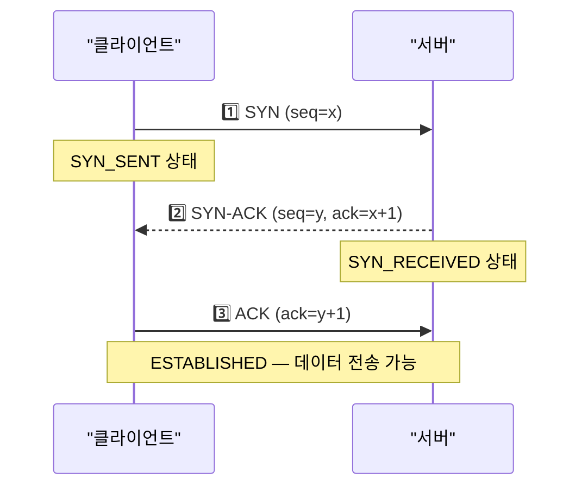
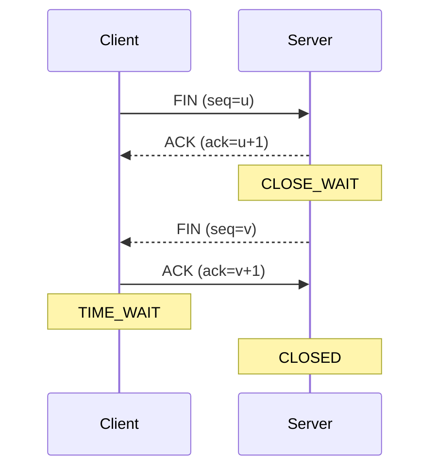
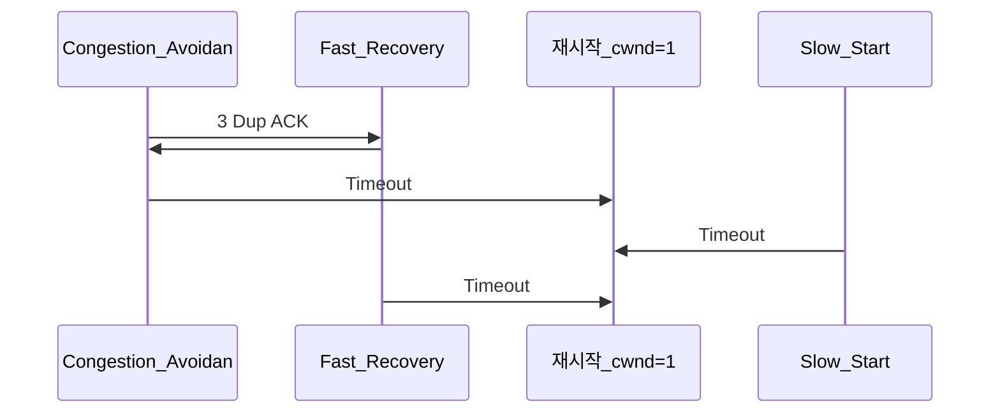
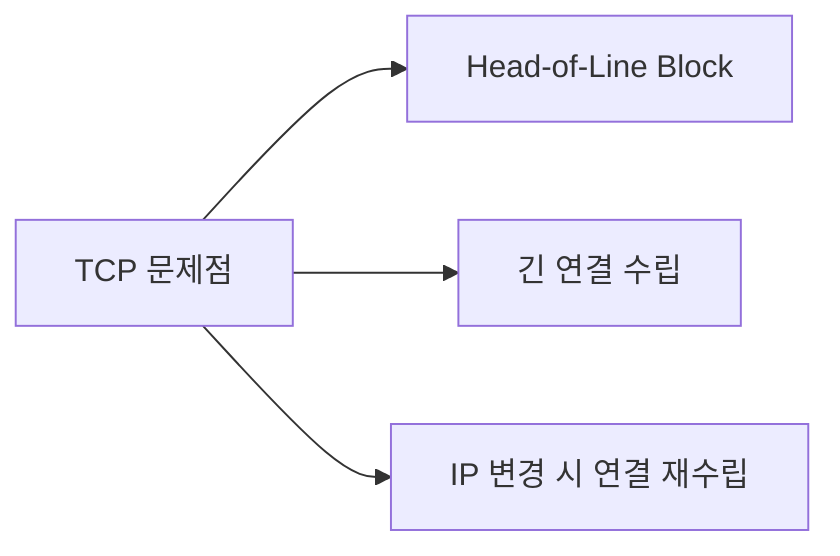
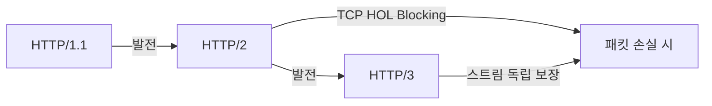

TCP와 UDP는 인터넷의 두 가지 핵심 전송 계층 프로토콜이다. TCP는 신뢰성을 최우선으로 설계됐고, UDP는 속도를 최우선으로 설계됐다. 두 프로토콜의 내부 메커니즘을 이해하면 어떤 상황에 무엇을 선택해야 하는지, 그리고 네트워크 문제가 발생했을 때 원인이 어디에 있는지 정확히 파악할 수 있다.

> **비유:** TCP는 등기 우편이다. 발송 전 수신자 확인, 분실 시 재발송, 순서 보장, 수신 확인증까지 전부 챙긴다. UDP는 전단지 배포다. 최대한 빠르게 뿌리되 받았는지 확인하지 않는다.

---

## TCP vs UDP 핵심 비교

| 항목 | TCP | UDP |
|------|-----|-----|
| 연결 | 연결 지향 (3-Way Handshake) | 비연결 (Connectionless) |
| 신뢰성 | 순서 보장, 재전송 | 보장 없음 |
| 흐름 제어 | Sliding Window | 없음 |
| 혼잡 제어 | Slow Start, AIMD | 없음 |
| 헤더 크기 | 20~60 bytes | 8 bytes |
| 속도 | 상대적으로 느림 | 빠름 |
| 용도 | HTTP, HTTPS, FTP, SSH | DNS, 게임, 스트리밍, VoIP |

### TCP 헤더 핵심 필드

```
0                   1                   2                   3
0 1 2 3 4 5 6 7 8 9 0 1 2 3 4 5 6 7 8 9 0 1 2 3 4 5 6 7 8 9 0 1
+-+-+-+-+-+-+-+-+-+-+-+-+-+-+-+-+-+-+-+-+-+-+-+-+-+-+-+-+-+-+-+-+
|          Source Port          |       Destination Port        |
+-+-+-+-+-+-+-+-+-+-+-+-+-+-+-+-+-+-+-+-+-+-+-+-+-+-+-+-+-+-+-+-+
|                        Sequence Number                        |
+-+-+-+-+-+-+-+-+-+-+-+-+-+-+-+-+-+-+-+-+-+-+-+-+-+-+-+-+-+-+-+-+
|                    Acknowledgment Number                      |
+-+-+-+-+-+-+-+-+-+-+-+-+-+-+-+-+-+-+-+-+-+-+-+-+-+-+-+-+-+-+-+-+
|  Data |           |U|A|P|R|S|F|                               |
| Offset| Reserved  |R|C|S|S|Y|I|            Window            |
|       |           |G|K|H|T|N|N|                               |
+-+-+-+-+-+-+-+-+-+-+-+-+-+-+-+-+-+-+-+-+-+-+-+-+-+-+-+-+-+-+-+-+
```

- **Sequence Number**: 전송한 데이터의 바이트 단위 순서 번호. 재조립과 중복 제거에 사용
- **Acknowledgment Number**: 다음에 받기 원하는 바이트 번호. "seq 1000까지 받았으니 1001 줘"
- **Window**: 수신 버퍼의 여유 공간. 흐름 제어의 핵심
- **SYN/ACK/FIN**: 연결 수립·종료 제어 플래그

---

## 3-Way Handshake — 연결 수립

TCP 연결을 맺는 3단계 과정이다. 단순히 "연결한다"는 의미를 넘어서, 양측의 초기 Sequence Number(ISN)를 교환하고 수신 버퍼 크기를 협상한다.

> **비유:** 전화 통화 시작과 같다. "여보세요?"(SYN) → "네, 들려요. 거기도 들려요?"(SYN-ACK) → "네, 잘 들립니다."(ACK) 3번 확인해야 비로소 대화가 시작된다.



1️⃣ **SYN**: 클라이언트가 임의의 ISN(x)을 생성해 서버에 연결 요청. 이 난수는 IP Spoofing 방지를 위해 예측 불가능하게 설계된다.

2️⃣ **SYN-ACK**: 서버가 자신의 ISN(y)을 생성하고, `ack=x+1`로 클라이언트 ISN을 확인했다는 응답 전송. 포트가 닫혀 있으면 RST를 반환한다.

3️⃣ **ACK**: 클라이언트가 `ack=y+1`로 서버 ISN 확인. 이 패킷부터 데이터를 함께 실어 보낼 수 있다(피기배킹).

### SYN Flood 공격

SYN만 대량 전송하고 ACK를 보내지 않으면 서버의 SYN 큐(Backlog)가 가득 차 정상 연결을 거부하게 된다. 방어책은 **SYN Cookie**다. 서버가 SYN 큐에 상태를 저장하지 않고, ISN을 요청 정보의 해시로 만든다. ACK가 도착했을 때 해시를 검증해 유효한 연결만 허용한다.

```bash
# Linux SYN Cookie 활성화 확인
sysctl net.ipv4.tcp_syncookies
# 1이면 활성화됨

# SYN Backlog 크기 확인
sysctl net.ipv4.tcp_max_syn_backlog
```

---

## 4-Way Termination — 연결 종료

TCP 종료는 4단계가 필요하다. 연결은 양방향이므로 각 방향을 독립적으로 닫아야 하기 때문이다.

> **비유:** 전화 끊기와 같다. "저는 할 말 다 했어요."(FIN) → "알겠어요."(ACK) → 상대방이 하던 말 마저 마친 뒤 "저도 다 했어요."(FIN) → "네, 끊을게요."(ACK) 4번이 필요하다.



### TIME_WAIT — 왜 2MSL을 기다리는가

클라이언트가 마지막 ACK를 보낸 후 즉시 종료하지 않고 `2 * MSL(Maximum Segment Lifetime)` 동안 대기한다. 리눅스 기본값은 60초(MSL=30초)다.

**이유 1**: 마지막 ACK가 유실됐을 때 서버가 FIN을 재전송한다. 클라이언트가 이미 종료됐다면 RST를 보내 서버가 비정상 종료한다. TIME_WAIT 동안 대기하면 재전송된 FIN에 ACK를 다시 보낼 수 있다.

**이유 2**: 네트워크에 아직 떠돌고 있는 이전 연결의 패킷이 새 연결에 혼입되는 것을 방지한다. 2MSL 후면 이전 패킷은 네트워크에서 사라진다.

### TIME_WAIT 과다 문제

서버가 Active Close를 주도하는 경우(예: HTTP Keep-Alive 만료 후 서버 측 종료), TIME_WAIT 소켓이 대량 쌓인다. 로컬 포트는 유한하므로 새 연결을 맺지 못하는 상황이 발생한다.

```bash
# TIME_WAIT 소켓 수 확인
ss -s | grep TIME-WAIT
netstat -an | grep TIME_WAIT | wc -l

# TIME_WAIT 재사용 허용 (클라이언트측 포트 재사용)
sysctl net.ipv4.tcp_tw_reuse   # 1로 설정 권장 (아웃바운드만)

# TIME_WAIT 최대 버킷 수
sysctl net.ipv4.tcp_max_tw_buckets
```

---

## 흐름 제어 — Sliding Window

흐름 제어는 **수신자**가 처리할 수 있는 속도보다 빠르게 송신자가 데이터를 보내지 않도록 조절하는 메커니즘이다.

> **비유:** 음식점에서 요리사가 주문을 받는 상황이다. 손님이 10개 메뉴를 한꺼번에 시켜도 주방이 3개밖에 처리 못하면 주방이 터진다. Sliding Window는 주방 용량을 손님에게 실시간으로 알려주는 시스템이다.

### 수신 윈도우 (rwnd)

수신자는 TCP 헤더의 Window 필드에 자신의 수신 버퍼 여유 공간을 실어 ACK와 함께 전송한다. 송신자는 이 값을 초과해서 전송하지 않는다.


- **윈도우 크기 0**: 수신 버퍼가 꽉 찬 상태. 송신자는 전송을 멈추고 주기적으로 Window Probe를 보내 버퍼 상황을 확인한다.
- **Window Scale Option**: TCP 헤더의 Window 필드는 16비트(최대 65535 bytes)다. 고속 네트워크에서는 이것이 병목이 돼 Window Scale 옵션으로 최대 1GB까지 확장한다. 3-Way Handshake 때 협상한다.

### Zero Window 교착 방지

수신자가 Window=0을 알린 후, Window가 커졌을 때 보내는 ACK가 유실되면 양측이 서로 기다리는 교착 상태에 빠진다. TCP는 이를 **Persist Timer**로 해결한다. 송신자가 주기적으로 1 byte짜리 Window Probe를 전송해 수신자의 현재 Window 크기를 확인한다.

---

## 혼잡 제어 — 네트워크 병목 대응

혼잡 제어는 **네트워크 중간 경로**가 처리할 수 있는 양보다 많은 데이터가 유입되지 않도록 조절하는 메커니즘이다. 흐름 제어가 수신자 보호라면, 혼잡 제어는 네트워크 전체 보호다.

> **비유:** 고속도로 진입 램프의 신호등과 같다. 고속도로가 막히기 시작하면 진입 신호를 느리게 바꿔 차량 유입을 줄인다. 상황이 호전되면 다시 진입 속도를 올린다.

핵심 변수: **cwnd(Congestion Window)**. 송신자가 ACK 없이 보낼 수 있는 최대 데이터량. 실제 전송량 = min(cwnd, rwnd).

### Slow Start — 지수 증가

연결 초기에는 네트워크 상태를 모른다. cwnd를 1 MSS(Maximum Segment Size, 보통 1460 bytes)에서 시작해 ACK를 받을 때마다 1 MSS씩 늘린다. ACK마다 증가하므로 RTT당 2배씩 늘어나는 지수 성장이다.

```
RTT 1: cwnd = 1 MSS  → 1개 전송 → 1 ACK → cwnd = 2
RTT 2: cwnd = 2 MSS  → 2개 전송 → 2 ACK → cwnd = 4
RTT 3: cwnd = 4 MSS  → 4개 전송 → 4 ACK → cwnd = 8
...
```

**ssthresh(Slow Start Threshold)** 에 도달하면 Congestion Avoidance 단계로 전환한다. 초기 ssthresh는 보통 65535 bytes(64KB)다.

### Congestion Avoidance — 선형 증가 (AIMD)

ssthresh 이후에는 RTT당 1 MSS씩만 증가한다(AI: Additive Increase). 패킷 손실이 감지되면 cwnd를 절반으로 줄인다(MD: Multiplicative Decrease).

```
AIMD 규칙:
- 혼잡 없으면: cwnd += 1 MSS (per RTT)
- 타임아웃 손실: cwnd = 1, ssthresh = cwnd/2 (Slow Start 재시작)
- 3 중복 ACK: ssthresh = cwnd/2, cwnd = ssthresh (Fast Recovery)
```



### Fast Retransmit — 타임아웃 전 재전송

수신자가 순서에 맞지 않는 세그먼트를 받으면 이전에 기대하던 seq를 계속 ACK로 보낸다. 송신자가 **동일한 ACK를 3번** 받으면 해당 세그먼트가 유실됐다고 판단하고 타임아웃을 기다리지 않고 즉시 재전송한다.

> **비유:** "3번 답장 주소록 7번을 계속 요구하면, 편지가 중간에 분실됐다는 뜻이다. 타임아웃을 기다리지 않고 바로 7번부터 재발송한다."

### Fast Recovery — 절반 감소 후 회복

Fast Retransmit 이후 cwnd를 1로 떨어뜨리면 너무 가혹하다. Fast Recovery는 cwnd를 ssthresh(= 이전 cwnd의 절반)로만 줄이고 Congestion Avoidance부터 재개한다. Slow Start를 다시 거치지 않아 회복이 빠르다.

### TCP Reno vs CUBIC

| 알고리즘 | 특징 | 기본 OS |
|---------|------|---------|
| Reno | AIMD 원형. 손실 시 cwnd/2 | 구형 시스템 |
| CUBIC | 손실 이전 최대 cwnd를 목표점으로 3차 함수로 빠르게 회복 | Linux 기본 |
| BBR | 손실 대신 RTT와 대역폭을 직접 측정해 혼잡 예측 | Google, YouTube |

```bash
# 현재 혼잡 제어 알고리즘 확인
sysctl net.ipv4.tcp_congestion_control

# CUBIC / BBR 등 사용 가능한 알고리즘 목록
sysctl net.ipv4.tcp_available_congestion_control

# BBR로 변경
sysctl -w net.ipv4.tcp_congestion_control=bbr
```

---

## Nagle 알고리즘과 Delayed ACK

### Nagle 알고리즘 — 작은 패킷 모아 전송

TCP는 기본적으로 작은 데이터도 헤더(최소 40 bytes)를 붙여 전송한다. 1 byte 데이터에 40 bytes 헤더라면 효율이 2.4%밖에 안 된다. Nagle 알고리즘은 **이미 전송 중인 ACK 미확인 데이터가 있으면, 새 데이터를 MSS만큼 모이거나 ACK가 올 때까지 버퍼링**한다.

```
Nagle 전송 조건 (둘 중 하나):
1. 버퍼의 데이터가 MSS 이상이면 즉시 전송
2. 미확인 전송 데이터가 없으면 즉시 전송
   → 두 조건 모두 아니면 대기
```

### Delayed ACK — ACK를 모아서 전송

수신자가 패킷을 받을 때마다 즉시 ACK를 보내면 작은 ACK 패킷이 과도하게 발생한다. Delayed ACK는 **최대 200ms 동안 대기**했다가 ACK를 한꺼번에 전송하거나, 전송할 데이터가 있으면 데이터와 ACK를 함께 보낸다(피기배킹).

### Nagle + Delayed ACK 상호작용 문제

두 알고리즘이 동시에 동작하면 최대 200ms 지연이 발생한다.

1️⃣ 클라이언트가 요청 헤더를 두 패킷으로 분리해서 전송 (첫 번째는 MSS, 나머지는 작은 크기)

2️⃣ 나머지 작은 패킷은 Nagle에 의해 버퍼링 (이전 ACK 미수신)

3️⃣ 서버는 Delayed ACK로 200ms 기다림

4️⃣ 200ms 후 서버가 ACK 전송 → 클라이언트의 작은 패킷 전송 → 서버 처리

**해결책**: 소켓 옵션 `TCP_NODELAY`로 Nagle 비활성화. 지연 허용 불가 애플리케이션(SSH 키 입력, 게임 입력, 금융 주문)에서 사용한다.

```java
// Java: TCP_NODELAY 설정
Socket socket = new Socket();
socket.setTcpNoDelay(true);  // Nagle 비활성화

// ServerSocket에서
ServerSocket server = new ServerSocket(8080);
Socket client = server.accept();
client.setTcpNoDelay(true);
```

```go
// Go: TCP_NODELAY 설정
conn, err := net.Dial("tcp", "server:8080")
tcpConn := conn.(*net.TCPConn)
tcpConn.SetNoDelay(true)  // Nagle 비활성화
```

---

## TCP Keepalive vs HTTP Keepalive

이름이 비슷하지만 동작 계층과 목적이 완전히 다르다.

| 항목 | TCP Keepalive | HTTP Keepalive |
|------|--------------|----------------|
| 계층 | L4 (전송 계층) | L7 (응용 계층) |
| 목적 | 유휴 연결의 생존 확인 | HTTP 연결 재사용으로 성능 향상 |
| 기본값 | 비활성 (OS 기본 2시간) | HTTP/1.1 기본 활성 |
| 작동 방식 | OS가 빈 탐침 패킷 전송 | 하나의 TCP 연결로 여러 HTTP 요청 처리 |

### TCP Keepalive 상세

네트워크 장비(NAT, 방화벽)는 유휴 TCP 연결을 일정 시간 후 제거한다. 애플리케이션이 이를 모르고 연결이 살아있다고 가정하면 다음 데이터 전송 시 에러가 발생한다. TCP Keepalive는 OS가 주기적으로 탐침을 보내 연결 유지 여부를 확인한다.

```bash
# Linux TCP Keepalive 파라미터
sysctl net.ipv4.tcp_keepalive_time     # 유휴 후 첫 탐침까지 대기 (기본 7200초)
sysctl net.ipv4.tcp_keepalive_intvl    # 탐침 간격 (기본 75초)
sysctl net.ipv4.tcp_keepalive_probes   # 탐침 횟수 (기본 9번)
# → 기본값: 7200 + 75*9 = 7875초 후 연결 종료 판정
```

### HTTP Keepalive (Persistent Connection)

HTTP/1.0은 요청마다 TCP 연결을 새로 맺었다. 3-Way Handshake 비용이 매번 발생했다. HTTP/1.1부터는 기본으로 `Connection: keep-alive`가 활성화돼 하나의 TCP 연결로 여러 HTTP 요청을 처리한다.

```
HTTP/1.0 (기본):  TCP연결 → GET / → 응답 → TCP종료 → TCP연결 → GET /style.css → ...
HTTP/1.1 (기본):  TCP연결 → GET / → GET /style.css → GET /app.js → ... → TCP종료
```

Nginx 설정 예시:

```nginx
http {
    keepalive_timeout  65;      # 65초 유휴 후 연결 종료
    keepalive_requests 1000;    # 최대 1000개 요청 후 연결 종료
}
```

---

## UDP와 적합 케이스

UDP는 신뢰성 메커니즘이 없는 대신 오버헤드가 극도로 낮다. 헤더가 8 bytes뿐이고, 연결 수립도 없으며, 재전송도 없다.

> **비유:** 라디오 방송과 같다. 방송국은 신호를 보내고, 수신자가 잘 들었는지 확인하지 않는다. 일부 청취자가 잡음으로 못 들어도 방송은 계속된다. 핵심은 중단 없는 실시간성이다.

### UDP가 유리한 3가지 케이스

**1. 온라인 게임 — 실시간 입력 전송**

플레이어 위치, 마우스 클릭, 키 입력은 최신 상태만 의미 있다. 100ms 전 위치 패킷이 재전송되면 오히려 역효과다. 손실된 패킷은 버리고 최신 상태만 반영한다. 신뢰성이 필요한 채팅, 아이템 획득 이벤트는 TCP로 별도 채널을 쓴다.

**2. 스트리밍 — 연속적 미디어 전송**

동영상 스트리밍에서 하나의 프레임 손실은 화면 깜빡임이지만, 재전송으로 버퍼가 지연되면 재생이 멈춘다. 손실보다 지연이 더 나쁘다. RTP(Real-time Transport Protocol)는 UDP 위에서 동작하며 타임스탬프와 순서 번호로 A/V 동기화를 처리한다.

**3. DNS — 단발성 쿼리**

DNS 응답은 수백 bytes 이하다. TCP 연결 수립 비용(1~2 RTT)이 응답 자체보다 크다. 타임아웃 후 재쿼리하는 것이 TCP 재전송보다 빠르다. 단, 응답이 512 bytes를 초과하면 TCP fallback을 사용한다(DNSSEC 응답, Zone Transfer 등).

---

## QUIC — HTTP/3의 전송 계층

QUIC(Quick UDP Internet Connections)은 Google이 개발하고 IETF가 표준화한 프로토콜이다. UDP 위에서 TCP의 신뢰성을 구현하면서 TCP의 고질적 문제들을 해결했다.

> **비유:** 낡은 국도(TCP) 대신 새로 닦은 고속도로(QUIC)다. 같은 출발지에서 같은 목적지를 가지만, 터널(암호화)이 기본으로 내장되어 있고, 차선이 막혀도 다른 차선이 영향받지 않는다.

### TCP가 가진 문제들



### QUIC의 해결책

1️⃣ **0-RTT / 1-RTT 연결 수립**: TLS 1.3을 내장해 최초 연결 시 1-RTT, 재연결 시 0-RTT(이전 세션 키 재사용)로 데이터 전송 시작이 가능하다.

2️⃣ **독립 스트림**: HTTP/2도 멀티플렉싱을 지원하지만 TCP 위에서 동작하므로 하나의 패킷 손실이 모든 스트림을 블로킹한다(TCP Head-of-Line Blocking). QUIC는 스트림별로 독립적인 순서 보장을 구현해 다른 스트림에 영향을 주지 않는다.

3️⃣ **Connection Migration**: 연결 식별자로 IP+포트 대신 **Connection ID**를 사용한다. 모바일이 LTE에서 WiFi로 전환돼 IP가 바뀌어도 연결이 유지된다.



4️⃣ **암호화 기본 내장**: QUIC 페이로드는 항상 TLS 1.3으로 암호화된다. 헤더 일부도 암호화해 중간 장비의 패킷 조작을 방지한다.

```bash
# curl로 HTTP/3 사용
curl --http3 https://www.cloudflare.com

# 연결 프로토콜 확인
curl -v --http3 https://example.com 2>&1 | grep "^* "
```

---

## 극한 시나리오

### 시나리오 1: 온라인 게임 10만 동접 서버

**문제**: 10만 클라이언트가 초당 30회 위치 데이터를 전송. 초당 300만 패킷. TCP로 구성 시 발생하는 상황을 분석해본다.

TCP 사용 시:
- 10만 개 TCP 연결 = 파일 디스크립터 10만 개 필요 (`ulimit -n` 상향 필수)
- Nagle 알고리즘으로 30ms~200ms 지연 발생 → TCP_NODELAY 필수
- 패킷 손실 시 재전송 대기 → 게임 클라이언트 프리징
- 서버 재시작 시 10만 연결 재수립 = 대규모 SYN 폭풍

UDP 사용 시 (게임 업계 표준):
- 손실된 위치 패킷은 버리고 다음 패킷으로 보완
- 아이템 드롭, 채팅은 별도 TCP 채널 또는 UDP ARQ(선택적 재전송)
- 서버 이중화 시 UDP Anycast로 부하 분산

```bash
# 서버 소켓 수 제한 확인 (10만 연결 허용 설정)
ulimit -n 200000

# 커널 파라미터: 로컬 포트 범위 확장
sysctl net.ipv4.ip_local_port_range  # 기본 32768~60999 → 1024~65535로 확장
sysctl -w net.ipv4.ip_local_port_range="1024 65535"

# TIME_WAIT 소켓이 포트를 과점유하지 않도록
sysctl -w net.ipv4.tcp_tw_reuse=1
```

### 시나리오 2: 라이브 스트리밍 버퍼링 급증

**현상**: 시청자 100만 명 동시 접속 이벤트에서 버퍼링 급증.

**원인 분석**:

1️⃣ CDN 엣지 → 오리진 서버 간 대역폭 포화 → TCP 혼잡 제어 발동 → cwnd 감소 → 처리량 급감

2️⃣ 세그먼트 하나 손실 → 재전송 대기 1~3 RTT → 플레이어 버퍼 소진 → 버퍼링

3️⃣ CUBIC 혼잡 제어가 손실 감지 후 cwnd/2 → 회복까지 수십 초

**해결책**:
- TCP → QUIC/HLS over QUIC: 스트림별 독립 손실 처리
- BBR 혼잡 제어: 손실 대신 RTT 기반 예측으로 드라마틱한 cwnd 감소 방지
- ABR(Adaptive Bitrate): 네트워크 상태에 따라 화질 자동 조정 (버퍼링보다 화질 저하 선호)

```bash
# YouTube, Netflix가 BBR을 선호하는 이유 확인
# BBR은 패킷 손실이 아닌 병목 대역폭(BtlBw)과 RTprop을 직접 측정
sysctl -w net.ipv4.tcp_congestion_control=bbr
```

### 시나리오 3: 갑작스러운 TCP 연결 불가 — "Connection Refused"

```bash
# 1. 서버 포트가 열려있는지 확인
ss -tlnp | grep :8080
netstat -tlnp | grep :8080

# 2. 방화벽 확인
iptables -L INPUT -n | grep 8080

# 3. 연결 상태 분포 확인 (SYN_RECV 과다 = SYN Flood 의심)
ss -s
netstat -an | awk '/tcp/ {print $6}' | sort | uniq -c | sort -rn

# 4. 소켓 버퍼 소진 확인 (Accept Queue Full)
ss -lnt | grep :8080
# Recv-Q 값이 Send-Q(Backlog)와 같으면 Accept Queue 포화
```

---

## 면접 포인트

**Q1. 3-Way Handshake가 왜 3번인가? 2번으로 줄일 수 없는가?**

2번(SYN + SYN-ACK)만으로는 클라이언트의 수신 능력이 확인되지 않는다. 서버 → 클라이언트 방향 ISN에 대한 ACK가 없으면 서버는 자신의 ISN이 클라이언트에 도달했는지 알 수 없다. 4번은 SYN-ACK를 분리할 필요가 없어 불필요하다.

**Q2. 혼잡 제어와 흐름 제어의 차이는?**

흐름 제어는 수신자의 처리 속도에 맞추는 것 (rwnd 기반, 수신자가 결정). 혼잡 제어는 네트워크 경로의 용량에 맞추는 것 (cwnd 기반, 송신자가 네트워크 상태를 추론). 실제 전송량은 `min(cwnd, rwnd)`다.

**Q3. TIME_WAIT의 목적은?**

두 가지다. 첫째, 마지막 ACK 유실 시 서버의 FIN 재전송에 응답하기 위해. 둘째, 이전 연결의 지연 패킷이 새 연결에 혼입되는 것을 방지하기 위해 (2MSL = 네트워크 내 모든 패킷의 최대 생존 시간).

**Q4. UDP를 선택해야 하는 기준은?**

지연 민감성이 손실 민감성보다 높을 때. 최신 상태만 의미 있어 재전송이 역효과일 때(게임 위치). 단발성 쿼리라 연결 비용이 데이터보다 클 때(DNS). 애플리케이션 레이어에서 직접 신뢰성을 구현하고 싶을 때(QUIC, WebRTC).

**Q5. QUIC이 UDP 위에 있는데 왜 TCP보다 신뢰성이 떨어지지 않는가?**

QUIC이 애플리케이션 레이어에서 TCP가 커널에서 제공하는 순서 보장, 재전송, 흐름 제어를 직접 구현하기 때문이다. 대신 커널 TCP 스택의 제약(Head-of-Line Blocking, 느린 핸드셰이크)을 받지 않아 더 유연하게 최적화할 수 있다.

**Q6. Nagle 알고리즘을 언제 끄는가?**

실시간 대화형 애플리케이션에서 반드시 끈다. SSH 터미널(키 입력마다 즉시 전송), 게임 클라이언트(입력 지연 최소화), 금융 주문 시스템(주문 지연 = 손실). 반대로 대용량 파일 전송은 Nagle을 켜두는 것이 네트워크 효율에 유리하다.

---

## 실무 실수 모음

**실수 1**: HTTP/1.1 서버에서 Keepalive 타임아웃을 너무 길게 설정해 연결이 쌓여 서버 소켓 고갈. `keepalive_timeout 65` 이하로 설정하고 `keepalive_requests`로 최대 요청 수도 제한한다.

**실수 2**: TCP_NODELAY 없이 소규모 패킷을 연속 전송하는 프로토콜 설계. Nagle + Delayed ACK 조합으로 200ms 지연이 누적돼 응답 시간이 급격히 증가한다.

**실수 3**: 로드밸런서 앞에서 TCP Keepalive를 설정하지 않아 로드밸런서의 유휴 연결 타임아웃(보통 60초)으로 연결이 조용히 끊김. 애플리케이션은 연결이 살아있다고 믿고 요청을 보내다가 에러가 발생한다.

**실수 4**: 서버가 Active Close를 주도하는 설계에서 TIME_WAIT 폭발. HTTP 서버가 Connection: close로 응답하면 서버 쪽에 TIME_WAIT이 쌓인다. 클라이언트(로드밸런서)가 Close를 주도하도록 설계하거나 `tcp_tw_reuse=1`로 대응한다.

**실수 5**: 혼잡 제어 알고리즘을 기본값(CUBIC)으로 방치하다가 고지연(RTT > 100ms) 국제 구간에서 처리량 저하. BBR로 교체하면 드라마틱하게 개선되는 경우가 많다.

---

## 핵심 진단 명령어

```bash
# TCP 연결 상태 요약
ss -s
netstat -an | awk '/tcp/ {print $6}' | sort | uniq -c | sort -rn

# 특정 포트 연결 확인
ss -tnp | grep :8080

# 소켓 버퍼 사용량 (Recv-Q, Send-Q)
ss -tnp

# 혼잡 제어 / keepalive 파라미터
sysctl net.ipv4.tcp_congestion_control
sysctl net.ipv4.tcp_keepalive_time

# 실시간 TCP 재전송 확인
netstat -s | grep retransmit
cat /proc/net/snmp | grep Tcp

# 패킷 캡처 (3-Way Handshake 확인)
tcpdump -i eth0 'tcp[tcpflags] & (tcp-syn|tcp-fin) != 0'
tcpdump -i eth0 port 8080 -w capture.pcap
```

---

## 실무에서 자주 하는 실수

1. **TIME_WAIT 상태 소켓 고갈** — 짧은 연결을 대량으로 생성하는 서비스에서 TIME_WAIT 소켓이 수만 개 쌓여 포트가 고갈된다. `SO_REUSEADDR` 옵션이나 `net.ipv4.tcp_tw_reuse=1` 커널 파라미터를 적용하고, 가능하면 커넥션을 재사용(Keep-Alive)해야 한다.

2. **TCP Keep-Alive 미설정으로 좀비 연결 방치** — 중간 방화벽이 idle 연결을 끊어도 애플리케이션이 이를 감지하지 못해 죽은 연결에 계속 쓰기를 시도한다. `SO_KEEPALIVE`와 `tcp_keepalive_time`을 설정해 좀비 연결을 주기적으로 감지해야 한다.

3. **UDP 수신 버퍼 크기 미조정으로 패킷 유실** — 고속 UDP 스트림에서 수신 버퍼가 작으면 OS가 패킷을 드롭한다. `/proc/sys/net/core/rmem_max`와 `SO_RCVBUF`를 충분히 키워야 한다.

4. **Nagle 알고리즘이 켜진 채로 실시간 통신 구현** — TCP는 기본적으로 작은 패킷을 모아 보내는 Nagle 알고리즘을 적용한다. 게임, 채팅처럼 즉각 전송이 필요한 경우 `TCP_NODELAY` 옵션으로 Nagle을 비활성화해야 한다.

5. **SYN Flood 방어 없이 공개 서버 운영** — 악의적인 클라이언트가 SYN 패킷만 보내 서버의 연결 대기 큐를 소진시킨다. `net.ipv4.tcp_syncookies=1`로 SYN Cookie를 활성화하고, iptables나 클라우드 WAF로 비정상 SYN을 차단해야 한다.
