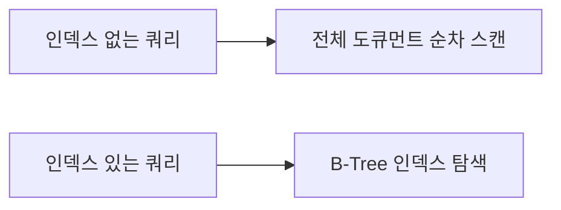
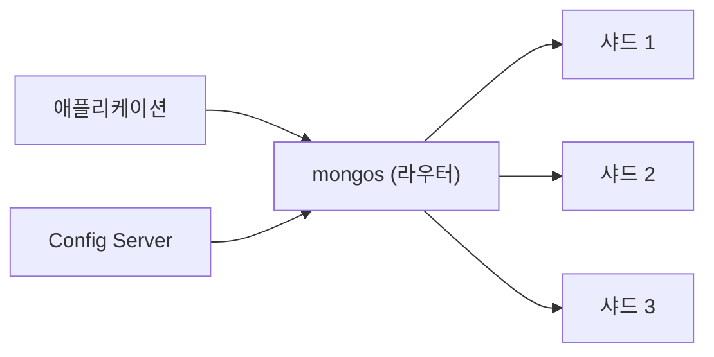

사용자 프로필 페이지를 만든다고 하자. MySQL이라면 users, addresses, hobbies, orders 테이블을 JOIN해야 한다. MongoDB라면 쿼리 한 번으로 끝난다. 그런데 MySQL 개발자가 MongoDB를 처음 쓰면 가장 많이 하는 실수가 있다. **모든 것을 임베딩하거나, 모든 것을 참조하거나.** MongoDB의 설계 철학은 "어떻게 조회할 것인가"를 먼저 묻는 것이다.

## MongoDB와 RDBMS의 근본적 차이

> **비유**: RDBMS는 엄격한 파일 캐비닛이다. 모든 서류가 정해진 양식에 맞아야 한다. MongoDB는 자유로운 서랍장이다. 서류든 사진이든 영수증이든 같은 서랍에 넣을 수 있고, 각 항목의 형태가 달라도 된다.

```mermaid
graph LR
    DB1["MongoDB DB"] --> Col["Collection"]
    Col --> Doc["Document"]
    DB2["RDBMS DB"] --> Table["테이블"]
    Table --> Row["행 Row"]
    DB1 <-->|대응| DB2
    Col <-->|대응| Table
    Doc <..|대응| Row
```

```json
// MongoDB: 사용자 한 도큐먼트에 모든 정보
{
  "_id": ObjectId("507f1f77bcf86cd799439011"),
  "username": "kimdev",
  "address": { "city": "서울", "zipCode": "06234" },
  "hobbies": ["코딩", "독서"],
  "orders": [
    { "orderId": "ORD-001", "product": "MacBook", "amount": 3000000 }
  ]
}
```

```sql
-- RDBMS: 같은 데이터를 얻으려면 4개 테이블 JOIN
SELECT u.*, a.*, h.hobby, o.*
FROM users u
JOIN addresses a ON u.id = a.user_id
JOIN user_hobbies h ON u.id = h.user_id
JOIN orders o ON u.id = o.user_id
WHERE u.username = 'kimdev';
```

**MongoDB를 쓰면 안 되는 경우**: 복잡한 트랜잭션이 많은 금융 시스템, 강한 ACID 보장이 필요한 경우. MongoDB 4.0+에서 멀티 도큐먼트 트랜잭션을 지원하지만 성능 오버헤드가 있다.

---

## CRUD 기본 조작

### Insert

```javascript
// 단일 삽입
db.users.insertOne({
  username: "kimdev",
  email: "kim@example.com",
  age: 28,
  createdAt: new Date()
});

// 다중 삽입
db.users.insertMany([
  { username: "lee", email: "lee@example.com", age: 30 },
  { username: "park", email: "park@example.com", age: 25 }
]);
```

### Find — 점 표기법으로 중첩 접근

```javascript
// 기본 조회
db.users.find({ age: { $gte: 25, $lte: 35 } })

// 중첩 도큐먼트 조회 — 점 표기법
db.users.find({ "address.city": "서울" })

// 배열 안에 값 포함 여부
db.users.find({ hobbies: "코딩" })                       // "코딩" 포함
db.users.find({ hobbies: { $in: ["코딩", "독서"] } })   // 하나라도 포함

// 프로젝션: 필요한 필드만 반환
db.users.find(
  { isActive: true },
  { username: 1, email: 1, _id: 0 }   // 1=포함, 0=제외
)

// 정렬 + 페이지네이션
db.users.find().sort({ age: -1 }).skip(20).limit(10)
```

### Update — $set, $inc, $push

```javascript
// 특정 필드만 업데이트 ($set 없으면 문서 전체가 교체됨!)
db.users.updateOne(
  { username: "kimdev" },
  { $set: { age: 29, updatedAt: new Date() } }
)

// 숫자 증감
db.products.updateOne(
  { _id: ObjectId("...") },
  { $inc: { stock: -1, viewCount: 1 } }  // stock 1 감소, viewCount 1 증가
)

// 배열 조작
db.users.updateOne({ username: "kimdev" }, { $push: { hobbies: "요리" } })
db.users.updateOne({ username: "kimdev" }, { $pull: { hobbies: "등산" } })

// Upsert: 없으면 삽입, 있으면 업데이트
db.users.updateOne(
  { email: "new@example.com" },
  { $set: { username: "newuser" } },
  { upsert: true }
)
```

`$set` 없이 updateOne을 쓰면 도큐먼트 전체가 교체된다. 이 실수로 필드가 모두 사라지는 사고가 자주 발생한다.

---

## 스키마 설계 — 임베딩 vs 참조

MongoDB 설계의 핵심 질문: **"이 데이터를 어떻게 조회할 것인가?"**

```mermaid
graph LR
    Q{"함께 Get하는가?<br>독립.."}
    Q -->|"항상 함께 조회\n1:少"| Embed["임베딩"]
  ..|"독립적 업데이트 필요\n1:多"| Ref["참조"]
```

### 임베딩 — "항상 함께 조회"

```javascript
// 블로그 포스트와 댓글 — 항상 같이 조회
{
  "_id": ObjectId("..."),
  "title": "MongoDB 완벽 가이드",
  "content": "...",
  "author": {
    "userId": ObjectId("..."),
    "username": "kimdev"   // 중복이지만 조회 성능 우선
  },
  "comments": [
    { "userId": ObjectId("..."), "text": "좋은 글!", "createdAt": ISODate("...") }
  ]
}
```

**장점**: 단일 쿼리로 완결. 원자적 업데이트.
**단점**: 댓글이 수천 개라면 도큐먼트가 너무 커진다. MongoDB 도큐먼트 최대 크기는 16MB.

### 참조 — "독립적으로 관리"

```javascript
// 주문과 상품 — 상품 가격은 독립적으로 변함
// orders 컬렉션
{
  "_id": ObjectId("order001"),
  "userId": ObjectId("user001"),
  "items": [
    {
      "productId": ObjectId("prod001"),
      "quantity": 2,
      "priceAtOrder": 50000   // 주문 당시 가격 저장 (상품 가격 변경에 무관)
    }
  ],
  "status": "PAID"
}

// products 컬렉션 (독립)
{
  "_id": ObjectId("prod001"),
  "name": "MacBook Pro",
  "price": 52000   // 나중에 52000으로 변해도 주문 기록은 50000
}
```

**`priceAtOrder`를 왜 따로 저장하는가?** 나중에 상품 가격이 바뀌어도 과거 주문 금액은 변하면 안 된다. 참조만 저장하면 가격이 소급 적용된다.

---

## 인덱스 — 없으면 풀 스캔



```javascript
// 단일 필드 인덱스
db.users.createIndex({ email: 1 }, { unique: true })

// 복합 인덱스 (순서 중요: ESR 규칙)
// E(Equality) → S(Sort) → R(Range)
db.orders.createIndex({ userId: 1, status: 1, createdAt: -1 })
// userId로 필터, status로 필터, createdAt으로 정렬하는 쿼리에 최적

// TTL 인덱스 — 일정 시간 후 자동 삭제
db.sessions.createIndex(
  { createdAt: 1 },
  { expireAfterSeconds: 3600 }   // 1시간 후 자동 삭제
)

// 텍스트 인덱스 — 전문 검색 (한국어는 별도 설정 필요)
db.posts.createIndex(
  { title: "text", content: "text" },
  { weights: { title: 10, content: 1 } }  // 제목에 10배 가중치
)

// 인덱스 성능 분석
db.users.find({ age: { $gte: 25 } }).explain("executionStats")
// → totalDocsExamined vs totalDocsReturned 비율 확인
```

**ESR 규칙**: 복합 인덱스 순서는 `Equality(동등) → Sort(정렬) → Range(범위)`. 이 순서가 틀리면 인덱스가 있어도 느리다.

---

## 집계 파이프라인 (Aggregation Pipeline)

> **비유**: 공장 컨베이어 벨트와 같다. 원자재(도큐먼트)가 각 스테이션($match, $group, $sort)을 순서대로 거치면서 원하는 형태로 가공된다.


```javascript
// 카테고리별 월간 매출 분석
db.orders.aggregate([
  // 1. 완료된 1월 주문만 필터
  { $match: { status: "DELIVERED", createdAt: { $gte: ISODate("2024-01-01"), $lt: ISODate("2024-02-01") } } },

  // 2. 배열 items를 개별 도큐먼트로 분해
  { $unwind: "$items" },

  // 3. 카테고리별 집계
  { $group: {
      _id: "$items.category",
      totalRevenue: { $sum: { $multiply: ["$items.price", "$items.quantity"] } },
      orderCount: { $sum: 1 }
  }},

  // 4. 매출 내림차순 정렬
  { $sort: { totalRevenue: -1 } },

  // 5. 상위 10개
  { $limit: 10 }
])
```

---

## Replica Set — 복제와 고가용성

> **비유**: Replica Set은 중요한 문서를 여러 금고에 복사해 보관하는 것과 같다. Primary가 고장나면 Secondary 중 하나가 자동으로 Primary로 승격된다.

```mermaid
graph LR
    Client["애플리케이션"] -->|"읽기/쓰기"| P["Primary"]
  ..|"복제"| S1["Secondary 1..|"복제"| S2["Secondary 2..|"읽기 (선택)"| S1
    Client -->|"읽기 (선택)"| S2
    Note["Primary 장애 시 → Sec"]
```

```javascript
// 애플리케이션 연결 (Replica Set 주소)
const client = new MongoClient(
  "mongodb://node1:27017,node2:27017,node3:27017/?replicaSet=myReplicaSet"
);

// 읽기 분산 설정 (Secondary에서 읽기)
const collection = db.collection("users", {
  readPreference: "secondaryPreferred"  // Secondary 우선, 없으면 Primary
});
```

**왜 Replica Set이 3개 이상이어야 하는가?** Primary 선출 투표에서 과반수가 필요하다. 2개면 Primary 장애 시 1/2로 과반수 미달 → 새 Primary 선출 불가.

---

## Sharding — 수평 확장

단일 서버의 용량 한계를 넘을 때 데이터를 여러 서버에 분산한다.



**샤드 키 선택이 핵심**:

| 샤드 키 | 문제 | 결과 |
|---------|------|------|
| `createdAt` (날짜) | 새 데이터가 항상 마지막 샤드에 집중 | **핫스팟** |
| `userId` (해시) | 균등 분산 | 좋음 |
| `_id` (해시) | 균등 분산 | 좋음 |

```javascript
// 샤딩 설정
sh.enableSharding("myDatabase")
db.users.createIndex({ userId: "hashed" })  // 해시 인덱스 생성
sh.shardCollection("myDatabase.users", { userId: "hashed" })
```

샤드 키는 한 번 설정하면 변경이 매우 어렵다. 잘못된 샤드 키 선택은 특정 샤드에 데이터가 몰리는 핫스팟을 만들어 성능을 망친다.

---

## Spring Data MongoDB

```java
@Document(collection = "users")
public class User {
    @Id
    private String id;

    @Indexed(unique = true)
    private String email;

    private String username;
    private Address address;         // 임베딩
    private List<String> hobbies;    // 배열
}

public interface UserRepository extends MongoRepository<User, String> {
    // 메서드 이름으로 쿼리 자동 생성
    Optional<User> findByEmail(String email);
    List<User> findByAddressCityAndIsActiveTrue(String city);

    // 커스텀 쿼리
    @Query("{ 'age': { $gte: ?0, $lte: ?1 } }")
    List<User> findByAgeRange(int min, int max);
}
```

```java
// MongoTemplate으로 집계 파이프라인
@Service
public class OrderAnalyticsService {

    public List<CategoryRevenue> getMonthlyCategoryRevenue(YearMonth month) {
        MatchOperation match = Aggregation.match(
            Criteria.where("status").is("DELIVERED")
                    .andOperator(
                        Criteria.where("createdAt").gte(month.atDay(1).atStartOfDay()),
                        Criteria.where("createdAt").lt(month.atEndOfMonth().plusDays(1).atStartOfDay())
                    )
        );

        GroupOperation group = Aggregation.group("items.category")
            .sum("items.totalPrice").as("totalRevenue")
            .count().as("orderCount");

        SortOperation sort = Aggregation.sort(Sort.by(Sort.Direction.DESC, "totalRevenue"));

        Aggregation aggregation = Aggregation.newAggregation(match, group, sort);

        return mongoTemplate.aggregate(aggregation, "orders", CategoryRevenue.class)
                           .getMappedResults();
    }
}
```

---

## RDBMS vs MongoDB 선택 가이드

```mermaid
graph LR
    Start(["데이터 특성 분석"]) --> Q1{"스키마가 자주"}
    Q1 -->|"YES"| Q2{"복잡한 TX이"}
 ..|"NO"| RDBMS["RDBMS"]
..|"YES"| RDBMS
    Q2 -->|"NO"| Q3{"데이터가 계층적/"}..|"YES"| MongoDB["MongoD..|"NO"| RDBMS
    style MongoDB fill:#8f8,stroke:#080,color:#000
    style RDBMS fill:#88f,stroke:#00c,color:#000
```

| 상황 | MongoDB 적합 | RDBMS 적합 |
|------|-------------|-----------|
| 사용자 프로필 (다양한 필드) | O | - |
| 이커머스 카탈로그 (다양한 속성) | O | - |
| 금융 트랜잭션 | - | O |
| 복잡한 JOIN 보고서 | - | O |
| 수평 확장 필요 | O | 복잡 |

---

## 왜 MongoDB인가? (vs PostgreSQL JSONB vs Cassandra)

| 구분 | **MongoDB** | **PostgreSQL + JSONB** | **Cassandra** |
|--|-------------|------------------------|---------------|
| **문서 모델** | 네이티브 | JSON 컬럼으로 지원 | 없음(와이드컬럼) |
| **스키마 유연성** | 높음(동적) | 중간(스키마+JSON 혼용) | 낮음(컬럼 고정) |
| **트랜잭션** | 4.0+ 다중 문서 ACID | 완전 ACID | 경량 트랜잭션만 |
| **수평 확장** | 내장 샤딩 | 복잡(Citus 필요) | 네이티브, 선형 확장 |
| **JOIN/집계** | 제한적(Aggregation Pipeline) | 강력 | 매우 제한적 |
| **적합한 용도** | 콘텐츠, 카탈로그, 가변 스키마 | 구조화 데이터 + 일부 JSON | 대규모 쓰기, IoT, 시계열 |

**실무 판단**: 스키마가 자주 변하고 중첩 구조가 많으면 MongoDB. 관계형 데이터가 주인데 일부 JSON이 필요하면 PostgreSQL JSONB. 초대규모 쓰기와 단순 조회가 핵심이면 Cassandra.

---

## 실무에서 자주 하는 실수

**실수 1: 인덱스 없이 대용량 컬렉션에 쿼리**
`find({status: "active"})`를 인덱스 없이 실행한다. 컬렉션 풀스캔이 발생해 수억 건에서 수십 초가 걸린다. `explain("executionStats")`로 `COLLSCAN` 여부를 확인하고 자주 쓰는 필터 필드에 인덱스를 생성해야 한다.

**실수 2: 무제한 배열 필드 설계**
하나의 문서에 댓글, 태그, 좋아요 목록을 배열로 저장한다. 배열이 수천~수만 개로 늘어나면 문서 크기가 16MB BSON 한계에 가까워지고 업데이트마다 전체 문서를 다시 쓴다. 성장할 수 있는 배열은 별도 컬렉션으로 분리해야 한다.

**실수 3: writeConcern=0으로 운영**
응답 없이 발사하고 잊는(fire-and-forget) 쓰기는 서버 장애 시 데이터가 유실된다. 기본값 `writeConcern: {w: 1}`은 Primary 확인, `{w: "majority"}`는 레플리카 과반수 확인이다. 중요 데이터는 `{w: "majority", j: true}`(저널 포함)를 사용한다.

**실수 4: ObjectId가 아닌 자체 문자열을 _id로 사용 시 성능 저하**
UUID 문자열을 `_id`로 쓰면 ObjectId(12바이트)보다 크고 정렬이 비효율적이다. ObjectId는 타임스탬프를 포함해 삽입 시간 순서로 정렬된다. 자체 _id가 필요하면 UUID v7이나 ULID처럼 단조 증가하는 값을 사용한다.

**실수 5: Aggregation Pipeline에서 $lookup 남용**
`$lookup`(JOIN)은 MongoDB 설계 철학에 반한다. 자주 함께 조회하는 데이터는 임베딩하는 것이 MongoDB의 권장 방식이다. $lookup이 많아지면 RDBMS보다 성능이 나쁠 수 있다. $lookup은 가끔 필요한 관계에만 사용하고 핵심 쿼리 경로에서는 제거한다.

---

## 면접 포인트

**Q1. MongoDB의 스키마 설계 원칙은?**
"함께 접근하는 데이터는 함께 저장한다(embed), 독립적으로 접근하거나 크기가 무제한으로 증가하는 데이터는 분리한다(reference)." RDBMS의 정규화 원칙과 반대로 접근 패턴 중심으로 설계한다. 1:1, 1:소수(few)는 임베딩, 1:다수(many), N:M은 참조가 기본 원칙이다.

**Q2. MongoDB Replica Set의 동작 원리는?**
Primary 1개 + Secondary N개로 구성된다. 모든 쓰기는 Primary에, 읽기는 `readPreference`에 따라 Primary 또는 Secondary에서 수행한다. Primary 장애 시 Secondary들이 투표로 새 Primary를 선출한다(과반수 투표 필요 → 홀수 개 노드 권장). Arbiter는 데이터 없이 투표만 참여한다.

**Q3. WiredTiger 스토리지 엔진의 특징은?**
MongoDB 3.2+의 기본 스토리지 엔진이다. MVCC 기반으로 읽기-쓰기 충돌을 최소화한다. 문서 수준 잠금(document-level locking)으로 컬렉션 수준 잠금이었던 MMAPv1보다 동시성이 크게 향상됐다. 스내피(snappy) 압축으로 스토리지를 60~80% 줄인다.

**Q4. 언제 MongoDB 트랜잭션을 사용하는가?**
기본적으로 단일 문서 연산은 원자적이므로 트랜잭션이 불필요하다. 여러 컬렉션에 걸친 원자적 변경이 필요할 때 다중 문서 트랜잭션(4.0+)을 사용한다. 단, 트랜잭션은 성능 오버헤드가 크므로 남용하지 않는다. 트랜잭션이 자주 필요하다면 RDBMS가 더 적합한 선택일 수 있다.

**Q5. Change Stream이란?**
컬렉션, 데이터베이스, 클러스터 수준의 변경 이벤트를 실시간으로 수신하는 기능이다. 내부적으로 oplog를 기반으로 한다. CDC(Change Data Capture) 없이 MongoDB 변경을 다른 시스템에 반영하거나 이벤트 기반 아키텍처를 구현할 때 활용한다. Kafka Connect MongoDB Source Connector도 Change Stream을 기반으로 한다.
