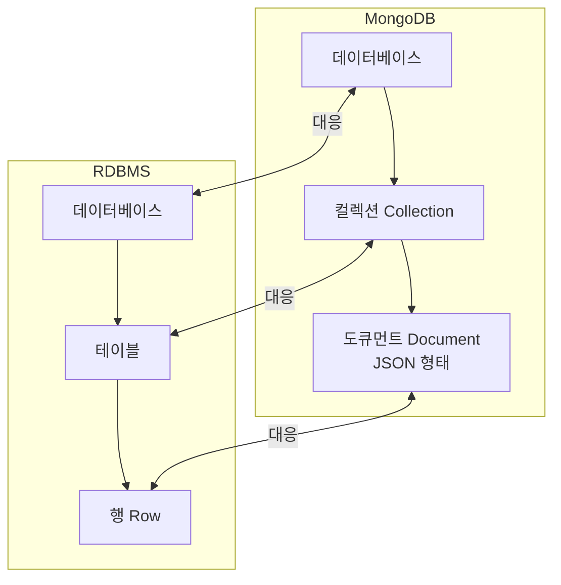
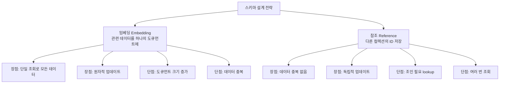
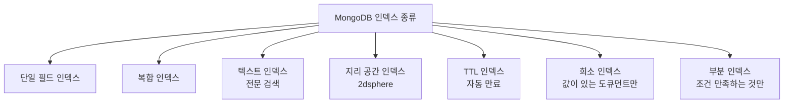
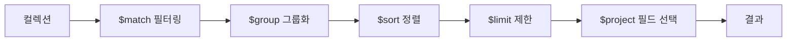
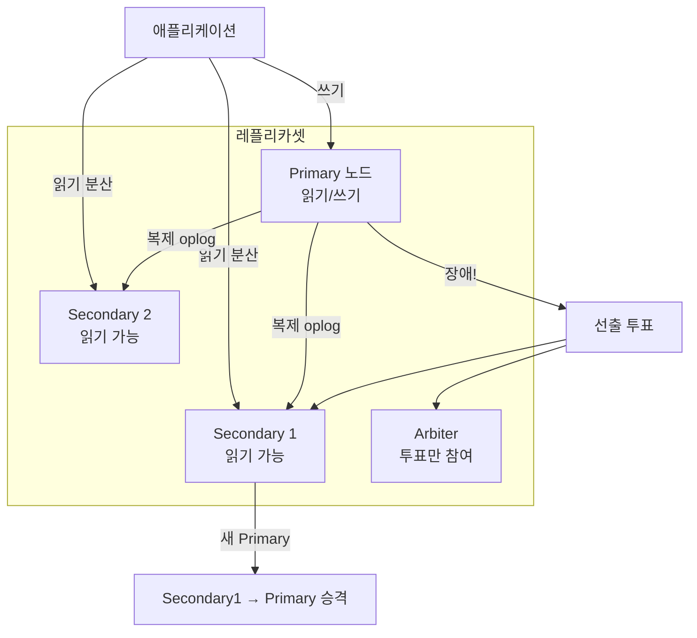
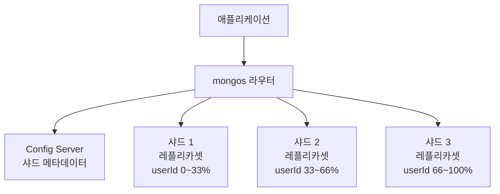
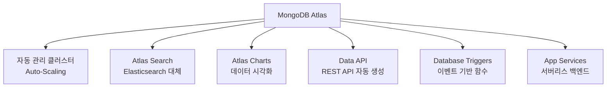
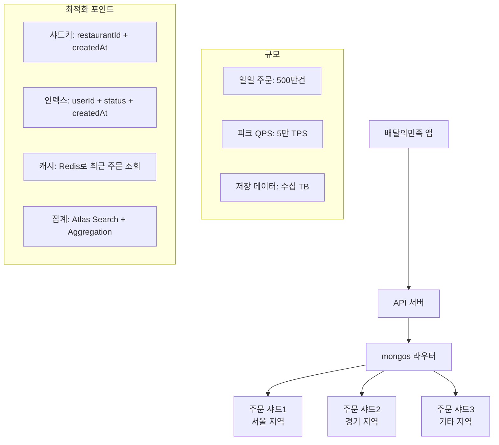
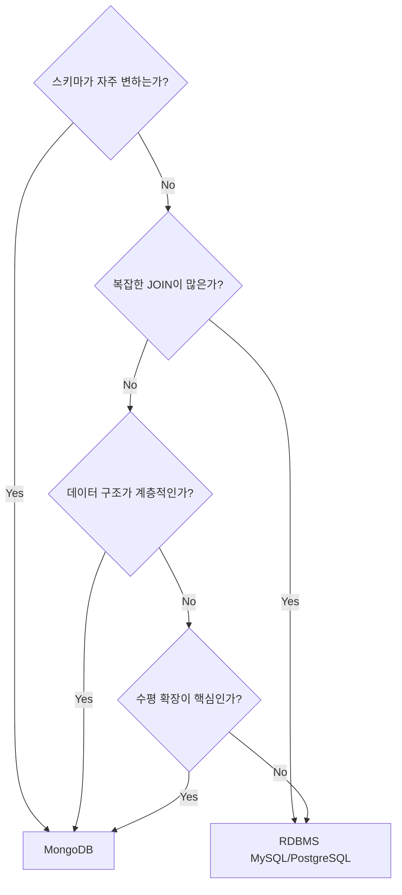

## 실생활 비유: 서랍장 vs 파일 캐비닛

관계형 DB(MySQL)는 **엄격한 파일 캐비닛**입니다. 모든 서류가 정해진 양식(스키마)에 맞아야 합니다. 이름, 나이, 주소 칸이 있는 서류만 넣을 수 있습니다.

MongoDB는 **자유로운 서랍장**입니다. 어떤 서류든, 사진이든, 영수증이든 같은 서랍에 넣을 수 있습니다. 형식이 달라도 됩니다.

---

## 1. MongoDB 핵심 개념



### 도큐먼트 예시

```json
{
  "_id": ObjectId("507f1f77bcf86cd799439011"),
  "username": "kimdev",
  "email": "kim@example.com",
  "age": 28,
  "address": {
    "street": "강남대로 123",
    "city": "서울",
    "zipCode": "06234"
  },
  "hobbies": ["코딩", "독서", "등산"],
  "orders": [
    {
      "orderId": "ORD-001",
      "product": "MacBook Pro",
      "amount": 3000000,
      "date": ISODate("2024-01-15")
    },
    {
      "orderId": "ORD-002",
      "product": "AirPods",
      "amount": 250000,
      "date": ISODate("2024-02-01")
    }
  ],
  "createdAt": ISODate("2024-01-01T00:00:00Z"),
  "isActive": true
}
```

**RDBMS와 비교:**
```sql
-- RDBMS: 4개 테이블 필요
SELECT u.*, a.*, h.hobby, o.*
FROM users u
JOIN addresses a ON u.id = a.user_id
JOIN user_hobbies h ON u.id = h.user_id
JOIN orders o ON u.id = o.user_id
WHERE u.username = 'kimdev';

-- MongoDB: 1번의 조회
db.users.findOne({ username: "kimdev" })
```

---

## 2. CRUD 기본 조작

### Insert (삽입)

```javascript
// 단일 도큐먼트 삽입
db.users.insertOne({
  username: "kimdev",
  email: "kim@example.com",
  age: 28,
  createdAt: new Date()
});

// 여러 도큐먼트 삽입
db.users.insertMany([
  { username: "lee", email: "lee@example.com", age: 30 },
  { username: "park", email: "park@example.com", age: 25 },
  { username: "choi", email: "choi@example.com", age: 35 }
]);
```

### Find (조회)

```javascript
// 기본 조회
db.users.find({ age: 28 })

// 비교 연산자
db.users.find({ age: { $gte: 25, $lte: 35 } })

// 논리 연산자
db.users.find({
  $and: [
    { age: { $gte: 20 } },
    { isActive: true }
  ]
})

// 배열 조회
db.users.find({ hobbies: "코딩" })              // 배열에 "코딩" 포함
db.users.find({ hobbies: { $in: ["코딩", "독서"] } }) // 하나라도 포함

// 중첩 도큐먼트 조회 (점 표기법)
db.users.find({ "address.city": "서울" })

// 프로젝션 (원하는 필드만)
db.users.find(
  { isActive: true },
  { username: 1, email: 1, _id: 0 }  // 1=포함, 0=제외
)

// 정렬, 건너뛰기, 제한
db.users.find()
  .sort({ age: -1 })     // -1: 내림차순
  .skip(20)
  .limit(10)
```

### Update (수정)

```javascript
// 단일 필드 업데이트
db.users.updateOne(
  { username: "kimdev" },
  { $set: { age: 29, updatedAt: new Date() } }
)

// 증가/감소
db.products.updateOne(
  { _id: ObjectId("...") },
  { $inc: { stock: -1, viewCount: 1 } }  // stock -1, viewCount +1
)

// 배열에 요소 추가
db.users.updateOne(
  { username: "kimdev" },
  { $push: { hobbies: "요리" } }
)

// 배열에서 요소 제거
db.users.updateOne(
  { username: "kimdev" },
  { $pull: { hobbies: "등산" } }
)

// Upsert (없으면 삽입, 있으면 업데이트)
db.users.updateOne(
  { email: "new@example.com" },
  { $set: { username: "newuser", createdAt: new Date() } },
  { upsert: true }
)

// 여러 도큐먼트 업데이트
db.users.updateMany(
  { isActive: false },
  { $set: { deletedAt: new Date() } }
)
```

### Delete (삭제)

```javascript
// 단일 삭제
db.users.deleteOne({ username: "kimdev" })

// 다중 삭제
db.users.deleteMany({ isActive: false })

// 소프트 삭제 패턴 (권장)
db.users.updateOne(
  { username: "kimdev" },
  { $set: { isDeleted: true, deletedAt: new Date() } }
)
```

---

## 3. 스키마 설계

### 임베딩 vs 참조



**임베딩 패턴 (자주 함께 조회되는 경우):**
```javascript
// 블로그 포스트와 댓글 - 함께 조회됨
{
  "_id": ObjectId("..."),
  "title": "MongoDB 완벽 가이드",
  "content": "...",
  "author": {
    "userId": ObjectId("..."),
    "username": "kimdev",      // 중복이지만 조회 성능 우선
    "avatar": "https://..."
  },
  "comments": [
    {
      "commentId": ObjectId("..."),
      "userId": ObjectId("..."),
      "username": "leedev",
      "text": "좋은 글이네요!",
      "createdAt": ISODate("2024-01-15")
    }
  ],
  "tags": ["MongoDB", "NoSQL", "데이터베이스"],
  "viewCount": 1500,
  "createdAt": ISODate("2024-01-10")
}
```

**참조 패턴 (독립적으로 관리되는 경우):**
```javascript
// 주문과 상품 - 상품은 독립적으로 업데이트됨
// orders 컬렉션
{
  "_id": ObjectId("order001"),
  "userId": ObjectId("user001"),    // 참조
  "items": [
    {
      "productId": ObjectId("prod001"),  // 참조
      "quantity": 2,
      "priceAtOrder": 50000  // 주문 시점 가격 저장 (중요!)
    }
  ],
  "totalAmount": 100000,
  "status": "PAID"
}

// products 컬렉션 (독립)
{
  "_id": ObjectId("prod001"),
  "name": "MacBook Pro",
  "price": 52000,  // 가격이 변해도 주문 기록은 그대로
  "stock": 50
}
```

---

## 4. 인덱스



```javascript
// 단일 필드 인덱스
db.users.createIndex({ email: 1 })   // 오름차순
db.users.createIndex({ age: -1 })    // 내림차순

// 복합 인덱스 (순서 중요!)
db.orders.createIndex({ userId: 1, createdAt: -1 })
// userId로 필터링, createdAt으로 정렬하는 쿼리에 최적

// 유니크 인덱스
db.users.createIndex({ email: 1 }, { unique: true })

// TTL 인덱스 (자동 만료)
db.sessions.createIndex(
  { createdAt: 1 },
  { expireAfterSeconds: 3600 }  // 1시간 후 자동 삭제
)

// 텍스트 인덱스 (전문 검색)
db.posts.createIndex({
  title: "text",
  content: "text"
}, {
  weights: { title: 10, content: 1 },  // 제목에 가중치
  default_language: "none"              // 한국어 지원
})

// 텍스트 검색 쿼리
db.posts.find({
  $text: { $search: "MongoDB 인덱스" }
}, {
  score: { $meta: "textScore" }
}).sort({ score: { $meta: "textScore" } })

// 부분 인덱스 (활성 사용자만)
db.users.createIndex(
  { email: 1 },
  { partialFilterExpression: { isActive: true } }
)

// 인덱스 성능 분석
db.users.find({ age: { $gte: 25 } }).explain("executionStats")
```

**인덱스 설계 원칙 (ESR 규칙):**
```
E (Equality): 동등 조건 필드를 먼저
S (Sort): 정렬 필드 다음
R (Range): 범위 조건 필드를 마지막

예: db.orders.find({ userId: "u1", status: "PAID" }).sort({ createdAt: -1 })
인덱스: { userId: 1, status: 1, createdAt: -1 }
        E         E              S
```

---

## 5. 집계 파이프라인 (Aggregation Pipeline)



```javascript
// 예시: 카테고리별 월간 매출 분석
db.orders.aggregate([
  // 1단계: 완료된 주문만 필터
  {
    $match: {
      status: "DELIVERED",
      createdAt: {
        $gte: ISODate("2024-01-01"),
        $lt: ISODate("2024-02-01")
      }
    }
  },

  // 2단계: 주문 아이템 펼치기
  { $unwind: "$items" },

  // 3단계: 카테고리별 집계
  {
    $group: {
      _id: "$items.category",
      totalRevenue: { $sum: { $multiply: ["$items.price", "$items.quantity"] } },
      orderCount: { $sum: 1 },
      avgOrderValue: { $avg: "$totalAmount" }
    }
  },

  // 4단계: 매출 기준 내림차순 정렬
  { $sort: { totalRevenue: -1 } },

  // 5단계: 상위 10개
  { $limit: 10 },

  // 6단계: 출력 형식 지정
  {
    $project: {
      category: "$_id",
      totalRevenue: { $round: ["$totalRevenue", 0] },
      orderCount: 1,
      avgOrderValue: { $round: ["$avgOrderValue", 0] },
      _id: 0
    }
  }
])

// 결과:
// { category: "전자기기", totalRevenue: 50000000, orderCount: 150, avgOrderValue: 333333 }
// { category: "의류", totalRevenue: 20000000, orderCount: 400, avgOrderValue: 50000 }
```

**$lookup (조인):**
```javascript
// 주문에 사용자 정보 조인
db.orders.aggregate([
  {
    $lookup: {
      from: "users",
      localField: "userId",
      foreignField: "_id",
      as: "userInfo"
    }
  },
  { $unwind: "$userInfo" },
  {
    $project: {
      orderId: "$_id",
      userName: "$userInfo.username",
      email: "$userInfo.email",
      totalAmount: 1,
      status: 1
    }
  }
])
```

---

## 6. 트랜잭션

MongoDB 4.0+부터 다중 도큐먼트 ACID 트랜잭션 지원:

```javascript
// Node.js 트랜잭션 예시
const session = client.startSession();

try {
  session.startTransaction({
    readConcern: { level: "snapshot" },
    writeConcern: { w: "majority" }
  });

  // 1. 재고 차감
  await db.collection("products").updateOne(
    { _id: productId, stock: { $gte: quantity } },
    { $inc: { stock: -quantity } },
    { session }
  );

  // 2. 주문 생성
  await db.collection("orders").insertOne(
    {
      userId,
      productId,
      quantity,
      status: "CREATED",
      createdAt: new Date()
    },
    { session }
  );

  // 3. 사용자 포인트 차감
  await db.collection("users").updateOne(
    { _id: userId, points: { $gte: pointsToUse } },
    { $inc: { points: -pointsToUse } },
    { session }
  );

  await session.commitTransaction();
  console.log("트랜잭션 성공!");

} catch (error) {
  await session.abortTransaction();
  console.error("트랜잭션 실패, 롤백:", error);
} finally {
  await session.endSession();
}
```

---

## 7. 레플리카셋 (Replica Set)



**레플리카셋 연결 설정:**
```python
# Python pymongo
from pymongo import MongoClient, ReadPreference

client = MongoClient(
    "mongodb://mongo1:27017,mongo2:27017,mongo3:27017/?replicaSet=rs0",
    readPreference=ReadPreference.SECONDARY_PREFERRED,  # 읽기는 Secondary 우선
    w="majority",       # 쓰기는 majority 확인
    j=True,            # 저널 기록 확인
    serverSelectionTimeoutMS=5000
)

db = client.mydb

# 읽기 성호도(Read Preference) 옵션
# PRIMARY: 항상 Primary (기본)
# PRIMARY_PREFERRED: Primary 우선, 없으면 Secondary
# SECONDARY: 항상 Secondary
# SECONDARY_PREFERRED: Secondary 우선, 없으면 Primary
# NEAREST: 지연시간 가장 낮은 노드
```

---

## 8. 샤딩 (Sharding)

단일 레플리카셋으로 처리하기 어려운 대용량 데이터를 수평 분산합니다.



**샤딩 키 선택:**
```javascript
// 샤딩 활성화
sh.enableSharding("mydb")

// 해시 기반 샤딩 (균등 분산)
db.runCommand({
  shardCollection: "mydb.users",
  key: { userId: "hashed" }
})

// 범위 기반 샤딩 (범위 쿼리 효율적)
db.runCommand({
  shardCollection: "mydb.orders",
  key: { createdAt: 1, userId: 1 }
})
```

**좋은 샤드 키의 조건:**
| 조건 | 설명 | 나쁜 예 | 좋은 예 |
|------|------|---------|---------|
| 높은 카디널리티 | 고유값 많음 | 성별(M/F) | userId |
| 균등 분포 | 특정 샤드에 집중 안됨 | 타임스탬프 | 해시된 userId |
| 쿼리 분리 | 쿼리가 하나의 샤드에만 가도록 | 전체 스캔 유도 | userId로 필터 |

---

## 9. Atlas (MongoDB 클라우드)



---

## 10. Spring Data MongoDB

```java
// 엔티티 정의
@Document(collection = "users")
@CompoundIndex(def = "{'email': 1}", unique = true)
public class User {
    @Id
    private String id;

    private String username;
    private String email;

    @DBRef
    private List<Order> orders;  // 참조 방식

    private Address address;     // 임베딩 방식

    @CreatedDate
    private LocalDateTime createdAt;

    @LastModifiedDate
    private LocalDateTime updatedAt;
}

// 레포지토리
@Repository
public interface UserRepository extends MongoRepository<User, String> {

    Optional<User> findByEmail(String email);

    List<User> findByAddressCityAndIsActiveTrue(String city);

    // 커스텀 쿼리
    @Query("{ 'age': { $gte: ?0, $lte: ?1 } }")
    List<User> findByAgeRange(int min, int max);
}

// 복잡한 집계 - MongoTemplate 사용
@Service
public class OrderAnalyticsService {

    private final MongoTemplate mongoTemplate;

    public List<CategoryRevenue> getMonthlyRevenueByCategory(YearMonth month) {
        MatchOperation match = Aggregation.match(
            Criteria.where("status").is("DELIVERED")
                .and("createdAt").gte(month.atDay(1).atStartOfDay())
                .lt(month.plusMonths(1).atDay(1).atStartOfDay())
        );

        UnwindOperation unwind = Aggregation.unwind("items");

        GroupOperation group = Aggregation.group("items.category")
            .sum(ArithmeticOperators.Multiply.valueOf("items.price")
                .multiplyBy("items.quantity")).as("totalRevenue")
            .count().as("orderCount");

        SortOperation sort = Aggregation.sort(Sort.Direction.DESC, "totalRevenue");
        LimitOperation limit = Aggregation.limit(10);

        Aggregation aggregation = Aggregation.newAggregation(
            match, unwind, group, sort, limit
        );

        return mongoTemplate.aggregate(
            aggregation, "orders", CategoryRevenue.class
        ).getMappedResults();
    }
}
```

---

## 11. 극한 시나리오: 배달의민족 주문 데이터



---

## MongoDB vs RDBMS 선택 가이드



| 상황 | 추천 |
|------|------|
| 전자상거래 상품 카탈로그 | MongoDB (다양한 속성) |
| 금융 거래 | RDBMS (ACID 필수) |
| 사용자 프로필 | MongoDB |
| 재고 관리 | RDBMS |
| 실시간 분석 | MongoDB + Atlas Search |
| 블로그/CMS | MongoDB |
| ERP 시스템 | RDBMS |

---

## 핵심 설계 결정 요약

| 결정 사항 | 권장 | 이유 |
|----------|------|------|
| 스키마 설계 | 임베딩 우선, 참조 필요 시 | 단일 조회 성능 |
| 인덱스 | ESR 규칙 준수 | 쿼리 최적화 |
| 샤드 키 | 해시 기반 | 균등 분산 |
| 레플리카셋 | 최소 3노드 | 장애 허용 |
| 트랜잭션 | 필요한 경우만 | 성능 비용 있음 |
| 읽기 설정 | SECONDARY_PREFERRED | 읽기 부하 분산 |
