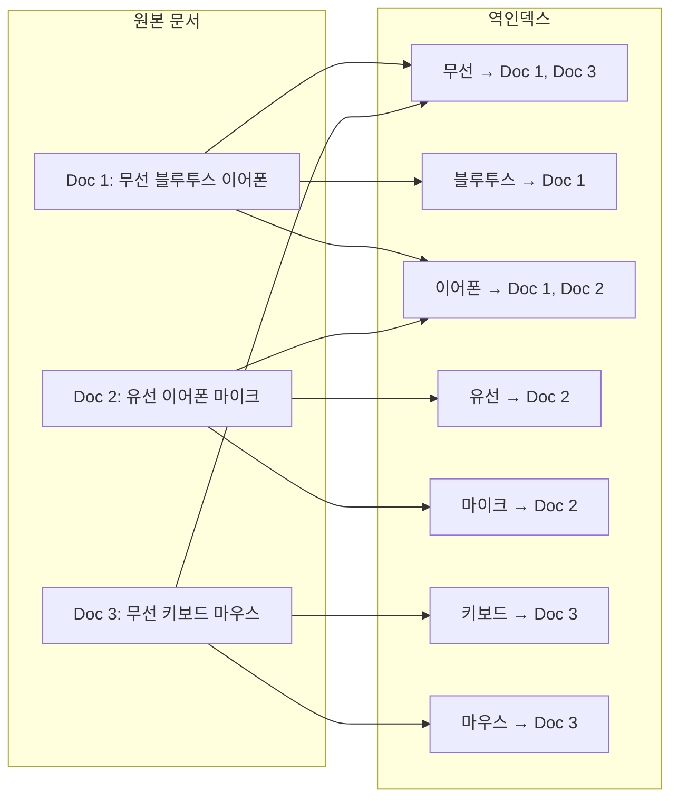
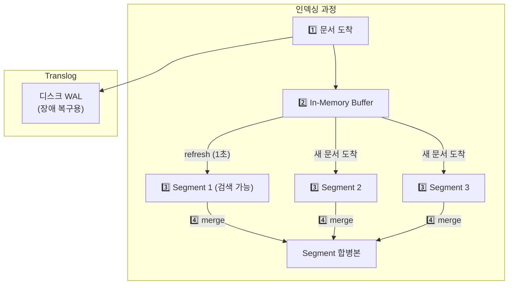
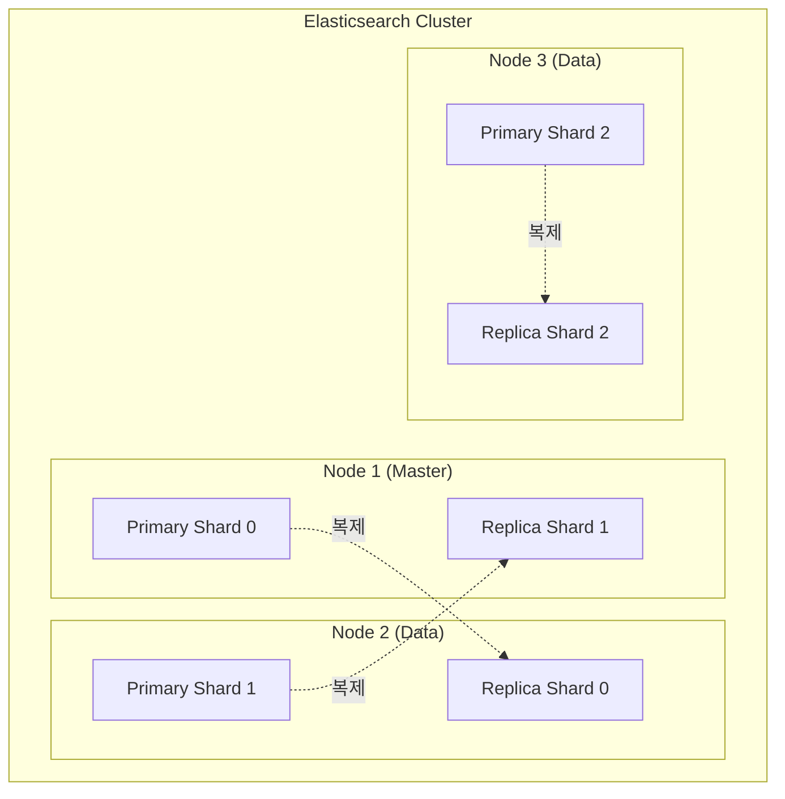
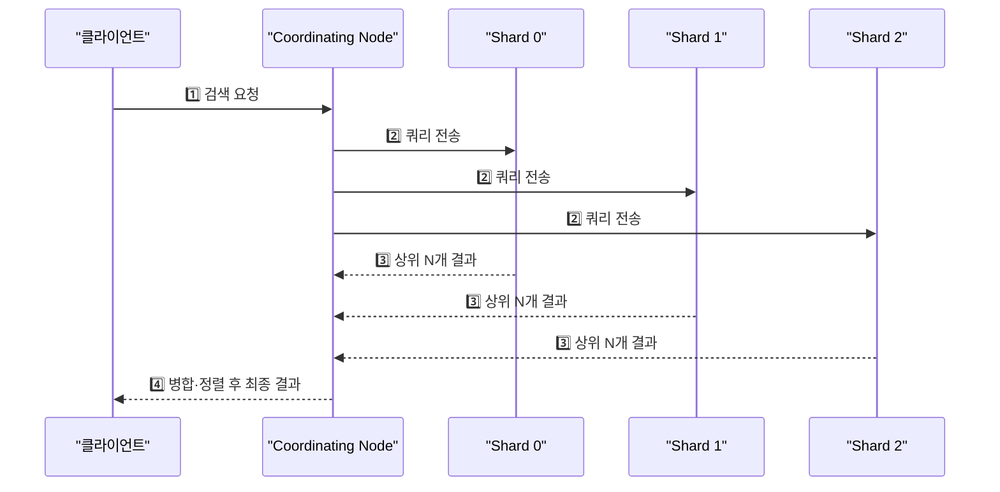
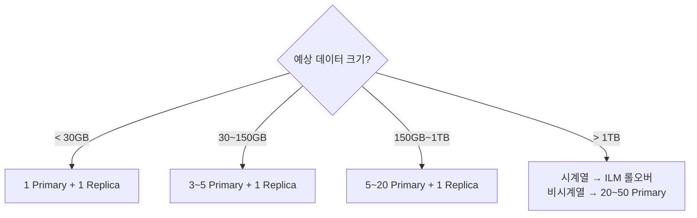
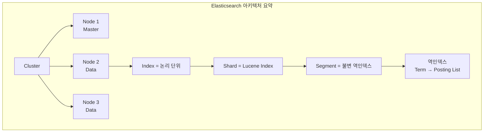

"상품명에 '무선 이어폰'이 포함된 결과를 0.05초 안에 보여줘야 합니다." RDBMS의 `LIKE '%무선 이어폰%'`은 100만 건에서 수 초가 걸린다. Elasticsearch는 **역인덱스(Inverted Index)** 라는 구조 덕분에 수억 건에서도 밀리초 단위로 응답한다. 이 글에서는 Elasticsearch가 어떻게 그 속도를 달성하는지, 그리고 실무에서 어떻게 설계·운영하는지를 처음부터 끝까지 다룬다.

---

## 1. 역인덱스(Inverted Index) 원리

### 1-1. 전통적 인덱스 vs 역인덱스

RDBMS의 B-Tree 인덱스는 **행 → 값** 방향이다. "id가 42인 행의 이름은?" 같은 질문에 빠르다. 하지만 "이름에 '개발'이 포함된 행은?"이라는 질문에는 전체 테이블을 스캔해야 한다. 역인덱스는 이 방향을 뒤집는다. **단어 → 문서 목록** 방향으로 저장하여, 특정 단어가 어떤 문서에 있는지를 즉시 찾을 수 있다.

> **비유:** 일반 인덱스는 **책의 목차**다. "3장은 어떤 내용인가?"를 빠르게 찾을 수 있다. 역인덱스는 **책 뒤의 색인(찾아보기)** 이다. "'분산 시스템'이라는 단어가 나오는 페이지는?" → 42쪽, 87쪽, 153쪽. 색인이 있으면 전체 책을 넘기지 않아도 원하는 단어가 어디에 있는지 즉시 알 수 있다.



### 1-2. 역인덱스의 내부 구조

역인덱스는 두 가지 핵심 구성요소로 이루어진다.

**Term Dictionary:** 모든 고유 단어(term)를 정렬하여 저장한다. 정렬되어 있으므로 이진 탐색으로 O(log N) 만에 단어를 찾을 수 있다. Elasticsearch는 여기에 FST(Finite State Transducer)라는 자료구조를 사용하여 메모리를 절약하면서도 빠른 탐색을 달성한다.

**Posting List:** 각 단어가 출현하는 문서 ID 목록이다. "이어폰"의 posting list가 `[1, 2]`라면, 문서 1과 2에 "이어폰"이 있다는 뜻이다. 여기에 단어의 출현 위치(position)와 빈도(frequency)도 함께 저장하여, 관련도(relevance) 점수를 계산하는 데 사용한다.

검색 쿼리 `"무선 이어폰"`이 들어오면 Elasticsearch는 다음과 같이 동작한다.

1️⃣ "무선"의 posting list를 가져온다 → `{Doc 1, Doc 3}`
2️⃣ "이어폰"의 posting list를 가져온다 → `{Doc 1, Doc 2}`
3️⃣ 두 집합의 교집합을 구한다 → `{Doc 1}`
4️⃣ Doc 1의 관련도 점수를 계산하여 반환한다

이 과정이 전체 문서를 스캔하는 것이 아니라 **정렬된 목록의 집합 연산**이기 때문에 수억 건에서도 밀리초 단위로 동작한다.

---

## 2. Lucene 세그먼트 구조

Elasticsearch는 내부적으로 **Apache Lucene** 라이브러리를 사용한다. Lucene의 핵심 개념이 **세그먼트(Segment)** 다.

### 2-1. 세그먼트란 무엇인가

세그먼트는 역인덱스의 **불변(immutable) 조각**이다. 문서가 인덱싱되면 메모리 버퍼에 쌓이다가, 주기적으로 디스크에 새로운 세그먼트로 flush된다. 한 번 기록된 세그먼트는 절대 수정되지 않는다.

> **비유:** 세그먼트는 **완성된 책**이다. 책이 인쇄되면 내용을 수정할 수 없다. 새 내용은 새 책(새 세그먼트)으로 출판된다. 오래된 책의 내용을 수정하고 싶으면, 그 페이지에 "삭제됨" 스티커를 붙이고(soft delete), 나중에 정리(merge) 시점에 최신 내용만 모아 새 책을 만든다.

이 불변성 덕분에 Lucene은 **동시 읽기에 대한 락이 필요 없다**. 여러 스레드가 동시에 같은 세그먼트를 읽어도 안전하다. 반면, 삭제나 수정은 실제로 데이터를 지우는 것이 아니라 "삭제 비트맵"에 표시하는 방식이므로, 삭제된 문서가 디스크를 차지하고 있다가 세그먼트 병합(merge) 시점에 비로소 제거된다.



### 2-2. Refresh와 Near Real-Time 검색

문서가 인덱싱되면 **즉시 검색 가능하지 않다**. In-Memory Buffer에 있는 동안은 검색에 포함되지 않는다. `refresh` 작업이 실행되어야 버퍼의 내용이 세그먼트로 만들어지고 검색 가능해진다.

Elasticsearch의 기본 refresh interval은 **1초**다. 즉, 문서를 넣은 후 최대 1초 뒤에 검색에 나타난다. 이것을 **Near Real-Time(NRT) 검색**이라 부른다. 1초가 길다면 `refresh_interval`을 줄일 수 있지만, refresh마다 새 세그먼트가 생기므로 너무 자주 하면 세그먼트가 폭발적으로 늘어나고, 이는 파일 디스크립터 소모와 병합 비용 증가로 이어진다.

### 2-3. Translog (Write-Ahead Log)

Buffer의 내용은 메모리에만 있으므로, 노드가 죽으면 유실된다. 이를 방지하기 위해 Elasticsearch는 모든 쓰기를 **Translog**에 먼저 기록한다. 노드가 재시작되면 Translog를 재생(replay)하여 유실된 데이터를 복구한다. 이것은 RDBMS의 WAL(Write-Ahead Log)과 동일한 개념이다.

---

## 3. Cluster / Node / Shard / Replica 아키텍처

Elasticsearch를 운영한다는 것은 **클러스터를 운영한다**는 뜻이다. 단일 노드로 시작할 수 있지만, 프로덕션에서는 반드시 다중 노드 클러스터로 구성해야 한다.

> **비유:** Elasticsearch 클러스터는 **도서관 시스템**이다. 클러스터는 도서관 전체, 노드는 각 분관, 인덱스는 "소설 코너"나 "과학 코너" 같은 분류, 샤드는 해당 코너의 책장 한 칸, 레플리카는 같은 책의 복사본이다. 특정 책장이 부서져도(노드 장애), 다른 분관의 복사본이 있으니 서비스가 계속된다.



### 3-1. 노드 역할

Elasticsearch 노드는 여러 역할을 수행할 수 있으며, 대규모 클러스터에서는 역할을 분리한다.

**Master Node:** 클러스터 메타데이터(인덱스 설정, 샤드 할당)를 관리한다. 3개 이상의 master-eligible 노드를 두어 split-brain을 방지해야 한다. 데이터를 저장하지 않는 전용(dedicated) 마스터 노드를 권장한다.

**Data Node:** 실제 데이터를 저장하고, 검색·인덱싱을 수행한다. CPU와 디스크 I/O가 핵심 자원이다.

**Coordinating Node:** 클라이언트 요청을 받아 적절한 데이터 노드로 라우팅하고, 결과를 집계(scatter-gather)하여 반환한다. 대규모 클러스터에서 데이터 노드의 부하를 줄이기 위해 전용 coordinating 노드를 둔다.

**Ingest Node:** 인덱싱 전에 데이터를 변환(pipeline)하는 노드다. 로그를 파싱하거나, 필드를 추가/제거하는 전처리를 담당한다.

### 3-2. 샤드(Shard)와 레플리카(Replica)

인덱스는 하나 이상의 **샤드**로 분할된다. 각 샤드는 독립적인 Lucene 인덱스이며, 서로 다른 노드에 분산되어 수평 확장을 가능케 한다.

**Primary Shard:** 원본 데이터를 저장한다. 인덱스 생성 시 샤드 수를 결정하면 **이후 변경할 수 없다** (reindex 필요). 이것이 초기 설계에서 샤드 수를 신중하게 결정해야 하는 이유다.

**Replica Shard:** Primary의 복제본이다. 노드 장애 시 데이터 유실을 방지하고, 검색 요청을 분산하여 읽기 성능을 높인다. Replica는 반드시 Primary와 **다른 노드**에 배치된다.

### 3-3. 검색의 Scatter-Gather 과정

클라이언트가 검색 쿼리를 보내면 다음과 같이 동작한다.

1️⃣ Coordinating 노드가 쿼리를 받는다
2️⃣ 해당 인덱스의 모든 샤드(Primary 또는 Replica)에 쿼리를 **병렬 전송**(scatter)한다
3️⃣ 각 샤드가 로컬에서 검색을 수행하고 상위 N개 결과를 반환한다
4️⃣ Coordinating 노드가 모든 샤드의 결과를 **병합·정렬**(gather)하여 최종 결과를 반환한다



이 구조의 핵심은 **샤드 수 = 병렬도**라는 점이다. 샤드가 5개이면 5개 CPU 코어가 동시에 검색을 수행한다. 하지만 샤드가 너무 많으면 각 샤드가 반환하는 결과를 병합하는 비용이 커지고, 메타데이터 관리 오버헤드가 증가한다.

---

## 4. 매핑(Mapping)과 분석기(Analyzer)

### 4-1. 매핑: Elasticsearch의 스키마

매핑은 인덱스의 **필드 정의**다. RDBMS의 `CREATE TABLE`에 해당한다. Elasticsearch는 동적 매핑(dynamic mapping)을 지원하여, 매핑 없이 문서를 넣으면 자동으로 타입을 추론한다. 하지만 프로덕션에서는 반드시 **명시적 매핑**을 사용해야 한다. 자동 추론이 잘못되면 (예: 숫자를 문자열로 인식) 나중에 수정할 수 없고, reindex가 필요하다.

> **비유:** 동적 매핑은 **자동 번역기**와 같다. 대부분 잘 번역하지만, 가끔 문맥을 잘못 파악하여 엉뚱한 번역을 내놓는다. 중요한 문서라면 전문 번역가(명시적 매핑)를 쓰는 것이 안전하다.

아래 매핑 예시는 이커머스 상품 인덱스의 전형적인 설계다. 각 필드의 타입 선택 이유를 주석으로 설명했다.

```json
PUT /products
{
  "settings": {
    "number_of_shards": 3,
    "number_of_replicas": 1,
    "analysis": {
      "analyzer": {
        "korean": {
          "type": "custom",
          "tokenizer": "nori_tokenizer",
          "filter": ["nori_readingform", "lowercase"]
        }
      }
    }
  },
  "mappings": {
    "properties": {
      "name":        { "type": "text", "analyzer": "korean" },
      "description": { "type": "text", "analyzer": "korean" },
      "price":       { "type": "integer" },
      "category":    { "type": "keyword" },
      "brand":       { "type": "keyword" },
      "created_at":  { "type": "date" },
      "in_stock":    { "type": "boolean" },
      "tags":        { "type": "keyword" },
      "rating":      { "type": "float" }
    }
  }
}
```

**이 코드의 핵심:** `text`와 `keyword`의 차이가 매핑의 가장 중요한 결정이다. `text`는 분석기를 통해 토큰화되어 전문 검색이 가능하고, `keyword`는 분석 없이 원본 그대로 저장되어 정확한 일치 검색·집계·정렬에 사용된다. 상품명은 `text`(검색용), 카테고리는 `keyword`(필터/집계용)로 설정한다.

### 4-2. 분석기(Analyzer)의 동작

분석기는 텍스트를 검색 가능한 토큰으로 변환하는 파이프라인이다. 세 단계로 구성된다.

**Character Filter → Tokenizer → Token Filter**

예를 들어 `"<b>무선 블루투스 이어폰</b>"`이라는 텍스트가 들어오면,

1️⃣ **Character Filter:** HTML 태그 제거 → `"무선 블루투스 이어폰"`
2️⃣ **Tokenizer:** 공백/형태소 기준 분리 → `["무선", "블루투스", "이어폰"]`
3️⃣ **Token Filter:** 소문자 변환, 불용어 제거 등 → `["무선", "블루투스", "이어폰"]`


### 4-3. Nori: 한국어 형태소 분석기

한국어는 영어와 달리 공백만으로 의미 단위를 분리할 수 없다. "삼성전자주식회사"를 공백 기준으로 자르면 한 덩어리이지만, 의미상 "삼성전자"+"주식회사"로 분리해야 한다. 더 나아가 "먹었습니다"에서 어간 "먹"을 추출해야 "먹다"로 검색해도 결과가 나온다.

**Nori**는 Elasticsearch 공식 한국어 형태소 분석기다. 은전한닢(MeCab-ko) 사전을 기반으로 하며, 복합명사 분해와 품사 필터링을 지원한다.

> **비유:** Nori는 **한국어 전문 통역사**다. Standard analyzer(범용 통역사)가 "삼성전자주식회사"를 하나의 단어로 이해하는 반면, Nori는 "삼성"+"전자"+"주식"+"회사"로 정확하게 분해한다. 한국어 검색 서비스에서 Nori 없이 Standard analyzer를 쓰는 것은 영어 통역사에게 한국어 통역을 맡기는 것과 같다.

아래 코드는 Nori 분석기의 설정과 테스트 방법이다. `decompound_mode`는 복합명사를 어떻게 처리할지 결정하며, 검색 품질에 직접적인 영향을 준다.

```json
// Nori 분석기 설치 (Elasticsearch 플러그인)
// bin/elasticsearch-plugin install analysis-nori

// 분석 테스트
POST /_analyze
{
  "analyzer": "nori",
  "text": "삼성전자 갤럭시 스마트폰을 구매했습니다"
}

// 결과: ["삼성", "전자", "갤럭시", "스마트폰", "구매", "하"]

// decompound_mode 설정
PUT /korean_index
{
  "settings": {
    "analysis": {
      "tokenizer": {
        "nori_mixed": {
          "type": "nori_tokenizer",
          "decompound_mode": "mixed"
        }
      },
      "analyzer": {
        "korean_analyzer": {
          "type": "custom",
          "tokenizer": "nori_mixed",
          "filter": ["nori_readingform", "lowercase", "nori_part_of_speech"]
        }
      }
    }
  }
}
```

**이 코드의 핵심:** `decompound_mode`의 세 가지 옵션이 중요하다. `discard`는 복합명사를 서브워드로만 분해하고(삼성, 전자), `none`은 분해하지 않고(삼성전자), `mixed`는 원본과 서브워드 모두를 인덱싱한다(삼성전자, 삼성, 전자). 검색 재현율(recall)을 높이려면 `mixed`를 권장한다.

---

## 5. 검색 쿼리 DSL

Elasticsearch의 검색 쿼리는 JSON 기반의 **Query DSL(Domain Specific Language)** 로 작성한다. SQL처럼 보편적이지는 않지만, 전문 검색에 최적화된 풍부한 표현력을 제공한다.

### 5-1. Match Query

가장 기본적인 전문 검색 쿼리다. 입력 텍스트를 분석기로 토큰화한 후, 각 토큰이 포함된 문서를 찾는다.

Match 쿼리에서 `operator` 설정이 결과 품질을 크게 좌우한다. 기본값 `or`는 토큰 중 하나만 일치해도 결과에 포함하고, `and`는 모든 토큰이 일치해야 한다. "무선 이어폰"을 검색했을 때 `or`면 "유선 이어폰"도 나오고, `and`면 반드시 "무선"과 "이어폰"이 모두 포함된 문서만 나온다.

```json
// 기본 match 쿼리
GET /products/_search
{
  "query": {
    "match": {
      "name": {
        "query": "무선 블루투스 이어폰",
        "operator": "and"
      }
    }
  }
}

// match_phrase: 단어 순서까지 일치
GET /products/_search
{
  "query": {
    "match_phrase": {
      "name": "무선 이어폰"
    }
  }
}
```

**이 코드의 핵심:** `match`는 토큰의 존재 여부만 확인하지만, `match_phrase`는 **토큰의 순서와 인접성**까지 확인한다. "무선 이어폰"으로 `match_phrase` 검색하면 "무선 블루투스 이어폰"은 나오지 않는다(중간에 "블루투스"가 끼어 있으므로). `slop` 파라미터로 허용할 간격을 지정할 수 있다.

### 5-2. Bool Query

실무에서 가장 많이 사용하는 쿼리다. 여러 조건을 `must`, `should`, `must_not`, `filter`로 조합한다.

> **비유:** Bool 쿼리는 **채용 공고의 자격 요건**과 같다. `must`는 "필수 조건" (경력 3년 이상), `should`는 "우대 조건" (AWS 경험), `must_not`은 "제외 조건" (인턴 제외), `filter`는 "기본 조건" (서울 근무 가능)이다. `filter`와 `must`의 차이는 `filter`는 점수에 영향을 주지 않고 캐싱된다는 점이다.

```json
GET /products/_search
{
  "query": {
    "bool": {
      "must": [
        { "match": { "name": "이어폰" } }
      ],
      "filter": [
        { "term": { "category": "전자기기" } },
        { "range": { "price": { "gte": 10000, "lte": 100000 } } }
      ],
      "should": [
        { "term": { "brand": "삼성" } },
        { "term": { "brand": "애플" } }
      ],
      "must_not": [
        { "term": { "in_stock": false } }
      ]
    }
  }
}
```

**이 코드의 핵심:** `filter` 절은 관련도 점수(\_score)에 영향을 주지 않고, Elasticsearch가 결과를 **캐싱**한다. 가격 범위, 카테고리 같은 정확한 필터는 `filter`에, 검색어 매칭은 `must`에 넣는 것이 성능 최적화의 기본이다.

### 5-3. Aggregation

Aggregation은 RDBMS의 `GROUP BY`에 해당하지만, 훨씬 유연하고 중첩 가능하다. 검색 결과에 대한 통계, 히스토그램, 상위 N개 집계를 실시간으로 계산한다.

Aggregation은 크게 세 가지 유형이 있다. **Bucket Aggregation**은 문서를 그룹으로 나누고(GROUP BY), **Metric Aggregation**은 수치를 계산하며(AVG, SUM), **Pipeline Aggregation**은 다른 집계의 결과를 입력으로 받아 추가 계산한다. 이들을 중첩하면 "카테고리별 평균 가격이 가장 높은 상위 5개 브랜드"같은 복잡한 분석을 한 번의 쿼리로 처리할 수 있다.

```json
GET /products/_search
{
  "size": 0,
  "aggs": {
    "카테고리별": {
      "terms": { "field": "category", "size": 10 },
      "aggs": {
        "평균가격": { "avg": { "field": "price" } },
        "브랜드별": {
          "terms": { "field": "brand", "size": 5 },
          "aggs": {
            "최고가": { "max": { "field": "price" } }
          }
        }
      }
    },
    "가격분포": {
      "histogram": {
        "field": "price",
        "interval": 50000
      }
    }
  }
}
```

**이 코드의 핵심:** `size: 0`으로 설정하면 검색 결과(hits)를 반환하지 않고 집계만 수행하여 네트워크 비용을 줄인다. 중첩 aggregation으로 "카테고리 → 브랜드 → 최고가"의 3단계 드릴다운을 한 번의 요청으로 처리한다.

---

## 6. Spring Data Elasticsearch 연동

Java/Spring 생태계에서 Elasticsearch를 사용하는 가장 표준적인 방법은 **Spring Data Elasticsearch**다. JPA와 유사한 Repository 패턴으로 CRUD와 검색을 추상화한다.

> **비유:** Spring Data Elasticsearch는 **자동차의 자동변속기**와 같다. Elasticsearch REST API를 직접 호출하는 것은 수동변속기를 조작하는 것이고, Spring Data는 기어를 자동으로 바꿔준다. 대부분의 상황에서 충분하지만, 극한의 성능 튜닝이나 복잡한 쿼리에서는 수동(직접 REST 호출)이 필요할 수 있다.

### 6-1. 의존성과 엔티티 설정

Spring Boot 3.x 기준으로 의존성과 엔티티 매핑 코드를 작성한다. `@Document` 어노테이션으로 인덱스와 매핑하고, `@Field`로 필드 타입을 명시한다. 여기서 주의할 점은 `@Field(type = FieldType.Text)`와 `@Field(type = FieldType.Keyword)`의 차이다. Text는 분석기를 통해 토큰화되어 전문 검색이 가능하고, Keyword는 정확한 일치 검색에 사용된다.

```java
// build.gradle
// implementation 'org.springframework.boot:spring-boot-starter-data-elasticsearch'

@Document(indexName = "products")
@Setting(settingPath = "/elasticsearch/settings.json")
public class Product {

    @Id
    private String id;

    @Field(type = FieldType.Text, analyzer = "korean")
    private String name;

    @Field(type = FieldType.Keyword)
    private String category;

    @Field(type = FieldType.Integer)
    private Integer price;

    @Field(type = FieldType.Date, format = DateFormat.date_hour_minute_second)
    private LocalDateTime createdAt;

    @Field(type = FieldType.Keyword)
    private List<String> tags;
}
```

**이 코드의 핵심:** `@Setting`으로 별도 JSON 파일에서 분석기 설정을 로드한다. 엔티티 클래스에 분석기 설정을 직접 넣으면 복잡해지므로, `src/main/resources/elasticsearch/settings.json`에 분리하는 것이 깔끔하다.

### 6-2. Repository와 커스텀 쿼리

Spring Data Elasticsearch는 메서드 이름 기반 쿼리, `@Query` 어노테이션, `ElasticsearchOperations`를 통한 프로그래매틱 쿼리를 모두 지원한다. 간단한 쿼리는 메서드 이름으로, 복잡한 쿼리는 `NativeQuery`로 작성하는 것이 실무 패턴이다.

```java
// 1. 메서드 이름 기반 쿼리
public interface ProductRepository extends ElasticsearchRepository<Product, String> {

    List<Product> findByCategory(String category);

    List<Product> findByPriceBetween(int min, int max);

    @Query("""
        {"bool": {"must": [{"match": {"name": "?0"}}],
                  "filter": [{"term": {"category": "?1"}}]}}
    """)
    Page<Product> searchByNameAndCategory(String name, String category, Pageable pageable);
}

// 2. ElasticsearchOperations: 복잡한 동적 쿼리
@Service
@RequiredArgsConstructor
public class ProductSearchService {

    private final ElasticsearchOperations operations;

    public SearchHits<Product> search(String keyword, String category,
                                       Integer minPrice, Integer maxPrice) {
        BoolQueryBuilder boolQuery = QueryBuilders.boolQuery()
            .must(QueryBuilders.matchQuery("name", keyword));

        if (category != null) {
            boolQuery.filter(QueryBuilders.termQuery("category", category));
        }
        if (minPrice != null || maxPrice != null) {
            RangeQueryBuilder range = QueryBuilders.rangeQuery("price");
            if (minPrice != null) range.gte(minPrice);
            if (maxPrice != null) range.lte(maxPrice);
            boolQuery.filter(range);
        }

        NativeQuery query = NativeQuery.builder()
            .withQuery(boolQuery)
            .withPageable(PageRequest.of(0, 20))
            .withHighlightQuery(new HighlightQuery(
                new HighlightBuilder().field("name").preTags("<em>").postTags("</em>"),
                Product.class))
            .build();

        return operations.search(query, Product.class);
    }
}
```

**이 코드의 핵심:** 정적 쿼리는 Repository의 `@Query`로, 동적 쿼리는 `ElasticsearchOperations`로 분리한다. `withHighlightQuery`로 검색어가 매칭된 부분을 `<em>` 태그로 감싸 하이라이팅하는 것이 검색 UX의 기본이다.

---

## 7. 성능 튜닝

Elasticsearch 성능 문제의 90%는 **잘못된 설정**에서 온다. 기본값은 범용적이지만 최적이 아니다.

### 7-1. Bulk Indexing

문서를 하나씩 인덱싱하면 각 요청마다 HTTP 오버헤드, 세그먼트 생성, translog 쓰기가 반복된다. **Bulk API**로 수천~수만 건을 한 번에 보내면 이 오버헤드를 극적으로 줄일 수 있다.

> **비유:** 문서를 하나씩 인덱싱하는 것은 **택배를 하나씩 보내는 것**이다. 편지 한 통을 보내려고 우체국에 갈 때마다 왕복 30분이 걸린다. Bulk API는 편지를 1,000통 모아서 한 번에 우체국에 가는 것이다. 왕복 30분은 동일하지만, 1,000통을 처리한다.

대량 데이터 마이그레이션이나 초기 인덱싱 시에는 아래 설정을 함께 적용해야 최대 성능을 얻을 수 있다. 각 설정이 왜 효과적인지 설명한다.

```json
// 1. 초기 대량 인덱싱 전 최적화 설정
PUT /products/_settings
{
  "index": {
    "refresh_interval": "-1",
    "number_of_replicas": 0
  }
}

// 2. Bulk API로 대량 인덱싱
POST /_bulk
{"index": {"_index": "products", "_id": "1"}}
{"name": "무선 이어폰", "price": 45000, "category": "전자기기"}
{"index": {"_index": "products", "_id": "2"}}
{"name": "블루투스 스피커", "price": 89000, "category": "전자기기"}

// 3. 인덱싱 완료 후 설정 복구
PUT /products/_settings
{
  "index": {
    "refresh_interval": "1s",
    "number_of_replicas": 1
  }
}

// 4. 강제 병합으로 세그먼트 수 줄이기
POST /products/_forcemerge?max_num_segments=1
```

**이 코드의 핵심:** `refresh_interval: -1`은 인덱싱 중 검색 가능성을 포기하고 쓰기 성능에 집중한다. `replicas: 0`은 복제를 비활성화하여 쓰기를 2배 빠르게 한다. 인덱싱 완료 후 반드시 원래 값으로 복구해야 한다. `_forcemerge`는 작은 세그먼트들을 하나로 합쳐 검색 성능을 높인다.

### 7-2. Refresh Interval 튜닝

기본 1초 refresh는 대부분의 유스케이스에 적합하지만, 로그 분석처럼 실시간성이 덜 중요한 경우 30초~60초로 늘리면 인덱싱 처리량이 크게 향상된다. refresh마다 새 세그먼트가 생기므로, 간격이 길수록 세그먼트 수가 줄어들고 병합 비용도 감소한다.

반대로, 실시간 검색이 중요한 경우(예: 채팅 메시지 검색) `refresh_interval`을 200ms로 줄이거나, 인덱싱 직후 `?refresh=wait_for`를 사용하여 해당 문서가 검색 가능해질 때까지 대기할 수 있다.

### 7-3. 샤드 수 설계 가이드

샤드 수는 한 번 결정하면 변경할 수 없으므로 신중해야 한다. 너무 적으면 확장이 불가능하고, 너무 많으면 오버헤드가 커진다.

**경험적 가이드라인:**

- 샤드 하나의 크기는 **10GB ~ 50GB**가 적당하다
- 노드당 샤드 수는 **20개 이하**를 권장한다
- 전체 인덱스 크기를 예측하여 `총 크기 / 30GB`로 샤드 수를 결정한다
- 일별 인덱스(로그 등)는 ILM(Index Lifecycle Management)으로 롤오버한다



### 7-4. JVM Heap 설정

Elasticsearch는 JVM 위에서 동작하므로 힙 설정이 성능에 직접적인 영향을 준다. 핵심 원칙은 두 가지다.

**첫째, 힙은 물리 메모리의 50% 이하로 설정한다.** 나머지 50%는 OS 파일 시스템 캐시가 사용한다. Lucene 세그먼트는 OS 캐시에 올라가야 검색이 빠르다. 힙을 80%로 설정하면 Lucene이 디스크에서 직접 읽어야 하므로 검색이 극적으로 느려진다.

**둘째, 힙은 32GB를 초과하지 않는다.** JVM은 힙이 32GB 이하일 때 Compressed OOP(Ordinary Object Pointer)를 사용하여 포인터를 4바이트로 관리한다. 32GB를 넘으면 포인터가 8바이트로 바뀌어, 실질적으로 사용 가능한 메모리가 줄어든다. 메모리가 64GB인 서버라면 힙 31GB, 나머지 33GB를 파일 시스템 캐시에 할당하는 것이 최적이다.

---

<details class="extreme-scenario-details">
<summary class="extreme-scenario-summary">
<span class="extreme-scenario-icon">🔥</span>
<span class="extreme-scenario-label">극한 시나리오 — 클릭하여 펼치기</span>
<span class="extreme-scenario-toggle"></span>
</summary>
<div class="extreme-scenario-body">

<div class="extreme-scenario-content" markdown="1">

### 시나리오 1: 초당 10만 건 로그 인덱싱

> **비유:** 초당 10만 건 로그 인덱싱은 **고속도로 톨게이트**와 같다. 차 한 대씩 요금을 정산하면(단건 인덱싱) 정체가 발생한다. 하이패스(Bulk API)로 수천 대를 한꺼번에 통과시키고, 정산 주기를 늘리며(refresh_interval 30초), 역방향 차선(replica)을 잠시 닫으면 처리량이 극적으로 늘어난다.

중앙 로그 시스템에서 초당 10만 줄의 로그가 들어올 때 Elasticsearch가 이를 소화하려면 어떻게 해야 하는가?

**인덱싱 전략:** refresh_interval을 30초로 늘리고, Bulk API로 5,000~10,000건씩 묶어 전송한다. replica를 0으로 설정한 뒤 인덱싱 완료 후 1로 올린다. 이렇게 하면 쓰기 처리량이 3~5배 증가한다.

Bulk 묶음 크기를 5,000~10,000으로 권장하는 근거는 다음과 같다. Elasticsearch의 Bulk API는 하나의 HTTP 요청으로 여러 문서를 전송하는데, 요청당 최적 크기는 **5~15MB**다. 평균 로그 한 줄이 약 1KB라면, 5,000건 = 5MB, 10,000건 = 10MB가 된다. 묶음이 이보다 작으면 HTTP 오버헤드(TCP 핸드셰이크, 헤더 파싱, 스레드 할당)가 비효율적이고, 이보다 크면 단일 요청의 메모리 점유가 커져 coordinating 노드의 힙 압박과 GC pause를 유발한다. 또한 Bulk 요청이 30MB를 넘으면 `http.max_content_length`(기본 100MB) 제한에 접근하고, 실패 시 재시도할 데이터 양이 과도해진다. Elastic 공식 문서에서도 "5~15MB per bulk request"를 권장하며, 실측 벤치마크에서 이 범위가 처리량(docs/sec) 대비 레이턴시의 최적 균형점임이 확인된다.

**인덱스 전략:** 일별 인덱스(`logs-2026.05.03`)를 사용하고, ILM으로 7일 후 warm 노드로, 30일 후 cold 노드로, 90일 후 삭제한다. Hot-Warm-Cold 아키텍처를 적용하면 비용 효율적으로 대량 로그를 보관할 수 있다.

**하드웨어:** Data 노드에 NVMe SSD를 사용한다. 로그 인덱싱은 순차 쓰기이므로 SSD의 IOPS보다 쓰기 대역폭이 중요하다. 노드당 2TB NVMe SSD 2개를 RAID 0으로 구성하면 충분한 쓰기 대역폭을 확보할 수 있다.

### 시나리오 2: 2억 건 상품 검색에서 200ms 이내 응답

> **비유:** 2억 건에서 200ms 응답은 **전국 도서관 네트워크에서 책 한 권을 찾는 것**과 같다. 도서관 하나(단일 샤드)에 모든 책을 쌓아두면 사서 한 명이 수억 권을 뒤져야 한다. 10개 분관(샤드)에 나누고, 각 분관에 복사본(replica)을 두면, 10명의 사서가 동시에 자기 책장만 뒤져서 결과를 모아주니 200ms가 가능하다.

이커머스에서 2억 개 상품을 인덱싱하고, 검색 요청에 200ms 이내로 응답해야 한다면?

**샤드 설계:** 2억 건 × 평균 1KB = 약 200GB. 샤드 하나를 30GB로 잡으면 7개 샤드가 필요하다. 10개 Primary Shard로 여유를 두고, 1 Replica로 읽기 분산한다.

**쿼리 최적화:** `filter` 절을 적극 활용하여 캐싱 가능한 조건(카테고리, 가격 범위)은 filter에, 텍스트 매칭만 must에 넣는다. `_source`에서 필요한 필드만 반환하여 네트워크 전송을 줄인다. `size`를 20~50으로 제한하고, deep pagination을 피한다(from: 10000 이상은 `search_after` 사용).

**캐싱:** 자주 검색되는 쿼리는 `request_cache`를 활용한다. filter 절만 있는 쿼리는 자동 캐싱된다. 추가로 애플리케이션 레벨에서 Redis 캐시를 두어 인기 검색어 결과를 캐싱한다.

### 시나리오 3: Master Node 장애

> **비유:** Master Node는 **오케스트라의 지휘자**다. 연주자(Data Node)들은 각자 악보를 가지고 있어 연주(검색)는 계속할 수 있지만, 지휘자가 없으면 새 곡(인덱스 생성)을 시작하거나 파트 배치(샤드 할당)를 변경할 수 없다. 지휘자가 2명 동시에 쓰러지면 대타를 세울 수도 없다(과반수 부재).

3개 master-eligible 노드 중 2개가 동시에 죽으면? 과반수를 확보할 수 없으므로 새 마스터를 선출할 수 없고, 클러스터가 **red 상태**가 된다. 데이터 노드는 살아있지만, 샤드 할당이나 인덱스 생성이 불가능하다. 기존에 라우팅된 검색은 동작할 수 있지만 새로운 인덱싱은 불가능하다. 이를 방지하기 위해 master-eligible 노드를 3개 이상, 홀수로 배치하고, 가능하면 서로 다른 가용 영역(AZ)에 분산한다.

**복구 절차의 메커니즘:** Master 장애 시 Elasticsearch의 내부 동작은 다음과 같다. 첫째, 남은 master-eligible 노드들이 `discovery.seed_hosts`에 등록된 노드 목록으로 ping을 보내 살아있는 후보를 탐색한다. 둘째, 과반수(quorum)를 확보하면 Raft 기반의 선출 알고리즘으로 새 마스터를 선출하고, 클러스터 상태(cluster state)를 전파한다. 셋째, 새 마스터가 unassigned shard를 감지하면 `allocation.node_concurrent_recoveries`(기본 2) 설정에 따라 샤드 복구를 병렬로 시작한다. 만약 과반수를 확보하지 못하는 최악의 경우, 수동 복구가 필요하다. 죽은 노드를 최대한 빨리 재시작하되, 데이터가 손상되었다면 `elasticsearch-node detach-cluster` 명령으로 해당 노드를 클러스터에서 분리한 후 새 master-eligible 노드를 추가해야 한다. 클러스터 상태 자체가 손상된 극단적 상황에서는 `elasticsearch-node unsafe-bootstrap`으로 단일 노드 클러스터를 강제 부트스트랩한 뒤, 나머지 노드를 순차적으로 합류시킨다. 이 과정에서 일부 in-flight 인덱싱 데이터가 유실될 수 있으므로, 복구 후 원본 데이터(RDBMS 등)로부터 재인덱싱을 수행하는 것이 안전하다.

### 시나리오 4: 무중단 Reindex (스키마 변경)

> **비유:** 무중단 Reindex는 **비행 중인 비행기의 엔진을 교체하는 것**과 같다. 승객(사용자)은 아무것도 모른 채 비행을 계속하고, 정비사는 새 엔진을 장착한 뒤 연료 라인(alias)을 새 엔진으로 전환한다. 만약 새 엔진에 문제가 있으면 다시 원래 엔진으로 돌아갈 수 있다(롤백).

Elasticsearch에서 매핑 변경(예: `text` → `keyword`, 분석기 교체)은 기존 인덱스에 적용할 수 없다. 반드시 새 인덱스를 만들고 데이터를 다시 넣어야 한다. 서비스를 중단하지 않고 이 작업을 수행하는 절차는 다음과 같다.

1️⃣ **Alias 기반 설계 (사전 준비):** 애플리케이션은 인덱스 이름(`products_v1`)이 아닌 alias(`products`)를 통해 접근한다. 이것이 무중단 전환의 전제 조건이다.

2️⃣ **새 인덱스 생성:** 변경된 매핑으로 `products_v2`를 생성한다.

3️⃣ **Reindex API 실행:** `POST /_reindex`로 `products_v1`의 데이터를 `products_v2`로 복사한다. 2억 건이면 수 시간이 걸릴 수 있으므로, `wait_for_completion: false`로 비동기 실행하고 `GET /_tasks/{task_id}`로 진행률을 모니터링한다. `slices: auto`를 설정하면 샤드 수만큼 병렬로 처리하여 속도를 높일 수 있다.

4️⃣ **증분 동기화:** Reindex 중에 들어온 신규 데이터를 처리해야 한다. Reindex 시작 시점의 타임스탬프를 기록하고, 완료 후 해당 시점 이후의 문서만 `products_v2`에 추가 인덱싱한다. 또는 애플리케이션에서 dual-write(양쪽 인덱스에 동시 쓰기)를 일시적으로 활성화한다.

5️⃣ **Alias 전환:** `POST /_aliases`로 `products` alias를 `products_v1`에서 제거하고 `products_v2`에 추가하는 것을 **원자적(atomic)** 으로 실행한다. 이 순간 모든 검색 트래픽이 새 인덱스로 전환된다.

6️⃣ **검증 및 롤백:** 새 인덱스에서 검색 결과가 정상인지 확인한 뒤, 문제가 있으면 alias를 다시 `products_v1`으로 돌린다. 정상이면 `products_v1`을 삭제하여 디스크를 회수한다.

```json
// 5단계: Alias 원자적 전환
POST /_aliases
{
  "actions": [
    { "remove": { "index": "products_v1", "alias": "products" } },
    { "add":    { "index": "products_v2", "alias": "products" } }
  ]
}
```

**이 시나리오의 핵심:** Alias가 없으면 무중단 전환이 불가능하다. 처음부터 alias를 통해 접근하는 설계가 되어 있어야 한다. Reindex는 원본 인덱스를 읽기만 하므로 기존 검색 서비스에 영향을 주지 않는다.

---
</div>
</div>
</details>

## 9. 실무에서 자주 하는 실수

### 실수 1: 모든 필드를 text 타입으로 설정

카테고리, 상태값, ID 같은 필드를 `text`로 설정하면, 분석기가 토큰화하여 예상치 못한 검색 결과가 나온다. 예를 들어 `status: "IN_PROGRESS"`를 text로 설정하면 `"in"`, `"progress"`로 분리되어, `"in"`으로 검색하면 `"IN_STOCK"`, `"IN_PROGRESS"` 등 모든 문서가 매칭된다.

**해결:** 정확한 일치가 필요한 필드는 반드시 `keyword` 타입을 사용한다. 하나의 필드에 전문 검색과 정확한 일치 모두 필요하면 `multi-field` 매핑을 사용한다. `"name": {"type": "text", "fields": {"keyword": {"type": "keyword"}}}` 로 설정하면 `name`으로 전문 검색, `name.keyword`로 정확한 일치 검색이 가능하다.

### 실수 2: Deep Pagination (from: 10000)

`from + size`가 10,000을 초과하면 Elasticsearch는 기본적으로 거부한다. 그 이유는, `from: 9990, size: 10`이면 각 샤드가 10,000개를 뽑아 coordinating 노드로 보내고, coordinating 노드가 50,000개(5 샤드 × 10,000)를 정렬해야 하기 때문이다. 페이지가 깊어질수록 메모리와 CPU 소비가 기하급수적으로 증가한다.

**해결:** 순차 조회에는 `search_after`를, 대량 추출에는 `scroll` 또는 `PIT(Point In Time) + search_after`를 사용한다.

### 실수 3: 동적 매핑으로 프로덕션 운영

동적 매핑을 켜두면 새 필드가 들어올 때마다 매핑이 자동 추가된다. 로그 데이터에 예상치 못한 JSON 필드가 들어오면 매핑이 폭발적으로 늘어나 **mapping explosion**이 발생한다. 매핑이 1,000개를 넘으면 클러스터 메타데이터가 비대해져 마스터 노드에 부하가 걸린다.

**해결:** `"dynamic": "strict"` 또는 `"dynamic": false`로 설정하여, 정의되지 않은 필드를 거부하거나 무시한다.

### 실수 4: 하나의 거대한 인덱스

모든 로그를 `logs`라는 하나의 인덱스에 몰아넣으면, 시간이 지나면서 인덱스가 수 TB로 커진다. 오래된 데이터를 삭제하려면 `DELETE BY QUERY`를 써야 하는데, 이는 실제 디스크를 회수하지 않는다(soft delete + merge 대기). 전체 merge가 돌 때까지 디스크 사용량이 2배가 될 수 있다.

**해결:** 시계열 데이터는 `logs-2026.05.03` 같은 일별/주별 인덱스를 만들고, ILM으로 롤오버·삭제한다. 인덱스 단위 삭제는 파일 시스템 레벨에서 즉시 디스크를 회수한다.

### 실수 5: Nori 없이 한국어 검색

Standard analyzer로 한국어를 처리하면 공백 기준으로만 토큰화된다. "삼성전자"는 하나의 토큰이 되어, "삼성"으로 검색하면 결과가 나오지 않는다. "맛있는 떡볶이"에서 "떡볶이"를 검색해도, 조사 "는"이 분리되지 않으므로 매칭되지 않는다.

**해결:** 한국어 인덱스에는 반드시 Nori 분석기를 설정한다. `analysis-nori` 플러그인을 설치하고, 매핑에서 한국어 텍스트 필드에 `"analyzer": "nori"`를 지정한다.

---

## 10. 면접 포인트

### Q1: "Elasticsearch는 어떻게 밀리초 단위로 전문 검색을 하나요?"

**핵심 답변:** 역인덱스(Inverted Index) 덕분이다. RDBMS의 `LIKE '%keyword%'`는 모든 행을 순차 스캔하지만, Elasticsearch는 단어 → 문서 ID 목록이 미리 구축되어 있어 해당 단어의 posting list를 O(1)로 조회한다. 여기에 여러 샤드에 걸쳐 **병렬 검색**(scatter-gather)을 수행하고, OS 파일 시스템 캐시에 세그먼트가 올라가 있으면 디스크 I/O 없이 메모리에서 직접 읽는다.

### Q2: "text와 keyword 타입의 차이를 설명해주세요"

`text`는 분석기를 통해 토큰화되어 역인덱스에 저장된다. 전문 검색(`match`)에 사용한다. `keyword`는 분석 없이 원본 문자열 그대로 저장된다. 정확한 일치(`term`), 정렬, 집계에 사용한다. 실무에서는 `multi-field` 매핑으로 하나의 필드에 두 타입을 모두 적용하는 것이 일반적이다.

### Q3: "Elasticsearch에서 데이터 정합성은 어떻게 보장하나요?"

Elasticsearch는 **Near Real-Time** 시스템이므로 강한 일관성(strong consistency)을 보장하지 않는다. 문서 인덱싱 후 refresh(기본 1초)가 되어야 검색에 반영된다. 그러나 **문서 단위 CRUD**에서는 버전 관리(optimistic concurrency control)를 지원한다. `_seq_no`와 `_primary_term`을 사용하여 동시 수정 충돌을 감지하고 거부할 수 있다. Elasticsearch는 **검색 엔진**이지 트랜잭션 DB가 아니므로, 원본 데이터는 RDBMS에 저장하고 Elasticsearch는 검색 전용으로 사용하는 것이 정석이다.

### Q4: "샤드 수를 어떻게 결정하나요?"

답변 시 세 가지 기준을 제시한다. 첫째, 샤드 하나의 크기를 10~50GB로 유지한다. 둘째, 노드당 샤드 수를 20개 이하로 제한한다. 셋째, 데이터 증가율을 예측하여 향후 1~2년을 고려한다. 추가로 "샤드 수는 인덱스 생성 후 변경할 수 없다"는 제약을 언급하고, reindex나 `_split` API가 필요하다고 설명하면 깊은 이해를 보여줄 수 있다.

### Q5: "ELK 스택에서 Elasticsearch의 역할은?"

ELK는 Elasticsearch + Logstash + Kibana의 조합이다. **Logstash**가 다양한 소스(파일, DB, Kafka)에서 데이터를 수집·변환하고, **Elasticsearch**가 저장·검색을 담당하고, **Kibana**가 시각화와 대시보드를 제공한다. 최근에는 Logstash 대신 경량 수집기인 **Beats**(Filebeat, Metricbeat)를 사용하는 추세이며, 이를 **Elastic Stack**이라 부른다.

---

## 11. 핵심 정리



| 개념 | 역할 | 핵심 포인트 |
|------|------|------------|
| 역인덱스 | 단어 → 문서 매핑 | 전문 검색의 핵심, O(1) 조회 |
| 세그먼트 | 불변 인덱스 조각 | 락 없는 동시 읽기, merge로 정리 |
| 샤드 | 수평 확장 단위 | 생성 후 변경 불가, 10~50GB 권장 |
| 레플리카 | 고가용성 + 읽기 분산 | Primary와 다른 노드에 배치 |
| 분석기 | 텍스트 → 토큰 변환 | 한국어는 반드시 Nori 사용 |
| Refresh | 검색 가능성 전환 | 기본 1초, 대량 인덱싱 시 비활성화 |

**최종 원칙:** Elasticsearch는 **검색 엔진**이지 **데이터베이스**가 아니다. 원본 데이터는 RDBMS나 NoSQL에 저장하고, Elasticsearch는 검색·분석 전용 뷰로 사용하라. 매핑은 반드시 명시적으로 설정하고, 한국어 서비스라면 Nori는 선택이 아닌 필수다.
