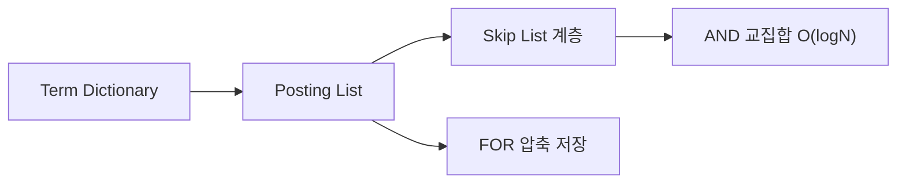
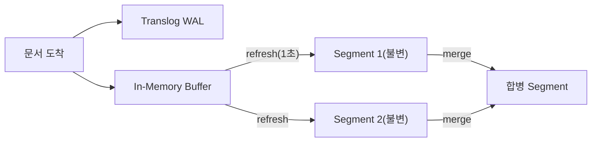
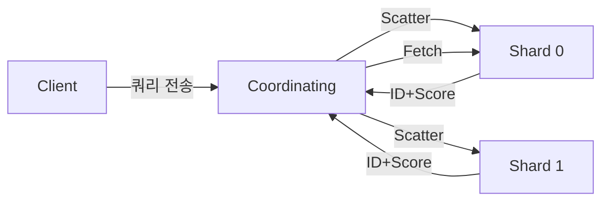
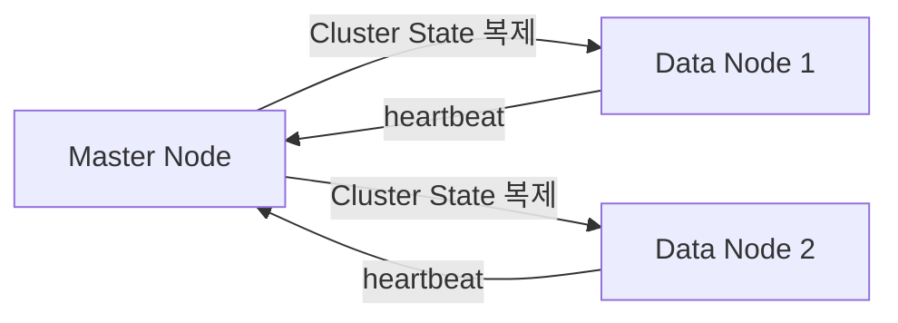
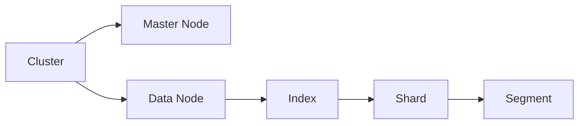

"상품명에 '무선 이어폰'이 포함된 결과를 0.05초 안에 보여줘야 합니다." RDBMS의 `LIKE '%무선 이어폰%'`은 100만 건에서 수 초가 걸린다. Elasticsearch는 **역인덱스(Inverted Index)** 구조 덕분에 수억 건에서도 밀리초 단위로 응답한다. 이 글에서는 Elasticsearch가 그 속도를 어떻게 달성하는지, 내부 메커니즘을 Lucene 레벨까지 파헤치고, Java/Spring 실전 코드와 함께 면접에서 WHY까지 설명할 수 있는 수준으로 다룬다.

---

## 1. 역인덱스 — 내부 자료구조까지

### 1-1. 왜 LIKE 검색은 느린가

RDBMS의 B-Tree 인덱스는 **행 ID → 값** 방향이다. `WHERE name = '이어폰'`처럼 값이 완전히 일치할 때 O(log N)으로 찾는다. 하지만 `WHERE name LIKE '%이어폰%'`은 인덱스를 쓸 수 없다. B-Tree는 값의 **앞부분**이 고정되어야 이진 탐색이 가능한데, `%`가 앞에 붙으면 어디서부터 비교해야 할지 모르기 때문이다. 결과적으로 테이블 풀스캔(Full Table Scan)이 발생한다. 1억 행에서 이 연산은 수십 초다.

역인덱스는 이 방향을 완전히 뒤집는다. **단어(Term) → 문서 ID 목록(Posting List)**. 특정 단어가 어떤 문서에 있는지를 미리 구축해 놓는다. "이어폰"을 검색하면 "이어폰"이라는 Term의 Posting List를 직접 조회한다. 풀스캔이 없다.

> **비유:** B-Tree 인덱스는 책의 **목차**다. "3장 내용이 뭐야?"라는 질문에 빠르다. 역인덱스는 책 뒷면의 **색인(찾아보기)** 이다. "'분산 시스템'이 나오는 페이지는?" 색인을 보면 42쪽, 87쪽, 153쪽을 즉시 알 수 있다. 전체 책을 다 읽을 필요가 없다.

### 1-2. Term Dictionary — FST(Finite State Transducer)

Term Dictionary는 인덱스에 등장한 **모든 고유 단어를 정렬 저장**한 구조다. 단순 배열로 저장하면 이진 탐색으로 O(log N)이지만, Lucene은 여기에 **FST(Finite State Transducer)** 를 사용한다.

FST는 Trie(트라이)의 압축 버전이다. "무선", "무선랜", "무선이어폰"이라는 세 단어가 있다면 공통 접두사 "무선"을 하나의 상태로 공유하고, 이후 분기점만 별도로 저장한다. 전체 단어를 메모리에 올려두지 않아도 되므로, 수천만 개의 Term을 수백 MB에 압축하여 **메모리에 상주**시킬 수 있다. Term 하나를 찾는 데 O(길이)만 걸리고, 메모리에서 처리되므로 디스크 I/O가 없다.

FST가 특히 강력한 이유는 **prefix/range 쿼리**다. "무선"으로 시작하는 모든 단어를 찾을 때 FST는 "무선" 상태에서 파생되는 모든 경로를 O(결과 수)에 탐색한다.

### 1-3. Posting List — Skip List와 Frame of Reference 압축

Posting List는 각 Term이 출현하는 **문서 ID의 정렬된 배열**이다. "이어폰"이 Doc 1, 5, 9, 23, 44...에 있다면 `[1, 5, 9, 23, 44, ...]`로 저장된다.

이 목록이 수백만 개가 되면 두 가지 문제가 생긴다. 첫째, 검색어 두 개의 AND 연산(교집합)을 어떻게 빠르게 하는가. 둘째, 디스크 공간이 너무 크다.

**Skip List로 빠른 교집합:** "무선"의 Posting List와 "이어폰"의 Posting List를 AND 연산할 때, 두 목록을 처음부터 비교하면 O(M+N)이다. Lucene은 Posting List에 **Skip List 계층**을 추가한다. 약 128개 항목마다 점프 포인트를 두어, 한쪽 목록의 ID가 다른 쪽보다 훨씬 크면 중간 항목을 건너뛰어 O(log N)에 근접하게 교집합을 구한다.

**Frame of Reference(FOR) 압축:** 문서 ID 대신 **델타(차이값)** 을 저장한다. `[1, 5, 9, 23, 44]` → `[1, 4, 4, 14, 21]`. 델타는 원본 ID보다 훨씬 작은 수이므로, 비트 패킹으로 압축률이 크게 높아진다. 실제로 Lucene은 Posting List를 읽을 때 대부분 OS 파일 캐시에서 처리하므로, 압축률이 높을수록 더 많은 데이터가 RAM에 올라온다.



### 1-4. 추가 저장 정보 — Position, Offset, Payload

Posting List는 문서 ID만 저장하는 것이 아니다. 다음 정보도 함께 저장할 수 있다.

- **Term Frequency(TF):** 문서 내 해당 단어 출현 횟수. 관련도 점수 계산에 사용.
- **Position:** 문서 내 단어 위치(토큰 순서). `match_phrase` 쿼리와 proximity 검색에 필요.
- **Offset:** 원본 텍스트에서 단어의 시작·끝 문자 위치. 하이라이팅(Highlighting)에 사용.
- **Payload:** 사용자 정의 데이터를 토큰에 부착. 예: 단어 중요도 가중치.

저장 공간과 성능의 트레이드오프 때문에 Elasticsearch는 매핑에서 이 정보를 선택적으로 활성화한다. `"index_options": "docs"`는 문서 ID만, `"positions"`는 TF와 Position까지, `"offsets"`는 Offset까지 저장한다.

---

## 2. Lucene 세그먼트 불변성 — WHY Append-Only인가

### 2-1. 세그먼트란 무엇인가

Elasticsearch는 내부적으로 **Apache Lucene** 라이브러리를 사용한다. Lucene의 핵심 개념이 **세그먼트(Segment)** 다. 세그먼트는 역인덱스의 **불변(Immutable) 조각**이다. 문서가 인덱싱되면 메모리 버퍼에 쌓이다가, refresh 시점에 디스크에 새로운 세그먼트로 기록된다. 한 번 기록된 세그먼트는 **절대 수정되지 않는다.**

> **비유:** 세그먼트는 **이미 인쇄된 책**이다. 내용을 수정하려면 책 자체를 고치는 게 아니라, 해당 페이지에 "삭제됨" 스티커를 붙이고(Soft Delete), 나중에 개정판(Merge)을 출판할 때 비로소 스티커 붙은 페이지를 빼고 새 내용을 담는다.

### 2-2. WHY Append-Only인가 — 4가지 이유

**이유 1: 동시성 제어 비용 제로.** 불변 구조는 Read 시 락이 전혀 필요 없다. 여러 검색 스레드가 동시에 같은 세그먼트를 읽어도 경합(Race Condition)이 없다. 반면 B-Tree처럼 In-Place 수정 구조는 읽기와 쓰기가 같은 페이지에 경합하므로 Read-Write Lock이 필요하다. 고처리량 검색 엔진에서 이 락 비용은 치명적이다.

**이유 2: OS 파일 캐시 최대 활용.** 세그먼트는 불변이므로 OS가 파일을 캐시에 올려두면 무효화(Invalidation)가 발생하지 않는다. 자주 검색되는 Hot 세그먼트는 RAM에 영구적으로 상주하여 디스크 I/O 없이 처리된다. 가변 파일이라면 쓰기 시마다 캐시를 무효화해야 한다.

**이유 3: 안전한 순차 쓰기.** 새 데이터는 항상 새 세그먼트로 순차 기록된다. HDD에서 순차 쓰기는 랜덤 I/O보다 10~100배 빠르다. SSD에서도 순차 쓰기는 Write Amplification을 줄인다.

**이유 4: 간단한 복구.** 세그먼트는 한 번 완전히 기록되면 손상될 이유가 없다. 손상된 세그먼트가 있으면 해당 세그먼트만 건너뛰면 된다(Translog로 복구). 가변 구조에서 쓰기 중 전원이 꺼지면 페이지 일부만 기록된 "Torn Write" 문제가 생긴다.



### 2-3. Soft Delete와 Delete Bitmap

문서를 삭제하거나 수정하면 기존 세그먼트를 건드리지 않는다. 대신 각 세그먼트에는 **삭제 비트맵(Delete Bitmap)** 파일(`.liv`)이 별도로 존재한다. 삭제된 문서의 ID를 이 비트맵에 표시한다. 검색 시 Lucene은 Posting List를 순회하면서 비트맵에 표시된 문서를 건너뛴다.

문서 업데이트는 **Delete + Insert**다. 기존 문서를 Soft Delete하고 새 내용을 새 세그먼트에 Insert한다. 이 때문에 Elasticsearch에서 대량 업데이트는 삭제된 문서의 공간이 즉시 회수되지 않는다.

**왜 비트맵을 별도 파일로 두는가?** 세그먼트 파일 자체를 수정하면 불변성이 깨진다. 비트맵은 세그먼트와 독립된 파일이므로 세그먼트를 건드리지 않고 삭제 정보를 추가할 수 있다. 세그먼트 병합(Merge) 시 비트맵에 표시된 문서를 제외하고 새 세그먼트를 만들어 디스크를 실제로 회수한다.

### 2-4. Refresh vs Flush vs Merge — 세 가지 작업의 차이

이 세 가지는 자주 혼동되므로 정확히 구분해야 한다.

**Refresh (기본: 1초):** In-Memory Buffer의 내용을 새 Lucene 세그먼트로 만들어 **검색 가능**하게 한다. 데이터는 아직 OS 버퍼 캐시에 있고, 디스크에 fsync(강제 기록)되지 않았다. 노드가 죽으면 유실될 수 있다.

**Flush (기본: 5초 또는 Translog 512MB):** OS 버퍼 캐시에 있는 세그먼트를 실제 디스크에 **fsync**하고, Translog를 비운다. Flush 이후에야 데이터가 디스크에 안전하게 저장된다. Flush는 I/O 비용이 크므로 너무 자주 발생하면 성능 저하가 생긴다.

**Merge (백그라운드 자동):** 작은 세그먼트들을 **병합하여 큰 세그먼트**를 만든다. Soft Delete된 문서를 실제로 제거한다. Merge는 CPU와 I/O를 많이 사용하므로 Elasticsearch는 백그라운드에서 자동으로 수행하며 `index.merge.scheduler.max_thread_count`로 제어한다.

| 작업 | 트리거 | 목적 | fsync |
|------|--------|------|-------|
| Refresh | 1초 주기 | 검색 가능성 | X |
| Flush | 5초/512MB | 디스크 영속 | O |
| Merge | 자동(백그라운드) | 세그먼트 정리 | O |

### 2-5. Near Real-Time(NRT) 검색의 정확한 의미

"실시간 검색"이라고 하면 인덱싱 즉시 검색되는 것을 기대하지만, Elasticsearch는 **Near Real-Time**이다. 인덱싱 후 Refresh(기본 1초)가 되어야 검색에 나타난다.

WHY 1초인가? Refresh마다 새 세그먼트가 생긴다. 세그먼트가 너무 많아지면 검색 시 각 세그먼트를 순회하는 비용이 늘어나고, 파일 디스크립터 소모도 증가한다. 1초 주기는 이 트레이드오프의 균형점이다.

진짜 즉시 검색이 필요하다면 인덱싱 요청에 `?refresh=wait_for`를 붙이면 된다. Elasticsearch는 해당 문서가 refresh되어 검색 가능해질 때까지 응답을 지연한다. 단, 이 옵션은 refresh를 강제하는 것이 아니라 다음 refresh 시점을 기다리는 것이므로, 최대 `refresh_interval`만큼 지연이 생긴다.

---

## 3. 관련도 점수 — BM25 vs TF-IDF, 내부 계산 원리

### 3-1. TF-IDF의 직관

검색 결과의 순서는 **관련도 점수(Relevance Score)** 로 결정된다. 전통적으로 TF-IDF가 사용되었다.

- **TF(Term Frequency):** 문서 내 단어 출현 횟수. "이어폰"이 10번 나온 문서는 1번 나온 문서보다 관련성이 높다.
- **IDF(Inverse Document Frequency):** 전체 문서 중 해당 단어가 나오는 문서의 역수 로그. "이어폰"이 1,000개 문서 중 10개에만 있으면 IDF가 높다(희귀하므로 중요). "그리고"가 990개 문서에 있으면 IDF가 낮다(흔하므로 덜 중요).

**TF-IDF의 문제점:** TF가 선형적으로 증가한다. "이어폰"이 100번 나온 문서는 1번 나온 문서보다 100배 관련성이 높다고 계산한다. 하지만 실제로는 10번이면 충분히 관련 있고, 100번이라고 해서 10배 더 관련있지는 않다. 또한 문서 길이를 고려하지 않는다. 긴 문서는 자연히 TF가 높아 유리해진다.

### 3-2. BM25 — Elasticsearch 기본 스코어링 알고리즘

Elasticsearch 5.0부터 기본 관련도 알고리즘이 TF-IDF에서 **BM25(Best Match 25)** 로 변경되었다. BM25는 두 가지 핵심 개선을 도입한다.

**TF 포화(Saturation):** TF가 증가할수록 점수 증가가 **둔화**된다. 수식 `TF / (TF + k1 * (1 - b + b * docLen/avgDocLen))`에서 TF가 아무리 커도 점수는 `(k1+1)` 이상으로 증가하지 않는다. `k1`(기본값 1.2)은 포화 속도를, `b`(기본값 0.75)는 문서 길이 정규화 강도를 제어한다.

**문서 길이 정규화:** 짧은 문서에서 "이어폰"이 1번 나온 것과, 1만 단어 문서에서 "이어폰"이 1번 나온 것은 다르다. BM25는 평균 문서 길이(`avgDocLen`) 대비 현재 문서 길이 비율로 TF를 보정한다.

> **비유:** TF-IDF는 단어 출현 횟수를 **선형 가중치**로 본다. BM25는 "첫 등장이 가장 중요하고, 이후 등장은 점점 덜 중요해진다"는 **수익 체감 법칙**을 적용한다. 맛집을 처음 발견했을 때 감동이 크고, 열 번째 방문은 첫 방문만큼 설레지 않는 것과 같다.

```java
// Spring Data Elasticsearch에서 BM25 파라미터 커스터마이징
PUT /products
{
  "settings": {
    "similarity": {
      "custom_bm25": {
        "type": "BM25",
        "k1": 1.5,   // TF 포화 속도: 높을수록 TF 영향이 오래 지속
        "b": 0.5     // 길이 정규화: 0=비활성, 1=완전 정규화
      }
    }
  },
  "mappings": {
    "properties": {
      "name": {
        "type": "text",
        "similarity": "custom_bm25"
      }
    }
  }
}
```

### 3-3. 점수 계산 과정 추적 — Explain API

실제 쿼리에서 점수가 어떻게 계산되는지 확인하려면 Explain API를 사용한다. 면접에서 "검색 결과 순서가 예상과 다를 때 어떻게 디버깅하는가?"라는 질문에 이 API를 언급하면 인상적이다.

```java
// ElasticsearchClient (새 Java API)로 Explain 쿼리
@Service
@RequiredArgsConstructor
public class ScoreDebugService {

    private final ElasticsearchClient client;

    public ExplainResponse<Product> explainScore(String indexName,
                                                  String docId,
                                                  String keyword) throws IOException {
        return client.explain(e -> e
            .index(indexName)
            .id(docId)
            .query(q -> q
                .match(m -> m
                    .field("name")
                    .query(keyword)
                )
            ),
            Product.class
        );
    }
}
```

Explain 결과에는 `idf`, `tfNorm`(BM25의 TF), `fieldNorm`(필드 길이 정규화) 값이 단계별로 나온다. "왜 이 문서가 저 문서보다 낮은 점수를 받았는가"를 수치로 확인할 수 있다.

### 3-4. Function Score — 비즈니스 로직으로 점수 보정

BM25 점수만으로는 비즈니스 요구를 충족하기 어렵다. 예를 들어 "관련도가 비슷하면 신상품을 위에 보여주고 싶다", "인기 상품에 가중치를 주고 싶다"는 요구가 있다. 이때 **Function Score Query**를 사용한다.

```java
// ElasticsearchOperations로 Function Score 쿼리
@Service
@RequiredArgsConstructor
public class ProductRankingService {

    private final ElasticsearchOperations operations;

    public SearchHits<Product> searchWithRanking(String keyword) {
        // BM25 관련도 점수 + 인기도 필드 + 신규 상품 부스트 결합
        NativeQuery query = NativeQuery.builder()
            .withQuery(q -> q
                .functionScore(fs -> fs
                    .query(inner -> inner
                        .match(m -> m.field("name").query(keyword))
                    )
                    // 인기도 점수(0~1)를 관련도에 곱셈
                    .functions(fn -> fn
                        .fieldValueFactor(fvf -> fvf
                            .field("popularity_score")
                            .factor(1.2)
                            .modifier(FieldValueFactorModifier.Sqrt)
                            .missing(1.0)
                        )
                    )
                    // 7일 이내 신상품: 관련도 * 1.5
                    .functions(fn -> fn
                        .filter(f -> f
                            .range(r -> r
                                .field("created_at")
                                .gte(JsonData.of("now-7d/d"))
                            )
                        )
                        .weight(1.5)
                    )
                    .scoreMode(FunctionScoreMode.Multiply)
                    .boostMode(FunctionBoostMode.Multiply)
                )
            )
            .withPageable(PageRequest.of(0, 20))
            .build();

        return operations.search(query, Product.class);
    }
}
```

---

## 4. 샤드 라우팅 — _id 해시의 내부 메커니즘

### 4-1. 문서가 어느 샤드에 저장되는가

문서를 인덱싱하면 Elasticsearch는 해당 문서가 어느 Primary Shard에 저장될지 결정한다. 기본 라우팅 공식은 다음과 같다.

```
shard = hash(_routing) % number_of_primary_shards
```

`_routing`의 기본값은 문서의 `_id`다. `hash()`는 Elasticsearch가 내부적으로 사용하는 MurmurHash3다. 이 결과를 Primary Shard 수로 나눈 나머지가 샤드 번호다.

**이것이 왜 Primary Shard 수를 변경할 수 없는 이유다.** Primary Shard가 5개일 때 `hash("doc_123") % 5 = 3`이라면 Shard 3에 저장된다. 나중에 Shard 수를 10개로 늘리면 `hash("doc_123") % 10 = ?`이 바뀌므로, 기존 문서를 찾을 수 없게 된다. 따라서 Shard 수 변경은 전체 Reindex가 필요하다.

> **비유:** Shard 라우팅은 **우체국 구역 배정**이다. 우편번호(해시값)의 끝자리로 어느 지점(Shard)에서 처리할지 결정한다. 지점 수(Shard 수)가 바뀌면 모든 우편물의 배정을 재계산해야 한다.

### 4-2. 커스텀 라우팅 — 관련 문서를 같은 샤드에

기본 라우팅은 데이터를 균등하게 분산시키지만, 특정 쿼리 패턴에서는 **모든 샤드를 조회**해야 한다. 예를 들어 "사용자 ID가 123인 사람의 주문 목록"을 검색하면, 그 사람의 주문이 5개 Shard에 분산되어 있으므로 5개 Shard 모두에 쿼리를 날려야 한다.

커스텀 라우팅을 사용하면 특정 키로 관련 문서를 같은 Shard에 모을 수 있다.

```java
// 커스텀 라우팅으로 같은 사용자의 주문을 같은 Shard에
@Document(indexName = "orders")
@Routing("userId")   // userId 값으로 Shard 결정
public class Order {
    @Id
    private String id;
    private String userId;
    private List<OrderItem> items;
    private BigDecimal totalPrice;
}

// 인덱싱 시 routing 지정
@Service
@RequiredArgsConstructor
public class OrderIndexService {

    private final ElasticsearchOperations operations;

    public void indexOrder(Order order) {
        IndexQuery indexQuery = new IndexQueryBuilder()
            .withId(order.getId())
            .withObject(order)
            .withRouting(order.getUserId())  // 같은 userId → 같은 Shard
            .build();
        operations.index(indexQuery, IndexCoordinates.of("orders"));
    }

    // 조회 시에도 routing 지정 → 단일 Shard만 조회
    public SearchHits<Order> findUserOrders(String userId) {
        NativeQuery query = NativeQuery.builder()
            .withQuery(q -> q
                .term(t -> t.field("userId").value(userId))
            )
            .withRoute(userId)  // 이 userId의 문서가 있는 Shard만 조회
            .build();
        return operations.search(query, Order.class);
    }
}
```

커스텀 라우팅의 단점은 **데이터 쏠림(Hotspot)** 이다. 주문이 많은 사용자의 Shard가 다른 Shard보다 훨씬 커질 수 있다. 적절한 라우팅 키 선택이 중요하다.

### 4-3. 검색 시 Scatter-Gather 내부 동작

클라이언트가 검색 쿼리를 보내면 다음과 같은 두 단계 과정이 진행된다.

**Query Phase (Scatter):** Coordinating 노드가 해당 인덱스의 모든 Shard(Primary 또는 Replica 중 Round-Robin으로 선택)에 쿼리를 병렬 전송한다. 각 Shard는 로컬에서 검색을 수행하고 **상위 N개 문서의 ID와 점수만** 반환한다. 전체 문서 내용은 아직 보내지 않는다.

**Fetch Phase (Gather):** Coordinating 노드가 모든 Shard의 응답을 모아 전체 정렬을 수행한다. 최종 상위 N개 문서를 결정한 뒤, 해당 문서가 있는 Shard에 **실제 문서 내용(_source)을 요청**한다.

이 두 단계 분리가 중요한 이유는 네트워크 전송 최적화다. Query Phase에서 모든 Shard가 전체 문서를 보내면 네트워크가 폭발한다. ID와 점수만 보내고, Coordinating 노드에서 최종 선택 후 필요한 문서만 Fetch한다.



---

## 5. 클러스터 상태(Cluster State)와 레플리카 전략

### 5-1. Cluster State란 무엇인가

Cluster State는 Elasticsearch 클러스터의 **전체 메타데이터**다. Master Node가 관리하고, 모든 Data Node에 복제된다. 다음 정보를 포함한다.

- 모든 인덱스의 설정, 매핑, 별칭(Alias)
- 각 샤드가 어느 노드에 할당되어 있는지
- 현재 살아있는 노드 목록
- 클러스터 전체의 건강 상태



Cluster State가 크면 문제가 된다. 인덱스 수천 개, 매핑 필드 수만 개가 쌓이면 Cluster State가 수백 MB가 되어 Master Node 메모리를 압박하고, State 전파 시간이 길어진다. 이것이 "mapping explosion"이 위험한 이유다.

### 5-2. Master Node 선출 — Zen Discovery와 Quorum

Elasticsearch 7.x부터 자체 Raft 기반 합의 알고리즘을 사용한다. Master-eligible 노드들이 서로 Ping을 교환하고, **과반수(Quorum, N/2+1)** 가 동의해야 새 Master를 선출한다.

3개 Master-eligible 노드가 있을 때 Quorum은 2다. 노드 1개가 죽어도 나머지 2개가 Quorum을 충족하여 새 Master를 선출한다. 하지만 2개가 동시에 죽으면 남은 1개가 Quorum을 충족하지 못해 Master를 선출할 수 없고, 클러스터가 쓰기 불가 상태가 된다.

**Split-Brain 방지:** 네트워크 파티션이 발생하여 노드 3개가 2+1로 분리되면, 각 파티션이 독립적으로 Master를 선출하면 두 Master가 공존하는 Split-Brain이 발생한다. Quorum 과반수 요구는 이를 방지한다. 분리된 그룹 중 Quorum을 충족하는 그룹만 Master를 선출하고, 나머지는 대기한다. 이를 위해 Master-eligible 노드는 반드시 **홀수 개(3, 5, 7)** 로 설정해야 한다.

### 5-3. 레플리카 전략과 읽기 성능

Replica는 단순한 백업이 아니다. **읽기 요청을 Primary와 Replica에 분산**하여 처리량을 높인다. Coordinating 노드는 Shard의 Primary와 모든 Replica를 알고 있으며, Round-Robin으로 요청을 분배한다.

`number_of_replicas`를 2로 설정하면 데이터가 3개 복사본(Primary 1 + Replica 2)으로 유지된다. 읽기 처리량은 3배, 하지만 쓰기 시 3개 노드 모두에 복제해야 하므로 쓰기 비용도 3배다.

```java
// Spring Boot에서 인덱스 생성 시 Replica 수 설정
@Configuration
public class ElasticsearchIndexConfig {

    @Bean
    public IndexOperations productIndexOps(ElasticsearchOperations operations) {
        IndexOperations indexOps = operations.indexOps(Product.class);
        if (!indexOps.exists()) {
            IndexSettings settings = new IndexSettings.Builder()
                .numberOfShards(3)
                .numberOfReplicas(1)
                .refreshInterval("1s")
                .build();
            indexOps.create(settings);
            indexOps.putMapping();
        }
        return indexOps;
    }
}
```

---

## 6. 매핑 타입 — text vs keyword 내부 차이

### 6-1. text 타입의 분석 파이프라인

`text` 타입 필드는 인덱싱 시 **분석기(Analyzer)** 를 통과한다. 분석기는 세 단계로 구성된다.


**Char Filter:** 원본 텍스트를 변환한다. HTML 태그 제거(`html_strip`), 특수문자 치환 등. 예: `"<b>무선 이어폰</b>"` → `"무선 이어폰"`.

**Tokenizer:** 텍스트를 Token(단어) 단위로 분리한다. `standard` tokenizer는 공백과 구두점으로 분리한다. `nori_tokenizer`는 한국어 형태소 단위로 분리한다.

**Token Filter:** 각 Token을 변환한다. `lowercase`(대소문자 통일), `stop`(불용어 제거), `synonym`(동의어 확장), `stemmer`(어간 추출) 등.

최종적으로 분석된 Token들이 역인덱스에 저장된다. **원본 텍스트는 `_source`에만 보존**되고, 역인덱스에는 분석된 Token만 들어간다. 따라서 `text` 필드는 정렬이나 집계에 사용할 수 없다.

### 6-2. keyword 타입 — 분석 없이 원본 저장

`keyword` 타입은 분석기를 거치지 않는다. 원본 문자열 전체를 하나의 Term으로 역인덱스에 저장한다. "삼성전자"를 keyword로 저장하면 역인덱스에 "삼성전자"가 그대로 들어간다. `term` 쿼리로 정확히 일치하는 문서를 찾거나, 집계(Aggregation), 정렬에 사용한다.

`keyword` 필드에는 `ignore_above` 설정이 있다. 기본값은 256자로, 이보다 긴 문자열은 인덱싱하지 않는다. 주로 URL이나 긴 식별자에서 성능 문제를 방지한다.

### 6-3. Multi-field 매핑 — text와 keyword 동시 사용

실무에서는 같은 필드에 전문 검색과 집계를 모두 필요로 하는 경우가 많다. Multi-field 매핑으로 해결한다.

```java
@Document(indexName = "products")
public class Product {

    @Id
    private String id;

    // text: 전문 검색용, keyword: 집계/정렬용
    @MultiField(
        mainField = @Field(type = FieldType.Text, analyzer = "korean"),
        otherFields = {
            @InnerField(suffix = "keyword", type = FieldType.Keyword),
            @InnerField(suffix = "ngram", type = FieldType.Text, analyzer = "ngram_analyzer")
        }
    )
    private String name;

    @Field(type = FieldType.Keyword)
    private String category;

    @Field(type = FieldType.Integer)
    private Integer price;

    @Field(type = FieldType.Float)
    private Float popularityScore;

    @Field(type = FieldType.Date, format = DateFormat.date_hour_minute_second)
    private LocalDateTime createdAt;

    @Field(type = FieldType.Boolean)
    private boolean inStock;
}

/*
 * 사용 패턴:
 * - name (text, korean): match 쿼리로 전문 검색
 * - name.keyword (keyword): terms 집계, 정렬
 * - name.ngram (text, ngram): 부분 문자열 검색 (자동완성)
 */
```

---

## 7. 분석기 파이프라인 — Nori 한국어 분석기 심층

### 7-1. 한국어 분석의 특수성

영어는 공백으로 단어를 구분할 수 있다. "wireless earphone" → ["wireless", "earphone"]. 한국어는 다르다.

- **교착어:** "먹었습니다" → "먹" + "었" + "습니다". 어간 "먹"을 추출해야 "먹다", "먹고", "먹었다"로 검색해도 같은 문서가 나온다.
- **복합명사:** "삼성전자주식회사" → "삼성전자" + "주식회사" 또는 "삼성" + "전자" + "주식" + "회사". 분해 수준에 따라 검색 결과가 달라진다.
- **동음이의어:** "배" → 과일, 신체 부위, 선박. 문맥 없이 의미 구분이 어렵다.

Standard Analyzer로 한국어를 처리하면 공백만으로 분리하므로 형태소 분석이 전혀 안 된다. "삼성전자 무선이어폰 구매"는 `["삼성전자", "무선이어폰", "구매"]`가 되어, "무선"으로 검색하면 이 문서가 안 나온다.

### 7-2. Nori 분석기 설정과 decompound_mode

```java
// Nori 분석기 설정 (settings.json)
{
  "settings": {
    "analysis": {
      "tokenizer": {
        "nori_discard": {
          "type": "nori_tokenizer",
          "decompound_mode": "discard",   // 복합명사를 분해만 (원본 제거)
          "user_dictionary": "user_dict.txt"  // 사용자 정의 사전
        },
        "nori_mixed": {
          "type": "nori_tokenizer",
          "decompound_mode": "mixed"       // 복합명사와 분해어 모두 인덱싱
        }
      },
      "filter": {
        "nori_pos_filter": {
          "type": "nori_part_of_speech",
          // 불필요한 품사 제거: 조사, 어미, 접속사, 의존명사
          "stoptags": ["E", "J", "SC", "SE", "SF", "VCN", "VCP", "VX", "XPN", "XSA", "XSN", "XSV", "UNA", "NA", "VSV"]
        }
      },
      "analyzer": {
        "korean_search": {
          "type": "custom",
          "tokenizer": "nori_mixed",
          "filter": ["nori_readingform", "nori_pos_filter", "lowercase"]
        },
        "korean_index": {
          "type": "custom",
          "tokenizer": "nori_discard",
          "filter": ["nori_readingform", "nori_pos_filter", "lowercase", "synonym_filter"]
        }
      }
    }
  }
}
```

**decompound_mode 3가지 차이:**

| 모드 | "삼성전자" 처리 결과 | 특징 |
|------|---------------------|------|
| `none` | ["삼성전자"] | 분해 안 함. "삼성"으로 검색 안 됨 |
| `discard` | ["삼성", "전자"] | 복합명사 제거, 서브워드만. "삼성전자"로 검색 안 됨 |
| `mixed` | ["삼성전자", "삼성", "전자"] | 원본 + 서브워드. 가장 높은 재현율 |

**WHY mixed를 권장하는가?** 사용자는 "삼성전자"로도 검색하고 "삼성"으로도 검색한다. `mixed`는 두 경우 모두 결과를 반환한다. 디스크 공간은 더 쓰지만 검색 품질이 크게 향상된다.

### 7-3. 사용자 정의 사전과 동의어

신조어, 브랜드명, 도메인 특화 용어는 공개 사전에 없어 분석이 잘못될 수 있다. Nori는 사용자 정의 사전(`user_dictionary`)을 지원한다.

```
# user_dict.txt
# 고유명사 → 분해하지 않도록 등록
아이폰
갤럭시탭
맥북프로
에어팟프로
```

동의어 필터는 검색 재현율을 높이는 강력한 도구다.

```java
// 동의어 설정
{
  "filter": {
    "synonym_filter": {
      "type": "synonym_graph",
      "synonyms": [
        "이어폰, 헤드폰, 이어버드",
        "TV, 텔레비전, 티비",
        "노트북, 랩탑, 포터블 PC"
      ]
    }
  }
}
```

동의어 필터는 인덱싱 시와 검색 시 모두 적용할 수 있다. 일반적으로 **검색 시에만** 동의어를 확장하는 것을 권장한다. 인덱싱 시 동의어를 넣으면 인덱스 크기가 커지고, 동의어 목록 변경 시 전체 Reindex가 필요하다.

---

## 8. Bulk API 성능 — 내부 동작과 최적 크기 결정

### 8-1. 단건 인덱싱의 오버헤드

문서를 하나씩 인덱싱하면 매 요청마다 다음 작업이 반복된다.

1. HTTP 연결 수립(또는 Keep-Alive 재사용)
2. 요청 파싱, 라우팅 결정
3. Translog에 기록(fsync 옵션에 따라 다름)
4. In-Memory Buffer에 추가
5. Primary → Replica 복제
6. HTTP 응답 반환

이 오버헤드를 초당 10만 건에 적용하면 초당 10만 번의 TCP 왕복, 10만 번의 Translog 기록, 10만 번의 복제가 발생한다. 이는 현실적으로 불가능하다.

**Bulk API는 이 오버헤드를 N건으로 나눈다.** 5,000건을 하나의 Bulk 요청으로 보내면 HTTP 연결 1회, Translog 기록 1회(여러 문서를 한 번에), 복제 1회로 처리한다.

> **비유:** 단건 인덱싱은 **편의점 택배 하나씩 보내기**다. Bulk는 **화물 트럭에 1,000개 쌓아서 한 번에 보내기**다. 트럭 운행 비용(HTTP 오버헤드)은 같지만, 처리하는 물건 수가 1,000배다.

### 8-2. 최적 Bulk 크기 결정 근거

Elastic 공식 문서는 "Bulk 요청당 5~15MB"를 권장한다. 그 이유는 다음과 같다.

**하한(5MB 미만):** Bulk 묶음이 작으면 단건과 비교했을 때 HTTP 오버헤드 절감 효과가 적다. 잦은 요청으로 Coordinating 노드의 Thread Pool이 소모된다.

**상한(15MB 초과):** 단일 요청의 메모리 점유가 커진다. Coordinating 노드에서 요청을 파싱하고 각 Shard로 분배할 때 힙 메모리를 압박한다. GC Pause가 발생하면 해당 요청의 레이턴시가 치솟는다. 실패 시 재시도할 데이터 양도 과도하다.

**문서 크기와 묶음 수:** 문서 하나가 평균 500B이면 5MB = 10,000건, 2KB이면 5MB = 2,500건. 고정 묶음 수보다 **고정 크기(5~15MB)** 기준으로 묶는 것이 정확하다.

### 8-3. Java BulkProcessor — 자동 배치 처리

```java
// ElasticsearchClient를 사용한 BulkIngester (최신 Java API)
@Service
@RequiredArgsConstructor
public class BulkIndexingService {

    private final ElasticsearchClient client;

    /**
     * BulkIngester: 크기/시간 기반 자동 플러시
     * - 요청 크기가 5MB 초과 시 자동 전송
     * - 1000건 누적 시 자동 전송
     * - 500ms 경과 시 자동 전송 (타이머 기반)
     */
    public void bulkIndexProducts(List<Product> products) throws IOException {
        try (BulkIngester<Void> ingester = BulkIngester.of(b -> b
                .client(client)
                .maxOperations(1000)         // 1000건 임계값
                .maxSize(5 * 1024 * 1024L)   // 5MB 임계값
                .flushInterval(500, TimeUnit.MILLISECONDS)
                .listener(new BulkListener<>() {
                    @Override
                    public void beforeBulk(long executionId,
                                           BulkRequest request,
                                           List<Void> contexts) {
                        log.info("Bulk 전송 시작: {} 건", request.operations().size());
                    }

                    @Override
                    public void afterBulk(long executionId,
                                          BulkRequest request,
                                          List<Void> contexts,
                                          BulkResponse response) {
                        if (response.errors()) {
                            // 개별 실패 항목 처리
                            response.items().stream()
                                .filter(item -> item.error() != null)
                                .forEach(item -> log.error(
                                    "인덱싱 실패: id={}, error={}",
                                    item.id(), item.error().reason()
                                ));
                        }
                    }

                    @Override
                    public void afterBulk(long executionId,
                                          BulkRequest request,
                                          List<Void> contexts,
                                          Throwable failure) {
                        log.error("Bulk 전체 실패: {}", failure.getMessage());
                    }
                })
        )) {
            for (Product product : products) {
                ingester.add(op -> op
                    .index(idx -> idx
                        .index("products")
                        .id(product.getId())
                        .document(product)
                    )
                );
            }
        } // try-with-resources: 남은 항목 자동 flush
    }

    /**
     * 대량 초기 인덱싱 최적화 설정
     * - refresh_interval: -1 (검색 가능성 포기, 쓰기 성능 극대화)
     * - replicas: 0 (복제 비활성, 쓰기 2배 빠름)
     */
    public void setInitialIndexingMode(String indexName) throws IOException {
        client.indices().putSettings(s -> s
            .index(indexName)
            .settings(settings -> settings
                .refreshInterval(ri -> ri.time("-1"))
                .numberOfReplicas("0")
            )
        );
    }

    public void restoreProductionMode(String indexName) throws IOException {
        // 인덱싱 완료 후 설정 복구
        client.indices().putSettings(s -> s
            .index(indexName)
            .settings(settings -> settings
                .refreshInterval(ri -> ri.time("1s"))
                .numberOfReplicas("1")
            )
        );
        // 수동 refresh로 즉시 검색 가능하게
        client.indices().refresh(r -> r.index(indexName));
        // 세그먼트 병합으로 검색 성능 최적화
        client.indices().forcemerge(f -> f
            .index(indexName)
            .maxNumSegments(1L)
        );
    }
}
```

---

## 9. Aggregation 내부 동작 — 메모리와 성능

### 9-1. Aggregation이 메모리를 쓰는 이유

Aggregation은 SQL의 `GROUP BY`와 달리 **메모리 내에서** 집계한다. Elasticsearch는 각 Shard에서 Aggregation을 독립적으로 계산한 뒤, Coordinating 노드에서 결과를 병합한다.

`terms` Aggregation으로 카테고리별 상품 수를 구하면, 각 Shard에서 카테고리별 버킷을 만들어 Coordinating 노드로 보낸다. 카테고리가 1,000개이고 Shard가 5개면, Coordinating 노드는 5,000개 버킷을 받아 병합한다. `size: 10`을 설정해도 각 Shard는 **`size * 1.5 + 10`개** 버킷을 반환한다(정확도 보장을 위해). 이것이 Aggregation에서 메모리 사용량이 예상보다 많아지는 이유다.

**정확도 vs 메모리 트레이드오프:** `shard_size`를 늘리면 정확도가 높아지지만 메모리를 더 쓴다. `shard_size`를 줄이면 빠르지만 결과가 부정확할 수 있다(`doc_count_error_upper_bound` 참고).

### 9-2. 카디널리티 Aggregation — HyperLogLog++

`cardinality` Aggregation은 고유 값의 수를 계산한다. 정확한 카디널리티 계산은 모든 고유 값을 Set에 저장해야 하므로 메모리 O(N)이 필요하다. 값이 수억 개면 불가능하다.

Elasticsearch는 **HyperLogLog++(HLL++)** 알고리즘으로 근사값을 계산한다. 오차율 약 5%지만 메모리는 O(1)에 가깝다. `precision_threshold`(기본 3000)로 정확도와 메모리 사용량을 조절한다.

```java
// 복합 Aggregation — 카테고리별 평균가격, 고유 브랜드 수, 가격 히스토그램
@Service
@RequiredArgsConstructor
public class ProductAggregationService {

    private final ElasticsearchClient client;

    public ProductStatsResult getProductStats() throws IOException {
        SearchResponse<Void> response = client.search(s -> s
            .index("products")
            .size(0)  // 문서 내용 불필요, 집계만
            .aggregations("by_category", a -> a
                .terms(t -> t
                    .field("category")
                    .size(50)
                    .order(List.of(NamedValue.of("avg_price", SortOrder.Desc)))
                )
                .aggregations("avg_price", sub -> sub
                    .avg(avg -> avg.field("price"))
                )
                .aggregations("unique_brands", sub -> sub
                    .cardinality(c -> c
                        .field("brand")
                        .precisionThreshold(1000)
                    )
                )
                .aggregations("price_ranges", sub -> sub
                    .range(r -> r
                        .field("price")
                        .ranges(
                            rv -> rv.to(50000.0),
                            rv -> rv.from(50000.0).to(150000.0),
                            rv -> rv.from(150000.0)
                        )
                    )
                )
            )
            .aggregations("price_histogram", a -> a
                .histogram(h -> h
                    .field("price")
                    .interval(10000.0)
                    .minDocCount(1L)
                )
            ),
            Void.class
        );

        // 결과 파싱
        StringTermsAggregate byCategory = response.aggregations()
            .get("by_category").sterms();

        List<CategoryStats> stats = byCategory.buckets().array().stream()
            .map(bucket -> {
                double avgPrice = bucket.aggregations()
                    .get("avg_price").avg().value();
                long uniqueBrands = bucket.aggregations()
                    .get("unique_brands").cardinality().value();

                return new CategoryStats(
                    bucket.key().stringValue(),
                    bucket.docCount(),
                    avgPrice,
                    uniqueBrands
                );
            })
            .toList();

        return new ProductStatsResult(stats);
    }
}
```

### 9-3. Aggregation과 검색을 동시에 — 패싯 검색

이커머스의 "필터 사이드바(패싯)"는 검색 결과와 집계를 동시에 처리한다. 검색 쿼리 결과를 집계하는 것이므로 한 번의 요청으로 처리할 수 있다. 단, 필터가 적용된 결과의 카운트(예: "전자기기(153)")와 필터 미적용 전체 카운트(예: 사이드바의 모든 카테고리 카운트)를 동시에 얻으려면 **Global Aggregation** 또는 **Post Filter**를 활용한다.

```java
// Post Filter: 검색 결과에는 필터 적용, 집계에는 필터 미적용
NativeQuery query = NativeQuery.builder()
    .withQuery(q -> q.match(m -> m.field("name").query("이어폰")))
    // 검색 결과에만 카테고리 필터 적용
    .withPostFilter(pf -> pf.term(t -> t.field("category").value("전자기기")))
    // 집계에는 필터 미적용 → 전체 카테고리별 카운트
    .withAggregation("all_categories", a -> AggregationBuilders
        .terms().field("category").size(20).build()._toAggregation()
    )
    .build();
```

---

## 10. Spring Data Elasticsearch 완전 연동

### 10-1. 의존성과 클라이언트 설정

Spring Boot 3.x에서 Elasticsearch 클라이언트는 두 가지다. 구버전 `RestHighLevelClient`(deprecated)와 신버전 `ElasticsearchClient`(Java API Client). Spring Data Elasticsearch 5.x는 두 클라이언트를 모두 지원하지만, 신규 프로젝트는 `ElasticsearchClient`를 사용해야 한다.

```java
// build.gradle
dependencies {
    implementation 'org.springframework.boot:spring-boot-starter-data-elasticsearch'
    // spring-boot-starter-data-elasticsearch 내부에 elasticsearch-java 포함
}

// application.yml
spring:
  elasticsearch:
    uris: http://es-node1:9200,http://es-node2:9200,http://es-node3:9200
    username: elastic
    password: ${ES_PASSWORD}
    connection-timeout: 10s
    socket-timeout: 30s

// 커넥션 풀 커스터마이징
@Configuration
public class ElasticsearchConfig extends ElasticsearchConfiguration {

    @Override
    public ClientConfiguration clientConfiguration() {
        return ClientConfiguration.builder()
            .connectedTo("es-node1:9200", "es-node2:9200", "es-node3:9200")
            .usingSsl()  // HTTPS
            .withBasicAuth("elastic", elasticPassword)
            .withConnectTimeout(Duration.ofSeconds(10))
            .withSocketTimeout(Duration.ofSeconds(30))
            // 요청별 헤더 추가 (예: tracing ID)
            .withHeaders(() -> {
                HttpHeaders headers = new HttpHeaders();
                headers.add("X-Trace-Id", MDC.get("traceId"));
                return headers;
            })
            .build();
    }
}
```

### 10-2. 동적 쿼리 빌더 패턴

실무에서 검색 조건은 동적으로 변한다. null 체크와 조건 분기가 복잡해지는데, Builder 패턴으로 깔끔하게 관리한다.

```java
@Service
@RequiredArgsConstructor
public class ProductSearchService {

    private final ElasticsearchOperations operations;

    public Page<ProductDto> search(ProductSearchRequest request, Pageable pageable) {
        BoolQuery.Builder boolQuery = new BoolQuery.Builder();

        // 필수 조건: 키워드 검색
        if (StringUtils.hasText(request.getKeyword())) {
            boolQuery.must(m -> m
                .multiMatch(mm -> mm
                    .query(request.getKeyword())
                    .fields("name^3", "description^1", "brand^2")  // 필드 가중치
                    .type(TextQueryType.BestFields)
                    .fuzziness("AUTO")  // 오타 허용
                    .minimumShouldMatch("75%")
                )
            );
        }

        // 필터 조건: 점수에 영향 없음 + 캐싱
        if (request.getCategory() != null) {
            boolQuery.filter(f -> f
                .term(t -> t.field("category").value(request.getCategory()))
            );
        }

        if (request.getMinPrice() != null || request.getMaxPrice() != null) {
            boolQuery.filter(f -> f
                .range(r -> {
                    r.field("price");
                    if (request.getMinPrice() != null) r.gte(JsonData.of(request.getMinPrice()));
                    if (request.getMaxPrice() != null) r.lte(JsonData.of(request.getMaxPrice()));
                    return r;
                })
            );
        }

        if (Boolean.TRUE.equals(request.getInStockOnly())) {
            boolQuery.filter(f -> f
                .term(t -> t.field("inStock").value(true))
            );
        }

        // 우대 조건: 점수 가산 (인기 상품 부스트)
        if (request.isBoostPopular()) {
            boolQuery.should(s -> s
                .range(r -> r.field("popularityScore").gte(JsonData.of(0.8)))
            );
        }

        NativeQuery nativeQuery = NativeQuery.builder()
            .withQuery(q -> q.bool(boolQuery.build()))
            .withPageable(pageable)
            .withSort(Sort.by(
                request.getSortField() != null
                    ? Sort.Order.desc(request.getSortField())
                    : Sort.Order.desc("_score")
            ))
            .withHighlightQuery(buildHighlightQuery())
            .withSourceFilter(new FetchSourceFilter(
                new String[]{"id", "name", "price", "category", "brand", "imageUrl"},
                null
            ))
            .build();

        SearchHits<Product> hits = operations.search(nativeQuery, Product.class);
        List<ProductDto> content = hits.stream()
            .map(hit -> ProductDto.from(hit.getContent(), hit.getHighlightFields()))
            .toList();

        return new PageImpl<>(content, pageable, hits.getTotalHits());
    }

    private HighlightQuery buildHighlightQuery() {
        return new HighlightQuery(
            new HighlightBuilder()
                .field(new HighlightBuilder.Field("name").numOfFragments(0))
                .field(new HighlightBuilder.Field("description").numOfFragments(3).fragmentSize(150))
                .preTags("<em class=\"highlight\">")
                .postTags("</em>"),
            Product.class
        );
    }
}
```

### 10-3. Scroll API와 PIT — 대량 데이터 페이징

`from + size`로 10,000건을 초과하는 페이징은 금지된다. 각 Shard가 `from + size`건을 반환하므로 메모리 사용량이 기하급수적으로 늘어난다. 대안은 두 가지다.

**Scroll API:** 스냅샷 시점의 데이터를 순차적으로 읽는다. 주로 대량 데이터 추출(Export)에 사용. 실시간 데이터 변경이 반영되지 않는다.

**PIT(Point In Time) + search_after:** Elasticsearch 7.10+에서 권장하는 방법. PIT는 특정 시점의 인덱스 스냅샷 ID다. `search_after`로 이전 페이지의 마지막 정렬 값을 기준으로 다음 페이지를 가져온다.

```java
@Service
@RequiredArgsConstructor
public class ProductExportService {

    private final ElasticsearchClient client;

    /**
     * PIT + search_after로 안전한 대량 페이징
     * Scroll보다 성능이 좋고, 실시간 데이터 변경에 일관된 뷰를 제공
     */
    public List<Product> exportAllProducts(String keyword) throws IOException {
        // 1. PIT 생성 (5분 유효)
        OpenPointInTimeResponse pitResponse = client.openPointInTime(p -> p
            .index("products")
            .keepAlive(k -> k.time("5m"))
        );
        String pitId = pitResponse.id();

        List<Product> allProducts = new ArrayList<>();
        List<FieldValue> searchAfter = null;

        try {
            while (true) {
                final List<FieldValue> currentSearchAfter = searchAfter;
                SearchResponse<Product> response = client.search(s -> {
                    s.pit(p -> p.id(pitId).keepAlive(k -> k.time("5m")))
                     .query(q -> q.match(m -> m.field("name").query(keyword)))
                     .size(1000)
                     .sort(so -> so.field(f -> f.field("_shard_doc").order(SortOrder.Asc)));

                    if (currentSearchAfter != null) {
                        s.searchAfter(currentSearchAfter);
                    }
                    return s;
                }, Product.class);

                List<Hit<Product>> hits = response.hits().hits();
                if (hits.isEmpty()) break;

                hits.stream()
                    .map(Hit::source)
                    .forEach(allProducts::add);

                // 다음 페이지를 위한 마지막 정렬 값
                searchAfter = hits.get(hits.size() - 1).sort();
            }
        } finally {
            // PIT 반드시 닫기 (리소스 해제)
            client.closePointInTime(c -> c.id(pitId));
        }

        return allProducts;
    }
}
```

### 10-4. 자동완성 — Completion Suggester

검색창의 자동완성은 Completion Suggester를 사용한다. 역인덱스 방식이 아닌 **FST(Finite State Transducer)** 로 prefix를 매우 빠르게 찾는다.

```java
@Document(indexName = "products")
public class Product {
    @Id
    private String id;

    @Field(type = FieldType.Text, analyzer = "korean")
    private String name;

    // 자동완성 전용 필드: completion 타입
    @CompletionField(maxInputLength = 100)
    private Completion nameSuggest;
}

// 인덱싱 시 자동완성 데이터 설정
public Product buildProductWithSuggest(ProductDto dto) {
    Product product = new Product();
    product.setName(dto.getName());

    // 다양한 입력 방식으로 자동완성 지원
    Completion suggest = new Completion(new String[]{
        dto.getName(),                              // 상품명 전체
        dto.getBrand() + " " + dto.getName(),      // 브랜드 + 상품명
    });
    suggest.setWeight(dto.getPopularityScore().intValue());  // 인기순 정렬
    product.setNameSuggest(suggest);
    return product;
}

// 자동완성 검색
@Service
@RequiredArgsConstructor
public class AutocompleteService {

    private final ElasticsearchOperations operations;

    public List<String> getSuggestions(String prefix) {
        SuggestBuilder suggestBuilder = new SuggestBuilder()
            .addSuggestion("name_suggest",
                SuggestBuilders.completionSuggestion("nameSuggest")
                    .prefix(prefix)
                    .size(10)
                    .skipDuplicates(true)
                    .fuzzy(new FuzzyOptionsBuilder()
                        .setFuzziness(Fuzziness.ONE)
                        .build()
                    )
            );

        NativeQuery query = NativeQuery.builder()
            .withSuggestBuilder(suggestBuilder)
            .withMaxResults(0)
            .build();

        SearchHits<Product> hits = operations.search(query, Product.class);
        return hits.getSuggest()
            .getSuggestion("name_suggest")
            .getEntries().stream()
            .flatMap(entry -> entry.getOptions().stream())
            .map(SearchSuggestHit::getText)
            .distinct()
            .toList();
    }
}
```

---

## 11. 면접 포인트 5개 — WHY까지 설명

### Q1. "Elasticsearch가 밀리초 단위로 전문 검색하는 원리는?"

**표면 답변(탈락 수준):** 역인덱스를 사용하기 때문입니다.

**심층 답변(합격 수준):**

역인덱스가 왜 빠른지 세 단계로 설명할 수 있어야 한다.

첫째, **Term Dictionary는 FST로 메모리에 상주**한다. "이어폰"이라는 Term을 찾을 때 디스크 I/O 없이 RAM에서 O(단어 길이)에 찾는다. B-Tree처럼 높이에 따른 디스크 접근이 없다.

둘째, **Posting List는 압축되어 OS 파일 캐시에 상주**한다. Frame of Reference 압축으로 Posting List가 작아져 더 많은 데이터가 RAM에 올라온다. 검색 시 디스크 I/O 없이 캐시에서 처리된다.

셋째, **샤드 단위 병렬 실행**이다. Scatter-Gather 패턴으로 모든 Shard가 동시에 검색하고 Coordinating 노드가 결과를 병합한다. 10 Shard이면 10코어가 동시에 동작한다.

여기에 Lucene 세그먼트의 불변성으로 락 없는 동시 읽기가 가능하다는 점까지 언급하면 최상급 답변이다.

### Q2. "왜 Primary Shard 수를 변경할 수 없나요?"

**WHY:** 샤드 라우팅 공식 `hash(_id) % number_of_primary_shards` 때문이다. Shard 5개일 때 `hash("doc1") % 5 = 2`이면 Shard 2에 저장된다. 이 상태에서 Shard를 10개로 늘리면 같은 계산이 `hash("doc1") % 10 = 7`로 달라진다. 기존 문서를 찾으러 Shard 7을 보면 없고, 실제로는 Shard 2에 있다. 모든 문서의 라우팅이 깨진다. 따라서 Shard 수 변경은 새 인덱스를 만들고 전체 Reindex하는 수밖에 없다.

**해결책:** 처음 설계 시 여유 있게 Shard 수를 잡거나, `_split` API(Shard 수를 배수로만 증가)를 사용하거나, ILM으로 인덱스를 주기적으로 새로 만들어 롤오버한다.

### Q3. "Refresh와 Flush의 차이, NRT 검색이 왜 1초 딜레이가 있나요?"

**WHY:** Elasticsearch의 쓰기 경로를 이해해야 한다.

문서가 들어오면 **Translog(WAL)** 에 즉시 기록된다(durability 보장). 동시에 **In-Memory Buffer**에 추가된다. 이 시점에서는 검색 불가다.

**Refresh(기본 1초)** 가 실행되면 Buffer의 내용이 새 Lucene 세그먼트로 기록된다. 아직 OS 버퍼 캐시에 있고 디스크 fsync는 안 됐지만, Lucene의 IndexSearcher가 새 세그먼트를 인식하여 **검색 가능**해진다. 이것이 NRT의 "1초 딜레이"다.

**Flush(기본 5초)** 가 실행되면 OS 버퍼 캐시에 있는 세그먼트를 디스크에 fsync하고 Translog를 비운다. 이때 비로소 **완전한 영속성**이 보장된다.

1초 딜레이의 이유: Refresh마다 새 세그먼트가 생긴다. 너무 자주 Refresh하면 작은 세그먼트가 폭발적으로 늘어나 검색 성능이 저하된다. 1초는 검색 신선도와 세그먼트 오버헤드의 균형점이다.

### Q4. "BM25가 TF-IDF보다 나은 이유는?"

**TF-IDF 문제:** TF(단어 빈도)가 선형 증가한다. "이어폰"이 100번 나온 문서가 1번 나온 문서보다 100배 관련성이 높다고 계산한다. 하지만 실제로 관련성은 그렇게 선형적이지 않다. 또한 긴 문서는 자연히 TF가 높아 유리해지는 길이 편향이 있다.

**BM25 해결:** TF 포화 함수를 도입한다. TF가 아무리 커도 점수 증가가 `k1+1` 이상을 넘지 않는다(수익 체감). 또한 `avgDocLen` 대비 현재 문서 길이로 TF를 정규화하여 길이 편향을 보정한다. `k1`(포화 속도)과 `b`(길이 정규화 강도)를 도메인에 맞게 튜닝할 수 있다. 학술 논문 검색에는 `b=0.75`가 적합하지만, 상품명처럼 짧은 텍스트는 `b=0.3`으로 낮추는 것이 효과적이다.

### Q5. "Elasticsearch에서 데이터 일관성은 어떻게 보장하나요? RDBMS와 다른 점은?"

**핵심 차이:** Elasticsearch는 **AP(Availability + Partition Tolerance)** 시스템이다. RDBMS의 **ACID** 트랜잭션을 보장하지 않는다.

**Eventual Consistency:** 문서를 인덱싱하면 Primary Shard에 먼저 기록되고, 비동기로 Replica에 복제된다. 복제 완료 전에 Replica에서 읽으면 이전 버전을 볼 수 있다.

**Optimistic Concurrency Control:** 문서 단위에서는 `_seq_no`와 `_primary_term`으로 낙관적 동시성 제어를 지원한다. 동시에 같은 문서를 수정하면 `VersionConflictEngineException`이 발생한다.

**NRT 딜레이:** 인덱싱 직후 검색하면 최대 1초 딜레이. `?refresh=wait_for`로 강제 대기 가능하지만 성능 비용이 있다.

**실무 결론:** Elasticsearch는 검색 전용 뷰다. 원본 데이터는 RDBMS에서 관리하고, Elasticsearch는 검색 인덱스로만 사용한다. 데이터 불일치 시 RDBMS에서 Reindex한다.

---

## 12. 극한 시나리오

### 시나리오 1: 초당 100,000건 로그 인덱싱

> **비유:** 초당 10만 건 로그 인덱싱은 **고속도로 하이패스 게이트**와 같다. 차 한 대씩 현금 결제(단건 인덱싱)하면 줄이 수십 km 쌓인다. 하이패스(Bulk API)로 수천 대를 묶어 처리하고, 정산 주기(refresh_interval)를 30초로 늘리면 처리량이 100배 가까이 높아진다.

**인덱싱 전략:**

```java
@Configuration
public class LogIngestionConfig {

    @Bean
    public BulkIngester<Void> logIngester(ElasticsearchClient client) {
        return BulkIngester.of(b -> b
            .client(client)
            .maxOperations(5000)          // 5,000건 임계값
            .maxSize(10 * 1024 * 1024L)   // 10MB 임계값
            .flushInterval(1, TimeUnit.SECONDS)  // 1초 타이머
            .maxConcurrentRequests(4)     // 동시 Bulk 요청 4개
        );
    }
}
```

**인덱스 전략:** `logs-2026.05.13` 일별 인덱스 + ILM(Index Lifecycle Management).

```json
PUT _ilm/policy/logs_policy
{
  "policy": {
    "phases": {
      "hot":   { "actions": { "rollover": { "max_size": "50gb", "max_age": "1d" } } },
      "warm":  { "min_age": "7d",  "actions": { "shrink": { "number_of_shards": 1 }, "forcemerge": { "max_num_segments": 1 } } },
      "cold":  { "min_age": "30d", "actions": { "freeze": {} } },
      "delete":{ "min_age": "90d", "actions": { "delete": {} } }
    }
  }
}
```

**하드웨어:** Hot 노드는 NVMe SSD, Warm 노드는 SATA SSD, Cold 노드는 HDD. Hot-Warm-Cold 아키텍처로 비용 효율화. `index.routing.allocation.require.tier: hot` 설정으로 새 인덱스는 Hot 노드에만 할당.

**설정 최적화:**

```json
PUT /logs-000001/_settings
{
  "index": {
    "refresh_interval": "30s",
    "number_of_replicas": 0,
    "translog.durability": "async",
    "translog.flush_threshold_size": "1gb"
  }
}
```

`translog.durability: async`는 Translog를 매 write마다 fsync하지 않고 주기적으로 하여 I/O를 줄인다. 단, 노드 장애 시 최대 5초 데이터 유실 가능. 로그 분석처럼 약간의 유실이 허용되는 경우에 사용한다.

### 시나리오 2: 2억 건 상품 검색 200ms 이내 응답

> **비유:** 2억 건 검색은 **전국 20개 도서관에서 동시에 책 찾기**다. 중앙 도서관 한 곳(단일 Shard)에 2억 권이 있으면 사서 한 명이 뒤져야 한다. 20개 분관(Shard)으로 나누면 20명이 동시에 각 분관만 뒤진 후 결과를 합친다. 200ms가 가능하다.

**Shard 설계:**
- 2억 건 × 평균 2KB = 약 400GB
- Shard당 적정 크기 30GB → 필요 Shard 수 ≈ 14개 → **15개 Primary** (여유분)
- 읽기 분산을 위해 `number_of_replicas: 1` → 총 30개 Shard, 최소 10개 노드

**쿼리 최적화 체크리스트:**

1. 가격, 카테고리 같은 필터는 반드시 `filter` 절 사용 (캐싱 + 점수 계산 생략)
2. `_source` 반환 필드를 최소화 (`fetchSourceFilter`)
3. `size`는 20~50으로 제한. `from: 10000` 이상 절대 금지 → `search_after` 사용
4. 자주 사용하는 필터 쿼리는 `request_cache` 활성화 확인
5. 핫 세그먼트가 OS 파일 캐시에 상주하도록 Heap은 RAM의 50% 이하로 제한

**Application 레벨 캐싱:**

```java
@Service
@RequiredArgsConstructor
public class CachedSearchService {

    private final ProductSearchService searchService;
    private final RedisTemplate<String, Object> redisTemplate;

    @Cacheable(
        value = "search-results",
        key = "#keyword + ':' + #category + ':' + #page",
        condition = "#page < 5"  // 1~5페이지만 캐싱 (Deep Page 캐싱 금지)
    )
    public Page<ProductDto> search(String keyword, String category, int page) {
        return searchService.search(keyword, category, PageRequest.of(page, 20));
    }
}
```

### 시나리오 3: Master Node 전체 장애와 복구

**상황:** 3 Master-eligible 노드 중 2개가 동시에 다운.

**내부 동작:**
1. 남은 1개 노드가 다른 노드들에 Ping을 보내지만 응답 없음.
2. Quorum(2) 충족 불가 → Master 선출 실패.
3. 클러스터가 **쓰기 불가(Yellow/Red)** 상태. 기존 검색은 Data Node가 살아있으면 일부 가능.

**복구 절차:**

```bash
# 1. 죽은 노드 재시작 시도 (데이터 손상 없으면 자동 복구)
sudo systemctl restart elasticsearch

# 2. Cluster 상태 확인
GET /_cluster/health?wait_for_status=yellow&timeout=30s

# 3. 노드가 복구 불가면 새 Master-eligible 노드 추가
# elasticsearch.yml에서 cluster.initial_master_nodes 설정 후 시작

# 4. 극단적 상황: 메타데이터만 복구 (데이터 일부 유실 가능)
elasticsearch-node unsafe-bootstrap
```

**예방책:**

```yaml
# elasticsearch.yml
cluster.initial_master_nodes: ["node-1", "node-2", "node-3"]
discovery.seed_hosts: ["es-master1:9300", "es-master2:9300", "es-master3:9300"]
# 서로 다른 가용 영역에 배치 (AWS AZ, k8s Node Affinity)
cluster.routing.allocation.awareness.attributes: zone
node.attr.zone: ap-northeast-2a  # 각 노드별 다른 AZ 지정
```

### 시나리오 4: 무중단 Mapping 변경 (Reindex)

> **비유:** 무중단 Reindex는 **달리는 기차의 선로를 교체하는 것**이다. 기차(사용자 트래픽)는 계속 달리고, 정비팀은 병렬 선로(새 인덱스)를 깔고 완공되면 전철기(alias)를 바꾼다. 문제 발생 시 전철기를 다시 원래 선로로 되돌린다(롤백).

```java
@Service
@RequiredArgsConstructor
public class ReindexService {

    private final ElasticsearchClient client;

    public void reindex(String sourceIndex, String targetIndex) throws IOException {
        // 1. 새 인덱스 생성 (변경된 매핑으로)
        // (인덱스 생성 코드 생략)

        // 2. 비동기 Reindex 시작
        ReindexResponse reindexResponse = client.reindex(r -> r
            .source(s -> s.index(sourceIndex))
            .dest(d -> d.index(targetIndex))
            .conflicts(Conflicts.Proceed)  // 충돌 무시하고 계속
            .slices(0L)                    // auto: Shard 수만큼 병렬
            .waitForCompletion(false)      // 비동기
        );

        String taskId = reindexResponse.task();
        log.info("Reindex 시작: taskId={}", taskId);

        // 3. 진행률 모니터링
        while (true) {
            GetTasksResponse taskStatus = client.tasks().get(t -> t.taskId(taskId));
            if (taskStatus.completed()) break;

            Status status = taskStatus.task().status();
            log.info("Reindex 진행: {}/{}", status.created(), status.total());
            Thread.sleep(10_000);
        }

        // 4. 증분 동기화 (Reindex 중 새로 들어온 문서 처리)
        // Reindex 시작 시각 이후의 문서를 추가 인덱싱
        // (애플리케이션 레벨 Dual-Write 또는 타임스탬프 기반 쿼리)

        // 5. Alias 원자적 전환
        client.indices().updateAliases(a -> a
            .actions(act -> act
                .remove(rem -> rem.index(sourceIndex).alias("products"))
            )
            .actions(act -> act
                .add(add -> add.index(targetIndex).alias("products"))
            )
        );

        log.info("Alias 전환 완료. 트래픽이 {} 로 전환됨", targetIndex);

        // 6. 검증 후 기존 인덱스 삭제 (수동)
        // client.indices().delete(d -> d.index(sourceIndex));
    }
}
```

---

## 13. 핵심 설계 원칙 정리



| 레이어 | 핵심 원칙 | WHY |
|--------|-----------|-----|
| 역인덱스 | Term→Doc 방향 | LIKE 풀스캔 회피 |
| 세그먼트 | Append-Only 불변 | 락 없는 동시 읽기 |
| Refresh | 1초 주기 | NRT와 세그먼트 수 균형 |
| Flush | fsync + Translog 클리어 | 영속성 보장 |
| Merge | 백그라운드 병합 | Soft Delete 제거, 검색 최적화 |
| BM25 | TF 포화 + 길이 정규화 | TF-IDF 편향 보정 |
| 샤드 라우팅 | hash(_id) % N | 균등 분산, 변경 불가 이유 |
| Replica | Primary 외 별도 노드 | 고가용성 + 읽기 확장 |
| Alias | 인덱스 추상화 | 무중단 Reindex 전제 조건 |
| Nori | 형태소 분석 | 한국어 교착어 특성 대응 |

---

## 14. Elasticsearch vs PostgreSQL FTS vs Solr

| 구분 | **Elasticsearch** | **PostgreSQL FTS** | **Solr** |
|------|-------------------|--------------------|----------|
| **확장성** | 수평 확장, 수백억 문서 | 단일 서버 한계 | 수평 확장(SolrCloud) |
| **실시간성** | ~1초(NRT) | 즉시(트랜잭션 내) | ~1초 |
| **집계/분석** | 강력(Bucket/Metric/Pipeline) | 제한적(pg_aggregate) | 중간 |
| **한국어** | Nori(공식 지원) | pg_bigm(부분 지원) | Nori 포팅 |
| **운영 편의** | REST API, Kibana | DB 내장 | Admin UI |
| **일관성** | Eventually Consistent | ACID | Eventually Consistent |
| **주 용도** | 검색+분석+로그(ELK) | 소규모 전문 검색 | 엔터프라이즈 검색 |

**실무 판단:**
- 데이터가 이미 PostgreSQL에 있고 검색 요구가 단순하면 → `pg_trgm + GIN 인덱스`로 충분
- 대규모 전문 검색, 실시간 분석, 로그 플랫폼 → Elasticsearch
- 기존 Solr 레거시 유지보수 외에는 신규 프로젝트에서 Solr보다 Elasticsearch 선택

---

**최종 원칙:** Elasticsearch는 **검색·분석 전용 뷰**다. 원본 데이터는 RDBMS나 NoSQL에 저장하고, Elasticsearch는 검색 인덱스로만 사용한다. 매핑은 반드시 명시적으로, 한국어 서비스라면 Nori는 선택이 아닌 필수다. Alias 없이 인덱스 직접 접근은 무중단 운영을 포기하는 것이다.
