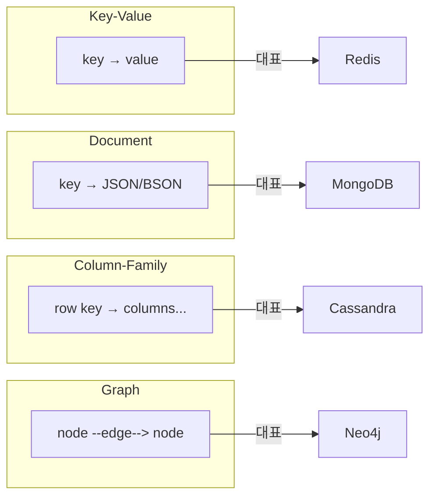
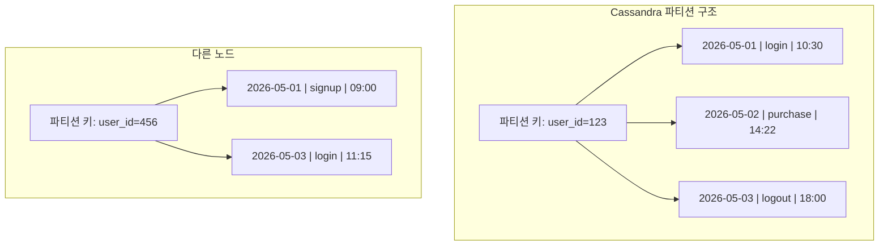
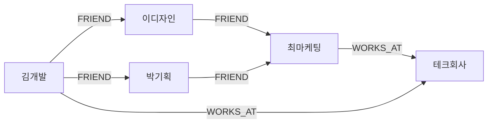
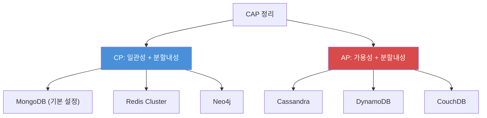
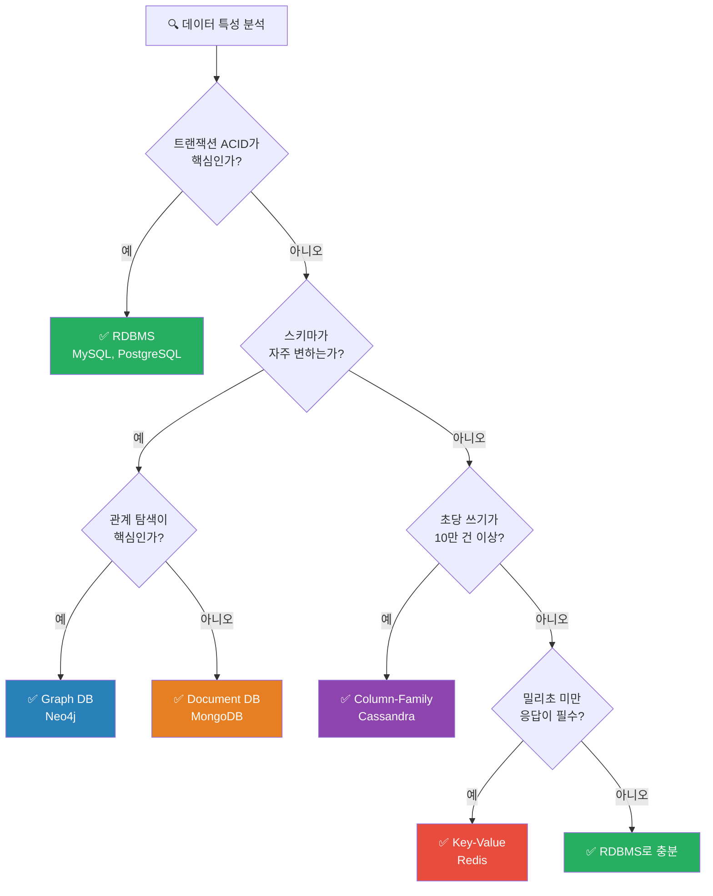
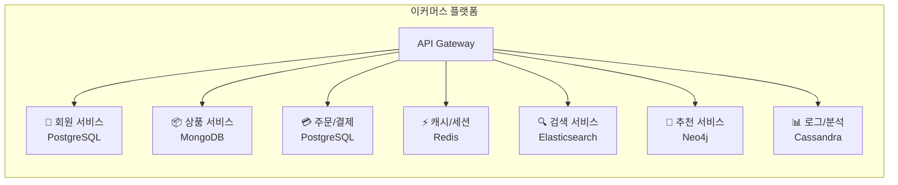
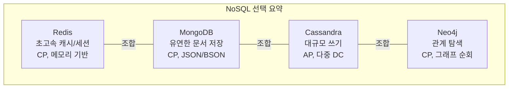

NoSQL은 하나의 기술이 아니다. **네 가지 완전히 다른 철학**이다. Key-Value, Document, Column-Family, Graph — 각각의 데이터 모델은 서로 다른 문제를 풀기 위해 태어났다. "NoSQL을 쓰자"라는 말은 "교통수단을 타자"와 같다. 자전거인지, 자동차인지, 비행기인지를 먼저 정해야 한다.

> **비유:** NoSQL 데이터베이스를 고르는 것은 **도구함에서 공구를 고르는 것**과 같다. 못을 박을 때 망치를, 나사를 조일 때 드라이버를 쓰듯이, 캐싱에는 Redis를, 유연한 문서 저장에는 MongoDB를, 대규모 쓰기에는 Cassandra를, 관계 탐색에는 Neo4j를 써야 한다. 만능 공구는 존재하지 않는다.

---

## 1. 네 가지 NoSQL 데이터 모델

NoSQL 데이터베이스는 데이터를 **어떤 형태로 저장하느냐**에 따라 크게 네 가지로 나뉜다. 각 모델은 근본적으로 다른 자료구조를 기반으로 하며, 그래서 잘하는 일과 못하는 일이 극명하게 갈린다. 이 차이를 이해하지 못하면 "MongoDB가 유행이니까 MongoDB 쓰자" 같은 위험한 의사결정을 하게 된다.



---

### 1-1. Key-Value Store (Redis)

Key-Value 스토어는 NoSQL 중 **가장 단순한 모델**이다. 이름 그대로, 하나의 키에 하나의 값을 저장한다. 해시 테이블을 거대한 분산 시스템으로 확장한 것이라 생각하면 된다. 단순한 만큼 **가장 빠르다**. Redis는 모든 데이터를 메모리에 올려두기 때문에, 읽기/쓰기 레이턴시가 마이크로초 단위다.

> **비유:** Redis는 **호텔 프론트 데스크의 키 보관함**이다. 방 번호(key)를 말하면 즉시 열쇠(value)를 꺼내준다. 보관함에서 열쇠를 꺼내는 데 1초도 걸리지 않지만, "3층에 있는 모든 빈 방을 찾아줘" 같은 복잡한 질문에는 적합하지 않다.

Redis가 단순한 문자열만 저장하는 것은 아니다. String, Hash, List, Set, Sorted Set, Stream, HyperLogLog 등 다양한 자료구조를 지원한다. 이것이 Redis를 단순한 캐시를 넘어 **자료구조 서버(Data Structure Server)** 라고 부르는 이유다.

아래 코드는 Redis의 핵심 자료구조별 사용 예시를 보여준다. 각 자료구조가 어떤 유스케이스에 적합한지 주석으로 표시했다.

```python
import redis

r = redis.Redis(host='localhost', port=6379, db=0)

# String: 세션 토큰, 캐시
r.setex("session:user123", 3600, "token_abc")  # 1시간 TTL

# Hash: 사용자 프로필 (부분 업데이트 가능)
r.hset("user:123", mapping={"name": "김개발", "age": 30})
r.hincrby("user:123", "age", 1)  # age만 +1

# Sorted Set: 실시간 랭킹
r.zadd("leaderboard", {"player_A": 1500, "player_B": 2300})
top3 = r.zrevrange("leaderboard", 0, 2, withscores=True)

# Stream: 이벤트 로그 (Kafka 대용)
r.xadd("orders", {"item": "MacBook", "qty": 1})
```

**이 코드의 핵심:** Redis는 단순 GET/SET을 넘어서, Hash로 부분 업데이트, Sorted Set으로 실시간 랭킹, Stream으로 이벤트 스트리밍까지 처리한다. 각 자료구조가 O(1) 또는 O(log N)으로 동작하기 때문에, 수백만 건의 데이터에서도 밀리초 이내에 응답한다.

**적합한 유스케이스:** 세션 관리, 캐싱, 실시간 랭킹, Rate Limiting, Pub/Sub 메시징

---

### 1-2. Document Store (MongoDB)

Document Store는 JSON(정확히는 BSON) 형태의 문서를 저장한다. RDBMS의 행(row)에 해당하는 것이 문서(document)이고, 테이블에 해당하는 것이 컬렉션(collection)이다. **스키마가 유연**하여 같은 컬렉션 안에 서로 다른 구조의 문서가 공존할 수 있다.

> **비유:** MongoDB는 **바인더에 끼우는 자유양식 보고서**다. A 보고서는 3페이지, B 보고서는 10페이지여도 상관없다. 각 보고서에 표, 사진, 목록이 자유롭게 들어간다. 다만, "모든 보고서의 3번째 항목을 합산해줘" 같은 집계에는 RDBMS가 유리하다.

MongoDB에 대한 상세한 설계 원칙과 인덱싱 전략은 [MongoDB 완전 가이드]() 포스트를 참고하기 바란다. 여기서는 비교 관점에서 핵심만 짚는다.

**적합한 유스케이스:** 콘텐츠 관리, 사용자 프로필, 제품 카탈로그, IoT 데이터

---

### 1-3. Column-Family Store (Cassandra)

Column-Family는 가장 이해하기 어려운 NoSQL 모델이다. RDBMS의 테이블과 비슷해 보이지만, 내부 구조가 완전히 다르다. 각 행(row)이 **서로 다른 컬럼**을 가질 수 있고, 컬럼은 `이름:값:타임스탬프` 세 쌍으로 구성된다. 데이터는 **파티션 키**로 분산되며, 클러스터링 키로 파티션 내 정렬 순서가 결정된다.

Cassandra가 빛나는 이유는 **쓰기 성능**이다. 모든 쓰기가 순차적 append-only로 처리되고, 읽기 시점에 병합(compaction)한다. 이를 LSM-Tree(Log-Structured Merge-Tree)라 부른다. 덕분에 초당 수십만 건의 쓰기를 처리할 수 있다.

> **비유:** Cassandra는 **우체국의 사서함 시스템**이다. 각 사서함(파티션)에는 주인(파티션 키)이 있고, 사서함 안의 편지들은 날짜순(클러스터링 키)으로 정렬된다. 편지를 넣는 것은 매우 빠르다(사서함에 던져넣기만 하면 됨). 하지만 "서울 사는 사람들의 편지를 모두 찾아줘" 같은 요청은 모든 사서함을 열어봐야 하니 매우 느리다.



아래 CQL(Cassandra Query Language) 코드는 시계열 데이터를 저장하는 전형적인 패턴이다. 파티션 키로 sensor_id를, 클러스터링 키로 timestamp를 사용하여 한 센서의 데이터를 시간순으로 조회할 수 있게 설계했다.

```sql
-- Cassandra: 시계열 데이터에 최적화된 테이블 설계
CREATE TABLE sensor_readings (
    sensor_id   UUID,
    read_time   TIMESTAMP,
    temperature DOUBLE,
    humidity    DOUBLE,
    PRIMARY KEY (sensor_id, read_time)
) WITH CLUSTERING ORDER BY (read_time DESC);

-- 쓰기: 어떤 노드든 즉시 받아들임 (리더 선출 없음)
INSERT INTO sensor_readings (sensor_id, read_time, temperature, humidity)
VALUES (uuid(), toTimestamp(now()), 23.5, 65.2);

-- 읽기: 파티션 키 필수! 없으면 전체 클러스터 스캔
SELECT * FROM sensor_readings
WHERE sensor_id = ? AND read_time > '2026-05-01'
LIMIT 100;
```

**이 코드의 핵심:** Cassandra에서 `WHERE` 절에 파티션 키를 반드시 포함해야 한다. 파티션 키 없이 조회하면 모든 노드를 스캔하게 되어 타임아웃이 발생한다. 이것이 RDBMS 개발자가 Cassandra에서 가장 많이 범하는 실수다.

**적합한 유스케이스:** IoT 시계열 데이터, 로그/이벤트 저장, 메시징 시스템, 추천 기록

---

### 1-4. Graph Database (Neo4j)

Graph DB는 **관계 자체가 1등 시민(first-class citizen)** 인 데이터베이스다. RDBMS에서 JOIN으로 표현하는 관계를 그래프의 엣지(edge)로 직접 저장한다. 노드(node)가 엔티티이고, 관계(relationship)가 엣지이며, 둘 다 속성(property)을 가질 수 있다.

관계형 DB에서 "친구의 친구의 친구"를 찾으려면 자기 JOIN을 3번 해야 한다. 데이터가 100만 명이면 이 쿼리는 수십 초가 걸린다. Neo4j에서는 **인접 노드를 포인터로 직접 참조**하기 때문에, 깊이가 깊어져도 관련 노드 수에만 비례하여 성능이 결정된다. 이를 **인덱스-프리 인접성(Index-Free Adjacency)** 이라 한다.

> **비유:** RDBMS에서 친구 찾기는 **전화번호부에서 이름을 찾고, 그 사람의 친구 목록을 다시 전화번호부에서 찾는 것**이다. Neo4j에서 친구 찾기는 **실제 사람을 만나서 "네 친구 소개해줘"라고 말하는 것**이다. 사람이 직접 연결되어 있으니, 전화번호부(인덱스)를 뒤질 필요가 없다.



아래 Cypher 쿼리는 SNS에서 "2촌 이내의 같은 회사 동료"를 찾는 예시다. SQL로 작성하면 서브쿼리와 다중 JOIN이 필요하지만, Cypher에서는 자연어에 가까운 패턴 매칭으로 표현할 수 있다.

```cypher
// 2촌 이내 친구 중 같은 회사에 다니는 사람
MATCH (me:Person {name: "김개발"})-[:FRIEND*1..2]-(fof:Person),
      (me)-[:WORKS_AT]->(company:Company)<-[:WORKS_AT]-(fof)
WHERE me <> fof
RETURN DISTINCT fof.name, company.name

// 최단 경로 찾기
MATCH path = shortestPath(
    (a:Person {name: "김개발"})-[:FRIEND*]-(b:Person {name: "최마케팅"})
)
RETURN path, length(path)
```

**이 코드의 핵심:** Cypher의 화살표 패턴 `()-[:FRIEND*1..2]-()` 은 "1~2홉 이내의 FRIEND 관계"를 의미한다. 관계의 방향, 타입, 깊이를 직관적으로 표현할 수 있어서 복잡한 그래프 탐색 쿼리를 간결하게 작성할 수 있다.

**적합한 유스케이스:** 소셜 네트워크, 추천 엔진, 지식 그래프, 사기 탐지, 네트워크 토폴로지

---

## 2. CAP 정리와 각 DB의 선택

분산 시스템의 근본 법칙인 **CAP 정리**를 이해하지 않으면, NoSQL 데이터베이스의 설계 철학을 이해할 수 없다. CAP은 Consistency(일관성), Availability(가용성), Partition Tolerance(분할 내성) 세 가지 속성 중 **동시에 두 가지만 보장할 수 있다**는 정리이다.

여기서 핵심은, 네트워크 분할(Partition)은 분산 시스템에서 **반드시 발생**한다는 점이다. 서버 간 네트워크가 끊기는 것은 시간 문제다. 따라서 현실적으로 선택지는 **CP(일관성 우선)** 또는 **AP(가용성 우선)** 둘 중 하나다.

> **비유:** CAP 정리는 **은행 창구의 딜레마**다. 본점과 지점 사이 전화가 끊겼을 때(Partition), 지점은 두 가지 중 하나를 선택해야 한다. 1) "본점 확인 전까지 출금 거절"(CP: 일관성 우선, 가용성 포기) 2) "일단 출금 허용, 나중에 맞춰보자"(AP: 가용성 우선, 일관성 포기). 잔고가 정확해야 하면 CP, 서비스 중단이 치명적이면 AP를 선택한다.



| 속성 | CP (일관성 우선) | AP (가용성 우선) |
|------|----------------|----------------|
| 네트워크 분할 시 | 쓰기 거부 (에러 반환) | 쓰기 허용 (나중에 병합) |
| 데이터 정확성 | 항상 최신 데이터 보장 | 일시적 불일치 허용 |
| 대표 DB | MongoDB, Redis Cluster | Cassandra, DynamoDB |
| 적합 시스템 | 금융, 결제, 재고 | SNS 피드, 로그, 조회수 |

### Cassandra의 Tunable Consistency

Cassandra는 AP 기반이지만, **쿼리 단위로 일관성 수준을 조절**할 수 있다. `QUORUM` 레벨을 사용하면 과반수 노드의 합의를 요구하여 CP에 가까운 동작을 얻을 수 있다. 이것이 Cassandra의 강력한 유연성이다.

> **비유:** Cassandra의 Tunable Consistency는 **택배 수령 확인**과 같다. `ONE`은 아무 경비원 한 명이 "받았음" 하면 끝이고, `QUORUM`은 경비원 과반수가 확인해야 하고, `ALL`은 모든 경비원이 확인해야 한다. 확인 인원이 많을수록 안전하지만 느려진다.

```
Consistency Level  | 동작                        | 레이턴시
ONE                | 아무 노드 1개 응답           | 최저
QUORUM             | 과반수(N/2+1) 노드 응답      | 중간
ALL                | 모든 복제본 응답             | 최고 (비추천)
```

---

## 3. RDBMS vs NoSQL 의사결정 트리

"NoSQL을 써야 할까?"라는 질문은 기술적 판단이 아니라 **비즈니스 요구사항에 대한 판단**이다. 아래 의사결정 트리는 프로젝트 초기에 데이터베이스를 선택할 때 참고할 수 있는 가이드다.

> **비유:** 데이터베이스 선택은 **집을 지을 때 기초 공사 방식을 결정하는 것**과 같다. 아파트(RDBMS)는 규격화되어 안정적이지만, 나중에 구조 변경이 어렵다. 컨테이너 하우스(NoSQL)는 자유롭게 배치·확장할 수 있지만, 수도·전기(트랜잭션·일관성) 연결이 까다롭다. 기초 공사를 잘못 선택하면 나중에 건물을 허물어야 한다.



### 핵심 판단 기준 비교표

| 기준 | RDBMS | Key-Value | Document | Column-Family | Graph |
|------|-------|-----------|----------|--------------|-------|
| 스키마 | 고정(rigid) | 없음 | 유연(flexible) | 반구조화 | 속성 기반 |
| 트랜잭션 | ACID 완벽 | 단일 키 원자성 | 단일 문서 ACID | 행 수준 원자성 | ACID 지원 |
| 수평 확장 | 어려움 | 매우 쉬움 | 쉬움(샤딩) | 매우 쉬움 | 어려움 |
| 관계 처리 | JOIN 우수 | 지원 안 함 | 임베딩/참조 | 비정규화 필수 | 최고 |
| 복잡한 쿼리 | SQL 만능 | 키 조회만 | 집계 파이프라인 | 파티션 키 필수 | 패턴 매칭 |

---

## 4. 하이브리드 아키텍처: Polyglot Persistence

현실의 시스템은 하나의 DB로 모든 요구사항을 만족시킬 수 없다. **Polyglot Persistence(다국어 영속성)** 은 각 서비스가 자신의 데이터 특성에 가장 적합한 DB를 선택하는 아키텍처 패턴이다.

> **비유:** Polyglot Persistence는 **대형 병원**과 같다. 내과, 외과, 안과, 치과가 각각 전문 장비를 갖추고 있다. 환자(데이터)의 증상에 따라 적절한 과(DB)로 보내는 것이다. 모든 환자를 내과(RDBMS)에서만 보겠다고 하면, 수술이 필요한 환자에게도 약만 처방하게 된다.



### Polyglot Persistence 실무 설계 원칙

1️⃣ **데이터 동기화 전략을 먼저 결정하라.** 여러 DB 간 데이터 정합성을 맞추는 것이 가장 어려운 문제다. CDC(Change Data Capture)나 이벤트 소싱 패턴을 사용하여 DB 간 데이터를 동기화해야 한다. 이를 간과하면 DB마다 다른 데이터가 들어있는 "데이터 사일로"가 만들어진다.

2️⃣ **운영 복잡도를 과소평가하지 마라.** DB가 3종류이면 모니터링, 백업, 장애 대응, 보안 패치가 3배다. 팀에 각 DB 전문가가 없으면 Polyglot은 부채가 된다.

3️⃣ **시작은 RDBMS, 병목이 증명되면 분리하라.** 처음부터 5개 DB를 도입하는 것은 과잉 설계다. RDBMS로 시작하고, 실제 병목이 측정된 부분만 전문 DB로 교체한다.

아래 코드는 Spring Boot 환경에서 Polyglot Persistence를 구현하는 예시다. 주문 처리 시 PostgreSQL로 트랜잭션을 보장하고, Redis로 캐시를 갱신하고, Kafka로 다른 서비스에 이벤트를 전파하는 패턴이다.

```java
@Service
public class OrderService {

    private final OrderRepository orderRepo;        // PostgreSQL
    private final RedisTemplate<String, Object> redis;
    private final KafkaTemplate<String, OrderEvent> kafka;

    @Transactional
    public Order placeOrder(OrderRequest req) {
        // 1️⃣ PostgreSQL: ACID 트랜잭션으로 주문 저장
        Order order = orderRepo.save(Order.from(req));

        // 2️⃣ Redis: 재고 캐시 차감 (atomic decrement)
        Long remaining = redis.opsForValue()
            .decrement("stock:" + req.getProductId());
        if (remaining < 0) {
            throw new OutOfStockException();
        }

        // 3️⃣ Kafka → 다른 서비스로 이벤트 전파
        //    - 검색 서비스(ES)에서 재고 반영
        //    - 추천 서비스(Neo4j)에서 구매 관계 업데이트
        //    - 로그 서비스(Cassandra)에서 이벤트 기록
        kafka.send("order-events", OrderEvent.created(order));

        return order;
    }
}
```

**이 코드의 핵심:** 각 DB의 장점을 살리되, 이벤트 기반으로 느슨하게 연결한다. PostgreSQL의 `@Transactional`이 주문 데이터의 ACID를 보장하고, Redis의 `decrement`가 원자적 재고 차감을 처리하고, Kafka가 비동기로 나머지 서비스에 전파한다. 동기적으로 모든 DB를 호출하면 레이턴시가 합산되고 장애 전파 위험이 커진다.

---

<details class="extreme-scenario-details" ontoggle="if(this.open){var ad=this.querySelector('.extreme-scenario-ad');if(ad&&!ad.dataset.loaded){ad.dataset.loaded='1';(adsbygoogle=window.adsbygoogle||[]).push({});}}">
<summary class="extreme-scenario-summary">
<span class="extreme-scenario-icon">🔥</span>
<span class="extreme-scenario-label">극한 시나리오 — 클릭하여 펼치기</span>
<span class="extreme-scenario-toggle"></span>
</summary>
<div class="extreme-scenario-body">
<div class="extreme-scenario-ad" style="text-align:center; margin-bottom:1.5em;">
<ins class="adsbygoogle"
     style="display:block"
     data-ad-client="ca-pub-7225106491387870"
     data-ad-slot="0000000000"
     data-ad-format="auto"
     data-full-width-responsive="true"></ins>
</div>
<div class="extreme-scenario-content" markdown="1">

### 시나리오 1: 트래픽 1,000 TPS → 100,000 TPS 성장

> **비유:** 서비스가 100배 성장하는 것은 **동네 식당이 프랜차이즈 체인으로 확장하는 것**과 같다. Redis는 주방장이 워낙 빨라서 혼자서도 주문 100배를 소화하지만, 재료 창고(메모리)가 부족해지면 분점(Cluster)을 내야 한다. MongoDB는 메뉴판(샤드 키)을 잘못 나누면 강남점에만 손님이 몰리는 핫 샤드가 된다. Cassandra는 테이블만 추가하면 되는 뷔페식이고, Neo4j는 좌석 배치(그래프)를 쪼갤 수 없어 건물 자체를 키워야(수직 확장) 한다.

서비스가 100배 성장하면 각 DB는 어떻게 대응하는가? 핵심은 각 DB의 확장 전략을 **사전에** 준비하지 않으면, 트래픽이 임계점을 넘는 순간 연쇄 장애가 발생한다는 점이다.

**Redis:** 단일 인스턴스로 10만 TPS를 처리할 수 있다. Redis는 싱글 스레드이지만, 메모리 기반 I/O와 이벤트 루프 덕분에 초당 10만~25만 명령을 처리한다. 그러나 메모리 한계에 도달하면 Redis Cluster로 샤딩해야 한다. 16,384개의 해시 슬롯을 여러 노드에 분배하여 수평 확장한다. 주의할 점은 `KEYS *` 같은 전체 스캔 명령은 절대 프로덕션에서 쓰면 안 된다 — 싱글 스레드가 블로킹되어 전체 서비스가 멈춘다. **안 하면 어떻게 되는가:** 메모리가 maxmemory에 도달하면 eviction 정책(기본 `noeviction`)에 따라 쓰기 명령이 전부 에러를 반환하거나, LRU로 세션 키가 무작위로 삭제되어 사용자가 갑자기 로그아웃된다.

**MongoDB:** Replica Set에서 Sharded Cluster로 전환해야 한다. 샤드 키를 잘못 선택하면 특정 샤드에 데이터가 몰리는 "핫 샤드" 문제가 발생한다. 예를 들어 날짜를 샤드 키로 쓰면 최신 데이터가 한 샤드에만 집중된다. 해시 샤딩이나 복합 샤드 키를 사용해야 한다. **안 하면 어떻게 되는가:** 핫 샤드에 몰린 노드의 CPU가 100%에 도달하고, 해당 샤드의 청크가 비대해져 balancer가 마이그레이션을 시도하지만, 마이그레이션 중에도 쓰기가 계속 들어와 "moveChunk" 작업이 수 시간 걸리거나 실패한다. 결과적으로 한 샤드만 응답 시간이 10초 이상으로 치솟고, mongos 라우터가 타임아웃을 반환하여 전체 서비스가 부분 장애에 빠진다.

**Cassandra:** 노드를 추가하기만 하면 된다. Cassandra는 masterless 아키텍처이므로 새 노드가 합류하면 자동으로 데이터를 재분배한다. 100배 성장에 가장 자연스럽게 대응하는 DB이며, Netflix, Apple, Instagram 등이 Cassandra를 선택한 이유가 바로 이것이다. **안 하면 어떻게 되는가:** 노드를 추가하지 않고 버티면, 각 노드의 디스크가 가득 차면서 compaction이 실패하고, 읽기 성능이 급락한다. compaction 실패가 누적되면 tombstone이 정리되지 않아 읽기 쿼리가 수십만 개의 tombstone을 스캔하게 되고, GC pause가 30초 이상 발생하여 노드가 클러스터에서 제거된다.

**Neo4j:** 수평 확장이 가장 어려운 DB다. 그래프를 여러 노드로 분할하면 관계가 끊어져 교차 샤드 쿼리가 필요하고, 이는 성능을 심각하게 저하시킨다. Neo4j는 수직 확장(메모리·CPU 증설)이 주 전략이며, 읽기 확장은 Read Replica로 가능하다. **안 하면 어떻게 되는가:** 그래프가 메모리에 다 올라가지 않으면, 매 탐색마다 디스크 I/O가 발생하여 3홉 쿼리가 수 초로 느려진다. Page Cache 히트율이 80% 미만으로 떨어지면 사실상 그래프 DB의 핵심 장점(인덱스-프리 인접성)이 무력화된다.

### 시나리오 2: 데이터센터 장애 (Region Failover)

서울 데이터센터가 통째로 장애가 발생하면?

**Redis Sentinel:** 자동으로 슬레이브를 마스터로 승격한다. 그러나 비동기 복제이므로 마지막 수 밀리초의 데이터가 유실될 수 있다. 금융 데이터라면 치명적이다.

**MongoDB:** Replica Set이 여러 AZ(가용 영역)에 분산되어 있으면, Primary가 있는 DC가 죽어도 나머지 멤버들이 **10~12초 내에 새 Primary를 자동 선출**한다. 이 기간 동안 쓰기는 불가능하지만 읽기는 `readPreference: secondaryPreferred`로 계속 서비스할 수 있다. 단, 비동기 복제 분의 데이터(기본 `w:1`)는 유실될 수 있으므로, 금융 시스템이라면 `w: "majority"` + `j: true`(저널링)를 설정하여 과반수 노드에 기록이 확인된 후에만 쓰기 성공을 반환하도록 해야 한다. **안 하면 어떻게 되는가:** `w:1`인 상태에서 Primary가 있는 DC가 죽으면, Primary에만 기록되고 Secondary로 아직 복제되지 않은 쓰기가 영구 유실된다. 새 Primary가 선출된 후 이전 Primary가 복구되면, 유실된 쓰기는 rollback 파일로 남지만 자동 복구되지 않으므로 수동으로 재적용해야 한다.

**Cassandra:** 다중 DC 구성이 기본 설계에 내장되어 있다. `NetworkTopologyStrategy`로 각 DC에 복제본 수를 지정하고, `LOCAL_QUORUM`으로 로컬 DC에서만 합의하여 레이턴시를 유지한다. 서울 DC가 죽어도 부산 DC가 즉시 서비스를 이어받는다.

**Neo4j:** Neo4j Causal Cluster는 Core 멤버 간 Raft 합의 프로토콜을 사용한다. 리더가 죽으면 나머지 Core 멤버가 수 초 내에 새 리더를 선출한다. 하지만 Core 멤버가 3개 중 2개가 같은 DC에 있었다면, 해당 DC 장애 시 과반수를 확보하지 못해 쓰기가 불가능해진다. 따라서 Core 멤버를 최소 3개 AZ에 하나씩 분산 배치하는 것이 필수다. Read Replica는 별도 AZ에 두어 읽기 가용성을 추가로 확보할 수 있다. **안 하면 어떻게 되는가:** Core 멤버 3개 중 2개가 같은 DC에 있고 해당 DC가 장애나면, 남은 1개 Core는 과반수(2/3) 확보 불가능으로 리더 선출이 실패한다. 클러스터는 read-only 모드로 전환되어, 기존 데이터 읽기만 가능하고 모든 쓰기·스키마 변경·인덱스 생성이 거부된다. Read Replica도 새 데이터를 받지 못해 stale 상태로 고정된다.

### 시나리오 3: 스키마 대변혁 (필드 100개 추가)

> **비유:** RDBMS에서 필드 100개를 추가하는 것은 **이미 입주한 아파트 전 세대에 방을 하나씩 증축하는 것**이다. 한 세대씩 공사하므로 시간도 오래 걸리고, 공사 중에는 그 세대에 출입이 제한된다(테이블 락). MongoDB는 **텐트를 치는 것**과 같다. 각 세대(문서)가 독립적이므로, 원하는 세대만 방을 늘리면 된다. 나머지 세대에는 아무 영향이 없다.

비즈니스 요구사항 변경으로 엔티티에 필드 100개를 추가해야 한다면?

**RDBMS:** `ALTER TABLE ADD COLUMN`을 100번 실행해야 한다. 테이블이 1억 행이면 각 ALTER에 수십 분이 걸릴 수 있고, 그 동안 테이블 락이 걸린다. pt-online-schema-change 같은 도구가 필요하다. **안 하면 어떻게 되는가:** MySQL 5.7 이전에서 대형 테이블에 직접 ALTER를 실행하면, 테이블 전체에 메타데이터 락이 걸려 읽기·쓰기가 모두 대기 상태에 빠진다. 1억 행 테이블의 ALTER가 30분 걸리면, 그 30분 동안 해당 테이블을 사용하는 모든 API가 타임아웃을 반환한다.

**MongoDB:** 아무것도 안 해도 된다. 새 필드를 포함한 문서를 그냥 저장하면 된다. 기존 문서에는 해당 필드가 없을 뿐, 에러가 발생하지 않는다. 이것이 스키마리스의 진정한 가치다. **안 하면 어떻게 되는가:** MongoDB에서 "안 할 것"이 없으므로 문제가 발생하지 않는다. 다만 방치하면 위험이 있다. 기존 문서에 새 필드가 없으므로 애플리케이션에서 null 체크 없이 접근하면 NPE가 발생한다. Schema Validation(`$jsonSchema`)을 설정하여 새 문서에 필수 필드가 빠지지 않도록 강제하고, 기존 문서는 배치 마이그레이션으로 점진적으로 갱신하는 것이 안전하다.

**Cassandra:** CQL의 `ALTER TABLE ADD`는 즉시 완료된다. Cassandra는 컬럼 메타데이터만 변경하고 기존 행에 실제 데이터를 채우지 않기 때문이다. 하지만 컬럼 100개를 추가하면 SSTable의 컬럼 인덱스가 비대해지고, compaction 시 I/O가 증가한다. **안 하면 어떻게 되는가:** 문제 자체는 발생하지 않지만, 빈 컬럼이 대량으로 존재하는 wide row가 읽기 성능을 저하시킬 수 있다.

**Neo4j:** 속성(property) 추가는 스키마 변경 없이 가능하다. 그래프 DB는 노드/관계에 자유롭게 속성을 추가할 수 있다. 다만 속성에 인덱스를 걸어야 하는 경우, `CREATE INDEX`가 백그라운드로 실행되며 대규모 그래프에서는 수 분이 소요될 수 있다.

---
</div>
</div>
</details>

## 6. 실무에서 자주 하는 실수

### 실수 1: "NoSQL이니까 설계 안 해도 된다"

가장 위험한 오해다. NoSQL에서 스키마가 유연하다는 것은 **DB가 강제하지 않을 뿐, 설계가 불필요하다는 뜻이 아니다**. MongoDB에서 스키마 설계 없이 개발을 시작하면, 6개월 뒤 같은 컬렉션에 10가지 형태의 문서가 섞여 있어 애플리케이션 코드가 방어 로직으로 가득 찬다.

> **비유:** "자유양식 보고서"라고 해서 아무렇게나 쓰는 것이 아니다. 양식이 없더라도 목차, 구성, 핵심 항목은 팀 내에서 합의해야 한다.

### 실수 2: Cassandra에서 RDBMS처럼 쿼리하기

Cassandra를 도입한 뒤 `SELECT * FROM users WHERE age > 30` 같은 범위 쿼리를 쓰는 팀이 많다. Cassandra는 파티션 키 없는 쿼리를 허용하지 않으며, `ALLOW FILTERING`을 붙이면 실행은 되지만 전체 클러스터를 스캔하므로 운영 환경에서 장애를 유발한다.

**해결책:** 쿼리 패턴을 먼저 정의하고, 그에 맞는 테이블을 역정규화하여 설계한다. "같은 데이터를 5개 테이블에 중복 저장"하는 것이 Cassandra의 정석이다.

### 실수 3: Redis를 Primary DB로 사용

Redis의 속도에 매료되어 영구 데이터를 Redis에만 저장하는 실수다. Redis는 RDB/AOF로 디스크에 저장할 수 있지만, 본질적으로 메모리 DB다. 메모리 부족 시 eviction 정책에 따라 **데이터가 자동 삭제**된다. maxmemory에 도달하면 LRU 등의 정책으로 오래된 키를 삭제하고, 이때 중요한 비즈니스 데이터가 사라질 수 있다.

**해결책:** Redis는 반드시 캐시/세션 등 **유실 허용 데이터**에만 사용하고, 원본 데이터는 RDBMS나 Document DB에 저장한다.

### 실수 4: 모든 서비스에 같은 DB 강제

MSA를 도입했으면서 모든 마이크로서비스가 동일한 MySQL을 공유하는 것은 모순이다. 반대로, 각 서비스마다 다른 DB를 써야 한다는 강박도 위험하다. **데이터 특성이 다른 서비스만** 다른 DB를 선택해야 한다.

### 실수 5: Neo4j에 관계가 거의 없는 데이터 저장

Graph DB는 관계 밀도가 높을 때 빛난다. 관계가 거의 없는 단순 CRUD 데이터를 Neo4j에 저장하면, RDBMS보다 느리고 운영도 어려운 최악의 선택이 된다.

---

## 7. 면접 포인트

### Q1: "CAP 정리에서 CA는 왜 존재하지 않나요?"

분산 시스템에서 네트워크 분할(P)은 피할 수 없다. 물리적으로 분리된 서버 간 통신이 끊기는 것은 시간 문제다. P가 발생하지 않는 것은 단일 노드 시스템뿐이며, 그것은 분산 시스템이 아니다. 따라서 현실적 선택지는 CP 또는 AP 둘 중 하나다. 면접에서 "단일 노드 RDBMS는 CA라고 볼 수 있지만, 분산 환경에서는 CA 조합이 불가능하다"고 답하면 정확한 답변이다.

### Q2: "MongoDB는 CP인데, 가용성은 어떻게 확보하나요?"

MongoDB는 Primary-Secondary Replica Set 구조에서, Primary가 죽으면 **자동 선출(election)** 로 10~12초 내에 새 Primary를 선출한다. 이 기간 동안 쓰기가 불가능하므로 완전한 가용성은 아니지만, 짧은 다운타임으로 현실적 가용성을 확보한다. 면접에서는 "CAP은 이론적 분류이며, 실무에서는 P 발생 시 어떤 트레이드오프를 선택하느냐의 문제"라고 설명한다.

### Q3: "어떤 상황에서 RDBMS 대신 NoSQL을 선택하나요?"

1. 스키마가 자주 변경되거나 비정형 데이터가 많을 때
2. 수평 확장이 필수일 때 (RDBMS의 수직 확장 한계)
3. 특정 접근 패턴에 최적화가 필요할 때 (시계열 → Cassandra, 그래프 탐색 → Neo4j)
4. 초고속 읽기/쓰기가 필요할 때 (캐시 → Redis)

단, "JOIN이 많고, 복잡한 트랜잭션이 필요하고, 데이터 정합성이 최우선이면 RDBMS가 답"이라고 균형 잡힌 시각을 보여줘야 한다.

### Q4: "Polyglot Persistence의 가장 큰 리스크는?"

**데이터 정합성**과 **운영 복잡도**다. 주문이 PostgreSQL에 저장되었는데 Elasticsearch 인덱싱이 실패하면 검색에서 안 나타난다. 이를 해결하기 위해 Outbox 패턴 + CDC(Debezium 등)로 eventually consistent하게 동기화하고, 불일치 감지 배치를 추가로 운영해야 한다.

### Q5: "Cassandra의 Consistent Hashing을 설명해주세요"

Cassandra는 파티션 키를 해시 함수에 넣어 0~2^63 범위의 토큰을 생성한다. 각 노드는 토큰 링(token ring) 위에서 일정 범위를 담당한다. 노드가 추가/제거되면 인접 노드에만 영향을 주어, 전체 데이터를 재분배하지 않아도 된다. 이것이 Cassandra가 무중단으로 노드를 추가할 수 있는 핵심 메커니즘이다.

---

## 8. 핵심 정리



| | Redis | MongoDB | Cassandra | Neo4j |
|---|-------|---------|-----------|-------|
| 데이터 모델 | Key-Value | Document (JSON) | Wide Column | Graph |
| CAP | CP | CP | AP (Tunable) | CP |
| 최강 | 속도 (μs 응답) | 유연성 (스키마리스) | 쓰기 확장성 | 관계 탐색 |
| 최약 | 복잡한 쿼리 | 다중 문서 JOIN | 범위 검색 | 수평 확장 |
| 확장 방식 | Cluster (슬롯) | Sharding | 노드 추가 | Read Replica |
| 트랜잭션 | 단일 키 원자성 | 단일/다중 문서 | 행 수준 | ACID |

**최종 원칙:** 데이터베이스는 유행이 아니라 **데이터의 형태와 접근 패턴**으로 선택한다. 하나의 DB로 모든 것을 해결하려는 유혹을 참고, 각 문제에 가장 적합한 도구를 선택하되, 운영 복잡도라는 대가를 항상 계산하라.
