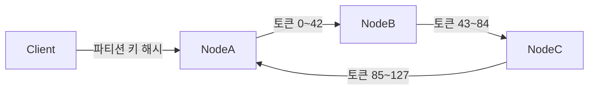
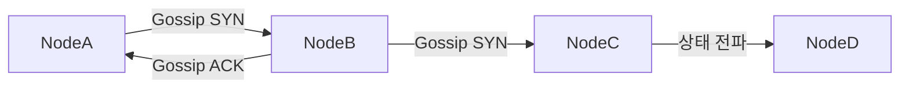
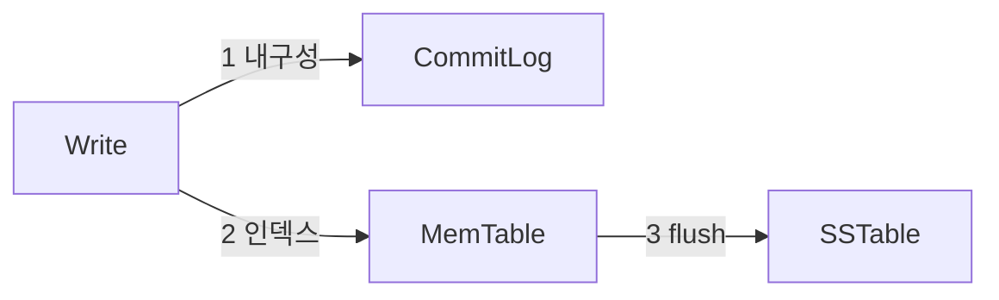

Cassandra는 "절대 멈추지 않는 DB"를 목표로 설계됐다. 마스터 노드가 없고, 모든 노드가 동등한 역할을 수행하며, 노드 한 대가 죽어도 쓰기와 읽기가 계속된다. 이 글은 그 내부 구조를 링(Ring), Gossip, 쓰기/읽기 경로, Compaction, 데이터 모델링 순서로 해부한다.

---

## 1. Cassandra가 필요한 순간

관계형 DB는 수직 확장(Scale-Up)에 의존한다. 서버를 더 크게 사면 된다. 그런데 초당 수백만 건의 IoT 센서 데이터, 글로벌 SNS 타임라인, 실시간 결제 로그가 쌓이는 상황에서는 "더 큰 서버"가 한계에 부딪힌다.

Cassandra는 수평 확장(Scale-Out)으로 이 문제를 푼다. 노드 10대를 20대로 늘리면 처리량이 거의 선형으로 증가한다. Netflix, Apple, Discord가 Cassandra를 선택한 이유가 여기 있다.

**Cassandra가 잘 맞는 사례**

| 사례 | 이유 |
|------|------|
| 타임시리즈 데이터 (IoT, 로그) | 시간 순서 쓰기에 최적화 |
| 사용자 활동 피드 | 파티션 키=유저ID, 시간 정렬 |
| 메시지/채팅 이력 | 대용량 append 쓰기 |
| 글로벌 분산 서비스 | Multi-DC 복제 내장 |

**Cassandra가 맞지 않는 사례**

- 복잡한 JOIN이 필요한 OLAP 쿼리
- 강한 트랜잭션(ACID) 보장이 필수인 금융 원장
- 데이터 양이 수십 GB 이하인 소규모 서비스

---

## 2. 링(Ring) 아키텍처와 Consistent Hashing

### 2-1. 토큰 링

Cassandra의 모든 노드는 하나의 논리적 링(Ring) 위에 배치된다. 이 링은 0부터 2^127 - 1까지의 해시 공간을 원형으로 배열한 것이다. 각 노드는 이 공간의 일부 구간(토큰 범위)을 담당한다.

데이터가 들어오면 파티션 키를 Murmur3 해시 함수로 변환해서 어느 노드 구간에 속하는지 결정한다. 이것이 **Consistent Hashing**이다.

```
파티션 키 "user:42" → Murmur3 해시 → 토큰 T
링 위에서 T 이후 첫 번째 노드 = 코디네이터 노드
```

비유하자면, 원형 시계판 위에 여러 명의 담당자가 앉아 있고, 업무(데이터)가 들어오면 시계 방향으로 가장 가까운 담당자에게 배정되는 구조다.



### 2-2. 가상 노드(VNode)

초기 Cassandra는 노드마다 토큰 하나를 할당했다. 문제는 노드를 추가/제거할 때 데이터 재분배(rebalancing)가 크게 발생한다는 점이다.

VNode(가상 노드) 방식은 각 물리 노드에 수백 개의 작은 토큰 구간을 분산 배정한다. 노드가 추가되면 여러 기존 노드에서 조금씩 데이터를 가져오므로 재분배 부하가 고르게 분산된다.

```yaml
# cassandra.yaml
num_tokens: 256  # 물리 노드당 가상 노드 수 (기본값)
```

---

## 3. Gossip 프로토콜 — 소문이 퍼지듯

Cassandra에는 중앙 관리 서버가 없다. 그럼 노드들은 서로의 상태를 어떻게 알까?

**Gossip 프로토콜**은 이름 그대로 소문이 퍼지는 방식이다. 매 초마다 각 노드는 무작위로 1~3개의 이웃 노드와 자신이 알고 있는 클러스터 상태(HeartBeat, ApplicationState)를 교환한다. 몇 초만 지나면 전체 클러스터가 동일한 정보를 갖게 된다.



Gossip 메시지에는 다음이 포함된다.

- **HeartBeat**: 노드 생존 여부, 세대(generation) 카운터
- **ApplicationState**: 노드의 토큰, 로드, 데이터센터, 랙 정보
- **EndpointState**: 위 두 정보의 집합

### 3-1. Failure Detection — Phi Accrual

단순히 "응답이 없으면 죽은 것"으로 판단하면 네트워크 지연과 실제 장애를 구분 못 한다. Cassandra는 **Phi Accrual Failure Detector**를 사용한다.

Gossip 응답 간격의 통계(평균, 표준편차)를 학습해서 "이 노드가 살아있을 확률이 몇 퍼센트인가"를 phi 값으로 표현한다. phi가 임계치(기본 8)를 넘으면 해당 노드를 DOWN으로 마킹한다.

```yaml
# cassandra.yaml
phi_convict_threshold: 8  # 값이 클수록 보수적 판단
```

### 3-2. Seed 노드

클러스터를 처음 구성할 때 신규 노드는 어떻게 링을 알까? **Seed 노드** 목록을 설정 파일에 지정하면, 신규 노드가 시동 시 seed 노드와 Gossip을 통해 전체 클러스터 토폴로지를 학습한다. Seed 노드 자체가 SPOF가 되지 않도록 2~3개를 지정하는 것이 관례다.

```yaml
# cassandra.yaml
seed_provider:
  - class_name: org.apache.cassandra.locator.SimpleSeedProvider
    parameters:
      - seeds: "10.0.0.1,10.0.0.2,10.0.0.3"
```

---

## 4. 쓰기 경로 — 빠른 쓰기의 비밀

Cassandra 쓰기가 빠른 이유는 **디스크 순차 쓰기**에 있다. 랜덤 I/O를 최대한 피한다.

### 4-1. 쓰기 3단계



**1단계: CommitLog**
모든 쓰기는 먼저 CommitLog에 순차적으로 기록된다. 노드가 갑자기 죽었다 살아나도 CommitLog를 재생(replay)해서 데이터를 복구할 수 있다.

**2단계: MemTable**
CommitLog 기록 후 데이터는 메모리의 MemTable에 저장된다. MemTable은 파티션 키 기준으로 정렬된 인메모리 구조다. 쓰기 응답은 여기서 즉시 반환된다(디스크 flush를 기다리지 않음).

**3단계: SSTable Flush**
MemTable이 일정 크기(기본 32MB)에 도달하거나, 설정된 시간이 지나면 불변(immutable) SSTable 파일로 디스크에 flush된다. SSTable은 한 번 쓰이면 수정되지 않는다.

### 4-2. SSTable 구조

SSTable 하나는 여러 파일로 구성된다.

| 파일 | 역할 |
|------|------|
| `*-Data.db` | 실제 행 데이터 |
| `*-Index.db` | 파티션 키 → 오프셋 인덱스 |
| `*-Filter.db` | Bloom Filter (키 존재 여부 확인) |
| `*-Summary.db` | 인덱스 파일의 샘플링된 요약 |
| `*-Statistics.db` | 파티션 크기, 최소/최대 타임스탬프 등 메타데이터 |

### 4-3. 코디네이터와 복제

클라이언트 요청을 받은 노드가 **코디네이터**가 된다. 코디네이터는 파티션 키를 해시해서 담당 노드(Replica 노드들)를 찾아 병렬로 쓰기를 전달한다.

복제 팩터(Replication Factor, RF)가 3이면 같은 데이터가 링에서 연속된 3개 노드에 저장된다.

```sql
CREATE KEYSPACE my_app
WITH replication = {
  'class': 'NetworkTopologyStrategy',
  'dc1': 3,
  'dc2': 2
};
```

---

## 5. 읽기 경로 — 여러 레이어를 거치는 탐색

읽기는 쓰기보다 복잡하다. 데이터가 MemTable에 있을 수도 있고, 여러 SSTable에 흩어져 있을 수도 있다.

### 5-1. 읽기 순서


**1. MemTable 탐색**: 가장 먼저 메모리에서 찾는다.

**2. Row Cache** (선택적): 자주 접근하는 전체 행을 캐싱. 히트 시 디스크 없이 반환.

**3. Bloom Filter**: 각 SSTable마다 Bloom Filter가 있다. "이 키가 이 SSTable에 확실히 없음"을 O(1)로 판단해서 불필요한 디스크 탐색을 줄인다. 거짓 양성(false positive)은 있지만 거짓 음성(false negative)은 없다.

**4. Key Cache**: SSTable의 파티션 키 → 디스크 오프셋 매핑을 캐싱. Bloom Filter를 통과한 후 실제 디스크 위치를 빠르게 찾는다.

**5. SSTable 읽기**: Summary → Index → Data 순으로 데이터를 읽는다.

### 5-2. Read Repair

RF=3인 환경에서 CL=QUORUM(2개 이상 응답)으로 읽으면, 코디네이터는 응답받은 여러 복제본의 타임스탬프를 비교한다. 구버전 데이터를 가진 노드에는 백그라운드로 최신 데이터를 전송한다. 이것이 **Read Repair**다.

```yaml
# 읽기 시 모든 복제본을 확인하는 비율
read_repair_chance: 0.1  # 10% 확률로 백그라운드 Read Repair
```

---

## 6. Consistency Level — CAP 트레이드오프

Cassandra는 CP도 AP도 아닌, **조절 가능한 일관성**을 제공한다. 쿼리마다 Consistency Level(CL)을 설정할 수 있다.

| CL | 필요 응답 수 | 특징 |
|----|------------|------|
| ONE | 1 | 가장 빠름, 가용성 최고 |
| QUORUM | ⌊RF/2⌋ + 1 | 일관성과 가용성 균형 |
| ALL | RF 전체 | 가장 강한 일관성, 가용성 최저 |
| LOCAL_QUORUM | 로컬 DC quorum | Multi-DC에서 지연 최소화 |
| EACH_QUORUM | 각 DC quorum | 모든 DC 일관성 보장 |

**강한 일관성 보장 공식**: 쓰기 CL + 읽기 CL > RF

예: RF=3, 쓰기 QUORUM(2) + 읽기 QUORUM(2) = 4 > 3 → 강한 일관성 보장

```java
// Spring Data Cassandra에서 CL 설정
@Table
public class UserActivity {
    @PrimaryKey
    private UserActivityKey key;
    private String action;
}

// Repository에서 CL 지정
session.execute(
    SimpleStatement.builder("SELECT * FROM user_activity WHERE user_id = ?")
        .setConsistencyLevel(ConsistencyLevel.LOCAL_QUORUM)
        .build()
);
```

---

## 7. Compaction 전략

SSTable은 불변이므로, 시간이 지나면 동일 키에 대한 여러 버전이 여러 SSTable에 흩어진다. **Compaction**은 이 파일들을 병합하고 오래된 버전과 Tombstone을 제거하는 작업이다.

### 7-1. STCS (Size-Tiered Compaction Strategy)

비슷한 크기의 SSTable들을 묶어서 병합한다. 기본 전략이며, 쓰기 heavy 워크로드에 적합하다.

- 장점: 쓰기 증폭(Write Amplification)이 낮음
- 단점: 읽기 시 탐색할 SSTable 수가 많아질 수 있음, 임시 디스크 공간 2x 필요

### 7-2. LCS (Leveled Compaction Strategy)

SSTable을 레벨로 구분하고, 각 레벨의 SSTable들이 서로 겹치지 않도록 유지한다.

- 장점: 읽기 성능 우수, SSTable 수 최소화
- 단점: 쓰기 증폭이 큼, 쓰기 heavy 워크로드에 부적합

### 7-3. TWCS (Time Window Compaction Strategy)

시간 윈도우 기반으로 SSTable을 관리한다. 타임시리즈 데이터에 최적화돼 있다.

```sql
CREATE TABLE sensor_data (
    device_id uuid,
    recorded_at timestamp,
    value double,
    PRIMARY KEY (device_id, recorded_at)
) WITH compaction = {
    'class': 'TimeWindowCompactionStrategy',
    'compaction_window_unit': 'HOURS',
    'compaction_window_size': 1
};
```

| 전략 | 적합 워크로드 | 읽기 성능 | 쓰기 성능 |
|------|------------|---------|---------|
| STCS | 쓰기 heavy | 중간 | 높음 |
| LCS | 읽기 heavy | 높음 | 낮음 |
| TWCS | 타임시리즈 | 높음 | 높음 |

---

## 8. 데이터 모델링 — 쿼리 중심 설계

관계형 DB는 정규화(엔티티 중심)로 설계하고 나중에 쿼리를 맞춘다. Cassandra는 반대다. **쿼리를 먼저 정의하고, 그 쿼리에 맞는 테이블을 설계한다.**

### 8-1. 파티션 키와 클러스터링 키

```sql
CREATE TABLE messages (
    conversation_id uuid,      -- 파티션 키: 같은 대화의 메시지는 같은 파티션
    sent_at timeuuid,          -- 클러스터링 키: 파티션 내 시간 순 정렬
    sender_id uuid,
    content text,
    PRIMARY KEY (conversation_id, sent_at)
) WITH CLUSTERING ORDER BY (sent_at DESC);
```

- **파티션 키(Partition Key)**: 어느 노드에 저장할지 결정. 같은 파티션 키를 가진 데이터는 반드시 같은 노드에 저장됨(하나의 파티션).
- **클러스터링 키(Clustering Key)**: 파티션 내부에서 데이터를 정렬하는 기준.

### 8-2. 복합 파티션 키

데이터가 특정 파티션에 집중되는 핫 파티션을 방지하기 위해 파티션 키를 복합으로 설계한다.

```sql
-- 날짜를 파티션 키에 포함해서 데이터를 분산
CREATE TABLE user_events (
    user_id uuid,
    event_date date,           -- 복합 파티션 키의 두 번째 요소
    event_time timeuuid,
    event_type text,
    PRIMARY KEY ((user_id, event_date), event_time)
);
```

### 8-3. 비정규화와 중복 허용

Cassandra에는 JOIN이 없다. 동일 데이터를 여러 테이블에 중복 저장하는 것이 권장 패턴이다.

```sql
-- 쿼리 1: "대화에 속한 메시지 목록" → messages_by_conversation
-- 쿼리 2: "유저가 보낸 메시지 목록" → messages_by_sender
-- 두 테이블 모두 같은 메시지 데이터를 저장
CREATE TABLE messages_by_conversation (
    conversation_id uuid,
    sent_at timeuuid,
    sender_id uuid,
    content text,
    PRIMARY KEY (conversation_id, sent_at)
);

CREATE TABLE messages_by_sender (
    sender_id uuid,
    sent_at timeuuid,
    conversation_id uuid,
    content text,
    PRIMARY KEY (sender_id, sent_at)
);
```

### 8-4. Tombstone

Cassandra에서 삭제는 데이터를 즉시 지우지 않는다. **Tombstone**이라는 삭제 마커를 기록한다. Compaction 시 설정된 gc_grace_seconds(기본 10일) 이후 실제로 제거된다.

이 10일의 유예기간은 다운됐다 복구된 노드가 삭제 사실을 전달받기 위함이다.

---

## 9. Anti-Entropy — 복제본 동기화

### 9-1. Merkle Tree

Cassandra는 주기적으로 **Anti-Entropy Repair**를 수행한다. 복제본 간 데이터 불일치를 감지하고 수정한다. 이때 **Merkle Tree**를 사용한다.

Merkle Tree는 데이터를 해시로 요약하는 트리 구조다. 루트 해시만 비교해서 두 노드의 데이터가 동일한지 빠르게 판단하고, 다르다면 트리를 내려가며 다른 부분만 찾아서 동기화한다.

```bash
# nodetool로 repair 실행
nodetool repair --full my_keyspace

# 특정 테이블만 repair
nodetool repair my_keyspace messages
```

### 9-2. Hinted Handoff

노드 A가 다운된 상태에서 코디네이터가 A에게 보낼 쓰기를 받으면, 코디네이터는 **Hint**로 임시 저장해둔다. A가 복구되면 저장해둔 Hint를 전달해서 놓친 쓰기를 보완한다.

```yaml
# cassandra.yaml
hinted_handoff_enabled: true
max_hint_window_in_ms: 10800000  # 3시간 이내 다운된 노드에만 Hint 보관
```

---

## 10. CQL 실전

### 10-1. 기본 DDL/DML

```sql
-- Keyspace 생성
CREATE KEYSPACE IF NOT EXISTS my_app
WITH replication = {'class': 'NetworkTopologyStrategy', 'dc1': 3}
AND durable_writes = true;

USE my_app;

-- 테이블 생성
CREATE TABLE IF NOT EXISTS user_profiles (
    user_id uuid PRIMARY KEY,
    username text,
    email text,
    created_at timestamp,
    tags set<text>
);

-- 삽입
INSERT INTO user_profiles (user_id, username, email, created_at, tags)
VALUES (uuid(), 'alice', 'alice@example.com', toTimestamp(now()), {'admin', 'active'});

-- 조회 (파티션 키 기준으로만 효율적 조회 가능)
SELECT * FROM user_profiles WHERE user_id = 550e8400-e29b-41d4-a716-446655440000;

-- TTL 설정 (세션 토큰 등에 유용)
INSERT INTO session_tokens (token, user_id, created_at)
VALUES ('abc123', uuid(), toTimestamp(now()))
USING TTL 86400;  -- 24시간 후 자동 삭제
```

### 10-2. 컬렉션 타입

```sql
-- List, Set, Map 타입
CREATE TABLE user_settings (
    user_id uuid PRIMARY KEY,
    recent_searches list<text>,     -- 순서 있는 리스트
    permissions set<text>,          -- 중복 없는 집합
    preferences map<text, text>     -- 키-값 쌍
);

-- 컬렉션 업데이트
UPDATE user_settings
SET recent_searches = recent_searches + ['kotlin tutorial']
WHERE user_id = 550e8400-e29b-41d4-a716-446655440000;

UPDATE user_settings
SET preferences['theme'] = 'dark'
WHERE user_id = 550e8400-e29b-41d4-a716-446655440000;
```

### 10-3. 보조 인덱스와 ALLOW FILTERING

```sql
-- 보조 인덱스 (낮은 카디널리티 컬럼에 적합)
CREATE INDEX ON user_profiles (email);

-- 파티션 키 없이 조회하면 ALLOW FILTERING 필요
-- 전체 클러스터 스캔 → 프로덕션에서 주의
SELECT * FROM user_profiles WHERE email = 'alice@example.com' ALLOW FILTERING;
```

---

## 11. Spring Data Cassandra

```xml
<!-- pom.xml -->
<dependency>
    <groupId>org.springframework.boot</groupId>
    <artifactId>spring-boot-starter-data-cassandra</artifactId>
</dependency>
```

```yaml
# application.yml
spring:
  cassandra:
    contact-points: localhost:9042
    keyspace-name: my_app
    local-datacenter: dc1
    schema-action: create-if-not-exists
```

```java
// 도메인 엔티티
@Table("messages")
public class Message {
    @PrimaryKeyColumn(type = PrimaryKeyType.PARTITIONED)
    private UUID conversationId;

    @PrimaryKeyColumn(type = PrimaryKeyType.CLUSTERED, ordering = Ordering.DESCENDING)
    private UUID sentAt;

    private UUID senderId;
    private String content;

    // getter, setter 생략
}

// Repository
@Repository
public interface MessageRepository extends CassandraRepository<Message, MessageKey> {

    @Query("SELECT * FROM messages WHERE conversation_id = ?0 LIMIT ?1")
    List<Message> findByConversationId(UUID conversationId, int limit);
}

// Service
@Service
@RequiredArgsConstructor
public class MessageService {
    private final MessageRepository messageRepository;
    private final CassandraOperations cassandraOperations;

    public void saveMessage(UUID conversationId, UUID senderId, String content) {
        Message message = new Message();
        message.setConversationId(conversationId);
        message.setSentAt(UUIDs.timeBased());  // time-based UUID로 시간 순 정렬
        message.setSenderId(senderId);
        message.setContent(content);

        messageRepository.save(message);
    }

    // Consistency Level 지정
    public List<Message> getMessages(UUID conversationId) {
        Statement statement = SimpleStatement
            .builder("SELECT * FROM messages WHERE conversation_id = ?")
            .addPositionalValue(conversationId)
            .setConsistencyLevel(ConsistencyLevel.LOCAL_QUORUM)
            .build();

        return cassandraOperations.select(statement, Message.class);
    }
}
```

---

## 12. 운영 주요 명령어

```bash
# 클러스터 상태 확인
nodetool status

# 링 토큰 분포 확인
nodetool ring

# 특정 노드의 부하 확인
nodetool info

# Compaction 상태 확인
nodetool compactionstats

# SSTable 통계 확인
nodetool tablestats my_keyspace.messages

# 키스페이스 repair 실행
nodetool repair my_keyspace

# 노드 데이터 재분배 (신규 노드 추가 후)
nodetool cleanup

# GC 통계
nodetool gcstats

# 특정 파티션 키의 노드 확인
nodetool getendpoints my_keyspace messages conversation_id_value
```

---

## 13. 극한 시나리오

### 시나리오 1: 핫 파티션 (Hot Partition)

**상황**: 인기 콘텐츠 ID를 파티션 키로 사용했더니 특정 노드에 트래픽이 집중되고 클러스터 전체가 느려지는 상황.

```sql
-- 문제: 모든 트래픽이 content_id='viral_video'인 파티션 하나에 집중
SELECT * FROM comments WHERE content_id = 'viral_video' ORDER BY created_at DESC;
```

**진단**:
```bash
nodetool tablestats my_keyspace.comments
# Maximum partition size: 500MB  ← 단일 파티션이 너무 커짐
```

**해결**:
```sql
-- 파티션 키에 버킷(시간/해시 버킷)을 추가해서 분산
CREATE TABLE comments_v2 (
    content_id text,
    bucket int,               -- 0~9 중 랜덤 또는 시간 기반 버킷
    created_at timeuuid,
    author_id uuid,
    comment_text text,
    PRIMARY KEY ((content_id, bucket), created_at)
) WITH CLUSTERING ORDER BY (created_at DESC);

-- 읽기 시 모든 버킷을 병렬 조회 후 클라이언트에서 병합
```

### 시나리오 2: Tombstone 폭발

**상황**: 매 시간 오래된 데이터를 DELETE하는 배치 작업을 돌렸더니, 읽기 쿼리가 극도로 느려지고 `TombstoneOverwhelmingException`이 발생하는 상황.

**원인**: 삭제된 데이터의 Tombstone이 gc_grace_seconds(10일) 동안 남아 있고, 읽기 시 이 Tombstone들을 모두 스캔해야 하기 때문에 성능이 저하된다.

**해결**:

1. **TTL 사용으로 DELETE 대체**: INSERT 시 TTL을 설정해서 자동 만료
   ```sql
   INSERT INTO sensor_data (device_id, recorded_at, value)
   VALUES (?, ?, ?) USING TTL 86400;
   ```

2. **TWCS + 파티션 전체 삭제**: 파티션 단위로 삭제하면 Tombstone 없이 SSTable 자체를 제거
   ```sql
   DELETE FROM sensor_data WHERE device_id = ? AND event_date = '2026-01-01';
   ```

3. **gc_grace_seconds 단축** (repair 주기가 충분히 빠를 때):
   ```sql
   ALTER TABLE sensor_data WITH gc_grace_seconds = 86400;  -- 10일 → 1일
   ```

### 시나리오 3: 노드 장애와 복구

**상황**: 3노드 클러스터에서 1노드가 디스크 장애로 완전히 소실된 상황. RF=3, CL=QUORUM.

**즉각 대응**:
```bash
# 장애 노드를 클러스터에서 제거
nodetool removenode <node_host_id>

# 새 노드를 장애 노드의 토큰으로 추가 (cassandra.yaml에서 replace_address 설정)
# cassandra.yaml
# auto_bootstrap: true
# -Dcassandra.replace_address=10.0.0.5  (장애 노드 IP)
```

**복구 후**:
```bash
# 새 노드가 데이터를 모두 받았는지 확인
nodetool status  # UN(Up-Normal) 상태인지 확인

# 전체 데이터 일관성 repair
nodetool repair --full my_keyspace
```

**RF=3, CL=QUORUM이면** 노드 1개 장애 시에도 쓰기/읽기가 중단 없이 계속되므로, 사용자 영향은 0이다.

---

## 14. 면접 포인트

### Cassandra가 마스터리스(masterless) 구조를 가질 수 있는 이유는 무엇인가?

Consistent Hashing으로 각 노드가 담당 파티션 범위를 결정하기 때문에 중앙 조정자가 필요 없다. Gossip 프로토콜로 클러스터 상태를 P2P 방식으로 전파하므로 단일 실패 지점(SPOF)이 없다. 쓰기는 코디네이터(요청을 받은 임의 노드)가 담당 복제본에 직접 전달한다.

### CL=QUORUM 쓰기 + QUORUM 읽기가 강한 일관성을 보장하는 원리를 설명해보라.

RF=3, QUORUM=2로 설정하면 쓰기 응답이 2개 복제본에서 확인된다. 읽기도 2개 복제본에서 응답을 받는다. 최소 2+2=4 > RF(3)이므로 쓰기와 읽기가 반드시 1개 이상 겹치는 복제본을 포함한다. 따라서 읽기는 항상 최신 쓰기를 포함한 복제본에서 응답을 받을 수 있다.

### Tombstone 문제가 발생하는 원인과 해결책은?

Cassandra의 삭제는 Tombstone 마커를 기록하는 방식이다. gc_grace_seconds 동안 이 마커가 유지되는데, 이 기간에 읽기 쿼리가 해당 파티션을 스캔하면 Tombstone을 모두 확인해야 하므로 성능이 저하된다. INSERT 시 TTL을 활용해 DELETE 자체를 줄이거나, TWCS와 파티션 단위 삭제 패턴을 사용해서 SSTable 전체 제거 방식으로 전환하는 것이 해결책이다.

### Cassandra의 쓰기가 빠른 이유를 설명해보라.

쓰기가 CommitLog(순차 쓰기) + MemTable(인메모리)에만 기록되면 즉시 응답을 반환하기 때문이다. 디스크 랜덤 I/O가 없다. SSTable flush는 백그라운드에서 비동기로 처리된다. CommitLog가 순차 쓰기이므로 HDD에서도 높은 처리량을 낼 수 있다.

### 파티션 키 설계 시 고려해야 할 사항은?

카디널리티가 충분히 높아야 데이터가 여러 노드에 고르게 분산된다. 파티션 하나의 크기가 100MB를 넘지 않도록 설계해야 한다(핫 파티션 방지). 자주 사용하는 조회 쿼리의 WHERE 조건과 파티션 키가 일치해야 효율적인 읽기가 가능하다. 시간을 파티션 키에 포함하면 데이터 만료와 버킷팅에 유리하다.

### VNode가 없는 구성과 비교했을 때 VNode의 장점은?

VNode 없이 물리 노드당 토큰 하나를 사용하면, 노드 추가/제거 시 인접한 1~2개 노드에서만 데이터를 재분배한다. VNode는 256개의 작은 토큰을 분산 배정하므로 재분배 부하가 전체 클러스터에 고르게 분산된다. 또한 이기종 하드웨어 환경에서 고사양 노드에 더 많은 토큰을 할당해 부하를 조절할 수 있다.

### Cassandra에서 ALLOW FILTERING을 피해야 하는 이유는?

ALLOW FILTERING은 파티션 키 없이 조회할 때 전체 클러스터의 모든 노드를 풀스캔한다. 클러스터 크기와 데이터 양에 비례해서 쿼리 시간이 선형 증가한다. 개발 환경에서는 빠르지만 프로덕션에서는 타임아웃과 OOM을 유발한다. 해결책은 쿼리 패턴에 맞는 전용 테이블을 설계(비정규화)하거나 Materialized View를 사용하는 것이다.
