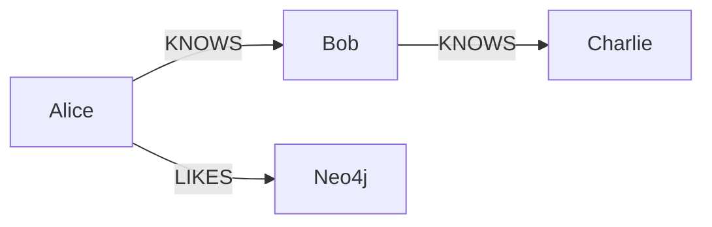
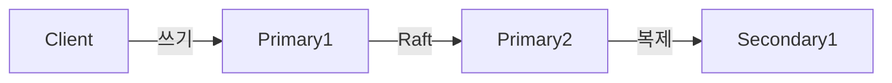

"친구의 친구의 친구 중에서 나와 같은 도시에 살면서 비슷한 음악 취향을 가진 사람을 찾아라." 관계형 DB로 이 쿼리를 작성하면 JOIN이 몇 개나 필요할까? 그래프 DB는 이 질문에 자연스럽게 답한다. 관계가 데이터의 핵심인 문제에서 그래프 DB는 RDB보다 수십 배 빠르고 수십 배 이해하기 쉽다.

---

## 1. 왜 그래프 DB인가

### 1-1. RDB의 JOIN 지옥

소셜 네트워크를 MySQL로 구현한다고 가정하자. 6단계 친구 관계를 찾으려면 `users` 테이블을 `friendships` 테이블과 6번 JOIN해야 한다.

```sql
-- 2단계 친구 관계만 해도 이렇다
SELECT DISTINCT u3.id, u3.name
FROM users u1
JOIN friendships f1 ON u1.id = f1.user_id
JOIN users u2 ON f1.friend_id = u2.id
JOIN friendships f2 ON u2.id = f2.user_id
JOIN users u3 ON f2.friend_id = u3.id
WHERE u1.id = 1
  AND u3.id != 1;
```

6단계가 되면 JOIN 12번, 인덱스 스캔 수백만 건이 필요하다. 노드 수가 늘어날수록 지수적으로 느려진다.

그래프 DB에서는 같은 쿼리가 이렇게 끝난다.

```cypher
MATCH (me:User {id: 1})-[:FRIEND*1..6]-(target:User)
WHERE me <> target
RETURN DISTINCT target.name
```

### 1-2. 그래프가 자연스러운 도메인

| 도메인 | 엔티티 | 관계 |
|--------|--------|------|
| 소셜 네트워크 | 사용자 | FOLLOWS, BLOCKS, LIKES |
| 추천 시스템 | 상품, 사용자 | PURCHASED, VIEWED, RATED |
| 사기 탐지 | 계좌, 기기, IP | TRANSFERS_TO, USES, ACCESSES_FROM |
| 지식 그래프 | 개념 | IS_A, PART_OF, RELATED_TO |
| 공급망 | 부품, 공장 | SUPPLIES, MANUFACTURES, DEPENDS_ON |

이런 도메인에서 RDB는 "테이블 안에 관계를 구겨 넣는" 작업이 필요하다. 그래프 DB는 관계가 1등 시민(first-class citizen)이다.

---

## 2. 그래프 DB 핵심 개념

그래프는 수학적으로 **노드(Vertex)** 와 **엣지(Edge)** 의 집합이다. Neo4j에서는 각각 **노드(Node)** 와 **관계(Relationship)** 라고 부른다.

### 2-1. 노드

노드는 사람, 상품, 도시 같은 엔티티를 표현한다. 하나 이상의 **레이블(Label)** 을 가질 수 있고, 키-값 형태의 **프로퍼티(Property)** 를 저장한다.

```
(alice:User:Admin {id: 1, name: 'Alice', age: 30})
```

- 레이블: `User`, `Admin`
- 프로퍼티: `id=1`, `name='Alice'`, `age=30`

### 2-2. 관계

관계는 두 노드를 연결한다. 방향이 있고, 반드시 하나의 **관계 타입(Type)** 을 가진다. 관계도 프로퍼티를 가질 수 있다.

```
(alice)-[:FOLLOWS {since: '2024-01-01'}]->(bob)
```

관계는 저장 시 포인터로 연결된다. 조회 시 인덱스를 쓰지 않고 포인터를 따라가기 때문에 (= **Index-Free Adjacency**) 관계가 많아져도 조회 성능이 일정하게 유지된다.

### 2-3. 레이블과 스키마

Neo4j는 스키마리스(schemaless)지만, 레이블 기반 인덱스와 제약 조건을 지원한다.

```cypher
-- 고유 제약 조건 (인덱스 자동 생성 포함)
CREATE CONSTRAINT user_id_unique FOR (u:User) REQUIRE u.id IS UNIQUE;

-- 단순 인덱스
CREATE INDEX user_name FOR (u:User) ON (u.name);

-- 복합 인덱스
CREATE INDEX order_search FOR (o:Order) ON (o.status, o.created_at);
```

---

## 3. Neo4j 아키텍처

### 3-1. Native Graph Storage

Neo4j는 그래프 데이터를 전용 파일 포맷으로 저장한다. 노드와 관계는 각각 고정 크기 레코드로 저장되며, 각 레코드에는 연결된 관계의 첫 번째 포인터가 포함된다.

```
NodeRecord:
  - inUse: boolean
  - nextRelId: long      ← 첫 번째 관계 포인터
  - nextPropId: long     ← 첫 번째 프로퍼티 포인터
  - labels: long[]

RelationshipRecord:
  - inUse: boolean
  - firstNode: long      ← 시작 노드
  - secondNode: long     ← 끝 노드
  - type: int
  - firstPrevRel: long   ← 더블 링크드 리스트
  - firstNextRel: long
  - secondPrevRel: long
  - secondNextRel: long
```

이 구조 덕분에 특정 노드의 모든 관계를 찾으려면 그 노드 레코드에서 포인터를 따라가기만 하면 된다. 전체 데이터를 스캔하지 않는다.

### 3-2. Index-Free Adjacency

비유하자면, RDB는 "이 사람의 친구를 찾으려면 전화번호부 전체를 뒤진다"에 해당하고, 그래프 DB는 "이 사람 명함 뒷면에 친구 명함이 직접 붙어 있다"에 해당한다.



Neo4j에서 Alice → Bob → Charlie 경로를 찾는 것은 3번의 포인터 역참조다. RDB에서는 2번의 인덱스 조회가 필요하지만, 데이터가 수억 건이 되면 인덱스 조회 비용이 누적된다.

### 3-3. 클러스터 아키텍처

Neo4j Enterprise는 **Causal Cluster** 방식을 사용한다.

- **Primary 멤버**: Raft 합의 알고리즘으로 쓰기를 처리. 최소 3개가 필요하며, 과반수 이상 생존해야 쓰기 가능.
- **Secondary 멤버**: Primary에서 비동기로 복제. 읽기 전용. 수평 확장에 사용.



---

## 4. Cypher 쿼리 언어

Cypher는 SQL의 그래프 버전이다. ASCII 아트처럼 그래프 패턴을 직접 표현한다.

### 4-1. 기본 문법

```cypher
-- 노드 생성
CREATE (alice:User {id: 1, name: 'Alice', age: 30})
CREATE (bob:User {id: 2, name: 'Bob', age: 25})

-- 관계 생성
MATCH (a:User {id: 1}), (b:User {id: 2})
CREATE (a)-[:FOLLOWS {since: date('2024-01-15')}]->(b)

-- 노드 조회
MATCH (u:User)
WHERE u.age > 25
RETURN u.name, u.age
ORDER BY u.age DESC
LIMIT 10

-- 관계 포함 조회
MATCH (alice:User {name: 'Alice'})-[r:FOLLOWS]->(followed:User)
RETURN followed.name, r.since
```

### 4-2. 패턴 매칭

```cypher
-- 2단계 친구 (공통 팔로우)
MATCH (me:User {id: 1})-[:FOLLOWS]->(mutual:User)<-[:FOLLOWS]-(other:User)
WHERE me <> other
RETURN other.name, COUNT(mutual) AS common_follows
ORDER BY common_follows DESC

-- 가변 길이 경로 (1~3단계)
MATCH path = (a:User {name: 'Alice'})-[:FOLLOWS*1..3]->(b:User)
RETURN b.name, LENGTH(path) AS depth

-- 최단 경로
MATCH path = shortestPath(
    (alice:User {name: 'Alice'})-[:FOLLOWS*]-(bob:User {name: 'Bob'})
)
RETURN path, LENGTH(path) AS hops
```

### 4-3. MERGE — UPSERT 패턴

```cypher
-- 없으면 생성, 있으면 기존 노드 반환
MERGE (u:User {id: $userId})
ON CREATE SET u.name = $name, u.createdAt = datetime()
ON MATCH SET u.lastSeen = datetime()
RETURN u
```

### 4-4. 집계와 WITH

```cypher
-- 팔로워 수 기준 인플루언서 목록
MATCH (u:User)<-[:FOLLOWS]-(follower:User)
WITH u, COUNT(follower) AS follower_count
WHERE follower_count > 1000
RETURN u.name, follower_count
ORDER BY follower_count DESC
LIMIT 20

-- 서브쿼리로 컬렉션 생성
MATCH (u:User {id: 1})-[:FOLLOWS]->(friend:User)
WITH u, COLLECT(friend.name) AS friends
RETURN u.name, friends, SIZE(friends) AS friend_count
```

### 4-5. 프로시저 호출

```cypher
-- 내장 프로시저로 스키마 확인
CALL db.schema.visualization()

-- 쿼리 실행 계획 확인
EXPLAIN MATCH (u:User)-[:FOLLOWS]->(f:User) RETURN u, f

-- 실제 실행 통계
PROFILE MATCH (u:User {id: 1})-[:FOLLOWS]->(f:User) RETURN f
```

---

## 5. 실전 사용 사례

### 5-1. 소셜 네트워크

```cypher
-- 친구 추천: 공통 친구가 많은 비친구
MATCH (me:User {id: $myId})-[:FRIEND]->(myFriend:User)
      -[:FRIEND]->(candidate:User)
WHERE NOT (me)-[:FRIEND]-(candidate)
  AND me <> candidate
RETURN candidate.name, COUNT(myFriend) AS mutual_friends
ORDER BY mutual_friends DESC
LIMIT 10

-- 내 네트워크 내 게시물 피드
MATCH (me:User {id: $myId})-[:FOLLOWS*1..2]->(author:User)
      -[:POSTED]->(post:Post)
WHERE post.createdAt > datetime() - duration('P7D')
RETURN post, author.name
ORDER BY post.createdAt DESC
```

### 5-2. 추천 시스템

```cypher
-- 협업 필터링: 나와 비슷한 취향의 사용자가 구매한 상품
MATCH (me:User {id: $myId})-[:PURCHASED]->(item:Product)
      <-[:PURCHASED]-(similar:User)
      -[:PURCHASED]->(recommend:Product)
WHERE NOT (me)-[:PURCHASED]->(recommend)
  AND NOT (me)-[:VIEWED]->(recommend)
RETURN recommend.name,
       COUNT(similar) AS score,
       COLLECT(DISTINCT item.name) AS common_purchases
ORDER BY score DESC
LIMIT 10

-- 컨텐츠 기반 추천: 같은 카테고리 + 구매자 유사도
MATCH (item:Product {id: $itemId})<-[:IN_CATEGORY]-(cat:Category)
      -[:IN_CATEGORY]->(related:Product)
WHERE item <> related
WITH related, COUNT(cat) AS category_overlap
MATCH (related)<-[:PURCHASED]-(buyer:User)
      -[:PURCHASED]->(myItem:Product {id: $itemId})
RETURN related.name,
       category_overlap,
       COUNT(buyer) AS shared_buyers
ORDER BY shared_buyers DESC, category_overlap DESC
```

### 5-3. 사기 탐지

```cypher
-- 동일 기기에서 여러 계좌 접근
MATCH (device:Device)<-[:USES]-(account:Account)
WITH device, COLLECT(account) AS accounts
WHERE SIZE(accounts) > 3
RETURN device.id, SIZE(accounts) AS account_count, accounts

-- 단기간 내 빠른 자금 이동 체인 탐지
MATCH path = (source:Account)-[:TRANSFERS_TO*2..5]->(sink:Account)
WHERE ALL(r IN relationships(path)
          WHERE r.amount > 10000
            AND r.timestamp > datetime() - duration('PT1H'))
  AND source.owner <> sink.owner
RETURN source.id, sink.id, LENGTH(path) AS hops,
       [r IN relationships(path) | r.amount] AS amounts
```

### 5-4. 지식 그래프

```cypher
-- "Java는 무엇인가" 탐색 (2단계 IS_A, PART_OF 관계)
MATCH (java:Concept {name: 'Java'})-[:IS_A|PART_OF*1..2]->(parent:Concept)
RETURN parent.name, parent.description

-- 두 개념 사이의 연결 관계 탐색
MATCH path = shortestPath(
    (a:Concept {name: 'Spring Boot'})-[*]-(b:Concept {name: 'Microservices'})
)
RETURN [node IN nodes(path) | node.name] AS concept_path
```

---

## 6. 그래프 알고리즘

Neo4j Graph Data Science(GDS) 라이브러리는 수십 가지 그래프 알고리즘을 제공한다.

### 6-1. 중심성 알고리즘

**PageRank**: 얼마나 중요한 노드인가? 중요한 노드에서 연결된 노드가 더 중요하다.

```cypher
-- GDS 프로젝션 생성
CALL gds.graph.project(
    'social-graph',
    'User',
    {FOLLOWS: {orientation: 'NATURAL'}}
)

-- PageRank 실행
CALL gds.pageRank.stream('social-graph', {maxIterations: 20, dampingFactor: 0.85})
YIELD nodeId, score
WITH gds.util.asNode(nodeId) AS user, score
RETURN user.name, score
ORDER BY score DESC
LIMIT 10
```

**Betweenness Centrality**: 네트워크에서 정보 흐름의 병목이 되는 노드를 찾는다.

```cypher
CALL gds.betweenness.stream('social-graph')
YIELD nodeId, score
WITH gds.util.asNode(nodeId) AS user, score
RETURN user.name, score
ORDER BY score DESC
```

### 6-2. 경로 알고리즘

```cypher
-- Dijkstra 최단 경로 (가중치 있는 그래프)
MATCH (source:Location {name: 'Seoul'}), (target:Location {name: 'Busan'})
CALL gds.shortestPath.dijkstra.stream('transport-graph', {
    sourceNode: source,
    targetNode: target,
    relationshipWeightProperty: 'distance'
})
YIELD nodeIds, costs
RETURN [nodeId IN nodeIds | gds.util.asNode(nodeId).name] AS path,
       costs[-1] AS total_distance
```

### 6-3. 커뮤니티 탐지

**Louvain 알고리즘**: 자연스럽게 형성된 커뮤니티(그룹)를 탐지한다. 소셜 그룹, 비슷한 취향의 고객 클러스터링에 활용된다.

```cypher
CALL gds.louvain.stream('social-graph')
YIELD nodeId, communityId
WITH gds.util.asNode(nodeId) AS user, communityId
RETURN communityId,
       COUNT(user) AS size,
       COLLECT(user.name)[0..5] AS sample_members
ORDER BY size DESC
```

**Label Propagation**: 각 노드가 이웃의 레이블 중 다수결로 자신의 커뮤니티를 결정한다. Louvain보다 빠르다.

```cypher
CALL gds.labelPropagation.stream('social-graph')
YIELD nodeId, communityId
```

### 6-4. 유사도 알고리즘

```cypher
-- Node Similarity: 공통 이웃을 기반으로 유사한 노드 쌍 찾기 (Jaccard)
CALL gds.nodeSimilarity.stream('purchase-graph')
YIELD node1, node2, similarity
WITH gds.util.asNode(node1) AS u1,
     gds.util.asNode(node2) AS u2,
     similarity
WHERE similarity > 0.5
RETURN u1.name, u2.name, similarity
ORDER BY similarity DESC
```

---

## 7. Spring Data Neo4j

```xml
<!-- pom.xml -->
<dependency>
    <groupId>org.springframework.boot</groupId>
    <artifactId>spring-boot-starter-data-neo4j</artifactId>
</dependency>
```

```yaml
# application.yml
spring:
  neo4j:
    uri: bolt://localhost:7687
    authentication:
      username: neo4j
      password: secret
```

### 7-1. 도메인 모델

```java
// 노드 엔티티
@Node("User")
public class UserNode {
    @Id @GeneratedValue
    private Long id;

    @Property("name")
    private String name;

    private Integer age;

    @Relationship(type = "FOLLOWS", direction = Relationship.Direction.OUTGOING)
    private List<UserNode> following = new ArrayList<>();

    @Relationship(type = "PURCHASED")
    private List<PurchasedRelationship> purchases = new ArrayList<>();
}

// 관계 프로퍼티가 있을 때 관계 엔티티
@RelationshipProperties
public class PurchasedRelationship {
    @RelationshipId
    private Long id;

    @TargetNode
    private ProductNode product;

    private LocalDate purchasedAt;
    private Double amount;
}

// 상품 노드
@Node("Product")
public class ProductNode {
    @Id @GeneratedValue
    private Long id;
    private String name;
    private String category;
    private Double price;
}
```

### 7-2. Repository와 Cypher 쿼리

```java
@Repository
public interface UserNodeRepository extends Neo4jRepository<UserNode, Long> {

    // 파생 쿼리
    Optional<UserNode> findByName(String name);
    List<UserNode> findByAgeGreaterThan(int age);

    // 커스텀 Cypher 쿼리
    @Query("MATCH (me:User {id: $userId})-[:FOLLOWS]->(friend:User) " +
           "RETURN friend")
    List<UserNode> findFollowing(@Param("userId") Long userId);

    // 친구 추천
    @Query("MATCH (me:User {id: $userId})-[:FOLLOWS]->(mutual:User)" +
           "<-[:FOLLOWS]-(candidate:User) " +
           "WHERE NOT (me)-[:FOLLOWS]-(candidate) AND me.id <> candidate.id " +
           "RETURN candidate, COUNT(mutual) AS score " +
           "ORDER BY score DESC LIMIT $limit")
    List<UserNode> recommendFriends(@Param("userId") Long userId,
                                    @Param("limit") int limit);
}
```

### 7-3. Neo4jTemplate으로 직접 쿼리

```java
@Service
@RequiredArgsConstructor
public class GraphService {
    private final Neo4jTemplate neo4jTemplate;
    private final Driver driver;

    // 커스텀 결과 매핑이 필요할 때
    public List<Map<String, Object>> findInfluencers(int minFollowers) {
        String query = """
            MATCH (u:User)<-[:FOLLOWS]-(f:User)
            WITH u, COUNT(f) AS followers
            WHERE followers >= $minFollowers
            RETURN u.name AS name, followers
            ORDER BY followers DESC
            """;

        try (Session session = driver.session()) {
            return session.run(query, Map.of("minFollowers", minFollowers))
                .list(record -> Map.of(
                    "name", record.get("name").asString(),
                    "followers", record.get("followers").asLong()
                ));
        }
    }

    // 트랜잭션 내 여러 쓰기
    public void createFriendship(Long userId1, Long userId2) {
        try (Session session = driver.session()) {
            session.writeTransaction(tx -> {
                tx.run("MATCH (a:User {id: $id1}), (b:User {id: $id2}) " +
                       "MERGE (a)-[:FOLLOWS]->(b) " +
                       "MERGE (b)-[:FOLLOWS]->(a)",
                       Map.of("id1", userId1, "id2", userId2));
                return null;
            });
        }
    }
}
```

---

## 8. RDB vs Graph DB 성능 비교

**실험 조건**: 소셜 네트워크 그래프, 100만 명의 사용자, 평균 50개의 팔로우 관계

| 쿼리 | MySQL (시간) | Neo4j (시간) | 비율 |
|------|-------------|-------------|------|
| 2단계 친구 탐색 | 0.016s | 0.001s | 16x |
| 4단계 친구 탐색 | 30.267s | 0.002s | 15,000x |
| 6단계 친구 탐색 | 타임아웃 | 0.028s | - |
| 최단 경로 탐색 | 타임아웃 | 0.039s | - |

이 결과는 Ian Robinson의 "Graph Databases" 책에서 제시한 수치를 기반으로 한 것이다. 핵심은 **관계 탐색 깊이가 깊어질수록 RDB의 성능 저하가 지수적**이라는 점이다.

반대로, 단순한 집계 쿼리나 전체 스캔은 관계형 DB나 컬럼형 DB가 더 유리하다.

---

## 9. 데이터 모델링 가이드

### 9-1. 노드로 만들 것인가, 프로퍼티로 만들 것인가

| 기준 | 노드 | 프로퍼티 |
|------|------|---------|
| 단독으로 조회/탐색 | O | X |
| 다른 엔티티와 관계 형성 | O | X |
| 단순 속성 값 | X | O |
| 고유 식별자 필요 | O | X |

```cypher
-- 나쁜 예: 도시를 프로퍼티로 저장 (도시 관련 쿼리 불가)
CREATE (u:User {name: 'Alice', city: 'Seoul'})

-- 좋은 예: 도시를 노드로 분리 (도시별 사용자 탐색, 도시 간 거리 계산 가능)
CREATE (u:User {name: 'Alice'})-[:LIVES_IN]->(c:City {name: 'Seoul'})
```

### 9-2. 관계 방향

관계는 방향을 갖지만, Cypher 조회 시 양방향 탐색이 가능하다. 저장 시에는 의미적으로 자연스러운 방향으로 정하되, 탐색 방향은 쿼리에서 제어한다.

```cypher
-- 저장: Alice가 Bob을 팔로우
(alice)-[:FOLLOWS]->(bob)

-- 조회: alice의 팔로워 (역방향)
MATCH (alice:User {name: 'Alice'})<-[:FOLLOWS]-(follower:User)
RETURN follower

-- 조회: 양방향 팔로우 (서로 팔로우)
MATCH (alice:User {name: 'Alice'})-[:FOLLOWS]-(mutual:User)
WHERE (alice)-[:FOLLOWS]->(mutual) AND (mutual)-[:FOLLOWS]->(alice)
RETURN mutual
```

### 9-3. 중간 노드 패턴

관계에 복잡한 정보가 필요하거나, 관계 자체가 다른 관계를 가져야 할 때 중간 노드를 사용한다.

```cypher
-- 단순: 사용자가 상품을 구매 (관계 프로퍼티로 처리)
(user)-[:PURCHASED {date: '2024-01-01', amount: 50000}]->(product)

-- 복잡: 주문이 여러 상품을 포함하고, 배송지/결제 정보도 있을 때
(user)-[:PLACED]->(order:Order)-[:CONTAINS]->(product)
(order)-[:SHIPPED_TO]->(address:Address)
(order)-[:PAID_WITH]->(payment:Payment)
```

---

## 10. 극한 시나리오

### 시나리오 1: 슈퍼노드 (Super Node) 문제

**상황**: 팔로워가 1억 명인 유명인 노드를 조회하면 쿼리 전체가 멈추는 상황.

```cypher
-- 위험: 팔로워 1억 명의 관계를 전부 로드
MATCH (celebrity:User {name: 'Celebrity'})<-[:FOLLOWS]-(follower:User)
RETURN follower
-- 결과: 1억 건 반환 시도, OOM 또는 타임아웃
```

**원인**: Index-Free Adjacency는 노드의 관계를 모두 포인터로 연결하기 때문에, 관계 수가 극단적으로 많은 슈퍼노드는 단순 조회에도 엄청난 메모리를 소비한다.

**해결**:

```cypher
-- LIMIT으로 결과 제한
MATCH (celebrity:User {name: 'Celebrity'})<-[:FOLLOWS]-(follower:User)
RETURN follower
LIMIT 100

-- 페이지네이션
MATCH (celebrity:User {name: 'Celebrity'})<-[:FOLLOWS]-(follower:User)
RETURN follower
SKIP $offset LIMIT $pageSize

-- 슈퍼노드 분리: 팔로워를 버킷 노드로 샤딩
CREATE (celebrity)-[:HAS_BUCKET]->(bucket:FollowerBucket {id: $bucketId})
CREATE (bucket)-[:CONTAINS]->(follower)

-- 슈퍼노드를 건너뛰는 패턴
MATCH (a:User)-[:FOLLOWS]->(b:User)-[:FOLLOWS]->(c:User)
WHERE NOT a.isSuper AND NOT b.isSuper
RETURN a, c
```

### 시나리오 2: 메모리 부족 (OOM)

**상황**: 전체 그래프를 메모리에 올리는 알고리즘(PageRank, Community Detection)을 실행했더니 Neo4j가 OOM으로 다운되는 상황.

```
java.lang.OutOfMemoryError: Java heap space
at org.neo4j.gds.algorithms.PageRank.compute(...)
```

**원인**: GDS 알고리즘은 그래프 프로젝션을 메모리에 올려 계산한다. 프로젝션이 힙 용량을 초과하면 OOM이 발생한다.

**해결**:

```cypher
-- 1. 서브그래프로 범위 제한
CALL gds.graph.project.cypher(
    'active-users',
    'MATCH (u:User) WHERE u.lastActive > datetime() - duration("P30D") RETURN id(u) AS id',
    'MATCH (u1:User)-[:FOLLOWS]->(u2:User) RETURN id(u1) AS source, id(u2) AS target'
)

-- 2. 배치 스트리밍 처리
CALL gds.pageRank.stream('social-graph', {batchSize: 100000})
YIELD nodeId, score
WITH nodeId, score
WHERE score > 0.1  -- 의미 있는 결과만 처리
...

-- 3. Neo4j 힙 설정 조정 (neo4j.conf)
-- server.memory.heap.initial_size=4g
-- server.memory.heap.max_size=8g
-- server.memory.pagecache.size=4g
```

### 시나리오 3: 샤딩 한계

**상황**: 데이터가 수십억 노드로 증가했는데, Neo4j 단일 인스턴스의 디스크와 메모리가 한계에 도달하는 상황.

**원인**: Neo4j는 기본적으로 단일 머신에 모든 그래프 데이터를 저장한다. 그래프 DB의 Index-Free Adjacency 특성상 노드와 관계가 같은 머신에 있어야 포인터 탐색이 가능하기 때문에, 그래프를 여러 머신에 자동 분산하기가 매우 어렵다.

**해결 방향**:

```
1. 도메인 분리 (Federation)
   - 소셜 그래프 / 상품 그래프 / 사기 탐지 그래프를 별도 Neo4j 인스턴스로 분리
   - 크로스 도메인 쿼리는 애플리케이션 레이어에서 조합

2. 핫/콜드 분리
   - 최근 1년 데이터만 Neo4j에 유지
   - 오래된 데이터는 S3 + 배치 그래프 프레임워크(Apache Spark GraphX)로 이관

3. 대안 그래프 DB 고려
   - Amazon Neptune: 관리형, 수십억 노드 지원
   - TigerGraph: 분산 아키텍처, 수천억 노드 지원
   - Apache JanusGraph: Cassandra/HBase를 백엔드로 사용, 무제한 확장
```

---

## 11. 면접 포인트

### Index-Free Adjacency가 무엇이며 왜 그래프 탐색에 유리한가?

Index-Free Adjacency는 각 노드가 연결된 관계에 대한 포인터를 직접 보유하는 저장 방식이다. RDB에서 JOIN은 인덱스를 통해 매칭되는 레코드를 찾지만, 데이터 규모가 커질수록 인덱스 탐색 비용이 증가한다. 그래프 DB에서는 포인터를 따라가기만 하므로 관계 탐색이 O(1)이다. 4단계, 6단계 관계를 탐색해도 전체 데이터를 스캔하지 않기 때문에 RDB 대비 수천 배 이상의 성능 차이가 발생한다.

### Cypher의 MATCH 절과 SQL의 SELECT/JOIN 절의 차이를 설명해보라.

SQL은 테이블을 기준으로 어떤 테이블에서 어떤 조건으로 조인할지 명시한다. Cypher의 MATCH는 그래프 패턴을 직접 표현한다. `(a)-[:FOLLOWS]->(b)` 라는 표현 자체가 "a가 b를 팔로우하는 관계"를 나타낸다. SQL에서 동일한 의미를 표현하려면 `JOIN follows ON a.id = follows.from_user_id JOIN users b ON follows.to_user_id = b.id`로 쓴다. Cypher는 쿼리가 도메인 모델에 가깝고 가변 길이 경로(`*1..6`)를 자연스럽게 표현할 수 있다는 점에서 다르다.

### 슈퍼노드 문제가 발생하는 원인과 해결 방법은?

팔로워가 수천만 명 이상인 노드는 수천만 개의 관계 포인터를 보유한다. 이 노드를 조회하거나 이 노드를 경유하는 패턴을 탐색하면 수천만 개의 관계를 메모리에 로드해야 하므로 쿼리가 느려지거나 OOM이 발생한다. 해결책은 LIMIT으로 반환 수를 제한하거나, 슈퍼노드를 버킷 노드로 분할해서 관계 수를 줄이거나, 슈퍼노드를 경유하지 않는 쿼리 패턴을 설계하는 것이다.

### 그래프 DB와 RDB 중 어떤 상황에서 무엇을 선택해야 하나?

관계 탐색이 핵심이고 깊이 우선 또는 경로 탐색이 빈번하다면 그래프 DB가 유리하다. 소셜 네트워크, 추천, 사기 탐지, 지식 그래프가 대표적이다. 반면 집계 분석(SUM, GROUP BY), 전체 테이블 스캔, 복잡한 조건 필터링 중심의 OLAP 쿼리는 RDB 또는 컬럼형 DB가 더 적합하다. 실무에서는 두 DB를 함께 사용하기도 한다. 사용자 기본 정보는 RDB에, 친구 관계 그래프는 Neo4j에 저장하는 방식이다.

### PageRank 알고리즘의 직관적 의미를 설명해보라.

PageRank는 "중요한 노드에서 링크(관계)를 받은 노드가 더 중요하다"는 반복 계산이다. 웹 페이지의 경우 많은 페이지에서 링크를 받을수록 중요하고, 그 링크를 보낸 페이지 자체가 중요할수록 가중치가 높아진다. 소셜 네트워크에서는 팔로워가 많고, 그 팔로워들도 영향력 있는 유저일수록 PageRank가 높다. GDS 라이브러리를 통해 그래프 DB에서 직접 실행할 수 있다.

### Neo4j의 Causal Cluster에서 Primary와 Secondary의 역할 분리는?

Primary 멤버는 Raft 합의 알고리즘을 사용해서 쓰기 일관성을 보장한다. 과반수의 Primary가 동의해야 쓰기가 커밋된다. Secondary 멤버는 Primary에서 비동기로 복제받아 읽기 전용으로 서비스한다. 읽기 트래픽을 Secondary로 분산하여 수평 확장이 가능하다. 그래프 탐색이 읽기 heavy한 특성을 가지므로, Secondary를 여러 대 두고 읽기 부하를 분산하는 것이 일반적인 운영 패턴이다.
