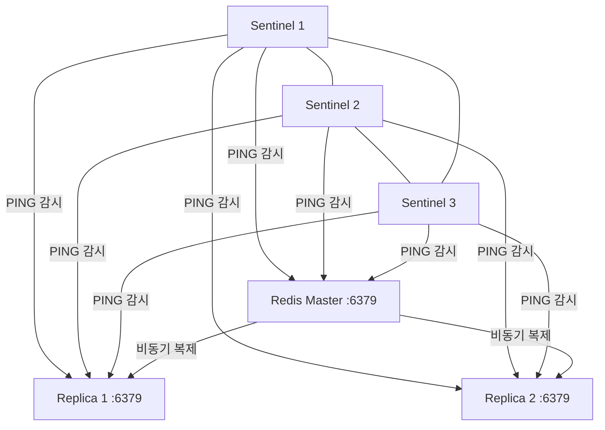
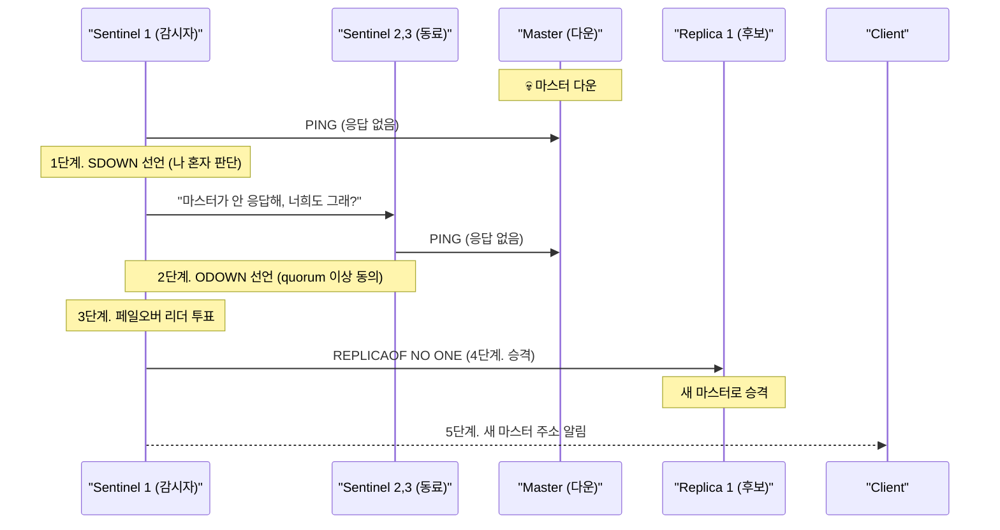
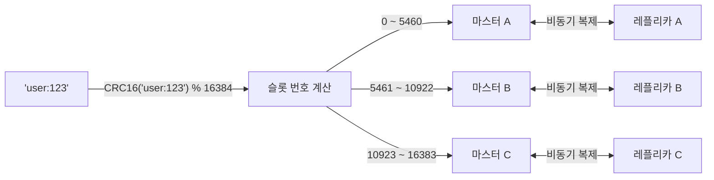
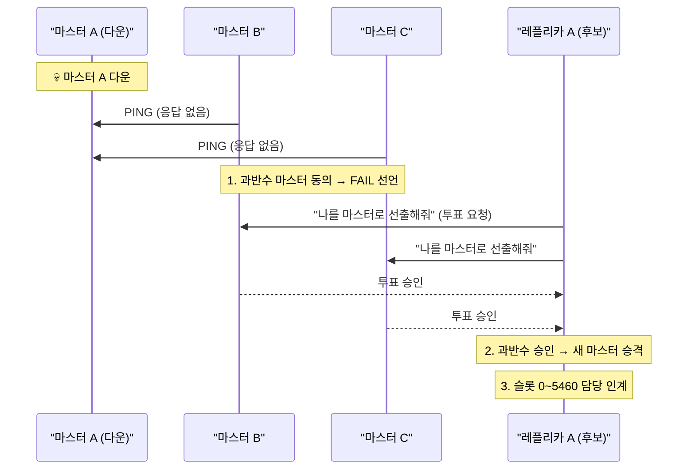
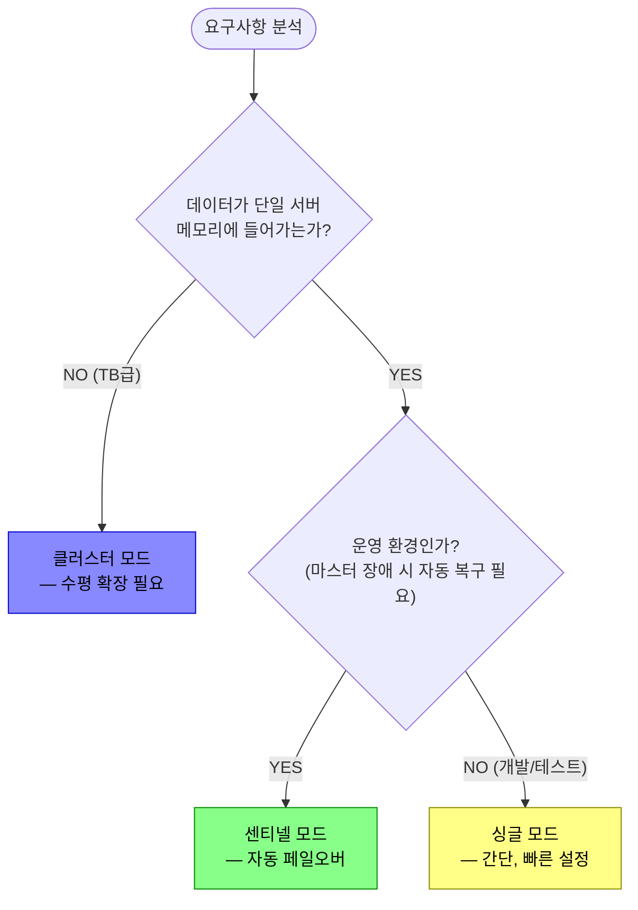

새벽 2시, 서비스가 죽었다는 알림이 온다. Redis 마스터 서버 한 대가 다운됐다. 재시작하려면 엔지니어가 일어나서 접속해야 한다. 복구까지 20분. 그 20분 동안 캐시가 없으니 DB에 쿼리가 몰리고, DB도 죽는다. 센티넬이 있었다면 30초 안에 자동으로 레플리카가 승격되어 서비스가 살아났을 것이다. **배포 모드 선택은 "언제 복구될 것인가"를 결정하는 인프라 설계다.**

## 세 가지 모드, 세 가지 상황

> **비유**: 싱글 모드는 혼자 일하는 자영업자다 — 주인이 아프면 가게가 닫힌다. 센티넬은 매니저가 있는 직원 구조다 — 주인이 쓰러져도 매니저가 대리를 세운다. 클러스터는 전국 프랜차이즈다 — 한 지점이 타도 다른 지점이 영업한다. 어느 구조를 선택할지는 "얼마나 크게, 얼마나 안정적으로 운영해야 하는가"에 달려 있다.

| 모드 | 자동 복구 | 수평 확장 | 최소 노드 | 적합 환경 |
|------|---------|---------|---------|---------|
| **싱글(Standalone)** | 없음 (수동) | 불가 | 1 | 개발, 테스트 |
| **센티넬(Sentinel)** | 있음 | 불가 (단일 마스터) | 4 (Sentinel 3 + Redis 1) | 운영, 수백 GB 이하 |
| **클러스터(Cluster)** | 있음 | 가능 | 6 (마스터 3 + 레플리카 3) | 대규모, TB급, 높은 처리량 |

---

## 싱글 모드 — 왜 운영 환경에서는 쓰면 안 되는가

싱글 모드는 Redis 프로세스 한 개가 전부다. 선택적으로 레플리카를 붙일 수 있지만, 마스터가 죽으면 사람이 직접 레플리카를 승격시켜야 한다.


### 왜 싱글 모드는 운영에 위험한가

마스터가 죽는 순간 **모든 쓰기가 실패**한다. 레플리카가 있어도 자동 승격이 없으므로:

1. 모니터링 알림이 울린다
2. 엔지니어가 잠에서 깨 접속한다
3. `REPLICAOF NO ONE`으로 레플리카를 수동 승격한다
4. 애플리케이션 설정의 Redis 주소를 바꾼다
5. 재배포한다

이 과정이 30분이면 서비스는 30분 죽는다. 새벽이면 1시간도 된다.

### 기본 설정 (redis.conf)

```conf
# 싱글 모드 기본 설정
bind 0.0.0.0
port 6379
daemonize yes

# 영속성 — 없으면 재시작 시 모든 데이터가 사라진다
save 900 1          # 900초 안에 1개 이상 변경 시 스냅샷
save 300 10
save 60 10000
appendonly yes      # AOF: 매 명령어를 로그로 기록
appendfsync everysec

# 메모리 한도 초과 시 퇴거 정책
maxmemory 2gb
maxmemory-policy allkeys-lru

logfile /var/log/redis/redis.log
```

### 레플리카 추가 (반쪽짜리 고가용성)

```conf
# 레플리카 서버의 redis.conf
replicaof 192.168.1.10 6379
replica-read-only yes   # 레플리카는 읽기 전용 — 실수로 쓰면 데이터 불일치 발생
```

레플리카를 붙이면 **읽기 분산**과 **데이터 백업**은 되지만, 자동 페일오버가 없으므로 여전히 수동 개입이 필요하다.

---

## 센티넬 모드 — 자동 페일오버의 실제 동작

> **비유**: 센티넬은 24시간 교대 근무하는 경비원이다. 주 건물(마스터)에 문제가 생기면 경비원들이 투표를 거쳐 부건물(레플리카)을 주 건물로 승격시키고, 고객(클라이언트)에게 "이제 저쪽으로 가세요"라고 안내한다.

Sentinel은 Redis 마스터/레플리카를 **감시**하고, 마스터 장애 시 **자동으로 레플리카를 마스터로 승격**시키는 별도 프로세스다.

### 왜 Sentinel을 3개 이상 써야 하는가

Sentinel 1개면 그 Sentinel 자체가 죽었을 때 페일오버가 불가능해진다. 2개면 과반수(2/2)가 필요한데, 한 쪽이 죽으면 과반수 미달이다. **3개 이상, 홀수**로 배포해야 과반수 quorum이 안정적으로 작동한다.



### 페일오버의 5단계



**SDOWN vs ODOWN**:
- **SDOWN (Subjectively Down)**: 내 눈에만 죽어 보임. 네트워크 일시 단절일 수 있음.
- **ODOWN (Objectively Down)**: quorum 이상이 동의. 그제서야 페일오버 시작.

이 두 단계 구분이 없으면, 네트워크가 잠깐 튀는 것만으로 불필요한 페일오버가 발생한다.

### Sentinel 설정 파일

```conf
# sentinel.conf
port 26379
daemonize yes
logfile /var/log/redis/sentinel.log

# 모니터링할 마스터: 이름, IP, 포트, quorum 수
# quorum 2 = 최소 2개 Sentinel이 동의해야 ODOWN 선언
sentinel monitor mymaster 192.168.1.10 6379 2

# 5초 응답 없으면 SDOWN
sentinel down-after-milliseconds mymaster 5000

# 페일오버 최대 허용 시간 (이 안에 완료 안 되면 실패 처리)
sentinel failover-timeout mymaster 60000

# 페일오버 후 레플리카들이 새 마스터를 동시에 동기화하는 수
# 1로 낮게 설정 → 나머지 레플리카들은 순차 동기화 (읽기 가용성 유지)
sentinel parallel-syncs mymaster 1

# 마스터에 requirepass 설정된 경우
sentinel auth-pass mymaster mypassword
```

### 레플리카 선택 기준 (우선순위)

페일오버 시 어떤 레플리카를 마스터로 선택할지:

1. `replica-priority`가 가장 낮은 노드 (0이면 후보 제외)
2. 복제 offset이 가장 큰 노드 — 마스터 데이터를 가장 많이 받은 노드
3. Run ID가 사전순으로 가장 작은 노드 (tie-breaker)

**실무 팁**: 특정 레플리카를 "절대 마스터가 되어선 안 되는" 용도(백업 전용)로 쓰려면 `replica-priority 0`으로 설정한다.

### Spring Boot 센티넬 연결

```yaml
spring:
  data:
    redis:
      sentinel:
        master: mymaster          # sentinel.conf의 이름과 일치해야 함
        nodes:
          - 192.168.1.10:26379
          - 192.168.1.11:26379
          - 192.168.1.12:26379
        password: sentinelpassword
      password: redispassword
      lettuce:
        pool:
          max-active: 10
```

```java
// 레플리카에서 읽기 분산 설정
@Bean
public LettuceClientConfigurationBuilderCustomizer lettuceCustomizer() {
    // REPLICA_PREFERRED: 레플리카 우선, 없으면 마스터
    // 읽기 부하를 레플리카로 분산하면서 페일오버 중에도 마스터에서 읽을 수 있다
    return builder -> builder.readFrom(ReadFrom.REPLICA_PREFERRED);
}
```

---

## 클러스터 모드 — 수평 확장의 작동 원리

> **비유**: Redis Cluster는 우체국 시스템과 같다. 우편번호(해시 슬롯)에 따라 서울 우체국(마스터 A), 부산 우체국(마스터 B), 대구 우체국(마스터 C)이 나눠 처리한다. 편지(데이터)는 우편번호를 보고 자동으로 올바른 우체국으로 라우팅된다.

단일 서버의 메모리 한계를 넘어서거나, 쓰기 처리량이 단일 마스터의 한계를 넘을 때 클러스터가 필요하다.

### 해시 슬롯: 데이터 분산의 핵심

Redis Cluster는 **16384개의 해시 슬롯**으로 키를 분산한다.



클라이언트가 잘못된 노드에 요청하면 `MOVED` 리다이렉션 응답이 온다:

```bash
GET user:123
# 이 키의 슬롯이 마스터 B에 있으면:
-MOVED 7638 192.168.1.11:7001
# 클라이언트는 해당 주소로 재요청한다
```

**클러스터 인식 클라이언트**(Lettuce, Jedis, Redisson)는 이 MOVED 리다이렉션을 자동으로 처리한다. 일반 클라이언트는 처리 못한다.

### 클러스터 생성 (최소 6노드)

```bash
# redis.conf — 각 노드에 설정
port 7000
cluster-enabled yes
cluster-config-file nodes-7000.conf  # 클러스터 상태 자동 저장
cluster-node-timeout 5000            # 5초 응답 없으면 PFAIL

appendonly yes
```

```bash
# 6노드로 클러스터 생성 (마스터 3 + 레플리카 3)
redis-cli --cluster create \
  192.168.1.10:7000 \
  192.168.1.11:7001 \
  192.168.1.12:7002 \
  192.168.1.10:7003 \
  192.168.1.11:7004 \
  192.168.1.12:7005 \
  --cluster-replicas 1   # 마스터 1개당 레플리카 1개
```

### 클러스터 페일오버 동작

센티넬과 달리 클러스터는 **노드들이 직접 투표**한다:



---

## Multi-key 명령어 제약 — 클러스터의 가장 큰 함정

클러스터에서 가장 많이 당하는 함정이다. **여러 키를 한 명령어에서 다루면 에러가 난다.**

```bash
MSET user:1:name "김철수" user:2:name "이영희"
# → CROSSSLOT Keys in request don't hash to the same slot
# 이유: user:1과 user:2가 다른 슬롯에 배치될 수 있다
```

만약 이 제약을 무시하면? 클러스터에 배포하는 순간 기존에 잘 돌던 `MSET`, `SUNION`, `KEYS *`, Lua 스크립트가 모두 에러를 뿜는다.

### 해시 태그로 해결

키 이름의 `{...}` 안의 내용만으로 슬롯을 결정한다:

```bash
# {user:1} 부분만 슬롯 계산에 사용 → 두 키 모두 같은 슬롯
MSET {user:1}:name "김철수" {user:1}:email "kim@example.com"
MGET {user:1}:name {user:1}:email  # OK — 같은 슬롯

# 주의: 태그가 다르면 다른 슬롯
MSET {user:1}:name "김" {user:2}:name "이"  # 여전히 에러
```

```java
// Spring Data Redis에서 해시 태그 패턴
String userId = "1";
String nameKey    = "{user:" + userId + "}:name";
String emailKey   = "{user:" + userId + "}:email";
String sessionKey = "{user:" + userId + "}:session";

// 세 키 모두 {user:1} 기준으로 같은 슬롯 → MSET 가능
redisTemplate.opsForValue().multiSet(Map.of(
    nameKey, "김철수",
    emailKey, "kim@example.com"
));
```

**클러스터에서 제약이 있는 명령어들:**

| 명령어 | 제약 | 해결책 |
|--------|------|--------|
| `MSET`, `MGET` | 모든 키 같은 슬롯 | 해시 태그 |
| `SUNION`, `SINTER` | 모든 키 같은 슬롯 | 해시 태그 |
| `ZUNIONSTORE` | 모든 키 같은 슬롯 | 해시 태그 |
| `EVAL` (Lua) | KEYS의 모든 키 같은 슬롯 | 해시 태그 |
| `KEYS *` | 현재 노드만 반환 | 전 노드에 `SCAN` 실행 |

---

## 클러스터 운영

### 노드 추가 절차

```bash
# 1. 새 마스터 노드 추가 (슬롯 없는 상태로 참여)
redis-cli --cluster add-node \
  192.168.1.13:7006 \    # 새 노드
  192.168.1.10:7000      # 기존 클러스터 아무 노드

# 2. 리샤딩으로 슬롯 분배
redis-cli --cluster reshard 192.168.1.10:7000
# → 이동할 슬롯 수, 받을 노드 ID, 줄 노드 지정
```

리샤딩 중에도 서비스 중단 없이 진행된다. 슬롯 이동 중에는 `ASK` 리다이렉션으로 클라이언트가 임시 위치를 안내받는다.

### 클러스터 전체 다운 조건

한 마스터와 그 **모든 레플리카가 동시에 죽으면** 해당 슬롯에 접근 불가 → 기본 설정(`cluster-require-full-coverage yes`)에서는 클러스터 전체가 에러 상태가 된다.

```conf
# 일부 슬롯이 죽어도 나머지 슬롯은 서비스 유지하려면
cluster-require-full-coverage no
```

이 설정은 "일부 데이터가 안 되더라도 나머지는 살려야 한다"는 상황에만 사용한다.

### Spring Boot 클러스터 연결

```yaml
spring:
  data:
    redis:
      cluster:
        nodes:
          - 192.168.1.10:7000
          - 192.168.1.11:7001
          - 192.168.1.12:7002
          - 192.168.1.10:7003
          - 192.168.1.11:7004
          - 192.168.1.12:7005
        max-redirects: 3         # MOVED 리다이렉션 최대 횟수
      password: yourpassword
      lettuce:
        cluster:
          refresh:
            adaptive: true       # 페일오버 등 토폴로지 변경 시 자동 갱신
            period: 60s
        pool:
          max-active: 10
```

```java
@Bean
public LettuceClientConfigurationBuilderCustomizer lettuceCustomizer() {
    return builder -> builder
        .readFrom(ReadFrom.REPLICA_PREFERRED)  // 레플리카에서 읽기 분산
        .commandTimeout(Duration.ofSeconds(2));
}
```

---

## 모드 선택 가이드



---

## 세 모드 종합 비교

| 항목 | 싱글 | 센티넬 | 클러스터 |
|------|------|--------|---------|
| 자동 페일오버 | 없음 | 있음 (30초 내) | 있음 (수십 초) |
| 수평 확장 | 불가 | 불가 | 가능 (마스터 추가) |
| 최소 노드 수 | 1 | Sentinel 3 + Redis 3 | 6 |
| Multi-key 명령어 | 자유 | 자유 | 해시 태그 필요 |
| 클라이언트 복잡도 | 낮음 | 중간 | 높음 |
| 운영 복잡도 | 낮음 | 중간 | 높음 |
| 쓰기 처리량 | 단일 마스터 | 단일 마스터 | 마스터 수에 비례 |

---

## 운영 주의사항 요약

**센티넬**:
- Sentinel 3개 이상, 홀수, **서로 다른 물리 서버**에 배포해야 한다. 같은 서버 2개가 죽으면 quorum이 깨진다.
- 페일오버 후 구 마스터가 재시작되면 자동으로 레플리카로 편입된다.
- 클라이언트는 Sentinel 주소로 연결하고, Sentinel이 현재 마스터 주소를 알려준다. Redis 주소를 직접 하드코딩하면 페일오버 후 연결이 끊긴다.

**클러스터**:
- 노드 추가 후 반드시 리샤딩으로 슬롯을 균등 분배해야 한다. 안 하면 새 노드는 빈 슬롯만 갖고 부하를 받지 못한다.
- `KEYS *`는 현재 노드의 키만 반환한다. 전체 키 순회가 필요하면 모든 노드에 `SCAN`을 실행해야 한다.
- Lua 스크립트에서 접근하는 모든 키는 KEYS 배열에 명시해야 한다. KEYS에 없으면 클러스터가 올바른 노드로 라우팅하지 못한다.
