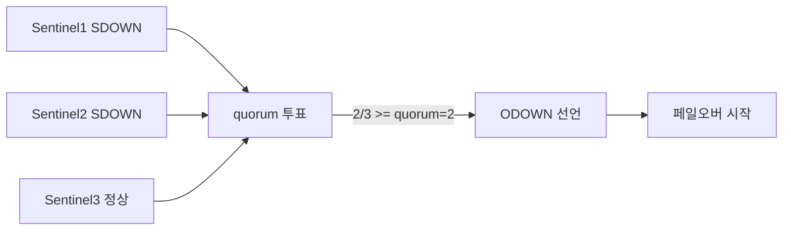
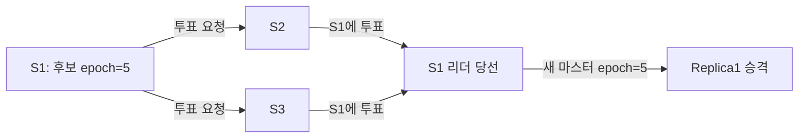
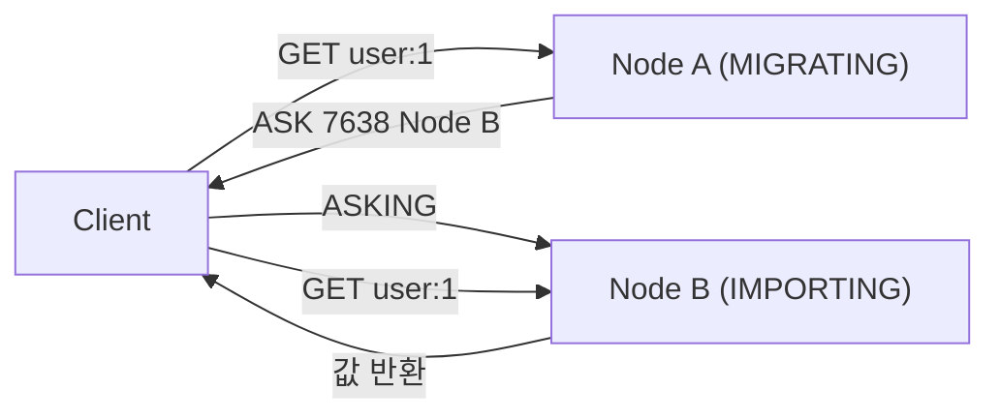
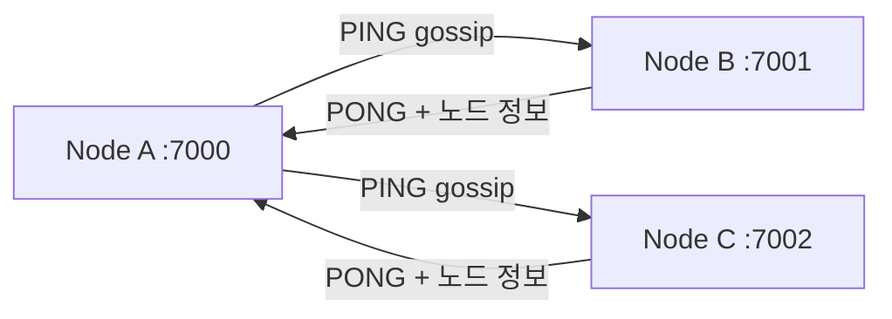
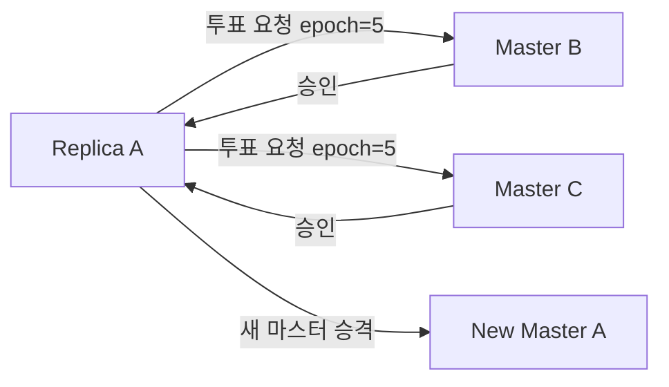
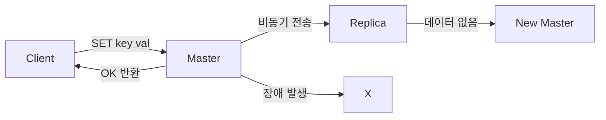
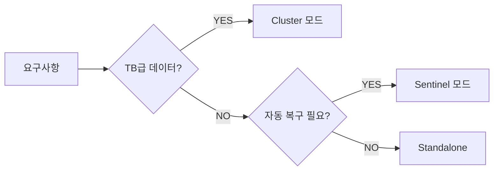

새벽 2시, 알림이 울린다. Redis 마스터 한 대가 죽었다. 레플리카는 살아있지만 자동 승격이 없다. 엔지니어가 일어나 접속해서 `REPLICAOF NO ONE`을 치고, 애플리케이션 설정을 바꾸고, 재배포한다. 복구까지 40분. 그 40분 동안 캐시가 없으니 DB에 쿼리가 쏟아지고, DB도 죽는다. 이 재앙을 막는 것이 Sentinel이고, 단일 마스터의 메모리 한계를 뚫는 것이 Cluster다. 둘 다 면접에서 "어떻게 동작하는가"를 묻는다. 표면적인 설명이 아니라 **내부 메커니즘을 설명할 수 있어야** 시니어 레벨로 인정받는다.

## 세 가지 배포 모드 — 언제 무엇을 쓰는가

> **비유**: Standalone은 혼자 일하는 자영업자다. 주인이 쓰러지면 가게가 닫힌다. Sentinel은 24시간 교대 경비원이 있는 구조다. 주인이 쓰러져도 경비원들이 투표해서 부점장을 세운다. Cluster는 전국 프랜차이즈다. 한 지점이 불타도 다른 지점이 돌아간다. 문제는 각각 운영 복잡도와 제약이 다르다는 것이다.

| 모드 | 자동 복구 | 수평 확장 | 최소 노드 | 적합 상황 |
|------|---------|---------|---------|---------|
| **Standalone** | 없음 (수동) | 불가 | 1 | 개발, 테스트 |
| **Sentinel** | 있음 (~30초) | 불가 (단일 마스터) | Sentinel 3 + Redis 2 이상 | 운영, GB~수백 GB |
| **Cluster** | 있음 (수십 초) | 가능 (마스터 추가) | 6 (마스터 3 + 레플리카 3) | 대규모, TB급, 고처리량 |

---

## 1. Sentinel 심층 분석

### 1-1. SDOWN vs ODOWN — 왜 두 단계로 나누는가

Sentinel은 마스터 장애를 판정할 때 두 단계를 거친다. 이 구분이 없으면 네트워크 일시 지연 하나로 불필요한 페일오버가 발생한다.

**SDOWN (Subjectively Down, 주관적 다운)**

단일 Sentinel이 마스터에 `down-after-milliseconds` 내에 응답을 받지 못한 상태다. "내 눈에만 죽어 보인다"는 의미다. 원인은 다양하다. 마스터 자체 장애일 수도 있고, 해당 Sentinel과 마스터 사이 네트워크 케이블이 잠깐 끊긴 것일 수도 있다. SDOWN만으로는 아무 액션도 취하지 않는다.

**ODOWN (Objectively Down, 객관적 다운)**

quorum 개 이상의 Sentinel이 마스터를 SDOWN으로 보고한 상태다. "객관적으로 죽었다"는 합의다. ODOWN이 선언되어야 비로소 페일오버 프로세스가 시작된다.



내부적으로 Sentinel들은 서로 `SENTINEL is-master-down-by-addr` 명령을 보내 다른 Sentinel의 판정을 수집한다. quorum 이상이 모이면 ODOWN을 선언하는 Sentinel이 페일오버 리더 선출 단계로 진입한다.

**왜 quorum을 Sentinel 수의 과반수로 설정해야 하는가**

Sentinel 3개에 quorum=1이면 단 1개 Sentinel이 네트워크 파티션으로 격리되어도 혼자 페일오버를 시작할 수 있다. quorum=2(과반수)로 설정해야 1개가 격리되어도 나머지 2개가 "마스터는 살아있다"고 판단해 페일오버를 막는다.

### 1-2. Sentinel 리더 선출 — Raft-like 알고리즘

ODOWN이 선언되면 어느 Sentinel이 페일오버를 실행할지 리더를 뽑아야 한다. Redis Sentinel은 Raft의 단순화 버전을 사용한다.

**선출 과정:**

1. ODOWN을 처음 선언한 Sentinel이 자신을 리더 후보로 내세우고 다른 Sentinel들에게 `SENTINEL is-master-down-by-addr` 명령으로 투표를 요청한다
2. 각 Sentinel은 해당 에포크(epoch)에서 아직 투표하지 않았으면 요청한 Sentinel에 투표한다. **선착순 1표**: 먼저 온 요청에 투표하면 같은 에포크에서 다른 후보에게는 투표할 수 없다
3. 과반수(Sentinel 전체 수의 절반 초과) 투표를 받은 Sentinel이 리더가 된다
4. 일정 시간 내에 리더가 선출되지 않으면 에포크를 올리고 재선출한다

**configuration epoch란?**

페일오버가 성공할 때마다 단조 증가하는 숫자다. 새 마스터로 승격된 레플리카가 이 epoch를 갖고 자신을 마스터라고 선전하면, 다른 노드들은 더 높은 epoch를 신뢰한다. 네트워크 파티션이 해소된 뒤 구 마스터가 돌아와도 더 낮은 epoch를 갖고 있으므로 자동으로 레플리카로 강등된다. **epoch가 스플릿 브레인 해소의 핵심 도구다.**



### 1-3. 레플리카 선택 기준 — 페일오버 시 누가 마스터가 되는가

리더 Sentinel은 다음 우선순위로 레플리카를 선택한다.

**1순위: replica-priority**
낮을수록 우선한다. 0이면 마스터 후보에서 영구 제외된다. 백업 전용 레플리카나 다른 데이터센터에 있는 레플리카를 후보에서 빼고 싶을 때 쓴다.

**2순위: replication offset**
마스터로부터 얼마나 많은 데이터를 복제했는지를 나타내는 바이트 오프셋이다. 가장 큰 offset을 가진 레플리카가 마스터 데이터와 가장 동기화되어 있으므로 데이터 유실이 가장 적다.

**3순위: Run ID**
두 레플리카의 priority와 offset이 동일하면 Run ID(UUID 형태)를 사전순 비교해 tie-break한다.

**왜 offset이 중요한가?** Redis 복제는 비동기다. 마스터가 쓰기를 수행하고 레플리카에 전달하는 사이에 마스터가 죽으면 그 차이만큼 데이터가 유실된다. offset이 가장 큰 레플리카를 승격하면 유실량을 최소화할 수 있다.

### 1-4. 스플릿 브레인 방지 — min-replicas-to-write

마스터와 레플리카들 사이 네트워크가 끊겼을 때, 마스터는 살아있지만 레플리카들은 연결이 안 된다. Sentinel은 레플리카가 없는 마스터를 보고 페일오버를 시작해 레플리카 중 하나를 새 마스터로 만든다. 이제 마스터가 두 개다.

```conf
# 마스터가 이 개수 이상의 레플리카에 연결되지 않으면 쓰기 거부
min-replicas-to-write 1
# 레플리카 응답 지연이 이 초를 넘으면 연결 불량으로 간주
min-replicas-max-lag 10
```

이 설정이 있으면 레플리카 연결이 끊긴 마스터는 쓰기를 거부한다. 클라이언트 입장에서는 일시 장애처럼 보이지만, 두 마스터에 동시 쓰기가 일어나는 스플릿 브레인보다 훨씬 낫다.

### 1-5. Sentinel 설정 파일 전체

```conf
# sentinel.conf
port 26379
daemonize yes
logfile /var/log/redis/sentinel.log

# 모니터링 대상: 이름, 마스터 IP, 마스터 포트, ODOWN quorum
# quorum=2: Sentinel 3개 중 2개 이상 동의해야 ODOWN
sentinel monitor mymaster 192.168.1.10 6379 2

# 이 시간(ms) 동안 응답 없으면 SDOWN
sentinel down-after-milliseconds mymaster 5000

# 페일오버 최대 허용 시간. 이 안에 완료 안 되면 실패 처리 후 재시도
sentinel failover-timeout mymaster 60000

# 페일오버 후 새 마스터에 동시 재동기화하는 레플리카 수
# 1로 설정: 레플리카 1개씩 순차 재동기화 → 나머지는 읽기 서비스 유지
sentinel parallel-syncs mymaster 1

# Redis 마스터 인증
sentinel auth-pass mymaster mySecretPassword

# Sentinel 자체 인증 (Sentinel 간 통신도 보호)
requirepass sentinelPassword

# Sentinel이 자신의 공인 IP를 알려야 할 때 (NAT 환경)
sentinel announce-ip 1.2.3.4
sentinel announce-port 26379
```

### 1-6. Spring Boot Sentinel 연결 — Lettuce 심층 설정

```yaml
# application.yml
spring:
  data:
    redis:
      sentinel:
        master: mymaster
        nodes:
          - 192.168.1.10:26379
          - 192.168.1.11:26379
          - 192.168.1.12:26379
        password: sentinelPassword     # Sentinel 자체 비밀번호
      password: mySecretPassword       # Redis 노드 비밀번호
      lettuce:
        pool:
          max-active: 20
          max-idle: 10
          min-idle: 5
          max-wait: 2000ms
```

```java
import io.lettuce.core.ReadFrom;
import org.springframework.context.annotation.Bean;
import org.springframework.context.annotation.Configuration;
import org.springframework.data.redis.connection.RedisConnectionFactory;
import org.springframework.data.redis.connection.lettuce.LettuceClientConfiguration;
import org.springframework.data.redis.connection.lettuce.LettuceConnectionFactory;
import org.springframework.data.redis.core.RedisTemplate;
import org.springframework.data.redis.serializer.GenericJackson2JsonRedisSerializer;
import org.springframework.data.redis.serializer.StringRedisSerializer;

import java.time.Duration;

@Configuration
public class RedisConfig {

    /**
     * ReadFrom.REPLICA_PREFERRED:
     * 읽기를 레플리카에서 수행한다. 레플리카가 없거나 모두 응답 불가 시 마스터에서 읽는다.
     * 페일오버 중에도 마스터에서 읽기가 가능하므로 가용성이 높다.
     *
     * 다른 옵션들:
     * - ReadFrom.MASTER: 항상 마스터 (강한 일관성 필요 시)
     * - ReadFrom.REPLICA: 레플리카만, 없으면 예외 (읽기 전용 워크로드)
     * - ReadFrom.NEAREST: 응답 지연이 가장 낮은 노드 (지리적 분산 환경)
     */
    @Bean
    public LettuceClientConfiguration lettuceClientConfiguration() {
        return LettuceClientConfiguration.builder()
            .readFrom(ReadFrom.REPLICA_PREFERRED)
            .commandTimeout(Duration.ofSeconds(2))
            // SSL 사용 시
            // .useSsl()
            build();
    }

    @Bean
    public RedisTemplate<String, Object> redisTemplate(RedisConnectionFactory connectionFactory) {
        RedisTemplate<String, Object> template = new RedisTemplate<>();
        template.setConnectionFactory(connectionFactory);
        // 키: String 직렬화
        template.setKeySerializer(new StringRedisSerializer());
        template.setHashKeySerializer(new StringRedisSerializer());
        // 값: JSON 직렬화 (타입 정보 포함)
        template.setValueSerializer(new GenericJackson2JsonRedisSerializer());
        template.setHashValueSerializer(new GenericJackson2JsonRedisSerializer());
        template.afterPropertiesSet();
        return template;
    }
}
```

**Lettuce가 Sentinel 페일오버를 처리하는 방법:**

Lettuce는 Sentinel에 지속 연결을 유지하면서 `CLIENT SETNAME`과 Pub/Sub을 통해 `+switch-master` 이벤트를 구독한다. 페일오버가 완료되면 Sentinel이 이 채널에 새 마스터 정보를 발행하고, Lettuce는 즉시 연결 풀을 새 마스터로 전환한다. 애플리케이션 재시작 없이 자동 전환된다.

---

## 2. Cluster 심층 분석

### 2-1. 해시 슬롯 — 왜 16384개인가

Redis Cluster는 전체 키 공간을 **16384개의 슬롯**으로 나눈다. 키의 슬롯은 다음 공식으로 결정된다.

```
slot = CRC16(key) % 16384
```

**왜 16384인가?** 65536(2^16)이 아닌 이유가 있다. Cluster 노드들은 gossip 메시지에 자신이 담당하는 슬롯 정보를 비트맵으로 담는다. 16384 슬롯은 2KB(16384 / 8 = 2048 bytes) 비트맵으로 표현된다. 65536이면 8KB가 된다. gossip 메시지를 작게 유지하면서 충분한 분산을 얻는 균형점이 16384다. 또한 1000개 마스터를 가정하면 노드당 평균 16개의 슬롯을 갖는데, 이 정도 세분화면 충분하다.

**슬롯 계산 예시:**

```java
// Lettuce가 내부적으로 사용하는 슬롯 계산 (동일 로직)
public class SlotCalculator {
    private static final int CLUSTER_HASHSLOTS = 16384;

    public static int calculateSlot(String key) {
        // 해시 태그 처리: {tag} 가 있으면 tag 부분만 해싱
        int start = key.indexOf('{');
        if (start >= 0) {
            int end = key.indexOf('}', start + 1);
            if (end > start + 1) {
                key = key.substring(start + 1, end);
            }
        }
        return crc16(key) % CLUSTER_HASHSLOTS;
    }

    // CRC16-CCITT (Redis가 사용하는 변형)
    private static int crc16(String key) {
        int crc = 0;
        for (byte b : key.getBytes()) {
            crc = ((crc << 8) ^ CRC16_TABLE[((crc >> 8) ^ b) & 0xFF]) & 0xFFFF;
        }
        return crc;
    }

    // ... CRC16_TABLE 생략
}
```

**3 마스터 기준 슬롯 분배:**

```
마스터 A: 슬롯 0 ~ 5460     (5461개)
마스터 B: 슬롯 5461 ~ 10922 (5462개)
마스터 C: 슬롯 10923 ~ 16383 (5461개)
```

### 2-2. MOVED vs ASK — 리다이렉션의 의미가 다르다

두 응답 모두 "다른 노드로 가라"는 뜻이지만 의미가 전혀 다르다.

**MOVED — 영구 리다이렉션**

해당 슬롯이 다른 노드로 이미 완전히 이전됐다. 클라이언트는 자신의 슬롯-노드 매핑 캐시를 갱신해야 한다.

```
-MOVED 7638 192.168.1.11:7001
```

Lettuce 같은 클러스터 인식 클라이언트는 이 응답을 받으면 자동으로 올바른 노드로 재요청하고, 내부 토폴로지 캐시를 갱신한다. 클라이언트가 클러스터 인식이 없으면 `MOVED` 에러가 그대로 노출된다.

**ASK — 임시 리다이렉션 (슬롯 마이그레이션 중)**

해당 슬롯이 지금 마이그레이션 중이다. 이번 요청만 저쪽으로 가되, 캐시는 갱신하지 마라.

```
-ASK 7638 192.168.1.11:7001
```

클라이언트는 대상 노드에 접속해 먼저 `ASKING` 명령을 보낸 뒤 실제 명령을 보내야 한다. `ASKING` 없이 바로 명령을 보내면 대상 노드가 `MOVED`로 다시 돌려보낸다.



**왜 ASK와 MOVED를 구분하는가?**

마이그레이션 중 슬롯의 일부 키는 소스 노드(MIGRATING)에 있고, 일부는 대상 노드(IMPORTING)에 있다. 소스 노드는 키를 찾지 못하면 ASK로 응답한다. 클라이언트가 ASK를 MOVED처럼 캐시를 갱신해버리면, 아직 소스에 남아있는 키들을 찾을 때 대상 노드를 먼저 보고 다시 리다이렉션을 받는 불필요한 왕복이 발생한다.

### 2-3. MIGRATING / IMPORTING 상태 — 슬롯 마이그레이션 내부

슬롯 마이그레이션은 다음 단계로 진행된다.

```bash
# 1. 대상 노드를 IMPORTING 상태로 설정 (source_id의 슬롯 7638을 받을 준비)
redis-cli -h node-b -p 7001 CLUSTER SETSLOT 7638 IMPORTING <source_node_id>

# 2. 소스 노드를 MIGRATING 상태로 설정
redis-cli -h node-a -p 7000 CLUSTER SETSLOT 7638 MIGRATING <target_node_id>

# 3. 소스 노드의 키들을 대상 노드로 이전
redis-cli -h node-a -p 7000 CLUSTER GETKEYSINSLOT 7638 100
# → 키 목록 반환
redis-cli -h node-a -p 7000 MIGRATE node-b 7001 "" 0 5000 KEYS key1 key2 key3 ...

# 4. 슬롯 소유권 변경 (모든 노드에 전파)
redis-cli -h node-b -p 7001 CLUSTER SETSLOT 7638 NODE <target_node_id>
redis-cli -h node-a -p 7000 CLUSTER SETSLOT 7638 NODE <target_node_id>
```

**MIGRATING 상태의 소스 노드 동작:**
- 슬롯에 해당하는 키를 찾으면 정상 응답
- 키를 찾지 못하면 `ASK`로 대상 노드를 안내 (이미 이전된 키일 수 있음)
- 새로운 쓰기는 거부하지 않음 (마이그레이션 중에도 쓰기 가능)

**IMPORTING 상태의 대상 노드 동작:**
- `ASKING` 명령 후 오는 요청만 수락
- `ASKING` 없이 오는 요청은 원래 소유자에게 `MOVED`로 돌려보냄

### 2-4. Gossip 프로토콜 — 클러스터가 상태를 공유하는 방법

Redis Cluster 노드들은 별도의 **클러스터 버스 포트**를 통해 gossip 메시지를 교환한다. 기본적으로 데이터 포트 + 10000이 클러스터 버스 포트다 (예: 7000 → 17000).



**PING / PONG 메시지가 담는 정보:**
- 보내는 노드의 현재 epoch
- 보내는 노드가 아는 다른 노드들의 상태 (랜덤 샘플)
- 슬롯 비트맵

**왜 gossip인가?** 중앙 코디네이터 없이 O(N) 메시지로 전체 클러스터 상태를 점진적으로 전파한다. 노드가 추가되거나 장애가 발생하면 gossip을 통해 수 초 내에 모든 노드가 새로운 상태를 알게 된다.

**PFAIL과 FAIL:**
- **PFAIL (Possible Failure)**: 한 노드가 `cluster-node-timeout` 내에 응답을 못 받으면 해당 노드를 PFAIL로 표시. Sentinel의 SDOWN에 해당.
- **FAIL**: 과반수(마스터 수의 절반 초과)가 PFAIL로 표시하면 FAIL로 전환. Sentinel의 ODOWN에 해당.

### 2-5. 클러스터 페일오버 — 노드들이 직접 투표한다

Sentinel과 달리 Cluster는 별도 감시 프로세스 없이 **레플리카가 직접 다른 마스터들에게 투표를 요청**한다.

**페일오버 과정:**

1. 마스터 A가 `cluster-node-timeout` 내에 응답하지 않으면 레플리카들이 PFAIL로 표시
2. 과반수 마스터가 동의하면 마스터 A가 FAIL로 전환
3. 마스터 A의 레플리카 중 하나가 페일오버를 시도. 자신의 replication offset를 다른 마스터들에게 알리며 투표 요청
4. 다른 마스터들은 해당 epoch에서 아직 투표하지 않았으면 투표 승인
5. 과반수 투표를 받은 레플리카가 새 마스터로 승격. configuration epoch를 올림
6. `UPDATE` 메시지를 gossip으로 전파하여 모든 노드가 새 토폴로지를 인식



**왜 과반수 마스터 투표가 필요한가?** 네트워크 파티션으로 레플리카가 마스터와 단절됐지만 마스터는 사실 살아있는 경우, 레플리카가 혼자 마스터로 승격하면 두 마스터가 생긴다. 과반수 마스터의 투표를 요구하면, 과반수 마스터들이 실제 마스터에 연결 가능한 상황에서는 레플리카에게 투표하지 않으므로 스플릿 브레인이 방지된다.

### 2-6. 클러스터 설정 파일

```conf
# redis-cluster.conf (각 노드)
port 7000
cluster-enabled yes
# 클러스터 상태 자동 저장 파일 (노드별로 다르게 설정)
cluster-config-file nodes-7000.conf
# 이 시간(ms) 응답 없으면 PFAIL
cluster-node-timeout 5000
# 일부 슬롯이 커버 안 돼도 나머지 슬롯은 서비스 유지
cluster-require-full-coverage no
# 레플리카가 구 마스터로부터 데이터를 못 받은 지 이 시간이 지나면 페일오버 후보 제외
cluster-replica-validity-factor 10
# 마스터당 마이그레이션 가능한 최소 레플리카 수
cluster-migration-barrier 1

# 성능/안정성
appendonly yes
appendfsync everysec
maxmemory 8gb
maxmemory-policy allkeys-lru

# 비동기 복제를 약간 더 신뢰성 있게
# 최소 1개 레플리카가 데이터를 받아야 쓰기 완료 (성능 저하 감수)
# min-replicas-to-write 1
# min-replicas-max-lag 10
```

### 2-7. 클러스터 생성 및 운영

```bash
# 6노드 클러스터 생성 (마스터 3 + 레플리카 3)
redis-cli --cluster create \
  192.168.1.10:7000 \
  192.168.1.11:7001 \
  192.168.1.12:7002 \
  192.168.1.10:7003 \
  192.168.1.11:7004 \
  192.168.1.12:7005 \
  --cluster-replicas 1

# 클러스터 상태 확인
redis-cli --cluster check 192.168.1.10:7000

# 새 마스터 노드 추가
redis-cli --cluster add-node 192.168.1.13:7006 192.168.1.10:7000

# 슬롯 재분배 (새 노드에 슬롯 이전)
redis-cli --cluster reshard 192.168.1.10:7000
# 대화형으로: 이동할 슬롯 수, 받을 노드 ID, 줄 노드 지정

# 새 마스터에 레플리카 추가
redis-cli --cluster add-node 192.168.1.13:7007 192.168.1.10:7000 \
  --cluster-slave --cluster-master-id <new_master_node_id>

# 노드 제거 (슬롯을 먼저 비워야 함)
redis-cli --cluster reshard 192.168.1.10:7000  # 슬롯을 다른 노드로 이전
redis-cli --cluster del-node 192.168.1.10:7000 <node_id>
```

---

## 3. 클라이언트 심층 분석 — Lettuce와 Spring Data Redis

### 3-1. Lettuce 토폴로지 갱신 — 왜 중요한가

Lettuce는 클러스터 토폴로지(어느 노드가 어느 슬롯을 담당하는지)를 내부 캐시로 유지한다. 페일오버나 리샤딩이 일어나면 캐시가 구식이 된다. 갱신이 안 되면 MOVED 리다이렉션이 계속 발생해 성능이 저하된다.

```yaml
spring:
  data:
    redis:
      cluster:
        nodes:
          - 192.168.1.10:7000
          - 192.168.1.11:7001
          - 192.168.1.12:7002
        max-redirects: 3
      lettuce:
        cluster:
          refresh:
            # adaptive: MOVED/ASK 응답 받을 때 즉시 갱신 트리거
            adaptive: true
            # 주기적 갱신 (adaptive와 병행 권장)
            period: 30s
        pool:
          max-active: 20
          max-idle: 10
          min-idle: 5
          max-wait: 2000ms
```

```java
import io.lettuce.core.cluster.ClusterClientOptions;
import io.lettuce.core.cluster.ClusterTopologyRefreshOptions;
import io.lettuce.core.cluster.api.StatefulRedisClusterConnection;
import org.springframework.boot.autoconfigure.data.redis.LettuceClientConfigurationBuilderCustomizer;
import org.springframework.context.annotation.Bean;
import org.springframework.context.annotation.Configuration;

import java.time.Duration;

@Configuration
public class LettuceClusterConfig {

    @Bean
    public LettuceClientConfigurationBuilderCustomizer lettuceCustomizer() {
        return builder -> {
            ClusterTopologyRefreshOptions refreshOptions =
                ClusterTopologyRefreshOptions.builder()
                    // MOVED, ASK 응답 시 즉시 토폴로지 갱신
                    .enableAdaptiveRefreshTrigger(
                        ClusterTopologyRefreshOptions.RefreshTrigger.MOVED_REDIRECT,
                        ClusterTopologyRefreshOptions.RefreshTrigger.ASK_REDIRECT,
                        ClusterTopologyRefreshOptions.RefreshTrigger.PERSISTENT_RECONNECTS
                    )
                    // 갱신 쿨다운: 너무 잦은 갱신 방지
                    .adaptiveRefreshTriggersTimeout(Duration.ofSeconds(30))
                    // 주기적 갱신
                    .enablePeriodicRefresh(Duration.ofSeconds(60))
                    .build();

            ClusterClientOptions clientOptions = ClusterClientOptions.builder()
                .topologyRefreshOptions(refreshOptions)
                // 연결 불가 노드를 자동으로 우회
                .autoReconnect(true)
                // 최대 리다이렉션 횟수
                .maxRedirects(3)
                .build();

            builder.clientOptions(clientOptions);
            builder.readFrom(ReadFrom.REPLICA_PREFERRED);
            builder.commandTimeout(Duration.ofSeconds(2));
        };
    }
}
```

### 3-2. ReadFrom 전략 — 읽기를 어디서 할 것인가

| 전략 | 동작 | 적합 상황 |
|------|------|---------|
| `MASTER` | 항상 마스터 | 강한 일관성 필요 (결제, 재고) |
| `MASTER_PREFERRED` | 마스터 우선, 불가 시 레플리카 | 거의 쓰지 않음 |
| `REPLICA` | 레플리카만, 없으면 예외 | 읽기 전용 분석 |
| `REPLICA_PREFERRED` | 레플리카 우선, 없으면 마스터 | 일반 캐시 읽기 (권장) |
| `NEAREST` | 응답 지연 최저 노드 | 멀티 AZ, 지역 분산 |
| `ANY` | 아무 노드 | 읽기 부하 최대 분산 |

```java
import io.lettuce.core.ReadFrom;
import org.springframework.data.redis.core.RedisTemplate;
import org.springframework.stereotype.Service;

@Service
public class UserCacheService {

    private final RedisTemplate<String, Object> redisTemplate;

    public UserCacheService(RedisTemplate<String, Object> redisTemplate) {
        this.redisTemplate = redisTemplate;
    }

    /**
     * 레플리카에서 읽기 (ReadFrom.REPLICA_PREFERRED 설정 시 자동 적용)
     * 레플리카는 비동기 복제이므로 최신 데이터가 아닐 수 있다
     * 수십 ms 지연이 허용되는 캐시 조회에 적합
     */
    public Object getUser(String userId) {
        String key = "user:" + userId;
        return redisTemplate.opsForValue().get(key);
    }

    /**
     * 결제/재고처럼 강한 일관성이 필요한 경우:
     * 별도 RedisTemplate을 MASTER ReadFrom으로 설정하거나
     * execute()로 마스터 연결을 명시적으로 사용
     */
    public Long getStockCount(String productId) {
        String key = "stock:" + productId;
        return redisTemplate.execute(connection -> {
            // 마스터에서 직접 읽기
            byte[] value = connection.get(key.getBytes());
            return value != null ? Long.parseLong(new String(value)) : 0L;
        }, true);  // exposeConnection=true
    }
}
```

### 3-3. 연결 풀 관리 — 올바른 크기 계산

```java
import org.apache.commons.pool2.impl.GenericObjectPoolConfig;
import org.springframework.data.redis.connection.lettuce.LettucePoolingClientConfiguration;

import java.time.Duration;

@Configuration
public class RedisPoolConfig {

    @Bean
    public LettucePoolingClientConfiguration lettucePoolingClientConfiguration() {
        GenericObjectPoolConfig<?> poolConfig = new GenericObjectPoolConfig<>();

        // 최대 활성 연결 수
        // 계산: 예상 최대 동시 Redis 작업 수
        // 예: 쓰레드 200개 중 평균 10%가 Redis 대기 → max-active=20
        poolConfig.setMaxTotal(20);

        // 유휴 연결 최대/최소
        poolConfig.setMaxIdle(10);
        poolConfig.setMinIdle(5);

        // 풀이 가득 찼을 때 대기 시간. 이 후에도 연결 못 받으면 예외
        poolConfig.setMaxWait(Duration.ofMillis(2000));

        // 유휴 연결 검증 (끊어진 연결 제거)
        poolConfig.setTestWhileIdle(true);
        poolConfig.setTimeBetweenEvictionRuns(Duration.ofSeconds(30));

        return LettucePoolingClientConfiguration.builder()
            .poolConfig(poolConfig)
            .commandTimeout(Duration.ofSeconds(2))
            .build();
    }
}
```

---

## 4. 데이터 일관성 — 쓰기 유실이 발생하는 이유

### 4-1. 비동기 복제의 구조적 한계

Redis 복제는 기본적으로 비동기다. 마스터가 쓰기를 완료하고 클라이언트에 OK를 반환한 뒤, 레플리카에 변경 내용을 전송한다. 그 사이 마스터가 죽으면 그 쓰기는 영구히 유실된다.



이것은 Redis의 설계 선택이다. 동기 복제를 강제하면 레플리카 지연이 마스터 성능에 직접 영향을 미친다. Redis는 이 트레이드오프에서 성능 쪽을 선택했다.

### 4-2. WAIT 명령 — 동기 복제의 근사값

```java
import org.springframework.data.redis.core.RedisCallback;
import org.springframework.data.redis.core.RedisTemplate;
import org.springframework.stereotype.Service;

@Service
public class DurableWriteService {

    private final RedisTemplate<String, Object> redisTemplate;

    public DurableWriteService(RedisTemplate<String, Object> redisTemplate) {
        this.redisTemplate = redisTemplate;
    }

    /**
     * WAIT numreplicas timeout
     * 쓰기 후 적어도 numreplicas개의 레플리카가 데이터를 받았음을 확인할 때까지 블로킹
     * timeout(ms) 안에 충족 안 되면 현재까지 복제 완료한 레플리카 수 반환
     *
     * 왜 "보장이 아니라 근사값"인가?
     * WAIT는 레플리카가 데이터를 받았음을 확인하지만,
     * WAIT 응답 반환 직후 마스터와 레플리카가 동시에 죽으면 여전히 유실 가능하다.
     * 또한 페일오버 시 WAIT로 확인한 레플리카가 아닌 다른 레플리카가 승격될 수 있다.
     */
    public void writeWithWait(String key, String value, int requiredReplicas) {
        redisTemplate.opsForValue().set(key, value);

        Long replicasAcked = redisTemplate.execute(
            (RedisCallback<Long>) connection ->
                connection.serverCommands().waitForReplication(requiredReplicas, 1000L)
        );

        if (replicasAcked == null || replicasAcked < requiredReplicas) {
            // 요청한 레플리카 수만큼 복제 확인 실패
            // 애플리케이션 레벨에서 재시도 또는 경고 처리
            throw new ReplicationInsufficientException(
                "Required " + requiredReplicas + " replicas, but only " + replicasAcked + " acked"
            );
        }
    }
}
```

**WAIT가 도움이 되는 이유:**
페일오버 시 가장 최신 offset을 가진 레플리카가 선택된다. WAIT로 복제를 확인한 경우, 그 레플리카가 최신 offset을 가질 가능성이 높아지므로 데이터 유실 위험이 줄어든다. 완전한 보장은 아니지만 실질적인 개선이다.

**WAIT가 도움이 안 되는 극한 케이스:**
WAIT 응답 후 10ms 이내에 마스터와 모든 레플리카의 네트워크가 동시에 단절되면, Sentinel은 WAIT를 받은 레플리카가 아닌 다른 레플리카를 승격할 수 있다.

### 4-3. 최종 일관성 모델

Redis Cluster/Sentinel은 **최종 일관성(eventual consistency)** 모델이다. 정상 상태에서 레플리카는 마스터를 수 ms 단위로 따라간다. 하지만 페일오버 중에는 일시적으로 구 마스터에서 쓴 데이터를 새 마스터에서 읽지 못할 수 있다.

```java
import org.springframework.cache.annotation.CacheEvict;
import org.springframework.cache.annotation.Cacheable;
import org.springframework.stereotype.Service;

@Service
public class EventualConsistencyAwareService {

    private final RedisTemplate<String, Object> redisTemplate;

    /**
     * 캐시 읽기가 레플리카에서 이루어지는 경우, 최신 쓰기가 반영 안 됐을 수 있다.
     * 이 서비스는 이를 인지하고 설계됨:
     * - 사용자 프로필 등 수십 ms 지연 허용 → REPLICA_PREFERRED
     * - 잔액 등 강한 일관성 필요 → MASTER ReadFrom 또는 DB 직접 조회
     */
    public Object getUserProfile(String userId) {
        String key = "profile:" + userId;
        Object cached = redisTemplate.opsForValue().get(key);
        if (cached != null) {
            return cached;  // 레플리카에서 읽혀 수십 ms 구식일 수 있음 — 허용
        }
        // 캐시 미스 시 DB에서 조회 후 캐시에 쓰기
        Object fromDb = fetchFromDatabase(userId);
        redisTemplate.opsForValue().set(key, fromDb,
            java.time.Duration.ofMinutes(30));
        return fromDb;
    }

    /**
     * 재고 차감 같은 경우: 낙관적 잠금 or Lua 스크립트로 원자성 보장
     */
    public boolean decrementStock(String productId, int quantity) {
        String key = "stock:" + productId;
        // Lua 스크립트로 check-and-decrement 원자적 실행
        String luaScript =
            "local stock = tonumber(redis.call('GET', KEYS[1])) " +
            "if stock == nil or stock < tonumber(ARGV[1]) then " +
            "  return 0 " +
            "end " +
            "redis.call('DECRBY', KEYS[1], ARGV[1]) " +
            "return 1";

        Long result = redisTemplate.execute(
            new org.springframework.data.redis.core.script.DefaultRedisScript<>(
                luaScript, Long.class),
            java.util.List.of(key),
            String.valueOf(quantity)
        );
        return Long.valueOf(1L).equals(result);
    }

    private Object fetchFromDatabase(String userId) {
        // DB 조회 로직
        return new Object();
    }
}
```

---

## 5. Multi-key 명령어 제약과 해시 태그

### 5-1. 왜 클러스터에서 Multi-key가 안 되는가

`MSET key1 val1 key2 val2`는 단일 명령으로 두 키를 쓴다. 클러스터에서 key1이 슬롯 1000(Node A)에 있고, key2가 슬롯 8000(Node B)에 있으면, 어느 노드에 이 명령을 보낼 것인가? 분산 트랜잭션 없이 두 노드에 원자적으로 쓰기가 불가능하므로 Redis는 이를 에러로 처리한다.

```java
// 클러스터에서 CROSSSLOT 에러 발생 예시
redisTemplate.opsForValue().multiSet(Map.of(
    "user:1:name", "김철수",   // CRC16("user:1:name") % 16384 = ?
    "user:2:name", "이영희"    // CRC16("user:2:name") % 16384 = ? (다를 수 있음)
));
// → org.springframework.data.redis.ClusterRedirectException: CROSSSLOT
```

### 5-2. 해시 태그로 해결

```java
import org.springframework.data.redis.core.RedisTemplate;
import org.springframework.stereotype.Component;

import java.time.Duration;
import java.util.Map;

@Component
public class UserCacheRepository {

    private final RedisTemplate<String, Object> redisTemplate;

    public UserCacheRepository(RedisTemplate<String, Object> redisTemplate) {
        this.redisTemplate = redisTemplate;
    }

    /**
     * 해시 태그 {userId}로 user 관련 키들을 같은 슬롯에 묶는다.
     * CRC16은 {} 안의 내용만 해싱하므로
     * {user:1}:name, {user:1}:email, {user:1}:session 모두 같은 슬롯
     */
    public void saveUserData(String userId, String name, String email) {
        String nameKey    = "{user:" + userId + "}:name";
        String emailKey   = "{user:" + userId + "}:email";
        String sessionKey = "{user:" + userId + "}:session";

        // 같은 슬롯이므로 MSET 가능
        redisTemplate.opsForValue().multiSet(Map.of(
            nameKey, name,
            emailKey, email
        ));

        // Pipeline으로 묶으면 네트워크 왕복 줄임
        redisTemplate.executePipelined((org.springframework.data.redis.core.RedisCallback<?>) conn -> {
            conn.set(nameKey.getBytes(), name.getBytes());
            conn.set(emailKey.getBytes(), email.getBytes());
            conn.expire(nameKey.getBytes(), 3600);
            conn.expire(emailKey.getBytes(), 3600);
            return null;
        });
    }

    /**
     * 해시 태그 남용의 함정: 모든 사용자를 같은 태그로 묶으면 안 된다
     * 잘못된 예: {all_users}:user:1, {all_users}:user:2 → 모두 같은 슬롯 → 핫 슬롯
     * 올바른 예: {user:1}:*, {user:2}:* → 사용자별로 다른 슬롯 → 균등 분산
     */
}
```

### 5-3. 클러스터에서 제한되는 명령어

| 명령어 | 제약 조건 | 해결 방법 |
|--------|---------|---------|
| `MSET`, `MGET` | 모든 키 같은 슬롯 | 해시 태그 |
| `SUNION`, `SINTER`, `SDIFF` | 모든 키 같은 슬롯 | 해시 태그 |
| `ZUNIONSTORE`, `ZINTERSTORE` | 모든 키 같은 슬롯 | 해시 태그 |
| `EVAL`, `EVALSHA` | KEYS[] 내 모든 키 같은 슬롯 | 해시 태그 |
| `KEYS *` | 현재 노드만 반환 | 전 노드에 SCAN 실행 |
| `FLUSHDB` | 현재 노드만 초기화 | 전 노드에 실행 |
| `OBJECT ENCODING` | 슬롯 확인 후 라우팅 | 자동 처리 (클러스터 클라이언트) |

```java
// 클러스터 전체 키 스캔 (KEYS * 대신)
import io.lettuce.core.cluster.api.StatefulRedisClusterConnection;

@Service
public class ClusterScanService {

    private final StatefulRedisClusterConnection<String, String> clusterConnection;

    public List<String> scanAllKeys(String pattern) {
        List<String> allKeys = new ArrayList<>();

        // 각 마스터 노드에서 SCAN 실행
        clusterConnection.sync().masters().commands()
            .forEach(nodeCommands -> {
                io.lettuce.core.ScanIterator<String> iterator =
                    io.lettuce.core.ScanIterator.scan(
                        nodeCommands,
                        io.lettuce.core.ScanArgs.Builder.match(pattern).limit(1000)
                    );
                iterator.forEachRemaining(allKeys::add);
            });

        return allKeys;
    }
}
```

---

## 6. 핫 슬롯 문제와 해결

### 6-1. 핫 슬롯이 발생하는 이유

해시 태그를 과도하게 사용하면 많은 키가 동일 슬롯에 몰린다. 클러스터가 있어도 단일 노드 병목이 된다.

```java
// 잘못된 패턴: 이벤트 시즌 전체를 하나의 태그로
String key = "event:{season2024}:user:" + userId;
// season2024와 관련된 모든 키가 같은 슬롯 → 이벤트 트래픽 폭발 시 단일 노드 100%

// 올바른 패턴: 버킷으로 분산
int bucket = (int)(userId % 32);  // 32개 버킷으로 슬롯 분산
String key = "event:{season2024_" + bucket + "}:user:" + userId;
// 버킷 0~31이 서로 다른 슬롯에 배치되어 트래픽이 분산됨

// 집계가 필요한 경우: 버킷별로 수집 후 합산
@Service
public class EventCountService {

    private final RedisTemplate<String, Object> redisTemplate;
    private static final int BUCKET_COUNT = 32;

    public void incrementUserEventCount(long userId) {
        int bucket = (int)(userId % BUCKET_COUNT);
        String key = "event:{season2024_" + bucket + "}:count";
        redisTemplate.opsForValue().increment(key);
    }

    public long getTotalEventCount() {
        return java.util.stream.IntStream.range(0, BUCKET_COUNT)
            .mapToLong(bucket -> {
                String key = "event:{season2024_" + bucket + "}:count";
                Object val = redisTemplate.opsForValue().get(key);
                return val != null ? Long.parseLong(val.toString()) : 0L;
            })
            .sum();
    }
}
```

---

## 7. 모드 선택 가이드



| 구성 | 적합 상황 | 피해야 할 상황 |
|------|----------|--------------|
| **Standalone** | 개발/테스트, 장애 허용 가능 | 운영 환경, 데이터 손실 불허 |
| **Sentinel** | 자동 HA 필요, 단일 마스터로 충분 | 수평 확장 필요, TB급 데이터 |
| **Cluster** | 수평 확장 필요, 높은 쓰기 처리량 | Multi-key 명령어 의존도 높음, 운영 인력 부족 |

---

## 8. 면접 포인트 5개

### Q1. SDOWN과 ODOWN의 차이, 그리고 왜 두 단계가 필요한가?

**답변:**

SDOWN(Subjectively Down)은 단일 Sentinel의 주관적 판단이다. 하나의 Sentinel이 마스터로부터 `down-after-milliseconds` 이내에 응답을 받지 못하면 SDOWN으로 표시한다. 네트워크 일시 지연이나 해당 Sentinel의 자체 문제일 수 있으므로 SDOWN만으로는 아무 액션도 없다.

ODOWN(Objectively Down)은 quorum 이상의 Sentinel이 SDOWN을 보고했을 때 선언된다. Sentinel들이 서로 `SENTINEL is-master-down-by-addr`로 판정을 교환한 뒤, quorum 조건이 충족되면 ODOWN을 선언한 Sentinel이 페일오버 리더 선출로 진입한다.

**왜 두 단계인가?** 단일 네트워크 링크 장애로 한 Sentinel만 마스터를 못 보는 경우, 그 Sentinel의 판단만으로 페일오버를 실행하면 불필요한 다운타임과 데이터 유실이 발생한다. 과반수 합의를 요구해 오탐을 방지하는 것이 핵심이다.

### Q2. 클러스터 페일오버 시 왜 과반수 마스터 투표가 필요한가?

**답변:**

레플리카가 마스터와 단절됐을 때, 그 마스터가 실제로 죽은 것인지 단순 네트워크 파티션인지를 레플리카 혼자 알 수 없다. 만약 레플리카가 혼자 마스터로 승격하면, 실제로는 살아있는 구 마스터와 새 마스터가 동시에 존재하는 스플릿 브레인 상태가 된다. 양쪽에 쓰기가 일어나면 데이터 충돌이 발생한다.

과반수 마스터의 투표를 요구하면, 구 마스터가 여전히 살아있는 경우 과반수 마스터들은 구 마스터와 연결이 되어있으므로 레플리카의 투표 요청에 응하지 않는다. 즉 과반수 동의 없이는 승격이 불가능하므로 스플릿 브레인이 방지된다. 또한 configuration epoch를 올린 새 마스터가 gossip으로 전파되면, 구 마스터가 살아돌아와도 낮은 epoch를 가지므로 자동으로 레플리카로 강등된다.

### Q3. MOVED와 ASK 리다이렉션의 차이는?

**답변:**

MOVED는 **영구 이전**을 의미한다. 해당 슬롯이 완전히 다른 노드로 이전됐으므로, 클라이언트는 자신의 슬롯-노드 매핑 캐시를 갱신하고 앞으로 해당 슬롯에 대한 모든 요청을 새 노드로 보내야 한다.

ASK는 **임시 안내**다. 슬롯이 마이그레이션 중이다. 이 키는 지금 대상 노드에 있을 수 있으니 이번 한 번만 그쪽으로 가보라는 뜻이다. 캐시를 갱신하면 안 된다. 아직 소스 노드에 남아있는 다른 키들은 여전히 소스 노드에 요청해야 하기 때문이다. 또한 대상 노드에 접속할 때는 먼저 `ASKING` 명령을 보내야 대상 노드가 해당 요청을 수락한다.

내부적으로 소스 노드는 MIGRATING 상태이고 대상 노드는 IMPORTING 상태다. 소스 노드는 키를 찾으면 정상 응답, 못 찾으면 ASK를 반환한다. 대상 노드는 ASKING 플래그가 있는 요청만 수락한다. 이 구조가 무중단 슬롯 마이그레이션을 가능하게 한다.

### Q4. Sentinel 리더 선출에서 configuration epoch는 어떤 역할을 하는가?

**답변:**

configuration epoch는 단조 증가하는 숫자로, 페일오버가 성공할 때마다 1씩 올라간다. 이것이 없으면 구 마스터가 네트워크 복구 후 돌아왔을 때 자신이 아직 마스터라고 주장할 수 있다.

페일오버 시 새 마스터로 승격된 레플리카는 증가된 epoch를 갖는다. 이 epoch를 gossip으로 전파하면 다른 노드들은 더 높은 epoch를 가진 노드를 마스터로 신뢰한다. 구 마스터가 복구되면 더 낮은 epoch를 갖고 있으므로, 다른 노드들로부터 새 마스터가 있다는 gossip을 받고 자동으로 레플리카로 강등된다.

또한 리더 선출 과정에서 각 Sentinel은 하나의 epoch에서 한 번만 투표할 수 있다. 선착순 투표 + epoch 단위 단일 투표 규칙이 분산 합의의 안전성을 보장한다. 네트워크 파티션으로 여러 Sentinel이 동시에 리더 후보가 되어도, 하나만 과반수 투표를 받을 수 있다.

### Q5. WAIT 명령이 데이터 유실을 완전히 막을 수 없는 이유는?

**답변:**

`WAIT numreplicas timeout`은 지정한 수의 레플리카가 최신 쓰기 데이터를 받았음을 확인할 때까지 블로킹한다. 이것이 "동기 복제에 가까운" 동작을 제공하지만 완전한 보장이 아닌 이유가 있다.

첫째, WAIT가 성공한 직후(수 ms 이내)에 마스터와 해당 레플리카가 동시에 죽으면 그 쓰기는 유실된다. WAIT는 확인 시점에만 유효하다.

둘째, Sentinel/Cluster 페일오버 시 어떤 레플리카가 새 마스터로 선택될지는 replica-priority와 replication offset에 의해 결정된다. WAIT로 확인한 레플리카가 아닌 다른 레플리카가 승격될 수 있다. 예를 들어 WAIT로 확인한 레플리카가 replica-priority가 높아 페일오버 우선순위가 낮으면, offset이 작은 다른 레플리카가 먼저 승격될 수 있다.

셋째, 네트워크 파티션 상황에서 WAIT가 timeout으로 실패해도 쓰기 자체는 마스터에서 완료된 상태다. 이후 마스터가 죽으면 레플리카에 전달되지 않은 쓰기가 유실된다.

Redis에서 완전한 쓰기 보장이 필요하면 아키텍처 레벨에서 DB와 Redis를 함께 쓰거나, Redis를 주 저장소가 아닌 캐시로만 사용해야 한다.

---

## 9. 극한 시나리오

### 시나리오 1: 네트워크 파티션으로 마스터가 두 개가 되는 순간

**상황:** Sentinel 3개, 마스터 1개, 레플리카 2개 구성. 네트워크 스위치 장애로 마스터와 Sentinel 1개가 나머지와 격리됐다.

```
[파티션 A] 마스터 + Sentinel 1
[파티션 B] 레플리카 1 + 레플리카 2 + Sentinel 2 + Sentinel 3
```

파티션 B에서: Sentinel 2, 3이 마스터를 SDOWN → quorum=2 충족 → ODOWN → 페일오버 → 레플리카 1이 새 마스터로 승격.

파티션 A에서: 마스터는 살아서 계속 쓰기를 받는다. Sentinel 1도 마스터가 살아있다고 판단.

**결과:** 마스터가 두 개. 두 파티션에 동시 쓰기 발생. 파티션 A의 클라이언트는 구 마스터에 쓰고, 파티션 B의 클라이언트는 새 마스터에 쓴다.

**파티션 해소 후:** 구 마스터가 파티션 B와 다시 연결되면 새 마스터의 더 높은 configuration epoch에 의해 레플리카로 강등된다. **파티션 A에서 쓰여진 데이터는 영구 유실된다.**

**방어 설정:**

```conf
# 마스터 설정
# 레플리카 연결이 1개도 없고 10초가 지나면 쓰기 거부
min-replicas-to-write 1
min-replicas-max-lag 10
```

이 설정으로 파티션 A의 마스터는 레플리카 연결이 끊기고 10초 후 쓰기를 거부한다. 데이터 유실 창이 10초로 제한된다.

```java
// 애플리케이션 레벨 방어: 쓰기 실패 시 재시도 with exponential backoff
@Service
public class ResilientRedisWriter {

    private final RedisTemplate<String, Object> redisTemplate;

    public void safeWrite(String key, Object value) {
        int maxRetries = 3;
        for (int attempt = 0; attempt < maxRetries; attempt++) {
            try {
                redisTemplate.opsForValue().set(key, value,
                    Duration.ofMinutes(30));
                return;
            } catch (Exception e) {
                if (attempt == maxRetries - 1) {
                    // 최종 실패 시 DB에 직접 쓰기 또는 큐에 넣기
                    fallbackToDatabaseWrite(key, value);
                    return;
                }
                try {
                    Thread.sleep((long) Math.pow(2, attempt) * 100);
                } catch (InterruptedException ie) {
                    Thread.currentThread().interrupt();
                    throw new RuntimeException(ie);
                }
            }
        }
    }

    private void fallbackToDatabaseWrite(String key, Object value) {
        // DB fallback 로직
    }
}
```

### 시나리오 2: 리샤딩 중 클라이언트가 ASK를 처리 못할 때

**상황:** 클러스터 리샤딩 중 슬롯 7638이 Node A에서 Node B로 마이그레이션 중이다. 구형 클라이언트(클러스터 인식 없음)가 이 슬롯의 키를 요청한다.

```
클라이언트 → Node A: GET user:5000
Node A (MIGRATING): -ASK 7638 Node B
클라이언트: "ASK? 모르는 응답이네, 에러 반환"
```

클러스터 인식 클라이언트(Lettuce)는 ASK를 받으면 자동으로 Node B에 ASKING + 원래 명령을 보낸다. 구형 클라이언트는 에러를 앱에 그대로 전파한다.

**Lettuce의 내부 처리:**

```java
// Lettuce ClusterCommandHandler 내부 (의사 코드)
if (response instanceof RedisException) {
    String message = response.getMessage();
    if (message.startsWith("ASK")) {
        // 대상 노드 파싱
        String targetNode = parseTargetNode(message);
        // 대상 노드에 ASKING 후 재요청
        connection.send(ASKING);
        connection.send(originalCommand);
        // 슬롯 캐시는 갱신하지 않음
    } else if (message.startsWith("MOVED")) {
        // 토폴로지 캐시 갱신
        updateTopologyCache(message);
        // 새 노드에 재요청
        retryOnNewNode(originalCommand, parseTargetNode(message));
    }
}
```

**실무 함정:** `spring.data.redis.cluster.max-redirects`를 너무 낮게 설정하면 리샤딩 중 일시적으로 요청 실패율이 올라간다. 기본값 5 또는 그 이상을 권장한다.

### 시나리오 3: cluster-node-timeout이 너무 짧을 때 연쇄 페일오버

**상황:** `cluster-node-timeout=1000ms`(1초)로 설정된 클러스터에서 GC Stop-the-World가 2초 발생했다.

GC STW 동안 노드가 응답을 못한다. 1초 타임아웃으로 인접 노드들이 PFAIL로 표시한다. 과반수 동의가 모이면 FAIL로 전환하고 레플리카가 페일오버를 시작한다. GC가 끝나 마스터가 돌아오면 이미 레플리카가 새 마스터로 승격됐다. 구 마스터는 레플리카로 강등되고 재동기화가 시작된다.

GC가 200ms였다면 아무 일도 없었을 것이다. `cluster-node-timeout=1000ms`가 GC 시간보다 짧아 불필요한 페일오버가 발생했다.

```conf
# GC가 길 수 있는 Java 환경에서는 넉넉하게 설정
cluster-node-timeout 15000  # 15초

# JVM 튜닝으로 GC 시간 줄이기 (G1GC 기준)
# -XX:MaxGCPauseMillis=200
# -XX:G1HeapRegionSize=16m
```

```java
// Lettuce command timeout도 cluster-node-timeout보다 짧게 설정해야
// Lettuce가 timeout 전에 연결을 끊고 재시도하지 않도록
LettuceClientConfiguration.builder()
    .commandTimeout(Duration.ofSeconds(5))  // cluster-node-timeout(15s)보다 짧게
    .build();
```

### 시나리오 4: 핫 슬롯 + 리샤딩으로 해결 불가능한 이유

**상황:** 이벤트로 `{event}:leaderboard` 키에 초당 50만 요청이 집중된다. 클러스터에 노드를 추가하고 리샤딩해봤지만 해당 슬롯은 여전히 한 노드에 있어 성능이 개선되지 않는다.

**왜 리샤딩으로 해결 안 되는가?** 슬롯은 하나의 마스터에만 속한다. 리샤딩은 슬롯을 다른 마스터로 이전하는 것이지, 하나의 슬롯을 여러 마스터가 나눠 처리하게 만드는 것이 아니다.

**올바른 해결:**

```java
@Service
public class LeaderboardService {

    private final RedisTemplate<String, Object> redisTemplate;
    private static final int SHARD_COUNT = 16;

    /**
     * 리더보드를 N개 샤드로 분산
     * {event:leaderboard:0} ~ {event:leaderboard:15} → 각각 다른 슬롯
     */
    public void addScore(String userId, long score) {
        int shard = (int)(userId.hashCode() % SHARD_COUNT + SHARD_COUNT) % SHARD_COUNT;
        String key = "{event:leaderboard:" + shard + "}";
        redisTemplate.opsForZSet().add(key, userId, score);
    }

    /**
     * 전체 리더보드 집계: 각 샤드에서 상위 N개를 가져와 병합
     */
    public List<String> getTopUsers(int topN) {
        return java.util.stream.IntStream.range(0, SHARD_COUNT)
            .parallel()
            .mapToObj(shard -> {
                String key = "{event:leaderboard:" + shard + "}";
                return redisTemplate.opsForZSet()
                    .reverseRange(key, 0, topN - 1);
            })
            .filter(set -> set != null)
            .flatMap(java.util.Set::stream)
            .distinct()
            .sorted((a, b) -> {
                // 각 유저의 샤드 점수로 정렬 (실제 구현에서는 점수도 함께 조회)
                return 0; // 간략화
            })
            .limit(topN)
            .collect(java.util.stream.Collectors.toList());
    }
}
```

---

## 10. 운영 주의사항 요약

**Sentinel 운영:**

1. Sentinel은 반드시 홀수 개(3, 5, 7)로, 서로 다른 물리 서버에 배포한다. 짝수 구성은 스플릿 브레인의 씨앗이다.
2. `min-replicas-to-write 1`로 레플리카 연결 없는 마스터 쓰기를 막는다.
3. 클라이언트는 Sentinel 주소로 연결하고 현재 마스터 주소를 Sentinel에서 조회한다. 마스터 IP를 하드코딩하면 페일오버 후 연결이 끊긴다.
4. 페일오버 후 구 마스터가 돌아오면 자동으로 레플리카로 편입된다. 수동 개입 불필요.

**Cluster 운영:**

1. 노드 추가 후 `reshard`로 슬롯을 반드시 재분배한다. 슬롯 없는 노드는 트래픽을 받지 못한다.
2. `cluster-require-full-coverage no`로 부분 장애가 전체 장애로 확대되는 것을 막는다.
3. `KEYS *`는 현재 노드만 스캔한다. 전체 클러스터 스캔에는 모든 노드에 `SCAN`을 실행한다.
4. 각 마스터에 최소 1개 레플리카를 유지한다. 레플리카 없는 마스터가 죽으면 해당 슬롯은 수동 복구가 필요하다.
5. `cluster-node-timeout`은 JVM GC pause 시간보다 충분히 길게 설정한다.

---

## 11. 핵심 메트릭

| 메트릭 | 정상 | 이상 신호 | 원인 |
|--------|------|---------|------|
| `cluster_state` | ok | fail | 마스터+레플리카 동시 장애, 슬롯 미커버 |
| Sentinel ODOWN 빈도 | 0 | 증가 | `down-after-milliseconds` 너무 짧음 |
| 페일오버 소요 시간 | 30초 이내 | 60초 초과 | quorum 미충족, 네트워크 지연 |
| MOVED 리다이렉션 비율 | 0% | 증가 | 리샤딩 후 클라이언트 캐시 미갱신 |
| ASK 리다이렉션 비율 | 0% | 지속 발생 | 슬롯 마이그레이션 완료 안 됨 |
| replication lag | < 10ms | > 100ms | 네트워크 포화, 레플리카 과부하 |
| 슬롯 커버리지 | 100% | < 100% | 마스터 장애 후 레플리카 승격 실패 |
| 핫 슬롯 QPS 집중도 | 균등 | 단일 슬롯 80%+ | 해시 태그 과도 사용 |

---

## 요약

Redis 고가용성의 핵심은 **합의**다. Sentinel은 ODOWN 판정과 리더 선출 모두 quorum 기반 합의로 불필요한 페일오버와 스플릿 브레인을 방지한다. Cluster는 레플리카가 과반수 마스터 투표를 받아야 승격할 수 있어 동일한 원리를 다른 메커니즘으로 구현한다. configuration epoch는 그 합의 결과를 전파하고 구 노드를 강등시키는 도구다.

비동기 복제는 성능과 일관성의 트레이드오프다. WAIT 명령은 이 간극을 좁히지만 완전히 메우지는 않는다. 애플리케이션이 Redis에 쓰는 데이터의 유실 허용 여부를 먼저 정의하고, 그에 맞는 구성과 WAIT 사용 여부를 결정해야 한다. 캐시 용도라면 유실이 허용되므로 기본 비동기 복제로 충분하다. 세션이나 카운터처럼 유실이 문제가 되면 `min-replicas-to-write`와 WAIT를 조합하거나, 주 저장소를 DB로 유지하고 Redis를 캐시로만 사용하는 설계를 선택해야 한다.
